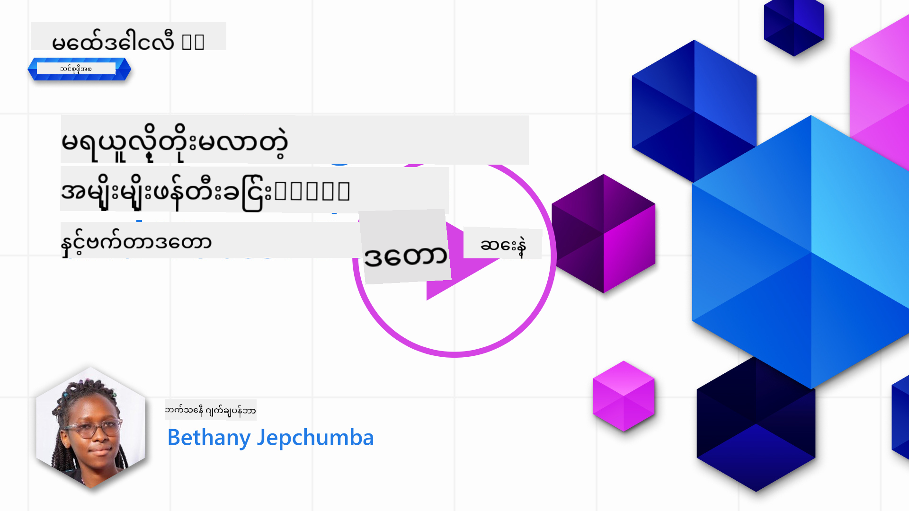
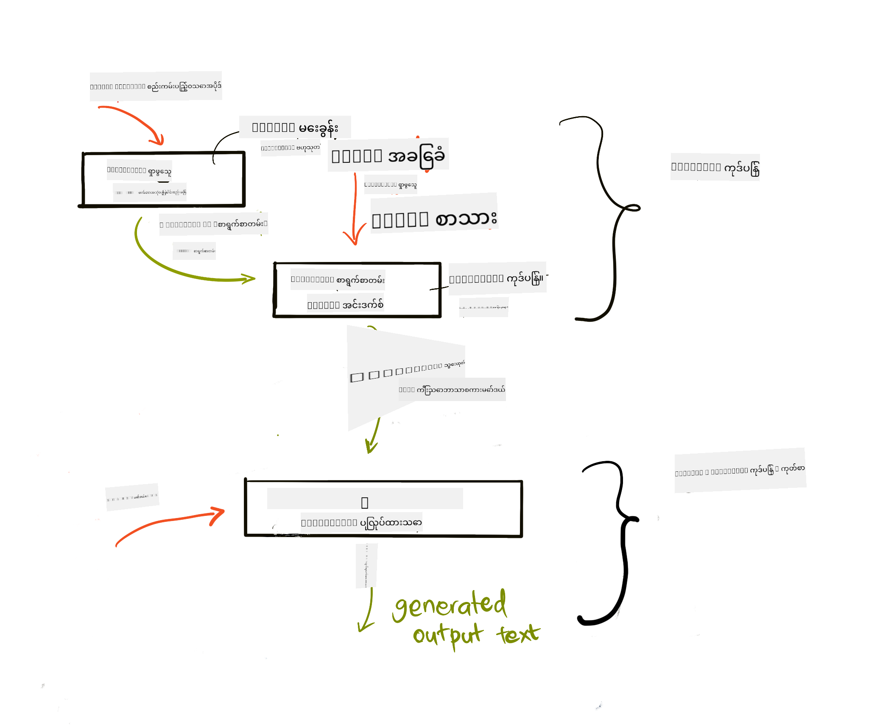
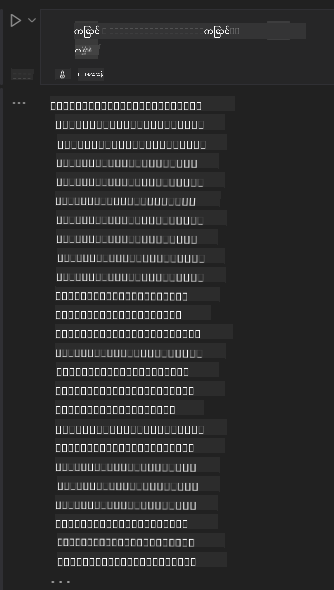

<!--
CO_OP_TRANSLATOR_METADATA:
{
  "original_hash": "e2861bbca91c0567ef32bc77fe054f9e",
  "translation_date": "2025-06-25T22:50:25+00:00",
  "source_file": "15-rag-and-vector-databases/README.md",
  "language_code": "my"
}
-->
# Retrieval Augmented Generation (RAG) နှင့် ဗက်တာဒေတာဘေ့စ်များ

[](https://aka.ms/gen-ai-lesson15-gh?WT.mc_id=academic-105485-koreyst)

ရှာဖွေမှုလျှောက်လွှာသင်ခန်းစာတွင် သင်၏ကိုယ်ပိုင်ဒေတာကို များစွာသောဘာသာစကားမော်ဒယ် (LLMs) တွင် ပေါင်းစပ်နိုင်ရန်အကြောင်းကိုတိုတိုပြောခဲ့သည်။ ဒီသင်ခန်းစာတွင် သင်၏ LLM လျှောက်လွှာတွင် ဒေတာကို အခြေခံခြင်း၊ လုပ်ငန်းစဉ်၏နည်းစနစ်နှင့် ဒေတာကို သိမ်းဆည်းရန်နည်းလမ်းများကို ပိုမိုနက်ရှိုင်းစွာလေ့လာပါမည်။

> **ဗီဒီယို မကြာမီရရှိမည်**

## အဖွင့်

ဒီသင်ခန်းစာတွင် အောက်ပါအကြောင်းအရာများကို ဖုံးအုပ်ပါမည်-

- RAG အကြောင်း၊ ဒါဟာဘာလဲ၊ AI (အတုလက်ရာ) တွင် ဘာကြောင့်အသုံးပြုသလဲဆိုတာကို မိတ်ဆက်ခြင်း။

- ဗက်တာဒေတာဘေ့စ်များကို နားလည်ခြင်းနှင့် ကျွန်ုပ်တို့၏လျှောက်လွှာအတွက် တစ်ခုတည်ဆောက်ခြင်း။

- RAG ကို လျှောက်လွှာတွင် ပေါင်းစပ်နည်းကို လက်တွေ့နမူနာ။

## သင်ယူရန်ရည်မှန်းချက်များ

ဒီသင်ခန်းစာပြီးဆုံးပါက သင်တတ်နိုင်မှာက -

- ဒေတာကို ရှာဖွေခြင်းနှင့် လုပ်ဆောင်ခြင်းတွင် RAG ၏ အရေးကြီးမှုကို ရှင်းပြနိုင်သည်။

- RAG လျှောက်လွှာကို စတင်ပြုလုပ်ပြီး သင်၏ဒေတာကို LLM တွင် အခြေခံနိုင်သည်။

- LLM လျှောက်လွှာများတွင် RAG နှင့် ဗက်တာဒေတာဘေ့စ်များကို ထိရောက်စွာ ပေါင်းစပ်နိုင်သည်။

## ကျွန်ုပ်တို့၏အခွင့်အရေး- ကျွန်ုပ်တို့၏ကိုယ်ပိုင်ဒေတာဖြင့် LLM များကို မြှင့်တင်ခြင်း

ဒီသင်ခန်းစာအတွက် ကျွန်ုပ်တို့၏ကိုယ်ပိုင်မှတ်စုများကို ပညာရေးစတတ်ပ်တွင် ထည့်သွင်းလိုပါသည်၊ ဒါဟာ chatbot ကို အမျိုးမျိုးသောဘာသာရပ်များအကြောင်းပိုမိုသိရှိစေပါသည်။ ကျွန်ုပ်တို့ဆီမှာရှိတဲ့မှတ်စုတွေကို သုံးပြီး သင်ယူသူတွေကပိုကောင်းတဲ့လေ့လာမှုတွေကိုလုပ်နိုင်ပြီး အမျိုးမျိုးသောနည်းများကိုနားလည်နိုင်မှာဖြစ်ပြီး သူတို့ရဲ့စာမေးပွဲတွေကိုပြန်လည်သုံးသပ်ဖို့ပိုလွယ်ကူစေပါသည်။ ကျွန်ုပ်တို့၏အခွင့်အရေးကို ဖန်တီးရန် ကျွန်ုပ်တို့အသုံးပြုမည့်အရာမှာ -

- `Azure OpenAI:` chatbot ကို ဖန်တီးရန် အသုံးပြုမည့် LLM

- `AI for beginners' lesson on Neural Networks`: ဒါဟာ ကျွန်ုပ်တို့၏ LLM ကို အခြေခံထားသော ဒေတာဖြစ်သည်။

- `Azure AI Search` နှင့် `Azure Cosmos DB:` ဒေတာကို သိမ်းဆည်းပြီး ရှာဖွေရန်အညွှန်းကို ဖန်တီးရန် ဗက်တာဒေတာဘေ့စ်

အသုံးပြုသူများသည် သူတို့၏မှတ်စုများ၊ ပြန်လည်သုံးသပ်ရန် flash card များကို ဖန်တီးနိုင်ပြီး အကျဉ်းချုပ်များကို စတင်နိုင်ပါသည်။ RAG ဟာ ဘာလဲ၊ ဘယ်လိုလုပ်သလဲဆိုတာကို ကြည့်လိုက်ရအောင်။

## Retrieval Augmented Generation (RAG)

LLM powered chatbot က အသုံးပြုသူရဲ့အကြံပြုချက်တွေကိုလုပ်ဆောင်ပြီး ဖြေကြားမှုတွေကိုဖန်တီးပါသည်။ ဒါဟာ ထိတွေ့ဆက်ဆံမှုရှိဖို့ ဒီဇိုင်းထုတ်ထားပြီး အမျိုးမျိုးသောအကြောင်းအရာတွေနဲ့ အသုံးပြုသူတွေနဲ့ဆွေးနွေးပါသည်။ သို့သော်၎င်း၏ဖြေကြားချက်များသည် ပေးထားသောအကြောင်းအရာနှင့် အခြေခံသင်ကြားမှုဒေတာတို့ကိုသာ ကန့်သတ်ထားသည်။ ဥပမာအားဖြင့် GPT-4 ၏ ဗဟုသုတဖြတ်တောက်မှုက စက်တင်ဘာ 2021 ဖြစ်ပြီး ဒီအချိန်ပြီးဆုံးနောက်ဖြစ်ပျက်ခဲ့တဲ့ဖြစ်ရပ်တွေကိုမသိပါဘူး။ ထို့အပြင် LLMs များကို သင်ကြားရန် အသုံးပြုသည့်ဒေတာသည် ကိုယ်ပိုင်မှတ်စုများ သို့မဟုတ် ကုမ္ပဏီ၏ထုတ်ကုန်လက်စွဲစာအုပ်ကဲ့သို့သော လျှို့ဝှက်သည့်အချက်အလက်များကို မပါဝင်ပါ။

### RAGs (Retrieval Augmented Generation) ဘယ်လိုလုပ်သလဲ


သင်၏မှတ်စုများမှ quiz များဖန်တီးသော chatbot ကို တပ်ဆင်လိုပါက သင်သည် ဗဟုသုတအခြေခံနှင့် ချိတ်ဆက်မှုကို လိုအပ်ပါသည်။ ဒီမှာ RAG က ကယ်ဆယ်ရေးအတွက် ရောက်လာပါသည်။ RAGs တွင် လုပ်ဆောင်မှုများမှာ -

- **ဗဟုသုတအခြေခံ**: ရှာဖွေရန်မပြုလုပ်ခင်၊ ဤစာရွက်စာတမ်းများကို စနစ်တကျ သုံးသပ်ပြီး သုံးစွဲရပါမည်၊ အများအားဖြင့် စာရွက်စာတမ်းများကို သေးငယ်သော အပိုင်းများအဖြစ် ဖျက်ခြင်း၊ စာသားပုံသဏ္ဌာန်သို့ ပြောင်းလဲခြင်း၊ ဒေတာဘေ့စ်တွင် သိမ်းဆည်းခြင်း။

- **အသုံးပြုသူမေးမြန်းချက်**: အသုံးပြုသူသည် မေးခွန်းတစ်ခုမေးသည်။

- **ရှာဖွေမှု**: အသုံးပြုသူသည် မေးခွန်းမေးသောအခါ၊ embed မော်ဒယ်သည် ကျွန်ုပ်တို့၏ဗဟုသုတအခြေခံမှ ပိုမိုသက်ဆိုင်သောအချက်အလက်ကို ရှာဖွေသည့်အခါ အကြောင်းအရာကို ပေးစွမ်းရန်မေးခွန်းတွင် ထည့်သွင်းပါမည်။

- **Augmented Generation**: LLM သည် ရှာဖွေမှုဒေတာအပေါ်အခြေခံ၍ ဖြေကြားချက်ကို တိုးတက်စေသည်။ ၎င်းသည် သင်ကြားထားသောဒေတာအပေါ်သာမက ထည့်သွင်းထားသောအကြောင်းအရာမှ သက်ဆိုင်သောအချက်အလက်ကိုလည်း အခြေခံ၍ ဖြေကြားချက်ကို ဖန်တီးနိုင်သည်။ ရှာဖွေမှုဒေတာကို LLM ၏ဖြေကြားချက်များကို တိုးတက်စေရန် အသုံးပြုသည်။ LLM သည် အသုံးပြုသူမေးခွန်းကို ဖြေကြားချက်ပေးသည်။



RAGs အတွက် architecture ကို encoder နှင့် decoder ပါဝင်သော transformers အသုံးပြု၍ ဖန်တီးထားသည်။ ဥပမာအားဖြင့် အသုံးပြုသူသည် မေးခွန်းတစ်ခုမေးသောအခါ၊ input text ကို 'encoded' လုပ်၍ စကားလုံးများ၏ အဓိပ္ပာယ်ကို ဖမ်းယူထားသော ဗက်တာများသို့ ပြောင်းလဲ၍ ဗက်တာများကို 'decoded' လုပ်၍ ကျွန်ုပ်တို့၏စာရွက်စာတမ်းအညွှန်းသို့ ပြောင်းလဲပြီး အသုံးပြုသူမေးခွန်းအပေါ် အခြေခံ၍ စာသားအသစ်ကို ဖန်တီးသည်။ LLM သည် output ကို ဖန်တီးရန် encoder-decoder မော်ဒယ်နှစ်ခုလုံးကို အသုံးပြုသည်။

ထင်မြင်ချက်ကို ရေးသားထားသောစာရွက်စာတမ်းအရ RAG ကို အကောင်အထည်ဖော်သောအခါ လုပ်ဆောင်ရမည့်နည်းလမ်းနှစ်ခုမှာ - [Knowledge intensive NLP (natural language processing software) Tasks](https://arxiv.org/pdf/2005.11401.pdf?WT.mc_id=academic-105485-koreyst) -

- **_RAG-Sequence_** ရှာဖွေမှုစာရွက်စာတမ်းများကို အသုံးပြု၍ အသုံးပြုသူမေးခွန်းကို အကောင်းဆုံးဖြေကြားချက်ကို ခန့်မှန်းခြင်း။

- **RAG-Token** စာရွက်စာတမ်းများကို နောက်ထပ် token ကို ဖန်တီးရန် အသုံးပြု၍ ထို့နောက် အသုံးပြုသူမေးခွန်းကို ဖြေကြားရန် ရှာဖွေခြင်း။

### RAGs တွေကို ဘာကြောင့်အသုံးပြုသလဲ?

- **အချက်အလက်ကြွယ်ဝမှု**: စာသားဖြေကြားချက်များကို နောက်ဆုံးပေါ်နှင့် လက်ရှိအတိုင်းရှိနေစေရန် သေချာစေသည်။ ထို့ကြောင့် အတွင်းဗဟုသုတအခြေခံကို လက်လှမ်းမီစေရန် နယ်ပယ်အထူးလုပ်ငန်းများတွင် စွမ်းဆောင်ရည်ကို တိုးတက်စေသည်။

- **အတည်ပြုနိုင်သောဒေတာ** ကို အသုံးပြုခြင်းဖြင့် fabrication ကို လျှော့ချပြီး အသုံးပြုသူမေးခွန်းများကို အကြောင်းအရာပေးစွမ်းသည်။

- LLM ကို ချိန်ညှိခြင်းထက် ပိုမိုစီမံကိန်းကျသောကြောင့် **ကုန်ကျစရိတ်သက်သာမှု** ရှိသည်။

## ဗဟုသုတအခြေခံတည်ဆောက်ခြင်း

ကျွန်ုပ်တို့၏လျှောက်လွှာသည် ကျွန်ုပ်တို့၏ကိုယ်ပိုင်ဒေတာအပေါ် အခြေခံထားသည်၊ AI အတွက် Neural Network သင်ခန်းစာ။

### ဗက်တာဒေတာဘေ့စ်များ

ဗက်တာဒေတာဘေ့စ်သည် ရိုးရိုးဒေတာဘေ့စ်များထက် မတူကွဲပြားပြီး embed လုပ်ထားသော ဗက်တာများကို သိမ်းဆည်း၊ စီမံခန့်ခွဲ၊ ရှာဖွေရန်အတွက် အထူးပြုထားသော ဒေတာဘေ့စ်ဖြစ်သည်။ ၎င်းသည် စာရွက်စာတမ်းများ၏ ကိန်းဂဏန်းကိုယ်စားပြုချက်များကို သိမ်းဆည်းသည်။ ဒေတာကို ကိန်းဂဏန်း embed လုပ်ခြင်းသည် ကျွန်ုပ်တို့၏ AI စနစ်အတွက် ဒေတာကို နားလည်ရန်နှင့် လုပ်ဆောင်ရန် ပိုမိုလွယ်ကူစေသည်။

ကျွန်ုပ်တို့၏ embed လုပ်ထားသောဒေတာကို ဗက်တာဒေတာဘေ့စ်များတွင် သိမ်းဆည်းသည်။ LLM များသည် input အဖြစ်လက်ခံသော token များ၏ အကန့်အသတ်ရှိသည်။ LLM ကို embed လုပ်ထားသောအရာအားလုံးကို ပေးမရသဖြင့် ကျွန်ုပ်တို့သည် ၎င်းတို့ကို အပိုင်းများအဖြစ် ခွဲထုတ်ရန် လိုအပ်ပါမည်။ အသုံးပြုသူသည် မေးခွန်းမေးသောအခါ မေးခွန်းနှင့်ဆင်တူသော embed လုပ်ထားသောအရာများကို မေးခွန်းနှင့်အတူ ပြန်လည်ပေးပို့ပါမည်။ Chunking သည် LLM တွင် token အရေအတွက်ကို လျှော့ချခြင်းကိုလည်း ကူညီပေးသည်။

ကျော်ကြားသော ဗက်တာဒေတာဘေ့စ်များမှာ Azure Cosmos DB, Clarifyai, Pinecone, Chromadb, ScaNN, Qdrant နှင့် DeepLake ပါဝင်သည်။ Azure CLI အသုံးပြု၍ Azure Cosmos DB မော်ဒယ်ကို အောက်ပါ command ဖြင့် ဖန်တီးနိုင်သည်-

```bash
az login
az group create -n <resource-group-name> -l <location>
az cosmosdb create -n <cosmos-db-name> -r <resource-group-name>
az cosmosdb list-keys -n <cosmos-db-name> -g <resource-group-name>
```

### စာသားမှ embed လုပ်ခြင်းသို့

ကျွန်ုပ်တို့၏ဒေတာကို သိမ်းဆည်းမည့်အခါ ဒေတာဘေ့စ်တွင် သိမ်းဆည်းရန်မပြုမီ ၎င်းကို ဗက်တာ embed လုပ်ရန်လိုအပ်ပါမည်။ သင်သည် စာရွက်စာတမ်းများကြီးမားသော ဒါမှမဟုတ် စာသားရှည်များနှင့် လုပ်ကိုင်ပါက သင်မျှော်လင့်သောမေးခွန်းများအပေါ် အခြေခံ၍ ၎င်းတို့ကို chunk လုပ်နိုင်သည်။ Chunking ကို စာကြောင်းအဆင့်တွင် ပြုလုပ်နိုင်သည်၊ သို့မဟုတ် ပုဒ်မအဆင့်တွင် ပြုလုပ်နိုင်သည်။ Chunking သည် ၎င်းတို့ကိုဝန်းရံသောစကားလုံးများမှ အဓိပ္ပာယ်ကိုရယူသောကြောင့် chunk တစ်ခုတွင် အခြားအကြောင်းအရာကို ထည့်သွင်းနိုင်သည်၊ ဥပမာအားဖြင့် စာရွက်စာတမ်းခေါင်းစဉ်ကို ထည့်သွင်းခြင်း သို့မဟုတ် chunk မတိုင်မီ သို့မဟုတ် chunk နောက်ပိုင်းတွင် စာသားအချို့ကို ထည့်သွင်းခြင်းဖြင့်။ ဒေတာကို အောက်ပါအတိုင်း chunk လုပ်နိုင်သည်-

```python
def split_text(text, max_length, min_length):
    words = text.split()
    chunks = []
    current_chunk = []

    for word in words:
        current_chunk.append(word)
        if len(' '.join(current_chunk)) < max_length and len(' '.join(current_chunk)) > min_length:
            chunks.append(' '.join(current_chunk))
            current_chunk = []

    # If the last chunk didn't reach the minimum length, add it anyway
    if current_chunk:
        chunks.append(' '.join(current_chunk))

    return chunks
```

Chunk လုပ်ပြီးပါက ကျွန်ုပ်တို့၏စာသားကို အမျိုးမျိုးသော embed မော်ဒယ်များကို အသုံးပြု၍ embed လုပ်နိုင်သည်။ သင်အသုံးပြုနိုင်သော မော်ဒယ်များမှာ - word2vec, OpenAI မှ ada-002, Azure Computer Vision နှင့် အများကြီးပါဝင်သည်။ အသုံးပြုရန် မော်ဒယ်တစ်ခုကို ရွေးချယ်ခြင်းသည် သင်အသုံးပြုသော ဘာသာစကားများ၊ encode လုပ်ထားသောအကြောင်းအရာအမျိုးအစား (စာသား/ပုံ/အသံ)၊ ၎င်းသည် encode လုပ်နိုင်သည့် input အရွယ်အစားနှင့် embed output ၏ အရှည်အပေါ် မူတည်သည်။

OpenAI ၏ `text-embedding-ada-002` မော်ဒယ်ကို အသုံးပြု၍ embed လုပ်ထားသော စာသား၏ နမူနာဖြစ်သည် -


## Retrieval နှင့် ဗက်တာရှာဖွေမှု

အသုံးပြုသူသည် မေးခွန်းမေးသောအခါ၊ retriever သည် query encoder ကို အသုံးပြု၍ ၎င်းကို ဗက်တာသို့ ပြောင်းလဲသည်၊ ၎င်းသည် input နှင့်ဆက်စပ်သောစာရွက်စာတမ်းအတွင်းရှိ သက်ဆိုင်သောဗက်တာများကို ကျွန်ုပ်တို့၏စာရွက်စာတမ်းရှာဖွေရန်အညွှန်းမှ ရှာဖွေသည်။ ပြုလုပ်ပြီးပါက input ဗက်တာနှင့် စာရွက်စာတမ်းဗက်တာများကို စာသားသို့ ပြောင်းလဲပြီး LLM တွင် ဖြတ်သွားသည်။

### Retrieval

စနစ်သည် ရှာဖွေရန်အညွှန်းမှ ရှာဖွေရန်စံနှုန်းကို ဖြည့်ဆည်းသည့် စာရွက်စာတမ်းများကို လျင်မြန်စွာ ရှာဖွေရန်ကြိုးစားသောအခါ retrieval ဖြစ်ပေါ်သည်။ Retriever ၏ရည်ရွယ်ချက်မှာ အသုံးပြုသူ၏ဒေတာအပေါ် LLM ကို အခြေခံရန်အတွက် အကြောင်းအရာပေးစွမ်းမည့်စာရွက်စာတမ်းများကို ရယူရန်ဖြစ်သည်။

ကျွန်ုပ်တို့၏ဒေတာဘေ့စ်တွင် ရှာဖွေရန် အမျိုးမျိုးသောနည်းလမ်းများရှိသည်-

- **Keyword search** - စာသားရှာဖွေရန်အသုံးပြုသည်

- **Semantic search** - စကားလုံးများ၏ semantic အဓိပ္ပာယ်ကို အသုံးပြုသည်

- **ဗက်တာရှာဖွေမှု** - embed မော်ဒယ်များကို အသုံးပြု၍ စာရွက်စာတမ်းများကို စာသားမှ ဗက်တာကိုယ်စားပြုချက်များသို့ ပြောင်းလဲသည်။ ရှ

**ထုတ်ပြန်ချက်**:  
ဒီစာရွက်စာတမ်းကို AI ဘာသာပြန်ဆိုမှုဝန်ဆောင်မှု [Co-op Translator](https://github.com/Azure/co-op-translator) ကိုအသုံးပြု၍ ဘာသာပြန်ထားပါသည်။ ကျွန်ုပ်တို့သည် တိကျမှန်ကန်မှုအတွက် ကြိုးစားသော်လည်း၊ အလိုအလျောက်ဘာသာပြန်ဆိုမှုတွင် အမှားများ သို့မဟုတ် မှားယွင်းမှုများ ပါရှိနိုင်သည်ကို သတိပြုပါ။ မူရင်းစာရွက်စာတမ်းကို ၎င်း၏ ဒေသိယဘာသာစကားဖြင့် အာဏာပိုင်အရင်းအမြစ်အဖြစ် သတ်မှတ်သင့်ပါသည်။ အရေးကြီးသော အချက်အလက်များအတွက် လူက ဘာသာပြန်ဆိုမှုကို အကြံပြုပါသည်။ ဤဘာသာပြန်ကို အသုံးပြုခြင်းမှ ပေါ်ပေါက်လာသော နားလည်မှုမှားများ သို့မဟုတ် အဓိပ္ပာယ်ဖျက်သိမ်းမှုများအတွက် ကျွန်ုပ်တို့သည် တာဝန်မယူပါ။