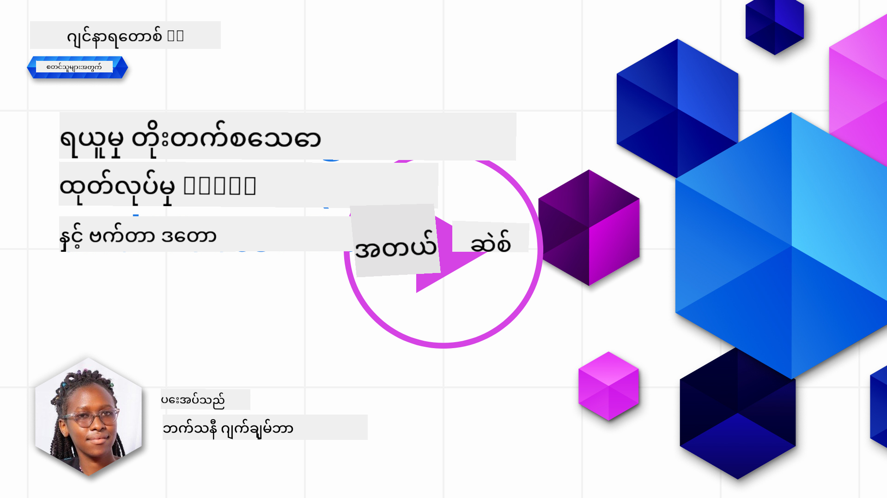

<!--
CO_OP_TRANSLATOR_METADATA:
{
  "original_hash": "b4b0266fbadbba7ded891b6485adc66d",
  "translation_date": "2025-10-18T01:56:51+00:00",
  "source_file": "15-rag-and-vector-databases/README.md",
  "language_code": "my"
}
-->
# Retrieval Augmented Generation (RAG) နှင့် Vector Databases

[](https://youtu.be/4l8zhHUBeyI?si=BmvDmL1fnHtgQYkL)

ရှာဖွေမှုအက်ပလီကေးရှင်းများဆိုင်ရာ သင်ခန်းစာတွင် သင်၏ကိုယ်ပိုင်ဒေတာများကို Large Language Models (LLMs) တွင် ပေါင်းစည်းပုံကို အနည်းငယ်လေ့လာခဲ့ပါသည်။ ဒီသင်ခန်းစာတွင် သင်၏ LLM အက်ပလီကေးရှင်းတွင် ဒေတာများကို အခြေခံပုံ၊ လုပ်ငန်းစဉ်၏စက်မှုဆိုင်ရာနှင့် ဒေတာကို သိမ်းဆည်းပုံနည်းလမ်းများ (embeddings နှင့် text နှစ်ခုစလုံးအပါအဝင်) ကို ပိုမိုနက်နက်ရှိုင်းရှိုင်း လေ့လာသင်ယူမည်ဖြစ်သည်။

> **ဗီဒီယို မကြာမီရရှိမည်**

## အကျဉ်းချုပ်

ဒီသင်ခန်းစာတွင် အောက်ပါအကြောင်းအရာများကို လေ့လာမည်ဖြစ်သည်-

- RAG အကြောင်းအကျဉ်း၊ ၎င်းသည် အဘယ်ကြောင့် AI (artificial intelligence) တွင် အသုံးပြုရသည်။

- Vector databases အကြောင်းနားလည်ခြင်းနှင့် ကျွန်ုပ်တို့၏အက်ပလီကေးရှင်းအတွက် တစ်ခုတည်ဆောက်ခြင်း။

- RAG ကို အက်ပလီကေးရှင်းတွင် ပေါင်းစည်းပုံဆိုင်ရာ လက်တွေ့နမူနာ။

## သင်ယူရမည့်ရည်မှန်းချက်များ

ဒီသင်ခန်းစာကိုပြီးမြောက်ပြီးနောက်တွင် သင်သည်-

- ဒေတာရှာဖွေခြင်းနှင့် အလုပ်လုပ်ပုံတွင် RAG ၏ အရေးပါမှုကို ရှင်းလင်းနိုင်မည်။

- RAG အက်ပလီကေးရှင်းကို စတင်တည်ဆောက်ပြီး သင်၏ဒေတာကို LLM တွင် အခြေခံနိုင်မည်။

- RAG နှင့် Vector Databases ကို LLM Applications တွင် ထိရောက်စွာ ပေါင်းစည်းနိုင်မည်။

## ကျွန်ုပ်တို့၏အခြေအနေ - ကျွန်ုပ်တို့၏ကိုယ်ပိုင်ဒေတာဖြင့် LLM များကို တိုးတက်စေခြင်း

ဒီသင်ခန်းစာအတွက် ကျွန်ုပ်တို့သည် ပညာရေးစတင်မှုတွင် ကျွန်ုပ်တို့၏ကိုယ်ပိုင်မှတ်စုများကို ထည့်သွင်းလိုပါသည်။ ၎င်းသည် chatbot ကို အမျိုးမျိုးသောဘာသာရပ်များအကြောင်းပိုမိုသိရှိစေပါသည်။ ကျွန်ုပ်တို့၏မှတ်စုများကို အသုံးပြု၍ သင်ယူသူများသည် ပိုမိုကောင်းမွန်စွာလေ့လာနိုင်ပြီး အမျိုးမျိုးသောဘာသာရပ်များကို နားလည်နိုင်မည်ဖြစ်ပြီး ၎င်းသည် ၎င်းတို့၏စာမေးပွဲများအတွက် ပြန်လည်သုံးသပ်ရန် ပိုမိုလွယ်ကူစေပါသည်။ ကျွန်ုပ်တို့၏အခြေအနေကို ဖန်တီးရန် ကျွန်ုပ်တို့သည် အောက်ပါအရာများကို အသုံးပြုမည်-

- `Azure OpenAI:` ကျွန်ုပ်တို့၏ chatbot ကို ဖန်တီးရန် အသုံးပြုမည့် LLM

- `AI for beginners' lesson on Neural Networks:` ကျွန်ုပ်တို့၏ LLM ကို အခြေခံမည့် ဒေတာ

- `Azure AI Search` နှင့် `Azure Cosmos DB:` ဒေတာကို သိမ်းဆည်းရန်နှင့် ရှာဖွေမှုအညွှန်းကို ဖန်တီးရန် vector database

အသုံးပြုသူများသည် ၎င်းတို့၏မှတ်စုများမှ စမ်းသပ်မေးခွန်းများ၊ ပြန်လည်သုံးသပ်ရန် flash cards များကို ဖန်တီးနိုင်ပြီး အကျဉ်းချုပ်များကို ရယူနိုင်ပါမည်။ စတင်ရန် RAG ၏အဓိပ္ပါယ်နှင့် ၎င်း၏လုပ်ပုံလုပ်နည်းကို ကြည့်ရှုကြပါစို့-

## Retrieval Augmented Generation (RAG)

LLM အားဖြင့် အားပေးထားသော chatbot သည် အသုံးပြုသူ၏မေးခွန်းများကို အဖြေများထုတ်ပေးရန် လုပ်ဆောင်သည်။ ၎င်းသည် အပြန်အလှန်ဆွေးနွေးမှုအတွက် ဖန်တီးထားပြီး အမျိုးမျိုးသောအကြောင်းအရာများအပေါ် အသုံးပြုသူများနှင့် ဆွေးနွေးမှုများကို လုပ်ဆောင်သည်။ သို့သော် ၎င်း၏အဖြေများသည် ပေးထားသောအကြောင်းအရာနှင့် ၎င်း၏အခြေခံလေ့ကျင့်မှုဒေတာများအပေါ်တွင်သာ အကန့်အသတ်ရှိသည်။ ဥပမာအားဖြင့် GPT-4 ၏ အသိပညာအဆုံးစွန်းသည် 2021 ခုနှစ် စက်တင်ဘာဖြစ်ပြီး ၎င်းသည် ၎င်းကာလပြီးနောက်ဖြစ်ပျက်သောဖြစ်ရပ်များကို မသိနိုင်ပါ။ ထို့အပြင် LLM များကို လေ့ကျင့်ရန် အသုံးပြုသောဒေတာများသည် ကိုယ်ပိုင်မှတ်စုများ သို့မဟုတ် ကုမ္ပဏီ၏ထုတ်ကုန်လက်စွဲစာအုပ်ကဲ့သို့သော လျှို့ဝှက်အချက်အလက်များကို မပါဝင်ပါ။

### RAGs (Retrieval Augmented Generation) ၏ လုပ်ပုံလုပ်နည်း


ဥပမာအားဖြင့် သင်၏မှတ်စုများမှ စမ်းသပ်မေးခွန်းများကို ဖန်တီးသော chatbot ကို စတင်အသုံးပြုလိုပါက သင်သည် knowledge base နှင့် ချိတ်ဆက်မှုတစ်ခုလိုအပ်ပါမည်။ ဒီနေရာမှာ RAG က ကူညီပေးနိုင်ပါတယ်။ RAGs သည် အောက်ပါအတိုင်း လုပ်ဆောင်သည်-

- **Knowledge base:** ရှာဖွေမှုမပြုမီ၊ ဒီစာရွက်များကို စုစည်းပြီး ကြိုတင်လုပ်ဆောင်ရန် လိုအပ်သည်။ အများကြီးသောစာရွက်များကို သေးငယ်သောအပိုင်းများအဖြစ် ခွဲခြားခြင်း၊ ၎င်းတို့ကို text embedding အဖြစ် ပြောင်းလဲခြင်းနှင့် database တွင် သိမ်းဆည်းခြင်းတို့ကို လုပ်ဆောင်သည်။

- **User Query:** အသုံးပြုသူသည် မေးခွန်းတစ်ခုမေးသည်။

- **Retrieval:** အသုံးပြုသူသည် မေးခွန်းတစ်ခုမေးသောအခါ၊ embedding model သည် knowledge base မှ သက်ဆိုင်သောအချက်အလက်များကို ရှာဖွေပြီး prompt တွင် ထည့်သွင်းရန် context ပိုမိုပေးသည်။

- **Augmented Generation:** LLM သည် ရှာဖွေထားသောဒေတာအပေါ် အခြေခံပြီး ၎င်း၏အဖြေကို တိုးတက်စေသည်။ ၎င်းသည် လေ့ကျင့်ထားသောဒေတာအပေါ်သာမက ထည့်သွင်းထားသော context မှ သက်ဆိုင်သောအချက်အလက်များကိုလည်း အခြေခံပြီး အဖြေကို ထုတ်ပေးနိုင်စေသည်။ ရှာဖွေထားသောဒေတာကို LLM ၏အဖြေများကို တိုးတက်စေရန် အသုံးပြုသည်။ LLM သည် အသုံးပြုသူ၏မေးခွန်းကို အဖြေပြန်ပေးသည်။


RAGs ၏ architecture ကို encoder နှင့် decoder အပိုင်းနှစ်ခုပါဝင်သော transformers ကို အသုံးပြု၍ အကောင်အထည်ဖော်သည်။ ဥပမာအားဖြင့် အသုံးပြုသူသည် မေးခွန်းတစ်ခုမေးသောအခါ input text ကို 'encoded' လုပ်ပြီး vectors အဖြစ် ပြောင်းလဲကာ စာရွက်အညွှန်းထဲသို့ 'decoded' လုပ်ကာ အသုံးပြုသူ၏မေးခွန်းအပေါ် အခြေခံပြီး အဖြစ်အပျက်အသစ်များကို ဖန်တီးသည်။ LLM သည် encoder-decoder model နှစ်ခုလုံးကို အသုံးပြုကာ output ကို ဖန်တီးသည်။

[Retrieval-Augmented Generation for Knowledge intensive NLP (natural language processing software) Tasks](https://arxiv.org/pdf/2005.11401.pdf?WT.mc_id=academic-105485-koreyst) စာတမ်းတွင် အဆိုပြုထားသော RAG ကို အကောင်အထည်ဖော်ရာတွင် နည်းလမ်းနှစ်ခုရှိသည်-

- **_RAG-Sequence_** ရှာဖွေထားသောစာရွက်များကို အသုံးပြုကာ အသုံးပြုသူမေးခွန်းအတွက် အကောင်းဆုံးဖြေကြောင်းကို ခန့်မှန်းခြင်း။

- **RAG-Token** စာရွက်များကို အသုံးပြုကာ နောက် token ကို ဖန်တီးပြီး ၎င်းတို့ကို ရှာဖွေကာ အသုံးပြုသူ၏မေးခွန်းကို ဖြေကြောင်းပေးခြင်း။

### RAGs ကို ဘာကြောင့်အသုံးပြုသင့်သလဲ?

- **အချက်အလက်များစုံလင်မှု:** စာသားအဖြေများကို နောက်ဆုံးပေါ်နှင့် လက်ရှိအခြေအနေများဖြစ်စေသည်။ ၎င်းသည် domain-specific tasks များတွင် performance ကို တိုးတက်စေသည်။

- **အတည်ပြုနိုင်သောဒေတာ** ကို အသုံးပြုခြင်းအားဖြင့် fabrication ကို လျှော့ချနိုင်သည်။

- LLM ကို fine-tuning လုပ်ရန်ထက် **ကုန်ကျစရိတ်သက်သာမှု** ရှိသည်။

## Knowledge base တည်ဆောက်ခြင်း

ကျွန်ုပ်တို့၏အက်ပလီကေးရှင်းသည် ကျွန်ုပ်တို့၏ကိုယ်ပိုင်ဒေတာဖြစ်သော Neural Network သင်ခန်းစာ (AI For Beginners curriculum) အပေါ် အခြေခံထားသည်။

### Vector Databases

Vector database သည် ရိုးရိုး database များနှင့်မတူဘဲ embedded vectors များကို သိမ်းဆည်းရန်၊ စီမံရန်နှင့် ရှာဖွေရန်အတွက် အထူးပြု database ဖြစ်သည်။ ၎င်းသည် စာရွက်များ၏ ကိန်းဂဏန်းကိုယ်စားပြုမှုများကို သိမ်းဆည်းသည်။ ဒေတာများကို ကိန်းဂဏန်း embeddings အဖြစ် ခွဲခြားခြင်းသည် AI စနစ်အနေဖြင့် ဒေတာကို နားလည်ရန်နှင့် လုပ်ဆောင်ရန် ပိုမိုလွယ်ကူစေသည်။

LLMs တွင် input အဖြစ် tokens အရေအတွက်ကန့်သတ်ရှိသောကြောင့် ကျွန်ုပ်တို့၏ embeddings များကို vector databases တွင် သိမ်းဆည်းသည်။ ဒါကြောင့် embeddings အားလုံးကို LLM သို့ မပေးနိုင်ပါ။ ဒါကြောင့် chunking လုပ်ရန် လိုအပ်ပြီး အသုံးပြုသူသည် မေးခွန်းမေးသောအခါ မေးခွန်းနှင့် အနီးဆုံး embeddings များကို prompt နှင့်အတူ ပြန်ပေးမည်ဖြစ်သည်။ Chunking သည် LLM မှ tokens အရေအတွက်ကို လျှော့ချပြီး ကုန်ကျစရိတ်ကိုလည်း လျှော့ချနိုင်သည်။

ကျော်ကြားသော vector databases အချို့မှာ Azure Cosmos DB, Clarifyai, Pinecone, Chromadb, ScaNN, Qdrant နှင့် DeepLake တို့ဖြစ်သည်။ Azure CLI ကို အသုံးပြုကာ Azure Cosmos DB model တစ်ခုကို အောက်ပါ command ဖြင့် ဖန်တီးနိုင်သည်-

```bash
az login
az group create -n <resource-group-name> -l <location>
az cosmosdb create -n <cosmos-db-name> -r <resource-group-name>
az cosmosdb list-keys -n <cosmos-db-name> -g <resource-group-name>
```

### Text ကို embeddings အဖြစ်ပြောင်းခြင်း

ဒေတာကို သိမ်းဆည်းမီ၊ ၎င်းကို vector embeddings အဖြစ်ပြောင်းပြီး database တွင် သိမ်းဆည်းရန် လိုအပ်သည်။ စာရွက်များ သို့မဟုတ် ရှည်လျားသောစာသားများနှင့်အလုပ်လုပ်နေပါက မေးခွန်းများအပေါ်အခြေခံပြီး chunking လုပ်နိုင်သည်။ Chunking ကို စာကြောင်းအဆင့် သို့မဟုတ် စာပိုဒ်အဆင့်တွင် လုပ်နိုင်သည်။ Chunking သည် စကားလုံးများ၏ အနီးအနားမှ အဓိပ္ပါယ်များကို ရယူသောကြောင့် chunk တစ်ခုတွင် context အချို့ကို ထည့်သွင်းနိုင်သည်။ ဥပမာအားဖြင့် စာရွက်ခေါင်းစဉ် သို့မဟုတ် chunk မတိုင်မီ သို့မဟုတ် အပြီးတွင် စာသားအချို့ကို ထည့်သွင်းနိုင်သည်။ ဒေတာကို အောက်ပါအတိုင်း chunking လုပ်နိုင်သည်-

```python
def split_text(text, max_length, min_length):
    words = text.split()
    chunks = []
    current_chunk = []

    for word in words:
        current_chunk.append(word)
        if len(' '.join(current_chunk)) < max_length and len(' '.join(current_chunk)) > min_length:
            chunks.append(' '.join(current_chunk))
            current_chunk = []

    # If the last chunk didn't reach the minimum length, add it anyway
    if current_chunk:
        chunks.append(' '.join(current_chunk))

    return chunks
```

Chunking ပြီးနောက်၊ ကျွန်ုပ်တို့၏စာသားကို embedding models များကို အသုံးပြုကာ embed လုပ်နိုင်သည်။ အသုံးပြုနိုင်သော models အချို့မှာ word2vec, OpenAI ၏ ada-002, Azure Computer Vision နှင့် အခြားများဖြစ်သည်။ အသုံးပြုမည့် model ကို ရွေးချယ်ခြင်းသည် သင်အသုံးပြုနေသောဘာသာစကားများ၊ encoded ဖြစ်သောအကြောင်းအရာအမျိုးအစား (text/images/audio), input အရွယ်အစားနှင့် embedding output အရှည်တို့ပေါ်မူတည်သည်။

OpenAI ၏ `text-embedding-ada-002` model ကို အသုံးပြုကာ embedded text ၏ နမူနာတစ်ခုမှာ:


## Retrieval နှင့် Vector Search

အသုံးပြုသူသည် မေးခွန်းမေးသောအခါ၊ retriever သည် query encoder ကို အသုံးပြုကာ ၎င်းကို vector အဖြစ်ပြောင်းပြီး document search index တွင် input နှင့်ဆက်စပ်သော vectors များကို ရှာဖွေသည်။ ပြီးလျှင် input vector နှင့် document vectors နှစ်ခုလုံးကို text အဖြစ်ပြောင်းပြီး LLM သို့ ပေးပို့သည်။

### Retrieval

Retrieval သည် စနစ်သည် search criteria ကို ဖြည့်ဆည်းသောစာရွက်များကို index မှ အလျင်အမြန် ရှာဖွေသောအခါ ဖြစ်သည်။ Retriever ၏ရည်ရွယ်ချက်မှာ context ပေးရန်နှင့် LLM ကို သင်၏ဒေတာအပေါ် အခြေခံစေရန် အသုံးပြုမည့်စာရွက်များကို ရယူခြင်းဖြစ်သည်။

Database တွင် search လုပ်ရန် နည်းလမ်းအမျိုးမျိုးရှိသည်-

- **Keyword search** - text ရှာဖွေမှုအတွက် အသုံးပြုသည်။

- **Semantic search** - စကားလုံးများ၏ semantic အဓိပ္ပါယ်ကို အသုံးပြုသည်။

- **Vector search** - embedding models ကို အသုံးပြုကာ စာရွက်များကို text မှ vector representations အဖြစ်ပြောင်းသည်။ Retrieval ကို အသုံးပြုသူမေးခွန်းနှင့် အနီးဆုံး vector representations များကို query လုပ်ခြင်းဖြင့် ပြုလုပ်သည်။

- **Hybrid** - keyword နှင့် vector search နှစ်ခုလုံးကို ပေါင်းစည်းထားသော search ဖြစ်သည်။

Retrieval တွင် စိန်ခေါ်မှုတစ်ခုမှာ database တွင် query နှင့် ဆက်စပ်သော response မရှိပါက စနစ်သည် ရနိုင်သမျှအချက်အလက်ကို ပြန်ပေးမည်ဖြစ်သည်။ သို့သော် relevance အကန့်အသတ်ကို သတ်မှတ်ခြင်း သို့မဟုတ် keyword နှင့် vector search ကို ပေါင်းစည်းထားသော hybrid search ကို အသုံးပြုခြင်းကဲ့သို့သော နည်းလမ်းများကို အသုံးပြုနိုင်သည်။ ဒီသင်ခန်းစာတွင် keyword နှင့် vector search ကို ပေါင်းစည်းထားသော hybrid search ကို အသုံးပြုမည်ဖြစ်သည်။ ကျွန်ုပ်တို့၏ဒေတာကို chunks နှင့် embeddings ပါဝင်သော columns များဖြင့် dataframe တွင် သိမ်းဆည်းမည်။

### Vector Similarity

Retriever သည် knowledge database တွင် အနီးဆုံးနေရာရှိသော embeddings များကို ရှာဖွေမည်ဖြစ်သည်။ ၎င်းသည် အနီးဆုံးအိမ်နီးချင်းဖြစ်ပြီး ၎င်းတို့သည် ဆင်တူသောစာသားများဖြစ်သည်။ အသုံးပြုသူသည် query တစ်ခုမေးသောအခါ ၎င်းကို embed လုပ်ပြီး ဆင်တူသော embeddings များနှင့် တွဲစပ်သည်။ Vectors များ၏ဆင်တူမှုကို တိုင်းတာရန် အသုံးပြုသော measurement အများဆုံးမှာ cosine similarity ဖြစ်ပြီး ၎င်းသည် vectors နှစ်ခုအကြား angle အပေါ်အခြေခံသည်။

ဆင်တူမှုကို တိုင်းတာရန် Euclidean distance (vectors အဆုံးမှတည့်တည့်လို

---

**အကြောင်းကြားချက်**:  
ဤစာရွက်စာတမ်းကို AI ဘာသာပြန်ဝန်ဆောင်မှု [Co-op Translator](https://github.com/Azure/co-op-translator) ကို အသုံးပြု၍ ဘာသာပြန်ထားပါသည်။ ကျွန်ုပ်တို့သည် တိကျမှုအတွက် ကြိုးစားနေသော်လည်း အလိုအလျောက် ဘာသာပြန်မှုများတွင် အမှားများ သို့မဟုတ် မတိကျမှုများ ပါဝင်နိုင်သည်ကို သတိပြုပါ။ မူရင်းဘာသာစကားဖြင့် ရေးသားထားသော စာရွက်စာတမ်းကို အာဏာတရားရှိသော အရင်းအမြစ်အဖြစ် သတ်မှတ်သင့်ပါသည်။ အရေးကြီးသော အချက်အလက်များအတွက် လူ့ဘာသာပြန်ပညာရှင်များကို အသုံးပြုရန် အကြံပြုပါသည်။ ဤဘာသာပြန်မှုကို အသုံးပြုခြင်းမှ ဖြစ်ပေါ်လာသော နားလည်မှုမှားများ သို့မဟုတ် အဓိပ္ပါယ်မှားများအတွက် ကျွန်ုပ်တို့သည် တာဝန်မယူပါ။