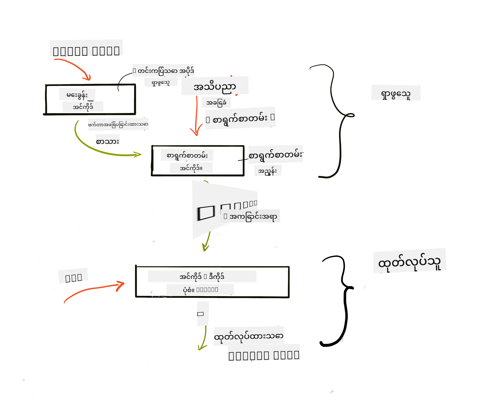

<!--
CO_OP_TRANSLATOR_METADATA:
{
  "original_hash": "e2861bbca91c0567ef32bc77fe054f9e",
  "translation_date": "2025-07-09T16:23:01+00:00",
  "source_file": "15-rag-and-vector-databases/README.md",
  "language_code": "my"
}
-->
# Retrieval Augmented Generation (RAG) နှင့် Vector Databases

[](https://aka.ms/gen-ai-lesson15-gh?WT.mc_id=academic-105485-koreyst)

ရှာဖွေရေးအပလီကေးရှင်းများသင်ခန်းစာတွင်၊ သင့်ကိုယ်ပိုင်ဒေတာကို Large Language Models (LLMs) ထဲသို့ ပေါင်းစပ်အသုံးပြုနည်းကို အတိုချုံးလေ့လာခဲ့ပါသည်။ ဒီသင်ခန်းစာမှာတော့ သင့် LLM အပလီကေးရှင်းထဲမှာ ဒေတာကို အခြေခံထားခြင်း (grounding) အကြောင်း၊ လုပ်ငန်းစဉ်နည်းပညာများနှင့် ဒေတာသိမ်းဆည်းနည်းများ (embedding နှင့် စာသားတို့ပါဝင်သည်) ကို ပိုမိုနက်နဲစွာ လေ့လာသွားမှာ ဖြစ်ပါတယ်။

> **ဗီဒီယို မကြာမီ ရရှိနိုင်ပါမည်**

## နိဒါန်း

ဒီသင်ခန်းစာမှာ အောက်ပါအကြောင်းအရာများကို ဖော်ပြပါမည်-

- RAG ဆိုတာဘာလဲ၊ AI (artificial intelligence) မှာ ဘာကြောင့် အသုံးပြုကြတာလဲ ဆိုတာနဲ့ မိတ်ဆက်ခြင်း။

- Vector databases ဆိုတာဘာလဲ၊ ကျွန်တော်တို့အတွက် တစ်ခု ဖန်တီးခြင်း။

- RAG ကို အပလီကေးရှင်းတစ်ခုထဲ ပေါင်းစပ်အသုံးပြုနည်း လက်တွေ့ ဥပမာ။

## သင်ယူရမည့် ရည်မှန်းချက်များ

ဒီသင်ခန်းစာပြီးဆုံးပြီးနောက် သင်သည်-

- ဒေတာ ရှာဖွေရေးနှင့် ပြုလုပ်ခြင်းတွင် RAG ၏ အရေးပါမှုကို ရှင်းပြနိုင်မည်။

- RAG အပလီကေးရှင်းကို တပ်ဆင်ပြီး သင့်ဒေတာကို LLM နှင့် အခြေခံနိုင်မည်။

- LLM အပလီကေးရှင်းများတွင် RAG နှင့် Vector Databases ကို ထိရောက်စွာ ပေါင်းစပ်အသုံးပြုနိုင်မည်။

## ကျွန်တော်တို့ရဲ့ အခြေအနေ: ကိုယ်ပိုင်ဒေတာဖြင့် LLM များအား တိုးတက်အောင်လုပ်ခြင်း

ဒီသင်ခန်းစာအတွက် ကျွန်တော်တို့ရဲ့ ကိုယ်ပိုင်မှတ်စုများကို ပညာရေး စတားတပ်တစ်ခုထဲ ထည့်သွင်းလိုပါတယ်။ ဒါက chatbot ကို အကြောင်းအရာအမျိုးမျိုးအပေါ် ပိုမိုသိရှိနိုင်စေမှာဖြစ်ပြီး၊ သင်ယူသူများအတွက် သင်ခန်းစာများကို ပိုမိုကောင်းမွန်စွာ လေ့လာနိုင်ပြီး စာမေးပွဲအတွက် ပြန်လည်သင်ကြားရာမှာ အဆင်ပြေစေပါလိမ့်မယ်။ ကျွန်တော်တို့ရဲ့ အခြေအနေဖန်တီးရာမှာ အောက်ပါအရာများကို အသုံးပြုပါမယ်-

- `Azure OpenAI:` chatbot ဖန်တီးရန် အသုံးပြုမည့် LLM

- `AI for beginners' lesson on Neural Networks:` ကျွန်တော်တို့ LLM အတွက် အခြေခံဒေတာ

- `Azure AI Search` နှင့် `Azure Cosmos DB:` ဒေတာသိမ်းဆည်းရန်နှင့် ရှာဖွေရေးအညွှန်း (search index) ဖန်တီးရန် vector database

အသုံးပြုသူများသည် ကိုယ်ပိုင်မှတ်စုများမှ လေ့ကျင့်မေးခွန်းများ၊ ပြန်လည်သင်ကြားရန် flash card များ ဖန်တီးနိုင်ပြီး အကျဉ်းချုပ်များကိုလည်း ရယူနိုင်ပါသည်။ စတင်ရန် RAG ဆိုတာဘာလဲ၊ ဘယ်လိုအလုပ်လုပ်သလဲဆိုတာကို ကြည့်ကြရအောင်-

## Retrieval Augmented Generation (RAG)

LLM အားဖြင့် စွမ်းဆောင်သော chatbot သည် အသုံးပြုသူ၏ မေးခွန်းများကို လက်ခံပြီး တုံ့ပြန်ချက်များ ဖန်တီးပေးသည်။ ၎င်းသည် အပြန်အလှန် ဆက်သွယ်နိုင်ပြီး အကြောင်းအရာအမျိုးမျိုးအပေါ် ဆွေးနွေးနိုင်သည်။ သို့သော် ၎င်း၏ တုံ့ပြန်ချက်များမှာ ပေးထားသော အကြောင်းအရာနှင့် မူလလေ့လာသင်ယူမှု ဒေတာအပေါ် အကန့်အသတ်ရှိသည်။ ဥပမာအားဖြင့် GPT-4 ၏ သိရှိမှုကာလက ၂၀၂၁ စက်တင်ဘာလဖြစ်ပြီး၊ ထိုကာလအပြီး ဖြစ်ပွားသော ဖြစ်ရပ်များကို မသိရှိနိုင်ပါ။ ထို့အပြင် LLM များကို သင်ကြားရန် အသုံးပြုသော ဒေတာများတွင် ကိုယ်ရေးအချက်အလက်များ သို့မဟုတ် ကုမ္ပဏီထုတ်ကုန်လက်စွဲစာအုပ်များကဲ့သို့ လျှို့ဝှက်သော အချက်အလက်များ မပါဝင်ပါ။

### RAGs (Retrieval Augmented Generation) များ ဘယ်လို အလုပ်လုပ်သလဲ


သင့်မှတ်စုများမှ မေးခွန်းများ ဖန်တီးပေးမည့် chatbot တစ်ခု တပ်ဆင်လိုပါက သိရှိမှု အခြေခံ (knowledge base) နှင့် ချိတ်ဆက်ရန် လိုအပ်ပါသည်။ ဒီမှာ RAG ကူညီပေးပါသည်။ RAG များသည် အောက်ပါအတိုင်း လုပ်ဆောင်ပါသည်-

- **သိရှိမှု အခြေခံ:** ရှာဖွေရေးမပြုမီ၊ စာရွက်စာတမ်းများကို စုဆောင်းပြီး ကြိုတင်ပြင်ဆင်ရမည်။ ပုံမှန်အားဖြင့် စာရွက်စာတမ်းကြီးများကို အပိုင်းသေးသေးများသို့ ခွဲခြားပြီး၊ စာသား embedding များသို့ ပြောင်းလဲကာ ဒေတာဘေ့စ်ထဲသိမ်းဆည်းသည်။

- **အသုံးပြုသူ မေးခွန်း:** အသုံးပြုသူ မေးခွန်းတစ်ခု မေးသည်။

- **ရှာဖွေရေး:** အသုံးပြုသူ မေးခွန်းမေးသောအခါ embedding မော်ဒယ်က သိရှိမှု အခြေခံမှ သက်ဆိုင်ရာ အချက်အလက်များကို ရှာဖွေပြီး prompt ထဲသို့ ထည့်သွင်းရန် ပံ့ပိုးပေးသည်။

- **တိုးမြှင့် ဖန်တီးမှု:** LLM သည် ရရှိလာသော ဒေတာအပေါ် အခြေခံ၍ တုံ့ပြန်ချက်ကို တိုးမြှင့်ပေးသည်။ ၎င်းသည် မူလသင်ကြားထားသော ဒေတာအပြင် ထည့်သွင်းထားသော အကြောင်းအရာမှ သက်ဆိုင်ရာ အချက်အလက်များကိုလည်း အသုံးပြုနိုင်စေသည်။ ရရှိလာသော ဒေတာကို အသုံးပြု၍ LLM ၏ တုံ့ပြန်ချက်များကို တိုးမြှင့်ပေးပြီး အသုံးပြုသူ မေးခွန်းအတွက် ဖြေကြားချက် ပြန်လည်ပေးသည်။



RAGs ၏ အင်ဂျင်နီယာပုံစံကို transformer မော်ဒယ်ဖြင့် တည်ဆောက်ထားပြီး encoder နှင့် decoder ဆိုသော အပိုင်းနှစ်ခုပါဝင်သည်။ ဥပမာအားဖြင့် အသုံးပြုသူ မေးခွန်းမေးသောအခါ၊ input စာသားကို စကားလုံးအဓိပ္ပာယ်ကို ဖမ်းယူထားသော vector များသို့ 'encode' လုပ်ပြီး၊ ထို vector များကို 'decode' လုပ်ကာ စာရွက်စာတမ်း အညွှန်းနှင့် အသုံးပြုသူ မေးခွန်းအပေါ် အခြေခံ၍ စာသားအသစ် ဖန်တီးပေးသည်။ LLM သည် encoder-decoder မော်ဒယ်နှစ်ခုစလုံးကို အသုံးပြုကာ output ကို ဖန်တီးသည်။

[Retrieval-Augmented Generation for Knowledge intensive NLP (natural language processing software) Tasks](https://arxiv.org/pdf/2005.11401.pdf?WT.mc_id=academic-105485-koreyst) စာတမ်းအရ RAG ကို အကောင်အထည်ဖော်ရာတွင် နည်းလမ်းနှစ်မျိုးရှိသည်-

- **_RAG-Sequence_** - ရှာဖွေထားသော စာရွက်စာတမ်းများကို အသုံးပြုကာ အသုံးပြုသူ မေးခွန်းအတွက် အကောင်းဆုံးဖြေကြားချက် ခန့်မှန်းခြင်း

- **RAG-Token** - စာရွက်စာတမ်းများကို အသုံးပြုကာ နောက်ထပ် token ကို ဖန်တီးပြီး ထို token များကို အသုံးပြုသူ မေးခွန်းကို ဖြေကြားရန် ရှာဖွေခြင်း

### ဘာကြောင့် RAG များကို အသုံးပြုသင့်သလဲ?

- **အချက်အလက် ပြည့်စုံမှု:** စာသားတုံ့ပြန်ချက်များကို နောက်ဆုံးပေါ်၊ လက်ရှိအခြေအနေဖြစ်စေရန် အာမခံပေးသည်။ ထို့ကြောင့် domain အထူးပြု လုပ်ငန်းများတွင် အတွင်းရေးရာ သိရှိမှု အခြေခံကို အသုံးပြုကာ စွမ်းဆောင်ရည် တိုးတက်စေသည်။

- အသုံးပြုသူ မေးခွန်းများအတွက် အကြောင်းအရာ ပေးရန် သိရှိမှု အခြေခံရှိ verifiable data ကို အသုံးပြုခြင်းဖြင့် မမှန်ကန်သော အချက်အလက် ဖန်တီးမှုကို လျော့နည်းစေသည်။

- LLM ကို fine-tune ပြုလုပ်ခြင်းထက် ပိုမို စီးပွားရေးကျသောကြောင့် **ကုန်ကျစရိတ် သက်သာမှု** ရှိသည်။

## သိရှိမှု အခြေခံ ဖန်တီးခြင်း

ကျွန်တော်တို့၏ အပလီကေးရှင်းသည် ကိုယ်ပိုင် ဒေတာဖြစ်သော AI For Beginners သင်ခန်းစာ Neural Network အပေါ် အခြေခံထားသည်။

### Vector Databases

Vector database သည် ရိုးရာ ဒေတာဘေ့စ်များနှင့် မတူဘဲ embedded vector များကို သိမ်းဆည်း၊ စီမံခန့်ခွဲ၊ ရှာဖွေရန် အထူးပြုထားသော ဒေတာဘေ့စ်ဖြစ်သည်။ ၎င်းသည် စာရွက်စာတမ်းများ၏ နံပါတ်တစ်မျိုးဖြစ်သော ကိုယ်စားပြုချက်များကို သိမ်းဆည်းသည်။ ဒေတာကို နံပါတ်များသို့ ခွဲခြားခြင်းက AI စနစ်အတွက် နားလည်ခြင်းနှင့် ပြုလုပ်ခြင်းကို ပိုမိုလွယ်ကူစေသည်။

LLM များသည် input အဖြစ် လက်ခံနိုင်သည့် token အရေအတွက် ကန့်သတ်ချက်ရှိသောကြောင့် ကျွန်တော်တို့သည် embedding များကို အပိုင်းသေးသေးများသို့ ခွဲခြားထားရမည်။ အသုံးပြုသူ မေးခွန်းမေးသောအခါ မေးခွန်းနှင့် အနီးဆုံးသက်ဆိုင်သော embedding များကို prompt နှင့်အတူ ပြန်လည်ပေးပို့မည်ဖြစ်သည်။ Chunking သည် LLM သို့ ပေးပို့သည့် token အရေအတွက်ကိုလည်း လျော့နည်းစေသည်။

လူကြိုက်များသော vector database များမှာ Azure Cosmos DB, Clarifyai, Pinecone, Chromadb, ScaNN, Qdrant နှင့် DeepLake တို့ ဖြစ်ကြသည်။ Azure CLI ကို အသုံးပြုကာ Azure Cosmos DB မော်ဒယ်တစ်ခု ဖန်တီးနိုင်ပါသည်-

```bash
az login
az group create -n <resource-group-name> -l <location>
az cosmosdb create -n <cosmos-db-name> -r <resource-group-name>
az cosmosdb list-keys -n <cosmos-db-name> -g <resource-group-name>
```

### စာသားမှ embedding သို့

ဒေတာကို သိမ်းဆည်းမည့်အရင်တွင် vector embedding များသို့ ပြောင်းလဲရမည်။ စာရွက်စာတမ်းကြီးများ သို့မဟုတ် စာသားရှည်များကို မေးခွန်းမျှော်မှန်းချက်အရ အပိုင်းသေးသေးများသို့ ခွဲနိုင်သည်။ ခွဲခြားမှုကို စာကြောင်းအဆင့် သို့မဟုတ် ပုဒ်မအဆင့်တွင် ပြုလုပ်နိုင်သည်။ ခွဲခြားမှုသည် စကားလုံးများ၏ အနီးအနားမှ အဓိပ္ပာယ်များကို ရယူသောကြောင့် အပိုင်းတစ်ခုတွင် စာရွက်စာတမ်းခေါင်းစဉ် သို့မဟုတ် အပိုင်းမတိုင်မီ သို့မဟုတ် အပြီး စာသားတစ်ချို့ ထည့်သွင်းနိုင်သည်။ ဒေတာကို အောက်ပါအတိုင်း ခွဲနိုင်သည်-

```python
def split_text(text, max_length, min_length):
    words = text.split()
    chunks = []
    current_chunk = []

    for word in words:
        current_chunk.append(word)
        if len(' '.join(current_chunk)) < max_length and len(' '.join(current_chunk)) > min_length:
            chunks.append(' '.join(current_chunk))
            current_chunk = []

    # If the last chunk didn't reach the minimum length, add it anyway
    if current_chunk:
        chunks.append(' '.join(current_chunk))

    return chunks
```

ခွဲပြီးနောက်၊ embedding မော်ဒယ်များကို အသုံးပြုကာ စာသားကို embed ပြုလုပ်နိုင်သည်။ အသုံးပြုနိုင်သော မော်ဒယ်များမှာ word2vec, OpenAI ၏ ada-002, Azure Computer Vision နှင့် အခြား မော်ဒယ်များ ပါဝင်သည်။ မော်ဒယ်ရွေးချယ်မှုသည် သင်အသုံးပြုမည့် ဘာသာစကား၊ အကြောင်းအရာအမျိုးအစား (စာသား/ပုံ/အသံ)၊ input အရွယ်အစားနှင့် embedding output ၏ အရှည်ပေါ် မူတည်သည်။

OpenAI ၏ `text-embedding-ada-002` မော်ဒယ်ဖြင့် embedded စာသား ဥပမာ-


## Retrieval နှင့် Vector ရှာဖွေရေး

အသုံးပြုသူ မေးခွန်းမေးသောအခါ retriever သည် query encoder ကို အသုံးပြုကာ မေးခွန်းကို vector သို့ ပြောင်းလဲပြီး၊ စာရွက်စာတမ်း ရှာဖွေရေး အညွှန်းထဲမှ သက်ဆိုင်ရာ vector များကို ရှာဖွေသည်။ ပြီးလျှင် input vector နှင့် စာရွက်စာတမ်း vector များကို စာသားသို့ ပြောင်းလဲကာ LLM သို့ ပေးပို့သည်။

### Retrieval

Retrieval သည် စနစ်က ရှာဖွေရေး စံနှုန်းနှင့် ကိုက်ညီသော စာရွက်စာတမ်းများကို အမြန်ရှာဖွေရန် ကြိုးပမ်းခြင်းဖြစ်သည်။ Retriever ၏ ရည်ရွယ်ချက်မှာ LLM ကို သင့်ဒေတာအပေါ် အခြေခံစေမည့် အကြောင်းအရာများ ပေးနိုင်မည့် စာရွက်စာတမ်းများ ရယူခြင်းဖြစ်သည်။

ဒေတာဘေ့စ်အတွင်း ရှာဖွေရေးလုပ်နည်းများမှာ-

- **Keyword search** - စာသားရှာဖွေရေးအတွက် အသုံးပြုသည်။

- **Semantic search** - စကားလုံးများ၏ အဓိပ္ပာယ်ကို အသုံးပြုသည်။

- **Vector search** - စာရွက်စာတမ်းများကို embedding မော်ဒယ်များဖြင့် vector ကိုယ်စားပြုချက်များသို့ ပြောင်းလဲပြီး အသုံးပြုသူ မေးခွန်းနှင့် အနီးဆုံး vector များကို ရှာဖွေသည်။

- **Hybrid** - keyword နှင့် vector search နှစ်မျိုးပေါင်းစပ်ထားသည်။

Retrieval တွင် စိန်ခေါ်မှုတစ်ခုမှာ ဒေတာဘေ့စ်တွင် မေးခွန်းနှင့် ဆင်တူသော တုံ့ပြန်ချက် မရှိပါက စနစ်သည် ရနိုင်သမျှ အကောင်းဆုံး အချက်အလက်ကို ပြန်လည်ပေးပို့မည်ဖြစ်သည်။ သို့သော် relevance အတွက် အကွာအဝေးအများဆုံးကို သတ်မှတ်ခြင်း သို့မဟုတ် keyword နှင့် vector search ပေါင်းစပ်ထားသော hybrid search ကို အသုံးပြုနိုင်သည်။ ဒီသင်ခန်းစာတွင် hybrid search ကို အသုံးပြုမည်ဖြစ်ပြီး ဒေတာကို chunk များနှင့် embedding များပါဝင်သော dataframe တစ်ခုအဖြစ် သိမ်းဆည်းမည်။

### Vector Similarity

Retriever သည် သိရှိမှု ဒေတာဘေ့စ်အတွင်း embedding များကို အနီးဆုံး ရှာဖွေသည်။ အနီးဆုံး အိမ်နီးချင်းများသည် ဆင်တူသော စာသားများဖြစ်သည်။ အသုံးပြုသူ မေးခွန်းတစ်ခု မေးသောအခါ အရင်ဆုံး embedding ပြုလုပ်ပြီး ဆင်တူသော embedding များနှင့် ကိုက်ညီစေသည်။ vector များ၏ ဆင်တူမှုကို တိုင်းတာရာတွင် cosine similarity ကို အများဆုံး အသုံးပြုသည်။ ၎င်းသည် vector နှစ်ခုအကြား ထောင့်အပေါ် မူတ

**အကြောင်းကြားချက်**  
ဤစာတမ်းကို AI ဘာသာပြန်ဝန်ဆောင်မှု [Co-op Translator](https://github.com/Azure/co-op-translator) ဖြင့် ဘာသာပြန်ထားပါသည်။ ကျွန်ုပ်တို့သည် တိကျမှန်ကန်မှုအတွက် ကြိုးစားသော်လည်း၊ အလိုအလျောက် ဘာသာပြန်ခြင်းတွင် အမှားများ သို့မဟုတ် မှားယွင်းမှုများ ပါဝင်နိုင်ကြောင်း သတိပြုပါရန် မေတ္တာရပ်ခံအပ်ပါသည်။ မူရင်းစာတမ်းကို မိမိဘာသာစကားဖြင့်သာ တရားဝင်အချက်အလက်အဖြစ် ယူဆသင့်ပါသည်။ အရေးကြီးသော အချက်အလက်များအတွက် လူ့ဘာသာပြန်ပညာရှင်မှ ဘာသာပြန်ခြင်းကို အကြံပြုပါသည်။ ဤဘာသာပြန်ချက်ကို အသုံးပြုရာမှ ဖြစ်ပေါ်လာနိုင်သည့် နားလည်မှုမှားယွင်းမှုများအတွက် ကျွန်ုပ်တို့သည် တာဝန်မယူပါ။