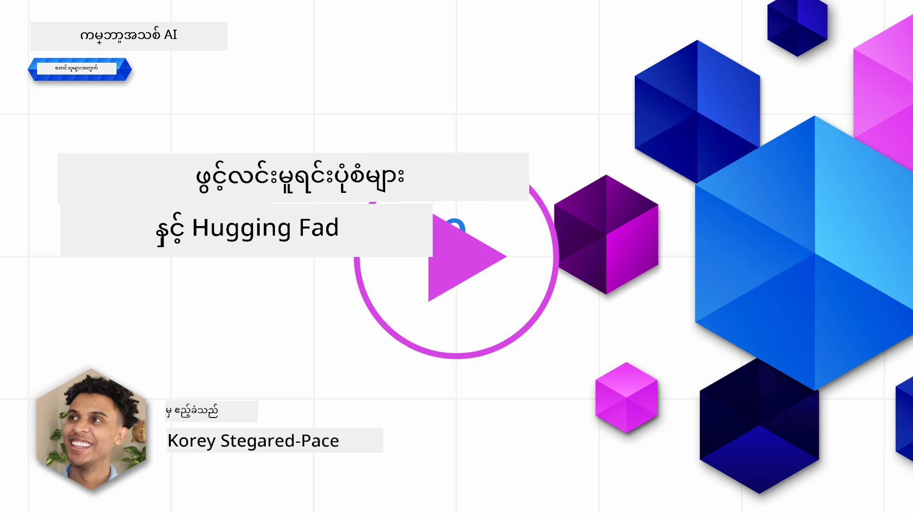
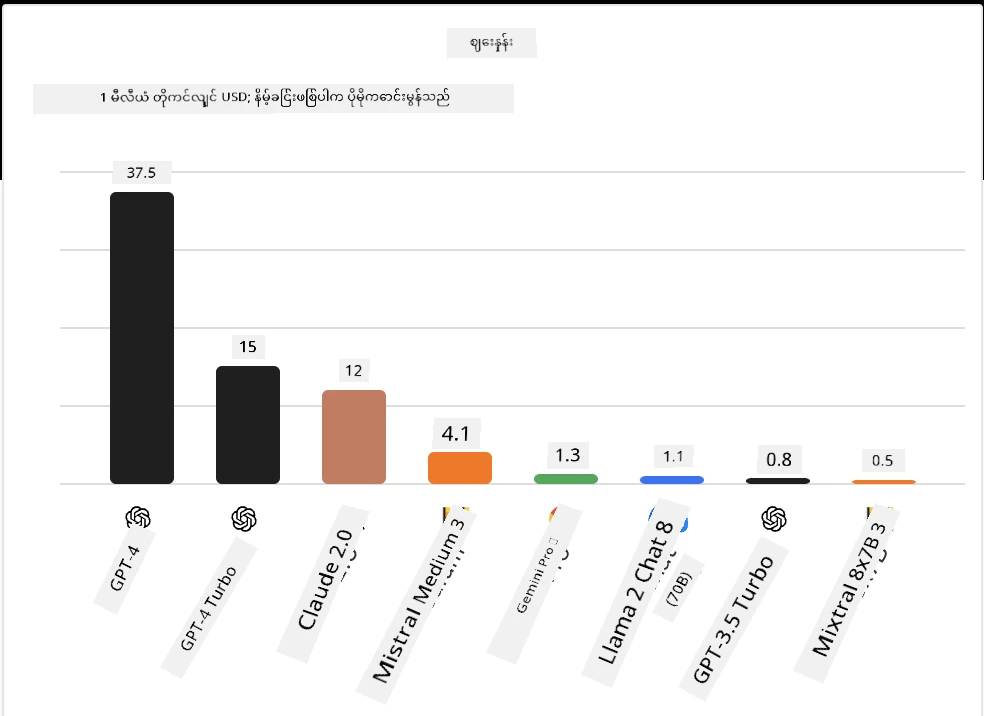
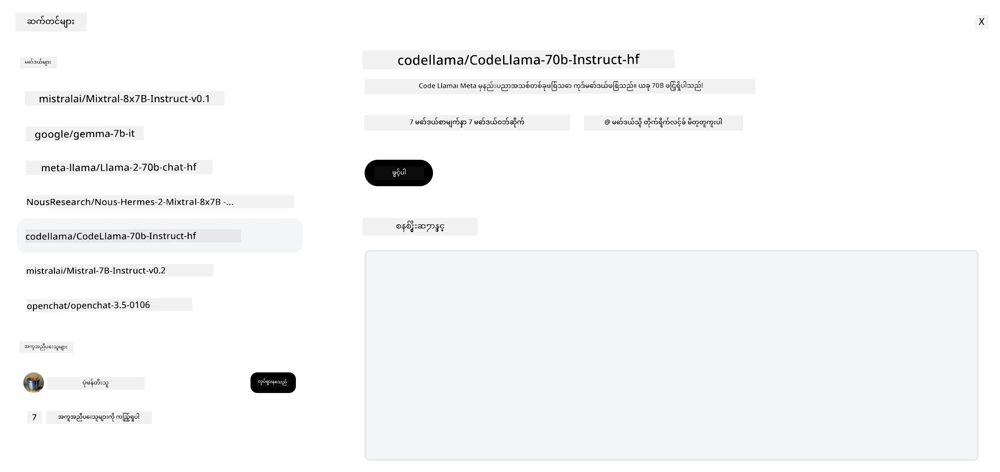
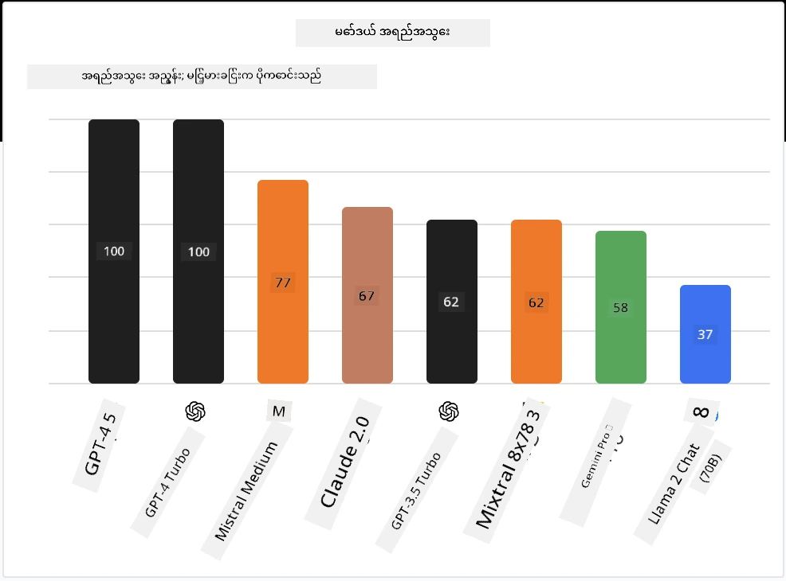

## နိဒါန်း

အဖွင့်မူရင်း LLM များ၏ကမ္ဘာသည် စိတ်လှုပ်ရှားဖွယ်ကောင်းပြီး အမြဲတမ်းတိုးတက်နေဆဲဖြစ်သည်။ ဤသင်ခန်းစာသည် အဖွင့်မူရင်းမော်ဒယ်များကို နက်ရှိုင်းစွာကြည့်ရှုရန် ရည်ရွယ်သည်။ သင်သည် ပိုင်ဆိုင်မှုမော်ဒယ်များနှင့် အဖွင့်မူရင်းမော်ဒယ်များကို နှိုင်းယှဉ်သိရှိလိုပါက ["Exploring and Comparing Different LLMs" သင်ခန်းစာ](../02-exploring-and-comparing-different-llms/README.md?WT.mc_id=academic-105485-koreyst) သို့ သွားပါ။ ဤသင်ခန်းစာတွင် fine-tuning အကြောင်းကိုလည်း ဖော်ပြမည်ဖြစ်သော်လည်း ပိုမိုအသေးစိတ်ရှင်းလင်းချက်ကို ["Fine-Tuning LLMs" သင်ခန်းစာ](../18-fine-tuning/README.md?WT.mc_id=academic-105485-koreyst) တွင် ရှာဖွေနိုင်ပါသည်။

## သင်ယူရမည့် ရည်မှန်းချက်များ

- အဖွင့်မူရင်း မော်ဒယ်များကို နားလည်ခြင်း
- အဖွင့်မူရင်း မော်ဒယ်များနှင့်အတူ အလုပ်လုပ်ခြင်း၏ အကျိုးကျေးဇူးများကို နားလည်ခြင်း
- Hugging Face နှင့် Azure AI Studio တွင် ရရှိနိုင်သည့် အဖွင့်မော်ဒယ်များကို ရှာဖွေခြင်း

## အဖွင့်မူရင်း မော်ဒယ်များ ဆိုတာဘာလဲ?

အဖွင့်မူရင်း ဆော့ဖ်ဝဲသည် နည်းပညာတိုးတက်မှုတွင် အရေးပါသော အခန်းကဏ္ဍကို ကစားခဲ့သည်။ Open Source Initiative (OSI) သည် [ဆော့ဖ်ဝဲအတွက် စံသတ်မှတ်ချက် ၁၀ ချက်](https://web.archive.org/web/20241126001143/https://opensource.org/osd?WT.mc_id=academic-105485-koreyst) ကို သတ်မှတ်ထားပြီး၊ မူရင်းကုဒ်ကို OSI မှ အတည်ပြုထားသောလိုင်စင်ဖြင့် ဖွင့်လှစ်မျှဝေရမည်ဖြစ်သည်။

LLM များ ဖန်တီးခြင်းသည် ဆော့ဖ်ဝဲဖန်တီးခြင်းနှင့် ဆင်တူသော်လည်း တိတိကျကျ မတူညီပါ။ ထို့ကြောင့် LLM များအတွက် အဖွင့်မူရင်းဆိုသည့် အဓိပ္ပါယ်အပေါ် လူမှုအသိုင်းအဝိုင်းတွင် ဆွေးနွေးမှုများ ဖြစ်ပေါ်ခဲ့သည်။ မော်ဒယ်တစ်ခုသည် ရိုးရာအဖွင့်မူရင်း အဓိပ္ပါယ်နှင့် ကိုက်ညီရန် အောက်ပါအချက်များကို ပြည်သူ့အနေဖြင့် ရရှိနိုင်ရမည်။

- မော်ဒယ်လေ့ကျင့်ရန် အသုံးပြုသော ဒေတာစုစည်းမှုများ
- လေ့ကျင့်မှု၏ အစိတ်အပိုင်းအဖြစ် မော်ဒယ်အလေးချိန်များ အပြည့်အစုံ
- အကဲဖြတ်ကုဒ်
- fine-tuning ကုဒ်
- မော်ဒယ်အလေးချိန်များနှင့် လေ့ကျင့်မှု မီထရစ်များ အပြည့်အစုံ

ယခုအချိန်တွင် ဤစံသတ်မှတ်ချက်နှင့် ကိုက်ညီသော မော်ဒယ်အနည်းငယ်သာ ရှိပါသည်။ [Allen Institute for Artificial Intelligence (AllenAI) မှ ဖန်တီးသော OLMo မော်ဒယ်](https://huggingface.co/allenai/OLMo-7B?WT.mc_id=academic-105485-koreyst) သည် ဤအမျိုးအစားနှင့် ကိုက်ညီသည်။

ဤသင်ခန်းစာအတွက် မော်ဒယ်များကို "အဖွင့်မော်ဒယ်များ" ဟု ခေါ်ဆိုမည်ဖြစ်ပြီး၊ ရေးသားချိန်တွင် အထက်ဖော်ပြပါ စံသတ်မှတ်ချက်နှင့် မကိုက်ညီနိုင်သေးပါ။

## အဖွင့်မော်ဒယ်များ၏ အကျိုးကျေးဇူးများ

**အလွန်စိတ်ကြိုက်ပြင်ဆင်နိုင်ခြင်း** - အဖွင့်မော်ဒယ်များသည် လေ့ကျင့်မှုအသေးစိတ်အချက်အလက်များနှင့်အတူ ထုတ်ပြန်ထားသောကြောင့် သုတေသနနှင့် ဖန်တီးသူများသည် မော်ဒယ်၏ အတွင်းပိုင်းကို ပြင်ဆင်နိုင်သည်။ ၎င်းက သတ်မှတ်ထားသော အလုပ်သို့မဟုတ် သုတေသနနယ်ပယ်အတွက် အထူးပြု fine-tuned မော်ဒယ်များ ဖန်တီးနိုင်စေသည်။ ဥပမာများမှာ ကုဒ်ဖန်တီးခြင်း၊ သင်္ချာဆိုင်ရာ လုပ်ဆောင်ချက်များနှင့် ဇီဝဗေဒတို့ ဖြစ်သည်။

**ကုန်ကျစရိတ်** - ဤမော်ဒယ်များကို အသုံးပြုခြင်းနှင့် တပ်ဆင်ခြင်းအတွက် တိုကင်တစ်ခုလျှင် ကုန်ကျစရိတ်သည် ပိုင်ဆိုင်မှုမော်ဒယ်များထက် နည်းပါးသည်။ Generative AI အက်ပလီကေးရှင်းများ တည်ဆောက်ရာတွင် သင့်အသုံးပြုမှုအပေါ် မော်ဒယ်များ၏ စွမ်းဆောင်ရည်နှင့် စျေးနှုန်းကို နှိုင်းယှဉ်စဉ်းစားသင့်သည်။

အရင်းအမြစ် - Artificial Analysis

**တိုးတက်မှုအလွယ်တကူ** - အဖွင့်မော်ဒယ်များနှင့်အတူ အမျိုးမျိုးသော မော်ဒယ်များကို အသုံးပြုခြင်း သို့မဟုတ် ပေါင်းစပ်အသုံးပြုခြင်းတွင် လွယ်ကူသည်။ ဥပမာမှာ [HuggingChat Assistants](https://huggingface.co/chat?WT.mc_id=academic-105485-koreyst) ဖြစ်ပြီး၊ အသုံးပြုသူသည် မော်ဒယ်ကို တိုက်ရိုက် အသုံးပြုသူအင်တာဖေ့စ်တွင် ရွေးချယ်နိုင်သည်။

## အမျိုးမျိုးသော အဖွင့်မော်ဒယ်များ ရှာဖွေခြင်း

### Llama 2

[LLama2](https://huggingface.co/meta-llama?WT.mc_id=academic-105485-koreyst) သည် Meta မှ ဖန်တီးထားသော အဖွင့်မော်ဒယ်ဖြစ်ပြီး စကားပြောအခြေပြု အက်ပလီကေးရှင်းများအတွက် အထူးပြုထားသည်။ ၎င်း၏ fine-tuning နည်းလမ်းတွင် စကားပြောများနှင့် လူ့တုံ့ပြန်ချက်များ အများအပြား ပါဝင်သည်။ ဤနည်းလမ်းကြောင့် မော်ဒယ်သည် လူ့မျှော်မှန်းချက်နှင့် ကိုက်ညီသော ရလဒ်များ ပိုမိုထုတ်ပေးနိုင်ပြီး အသုံးပြုသူအတွေ့အကြုံကို တိုးတက်စေသည်။

Llama ၏ fine-tuned ဥပမာများတွင် [Japanese Llama](https://huggingface.co/elyza/ELYZA-japanese-Llama-2-7b?WT.mc_id=academic-105485-koreyst) (ဂျပန်ဘာသာအထူးပြု) နှင့် [Llama Pro](https://huggingface.co/TencentARC/LLaMA-Pro-8B?WT.mc_id=academic-105485-koreyst) (မူလမော်ဒယ်၏ တိုးတက်ကောင်းမွန်သော ဗားရှင်း) ပါဝင်သည်။

### Mistral

[Mistral](https://huggingface.co/mistralai?WT.mc_id=academic-105485-koreyst) သည် စွမ်းဆောင်ရည်မြင့်မားမှုနှင့် ထိရောက်မှုကို အာရုံစိုက်ထားသော အဖွင့်မော်ဒယ်ဖြစ်သည်။ Mixture-of-Experts နည်းလမ်းကို အသုံးပြုသည်။ ၎င်းသည် အထူးပြုကျွမ်းကျင်သူ မော်ဒယ်အုပ်စုများကို ပေါင်းစပ်ထားပြီး၊ အထွက်အချက်အလက်အပေါ် မူတည်၍ သတ်မှတ်ထားသော မော်ဒယ်များကိုသာ အသုံးပြုသည်။ ၎င်းက သင်္ချာတွက်ချက်မှုကို ထိရောက်စေသည်။

Mistral ၏ fine-tuned ဥပမာများတွင် ဆေးဘက်ဆိုင်ရာအထူးပြု [BioMistral](https://huggingface.co/BioMistral/BioMistral-7B?text=Mon+nom+est+Thomas+et+mon+principal?WT.mc_id=academic-105485-koreyst) နှင့် သင်္ချာတွက်ချက်မှုဆိုင်ရာ [OpenMath Mistral](https://huggingface.co/nvidia/OpenMath-Mistral-7B-v0.1-hf?WT.mc_id=academic-105485-koreyst) ပါဝင်သည်။

### Falcon

[Falcon](https://huggingface.co/tiiuae?WT.mc_id=academic-105485-koreyst) သည် Technology Innovation Institute (**TII**) မှ ဖန်တီးသော LLM ဖြစ်သည်။ Falcon-40B သည် ၄၀ ဘီလီယံ ပါရာမီတာဖြင့် လေ့ကျင့်ထားပြီး GPT-3 ထက် ကွန်ပျူတာအသုံးစရိတ်နည်းပြီး ပိုမိုကောင်းမွန်သော စွမ်းဆောင်ရည် ပြသထားသည်။ ၎င်းသည် FlashAttention အယ်လဂိုရီသမ်နှင့် multiquery attention ကို အသုံးပြု၍ inference အချိန်တွင် မှတ်ဉာဏ်လိုအပ်ချက်များ လျော့နည်းစေသည်။ inference အချိန် လျော့နည်းမှုကြောင့် Falcon-40B သည် စကားပြောအက်ပလီကေးရှင်းများအတွက် သင့်တော်သည်။

Falcon ၏ fine-tuned ဥပမာများတွင် အဖွင့်မော်ဒယ်များအပေါ် တည်ဆောက်ထားသော အကူအညီပေး [OpenAssistant](https://huggingface.co/OpenAssistant/falcon-40b-sft-top1-560?WT.mc_id=academic-105485-koreyst) နှင့် မူလမော်ဒယ်ထက် ပိုမိုကောင်းမွန်သော စွမ်းဆောင်ရည် ပေးသော [GPT4ALL](https://huggingface.co/nomic-ai/gpt4all-falcon?WT.mc_id=academic-105485-koreyst) ပါဝင်သည်။

## မည်သို့ ရွေးချယ်မည်နည်း

အဖွင့်မော်ဒယ်ရွေးချယ်ရာတွင် တစ်ခုတည်းသော ဖြေရှင်းချက် မရှိပါ။ စတင်ရန် ကောင်းသော နေရာမှာ Azure AI Studio ၏ task အလိုက် စစ်ထုတ်ခြင်းဖြစ်သည်။ ၎င်းက မော်ဒယ်သည် မည်သည့်အလုပ်အမျိုးအစားများအတွက် လေ့ကျင့်ထားသည်ကို နားလည်ရန် ကူညီပေးသည်။ Hugging Face သည် LLM Leaderboard ကိုလည်း ထိန်းသိမ်းထားပြီး သတ်မှတ်ချက်အချို့အပေါ် မော်ဒယ်များ၏ အကောင်းဆုံး စွမ်းဆောင်ရည်ကို ပြသသည်။

အမျိုးမျိုးသော LLM များကို နှိုင်းယှဉ်လိုပါက [Artificial Analysis](https://artificialanalysis.ai/?WT.mc_id=academic-105485-koreyst) သည် ထပ်မံကောင်းမွန်သော အရင်းအမြစ်ဖြစ်သည်။

အရင်းအမြစ် - Artificial Analysis

သတ်မှတ်ထားသော အသုံးပြုမှုအတွက် အထူးပြု fine-tuned ဗားရှင်းများ ရှာဖွေရန် သင့်တော်သည်။ မျိုးစုံသော အဖွင့်မော်ဒယ်များနှင့် စမ်းသပ်၍ သင့်နှင့် သင့်အသုံးပြုသူများ၏ မျှော်မှန်းချက်အတိုင်း စွမ်းဆောင်ရည်ကို ကြည့်ရှုခြင်းသည် ကောင်းမွန်သော လေ့လာမှုဖြစ်သည်။

## နောက်တစ်ဆင့်များ

အဖွင့်မော်ဒယ်များ၏ အကောင်းဆုံး အချက်မှာ အလျင်အမြန် စတင် အသုံးပြုနိုင်ခြင်းဖြစ်သည်။ ဤသင်ခန်းစာတွင် ဆွေးနွေးခဲ့သည့် မော်ဒယ်များပါဝင်သည့် Hugging Face စုစည်းမှုတစ်ခုပါရှိသည့် [Azure AI Foundry Model Catalog](https://ai.azure.com?WT.mc_id=academic-105485-koreyst) ကို ကြည့်ရှုပါ။

## သင်ယူခြင်းသည် ဒီမှာ မရပ်နားပါ၊ ခရီးကို ဆက်လက်သွားပါ

ဤသင်ခန်းစာပြီးဆုံးပြီးနောက်၊ ကျွန်ုပ်တို့၏ [Generative AI Learning collection](https://aka.ms/genai-collection?WT.mc_id=academic-105485-koreyst) ကို ကြည့်ရှု၍ သင့် Generative AI အသိပညာကို ဆက်လက်မြှင့်တင်ပါ!

---

<!-- CO-OP TRANSLATOR DISCLAIMER START -->
**အကြောင်းကြားချက်**  
ဤစာတမ်းကို AI ဘာသာပြန်ဝန်ဆောင်မှု [Co-op Translator](https://github.com/Azure/co-op-translator) ဖြင့် ဘာသာပြန်ထားပါသည်။ ကျွန်ုပ်တို့သည် တိကျမှန်ကန်မှုအတွက် ကြိုးစားနေသော်လည်း အလိုအလျောက် ဘာသာပြန်ခြင်းတွင် အမှားများ သို့မဟုတ် မှားယွင်းချက်များ ပါဝင်နိုင်ကြောင်း သတိပြုပါရန် မေတ္တာရပ်ခံအပ်ပါသည်။ မူရင်းစာတမ်းကို မိမိဘာသာစကားဖြင့်သာ တရားဝင်အရင်းအမြစ်အဖြစ် ယူဆသင့်ပါသည်။ အရေးကြီးသော အချက်အလက်များအတွက် လူ့ဘာသာပြန်ပညာရှင်မှ ဘာသာပြန်ခြင်းကို အကြံပြုပါသည်။ ဤဘာသာပြန်ချက်ကို အသုံးပြုရာမှ ဖြစ်ပေါ်လာနိုင်သည့် နားလည်မှုမှားယွင်းမှုများအတွက် ကျွန်ုပ်တို့သည် တာဝန်မယူပါ။
<!-- CO-OP TRANSLATOR DISCLAIMER END -->