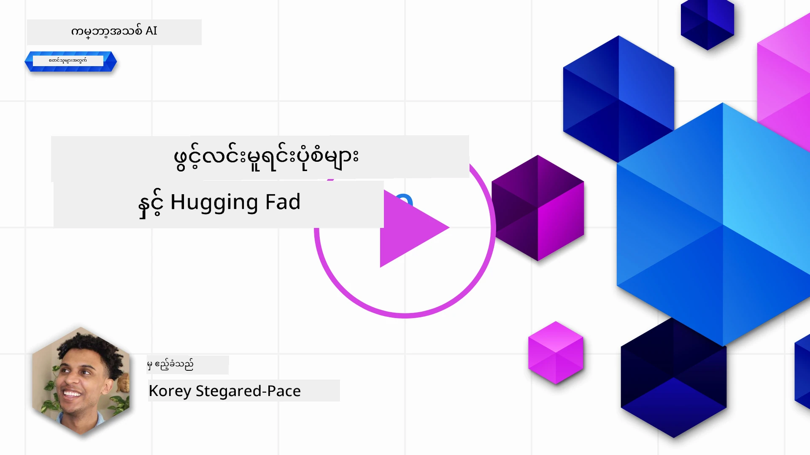
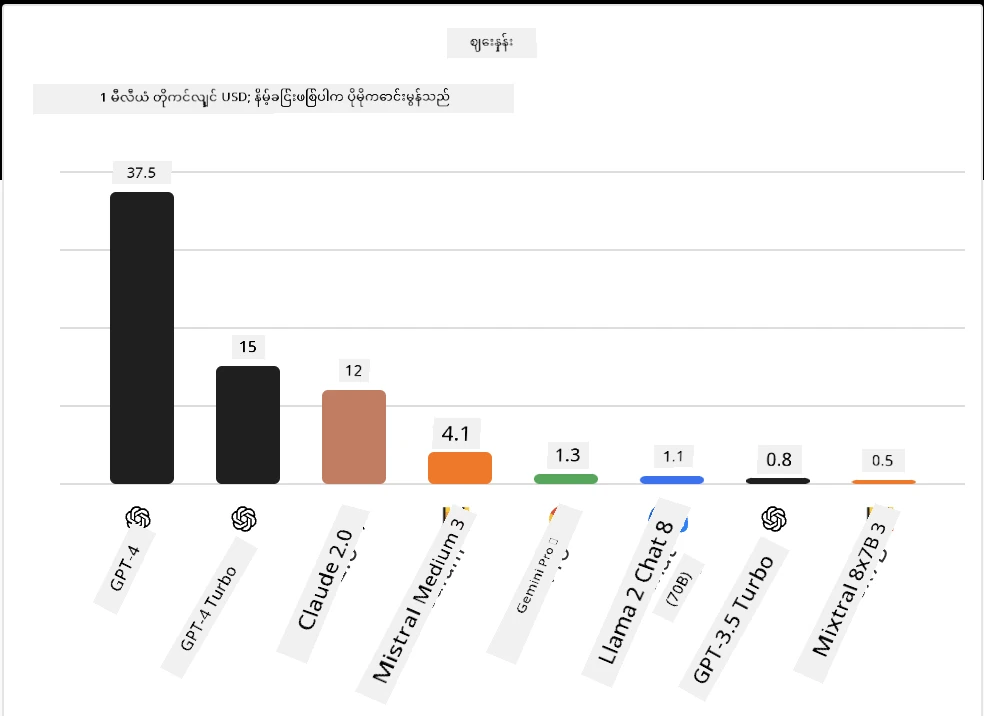
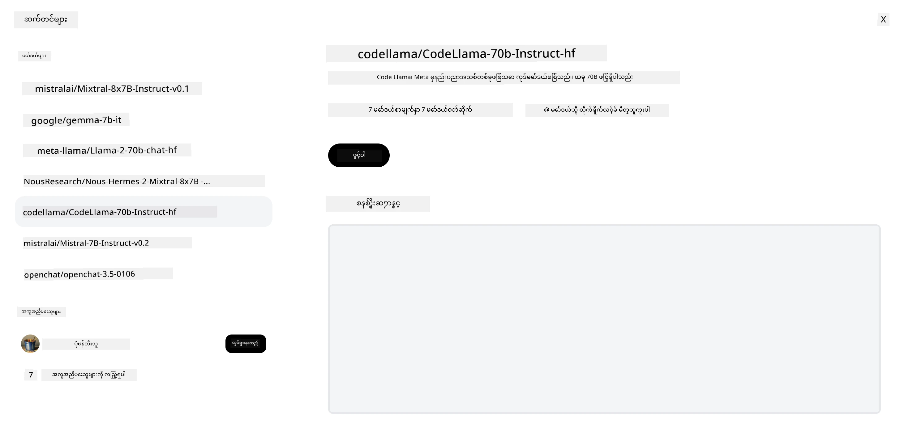
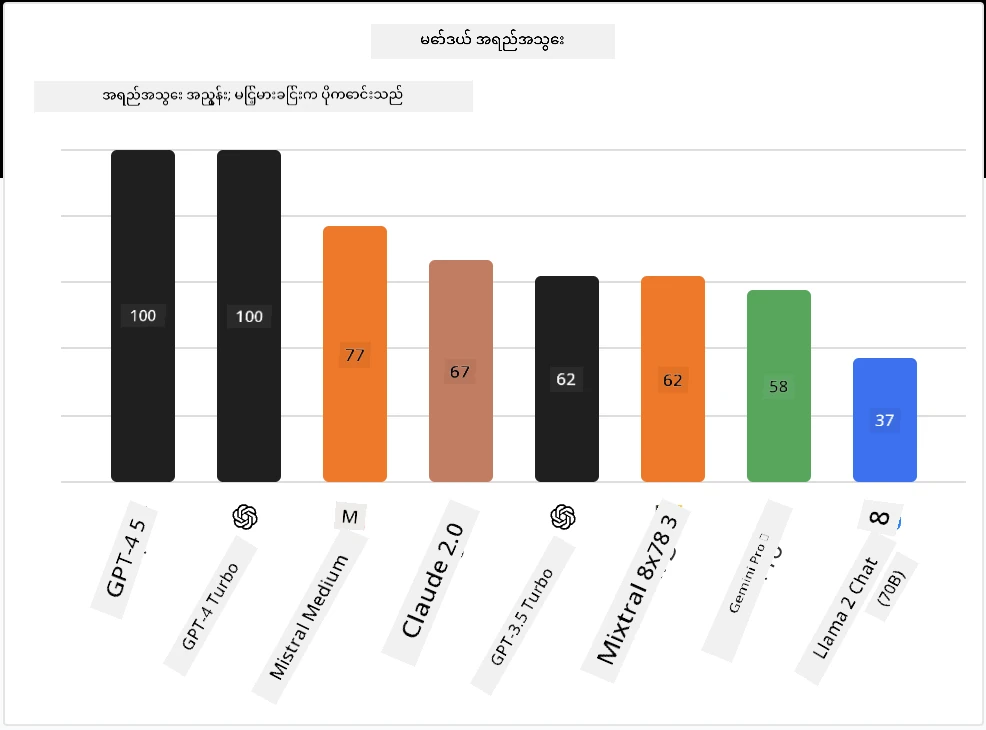

## နိဒါန်း

ဖွင့်မုတ်ဆော့ (open-source) LLM များ၏ကမ္ဘာသည် စိတ်လှုပ်ရှားဖွယ်အပြီး အမြဲတမ်းတိုးတက်နေသည်။ ဤသင်ခန်းစာဖြင့် ဖွင့်မုတ် မော်ဒယ်များကို အပြည့်အဝနားလည်စေရန်ရည်ရွယ်သည်။ ပိုင်ဆိုင်မှုမော်ဒယ်များနှင့် ဖွင့်မုတ်မော်ဒယ်များကို ညှိနှိုင်းရှာဖွေရန်အတွက် ["Exploring and Comparing Different LLMs" သင်ခန်းစာ](../02-exploring-and-comparing-different-llms/README.md?WT.mc_id=academic-105485-koreyst) သို့ သွားပါ။ ၎င်းသင်ခန်းစာတွင် fine-tuning အကြောင်းလည်း ကိုင်တွယ်ဖော်ပြထားပြီး ["Fine-Tuning LLMs" သင်ခန်းစာ](../18-fine-tuning/README.md?WT.mc_id=academic-105485-koreyst) တွင် အသေးစိတ်ရှင်းလင်းထားသည်။

## သင်ယူရမည့်ရည်မှန်းချက်များ

- ဖွင့်မုတ် မော်ဒယ်များကို နားလည်စေရန်
- ဖွင့်မုတ် မော်ဒယ်များဖြင့် အလုပ်လုပ်ရာ၏ အကျိုးကျေးဇူးများကို နားလည်စေရန်
- Hugging Face နှင့် Microsoft Foundry မော်ဒယ် ကတ်တာလော့များရှိ ဖွင့်မုတ် မော်ဒယ်များကို ရှာဖွေရေး

## ဖွင့်မုတ် မော်ဒယ်များ ဆိုတာဘာလဲ?

ဖွင့်မုတ် ဆော့ဖ်ဝဲသည် နည်းပညာအမျိုးမျိုးတွင် တိုးတက်မှုအတွက် အရေးပါသော အခန်းကဏ္ဍ ဖြစ်ခဲ့သည်။ Open Source Initiative (OSI) မှ [ဆော့ဖ်ဝဲဖွင့်မုတ် အဖြစ် သတ်မှတ်ရန် စံချိန် ၁၀ ချက်](https://web.archive.org/web/20241126001143/https://opensource.org/osd?WT.mc_id=academic-105485-koreyst) ကို သတ်မှတ်ထားသည်။ အဆိုပါ ဆော့ဖ်ဝဲ၏ source ကို OSI အတည်ပြုထားသော လိုင်စင်ဖြင့် အားလုံးနှင့် မျှဝေထားရမည်ဖြစ်သည်။

LLM များ တီထွင်ခြင်းသည် ဆော့ဖ်ဝဲဖွံ့ဖြိုးတိုးတက်မှုနှင့် ဆင်တူသော အစိတ်အပိုင်းများ ရှိသော်လည်း အတိအကျ တူညီခြင်းမရှိပါ။ ထို့ကြောင့် LLM များတွင် ဖွင့်မုတ် ဆိုသော သတ်မှတ်ချက်ဆိုင်ရာ လူမှုအသိုင်းအဝိုင်းတွင် ဆွေးနွေးမှုများ ဖြစ်ပေါ်လာခဲ့သည်။ ထုံးစံအတိုင်း ဖွင့်မုတ် ဟု သတ်မှတ်ရန်အတွက် အောက်ပါအချက်များကို အများပြည်သူ သုံးသပ်နိုင်ရမည်။

- မော်ဒယ်ကို ချိန်းသတ်ရန် သုံးထားသော ဒေတာစုပေါင်းများ
- သင်ကြားသည့် မော်ဒယ်အလေးချိန်များအပြည့်အစုံ
- လေ့လာမှုကုဒ်များ
- fine-tuning အတွက်ကုဒ်များ
- မော်ဒယ်အလေးချိန်များနှင့် သင်ကြားမှု တိုင်းတာချက်များ အပြည့်အစုံ

လက်ရှိတွင် ဤစံညွှန်းနှင့် ကိုက်ညီသည့် မော်ဒယ်အနည်းငယ်သာ ရှိပါသည်။ [Allen Institute for Artificial Intelligence (AllenAI) ဖန်တီးသော OLMo မော်ဒယ်](https://huggingface.co/allenai/OLMo-7B?WT.mc_id=academic-105485-koreyst) သည် ထိုအမျိုးအစားထဲမှ တစ်ခုဖြစ်သည်။

ဤသင်ခန်းစာတွင် မော်ဒယ်များကို "ဖွင့်မုတ် မော်ဒယ်" ဟု ခေါ်ဆိုမည်၊ မူလစံညွှန်းအတိုင်း မကိုက်ညီ ဖြစ်နိုင်သောကြောင့် ဖြစ်ပါသည်။

## ဖွင့်မုတ် မော်ဒယ်များ၏ အကျိုးကျေးဇူးများ

**အလွန်စိတ်ကြိုက်ပြုပြင်နိုင်ခြင်း** - ဖွင့်မုတ် မော်ဒယ်များသည် သေချာသော သင်ကြားမှု အချက်အလက်များနှင့် ထုတ်ဝေထားသောကြောင့် သုတေသနပြုသူများ သည် မော်ဒယ်၏ အတွင်းပိုင်းများကို ပြင်ဆင်နိုင်သည်။ ၎င်းအားဖြင့် အထူးပြု တိကျသည့် တာဝန်များ သို့မဟုတ် သုတေသနခွင်ရာတို့အတွက် fine-tuned မော်ဒယ်များ ဖန်တီးနိုင်ပါသည်။ ဥပမာများမှာ ကုဒ်ထုတ်လုပ်ခြင်း၊ သင်္ချာစွမ်းဆောင်မှုများနှင့် ဇီဝဗေဒတို့ ဖြစ်သည်။

**ကုန်ကျစရိတ်** - ၎င်း မော်ဒယ်များကို အသုံးပြုခြင်းနှင့် တပ်ဆင်ခြင်း၏ တစ်တိုက်ငွေသည် ပိုင်ဆိုင်မှုမော်ဒယ်များထက် သက်သာသည်။ Generative AI အက်ပလီကေးရှင်းများ တည်ဆောက်ရာတွင် မော်ဒယ်များ၏ စွမ်းဆောင်ရည်နှင့် စျေးနှုန်း နှိုင်းယှဉ်စဉ် သတ်မှတ်အသုံးပြုရန်လိုသည်။

ရင်းမြစ် - Artificial Analysis

**လွယ်လင့်တကူ အသုံးပြုနိုင်မှု** - ဖွင့်မုတ် မော်ဒယ်များဖြင့် အလုပ်လုပ်ခြင်းသည် မော်ဒယ်အမျိုးမျိုး အသုံးပြုခြင်း သို့မဟုတ် ပေါင်းစပ်အသုံးပြုခြင်း တွင် လွယ်ကူသော လွတ်လပ်မှုရှိစေသည်။ ဥပမာတွင် [HuggingChat Assistants](https://huggingface.co/chat?WT.mc_id=academic-105485-koreyst) တွင် အသုံးပြုသူသည် အသုံးပြုမည့် မော်ဒယ်ကို တိုက်ရိုက် မျက်နှာပြင်အင်တာဖေ့စ်တွင် ရွေးချယ်နိုင်သည်။

## ဖွင့်မုတ် မော်ဒယ် အမျိုးမျိုးကို ရှာဖွေခြင်း

### Llama 2

[Llama2](https://huggingface.co/meta-llama?WT.mc_id=academic-105485-koreyst) သည် Meta မှ တီထွင်ထားသော ဖွင့်မုတ် မော်ဒယ်ဖြစ်ပြီး စကားပြော အပလီကေးရှင်းများအတွက် အထူးသင့်လျော်သည်။ ၎င်း၏ fine-tuning နည်းလမ်းမှာ စကားပြောများနှင့် လူမှတုံ့ပြန်ချက်များအများကြီး အသုံးပြုမှုကို အခြေပြုထားသည်။ ၎င်းနည်းလမ်းကြောင့် မော်ဒယ်သည် လူ့မျှော်မှန်းချက်နှင့် ပိုအညီအမျှဖြစ်သော အဖြေများ ပေးစွမ်းနိုင်ပြီး အသုံးပြုသူအတွေ့အကြုံကို တိုးတက်စေသည်။

Llama ၏ fine-tuned ဗားရှင်း အချို့မှာ ဂျပန်ဘာသာအထူးပြုသော [Japanese Llama](https://huggingface.co/elyza/ELYZA-japanese-Llama-2-7b?WT.mc_id=academic-105485-koreyst) နှင့် မူလမော်ဒယ်ထက်တိုးတက်မှုရှိသော [Llama Pro](https://huggingface.co/TencentARC/LLaMA-Pro-8B?WT.mc_id=academic-105485-koreyst) တို့ ဖြစ်သည်။

### Mistral

[Mistral](https://huggingface.co/mistralai?WT.mc_id=academic-105485-koreyst) သည် ထိရောက်မှုနှင့် စွမ်းဆောင်ရည်အာရုံစိုက်သော ဖွင့်မုတ် မော်ဒယ်ဖြစ်သည်။ ၎င်းတွင် Mixture-of-Experts နည်းလမ်းအသုံးပြုထားပြီး အထူးပြု ကျွမ်းကျင်သူ မော်ဒယ်အုပ်စုများကို ပေါင်းစပ်ထားသည်။ ထိုအုပ်စုမှ အသုံးပြုမည့် မော်ဒယ်သည် အဝင်ဖြတ်စစ်ခြင်းပေါ်မူတည်၍ ရွေးချယ်ပြုလုပ်သည်။ ထို့ကြောင့် ကွန်ပြူတာတွက်ချက်မှု သက်သာကောင်းမွန်ပြီး မော်ဒယ်များသည် မိမိအထူးပြုသော အဝင်များပဲ ကိုင်တွယ်မည်ဖြစ်သည်။

Mistral ၏ fine-tuned ဗားရှင်း အနက် [BioMistral](https://huggingface.co/BioMistral/BioMistral-7B?text=Mon+nom+est+Thomas+et+mon+principal?WT.mc_id=academic-105485-koreyst) သည် ဆေးဘက်ဆိုင်ရာ ထူးခြားပြီး [OpenMath Mistral](https://huggingface.co/nvidia/OpenMath-Mistral-7B-v0.1-hf?WT.mc_id=academic-105485-koreyst) သည် သင်္ချာတွက်ချက်မှုများ လုပ်ဆောင်သည်။

### Falcon

[Falcon](https://huggingface.co/tiiuae?WT.mc_id=academic-105485-koreyst) သည် Technology Innovation Institute (**TII**) မှ ဖန်တီးထားသော LLM ဖြစ်သည်။ Falcon-40B ကို parameter 40 ဘီလီယံ သင်ကြားထားပြီး GPT-3 ထက် ကွန်ပြူတာ စွမ်းဆောင်ရည်နည်းစနစ်ဖြင့် ပိုကောင်းစွာ လုပ်ဆောင်နိုင်သည်ဟု ပြသထားသည်။ ၎င်းမှာ FlashAttention နည်းပညာနှင့် multiquery attention ကို အသုံးပြု၍ လေ့လာသည့်အချိန်တွင် မှတ်ဉာဏ် လိုအပ်ချက်များ လျော့ချပေးနိုင်သည်။ အချိန်လျော့ထားသဖြင့် Falcon-40B သည် စကားပြော အပလီကေးရှင်းများအတွက် သင့်လျော်သည်။

Falcon ၏ fine-tuned ဗားရှင်းများအနက် [OpenAssistant](https://huggingface.co/OpenAssistant/falcon-40b-sft-top1-560?WT.mc_id=academic-105485-koreyst) ဟာ ဖွင့်မုတ် မော်ဒယ်ကို အခြေခံထားသော အကူအညီပေး မော်ဒယ်ဖြစ်ပြီး [GPT4ALL](https://huggingface.co/nomic-ai/gpt4all-falcon?WT.mc_id=academic-105485-koreyst) သည် မူလမော်ဒယ်ထက် အဆင့်မြင့်စွမ်းဆောင်မှု ပေးစွမ်းသည်။

## မည်သို့ရွေးချယ်မည်နည်း

ဖွင့်မုတ် မော်ဒယ် ရွေးချယ်ရာတွင် တစ်မျိုးတည်းဖြစ်သည်ဟု ပြော၍ မရပါ။ စတင်ရာတွင် Microsoft Foundry မော်ဒယ်ကတ်တာလော့မှ အလုပ်တာဝန်အလိုက် စစ်ဆေးခြင်းကောင်းပါသည်။ ၎င်းက မော်ဒယ်များ၏ လေ့လာသင်ကြားထားသော အလုပ်ဆောင်တာဝန်များကို နားလည်နိုင်စေသည်။ Hugging Face မှလည်း LLM Leaderboard ကို ထိန်းသိမ်းထားပြီး ဖော်ပြထားသော အချက်အလက်များအပေါ် မော်ဒယ်များ၏အကောင်းဆုံးစွမ်းဆောင်ရည်ကို ဖော်ပြသည်။

မတူညီသည့်အမျိုးအစားများအလိုက် LLM များကို နှိုင်းယှဉ်ကြည့်လိုပါက၊ [Artificial Analysis](https://artificialanalysis.ai/?WT.mc_id=academic-105485-koreyst) သည် ထိရောက်သော ရင်းမြစ်တစ်ခု ဖြစ်သည်။

ရင်းမြစ် - Artificial Analysis

သီးသန့် အလုပ်များအတွက် အထူးပြု fine-tuned မော်ဒယ်များကို ရှာဖွေရန် သင့်အား အကျိုးရှိနိုင်သည်။ မော်ဒယ်အနည်းငယ်ကို စမ်းသပ်ကြည့်ပြီး သင့်နှင့် သင့်အသုံးပြုသူများ၏ မျှော်မှန်းချက်အရ စွမ်းဆောင်ရည် ဘယ်လို ဖြစ်နေသည့်ကို တွေ့ရှိရန် ကောင်းမွန်သောလေ့လာမှု ဖြစ်သည်။

## နောက်တဆင့်များ

ဖွင့်မုတ် မော်ဒယ်များ၏ အကောင်းဆုံးအချက်မှာ အလျင်အမြန် စတင်အသုံးပြုနိုင်ခြင်း ဖြစ်သည်။ ဤသင်ခန်းစာတွင် ဆွေးနွေးခဲ့သည့် မော်ဒယ်များ ပါဝင်သော Hugging Face အစုအဝေးပါ အသုံးပြုနိုင်သော [Microsoft Foundry မော်ဒယ် ကတ်တာလော့](https://ai.azure.com?WT.mc_id=academic-105485-koreyst) ကို ကြည့်ရှုပါ။

## သင်ယူခြင်းသည် ဤနေရာတွင် မရပ်သေးပါ၊ ခရီးကိုဆက်လက် ခ်ဥ်းကပ်ပါ

ဤသင်ခန်းစာ ပြီးမြောက်ပြီးနောက်တွင်၊ ကျွန်ုပ်တို့၏ [Generative AI သင်ယူမှုစုစည်းမှု](https://aka.ms/genai-collection?WT.mc_id=academic-105485-koreyst) ကို ကြည့်ပြီး Generative AI အကြောင်း သိမြင်မှု ပိုမိုတက်မြောက်စေရန် ဆက်လက်လေ့လာပါ။

---

<!-- CO-OP TRANSLATOR DISCLAIMER START -->
**ပြောကြားချက်**
ဤစာတမ်းကို AI ဘာသာပြန်ဝန်ဆောင်မှု [Co-op Translator](https://github.com/Azure/co-op-translator) အသုံးပြု၍ ဘာသာပြန်ထားပါသည်။ ကျွန်ုပ်တို့သည် တိကျမှန်ကန်မှုအတွက် ကြိုးပမ်းနေသော်လည်း၊ စက်ကိရိယာဘာသာပြန်ခြင်းများတွင် အမှားများ သို့မဟုတ် မှားယွင်းချက်များ ပါဝင်နိုင်ကြောင်း သတိပြုပါရန် လိုအပ်ပါသည်။ မူလစာတမ်းကို မူရင်းဘာသာဖြင့်သာ ယုံကြည်စိတ်ချရသော အချက်အလက်အဖြစ် သတ်မှတ်သင့်သည်။ အရေးကြီးသည့် သတင်းအချက်အလက်များအတွက် ပရော်ဖက်ရှင်နယ် လူသားဘာသာပြန်သူဝန်ဆောင်မှုကို အကြံပြုပါသည်။ ဤဘာသာပြန်ချက်ကို အသုံးပြုခြင်းမှ ဖြစ်ပေါ်လာသော နားလည်မှုကွာခြားမှုများ သို့မဟုတ် မမှန်ကန်သော အသုံးပြုမှုများအတွက် ကျွန်ုပ်တို့ တာဝန်မခံပါ။
<!-- CO-OP TRANSLATOR DISCLAIMER END -->