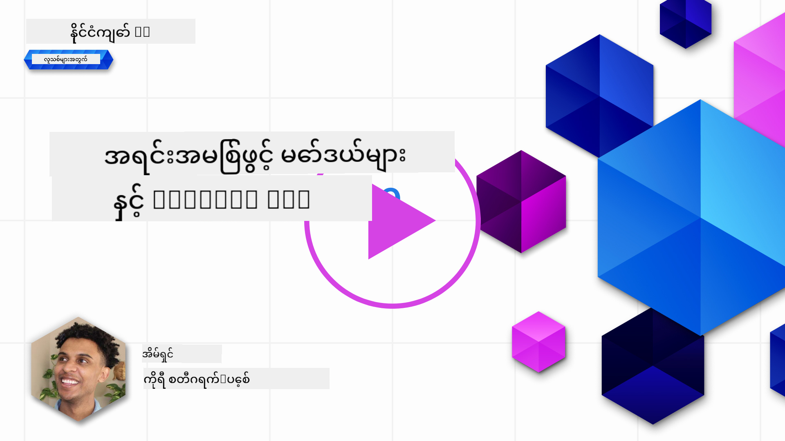
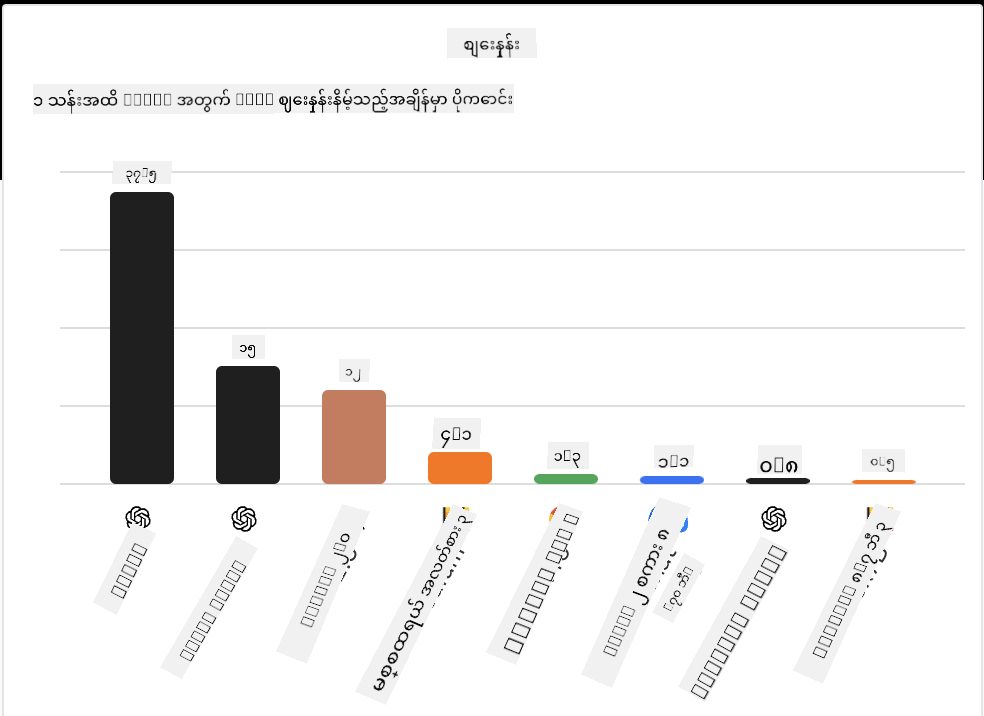
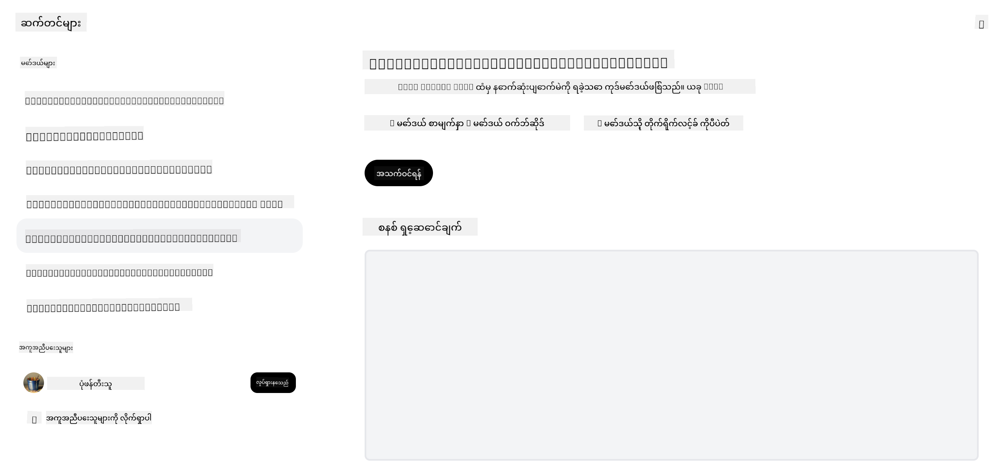

<!--
CO_OP_TRANSLATOR_METADATA:
{
  "original_hash": "0bba96e53ab841d99db731892a51fab8",
  "translation_date": "2025-06-26T00:06:06+00:00",
  "source_file": "16-open-source-models/README.md",
  "language_code": "my"
}
-->

## မိတ်ဆက်

ပွင့်လင်းရင်းမြစ် LLMs ကမ္ဘာကြီးသည် စိတ်လှုပ်ရှားဖွယ်ရာဖြစ်ပြီး အမြဲတမ်းတိုးတက်ပြောင်းလဲနေသည်။ ဒီသင်ခန်းစာမှာ ပွင့်လင်းရင်းမြစ်မော်ဒယ်များကို အပြည့်အဝ ရှင်းလင်းဖို့ ရည်ရွယ်ပါတယ်။ ပိုင်ဆိုင်မှုမော်ဒယ်များနဲ့ ပွင့်လင်းရင်းမြစ်မော်ဒယ်များ ဘယ်လို နှိုင်းယှဉ်ရမလဲဆိုတဲ့ အချက်အလက်ကို ရှာဖွေနေပါက ["မတူညီသော LLMs များကို ရှာဖွေခြင်းနှင့် နှိုင်းယှဉ်ခြင်း" သင်ခန်းစာ](../02-exploring-and-comparing-different-llms/README.md?WT.mc_id=academic-105485-koreyst) ကို သွားပါ။ ဒီသင်ခန်းစာမှာလည်း ပြုပြင်ချိန်ညှိခြင်းကို လိုက်ဖွယ်ရှိပြီး ["LLMs များကို ပြုပြင်ချိန်ညှိခြင်း" သင်ခန်းစာ](../18-fine-tuning/README.md?WT.mc_id=academic-105485-koreyst) မှာ ပိုမိုအသေးစိတ် ရှင်းလင်းထားသည်။

## သင်ယူမှုရည်ရွယ်ချက်များ

- ပွင့်လင်းရင်းမြစ်မော်ဒယ်များကို နားလည်မှုရရှိခြင်း
- ပွင့်လင်းရင်းမြစ်မော်ဒယ်များနဲ့ အလုပ်လုပ်ရတာရဲ့ အကျိုးကျေးဇူးများကို နားလည်ခြင်း
- Hugging Face နဲ့ Azure AI Studio မှာ ရရှိနိုင်တဲ့ ပွင့်လင်းမော်ဒယ်များကို ရှာဖွေခြင်း

## ပွင့်လင်းရင်းမြစ်မော်ဒယ်များဆိုတာဘာလဲ?

ပွင့်လင်းရင်းမြစ်ဆော့ဖ်ဝဲသည် နည်းပညာတိုးတက်မှုတွင် အရေးကြီးသော အခန်းကဏ္ဍကို အမျိုးမျိုးသော နယ်ပယ်များတွင် ဆောင်ရွက်ခဲ့သည်။ ပွင့်လင်းရင်းမြစ်အဖွဲ့အစည်း (OSI) သည် ဆော့ဖ်ဝဲကို ပွင့်လင်းရင်းမြစ်အဖြစ် သတ်မှတ်ရန် [၁၀ ခု criteria](https://web.archive.org/web/20241126001143/https://opensource.org/osd?WT.mc_id=academic-105485-koreyst) ကို သတ်မှတ်ထားသည်။ ရင်းမြစ်ကုဒ်ကို OSI မှ အတည်ပြုထားသောလိုင်စင်အောက်တွင် ပွင့်လင်းမျှဝေသင့်သည်။

LLMs ဖွံ့ဖြိုးတိုးတက်မှုသည် ဆော့ဖ်ဝဲဖွံ့ဖြိုးတိုးတက်မှုနှင့် ဆင်တူသော အစိတ်အပိုင်းများ ရှိသော်လည်း လုပ်ဆောင်မှုအဆင့်စဥ်မှာ အတိအကျ တူညီသည်မဟုတ်ပါ။ ဒီကိစ္စသည် LLMs ရဲ့ ပွင့်လင်းရင်းမြစ် သတ်မှတ်ချက်ကို သတ်မှတ်ရာတွင် အများပြည်သူတွင် ဆွေးနွေးမှုများကို ဖြစ်ပေါ်စေခဲ့သည်။ ပွင့်လင်းရင်းမြစ်ရဲ့ ရိုးရာသတ်မှတ်ချက်နှင့် ကိုက်ညီရန် မော်ဒယ်တစ်ခုအတွက် အောက်ပါအချက်အလက်များကို အများပြည်သူထံ ပွင့်လင်းရရှိနိုင်သင့်သည် -

- မော်ဒယ်ကို လေ့ကျင့်ရန် အသုံးပြုသော ဒေတာစာရင်းများ။
- လေ့ကျင့်မှုရဲ့ အစိတ်အပိုင်းအဖြစ် အပြည့်အစုံ မော်ဒယ်အလေးချိန်များ။
- အကဲဖြတ်မှုကုဒ်။
- ပြုပြင်ချိန်ညှိမှုကုဒ်။
- အပြည့်အစုံ မော်ဒယ်အလေးချိန်များနှင့် လေ့ကျင့်မှုဂဏန်းရလဒ်များ။

လက်ရှိတွင် ဒီ criteria နဲ့ ကိုက်ညီတဲ့ မော်ဒယ်များ အနည်းငယ်သာ ရှိပါသည်။ [Allen Institute for Artificial Intelligence (AllenAI) မှ ဖန်တီးသော OLMo မော်ဒယ်](https://huggingface.co/allenai/OLMo-7B?WT.mc_id=academic-105485-koreyst) သည် ဒီအမျိုးအစားနှင့် ကိုက်ညီပါသည်။

ဒီသင်ခန်းစာအတွက် မော်ဒယ်များကို "ပွင့်လင်းမော်ဒယ်များ" ဟု ဆက်၍ ရည်ညွှန်းမည်ဖြစ်ပြီး အရေးသားချိန်တွင် အထက်ပါ criteria ကို မကိုက်ညီနိုင်ပါ။

## ပွင့်လင်းမော်ဒယ်များရဲ့ အကျိုးကျေးဇူးများ

**အလွန်ကို Customize လုပ်နိုင်ခြင်း** - ပွင့်လင်းမော်ဒယ်များသည် အသေးစိတ်လေ့ကျင့်မှုအချက်အလက်များနှင့် အတူ ဖြန့်ချီထားသောကြောင့် သုတေသနပြုသူများနှင့် ဖွံ့ဖြိုးရေးဆိုင်ရာများသည် မော်ဒယ်ရဲ့ အတွင်းပိုင်းကို ပြုပြင်နိုင်သည်။ ဒီအချက်သည် အထူးပြုလုပ်ထားသော မော်ဒယ်များကို တစ်ခုခုသော တာဝန်ဝတ္တရား သို့မဟုတ် လေ့လာမှုနယ်ပယ်အတွက် အထူးပြုပြင်ချိန်ညှိထားသော မော်ဒယ်များကို ဖန်တီးနိုင်စေသည်။ ဥပမာအချို့မှာ ကုဒ်ဖန်တီးခြင်း၊ သင်္ချာဆိုင်ရာလုပ်ဆောင်မှုများနှင့် ဓာတုဗေဒဖြစ်သည်။

**ကုန်ကျစရိတ်** - ဒီမော်ဒယ်များကို အသုံးပြုခြင်းနှင့် ဖြန့်ချီခြင်းအတွက် token တစ်ခုချင်းစီ၏ ကုန်ကျစရိတ်သည် ပိုင်ဆိုင်မှုမော်ဒယ်များထက် ပိုမိုနည်းသည်။ Generative AI လျှောက်လွှာများကို တည်ဆောက်ရာတွင် သင့်ရဲ့ အသုံးပြုမှုအတွက် ဒီမော်ဒယ်များကို အသုံးပြုရာတွင် စွမ်းဆောင်ရည် vs စျေးနှုန်းကို ကြည့်ရမည်။

  
အရင်းအမြစ်: Artificial Analysis

**ကြိုးစားနိုင်မှု** - ပွင့်လင်းမော်ဒယ်များနဲ့ အလုပ်လုပ်ခြင်းက မော်ဒယ်မျိုးစုံကို အသုံးပြုခြင်း သို့မဟုတ် ပေါင်းစပ်ခြင်းအတွက် ကြိုးစားနိုင်စေသည်။ ဒီအရာရဲ့ ဥပမာတစ်ခုမှာ [HuggingChat Assistants](https://huggingface.co/chat?WT.mc_id=academic-105485-koreyst) ဖြစ်ပြီး အသုံးပြုသူသည် အသုံးပြုသူအင်တာဖေ့စ်တွင် သုံးနေသော မော်ဒယ်ကို တိုက်ရိုက်ရွေးချယ်နိုင်သည် -

## မတူညီသော ပွင့်လင်းမော်ဒယ်များကို ရှာဖွေခြင်း

### Llama 2

Meta မှ ဖန်တီးသော [LLama2](https://huggingface.co/meta-llama?WT.mc_id=academic-105485-koreyst) သည် စကားပြောအခြေခံ လျှောက်လွှာများအတွက် အထူးပြုပြင်ထားသော ပွင့်လင်းမော်ဒယ်ဖြစ်သည်။ ဒီအချက်သည် စကားပြောများနှင့် လူ့တုံ့ပြန်မှုများကို ကြီးမားသော ပမာဏဖြင့် ထည့်သွင်းထားသော ပြုပြင်ချိန်ညှိမှုနည်းလမ်းကြောင့် ဖြစ်သည်။ ဒီနည်းလမ်းဖြင့် မော်ဒယ်သည် လူ့မျှော်လင့်ချက်နှင့် ကိုက်ညီသော ရလဒ်များကို ပိုမိုထုတ်လုပ်ပေးပြီး အသုံးပြုသူအတွေ့အကြုံကို ပိုမိုကောင်းမွန်စေသည်။

Llama ရဲ့ ပြုပြင်ချိန်ညှိထားသော ဗားရှင်းများရဲ့ ဥပမာအချို့မှာ ဂျပန်ဘာသာရပ်ကို အထူးပြုထားသော [Japanese Llama](https://huggingface.co/elyza/ELYZA-japanese-Llama-2-7b?WT.mc_id=academic-105485-koreyst) နှင့် အခြေခံမော်ဒယ်ကို မြှင့်တင်ထားသော [Llama Pro](https://huggingface.co/TencentARC/LLaMA-Pro-8B?WT.mc_id=academic-105485-koreyst) ဖြစ်သည်။

### Mistral

[Mistral](https://huggingface.co/mistralai?WT.mc_id=academic-105485-koreyst) သည် မြင့်မားသော စွမ်းဆောင်ရည်နှင့် ထိရောက်မှုကို အလေးပေးထားသော ပွင့်လင်းမော်ဒယ်ဖြစ်သည်။ အထူးပြုသော အကျွမ်းတဝင်မော်ဒယ်များကို တစ်စုံတစ်ခုသော စနစ်အဖြစ် ပေါင်းစပ်ထားသော Mixture-of-Experts နည်းလမ်းကို အသုံးပြုသည်။ input အပေါ်မူတည်ပြီး သတ်မှတ်ထားသော မော်ဒယ်များကို အသုံးပြုရန် ရွေးချယ်သည်။ ဒီနည်းလမ်းကြောင့် ကွန်ပျူတာလုပ်ဆောင်မှုကို ပိုမိုထိရောက်စေပြီး မော်ဒယ်များသည် သူတို့အထူးပြုထားသော inputs ကိုသာ ကူညီဆောင်ရွက်သည်။

Mistral ရဲ့ ပြုပြင်ချိန်ညှိထားသော ဗားရှင်းများရဲ့ ဥပမာအချို့မှာ ဆေးဘက်ဆိုင်ရာနယ်ပယ်ကို အထူးပြုထားသော [BioMistral](https://huggingface.co/BioMistral/BioMistral-7B?text=Mon+nom+est+Thomas+et+mon+principal?WT.mc_id=academic-105485-koreyst) နှင့် သင်္ချာဆိုင်ရာ လုပ်ဆောင်မှုများကို ပြုလုပ်သော [OpenMath Mistral](https://huggingface.co/nvidia/OpenMath-Mistral-7B-v0.1-hf?WT.mc_id=academic-105485-koreyst) ဖြစ်သည်။

### Falcon

[Falcon](https://huggingface.co/tiiuae?WT.mc_id=academic-105485-koreyst) သည် နည်းပညာတီထွင်မှုအဖွဲ့အစည်း (**TII**) မှ ဖန်တီးထားသော LLM ဖြစ်သည်။ Falcon-40B ကို 40 ဘီလီယံ parameters ပေါ်မှာ လေ့ကျင့်ထားပြီး GPT-3 ထက် compute budget နည်းပါးသောအခြေအနေတွင် ပိုမိုကောင်းမွန်သော စွမ်းဆောင်ရည်ကို ပြသနိုင်သည်။ ဒါက FlashAttention algorithm နဲ့ multiquery attention ကို အသုံးပြုထားသောကြောင့် လုပ်ဆောင်မှုအချိန်မှာ memory လိုအပ်ချက်ကို လျှော့ချနိုင်စေသည်။ Falcon-40B ရဲ့ လျှော့ချထားသော လုပ်ဆောင်မှုအချိန်ကြောင့် စကားပြောလျှောက်လွှာများအတွက် သင့်လျော်သည်။

Falcon ရဲ့ ပြုပြင်ချိန်ညှိထားသော ဗားရှင်းများရဲ့ ဥပမာအချို့မှာ ပွင့်လင်းမော်ဒယ်များပေါ်မှာ ဖန်တီးထားသော အကူအညီ [OpenAssistant](https://huggingface.co/OpenAssistant/falcon-40b-sft-top1-560?WT.mc_id=academic-105485-koreyst) နှင့် အခြေခံမော်ဒယ်ထက် မြင့်မားသော စွမ်းဆောင်ရည်ကို ပေးသော [GPT4ALL](https://huggingface.co/nomic-ai/gpt4all-falcon?WT.mc_id=academic-105485-koreyst) ဖြစ်သည်။

## ဘယ်လိုရွေးချယ်ရမလဲ

ပွင့်လင်းမော်ဒယ်ကို ရွေးချယ်ဖို့ တစ်ခုတည်းသော အဖြေမရှိပါ။ Azure AI Studio ရဲ့ filter by task အင်္ဂါရပ်ကို အသုံးပြုပြီး စတင်ရန်ကောင်းသည်။ ဒီအရာက မော်ဒယ်ကို ဘယ်လို tasks များအတွက် လေ့ကျင့်ထားသလဲဆိုတာ နားလည်ရန် ကူညီပေးပါမည်။ Hugging Face မှလည်း အကောင်းဆုံး စွမ်းဆောင်ရည်ပြသော မော်ဒယ်များကို သတ်မှတ် metrics အပေါ်မူတည်ပြီး ပြသထားသော LLM Leaderboard ကို ထိန်းသိမ်းထားသည်။

မတူညီသောအမျိုးအစားများအတွက် LLMs များကို နှိုင်းယှဉ်ကြည့်ရန် [Artificial Analysis](https://artificialanalysis.ai/?WT.mc_id=academic-105485-koreyst) သည် အခြားကောင်းမွန်သော အရင်းအမြစ်ဖြစ်သည် -

  
အရင်းအမြစ်: Artificial Analysis

အထူးပြုလုပ်ထားသော ဗားရှင်းများကို ရှာဖွေခြင်းသည် ထိုနယ်ပယ်ကို အထူးပြုပြင်ထားသော ဗားရှင်းများကို ရှာဖွေခြင်းသည် ထိရောက်သည်။ သင့်ရဲ့ အကောင်အထည်ဖော်မှုနှင့် သင့်အသုံးပြုသူများရဲ့ မျှော်လင့်ချက်နှင့် အညီ စွမ်းဆောင်ရည်ပြသော ပွင့်လင်းမော်ဒယ်များကို စမ်းသပ်ခြင်းသည် တစ်ခုကောင်းမွန်သော လက်တွေ့ကျကျဖြစ်သည်။

## နောက်ထပ်အဆင့်များ

ပွင့်လင်းမော်ဒယ်များရဲ့ အကောင်းဆုံးအပိုင်းက သင်သည် သူတို့နဲ့ အလုပ်လုပ်ဖို့ အလွန်လွယ်ကူစွာ စတင်နိုင်သည်။ ဒီမှာ ရှင်းလင်းခဲ့တဲ့ မော်ဒယ်များနဲ့ Hugging Face collection တစ်ခုကို ထူးခြားစွာ ထည့်သွင်းထားသော [Azure AI Studio Model Catalog](https://ai.azure.com?WT.mc_id=academic-105485-koreyst) ကို ကြည့်ပါ။

## သင်ယူခြင်းသည် ဒီမှာ ရပ်တန့်မည်မဟုတ်၊ ခရီးကို ဆက်လက်လုပ်ဆောင်ပါ

ဒီသင်ခန်းစာကို ပြီးမြောက်ပြီးနောက်၊ သင့်ရဲ့ Generative AI အသိပညာကို အဆင့်မြှင့်တင်ရန် [Generative AI Learning collection](https://aka.ms/genai-collection?WT.mc_id=academic-105485-koreyst) ကို ကြည့်ပါ!

**Disclaimer**:  
ဤစာရွက်ကို AI ဘာသာပြန်ဝန်ဆောင်မှု [Co-op Translator](https://github.com/Azure/co-op-translator) ကို အသုံးပြုပြီး ဘာသာပြန်ထားပါသည်။ ကျွန်ုပ်တို့သည် တိကျမှုအတွက် ကြိုးစားနေသော်လည်း အလိုအလျောက် ဘာသာပြန်ချက်များတွင် အမှားများ သို့မဟုတ် မှားယွင်းမှုများ ပါဝင်နိုင်သည်ကို သိရှိထားပါ။ ဒေသိယ ဘာသာစကားဖြင့် ရေးသားထားသော မူရင်းစာရွက်ကို အာဏာတော်မူသော ရင်းမြစ်အဖြစ် သတ်မှတ်သင့်ပါသည်။ အရေးကြီးသော အချက်အလက်များအတွက် လူသား ဘာသာပြန်သူများမှ ကျွမ်းကျင်သော ဘာသာပြန်ခြင်းကို သုံးသင့်ပါသည်။ ဤဘာသာပြန်ချက်ကို အသုံးပြုခြင်းမှ ဖြစ်ပေါ်လာသော နားလည်မှုမှားယွင်းမှုများ သို့မဟုတ် အဓိပ္ပါယ်မှားယွင်းမှုများအတွက် ကျွန်ုပ်တို့သည် တာဝန်မယူပါ။