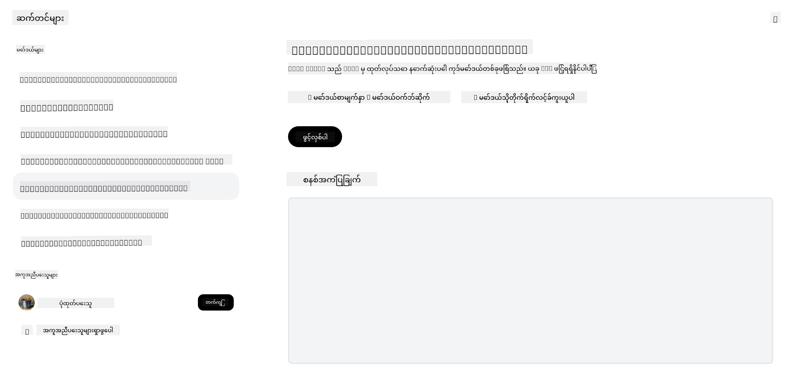

<!--
CO_OP_TRANSLATOR_METADATA:
{
  "original_hash": "0bba96e53ab841d99db731892a51fab8",
  "translation_date": "2025-07-09T17:16:28+00:00",
  "source_file": "16-open-source-models/README.md",
  "language_code": "my"
}
-->

## နိဒါန်း

အဖွင့်မူရင်း LLM များ၏ကမ္ဘာကြီးမှာ စိတ်လှုပ်ရှားဖွယ်ကောင်းပြီး အမြဲတမ်းတိုးတက်နေဆဲဖြစ်သည်။ ဒီသင်ခန်းစာမှာ အဖွင့်မူရင်းမော်ဒယ်များကို နက်ရှိုင်းစွာ လေ့လာသွားမှာဖြစ်သည်။ ပုဂ္ဂိုလ်ရေးပိုင်မော်ဒယ်များနှင့် အဖွင့်မူရင်းမော်ဒယ်များကို နှိုင်းယှဉ်သိရှိလိုပါက ["Exploring and Comparing Different LLMs" သင်ခန်းစာ](../02-exploring-and-comparing-different-llms/README.md?WT.mc_id=academic-105485-koreyst) သို့ သွားရောက်ကြည့်ရှုနိုင်ပါသည်။ ဒီသင်ခန်းစာမှာ fine-tuning အကြောင်းလည်း ပါဝင်သွားမည်ဖြစ်ပြီး၊ ပိုမိုအသေးစိတ်ရှင်းလင်းချက်များကို ["Fine-Tuning LLMs" သင်ခန်းစာ](../18-fine-tuning/README.md?WT.mc_id=academic-105485-koreyst) မှာတွေ့နိုင်ပါသည်။

## သင်ယူရမည့်ရည်မှန်းချက်များ

- အဖွင့်မူရင်းမော်ဒယ်များကို နားလည်ခြင်း
- အဖွင့်မူရင်းမော်ဒယ်များနှင့်အတူ အလုပ်လုပ်ခြင်း၏ အကျိုးကျေးဇူးများကို နားလည်ခြင်း
- Hugging Face နှင့် Azure AI Studio တွင် ရရှိနိုင်သော အဖွင့်မော်ဒယ်များကို ရှာဖွေခြင်း

## အဖွင့်မူရင်းမော်ဒယ်များ ဆိုတာဘာလဲ?

အဖွင့်မူရင်းဆော့ဖ်ဝဲသည် နည်းပညာတိုးတက်မှုတွင် အရေးပါသော အခန်းကဏ္ဍတစ်ခုဖြစ်ပြီး အမျိုးမျိုးသောနယ်ပယ်များတွင် တိုးတက်မှုကို ဦးဆောင်ပေးခဲ့သည်။ Open Source Initiative (OSI) မှ [ဆော့ဖ်ဝဲအတွက် ၁၀ ချက်စည်းကမ်း](https://web.archive.org/web/20241126001143/https://opensource.org/osd?WT.mc_id=academic-105485-koreyst) ကို သတ်မှတ်ထားပြီး၊ အဆိုပါဆော့ဖ်ဝဲသည် OSI မှ အတည်ပြုထားသောလိုင်စင်ဖြင့် မူရင်းကုဒ်ကို ဖွင့်လှစ်ဝေမျှထားရမည်ဖြစ်သည်။

LLM များ ဖန်တီးခြင်းသည် ဆော့ဖ်ဝဲဖန်တီးခြင်းနှင့် ဆင်တူသော်လည်း တိတိကျကျ မတူညီပါ။ ဒီအကြောင်းကြောင့် LLM များအတွက် အဖွင့်မူရင်းဆိုသည့် အဓိပ္ပာယ်အပေါ် လူမှုအသိုင်းအဝိုင်းတွင် ဆွေးနွေးမှုများ ဖြစ်ပေါ်ခဲ့သည်။ ရိုးရာအဖွင့်မူရင်းအဓိပ္ပာယ်နှင့် ကိုက်ညီရန် မော်ဒယ်တစ်ခုအတွက် အောက်ပါအချက်များကို ပြည်သူ့အနေဖြင့် ရရှိနိုင်ရမည်ဖြစ်သည်-

- မော်ဒယ်လေ့ကျင့်ရာတွင် အသုံးပြုသော ဒေတာစုစည်းမှုများ
- လေ့ကျင့်မှုအတွင်း မော်ဒယ်အလေးချိန်များ အပြည့်အစုံ
- အကဲဖြတ်ကုဒ်
- fine-tuning ကုဒ်
- မော်ဒယ်အလေးချိန်များနှင့် လေ့ကျင့်မှု မီထရစ်များ အပြည့်အစုံ

ယခုအချိန်တွင် ဒီစည်းကမ်းများနှင့် ကိုက်ညီသော မော်ဒယ်အနည်းငယ်သာ ရှိပါသည်။ [Allen Institute for Artificial Intelligence (AllenAI) မှ ဖန်တီးသော OLMo မော်ဒယ်](https://huggingface.co/allenai/OLMo-7B?WT.mc_id=academic-105485-koreyst) သည် ဒီအမျိုးအစားနှင့် ကိုက်ညီသော မော်ဒယ်တစ်ခုဖြစ်သည်။

ဒီသင်ခန်းစာအတွက် မော်ဒယ်များကို "open models" ဟု ခေါ်ဆိုသွားမည်ဖြစ်ပြီး၊ ရေးသားချိန်တွင် အထက်ဖော်ပြပါစည်းကမ်းများနှင့် မကိုက်ညီနိုင်သော်လည်း အနာဂတ်တွင် ပြောင်းလဲနိုင်သည်။

## Open Models ၏ အကျိုးကျေးဇူးများ

**အလွန်စိတ်ကြိုက်ပြင်ဆင်နိုင်ခြင်း** - open models များသည် လေ့ကျင့်မှုအချက်အလက်အသေးစိတ်နှင့်အတူ ထုတ်ပြန်ထားသောကြောင့် သုတေသနပညာရှင်များနှင့် ဖန်တီးသူများသည် မော်ဒယ်၏ အတွင်းပိုင်းကို ပြင်ဆင်နိုင်သည်။ ၎င်းက တိကျသောတာဝန် သို့မဟုတ် သုတေသနနယ်ပယ်အတွက် အထူးပြု fine-tuned မော်ဒယ်များ ဖန်တီးနိုင်စေသည်။ ဥပမာများမှာ ကုဒ်ဖန်တီးခြင်း၊ သင်္ချာဆိုင်ရာ လုပ်ဆောင်ချက်များနှင့် ဇီဝဗေဒတို့ ဖြစ်သည်။

**ကုန်ကျစရိတ်** - ဒီမော်ဒယ်များကို အသုံးပြုခြင်းနှင့် တပ်ဆင်ခြင်းအတွက် တိုကင်တစ်ခုလျှင် ကုန်ကျစရိတ်သည် ပုဂ္ဂိုလ်ရေးပိုင်မော်ဒယ်များထက် နည်းပါးသည်။ Generative AI အက်ပလီကေးရှင်းများ တည်ဆောက်ရာတွင် သင့်အသုံးပြုမှုအပေါ် မော်ဒယ်များ၏ စွမ်းဆောင်ရည်နှင့် စျေးနှုန်းကို နှိုင်းယှဉ်စဉ်းစားသင့်သည်။

အရင်းအမြစ် - Artificial Analysis

**တိုးတက်မှုနှင့် လွယ်ကူမှု** - open models များနှင့်အတူ အမျိုးမျိုးသော မော်ဒယ်များကို အသုံးပြုခြင်း သို့မဟုတ် ပေါင်းစပ်အသုံးပြုခြင်းတို့တွင် လွယ်ကူမှုရှိသည်။ ဥပမာအနေဖြင့် [HuggingChat Assistants](https://huggingface.co/chat?WT.mc_id=academic-105485-koreyst) တွင် အသုံးပြုသူသည် မော်ဒယ်ကို တိုက်ရိုက် အသုံးပြုသူအင်တာဖေ့စ်မှ ရွေးချယ်နိုင်သည်။

## အမျိုးမျိုးသော Open Models များကို ရှာဖွေခြင်း

### Llama 2

[LLama2](https://huggingface.co/meta-llama?WT.mc_id=academic-105485-koreyst) သည် Meta မှ ဖန်တီးထားသော chat အခြေပြု အက်ပလီကေးရှင်းများအတွက် အထူးပြု open model ဖြစ်သည်။ ၎င်း၏ fine-tuning နည်းလမ်းမှာ လူနှင့် စကားပြောဆိုမှုများနှင့် လူ့တုံ့ပြန်ချက်များ အများအပြားပါဝင်သည်။ ဒီနည်းလမ်းကြောင့် မော်ဒယ်သည် လူ့မျှော်မှန်းချက်နှင့် ကိုက်ညီသော ရလဒ်များ ပိုမိုထုတ်ပေးနိုင်ပြီး အသုံးပြုသူအတွေ့အကြုံကို တိုးတက်စေသည်။

Llama ၏ fine-tuned ဥပမာများမှာ [Japanese Llama](https://huggingface.co/elyza/ELYZA-japanese-Llama-2-7b?WT.mc_id=academic-105485-koreyst) (ဂျပန်ဘာသာအထူးပြု) နှင့် [Llama Pro](https://huggingface.co/TencentARC/LLaMA-Pro-8B?WT.mc_id=academic-105485-koreyst) (မူလမော်ဒယ်၏ တိုးတက်မြှင့်တင်ထားသော ဗားရှင်း) တို့ ဖြစ်သည်။

### Mistral

[Mistral](https://huggingface.co/mistralai?WT.mc_id=academic-105485-koreyst) သည် မြင့်မားသော စွမ်းဆောင်ရည်နှင့် ထိရောက်မှုကို အထူးအာရုံစိုက်ထားသော open model ဖြစ်သည်။ Mixture-of-Experts နည်းလမ်းကို အသုံးပြုသည်။ ၎င်းသည် အထူးပြုကျွမ်းကျင်သူ မော်ဒယ်အုပ်စုများကို ပေါင်းစပ်ထားပြီး၊ input အပေါ်မူတည်၍ သတ်မှတ်ထားသော မော်ဒယ်များကိုသာ အသုံးပြုသည်။ ဒီနည်းလမ်းကြောင့် ကွန်ပျူတာတွက်ချက်မှု ပိုမိုထိရောက်စေသည်။

Mistral ၏ fine-tuned ဥပမာများမှာ ဆေးဘက်ဆိုင်ရာအထူးပြု [BioMistral](https://huggingface.co/BioMistral/BioMistral-7B?text=Mon+nom+est+Thomas+et+mon+principal?WT.mc_id=academic-105485-koreyst) နှင့် သင်္ချာဆိုင်ရာတွက်ချက်မှုလုပ်ဆောင်နိုင်သော [OpenMath Mistral](https://huggingface.co/nvidia/OpenMath-Mistral-7B-v0.1-hf?WT.mc_id=academic-105485-koreyst) တို့ ဖြစ်သည်။

### Falcon

[Falcon](https://huggingface.co/tiiuae?WT.mc_id=academic-105485-koreyst) သည် Technology Innovation Institute (**TII**) မှ ဖန်တီးထားသော LLM ဖြစ်သည်။ Falcon-40B သည် ၄၀ ဘီလီယံ ပါရာမီတာဖြင့် လေ့ကျင့်ထားပြီး GPT-3 ထက် ကွန်ပျူတာစွမ်းအားသုံးစွဲမှုနည်းပြီး ပိုမိုကောင်းမွန်သော စွမ်းဆောင်ရည် ပြသနိုင်သည်။ ၎င်းသည် FlashAttention အယ်လဂိုရီသမ်နှင့် multiquery attention ကို အသုံးပြုခြင်းကြောင့် inference အချိန်တွင် မှတ်ဉာဏ်လိုအပ်ချက်များ လျော့နည်းစေသည်။ inference အချိန်လျော့နည်းမှုကြောင့် Falcon-40B သည် chat အက်ပလီကေးရှင်းများအတွက် သင့်တော်သည်။

Falcon ၏ fine-tuned ဥပမာများမှာ open models အပေါ် တည်ဆောက်ထားသော အကူအညီပေး [OpenAssistant](https://huggingface.co/OpenAssistant/falcon-40b-sft-top1-560?WT.mc_id=academic-105485-koreyst) နှင့် မူလမော်ဒယ်ထက် ပိုမိုကောင်းမွန်သော စွမ်းဆောင်ရည်ရှိသော [GPT4ALL](https://huggingface.co/nomic-ai/gpt4all-falcon?WT.mc_id=academic-105485-koreyst) တို့ ဖြစ်သည်။

## မည်သို့ ရွေးချယ်မည်နည်း

open model ရွေးချယ်ရာတွင် တစ်ခုတည်းသော ဖြေရှင်းချက်မရှိပါ။ စတင်ရန်ကောင်းသော နေရာတစ်ခုမှာ Azure AI Studio ၏ task အလိုက် စစ်ထုတ်ခြင်းဖြစ်သည်။ ၎င်းက မော်ဒယ်သည် မည်သည့်အလုပ်အမျိုးအစားများအတွက် လေ့ကျင့်ထားသည်ကို နားလည်ရန် ကူညီပေးသည်။ Hugging Face မှလည်း LLM Leaderboard ကို ထိန်းသိမ်းထားပြီး သတ်မှတ်ချက်အရ အကောင်းဆုံး စွမ်းဆောင်ရည်ရှိသော မော်ဒယ်များကို ပြသသည်။

အမျိုးမျိုးသော LLM များကို နှိုင်းယှဉ်လိုပါက [Artificial Analysis](https://artificialanalysis.ai/?WT.mc_id=academic-105485-koreyst) သည် ထူးခြားသော အရင်းအမြစ်တစ်ခုဖြစ်သည်။

အရင်းအမြစ် - Artificial Analysis

သီးသန့်အသုံးပြုမှုအတွက် အထူးပြု fine-tuned ဗားရှင်းများကို ရှာဖွေခြင်းကောင်းသည်။ သင့်နှင့် သင့်အသုံးပြုသူများ၏ မျှော်မှန်းချက်များအရ မော်ဒယ်များစွာကို စမ်းသပ်ကြည့်ခြင်းလည်း ကောင်းမွန်သော လေ့လာမှုဖြစ်သည်။

## နောက်တစ်ဆင့်များ

open models ၏ အကောင်းဆုံး အချက်မှာ အလျင်အမြန် စတင်အသုံးပြုနိုင်ခြင်းဖြစ်သည်။ ဒီမှာ ဆွေးနွေးထားသော မော်ဒယ်များပါဝင်သော Hugging Face စုစည်းမှုတစ်ခုပါဝင်သော [Azure AI Studio Model Catalog](https://ai.azure.com?WT.mc_id=academic-105485-koreyst) ကို ကြည့်ရှုနိုင်ပါသည်။

## သင်ယူခြင်းသည် ဒီမှာ မပြီးဆုံးပါ၊ ခရီးကို ဆက်လက်သွားပါ

ဒီသင်ခန်းစာပြီးဆုံးပြီးနောက်၊ ကျွန်ုပ်တို့၏ [Generative AI Learning collection](https://aka.ms/genai-collection?WT.mc_id=academic-105485-koreyst) ကို ကြည့်ရှု၍ Generative AI အကြောင်း သိမြင်မှုကို ပိုမိုမြှင့်တင်နိုင်ပါသည်။

**အကြောင်းကြားချက်**  
ဤစာတမ်းကို AI ဘာသာပြန်ဝန်ဆောင်မှု [Co-op Translator](https://github.com/Azure/co-op-translator) ဖြင့် ဘာသာပြန်ထားပါသည်။ ကျွန်ုပ်တို့သည် တိကျမှန်ကန်မှုအတွက် ကြိုးစားသော်လည်း အလိုအလျောက် ဘာသာပြန်ခြင်းတွင် အမှားများ သို့မဟုတ် မှားယွင်းချက်များ ပါဝင်နိုင်ကြောင်း သတိပြုပါရန် မေတ္တာရပ်ခံအပ်ပါသည်။ မူရင်းစာတမ်းကို မိမိဘာသာစကားဖြင့်သာ တရားဝင်အချက်အလက်အဖြစ် ယူဆသင့်ပါသည်။ အရေးကြီးသော အချက်အလက်များအတွက် လူ့ဘာသာပြန်ပညာရှင်မှ ဘာသာပြန်ခြင်းကို အကြံပြုပါသည်။ ဤဘာသာပြန်ချက်ကို အသုံးပြုရာမှ ဖြစ်ပေါ်လာနိုင်သည့် နားလည်မှုမှားယွင်းမှုများအတွက် ကျွန်ုပ်တို့သည် တာဝန်မယူပါ။