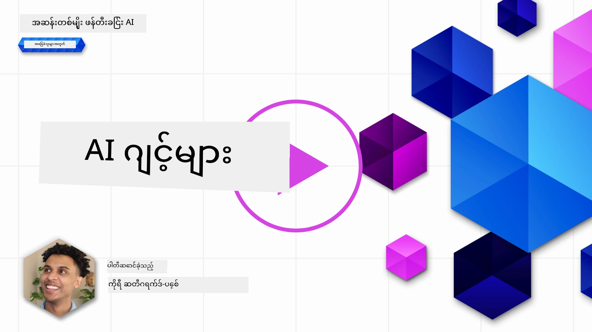
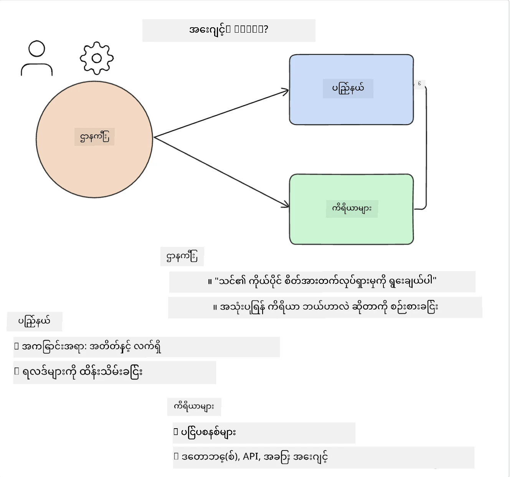
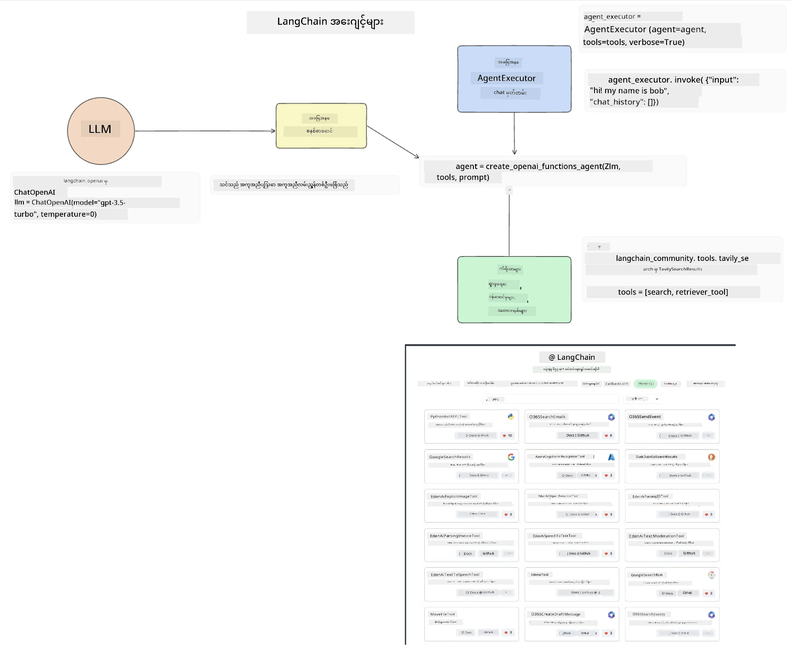
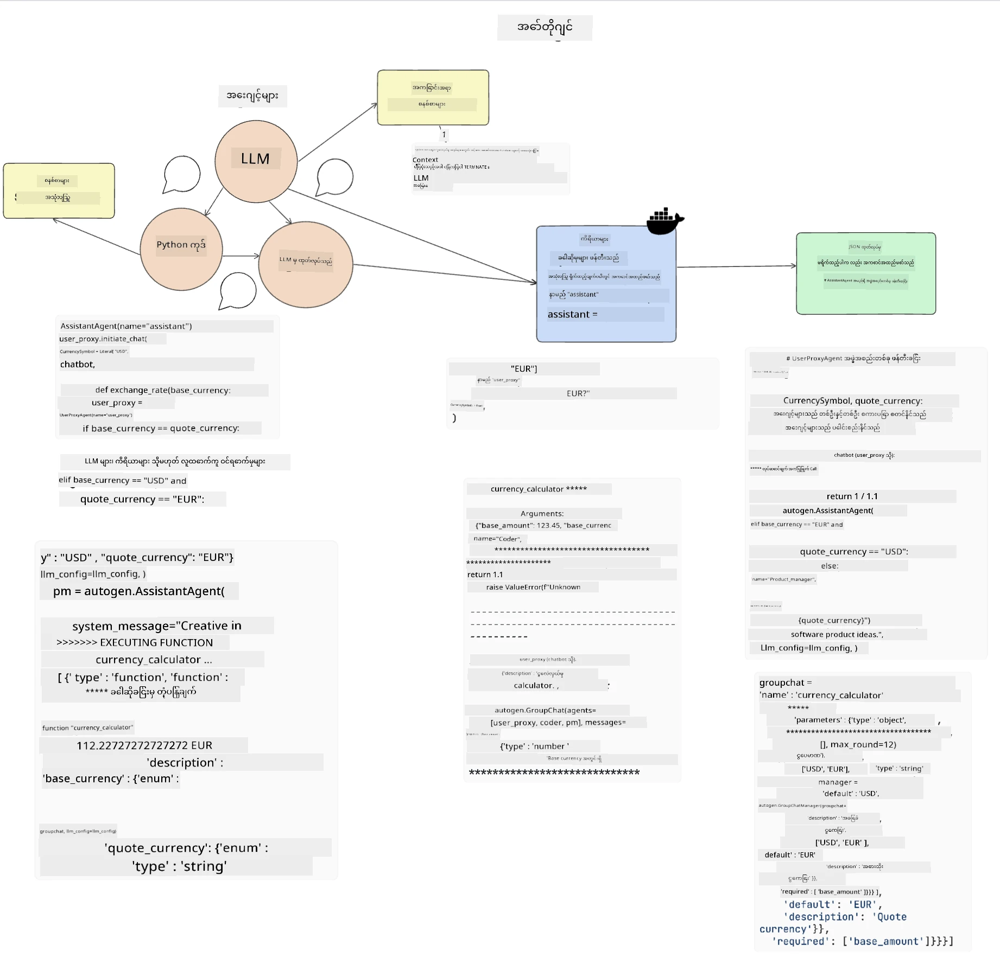
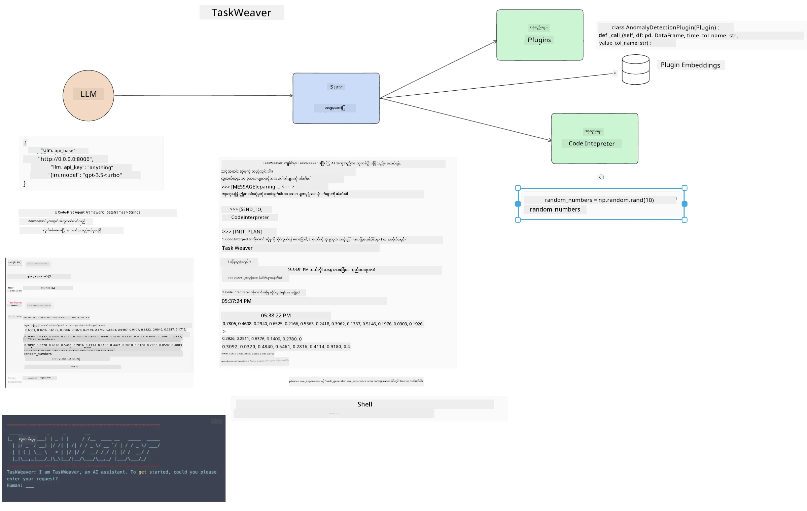
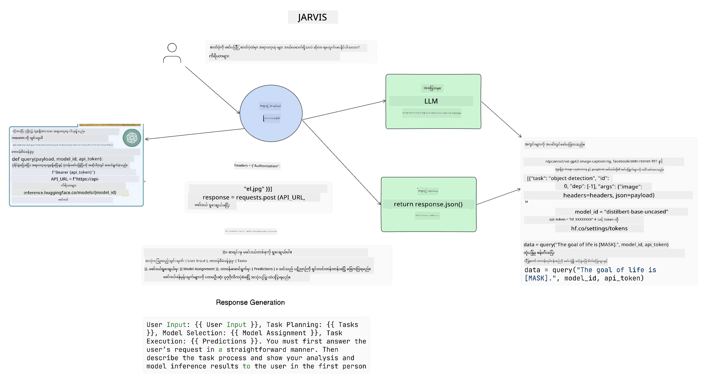

[](https://youtu.be/yAXVW-lUINc?si=bOtW9nL6jc3XJgOM)

## နိဒါန်း

AI Agents သည် Generative AI ရှုထောင့်မှ စိတ်လှုပ်ရှားဖွယ်ဖြစ်စေပြီး၊ ကြီးမားသောဘာသာစကားမော်ဒယ်များ (LLMs) ကို အကူအညီပေးသူများမှ လုပ်ဆောင်ချက်များကို လုပ်နိုင်သော အေးဂျင့်များအဖြစ် တိုးတက်စေရန် ခွင့်ပြုသည်။ AI Agent ဖရေးမြက်များသည် ဖန်တီးသူများအား LLM များကို စက်ကိရိယာများနှင့် အခြေအနေစီမံခန့်ခွဲမှုများသို့ အထောက်အပံ့ပေးသော အသုံးပြုမှုများဖန်တီးရန် ခွင့်ပြုသည်။ ထို့ပြင်၊ ဤဖရေးမြက်များသည် မြင်သာမှုကို တိုးမြှင့်ကာ အသုံးပြုသူများနှင့် ဖန်တီးသူများအား LLM များက ရည်မှန်းထားသော လုပ်ဆောင်ချက်များကို ကြည့်ရှုစစ်ဆေးနိုင်စေရန်သာမက၊ အတွေ့အကြုံ စီမံခန့်ခွဲမှုကိုပါ တိုးတက်စေသည်။

ဤသင်ခန်းစာတွင် အောက်ပါ အပိုင်းများကို ဖော်ပြပါမည်-

- AI Agent ဆိုသည်မှာ မည်သည်နည်း သိရှိခြင်း - AI Agent ဆိုတာ တကယ်က ဘာလဲ?
- AI Agent Frameworks အသေးစိတ်လေ့လာခြင်း - အရာအားလုံးကို ဘာကြောင့် ထူးခြားစေသနည်း?
- AI Agents များကို အမျိုးမျိုးသော အသုံးပြုမှုများတွင် အသုံးပြုခြင်း - ဘယ်အချိန်မှာ AI Agents ကို အသုံးပြုသင့်သနည်း?

## သင်ယူရမည့် ရည်မှန်းချက်များ

ဤသင်ခန်းစာပြီးပါက သင့်အား အောက်ပါအရာများ ပြုလုပ်နိုင်လိမ့်မည်-

- AI Agents ဆိုသည်မှာ မည်သည်နည်း၊ မည်သို့ အသုံးပြုနိုင်ကြောင်း ရှင်းပြနိုင်ပါမည်။
- ထိပ်တန်း AI Agent Frameworks များအကြား မတူညီချက်များကို သိရှိနိုင်ပြီး ဘာကြောင့် မတူညီကြောင်း နားလည်နိုင်ပါမည်။
- AI Agents များဖြင့် လုပ်ငန်းစဉ်များ ဆောက်လုပ်ရာတွင် မည်သို့ လုပ်ဆောင်ကြောင်း နားလည်နိုင်ပါမည်။

## AI Agents ဆိုသည်မှာ ဘာလဲ?

AI Agents သည် Generative AI ကမ္ဘာကြီးတွင် စိတ်လှုပ်ရှားဖွယ်ကောင်းသည့် အကွက်ဖြစ်သည်။ ဤစိတ်လှုပ်ရှားစရာတွင် တစ်ခါတစ်ရံ စကားလုံးများနှင့် သင့်လျော်မှုမရှိပုံများ ဖြစ်ပေါ်တတ်သည်။ အရာအားလုံးကို ရိုးရှင်းစွာ နှင့် AI Agents ဟု ခေါ်ဆိုသော ကိရိယာများ အများစု အပါအဝင်သည့် အဓိပ္ပါယ်ကို ဖော်ပြရန် အတွက် ကျွန်ုပ်တို့သည် အောက်ပါ အဓိပ္ပါယ်ကို အသုံးပြုပါမည်-

AI Agents မှကြောင့် ကြီးမားသောဘာသာစကားမော်ဒယ်များ (LLMs) သည် **အခြေအနေ** နှင့် **အစွမ်းကုန်ကိရိယာများ** ကို အသုံးပြု၍ လုပ်ငန်းခွင်များကို ဆောင်ရွက်နိုင်သည်။



ဤအဓိပ္ပါယ်များကို ဖော်ပြပါ-

**ကြီးမားသောဘာသာစကားမော်ဒယ်များ** - ဤသင်ခန်းစာတွင် ထည့်သွင်းဆွေးနွေးသော GPT-3.5, GPT-4, Llama-2 စသည့် မော်ဒယ်များ ဖြစ်သည်။

**အခြေအနေ** - LLM အလုပ်လုပ်နေသော ပတ်ဝန်းကျင်ကို ဆိုလိုသည်။ LLM သည် ယခင် လုပ်ဆောင်ချက်များနှင့် လက်ရှိအခြေအနေတို့ကို အသုံးပြုကာ နောက်ဆက်တွဲလုပ်ဆောင်ချက်များအတွက် ဆုံးဖြတ်ချက်လုပ်ခြင်းကို လမ်းညွှန်ပေးသည်။ AI Agent Frameworks များက ဖန်တီးသူများအား ဤအခြေအနေကို ပိုမိုလွယ်ကူစွာ ထိန်းသိမ်းစေသည်။

**ကိရိယာများ** - အသုံးပြုသူ၏ တောင်းဆိုချက်နှင့် LLM ရဲ့ ရည်မှန်းချက်အတူ လုပ်ငန်းတစ်ခုချင်း ဆောင်ရွက်ရန် ကိရိယာများ လိုအပ်သည်။ ဥပမာအားဖြင့် ဒေတာဘေ့စ်၊ API, ပြင်ပလျှောက်လွှာ၊ ဒါမှမဟုတ် အခြား LLM တစ်ခုလည်း ဖြစ်နိုင်သည်။

ဤအဓိပ္ပါယ်များသည် လိုက်နာရန် အဆင်ပြေရန် ကောင်းမွန်သော အခြေခံကို ပေးစွမ်းခဲ့မည်ဟု မျှော်လင့်ပါသည်။ အခုတော့ AI Agent ဖရေးမြက် အမျိုးမျိုးကို ကြည့်ရှုကြပါစို့-

## LangChain Agents

[LangChain Agents](https://python.langchain.com/docs/how_to/#agents?WT.mc_id=academic-105485-koreyst) သည် အထက်ပါ အဓိပ္ပါယ်များကို အကောင်အထည်ဖော်ထားသော ပုံစံဖြစ်သည်။

**အခြေအနေ** ကို ထိန်းချုပ်ရန် `AgentExecutor` ဟုခေါ်သော အတိုကောက် function ကိုအသုံးပြုသည်။ ၎င်းသည် သတ်မှတ်ထားသော `agent` နှင့် ၎င်းသုံးနိုင်သော `tools` များကို လက်ခံသည်။

`Agent Executor` သည် ဆက်သွယ်ချက်မှတ်တမ်းကို သိမ်းဆည်းကာ ဆက်သွယ်မှု ပတ်ဝန်းကျင်ကို ဖော်ထုတ်ပေးသည်။



LangChain သည် LLM ကို ဝင်ရောက်အသုံးပြုနိုင်သော ကိရိယာများ၏ [စာရင်း](https://integrations.langchain.com/tools?WT.mc_id=academic-105485-koreyst) ကို ပေးထားသည်။ ဤကိရိယာများကို လူမှုအသိုင်းအဝိုင်းနှင့် LangChain အဖွဲ့သားများက ဖန်တီးထားသည်။

ဤကိရိယာများကို သတ်မှတ်ပြီး `Agent Executor` သို့ ပေးပို့နိုင်ပါသည်။

မြင်သာမှု သည် AI Agents ကိစ္စတွင် အရေးကြီးသော အချက်တစ်ခုဖြစ်သည်။ အသုံးပြုသူများ နှင့် ဖန်တီးသူများအတွက် LLM သည် မည်သည့်ကိရိယာကို အသုံးပြုနေသည်ကို နှင့် မည်ကြောင့်သုံးနေသည်ကို နားလည်ခြင်း အရေးကြီးသည်။ အတွက် LangChain အဖွဲ့သည် LangSmith ကို ဖန်တီးခဲ့သည်။

## AutoGen

နောက်တစ်ခုသော AI Agent ဖရေးမြက်မှာ [AutoGen](https://microsoft.github.io/autogen/?WT.mc_id=academic-105485-koreyst) ဖြစ်သည်။ AutoGen ၏ အဓိက ဦးတည်ချက်မှာ စကားပြောဆိုမှုဖြစ်သည်။ Agent များမှာ အတူတကွ **စကားပြောဆိုနိုင်** နှင့် **စိတ်ကြိုက်ပြုပြင်နိုင်** ဖြစ်ကြသည်။

**စကားပြောဆိုနိုင်ခြင်း -** LLM များသည် အခြား LLM တစ်ခုနှင့် စကားပြောဆို၍ လုပ်ငန်းတစ်ရပ် လုပ်ဆောင်နိုင်သည်။ ၎င်းသည် `AssistantAgents` များ ဖန်တီးကာ စနစ်မက်ဆေ့ချ် တစ်ခု ခန့်မှန်းပေးခြင်းဖြစ်သည်။

```python

autogen.AssistantAgent( name="Coder", llm_config=llm_config, ) pm = autogen.AssistantAgent( name="Product_manager", system_message="Creative in software product ideas.", llm_config=llm_config, )

```


**စိတ်ကြိုက်ပြုပြင်နိုင်ခြင်း** - Agent များကို LLM များအဖြစ်သာမက အသုံးပြုသူ သို့မဟုတ် ကိရိယာအဖြစ် ဤမော်ဒယ်ဖြင့် သတ်မှတ်နိုင်သည်။ ဖန်တီးသူတစ်ယောက်အနေနဲ့၊ တာဝန်ယူပြီး လုပ်ငန်းတစ်ခု ဆောင်ရွက်ရန်အတွက် အသုံးပြုသူနှင့် ဆက်သွယ်ဆောင်ရွက်သော `UserProxyAgent` ကို သတ်မှတ်နိုင်သည်။ ဤတုံ့ပြန်ချက်သည် လုပ်ငန်းဆက်လုပ်ခြင်း သို့မဟုတ် ရပ်ဆိုင်းခြင်းကို ဆောင်ရွက်နိုင်သည်။

```python
user_proxy = UserProxyAgent(name="user_proxy")
```


### အခြေအနေ နှင့် ကိရိယာများ

အခြေအနေ ပြောင်းလဲ ထိန်းချုပ်ရန် အကူအညီ Agent သည် Python ကုဒ် ထုတ်လွှင့်ကာ လုပ်ငန်းကို ပြီးမြောက်စေသည်။

ဆောင်ရွက်မှုတစ်ခုကို ဥပမာ-



#### စနစ်မက်ဆေ့ချ်ဖြင့် သတ်မှတ်ထားသော LLM

```python
system_message="For weather related tasks, only use the functions you have been provided with. Reply TERMINATE when the task is done."
```


ဤစနစ်မက်ဆေ့ချ်သည် အဆိုပါ LLM အတွက် မည်သည့်လုပ်ဆောင်ချက်များ အရေးကြီးသည်ကို ဦးတည်ညွှန်ကြားသည်။ AutoGen ဖြင့် မတူညီသော စနစ်မက်ဆေ့ချ်ဖြင့် AssistantAgents များစွာ သတ်မှတ်နိုင်သည်။

#### အသုံးပြုသူမှ စတင်တင်ပြသော စကားပြောဆိုမှု

```python
user_proxy.initiate_chat( chatbot, message="I am planning a trip to NYC next week, can you help me pick out what to wear? ", )

```


ဤအသုံးပြုသူ proxy (လူ) မှ မက်ဆေ့ချ်သည် Agent အနေဖြင့် ဆောင်ရွက်သည့် လုပ်ဆောင်ချက်များကို ရှာဖွေစတင်ရန် ဖြစ်သည်။

#### လုပ်ဆောင်ချက် ဆောင်ရွက်ခြင်း

```bash
chatbot (to user_proxy):

***** Suggested tool Call: get_weather ***** Arguments: {"location":"New York City, NY","time_periond:"7","temperature_unit":"Celsius"} ******************************************************** --------------------------------------------------------------------------------

>>>>>>>> EXECUTING FUNCTION get_weather... user_proxy (to chatbot): ***** Response from calling function "get_weather" ***** 112.22727272727272 EUR ****************************************************************

```


အစပြီးသော စကားပြောဆိုမှုကို ရယူပြီးနောက်, Agent မှ ခေါ်ဆိုရန် ဖိတ်ခေါ်ကိရိယာတစ်ခု ထုတ်ပေးသည်။ ၎င်းမှာ `get_weather` ဟုခေါ်သော function ဖြစ်သည်။ သင့် ဖော်ပြချက်အရ ဒီ function ကို automated အလုပ်ဖြစ်စေသော်လည်း၊ အသုံးပြုသူအနေနဲ့ input ပေး၍ ထိန်းချုပ်နိုင်သည်။

[AutoGen ကုတ်နမူနာများစာရင်း](https://microsoft.github.io/autogen/docs/Examples/?WT.mc_id=academic-105485-koreyst)မှ နောက်ထပ် စတင်ဖန်တီးမှုများ ရှာဖွေနိုင်ပါသည်။

## Taskweaver

နောက်ထပ် Agent ဖရေးမြက်မှာ [Taskweaver](https://microsoft.github.io/TaskWeaver/?WT.mc_id=academic-105485-koreyst) ဖြစ်သည်။ ၎င်းကို "ကုဒ်ပထမ" Agent ဟု ခေါ်ကြပြီး `strings` များနှင့် အလုပ်လုပ်ခြင်းမဟုတ်ဘဲ Python ထဲတွင် DataFrames များဖြင့် အလုပ်လုပ်နိုင်ပါသည်။ ၎င်းသည် ဒေတာ분석 နှင့် ဖန်တီးမှုလုပ်ငန်းများတွင် အထူးအသုံးဝင်သည်။ ဥပမာ- အကြောင်းအရာများဖန်တီးခြင်း၊ ပြဇာတ်များ နှင့် အရေအတွက် စသည်တို့ ဖြစ်သည်။

### အခြေအနေ နှင့် ကိရိယာများ

စကားပြောဆိုမှု၏ အခြေအနေကို စီမံရန် TaskWeaver သည် `Planner` ဆိုသည့် အကြံပေး LLM ကို အသုံးပြုသည်။ `Planner` သည် အသုံးပြုသူတောင်းဆိုမှုကို လက်ခံပြီး လုပ်ဆောင်ရန် လုပ်ငန်းများကို မြေပုံဆွဲတင်ပြသည်။

လုပ်ငန်းများ ပြီးစီးရန် `Planner` သည် `Plugins` အမည်ရှိ ကိရိယာစုစည်းမှုသို့ ဝင်ရောက်နိုင်သည်။ ၎င်းသည် Python class များ သို့မဟုတ် ဂeneral ကုဒ် ဖတ်ဆောင်သူ ဖြစ်နိုင်သည်။ Plugins များကို embeddings အဖြစ် သိမ်းဆည်းထားကာ LLM သည် မှန်ကန်သော plugin ရှာဖွေရန် ပိုမိုကောင်းမွန်စေသည်။



လှုပ်ရှားမှုရှာဖွေရေး plugin ၏ ဥပမာ-

```python
class AnomalyDetectionPlugin(Plugin): def __call__(self, df: pd.DataFrame, time_col_name: str, value_col_name: str):
```


ကုဒ်ကို ဆောင်ရွက်မည်မတိုင်မီ စစ်ဆေးသေချာသည်။ Taskweaver တွင် context ကို စီမံရန် နောက်ထပ်အင်္ဂါရပ် `experience` ဖြစ်သည်။ Experience သည် စကားပြောဆိုမှု၏ ပတ်ဝန်းကျင်ကို YAML ဖိုင်တစ်ခုတွင် ရှည်လျားစွာ သိမ်းဆည်းထားသည်။ ဤသည်ကို သတ်မှတ်၍ LLM သည် ယခင် စကားပြောဆိုမှုများ အလေးထားကာ တိုးတက်မှုရှိစေရန် ဆောင်ရွက်နိုင်သည်။

## JARVIS

နောက်ဆုံး Agent ဖရေးမြက်မှာ [JARVIS](https://github.com/microsoft/JARVIS?tab=readme-ov-file&WT.mc_id=academic-105485-koreyst) ဖြစ်သည်။ JARVIS ၏ထူးခြားခြင်းမှာ စကားပြောဆိုမှု၏ `state` ကို စီမံရန် LLM ကို အသုံးပြု၍, `tools` များမှာ အခြား AI မော်ဒယ်များဖြစ်သည်။ AI မော်ဒယ်တိုင်းသည် အထူးပြုလုပ်ငန်းများကို ဆောင်ရွက်ရန် ဖန်တီးထားသည်။ ဥပမာ- ယန္တရားရှာဖွေခြင်း, အသံမှတ်တမ်းပြုစုခြင်း သို့မဟုတ် ပုံမှတ်တမ်းရေးခြင်း စသည်တို့ ဖြစ်သည်။



LLM သည် ဘုံရည်ရွယ်ချက် မော်ဒယ်တစ်ခုအနေဖြင့် အသုံးပြုသူ၏ တောင်းဆိုချက်ကို လက်ခံကာ အထူးပြုလုပ်ငန်းနှင့် လိုအပ်သော ဒေတာ/အချက်အလက်များကို မှတ်သားသည်။

```python
[{"task": "object-detection", "id": 0, "dep": [-1], "args": {"image": "e1.jpg" }}]
```


LLM သည် အထူးပြု AI မော်ဒယ် အား အလုပ်လုပ်ရန် JSON ကဲ့သို့ ပုံစံပြောင်းပေးသည်။ AI မော်ဒယ်မှ ခန့်မှန်းချက်ကို ပြန်လည်ရယူပြီးနောက် LLM သည် ပြန်လာသော ဖြေကြားချက်ကို လက်ခံသည်။

လုပ်ငန်း ပြီးမြောက်ရန် မော်ဒယ်များ အများအပြား လိုအပ်ပါက၊ ထိုမော်ဒယ်များမှဖြေကြားချက်များကိုဖြေရှင်းပြီး၊ အသုံးပြုသူအတွက် ဖြေကြားချက် ထုတ်ပေးသည်။

အောက်တွင် ဥပမာတစ်ခုရှိပြီး အသုံးပြုသူသည် ပုံတစ်ပုံတွင် ပစ္စည်းများ၏ ဖော်ပြချက်နှင့် အရေအတွက်ကို တောင်းဆိုထားသော အခါ ဖြစ်ပုံကို ပြပါသည်-

## တာဝန်

AI Agents များကို AutoGen ဖြင့် ဆက်လက်လေ့လာရန်-

- ပညာရေးစတားတပ်၏ အမျိုးမျိုးသော ဌာနများနှင့် စီးပွားရေး အစည်းအဝေး တာဝန်ကို ကူးယူသရုပ်ပြသည့် လျှောက်လွှာတစ်ခု ဖန်တီးပါ။
- LLM များအား လူကြီးမင်းမျိုးဆက်များနှင့် အရေးကြီးချက်များကို နားလည်စေသော စနစ်မက်ဆေ့ချ်များ ဖန်တီးပြီး အသုံးပြုသူအား ထုတ်ကုန်အသစ်အကြံပေးရန် ခွင့်ပြုပါ။
- LLM သည် ဌာနတစ်ခုနှင့်တစ်ခုမှ အားကောင်းသောမေးခွန်းများ ထုတ်ပေးကာ အကြံပြုမှုနှင့် ထုတ်ကုန်အကြံအဖြေများ အကောင်းဆုံး အကောင်အထည်ဖော်ခြင်းအတွက် ဖြေကြားပေးပါမည်။

## သင်ယူမှုများသည် ဒီမှာ မရပ်နားပဲ ဆက်လက်ဖြစ်ပေါ်ပါစေ

ဤသင်ခန်းစာပြီးဆုံးပြီးနောက် ကျွန်ုပ်တို့၏ [Generative AI သင်ယူမှု စုစည်းမှု](https://aka.ms/genai-collection?WT.mc_id=academic-105485-koreyst) ကို ကြည့်ရှု၍ Generative AI ပညာရပ်များကို ဆက်လက်တိုးတက်လိုက်ပါ!

---

<!-- CO-OP TRANSLATOR DISCLAIMER START -->
**အကြောင်းကြားချက်**  
ဤစာရွက်ကို AI ဘာသာပြန်ဝန်ဆောင်မှုဖြစ်သော [Co-op Translator](https://github.com/Azure/co-op-translator) အသုံးပြုကာ ဘာသာပြန်ထားပါသည်။ ကျွန်ုပ်တို့သည် တိကျမှန်ကန်မှုအတွက် ရင်ဆိုင်ကြိုးစားပေမယ့်၊ အလိုအလြောခံ ဘာသာပြန်မှုများတွင် အမှားများ သို့မဟုတ် မှားယွင်းမှုများ ပါဝင်နိုင်ကြောင်း သတိပြုပါရန် မှောဆိုလိုပါသည်။ မူရင်းစာရွက်ကို မူလဘာသာဖြင့်သာ တရားဝင်အရင်းအမြစ်အဖြစ် ယူဆသင့်ပါသည်။ အရေးကြီးသော အချက်အလက်များအတွက် ကျွမ်းကျင်လူသား ဘာသာပြန်ကို တိုက်တွန်းပြုလုပ်ရန် အကြံပြုပါသည်။ ဤဘာသာပြန်မှုအသုံးပြုမှုကြောင့် ဖြစ်ပေါ်လာနိုင်သည့် နားမလည်မှုများ သို့မဟုတ် မှားယွင်းမှုများအတွက် ကျွန်ုပ်တို့သည် တာဝန်မယူပါ။
<!-- CO-OP TRANSLATOR DISCLAIMER END -->