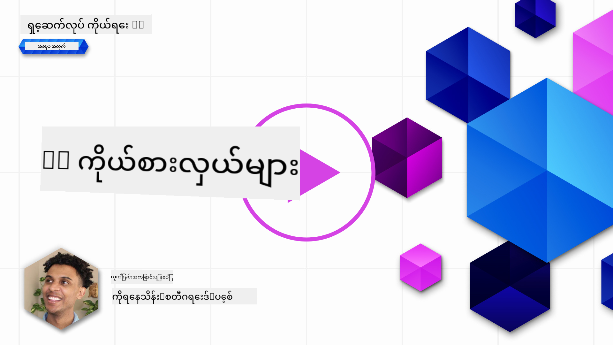
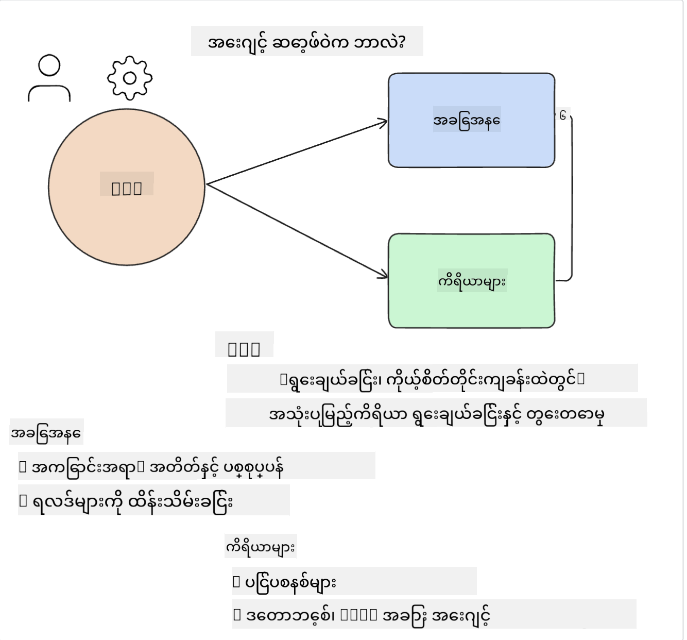
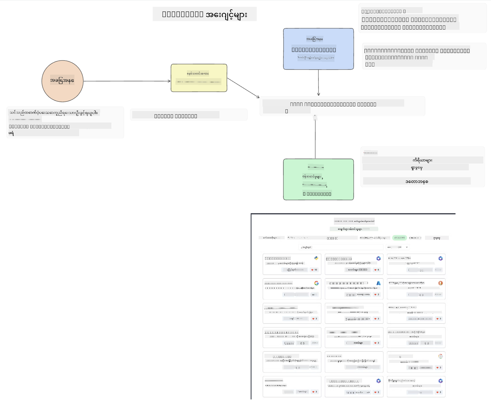
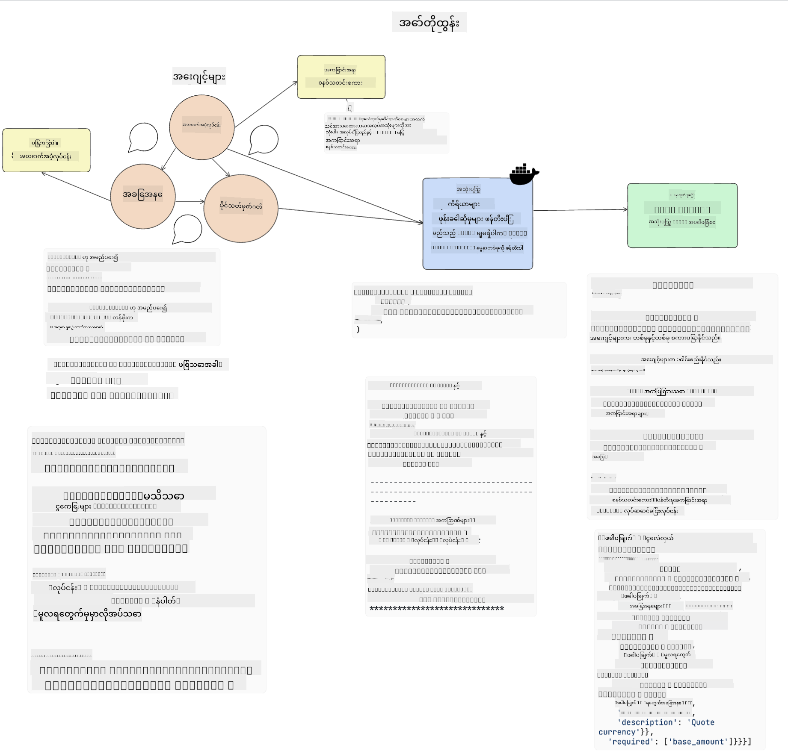
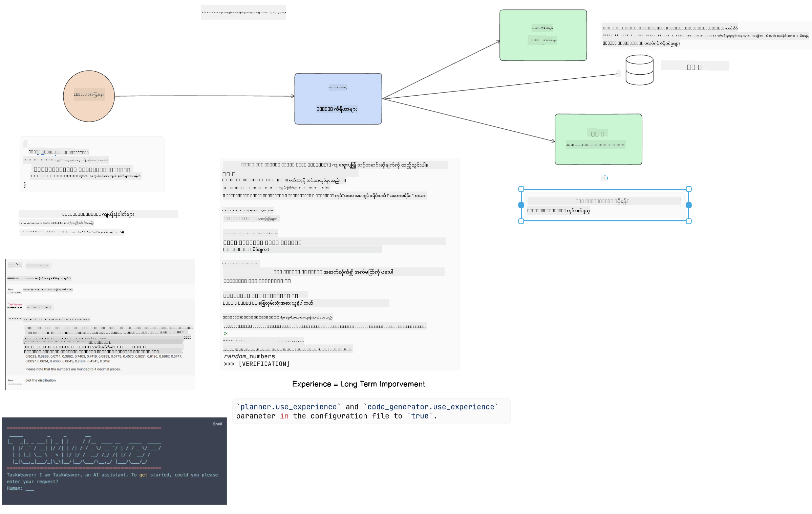
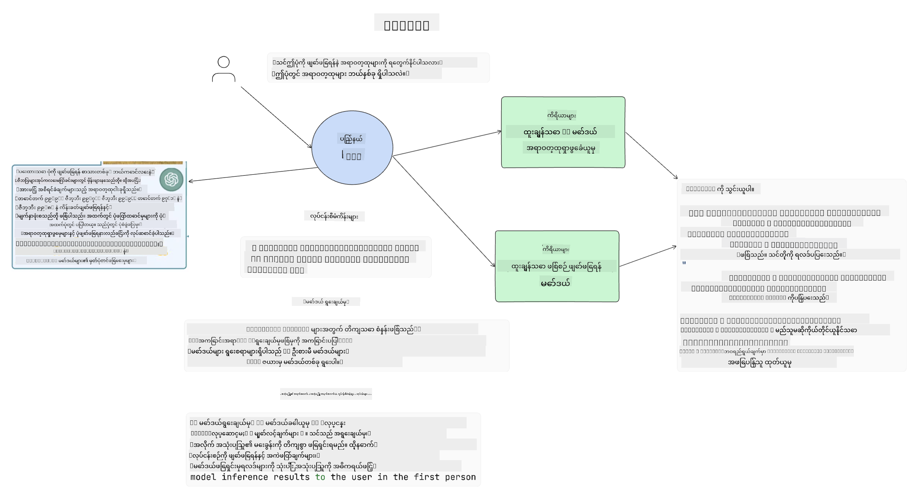

<!--
CO_OP_TRANSLATOR_METADATA:
{
  "original_hash": "11f03c81f190d9cbafd0f977dcbede6c",
  "translation_date": "2025-06-26T00:27:31+00:00",
  "source_file": "17-ai-agents/README.md",
  "language_code": "my"
}
-->
[](https://aka.ms/gen-ai-lesson17-gh?WT.mc_id=academic-105485-koreyst)

## နိဒါန်း

AI အေးဂျင့်များသည် Generative AI တွင် စိတ်ဝင်စားဖွယ် ဖွံ့ဖြိုးမှုကို ကိုယ်စားပြုပြီး LLMs များကို အကူအညီပေးသူများမှ လုပ်ဆောင်ချက်များကို လုပ်ဆောင်နိုင်သော အေးဂျင့်များအဖြစ် တိုးတက်လာစေသည်။ AI အေးဂျင့် ဖရိမ်ဝက်များက LLMs များကို ကိရိယာများနှင့် အခြေအနေစီမံခန့်ခွဲမှုကို ဝင်ရောက်ခွင့်ပေးသည့် အက်ပ်လီကေးရှင်းများကို ဖန်တီးရန် ဖွံ့ဖြိုးသူများကို ခွင့်ပြုသည်။ ဤဖရိမ်ဝက်များသည် အသုံးပြုသူများနှင့် ဖွံ့ဖြိုးသူများကို LLMs များက စီစဉ်ထားသော လုပ်ဆောင်ချက်များကို ကြည့်ရှုနိုင်စေရန် မြင်သာမှုကို မြှင့်တင်ပေးပြီး အတွေ့အကြုံ စီမံခန့်ခွဲမှုကို ကောင်းမွန်စေသည်။

ဤသင်ခန်းစာတွင် အောက်ပါအရာများကို ဖုံးကွယ်ထားမည်ဖြစ်သည်-

- AI အေးဂျင့် ဆိုတာ ဘာလဲ - AI အေးဂျင့် ဆိုတာ တိကျစွာ ဘာလဲ?
- အေးဂျင့် ဖရိမ်ဝက် ၄ မျိုးကို လေ့လာခြင်း - အဘယ်ကြောင့် ထူးခြားသနည်း?
- အေးဂျင့်များကို အသုံးပြုမှု အမျိုးမျိုးတွင် လျှောက်ထားခြင်း - AI အေးဂျင့်များကို မည်သည့်အခါတွင် အသုံးပြုသင့်သနည်း?

## သင်ယူမှုရည်ရွယ်ချက်များ

ဤသင်ခန်းစာကို လက်ခံပြီးနောက်တွင်၊ သင်သည် -

- AI အေးဂျင့်များသည် ဘာလဲ၊ ထို့အပြင် သူတို့ကို မည်သို့ အသုံးပြုနိုင်သည်ကို ရှင်းပြနိုင်သည်။
- အေးဂျင့် ဖရိမ်ဝက်များအချို့အကြား ကွာခြားချက်များကို နားလည်နိုင်ပြီး၊ သူတို့အကြား မည်သို့ ကွာခြားကြောင်းကို နားလည်နိုင်သည်။
- အေးဂျင့်များသည် မည်သို့ လုပ်ဆောင်သည်ကို နားလည်နိုင်ရန်၊ သူတို့နှင့်အတူ အက်ပ်လီကေးရှင်းများကို တည်ဆောက်နိုင်သည်။

## AI အေးဂျင့်များဆိုတာ ဘာလဲ?

AI အေးဂျင့်များသည် Generative AI ကမ္ဘာတွင် အလွန် စိတ်လှုပ်ရှားဖွယ်ရာ ကဏ္ဍတစ်ခု ဖြစ်သည်။ ဤစိတ်လှုပ်ရှားမှုနှင့်အတူ မကြာခဏ စကားလုံးများနှင့် ၎င်းတို့၏ လျှောက်ထားမှုကို ရှုပ်ထွေးမှုများဖြစ်ပေါ်စေသည်။ AI အေးဂျင့်များကို ရည်ညွှန်းသော ကိရိယာများ၏ အများစုကို ရှုပ်ထွေးမှုကင်းစွာနှင့် အလွယ်ကူဆုံးထားရန်၊ ဤအဓိပ္ပါယ်ကို အသုံးပြုမည်ဖြစ်သည်-

AI အေးဂျင့်များသည် LLMs များကို **state** နှင့် **tools** ကို ဝင်ရောက်ခွင့်ပေးခြင်းဖြင့် လုပ်ဆောင်ချက်များကို လုပ်ဆောင်ရန် ခွင့်ပြုသည်။



ဤစကားလုံးများကို ရှင်းပြကြပါစို့-

**Large Language Models** - ဤသင်ခန်းစာတစ်ခုလုံးတွင် ရည်ညွှန်းထားသော မော်ဒယ်များဖြစ်ပြီး GPT-3.5, GPT-4, Llama-2 စသည်ဖြစ်သည်။

**State** - ဤသည်မှာ LLM အလုပ်လုပ်နေသော အကြောင်းအရာကို ရည်ညွှန်းသည်။ LLM သည် ၎င်း၏ ယခင် လုပ်ဆောင်ချက်များ၏ အကြောင်းအရာနှင့် လက်ရှိ အကြောင်းအရာကို အသုံးပြုပြီး၊ နောက်ဆက်တွဲ လုပ်ဆောင်ချက်များအတွက် ၎င်း၏ ဆုံးဖြတ်ချက်ကို လမ်းညွှန်သည်။ AI အေးဂျင့် ဖရိမ်ဝက်များက ဖွံ့ဖြိုးသူများကို ဤအကြောင်းအရာကို ပိုမိုလွယ်ကူစွာ ထိန်းသိမ်းနိုင်စေရန် ခွင့်ပြုသည်။

**Tools** - အသုံးပြုသူက တောင်းဆိုထားသော လုပ်ဆောင်ချက်ကို အပြီးသတ်လုပ်ဆောင်ရန်၊ ထို့အပြင် LLM က စီစဉ်ထားသော လုပ်ဆောင်ချက်ကို အပြီးသတ်လုပ်ဆောင်ရန်၊ LLM သည် ကိရိယာများကို ဝင်ရောက်ခွင့် လိုအပ်သည်။ ကိရိယာများ၏ ဥပမာများမှာ ဒေတာဘေ့စ်, API, ပြင်ပ အက်ပ်လီကေးရှင်း သို့မဟုတ် အခြား LLM တစ်ခုတည်းဖြစ်နိုင်သည်။

ဤအဓိပ္ပါယ်များသည် ၎င်းတို့ကို မည်သို့ အကောင်အထည်ဖော်ထားသည်ကို ကြည့်ရှုခြင်းအတွက် ဆက်လက် လေ့လာသွားမည်ဖြစ်သောကြောင့် သင်တို့အား ကောင်းမွန်သော အခြေခံကို ပေးနိုင်မည်ဟု မျှော်လင့်ပါသည်။ အေးဂျင့် ဖရိမ်ဝက် အမျိုးမျိုးကို ရှာဖွေကြည့်ရအောင်-

## LangChain Agents

[LangChain Agents](https://python.langchain.com/docs/how_to/#agents?WT.mc_id=academic-105485-koreyst) သည် ကျွန်ုပ်တို့ ထောက်ပံ့ခဲ့သည့် အဓိပ္ပါယ်များ၏ အကောင်အထည်ဖော်မှုတစ်ခု ဖြစ်သည်။

**state** ကို စီမံခန့်ခွဲရန်၊ ၎င်းသည် `AgentExecutor` ဟု ခေါ်သော built-in လုပ်ဆောင်ချက်ကို အသုံးပြုသည်။ ၎င်းသည် သတ်မှတ်ထားသော `agent` နှင့် `tools` ကို လက်ခံသည်။

`Agent Executor` သည် chat မှတ်တမ်းကိုလည်း သိမ်းဆည်းထားပြီး chat ၏ အကြောင်းအရာကို ပေးသည်။



LangChain သည် LLM ကို ဝင်ရောက်ခွင့်ရနိုင်သည့် သင့် အက်ပ်လီကေးရှင်းသို့ ထည့်သွင်းနိုင်သည့် [ကိရိယာများ catalog](https://integrations.langchain.com/tools?WT.mc_id=academic-105485-koreyst) တစ်ခုကို ကမ်းလှမ်းသည်။ ၎င်းတို့ကို သ comunidad နှင့် LangChain အဖွဲ့မှ ပြုလုပ်သည်။

ထို့နောက်၊ ဤကိရိယာများကို သတ်မှတ်ပြီး `Agent Executor` ကို ပေးပို့နိုင်သည်။

AI အေးဂျင့်များကို ပြောသောအခါ မြင်သာမှုသည် အခြား အရေးကြီးသောအချက်တစ်ခု ဖြစ်သည်။ LLM သည် မည်သည့် ကိရိယာကို အသုံးပြုနေသည်၊ မည်သို့ကြောင့်ဆိုသည်ကို အက်ပ်လီကေးရှင်း ဖွံ့ဖြိုးသူများက နားလည်ရသည်မှာ အရေးကြီးသည်။ ထို့အတွက် LangChain မှ အဖွဲ့သည် LangSmith ကို ဖွံ့ဖြိုးထားသည်။

## AutoGen

ကျွန်ုပ်တို့ ဆွေးနွေးမည့် နောက်ထပ် AI အေးဂျင့် ဖရိမ်ဝက်မှာ [AutoGen](https://microsoft.github.io/autogen/?WT.mc_id=academic-105485-koreyst) ဖြစ်သည်။ AutoGen ၏ အဓိက အာရုံပြုချက်မှာ စကားဝိုင်းများ ဖြစ်သည်။ အေးဂျင့်များသည် **conversable** နှင့် **customizable** ဖြစ်သည်။

**Conversable -** LLMs များသည် တစ်ခုတည်းသော လုပ်ဆောင်ချက်ကို အပြီးသတ်လုပ်ဆောင်ရန် အခြား LLM နှင့် စကားဝိုင်းကို စတင်နိုင်ပြီး ဆက်လက်ပြောဆိုနိုင်သည်။ `AssistantAgents` ဖန်တီးပြီး ၎င်းတို့ကို သတ်မှတ်ထားသော system message ကို ပေးခြင်းဖြင့် ၎င်းကို ပြုလုပ်သည်။

```python

autogen.AssistantAgent( name="Coder", llm_config=llm_config, ) pm = autogen.AssistantAgent( name="Product_manager", system_message="Creative in software product ideas.", llm_config=llm_config, )

```

**Customizable** - အေးဂျင့်များကို LLMs များအဖြစ် သတ်မှတ်နိုင်သည့်အပြင် အသုံးပြုသူ သို့မဟုတ် ကိရိယာအဖြစ်လည်း ဖြစ်နိုင်သည်။ ဖွံ့ဖြိုးသူအနေဖြင့် `UserProxyAgent` ကို သတ်မှတ်နိုင်ပြီး အလုပ်ကို အပြီးသတ်လုပ်ဆောင်ရန် အတွက် တုံ့ပြန်ချက်အတွက် အသုံးပြုသူနှင့် ပူးပေါင်းဆောင်ရွက်ရန် တာဝန်ရှိသည်။ ဤတုံ့ပြန်ချက်သည် အလုပ်ကို ဆက်လက်လုပ်ဆောင်နိုင်သည့်အပြင် ၎င်းကို ရပ်တန့်နိုင်သည်။

```python
user_proxy = UserProxyAgent(name="user_proxy")
```

### State နှင့် Tools

state ကို ပြောင်းလဲခြင်းနှင့် စီမံခန့်ခွဲရန်၊ အကူအညီ အေးဂျင့်သည် အလုပ်ကို အပြီးသတ်လုပ်ဆောင်ရန် Python ကုဒ်ကို ထုတ်လုပ်သည်။

လုပ်ငန်းစဉ်၏ ဥပမာကို ဤနေရာတွင် ကြည့်ပါ-



#### LLM သည် System Message ဖြင့် သတ်မှတ်ထားသည်

```python
system_message="For weather related tasks, only use the functions you have been provided with. Reply TERMINATE when the task is done."
```

ဤ system messages သည် ၎င်း၏ လုပ်ဆောင်ချက်အတွက် သက်ဆိုင်သော လုပ်ဆောင်ချက်များကို သတ်မှတ်ထားသော LLM ကို ဦးတည်သည်။ AutoGen ဖြင့် AssistantAgents အမျိုးမျိုးကို သတ်မှတ်ထားပြီး system messages များကို သတ်မှတ်ထားနိုင်သည်ကို မှတ်ပါ။

#### အသုံးပြုသူက Chat ကို စတင်သည်

```python
user_proxy.initiate_chat( chatbot, message="I am planning a trip to NYC next week, can you help me pick out what to wear? ", )

```

ဤစကားဝိုင်းသည် agent ကို ၎င်း၏ လုပ်ဆောင်ရန်သင့်သည့် လုပ်ဆောင်ချက်များကို စူးစမ်းရန် စတင်ရန် ဖြစ်မည်ဖြစ်သော user_proxy (Human) မှ ပေးပို့သော message ဖြစ်သည်။

#### Function ကို လုပ်ဆောင်သည်

```bash
chatbot (to user_proxy):

***** Suggested tool Call: get_weather ***** Arguments: {"location":"New York City, NY","time_periond:"7","temperature_unit":"Celsius"} ******************************************************** --------------------------------------------------------------------------------

>>>>>>>> EXECUTING FUNCTION get_weather... user_proxy (to chatbot): ***** Response from calling function "get_weather" ***** 112.22727272727272 EUR ****************************************************************

```

မူလ စကားဝိုင်းကို လုပ်ဆောင်ပြီးနောက်၊ agent သည် ခေါ်ဆိုရန် အကြံပြုထားသော ကိရိယာကို ပေးပို့မည်။ ဤကိရိယာတွင် `get_weather`. Depending on your configuration, this function can be automatically executed and read by the Agent or can be executed based on user input.

You can find a list of [AutoGen code samples](https://microsoft.github.io/autogen/docs/Examples/?WT.mc_id=academic-105485-koreyst) to further explore how to get started building.

## Taskweaver

The next agent framework we will explore is [Taskweaver](https://microsoft.github.io/TaskWeaver/?WT.mc_id=academic-105485-koreyst). It is known as a "code-first" agent because instead of working strictly with `strings` , it can work with DataFrames in Python. This becomes extremely useful for data analysis and generation tasks. This can be things like creating graphs and charts or generating random numbers.

### State and Tools

To manage the state of the conversation, TaskWeaver uses the concept of a `Planner`. The `Planner` is a LLM that takes the request from the users and maps out the tasks that need to be completed to fulfill this request.

To complete the tasks the `Planner` is exposed to the collection of tools called `Plugins` ဟုခေါ်သော လုပ်ဆောင်ချက်တစ်ခု ဖြစ်သည်။ ၎င်းသည် Python classes သို့မဟုတ် general code interpreter ဖြစ်နိုင်သည်။ ဤ plugins များကို embeddings အဖြစ် သိမ်းဆည်းထားပြီး LLM သည် မှန်ကန်သော plugin ကို ပိုမိုကောင်းမွန်စွာ ရှာဖွေနိုင်စေရန် ဖြစ်သည်။



anomaly detection ကို စီမံရန် plugin တစ်ခု၏ ဥပမာကို ဤနေရာတွင် ကြည့်ပါ-

```python
class AnomalyDetectionPlugin(Plugin): def __call__(self, df: pd.DataFrame, time_col_name: str, value_col_name: str):
```

ကုဒ်ကို လုပ်ဆောင်မှုမပြုမီ အတည်ပြုသည်။ Taskweaver တွင် context ကို စီမံခန့်ခွဲရန် အခြား feature သည် စကားဝိုင်း၏ `experience`. Experience allows for the context of a conversation to be stored over to the long term in a YAML file. This can be configured so that the LLM improves over time on certain tasks given that it is exposed to prior conversations.

## JARVIS

The last agent framework we will explore is [JARVIS](https://github.com/microsoft/JARVIS?tab=readme-ov-file?WT.mc_id=academic-105485-koreyst). What makes JARVIS unique is that it uses an LLM to manage the `state` ဖြစ်ပြီး `tools` သည် အခြား AI မော်ဒယ်များဖြစ်သည်။ AI မော်ဒယ်တစ်ခုစီသည် object detection, transcription သို့မဟုတ် image captioning စသည်တို့ကို လုပ်ဆောင်သည့် အထူးပြု မော်ဒယ်များဖြစ်သည်။



LLM သည် general purpose model ဖြစ်ပြီး အသုံးပြုသူထံမှ တောင်းဆိုမှုကို လက်ခံပြီး အထူးပြုလုပ်ဆောင်ချက်နှင့် ၎င်း၏ အပြီးသတ်လုပ်ဆောင်ရန် လိုအပ်သော arguments/data ကို သတ်မှတ်သည်။

```python
[{"task": "object-detection", "id": 0, "dep": [-1], "args": {"image": "e1.jpg" }}]
```

ထို့နောက် LLM သည် တောင်းဆိုမှုကို အထူးပြု AI မော်ဒယ်က ဖတ်ရှုနိုင်သောပုံစံဖြင့် format ပြုလုပ်ပြီး JSON အဖြစ်ဖြစ်နိုင်သည်။ AI မော်ဒယ်သည် ၎င်း၏ လုပ်ဆောင်ချက်အပေါ် အခြေခံ၍ ယူဆချက်ကို ပြန်ပေးပြီးနောက် LLM သည် ၎င်း၏ တုံ့ပြန်ချက်ကို လက်ခံရရှိသည်။

လုပ်ဆောင်ချက်ကို အပြီးသတ်လုပ်ဆောင်ရန် မော်ဒယ်များ များစွာ လိုအပ်ပါက၊ ၎င်းသည် ၎င်းတို့၏ တုံ့ပြန်ချက်ကို ပြန်လည်လေ့လာပြီး အသုံးပြုသူထံသို့ တုံ့ပြန်ချက်ကို ထုတ်လုပ်ရန် ၎င်းတို့ကို ပေါင်းစည်းမည်။

အောက်ပါ ဥပမာသည် အသုံးပြုသူသည် ပုံတွင် ရှိသော objects များ၏ ဖေါ်ပြချက်နှင့် အရေအတွက်ကို တောင်းဆိုနေသည့်အခါ ဤသည်မည်သို့ လုပ်ဆောင်မည်ကို ပြသသည်-

## လုပ်ငန်း

AI အေးဂျင့်များကို ဆက်လက်လေ့လာရန် AutoGen ဖြင့် တည်ဆောက်နိုင်သည်-

- ပညာရေး စတတ်အပ်၏ department များကို တစ်ခုစီဖြင့် စီးပွားရေးအစည်းအဝေးကို သရုပ်ပြသော အက်ပ်လီကေးရှင်းတစ်ခု
- LLMs များကို လူပုဂ္ဂိုလ်များနှင့် ဦးစားပေးမှုများကို နားလည်စေရန် လမ်းညွှန်သော system messages များကို ဖန်တီးပြီး အသုံးပြုသူအား ထုတ်ကုန် အကြံပြုချက်အသစ်တစ်ခုကို Pitch လုပ်နိုင်စေရန်
- LLM သည် ထို့နောက် Pitch နှင့် ထုတ်ကုန် အကြံပြုချက်ကို ပြုပြင်တိုးတက်စေရန် department တစ်ခုစီမှ ဆက်လက်မေးခွန်းများကို ထုတ်လုပ်သင့်သည်

## သင်ယူမှုသည် ဤနေရာတွင် ရပ်တန့်သွားခြင်းမဟုတ်ပါ၊ ခရီးကို ဆက်လက်လုပ်ဆောင်ပါ

ဤသင်ခန်းစာကို ပြီးဆုံးပြီးနောက်၊ [Generative AI Learning collection](https://aka.ms/genai-collection?WT.mc_id=academic-105485-koreyst) ကို ကြည့်ပါက Generative AI ဗဟုသုတကို ဆက်လက် မြှင့်တင်ရန်!

**ပယ်ချချက်**:  
ဤစာရွက်စာတမ်းကို AI ဘာသာပြန်စနစ် [Co-op Translator](https://github.com/Azure/co-op-translator) ကို အသုံးပြု၍ ဘာသာပြန်ထားပါသည်။ ကျွန်ုပ်တို့သည် တိကျမှုအတွက် ကြိုးပမ်းနေသော်လည်း အလိုအလျောက် ဘာသာပြန်ချက်များတွင် အမှားများ သို့မဟုတ် မှားယွင်းချက်များ ပါဝင်နိုင်သည်ကို သတိပြုပါ။ မူရင်းဘာသာစကားဖြင့် ရေးသားထားသော စာရွက်စာတမ်းကို အာဏာရှိသော ရင်းမြစ်အဖြစ် ရှုရမည်ဖြစ်သည်။ အရေးကြီးသော အချက်အလက်များအတွက် လူအလိုက်ဘာသာပြန်ခြင်းကို အကြံပြုပါသည်။ ဤဘာသာပြန်ချက်ကို အသုံးပြုခြင်းမှ ဖြစ်ပေါ်လာသည့် နားလည်မှုလွဲမှားခြင်းများ သို့မဟုတ် အဓိပ္ပာယ်မှားဖွယ်ရာများအတွက် ကျွန်ုပ်တို့သည် တာဝန်မယူပါ။