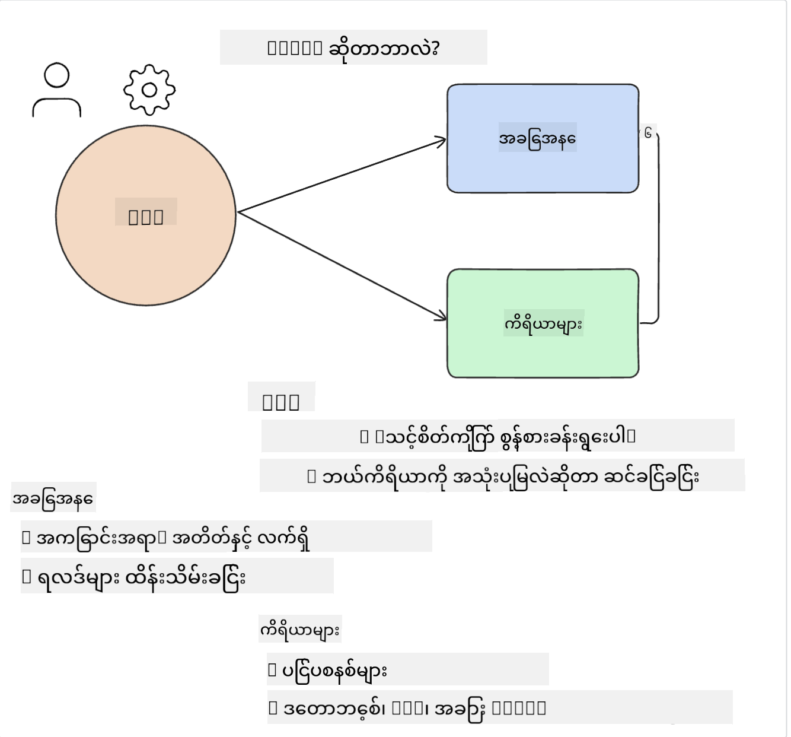

<!--
CO_OP_TRANSLATOR_METADATA:
{
  "original_hash": "11f03c81f190d9cbafd0f977dcbede6c",
  "translation_date": "2025-07-09T17:33:04+00:00",
  "source_file": "17-ai-agents/README.md",
  "language_code": "my"
}
-->
[](https://aka.ms/gen-ai-lesson17-gh?WT.mc_id=academic-105485-koreyst)

## နိဒါန်း

AI Agents သည် Generative AI အတွင်း စိတ်လှုပ်ရှားဖွယ် တိုးတက်မှုတစ်ခုဖြစ်ပြီး၊ Large Language Models (LLMs) ကို ကူညီသူမှ လုပ်ဆောင်နိုင်သော အေးဂျင့်များအဖြစ် တိုးတက်စေသည်။ AI Agent frameworks များက ဖန်တီးသူများအား LLM များကို ကိရိယာများနှင့် အခြေအနေ စီမံခန့်ခွဲမှုများကို အသုံးပြုခွင့်ပေးသော အက်ပလီကေးရှင်းများ ဖန်တီးနိုင်စေသည်။ ထို့အပြင်၊ ဒီ frameworks များက အသုံးပြုသူများနှင့် ဖန်တီးသူများအား LLM များက စီစဉ်ထားသော လုပ်ဆောင်ချက်များကို ကြည့်ရှုနိုင်စေပြီး၊ အသုံးပြုမှု အတွေ့အကြုံကို တိုးတက်စေသည်။

ဒီသင်ခန်းစာမှာ အောက်ပါအကြောင်းအရာများကို ဖော်ပြပါမည်-

- AI Agent ဆိုတာဘာလဲ - AI Agent ဆိုတာ တကယ်ဘာလဲ?
- AI Agent Frameworks လေးမျိုးကို ရှာဖွေခြင်း - ဘာကြောင့် ထူးခြားသနည်း?
- AI Agents များကို အသုံးပြုနိုင်သည့် အခြေအနေများ - ဘယ်အချိန်မှာ AI Agents ကို အသုံးပြုသင့်သလဲ?

## သင်ယူရမည့် ရည်မှန်းချက်များ

ဒီသင်ခန်းစာပြီးဆုံးပြီးနောက် သင်သည်-

- AI Agents ဆိုတာဘာလဲ၊ ဘယ်လိုအသုံးပြုနိုင်သလဲ ဆိုတာ ရှင်းပြနိုင်မည်။
- လူကြိုက်များသော AI Agent Frameworks များအကြား ကွာခြားချက်များကို နားလည်နိုင်မည်။
- AI Agents များ ဘယ်လို လုပ်ဆောင်ကြောင်း နားလည်ပြီး၊ အက်ပလီကေးရှင်းများ ဖန်တီးနိုင်မည်။

## AI Agents ဆိုတာဘာလဲ?

AI Agents သည် Generative AI ကမ္ဘာတွင် စိတ်လှုပ်ရှားဖွယ်ကောင်းသော နယ်ပယ်တစ်ခုဖြစ်သည်။ စိတ်လှုပ်ရှားမှုကြောင့် အချို့အခါ စကားလုံးများနှင့် အသုံးပြုမှုများတွင် ရှုပ်ထွေးမှုဖြစ်တတ်သည်။ AI Agents ကို ရိုးရှင်းပြီး အများဆုံး ကိရိယာများနှင့် ကိုက်ညီစေရန်အတွက် အောက်ပါအတိုင်း သတ်မှတ်ထားပါမည်-

AI Agents သည် Large Language Models (LLMs) ကို **state** နှင့် **tools** အသုံးပြုခွင့်ပေးခြင်းဖြင့် လုပ်ငန်းများ ဆောင်ရွက်နိုင်စေသည်။



ဒီစကားလုံးများကို အဓိပ္ပါယ်ဖော်ပြပါမည်-

**Large Language Models** - ဒီသင်ခန်းစာတွင် GPT-3.5, GPT-4, Llama-2 စသည့် မော်ဒယ်များကို ရည်ညွှန်းသည်။

**State** - LLM သည် လက်ရှိ လုပ်ဆောင်နေသော အခြေအနေကို ဆိုလိုသည်။ LLM သည် ယခင် လုပ်ဆောင်ချက်များနှင့် လက်ရှိ အခြေအနေကို အသုံးပြု၍ နောက်ထပ် လုပ်ဆောင်ချက်များ ဆုံးဖြတ်သည်။ AI Agent Frameworks များက ဒီအခြေအနေကို ပိုမိုလွယ်ကူစွာ စီမံခန့်ခွဲနိုင်စေသည်။

**Tools** - အသုံးပြုသူ တောင်းဆိုထားသော လုပ်ငန်းကို ပြီးမြောက်စေရန်နှင့် LLM က စီစဉ်ထားသော လုပ်ဆောင်ချက်များကို ပြီးမြောက်စေရန် ကိရိယာများ လိုအပ်သည်။ ဥပမာ- ဒေတာဘေ့စ်၊ API, ပြင်ပ အက်ပလီကေးရှင်း သို့မဟုတ် အခြား LLM တစ်ခုဖြစ်နိုင်သည်။

ဒီအဓိပ္ပါယ်များက နောက်ထပ် AI Agent များကို ဘယ်လို အကောင်အထည်ဖော်ကြောင်း နားလည်ရန် အခြေခံအချက်များ ပေးမည်ဟု မျှော်လင့်ပါသည်။ အခုတော့ AI Agent frameworks အချို့ကို ရှာဖွေကြမယ်-

## LangChain Agents

[LangChain Agents](https://python.langchain.com/docs/how_to/#agents?WT.mc_id=academic-105485-koreyst) သည် အထက်ဖော်ပြထားသော အဓိပ္ပါယ်များကို အကောင်အထည်ဖော်ထားသော implementation ဖြစ်သည်။

**state** ကို စီမံရန် `AgentExecutor` ဟုခေါ်သော built-in function ကို အသုံးပြုသည်။ ၎င်းသည် သတ်မှတ်ထားသော `agent` နှင့် ရရှိနိုင်သော `tools` များကို လက်ခံသည်။

`Agent Executor` သည် စကားပြောသမိုင်းကိုလည်း သိမ်းဆည်းထားပြီး စကားပြော၏ အခြေအနေကို ပံ့ပိုးပေးသည်။


LangChain သည် [tools များ၏ စာရင်း](https://integrations.langchain.com/tools?WT.mc_id=academic-105485-koreyst) ကို ပံ့ပိုးပေးပြီး၊ သင်၏ အက်ပလီကေးရှင်းထဲသို့ တင်သွင်းနိုင်သည်။ ၎င်း tools များကို အသိုင်းအဝိုင်းနှင့် LangChain အဖွဲ့က ဖန်တီးထားသည်။

သင်သည် tools များကို သတ်မှတ်ပြီး `Agent Executor` သို့ ပေးပို့နိုင်သည်။

AI Agents အကြောင်း ပြောရာတွင် မြင်သာမှုသည် အရေးကြီးသော အချက်တစ်ခုဖြစ်သည်။ အက်ပလီကေးရှင်း ဖန်တီးသူများအတွက် LLM သည် ဘယ် tool ကို ဘာကြောင့် အသုံးပြုနေသည်ကို နားလည်ရမည်။ ထို့ကြောင့် LangChain အဖွဲ့က LangSmith ကို ဖန်တီးထားသည်။

## AutoGen

နောက်တစ်ခု ဆွေးနွေးမည့် AI Agent framework သည် [AutoGen](https://microsoft.github.io/autogen/?WT.mc_id=academic-105485-koreyst) ဖြစ်သည်။ AutoGen ၏ အဓိက အာရုံစိုက်ချက်မှာ စကားပြောခြင်းဖြစ်သည်။ Agents များသည် **conversable** နှင့် **customizable** ဖြစ်ကြသည်။

**Conversable -** LLM များသည် တစ်ခုတည်းသော LLM နှင့် စကားပြောစတင်ပြီး ဆက်လက်ပြောဆိုနိုင်ပြီး လုပ်ငန်းတစ်ခု ပြီးမြောက်စေရန် ဖြစ်သည်။ ၎င်းကို `AssistantAgents` များ ဖန်တီးပြီး သတ်မှတ်ထားသော system message ပေးခြင်းဖြင့် ပြုလုပ်သည်။

```python

autogen.AssistantAgent( name="Coder", llm_config=llm_config, ) pm = autogen.AssistantAgent( name="Product_manager", system_message="Creative in software product ideas.", llm_config=llm_config, )

```

**Customizable** - Agents များကို LLM များအဖြစ်သာမက အသုံးပြုသူ သို့မဟုတ် ကိရိယာအဖြစ်လည်း သတ်မှတ်နိုင်သည်။ ဖန်တီးသူအနေနှင့် `UserProxyAgent` ကို သတ်မှတ်နိုင်ပြီး၊ ၎င်းသည် အသုံးပြုသူနှင့် ဆက်သွယ်၍ တုံ့ပြန်ချက်များ ရယူပြီး လုပ်ငန်း ပြီးမြောက်ရေးအတွက် တုံ့ပြန်ချက်များကို ဆက်လက်လုပ်ဆောင်ခြင်း သို့မဟုတ် ရပ်ဆိုင်းခြင်း ပြုလုပ်နိုင်သည်။

```python
user_proxy = UserProxyAgent(name="user_proxy")
```

### State နှင့် Tools

State ကို ပြောင်းလဲ စီမံရန် assistant Agent သည် Python ကုဒ်များ ဖန်တီးပြီး လုပ်ငန်း ပြီးမြောက်စေသည်။

လုပ်ငန်းစဉ် ဥပမာ-


#### System Message ဖြင့် LLM သတ်မှတ်ခြင်း

```python
system_message="For weather related tasks, only use the functions you have been provided with. Reply TERMINATE when the task is done."
```

ဒီ system message သည် အဆိုပါ LLM ကို လုပ်ငန်းအတွက် သက်ဆိုင်ရာ function များကို ဦးတည်ညွှန်ကြားသည်။ AutoGen တွင် system message မတူညီသော AssistantAgents များစွာ သတ်မှတ်နိုင်သည်။

#### အသုံးပြုသူမှ စကားပြော စတင်ခြင်း

```python
user_proxy.initiate_chat( chatbot, message="I am planning a trip to NYC next week, can you help me pick out what to wear? ", )

```

user_proxy (လူ) မှ ပေးပို့သော စကားပြောသည် Agent ကို လုပ်ဆောင်ရန် function များ ရှာဖွေရန် စတင်စေသည်။

#### Function ကို လုပ်ဆောင်ခြင်း

```bash
chatbot (to user_proxy):

***** Suggested tool Call: get_weather ***** Arguments: {"location":"New York City, NY","time_periond:"7","temperature_unit":"Celsius"} ******************************************************** --------------------------------------------------------------------------------

>>>>>>>> EXECUTING FUNCTION get_weather... user_proxy (to chatbot): ***** Response from calling function "get_weather" ***** 112.22727272727272 EUR ****************************************************************

```

အစောပိုင်း စကားပြောကို ပြီးမြောက်ပြီးနောက် Agent သည် ခေါ်ရန် function တစ်ခုကို အကြံပြုသည်။ ဤနေရာတွင် `get_weather` ဟုခေါ်သော function ဖြစ်သည်။ သင့် configuration အပေါ်မူတည်၍ function ကို အလိုအလျောက် လုပ်ဆောင်နိုင်သလို၊ အသုံးပြုသူ၏ input အပေါ်မူတည်၍ လည်း လုပ်ဆောင်နိုင်သည်။

[AutoGen code samples](https://microsoft.github.io/autogen/docs/Examples/?WT.mc_id=academic-105485-koreyst) များကို ကြည့်ရှု၍ စတင်ဖန်တီးနိုင်သည်။

## Taskweaver

နောက်တစ်ခု ရှာဖွေမည့် agent framework သည် [Taskweaver](https://microsoft.github.io/TaskWeaver/?WT.mc_id=academic-105485-koreyst) ဖြစ်သည်။ ၎င်းကို "code-first" agent ဟု ခေါ်ကြပြီး၊ `strings` ဖြင့်သာမက Python DataFrames များဖြင့်လည်း လုပ်ဆောင်နိုင်သည်။ ဒါကြောင့် ဒေတာခွဲခြမ်းစိတ်ဖြာခြင်းနှင့် ဖန်တီးခြင်း လုပ်ငန်းများတွင် အထူးအသုံးဝင်သည်။ ဥပမာ- ဂရပ်ဖ်များ၊ ဇယားများ ဖန်တီးခြင်း သို့မဟုတ် အမှတ်အတိအကျ များ ဖန်တီးခြင်း။

### State နှင့် Tools

စကားပြောအခြေအနေကို စီမံရန် TaskWeaver သည် `Planner` ဆိုသော အယူအဆကို အသုံးပြုသည်။ `Planner` သည် အသုံးပြုသူ၏ တောင်းဆိုချက်ကို လက်ခံပြီး လုပ်ဆောင်ရန် လုပ်ငန်းများကို စီစဉ်သည်။

လုပ်ငန်းများ ပြီးမြောက်ရန် `Planner` သည် `Plugins` ဟုခေါ်သော ကိရိယာစုစည်းမှုများကို အသုံးပြုသည်။ ၎င်းမှာ Python class များ သို့မဟုတ် အထွေထွေ ကုဒ် အဓိပ္ပါယ်ဖော်သူ ဖြစ်နိုင်သည်။ Plugins များကို embedding အဖြစ် သိမ်းဆည်းထားပြီး LLM သည် မှန်ကန်သော plugin ကို ရှာဖွေရန် ပိုမိုကောင်းမွန်စေသည်။


အောက်တွင် anomaly detection ကို ကိုင်တွယ်ရန် plugin ဥပမာ-

```python
class AnomalyDetectionPlugin(Plugin): def __call__(self, df: pd.DataFrame, time_col_name: str, value_col_name: str):
```

ကုဒ်ကို လုပ်ဆောင်မတိုင်မီ စစ်ဆေးသည်။ Taskweaver တွင် context ကို စီမံရန် အခြား feature တစ်ခုမှာ `experience` ဖြစ်သည်။ Experience သည် စကားပြောအခြေအနေကို YAML ဖိုင်တွင် ရေရှည် သိမ်းဆည်းနိုင်သည်။ ၎င်းကို စီမံနိုင်ပြီး LLM သည် ယခင် စကားပြောများကို ကြည့်ရှုခြင်းဖြင့် အချိန်အလိုက် တိုးတက်မှု ရရှိစေသည်။

## JARVIS

နောက်ဆုံး ရှာဖွေမည့် agent framework သည် [JARVIS](https://github.com/microsoft/JARVIS?tab=readme-ov-file?WT.mc_id=academic-105485-koreyst) ဖြစ်သည်။ JARVIS ၏ ထူးခြားချက်မှာ စကားပြောအခြေအနေကို စီမံရန် LLM ကို အသုံးပြုပြီး၊ `tools` များအဖြစ် အခြား AI မော်ဒယ်များကို အသုံးပြုသည်။ AI မော်ဒယ်များသည် အထူးပြု မော်ဒယ်များဖြစ်ပြီး အရာဝတ္ထု ရှာဖွေခြင်း၊ အသံမှတ်တမ်းပြုခြင်း သို့မဟုတ် ပုံဖော်ခြင်း စသည့် လုပ်ငန်းများ ဆောင်ရွက်သည်။


LLM သည် အသုံးပြုသူ၏ တောင်းဆိုချက်ကို လက်ခံပြီး အထူးလုပ်ငန်းနှင့် လိုအပ်သော အချက်အလက်များကို ဖော်ထုတ်သည်။

```python
[{"task": "object-detection", "id": 0, "dep": [-1], "args": {"image": "e1.jpg" }}]
```

LLM သည် အထူးပြု AI မော်ဒယ်များ ဖတ်နိုင်သော ပုံစံ (ဥပမာ JSON) ဖြင့် တောင်းဆိုချက်ကို ဖော်ပြသည်။ AI မော်ဒယ်မှ ခန့်မှန်းချက် ပြန်လာသည်နှင့် LLM သည် တုံ့ပြန်ချက်ကို လက်ခံသည်။

လုပ်ငန်း ပြီးမြောက်ရန် မော်ဒယ်များစွာ လိုအပ်ပါက၊ ၎င်းတို့၏ တုံ့ပြန်ချက်များကိုလည်း ဖတ်ရှု၍ အသုံးပြုသူထံ ပြန်လည်ပေးပို့သည်။

အောက်ပါ ဥပမာတွင် အသုံးပြုသူသည် ပုံတစ်ပုံရှိ အရာဝတ္ထုများ၏ ဖော်ပြချက်နှင့် အရေအတွက် တောင်းဆိုသောအခါ ဘယ်လို လုပ်ဆောင်မည်ကို ပြသထားသည်-

## လေ့ကျင့်ခန်း

AI Agents ကို AutoGen ဖြင့် ဆက်လက်လေ့လာရန်-

- ပညာရေး စတားတပ်တစ်ခု၏ ဌာနအမျိုးမျိုးနှင့် စီးပွားရေး အစည်းအဝေးကို အတုလုပ်သော အက်ပလီကေးရှင်း တစ်ခု ဖန်တီးပါ။
- LLM များအား မတူညီသော ပုဂ္ဂိုလ်များနှင့် ဦးစားပေးချက်များကို နားလည်စေရန် system message များ ဖန်တီးပြီး အသုံးပြုသူအား ထုတ်ကုန်အသစ်တစ်ခု အကြံပြုခွင့် ပေးပါ။
- ထို့နောက် LLM သည် ဌာနတစ်ခုချင်းစီမှ အကောင်းဆုံး ထုတ်ကုန်အကြံပြုချက်နှင့် အကြံပြုချက်များ တိုးတက်စေရန် ဆက်လက်မေးခွန်းများ ဖန်တီးပေးရမည်။

## သင်ယူမှုသည် ဒီမှာ မရပ်နားပါ၊ ခရီးကို ဆက်လက်သွားပါ

ဒီသင်ခန်းစာပြီးဆုံးပြီးနောက်၊ ကျွန်ုပ်တို့၏ [Generative AI Learning collection](https://aka.ms/genai-collection?WT.mc_id=academic-105485-koreyst) ကို ကြည့်ရှု၍ Generative AI အကြောင်း ပိုမိုတိုးတက်စေပါ။

**အကြောင်းကြားချက်**  
ဤစာတမ်းကို AI ဘာသာပြန်ဝန်ဆောင်မှု [Co-op Translator](https://github.com/Azure/co-op-translator) ဖြင့် ဘာသာပြန်ထားပါသည်။ ကျွန်ုပ်တို့သည် တိကျမှန်ကန်မှုအတွက် ကြိုးစားသော်လည်း အလိုအလျောက် ဘာသာပြန်ခြင်းတွင် အမှားများ သို့မဟုတ် မှားယွင်းချက်များ ပါဝင်နိုင်ကြောင်း သတိပြုပါရန် မေတ္တာရပ်ခံအပ်ပါသည်။ မူရင်းစာတမ်းကို မိမိဘာသာစကားဖြင့်သာ တရားဝင်အချက်အလက်အဖြစ် ယူဆသင့်ပါသည်။ အရေးကြီးသော အချက်အလက်များအတွက် လူ့ဘာသာပြန်ပညာရှင်မှ ဘာသာပြန်ခြင်းကို အကြံပြုပါသည်။ ဤဘာသာပြန်ချက်ကို အသုံးပြုရာမှ ဖြစ်ပေါ်လာနိုင်သည့် နားလည်မှုမှားယွင်းမှုများအတွက် ကျွန်ုပ်တို့ တာဝန်မယူပါ။