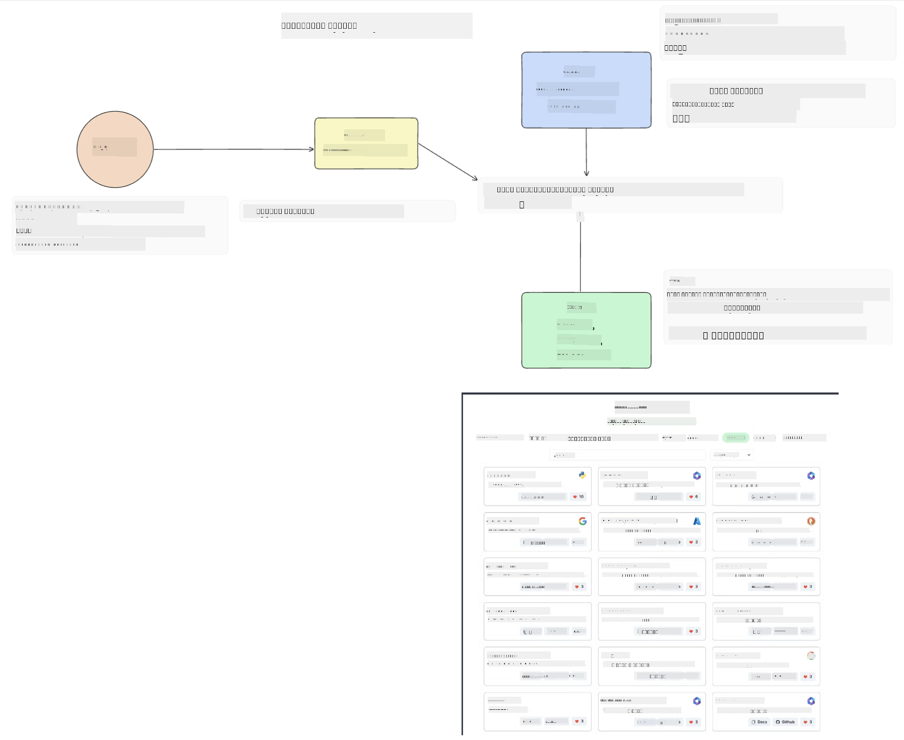
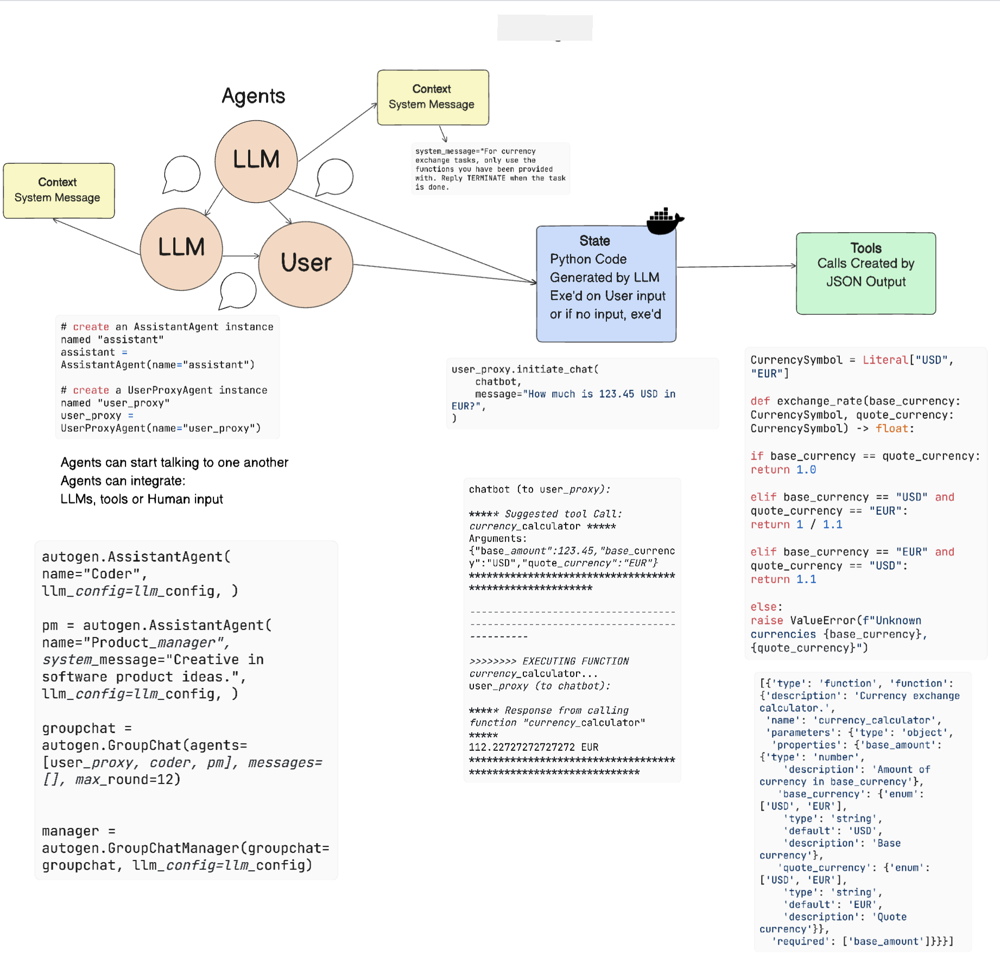
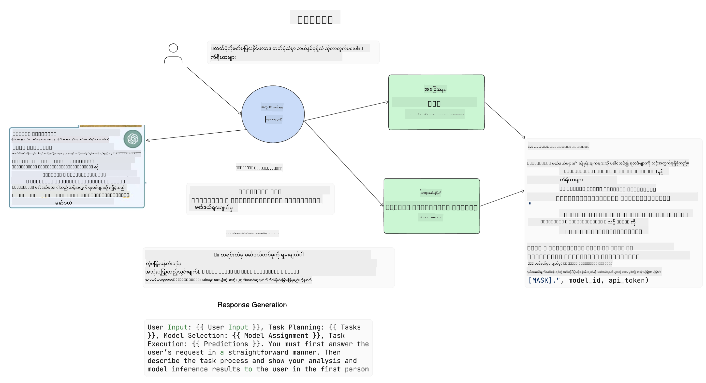

<!--
CO_OP_TRANSLATOR_METADATA:
{
  "original_hash": "8e8d1f6a63da606af7176a87ff8e92b6",
  "translation_date": "2025-10-18T02:08:27+00:00",
  "source_file": "17-ai-agents/README.md",
  "language_code": "my"
}
-->
[](https://youtu.be/yAXVW-lUINc?si=bOtW9nL6jc3XJgOM)

## အကျဉ်းချုပ်

AI Agents သည် Generative AI တွင် စိတ်လှုပ်ရှားဖွယ်ကောင်းသော တိုးတက်မှုတစ်ခုဖြစ်ပြီး Large Language Models (LLMs) များကို အကူအညီပေးသူများမှ လုပ်ဆောင်မှုများကို ပြုလုပ်နိုင်သော Agent များအဖြစ် တိုးတက်လာစေသည်။ AI Agent Frameworks များသည် Developer များကို LLM များကို Tools နှင့် State Management များကို အသုံးပြုနိုင်သော Application များ ဖန်တီးနိုင်စေသည်။ ထို့အပြင် LLM များ၏ လုပ်ဆောင်မှုများကို ကြည့်ရှုနိုင်စေပြီး အသုံးပြုသူနှင့် Developer များအတွက် အတွေ့အကြုံကို ပိုမိုကောင်းမွန်စေသည်။

ဒီသင်ခန်းစာမှာ အောက်ပါအကြောင်းအရာများကို လေ့လာပါမည်-

- AI Agent ဆိုတာဘာလဲ - AI Agent ဆိုတာ တိတိကျကျ ဘာလဲ?
- AI Agent Frameworks လေးမျိုးကို လေ့လာခြင်း - ဘာတွေက သူတို့ကို ထူးခြားစေသလဲ?
- AI Agents များကို အသုံးချခြင်း - ဘယ်အချိန်မှာ AI Agents ကို အသုံးပြုသင့်သလဲ?

## သင်ယူရမည့် ရည်မှန်းချက်များ

ဒီသင်ခန်းစာကို လေ့လာပြီးနောက်မှာ-

- AI Agents ဆိုတာ ဘာလဲ၊ ဘယ်လို အသုံးပြုနိုင်လဲဆိုတာ ရှင်းပြနိုင်မည်။
- လူကြိုက်များသော AI Agent Frameworks များ၏ ကွဲပြားချက်များကို နားလည်နိုင်မည်။
- AI Agents များ၏ လုပ်ဆောင်ပုံကို နားလည်ပြီး Application များကို တည်ဆောက်နိုင်မည်။

## AI Agents ဆိုတာဘာလဲ?

AI Agents သည် Generative AI ကမ္ဘာတွင် စိတ်လှုပ်ရှားဖွယ်ကောင်းသော နယ်ပယ်တစ်ခုဖြစ်သည်။ ဒီစိတ်လှုပ်ရှားမှုနှင့်အတူ အချို့သော စကားလုံးများနှင့် ၎င်းတို့၏ အသုံးချမှုများကို ရှုပ်ထွေးမှုများလည်း ရှိနိုင်သည်။ အရာများကို ရိုးရှင်းစေပြီး AI Agents ဟု ခေါ်ဆိုသော Tools များကို အများစုပါဝင်အောင် ဖော်ပြရန် ကျွန်ုပ်တို့ ဒီအဓိပ္ပါယ်ကို အသုံးပြုမည်-

AI Agents များသည် Large Language Models (LLMs) များကို **state** နှင့် **tools** များကို အသုံးပြုခြင်းဖြင့် လုပ်ဆောင်မှုများ ပြုလုပ်နိုင်စေသည်။


ဒီစကားလုံးများကို အဓိပ္ပါယ်ဖော်ပြပါမည်-

**Large Language Models** - ဒီသင်ခန်းစာတစ်လျှောက်လုံးတွင် ဖော်ပြထားသော GPT-3.5, GPT-4, Llama-2 စသည်တို့ဖြစ်သည်။

**State** - LLM သည် လက်ရှိ context နှင့် အတိတ်လုပ်ဆောင်မှုများ၏ context ကို အသုံးပြု၍ နောက်ထပ်လုပ်ဆောင်မှုများအတွက် ဆုံးဖြတ်ချက်များကို လမ်းညွှန်ပေးသည်။ AI Agent Frameworks များသည် Developer များအတွက် ဒီ context ကို ပိုမိုလွယ်ကူစွာ ထိန်းသိမ်းနိုင်စေသည်။

**Tools** - အသုံးပြုသူတောင်းဆိုထားသော လုပ်ငန်းကို ပြီးမြောက်စေရန်နှင့် LLM မှ စီစဉ်ထားသော လုပ်ငန်းကို ပြီးမြောက်စေရန် LLM သည် Tools များကို အသုံးပြုရန် လိုအပ်သည်။ Tools များ၏ ဥပမာများမှာ Database, API, အပြင် Application သို့မဟုတ် အခြား LLM တစ်ခုဖြစ်နိုင်သည်။

ဒီအဓိပ္ပါယ်များသည် နောက်ပိုင်းတွင် အကောင်အထည်ဖော်ပုံကို ကြည့်ရှုသည့်အခါ အခြေခံအမြင်ကောင်းများ ပေးနိုင်မည်ဟု မျှော်လင့်ပါသည်။ အခုတော့ AI Agent Frameworks များကို လေ့လာကြည့်ရအောင်-

## LangChain Agents

[LangChain Agents](https://python.langchain.com/docs/how_to/#agents?WT.mc_id=academic-105485-koreyst) သည် အထက်ဖော်ပြထားသော အဓိပ္ပါယ်များကို အကောင်အထည်ဖော်ထားသော Implementation တစ်ခုဖြစ်သည်။

**state** ကို စီမံရန် `AgentExecutor` ဟုခေါ်သော built-in function ကို အသုံးပြုသည်။ ၎င်းသည် သတ်မှတ်ထားသော `agent` နှင့် ၎င်းကို အသုံးပြုနိုင်သော `tools` များကို လက်ခံသည်။

`Agent Executor` သည် chat history ကိုလည်း သိမ်းဆည်းထားပြီး chat context ကို ပေးစွမ်းသည်။



LangChain သည် LLM များကို အသုံးပြုနိုင်သော [tools catalog](https://integrations.langchain.com/tools?WT.mc_id=academic-105485-koreyst) ကို ပေးထားပြီး community နှင့် LangChain အဖွဲ့မှ ဖန်တီးထားသည်။

ဒီ tools များကို သတ်မှတ်ပြီး `Agent Executor` သို့ ပေးပို့နိုင်သည်။

Visibility သည် AI Agents များနှင့် ပတ်သက်သောအခါ အရေးကြီးသော အချက်တစ်ခုဖြစ်သည်။ Application Developer များအတွက် LLM သည် ဘယ် tool ကို အသုံးပြုနေသည်၊ ဘာကြောင့် အသုံးပြုနေသည်ဆိုတာ နားလည်နိုင်ဖို့ အရေးကြီးသည်။ ဒီအတွက် LangChain အဖွဲ့သည် LangSmith ကို ဖန်တီးထားသည်။

## AutoGen

နောက်ထပ် AI Agent Framework တစ်ခုမှာ [AutoGen](https://microsoft.github.io/autogen/?WT.mc_id=academic-105485-koreyst) ဖြစ်သည်။ AutoGen ၏ အဓိကအာရုံစိုက်မှုမှာ စကားဝိုင်းများပေါ်မှာ ဖြစ်သည်။ Agents များသည် **conversable** နှင့် **customizable** ဖြစ်သည်။

**Conversable -** LLMs များသည် တစ်ခုတည်းသော LLM နှင့် စကားဝိုင်းကို စတင်ပြီး ဆက်လက်ဆောင်ရွက်နိုင်သည်။ ၎င်းကို `AssistantAgents` ဖန်တီးပြီး သတ်မှတ်ထားသော system message ကို ပေးခြင်းဖြင့် ပြုလုပ်သည်။

```python

autogen.AssistantAgent( name="Coder", llm_config=llm_config, ) pm = autogen.AssistantAgent( name="Product_manager", system_message="Creative in software product ideas.", llm_config=llm_config, )

```

**Customizable** - Agents များကို LLM များအဖြစ်သာမက အသုံးပြုသူ သို့မဟုတ် tool အဖြစ်လည်း သတ်မှတ်နိုင်သည်။ Developer အနေဖြင့် `UserProxyAgent` ကို သတ်မှတ်နိုင်ပြီး ၎င်းသည် လုပ်ငန်းကို ပြီးမြောက်စေရန် အသုံးပြုသူနှင့် အကြံပြုမှုများကို ဆက်သွယ်ပေးသည်။ ဒီ feedback သည် လုပ်ငန်းကို ဆက်လက်ဆောင်ရွက်ရန် သို့မဟုတ် ရပ်တန့်ရန် ဖြစ်နိုင်သည်။

```python
user_proxy = UserProxyAgent(name="user_proxy")
```

### State နှင့် Tools

State ကို ပြောင်းလဲပြီး စီမံရန် Assistant Agent သည် Python code ကို ဖန်တီးပြီး လုပ်ငန်းကို ပြီးမြောက်စေသည်။

ဤလုပ်ငန်းစဉ်၏ ဥပမာကို ကြည့်ပါ-



#### LLM ကို System Message ဖြင့် သတ်မှတ်ခြင်း

```python
system_message="For weather related tasks, only use the functions you have been provided with. Reply TERMINATE when the task is done."
```

ဒီ system message သည် LLM ကို ၎င်း၏ လုပ်ငန်းအတွက် သက်ဆိုင်သော function များကို လမ်းညွှန်ပေးသည်။ AutoGen ဖြင့် သတ်မှတ်ထားသော AssistantAgents များကို system message များကွဲပြားစွာ ပေးနိုင်သည်။

#### Chat ကို User မှ စတင်ခြင်း

```python
user_proxy.initiate_chat( chatbot, message="I am planning a trip to NYC next week, can you help me pick out what to wear? ", )

```

UserProxy (Human) မှ ပေးပို့သော message သည် Agent ကို လုပ်ဆောင်ရန် သက်ဆိုင်သော function များကို ရှာဖွေစေမည့် လုပ်ငန်းစဉ်ကို စတင်စေသည်။

#### Function ကို လုပ်ဆောင်ခြင်း

```bash
chatbot (to user_proxy):

***** Suggested tool Call: get_weather ***** Arguments: {"location":"New York City, NY","time_periond:"7","temperature_unit":"Celsius"} ******************************************************** --------------------------------------------------------------------------------

>>>>>>>> EXECUTING FUNCTION get_weather... user_proxy (to chatbot): ***** Response from calling function "get_weather" ***** 112.22727272727272 EUR ****************************************************************

```

စတင် chat ကို လုပ်ဆောင်ပြီးနောက် Agent သည် သုံးစွဲရန် tool ကို အကြံပြုပေးမည်။ ဒီအခါမှာ `get_weather` ဟုခေါ်သော function ကို သုံးစွဲရန် အကြံပြုထားသည်။ သင့် configuration အပေါ်မူတည်ပြီး ဒီ function ကို Agent မှ အလိုအလျောက် လုပ်ဆောင်နိုင်သည် သို့မဟုတ် အသုံးပြုသူ input အပေါ်မူတည်၍ လုပ်ဆောင်နိုင်သည်။

AutoGen ကို အသုံးပြု၍ တည်ဆောက်ရန် [AutoGen code samples](https://microsoft.github.io/autogen/docs/Examples/?WT.mc_id=academic-105485-koreyst) ကို ရှာဖွေကြည့်နိုင်သည်။

## Taskweaver

နောက်ထပ် Agent Framework တစ်ခုမှာ [Taskweaver](https://microsoft.github.io/TaskWeaver/?WT.mc_id=academic-105485-koreyst) ဖြစ်သည်။ ၎င်းသည် "code-first" agent အဖြစ်လူသိများပြီး `strings` ကိုသာမက Python တွင် DataFrames များနှင့် လုပ်ဆောင်နိုင်သည်။ ဒါဟာ data analysis နှင့် generation လုပ်ငန်းများအတွက် အလွန်အသုံးဝင်သည်။ ဥပမာအားဖြင့် ဂရပ်များ၊ charts များ ဖန်တီးခြင်း သို့မဟုတ် ကျပန်းနံပါတ်များ ဖန်တီးခြင်း စသည်ဖြစ်သည်။

### State နှင့် Tools

စကားဝိုင်း၏ state ကို စီမံရန် TaskWeaver သည် `Planner` ဟုခေါ်သော concept ကို အသုံးပြုသည်။ `Planner` သည် အသုံးပြုသူများ၏ တောင်းဆိုမှုကို လက်ခံပြီး ဒီတောင်းဆိုမှုကို ပြီးမြောက်စေရန် လုပ်ဆောင်ရန် လိုအပ်သော လုပ်ငန်းများကို စီစဉ်ပေးသည်။

လုပ်ငန်းများကို ပြီးမြောက်စေရန် `Planner` သည် `Plugins` ဟုခေါ်သော tools များကို အသုံးပြုသည်။ ၎င်းသည် Python classes သို့မဟုတ် general code interpreter ဖြစ်နိုင်သည်။ ဒီ plugins များကို embeddings အဖြစ် သိမ်းဆည်းထားပြီး LLM သည် သက်ဆိုင်သော plugin ကို ပိုမိုကောင်းစွာ ရှာဖွေနိုင်စေသည်။


ဤသည်မှာ anomaly detection ကို စီမံရန် plugin တစ်ခု၏ ဥပမာဖြစ်သည်-

```python
class AnomalyDetectionPlugin(Plugin): def __call__(self, df: pd.DataFrame, time_col_name: str, value_col_name: str):
```

code ကို လုပ်ဆောင်မီ verify လုပ်သည်။ Taskweaver တွင် context ကို စီမံရန် `experience` ဟုခေါ်သော feature တစ်ခုလည်း ရှိသည်။ Experience သည် YAML file တွင် စကားဝိုင်း၏ context ကို ရေရှည် သိမ်းဆည်းထားနိုင်သည်။ ၎င်းကို configure လုပ်နိုင်ပြီး LLM သည် ယခင်စကားဝိုင်းများကို အခြေခံ၍ တစ်ချိန်ချိန်တွင် တိုးတက်လာနိုင်သည်။

## JARVIS

နောက်ဆုံး Agent Framework သည် [JARVIS](https://github.com/microsoft/JARVIS?tab=readme-ov-file?WT.mc_id=academic-105485-koreyst) ဖြစ်သည်။ JARVIS ၏ ထူးခြားချက်မှာ LLM ကို စကားဝိုင်း၏ `state` ကို စီမံရန် အသုံးပြုပြီး `tools` များသည် အခြား AI models ဖြစ်သည်။ AI models များသည် object detection, transcription သို့မဟုတ် image captioning စသည်တို့ကဲ့သို့သော အထူးလုပ်ငန်းများကို လုပ်ဆောင်နိုင်သော models ဖြစ်သည်။



LLM သည် general purpose model ဖြစ်ပြီး အသုံးပြုသူ၏ တောင်းဆိုမှုကို လက်ခံပြီး သတ်မှတ်ထားသော လုပ်ငန်းနှင့် လိုအပ်သော arguments/data ကို ရှာဖွေသည်။

```python
[{"task": "object-detection", "id": 0, "dep": [-1], "args": {"image": "e1.jpg" }}]
```

LLM သည် request ကို JSON ကဲ့သို့ AI model သက်ဆိုင်သော format ဖြင့် ပြောင်းလဲပေးသည်။ AI model သည် လုပ်ငန်းအပေါ် အခြေခံပြီး ပြန်လည်ဖြေကြားမှုကို ပေးသည်။

လုပ်ငန်းကို ပြီးမြောက်စေရန် မော်ဒယ်များစွာ လိုအပ်ပါက LLM သည် မော်ဒယ်များ၏ ဖြေကြားမှုကို သက်ဆိုင်သော format ဖြင့် ပြန်လည်ဖော်ပြပြီး အသုံးပြုသူကို ဖြေကြားမှုကို ပေးပို့သည်။

အောက်တွင် အသုံးပြုသူသည် ပုံတွင် ရှိသော objects များ၏ ဖော်ပြချက်နှင့် အရေအတွက်ကို တောင်းဆိုသောအခါ လုပ်ဆောင်ပုံကို ဖော်ပြထားသည်-

## လေ့လာရေးအလုပ်ပေးခြင်း

AI Agents များကို AutoGen ဖြင့် တည်ဆောက်ရန်-

- ပညာရေးစတင်လုပ်ငန်း၏ ဌာနများနှင့် စီးပွားရေးအစည်းအဝေးကို simulation လုပ်သော application တစ်ခု ဖန်တီးပါ။
- LLM များကို အမျိုးမျိုးသော personas နှင့် ဦးစားပေးမှုများကို နားလည်စေရန် လမ်းညွှန်သော system messages များ ဖန်တီးပါ။
- အသုံးပြုသူသည် ထုတ်ကုန်အသစ်တစ်ခုကို အကြံပြုနိုင်ရန် အခွင့်အရေးပေးပါ။
- LLM သည် ထုတ်ကုန်အကြံပြုချက်နှင့် idea ကို တိုးတက်စေရန် ဌာနတစ်ခုချင်းစီမှ follow-up မေးခွန်းများကို ဖန်တီးပါ။

## သင်ယူမှုသည် ဒီမှာပဲ မရပ်ပါ၊ ခရီးကို ဆက်လက်လေ့လာပါ

ဒီသင်ခန်းစာကို ပြီးမြောက်ပြီးနောက် [Generative AI Learning collection](https://aka.ms/genai-collection?WT.mc_id=academic-105485-koreyst) ကို ကြည့်ရှုပြီး Generative AI အသိပညာကို ဆက်လက်မြှင့်တင်ပါ!

---

**အကြောင်းကြားချက်**:  
ဤစာရွက်စာတမ်းကို AI ဘာသာပြန်ဝန်ဆောင်မှု [Co-op Translator](https://github.com/Azure/co-op-translator) ကို အသုံးပြု၍ ဘာသာပြန်ထားပါသည်။ ကျွန်ုပ်တို့သည် တိကျမှန်ကန်မှုအတွက် ကြိုးစားနေသော်လည်း အလိုအလျောက် ဘာသာပြန်မှုများတွင် အမှားများ သို့မဟုတ် မမှန်ကန်မှုများ ပါဝင်နိုင်သည်ကို သတိပြုပါ။ မူရင်းဘာသာစကားဖြင့် ရေးသားထားသော စာရွက်စာတမ်းကို အာဏာတရားရှိသော အရင်းအမြစ်အဖြစ် သတ်မှတ်သင့်ပါသည်။ အရေးကြီးသော အချက်အလက်များအတွက် လူသားမှ ဘာသာပြန်မှုကို အကြံပြုပါသည်။ ဤဘာသာပြန်မှုကို အသုံးပြုခြင်းမှ ဖြစ်ပေါ်လာသော အလွဲအလွတ်များ သို့မဟုတ် အနားလွဲမှုများအတွက် ကျွန်ုပ်တို့သည် တာဝန်မယူပါ။