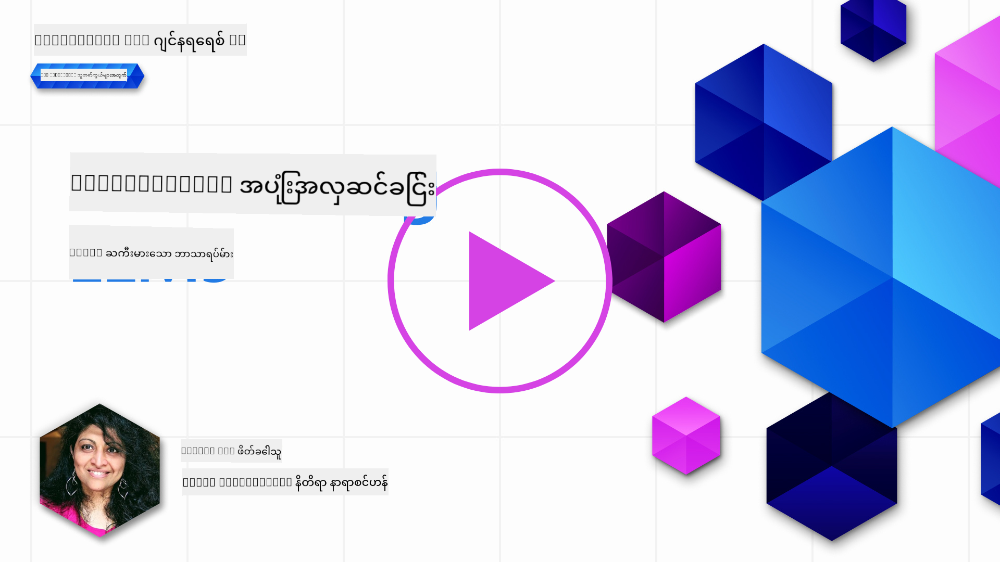
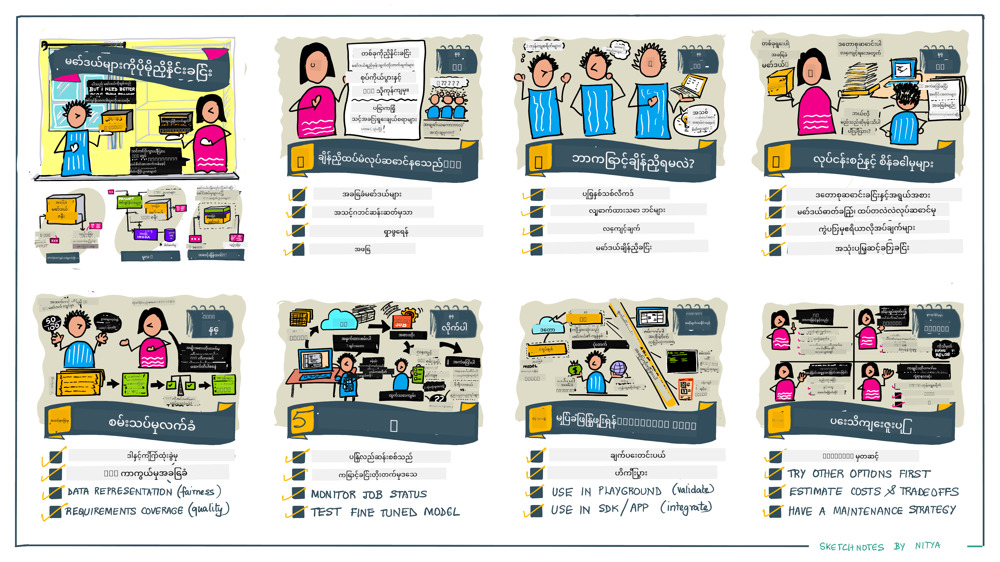

<!--
CO_OP_TRANSLATOR_METADATA:
{
  "original_hash": "68664f7e754a892ae1d8d5e2b7bd2081",
  "translation_date": "2025-06-26T00:54:40+00:00",
  "source_file": "18-fine-tuning/README.md",
  "language_code": "my"
}
-->

# သင့် LLM ကို Fine-Tuning ပြုလုပ်ခြင်း

အကြီးစားဘာသာစကားမော်ဒယ်များကို အသုံးပြု၍ AI လျှောက်လွှာများကို တည်ဆောက်ခြင်းသည် စိန်ခေါ်မှုအသစ်များကို ဖြစ်ပေါ်စေသည်။ အဓိကပြဿနာတစ်ခုမှာ သုံးစွဲသူတောင်းဆိုမှုအတွက် မော်ဒယ်မှ ထုတ်လုပ်သော အကြောင်းအရာ၏ တုံ့ပြန်မှု အရည်အသွေး (တိကျမှုနှင့် သက်ဆိုင်မှု) ကို သေချာစေရန် ဖြစ်သည်။ ယခင်သင်ခန်းစာများတွင် ကျွန်ုပ်တို့သည် prompt engineering နှင့် retrieval-augmented generation ကဲ့သို့သော နည်းလမ်းများကို ဆွေးနွေးခဲ့ပြီး ယခုရှိသော မော်ဒယ်ကို _prompt input_ ကို ပြောင်းလဲခြင်းဖြင့် ပြဿနာကို ဖြေရှင်းရန် ကြိုးစားသည်။

ယနေ့သင်ခန်းစာတွင် ကျွန်ုပ်တို့သည် **fine-tuning** ဟုခေါ်သော နည်းလမ်းတစ်ခုကို ဆွေးနွေးပြီး အခြားဒေတာများဖြင့် မော်ဒယ်ကို _ပြန်လည်လေ့ကျင့်ခြင်း_ ဖြင့် ပြဿနာကို ဖြေရှင်းရန် ကြိုးစားသည်။ အသေးစိတ်ကို ခေါင်းစဥ်ထဲသို့ ဝင်ရောက်ကြည့်ရှုကြပါစို့။

## သင်ယူရမည့် အချက်များ

ဒီသင်ခန်းစာမှာ ဘာသာစကားမော်ဒယ်များအတွက် fine-tuning ၏ အယူအဆကို မိတ်ဆက်ပေးပြီး ဒီနည်းလမ်း၏ အကျိုးကျေးဇူးနှင့် စိန်ခေါ်မှုများကို ရှာဖွေကာ သင့် AI မော်ဒယ်များ၏ စွမ်းဆောင်ရည်ကို မြှင့်တင်ရန် fine-tuning ကို မည်သည့်အခါနှင့် မည်သို့ အသုံးပြုရမည်ကို လမ်းညွှန်ချက်များပေးသည်။

ဒီသင်ခန်းစာအဆုံးတွင် သင်သည် အောက်ပါမေးခွန်းများကို ဖြေဆိုနိုင်ရမည်ဖြစ်သည် -

- ဘာသာစကားမော်ဒယ်များအတွက် fine-tuning ဆိုတာဘာလဲ?
- မည်သည့်အခါနှင့် မည်သို့ အကျိုးရှိနိုင်သနည်း?
- မည်သို့ pretrained မော်ဒယ်ကို fine-tune ပြုလုပ်နိုင်သနည်း?
- fine-tuning ၏ ကန့်သတ်ချက်များကဘာလဲ?

အသင့်ဖြစ်ပြီလား? စတင်လိုက်ကြပါစို့။

## ပုံမှန်လမ်းညွှန်ချက်

ဒီသင်ခန်းစာကို စတင်မည်မခင် ကျွန်ုပ်တို့ လေ့လာမည့် အကြောင်းအရာ၏ အကြီးမားဆုံး ပုံရိပ်ကို ကြည့်လိုပါသလား? အဓိက အယူအဆများနှင့် fine-tuning ၏ motivation ကို သင်ယူခြင်းမှ fine-tuning task ကို ဆောင်ရွက်ရန် လုပ်ငန်းစဉ်နှင့် အကောင်းဆုံး လေ့ကျင့်မှုများကို နားလည်ရန် သင်ခန်းစာလေ့လာခြင်းခရီးစဉ်ကို ဖျော်ဖြေရန် ရှင်းလင်းသော လမ်းညွှန်ချက်ကို ကြည့်ပါ။ ဒီအကြောင်းအရာကို ရှာဖွေရန် စိတ်ဝင်စားဖွယ် ကောင်းတဲ့အကြောင်းအရာဖြစ်တာကြောင့် သင့်ကိုယ်ပိုင်လေ့လာမှုခရီးစဉ်ကို အထောက်အပံ့ပေးရန် လင့်ခ်များကို ပံ့ပိုးပေးထားသော [Resources](./RESOURCES.md?WT.mc_id=academic-105485-koreyst) စာမျက်နှာကို မမေ့ပါနဲ့!

## ဘာသာစကားမော်ဒယ်များအတွက် fine-tuning ဆိုတာဘာလဲ?

အကြီးစားဘာသာစကားမော်ဒယ်များသည် အင်တာနက်ကဲ့သို့သော မျိုးစုံသော အရင်းအမြစ်များမှ ရရှိသော စကားဝိုင်းများကို _pre-trained_ လုပ်ထားသော အမျိုးအစားဖြစ်သည်။ ယခင်သင်ခန်းစာများတွင် ကျွန်ုပ်တို့သည် သုံးစွဲသူ၏ မေးခွန်းများ ("prompts") ကို မော်ဒယ်၏ တုံ့ပြန်မှုအရည်အသွေးကို မြှင့်တင်ရန် _prompt engineering_ နှင့် _retrieval-augmented generation_ ကဲ့သို့သော နည်းလမ်းများကို လိုအပ်သည်ကို လေ့လာခဲ့ပါသည်။

prompt engineering နည်းလမ်းကျယ်ပြန့်သည် မော်ဒယ်ကို တုံ့ပြန်မှုတွင် ဘာကိုမျှော်မှန်းထားသည်ကို ပိုမိုလမ်းညွှန်ပေးခြင်းဖြင့် _ညွှန်ကြားချက်များ_ (ထင်ရှားသော လမ်းညွှန်ချက်) သို့မဟုတ် _ဥပမာများကို ပေးခြင်း_ (မထင်ရှားသော လမ်းညွှန်ချက်) ဖြင့် လမ်းညွှန်ပေးခြင်းဖြင့် ဖြစ်သည်။ ဒါကို _few-shot learning_ ဟု ခေါ်ပြီး ဒါဟာ အကန့်အသတ်နှစ်ခုရှိပါတယ် -

- မော်ဒယ် token ကန့်သတ်ချက်များသည် သင့်ကို ပေးနိုင်သော ဥပမာအရေအတွက်ကို ကန့်သတ်နိုင်ပြီး ထိရောက်မှုကို ကန့်သတ်နိုင်သည်။
- မော်ဒယ် token ကုန်ကျစရိတ်များသည် ဥပမာများကို prompt တစ်ခုစီတွင် ထည့်သွင်းခြင်းကို စျေးကြီးစေပြီး လွယ်ကူမှုကို ကန့်သတ်နိုင်သည်။

Fine-tuning သည် မော်ဒယ်တစ်ခုကို ပြန်လည်လေ့ကျင့်ခြင်းဖြင့် အထူးလုပ်ဆောင်ချက်တစ်ခုအတွက် ၎င်း၏ စွမ်းဆောင်ရည်ကို မြှင့်တင်ရန် ကြိုးစားသော machine learning စနစ်များတွင် ယေဘုယျအားဖြင့် လုပ်ဆောင်သည့် လေ့ကျင့်မှုဖြစ်သည်။ ဘာသာစကားမော်ဒယ်များ၏ အခြေအနေတွင် မော်ဒယ်ကို **custom model** တစ်ခု ဖန်တီးရန် **အလုပ်လုပ်ပေးသော task သို့မဟုတ် application domain** တစ်ခုအတွက် ဂရုပြုထားသော ဥပမာများဖြင့် ပြန်လည်လေ့ကျင့်နိုင်သည်။ Fine-tuning ၏ အကျိုးကျေးဇူးတစ်ခုမှာ few-shot learning အတွက် လိုအပ်သော ဥပမာအရေအတွက်ကို လျှော့ချပေးနိုင်ခြင်းဖြစ်ပြီး token အသုံးပြုမှုနှင့် ဆက်စပ်ကုန်ကျစရိတ်များကို လျှော့ချပေးနိုင်သည်။

## ဘယ်အခါ fine-tune ပြုလုပ်ရမလဲ၊ ဘာကြောင့် လုပ်ရမလဲ?

ဒီအကြောင်းအရာတွင် fine-tuning ကို ပြောသောအခါ ကျွန်ုပ်တို့သည် **supervised** fine-tuning ကို ရည်ညွှန်းနေပြီး retraining ကို **original training dataset** မှ ပါဝင်ခြင်းမရှိသော **ဒေတာအသစ်** ထည့်သွင်းခြင်းဖြင့် ပြုလုပ်သည်။ ဒါဟာ မော်ဒယ်ကို original data ပေါ်မှာ retrain လုပ်ပြီး hyperparameters မတူကွဲပြားစွာ ပြုပြင်ခြင်းဖြင့် ပြုလုပ်သော unsupervised fine-tuning လမ်းကြောင်းနှင့် ကွဲပြားသည်။

လေးနက်စွာ သတိထားရမည့် အရာမှာ fine-tuning သည် ရလဒ်လိုလားသောအတိုင်း ရရှိရန် တစ်ခွင်လူသိပညာအဆင့် တစ်ခုလိုအပ်သော advanced နည်းလမ်းဖြစ်သည်။ မမှန်ကန်စွာ လုပ်ဆောင်ပါက မမျှော်လင့်ထားသော တိုးတက်မှုများကို မပေးနိုင်သည့်အပြင် သင့် targeted domain အတွက် မော်ဒယ်၏ စွမ်းဆောင်ရည်ကို ဆိုးရွားစေပါမည်။

အဲ့ဒါကြောင့် ဘာသာစကားမော်ဒယ်များကို "မည်သို့" fine-tune ပြုလုပ်ရမည်ကို သင်ယူမီ "ဘာကြောင့်" ဒီလမ်းကို လိုက်သင့်သည်၊ "ဘယ်အခါ" fine-tuning လုပ်ငန်းစဉ်ကို စတင်ရမည်ကို သိရပါမည်။ သင့်ကိုယ်ကို အောက်ပါမေးခွန်းများကို မေးပါ -

- **Use Case**: Fine-tuning အတွက် သင့် _အသုံးပြုမှုကိစ္စ_ ကဘာလဲ? လက်ရှိ pretrained မော်ဒယ်၏ ဘာကို တိုးတက်စေချင်သလဲ?
- **Alternatives**: ရလဒ်လိုလားသောအတိုင်း ရရှိရန် _အခြားနည်းလမ်းများ_ ကို ကြိုးစားထားပါသလား? ၎င်းတို့ကို ယှဉ်ပြိုင်ရန် အခြေခံလိုက်ပါ။
  - Prompt engineering: သက်ဆိုင်သော prompt response ဥပမာများဖြင့် few-shot prompting လုပ်ပါ။ တုံ့ပြန်မှုအရည်အသွေးကို အကဲဖြတ်ပါ။
  - Retrieval Augmented Generation: သင့်ဒေတာကို ရှာဖွေခြင်းဖြင့် ရရှိသော query results များဖြင့် prompts ကို ဖြည့်စွက်ပါ။ တုံ့ပြန်မှုအရည်အသွေးကို အကဲဖြတ်ပါ။
- **Costs**: Fine-tuning အတွက် ကုန်ကျစရိတ်များကို ဖော်ထုတ်ထားပါသလား?
  - Tunability - pretrained မော်ဒယ်သည် fine-tuning အတွက် ရရှိနိုင်ပါသလား?
  - Effort - လေ့ကျင့်မှုဒေတာကို ပြင်ဆင်ခြင်း၊ မော်ဒယ်ကို အကဲဖြတ်ခြင်းနှင့် ပြန်လည်ပြုပြင်ခြင်းအတွက် ကြိုးပမ်းမှု
  - Compute - fine-tuning jobs များကို run လုပ်ခြင်းနှင့် fine-tuned model ကို deploy လုပ်ခြင်းအတွက်
  - Data - fine-tuning ၏ အကျိုးသက်ရောက်မှုအတွက် အရည်အသွေးကောင်းသော ဥပမာများကို ရရှိနိုင်ခြင်း
- **Benefits**: Fine-tuning အတွက် အကျိုးကျေးဇူးများကို အတည်ပြုပြီးပါသလား?
  - Quality - fine-tuned model သည် အခြေခံလိုက်ပြိုင်ဆိုင်မှုထက် ထိပ်တန်းကျသလား?
  - Cost - prompt များကို ရိုးရှင်းစေခြင်းဖြင့် token အသုံးပြုမှုကို လျှော့ချပေးနိုင်သလား?
  - Extensibility - base model ကို domain အသစ်များအတွက် ပြန်လည်အသုံးပြုနိုင်ပါသလား?

ဒီမေးခွန်းများကို ဖြေဆိုခြင်းဖြင့် သင့်အသုံးပြုမှုအတွက် fine-tuning သည် မှန်ကန်သော လမ်းကြောင်းဖြစ်မဖြစ် ဆုံးဖြတ်နိုင်ရမည်ဖြစ်သည်။ အထူးသဖြင့် အကျိုးကျေးဇူးများသည် ကုန်ကျစရိတ်များထက် ပိုမိုအလေးထားရမည်။ ဆောင်ရွက်ရန် ဆုံးဖြတ်ပြီးပါက pretrained မော်ဒယ်ကို _မည်သို့_ fine-tune ပြုလုပ်နိုင်မည်ကို စဉ်းစားရမည်။

ဆုံးဖြတ်ချက်လုပ်ခြင်းလုပ်ငန်းစဉ်အပေါ် အမြင်ပိုမိုရရှိလိုပါသလား? [To fine-tune or not to fine-tune](https://www.youtube.com/watch?v=0Jo-z-MFxJs) ကို ကြည့်ပါ

## Pre-trained မော်ဒယ်ကို မည်သို့ fine-tune ပြုလုပ်နိုင်သနည်း?

Pre-trained မော်ဒယ်ကို fine-tune ပြုလုပ်ရန် သင်လိုအပ်သည်မှာ -

- fine-tune ပြုလုပ်ရန် pretrained မော်ဒယ်
- fine-tuning အတွက် အသုံးပြုရန် dataset
- fine-tuning job ကို run လုပ်ရန် training environment
- fine-tuned model ကို deploy လုပ်ရန် hosting environment

## Fine-Tuning လုပ်ငန်းစဉ်

အောက်ပါအရင်းအမြစ်များသည် ရွေးချယ်ထားသော မော်ဒယ်နှင့် ဂရုပြုထားသော dataset ကို အသုံးပြုပြီး လက်တွေ့အဖြစ် ရောက်ရှိရန် လမ်းညွှန်ချက်များကို တစ်ဆင့်ခြေလှမ်းဖြင့် ပံ့ပိုးပေးသည်။ ဒီလမ်းညွှန်ချက်များကို လုပ်ဆောင်ရန် သင့်ကို သတ်မှတ်ထားသော ပံ့ပိုးပေးသူတွင် အကောင့်တစ်ခုလိုအပ်ပြီး သက်ဆိုင်သော မော်ဒယ်နှင့် datasets များကို access လုပ်နိုင်ရန်လိုအပ်သည်။

| Provider     | Tutorial                                                                                                                                                                       | Description                                                                                                                                                                                                                                                                                                                                                                                                                        |
| ------------ | ------------------------------------------------------------------------------------------------------------------------------------------------------------------------------ | ---------------------------------------------------------------------------------------------------------------------------------------------------------------------------------------------------------------------------------------------------------------------------------------------------------------------------------------------------------------------------------------------------------------------------------- |
| OpenAI       | [How to fine-tune chat models](https://github.com/openai/openai-cookbook/blob/main/examples/How_to_finetune_chat_models.ipynb?WT.mc_id=academic-105485-koreyst)                | training data ကို ပြင်ဆင်ခြင်း၊ fine-tuning job ကို run လုပ်ခြင်းနှင့် inference အတွက် fine-tuned model ကို အသုံးပြုခြင်းဖြင့် _specific domain_ ("recipe assistant") အတွက် `gpt-35-turbo` ကို fine-tune ပြုလုပ်ရန် သင်ယူပါ။                                                                                                                                                                                                                                              |
| Azure OpenAI | [GPT 3.5 Turbo fine-tuning tutorial](https://learn.microsoft.com/azure/ai-services/openai/tutorials/fine-tune?tabs=python-new%2Ccommand-line?WT.mc_id=academic-105485-koreyst) | training data ကို ဖန်တီးခြင်းနှင့် upload လုပ်ခြင်း၊ fine-tuning job ကို run လုပ်ခြင်း အဆင့်များကို ခြေလှမ်းခြေလှမ်းဆောင်ရွက်ခြင်းဖြင့် **Azure** ပေါ်တွင် `gpt-35-turbo-0613` မော်ဒယ်ကို fine-tune ပြုလုပ်ရန် သင်ယူပါ။ Deploy လုပ်ပါ။ နယူးမော်ဒယ်ကို အသုံးပြုပါ။                                                                                                                                                                                                                                                                 |
| Hugging Face | [Fine-tuning LLMs with Hugging Face](https://www.philschmid.de/fine-tune-llms-in-2024-with-trl?WT.mc_id=academic-105485-koreyst)                                               | [transformers](https://huggingface.co/docs/transformers/index?WT.mc_id=academic-105485-koreyst) library နှင့် [Transformer Reinforcement Learning (TRL)](https://huggingface.co/docs/trl/index?WT.mc_id=academic-105485-koreyst]) ဖြင့် [datasets](https://huggingface.co/docs/datasets/index?WT.mc_id=academic-105485-koreyst) များကို Hugging Face တွင် အသုံးပြု၍ _open LLM_ (ဥပမာ `CodeLlama 7B`) ကို fine-tune ပြုလုပ်ရန် သင်ယူပါ။ |
|              |                                                                                                                                                                                |                                                                                                                                                                                                                                                                                                                                                                                                                                    |
| 🤗 AutoTrain | [Fine-tuning LLMs with AutoTrain](https://github.com/huggingface/autotrain-advanced/?WT.mc_id=academic-105485-koreyst)                                                         | AutoTrain (သို့မဟုတ် AutoTrain Advanced) သည် Hugging Face မှ ဖွံ့ဖြိုးတိုးတက်ထားသော python library ဖြစ်ပြီး LLM finetuning အပါအဝင် အမျိုးမျိုးသော task များအတွက် finetuning ကို လုပ်ဆောင်နိုင်သည်။ AutoTrain သည် no-code ဖြေရှင်းချက်ဖြစ်ပြီး finetuning ကို သင့်ကိုယ်ပိုင် cloud တွင်၊ Hugging Face Spaces သို့မဟုတ် locally တွင် လုပ်ဆောင်နိုင်သည်။ ၎င်းသည် web-based GUI, CLI နှင့် yaml config files ဖြင့် training ကို ပံ့ပိုးပေးသည်။                                                                               |
|              |                                                                                                                                                                                |                                                                                                                                                                                                                                                                                                                                                                                                                                    |

## လုပ်ငန်းတာဝန်

အထက်ပါလမ်းညွှန်ချက်များထဲမှ တစ်ခုကို ရွေးပြီး လမ်းကြောင်းကို လိုက်ပါ။ _ကျွန်ုပ်တို့သည် ဤ repo မှာ Jupyter Notebooks တွင် ဤလမ်းညွှန်ချက်များ၏ ဗားရှင်းတစ်ခုကို အထောက်အထားအဖြစ် ထပ်မံလုပ်ဆောင်နိုင်ပါသည်။ အမြဲတမ်းနောက်ဆုံးဗားရှင်းများကို ရရှိရန် အစပိုင်အရင်းအမြစ်များကို တိုက်ရိုက်အသုံးပြုပါ_။

## လုပ်ဆောင်မှုကောင်းမွန်သည်! သင်၏ လေ့လာမှုကို ဆက်လက်လုပ်ဆောင်ပါ။

ဒီသင်ခန်းစာကို ပြီးဆုံးပြီးနောက် [Generative AI Learning collection](https://aka.ms/genai-collection?WT.mc_id=academic-105485-koreyst) ကို ကြည့်ပါ။ သင်၏ Generative AI အကြောင်းအရာကို ဆက်လက်မြှင့်တင်ပါ!

ဂုဏ်ယူပါတယ်!! သင်သည် ဤသင်ခန်းစာ၏ v2 series ၏ နောက်ဆုံးသင်ခန်းစာကို ပြီးစီးခဲ့ပြီဖြစ်သည်! လေ့လာမှုနှ

**ရယူချက်**:  
ဤစာရွက်ကို AI ဘာသာပြန်ဝန်ဆောင်မှု [Co-op Translator](https://github.com/Azure/co-op-translator) ကို အသုံးပြု၍ ဘာသာပြန်ထားပါသည်။ ကျွန်ုပ်တို့သည် တိကျမှန်ကန်မှုကို ကြိုးစားသော်လည်း အလိုအလျောက် ဘာသာပြန်ချက်များတွင် အမှားများ သို့မဟုတ် မမှန်ကန်မှုများ ပါဝင်နိုင်သည်ကို သတိပြုပါ။ မူရင်းစာရွက်ကို ၎င်း၏ ရင်းမြစ်ဘာသာစကားဖြင့် အာဏာရှိသော ရင်းမြစ်အဖြစ် ထည့်သွင်းစဉ်းစားသင့်သည်။ အရေးကြီးသော သတင်းအချက်အလက်များအတွက် လူအချင်းချင်း ပရော်ဖက်ရှင်နယ် ဘာသာပြန်မှုကို အကြံပြုပါသည်။ ဤဘာသာပြန်ချက်ကို အသုံးပြုခြင်းမှ ဖြစ်ပေါ်လာသော နားလည်မှုမှားများ သို့မဟုတ် အဓိပ္ပာယ်အလွဲများအတွက် ကျွန်ုပ်တို့သည် တာဝန်မယူပါ။