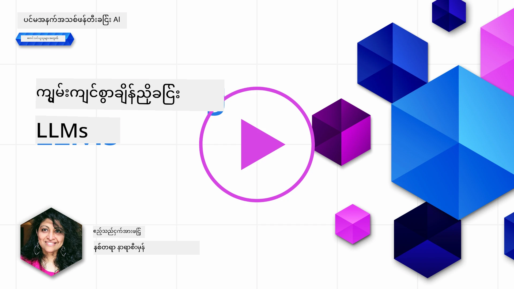
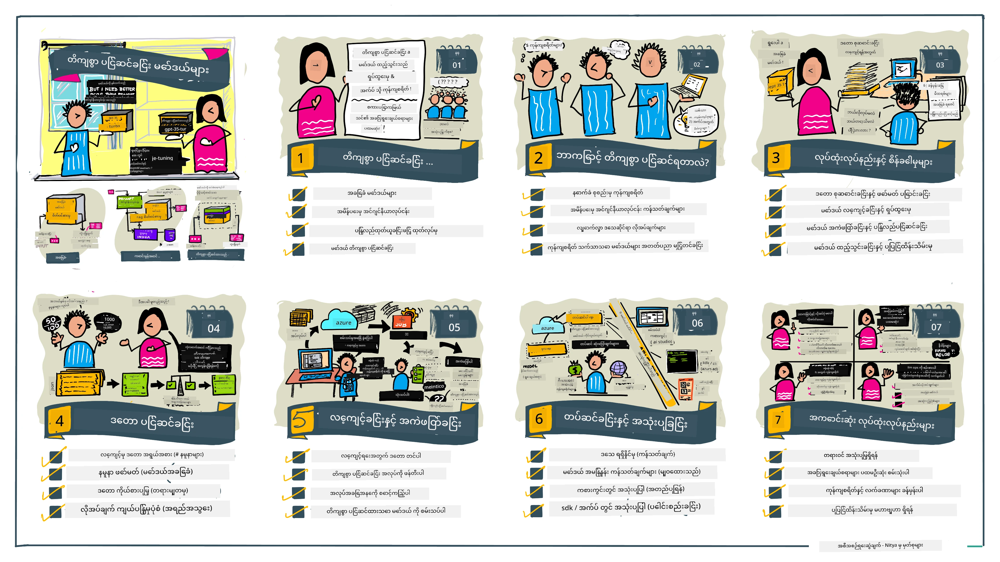

# သင့် LLM ကို Fine-Tuning လုပ်ခြင်း

ကြီးမားသောဘာသာစကားမော်ဒယ်များကို အသုံးပြု၍ generative AI အက်ပလီကေးရှင်းများတည်ဆောက်ရာတွင် အခက်အခဲအသစ်များ ရှိလာသည်။ အဓိကပြဿနာမှာ မော်ဒယ်မှ ဖြစ်ထွန်းလာသော အကြောင်းအရာများတွင် သုံးစွဲသူ၏ တောင်းဆိုမှုအရ အဖြေ၏ အရည်အသွေး (တိကျမှုနှင့် သင့်တော်မှု) ကို သေချာစေရန်ဖြစ်သည်။ ယခင်သင်ခန်းစာများတွင် ကျွန်ုပ်တို့သည် prompt engineering နှင့် retrieval-augmented generation ကဲ့သို့သော နည်းလမ်းများကို ပြောကြားထားပြီး၊ ၎င်းတို့သည် မူလမော်ဒယ်အား _prompt input ကို ပြင်ဆင်ခြင်း_ မှတဆင့် ပြဿနာကို ဖြေရှင်းရန်ကြိုးစားကြသည်။

ယနေ့သင်ခန်းစာတွင် ကျွန်ုပ်တို့သည် အတုယှဥ်သုံးနည်းတစ်ခုဖြစ်သော **fine-tuning** ကို ဆွေးနွေးပါမည်၊ ၎င်းသည် _မော်ဒယ်ကိုအခြားဒေတာဖြင့် ပြန်လေ့ကျင့်ခြင်းအားဖြင့်_ ပြဿနာကို ဖြေရှင်းရန် ကြိုးစားသည်။ အသေးစိတ်တွေကို တွေ့ကြရအောင်။

## သင်ယူရမည့်ရည်ရွယ်ချက်များ

ဤသင်ခန်းစာသည် ကြိုတင်လေ့ကျင့်ထားသော ဘာသာစကားမော်ဒယ်များအတွက် fine-tuning ၏ ကိုယ်ရည်ကိုယ်သွင်းကို မိတ်ဆက်ပေးပြီး၊ ဤနည်းလမ်း၏ အကျိုးကျေးဇူးများနှင့် အခက်အခဲများကို ဆန်းစစ်လေ့လာကာ၊ သင့် generative AI မော်ဒယ်၏ လုပ်ဆောင်မှုကို တိုးတက်စေရန် fine tuning ကို ဘယ်အချိန်၊ မည်သို့ သုံးသင့်ကြောင်း လမ်းညွှန်မှုများ ပေးပါမည်။

သင်ဤသင်ခန်းစာကို ပြီးဆုံးလျှင် အောက်ပါမေးခွန်းများကို ဖြေဆိုနိုင်ရမည်-

- ဘာသာစကားမော်ဒယ်များအတွက် fine tuning ဆိုတာဘာလဲ?
- ဘယ်အချိန်မှာ၊ ဘာကြောင့်, fine tuning သုံးသင့်တာလဲ?
- ကြိုတင်လေ့ကျင့်ထားသော မော်ဒယ်တစ်ခုကို မည်သို့ fine-tune လုပ်ရမလဲ?
- fine-tuning ၏ ကန့်သတ်ချက်များကဘာလဲ?

အစပြုကြရအောင်။

## ဓာတ်ပုံပါ ထောက်ခံချက်

မင်းတို့လေ့လာမယ့်အကြောင်းအရာများလုံးဝမှန်ကန်စွာ သိချင်ရင် ဒီဓာတ်ပုံပါ လမ်းညွှန်လေးကို ကြည့်လိုက်ပါ။ ဤသင်ခန်းစာ၏ သင်ယူခရီးကို အဓိကအကြောင်းအရာများနှင့် fine-tuning ၏ အကြောင်းရင်းတို့မှ စ၍၊ fine-tuning လုပ်ငန်းစဉ်နှင့် အကောင်းဆုံး ရလဒ်ရရန် လုပ်ထုံးလုပ်နည်းများကို နားလည်ရန် ဖော်ပြထားသည်။ သင့်ကိုယ်တိုင် မိမိဘာသာ လေ့လာသင်ယူရာတွင် ကူညီနိုင်ဖို့ အပိုဆောင်းလင့်ခ်များကို [Resources](./RESOURCES.md?WT.mc_id=academic-105485-koreyst) စာမျက်နှာမှာလည်း စစ်ဆေးမှတ်သားဖို့ မမေ့ပါနဲ့။

## ဘာသာစကားမော်ဒယ်များအတွက် fine-tuning ဆိုတာဘာလဲ?

အဓိပ္ပါယ်အရ, ကြီးမားသောဘာသာစကားမော်ဒယ်များကို အင်တာနက်ကဲ့သို့ မတူညီသောရင်းမြစ်များမှစုဆောင်းထားသော အကြောင်းအရာများအပေါ် များစွာ ထိန်းသိမ်းပြီး _ကြိုတင်လေ့ကျင့်_ ကြသည်။ ယခင်သင်ခန်းစာများတွင် တင်ပြခဲ့သည့်အတိုင်း၊ မော်ဒယ်၏ အသုံးပြုသူ မေးခွန်းများ ("prompt") အပေါ်တုံ့ပြန်မှုအရည်အသွေးကို တိုးတက်စေရန် _prompt engineering_ နှင့် _retrieval-augmented generation_ ကဲ့သို့သော နည်းလမ်းများလိုအပ်သည်။

မော်ဒယ်အား တုံ့ပြန်ပြီးစီးမည့် အကြောင်းအရာတွင် ပိုမိုလမ်းညွှန်ပေးရန် ပုံမှန် prompt engineering နည်းလမ်းအသုံးများမှာ _ညွှန်ကြားချက်များ_ (ရှင်းလင်းသောလမ်းညွှန်ချက်များ) ကိုပေးခြင်း သို့မဟုတ် _နမူနာအနည်းငယ်_ ပေးခြင်း (အနက်သားလမ်းညွှန်ချက်များ) တို့ဖြစ်သည်။ ၎င်းကို _few-shot learning_ ဟု ခေါ်ဆိုသည်။ သို့ရာတွင် တားဆီးချက်နှစ်ခုရှိသည်-

- မော်ဒယ် token ကန့်သတ်ချက်ကြောင့် ပေးနိုင်သောနမူနာအရေအတွက်ကိန်းရိုးနှင့် အကျိုးကျေးဇူး ကန့်သတ်နိုင်သည်။
- မော်ဒယ် token ကုန်ကျစရိတ်ကြောင့် နမူနာများအား စိတ်ကြိုက်ထည့်သွင်းရန် မြောက်နှုန်းကုန်သည်နှင့် လွတ်လပ်မှု ကန့်သတ်နိုင်သည်။

Fine-tuning သည် မော်တော်ယာဉ်လေ့ကျင့်မှု စနစ်များ၌ ကျယ်ပြန့်စွာအသုံးပြုသည့်နည်းဖြစ်ပြီး ကြိုတင်လေ့ကျင့်ထားသော မော်ဒယ်တစ်ခုကို ထပ်မံ ဒေတာအသစ်များဖြင့် ပြန်လေ့ကျင့်ခြင်းဖြင့် အတိအကျ ဆောင်ရွက်မှု တစ်ခုစီမှာ ပိုမိုတိုးတက်စေရန်ဖြစ်သည်။ ဘာသာစကားမော်ဒယ်အရင်းအမြစ်၌၊ ကျွန်ုပ်တို့မှာ မည်သည့် အလုပ်ငန်း သို့မဟုတ် လုပ်ဆောင်မှု ဒေသတစ်ခုအတွက် လိုအပ်သည့် နမူနာများစာရင်းကို စီစစ်ပြီး ပြန်လည်လေ့ကျင့်ခြင်းဖြင့် **စိတ်ကြိုက်မော်ဒယ်** တစ်ခု ဖန်တီးနိုင်သည်၊ ၎င်းသည် ထိုအလုပ်ငန်း သို့မဟုတ် ဒေသအတွက် ပိုမိုတိကျပြီး သင့်တော်နိုင်သည်။ Fine-tuning ၏ နောက်ဆက်တွဲ အကျိုးကျေးဇူးကတော့ few-shot learning အတွက် လိုအပ်သည့် နမူနာများ အရေအတွက်လည်း လျော့ချပေးနိုင်ခြင်း ဖြစ်ပြီး token အသုံးပြုမှုနှင့် ဆက်စပ်ကုန်ကျစရိတ်များကို လျော့နည်းစေသည်။

## ဘယ်အချိန်တွင် ဘာကြောင့် မော်ဒယ်များကို fine-tune လုပ်သင့်သနည်း?

ဤ "fine-tuning" ပြောသောအခါမှာ ကျွန်ုပ်တို့သည် **supervised** fine-tuning ကို ရည်ညွှန်းလိုက်ပြီး၊ ၎င်းမှာပထမကသင်ကြားမှုဒေတာတွင် မပါဝင်သည့် ဒေတာအသစ်များကို ထည့်သွင်းပြီး ပြန်လေ့ကျင့်ခြင်းဖြစ်သည်။ ၎င်းသည် မူလဒေတာများပေါ်မှ မော်ဒယ်ကို ပြန်လေ့ကျင့်သော်လည်း hyperparameter မတူသည့် unsupervised fine-tuning နည်းလမ်းနှင့် ကွာခြားသည်။

လေ့လာသိရှိထားရန် အရေးကြီးသောအချက်မှာ fine-tuning သည် လိုအပ်သော အတုကျွမ်းကျင်မှုအဆင့်တစ်ခုရှိရမည့် နည်းလမ်းတစ်ခု ဖြစ်သည်။ အမှားတက်လျှင် မမျှော်လင့်သင့်သော တိုးတက်မှုများ မရရှိနိုင်ပဲ မော်ဒယ်အား ထိခိုက်စေနိုင်သည်။

ထို့ကြောင့် ဘာသာစကား မော်ဒယ်များကို fine-tune "ဘယ်လို" လုပ်မလဲ သင်ယူရန် မတိုင်မီ၊ ဘာကြောင့် (why) ၎င်း လမ်းကြောင်းကို ရွေးချယ်ရသလဲ၊ ဘယ်အချိန်တွင် (when) စတင်ဖို့လိုသလဲကို နားလည်ဖို့ လိုအပ်သည်။ စတင်ရန် မေးခွန်းများကို မေးစရာ-

- **အသုံးပြုမှု အမျိုးအစား**: သင့် fine-tuning အတွက် _အသုံးပြုမှုကိစ္စ_ ဘာလဲ? လောလောဆယ် ကြိုတင်လေ့လာထားသော မော်ဒယ်တွင် ဘယ်ပိုင်းကို တိုးတက်စေချင်သလဲ?
- **အခြားရွေးချယ်မှုများ**: လိုအပ်သည့်ရလဒ်များရရှိရန်အတွက် _အခြားနည်းလမ်းများ_ ကို စမ်းသပ်ဖူးပြီလား? ၎င်းတို့ကို အခြေခံတန်းထူရန် အသုံးပြုပါ။
  - Prompt engineering: သင့်မေးခွန်းနှင့် သက်ဆိုင်သည့် နမူနာနှင့် အတူ few-shot prompting နည်းများကို စမ်းကြည့်ပါ။ တုံ့ပြန်မှုအရည်အသွေးကို သုံးသပ်ပါ။
  - Retrieval Augmented Generation: ရှာဖွေရန်ရလဒ်များနှင့် prompt များကို တိုးမြှင့်ခြင်း။ တုံ့ပြန်မှုအရည်အသွေးကို သုံးသပ်ပါ။
- **ကုန်ကျစရိတ်များ**: fine-tuning ၏ ကုန်ကျစရိတ်များအား သတ်မှတ်နိုင်ပြီလား?
  - Tunability - ကြိုတင်လေ့ကျင့်ထားသော မော်ဒယ်သည် fine-tuning အတွက် အသုံးပြုနိုင်ပါသလား?
  - လုပ်အား - သင်ကြားမှုဒေတာ ပြင်ဆင်ခြင်း၊ မော်ဒယ်ကို သုံးသပ်နှင့် ပြန်လည်တည်းဖြတ်ခြင်းအတွက် လိုအပ်သည့် အလုပ်အား
  - ကွန်ပျူတာအင်အား - fine-tuning အလုပ်များ ဆောင်ရွက်ခြင်း၊ နှင့် fine-tuned မော်ဒယ်ကို တီထွင်သုံးစွဲခြင်းအတွက်
  - ဒေတာ - fine-tuning ၏ သက်ရောက်မှုရှိရန် လုံလောက်သော အရည်အသွေးနမူနာများရရှိမရှိ
- **အကျိုးကျေးဇူးများ**: fine-tuning ၏ အကျိုးကျေးဇူးများ ထောက်ခံပြည့်စုံပြီလား?
  - အရည်အသွေး - fine-tuning မော်ဒယ်သည် အခြေခံတန်းထက်ပိုမိုကောင်းတယ်လား?
  - ကုန်ကျစရိတ် - prompt များ လွယ်ကူစေ၍ token အသုံးချမှု လျော့ပါးစေသလား?
  - တိုးချဲ့နိုင်မှု - မူလမော်ဒယ်ကို ဒေသအသစ်များအတွက် ထပ်၍ အသုံးပြုနိုင်ပါသလား?

ဤမေးခွန်းများကို ဖြေဆိုခြင်းဖြင့် သင်၏အသုံးပြုမှုအတွက် fine-tuning သင့်တော်မသင့်တယ် ဆုံးဖြတ်နိုင်မည်။ အကယ်၍ အကျိုးကျေးဇူးများသည် ကုန်ကျစရိတ်ထက်ပိုမိုရှိလျှင်သာ ဤနည်းလမ်းကို အသုံးချသင့်သည်။ ဆုံးဖြတ်ပြီးသွားသည်နှင့် ကျွန်ုပ်တို့ fine-tuning ကို ဘယ်လို လုပ်မည်ကို သိဖြစ်စေဖို့ အချိန်ရောက်ပြီ။

ဆုံးဖြတ်မှုဖြစ်စဉ်အကြောင်းပိုမိုနားလည်လိုသလား? [To fine-tune or not to fine-tune](https://www.youtube.com/watch?v=0Jo-z-MFxJs) ကို ကြည့်ရှုပါ။

## ကြိုတင်လေ့ကျင့်ထားသော မော်ဒယ်တစ်ခုကို မည်သို့ fine-tune လုပ်နိုင်မလဲ?

ကြိုတင်လေ့ကျင့်ထားသော မော်ဒယ်ကို fine-tune လုပ်ရန်အတွက် မလိုအပ်နိုင်သောအရာများမှာ-

- fine-tuning အတွက် ကြိုတင်လေ့ကျင့်ထားသော မော်ဒယ်တစ်ခု
- fine-tuning အတွက် သုံးမည့် ဒေတာစုစည်းချက် (dataset)
- fine-tuning အလုပ်ဆောင်ရန် လေ့ကျင့်မှု ပတ်ဝန်းကျင်
- fine-tuned မော်ဒယ်ကို တီထွင် သုံးစွဲရန် ဟိုစတင်း ပတ်ဝန်းကျင်

## Fine-Tuning လုပ်ငန်းစဉ်တွင်

အောက်ဖော်ပြပါ အရင်းအမြစ်များမှာ သင့်အား ရွေးချယ်ထားသော မော်ဒယ်နှင့် စိစစ်ထားသော ဒေတာစုစည်းခြင်းနှင့်တကွ တစ်ဆင့်ချင်းလုပ်ငန်းစဉ်များအား လမ်းညွှန်သင်ကြားပေးပါသည်။ ဤသင်ခန်းစာများကို လေ့လာရန် သတ်မှတ်ထားသော ပံ့ပိုးသူ၏ အကောင့်နှင့် သက်ဆိုင်ရာ မော်ဒယ်များ၊ ဒေတာများအောက်ရှိ မှတ်ပုံတင်ခွင့်များ လိုအပ်ပါသည်။

| ပံ့ပိုးသူ | သင်ခန်းစာ | ဖော်ပြချက် |
| ------------ | ------------------------------------------------------------------------------------------------------------------------------------------------------------------------------ | ---------------------------------------------------------------------------------------------------------------------------------------------------------------------------------------------------------------------------------------------------------------------------------------------------------------------------------------------------------------------------------------------------------------------------------- |
| OpenAI       | [How to fine-tune chat models](https://github.com/openai/openai-cookbook/blob/main/examples/How_to_finetune_chat_models.ipynb?WT.mc_id=academic-105485-koreyst) | `gpt-35-turbo` ကို "recipe assistant" အထူးနယ်ပယ်အတွက် fine-tune လုပ်ရန် သင်ကြားမှုဒေတာပြင်ဆင်ခြင်း၊ fine-tuning အလုပ်တင်ပြခြင်း၊ fine-tuned မော်ဒယ်ကို inference အတွက် သုံးခြင်းတို့ကို လေ့လာနိုင်ပါသည်။                                                                                                                                                                                      |
| Azure OpenAI | [GPT 3.5 Turbo fine-tuning tutorial](https://learn.microsoft.com/azure/ai-services/openai/tutorials/fine-tune?tabs=python-new%2Ccommand-line&WT.mc_id=academic-105485-koreyst) | Azure ပေါ်တွင် `gpt-35-turbo-0613` မော်ဒယ်ကို fine-tune လုပ်နေတဲ့ အဆင့်များမှာ သင်ကြားမှုဒေတာ ဖန်တီးခြင်း နှင့် အပ်လုဒ်တင်ခြင်း၊ fine-tuning အလုပ်အပ်လုပ်ခြင်း၊ မော်ဒယ်အသစ် တီထွင်ပြီး အသုံးပြုခြင်းတို့ပါဝင်သည်။                                                                                                                                                               |
| Hugging Face | [Fine-tuning LLMs with Hugging Face](https://www.philschmid.de/fine-tune-llms-in-2024-with-trl?WT.mc_id=academic-105485-koreyst) | ဤဘလော့ဂ်ပို့စ်မှာ [transformers](https://huggingface.co/docs/transformers/index?WT.mc_id=academic-105485-koreyst) ไลဘရารีနှင့် [Transformer Reinforcement Learning (TRL)](https://huggingface.co/docs/trl/index?WT.mc_id=academic-105485-koreyst) ကို အသုံးပြုလျက် _open LLM_ (ဥပမာ- `CodeLlama 7B`) ကို Hugging Face ပလက်ဖောင်းပေါ်ရှိ ဒေတာစုစည်းများဖြင့် fine-tune လုပ်နည်းကို လမ်းညွှန်ပါသည်။ |
|              |                                                                                                                                                                                |                                                                                                                                                                                                                                                                                                                                                                                                                                    |
| 🤗 AutoTrain | [Fine-tuning LLMs with AutoTrain](https://github.com/huggingface/autotrain-advanced/?WT.mc_id=academic-105485-koreyst)                                                         | AutoTrain (သို့) AutoTrain Advanced သည် Hugging Face ဖန်တီးသော Python ไลဘရရီဖြစ်ပြီး မတူညီသော လုပ်ငန်းများစွာအတွက် LLM fine-tune လုပ်နိုင်သည်။ AutoTrain သည် နေရာတိုင်းတွင် ကုဒ်မရှိဘဲ fine-tuning ပြုလုပ်နိုင်ပြီး Hugging Face Spaces သို့မဟုတ် ဒေတာကိုယ်ပိုင် နေရာတွင် အလုပ်လုပ်နိုင်သည်။ Web GUI, CLI နှင့် yaml config ဖိုင်တို့ဖြင့် လေ့ကျင့်နိုင်စွမ်းကို ပံ့ပိုးသည်။                                                                         |
|              |                                                                                                                                                                                |                                                                                                                                                                                                                                                                                                                                                                                                                                    |
| 🦥 Unsloth | [Fine-tuning LLMs with Unsloth](https://github.com/unslothai/unsloth)                                                         | Unsloth သည် LLM fine-tuning နှင့် reinforcement learning (RL) ကို ပံ့ပိုးသော open-source ဖရမ်ဝွတ်တစ်ခုဖြစ်သည်။ Unsloth သည် ဒေသတွင်း လေ့ကျင့်မှု၊ သုံးသပ်ခြင်း နှင့် တီထွင်ခြင်းကို လွယ်ကူအောင်ပြုလုပ်ရန် အဆင်သင့် [notebooks](https://github.com/unslothai/notebooks) များကို ထောက်ပံ့သည်။ TTS, BERT နှင့် မည်မျှမျှတို့မော်ဒယ်များကိုလည်း ပံ့ပိုးသည်။ စတင်ရန် သူတို့၏ ခရီးစဉ် [Fine-tuning LLMs Guide](https://docs.unsloth.ai/get-started/fine-tuning-llms-guide) ကို ဖတ်ပါ။                                                                          |
|              |                                                                                                                                                                                |                                                                                                                                                                                                                                                                                                                                                                                                                                    |
## အပ်မြှင့်ရန် တာဝန်

အထက်ဖေါ်ပြပါ သင်ခန်းစာများမှ တစ်ခုကို ရွေးချယ်၍ လမ်းညွှန်ချက်အတိုင်း လေ့လာပါ။ _ဤသင်ခန်းစာများကို Jupyter Notebooks အဖြစ် သက်ဆိုင်ရာ repo တွင် ပြန်လည်တင်ဆက်နိုင်သော်လည်း၊ နောက်ဆုံးဗားရှင်းများ အတွက် မူရင်းရင်းမြစ်များကိုတိုက်ရိုက်အသုံးပြုပေးပါ_။

## အလွန်ကောင်းမြတ်သော အလုပ်လုပ်ခဲ့ပါပြီ! သင်ယူမှု ကို ဆက်လက်လုပ်ဆောင်ပါ။

ဤသင်ခန်းစာပြီးဆုံးပါက ကျွန်ုပ်တို့၏ [Generative AI Learning collection](https://aka.ms/genai-collection?WT.mc_id=academic-105485-koreyst) ကို ကြည့်ရှုကာ သင်၏ Generative AI အသိပညာများကို ဆက်လက်မြှင့်တင်ပါ။

ဂုဏ်းယူပါသည်!! သင်သည် ဒီသင်တန်း၏ v2 တွဲလိုက်သင်ခန်းစာများ အဆုံးသတ်ပြီး ဖြစ်ပါသည်! သင်ယူခြင်းနှင့် တည်ဆောက်ခြင်း မရပ်တန့်ပါနဲ့။ \*\*ဒီခေါင်းစဉ်အတွက် ထပ်မံ အကြံဉာဏ်များ စာရင်းကို [RESOURCES](RESOURCES.md?WT.mc_id=academic-105485-koreyst) စာမျက်နှာတွင် စစ်ဆေးလိုက်ပါ။

ကျွန်ုပ်တို့၏ v1 တွဲလိုက်သင်ခန်းစာများတွင်လည်း တာဝန်များနှင့် အတွေးအခေါ်များ ပိုမိုတိုးတက်အောင် ပြုပြင်ထားပြီး ဖြစ်သည်။ ထို့ကြောင့် သင့်အသိပညာကို ပြန်လည် ပြုပြင်မြှင့်တင်ရန် တစ်မိနစ်ချင်း ရင်းနှီးပါ။ ထို့နောက် ကျေးဇူးပြု၍ [သင့်မေးခွန်းများနှင့် တုံ့ပြန်ချက်များ](https://github.com/microsoft/generative-ai-for-beginners/issues?WT.mc_id=academic-105485-koreyst) ကို မျှဝေ ပေးခြင်းဖြင့် ကျွန်ုပ်တို့ကို ဒီသင်ခန်းစာများ အသိုင်းအဝိုင်းအတွက်ပိုမိုတိုးတက်အောင် ကူညီပေးပါ။

---

<!-- CO-OP TRANSLATOR DISCLAIMER START -->
**သတိပြုရန်**  
ဤစာတမ်းကို AI ဘာသာပြန်ခြင်း စနစ်ဖြစ်သော [Co-op Translator](https://github.com/Azure/co-op-translator) ဖြင့် ဘာသာပြန်ထားခြင်းဖြစ်ပါသည်။ ကျွန်တော်တို့သည် တိကျမှန်ကန်မှုအတွက် ကြိုးပမ်းနေသော်လည်း အလိုအလျောက် ဘာသာပြန်မှုတွင် အမှားများ သို့မဟုတ် မှန်ကန်မှုကျဆင်းနိုင်မှုများ ရှိနိုင်ကြောင်း သတိပြုရန်လိုသည်။ မူလ စာတမ်းကို မူလဘာသာဖြင့်သာ တရားဝင်အရင်းအမြစ်အဖြစ် သတ်မှတ်စဉ်းစားသင့်ပါသည်။ အရေးကြီးသော အချက်အလက်များအတွက်၊ လူသားဘာသာပြန် ပညာရှင်များမှ ဘာသာပြန်ခြင်းကို အကြံပြုပါသည်။ ဤဘာသာပြန်မှုကို အသုံးပြုမှုကြောင့် ဖြစ်ပေါ်သော မမြင်နိုင်ခြင်းများ သို့မဟုတ် မှားယွင်းချက်များအတွက် ကျွန်တော်တို့ တာဝန်မရှိပါ။
<!-- CO-OP TRANSLATOR DISCLAIMER END -->