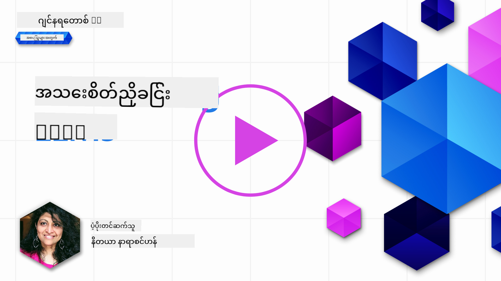
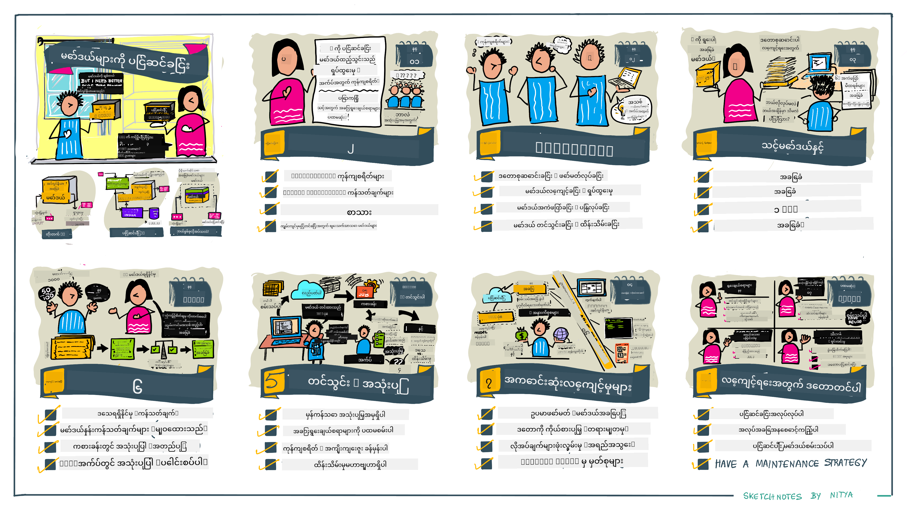

<!--
CO_OP_TRANSLATOR_METADATA:
{
  "original_hash": "68664f7e754a892ae1d8d5e2b7bd2081",
  "translation_date": "2025-07-09T17:51:43+00:00",
  "source_file": "18-fine-tuning/README.md",
  "language_code": "my"
}
-->

# သင့် LLM ကို Fine-Tuning ပြုလုပ်ခြင်း

ကြီးမားသောဘာသာစကားမော်ဒယ်များကို အသုံးပြု၍ generative AI အက်ပလီကေးရှင်းများ တည်ဆောက်ရာတွင် စိန်ခေါ်မှုအသစ်များ ရှိလာသည်။ အဓိကပြဿနာမှာ အသုံးပြုသူတစ်ဦး၏ မေးခွန်းအတွက် မော်ဒယ်ထုတ်ပေးသော အကြောင်းအရာ၏ တုံ့ပြန်မှုအရည်အသွေး (တိကျမှုနှင့် သက်ဆိုင်မှု) ကို သေချာစေရန် ဖြစ်သည်။ ယခင်သင်ခန်းစာများတွင် prompt engineering နှင့် retrieval-augmented generation ကဲ့သို့သော နည်းလမ်းများကို ဆွေးနွေးခဲ့ပြီး၊ မော်ဒယ်ရှိ prompt input ကို ပြင်ဆင်ခြင်းဖြင့် ပြဿနာကို ဖြေရှင်းရန် ကြိုးပမ်းခဲ့ကြသည်။

ယနေ့သင်ခန်းစာတွင် သုံးသပ်မည့် နည်းလမ်းတစ်ခုမှာ **fine-tuning** ဖြစ်ပြီး၊ ထိုနည်းလမ်းသည် _မော်ဒယ်ကို ကိုယ်တိုင် ထပ်မံလေ့ကျင့်ခြင်း_ ဖြင့် စိန်ခေါ်မှုကို ဖြေရှင်းရန် ကြိုးပမ်းသည်။ အသေးစိတ်ကို လေ့လာကြမယ်။

## သင်ယူရမည့် ရည်မှန်းချက်များ

ဤသင်ခန်းစာသည် pre-trained language models များအတွက် fine-tuning အကြောင်းကို မိတ်ဆက်ပေးပြီး၊ ဤနည်းလမ်း၏ အကျိုးကျေးဇူးများနှင့် စိန်ခေါ်မှုများကို ရှင်းလင်းပြသကာ၊ generative AI မော်ဒယ်များ၏ စွမ်းဆောင်ရည်တိုးတက်စေရန် fine-tuning ကို ဘယ်အချိန်၊ ဘယ်လို အသုံးပြုရမည်ကို လမ်းညွှန်ပေးသည်။

သင်ခန်းစာအဆုံးတွင် အောက်ပါမေးခွန်းများကို ဖြေဆိုနိုင်ရမည်ဖြစ်သည်-

- ဘာသာစကားမော်ဒယ်များအတွက် fine-tuning ဆိုတာဘာလဲ?
- ဘယ်အချိန်မှာ၊ ဘာကြောင့် fine-tuning အသုံးဝင်သလဲ?
- pre-trained မော်ဒယ်ကို ဘယ်လို fine-tune လုပ်မလဲ?
- fine-tuning ၏ ကန့်သတ်ချက်များက ဘာတွေလဲ?

ပြင်ဆင်ပြီးပြီလား? စတင်လိုက်ပါစို့။

## ပုံဖော်ပြထားသော လမ်းညွှန်

စတင်မတက်မီ ကျွန်တော်တို့ လေ့လာမည့် အကြောင်းအရာအကြီးအကျယ်ကို သိချင်ပါသလား? ဤပုံဖော်ပြထားသော လမ်းညွှန်တွင် fine-tuning ၏ အဓိကအယူအဆများ၊ အကြောင်းပြချက်များ၊ လုပ်ငန်းစဉ်နှင့် အကောင်းဆုံး လေ့လာမှုနည်းလမ်းများကို ဖော်ပြထားသည်။ စိတ်ဝင်စားဖွယ်ကောင်းသော ခေါင်းစဉ်ဖြစ်သောကြောင့် သင်၏ ကိုယ်တိုင်လေ့လာမှုခရီးစဉ်အတွက် ထောက်ပံ့မှုများ ရရှိစေရန် [Resources](./RESOURCES.md?WT.mc_id=academic-105485-koreyst) စာမျက်နှာကိုလည်း မမေ့ပါနှင့်။

## ဘာသာစကားမော်ဒယ်များအတွက် fine-tuning ဆိုတာဘာလဲ?

ကြီးမားသောဘာသာစကားမော်ဒယ်များကို အင်တာနက်အပါအဝင် မတူညီသော အရင်းအမြစ်များမှ စာသားများစွာဖြင့် _pre-trained_ လုပ်ထားသည်။ ယခင်သင်ခန်းစာများတွင် သင်ယူခဲ့သလို၊ အသုံးပြုသူ၏ မေးခွန်းများ ("prompts") အတွက် မော်ဒယ်၏ တုံ့ပြန်မှုအရည်အသွေး တိုးတက်စေရန် _prompt engineering_ နှင့် _retrieval-augmented generation_ ကဲ့သို့သော နည်းလမ်းများ လိုအပ်သည်။

နာမည်ကြီးသော prompt-engineering နည်းလမ်းတစ်ခုမှာ မော်ဒယ်ကို တုံ့ပြန်မှုတွင် မည်သည့်အရာမျိုးမျှ မျှော်လင့်ထားသည်ကို ပိုမိုညွှန်ပြပေးခြင်းဖြစ်ပြီး၊ ၎င်းကို _ညွှန်ကြားချက်များ_ (ရှင်းလင်းညွှန်ပြချက်များ) ပေးခြင်း သို့မဟုတ် _နမူနာအနည်းငယ်_ ပေးခြင်း (အလွယ်တကူညွှန်ပြချက်များ) ဖြင့် ပြုလုပ်သည်။ ၎င်းကို _few-shot learning_ ဟု ခေါ်ကြပြီး အကန့်အသတ်နှစ်ခု ရှိသည်-

- မော်ဒယ် token ကန့်သတ်ချက်များကြောင့် ပေးနိုင်သည့် နမူနာအရေအတွက် ကန့်သတ်ခံရပြီး ထိရောက်မှုလည်း ကန့်သတ်နိုင်သည်။
- မော်ဒယ် token ကုန်ကျစရိတ်များကြောင့် နမူနာများကို prompt တစ်ခုချင်းစီတွင် ထည့်သွင်းရန် စရိတ်ကြီးပြီး လွတ်လပ်မှုလည်း ကန့်သတ်နိုင်သည်။

Fine-tuning သည် machine learning စနစ်များတွင် လူသိများသော လေ့လာမှုဖြစ်ပြီး၊ pre-trained မော်ဒယ်ကို ထပ်မံလေ့ကျင့်ခြင်းဖြင့် အထူးတစ်ခုခုလုပ်ငန်းအတွက် စွမ်းဆောင်ရည်တိုးတက်စေရန် အသုံးပြုသည်။ ဘာသာစကားမော်ဒယ်များအတွက်ဆိုလျှင်၊ သတ်မှတ်ထားသော လုပ်ငန်း သို့မဟုတ် အက်ပလီကေးရှင်းဒိုမိန်းအတွက် နမူနာများကို စုစည်းထားသော ဒေတာဖြင့် pre-trained မော်ဒယ်ကို fine-tune လုပ်၍ အထူးပြု **custom model** တစ်ခု ဖန်တီးနိုင်သည်။ ၎င်းသည် အဆိုပါ လုပ်ငန်း သို့မဟုတ် ဒိုမိန်းအတွက် ပိုမိုတိကျပြီး သက်ဆိုင်မှုရှိနိုင်သည်။ Fine-tuning ၏ အနောက်ခံအကျိုးအမြတ်တစ်ခုမှာ few-shot learning အတွက် လိုအပ်သည့် နမူနာအရေအတွက်ကိုလည်း လျော့နည်းစေနိုင်ခြင်းဖြစ်ပြီး token အသုံးပြုမှုနှင့် စရိတ်များကိုလည်း လျော့နည်းစေသည်။

## ဘယ်အချိန်မှာ၊ ဘာကြောင့် မော်ဒယ်များကို fine-tune လုပ်သင့်သလဲ?

ဤအခြေအနေတွင် fine-tuning ဆိုသည်မှာ မူလလေ့ကျင့်မှုဒေတာအစုအဝေးတွင် မပါဝင်သော ဒေတာအသစ်များကို ထည့်သွင်း၍ **supervised** fine-tuning အဖြစ် ပြုလုပ်ခြင်းကို ဆိုလိုသည်။ ၎င်းသည် မူလဒေတာပေါ်တွင် hyperparameters မတူကွဲပြားစွာ အသုံးပြု၍ ပြန်လေ့ကျင့်ခြင်းဖြစ်သည့် unsupervised fine-tuning နည်းလမ်းနှင့် ကွဲပြားသည်။

အဓိက မှတ်သားရမည့်အချက်မှာ fine-tuning သည် ရလဒ်ကောင်းများရရှိရန် အတတ်ပညာအဆင့်တစ်ခု လိုအပ်သော နည်းလမ်းတစ်ခုဖြစ်သည်။ မမှန်ကန်စွာ လုပ်ဆောင်ပါက မမျှော်လင့်ထားသည့် တိုးတက်မှု မရရှိနိုင်ပေမယ့် မော်ဒယ်၏ စွမ်းဆောင်ရည်ကိုလည်း လျော့နည်းစေနိုင်သည်။

ထို့ကြောင့် ဘာသာစကားမော်ဒယ်များကို fine-tune လုပ်ရန် "ဘယ်လို" လုပ်မည်ကို သင်ယူမည့်အရင် "ဘာကြောင့်" ဒီနည်းလမ်းကို ရွေးချယ်ရမည်၊ "ဘယ်အချိန်" fine-tuning လုပ်စတင်ရမည်ကို သိထားရမည်။ အောက်ပါမေးခွန်းများကို မေးမြန်းစဉ်းစားပါ-

- **အသုံးပြုမှုအမျိုးအစား**: သင့် fine-tuning အတွက် အသုံးပြုမှုအမျိုးအစားက ဘာလဲ? မူလ pre-trained မော်ဒယ်၏ ဘယ်အပိုင်းကို တိုးတက်စေချင်သလဲ?
- **အခြားနည်းလမ်းများ**: လိုအပ်သည့်ရလဒ်ရရှိရန် အခြားနည်းလမ်းများကို ကြိုးစားကြည့်ပြီးပြီလား? ၎င်းတို့ကို အခြေခံအဖြစ် အသုံးပြုပါ။
  - Prompt engineering: သက်ဆိုင်ရာ prompt တုံ့ပြန်မှုနမူနာများဖြင့် few-shot prompting နည်းလမ်းများကို စမ်းသပ်ပါ။ တုံ့ပြန်မှုအရည်အသွေးကို သုံးသပ်ပါ။
  - Retrieval Augmented Generation: သင့်ဒေတာကို ရှာဖွေပြီး ရရှိသော query ရလဒ်များဖြင့် prompt များကို တိုးမြှင့်ပါ။ တုံ့ပြန်မှုအရည်အသွေးကို သုံးသပ်ပါ။
- **ကုန်ကျစရိတ်များ**: fine-tuning အတွက် ကုန်ကျစရိတ်များကို သတ်မှတ်ထားပြီလား?
  - Tunability - pre-trained မော်ဒယ်ကို fine-tuning အတွက် အသုံးပြုနိုင်ပါသလား?
  - ကြိုးပမ်းမှု - လေ့ကျင့်မှုဒေတာ ပြင်ဆင်ခြင်း၊ မော်ဒယ်ကို သုံးသပ်ပြီး ပြုပြင်ခြင်း။
  - ကွန်ပျူတာစွမ်းအား - fine-tuning အလုပ်များကို လည်ပတ်ရန်နှင့် fine-tuned မော်ဒယ်ကို တပ်ဆင်ရန်။
  - ဒေတာ - fine-tuning အကျိုးသက်ရောက်မှုရှိစေရန် အရည်အသွေးပြည့်မီသော နမူနာများရရှိနိုင်မှု။
- **အကျိုးကျေးဇူးများ**: fine-tuning ၏ အကျိုးကျေးဇူးများကို အတည်ပြုထားပြီလား?
  - အရည်အသွေး - fine-tuned မော်ဒယ်သည် အခြေခံမော်ဒယ်ထက် ပိုမိုကောင်းမွန်သလား?
  - စရိတ် - prompt များကို ရိုးရှင်းစေခြင်းဖြင့် token အသုံးပြုမှု လျော့နည်းသလား?
  - တိုးချဲ့နိုင်မှု - မူလမော်ဒယ်ကို ဒိုမိန်းအသစ်များအတွက် ပြန်လည်အသုံးပြုနိုင်သလား?

ဤမေးခွန်းများကို ဖြေဆိုခြင်းဖြင့် သင့်အသုံးပြုမှုအတွက် fine-tuning သင့်တော်မှုကို ဆုံးဖြတ်နိုင်မည်ဖြစ်သည်။ အကောင်းဆုံးဖြစ်ရန် အကျိုးကျေးဇူးများသည် ကုန်ကျစရိတ်များထက် များစွာဖြစ်ရမည်။ ဆုံးဖြတ်ပြီးပါက pre-trained မော်ဒယ်ကို ဘယ်လို fine-tune လုပ်မည်ကို စဉ်းစားရန် အချိန်ရောက်ပါပြီ။

ဆုံးဖြတ်မှုလုပ်ငန်းစဉ်အကြောင်း ပိုမိုနက်ရှိုင်းစွာ သိလိုပါသလား? [To fine-tune or not to fine-tune](https://www.youtube.com/watch?v=0Jo-z-MFxJs) ကို ကြည့်ရှုပါ။

## pre-trained မော်ဒယ်ကို ဘယ်လို fine-tune လုပ်မလဲ?

pre-trained မော်ဒယ်ကို fine-tune လုပ်ရန် အောက်ပါအရာများ လိုအပ်သည်-

- fine-tune လုပ်ရန် pre-trained မော်ဒယ်တစ်ခု
- fine-tuning အတွက် အသုံးပြုမည့် ဒေတာစုစည်းမှု
- fine-tuning အလုပ်ကို လည်ပတ်စေရန် လေ့ကျင့်မှုပတ်ဝန်းကျင်
- fine-tuned မော်ဒယ်ကို တပ်ဆင်ရန် ဟိုစတင်ပတ်ဝန်းကျင်

## Fine-Tuning လုပ်ငန်းစဉ်

အောက်ပါ အရင်းအမြစ်များတွင် ရွေးချယ်ထားသော မော်ဒယ်နှင့် စုစည်းထားသော ဒေတာများကို အသုံးပြု၍ လက်တွေ့ ဥပမာတစ်ခုအတိုင်း လမ်းညွှန်ချက်များ ပါရှိသည်။ ဤလမ်းညွှန်ချက်များကို လေ့လာရန် သတ်မှတ်ထားသော ပံ့ပိုးသူတွင် အကောင့်ရှိရမည်ဖြစ်ပြီး၊ သက်ဆိုင်ရာ မော်ဒယ်နှင့် ဒေတာများကိုလည်း ဝင်ရောက်အသုံးပြုခွင့် ရရှိထားရမည်။

| ပံ့ပိုးသူ     | လမ်းညွှန်ချက်                                                                                                                                                                  | ဖော်ပြချက်                                                                                                                                                                                                                                                                                                                                                                                                                        |
| ------------ | ------------------------------------------------------------------------------------------------------------------------------------------------------------------------------ | ---------------------------------------------------------------------------------------------------------------------------------------------------------------------------------------------------------------------------------------------------------------------------------------------------------------------------------------------------------------------------------------------------------------------------------- |
| OpenAI       | [How to fine-tune chat models](https://github.com/openai/openai-cookbook/blob/main/examples/How_to_finetune_chat_models.ipynb?WT.mc_id=academic-105485-koreyst)                | `gpt-35-turbo` ကို သတ်မှတ်ထားသော ဒိုမိန်း ("ချက်ပြုတ်အကူအညီ") အတွက် fine-tune လုပ်ခြင်း၊ လေ့ကျင့်မှုဒေတာ ပြင်ဆင်ခြင်း၊ fine-tuning အလုပ်ကို လည်ပတ်ခြင်းနှင့် fine-tuned မော်ဒယ်ကို inference အတွက် အသုံးပြုခြင်းကို သင်ယူပါ။                                                                                                                                                                                                                                              |
| Azure OpenAI | [GPT 3.5 Turbo fine-tuning tutorial](https://learn.microsoft.com/azure/ai-services/openai/tutorials/fine-tune?tabs=python-new%2Ccommand-line?WT.mc_id=academic-105485-koreyst) | `gpt-35-turbo-0613` မော်ဒယ်ကို **Azure ပေါ်တွင်** fine-tune လုပ်ခြင်း၊ လေ့ကျင့်မှုဒေတာ ဖန်တီးခြင်းနှင့် တင်သွင်းခြင်း၊ fine-tuning အလုပ်ကို လည်ပတ်ခြင်း၊ မော်ဒယ်အသစ်ကို တပ်ဆင်ပြီး အသုံးပြုခြင်းကို သင်ယူပါ။                                                                                                                                                                                                                                                                 |
| Hugging Face | [Fine-tuning LLMs with Hugging Face](https://www.philschmid.de/fine-tune-llms-in-2024-with-trl?WT.mc_id=academic-105485-koreyst)                                               | Hugging Face တွင် _open LLM_ (ဥပမာ- `CodeLlama 7B`) ကို [transformers](https://huggingface.co/docs/transformers/index?WT.mc_id=academic-105485-koreyst) စာကြည့်တိုက်နှင့် [Transformer Reinforcement Learning (TRL)](https://huggingface.co/docs/trl/index?WT.mc_id=academic-105485-koreyst) ကို အသုံးပြု၍ fine-tune လုပ်နည်းကို ဖော်ပြထားသည်။ Hugging Face တွင် ရရှိနိုင်သည့် [datasets](https://huggingface.co/docs/datasets/index?WT.mc_id=academic-105485-koreyst) များကို အသုံးပြုသည်။ |
|              |                                                                                                                                                                                |                                                                                                                                                                                                                                                                                                                                                                                                                                    |
| 🤗 AutoTrain | [Fine-tuning LLMs with AutoTrain](https://github.com/huggingface/autotrain-advanced/?WT.mc_id=academic-105485-koreyst)                                                         | AutoTrain (သို့) AutoTrain Advanced သည် Hugging Face မှ ဖန်တီးထားသော python စာကြည့်တိုက်ဖြစ်ပြီး LLM fine-tuning အပါအဝင် အမျိုးမျိုးသော လုပ်ငန်းများအတွက် fine-tuning လုပ်နိုင်သည်။ AutoTrain သည် no-code ဖြေရှင်းချက်ဖြစ်ပြီး သင့်ကိုယ်ပိုင် cloud၊ Hugging Face Spaces သို့မဟုတ် ဒေသတွင်းတွင် fine-tuning လုပ်နိုင်သည်။ web-based GUI၊ CLI နှင့် yaml config ဖိုင်များမှတဆင့်လည်း လေ့ကျင့်မှု ပြုလုပ်နိုင်သည်။                                                                               |
|              |                                                                                                                                                                                |                                                                                                                                                                                                                                                                                                                                                                                                                                    |

## အလုပ်အပ်

အထက်ဖော်ပြထားသော လမ်းညွှန်ချက်များမှ တစ်ခုကို ရွေးချယ်ပြီး လေ့လာပါ။ _ဤလမ်းညွှန်ချက်များကို Jupyter Notebooks တွင် မူရင်းအရင်းအမြစ်များအတိုင်းသာ အသုံးပြုရန်ဖြစ်ပြီး နောက်ဆုံးထွက်ဗားရှင်းများကို တိုက်ရိုက် ရယူရန် မူရင်းအရင်းအမြစ်များကိုသာ အသုံးပြုပါ_။

## ကောင်းမွန်သော အလုပ်! သင်ယူမှုကို ဆက်လက်လုပ်ဆောင်ပါ။

ဤသင်ခန်းစာပြီးဆုံးပြီးနောက် [Generative AI Learning collection](https://aka.ms/genai-collection?WT.mc_id=academic-105485-koreyst) ကို ကြည့်ရှု၍ သင့် Generative AI အသိပညာကို ပိုမိုမြှင့်တင်ပါ။

ဂ

**အကြောင်းကြားချက်**  
ဤစာတမ်းကို AI ဘာသာပြန်ဝန်ဆောင်မှု [Co-op Translator](https://github.com/Azure/co-op-translator) ဖြင့် ဘာသာပြန်ထားပါသည်။ ကျွန်ုပ်တို့သည် တိကျမှန်ကန်မှုအတွက် ကြိုးစားသော်လည်း အလိုအလျောက် ဘာသာပြန်ခြင်းတွင် အမှားများ သို့မဟုတ် မှားယွင်းချက်များ ပါဝင်နိုင်ကြောင်း သတိပြုပါရန် မေတ္တာရပ်ခံအပ်ပါသည်။ မူရင်းစာတမ်းကို မိမိဘာသာစကားဖြင့်သာ တရားဝင်အရင်းအမြစ်အဖြစ် ယူဆသင့်ပါသည်။ အရေးကြီးသော အချက်အလက်များအတွက် လူ့ဘာသာပြန်ပညာရှင်မှ ဘာသာပြန်ခြင်းကို အကြံပြုပါသည်။ ဤဘာသာပြန်ချက်ကို အသုံးပြုရာမှ ဖြစ်ပေါ်လာနိုင်သည့် နားလည်မှုမှားယွင်းမှုများအတွက် ကျွန်ုပ်တို့သည် တာဝန်မယူပါ။