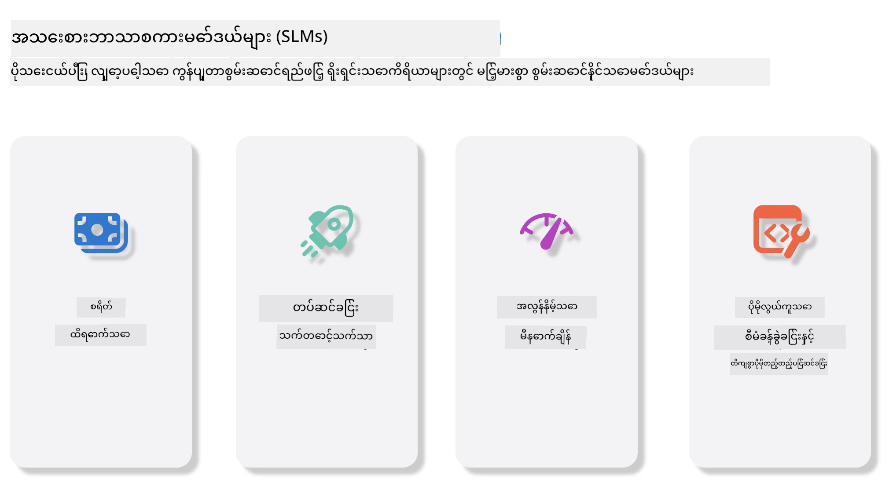
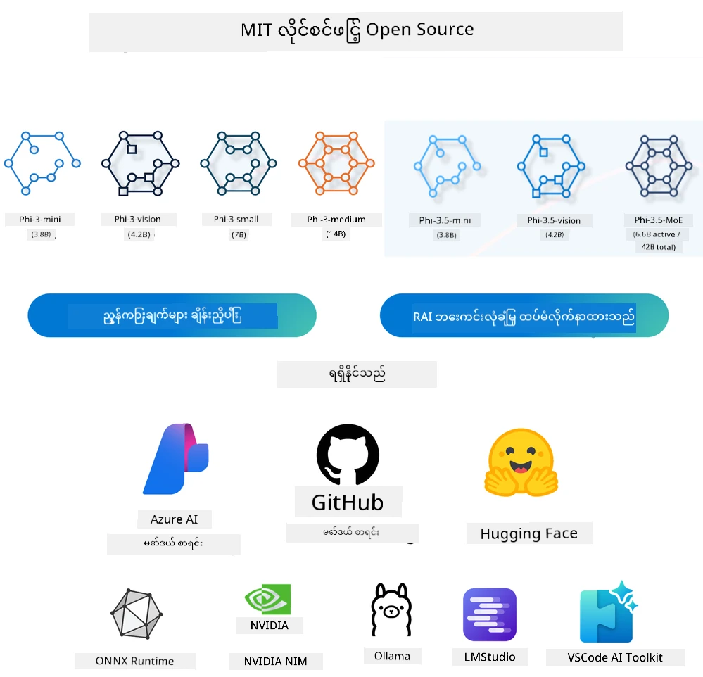
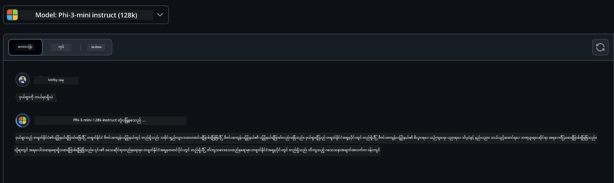
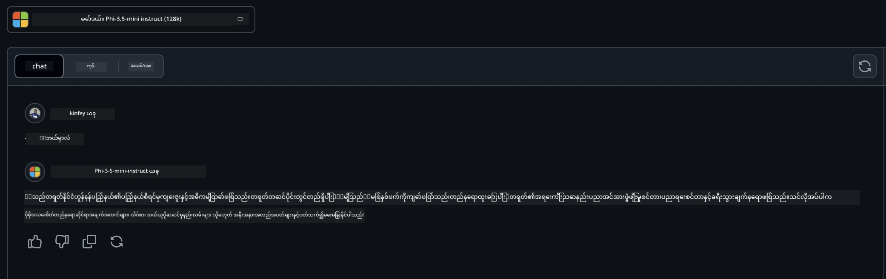

# Generative AI အတွက် စတင်လေ့လာသူများအတွက် သေးငယ်သောဘာသာစကားမော်ဒယ်များ၏ အကြောင်းအရာမိတ်ဆက်
Generative AI သည် အသစ်သောအကြောင်းအရာများကို ဖန်တီးနိုင်သော စနစ်များကို ဖန်တီးခြင်းအားသာ အာရုံစိုက်ထားသော ချိုင့်တူးစိတ်ကောင်းသော အတုတည်ဆောက်ရေးအလယ်ကဏ္ဍ ဖြစ်သည်။ ဒီအကြောင်းအရာများသည် စာတန်းများနှင့် ပုံရိပ်များမှစတင်ကာ ဂီတနှင့် စုစုပေါင်း ဗွီရုပ်ရှင်ပတ်ဝန်းကျင်အထိ ပိုလျှံနိုင်သည်။ Generative AI ၏ အလွန် စိတ်ဝင်စားဖွယ်စရာ အသုံးပြုမှုများထဲမှ တစ်ခုမှာ ဘာသာစကားမော်ဒယ်များ၏ နယ်ပယ်ဖြစ်သည်။

## သေးငယ်သော ဘာသာစကားမော်ဒယ်များ (Small Language Models) ဆိုတာဘာလဲ?

သေးငယ်သော ဘာသာစကားမော်ဒယ် (SLM) သည် ကြီးမားသော ဘာသာစကားမော်ဒယ် (LLM) ၏ အတိုချုံးထိုးယူထားသော မော်ဒယ်တစ်မျိုးဖြစ်ပြီး၊ LLM များ၏ ဖွဲ့စည်းမှုနည်းလမ်းများနှင့် နည်းပညာများကို အများအားဖြင့်အသုံးပြုသော်လည်း၊ စွမ်းဆောင်ရည်အတွက် လျော့နည်းပြီး တွက်ချက်မှု အလေးရည်လည်း လျော့နည်းသည်။

SLM များသည် လူပုံစံစာသားများ ထုတ်လုပ်ရန် ရည်ရွယ်ထားသော ဘာသာစကားမော်ဒယ်အသေးစားများဖြစ်သည်။ GPT-4 ကဲ့သို့ ကြီးမားသော မော်ဒယ်များနှင့် မတူ၍၊ SLM များသည် ပိုသေးငယ်ဆုံး၊ ထိရောက်ဆုံးဖြစ်ပြီး၊ တွက်ချက်မှု ပြည့်စုံမှု ကန့်သတ်ထားသော အလုပ်များအတွက် သင့်တော်သည်။ အရွယ်အစားသေးငယ်သော်လည်း အမျိုးမျိုးသော လုပ်ဆောင်ချက်များ ပြုလုပ်နိုင်သောကြောင့် အများအပြားအသုံးပြုနိုင်သည်။ ပုံမှန်အားဖြင့် SLM များကို LLM များမှ ဖွင့်ချုပ်ခြင်း သို့မဟုတ် စုပ်ယူခြင်းဖြင့် ဆောက်လုပ်ပြီး၊ မူလ မော်ဒယ်၏ ဖွဲ့စည်းမှုနှင့် ဘာသာစကားဆိုင်ရာ အင်အားများ၏ အတော်များများကို ထိန်းသိမ်းရန် ရည်ရွယ်သည်။ မော်ဒယ်အရွယ်အစား လျော့ပါးမှုက စုစုပေါင်း ဖွဲ့စည်းမှုကို လျော့ချပေးပြီး၊ မှတ်ဉာဏ်အသုံးပြုမှုနှင့် တွက်ချက်မှုလိုအပ်ချက်များတွင် ထိရောက်မှုရှိစေသည်။ ထိုအချိန်တွင် SLM များသည် သဘာဝဘာသာစကားလုပ်ဆောင်ချက်များ၏ အမျိုးမျိုးကို ပြုလုပ်နိုင်သည်။

- စာသားထုတ်လုပ်ခြင်း: တိကျပြီး အကြောင်းအရာနှင့် ကိုက်ညီသော စာကြောင်းများ သို့မဟုတ် စာပိုဒ်များ ဖန်တီးခြင်း။
- စာသားပြီးမြောက်ခြင်း: ရှေ့တန်းပေးထားသော စာကြောင်းအပေါ် မူတည်၍ အပြည့်အစုံ ဖြည့်စွက်ခြင်း။
- ဘာသာပြန်ခြင်း: စာသားကို တစ်ဘာသာစကားမှ တစ်ဘာသာစကားသို့ ပြောင်းလဲခြင်း။
- အနှစ်ချုပ်ခြင်း: ရှည်လျားသော စာသားများကို သက်တောင့်သက်သာ ဖတ်ရှုနိုင်စေရန် တိုစွာ အနှစ်ချုပ်ခြင်း။

ကြီးမားသော မော်ဒယ်များနှင့် နှိုင်းယှဉ်၍ အချို့သော စွမ်းဆောင်ရည် သို့မဟုတ် နက်နက်ရှိုင်းရှိုင်းနားလည်မှုဖြစ်မှုများ တွေ့ရှိနိုင်တတ်သည်။

## သေးငယ်သော ဘာသာစကားမော်ဒယ်များ မည်သို့ လုပ်ဆောင်သနည်း?
SLM များကို စာသား ဒေတာကြီးများပေါ်တွင် သင်ကြားကြသည်။ သင်ကြားစဉ်တွင် ဘာသာစကား၏ ပုံစံများနှင့် ဖွဲ့စည်းမှုများကို သင်ယူပြီး သဒ္ဒါမှန်ကျ၍ အကြောင်းအရာသင့်တော်သော စာသားများ ထုတ်လုပ်နိုင်သည်။ သင်ကြားမှုဆိုင်ရာ လုပ်ငန်းစဉ်များမှာ-

- ဒေတာစုဆောင်းခြင်း: မတူညီသော မြင်ကွင်းများမှ စာသား ဒေတာများ ကြီးမားစွာ စုဆောင်းခြင်း။
- ကြိုတင်ပြင်ဆင်ခြင်း: သင်ကြားရန် အတွက် သင့်တော်စေရန် ဒေတာကို သန့်ရှင်းစွာ စီမံခန့်ခွဲခြင်း။
- သင်ကြားခြင်း: စက်ရုပ်သင်ကြားခြင်း အယ်လ်ဂေါရစ်သမ်များကို အသုံးပြု၍ မော်ဒယ်အား စာသား နားလည်ပုံကို သင်ကြားခြင်း။
- မှန်မီစွာ ပြင်ဆင်ခြင်း: အထူးလုပ်ငန်းများတွင် စွမ်းဆောင်ရည်တိုးမြှင့်ရန် မော်ဒယ်ကို ပြင်ဆင်ခြင်း။

SLM များ ထုတ်လုပ်လာခြင်းသည် ရင်းမြစ် ကန့်သတ်ထားသော ပတ်ဝန်းကျင်များတွင် (ဥပမာ မိုဘိုင်းစက်ပစ္စည်းများ သို့မဟုတ် edge computing ပလက်ဖောင်းများ) မော်ဒယ်များ တပ်ဆင်အသုံးပြုရန် တိုးလာနေသော လိုအပ်ချက်နှင့် ကိုက်ညီသည်။ ထိရောက်မှု ကို ဦးတည်၍ ဖွံ့ဖြိုးလာသော SLM များသည် ဆောင်ရွက်ပုံနှင့် လက်လှမ်းမီနိုင်မှု တို့၏ သင်္ချာအချက်ကို ထိန်းညှိပေးကာ နယ်ပယ်အမျိုးမျိုးတွင် ပို၍ အသုံးဝင်စေရန် အလားအလာရရှိသည်။



## သင်ယူရမည့် ရည်မှန်းချက်များ

ဒီသင်ခန်းစာအတွင်းတွင် SLM ၏ သိခွင့်ကို မိတ်ဆက်ပေးပြီး Microsoft Phi-3 ဖြင့် ပေါင်းစပ်၍ စာသားအကြောင်းအရာ၊ မြင်ကွင်းနှင့် MoE တွင် မတူညီသည့် အခြေအနေများကို လေ့လာနိုင်ရန် ရည်ရွယ်သည်။

ဒီသင်ခန်းစာ အဆုံးတွင် အောက်ပါမေးခွန်းများကို ဖြေဆိုနိုင်ရမည်-

- SLM ဆိုတာဘာလဲ?
- SLM နှင့် LLM ၏ ကွာခြားချက်များကဘာလဲ?
- Microsoft Phi-3/3.5 မိသားစု ဆိုတာဘာလဲ?
- Microsoft Phi-3/3.5 မိသားစုဖြင့် မည်သို့ အန္တရာယ်ကင်းစွာ သုံးနိုင်မလဲ?

ဆင်သင့်ပါပြီလား? စတင်လိုက်ရအောင်။

## ကြီးမားသော ဘာသာစကားမော်ဒယ်များ (LLMs) နှင့် သေးငယ်သော ဘာသာစကားမော်ဒယ်များ (SLMs) ၏ ကွာခြားချက်များ

LLM များနှင့် SLM များတွင် ဒေသအခြေခံ သင်ကြားမှုသဘောပေါ်မှာတည်ပြီး တူညီသော ဖွဲ့စည်းမှု၊ သင်ကြားမှုနည်းလမ်းများ၊ ဒေတာဖန်တီးမှုနှင့် မော်ဒယ်အကဲဖြတ်မှုနည်းပညာများကို အသုံးပြုသည်။ သို့သော် အချက်အလက်အချို့ SLM နှင့် LLM များတွင် ကွာခြားချက်ရှိသည်။

## သေးငယ်သော ဘာသာစကားမော်ဒယ်များ၏ အသုံးပြုမှုများ

SLM များသည် အောက်ပါအဖြစ် အများအပြား အသုံးပြုမှုများရှိသည်-

- စကားပြောစက်များ: ဖောက်သည်ထံ ဝန်ဆောင်မှုပေးခြင်းနှင့် လူကြား သင်္ကေတအတိုင်း ဆက်သွယ်ညှိနှိုင်းခြင်း။
- အကြောင်းအရာဖန်တီးမှု: စာရေးသူများအား အကြံဉာဏ်ပေးခြင်း သို့မဟုတ် ဆောင်းပါးများ ဆွဲဆောင်ရေးရာတွင် ကူညီခြင်း။
- ပညာရေး: ကျောင်းသားများအား စာရေး အလုပ်များ သို့မဟုတ် နောက်ဆုံးဘာသာစကားများကို သင်ယူရာတွင် ကူညီခြင်း။
- လျှောက်လွှာရရှိခြင်း: အကူညီလိုသူများအတွက် စာသားမှ အသံထွက်စနစ်များကဲ့သို့ ကိရိယာများ ဖန်တီးခြင်း။

**အရွယ်အစား**

LLM များနှင့် SLM များပေါ်တွင် အဓိက ကွာခြားချက်မှာ မော်ဒယ်အရွယ်အစား ဖြစ်သည်။ ChatGPT (GPT-4) ကဲ့သို့ LLM များသည် ခန့်မှန်းလျှင် 1.76 ထရီလီယံ ချိတ်ဆိုင်းများပါသည့်အခါ၊ Mistral 7B ကဲ့သို့သော သက်တမ်းထုတ် SLM များမှာ ခန့်မှန်း 7 ဘီလီယံ ချိတ်ဆိုင်းအနည်းငယ်သာ ပါဝင်သည်။ ၎င်းကွာခြားချက်မှာ မော်ဒယ် ဖွဲ့စည်းမှုနှင့် သင်ကြားမှုလုပ်ငန်းစဉ်များအပေါ် မူတည်သည်။ ChatGPT သည် encoder-decoder ဖြင့် self-attention ကိရိယာကို အသုံးပြုသော်လည်း၊ Mistral 7B သည် sliding window attention ကို အသုံးပြု၍ decoder-only မော်ဒယ်တွင် ထိရောက်စွာ သင်ကြားနိုင်သည်။ ဤဖွဲ့စည်းမှု ကွာခြားချက်သည် မော်ဒယ်များ၏ ပိုမိုရှုပ်ထွေးမှုနှင့် စွမ်းဆောင်ရည်အပေါ် ထိရောက်မှုရှိစေသည်။

**နားလည်မှု**

SLM များကို သာမန်အားဖြင့် သတ်မှတ်ထားသော နယ်ပယ်များအတွက် ထိရောက်စွာ လုပ်ဆောင်ရန် အဓိကပြုသော်လည်း၊ နယ်ပယ်အများအပြားမှာ ကျယ်ပြန့်သောအကြောင်းအရင်းစဉ်တစ်ခုလုံးကို နားလည်နိုင်စွမ်းကန့်သတ်ထားသည်။ ပြန်လည်ဆန့်ကျင်ပြီး LLM များသည် လူပုံစံ ဉာဏ်ရည်ကို ပိုအားကောင်းစေရန် ရည်ရွယ်ပြီး၊ ကွဲပြားသည့် ဒေတာကြီးများ ပေါင်းစပ် သင်ကြားထားသောကြောင့် နယ်ပယ်အမျိုးမျိုးတွင် ကောင်းစွာ ဆောင်ရွက်နိုင်သည်။ ထို့ကြောင့် LLM များသည် သဘာဝဘာသာစကားလုပ်ငန်းများ၊ programming ကဲ့သို့ လုပ်ငန်းများအတွက် ပို၍ သင့်တော်သည်။

**တွက်ချက်မှု**

LLM များကို သင်ကြားခြင်းနှင့် သုံးရန် ပိုမိုကြီးမားသော တွက်ချက်မှု လိုအပ်မှုရှိပြီး၊ စွမ်းဆောင်ရည်ကြီးသော GPU များ စုစည်းထားသော များပြားသော ကွန်ပျူတာပေါင်းစုများ လိုအပ်သည်။ ဥပမာ ChatGPT မော်ဒယ်ကို အစပြု၍ သင်ကြားရန် GPU များ သန်းပေါင်းများစွာနှင့် ကြာရှည်ကာလလိုအပ်သည်။ ထိုသို့ LLM မော်ဒယ်များနှင့် ဆန့်ကျင်၍ SLM မော်ဒယ်များသည် ချဲ့ထွင်ခံစားရမည့် paraméters ကနည်းပြီး GPU အားနည်းသည့် ကိရိယာများတွင်လည်း သင်ကြားနိုင်ပြီး တည်ဆောက်သုံးနိုင်သည်။

**နေရာချထားမှု (Bias)**

LLM များတွင် သင်ကြားမှု ဒေတာ အရ အနေအထားမှားယွင်းမှုများ ရှိနိုင်ပြီး၊ အင်တာနက်မှ ရရှိသော မူလဒေတာများသည် လူများအကြား ကွဲပြားမှုများကို မတင်ပြနိုင်ခြင်း၊ မှားယွင်းသော အမှတ်ပြုသောအချက်တစ်ချို့ပါရှိခြင်း သို့မဟုတ် ဒါလို့မဟုတ်၊ ဒေသအလိုက် ဘာသာစကားများအပေါ် သွမ်းခြောက်မှုများဖြစ်စေနိုင်သည်။ ထို့ अलावा LLM မော်ဒယ် ဖွဲ့စည်းမှုရှုပ်ထွေးမှုကြောင့် Bias များပိုမိုကြီးပွားနိုင်ပြီး သေချာစွာ တပ်ဆင်ခြင်းမပြုမီ သတိထားမိန့်မိတတ်ပါ။ တစ်ဖက်မှာတော့ SLM များသည် အထူးသတ်မှတ်ထားသော နယ်ပယ်ဒေတာကိုသာ သင်ကြားခြင်းကြောင့် bias များ သတိထားရမည့် အခြေအနေများ ပိုမိုနည်းပါးစေနိုင်သော်လည်း ကင်းလွတ်မဟုတ်ပေ။

**အနုတ်လက္ခဏာ ဆောင်ရွက်ပုံ (Inference)**

SLM များ၏ အသေးစား ပမာဏကြောင့် နေရာတိုင်းတွင် မော်ဒယ်ကို သက်သာမြန်ဆန်စွာ ဖြေရှင်းနိုင်သည်။ ဒါကြောင့် ဒေတာစက်ပစ္စည်းထိ၊ ပြင်ပကွန်ပျူတာများ မလိုအပ်ဘဲ သုံးနိုင်သည်။ LLM များ၏ ကြီးမားခြင်းနှင့် ရွေ့လျားမှုကြောင့် လိုအပ်သော တွက်ချက်မှု အများအပြားကို တပြိုင်နက်တည်း လုပ်ဆောင်ရန် လိုအပ်သည်။ လူသုံးသူများပေါင်းများစွာ အသုံးပြုသောအခါ အခက်အခဲများ ဖြစ်ပေါ်နိုင်သည်။

အကျဉ်းချုပ်ရပါက၊ LLM နှင့် SLM နှစ်ခုစလုံးသည် ဉာဏ်ပညာရေး ထောက်ခံမှုရှိသော်လည်း မော်ဒယ်အရွယ်အစား၊ စွမ်းဆောင်ရန် လိုအပ်သော အရင်းအမြစ်၊ နားလည်နိုင်မှု၊ bias ၏ ထိရောက်မှုနှင့် inference အမြန်နှုန်းတို့တွင် ကွာခြားချက်များရှိရန်သက်သေပြသည်။ LLM များမှာ ပိုမိုစွမ်းဆောင်မှုပြင်းထန်သော်လည်း အရင်းအမြစ် များစွာ လိုအပ်ပြီး၊ SLM များမှာ နယ်ပယ်အလိုက် ထိရောက်ချက်ပိုပြီး တွက်ချက်မှု လိုအပ်ချက် ပြည့်တန်ဆာ လျော့နည်းသည်။

***သတိပေးချက်- ဒီသင်ခန်းစာတွင် Microsoft Phi-3 / 3.5 ကို ဥပမာယူ၍ SLM မိတ်ဆက်ပေးမည်။***

## Phi-3 / Phi-3.5 မိသားစု မိတ်ဆက်ခြင်း

Phi-3 / 3.5 မိသားစုသည် အဓိကအားဖြင့် စာသား၊ မြင်ကွင်းနှင့် Agent (MoE) လျောက်လွှာ အခြေအနေများအတွက် ရည်ရွယ်ထားသည်။

### Phi-3 / 3.5 လမ်းညွှန် (Instruct)

စာသားထုတ်လုပ်ခြင်း၊ စကားပြောဖြည့်စွက်ခြင်းနှင့် အကြောင်းအရာထုတ်လွှင့်ခြင်း စသည့် အလုပ်များအတွက် အဓိက သုံးသည်။

**Phi-3-mini**

3.8B ဘာသာစကားမော်ဒယ်သည် Microsoft Azure AI Studio၊ Hugging Face နှင့် Ollama မှာ ရနိုင်သည်။ Phi-3 မော်ဒယ်များသည် တူညီသော ပမာဏ နှင့် ကြီးမားသော မော်ဒယ်များထက် ကူးစက်မှု စမ်းသပ်မှုများတွင် ထူးချွန်စွာ လုပ်ဆောင်သည် (အောက်တွင် နံပါတ်များ ကြည့်ရှုပါ၊ နံပါတ်မြင့်ရောက်မှသာ ပိုကောင်းသည်)။ Phi-3-mini သည် မော်ဒယ် အရွယ်အစား နှစ်ဆ အကျော် မော်ဒယ်များထက် ထက်မြက်ပြီး၊ Phi-3-small နှင့် Phi-3-medium မော်ဒယ်များသည် GPT-3.5 ပါဝင်သော ကြီးမားသော မော်ဒယ်များထက် ပိုကောင်းသည်။

**Phi-3-small နှင့် medium**

7B parameter သာရှိသော Phi-3-small သည် GPT-3.5T ကို ဘာသာစကား၊ အကြံဉာဏ်ပညာ၊ ကုဒ်ရေးခြင်း နှင့် သင်္ချာ စမ်းသပ်မှုများတွင် များစွာ ဦးဆောင်နိုင်သည်။

14B parameter ရှိသော Phi-3-medium သည် ဤလမ်းကြောင်းကို ဆက်လက်၍ Gemini 1.0 Pro ထက် ပိုကောင်းသည်။

**Phi-3.5-mini**

Phi-3-mini ၏ အဆင့်တိုးတက်မှုအဖြစ် သတ်မှတ်နိုင်သည်။ Parameter မပြောင်းလဲသော်လည်း ဘာသာစကားစွမ်းရည်တိုးတက်စေပြီး (20+ ဘာသာစကားများ ထောက်ပံ့သည် - အာရပ်၊ တရုတ်၊ ချက်၊ ဒိန်းမတ်၊ ဒတ်ချ်၊ အင်္ဂလိပ်၊ ဖင်လန်၊ ပြင်သစ်၊ ဂျာမဏီ၊ ဟေဘရွူး၊ ဟန်ဂေရီး၊ အီတလီ၊ ဂျပန်၊ ကိုရီးယား၊ နော်ဝေ၊ ပိုလန်၊ ပေါ်ရှုဂီ၊ ရုရှား၊ စပိန်၊ စွီဒင်၊ ထိုင်း၊ တာကား) နှင့် ရှည်လျားသော အကြောင်းအရာကို ပို၍ ထောက်ပံ့နိုင်သည်။

Phi-3.5-mini သည် 3.8B parameter ဖြင့် တူညီအရွယ်အစား မော်ဒယ်များထက် ထက်ကောင်းပြီး တစ်ဆအရွယ်အစား မော်ဒယ် နှစ်ဆနှင့် သက်တမ်းညီသည်။

### Phi-3 / 3.5 မြင်ကွင်း (Vision)

Phi-3/3.5 Instruct မော်ဒယ်ကို Phi ၏ နားလည်နိုင်မှုစွမ်းဆောင်ရည်အဖြစ် သတ်မှတ်နိုင်ပြီး၊ Vision သည် Phi ကို မြေကြီးကို နားလည်နိုင်ရန် မျက်လုံးပေးသည်။

**Phi-3-Vision**

4.2B parameter သာ ပါသည့် Phi-3-vision သည် Claude-3 Haiku နှင့် Gemini 1.0 Pro V ကဲ့သို့ ကြီးမားသော မော်ဒယ်များထက် ဦးဆောင်ပြီး၊ အထွေထွေ မြင်ကွင်း သုတိပညာ လုပ်ငန်း၊ OCR နှင့် ဇယားနှင့် ပုံပြင် နားလည်မှု လုပ်ငန်းများတွင် ထူးချွန်သည်။

**Phi-3.5-Vision**

Phi-3.5-Vision သည် Phi-3-Vision ၏ အဆင့်တိုးတက်မှုဖြစ်၍၊ ပုံများ အများအပြား ထောက်ပံ့သည်။ ဤသည်မှာ မြင်ကွင်း ထောက်ပံ့မှုတိုးတက်မှုဖြစ်ပြီး၊ ဓာတ်ပုံများ သုံးနိုင်သကဲ့သို့ ဗီဒီယိုများလည်း ကြည့်ရှုနိုင်သည်ဟု ဆိုနိုင်သည်။

Phi-3.5-vision သည် Claude-3.5 Sonnet နှင့် Gemini 1.5 Flash ကဲ့သို့ ကြီးမားသော မော်ဒယ်များကို OCR၊ ဇယားနှင့် ဂရပ်ရှင်း နားလည်မှု လုပ်ငန်းများတွင် ထက်မြက်ပြီး အထွေထွေအမြင်သုတိပညာ လုပ်ငန်းများတွင် နေရာတူ ဆောင်ရွက်နိုင်သည်။ အကြောင်းအရာများ အများအပြား ရှုမြင်၍ ရန်ထောက်ပံ့ထားသည်။

### Phi-3.5-MoE

***Mixture of Experts(MoE)*** သည် မော်ဒယ်ကို သက်တမ်းကတည်းက နည်းစွမ်းအနည်းငယ်နဲ့ သင်ကြားနိုင်စေရန် ဖန်တီးထားသည်။ ၎င်းက တူညီသော တွက်ချက်မှုစွမ်းအား အားဖြင့် မော်ဒယ်အရွယ်အစား သို့မဟုတ် ဒေတာအရွယ်အစားကို လက်လှမ်းမီ ရှု့ပြင် တိုးမြှင့်နိုင်သည်။ MoE မော်ဒယ်၏ အရည်အသွေးသည် dense မော်ဒယ် တူညီသော အဆင့်အတန်းကို ပိုမြန်မြင့်မြတ်စေသည်။

Phi-3.5-MoE သည် 3.8B expert module 16 ချောင်းပါဝင်သည်။ 6.6B active parameters ဖြင့် Phi-3.5-MoE သည် ပိုကြီးသော မော်ဒယ်များနှင့် တန်းတူသော သဘောထား၊ ဘာသာစကား နားလည်မှု နှင့် သင်္ချာ စွမ်းဆောင်ရည် ရရှိစေသည်။

Phi-3/3.5 မိသားစု မော်ဒယ်များကို အခြေအနေ အမျိုးမျိုးပေါ် မူတည်၍ အသုံးပြုနိုင်သည်။ LLM မဟုတ်ပဲ Phi-3/3.5-mini သို့မဟုတ် Phi-3/3.5-Vision ကို edge ကိရိယာများတွင် စတင် အသုံးပြုနိုင်သည်။

## Phi-3/3.5 မိသားစု မော်ဒယ်များကို မည်သို့ သုံးမလဲ

Phi-3/3.5 ကို မတူညီသော အခြေအနေများတွင် အသုံးပြုမည်။ နောက်ပိုင်းတွင် Phi-3/3.5 ကို အခြေအနေအလိုက် အသုံးပြုချင်သည်။



### Cloud API များမှတဆင့် inference ဆောင်ရွက်ခြင်း

**GitHub Models**

GitHub Models သည် အမြန်ဆုံး နည်းလမ်းဖြစ်သည်။ Phi-3/3.5-Instruct မော်ဒယ်ကို GitHub Models မှ တဆင့် လွယ်ကူမြန်ဆန်စွာ အသုံးပြုနိုင်သည်။ Azure AI Inference SDK / OpenAI SDK နှင့် ပေါင်းစပ်၍ ကိုဒ်မှ API ကို ခေါ်ယူ၍ Phi-3/3.5-Instruct ကို သုံးနိုင်သည်။ Playground မှတဆင့် ထူးခြားမှုများကို စမ်းသပ်နိုင်သည်။

- စမ်းသပ်ချက်- တရုတ်ဘာသာ စာသားအခြေအနေများတွင် Phi-3-mini နှင့် Phi-3.5-mini ၏ ပြိုင်ဆိုင်မှု





**Azure AI Studio**

Vision နှင့် MoE မော်ဒယ်များကို အသုံးပြုလိုပါက Azure AI Studio မှတဆင့် လည်း ခေါ်ယူနိုင်သည်။ စိတ်ဝင်စားပါက Phi-3 Cookbook ကို ဖတ်ရှု၍ Azure AI Studio မှ Phi-3/3.5 Instruct၊ Vision၊ MoE ကို မည်သို့ ခေါ်ယူရမည်ဆိုသည်ကို လေ့လာနိုင်ပါသည်။ [ဤလင့်ခ်ကိုနှိပ်ပါ](https://github.com/microsoft/Phi-3CookBook/blob/main/md/02.QuickStart/AzureAIStudio_QuickStart.md?WT.mc_id=academic-105485-koreyst)

**NVIDIA NIM**

Azure နှင့် GitHub မှ ပေးသော cloud-based Model Catalog ဖြေရှင်းချက်များအပြင် [NVIDIA NIM](https://developer.nvidia.com/nim?WT.mc_id=academic-105485-koreyst) ကို သုံး၍ Phi-3/3.5 မိသားစု၏ API ခေါ်ယူမှုများ ပြုလုပ်နိုင်သည်။ NVIDIA NIM (NVIDIA Inference Microservices) သည် Cloud, Data Center နှင့် Workstation များတွင် AI မော်ဒယ်များကို ထိရောက်စွာ တပ်ဆင်နိုင်စေရန် ဖြန့်ချိထားသော ယူနစ်ဖြစ်သည်။

NVIDIA NIM ၏ အဓိက လက္ခဏာများမှာ-
- **တပ်ဆင်ရလွယ်ကူမှု:** NIM သည် AI မော်ဒယ်များကို တစ်ခုတည်းသော command ဖြင့် တပ်ဆင်နိုင်စေပြီး၊ ရှိပြီးသား workflows များတွင် လွယ်ကူစွာ ပေါင်းစည်းအသုံးပြုနိုင်သည်။
- **အချိန်အမြန်ဆောင်ရွက်မှု tối ưu:** နောက်ဆုံးတင်ထားသည့် NVIDIA ၏ pre-optimized inference engines များဖြစ်သော TensorRT နှင့် TensorRT-LLM များကို အသုံးပြု၍ latency နည်းပြီး throughput မြင့်မားစေရန် စနစ်တကျ ဆောင်ရွက်ပါသည်။
- **တိုးချဲ့နိုင်မှု:** NIM သည် Kubernetes တွင် autoscaling ကို ထောက်ပံ့ကာ အလုပ်ပမာဏ မတူညီမှုများကို ထိရောက်စွာ ကိုင်တွယ်နိုင်စေသည်။
- **လုံခြုံမှုနှင့် ထိန်းချုပ်မှု:** ကိုယ်ပိုင်စီမံခန့်ခွဲသော စက်ပစ္စည်းများပေါ်တွင် NIM microservices များကို self-host လုပ်ခြင်းအားဖြင့် ဒေတာနှင့် applications များအပေါ် အဖွဲ့အစည်းများ အထိန်းချုပ်နိုင်သည်။
- **စံချိန်มาตร APIs:** NIM သည် စက်မှုလုပ်ငန်းရဲ့ စံချိန်มาต API များကို ပေးအပ်ကာ chatbots၊ AI အကူအညီပေးစက်များနှင့် အခြား AI applications များ တည်ဆောက်ခြင်း၊ ပေါင်းစည်းအသုံးပြုခြင်း လွယ်ကူစေရန် ဖန်တီးထားသည်။

NIM သည် NVIDIA AI Enterprise ၏ အစိတ်အပိုင်းဖြစ်ပြီး AI မော်ဒယ်များကို တပ်ဆင်ခြင်းနှင့် စီမံဆောင်ရွက်ခြင်းကို လွယ်ကူစေကာ NVIDIA GPU များတွင် ထိရောက်စွာ ဆောင်ရွက်နိုင်ရန် ရည်ရွယ်ထားသည်။

- ဂျပ် Demonstration: NVIDIA NIM ကို အသုံးပြု၍ Phi-3.5-Vision-API သို့ခေါ်ယူခြင်း [[Click this link](./python/Phi-3-Vision-Nividia-NIM.ipynb?WT.mc_id=academic-105485-koreyst)]


### Phi-3/3.5 ကို ဒေသခံတွင် ပြေးဆွဲခြင်း
Phi-3 သို့မဟုတ် GPT-3 ကဲ့သို့သော ဘာသာစကား မော်ဒယ်များဆိုင်ရာ inference သည် သိမ်းဆည်းထားသည့် အချက်အလက်များအပေါ် မှီငြမ်းကာ input များအပေါ် အကြောင်းပြန်ထုတ်ဘယ်လို များကို ရရှိစေနိုင်သည့် လုပ်ငန်းစဉ်ကို ရည်ညွှန်းသည်။ Phi-3 တွင် prompt သို့မဟုတ် မေးခွန်းတစ်ခု ပံ့ပိုးသောအခါ၌ ၎င်း၏ သင်ကြားထားသော နယူးရယ်ကွန်ရက်ကို အသုံးပြု၍ အချက်အလက် များအား ထိရောက်စွာ စစ်ဆေးကာ အကြောင်းပြန်မှု သို့မဟုတ် ခန့်မှန်းချက် တန်ဖိုးမြင့်ဆုံးနှင့် သင့်တော်ဆုံးဖြစ်ရန် ဟောပြောပေးပါသည်။

**Hugging Face Transformer**
Hugging Face Transformers သည် သဘာဝဘာသာစကား သုံး နည်းပညာ (NLP) နှင့် အခြား machine learning အလုပ်များအတွက် ထိရောက်မှုရှိသော စာကြည့်တိုက် တစ်ခုဖြစ်သည်။ အဓိကအချက်အချို့မှာ -

1. **ကြိုတင်သင်ယူထားသော မော်ဒယ်များ**: စာသား အမျိုးမျိုးအတွက် text classification, named entity recognition, question answering, summarization, translation, text generation စသည်တို့အတွက် အသုံးပြုနိုင်သော ကြီးမားသော ကြိုတင်သင်ယူထားတဲ့ မော်ဒယ် အနည်းငယ်ခုနှစ်ပြည့်ရယူနိုင်သည်။

2. **ပလက်ဖောင်းဆက်စပ်မှု**: PyTorch, TensorFlow, JAX အပါအဝင် နည်းစနစ်များ ကျယ်ပြန့်စွာ အထောက်အပံ့ ပြုသည်။ ၎င်းဖြင့် တစ်ခုသော ပလက်ဖောင်းတွင် မော်ဒယ် သင်ကြားပြီး နောက်တစ်ခုတွင် အသုံးပြုနိုင်သည်။

3. **Multimodal အရည်အချင်း**: NLP ပြင် computer vision (ဓာတ်ပုံ ခွဲခြားစစ်ဆေးခြင်း၊ object detection) နှင့် audio processing (အသံသိခြင်း၊ အသံခွဲခြားခြင်း) အလုပ်များကိုပါ ထောက်ပံ့သည်။

4. **အသုံးပြုရ လွယ်ကူမှု**: မော်ဒယ်များကို လွယ်ကူစွာ ဒေါင်းလုပ်လုပ်ခြင်းနှင့် fine-tune ပြုလုပ်နိုင်သော API များနှင့် ကိရိယာများရှိသည်၊ စတင်အသုံးပြုသူများနှင့် ကျွမ်းကျင်သူများအတွက် လွယ်ကူစေရန် ဖြစ်သည်။

5. **အသိုင်းအဝိုင်းနှင့် အရင်းအမြစ်များ**: Hugging Face သည် အသုံးပြုသူများစွာနှင့် တည်ရှိပြီး စာတမ်းများ၊ နည်းပြချက်များ၊ လမ်းညွှန်များ တိုးတက်စွာ ရရှိနိုင်သည်။
[official documentation](https://huggingface.co/docs/transformers/index?WT.mc_id=academic-105485-koreyst) သို့မဟုတ် သူတို့ရဲ့ [GitHub repository](https://github.com/huggingface/transformers?WT.mc_id=academic-105485-koreyst) ကို ကြည့်ရှုနိုင်ပါသည်။

ဒါဟာ အကြီးအကျယ် အသုံးပြုသူ ပုံစံပဲ ဖြစ်ပေမယ့် GPU ဆွဲဆောင်မှုလည်း လိုအပ်တယ်။ Vision နှင့် MoE စသည့် scenario များမှာ တွက်ချက်မှုများ အများကြီး လိုအပ်ပြီး မ quantified ဖြစ်မယ်ဆိုရင် CPU ပေါ်မှာ လွန်စွာ နှေးကွေးမှာဖြစ်သည်။

- Demo: Transformer ကို အသုံးပြု၍ Phi-3.5-Instruct ကို ခေါ်ယူခြင်း [Click this link](./python/phi35-instruct-demo.ipynb?WT.mc_id=academic-105485-koreyst)

- Demo: Transformer ကို အသုံးပြု၍ Phi-3.5-Vision ကို ခေါ်ယူခြင်း [Click this link](./python/phi35-vision-demo.ipynb?WT.mc_id=academic-105485-koreyst)

- Demo: Transformer ကို အသုံးပြု၍ Phi-3.5-MoE ကို ခေါ်ယူခြင်း [Click this link](./python/phi35_moe_demo.ipynb?WT.mc_id=academic-105485-koreyst)

**Ollama**
[Ollama](https://ollama.com/?WT.mc_id=academic-105485-koreyst) သည် မိမိစက်ပေါ်တွင် LLM များကို လွယ်ကူစွာ ပြေးဆွဲနိုင်ရန် ဒီဇိုင်းပြုထားသော ပလက်ဖောင်းတစ်ခု ဖြစ်သည်။ Llama 3.1, Phi 3, Mistral, Gemma 2 စသည်တို့ကဲ့သို့ မော်ဒယ်များကို ထောက်ပံ့သည်။ မော်ဒယ် အလေးချိန်များ၊ configuration နှင့် ဒေတာများကို တစ်ခုတည်းသော package တစ်ခုအဖြစ် ပေါင်းစပ်ပြီး အသုံးပြုသူများအတွက် မိမိ မော်ဒယ်ကို စိတ်ကြိုက် ပြုပြင်နိုင်စေရန် လွယ်ကူစေသည်။ Ollama ကို macOS, Linux, Windows များအတွက် ရရှိနိုင်သည်။ cloud ဝန်ဆောင်မှုများ မလိုအပ်ဘဲ LLM များ ရှာဖွေ၊ တပ်ဆင်စမ်းသပ်ချင်သူများအတွက် အသုံးဝင်သော ကိရိယာ ဖြစ်သည်။ Ollama သည် အတိုက်အခံနည်းလမ်းဖြစ်ပြီး အောက်ပါ command ကို အကောင်အထည်ဖော်ရုံဖြင့် တတ်နိုင်သည်။

```bash

ollama run phi3.5

```


**ONNX Runtime for GenAI**

[ONNX Runtime](https://github.com/microsoft/onnxruntime-genai?WT.mc_id=academic-105485-koreyst) သည် cross-platform inference နှင့် training အတွက် machine-learning accelerator ဖြစ်သည်။ ONNX Runtime for Generative AI (GENAI) သည် မတူကွဲပြားသော ပလက်ဖောင်းများတွင် generative AI မော်ဒယ်များကို ထိရောက်စွာ ပြေးဆွဲနိုင်ရန် ကူညီပေးသော အလွန်အစွမ်းထက်သော ကိရိယာဖြစ်သည်။

## ONNX Runtime ဆိုတာဘာလဲ?
ONNX Runtime သည် machine learning မော်ဒယ်များကို မြန်ဆန်သော inference လုပ်ဆောင်နိုင်ရန် ဖွင့်လှစ်ထားသော project တစ်ခု ဖြစ်သည်။ သည်သည် Open Neural Network Exchange (ONNX) ပုံစံတွင် မော်ဒယ်များကို ထောက်ပံ့သည်၊ ONNX သည် machine learning မော်ဒယ်များကို ဖော်ပြရာတွင် စံချိန်တစ်ခုဖြစ်သည်။ ONNX Runtime inference သည် နှေးကွေးမှုအနည်းဆုံးဖြင့် သုံးစွဲသူတွေကို ပိုမိုမြန်ဆန်သော အတွေ့အကြုံပေးနိုင်ပြီး ကုန်ကျစရိတ်ကိုလည်း လျော့နည်းစေသည်၊ PyTorch နှင့် TensorFlow/Keras ကဲ့သို့သော နက်ရှိုင်းသော သင်ယူမှု frameများနှင့် scikit-learn, LightGBM, XGBoost စသည်၏ classical machine learning စာကြည့်တိုက်များကို support ပြုသည်။ ONNX Runtime သည် hardware မျိုးစုံ၊ driver မျိုးစုံနှင့် operating system မျိုးစုံနှင့် ကိုက်ညီ၍ အကောင်းဆုံးစွမ်းဆောင်မှုဖြစ်စေရန် hardware accelerators များကိုအသုံးပြုကာ မျက်နှာပြင်အဆင့် optimizations နှင့် transformation များကိုပေးသည်။

## Generative AI ဆိုတာဘာလဲ?
Generative AI သည် သင်ကြားထားသော ဒေတာပေါ်မူတည်၍ စိတ်ကူးတွတ်နိုင်သော အကြောင်းအရာအသစ်များ (စာသား၊ ဓာတ်ပုံ၊ တေးဂီတ စသည်) ဖန်တီးပေးနိုင်သော AI စနစ်များကို ရည်ညွှန်းသည်။ ဥပမာများမှာ GPT-3 ကဲ့သို့သော ဘာသာစကား မော်ဒယ်များနှင့် Stable Diffusion ကဲ့သို့သော ဓာတ်ပုံဖန်တီးမော်ဒယ်များဖြစ်ကြသည်။ ONNX Runtime for GenAI စာကြည့်တိုက်သည် ONNX မော်ဒယ်များအတွက် generative AI အခြေအနေများ ကို inference, logits processing, ရှာဖွေမှုနှင့် နမူနာယူမှု, KV cache စီမံခန့်ခွဲရန် loop ကို ပံ့ပိုးပေးသည်။

## ONNX Runtime for GENAI
ONNX Runtime for GENAI သည် ONNX Runtime ၏ စွမ်းရည်များကို ဂျနရေးရှင်း AI မော်ဒယ်များ support လုပ်ရန် တိုးချဲ့ထားခြင်းဖြစ်သည်။ အဓိက အင်္ဂါရပ်များမှာ-

- **ပလက်ဖောင်းကွဲပြားမှုကျယ်ပြန့်မှု:** Windows, Linux, macOS, Android, iOS စသော ပလက်ဖောင်းများတွင် အလုပ်လုပ်နိုင်သည်။
- **မော်ဒယ်ထောက်ပံ့မှု:** LLaMA, GPT-Neo, BLOOM နှင့် အခြား အများကြီး သာမက popular generative AI မော်ဒယ်များကို ထောက်ပံ့သည်။
- **စွမ်းဆောင်ရည် tối ưu:** NVIDIA GPUs, AMD GPUs နှင့် အခြား hardware accelerators များအတွက် optimizations ရှိသည်။
- **အသုံးပြုရ လွယ်ကူမှု:** applications များထဲသို့ လွယ်ကူစွာ ပေါင်းစပ်အသုံးပြုနိုင်ရန် API များ ရှိသည်၊ စကားများ၊ ဓာတ်ပုံများ၊ အခြားအကြောင်းအရာများကို minimal code ဖြင့် ဖန်တီးနိုင်သည်။
- အသုံးပြုသူများသည် generate() method အဆင့်မြင့်ကို ခေါ်ယူနိုင်ပြီး loop အတွင်း မော်ဒယ် iteration တစ်ခုစီကို တစ်စဉ်စီအဖြစ် run ပြီး Token တစ်ခုချင်းစီ ထုတ်လုပ်နိုင်ပြီး ၊ optional မှတ်ချက် parameters များကို loop အတွင်း ပြင်ဆင်နိုင်သည်။
- ONNX runtime သည် greedy/beam search နှင့် TopP, TopK sampling ကို support ပြု၍ token စဉ်များကို ဖန်တီးနိုင်ပါသည်။ logits processing ကိုလည်း repetition penalty ကဲ့သို့ ထည့်သွင်းထားပြီး custom scoring များ ထည့်သွင်းရလွယ်ကူသည်။

## စတင်အသုံးပြုခြင်း
ONNX Runtime for GENAI ကို စတင်ရန် အောက်ပါအဆင့်များကို လိုက်နာနိုင်သည် -

### ONNX Runtime ကို 설치 설치:
```Python
pip install onnxruntime
```
### Generative AI Extensions ကို 설치 설치:
```Python
pip install onnxruntime-genai
```

### မော်ဒယ်တစ်ခု run ဆောင်ရန်: Python နမူနာ ရှိပါသည်:
```Python
import onnxruntime_genai as og

model = og.Model('path_to_your_model.onnx')

tokenizer = og.Tokenizer(model)

input_text = "Hello, how are you?"

input_tokens = tokenizer.encode(input_text)

output_tokens = model.generate(input_tokens)

output_text = tokenizer.decode(output_tokens)

print(output_text) 
```
### ဂျပ် Demo: ONNX Runtime GenAI ကို အသုံးပြု၍ Phi-3.5-Vision ကို ခေါ်ယူခြင်း


```python

import onnxruntime_genai as og

model_path = './Your Phi-3.5-vision-instruct ONNX Path'

img_path = './Your Image Path'

model = og.Model(model_path)

processor = model.create_multimodal_processor()

tokenizer_stream = processor.create_stream()

text = "Your Prompt"

prompt = "<|user|>\n"

prompt += "<|image_1|>\n"

prompt += f"{text}<|end|>\n"

prompt += "<|assistant|>\n"

image = og.Images.open(img_path)

inputs = processor(prompt, images=image)

params = og.GeneratorParams(model)

params.set_inputs(inputs)

params.set_search_options(max_length=3072)

generator = og.Generator(model, params)

while not generator.is_done():

    generator.compute_logits()
    
    generator.generate_next_token()

    new_token = generator.get_next_tokens()[0]
    
    output = tokenizer_stream.decode(new_token)
    
    print(tokenizer_stream.decode(new_token), end='', flush=True)

```


**အခြားများ**

ONNX Runtime နှင့် Ollama ရဲ့ နမူနာများအပြင်၊ ထုတ်လုပ်သူအမ်ိဳးမျိုးမှ ပံ့ပိုးသော မော်ဒယ် reference နည်းလမ်းများအပေါ် အခြေခံပြီး quantitative မော်ဒယ် reference များကိုလည်း ပြီးမြောက်အောင် ပြုလုပ်နိုင်သည်။ ဥပမာ Apple MLX framework ကို Apple Metal နှင့်, Qualcomm QNN ကို NPU နဲ့ Intel OpenVINO ကို CPU/GPU တွေနဲ့ အသုံးပြုနိုင်သည်။ ပိုမိုကြည့်ရှုလိုပါက [Phi-3 Cookbook](https://github.com/microsoft/phi-3cookbook?WT.mc_id=academic-105485-koreyst) တွင်လည်း ရှာဖွေကြည့်ပါ။

## နောက်ပိုင်း

Phi-3/3.5 မျိုးဆက်၏ အခြေခံအကြောင်းအရာများကို သင်ယူပြီးဖြစ်ပြီး၊ SLM အကြောင်းပိုမိုလေ့လာရန် knowledge ပိုမိုလိုအပ်ပါသည်။ အဖြေများကို Phi-3 Cookbook တွင် ရှာဖွေနိုင်သည်။ ပိုမိုသိရှိရန် လိုပါက [Phi-3 Cookbook](https://github.com/microsoft/phi-3cookbook?WT.mc_id=academic-105485-koreyst) သို့ သွားရောက်ကြည့်ရှုနိုင်ပါသည်။

---

<!-- CO-OP TRANSLATOR DISCLAIMER START -->
**အသိပေးချက်**  
ဤစာတမ်းကို AI ဘာသာပြန်ဝန်ဆောင်မှု [Co-op Translator](https://github.com/Azure/co-op-translator) ဖြင့် ဘာသာပြန်ထားပါသည်။ ကျွန်ုပ်တို့သည် မှန်ကန်မှုကို ကြိုးပမ်းရာ၌ရှိသော်လည်း၊ အလိုအလျောက် ဘာသာပြန်မှုတွင် အမှားများ သို့မဟုတ် မှားယွင်းမှုများ ရှိနိုင်ကြောင်း သတိပြုပါရန် လိုအပ်ပါသည်။ မူရင်းစာတမ်းကို မိမိဘာသာစကားဖြင့်သာ ထုတ်ပြန်ထားသော အထောက်အထား အဖြစ် ယူဆရန် လိုအပ်ပါသည်။ အရေးကြီးသော သတင်းအချက်အလက်များအတွက် မူရင်း လူ့ဘာသာပြန်နှင့် ဆက်သွယ်ရန် အကြံပြုပါသည်။ ဤဘာသာပြန်မှုကို အသုံးပြုရာမှ ဖြစ်ပေါ်နိုင်သည့် နားမလည်မှုများ သို့မဟုတ် မှားယွင်းနားလည်မှုများအတွက် ကျွန်ုပ်တို့သည် တာဝန်မရှိပါ။
<!-- CO-OP TRANSLATOR DISCLAIMER END -->