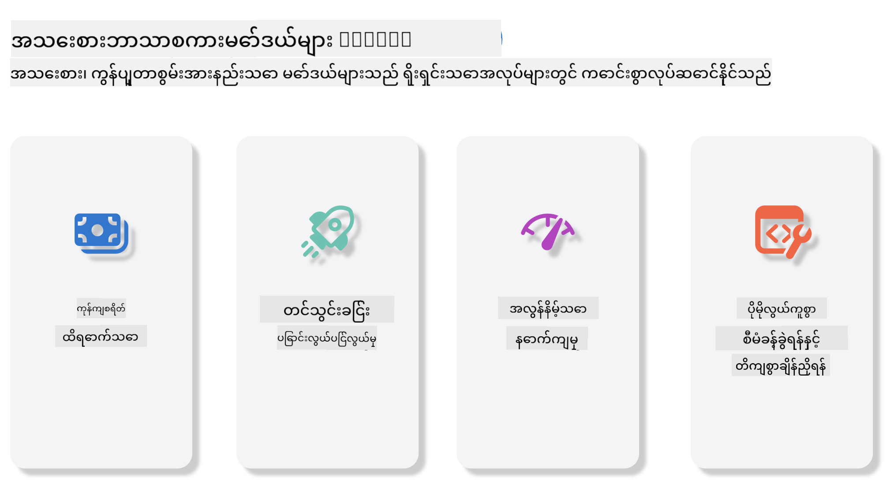

<!--
CO_OP_TRANSLATOR_METADATA:
{
  "original_hash": "124ad36cfe96f74038811b6e2bb93e9d",
  "translation_date": "2025-07-09T18:53:10+00:00",
  "source_file": "19-slm/README.md",
  "language_code": "my"
}
-->
# Generative AI အတွက် စတင်လေ့လာသူများအတွက် သေးငယ်သော ဘာသာစကား မော်ဒယ်များအကြောင်း မိတ်ဆက်ခြင်း  
Generative AI သည် အတုအယောင်မဟုတ်သော အကြောင်းအရာအသစ်များကို ဖန်တီးနိုင်သော စနစ်များကို ဖန်တီးရာတွင် အာရုံစိုက်သော စိတ်ဝင်စားဖွယ် အတုအယောင်သိပ္ပံနယ်ပယ်တစ်ခုဖြစ်သည်။ ဤအကြောင်းအရာများမှာ စာသား၊ ပုံရိပ်၊ ဂီတနှင့် များစွာသော အပြင်အဆင်များအထိ ဖြစ်နိုင်သည်။ Generative AI ၏ အထူးစိတ်ဝင်စားဖွယ် အသုံးချမှုတစ်ခုမှာ ဘာသာစကား မော်ဒယ်များနယ်ပယ်တွင် ဖြစ်သည်။  

## သေးငယ်သော ဘာသာစကား မော်ဒယ်များ ဆိုတာဘာလဲ?  

သေးငယ်သော ဘာသာစကား မော်ဒယ် (SLM) သည် ကြီးမားသော ဘာသာစကား မော်ဒယ် (LLM) ၏ အတိုချုပ်ပုံစံတစ်ခုဖြစ်ပြီး၊ LLM များ၏ ဖွဲ့စည်းပုံနည်းပညာများနှင့် နည်းလမ်းများကို အသုံးပြုသော်လည်း ကွန်ပျူတာ စွမ်းဆောင်ရည် လျော့နည်းစေသော ပုံစံဖြစ်သည်။  

SLM များသည် လူသားကဲ့သို့ စာသားများ ဖန်တီးနိုင်ရန် ရည်ရွယ်ထားသော ဘာသာစကား မော်ဒယ်များ၏ အစုအဝေးတစ်ခုဖြစ်သည်။ GPT-4 ကဲ့သို့ ကြီးမားသော မော်ဒယ်များနှင့် မတူဘဲ၊ SLM များသည် ပိုသေးငယ်ပြီး ထိရောက်မှုရှိသောကြောင့် ကွန်ပျူတာ အရင်းအမြစ် ကန့်သတ်ချက်ရှိသော နေရာများတွင် အသုံးပြုရန် သင့်တော်သည်။ သေးငယ်သော်လည်း မျိုးစုံသော လုပ်ဆောင်ချက်များကို ဆောင်ရွက်နိုင်သည်။ ပုံမှန်အားဖြင့် SLM များကို LLM များကို ဖိအားပေးခြင်း သို့မဟုတ် အနှိပ်ချခြင်းဖြင့် တည်ဆောက်ပြီး မူလ မော်ဒယ်၏ လုပ်ဆောင်ချက်များနှင့် ဘာသာစကား ကျွမ်းကျင်မှုများကို အများအပြား ထိန်းသိမ်းထားရန် ရည်ရွယ်သည်။ မော်ဒယ်အရွယ်အစား လျော့နည်းခြင်းကြောင့် စုစုပေါင်း ရှုပ်ထွေးမှု လျော့နည်းပြီး၊ မှတ်ဉာဏ်အသုံးပြုမှုနှင့် ကွန်ပျူတာ လိုအပ်ချက်များအတွက် ပိုထိရောက်စေသည်။ ထိုသို့ တိုးတက်မှုများရှိသော်လည်း SLM များသည် သဘာဝဘာသာစကား ကိုင်တွယ်မှု (NLP) လုပ်ငန်းများ မျိုးစုံကို ဆောင်ရွက်နိုင်သည်။  

- စာသား ဖန်တီးခြင်း: သေချာပြီး အကြောင်းအရာနှင့် ကိုက်ညီသော စာကြောင်းများ သို့မဟုတ် ပုဒ်မများ ဖန်တီးခြင်း  
- စာသား ပြည့်စုံခြင်း: ပေးထားသော စာသားအပိုင်းအပေါ် အခြေခံ၍ စာကြောင်းများ ခန့်မှန်းပြီး ပြည့်စုံစေခြင်း  
- ဘာသာပြန်ခြင်း: တစ်ဘာသာစကားမှ တစ်ဘာသာစကားသို့ စာသား ပြောင်းလဲခြင်း  
- အကျဉ်းချုပ်ခြင်း: ရှည်လျားသော စာသားများကို အကျဉ်းချုပ်ပြီး ဖတ်ရှုရလွယ်ကူသော အတိုချုပ်များ ပြုလုပ်ခြင်း  

သို့သော် ကြီးမားသော မော်ဒယ်များနှင့် နှိုင်းယှဉ်လျှင် စွမ်းဆောင်ရည် သို့မဟုတ် နက်ရှိုင်းသော နားလည်မှုတွင် အနည်းငယ် ကန့်သတ်ချက်များ ရှိနိုင်သည်။  

## သေးငယ်သော ဘာသာစကား မော်ဒယ်များ ဘယ်လို လုပ်ဆောင်သလဲ?  
SLM များကို စာသားဒေတာ အများအပြားဖြင့် လေ့ကျင့်သည်။ လေ့ကျင့်စဉ်တွင် ဘာသာစကား၏ ပုံစံများနှင့် ဖွဲ့စည်းမှုများကို သင်ယူကာ သေချာပြီး အကြောင်းအရာနှင့် ကိုက်ညီသော စာသားများ ဖန်တီးနိုင်သည်။ လေ့ကျင့်မှုလုပ်ငန်းစဉ်တွင် ပါဝင်သည်မှာ -  

- ဒေတာ စုဆောင်းခြင်း: မတူညီသော အရင်းအမြစ်များမှ စာသား ဒေတာများ စုဆောင်းခြင်း  
- ကြိုတင် ပြင်ဆင်ခြင်း: လေ့ကျင့်ရန် သင့်တော်အောင် ဒေတာများကို သန့်ရှင်းပြီး စနစ်တကျ စီစဉ်ခြင်း  
- လေ့ကျင့်ခြင်း: စက်သင်ယူမှု အယ်လ်ဂိုရစ်သမ်များ အသုံးပြု၍ မော်ဒယ်ကို စာသား နားလည်ခြင်းနှင့် ဖန်တီးခြင်း သင်ကြားခြင်း  
- အဆင့်မြှင့်ခြင်း: အထူး လုပ်ငန်းများတွင် စွမ်းဆောင်ရည် တိုးတက်စေရန် မော်ဒယ်ကို ချိန်ညှိခြင်း  

SLM များ ဖွံ့ဖြိုးတိုးတက်လာခြင်းသည် မိုဘိုင်း စက်ပစ္စည်းများ သို့မဟုတ် edge computing ပလက်ဖောင်းများကဲ့သို့ အရင်းအမြစ် ကန့်သတ်ထားသော ပတ်ဝန်းကျင်များတွင် မော်ဒယ်များ ထည့်သွင်းအသုံးပြုရန် လိုအပ်ချက် တိုးလာမှုနှင့် ကိုက်ညီသည်။ ထိရောက်မှုကို ဦးစားပေး၍ SLM များသည် စွမ်းဆောင်ရည်နှင့် လက်လှမ်းမီမှုကို ညီမျှစေကာ နယ်ပယ်အမျိုးမျိုးတွင် အသုံးချနိုင်စေသည်။  

  

## သင်ယူရမည့် ရည်မှန်းချက်များ  

ဤသင်ခန်းစာတွင် SLM အကြောင်း သိရှိမှုကို မိတ်ဆက်ပေးကာ Microsoft Phi-3 နှင့် ပေါင်းစပ်၍ စာသား အကြောင်းအရာ၊ မြင်ကွင်းနှင့် MoE တွင် မတူညီသော အခြေအနေများကို လေ့လာသင်ယူမည်ဖြစ်သည်။  

ဤသင်ခန်းစာ အဆုံးသတ်သည်အထိ အောက်ပါမေးခွန်းများကို ဖြေဆိုနိုင်ရန် ရည်ရွယ်သည် -  

- SLM ဆိုတာဘာလဲ  
- SLM နှင့် LLM ၏ ကွာခြားချက်များ  
- Microsoft Phi-3/3.5 မိသားစု ဆိုတာဘာလဲ  
- Microsoft Phi-3/3.5 မိသားစုကို ဘယ်လို inference လုပ်မလဲ  

ပြင်ဆင်ပြီးပြီလား? စတင်လိုက်ပါစို့။  

## ကြီးမားသော ဘာသာစကား မော်ဒယ်များ (LLMs) နှင့် သေးငယ်သော ဘာသာစကား မော်ဒယ်များ (SLMs) ၏ ကွာခြားချက်များ  

LLM များနှင့် SLM များသည် အခြေခံ စက်သင်ယူမှု နည်းပညာများအပေါ် တည်ဆောက်ထားပြီး ဖွဲ့စည်းပုံ၊ လေ့ကျင့်မှု နည်းလမ်းများ၊ ဒေတာ ဖန်တီးမှုလုပ်ငန်းစဉ်များနှင့် မော်ဒယ် သုံးသပ်ခြင်း နည်းလမ်းများတွင် ဆင်တူသည်။ သို့သော် မော်ဒယ်နှစ်မျိုးအကြား အဓိက ကွာခြားချက် အချို့ ရှိသည်။  

## သေးငယ်သော ဘာသာစကား မော်ဒယ်များ၏ အသုံးချမှုများ  

SLM များသည် အောက်ပါ နယ်ပယ်များတွင် အသုံးပြုနိုင်သည် -  

- စကားပြောစက်များ: ဖောက်သည် ဝန်ဆောင်မှု ပေးခြင်းနှင့် အသုံးပြုသူများနှင့် စကားပြော ဆက်သွယ်ခြင်း  
- အကြောင်းအရာ ဖန်တီးခြင်း: စာရေးသူများအား အကြံဉာဏ်ပေးခြင်း သို့မဟုတ် ဆောင်းပါးများ အပြည့်အစုံ ရေးသားပေးခြင်း  
- ပညာရေး: ကျောင်းသားများအား စာရေးတာဝန်များ သို့မဟုတ် ဘာသာစကားသစ်များ သင်ယူရာတွင် ကူညီပေးခြင်း  
- လက်လှမ်းမီမှု: မသန်စွမ်းသူများအတွက် စာသားမှ အသံပြောင်းစနစ်ကဲ့သို့ ကိရိယာများ ဖန်တီးခြင်း  

**အရွယ်အစား**  

LLM များနှင့် SLM များ၏ အဓိက ကွာခြားချက်မှာ မော်ဒယ်အရွယ်အစား ဖြစ်သည်။ ChatGPT (GPT-4) ကဲ့သို့သော LLM များတွင် ခန့်မှန်းချက်အရ 1.76 ထရီလီယံ parameters ပါဝင်နိုင်သော်လည်း Mistral 7B ကဲ့သို့သော open-source SLM များတွင် parameter အရေအတွက် သာ 7 ဘီလီယံခန့်သာ ရှိသည်။ ဤကွာခြားချက်သည် မော်ဒယ် ဖွဲ့စည်းပုံနှင့် လေ့ကျင့်မှု လုပ်ငန်းစဉ်များကွာခြားမှုကြောင့် ဖြစ်သည်။ ဥပမာအားဖြင့် ChatGPT သည် encoder-decoder ဖွဲ့စည်းပုံအတွင်း self-attention မက်ခနစ်ကို အသုံးပြုသော်လည်း Mistral 7B သည် decoder-only မော်ဒယ်အတွင်း sliding window attention ကို အသုံးပြုကာ ပိုထိရောက်စွာ လေ့ကျင့်နိုင်သည်။ ဤဖွဲ့စည်းပုံ ကွာခြားချက်သည် မော်ဒယ်၏ ရှုပ်ထွေးမှုနှင့် စွမ်းဆောင်ရည်အပေါ် အကျိုးသက်ရောက်မှုများ ရှိသည်။  

**နားလည်မှု**  

SLM များသည် အထူးနယ်ပယ်များအတွင်း စွမ်းဆောင်ရည်အတွက် အထူးပြုလုပ်ထားပြီး အများပြည်သူ အသိပညာ အကျယ်ပြန့်မှုကို ပေးနိုင်မှုမှာ ကန့်သတ်မှုရှိနိုင်သည်။ ထိုသို့ LLM များသည် လူသားကဲ့သို့ ကျယ်ပြန့်သော ဉာဏ်ရည်ကို အတုယူရန် ရည်ရွယ်သည်။ အမျိုးမျိုးသော ဒေတာများဖြင့် လေ့ကျင့်ထားသောကြောင့် နယ်ပယ်အမျိုးမျိုးတွင် ကောင်းမွန်စွာ လုပ်ဆောင်နိုင်ပြီး ပိုမိုလွယ်ကူစွာ လိုက်လျောညီထွေ ဖြစ်နိုင်သည်။ ထို့ကြောင့် LLM များသည် သဘာဝဘာသာစကား ကိုင်တွယ်မှုနှင့် ပရိုဂရမ်မင်းလုပ်ငန်းများအတွက် ပိုမိုသင့်တော်သည်။  

**ကွန်ပျူတာ စွမ်းအား**  

LLM များ၏ လေ့ကျင့်ခြင်းနှင့် ထည့်သွင်းအသုံးပြုခြင်းသည် အရင်းအမြစ်များ များပြားစွာ လိုအပ်ပြီး ကြီးမားသော GPU ကလပ်စတာများလိုအပ်သည်။ ဥပမာ ChatGPT ကို စတင်လေ့ကျင့်ရန် သန်းပေါင်းများစွာသော GPU များ လိုအပ်နိုင်သည်။ ထိုသို့ SLM များသည် parameter အရေအတွက် သေးငယ်သောကြောင့် ကွန်ပျူတာ အရင်းအမြစ်များ အနည်းငယ်ဖြင့် အသုံးပြုနိုင်သည်။ Mistral 7B ကဲ့သို့ မော်ဒယ်များကို GPU အနည်းငယ်ပါသော ဒေသခံ စက်များတွင်လည်း လေ့ကျင့်ပြီး အသုံးပြုနိုင်သော်လည်း လေ့ကျင့်မှုအတွက် များစွာသော နာရီများ လိုအပ်သည်။  

**အနိမ့်ဆုံးချက် (Bias)**  

LLM များတွင် အနိမ့်ဆုံးချက် ပြဿနာများ ရှိသည်။ ၎င်းသည် အဓိကအားဖြင့် လေ့ကျင့်မှု ဒေတာ၏ သဘာဝကြောင့် ဖြစ်သည်။ ၎င်းတို့သည် အင်တာနက်မှ ရရှိသော မသန့်စင်ထားသော ဒေတာများကို အခြေခံ၍ လေ့ကျင့်ထားပြီး အချို့အုပ်စုများကို မလုံလောက်စွာ ကိုယ်စားပြုခြင်း၊ မှားယွင်းသော အမှတ်အသားများ ထည့်သွင်းခြင်း သို့မဟုတ် ဒေသဆိုင်ရာ ဘာသာစကား၊ စကားလုံးအသုံးအနှုန်းများကြောင့် ဘာသာစကား အနိမ့်ဆုံးချက်များ ဖြစ်ပေါ်စေသည်။ ထို့အပြင် LLM မော်ဒယ် ဖွဲ့စည်းပုံ ရှုပ်ထွေးမှုကြောင့် အနိမ့်ဆုံးချက်များ ပိုမိုဆိုးရွားစေပြီး သေချာစွာ ချိန်ညှိမှု မရှိပါက မမြင်တွေ့နိုင်ပါ။ SLM များသည် ပိုမိုကန့်သတ်ထားသော နယ်ပယ်အထူး ဒေတာများဖြင့် လေ့ကျင့်ထားသောကြောင့် အနိမ့်ဆုံးချက်များ သက်သာသော်လည်း လုံးဝ မရှိမဖြစ် မဟုတ်ပါ။  

**Inference**  

SLM များ၏ အရွယ်အစား လျော့နည်းမှုကြောင့် inference အမြန်နှုန်းတွင် အားသာချက် ရှိသည်။ ဒေသခံ စက်ပစ္စည်းများပေါ်တွင် ထိရောက်စွာ ထုတ်လွှင့်နိုင်ပြီး ကြီးမားသော 병렬 ကွန်ပျူတာ လိုအပ်မှု မရှိပါ။ LLM များသည် အရွယ်အစားနှင့် ရှုပ်ထွေးမှုကြောင့် လိုအပ်သော inference အချိန်ကို ဖြည့်ဆည်းရန် 병렬 ကွန်ပျူတာ အရင်းအမြစ်များ များပြားစွာ လိုအပ်သည်။ အသုံးပြုသူများ များပြားလာသည်နှင့်အမျှ LLM များ၏ တုံ့ပြန်မှု အချိန် ပိုမိုနည်းပါးလာသည်။  

အကျဉ်းချုပ်အားဖြင့် LLM များနှင့် SLM များသည် စက်သင်ယူမှု အခြေခံအဆောက်အအုံတူသော်လည်း မော်ဒယ်အရွယ်အစား၊ အရင်းအမြစ်လိုအပ်ချက်များ၊ အကြောင်းအရာ နားလည်မှု၊ အနိမ့်ဆုံးချက် သက်သာမှုနှင့် inference အမြန်နှုန်းတို့တွင် ကွာခြားချက်များ ရှိသည်။ ၎င်းကွာခြားချက်များသည် မော်ဒယ်များ၏ အသုံးပြုမှု နယ်ပယ်များနှင့် သင့်တော်မှုကို ဖော်ပြသည်။ LLM များသည် ပိုမိုလွယ်ကူစွာ အသုံးပြုနိုင်သော်လည်း အရင်းအမြစ်များ များပြားစွာ လိုအပ်ပြီး၊ SLM များသည် နယ်ပယ်အထူးပြု ထိရောက်မှုနှင့် ကွန်ပျူတာ လိုအပ်ချက် လျော့နည်းမှုကို ပေးစွမ်းသည်။  

***Note：ဤအခန်းတွင် Microsoft Phi-3 / 3.5 ကို ဥပမာအဖြစ် အသုံးပြု၍ SLM ကို မိတ်ဆက်ပေးမည်။***  

## Phi-3 / Phi-3.5 မိသားစု မိတ်ဆက်ခြင်း  

Phi-3 / 3.5 မိသားစုသည် အဓိကအားဖြင့် စာသား၊ မြင်ကွင်းနှင့် Agent (MoE) အသုံးချမှု အခြေအနေများကို ရည်ရွယ်သည်။  

### Phi-3 / 3.5 Instruct  

အဓိကအားဖြင့် စာသား ဖန်တီးခြင်း၊ စကားပြော ပြည့်စုံခြင်းနှင့် အကြောင်းအရာ သတင်းအချက်အလက် ထုတ်ယူခြင်း စသည့် လုပ်ငန်းများအတွက် ဖြစ်သည်။  

**Phi-3-mini**  

3.8B parameter ပါဝင်သည့် ဘာသာစကား မော်ဒယ်ကို Microsoft Azure AI Studio, Hugging Face နှင့် Ollama တွင် ရရှိနိုင်သည်။ Phi-3 မော်ဒယ်များသည် အရွယ်အစား တူညီ သို့မဟုတ် ပိုကြီးသော ဘာသာစကား မော်ဒယ်များထက် အဓိက စမ်းသပ်မှုများတွင် ထူးခြားစွာ ကောင်းမွန်သည် (အောက်တွင် စမ်း
- **လုံခြုံရေးနှင့် ထိန်းချုပ်မှု:** အဖွဲ့အစည်းများသည် ကိုယ်ပိုင်စီမံခန့်ခွဲထားသော အင်ဖရာစတပ်ချာပေါ်တွင် NIM microservices များကို ကိုယ်တိုင်တည်ဆောက်ခြင်းဖြင့် ၎င်းတို့၏ဒေတာနှင့် အက်ပလီကေးရှင်းများကို ထိန်းချုပ်နိုင်သည်။
- **စံချိန် API များ:** NIM သည် စက်မှုလုပ်ငန်းစံချိန် API များကို ပံ့ပိုးပေးပြီး၊ chatbot များ၊ AI အကူအညီပေးသူများနှင့် အခြား AI အက်ပလီကေးရှင်းများကို လွယ်ကူစွာ တည်ဆောက်ခြင်းနှင့် ပေါင်းစည်းနိုင်စေသည်။

NIM သည် NVIDIA AI Enterprise ၏ အစိတ်အပိုင်းတစ်ခုဖြစ်ပြီး၊ AI မော်ဒယ်များကို တပ်ဆင်ခြင်းနှင့် လည်ပတ်မှုကို ရိုးရှင်းစေပြီး NVIDIA GPU များပေါ်တွင် ထိရောက်စွာ လည်ပတ်နိုင်ရန် ရည်ရွယ်သည်။

- ဒေမို - Nividia NIM ကို အသုံးပြု၍ Phi-3.5-Vision-API ကို ခေါ်ယူခြင်း [[ဒီလင့်ခ်ကိုနှိပ်ပါ](python/Phi-3-Vision-Nividia-NIM.ipynb)]


### ဒေသတွင်းပတ်ဝန်းကျင်တွင် Phi-3/3.5 ကို အနုညာတစွာ အသုံးပြုခြင်း
Phi-3 သို့မဟုတ် GPT-3 ကဲ့သို့သော ဘာသာစကားမော်ဒယ်များနှင့် ဆက်စပ်၍ Inference ဆိုသည်မှာ ၎င်းရရှိသော input အပေါ် အခြေခံ၍ တုံ့ပြန်ချက်များ သို့မဟုတ် ခန့်မှန်းချက်များ ထုတ်ပေးခြင်း ဖြစ်သည်။ Phi-3 သို့ prompt သို့မဟုတ် မေးခွန်းတစ်ခု ပေးသောအခါ၊ ၎င်း၏ လေ့ကျင့်ထားသော နယူးရယ်ကွန်ယက်ကို အသုံးပြု၍ သင့်လျော်ပြီး သက်ဆိုင်သော တုံ့ပြန်ချက်ကို ဒေတာအတွင်းရှိ ပုံစံများနှင့် ဆက်နွယ်မှုများကို ခွဲခြမ်းစိတ်ဖြာကာ ခန့်မှန်းပေးသည်။

**Hugging Face Transformer**  
Hugging Face Transformers သည် သဘာဝဘာသာစကားကို ကုသရန် (NLP) နှင့် အခြားစက်မှုသင်ယူမှု လုပ်ငန်းများအတွက် အင်အားကြီးသော စာကြည့်တိုက်တစ်ခုဖြစ်သည်။ အဓိကအချက်များမှာ -

1. **ကြိုတင်လေ့ကျင့်ထားသော မော်ဒယ်များ** - စာသားခွဲခြားခြင်း၊ အမည်ရပ်တည်ချက်သိရှိခြင်း၊ မေးခွန်းဖြေဆိုခြင်း၊ အကျဉ်းချုပ်ရေးခြင်း၊ ဘာသာပြန်ခြင်းနှင့် စာသားထုတ်လုပ်ခြင်းကဲ့သို့သော အလုပ်များအတွက် သုံးနိုင်သော ကြိုတင်လေ့ကျင့်ထားသော မော်ဒယ်များ အများအပြား ပံ့ပိုးပေးသည်။

2. **ဖရိမ်ဝတ်များအကြား လုပ်ဆောင်နိုင်မှု** - PyTorch, TensorFlow, JAX ကဲ့သို့သော အနက်ရှိုင်းစွာ သင်ယူမှု ဖရိမ်ဝတ်များစွာကို ပံ့ပိုးပေးပြီး၊ တစ်ခုတွင် မော်ဒယ်သင်ကြားပြီး နောက်တစ်ခုတွင် အသုံးပြုနိုင်သည်။

3. **မူလတန်းမဟုတ်သော စွမ်းဆောင်ရည်များ** - NLP အပြင် ကွန်ပျူတာမြင်ကွင်း (ပုံခွဲခြားခြင်း၊ အရာဝတ္ထုရှာဖွေခြင်း) နှင့် အသံလုပ်ငန်း (စကားသံသိရှိခြင်း၊ အသံခွဲခြားခြင်း) များကိုလည်း ပံ့ပိုးပေးသည်။

4. **အသုံးပြုရ လွယ်ကူမှု** - မော်ဒယ်များကို လွယ်ကူစွာ ဒေါင်းလုပ်လုပ်ခြင်းနှင့် ပြင်ဆင်သင်ကြားနိုင်ရန် API များနှင့် ကိရိယာများ ပေးသည်၊ စတင်သုံးစွဲသူများနှင့် ကျွမ်းကျင်သူများအတွက်လည်း သင့်တော်သည်။

5. **အသိုင်းအဝိုင်းနှင့် အရင်းအမြစ်များ** - Hugging Face သည် အသိုင်းအဝိုင်းကြီးမားပြီး စာတမ်းများ၊ သင်ခန်းစာများနှင့် လမ်းညွှန်များ အများအပြား ရှိသည်။  
[တရားဝင်စာတမ်းများ](https://huggingface.co/docs/transformers/index?WT.mc_id=academic-105485-koreyst) သို့မဟုတ် [GitHub repository](https://github.com/huggingface/transformers?WT.mc_id=academic-105485-koreyst) တွင်လည်း ရနိုင်သည်။

ဤနည်းလမ်းသည် အများဆုံးအသုံးပြုသော နည်းလမ်းဖြစ်သော်လည်း GPU အားကောင်းမှု လိုအပ်သည်။ Vision နှင့် MoE ကဲ့သို့သော အခြေအနေများတွင် တွက်ချက်မှုများ များပြားသောကြောင့် CPU တွင် quantize မလုပ်ပါက ကန့်သတ်မှုများ ရှိမည်ဖြစ်သည်။


- ဒေမို - Transformer ကို အသုံးပြု၍ Phi-3.5-Instuct ကို ခေါ်ယူခြင်း [ဒီလင့်ခ်ကိုနှိပ်ပါ](python/phi35-instruct-demo.ipynb)

- ဒေမို - Transformer ကို အသုံးပြု၍ Phi-3.5-Vision ကို ခေါ်ယူခြင်း [ဒီလင့်ခ်ကိုနှိပ်ပါ](python/phi35-vision-demo.ipynb)

- ဒေမို - Transformer ကို အသုံးပြု၍ Phi-3.5-MoE ကို ခေါ်ယူခြင်း [ဒီလင့်ခ်ကိုနှိပ်ပါ](python/phi35_moe_demo.ipynb)

**Ollama**  
[Ollama](https://ollama.com/?WT.mc_id=academic-105485-koreyst) သည် သင့်စက်ပေါ်တွင် အကြီးစား ဘာသာစကားမော်ဒယ်များ (LLMs) ကို လွယ်ကူစွာ လည်ပတ်နိုင်ရန် ဖန်တီးထားသော ပလက်ဖောင်းဖြစ်သည်။ Llama 3.1, Phi 3, Mistral, Gemma 2 စသည့် မော်ဒယ်များကို ပံ့ပိုးပေးသည်။ မော်ဒယ်အလေးချိန်များ၊ ဖွဲ့စည်းမှုနှင့် ဒေတာများကို တစ်ထုပ်တည်း ထည့်သွင်းထားသောကြောင့် အသုံးပြုသူများအတွက် မော်ဒယ်ကို ကိုယ်တိုင် ပြင်ဆင်ဖန်တီးရန် ပိုမိုလွယ်ကူစေသည်။ macOS, Linux, Windows များတွင် အသုံးပြုနိုင်ပြီး၊ cloud ဝန်ဆောင်မှုများမလိုဘဲ LLM များကို စမ်းသပ် သို့မဟုတ် တပ်ဆင်လိုသူများအတွက် အထူးသင့်တော်သည်။ Ollama သည် အလွန်တိုတောင်းပြီး အောက်ပါ အမိန့်ကိုသာ အကောင်အထည်ဖော်ရုံဖြစ်သည်။


```bash

ollama run phi3.5

```


**ONNX Runtime for GenAI**

[ONNX Runtime](https://github.com/microsoft/onnxruntime-genai?WT.mc_id=academic-105485-koreyst) သည် platform မျိုးစုံတွင် inference နှင့် training အတွက် စက်မှုသင်ယူမှု အမြန်ဆန်စေသော အကူအညီပေးကိရိယာဖြစ်သည်။ ONNX Runtime for Generative AI (GENAI) သည် မော်ဒယ်များကို ထိရောက်စွာ လည်ပတ်စေသော အင်အားကြီးသော ကိရိယာတစ်ခုဖြစ်သည်။

## ONNX Runtime ဆိုတာဘာလဲ?
ONNX Runtime သည် စက်မှုသင်ယူမှု မော်ဒယ်များကို မြန်ဆန်စွာ inference ပြုလုပ်နိုင်ရန် ဖွင့်လှစ်ထားသော စီမံကိန်းတစ်ခုဖြစ်သည်။ Open Neural Network Exchange (ONNX) ဖော်မတ်ဖြင့် ဖော်ပြထားသော မော်ဒယ်များကို ပံ့ပိုးပေးသည်။ ONNX Runtime inference သည် ဖောက်သည်အတွေ့အကြုံ မြန်ဆန်စေပြီး ကုန်ကျစရိတ်လျော့နည်းစေသည်။ PyTorch, TensorFlow/Keras ကဲ့သို့သော အနက်ရှိုင်းသင်ယူမှု ဖရိမ်ဝတ်များနှင့် scikit-learn, LightGBM, XGBoost ကဲ့သို့သော ရိုးရာစက်မှုသင်ယူမှု စာကြည့်တိုက်များကိုလည်း ပံ့ပိုးပေးသည်။ ONNX Runtime သည် hardware မျိုးစုံ၊ driver များနှင့် operating system များနှင့် ကိုက်ညီပြီး hardware accelerator များကို အသုံးပြုကာ graph optimization နှင့် ပြောင်းလဲမှုများဖြင့် ထိရောက်မှုအမြင့်ဆုံး ရရှိစေသည်။

## Generative AI ဆိုတာဘာလဲ?
Generative AI သည် လေ့ကျင့်ထားသော ဒေတာအပေါ် အခြေခံ၍ စာသား၊ ပုံများ သို့မဟုတ် ဂီတကဲ့သို့သော အသစ်သော အကြောင်းအရာများကို ဖန်တီးနိုင်သော AI စနစ်များကို ဆိုလိုသည်။ ဥပမာများမှာ GPT-3 ကဲ့သို့သော ဘာသာစကားမော်ဒယ်များနှင့် Stable Diffusion ကဲ့သို့သော ပုံဖန်တီးမော်ဒယ်များ ဖြစ်သည်။ ONNX Runtime for GenAI စာကြည့်တိုက်သည် ONNX မော်ဒယ်များအတွက် generative AI လုပ်ငန်းစဉ်များကို ပံ့ပိုးပေးပြီး၊ ONNX Runtime ဖြင့် inference, logits ကိုင်တွယ်ခြင်း, ရှာဖွေမှုနှင့် စမ်းသပ်မှု, KV cache စီမံခန့်ခွဲမှုများ ပါဝင်သည်။

## ONNX Runtime for GENAI
ONNX Runtime for GENAI သည် ONNX Runtime ၏ စွမ်းဆောင်ရည်များကို generative AI မော်ဒယ်များအတွက် တိုးချဲ့ပေးသည်။ အဓိကအင်္ဂါရပ်များမှာ -

- **ပလက်ဖောင်းများအကျယ်အဝန်း ပံ့ပိုးမှု** - Windows, Linux, macOS, Android, iOS စသည့် ပလက်ဖောင်းများတွင် လည်ပတ်နိုင်သည်။
- **မော်ဒယ်ပံ့ပိုးမှု** - LLaMA, GPT-Neo, BLOOM နှင့် အခြား လူကြိုက်များသော generative AI မော်ဒယ်များကို ပံ့ပိုးသည်။
- **စွမ်းဆောင်ရည် တိုးတက်မှု** - NVIDIA GPU, AMD GPU နှင့် အခြား hardware accelerator များအတွက် အထူးပြု တိုးတက်မှုများ ပါဝင်သည်။
- **အသုံးပြုရ လွယ်ကူမှု** - အက်ပလီကေးရှင်းများတွင် လွယ်ကူစွာ ပေါင်းစည်းနိုင်သော API များ ပေးပြီး၊ အနည်းငယ်သော ကုဒ်ဖြင့် စာသား၊ ပုံများနှင့် အခြားအကြောင်းအရာများ ဖန်တီးနိုင်သည်။
- အသုံးပြုသူများသည် generate() method အဆင့်မြင့်ကို ခေါ်ယူနိုင်ပြီး၊ မော်ဒယ်၏ iteration တစ်ခုချင်းစီကို loop ဖြင့် လည်ပတ်ကာ တစ်ခုချင်း token များ ထုတ်ပေးနိုင်သည်။ လိုအပ်ပါက loop အတွင်းတွင် ဖန်တီးမှု parameter များကို ပြင်ဆင်နိုင်သည်။
- ONNX runtime သည် greedy/beam search နှင့် TopP, TopK sampling များကို token စဉ်များ ဖန်တီးရန် ပံ့ပိုးပြီး၊ repetition penalty ကဲ့သို့သော logits ကိုင်တွယ်မှုများ built-in ပါရှိသည်။ သင့်လိုအပ်ချက်အရ custom scoring ကိုလည်း လွယ်ကူစွာ ထည့်သွင်းနိုင်သည်။

## စတင်အသုံးပြုခြင်း
ONNX Runtime for GENAI ကို စတင်အသုံးပြုရန် အောက်ပါအဆင့်များကို လိုက်နာနိုင်သည် -

### ONNX Runtime ကို ထည့်သွင်းပါ
```Python
pip install onnxruntime
```
### Generative AI Extensions ကို ထည့်သွင်းပါ
```Python
pip install onnxruntime-genai
```

### မော်ဒယ်တစ်ခုကို လည်ပတ်ပါ - Python နမူနာတစ်ခု
```Python
import onnxruntime_genai as og

model = og.Model('path_to_your_model.onnx')

tokenizer = og.Tokenizer(model)

input_text = "Hello, how are you?"

input_tokens = tokenizer.encode(input_text)

output_tokens = model.generate(input_tokens)

output_text = tokenizer.decode(output_tokens)

print(output_text) 
```
### ဒေမို - ONNX Runtime GenAI ကို အသုံးပြု၍ Phi-3.5-Vision ကို ခေါ်ယူခြင်း


```python

import onnxruntime_genai as og

model_path = './Your Phi-3.5-vision-instruct ONNX Path'

img_path = './Your Image Path'

model = og.Model(model_path)

processor = model.create_multimodal_processor()

tokenizer_stream = processor.create_stream()

text = "Your Prompt"

prompt = "<|user|>\n"

prompt += "<|image_1|>\n"

prompt += f"{text}<|end|>\n"

prompt += "<|assistant|>\n"

image = og.Images.open(img_path)

inputs = processor(prompt, images=image)

params = og.GeneratorParams(model)

params.set_inputs(inputs)

params.set_search_options(max_length=3072)

generator = og.Generator(model, params)

while not generator.is_done():

    generator.compute_logits()
    
    generator.generate_next_token()

    new_token = generator.get_next_tokens()[0]
    
    code += tokenizer_stream.decode(new_token)
    
    print(tokenizer_stream.decode(new_token), end='', flush=True)

```


**အခြားများ**

ONNX Runtime နှင့် Ollama ကို ရည်ညွှန်းသော နည်းလမ်းများအပြင်၊ ထုတ်လုပ်သူအမျိုးမျိုးမှ ပံ့ပိုးသော မော်ဒယ် ရည်ညွှန်းနည်းလမ်းများအပေါ် အခြေခံ၍ အရေအတွက်ဆိုင်ရာ မော်ဒယ်များကိုလည်း ပြီးစီးနိုင်သည်။ ဥပမာ - Apple MLX framework နှင့် Apple Metal, Qualcomm QNN နှင့် NPU, Intel OpenVINO နှင့် CPU/GPU စသည်ဖြင့်။ ထို့အပြင် [Phi-3 Cookbook](https://github.com/microsoft/phi-3cookbook?WT.mc_id=academic-105485-koreyst) မှ ပိုမိုသော အကြောင်းအရာများ ရယူနိုင်သည်။


## ပိုမိုသိရှိလိုပါက

Phi-3/3.5 မျိုးဆက်၏ အခြေခံများကို သင်ယူပြီးဖြစ်သော်လည်း SLM အကြောင်း ပိုမိုလေ့လာရန် နည်းပညာပိုင်း အသိပညာများ လိုအပ်သည်။ အဖြေများကို Phi-3 Cookbook တွင် ရှာဖွေနိုင်သည်။ ပိုမိုသိရှိလိုပါက [Phi-3 Cookbook](https://github.com/microsoft/phi-3cookbook?WT.mc_id=academic-105485-koreyst) ကို လည်ပတ်ကြည့်ရှုပါ။

**အကြောင်းကြားချက်**  
ဤစာတမ်းကို AI ဘာသာပြန်ဝန်ဆောင်မှု [Co-op Translator](https://github.com/Azure/co-op-translator) ဖြင့် ဘာသာပြန်ထားပါသည်။ ကျွန်ုပ်တို့သည် တိကျမှန်ကန်မှုအတွက် ကြိုးစားသော်လည်း အလိုအလျောက် ဘာသာပြန်မှုများတွင် အမှားများ သို့မဟုတ် မှားယွင်းချက်များ ပါဝင်နိုင်ကြောင်း သတိပြုပါရန် မေတ္တာရပ်ခံအပ်ပါသည်။ မူရင်းစာတမ်းကို မိမိဘာသာစကားဖြင့်သာ တရားဝင်အချက်အလက်အဖြစ် ယူဆသင့်ပါသည်။ အရေးကြီးသော အချက်အလက်များအတွက် လူ့ဘာသာပြန်ပညာရှင်မှ ဘာသာပြန်ခြင်းကို အကြံပြုပါသည်။ ဤဘာသာပြန်မှုကို အသုံးပြုရာမှ ဖြစ်ပေါ်လာနိုင်သည့် နားလည်မှုမှားယွင်းမှုများအတွက် ကျွန်ုပ်တို့သည် တာဝန်မယူပါ။