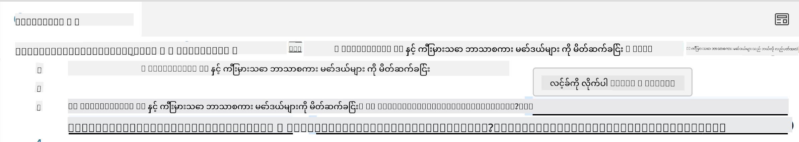
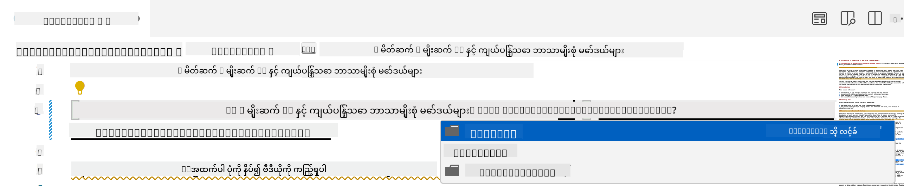
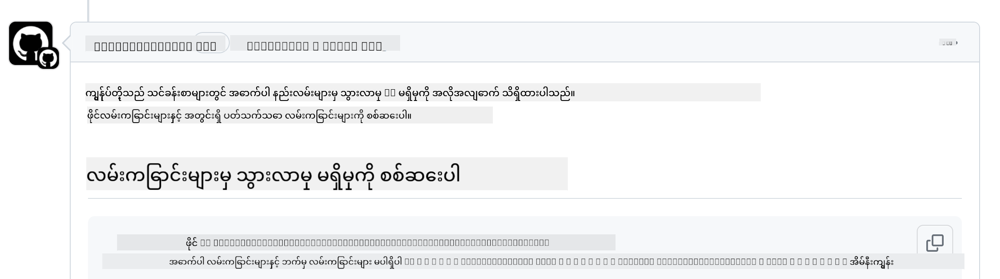
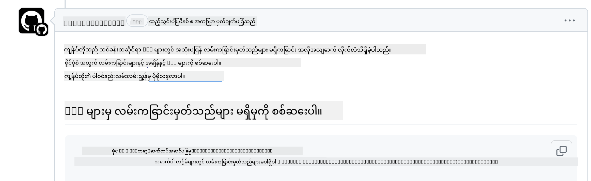
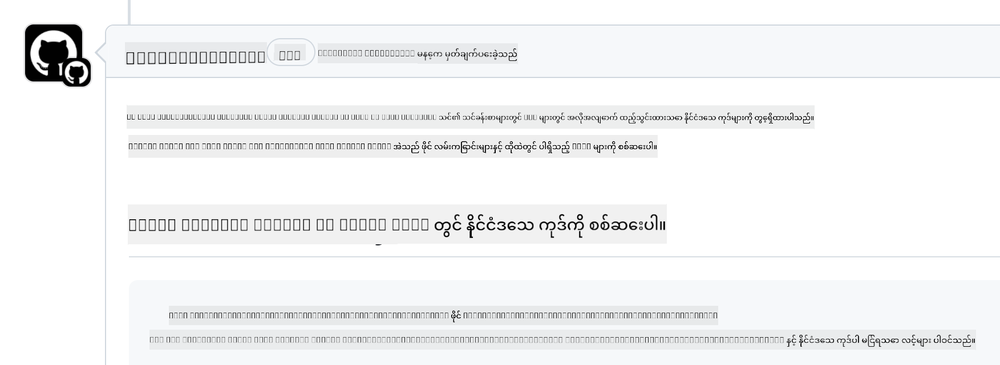

<!--
CO_OP_TRANSLATOR_METADATA:
{
  "original_hash": "57c41f2af71001a2cff9d8eb797cb843",
  "translation_date": "2025-06-25T07:23:35+00:00",
  "source_file": "CONTRIBUTING.md",
  "language_code": "my"
}
-->
# အထောက်အပံ့ပေးခြင်း

ဒီပရောဂျက်ဟာ အထောက်အပံ့များနှင့် အကြံပြုချက်များကို ကြိုဆိုပါတယ်။ အများဆုံးအထောက်အပံ့ပေးမှုများအတွက် Contributor License Agreement (CLA) ကို သဘောတူရန် လိုအပ်ပါသည်။ ဒါဟာ သင့်အထောက်အပံ့ကို အသုံးပြုခွင့်ကို ကျွန်ုပ်တို့ကို ပေးနိုင်ရန် သင့်အနေဖြင့် အခွင့်အရေးရှိကြောင်း ကြေညာခြင်းဖြစ်သည်။ အသေးစိတ်အချက်အလက်များအတွက် <https://cla.microsoft.com> သို့ သွားပါ။

> အရေးကြီးသည်။ ဒီ repo အတွင်း စာသားကို ဘာသာပြန်ဆိုသောအခါ၊ စက်ဖြင့် ဘာသာပြန်မှုများကို မသုံးပါနှင့်။ ကျွန်ုပ်တို့သည် ဘာသာပြန်မှုများကို လူမှုအသိုင်းအဝိုင်းမှ စစ်ဆေးမည်ဖြစ်သည်၊ ထို့ကြောင့် သင့်အနေဖြင့် ကျွမ်းကျင်သော ဘာသာစကားများတွင်သာ ဘာသာပြန်ရန် လိုအပ်ပါသည်။

သင် pull request တင်သည့်အခါ CLA-bot သည် သင် CLA ပေးရန် လိုအပ်သို့မဟုတ် မလိုအပ်ကြောင်း အလိုအလျောက် ဆုံးဖြတ်ပြီး PR ကို သင့်တော်စွာ အလှဆင်ပေးမည် (ဥပမာ၊ အမှတ်အသား၊ မှတ်ချက်) ဖြစ်သည်။ bot မှ ပေးထားသော ညွှန်ကြားချက်များကို လိုက်နာပါ။ ကျွန်ုပ်တို့၏ CLA ကို အသုံးပြုသော repo အားလုံးတွင် သင်ဤလုပ်ငန်းကို တစ်ကြိမ်သာ လုပ်ရန် လိုအပ်ပါသည်။

## အပြုသဘောဆောင်ခြင်း စည်းမျဉ်းများ

ဒီပရောဂျက်သည် [Microsoft Open Source Code of Conduct](https://opensource.microsoft.com/codeofconduct/?WT.mc_id=academic-105485-koreyst) ကို လက်ခံခဲ့သည်။ အသေးစိတ်အချက်အလက်များကို [Code of Conduct FAQ](https://opensource.microsoft.com/codeofconduct/faq/?WT.mc_id=academic-105485-koreyst) တွင် ဖတ်ပါ သို့မဟုတ် [opencode@microsoft.com](mailto:opencode@microsoft.com) သို့ အခြားမေးခွန်းများ သို့မဟုတ် မှတ်ချက်များနှင့်အတူ ဆက်သွယ်ပါ။

## မေးခွန်း သို့မဟုတ် ပြဿနာ?

အထွေထွေ အထောက်အပံ့မေးခွန်းများအတွက် GitHub issues မဖွင့်ပါနှင့်၊ GitHub စာရင်းကို အင်္ဂါရပ်တောင်းဆိုမှုများနှင့် အမှားအစီရင်ခံချက်များအတွက် အသုံးပြုသင့်သည်။ ဒီလိုလုပ်ခြင်းဖြင့် ကုဒ်မှ ဖြစ်ပေါ်လာသော အမှားများ သို့မဟုတ် ပြဿနာများကို ပိုမိုလွယ်ကူစွာ လိုက်နာနိုင်ပြီး အထွေထွေ ဆွေးနွေးချက်ကို အမှန်တကယ် ကုဒ်ထဲမှ ခွဲခြားထားနိုင်သည်။

## စာလုံးပေါင်း အမှားများ၊ ပြဿနာများ၊ အမှားများနှင့် အထောက်အပံ့များ

Generative AI for Beginners repository သို့ မည်သည့် ပြင်ဆင်မှုများကို တင်ပြသည့်အခါ၊ ဤအကြံပြုချက်များကို လိုက်နာပါ။

* သင့်ပြင်ဆင်မှုများကို ပြုလုပ်မီ အမြဲတမ်း repository ကို သင့်ကိုယ်ပိုင် အကောင့်သို့ fork လုပ်ပါ
* တစ်ခုတည်းသော pull request အတွက် ပြင်ဆင်မှုများစုပြုံမပြုပါနှင့်။ ဥပမာအားဖြင့် အမှားပြင်ခြင်းနှင့် စာရွက်စာတမ်း အပ်ဒိတ်များကို ခွဲခြားသော PR များကို အသုံးပြု၍ တင်ပြပါ
* သင့် pull request သည် merge conflicts ပြသပါက ပြင်ဆင်မှုများ ပြုလုပ်မီ သင့်ဒေသိယ main ကို အဓိက repository တွင် ရှိသည်နှင့် တူညီသော မျက်နှာပြင်ပြုလုပ်ရန် သေချာပါစေ
* သင် ဘာသာပြန်မှု တင်ပြပါက ဘာသာပြန်ထားသော ဖိုင်များအားလုံးအတွက် တစ်ခုတည်းသော PR ဖန်တီးပါ၊ အကြောင်းအရာအတွက် အစိတ်အပိုင်း ဘာသာပြန်မှုများကို မလက်ခံပါ
* သင် စာလုံးပေါင်းအမှား သို့မဟုတ် စာရွက်စာတမ်း ပြင်ဆင်မှု တင်ပြပါက သင့် PR တစ်ခုအတွင်းတွင် သင့်တော်သည့် နေရာတွင် ပြင်ဆင်မှုများကို ပေါင်းစည်းနိုင်သည်

## အထွေထွေ လမ်းညွှန်ချက်များ

- သင်၏ URLs အားလုံးကို စတုရန်းကိုးကွယ်များတွင် ပတ်ပြီး အတွင်းတွင် သို့မဟုတ် အပတ်ပတ်လည်တွင် ထပ်ထည့်ခြင်းမရှိဘဲ ပရင့်စီးများဖြင့် ဆက်ထားရန် သေချာပါစေ ``။
- မည်သည့် ဆွဲဆောင်မှု လင့်ခ် (ဥပမာ၊ repository အတွင်းရှိ အခြားဖိုင်များနှင့် ဖိုဒါများသို့ ချိတ်ဆက်မှုများ) မဆို `./` ဖြင့် စတင်ရန် သေချာပါစေ၊ ဒါဟာ လက်ရှိ အလုပ်လုပ်နေသော ဒိုင်ရေးကထရီတွင် ရှိသော ဖိုင် သို့မဟုတ် ဖိုဒါကို ဆိုလိုသည်၊ သို့မဟုတ် `../` ဖိုင် သို့မဟုတ် ဖိုဒါကို မိဘ အလုပ်လုပ်နေသော ဒိုင်ရေးကထရီတွင် ရှိသော ဖိုင် သို့မဟုတ် ဖိုဒါကို ဆိုလိုသည်။
- မည်သည့် ဆွဲဆောင်မှု လင့်ခ် (ဥပမာ၊ repository အတွင်းရှိ အခြားဖိုင်များနှင့် ဖိုဒါများသို့ ချိတ်ဆက်မှုများ) မဆို `?` သို့မဟုတ် `&` ပြီး `wt.mc_id=` သို့မဟုတ် `WT.mc_id=` ဖြင့် တန်းခြားထားသော tracking ID ကို အဆုံးတွင် ပါရှိရန် သေချာပါစေ။
- အောက်ပါ ဒိုမိန်းများ _github.com, microsoft.com, visualstudio.com, aka.ms, and azure.com_ မှ မည်သည့် URL မဆို `?` သို့မဟုတ် `&` ပြီး `wt.mc_id=` သို့မဟုတ် `WT.mc_id=` ဖြင့် တန်းခြားထားသော tracking ID ကို အဆုံးတွင် ပါရှိရန် သေချာပါစေ။
- သင့်လင့်ခ်များတွင် နိုင်ငံအထူးပြု locale မပါရှိဘဲ ရှိရန် သေချာပါစေ (ဥပမာ `/en-us/` သို့မဟုတ် `/en/`)။
- အားလုံးသော ပုံများကို `./images` ဖိုဒါတွင် သိမ်းဆည်းထားရန် သေချာပါစေ။
- ပုံများတွင် အင်္ဂလိပ်စာလုံးများ၊ နံပါတ်များနှင့် အမည်တွင် အမည်များကို အသုံးပြု၍ ဖော်ပြချက် အမည်များရှိရန် သေချာပါစေ။

## GitHub Workflows

သင် pull request တင်သည့်အခါ၊ ယခင် စည်းမျဉ်းများကို အတည်ပြုရန် workflow လေးခုကို အလုပ်လုပ်မည်ဖြစ်သည်။
workflow စစ်ဆေးမှုများကို ဖြတ်နိုင်ရန် ဒီမှာဖော်ပြထားသော ညွှန်ကြားချက်များကို လိုက်နာပါ။

- [Check Broken Relative Paths](../..)
- [Check Paths Have Tracking](../..)
- [Check URLs Have Tracking](../..)
- [Check URLs Don't Have Locale](../..)

### Check Broken Relative Paths

ဤ workflow သည် သင့်ဖိုင်များအတွင်းရှိ မည်သည့် ဆွဲဆောင်မှု လမ်းကြောင်းကို မဆို အလုပ်လုပ်နေကြောင်း သေချာစေသည်။
ဤ repository သည် GitHub pages သို့ ထုတ်ဝေထားသောကြောင့် လင့်ခ်များကို ရိုက်သောအခါ မည်သူမဆိုမှားနေရာသို့ မသွားစေရန် အထူးဂရုစိုက်ရပါမည်။

သင့်လင့်ခ်များ အလုပ်လုပ်နေကြောင်း သေချာစေရန် VS code ကို အသုံးပြု၍ စစ်ဆေးပါ။

ဥပမာအားဖြင့် သင့်ဖိုင်များအတွင်းရှိ မည်သည့် လင့်ခ်ကိုမဆို ဖွင့်လှစ်သောအခါ **ctrl + click** နှိပ်ခြင်းဖြင့် လင့်ခ်ကို လိုက်နာရန် တိုက်တွန်းချက်ကို ပေးမည်ဖြစ်သည်။

လင့်ခ်ကို နှိပ်ပြီး ဒေသိယတွင် အလုပ်မလုပ်ပါက၊ workflow ကို ဖွင့်ပြီး GitHub တွင် အလုပ်မလုပ်ပါ။

ဤပြဿနာကို ဖြေရှင်းရန် VS code ၏ အကူအညီဖြင့် လင့်ခ်ကို ရိုက်ရန် ကြိုးစားပါ။

`./` သို့မဟုတ် `../` ရိုက်သောအခါ VS code သည် သင်ရိုက်ထည့်ထားသောအတိုင်း ရွေးချယ်မှုများကို ရွေးချယ်ရန် တိုက်တွန်းချက်ကို ပေးမည်ဖြစ်သည်။

လိုအပ်သော ဖိုင် သို့မဟုတ် ဖိုဒါကို နှိပ်၍ လမ်းကြောင်းကို လိုက်နာပြီး သင့်လမ်းကြောင်း မပျက်စီးကြောင်း သေချာပါစေ။

မှန်ကန်သော ဆွဲဆောင်မှု လမ်းကြောင်းကို ထည့်သွင်းပြီး နောက်ဆုံးတွင် သိမ်းဆည်းပြီး ပြင်ဆင်မှုများကို push လုပ်ပါက workflow သည် သင့်ပြင်ဆင်မှုများကို အတည်ပြုရန် ထပ်မံဖွင့်လှစ်မည်ဖြစ်သည်။
သင်စစ်ဆေးမှုကို ဖြတ်နိုင်ပါက သင် သွားနိုင်ပါပြီ။

### Check Paths Have Tracking

ဤ workflow သည် မည်သည့် ဆွဲဆောင်မှု လမ်းကြောင်းကို မဆို tracking ပါရှိကြောင်း သေချာစေသည်။
ဤ repository သည် GitHub pages သို့ ထုတ်ဝေထားသောကြောင့် မတူညီသော ဖိုင်များနှင့် ဖိုဒါများအကြား လှုပ်ရှားမှုကို tracking ပြုလုပ်ရန် လိုအပ်သည်။

သင့်ဆွဲဆောင်မှု လမ်းကြောင်းများတွင် tracking ပါရှိကြောင်း သေချာစေရန် `?wt.mc_id=` ကို လမ်းကြောင်းအဆုံးတွင် ရှိကြောင်း စစ်ဆေးပါ။
သင့်ဆွဲဆောင်မှု လမ်းကြောင်းများတွင် ထပ်မံထည့်ထားပါက သင်ဤစစ်ဆေးမှုကို ဖြတ်နိုင်မည်ဖြစ်သည်။

မဟုတ်ပါက အောက်ပါအမှားကို ရရှိနိုင်ပါသည်။

ဤပြဿနာကို ဖြေရှင်းရန် workflow မှ highlight ပြုလုပ်ထားသော ဖိုင်လမ်းကြောင်းကို ဖွင့်ပြီး ဆွဲဆောင်မှု လမ်းကြောင်းများအဆုံးတွင် tracking ID ကို ထည့်ပါ။

tracking ID ထည့်ပြီး သိမ်းဆည်းပြီး ပြင်ဆင်မှုများကို push လုပ်ပါက workflow သည် သင့်ပြင်ဆင်မှုများကို အတည်ပြုရန် ထပ်မံဖွင့်လှစ်မည်ဖြစ်သည်။
သင်စစ်ဆေးမှုကို ဖြတ်နိုင်ပါက သင် သွားနိုင်ပါပြီ။

### Check URLs Have Tracking

ဤ workflow သည် မည်သည့် web URL ကိုမဆို tracking ပါရှိကြောင်း သေချာစေသည်။
ဤ repository သည် အားလုံးအတွက် ရရှိနိုင်သောကြောင့် လမ်းကြောင်းကို tracking ပြုလုပ်ရန် လိုအပ်သည်။

သင့် URLs တွင် tracking ပါရှိကြောင်း သေချာစေရန် `?wt.mc_id=` ကို URL အဆုံးတွင် ရှိကြောင်း စစ်ဆေးပါ။
သင့် URLs တွင် ထပ်မံထည့်ထားပါက သင်ဤစစ်ဆေးမှုကို ဖြတ်နိုင်မည်ဖြစ်သည်။

မဟုတ်ပါက အောက်ပါအမှားကို ရရှိနိုင်ပါသည်။

ဤပြဿနာကို ဖြေရှင်းရန် workflow မှ highlight ပြုလုပ်ထားသော ဖိုင်လမ်းကြောင်းကို ဖွင့်ပြီး URLs အဆုံးတွင် tracking ID ကို ထည့်ပါ။

tracking ID ထည့်ပြီး သိမ်းဆည်းပြီး ပြင်ဆင်မှုများကို push လုပ်ပါက workflow သည် သင့်ပြင်ဆင်မှုများကို အတည်ပြုရန် ထပ်မံဖွင့်လှစ်မည်ဖြစ်သည်။
သင်စစ်ဆေးမှုကို ဖြတ်နိုင်ပါက သင် သွားနိုင်ပါပြီ။

### Check URLs Don't Have Locale

ဤ workflow သည် မည်သည့် web URL ကိုမဆို နိုင်ငံအထူးပြု locale မပါရှိကြောင်း သေချာစေသည်။
ဤ repository သည် ကမ္ဘာတစ်ဝှမ်းရှိ လူအပေါင်းတို့အတွက် ရရှိနိုင်သောကြောင့် သင့်နိုင်ငံ၏ locale ကို URLs တွင် ထည့်သွင်းမထားပါနှင့်။

သင့် URLs တွင် နိုင်ငံ locale မပါရှိကြောင်း သေချာစေရန် `/en-us/` သို့မဟုတ် `/en/` သို့မဟုတ် URL အတွင်း မည်သည့် အခြားဘာသာစကား locale မဆို ရှိကြောင်း စစ်ဆေးပါ။
သင့် URLs တွင် မပါရှိပါက သင်ဤစစ်ဆေးမှုကို ဖြတ်နိုင်မည်ဖြစ်သည်။

မဟုတ်ပါက အောက်ပါအမှားကို ရရှိနိုင်ပါသည်။

ဤပြဿနာကို ဖြေရှင်းရန် workflow မှ highlight ပြုလုပ်ထားသော ဖိုင်လမ်းကြောင်းကို ဖွင့်ပြီး URLs မှ နိုင်ငံ locale ကို ဖျက်ပါ။

နိုင်ငံ locale ကို ဖျက်ပြီး သိမ်းဆည်းပြီး ပြင်ဆင်မှုများကို push လုပ်ပါက workflow သည် သင့်ပြင်ဆင်မှုများကို အတည်ပြုရန် ထပ်မံဖွင့်လှစ်မည်ဖြစ်သည်။
သင်စစ်ဆေးမှုကို ဖြတ်နိုင်ပါက သင် သွားနိုင်ပါပြီ။

ဂုဏ်ယူပါတယ်! သင့်အထောက်အပံ့အတွက် အကြောင်းပြန်သွားပါမည်။

**ဖြန့်ချိချက်**:  
ဒီစာရွက်ကို AI ဘာသာပြန်စနစ် [Co-op Translator](https://github.com/Azure/co-op-translator) ကို အသုံးပြုပြီး ဘာသာပြန်ထားပါတယ်။ ကျွန်ုပ်တို့မှ မှန်ကန်မှုအတွက် ကြိုးစားနေကြပေမယ့် အလိုအလျောက် ဘာသာပြန်ခြင်းများတွင် အမှားများ သို့မဟုတ် မမှန်ကန်မှုများ ပါဝင်နိုင်သည်ကို ကျေးဇူးပြု၍ သိရှိပါ။ မူရင်းစာရွက်ကို ၎င်း၏ဇာတိဘာသာစကားဖြင့် အာဏာရှိသောအရင်းအမြစ်အဖြစ် သတ်မှတ်သင့်သည်။ အရေးကြီးသော အချက်အလက်များအတွက် ကျွမ်းကျင်သူ လူသား ဘာသာပြန်ခြင်းကို အကြံပြုပါသည်။ ဤဘာသာပြန်မှုကို အသုံးပြုခြင်းမှ ဖြစ်ပေါ်လာသော နားလည်မှုမှားများ သို့မဟုတ် အဓိပ္ပာယ်မှားများအတွက် ကျွန်ုပ်တို့တာဝန်မရှိပါ။