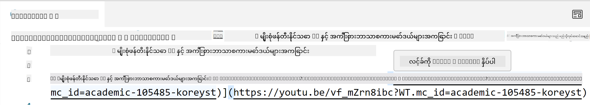
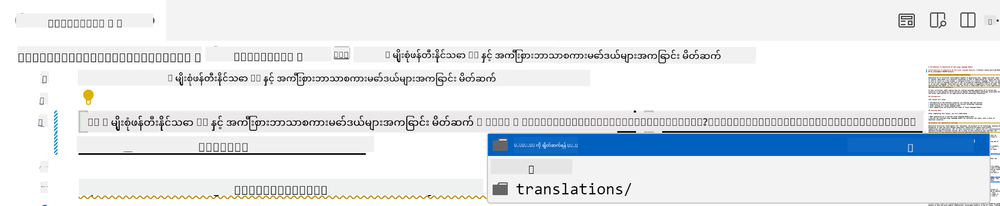
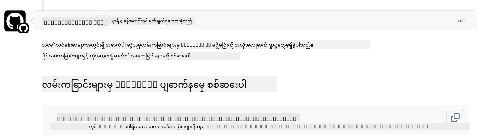
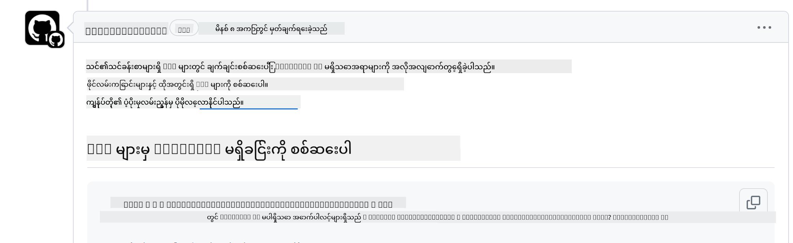
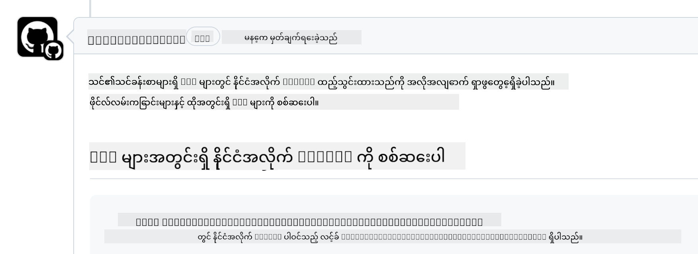

<!--
CO_OP_TRANSLATOR_METADATA:
{
  "original_hash": "57c41f2af71001a2cff9d8eb797cb843",
  "translation_date": "2025-07-09T06:14:08+00:00",
  "source_file": "CONTRIBUTING.md",
  "language_code": "my"
}
-->
# Contributing

ဒီပရောဂျက်မှာ အထောက်အပံ့တွေနဲ့ အကြံပြုချက်တွေကို ကြိုဆိုပါတယ်။ အများဆုံး အထောက်အပံ့တွေမှာ Contributor License Agreement (CLA) တစ်ခုကို သဘောတူဖို့ လိုအပ်ပြီး၊ သင့်ရဲ့ အထောက်အပံ့ကို အသုံးပြုခွင့်ရှိပြီး အသုံးပြုခွင့်ပေးတာကို သက်သေပြဖို့ လိုပါတယ်။ အသေးစိတ်အချက်အလက်များအတွက် <https://cla.microsoft.com> ကို သွားရောက်ကြည့်ရှုနိုင်ပါတယ်။

> အရေးကြီးချက် - ဒီ repo ထဲမှာ စာသားတွေ ဘာသာပြန်တဲ့အခါ မစက်ရုပ်ဘာသာပြန်မှုကို မသုံးပါနဲ့။ ဘာသာပြန်မှုတွေကို လူမှုအသိုင်းအဝိုင်းမှ စစ်ဆေးမှာဖြစ်လို့ သင်ကျွမ်းကျင်တဲ့ ဘာသာစကားတွေမှာသာ ဘာသာပြန်မှုအတွက် စေတနာ့ဝန်ထမ်းဖြစ်ပါ။

သင် pull request တင်တဲ့အခါ CLA-bot က သင် CLA တင်ဖို့ လိုအပ်မလား၊ PR ကို သင့်တော်စွာ အမှတ်အသားပေးဖို့ (ဥပမာ - label, comment) ကို အလိုအလျောက် ဆုံးဖြတ်ပေးပါလိမ့်မယ်။ bot က ပေးတဲ့ ညွှန်ကြားချက်တွေကို လိုက်နာပေးရုံပါပဲ။ CLA ကို သုံးတဲ့ repository အားလုံးမှာ တစ်ကြိမ်တည်းသာ လုပ်ဆောင်ရပါမယ်။

## Code of Conduct

ဒီပရောဂျက်မှာ [Microsoft Open Source Code of Conduct](https://opensource.microsoft.com/codeofconduct/?WT.mc_id=academic-105485-koreyst) ကို လက်ခံအသုံးပြုထားပါတယ်။ အသေးစိတ်အချက်အလက်များအတွက် [Code of Conduct FAQ](https://opensource.microsoft.com/codeofconduct/faq/?WT.mc_id=academic-105485-koreyst) ကို ဖတ်ရှုပါ၊ ဒါမှမဟုတ် မေးခွန်းများ သို့မဟုတ် မှတ်ချက်များရှိပါက [opencode@microsoft.com](mailto:opencode@microsoft.com) သို့ ဆက်သွယ်နိုင်ပါတယ်။

## Question or Problem?

အထွေထွေထောက်ခံမှုမေးခွန်းများအတွက် GitHub issues မဖွင့်ပါနဲ့၊ GitHub list ကို feature requests နဲ့ bug reports အတွက်သာ အသုံးပြုသင့်ပါတယ်။ ဒီလိုလုပ်ခြင်းဖြင့် အမှန်တကယ် ဖြစ်ပေါ်နေတဲ့ ပြဿနာများ သို့မဟုတ် bug များကို ပိုမိုလွယ်ကူစွာ လိုက်လံစစ်ဆေးနိုင်ပြီး၊ အထွေထွေ ဆွေးနွေးမှုများကို ကုဒ်နဲ့ သီးခြားထားနိုင်မှာ ဖြစ်ပါတယ်။

## Typos, Issues, Bugs and contributions

Generative AI for Beginners repository ထဲကို ပြင်ဆင်မှုတင်သွင်းတဲ့အခါ အောက်ပါ အကြံပြုချက်တွေကို လိုက်နာပါ။

* ပြင်ဆင်မှုလုပ်မယ့်အခါ မိမိရဲ့ ကိုယ်ပိုင်အကောင့်ကို အရင် fork လုပ်ပါ
* တစ်ခုတည်းသော pull request မှာ ပြင်ဆင်မှုများစွာ မပေါင်းစပ်ပါနဲ့။ ဥပမာ - bug fix နဲ့ စာတမ်းပြင်ဆင်မှုတွေကို သီးခြား PR တွေဖြင့် တင်ပါ
* သင့် pull request မှာ merge conflicts တွေရှိရင် ပြင်ဆင်မှုလုပ်မယ့်အရင်မှာ မိမိရဲ့ local main ကို main repository ရဲ့ mirror အဖြစ် update လုပ်ထားပါ
* ဘာသာပြန်မှုတင်သွင်းတဲ့အခါ ဘာသာပြန်ထားတဲ့ ဖိုင်အားလုံးအတွက် တစ်ခုတည်းသော PR တင်ပါ၊ အပိုင်းပိုင်း ဘာသာပြန်မှုကို လက်မခံပါ
* စာလုံးပေါင်းမှား၊ စာတမ်းပြင်ဆင်မှု တင်သွင်းတဲ့အခါ သင့်တော်လျှင် တစ်ခုတည်းသော PR မှာ ပြင်ဆင်မှုများ ပေါင်းစပ်နိုင်ပါတယ်

## General Guidance for writing

- သင့်ရဲ့ URL အားလုံးကို စတုရန်းကွက်တွေနဲ့ ဖုံးအုပ်ပြီး၊ အနောက်မှာ မည်သည့်အပိုင်းအခြား အလွတ်နေရာမရှိဘဲ `` ပုံစံနဲ့ရေးပါ။
- repository ထဲရှိ အခြားဖိုင်များ သို့မဟုတ် ဖိုလ်ဒါများဆီသို့ ချိတ်ဆက်တဲ့ relative link များသည် လက်ရှိ အလုပ်လုပ်နေသော directory ထဲရှိ ဖိုင် သို့မဟုတ် ဖိုလ်ဒါကို ရည်ညွှန်းတဲ့ `./` သို့မဟုတ် မိမိ၏ မိခင် directory ထဲရှိ ဖိုင် သို့မဟုတ် ဖိုလ်ဒါကို ရည်ညွှန်းတဲ့ `../` ဖြင့် စတင်ရပါမည်။
- relative link များတွင် tracking ID (ဥပမာ - `?` သို့မဟုတ် `&` နောက်တွင် `wt.mc_id=` သို့မဟုတ် `WT.mc_id=`) ပါဝင်ရမည်။
- _github.com, microsoft.com, visualstudio.com, aka.ms, နှင့် azure.com_ မှ URL များတွင် tracking ID ပါဝင်ရမည်။
- သင့် link များတွင် နိုင်ငံအလိုက် locale (ဥပမာ - `/en-us/` သို့မဟုတ် `/en/`) မပါဝင်ရ။
- ပုံများအားလုံးကို `./images` ဖိုလ်ဒါထဲသိမ်းဆည်းထားရမည်။
- ပုံများအမည်များကို အင်္ဂလိပ်အက္ခရာ၊ နံပါတ်များနှင့် dash များဖြင့် ဖော်ပြထားရမည်။

## GitHub Workflows

သင် pull request တင်တဲ့အခါ အောက်ပါ workflow လေးခုက အလိုအလျောက် စစ်ဆေးပေးမှာဖြစ်ပါတယ်။
workflow စစ်ဆေးမှုများကို ဖြတ်သန်းနိုင်ရန် ဒီမှာ ဖော်ပြထားတဲ့ ညွှန်ကြားချက်များကို လိုက်နာပါ။

- [Check Broken Relative Paths](../..)
- [Check Paths Have Tracking](../..)
- [Check URLs Have Tracking](../..)
- [Check URLs Don't Have Locale](../..)

### Check Broken Relative Paths

ဒီ workflow က သင့်ဖိုင်ထဲရှိ relative path များ အလုပ်လုပ်နေမှုကို သေချာစေပါတယ်။
ဒီ repository ကို GitHub pages မှာ တင်ထားတာဖြစ်လို့ လင့်ခ်တွေကို မှန်ကန်စွာ ရိုက်ထည့်ဖို့ အထူးဂရုစိုက်ရပါမယ်၊ မမှန်တဲ့နေရာကို မည်သူမဆို မသွားရောက်စေချင်ပါ။

သင့်လင့်ခ်တွေ အလုပ်လုပ်နေမှုကို သေချာစေဖို့ VS code ကို အသုံးပြုပြီး စစ်ဆေးနိုင်ပါတယ်။

ဥပမာ - ဖိုင်ထဲရှိ လင့်ခ်တစ်ခုကို hover လုပ်တဲ့အခါ **ctrl + click** နှိပ်ပြီး လင့်ခ်ကို လိုက်နာနိုင်ဖို့ prompt ပေါ်လာပါလိမ့်မယ်။

လင့်ခ်ကို နှိပ်ပြီး မိမိ local မှာ အလုပ်မလုပ်ပါက workflow က error ဖြစ်စေပြီး GitHub ပေါ်မှာလည်း အလုပ်မလုပ်ပါဘူး။

ဒီပြဿနာကို ဖြေရှင်းဖို့ VS code ကူညီမှုနဲ့ လင့်ခ်ကို ရိုက်ထည့်ကြည့်ပါ။

`./` သို့မဟုတ် `../` ရိုက်တဲ့အခါ VS code က ရွေးချယ်စရာများကို ပြပါလိမ့်မယ်။

လိုချင်တဲ့ ဖိုင် သို့မဟုတ် ဖိုလ်ဒါကို နှိပ်ပြီး လင့်ခ်မပျက်စီးကြောင်း သေချာစေပါ။

မှန်ကန်တဲ့ relative path ထည့်ပြီး သိမ်းဆည်း၊ push လုပ်ပြီးနောက် workflow က ပြန်စစ်ဆေးပါလိမ့်မယ်။
စစ်ဆေးမှုကို ဖြတ်သန်းနိုင်ရင် အဆင်ပြေပါပြီ။

### Check Paths Have Tracking

ဒီ workflow က relative path များတွင် tracking ပါရှိမှုကို သေချာစေပါတယ်။
ဒီ repository ကို GitHub pages မှာ တင်ထားတာဖြစ်လို့ ဖိုင်နဲ့ ဖိုလ်ဒါများအကြား လှုပ်ရှားမှုကို မှတ်တမ်းတင်ဖို့ လိုအပ်ပါတယ်။

relative path များတွင် tracking ပါရှိမှုကို သေချာစေဖို့ path အဆုံးတွင် `?wt.mc_id=` ဆိုတဲ့ စာသားကို ရှာဖွေပါ။
tracking ID ပါလာရင် စစ်ဆေးမှုကို ဖြတ်သန်းနိုင်ပါလိမ့်မယ်။

မပါလာရင် အောက်ပါ error ကို ကြုံတွေ့နိုင်ပါတယ်။

ပြဿနာကို ဖြေရှင်းဖို့ workflow က ပြထားတဲ့ ဖိုင်လမ်းကြောင်းကို ဖွင့်ပြီး relative path အဆုံးတွင် tracking ID ထည့်ပါ။

tracking ID ထည့်ပြီး သိမ်းဆည်း၊ push လုပ်ပြီးနောက် workflow က ပြန်စစ်ဆေးပါလိမ့်မယ်။
စစ်ဆေးမှုကို ဖြတ်သန်းနိုင်ရင် အဆင်ပြေပါပြီ။

### Check URLs Have Tracking

ဒီ workflow က ဝဘ် URL များတွင် tracking ပါရှိမှုကို သေချာစေပါတယ်။
ဒီ repository ကို လူတိုင်းအသုံးပြုနိုင်တာဖြစ်လို့ traffic မည်နေရာမှ ရောက်လာတာကို မှတ်တမ်းတင်ဖို့ လိုအပ်ပါတယ်။

URL များတွင် tracking ပါရှိမှုကို သေချာစေဖို့ URL အဆုံးတွင် `?wt.mc_id=` ဆိုတဲ့ စာသားကို ရှာဖွေပါ။
tracking ID ပါလာရင် စစ်ဆေးမှုကို ဖြတ်သန်းနိုင်ပါလိမ့်မယ်။

မပါလာရင် အောက်ပါ error ကို ကြုံတွေ့နိုင်ပါတယ်။

ပြဿနာကို ဖြေရှင်းဖို့ workflow က ပြထားတဲ့ ဖိုင်လမ်းကြောင်းကို ဖွင့်ပြီး URL အဆုံးတွင် tracking ID ထည့်ပါ။

tracking ID ထည့်ပြီး သိမ်းဆည်း၊ push လုပ်ပြီးနောက် workflow က ပြန်စစ်ဆေးပါလိမ့်မယ်။
စစ်ဆေးမှုကို ဖြတ်သန်းနိုင်ရင် အဆင်ပြေပါပြီ။

### Check URLs Don't Have Locale

ဒီ workflow က ဝဘ် URL များတွင် နိုင်ငံအလိုက် locale မပါရှိမှုကို သေချာစေပါတယ်။
ဒီ repository ကို ကမ္ဘာတစ်ဝှမ်းလုံးမှ လူတိုင်းအသုံးပြုနိုင်တာဖြစ်လို့ သင့်နိုင်ငံရဲ့ locale ကို URL မထည့်သင့်ပါ။

URL များတွင် နိုင်ငံ locale မပါရှိမှုကို သေချာစေဖို့ URL ထဲမှာ `/en-us/` သို့မဟုတ် `/en/` သို့မဟုတ် အခြားဘာသာစကား locale များ ရှိမရှိ စစ်ဆေးပါ။
မရှိရင် စစ်ဆေးမှုကို ဖြတ်သန်းနိုင်ပါလိမ့်မယ်။

ရှိရင် အောက်ပါ error ကို ကြုံတွေ့နိုင်ပါတယ်။

ပြဿနာကို ဖြေရှင်းဖို့ workflow က ပြထားတဲ့ ဖိုင်လမ်းကြောင်းကို ဖွင့်ပြီး URL ထဲက နိုင်ငံ locale ကို ဖယ်ရှားပါ။

locale ဖယ်ရှားပြီး သိမ်းဆည်း၊ push လုပ်ပြီးနောက် workflow က ပြန်စစ်ဆေးပါလိမ့်မယ်။
စစ်ဆေးမှုကို ဖြတ်သန်းနိုင်ရင် အဆင်ပြေပါပြီ။

ဂုဏ်ယူပါတယ်! သင့်ရဲ့ အထောက်အပံ့အတွက် တုံ့ပြန်ချက်များကို အမြန်ဆုံး ပြန်လည်ဆက်သွယ်ပေးပါမယ်။

**အကြောင်းကြားချက်**  
ဤစာတမ်းကို AI ဘာသာပြန်ဝန်ဆောင်မှု [Co-op Translator](https://github.com/Azure/co-op-translator) ဖြင့် ဘာသာပြန်ထားပါသည်။ ကျွန်ုပ်တို့သည် တိကျမှန်ကန်မှုအတွက် ကြိုးစားနေသော်လည်း အလိုအလျောက် ဘာသာပြန်ခြင်းတွင် အမှားများ သို့မဟုတ် မှားယွင်းချက်များ ပါဝင်နိုင်ကြောင်း သတိပြုပါရန် မေတ္တာရပ်ခံအပ်ပါသည်။ မူရင်းစာတမ်းကို မိမိဘာသာစကားဖြင့်သာ တရားဝင်အချက်အလက်အဖြစ် ယူဆသင့်ပါသည်။ အရေးကြီးသော အချက်အလက်များအတွက် လူ့ဘာသာပြန်ပညာရှင်မှ ဘာသာပြန်ခြင်းကို အကြံပြုပါသည်။ ဤဘာသာပြန်ချက်ကို အသုံးပြုရာမှ ဖြစ်ပေါ်လာနိုင်သည့် နားလည်မှုမှားယွင်းမှုများအတွက် ကျွန်ုပ်တို့ တာဝန်မယူပါ။