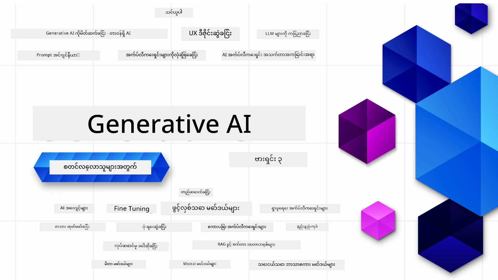

### Generative AI အပလီကေးရှင်းများကို စတင်တည်ဆောက်ရန် လိုအပ်သည့် အားလုံးကို သင်ကြားပေးသည့် သင်ခန်းစာ ၂၁ ဆောင်းပါး

[](https://github.com/microsoft/Generative-AI-For-Beginners/blob/master/LICENSE?WT.mc_id=academic-105485-koreyst)
[](https://GitHub.com/microsoft/Generative-AI-For-Beginners/graphs/contributors/?WT.mc_id=academic-105485-koreyst)
[](https://GitHub.com/microsoft/Generative-AI-For-Beginners/issues/?WT.mc_id=academic-105485-koreyst)
[](https://GitHub.com/microsoft/Generative-AI-For-Beginners/pulls/?WT.mc_id=academic-105485-koreyst)
[](http://makeapullrequest.com?WT.mc_id=academic-105485-koreyst)

[](https://GitHub.com/microsoft/Generative-AI-For-Beginners/watchers/?WT.mc_id=academic-105485-koreyst)
[](https://GitHub.com/microsoft/Generative-AI-For-Beginners/network/?WT.mc_id=academic-105485-koreyst)
[](https://GitHub.com/microsoft/Generative-AI-For-Beginners/stargazers/?WT.mc_id=academic-105485-koreyst)

[](https://discord.gg/nTYy5BXMWG)

### 🌐 ဘာသာစကားစုံကို ထောက်ခံပေးခြင်း

#### GitHub Action ဖြင့် ထောက်ခံပြီး (အလိုအလျောက် နှင့် အမြဲတမ်း နောက်ဆုံးထိအသစ်ပြောင်းလဲမှုရှိ)

<!-- CO-OP TRANSLATOR LANGUAGES TABLE START -->
[Arabic](../ar/README.md) | [Bengali](../bn/README.md) | [Bulgarian](../bg/README.md) | [Burmese (Myanmar)](./README.md) | [Chinese (Simplified)](../zh-CN/README.md) | [Chinese (Traditional, Hong Kong)](../zh-HK/README.md) | [Chinese (Traditional, Macau)](../zh-MO/README.md) | [Chinese (Traditional, Taiwan)](../zh-TW/README.md) | [Croatian](../hr/README.md) | [Czech](../cs/README.md) | [Danish](../da/README.md) | [Dutch](../nl/README.md) | [Estonian](../et/README.md) | [Finnish](../fi/README.md) | [French](../fr/README.md) | [German](../de/README.md) | [Greek](../el/README.md) | [Hebrew](../he/README.md) | [Hindi](../hi/README.md) | [Hungarian](../hu/README.md) | [Indonesian](../id/README.md) | [Italian](../it/README.md) | [Japanese](../ja/README.md) | [Kannada](../kn/README.md) | [Korean](../ko/README.md) | [Lithuanian](../lt/README.md) | [Malay](../ms/README.md) | [Malayalam](../ml/README.md) | [Marathi](../mr/README.md) | [Nepali](../ne/README.md) | [Nigerian Pidgin](../pcm/README.md) | [Norwegian](../no/README.md) | [Persian (Farsi)](../fa/README.md) | [Polish](../pl/README.md) | [Portuguese (Brazil)](../pt-BR/README.md) | [Portuguese (Portugal)](../pt-PT/README.md) | [Punjabi (Gurmukhi)](../pa/README.md) | [Romanian](../ro/README.md) | [Russian](../ru/README.md) | [Serbian (Cyrillic)](../sr/README.md) | [Slovak](../sk/README.md) | [Slovenian](../sl/README.md) | [Spanish](../es/README.md) | [Swahili](../sw/README.md) | [Swedish](../sv/README.md) | [Tagalog (Filipino)](../tl/README.md) | [Tamil](../ta/README.md) | [Telugu](../te/README.md) | [Thai](../th/README.md) | [Turkish](../tr/README.md) | [Ukrainian](../uk/README.md) | [Urdu](../ur/README.md) | [Vietnamese](../vi/README.md)

> **ဒေသဇာတ်လမ်းဒေါင်းလုပ်ဆွဲချင်ပါသလား?**
>
> ဤ GitHub repository တွင် ဘာသာစကား ၅၀ကျော် ပါဝင်ပြီး ဒါကြောင့် ဒေါင်းလုပ်အရွယ်အစား ကြီးမားသွားသည်။ ဘာသာပြန်များမပါဘဲ ဒေါင်းလုပ်ဆွဲချင်လျှင် sparse checkout ကို အသုံးပြုပါ။
>
> **Bash / macOS / Linux:**
> ```bash
> git clone --filter=blob:none --sparse https://github.com/microsoft/generative-ai-for-beginners.git
> cd generative-ai-for-beginners
> git sparse-checkout set --no-cone '/*' '!translations' '!translated_images'
> ```
>
> **CMD (Windows):**
> ```cmd
> git clone --filter=blob:none --sparse https://github.com/microsoft/generative-ai-for-beginners.git
> cd generative-ai-for-beginners
> git sparse-checkout set --no-cone "/*" "!translations" "!translated_images"
> ```
>
> ဒါကြောင့် သင်အတန်းကို အမြန်ဆုံးပြီးမြောက်စေရန် လိုအပ်သည့် အရာအားလုံးရရှိမှာ ဖြစ်သည်။
<!-- CO-OP TRANSLATOR LANGUAGES TABLE END -->

# လူသစ်များအတွက် Generative AI (ဗားရှင်း ၃) - သင်ခန်းစာ

Microsoft Cloud Advocates မှ ၂၁ ပုဒ် သင့်လျော်စွာ ဖွဲ့စည်းထားသည့် သင်ခန်းစာတွင် Generative AI အပလီကေးရှင်းများ တည်ဆောက်ခြင်း၏ အခြေခံအချက်များကို သင်ယူပါ။

## 🌱 စတင်လိုက်ခြင်း

ဤသင်ခန်းစာတွင် ၂၁ ပုဒ်ပါဝင်သည်။ ပုဒ်တိုင်းတွင် မိမိအကြိုက်တစ်နေရာရာမှ စတင်သင်ယူနိုင်ပါသည်။

သင်ခန်းစာများကို "သင်ယူရန်" လို့ဆိုလိုသည်မှာ Generative AI အယူအဆကို ရှင်းလင်းတင်ပြခြင်းဖြစ်ပြီး "တည်ဆောက်ရန်" ဆိုသည်မှာ အယူအဆကို ရှင်းလင်းပြသပေးခြင်း၊ Python နှင့် TypeScript တို့တွင် အကောင်အထည်ဖော်နည်း ကုဒ်နမူနာများပါဝင်နိုင်ပါသည်။

.NET Developer များအတွက် [Generative AI for Beginners (.NET Edition)](https://github.com/microsoft/Generative-AI-for-beginners-dotnet?WT.mc_id=academic-105485-koreyst) ကို ကြည့်ရှုနိုင်ပါသည်။

ပုဒ်တိုင်းတွင် သင်ယူမှုကို ဆက်လက်လုပ်ဆောင်ရန် "Keep Learning" အပိုင်းပါဝင်သည်။

## လိုအပ်သည်များ
### ဤသင်ခန်းစာ၏ ကုဒ်များအား အောက်ပါအရာများထဲမှ တစ်ခုဖြင့် အသုံးပြုနိုင်သည်
 - [Azure OpenAI Service](https://aka.ms/genai-beginners/azure-open-ai?WT.mc_id=academic-105485-koreyst) - **သင်ခန်းစာများ:** "aoai-assignment"
 - [GitHub Marketplace Model Catalog](https://aka.ms/genai-beginners/gh-models?WT.mc_id=academic-105485-koreyst) - **သင်ခန်းစာများ:** "githubmodels"
 - [OpenAI API](https://aka.ms/genai-beginners/open-ai?WT.mc_id=academic-105485-koreyst) - **သင်ခန်းစာများ:** "oai-assignment"
   
- Python သို့မဟုတ် TypeScript အခြေခံအသိပညာ ရှိသည်မှာ အထောက်အကူဖြစ်သည် - \*အလွန်သူမစတင်သူများအတွက် [Python](https://aka.ms/genai-beginners/python?WT.mc_id=academic-105485-koreyst) နှင့် [TypeScript](https://aka.ms/genai-beginners/typescript?WT.mc_id=academic-105485-koreyst) သင်ခန်းစာများကို ကြည့်ရှုပါ
- သင်၏ GitHub အကောင့်မှ ဒီ repository အားလုံးကို [fork](https://aka.ms/genai-beginners/github?WT.mc_id=academic-105485-koreyst) လုပ်နိုင်ရန် GitHub အကောင့်တစ်ခု လိုအပ်သည်

သင့်ရဲ့ ဖွံ့ဖြိုးရေးပတ်ဝန်းကျင်ကို စတင်တပ်ဆင်ရန် ကျွန်ုပ်တို့သည် **[Course Setup](./00-course-setup/README.md?WT.mc_id=academic-105485-koreyst)** သင်ခန်းစာကို ပြုလုပ်ထားသည်။

နောက်ပိုင်းတွင် ရှာဖွေရန် လွယ်ကူစေရန် ဒီ repo ကို [နက္ခတ် (🌟)](https://docs.github.com/en/get-started/exploring-projects-on-github/saving-repositories-with-stars?WT.mc_id=academic-105485-koreyst) မမေ့ပါနှင့်။

## 🧠 အသုံးပြုရန် ပြင်ဆင်ပြီးပါပြီလား?

ပို၍ တိုးတက်ပြည့်စုံသော ကုဒ်နမူနာများ ရှာဖွေနေနိုင်ပါက ကျွန်ုပ်တို့၏ [Generative AI Code Samples စုဆောင်းမှု](https://aka.ms/genai-beg-code?WT.mc_id=academic-105485-koreyst) ကို Python နှင့် TypeScript နှစ်မျိုးမှာ ကြည့်ရှုနိုင်သည်။

## 🗣️ တခြားသင်ယူသူများနှင့် တွေ့ဆုံ၊ အကူအညီရယူရန်

ဒီသင်တန်းကို သင်ယူနေကြသူများနှင့် တွေ့ဆုံပြီး အကူအညီရရှိနိုင်ရန် ကျွန်ုပ်တို့၏ [တရားဝင် Azure AI Foundry Discord ဆာဗာ](https://aka.ms/genai-discord?WT.mc_id=academic-105485-koreyst) တွင် ဆက်သွယ်ပါ။

မေးခွန်းမေးရန် သို့မဟုတ် ထုတ်လုပ်မှု သုံးသပ်ချက်မျှဝေရန်အတွက် ကျွန်ုပ်တို့၏ GitHub တွင်ရှိသည့် [Azure AI Foundry Developer Forum](https://aka.ms/azureaifoundry/forum) ကိုအသုံးပြုနိုင်သည်။

## 🚀 စတარტ်အပ်တစ်ခု တည်ဆောက်နေပါသလား?

နေ့စဥ် Azure ခရက်ဒစ်များဖြင့် စတင်တည်ဆောက်နိုင်ရန် [Microsoft for Startups](https://www.microsoft.com/startups) ကို သွားပါ။

## 🙏 ကူညီလိုပါသလား?

အကြံပြုချက်များရှိပါသလား၊ စာလုံးပေါင်း သို့မဟုတ် ကုဒ်အမှားတွေ တွေ့ရှိခဲ့ပါသလား? [ပြဿနာတင်ရန်](https://github.com/microsoft/generative-ai-for-beginners/issues?WT.mc_id=academic-105485-koreyst) သို့မဟုတ် [Pull request တင်ရန်](https://github.com/microsoft/generative-ai-for-beginners/pulls?WT.mc_id=academic-105485-koreyst) အသုံးပြုပါ။

## 📂 သင်ခန်းစာတိုင်းတွင် ပါဝင်သောအရာများ

- ခေါင်းစဉ်အကြောင်းအရာအား တိုတောင်းသည့် ဗီဒီယိုမိတ်ဆက်
- README တွင် ရေးသားထားသော သင်ခန်းစာ
- Azure OpenAI နှင့် OpenAI API ကို ထောက်ပံ့ထားသည့် Python နှင့် TypeScript ကုဒ်နမူနာများ
- သင်ယူမှု ဆက်လက်တိုးတက်စေရန် အပိုအရင်းအမြစ်များသို့ လင့်ခ်များ

## 🗃️ သင်ခန်းစာများ

| #   | **သင်ခန်းစာလင့်ခ်**                                                                                                                              | **ဖော်ပြချက်**                                                                                 | **ဗီဒီယို**                                                                   | **အပိုသင်ယူမှု**                                                             |
| --- | -------------------------------------------------------------------------------------------------------------------------------------------- | ----------------------------------------------------------------------------------------------- | --------------------------------------------------------------------------- | ------------------------------------------------------------------------------ |
| 00  | [Course Setup](./00-course-setup/README.md?WT.mc_id=academic-105485-koreyst)                                                                 | **သင်ယူရန်:** သင့်ဖွံ့ဖြိုးရေးပတ်ဝန်းကျင်ကို စတင်တပ်ဆင်နည်း                                            | ဗီဒီယို မကြာမှီတင်ပြပါမည်                                                                 | [ပို၍သိရှိရန်](https://aka.ms/genai-collection?WT.mc_id=academic-105485-koreyst) |
| 01  | [Introduction to Generative AI and LLMs](./01-introduction-to-genai/README.md?WT.mc_id=academic-105485-koreyst)                              | **သင်ယူရန်:** Generative AI အကြောင်းနှင့်  ကြီးမားသောဘာသာစကား မော်ဒယ်များ (LLMs) ဘယ်လိုအလုပ်လုပ်ကြသည်ကို နားလည်ခြင်း      | [ဗီဒီယို](https://aka.ms/gen-ai-lesson-1-gh?WT.mc_id=academic-105485-koreyst) | [ပို၍သိရှိရန်](https://aka.ms/genai-collection?WT.mc_id=academic-105485-koreyst) |
| 02  | [Exploring and comparing different LLMs](./02-exploring-and-comparing-different-llms/README.md?WT.mc_id=academic-105485-koreyst)             | **သင်ယူရန်:** သင့်အသုံးပြုမှုအတွက် မှန်ကန်သော မော်ဒယ်ကို မည်သို့ရွေးချယ်ရမည်ဆိုတာ                  | [ဗီဒီယို](https://aka.ms/gen-ai-lesson2-gh?WT.mc_id=academic-105485-koreyst)  | [ပို၍သိရှိရန်](https://aka.ms/genai-collection?WT.mc_id=academic-105485-koreyst) |
| 03  | [Using Generative AI Responsibly](./03-using-generative-ai-responsibly/README.md?WT.mc_id=academic-105485-koreyst)                           | **သင်ယူရန်:** Generative AI အပလီကေးရှင်းများကို တာဝန်ယူမှုရှိစွာ မည်သို့ တည်ဆောက်မည်ဆိုတာ                 | [ဗီဒီယို](https://aka.ms/gen-ai-lesson3-gh?WT.mc_id=academic-105485-koreyst)  | [ပို၍သိရှိရန်](https://aka.ms/genai-collection?WT.mc_id=academic-105485-koreyst) |
| 04  | [Prompt Engineering အကြောင်းအရာများနားလည်ခြင်း](./04-prompt-engineering-fundamentals/README.md?WT.mc_id=academic-105485-koreyst)             | **သင်ယူခြင်း:** လက်တွေ့ Prompt Engineering အကောင်းဆုံး လေ့လာမှုများ                            | [ဗွီဒီယို](https://aka.ms/gen-ai-lesson4-gh?WT.mc_id=academic-105485-koreyst)  | [ပိုမိုသိရှိရန်](https://aka.ms/genai-collection?WT.mc_id=academic-105485-koreyst) |
| 05  | [အဆင့်မြင့် Prompt များ ဖန်တီးခြင်း](./05-advanced-prompts/README.md?WT.mc_id=academic-105485-koreyst)                                                | **သင်ယူခြင်း:** သင့် prompt များ၏ရလဒ်ကောင်းမွန်အောင် prompt engineering နည်းလမ်းများ အသုံးပြုနည်း | [ဗွီဒီယို](https://aka.ms/gen-ai-lesson5-gh?WT.mc_id=academic-105485-koreyst)  | [ပိုမိုသိရှိရန်](https://aka.ms/genai-collection?WT.mc_id=academic-105485-koreyst) |
| 06  | [စာသား ဖန်တီးမှု အပလီကေးရှင်းများ တည်ဆောက်ခြင်း](./06-text-generation-apps/README.md?WT.mc_id=academic-105485-koreyst)                                | **တည်ဆောက်ခြင်း:** Azure OpenAI / OpenAI API ကို အသုံးပြု၍ စာသား ဖန်တီးမှု အပလီကေးရှင်းတစ်ခု | [ဗွီဒီယို](https://aka.ms/gen-ai-lesson6-gh?WT.mc_id=academic-105485-koreyst)  | [ပိုမိုသိရှိရန်](https://aka.ms/genai-collection?WT.mc_id=academic-105485-koreyst) |
| 07  | [ချက် အပလီကေးရှင်းများတည်ဆောက်ခြင်း](./07-building-chat-applications/README.md?WT.mc_id=academic-105485-koreyst)                                     | **တည်ဆောက်ခြင်း:** ချက် အပလီကေးရှင်းများကို ထိရောက်စွာ တည်ဆောက်ခြင်းနှင့် ပေါင်းစပ်ခြင်းနည်းလမ်းများ | [ဗွီဒီယို](https://aka.ms/gen-ai-lessons7-gh?WT.mc_id=academic-105485-koreyst) | [ပိုမိုသိရှိရန်](https://aka.ms/genai-collection?WT.mc_id=academic-105485-koreyst) |
| 08  | [စေ့ရှာမှု အပ်ပလီကေးရှင်းများ Vector ဒေတာဘေ့စ်များ](./08-building-search-applications/README.md?WT.mc_id=academic-105485-koreyst)                        | **တည်ဆောက်ခြင်း:** ဒေတာများ ရှာဖွေရာ Embeddings ကို အသုံးပြုသော စေ့ရှာမှု အပ်ပလီကေးရှင်း       | [ဗွီဒီယို](https://aka.ms/gen-ai-lesson8-gh?WT.mc_id=academic-105485-koreyst)  | [ပိုမိုသိရှိရန်](https://aka.ms/genai-collection?WT.mc_id=academic-105485-koreyst) |
| 09  | [ရုပ်ပုံ ဖန်တီးမှု အပ်ပလီကေးရှင်းများ တည်ဆောက်ခြင်း](./09-building-image-applications/README.md?WT.mc_id=academic-105485-koreyst)                        | **တည်ဆောက်ခြင်း:** ရုပ်ပုံ ဖန်တီးမှု အပ်ပလီကေးရှင်းတစ်ခု                                          | [ဗွီဒီယို](https://aka.ms/gen-ai-lesson9-gh?WT.mc_id=academic-105485-koreyst)  | [ပိုမိုသိရှိရန်](https://aka.ms/genai-collection?WT.mc_id=academic-105485-koreyst) |
| 10  | [နိမ့်သောကုဒ် AI အပ်ပလီကေးရှင်းများ တည်ဆောက်ခြင်း](./10-building-low-code-ai-applications/README.md?WT.mc_id=academic-105485-koreyst)                       | **တည်ဆောက်ခြင်း:** နိမ့်ကုဒ်စနစ် အသုံးပြု၍ Generative AI အပ်ပလီကေးရှင်းတစ်ခု                      | [ဗွီဒီယို](https://aka.ms/gen-ai-lesson10-gh?WT.mc_id=academic-105485-koreyst) | [ပိုမိုသိရှိရန်](https://aka.ms/genai-collection?WT.mc_id=academic-105485-koreyst) |
| 11  | [Function Calling ဖြင့် ပြင်ပ အပ်ပလီကေးရှင်းများ ပေါင်းစည်းခြင်း](./11-integrating-with-function-calling/README.md?WT.mc_id=academic-105485-koreyst) | **တည်ဆောက်ခြင်း:** function calling ဆိုသည်မှာ အဘယ်နည်းနှင့် အပ်ပလီကေးရှင်းများတွင် အသုံးချမှုများ | [ဗွီဒီယို](https://aka.ms/gen-ai-lesson11-gh?WT.mc_id=academic-105485-koreyst) | [ပိုမိုသိရှိရန်](https://aka.ms/genai-collection?WT.mc_id=academic-105485-koreyst) |
| 12  | [AI အပ်ပလီကေးရှင်းများအတွက် UX ပုံစံ ဖန်တီးခြင်း](./12-designing-ux-for-ai-applications/README.md?WT.mc_id=academic-105485-koreyst)                         | **သင်ယူခြင်း:** Generative AI အပ်ပလီကေးရှင်း တီထွင်ရာတွင် UX ဒီဇိုင်း မူဝါဒများ သုံးချင်နည်း | [ဗွီဒီယို](https://aka.ms/gen-ai-lesson12-gh?WT.mc_id=academic-105485-koreyst) | [ပိုမိုသိရှိရန်](https://aka.ms/genai-collection?WT.mc_id=academic-105485-koreyst) |
| 13  | [သင့် Generative AI အပ်ပလီကေးရှင်းများကို လုံခြုံစေရန်](./13-securing-ai-applications/README.md?WT.mc_id=academic-105485-koreyst)                         | **သင်ယူခြင်း:** AI စနစ်များအား ခြိမ်းခြောက်မှုများ၊ ထိခိုက်မှုများနှင့် လုံခြုံရေးနည်းလမ်းများ       | [ဗွီဒီယို](https://aka.ms/gen-ai-lesson13-gh?WT.mc_id=academic-105485-koreyst) | [ပိုမိုသိရှိရန်](https://aka.ms/genai-collection?WT.mc_id=academic-105485-koreyst) |
| 14  | [Generative AI အပ်ပလီကေးရှင်း အသက်တာ အဆင့်များ](./14-the-generative-ai-application-lifecycle/README.md?WT.mc_id=academic-105485-koreyst)           | **သင်ယူခြင်း:** LLM အသက်တာအဆင့်နှင့် LLMOps ကို စီမံရန် ကိရိယာများနှင့် တိုင်းတာမှုများ         | [ဗွီဒီယို](https://aka.ms/gen-ai-lesson14-gh?WT.mc_id=academic-105485-koreyst) | [ပိုမိုသိရှိရန်](https://aka.ms/genai-collection?WT.mc_id=academic-105485-koreyst) |
| 15  | [Retrieval Augmented Generation (RAG) နှင့် Vector ဒေတာဘေ့စ်များ](./15-rag-and-vector-databases/README.md?WT.mc_id=academic-105485-koreyst)        | **တည်ဆောက်ခြင်း:** Vector ဒေတာဘေ့စ်များမှ embeddings ရယူရန် RAG ဖရိမ်းဝန့်ကို အသုံးပြုသော အပ်လီကေးရှင်းတစ်ခု | [ဗွီဒီယို](https://aka.ms/gen-ai-lesson15-gh?WT.mc_id=academic-105485-koreyst) | [ပိုမိုသိရှိရန်](https://aka.ms/genai-collection?WT.mc_id=academic-105485-koreyst) |
| 16  | [Open Source မော်ဒယ်များနှင့် Hugging Face](./16-open-source-models/README.md?WT.mc_id=academic-105485-koreyst)                                    | **တည်ဆောက်ခြင်း:** Hugging Face တွင် ရရှိနိုင်သော open source မော်ဒယ်များအသုံးပြုသော အပ်လီကေးရှင်း     | [ဗွီဒီယို](https://aka.ms/gen-ai-lesson16-gh?WT.mc_id=academic-105485-koreyst) | [ပိုမိုသိရှိရန်](https://aka.ms/genai-collection?WT.mc_id=academic-105485-koreyst) |
| 17  | [AI အေးဂျင်များ](./17-ai-agents/README.md?WT.mc_id=academic-105485-koreyst)                                                                       | **တည်ဆောက်ခြင်း:** AI Agent ဖရိမ်းဝန့်ကို အသုံးပြုသော အပ်လီကေးရှင်းတစ်ခု                           | [ဗွီဒီယို](https://aka.ms/gen-ai-lesson17-gh?WT.mc_id=academic-105485-koreyst) | [ပိုမိုသိရှိရန်](https://aka.ms/genai-collection?WT.mc_id=academic-105485-koreyst) |
| 18  | [LLMs ကို Fine-Tuning ပြုလုပ်ခြင်း](./18-fine-tuning/README.md?WT.mc_id=academic-105485-koreyst)                                                              | **သင်ယူခြင်း:** LLMs Fine-tuning ဖြစ်စဉ်၏ အကြောင်း၊ အကြောင်းရင်းနှင့် နည်းလမ်းများ               | [ဗွီဒီယို](https://aka.ms/gen-ai-lesson18-gh?WT.mc_id=academic-105485-koreyst) | [ပိုမိုသိရှိရန်](https://aka.ms/genai-collection?WT.mc_id=academic-105485-koreyst) |
| 19  | [SLMs အသုံးပြု၍ တည်ဆောက်ခြင်း](./19-slm/README.md?WT.mc_id=academic-105485-koreyst)                                                              | **သင်ယူခြင်း:** Small Language Models များ ဖြင့် တည်ဆောက်ခြင်း၏ အကျိုးကျေးဇူးများ                  | ဗီဒီယို မကြာခင် ပေါ်မည် | [ပိုမိုသိရှိရန်](https://aka.ms/genai-collection?WT.mc_id=academic-105485-koreyst) |
| 20  | [Mistral မော်ဒယ်များဖြင့် တည်ဆောက်ခြင်း](./20-mistral/README.md?WT.mc_id=academic-105485-koreyst)                                                              | **သင်ယူခြင်း:** Mistral မိသားစု မော်ဒယ်များ၏ အင်္ဂါရပ်များနှင့် ကွာခြားချက်များ                 | ဗီဒီယို မကြာခင် ပေါ်မည် | [ပိုမိုသိရှိရန်](https://aka.ms/genai-collection?WT.mc_id=academic-105485-koreyst) |
| 21  | [Meta မော်ဒယ်များဖြင့် တည်ဆောက်ခြင်း](./21-meta/README.md?WT.mc_id=academic-105485-koreyst)                                                              | **သင်ယူခြင်း:** Meta မိသားစု မော်ဒယ်များ၏ အင်္ဂါရပ်များနှင့် ကွာခြားချက်များ                   | ဗီဒီယို မကြာခင် ပေါ်မည် | [ပိုမိုသိရှိရန်](https://aka.ms/genai-collection?WT.mc_id=academic-105485-koreyst) |

### 🌟 အထူးကျေးဇူးတင်ရှိချက်များ

GitHub Actions နှင့် workflow များအားလုံး ဖန်တီးပေးသူ [**John Aziz**](https://www.linkedin.com/in/john0isaac/)အား အထူးကျေးဇူးတင်ရှိပါသည်

သင်ယူသူ နှင့် ကုဒ် အတွေ့အကြုံ ပိုမိုကောင်းမွန်စေရန် သင်ခန်းစာတိုင်းတွင် အကောင်းဆုံး တိုးတက်အောင် ပေးအပ်ခဲ့သူ [**Bernhard Merkle**](https://www.linkedin.com/in/bernhard-merkle-738b73/)ကိုလည်း အထူးကျေးဇူးတင်ပါသည်။

## 🎒 အခြားသင်တန်းများ

ကျွန်ုပ်တို့အသင်းသည် အခြားသင်တန်းများကိုလည်း ထုတ်လုပ်လျက်ရှိပါသည်။ လေ့လာလိုပါက တစ်ချက်ကြည့်ပါ:

<!-- CO-OP TRANSLATOR OTHER COURSES START -->
### LangChain
[](https://aka.ms/langchain4j-for-beginners)
[](https://aka.ms/langchainjs-for-beginners?WT.mc_id=m365-94501-dwahlin)
[](https://github.com/microsoft/langchain-for-beginners?WT.mc_id=m365-94501-dwahlin)
---

### Azure / Edge / MCP / Agents
[](https://github.com/microsoft/AZD-for-beginners?WT.mc_id=academic-105485-koreyst)
[](https://github.com/microsoft/edgeai-for-beginners?WT.mc_id=academic-105485-koreyst)
[](https://github.com/microsoft/mcp-for-beginners?WT.mc_id=academic-105485-koreyst)
[](https://github.com/microsoft/ai-agents-for-beginners?WT.mc_id=academic-105485-koreyst)

---
 
### Generative AI စီးရီးများ
[](https://github.com/microsoft/generative-ai-for-beginners?WT.mc_id=academic-105485-koreyst)
[-9333EA?style=for-the-badge&labelColor=E5E7EB&color=9333EA)](https://github.com/microsoft/Generative-AI-for-beginners-dotnet?WT.mc_id=academic-105485-koreyst)
[-C084FC?style=for-the-badge&labelColor=E5E7EB&color=C084FC)](https://github.com/microsoft/generative-ai-for-beginners-java?WT.mc_id=academic-105485-koreyst)
[-E879F9?style=for-the-badge&labelColor=E5E7EB&color=E879F9)](https://github.com/microsoft/generative-ai-with-javascript?WT.mc_id=academic-105485-koreyst)

---
 
### အခြေခံသင်ယူမှု
[](https://aka.ms/ml-beginners?WT.mc_id=academic-105485-koreyst)
[](https://aka.ms/datascience-beginners?WT.mc_id=academic-105485-koreyst)
[](https://aka.ms/ai-beginners?WT.mc_id=academic-105485-koreyst)
[](https://github.com/microsoft/Security-101?WT.mc_id=academic-96948-sayoung)
[](https://aka.ms/webdev-beginners?WT.mc_id=academic-105485-koreyst)
[](https://aka.ms/iot-beginners?WT.mc_id=academic-105485-koreyst)
[](https://github.com/microsoft/xr-development-for-beginners?WT.mc_id=academic-105485-koreyst)

---
 
### Copilot စီးရီးများ
[](https://aka.ms/GitHubCopilotAI?WT.mc_id=academic-105485-koreyst)
[](https://github.com/microsoft/mastering-github-copilot-for-dotnet-csharp-developers?WT.mc_id=academic-105485-koreyst)
[](https://github.com/microsoft/CopilotAdventures?WT.mc_id=academic-105485-koreyst)
<!-- CO-OP TRANSLATOR OTHER COURSES END -->

## ကူညီမှုရယူခြင်း

AI အက်ပ်များဖန်တီးရာတွင် အခက်အခဲများရှိပါက သို့မဟုတ် မေးခွန်းရှိလျှင် MCP ၌ အတူတကွ သင်ယူသူများနှင့် အတွေ့အကြုံရှိ စက်ကိရိယာဖန်တီးသူများ၏ ဆွေးနွေးမှုများတွင် ပါဝင်ပါ။ မေးခွန်းများကို ဂရုစိုက်သောနှင့် အသိပညာများကို လွတ်လပ်စွာမျှဝေသော ပံ့ပိုးကူညီမှုအသိုက်အဝန်းဖြစ်သည်။

[](https://discord.gg/nTYy5BXMWG)

ပစ္စည်းထုတ်လုပ်မှုတုံ့ပြန်ချက်များ သို့မဟုတ် အမှားများ ရှိပါက ဖန်တီးရာ၌ အောက်ပါနေရာသို့ သွားရောက်ပါ-

[](https://aka.ms/foundry/forum)

---

<!-- CO-OP TRANSLATOR DISCLAIMER START -->
**အသိပေးချက်**  
ဤစာတမ်းကို AI ဘာသာပြန်ဝန်ဆောင်မှု [Co-op Translator](https://github.com/Azure/co-op-translator) ဖြင့် ဘာသာပြန်ထားပါသည်။ ကျွန်ုပ်တို့အနေဖြင့် မှန်ကန်မှုကို ဆောင်ရွက်နေသော်လည်း၊ စက်ဘောသာပြန်မှုများတွင် အမွားများ သို့မဟုတ် မှားယွင်းချက်များ ပါဝင်နိုင်ကြောင်း သတိပြုနိုင်ပါရန် ဂရုစိုက်ပါ။ မူလစာတမ်းသည် မွေးစားဘာသာစကားဖြင့် ရေးသားထားသော သက်ဆိုင်ရာ ယုံကြည်စိတ်ချရသော အရင်းအမြစ်အဖြစ် သတ်မှတ်ရန် လိုအပ်ပါသည်။ အရေးကြီးသော အချက်အလက်များအတွက် ပရော်ဖက်ရှင်နယ် လူ့ဘာသာပြန် ဝန်ဆောင်မှု ရယူရန် အကြံပြုပါသည်။ ဤဘာသာပြန်မှု အသုံးပြုမှုကြောင့် ဖြစ်ပေါ်လာနိုင်သည့် နားလည်မှုမှားယွင်းမှုများ သို့မဟုတ် မှားယွင်းဖော်ပြချက်များအတွက် ကျွန်ုပ်တို့က တာဝန်မယူပါ။
<!-- CO-OP TRANSLATOR DISCLAIMER END -->