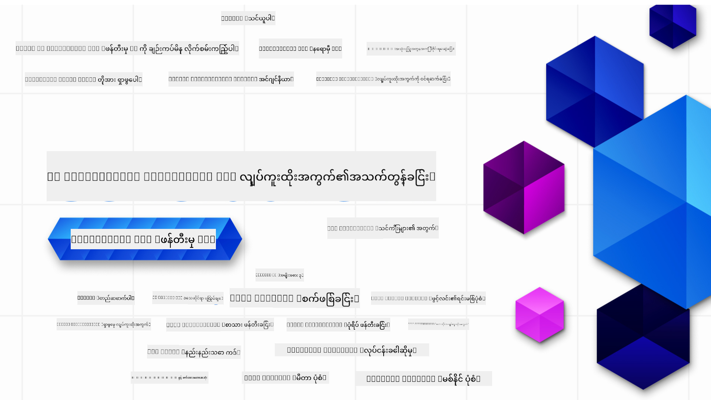

<!--
CO_OP_TRANSLATOR_METADATA:
{
  "original_hash": "ca2afa136ed9aca0634f39f51239746e",
  "translation_date": "2025-08-27T09:01:46+00:00",
  "source_file": "README.md",
  "language_code": "my"
}
-->

### ၂၁ မျိုးဆက်သစ် AI အက်ပလီကေးရှင်းများ တည်ဆောက်ရန် လိုအပ်သော အရာများကို သင်ကြားပေးမည့် သင်ခန်းစာများ

  
  
  
  
  

  
  
  

  

### 🌐 ဘာသာစကားများ အထောက်အပံ့

#### GitHub Action မှတဆင့် အလိုအလျောက် (အမြဲနောက်ဆုံးပေါ်)

[French](../fr/README.md) | [Spanish](../es/README.md) | [German](../de/README.md) | [Russian](../ru/README.md) | [Arabic](../ar/README.md) | [Persian (Farsi)](../fa/README.md) | [Urdu](../ur/README.md) | [Chinese (Simplified)](../zh/README.md) | [Chinese (Traditional, Macau)](../mo/README.md) | [Chinese (Traditional, Hong Kong)](../hk/README.md) | [Chinese (Traditional, Taiwan)](../tw/README.md) | [Japanese](../ja/README.md) | [Korean](../ko/README.md) | [Hindi](../hi/README.md) | [Bengali](../bn/README.md) | [Marathi](../mr/README.md) | [Nepali](../ne/README.md) | [Punjabi (Gurmukhi)](../pa/README.md) | [Portuguese (Portugal)](../pt/README.md) | [Portuguese (Brazil)](../br/README.md) | [Italian](../it/README.md) | [Lithuanian](../lt/README.md) | [Polish](../pl/README.md) | [Turkish](../tr/README.md) | [Greek](../el/README.md) | [Thai](../th/README.md) | [Swedish](../sv/README.md) | [Danish](../da/README.md) | [Norwegian](../no/README.md) | [Finnish](../fi/README.md) | [Dutch](../nl/README.md) | [Hebrew](../he/README.md) | [Vietnamese](../vi/README.md) | [Indonesian](../id/README.md) | [Malay](../ms/README.md) | [Tagalog (Filipino)](../tl/README.md) | [Swahili](../sw/README.md) | [Hungarian](../hu/README.md) | [Czech](../cs/README.md) | [Slovak](../sk/README.md) | [Romanian](../ro/README.md) | [Bulgarian](../bg/README.md) | [Serbian (Cyrillic)](../sr/README.md) | [Croatian](../hr/README.md) | [Slovenian](../sl/README.md) | [Ukrainian](../uk/README.md) | [Burmese (Myanmar)](./README.md)  

# မျိုးဆက်သစ် AI အတွက် စတင်သူများ (Version 3) - သင်တန်း

Microsoft Cloud Advocates မှ တင်ဆက်သည့် ၂၁ သင်ခန်းစာများဖြင့် မျိုးဆက်သစ် AI အက်ပလီကေးရှင်းများ တည်ဆောက်ခြင်း၏ အခြေခံအချက်များကို သင်ယူပါ။

## 🌱 စတင်ရန်

ဒီသင်တန်းတွင် ၂၁ သင်ခန်းစာများ ပါဝင်သည်။ သင်ခန်းစာတိုင်းသည် မိမိ၏ အကြောင်းအရာကို ဖော်ပြထားသောကြောင့် သင်စိတ်ဝင်စားရာမှ စတင်နိုင်ပါသည်။

သင်ခန်းစာများကို "Learn" သင်ခန်းစာများ (မျိုးဆက်သစ် AI အကြောင်းအရာများကို ရှင်းပြခြင်း) သို့မဟုတ် "Build" သင်ခန်းစာများ (အကြောင်းအရာနှင့် Python နှင့် TypeScript ကို အသုံးပြုထားသော ကုဒ်နမူနာများကို ရှင်းပြခြင်း) အဖြစ် သတ်မှတ်ထားသည်။

.NET Developer များအတွက် [Generative AI for Beginners (.NET Edition)](https://github.com/microsoft/Generative-AI-for-beginners-dotnet?WT.mc_id=academic-105485-koreyst) ကို ကြည့်ပါ။

သင်ခန်းစာတိုင်းတွင် "Keep Learning" အပိုင်းပါဝင်ပြီး ထပ်မံသင်ယူရန် အထောက်အကူပြုသော အရင်းအမြစ်များကို ထည့်သွင်းထားသည်။

## လိုအပ်သောအရာများ
### ဒီသင်တန်း၏ ကုဒ်များကို အလုပ်လုပ်စေလိုပါက သင်အောက်ပါအရာများကို အသုံးပြုနိုင်သည် -  
 - [Azure OpenAI Service](https://aka.ms/genai-beginners/azure-open-ai?WT.mc_id=academic-105485-koreyst) - **သင်ခန်းစာများ:** "aoai-assignment"  
 - [GitHub Marketplace Model Catalog](https://aka.ms/genai-beginners/gh-models?WT.mc_id=academic-105485-koreyst) - **သင်ခန်းစာများ:** "githubmodels"  
 - [OpenAI API](https://aka.ms/genai-beginners/open-ai?WT.mc_id=academic-105485-koreyst) - **သင်ခန်းစာများ:** "oai-assignment"  

- Python သို့မဟုတ် TypeScript အခြေခံအသိရှိခြင်း အထောက်အကူဖြစ်သည် - \*အခြေခံစတင်သူများအတွက် [Python](https://aka.ms/genai-beginners/python?WT.mc_id=academic-105485-koreyst) နှင့် [TypeScript](https://aka.ms/genai-beginners/typescript?WT.mc_id=academic-105485-koreyst) သင်တန်းများကို ကြည့်ပါ  
- GitHub အကောင့်တစ်ခုရှိရန် လိုအပ်သည် [ဒီ repo အား fork လုပ်ရန်](https://aka.ms/genai-beginners/github?WT.mc_id=academic-105485-koreyst)  

သင်၏ ဖွံ့ဖြိုးရေးပတ်ဝန်းကျင်ကို စတင်ဖွဲ့စည်းရန် အကူအညီပေးမည့် **[Course Setup](./00-course-setup/README.md?WT.mc_id=academic-105485-koreyst)** သင်ခန်းစာကို ဖန်တီးထားပါသည်။

နောက်ပိုင်းတွင် လွယ်ကူစွာ ရှာဖွေရန် [ဒီ repo ကို star (🌟)](https://docs.github.com/en/get-started/exploring-projects-on-github/saving-repositories-with-stars?WT.mc_id=academic-105485-koreyst) လုပ်ရန် မမေ့ပါနှင့်။

## 🧠 Deploy ပြင်ဆင်ပြီးပြီလား?

ပိုမိုအဆင့်မြင့်သော ကုဒ်နမူနာများကို ရှာဖွေနေပါက [Generative AI Code Samples](https://aka.ms/genai-beg-code?WT.mc_id=academic-105485-koreyst) ကို ကြည့်ပါ။ Python နှင့် TypeScript နှစ်မျိုးလုံးတွင် ရရှိနိုင်ပါသည်။

## 🗣️ အခြားသင်ယူသူများနှင့် တွေ့ဆုံရန်၊ အထောက်အပံ့ရရန်

ဒီသင်တန်းကို လက်ခံနေသော အခြားသင်ယူသူများနှင့် တွေ့ဆုံရန်နှင့် အထောက်အပံ့ရရန် [Azure AI Foundry Discord server](https://aka.ms/genai-discord?WT.mc_id=academic-105485-koreyst) ကို ဝင်ပါ။

GitHub တွင် [Azure AI Foundry Developer Forum](https://aka.ms/azureaifoundry/forum) တွင် မေးခွန်းများမေးရန် သို့မဟုတ် ထုတ်ကုန်အကြံပြုချက်များကို မျှဝေရန်။

## 🚀 စတင်တည်ထောင်လိုပါသလား?

[Microsoft for Startups](https://www.microsoft.com/startups) သို့ သွားပါက Azure credits ဖြင့် စတင်တည်ဆောက်ရန် အကြံပြုချက်များကို ရရှိနိုင်ပါသည်။

## 🙏 အကူအညီပေးလိုပါသလား?

အကြံပြုချက်များရှိပါသလား၊ သို့မဟုတ် စာလုံးပေါင်းအမှားများ သို့မဟုတ် ကုဒ်အမှားများ ရှာဖွေတွေ့ရှိပါသလား? [Issue တစ်ခုတင်ပါ](https://github.com/microsoft/generative-ai-for-beginners/issues?WT.mc_id=academic-105485-koreyst) သို့မဟုတ် [Pull request တစ်ခုဖန်တီးပါ](https://github.com/microsoft/generative-ai-for-beginners/pulls?WT.mc_id=academic-105485-koreyst)  

## 📂 သင်ခန်းစာတစ်ခုစီတွင် ပါဝင်သည် -

- အကြောင်းအရာအတွက် အတိုချုံးဗီဒီယိုတစ်ခု  
- README တွင် ရေးသားထားသော သင်ခန်းစာ  
- Azure OpenAI နှင့် OpenAI API ကို ထောက်ပံ့သည့် Python နှင့် TypeScript ကုဒ်နမူနာများ  
- သင်ယူမှုကို ဆက်လက်လုပ်ဆောင်ရန် အရင်းအမြစ်များကို ချိတ်ဆက်ထားသည်  

## 🗃️ သင်ခန်းစာများ

| #   | **သင်ခန်းစာလင့်ခ်**                                                                                                                              | **ဖော်ပြချက်**                                                                                 | **ဗီဒီယို**                                                                   | **အပိုသင်ယူမှု**                                                             |
| --- | -------------------------------------------------------------------------------------------------------------------------------------------- | ----------------------------------------------------------------------------------------------- | --------------------------------------------------------------------------- | ------------------------------------------------------------------------------ |
| 00  | [Course Setup](./00-course-setup/README.md?WT.mc_id=academic-105485-koreyst)                                                                 | **သင်ယူပါ:** ဖွံ့ဖြိုးရေးပတ်ဝန်းကျင်ကို စတင်ဖွဲ့စည်းရန်                                            | Video Coming Soon                                                                 | [Learn More](https://aka.ms/genai-collection?WT.mc_id=academic-105485-koreyst) |
| 01  | [Introduction to Generative AI and LLMs](./01-introduction-to-genai/README.md?WT.mc_id=academic-105485-koreyst)                              | **သင်ယူပါ:** မျိုးဆက်သစ် AI သည် အဘယ်နည်း၊ LLM များသည် မည်သို့အလုပ်လုပ်သည်ကို နားလည်ခြင်း။       | [Video](https://aka.ms/gen-ai-lesson-1-gh?WT.mc_id=academic-105485-koreyst) | [Learn More](https://aka.ms/genai-collection?WT.mc_id=academic-105485-koreyst) |
| 02  | [Exploring and comparing different LLMs](./02-exploring-and-comparing-different-llms/README.md?WT.mc_id=academic-105485-koreyst)             | **သင်ယူပါ:** သင့်အသုံးပြုမှုအတွက် မှန်ကန်သော မော်ဒယ်ကို ရွေးချယ်နည်း                                      | [Video](https://aka.ms/gen-ai-lesson2-gh?WT.mc_id=academic-105485-koreyst)  | [Learn More](https://aka.ms/genai-collection?WT.mc_id=academic-105485-koreyst) |
| 03  | [Using Generative AI Responsibly](./03-using-generative-ai-responsibly/README.md?WT.mc_id=academic-105485-koreyst)                           | **သင်ယူပါ:** မျိုးဆက်သစ် AI အက်ပလီကေးရှင်းများကို တာဝန်ရှိစွာ တည်ဆောက်နည်း                                  | [Video](https://aka.ms/gen-ai-lesson3-gh?WT.mc_id=academic-105485-koreyst)  | [Learn More](https://aka.ms/genai-collection?WT.mc_id=academic-105485-koreyst) |
| 04  | [Understanding Prompt Engineering Fundamentals](./04-prompt-engineering-fundamentals/README.md?WT.mc_id=academic-105485-koreyst)             | **သင်ယူပါ:** Prompt Engineering အကောင်းဆုံးလေ့ကျင့်မှုများကို လက်တွေ့ကျကျ သင်ယူခြင်း                                           | [Video](https://aka.ms/gen-ai-lesson4-gh?WT.mc_id=academic-105485-koreyst)  | [Learn More](https://aka.ms/genai-collection?WT.mc_id=academic-105485-koreyst) |
| 05  | [Creating Advanced Prompts](./05-advanced-prompts/README.md?WT.mc_id=academic-105485-koreyst)                                                | **သင်ယူပါ:** သင့် Prompt များ၏ ရလဒ်ကို တိုးတက်စေမည့် Prompt Engineering နည်းလမ်းများကို အသုံးချခြင်း | [Video](https://aka.ms/gen-ai-lesson5-gh?WT.mc_id=academic-105485-koreyst)  | [Learn More](https://aka.ms/genai-collection?WT.mc_id=academic-105485-koreyst) |  
| 06  | [စာသားထုတ်လုပ်မှု အက်ပ်များ တည်ဆောက်ခြင်း](./06-text-generation-apps/README.md?WT.mc_id=academic-105485-koreyst)                                | **တည်ဆောက်ရန်:** Azure OpenAI / OpenAI API ကို အသုံးပြု၍ စာသားထုတ်လုပ်မှု အက်ပ်တစ်ခု တည်ဆောက်ပါ                                | [ဗီဒီယို](https://aka.ms/gen-ai-lesson6-gh?WT.mc_id=academic-105485-koreyst)  | [ပိုမိုလေ့လာရန်](https://aka.ms/genai-collection?WT.mc_id=academic-105485-koreyst) |
| 07  | [Chat အက်ပ်များ တည်ဆောက်ခြင်း](./07-building-chat-applications/README.md?WT.mc_id=academic-105485-koreyst)                                     | **တည်ဆောက်ရန်:** Chat အက်ပ်များကို ထိရောက်စွာ တည်ဆောက်ခြင်းနှင့် ပေါင်းစည်းခြင်းနည်းလမ်းများ               | [ဗီဒီယို](https://aka.ms/gen-ai-lessons7-gh?WT.mc_id=academic-105485-koreyst) | [ပိုမိုလေ့လာရန်](https://aka.ms/genai-collection?WT.mc_id=academic-105485-koreyst) |
| 08  | [Search အက်ပ်များနှင့် Vector Databases တည်ဆောက်ခြင်း](./08-building-search-applications/README.md?WT.mc_id=academic-105485-koreyst)                        | **တည်ဆောက်ရန်:** Embeddings ကို အသုံးပြု၍ ဒေတာရှာဖွေမှု အက်ပ်တစ်ခု တည်ဆောက်ပါ                        | [ဗီဒီယို](https://aka.ms/gen-ai-lesson8-gh?WT.mc_id=academic-105485-koreyst)  | [ပိုမိုလေ့လာရန်](https://aka.ms/genai-collection?WT.mc_id=academic-105485-koreyst) |
| 09  | [ပုံထုတ်လုပ်မှု အက်ပ်များ တည်ဆောက်ခြင်း](./09-building-image-applications/README.md?WT.mc_id=academic-105485-koreyst)                        | **တည်ဆောက်ရန်:** ပုံထုတ်လုပ်မှု အက်ပ်တစ်ခု                                                       | [ဗီဒီယို](https://aka.ms/gen-ai-lesson9-gh?WT.mc_id=academic-105485-koreyst)  | [ပိုမိုလေ့လာရန်](https://aka.ms/genai-collection?WT.mc_id=academic-105485-koreyst) |
| 10  | [Low Code AI အက်ပ်များ တည်ဆောက်ခြင်း](./10-building-low-code-ai-applications/README.md?WT.mc_id=academic-105485-koreyst)                       | **တည်ဆောက်ရန်:** Low Code tools များကို အသုံးပြု၍ Generative AI အက်ပ်တစ်ခု တည်ဆောက်ပါ                                     | [ဗီဒီယို](https://aka.ms/gen-ai-lesson10-gh?WT.mc_id=academic-105485-koreyst) | [ပိုမိုလေ့လာရန်](https://aka.ms/genai-collection?WT.mc_id=academic-105485-koreyst) |
| 11  | [Function Calling ဖြင့် ပြင်ပ အက်ပ်များ ပေါင်းစည်းခြင်း](./11-integrating-with-function-calling/README.md?WT.mc_id=academic-105485-koreyst) | **တည်ဆောက်ရန်:** Function calling ဆိုတာဘာလဲ၊ အက်ပ်များအတွက် ၎င်း၏ အသုံးချနိုင်မှုများ                          | [ဗီဒီယို](https://aka.ms/gen-ai-lesson11-gh?WT.mc_id=academic-105485-koreyst) | [ပိုမိုလေ့လာရန်](https://aka.ms/genai-collection?WT.mc_id=academic-105485-koreyst) |
| 12  | [AI အက်ပ်များအတွက် UX ဒီဇိုင်းရေးဆွဲခြင်း](./12-designing-ux-for-ai-applications/README.md?WT.mc_id=academic-105485-koreyst)                         | **လေ့လာရန်:** Generative AI အက်ပ်များ တည်ဆောက်ရာတွင် UX ဒီဇိုင်း မူဘောင်များကို အသုံးချနည်း         | [ဗီဒီယို](https://aka.ms/gen-ai-lesson12-gh?WT.mc_id=academic-105485-koreyst) | [ပိုမိုလေ့လာရန်](https://aka.ms/genai-collection?WT.mc_id=academic-105485-koreyst) |
| 13  | [Generative AI အက်ပ်များကို လုံခြုံစေရန်](./13-securing-ai-applications/README.md?WT.mc_id=academic-105485-koreyst)                         | **လေ့လာရန်:** AI စနစ်များအတွက် အန္တရာယ်များနှင့် လုံခြုံရေးနည်းလမ်းများ             | [ဗီဒီယို](https://aka.ms/gen-ai-lesson13-gh?WT.mc_id=academic-105485-koreyst) | [ပိုမိုလေ့လာရန်](https://aka.ms/genai-collection?WT.mc_id=academic-105485-koreyst) |
| 14  | [Generative AI အက်ပ်များ၏ အသက်ရှည်မှု စနစ်](./14-the-generative-ai-application-lifecycle/README.md?WT.mc_id=academic-105485-koreyst)           | **လေ့လာရန်:** LLM Lifecycle နှင့် LLMOps ကို စီမံခန့်ခွဲရန် ကိရိယာများနှင့် အတိုင်းအတာများ                         | [ဗီဒီယို](https://aka.ms/gen-ai-lesson14-gh?WT.mc_id=academic-105485-koreyst) | [ပိုမိုလေ့လာရန်](https://aka.ms/genai-collection?WT.mc_id=academic-105485-koreyst) |
| 15  | [Retrieval Augmented Generation (RAG) နှင့် Vector Databases](./15-rag-and-vector-databases/README.md?WT.mc_id=academic-105485-koreyst)        | **တည်ဆောက်ရန်:** RAG Framework ကို အသုံးပြု၍ Vector Databases မှ Embeddings ရယူရန် အက်ပ်တစ်ခု တည်ဆောက်ပါ  | [ဗီဒီယို](https://aka.ms/gen-ai-lesson15-gh?WT.mc_id=academic-105485-koreyst) | [ပိုမိုလေ့လာရန်](https://aka.ms/genai-collection?WT.mc_id=academic-105485-koreyst) |
| 16  | [Open Source Models နှင့် Hugging Face](./16-open-source-models/README.md?WT.mc_id=academic-105485-koreyst)                                    | **တည်ဆောက်ရန်:** Hugging Face တွင် ရရှိနိုင်သော Open Source Models များကို အသုံးပြု၍ အက်ပ်တစ်ခု တည်ဆောက်ပါ                    | [ဗီဒီယို](https://aka.ms/gen-ai-lesson16-gh?WT.mc_id=academic-105485-koreyst) | [ပိုမိုလေ့လာရန်](https://aka.ms/genai-collection?WT.mc_id=academic-105485-koreyst) |
| 17  | [AI Agents](./17-ai-agents/README.md?WT.mc_id=academic-105485-koreyst)                                                                       | **တည်ဆောက်ရန်:** AI Agent Framework ကို အသုံးပြု၍ အက်ပ်တစ်ခု တည်ဆောက်ပါ                                           | [ဗီဒီယို](https://aka.ms/gen-ai-lesson17-gh?WT.mc_id=academic-105485-koreyst) | [ပိုမိုလေ့လာရန်](https://aka.ms/genai-collection?WT.mc_id=academic-105485-koreyst) |
| 18  | [LLMs များကို Fine-Tuning ပြုလုပ်ခြင်း](./18-fine-tuning/README.md?WT.mc_id=academic-105485-koreyst)                                                              | **လေ့လာရန်:** LLMs များကို Fine-Tuning ပြုလုပ်ခြင်း၏ အဓိပ္ပါယ်၊ အကြောင်းရင်းနှင့် နည်းလမ်းများ                                            | [ဗီဒီယို](https://aka.ms/gen-ai-lesson18-gh?WT.mc_id=academic-105485-koreyst) | [ပိုမိုလေ့လာရန်](https://aka.ms/genai-collection?WT.mc_id=academic-105485-koreyst) |
| 19  | [SLMs ဖြင့် တည်ဆောက်ခြင်း](./19-slm/README.md?WT.mc_id=academic-105485-koreyst)                                                              | **လေ့လာရန်:** Small Language Models (SLMs) ဖြင့် တည်ဆောက်ခြင်း၏ အကျိုးကျေးဇူးများ                                            | Video Coming Soon | [ပိုမိုလေ့လာရန်](https://aka.ms/genai-collection?WT.mc_id=academic-105485-koreyst) |
| 20  | [Mistral Models ဖြင့် တည်ဆောက်ခြင်း](./20-mistral/README.md?WT.mc_id=academic-105485-koreyst)                                                              | **လေ့လာရန်:** Mistral မိသားစု Models များ၏ အင်္ဂါရပ်များနှင့် ကွဲပြားချက်များ                                           | Video Coming Soon | [ပိုမိုလေ့လာရန်](https://aka.ms/genai-collection?WT.mc_id=academic-105485-koreyst) |
| 21  | [Meta Models ဖြင့် တည်ဆောက်ခြင်း](./21-meta/README.md?WT.mc_id=academic-105485-koreyst)                                                              | **လေ့လာရန်:** Meta မိသားစု Models များ၏ အင်္ဂါရပ်များနှင့် ကွဲပြားချက်များ                                           | Video Coming Soon | [ပိုမိုလေ့လာရန်](https://aka.ms/genai-collection?WT.mc_id=academic-105485-koreyst) |

### 🌟 အထူးကျေးဇူးတင်ပါသည်

GitHub Actions နှင့် workflows များအားလုံးကို ဖန်တီးပေးသည့် [**John Aziz**](https://www.linkedin.com/in/john0isaac/) ကို အထူးကျေးဇူးတင်ပါသည်။

သင်ခန်းစာတစ်ခုချင်းစီအတွက် သင်ယူသူနှင့် ကုဒ်အတွေ့အကြုံကို တိုးတက်စေရန် အဓိကအထောက်အကူပြုခဲ့သည့် [**Bernhard Merkle**](https://www.linkedin.com/in/bernhard-merkle-738b73/) ကိုလည်း ကျေးဇူးတင်ပါသည်။

## 🎒 အခြားသင်တန်းများ

ကျွန်ုပ်တို့၏အဖွဲ့သည် အခြားသင်တန်းများကိုလည်း ထုတ်လုပ်ပါသည်! စစ်ဆေးကြည့်ပါ-

- [**အသစ်** Model Context Protocol for Beginners](https://github.com/microsoft/mcp-for-beginners)
- [AI Agents for Beginners](https://github.com/microsoft/ai-agents-for-beginners)
- [Generative AI for Beginners using .NET](https://github.com/microsoft/Generative-AI-for-beginners-dotnet)
- [Generative AI for Beginners using JavaScript](https://aka.ms/genai-js-course)
- [Generative AI for Beginners using Java](https://aka.ms/genaijava)
- [ML for Beginners](https://aka.ms/ml-beginners)
- [Data Science for Beginners](https://aka.ms/datascience-beginners)
- [AI for Beginners](https://aka.ms/ai-beginners)
- [Cybersecurity for Beginners](https://github.com/microsoft/Security-101)
- [Web Dev for Beginners](https://aka.ms/webdev-beginners)
- [IoT for Beginners](https://aka.ms/iot-beginners)
- [XR Development for Beginners](https://github.com/microsoft/xr-development-for-beginners)
- [Mastering GitHub Copilot for AI Paired Programming](https://aka.ms/GitHubCopilotAI)
- [Mastering GitHub Copilot for C#/.NET Developers](https://github.com/microsoft/mastering-github-copilot-for-dotnet-csharp-developers)
- [Choose Your Own Copilot Adventure](https://github.com/microsoft/CopilotAdventures)

---

**ဝက်ဘ်ဆိုက်မှတ်ချက်**:  
ဤစာရွက်စာတမ်းကို AI ဘာသာပြန်ဝန်ဆောင်မှု [Co-op Translator](https://github.com/Azure/co-op-translator) ကို အသုံးပြု၍ ဘာသာပြန်ထားပါသည်။ ကျွန်ုပ်တို့သည် တိကျမှန်ကန်မှုအတွက် ကြိုးစားနေပါသော်လည်း၊ အလိုအလျောက်ဘာသာပြန်မှုများတွင် အမှားများ သို့မဟုတ် မမှန်ကန်မှုများ ပါဝင်နိုင်သည်ကို သတိပြုပါ။ မူရင်းစာရွက်စာတမ်းကို ၎င်း၏ မူလဘာသာစကားဖြင့် အာဏာတည်သောရင်းမြစ်အဖြစ် သတ်မှတ်သင့်ပါသည်။ အရေးကြီးသော အချက်အလက်များအတွက် လူ့ဘာသာပြန်ပညာရှင်များမှ ပြန်ဆိုမှုကို အကြံပြုပါသည်။ ဤဘာသာပြန်မှုကို အသုံးပြုခြင်းမှ ဖြစ်ပေါ်လာသည့် နားလည်မှုမှားများ သို့မဟုတ် အဓိပ္ပာယ်မှားများအတွက် ကျွန်ုပ်တို့သည် တာဝန်မယူပါ။