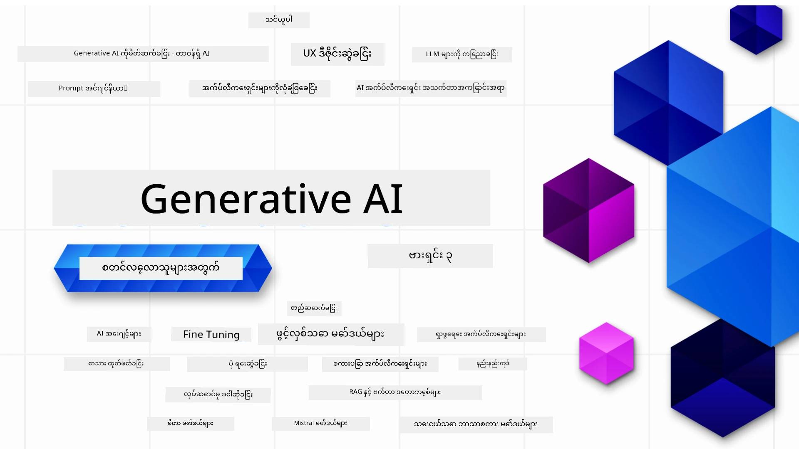

### Generative AI အက်ပလီကေးရှင်းများတည်ဆောက်ရန် အခြေခံလိုအပ်သည့် အရာအားလုံးကို သင်ကြားပေးမည့် ၂၁ ခန်းစာများ

[](https://github.com/microsoft/Generative-AI-For-Beginners/blob/master/LICENSE?WT.mc_id=academic-105485-koreyst)
[](https://GitHub.com/microsoft/Generative-AI-For-Beginners/graphs/contributors/?WT.mc_id=academic-105485-koreyst)
[](https://GitHub.com/microsoft/Generative-AI-For-Beginners/issues/?WT.mc_id=academic-105485-koreyst)
[](https://GitHub.com/microsoft/Generative-AI-For-Beginners/pulls/?WT.mc_id=academic-105485-koreyst)
[](http://makeapullrequest.com?WT.mc_id=academic-105485-koreyst)

[](https://GitHub.com/microsoft/Generative-AI-For-Beginners/watchers/?WT.mc_id=academic-105485-koreyst)
[](https://GitHub.com/microsoft/Generative-AI-For-Beginners/network/?WT.mc_id=academic-105485-koreyst)
[](https://GitHub.com/microsoft/Generative-AI-For-Beginners/stargazers/?WT.mc_id=academic-105485-koreyst)

[](https://discord.gg/nTYy5BXMWG)

### 🌐 ဘာသာစကားစုံကို ထောက်ပံ့ပါသည်

#### GitHub Action မှတဆင့် ထောက်ပံ့ပြီး (အလိုအလျောက်လုပ်ဆောင်နှင့် အမြဲအသစ်ဆုံး)

<!-- CO-OP TRANSLATOR LANGUAGES TABLE START -->
[Arabic](../ar/README.md) | [Bengali](../bn/README.md) | [Bulgarian](../bg/README.md) | [Burmese (Myanmar)](./README.md) | [Chinese (Simplified)](../zh-CN/README.md) | [Chinese (Traditional, Hong Kong)](../zh-HK/README.md) | [Chinese (Traditional, Macau)](../zh-MO/README.md) | [Chinese (Traditional, Taiwan)](../zh-TW/README.md) | [Croatian](../hr/README.md) | [Czech](../cs/README.md) | [Danish](../da/README.md) | [Dutch](../nl/README.md) | [Estonian](../et/README.md) | [Finnish](../fi/README.md) | [French](../fr/README.md) | [German](../de/README.md) | [Greek](../el/README.md) | [Hebrew](../he/README.md) | [Hindi](../hi/README.md) | [Hungarian](../hu/README.md) | [Indonesian](../id/README.md) | [Italian](../it/README.md) | [Japanese](../ja/README.md) | [Kannada](../kn/README.md) | [Khmer](../km/README.md) | [Korean](../ko/README.md) | [Lithuanian](../lt/README.md) | [Malay](../ms/README.md) | [Malayalam](../ml/README.md) | [Marathi](../mr/README.md) | [Nepali](../ne/README.md) | [Nigerian Pidgin](../pcm/README.md) | [Norwegian](../no/README.md) | [Persian (Farsi)](../fa/README.md) | [Polish](../pl/README.md) | [Portuguese (Brazil)](../pt-BR/README.md) | [Portuguese (Portugal)](../pt-PT/README.md) | [Punjabi (Gurmukhi)](../pa/README.md) | [Romanian](../ro/README.md) | [Russian](../ru/README.md) | [Serbian (Cyrillic)](../sr/README.md) | [Slovak](../sk/README.md) | [Slovenian](../sl/README.md) | [Spanish](../es/README.md) | [Swahili](../sw/README.md) | [Swedish](../sv/README.md) | [Tagalog (Filipino)](../tl/README.md) | [Tamil](../ta/README.md) | [Telugu](../te/README.md) | [Thai](../th/README.md) | [Turkish](../tr/README.md) | [Ukrainian](../uk/README.md) | [Urdu](../ur/README.md) | [Vietnamese](../vi/README.md)

> **တစ်ကိုယ်တော် ကလုံလုပ်ချင်ပါသလား?**
>
> ဒီ repository မှာ ဘာသာစကား ၅၀ ကျော် အပြောင်းအလဲများပါဝင်တဲ့ကြောင့် ဒေါင်းလုတ်အရွယ်အစားလည်း စုစုပေါင်း ကြီးမားပါတယ်။ ဘာသာပြန်ချက် မပါဘဲ clone လုပ်ချင်ရင် sparse checkout ကို သုံးပါ။
>
> **Bash / macOS / Linux:**
> ```bash
> git clone --filter=blob:none --sparse https://github.com/microsoft/generative-ai-for-beginners.git
> cd generative-ai-for-beginners
> git sparse-checkout set --no-cone '/*' '!translations' '!translated_images'
> ```
>
> **CMD (Windows):**
> ```cmd
> git clone --filter=blob:none --sparse https://github.com/microsoft/generative-ai-for-beginners.git
> cd generative-ai-for-beginners
> git sparse-checkout set --no-cone "/*" "!translations" "!translated_images"
> ```
>
> ဒီနည်းလမ်းနဲ့ သင်ဟာ အတန်းလေ့လာရန် လိုအပ်သော အရာများအားလုံးကို ပိုမြန်ဆန်စွာ ရယူနိုင်မှာ ဖြစ်ပါတယ်။
<!-- CO-OP TRANSLATOR LANGUAGES TABLE END -->

# Generative AI for Beginners (ဗားရှင်း ၃) - သင်တန်း

Microsoft Cloud Advocates က မိတ်ဆက်ပေးသည့် Generative AI အက်ပလီကေးရှင်းများ တည်ဆောက်ခြင်း အခြေခံများကို များစွာနှင့် သင်ကြားပေးသည့် ၂၁ ခန်းစာ သင်တန်း။

## 🌱 စတင် လေ့လာခြင်း

ဒီသင်တန်းမှာ ၂၁ ခန်းစာပါဝင်သည်။ ခန်းစာတိုင်းမှာ သူ့ကိုယ်ပိုင်ခေါင်းစဉ်ရှိတဲ့အတွက် စိတ်ဝင်စားရာနေရာမွ စတင်ကြပါ။

ခန်းစာတွေကို "Learn" ဆိုပြီး Generative AI နက်နဲတယ် ဆိုတဲ့ အကြောင်းအရာများကို ရှင်းပြပေးတာ၊ "Build" ဆိုပြီး အကြောင်းအရာ နဲ့အတူ Python နှင့် TypeScript နှစ်မျိုးလုံးဖြင့် ဥပမာကုဒ်လည်း ဖော်ပြပေးခြင်း ဖြစ်ပါတယ် (ဖြစ်နိုင်လျှင်)။

.NET Developer များအတွက် [Generative AI for Beginners (.NET Edition)](https://github.com/microsoft/Generative-AI-for-beginners-dotnet?WT.mc_id=academic-105485-koreyst) ကိုလည်း ကြည့်ရန်ဖိတ်ခေါ်ပါတယ်။

ခန်းစာတိုင်းမှာ "Keep Learning" ဆိုပြီး အပိုသင်ယူစရာများ ပါဝင်ပါတယ်။

## သင့်အတွက် လိုအပ်သော အရာများ
### သင်တန်းကို ကုဒ်များ ညွှန်ကြားရန် အရပ်ရပ်မှ အသုံးပြုနိုင်သည်-
 - [Azure OpenAI Service](https://aka.ms/genai-beginners/azure-open-ai?WT.mc_id=academic-105485-koreyst) - **ခန်းစာများ:** "aoai-assignment"
 - [GitHub Marketplace Model Catalog](https://aka.ms/genai-beginners/gh-models?WT.mc_id=academic-105485-koreyst) - **ခန်းစာများ:** "githubmodels"
 - [OpenAI API](https://aka.ms/genai-beginners/open-ai?WT.mc_id=academic-105485-koreyst) - **ခန်းစာများ:** "oai-assignment" 
   
- Python သို့မဟုတ် TypeScript အခြေခံ အသိပညာရှိခြင်းကူညီပါတယ် - *အလွန်အစပြုသူများအတွက် [Python](https://aka.ms/genai-beginners/python?WT.mc_id=academic-105485-koreyst) နဲ့ [TypeScript](https://aka.ms/genai-beginners/typescript?WT.mc_id=academic-105485-koreyst) သင်တန်းများကိုစတင်ကြည့်ပါ*
- GitHub အကောင့်တစ်ခုရှိပြီး [ဒီ repo ကို သင့်အကောင့်သို့ fork လုပ်ရန်](https://aka.ms/genai-beginners/github?WT.mc_id=academic-105485-koreyst)

ဖွံ့ဖြိုးရေးပတ်ဝန်းကျင်ရဲ့ စတင်လိုက်ဖို့ အတွက် ကျွန်ုပ်တို့ကြီးထွားပေးထားသော **[Course Setup](./00-course-setup/README.md?WT.mc_id=academic-105485-koreyst)** ခန်းစာရှိပါတယ်။

နောက်မှာ ရှာဖွေရန် လွယ်ကူစေရန် ဒီ repo ကို [ကြယ်ပေးခြင်း (🌟) မမေ့ပါရန်](https://docs.github.com/en/get-started/exploring-projects-on-github/saving-repositories-with-stars?WT.mc_id=academic-105485-koreyst)။

## 🧠 အသင့်ဖြစ်ပြီး Deploy လုပ်နိုင်ပြီလား?

နောက်ထပ်အဆင့်မြင့်ကုဒ်နမူနာများလိုအပ်ပါက ကျွန်ုပ်တို့၏ [Generative AI Code Samples စုစည်းမှု](https://aka.ms/genai-beg-code?WT.mc_id=academic-105485-koreyst) ကို Python နဲ့ TypeScript နှစ်မျိုးလုံးတွင်ကြည့်ရှုနိုင်ပါတယ်။

## 🗣️ အခြားအသင်းအဖွဲ့ဝင်များနှင့် တွေ့ဆုံပြီး ကူညီမှုရယူပါ

ဒီသင်တန်းကိုလေ့လာနေသူများနဲ့တွေ့ပြီး ကူညီပံ့ပိုးမှုရရန် ကျွန်ုပ်တို့၏ [တရားဝင် Azure AI Foundry Discord ဆာဗာ](https://aka.ms/genai-discord?WT.mc_id=academic-105485-koreyst) ကိုပါဝင်ဆက်သွယ်ပါ။

Github ပေါ်မိန့်ကြားသည့် အကြောင်းအရာများ သို့မဟုတ် ထုတ်ကုန်တုံ့ပြန်ချက်များကို ကျွန်ုပ်တို့၏ [Azure AI Foundry Developer Forum](https://aka.ms/azureaifoundry/forum) တွင် မေးမြန်းနိုင်ပါသည်။

## 🚀 စတင်ရေးလုပ်ငန်းတည်ထောင်နေပါသလား?

Azure ခရက်ဒစ်များဖြင့် စတင်ရန် စိတ်ဝင်စားပါက [Microsoft for Startups](https://www.microsoft.com/startups) ကို သွားရောက်ကြည့်ရှုပါ။

## 🙏 ကူညီချင်ပါသလား?

အကြံပြုချက်များ၊ အမှားများ ရှာဖွေတွေ့ရှိခဲ့ပါသလား? [ပြဿနာတင်ရန်](https://github.com/microsoft/generative-ai-for-beginners/issues?WT.mc_id=academic-105485-koreyst) သို့မဟုတ် [pull request တင်ရန်](https://github.com/microsoft/generative-ai-for-beginners/pulls?WT.mc_id=academic-105485-koreyst)။

## 📂 ခန်းစာတိုင်းတွင် ပါဝင်သည့် အကြောင်းအရာများ

- ခေါင်းစဉ်အရ ဗီဒီယိုမိတ်ဆက်တို
- README အတွင်း ရေးသားထားသော ခန်းစာ
- Azure OpenAI နှင့် OpenAI API အတွက် Python နဲ့ TypeScript ကုဒ်နမူနာများ
- သင်ယူမှုဆက်လက်တိုးတက်စေရန် အပိုရင်းမြစ်များသို့ ချိတ်ဆက်ထားခြင်း

## 🗃️ ခန်းစာများ

| #   | **ခန်းစာလင့်ခ်**                                                                                                                              | **ဖော်ပြချက်**                                                                                 | **ဗီဒီယို**                                                                   | **အပိုသင်ယူမှု**                                                             |
| --- | -------------------------------------------------------------------------------------------------------------------------------------------- | ----------------------------------------------------------------------------------------------- | --------------------------------------------------------------------------- | ------------------------------------------------------------------------------ |
| 00  | [Course Setup](./00-course-setup/README.md?WT.mc_id=academic-105485-koreyst)                                                                 | **သင်ယူရန်:** သင့်ဖွံ့ဖြိုးရေးပတ်ဝန်းကျင်ကို မည်သို့ စတင်တည်ဆောက်ရမည်ကို ရှင်းပြပေးခြင်း                                            | ဗီဒီယို မကြာမီ ရရှိမည်                                                                  | [ပိုသိရန်](https://aka.ms/genai-collection?WT.mc_id=academic-105485-koreyst) |
| 01  | [Generative AI နှင့် LLM များနှင့် စိတ်ဖြတ်မှု](./01-introduction-to-genai/README.md?WT.mc_id=academic-105485-koreyst)                              | **သင်ယူရန်:** Generative AI ဆိုတာ ဘာလဲ၊ Large Language Models (LLMs) များ အလုပ်လုပ်ပုံကို နားလည်ခြင်း       | [ဗီဒီယို](https://aka.ms/gen-ai-lesson-1-gh?WT.mc_id=academic-105485-koreyst) | [ပိုသိရန်](https://aka.ms/genai-collection?WT.mc_id=academic-105485-koreyst) |
| 02  | [အမျိုးမျိုးသော LLM များကို စူးစမ်းခြင်းနှင့် နှိုင်းယှဉ်ခြင်း](./02-exploring-and-comparing-different-llms/README.md?WT.mc_id=academic-105485-koreyst)             | **သင်ယူရန်:** သင်တစ်ဆင့် သုံးမည့် မော်ဒယ်ကို မည်သို့ ရွေးချယ်ရမည်ကို ရှင်းလင်းခြင်း                                      | [ဗီဒီယို](https://aka.ms/gen-ai-lesson2-gh?WT.mc_id=academic-105485-koreyst)  | [ပိုသိရန်](https://aka.ms/genai-collection?WT.mc_id=academic-105485-koreyst) |
| 03  | [Generative AI ကို တာဝန်ပေးမှု ယုံကြည်စိတ်ချစွာ အသုံးပြုခြင်း](./03-using-generative-ai-responsibly/README.md?WT.mc_id=academic-105485-koreyst)                           | **သင်ယူရန်:** Generative AI အက်ပလီကေးရှင်းများကို တာဝန်ရှိစွာ တည်ဆောက်ခြင်း                                  | [ဗီဒီယို](https://aka.ms/gen-ai-lesson3-gh?WT.mc_id=academic-105485-koreyst)  | [ပိုသိရန်](https://aka.ms/genai-collection?WT.mc_id=academic-105485-koreyst) |
| 04  | [Prompt Engineering အခြေခံများနားလည်ခြင်း](./04-prompt-engineering-fundamentals/README.md?WT.mc_id=academic-105485-koreyst)             | **သင်ယူပါ:** လက်တွေ့ Prompt Engineering အကောင်းဆုံး လေ့လာမှုများ                                           | [ဗီဒီယို](https://aka.ms/gen-ai-lesson4-gh?WT.mc_id=academic-105485-koreyst)  | [နောက်ထပ် သင်ယူရန်](https://aka.ms/genai-collection?WT.mc_id=academic-105485-koreyst) |
| 05  | [အဆင့်မြင့် Prompts ဖန်တီးခြင်း](./05-advanced-prompts/README.md?WT.mc_id=academic-105485-koreyst)                                                | **သင်ယူပါ:** မိမိရဲ့ prompts ရလဒ်တိုးတက်စေရန် prompt engineering နည်းပညာများ အသုံးပြုနည်း။ | [ဗီဒီယို](https://aka.ms/gen-ai-lesson5-gh?WT.mc_id=academic-105485-koreyst)  | [နောက်ထပ် သင်ယူရန်](https://aka.ms/genai-collection?WT.mc_id=academic-105485-koreyst) |
| 06  | [စာသားထုတ်လုပ်မှု အက်ပလီကေးရှင်းများ တည်ဆောက်ခြင်း](./06-text-generation-apps/README.md?WT.mc_id=academic-105485-koreyst)                                | **တည်ဆောက်ပါ:** Azure OpenAI / OpenAI API သုံးပြီး စာသားထုတ်လုပ်မှု အက်ပလီကေးရှင်းတစ်ခု                              | [ဗီဒီယို](https://aka.ms/gen-ai-lesson6-gh?WT.mc_id=academic-105485-koreyst)  | [နောက်ထပ် သင်ယူရန်](https://aka.ms/genai-collection?WT.mc_id=academic-105485-koreyst) |
| 07  | [စကားပြောဆိုမှု အက်ပလီကေးရှင်းများ တည်ဆောက်ခြင်း](./07-building-chat-applications/README.md?WT.mc_id=academic-105485-koreyst)                                     | **တည်ဆောက်ပါ:** စကားပြောဆိုမှု အက်ပလီကေးရှင်းများကို ထိရောက်စွာ တည်ဆောက်ခြင်းနှင့် ပေါင်းစပ်ခြင်းနည်းပညာများ               | [ဗီဒီယို](https://aka.ms/gen-ai-lessons7-gh?WT.mc_id=academic-105485-koreyst) | [နောက်ထပ် သင်ယူရန်](https://aka.ms/genai-collection?WT.mc_id=academic-105485-koreyst) |
| 08  | [ရှာဖွေရေး အက်ပလီကေးရှင်းများ Vector Databases နဲ႔ တည်ဆောက်ခြင်း](./08-building-search-applications/README.md?WT.mc_id=academic-105485-koreyst)                        | **တည်ဆောက်ပါ:** မှတ်စုများကို အသုံးပြုပြီး ဒေတာရှာဖွေရေးအက်ပလီကေးရှင်းတစ်ခု                                | [ဗီဒီယို](https://aka.ms/gen-ai-lesson8-gh?WT.mc_id=academic-105485-koreyst)  | [နောက်ထပ် သင်ယူရန်](https://aka.ms/genai-collection?WT.mc_id=academic-105485-koreyst) |
| 09  | [ပုံထုတ်လုပ်မှု အက်ပလီကေးရှင်းများ တည်ဆောက်ခြင်း](./09-building-image-applications/README.md?WT.mc_id=academic-105485-koreyst)                        | **တည်ဆောက်ပါ:** ပုံထုတ်လုပ်မှု အက်ပလီကေးရှင်းတစ်ခု                                                       | [ဗီဒီယို](https://aka.ms/gen-ai-lesson9-gh?WT.mc_id=academic-105485-koreyst)  | [နောက်ထပ် သင်ယူရန်](https://aka.ms/genai-collection?WT.mc_id=academic-105485-koreyst) |
| 10  | [နည်းသော အခုနစ်ကုဒ် AI အက်ပလီကေးရှင်းများ တည်ဆောက်ခြင်း](./10-building-low-code-ai-applications/README.md?WT.mc_id=academic-105485-koreyst)                       | **တည်ဆောက်ပါ:** Low Code ကိရိယာများ အသုံးပြု၍ Generative AI အက်ပလီကေးရှင်းတစ်ခု                                     | [ဗီဒီယို](https://aka.ms/gen-ai-lesson10-gh?WT.mc_id=academic-105485-koreyst) | [နောက်ထပ် သင်ယူရန်](https://aka.ms/genai-collection?WT.mc_id=academic-105485-koreyst) |
| 11  | [Function Calling ဖြင့် ပြင်ပ အက်ပလီကေးရှင်းများ ပေါင်းစပ်ခြင်း](./11-integrating-with-function-calling/README.md?WT.mc_id=academic-105485-koreyst) | **တည်ဆောက်ပါ:** Function calling ဆိုတာဘာလဲ၊ အက်ပလီကေးရှင်းအတွက် အသုံးပြုမှုများ                          | [ဗီဒီယို](https://aka.ms/gen-ai-lesson11-gh?WT.mc_id=academic-105485-koreyst) | [နောက်ထပ် သင်ယူရန်](https://aka.ms/genai-collection?WT.mc_id=academic-105485-koreyst) |
| 12  | [AI အက်ပလီကေးရှင်းများအတွက် UX ဒီဇိုင်းဖန်တီးခြင်း](./12-designing-ux-for-ai-applications/README.md?WT.mc_id=academic-105485-koreyst)                         | **သင်ယူပါ:** Generative AI အက်ပလီကေးရှင်းများ ဖန်တီး့ရာတွင် UX ဒီဇိုင်း အိုင်ဒီယာများကို ထည့်သွင်းအသုံးပြုနည်း         | [ဗီဒီယို](https://aka.ms/gen-ai-lesson12-gh?WT.mc_id=academic-105485-koreyst) | [နောက်ထပ် သင်ယူရန်](https://aka.ms/genai-collection?WT.mc_id=academic-105485-koreyst) |
| 13  | [သင့် Generative AI အက်ပလီကေးရှင်းများကို လုံခြုံစေရန်](./13-securing-ai-applications/README.md?WT.mc_id=academic-105485-koreyst)                         | **သင်ယူပါ:** AI စနစ်များကို ရင်ဆိုင်ရသော အန္တရာယ်များနှင့် ထိန်းသိမ်းလုံခြုံစေဖို့နည်းလမ်းများ            | [ဗီဒီယို](https://aka.ms/gen-ai-lesson13-gh?WT.mc_id=academic-105485-koreyst) | [နောက်ထပ် သင်ယူရန်](https://aka.ms/genai-collection?WT.mc_id=academic-105485-koreyst) |
| 14  | [Generative AI အက်ပလီကေးရှင်း၏ အသက်တာစက်ဝန်း](./14-the-generative-ai-application-lifecycle/README.md?WT.mc_id=academic-105485-koreyst)           | **သင်ယူပါ:** LLM အသက်တာစက်ဝန်းနှင့် LLMOps ကို စီမံရန် ကိရိယာများနှင့် တိုင်းတာချက်များ                 | [ဗီဒီယို](https://aka.ms/gen-ai-lesson14-gh?WT.mc_id=academic-105485-koreyst) | [နောက်ထပ် သင်ယူရန်](https://aka.ms/genai-collection?WT.mc_id=academic-105485-koreyst) |
| 15  | [Retrieval Augmented Generation (RAG) နှင့် Vector Databases](./15-rag-and-vector-databases/README.md?WT.mc_id=academic-105485-koreyst)        | **တည်ဆောက်ပါ:** RAG Framework သုံးပြီး Vector Database မှ မှတ်စုများ ရယူသည့် အက်ပလီကေးရှင်းတစ်ခု  | [ဗီဒီယို](https://aka.ms/gen-ai-lesson15-gh?WT.mc_id=academic-105485-koreyst) | [နောက်ထပ် သင်ယူရန်](https://aka.ms/genai-collection?WT.mc_id=academic-105485-koreyst) |
| 16  | [Open Source Models နဲ့ Hugging Face](./16-open-source-models/README.md?WT.mc_id=academic-105485-koreyst)                                    | **တည်ဆောက်ပါ:** Hugging Face မှ open source မော်ဒယ်များ အသုံးပြု၍ အက်ပလီကေးရှင်းတစ်ခု                    | [ဗီဒီယို](https://aka.ms/gen-ai-lesson16-gh?WT.mc_id=academic-105485-koreyst) | [နောက်ထပ် သင်ယူရန်](https://aka.ms/genai-collection?WT.mc_id=academic-105485-koreyst) |
| 17  | [AI Agents](./17-ai-agents/README.md?WT.mc_id=academic-105485-koreyst)                                                                       | **တည်ဆောက်ပါ:** AI Agent Framework သုံး၍ အက်ပလီကေးရှင်းတစ်ခု                                           | [ဗီဒီယို](https://aka.ms/gen-ai-lesson17-gh?WT.mc_id=academic-105485-koreyst) | [နောက်ထပ် သင်ယူရန်](https://aka.ms/genai-collection?WT.mc_id=academic-105485-koreyst) |
| 18  | [LLMs ကို Fine-Tuning ပြုလုပ်ခြင်း](./18-fine-tuning/README.md?WT.mc_id=academic-105485-koreyst)                                                              | **သင်ယူပါ:** LLMs ကို Fine-Tuning ပြုလုပ်ရာတွင် ဘာတွေလုပ်ရမလဲ၊ အကြောင်းရင်းနှင့် နည်းလမ်းများ                      | [ဗီဒီယို](https://aka.ms/gen-ai-lesson18-gh?WT.mc_id=academic-105485-koreyst) | [နောက်ထပ် သင်ယူရန်](https://aka.ms/genai-collection?WT.mc_id=academic-105485-koreyst) |
| 19  | [SLMs ဖြင့် တည်ဆောက်ခြင်း](./19-slm/README.md?WT.mc_id=academic-105485-koreyst)                                                              | **သင်ယူပါ:** Small Language Models ဖြင့် တည်ဆောက်ခြင်း၏ အကျိုးကျေးဇူးများ                                            | အကြောင်းအရာ မကြာခင် တင်ပြမည် | [နောက်ထပ် သင်ယူရန်](https://aka.ms/genai-collection?WT.mc_id=academic-105485-koreyst) |
| 20  | [Mistral မော်ဒယ်များဖြင့် တည်ဆောက်ခြင်း](./20-mistral/README.md?WT.mc_id=academic-105485-koreyst)                                                              | **သင်ယူပါ:** Mistral မော်လီအားစုံတွင် ပါဝင်တဲ့ အင်္ဂါရပ်များနှင့် ကွာခြားချက်များ                                           | အကြောင်းအရာ မကြာခင် တင်ပြမည် | [နောက်ထပ် သင်ယူရန်](https://aka.ms/genai-collection?WT.mc_id=academic-105485-koreyst) |
| 21  | [Meta မော်ဒယ်များဖြင့် တည်ဆောက်ခြင်း](./21-meta/README.md?WT.mc_id=academic-105485-koreyst)                                                              | **သင်ယူပါ:** Meta မော်ဒယ်တန်းတူ မော်လီအားစုံတွင် ပါဝင်တဲ့ အင်္ဂါရပ်များနှင့် ကွာခြားချက်များ                                           | အကြောင်းအရာ မကြာခင် တင်ပြမည် | [နောက်ထပ် သင်ယူရန်](https://aka.ms/genai-collection?WT.mc_id=academic-105485-koreyst) |

### 🌟 အထူးကျေးဇူးများ

GitHub Actions နှင့် workflows အားလုံး ဖန်တီးပေးမှုအတွက် [**John Aziz**](https://www.linkedin.com/in/john0isaac/) သို့ အထူးကျေးဇူးတင်ရှိပါသည်။

သင်ယူသူနှင့် ကုဒ်အတွေ့အကြုံ တိုးတက်မြင့်မားလာစေရန် အတိုင်းအတာဖြစ်စေသော မဟာဗျူဟာအတန်းစာများတွင် လုပ်ဆောင်မှုပေးခဲ့သော [**Bernhard Merkle**](https://www.linkedin.com/in/bernhard-merkle-738b73/) ကိုလည်း ကျေးဇူးတင်ရှိပါသည်။  

## 🎒 အခြားသင်တန်းများ

ကျွန်ုပ်တို့အဖွဲ့သည် အခြားသင်တန်းများကိုလည်း ထုတ်လုပ်သည်! ကြည့်ရှုပြီးစစ်ဆေးပါ:

<!-- CO-OP TRANSLATOR OTHER COURSES START -->
### LangChain
[](https://aka.ms/langchain4j-for-beginners)
[](https://aka.ms/langchainjs-for-beginners?WT.mc_id=m365-94501-dwahlin)
[](https://github.com/microsoft/langchain-for-beginners?WT.mc_id=m365-94501-dwahlin)
---

### Azure / Edge / MCP / Agents
[](https://github.com/microsoft/AZD-for-beginners?WT.mc_id=academic-105485-koreyst)
[](https://github.com/microsoft/edgeai-for-beginners?WT.mc_id=academic-105485-koreyst)
[](https://github.com/microsoft/mcp-for-beginners?WT.mc_id=academic-105485-koreyst)
[](https://github.com/microsoft/ai-agents-for-beginners?WT.mc_id=academic-105485-koreyst)

---
 
### Generative AI Series
[](https://github.com/microsoft/generative-ai-for-beginners?WT.mc_id=academic-105485-koreyst)
[-9333EA?style=for-the-badge&labelColor=E5E7EB&color=9333EA)](https://github.com/microsoft/Generative-AI-for-beginners-dotnet?WT.mc_id=academic-105485-koreyst)
[-C084FC?style=for-the-badge&labelColor=E5E7EB&color=C084FC)](https://github.com/microsoft/generative-ai-for-beginners-java?WT.mc_id=academic-105485-koreyst)
[-E879F9?style=for-the-badge&labelColor=E5E7EB&color=E879F9)](https://github.com/microsoft/generative-ai-with-javascript?WT.mc_id=academic-105485-koreyst)

---
 
### အဓိက သင်ယူမှုများ
[](https://aka.ms/ml-beginners?WT.mc_id=academic-105485-koreyst)
[](https://aka.ms/datascience-beginners?WT.mc_id=academic-105485-koreyst)
[](https://aka.ms/ai-beginners?WT.mc_id=academic-105485-koreyst)
[](https://github.com/microsoft/Security-101?WT.mc_id=academic-96948-sayoung)
[](https://aka.ms/webdev-beginners?WT.mc_id=academic-105485-koreyst)
[](https://aka.ms/iot-beginners?WT.mc_id=academic-105485-koreyst)
[](https://github.com/microsoft/xr-development-for-beginners?WT.mc_id=academic-105485-koreyst)

---
 
### Copilot စီးရီး
[](https://aka.ms/GitHubCopilotAI?WT.mc_id=academic-105485-koreyst)
[](https://github.com/microsoft/mastering-github-copilot-for-dotnet-csharp-developers?WT.mc_id=academic-105485-koreyst)
[](https://github.com/microsoft/CopilotAdventures?WT.mc_id=academic-105485-koreyst)
<!-- CO-OP TRANSLATOR OTHER COURSES END -->

## အကူအညီရရန်

AI အက်ပ်များ တည်ဆောက်ရာတွင် အခက်အခဲရှိပါက သို့မဟုတ် မေးခွန်းများရှိပါက MCP များနှင့် အတူ သင်ယူသူများနှင့် အတွေ့အကြုံရှိ ဖန်တီးသူများ၏ ဆွေးနွေးပွဲများတွင် ပါဝင်ဆွေးနွေးနိုင်ပါသည်။ ၎င်းသည် မေးခွန်းများကို ကြိုဆိုပြီး အသိပညာအား လွတ်လပ်စွာမျှဝေသော အထောက်အပံ့ပေးသည့်အသိုင်းအဝိုင်း ဖြစ်ပါသည်။

[](https://discord.gg/nTYy5BXMWG)

ထုတ်ကုန် အကြံပြုချက်များ သို့မဟုတ် တည်ဆောက်ရာတွင် အမှားများရှိပါက မိမိအောက်ပါနေရာတွင် သွားရောက် ကြည့်ရှုနိုင်ပါသည်-

[](https://aka.ms/foundry/forum)

---

<!-- CO-OP TRANSLATOR DISCLAIMER START -->
**တာဝန်ပေးချက်**:  
ဤစာရွက်စာတမ်းကို AI ဘာသာပြန်မှု ဝန်ဆောင်မှုဖြစ်သည့် [Co-op Translator](https://github.com/Azure/co-op-translator) ဖြင့်ဘာသာပြန်ခဲ့ပါသည်။ ကျွန်ုပ်တို့သည်မှန်ကန်မှုအတွက်ကြိုးစားပေမယ့် အလိုအလျောက်ဘာသာပြန်ခြင်းများတွင် အမှားများ သို့မဟုတ် မှန်မှားချက်များ ရှိနိုင်ကြောင်း သတိပြုပါရန် လိုအပ်ပါသည်။ မူရင်းစာရွက်စာတမ်းကို မိမိဘာသာစကားဖြင့် အတည်ပြုရမည့် စံချိန်စံညွှန်းအဖြစ်ယူဆသင့်ပါသည်။ အရေးကြီးသော အချက်အလက်များအတွက် ကိုယ်စားပြုလူသား ဘာသာပြန်ခြင်းကို အကြံပြုပါသည်။ ဤဘာသာပြန်မှုကို အသုံးပြုခြင်းကြောင့် ဖြစ်ပေါ်လာသော နားလည်မှားခြင်းများ သို့မဟုတ် မှားကိုးคิดเห็นများအတွက် ကျွန်ုပ်တို့တာဝန်မခံပါ။
<!-- CO-OP TRANSLATOR DISCLAIMER END -->