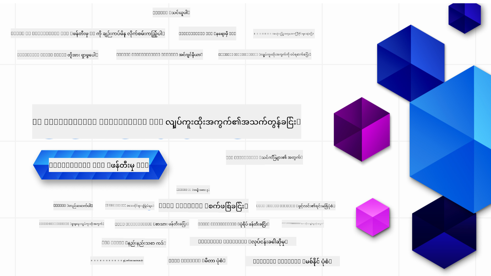

<!--
CO_OP_TRANSLATOR_METADATA:
{
  "original_hash": "6e3f4c8a4f323b8eab1cf11ded304b0f",
  "translation_date": "2025-06-25T08:21:01+00:00",
  "source_file": "README.md",
  "language_code": "my"
}
-->

### Generative AI အက်ပ္လီေကးရွင္းမ်ား စတင္တည္ေဆာက္ရန္ လိုအပ္ေသာ အရာမ်ားအားလုံးကို သင္ၾကားေပးသည့္ 21 သင္ခန္းစာမ်ား

### 🌐 ဘာသာစကားမ်ား အထောက်အပံ့

#### GitHub Action ျဖင့္ အထောက်အပံ့ (အလိုအေလ်ာက္ & အၿမဲတမ္း ေနာက္ဆုံးအေျခအေန)

# မူလ အိုင်အိုအေတီ စတင်သူများအတွက် (ဗားရှင်း ၃) - သင်တန်း

Microsoft Cloud Advocates မှ ၂၁-သင်ခန်းစာ အပြည့်အစုံ သင်တန်းဖြင့် မူလ အိုင်အိုအေတီ လျှောက်လွှာများ ဖွဲ့စည်းခြင်း၏ အခြေခံအချက်များကို လေ့လာပါ။

## 🌱 စတင်ရန်

ဒီသင်တန်းတွင် ၂၁ သင်ခန်းစာများ ပါဝင်သည်။ သင်ခန်းစာတစ်ခုစီသည် သူ၏ မူရင်းခေါင်းစဉ်ကို ဖုံးလွှမ်းထားသောကြောင့် သင်နှစ်သက်ရာနေရာမှ စတင်ပါ!

သင်ခန်းစာများကို "Learn" သင်ခန်းစာများဖြင့် မူလ အိုင်အိုအေတီ အကြောင်းအရာကို ရှင်းပြသည်။ "Build" သင်ခန်းစာများဖြင့် အကြောင်းအရာကို ရှင်းပြပြီး **Python** နှင့် **TypeScript** နှစ်ခုလုံးတွင် နမူနာကုဒ်များကို ရှင်းပြသည်။

.NET Developer များအတွက် [Generative AI for Beginners (.NET Edition)](https://github.com/microsoft/Generative-AI-for-beginners-dotnet?WT.mc_id=academic-105485-koreyst) ကို ကြည့်ပါ!

သင်ခန်းစာတိုင်းတွင် "Keep Learning" အပိုင်းကို အပိုသင်ယူရေးကိရိယာများနှင့် အတူ ပါဝင်သည်။

## သင့်အတွက် လိုအပ်သော အရာများ
### ဒီသင်တန်း၏ ကုဒ်ကို အလုပ်လည်စေရန် သင့်အား အောက်ပါအရာများ တစ်ခုခုကို အသုံးပြုနိုင်ပါသည်: 
 - [Azure OpenAI Service](https://aka.ms/genai-beginners/azure-open-ai?WT.mc_id=academic-105485-koreyst) - **သင်ခန်းစာများ:** "aoai-assignment"
 - [GitHub Marketplace Model Catalog](https://aka.ms/genai-beginners/gh-models?WT.mc_id=academic-105485-koreyst) - **သင်ခန်းစာများ:** "githubmodels"
 - [OpenAI API](https://aka.ms/genai-beginners/open-ai?WT.mc_id=academic-105485-koreyst) - **သင်ခန်းစာများ:** "oai-assignment" 
   
- Python သို့မဟုတ် TypeScript အခြေခံအကြောင်းအရာ သိရှိခြင်း - \* အစအဆုံးစတင်သူများအတွက် [Python](https://aka.ms/genai-beginners/python?WT.mc_id=academic-105485-koreyst) နှင့် [TypeScript](https://aka.ms/genai-beginners/typescript?WT.mc_id=academic-105485-koreyst) သင်တန်းများကို ကြည့်ပါ
- GitHub အကောင့်တစ်ခု [ဒီ repo အပြည့်ကို fork လုပ်ရန်](https://aka.ms/genai-beginners/github?WT.mc_id=academic-105485-koreyst) သင့် GitHub အကောင့်သို့

သင်၏ ဖွံ့ဖြိုးရေး ပတ်ဝန်းကျင်ကို စတင်ရန် အကူအညီပေးရန် **[Course Setup](./00-course-setup/README.md?WT.mc_id=academic-105485-koreyst)** သင်ခန်းစာကို ဖန်တီးထားပါသည်။

နောက်ပိုင်းတွင် အလွယ်တကူ ရှာဖွေရန် [ဒီ repo ကို star (🌟) လုပ်ရန်](https://docs.github.com/en/get-started/exploring-projects-on-github/saving-repositories-with-stars?WT.mc_id=academic-105485-koreyst) မမေ့ပါနှင့်။

## 🧠 Deploy ပြင်ဆင်နေပါသလား?

ပိုမို ကြီးမားသော ကုဒ်နမူနာများကို ရှာနေပါက **Python** နှင့် **TypeScript** နှစ်ခုလုံးတွင် [Generative AI Code Samples](https://aka.ms/genai-beg-code?WT.mc_id=academic-105485-koreyst) စုစည်းမှုကို ကြည့်ပါ။

## 🗣️ အခြားသော သင်ယူသူများနှင့် တွေ့ဆုံပါ၊ အထောက်အပံ့ရယူပါ

ဒီသင်တန်းကို လေ့လာနေသော အခြားသော သင်ယူသူများနှင့် တွေ့ဆုံရန်နှင့် အထောက်အပံ့ရယူရန် [အခြားသော Azure AI Foundry Discord server](https://aka.ms/genai-discord?WT.mc_id=academic-105485-koreyst) မှာ ပါဝင်ပါ။

GitHub တွင်ရှိသော [Azure AI Foundry Developer Forum](https://aka.ms/azureaifoundry/forum) တွင် မေးခွန်းမေးပါ သို့မဟုတ် ထုတ်ကုန်အကြောင်းအရာများကို မျှဝေပါ။

## 🚀 စတင်တည်ထောင်ခြင်း

**အခမဲ့ OpenAI credit များ**နှင့် **Azure OpenAI Services မှတဆင့် OpenAI မော်ဒယ်များကို ဝင်ရောက်ရရှိရန် Azure credit အထိ $150k အထိ** ရရှိရန် [Microsoft for Startups Founders Hub](https://aka.ms/genai-foundershub?WT.mc_id=academic-105485-koreyst) တွင် စာရင်းသွင်းပါ။

## 🙏 ကူညီလိုပါသလား?

အကြံပြုချက်များ ရှိပါသလား သို့မဟုတ် စာလုံးပေါင်း သို့မဟုတ် ကုဒ်အမှားများ ရှာဖွေတွေ့ရှိပါသလား? [Raise an issue](https://github.com/microsoft/generative-ai-for-beginners/issues?WT.mc_id=academic-105485-koreyst) သို့မဟုတ် [Create a pull request](https://github.com/microsoft/generative-ai-for-beginners/pulls?WT.mc_id=academic-105485-koreyst)

## 📂 သင်ခန်းစာတစ်ခုစီတွင် ပါဝင်သည်:

- ခေါင်းစဉ်အကြောင်း အကျဉ်းချုပ်ဗီဒီယို
- README တွင် ရှိသော ရေးသားထားသော သင်ခန်းစာ
- Azure OpenAI နှင့် OpenAI API ကို ထောက်ပံ့သော Python နှင့် TypeScript ကုဒ်နမူနာများ
- သင့်သင်ယူမှုကို ဆက်လက်လုပ်ဆောင်ရန် အပိုရင်းအမြစ်များနှင့် ချိတ်ဆက်မှုများ

## 🗃️ သင်ခန်းစာများ

| #   | **သင်ခန်းစာ လင့်ခ်**                                                                                                                              | **ဖေါ်ပြချက်**                                                                                 | **ဗီဒီယို**                                                                   | **အပိုသင်ယူခြင်း**                                                             |
| --- | -------------------------------------------------------------------------------------------------------------------------------------------- | ----------------------------------------------------------------------------------------------- | --------------------------------------------------------------------------- | ------------------------------------------------------------------------------ |
| 00  | [သင်တန်း Setup](./00-course-setup/README.md?WT.mc_id=academic-105485-koreyst)                                                                 | **Learn:** သင်၏ ဖွံ့ဖြိုးရေး ပတ်ဝန်းကျင်ကို စတင်ရန် ဘယ်လိုပြုလုပ်ရမည်ကို                                            | Video Coming Soon                                                                 | [Learn More](https://aka.ms/genai-collection?WT.mc_id=academic-105485-koreyst) |
| 01  | [မူလ အိုင်အိုအေတီ နှင့် LLMs အတွက် နိဒါန်း](./01-introduction-to-genai/README.md?WT.mc_id=academic-105485-koreyst)                              | **Learn:** မူလ အိုင်အိုအေတီ အကြောင်းနှင့် ကြီးမားသော ဘာသာစကား မော်ဒယ်များ (LLMs) က ဘယ်လို အလုပ်လုပ်သလဲကို နားလည်ခြင်း       | [Video](https://aka.ms/gen-ai-lesson-1-gh?WT.mc_id=academic-105485-koreyst) | [Learn More](https://aka.ms/genai-collection?WT.mc_id=academic-105485-koreyst) |
| 02  | [ကွဲပြားခြားနားသော LLMs များကို စူးစမ်းခြင်းနှင့် နှိုင်းယှဉ်ခြင်း](./02-exploring-and-comparing-different-llms/README.md?WT.mc_id=academic-105485-koreyst)             | **Learn:** သင့် အသုံးပြုမှု အတွက် မှန်ကန်သော မော်ဒယ်ကို ဘယ်လို ရွေးချယ်ရမည်ကို                                      | [Video](https://aka.ms/gen-ai-lesson2-gh?WT.mc_id=academic-105485-koreyst)  | [Learn More](https://aka.ms/genai-collection?WT.mc_id=academic-105485-koreyst) |
| 03  | [မူလ အိုင်အိုအေတီ ကို တာဝန်ယူမှုဖြင့် အသုံးပြုခြင်း](./03-using-generative-ai-responsibly/README.md?WT.mc_id=academic-105485-koreyst)                           | **Learn:** တာဝန်ယူမှုဖြင့် မူလ အိုင်အိုအေတီ လျှောက်လွှာများကို ဘယ်လို ဖွဲ့စည်းရမည်ကို                                  | [Video](https://aka.ms/gen-ai-lesson3-gh?WT.mc_id=academic-105485-koreyst)  | [Learn More](https://aka.ms/genai-collection?WT.mc_id=academic-105485-koreyst) |
| 04  | [Prompt Engineering အခြေခံကို နားလည်ခြင်း](./04-prompt-engineering-fundamentals/README.md?WT.mc_id=academic-105485-koreyst)             | **Learn:** လက်တွေ့ Prompt Engineering အကောင်းဆုံး လေ့လာမှုများ                                           | [Video](https://aka.ms/gen-ai-lesson4-gh?WT.mc_id=academic-105485-koreyst)  | [Learn More](https://aka.ms/genai-collection?WT.mc_id=academic-105485-koreyst) |
| 05  | [အဆင့်မြင့် Prompt များ ဖန်တီးခြင်း](./05-advanced-prompts/README.md?WT.mc_id=academic-105485-koreyst)                                                | **လေ့လာပါ:** သင့်၏ prompt များ၏ ရလဒ်ကို တိုးတက်စေသော prompt စီမံခန့်ခွဲမှုနည်းလမ်းများကို အသုံးပြုခြင်း | [ဗီဒီယို](https://aka.ms/gen-ai-lesson5-gh?WT.mc_id=academic-105485-koreyst)  | [နောက်ထပ်သိရှိရန်](https://aka.ms/genai-collection?WT.mc_id=academic-105485-koreyst) |
| 06  | [စာသား ဖန်တီးမှု အက်ပလီကေးရှင်းများ တည်ဆောက်ခြင်း](./06-text-generation-apps/README.md?WT.mc_id=academic-105485-koreyst)                                | **တည်ဆောက်ပါ:** Azure OpenAI / OpenAI API ကို အသုံးပြုသော စာသား ဖန်တီးမှု အက်ပလီကေးရှင်း                                | [ဗီဒီယို](https://aka.ms/gen-ai-lesson6-gh?WT.mc_id=academic-105485-koreyst)  | [နောက်ထပ်သိရှိရန်](https://aka.ms/genai-collection?WT.mc_id=academic-105485-koreyst) |
| 07  | [Chat အက်ပလီကေးရှင်းများ တည်ဆောက်ခြင်း](./07-building-chat-applications/README.md?WT.mc_id=academic-105485-koreyst)                                     | **တည်ဆောက်ပါ:** Chat အက်ပလီကေးရှင်းများကို ထိရောက်စွာ တည်ဆောက်ခြင်းနှင့် ပေါင်းစပ်ခြင်းနည်းလမ်းများ               | [ဗီဒီယို](https://aka.ms/gen-ai-lessons7-gh?WT.mc_id=academic-105485-koreyst) | [နောက်ထပ်သိရှိရန်](https://aka.ms/genai-collection?WT.mc_id=academic-105485-koreyst) |
| 08  | [Search Apps Vector Databases တည်ဆောက်ခြင်း](./08-building-search-applications/README.md?WT.mc_id=academic-105485-koreyst)                        | **တည်ဆောက်ပါ:** Embeddings ကို အသုံးပြု၍ ဒေတာ ရှာဖွေရန် Search အက်ပလီကေးရှင်းတစ်ခု                        | [ဗီဒီယို](https://aka.ms/gen-ai-lesson8-gh?WT.mc_id=academic-105485-koreyst)  | [နောက်ထပ်သိရှိရန်](https://aka.ms/genai-collection?WT.mc_id=academic-105485-koreyst) |
| 09  | [ရုပ်ပုံ ဖန်တီးမှု အက်ပလီကေးရှင်းများ တည်ဆောက်ခြင်း](./09-building-image-applications/README.md?WT.mc_id=academic-105485-koreyst)                        | **တည်ဆောက်ပါ:** ရုပ်ပုံ ဖန်တီးမှု အက်ပလီကေးရှင်း                                                       | [ဗီဒီယို](https://aka.ms/gen-ai-lesson9-gh?WT.mc_id=academic-105485-koreyst)  | [နောက်ထပ်သိရှိရန်](https://aka.ms/genai-collection?WT.mc_id=academic-105485-koreyst) |
| 10  | [Low Code AI အက်ပလီကေးရှင်းများ တည်ဆောက်ခြင်း](./10-building-low-code-ai-applications/README.md?WT.mc_id=academic-105485-koreyst)                       | **တည်ဆောက်ပါ:** Low Code ကိရိယာများကို အသုံးပြုသော Generative AI အက်ပလီကေးရှင်း                                     | [ဗီဒီယို](https://aka.ms/gen-ai-lesson10-gh?WT.mc_id=academic-105485-koreyst) | [နောက်ထပ်သိရှိရန်](https://aka.ms/genai-collection?WT.mc_id=academic-105485-koreyst) |
| 11  | [Function Calling ဖြင့် အပြင်အက်ပလီကေးရှင်းများကို ပေါင်းစပ်ခြင်း](./11-integrating-with-function-calling/README.md?WT.mc_id=academic-105485-koreyst) | **တည်ဆောက်ပါ:** Function calling ဆိုတာ ဘာလဲနှင့် အက်ပလီကေးရှင်းများအတွက် အသုံးပြုမှုများ                          | [ဗီဒီယို](https://aka.ms/gen-ai-lesson11-gh?WT.mc_id=academic-105485-koreyst) | [နောက်ထပ်သိရှိရန်](https://aka.ms/genai-collection?WT.mc_id=academic-105485-koreyst) |
| 12  | [AI အက်ပလီကေးရှင်းများအတွက် UX တီထွင်ခြင်း](./12-designing-ux-for-ai-applications/README.md?WT.mc_id=academic-105485-koreyst)                         | **လေ့လာပါ:** Generative AI အက်ပလီကေးရှင်းများ ဖွံ့ဖြိုးတိုးတက်စဉ်တွင် UX ဒီဇိုင်းမူဝါဒများကို အသုံးပြုရန်         | [ဗီဒီယို](https://aka.ms/gen-ai-lesson12-gh?WT.mc_id=academic-105485-koreyst) | [နောက်ထပ်သိရှိရန်](https://aka.ms/genai-collection?WT.mc_id=academic-105485-koreyst) |
| 13  | [သင့် Generative AI အက်ပလီကေးရှင်းများကို လုံခြုံရေး](./13-securing-ai-applications/README.md?WT.mc_id=academic-105485-koreyst)                         | **လေ့လာပါ:** AI စနစ်များအတွက် အန္တရာယ်များနှင့် အရေးပေါ်များကို နှင့် ဤစနစ်များကို လုံခြုံစေသော နည်းလမ်းများ             | [ဗီဒီယို](https://aka.ms/gen-ai-lesson13-gh?WT.mc_id=academic-105485-koreyst) | [နောက်ထပ်သိရှိရန်](https://aka.ms/genai-collection?WT.mc_id=academic-105485-koreyst) |
| 14  | [Generative AI အက်ပလီကေးရှင်း အသက်တာစဉ်](./14-the-generative-ai-application-lifecycle/README.md?WT.mc_id=academic-105485-koreyst)           | **လေ့လာပါ:** LLM အသက်တာစဉ်နှင့် LLMOps ကို စီမံခန့်ခွဲရန် ကိရိယာများနှင့် အတိုင်းအတာများ                         | [ဗီဒီယို](https://aka.ms/gen-ai-lesson14-gh?WT.mc_id=academic-105485-koreyst) | [နောက်ထပ်သိရှိရန်](https://aka.ms/genai-collection?WT.mc_id=academic-105485-koreyst) |
| 15  | [Retrieval Augmented Generation (RAG) နှင့် Vector Databases](./15-rag-and-vector-databases/README.md?WT.mc_id=academic-105485-koreyst)        | **တည်ဆောက်ခြင်း:** Vector Databases မှ embeddings များကို ရယူရန် RAG Framework ကို အသုံးပြုသော အက်ပ်ပလီကေးရှင်းတစ်ခု | [ဗီဒီယို](https://aka.ms/gen-ai-lesson15-gh?WT.mc_id=academic-105485-koreyst) | [ပိုမိုလေ့လာရန်](https://aka.ms/genai-collection?WT.mc_id=academic-105485-koreyst) |
| 16  | [Open Source Models နှင့် Hugging Face](./16-open-source-models/README.md?WT.mc_id=academic-105485-koreyst)                                    | **တည်ဆောက်ခြင်း:** Hugging Face တွင် ရရှိနိုင်သော open source models များကို အသုံးပြုသော အက်ပ်ပလီကေးရှင်းတစ်ခု | [ဗီဒီယို](https://aka.ms/gen-ai-lesson16-gh?WT.mc_id=academic-105485-koreyst) | [ပိုမိုလေ့လာရန်](https://aka.ms/genai-collection?WT.mc_id=academic-105485-koreyst) |
| 17  | [AI Agents](./17-ai-agents/README.md?WT.mc_id=academic-105485-koreyst)                                                                       | **တည်ဆောက်ခြင်း:** AI Agent Framework ကို အသုံးပြုသော အက်ပ်ပလီကေးရှင်းတစ်ခု                                           | [ဗီဒီယို](https://aka.ms/gen-ai-lesson17-gh?WT.mc_id=academic-105485-koreyst) | [ပိုမိုလေ့လာရန်](https://aka.ms/genai-collection?WT.mc_id=academic-105485-koreyst) |
| 18  | [Fine-Tuning LLMs](./18-fine-tuning/README.md?WT.mc_id=academic-105485-koreyst)                                                              | **လေ့လာရန်:** LLMs များကို fine-tuning ပြုလုပ်ခြင်း၏ အဓိပ္ပါယ်၊ အကြောင်းရင်းနှင့် လုပ်နည်းများ                                            | [ဗီဒီယို](https://aka.ms/gen-ai-lesson18-gh?WT.mc_id=academic-105485-koreyst) | [ပိုမိုလေ့လာရန်](https://aka.ms/genai-collection?WT.mc_id=academic-105485-koreyst) |
| 19  | [SLMs ဖြင့် တည်ဆောက်ခြင်း](./19-slm/README.md?WT.mc_id=academic-105485-koreyst)                                                              | **လေ့လာရန်:** Small Language Models ဖြင့် တည်ဆောက်ခြင်း၏ အကျိုးကျေးဇူးများ                                            | ဗီဒီယို မကြာမီ ရှိမည် | [ပိုမိုလေ့လာရန်](https://aka.ms/genai-collection?WT.mc_id=academic-105485-koreyst) |
| 20  | [Mistral Models ဖြင့် တည်ဆောက်ခြင်း](./20-mistral/README.md?WT.mc_id=academic-105485-koreyst)                                                              | **လေ့လာရန်:** Mistral Family Models ၏ အင်္ဂါရပ်များနှင့် ကွာခြားချက်များ                                           | ဗီဒီယို မကြာမီ ရှိမည် | [ပိုမိုလေ့လာရန်](https://aka.ms/genai-collection?WT.mc_id=academic-105485-koreyst) |
| 21  | [Meta Models ဖြင့် တည်ဆောက်ခြင်း](./21-meta/README.md?WT.mc_id=academic-105485-koreyst)                                                              | **လေ့လာရန်:** Meta Family Models ၏ အင်္ဂါရပ်များနှင့် ကွာခြားချက်များ                                           | ဗီဒီယို မကြာမီ ရှိမည် | [ပိုမိုလေ့လာရန်](https://aka.ms/genai-collection?WT.mc_id=academic-105485-koreyst) |

### 🌟 အထူးကျေးဇူးတင်စကား

GitHub Actions နှင့် workflows အားလုံးကို ဖန်တီးပေးခဲ့သော [**John Aziz**](https://www.linkedin.com/in/john0isaac/) ကို အထူးကျေးဇူးတင်ပါသည်။

သင်ခန်းစာတိုင်းကို လေ့လာသူနှင့် ကုဒ်အတွေ့အကြုံများ ပိုမိုကောင်းမွန်စေရန် အရေးပါသော အထောက်အကူပြုမှုများ ပြုလုပ်ပေးခဲ့သော [**Bernhard Merkle**](https://www.linkedin.com/in/bernhard-merkle-738b73/) ကိုလည်း အထူးကျေးဇူးတင်ပါသည်။

## 🎒 အခြားသင်တန်းများ

ကျွန်ုပ်တို့၏ အဖွဲ့သည် အခြားသင်တန်းများကိုလည်း ထုတ်လုပ်ပါသည်! စစ်ဆေးကြည့်ပါ:

- [**အသစ်** မော်ဒယ် အကြောင်းအရာ ပရိုတိုကောလ် များအတွက် မစင်စတင်သူများ](https://github.com/microsoft/mcp-for-beginners?WT.mc_id=academic-105485-koreyst)
- [မစင်စတင်သူများအတွက် AI Agents](https://github.com/microsoft/ai-agents-for-beginners?WT.mc_id=academic-105485-koreyst)
- [.NET ကို အသုံးပြု၍ မစင်စတင်သူများအတွက် Generative AI](https://github.com/microsoft/Generative-AI-for-beginners-dotnet?WT.mc_id=academic-105485-koreyst)
- [JavaScript ကို အသုံးပြု၍ မစင်စတင်သူများအတွက် Generative AI](https://aka.ms/genai-js-course?WT.mc_id=academic-105485-koreyst)
- [မစင်စတင်သူများအတွက် ML](https://aka.ms/ml-beginners?WT.mc_id=academic-105485-koreyst)
- [မစင်စတင်သူများအတွက် ဒေတာသိပ္ပံ](https://aka.ms/datascience-beginners?WT.mc_id=academic-105485-koreyst)
- [မစင်စတင်သူများအတွက် AI](https://aka.ms/ai-beginners?WT.mc_id=academic-105485-koreyst)
- [မစင်စတင်သူများအတွက် စိုက်ပျိုးရေးလုံခြုံရေး](https://github.com/microsoft/Security-101??WT.mc_id=academic-96948-sayoung)
- [မစင်စတင်သူများအတွက် ဝဘ် ဖွံ့ဖြိုးရေး](https://aka.ms/webdev-beginners?WT.mc_id=academic-105485-koreyst)
- [မစင်စတင်သူများအတွက် IoT](https://aka.ms/iot-beginners?WT.mc_id=academic-105485-koreyst)
- [သင်ယူမှုအဆင့်အနိမ့်များအတွက် XR ဖွံ့ဖြိုးတိုးတက်မှု](https://github.com/microsoft/xr-development-for-beginners?WT.mc_id=academic-105485-koreyst)
- [AI တွဲဖက်ပရိုဂရမ်းမင်းအတွက် GitHub Copilot ကိုကျွမ်းကျင်ခြင်း](https://aka.ms/GitHubCopilotAI?WT.mc_id=academic-105485-koreyst)
- [C#/.NET ဖွံ့ဖြိုးသူများအတွက် GitHub Copilot ကိုကျွမ်းကျင်ခြင်း](https://github.com/microsoft/mastering-github-copilot-for-dotnet-csharp-developers?WT.mc_id=academic-105485-koreyst)
- [ကိုယ်ပိုင် Copilot စွန့်စားမှုကို ရွေးချယ်ပါ](https://github.com/microsoft/CopilotAdventures?WT.mc_id=academic-105485-koreyst)

**သတိပေးချက်**:  
ဤစာရွက်ကို AI ဘာသာပြန်ဝန်ဆောင်မှု [Co-op Translator](https://github.com/Azure/co-op-translator) ကို အသုံးပြု၍ ဘာသာပြန်ထားပါသည်။ ကျွန်ုပ်တို့သည် တိကျမှန်ကန်မှုကို လိုလားသော်လည်း အလိုအလျောက် ဘာသာပြန်ချက်များတွင် အမှားများ သို့မဟုတ် မှားယွင်းမှုများ ပါဝင်နိုင်သည်ကို ကျေးဇူးပြု၍ သိရှိထားပါ။ မူရင်းစာရွက်ကို ၎င်း၏ မူလဘာသာစကားဖြင့် လေးစားထိုက်သောအရင်းအမြစ်အဖြစ် ထည့်သွင်းစဉ်းစားသင့်ပါသည်။ အရေးကြီးသော အချက်အလက်များအတွက် လူမှ ဘာသာပြန်ခြင်းကို ထောက်ခံပါသည်။ ဤဘာသာပြန်ချက်ကို အသုံးပြုခြင်းမှ ဖြစ်ပေါ်လာသော အလွဲသုံးစားမှုများ သို့မဟုတ် အလွဲလွဲမှားမှား နားလည်မှုများအတွက် ကျွန်ုပ်တို့မှာ တာဝန်မရှိပါ။