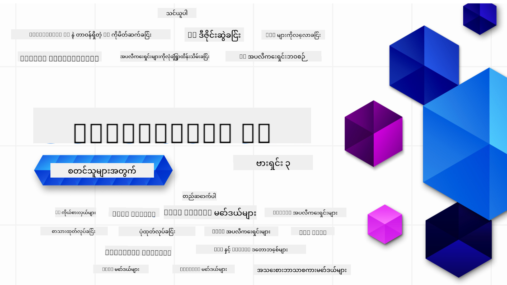

<!--
CO_OP_TRANSLATOR_METADATA:
{
  "original_hash": "4d022651f0c17151c68255e41a68e4ed",
  "translation_date": "2025-12-21T14:15:39+00:00",
  "source_file": "README.md",
  "language_code": "my"
}
-->

### Generative AI အပလီကေးရှင်းများ တည်ဆောက်ရန် စတင်ရန် လိုအပ်သည့် အရာများအားလုံးကို သင်ကြားပေးသည့် 21 ပို့ခန်း

### 🌐 ဘာသာစကား မျိုးစုံ အထောက်အပံ့

#### GitHub Action ဖြင့် ထောက်ပံ့ (အလိုအလျှောက် & အမြဲတမ်း အပ်ဒိတ်)

<!-- CO-OP TRANSLATOR LANGUAGES TABLE START -->
[အာရဗစ်](../ar/README.md) | [ဘင်္ဂါလီ](../bn/README.md) | [ဘူလ်ဂေးရီးယန်း](../bg/README.md) | [မြန်မာ (Myanmar)](./README.md) | [တရုတ် (ရိုးရှင်း)](../zh/README.md) | [တရုတ် (ရိုးရာ၊ ဟောင်ကောင်)](../hk/README.md) | [တရုတ် (ရိုးရာ၊ မကာအို)](../mo/README.md) | [တရုတ် (ရိုးရာ၊ တိုင်ဝမ်)](../tw/README.md) | [ခရိုးရှီးယား](../hr/README.md) | [ချက်](../cs/README.md) | [ဒိန်းမာက်](../da/README.md) | [နယ်သာလန်](../nl/README.md) | [အက်စတိုနီးယား](../et/README.md) | [ဖင်လန်](../fi/README.md) | [ပြင်သစ်](../fr/README.md) | [ဂျာမနီ](../de/README.md) | [ဂရိ](../el/README.md) | [ဟီဘရူး](../he/README.md) | [ဟင်းဒီ](../hi/README.md) | [ဟန်ဂေးရီးယား](../hu/README.md) | [အင်ဒိုနီးရှား](../id/README.md) | [အီတလီ](../it/README.md) | [ဂျပန်](../ja/README.md) | [ကနนาดာ](../kn/README.md) | [ကိုးရီးယား](../ko/README.md) | [လစ်သူဝေးနီးယား](../lt/README.md) | [မလေး](../ms/README.md) | [မလေးလာလမ်](../ml/README.md) | [မာရာသီ](../mr/README.md) | [နီပေါလီ](../ne/README.md) | [နိုင်ဂျီးရီးယား ပစ်ဂျင်](../pcm/README.md) | [နော်ဝေး](../no/README.md) | [ပါရှန် (ဖာစီ)](../fa/README.md) | [ပိုလန်](../pl/README.md) | [ပေါ်တူဂီးဇ် (ဘရာဇီးလ်)](../br/README.md) | [ပေါ်တူဂီးဇ် (ပေါ်တူဂါလ်)](../pt/README.md) | [ပန်ဂျာဘီ (Gurmukhi)](../pa/README.md) | [ရိုမေးနီးယား](../ro/README.md) | [ရုရှား](../ru/README.md) | [ဆာဘီးယား (Cyrillic)](../sr/README.md) | [စလိုဗာကီယား](../sk/README.md) | [စလိုဗေးနီးယား](../sl/README.md) | [စပိန်](../es/README.md) | [ဆွာဟီလီ](../sw/README.md) | [ဆွီဒင်](../sv/README.md) | [တာဂါလို (ဖိလစ်ပိုင်)](../tl/README.md) | [တမီးလ်](../ta/README.md) | [တယ်လူဂူ](../te/README.md) | [ထိုင်း](../th/README.md) | [တူရကီ](../tr/README.md) | [ယူကရိန်း](../uk/README.md) | [ဥဒူ](../ur/README.md) | [ဗီယက်နမ်](../vi/README.md)
<!-- CO-OP TRANSLATOR LANGUAGES TABLE END -->

# Generative AI အစပြုသူများအတွက် (Version 3) - သင်တန်း

Microsoft Cloud Advocates မှ တင်ဆက်သည့် 21 ပို့ခန်း အပြည့်အစုံ သင်တန်းဖြင့် Generative AI အက်ပလီကေးရှင်းများ တည်ဆောက်ရန် အခြေခံအဆောက်အအုံကို သင်ယူပါ။

## 🌱 စတင်ရန်

ဤသင်တန်းတွင် ပို့ခန်း 21 ခန်း ပါဝင်သည်။ တစ်ခုချင်းစီမှာ ကိုယ့်ပိုင် ခေါင်းစဉ်ကို ဖော်ထုတ်ထားသဖြင့် သင်နှစ်သက်သည့်နေရာထဲမှ စတင်ပါ။

Lessons သည် "Learn" သို့မဟုတ် "Build" ဟူ၍ အမှတ်အသားပြထားပြီး "Learn" ပို့ခန်းများတွင် Generative AI အယူအဆများကို ရှင်းပြပြီး "Build" ပို့ခန်းများတွင် အဆိုပါ အယူအဆနှင့် Python နှင့် TypeScript ဖြင့် ကိုးဒ်ဥပမာများ ပါဝင်နိုင်သည်။

.NET ဖွံ့ဖြိုးရေးသူများအတွက် [Generative AI for Beginners (.NET Edition)](https://github.com/microsoft/Generative-AI-for-beginners-dotnet?WT.mc_id=academic-105485-koreyst) ကိုကြည့်ပါ။

တစ်ခုချင်းစီ ပို့ခန်းတွင် "Keep Learning" အပိုင်းဖြင့် ထပ်ဆင့် သင်ယူနိုင်သည့် ကိရိယာများပါဝင်သည်။

## သင်လိုအပ်သည့် အရာများ
### ဤသင်တန်း၏ ကုဒ်ကို အလုပ်ဖြစ်စေရန် အောက်ပါအရာများထဲမှ တစ်ခုကို အသုံးပြုနိုင်သည်
 - [Azure OpenAI Service](https://aka.ms/genai-beginners/azure-open-ai?WT.mc_id=academic-105485-koreyst) - **Lessons:** "aoai-assignment"
 - [GitHub Marketplace Model Catalog](https://aka.ms/genai-beginners/gh-models?WT.mc_id=academic-105485-koreyst) - **Lessons:** "githubmodels"
 - [OpenAI API](https://aka.ms/genai-beginners/open-ai?WT.mc_id=academic-105485-koreyst) - **Lessons:** "oai-assignment" 
   
- Python သို့မဟုတ် TypeScript အခြေခံ အသိပညာရှိခြင်းက ရလဒ်ပိုမိုကောင်းစေပါသည် - \*အလွန်စတင်လေ့လာသူများအတွက် ဤ [Python](https://aka.ms/genai-beginners/python?WT.mc_id=academic-105485-koreyst) နှင့် [TypeScript](https://aka.ms/genai-beginners/typescript?WT.mc_id=academic-105485-koreyst) သင်တန်းများကို ကြည့်ပါ
- ဤ repo အားလုံးကို သင့် GitHub အကောင့်သို့ [fork တင်ရန်](https://aka.ms/genai-beginners/github?WT.mc_id=academic-105485-koreyst) GitHub အကောင့်တစ်ခု လိုအပ်သည်

ဖွံ့ဖြိုးရေးပတ်ဝန်းကျင်ကို တပ်ဆင်ရန် အကူအညီပေးရန် ကျွန်တော်တို့က **[Course Setup](./00-course-setup/README.md?WT.mc_id=academic-105485-koreyst)** ပို့ခန်းတစ်ခု ဖန်တီးထားပါသည်။

နောက်တွင် ရှာဖွေဖို့လွယ်အောင် ဤ repo ကို [ကြယ် (🌟) တင်ထားရန် မမေ့ပါနှင့်](https://docs.github.com/en/get-started/exploring-projects-on-github/saving-repositories-with-stars?WT.mc_id=academic-105485-koreyst)။

## 🧠 တင်သွင်းရန် အသင့်လား?

ပိုမိုတိုးတက်သော ကိုးဒ်နမူနာများကို ရှာဖွေရန် **Python** နှင့် **TypeScript** နှစ်မျိုးစလုံးတွင် ရှိသော [Generative AI Code Samples စုစည်းမှု](https://aka.ms/genai-beg-code?WT.mc_id=academic-105485-koreyst) ကို ကြည့်ပါ။

## 🗣️ အခြားလေ့လာသူများနှင့် တွေ့ဆုံ၊ အထောက်အပံ့ရယူရန်

ဤသင်တန်းကို လေ့လာနေသည့် အခြားလေ့လာသူများနှင့် တွေ့ဆုံကာ ကူညီပံ့ပိုးမှု ရရှိစေရန် ကျွန်တော်တို့၏ [တရားဝင် Azure AI Foundry Discord ဆာဗာ](https://aka.ms/genai-discord?WT.mc_id=academic-105485-koreyst) တွင် ပါဝင်ဆွေးနွေးပါ။

မေးခွန်းများ မေးရန် သို့မဟုတ် ထုတ်ကုန် ရလဒ်အကြံပြုချက်များကို ကျွန်တော်တို့၏ [Azure AI Foundry Developer Forum](https://aka.ms/azureaifoundry/forum) တွင် GitHub ပေါ်တွင် မျှဝေပါ။

## 🚀 စတင်လုပ်ငန်းတည်ထောင်နေပါသလား?

Azure credit များဖြင့် ယနေ့ကတည်းက စတင်တည်ဆောက်နိုင်ရန် [Microsoft for Startups](https://www.microsoft.com/startups) ကို သွားကြည့်ပါ။

## 🙏 ကူညီချင်ပါသလား?

အကြံပြုချက်များ ရှိပါသလား သို့မဟုတ် ဝါကျအမှားများ သို့မဟုတ် ကုဒ်အမှားတွေ ေတြ့ရှိပါသလား? [ပြဿနာတင်ပါ](https://github.com/microsoft/generative-ai-for-beginners/issues?WT.mc_id=academic-105485-koreyst) သို့မဟုတ် [Pull Request တင်ပါ](https://github.com/microsoft/generative-ai-for-beginners/pulls?WT.mc_id=academic-105485-koreyst)

## 📂 တစ်ခုချင်းသင်ခန်းစာတွင် ပါဝင်သောအရာများ

- ခေါင်းစဉ်အတွက် အတိုချုံး ဗီဒီယိုနိဒါန်း
- README တွင် တည်ရှိသည့် ရေးသားထားသော သင်ခန်းစာ
- Azure OpenAI နှင့် OpenAI API များကို ထောက်ပံ့သည့် Python နှင့် TypeScript ကိုးဒ်နမူနာများ
- သင်ယူမှုကို ဆက်လက်တိုးချဲ့နိုင်ရန် အပိုဆောင်း အရင်းအမြစ်များလင့်ခ်များ

## 🗃️ သင်ခန်းစာများ

| #   | **Lesson Link**                                                                                                                              | **Description**                                                                                 | **Video**                                                                   | **Extra Learning**                                                             |
| --- | -------------------------------------------------------------------------------------------------------------------------------------------- | ----------------------------------------------------------------------------------------------- | --------------------------------------------------------------------------- | ------------------------------------------------------------------------------ |
| 00  | [Course Setup](./00-course-setup/README.md?WT.mc_id=academic-105485-koreyst)                                                                 | **Learn:** သင်၏ ဖွံ့ဖြိုးရေးပတ်ဝန်းကျင်ကို မည်သို့ တပ်ဆင်ရမည်ကို                                              | ဗီဒီယို မကြာမီပါမည်                                                                 | [ပိုမိုလေ့လာရန်](https://aka.ms/genai-collection?WT.mc_id=academic-105485-koreyst) |
| 01  | [Introduction to Generative AI and LLMs](./01-introduction-to-genai/README.md?WT.mc_id=academic-105485-koreyst)                              | **Learn:** Generative AI ဆိုတာဘာလဲ နှင့် Large Language Models (LLMs) များ မည်သို့ လည်ပတ်သည်ကို နားလည်ခြင်း       | [ဗီဒီယို](https://aka.ms/gen-ai-lesson-1-gh?WT.mc_id=academic-105485-koreyst) | [ပိုမိုလေ့လာရန်](https://aka.ms/genai-collection?WT.mc_id=academic-105485-koreyst) |
| 02  | [Exploring and comparing different LLMs](./02-exploring-and-comparing-different-llms/README.md?WT.mc_id=academic-105485-koreyst)             | **Learn:** သင့်အသုံးအဆောင်အတွက် မှန်ကန်သော မော်ဒယ်ကို မည်သို့ ရွေးချယ်ရမည်ကို                                      | [ဗီဒီယို](https://aka.ms/gen-ai-lesson2-gh?WT.mc_id=academic-105485-koreyst)  | [ပိုမိုလေ့လာရန်](https://aka.ms/genai-collection?WT.mc_id=academic-105485-koreyst) |
| 03  | [Using Generative AI Responsibly](./03-using-generative-ai-responsibly/README.md?WT.mc_id=academic-105485-koreyst)                           | **Learn:** Generative AI အက်ပလီကေးရှင်းများကို တာဝန်ရှိစွာ မည်သို့ တည်ဆောက်ရမည်ကို                                  | [ဗီဒီယို](https://aka.ms/gen-ai-lesson3-gh?WT.mc_id=academic-105485-koreyst)  | [ပိုမိုလေ့လာရန်](https://aka.ms/genai-collection?WT.mc_id=academic-105485-koreyst) |
| 04  | [Understanding Prompt Engineering Fundamentals](./04-prompt-engineering-fundamentals/README.md?WT_mc_id=academic-105485-koreyst)             | **Learn:** Prompt Engineering အကောင်းဆုံး လက်တွေ့ လေ့လာမှုများ                                           | [ဗီဒီယို](https://aka.ms/gen-ai-lesson4-gh?WT.mc_id=academic-105485-koreyst)  | [ပိုမိုလေ့လာရန်](https://aka.ms/genai-collection?WT_mc_id=academic-105485-koreyst) |
| 05  | [အဆင့်မြင့် Prompt များ ဖန်တီးခြင်း](./05-advanced-prompts/README.md?WT.mc_id=academic-105485-koreyst)                                                | **Learn:** သင့် prompt များ၏ ထွက်လာသော ရလဒ်များကို တိုးတက်စေမည့် prompt engineering နည်းဗျူဟာများကို အသုံးချနည်း | [ဗီဒီယို](https://aka.ms/gen-ai-lesson5-gh?WT.mc_id=academic-105485-koreyst)  | [ပိုပြီး သိရှိရန်](https://aka.ms/genai-collection?WT.mc_id=academic-105485-koreyst) |
| 06  | [စာသားထုတ်လုပ်မှု အက်ပလီကေးရှင်းများ တည်ဆောက်ခြင်း](./06-text-generation-apps/README.md?WT.mc_id=academic-105485-koreyst)                                | **Build:** Azure OpenAI / OpenAI API ကို အသုံးပြု၍ စာသားထုတ်လုပ်သော အက်ပလီကေးရှင်း တစ်ခု တည်ဆောက်ခြင်း                                | [ဗီဒီယို](https://aka.ms/gen-ai-lesson6-gh?WT.mc_id=academic-105485-koreyst)  | [ပိုပြီး သိရှိရန်](https://aka.ms/genai-collection?WT.mc_id=academic-105485-koreyst) |
| 07  | [စကားပြော အက်ပလီကေးရှင်းများ တည်ဆောက်ခြင်း](./07-building-chat-applications/README.md?WT.mc_id=academic-105485-koreyst)                                     | **Build:** စကားပြော အက်ပလီကေးရှင်းများကို ထိရောက်စွာ တည်ဆောက်ခြင်းနှင့် ပေါင်းစည်းခြင်းနည်းလမ်းများ               | [ဗီဒီယို](https://aka.ms/gen-ai-lessons7-gh?WT.mc_id=academic-105485-koreyst) | [ပိုပြီး သိရှိရန်](https://aka.ms/genai-collection?WT.mc_id=academic-105485-koreyst) |
| 08  | [ရှာဖွေရေး အက်ပလီကေးရှင်းများနှင့် Vector Database များ တည်ဆောက်ခြင်း](./08-building-search-applications/README.md?WT.mc_id=academic-105485-koreyst)                        | **Build:** Embeddings ကို အသုံးပြု၍ ဒေတာရှာဖွေရေး ပြုလုပ်သည့် ရှာဖွေရေး အက်ပလီကေးရှင်း တစ်ခု                        | [ဗီဒီယို](https://aka.ms/gen-ai-lesson8-gh?WT.mc_id=academic-105485-koreyst)  | [ပိုပြီး သိရှိရန်](https://aka.ms/genai-collection?WT.mc_id=academic-105485-koreyst) |
| 09  | [ပုံရိပ် ထုတ်လုပ်ရေး အက်ပလီကေးရှင်းများ တည်ဆောက်ခြင်း](./09-building-image-applications/README.md?WT.mc_id=academic-105485-koreyst)                        | **Build:** ပုံရိပ် ထုတ်လုပ်ရေး အက်ပလီကေးရှင်း တစ်ခု                                                       | [ဗီဒီယို](https://aka.ms/gen-ai-lesson9-gh?WT.mc_id=academic-105485-koreyst)  | [ပိုပြီး သိရှိရန်](https://aka.ms/genai-collection?WT.mc_id=academic-105485-koreyst) |
| 10  | [Low Code AI အက်ပလီကေးရှင်းများ တည်ဆောက်ခြင်း](./10-building-low-code-ai-applications/README.md?WT.mc_id=academic-105485-koreyst)                       | **Build:** Low Code ကိရိယာများဖြင့် Generative AI အက်ပလီကေးရှင်း တစ်ခု တည်ဆောက်ခြင်း                                     | [ဗီဒီယို](https://aka.ms/gen-ai-lesson10-gh?WT.mc_id=academic-105485-koreyst) | [ပိုပြီး သိရှိရန်](https://aka.ms/genai-collection?WT.mc_id=academic-105485-koreyst) |
| 11  | [Function Calling ဖြင့် ပြင်ပ အက်ပလီကေးရှင်းများ ထည့်သွင်းပေါင်းစည်းခြင်း](./11-integrating-with-function-calling/README.md?WT.mc_id=academic-105485-koreyst) | **Build:** Function calling ဆိုတာဘာနှင့် ၎င်း၏ အက်ပလီကေးရှင်းအသုံးချပုံများ                          | [ဗီဒီယို](https://aka.ms/gen-ai-lesson11-gh?WT.mc_id=academic-105485-koreyst) | [ပိုပြီး သိရှိရန်](https://aka.ms/genai-collection?WT.mc_id=academic-105485-koreyst) |
| 12  | [AI အက်ပလီကေးရှင်းများအတွက် UX ဒီဇိုင်း ရေးဆွဲခြင်း](./12-designing-ux-for-ai-applications/README.md?WT.mc_id=academic-105485-koreyst)                         | **Learn:** Generative AI အက်ပလီကေးရှင်းများ ဖန်တီးရာတွင် UX ဒီဇိုင်း မူဝါဒများကို မည်သို့ အသုံးချရမည်ကို လေ့လာပါ။         | [ဗီဒီယို](https://aka.ms/gen-ai-lesson12-gh?WT.mc_id=academic-105485-koreyst) | [ပိုပြီး သိရှိရန်](https://aka.ms/genai-collection?WT.mc_id=academic-105485-koreyst) |
| 13  | [သင့် Generative AI အက်ပလီကေးရှင်းများကို လုံခြုံစေခြင်း](./13-securing-ai-applications/README.md?WT.mc_id=academic-105485-koreyst)                         | **Learn:** AI စနစ်များရှိ လုံခြုံရေးအန္တရာယ်များနှင့် အဲဒီစနစ်များကို ဘယ်လို ကာကွယ်ရမည်ကို သင်ယူပါ။             | [ဗီဒီယို](https://aka.ms/gen-ai-lesson13-gh?WT.mc_id=academic-105485-koreyst) | [ပိုပြီး သိရှိရန်](https://aka.ms/genai-collection?WT.mc_id=academic-105485-koreyst) |
| 14  | [Generative AI အက်ပလီကေးရှင်း၏ အသက်ကာလ](./14-the-generative-ai-application-lifecycle/README.md?WT.mc_id=academic-105485-koreyst)           | **Learn:** LLM Lifecycle နှင့် LLMOps ကို စီမံရန် အသုံးပြုသည့် ကိရိယာများနှင့် မီထရစ်များ                         | [ဗီဒီယို](https://aka.ms/gen-ai-lesson14-gh?WT.mc_id=academic-105485-koreyst) | [ပိုပြီး သိရှိရန်](https://aka.ms/genai-collection?WT.mc_id=academic-105485-koreyst) |
| 15  | [Retrieval Augmented Generation (RAG) နှင့် Vector Databases](./15-rag-and-vector-databases/README.md?WT.mc_id=academic-105485-koreyst)        | **Build:** Vector Database များမှ embeddings များကို ရယူရန် RAG Framework ကို အသုံးပြုသည့် အက်ပလီကေးရှင်း  | [ဗီဒီယို](https://aka.ms/gen-ai-lesson15-gh?WT.mc_id=academic-105485-koreyst) | [ပိုပြီး သိရှိရန်](https://aka.ms/genai-collection?WT.mc_id=academic-105485-koreyst) |
| 16  | [Open Source မော်ဒယ်များနှင့် Hugging Face](./16-open-source-models/README.md?WT.mc_id=academic-105485-koreyst)                                    | **Build:** Hugging Face တွင် ရနိုင်သော open source မော်ဒယ်များကို အသုံးပြု၍ အက်ပလီကေးရှင်း တစ်ခု                    | [ဗီဒီယို](https://aka.ms/gen-ai-lesson16-gh?WT.mc_id=academic-105485-koreyst) | [ပိုပြီး သိရှိရန်](https://aka.ms/genai-collection?WT.mc_id=academic-105485-koreyst) |
| 17  | [AI Agent များဖြင့် တည်ဆောက်ခြင်း](./17-ai-agents/README.md?WT.mc_id=academic-105485-koreyst)                                                                       | **Build:** AI Agent Framework တစ်ခုကို အသုံးပြုသည့် အက်ပလီကေးရှင်း တစ်ခု                                           | [ဗီဒီယို](https://aka.ms/gen-ai-lesson17-gh?WT.mc_id=academic-105485-koreyst) | [ပိုပြီး သိရှိရန်](https://aka.ms/genai-collection?WT.mc_id=academic-105485-koreyst) |
| 18  | [LLM များကို Fine-Tuning ပြုလုပ်ခြင်း](./18-fine-tuning/README.md?WT.mc_id=academic-105485-koreyst)                                                              | **Learn:** LLM များကို fine-tuning ပြုလုပ်ခြင်း၏ အဓိပ္ပါယ်၊ အကြောင်းရင်းနှင့် နည်းလမ်းများ                                            | [ဗီဒီယို](https://aka.ms/gen-ai-lesson18-gh?WT.mc_id=academic-105485-koreyst) | [ပိုပြီး သိရှိရန်](https://aka.ms/genai-collection?WT.mc_id=academic-105485-koreyst) |
| 19  | [SLM များဖြင့် တည်ဆောက်ခြင်း](./19-slm/README.md?WT.mc_id=academic-105485-koreyst)                                                              | **Learn:** Small Language Models များကို အသုံးပြု၍ ဖန်တီးရာတွင် ရရှိသည့် အကျိုးကျေးဇူးများ                                            | ဗီဒီယို မကြာခင် ရှိလာမည် | [ပိုပြီး သိရှိရန်](https://aka.ms/genai-collection?WT.mc_id=academic-105485-koreyst) |
| 20  | [Mistral မော်ဒယ်များဖြင့် တည်ဆောက်ခြင်း](./20-mistral/README.md?WT.mc_id=academic-105485-koreyst)                                                              | **Learn:** Mistral မော်ဒယ် မိသားစု၏ လက္ခဏာများနှင့် ကွဲပြားချက်များ                                           | ဗီဒီယို မကြာခင် ရှိလာမည် | [ပိုပြီး သိရှိရန်](https://aka.ms/genai-collection?WT.mc_id=academic-105485-koreyst) |
| 21  | [Meta မော်ဒယ်များဖြင့် တည်ဆောက်ခြင်း](./21-meta/README.md?WT.mc_id=academic-105485-koreyst)                                                              | **Learn:** Meta မော်ဒယ် မိသားစု၏ လက္ခဏာများနှင့် ကွဲပြားချက်များ                                           | ဗီဒီယို မကြာခင် ရှိလာမည် | [ပိုပြီး သိရှိရန်](https://aka.ms/genai-collection?WT.mc_id=academic-105485-koreyst) |

### 🌟 အထူးကျေးဇူးတင်ခြင်း

[**John Aziz**](https://www.linkedin.com/in/john0isaac/)အား GitHub Actions များနှင့် workflows အားလုံး ဖန်တီးပေးခဲ့သည့်အတွက် အထူးကျေးဇူးတင်ပါသည်။

[**Bernhard Merkle**](https://www.linkedin.com/in/bernhard-merkle-738b73/) သည် သင်ယူသူနှင့် ကုဒ် အတွေ့အကြုံကို တိုးတက်စေရန် သင်ခန်းစာတိုင်းတွင် အဓိက ကူပေးမှုများ ပြုလုပ်ပေးခဲ့သည့်အတွက် ကျေးဇူးတင်ပါသည်။ 

## 🎒 အခြား သင်တန်းများ

ကျွန်ုပ်တို့အဖွဲ့က အခြား သင်တန်းများကိုလည်း ထုတ်လုပ်ထားပါတယ်! ကြည့်ရှုရန်:

<!-- CO-OP TRANSLATOR OTHER COURSES START -->
### LangChain

---

### Azure / Edge / MCP / Agents

---
 
### Generative AI စီးရီး

[-9333EA?style=for-the-badge&labelColor=E5E7EB&color=9333EA)](https://github.com/microsoft/Generative-AI-for-beginners-dotnet?WT.mc_id=academic-105485-koreyst)
[-C084FC?style=for-the-badge&labelColor=E5E7EB&color=C084FC)](https://github.com/microsoft/generative-ai-for-beginners-java?WT.mc_id=academic-105485-koreyst)
[-E879F9?style=for-the-badge&labelColor=E5E7EB&color=E879F9)](https://github.com/microsoft/generative-ai-with-javascript?WT.mc_id=academic-105485-koreyst)

---
 
### အခြေခံ သင်ယူမှုများ

---
 
### Copilot စီးရီးများ

<!-- CO-OP TRANSLATOR OTHER COURSES END -->

## အကူအညီရယူခြင်း

AI အက်ပ်များ တည်ဆောက်ရာတွင် အခက်အခဲတက်ခဲ့ပါက သို့မဟုတ် မေးခွန်းများ ရှိပါက MCP အပေါ် သင်ယူနေကြသူများနှင့် အတွေ့အကြုံဖြင့် ပြည့်စုံသော ဖွံ့ဖြိုးသူများအထိ ဆွေးနွေးပူးပေါင်းနိုင်ပါသည်။ ဤသည်မှာ မေးခွန်းများကို ကြိုဆိုကာ အသိပညာများကို လွတ်လပ်စွာ မျှဝေသည့် ထောက်ခံပံ့ပိုးမှုရှိသည့် အသိုက်အဖြစ် ဖြစ်ပါသည်။

If you have product feedback or errors while building visit:

---

<!-- CO-OP TRANSLATOR DISCLAIMER START -->
သတိပေးချက်:

ဒီစာတမ်းကို AI ဘာသာပြန်စနစ်ဖြစ်သော [Co-op Translator](https://github.com/Azure/co-op-translator) အသုံးပြု၍ ဘာသာပြန်ထားပါသည်။ ကျွန်ုပ်တို့သည် တိကျမှုအတွက် ကြိုးပမ်းပါသော်လည်း အလိုအလျောက် ဘာသာပြန်ချက်များတွင် အမှားများ သို့မဟုတ် မှန်ကန်မှုလျော့နည်းမှုများ ရှိနိုင်ကြောင်း ကျေးဇူးပြု၍ သတိပြုပါ။ မူလစာတမ်းကို မူလဘာသာဖြင့်သာ မှန်ကန်သော ရင်းမြစ်အဖြစ် သတ်မှတ်စဉ်းစားရမည်ဖြစ်သည်။ အရေးကြီးသော အချက်အလက်များအတွက် ကျွမ်းကျင်သော လူဘာသာပြန်တစ်ဦးမှ စစ်ဆေး၍ ဘာသာပြန်ခြင်းကို အကြံပြုပါသည်။ ဤဘာသာပြန်ချက်ကို အသုံးပြုမှုမှ ဆင်းသက်လာသော မတိကျသော နားလည်မှုများ သို့မဟုတ် အမှားဖတ်ထုတ်မှုများအတွက် ကျွန်ုပ်တို့ တာဝန်မရှိပါ။
<!-- CO-OP TRANSLATOR DISCLAIMER END -->