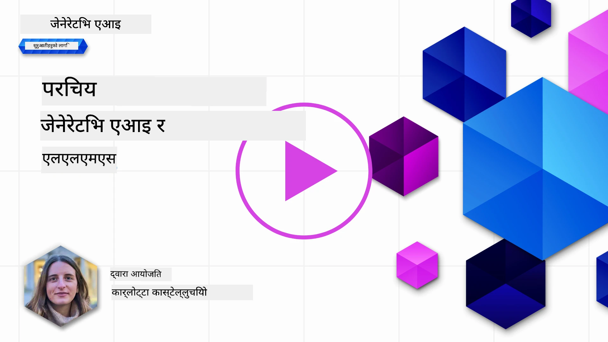
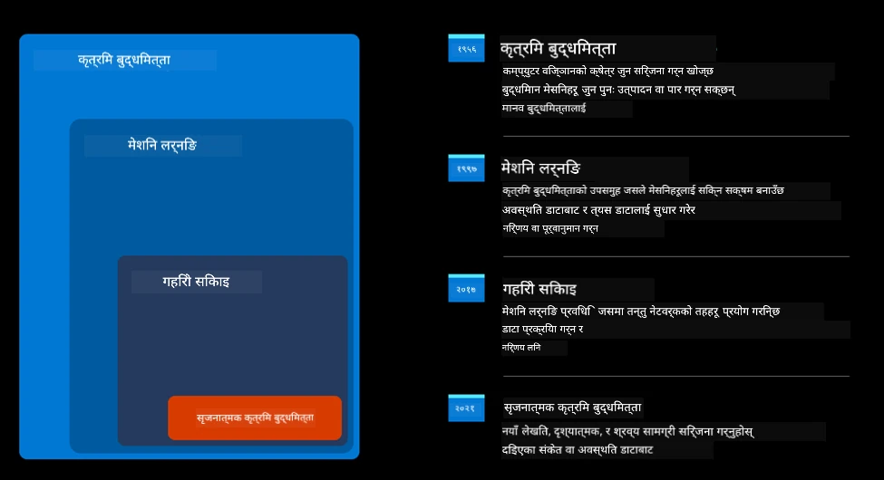
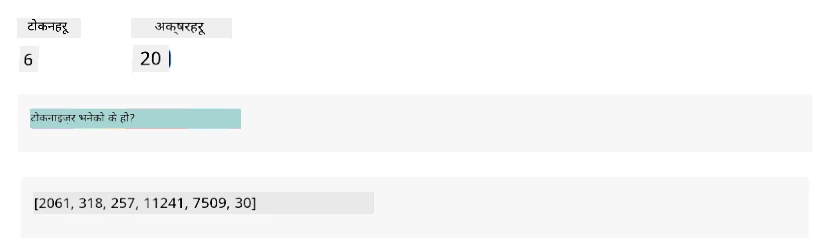
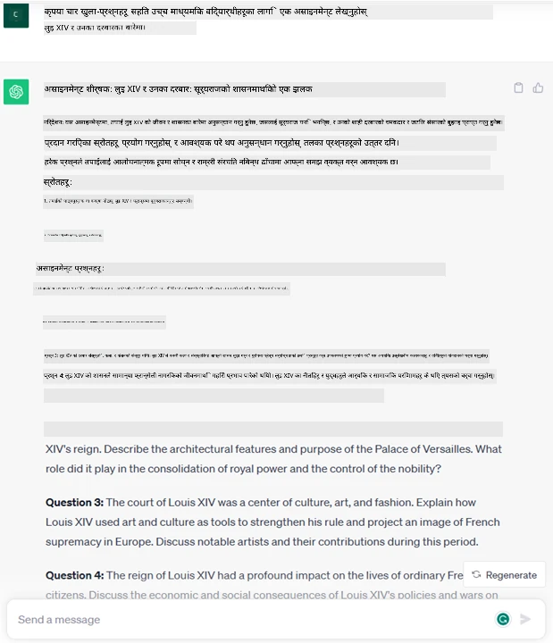
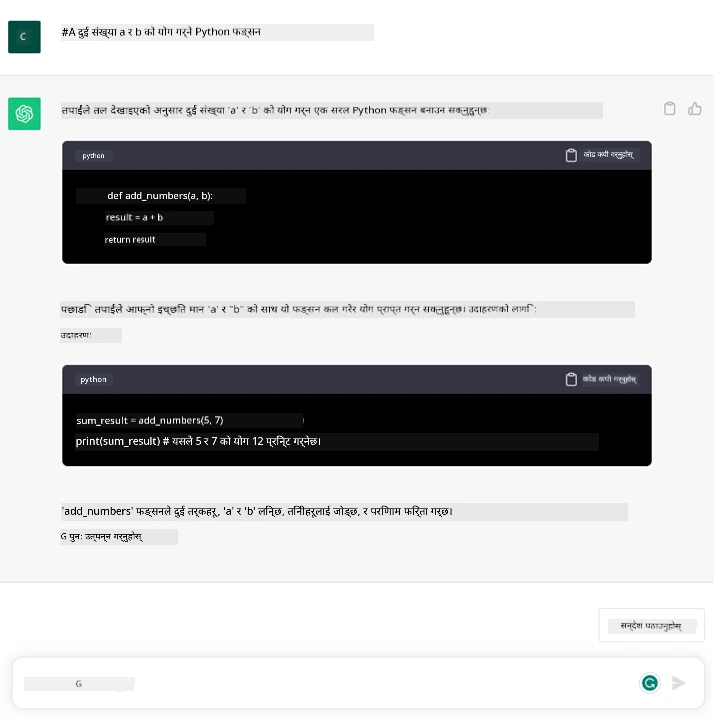

# जेनेरेटिव एआई र ठूलो भाषा मोडेलहरुमा परिचय

_(यस पाठको भिडियो हेर्न माथिको छवि क्लिक गर्नुहोस्)_

जेनेरेटिव एआई भनेको पाठ, छवि र अन्य प्रकारका सामग्री सिर्जना गर्न सक्षम कृत्रिम बुद्धिमत्ता हो। यसलाई उत्कृष्ट प्रविधि बनाउने कुरा के हो भने यसले एआईलाई लोकतान्त्रिक बनाउँछ, जसलाई सबैले सामान्य भाषामा लेखिएको सानो पाठ प्रॉम्प्टबाट पनि प्रयोग गर्न सक्छन्। तपाईंले कुनै जावा वा SQL जस्तो भाषा सिक्न आवश्यक छैन, तपाईंले आफ्नो भाषामा के चाहनुहुन्छ भनेर भन्नुहोस् र एआई मोडेलबाट सिफारिस आउँछ। यसको लागि आवेदन र प्रभाव विशाल छन्, तपाईं रिपोर्ट लेख्नुहुन्छ वा बुझ्नुहुन्छ, आवेदनहरू तयार गर्नुहुन्छ र धेरै कुरा गरिरहनुहुन्छ, सबै सेकेन्डमा।

यस पाठ्यक्रममा, हामी हाम्रो स्टार्टअपले जेनेरेटिव एआईलाई शिक्षा क्षेत्रमा नयाँ परिदृश्यहरू अनलक गर्न कसरी उपयोग गरिरहेको छ र यसका सामाजिक प्रभाव र प्रविधि सीमाहरू संग कसरी सम्बोधन गरिरहेको छ भन्ने कुरा अन्वेषण गर्नेछौं।

## परिचय

यस पाठमा समेटिने विषयहरू:

- व्यवसायिक परिदृश्य परिचय: हाम्रो स्टार्टअप विचार र मिशन।
- जेनेरेटिव एआई र हामी हालको प्रविधि परिवेशमा कसरी पुगेका छौं।
- ठूलो भाषा मोडेलको भित्री कामकाज।
- ठूलो भाषा मोडेलहरूको मुख्य क्षमता र व्यावहारिक प्रयोगहरू।

## सिकाइका लक्ष्यहरू

यस पाठ पूर्ण गरेपछि, तपाईंले बुझ्न सक्नुहुनेछ:

- जेनेरेटिव एआई के हो र ठूलो भाषा मोडेलहरू कसरी काम गर्छन्।
- शिक्षा सम्बन्धी परिदृश्यहरूमाथि ध्यान दिँदै ठूलो भाषा मोडेलहरू प्रयोग गर्ने तरिका।

## परिदृश्य: हाम्रो शैक्षिक स्टार्टअप

जेनेरेटिव कृत्रिम बुद्धिमत्ता (AI) एआई प्रविधिको सर्वोच्च स्थान हो, जुन पहिले असम्भव ठानिएको सीमा पार गरिरहेको छ। जेनेरेटिव एआई मोडेलहरूका विभिन्न क्षमता र प्रयोगहरू छन्, तर यस पाठ्यक्रमका लागि हामी काल्पनिक स्टार्टअप मार्फत शिक्षा क्षेत्रमा कसरी यसको क्रान्ति भइरहेको छ भन्ने कुरा अन्वेषण गर्नेछौं। हामी यस स्टार्टअपलाई _हाम्रो स्टार्टअप_ भन्छौं। हाम्रो स्टार्टअप शिक्षा क्षेत्रमा काम गर्छ र महत्वाकांक्षी मिशन छ

> _शिक्षामा पहुँचयोग्यता सुधार गर्दै, विश्वव्यापी रूपमा शिक्षामा समान पहुँच सुनिश्चित गर्दै र प्रत्येक विद्यार्थीको आवश्यकताअनुसार व्यक्तिगत अध्ययन अनुभव प्रदान गर्ने_।

हाम्रो स्टार्टअप टोलीलाई जानकारी छ कि हामीले यो लक्ष्य पूरा गर्न आजको सबैभन्दा शक्तिशाली उपकरणहरू मध्ये एक - ठूलो भाषा मोडेलहरू (LLMs) को उपयोग नगरी सम्भव छैन।

जेनेरेटिव एआईले हाम्रो सिकाइ र शिक्षणको तरिका क्रान्ति गर्ने अपेक्षा गरिएको छ, जहाँ विद्यार्थीहरूलाई २४ घण्टा भर्चुअल शिक्षक उपलब्ध हुन्छन् जसले विशाल मात्रामा जानकारी र उदाहरणहरू प्रदान गर्छन्, र शिक्षकहरूले नवप्रवर्तनशील उपकरणहरूको मद्दतले विद्यार्थीहरूको मूल्याङ्कन र प्रतिक्रिया दिन सक्षम हुन्छन्।

सुरु गर्न, हामी केही आधारभूत अवधारणा र पदावली परिभाषित गरौं जुन हामीले यस पाठ्यक्रममा प्रयोग गर्नेछौं।

## हामी कसरी जेनेरेटिव एआईमा पुगेका छौं?

हालको जेनेरेटिव एआई मोडेलहरूको घोषणा संग उत्पन्न भईएको असाधारण _उत्साह_को बावजुद, यो प्रविधि दशकौं देखि विकास भइरहेका छ, जसको पहिलो अनुसन्धान प्रयास ६० को दशकमा शुरू भएको हो। अहिले हामी एआईलाई मानव संज्ञानात्मक क्षमता, जस्तै संवाद गर्ने, सम्म पुगेका छौं जस्तै [OpenAI ChatGPT](https://openai.com/chatgpt) वा [Microsoft Copilot](https://copilot.microsoft.com/?WT.mc_id=academic-105485-koreyst), जसले पनि संवादात्मक वेब खोज अनुभवमा GPT मोडेल प्रयोग गर्छ।

सानोतिनो कुरा फर्काउँदै हेर्दा, एआईका पहिलो प्रोटोटाइपहरू टाइप गरिएको च्याटबोटहरू थिए, जुन विज्ञहरूको समूहबाट निकालिएको ज्ञान आधारमा भर पर्थे र कम्प्युटरमा प्रतिनिधित्व थिए। ज्ञान आधारका उत्तरहरू इनपुट पाठमा आउने कुञ्जी शब्दहरूद्वारा ट्रिगर हुन्थे।
तर, चाँडै यो स्पष्ट भयो कि टाइप गरिएको च्याटबोटहरूको यस्तो दृष्टिकोण राम्रोसँग विस्तार हुँदैन।

### एआईमा सांख्यिकीय दृष्टिकोण: मेशिन लर्निङ

९० को दशकमा ठूलो मोड आई शब्द विश्लेषणमा सांख्यिकीय दृष्टिकोणको अनुसन्धानको प्रयोग। यसले नयाँ एल्गोरिदमहरूको विकास गर्यो – जसलाई मेशिन लर्निङ भनिन्छ – जसले डेटा बाट उपन्यास सिक्ने सक्षम बनायो बिना सीधै प्रोग्रामिङ। यसले मेशिनलाई मानव भाषाको बुझाइ अनुकरण गर्न सक्षम बनायो: एक सांख्यिकीय मोडेल पाठ-लेबल जोडीमा तालिम पाउँछ, जसले अज्ञात इनपुट पाठलाई पूर्व-निर्धारित लेबलका आधारमा वर्गीकरण गर्न सक्छ।

### न्यूरल नेटवर्कहरू र आधुनिक भर्चुअल सहायकहरू

पछिल्ला वर्षहरूमा, ठूलो डेटा र जटिल गणनाहरु गर्न सक्षम हार्डवेयर टेक्नोलोजीको प्रगति, एआई अनुसन्धानलाई थप प्रोत्साहित गर्यो, जुन उन्नत मेशिन लर्निङ एल्गोरिदमहरू, न्यूरल नेटवर्क वा गहिरो शिक्षण एल्गोरिदमहरूका रूपमा परिचित छन्, विकास भयो।

न्यूरल नेटवर्कहरू (र विशेष गरी रेकरेन्ट न्यूरल नेटवर्कहरू – RNNs) ले प्राकृतिक भाषा प्रशोधनमा ठूलो सुधार गरे, जसले पाठको अर्थलाई बढी सान्दर्भिक तरिकाले प्रतिनिधित्व गर्न सक्षम बनायो, वाक्यमा शब्दको सन्दर्भलाई महत्व दिँदै।

यही प्रविधि हो जुन नयाँ सदीको पहिलो दशकमा जन्मिएका भर्चुअल सहायकहरूलाई मानव भाषा व्याख्या गर्न, आवश्यकतालाई पहिचान गर्न, र सन्तुष्ट पार्न कार्य गर्न सक्षम बनायो - जस्तै पूर्व-निर्धारित स्क्रिप्टले जवाफ दिने वा तेस्रो पक्षको सेवा उपभोग गर्ने।

### वर्तमान दिन, जेनेरेटिव एआई

यसरी हामी आजको जेनेरेटिव एआईमा पुगेका हौं, जसलाई गहिरो शिक्षणको एक उपसमूहका रूपमा देख्न सकिन्छ।

दशकौं लामो अनुसन्धान पछि, नयाँ मोडेल संरचना – जसलाई _ट्रान्सफर्मर_ भनिन्छ – ले RNNs को सीमाहरू पार गर्यो, लामो पाठ अनुक्रमहरू इनपुटका रूपमा लिन सक्षम। ट्रान्सफर्मरहरू ध्यान प्रविधिमा आधारित छन्, जसले मोडेललाई प्राप्त इनपुटहरूलाई भिन्न तौल दिन सक्षम बनाउँछ, जहाँ सबैभन्दा सान्दर्भिक सूचना केन्द्रित छ 'त्यहाँ बढी ध्यान दिँदै', पाठ अनुक्रममा क्रम जस्तो भए पनि।

हालका अधिकांश जेनेरेटिव एआई मोडेलहरू – जसलाई ठूलो भाषा मोडेलहरू (LLMs) पनि भनिन्छ, किनभने ती पाठ्यक्रम इनपुट र आउटपुटसँग काम गर्छन् – वास्तवमै यस संरचनामा आधारित छन्। यी मोडेलहरू, विभिन्न स्रोतहरू जस्तै पुस्तकहरू, लेखहरू र वेबसाइटहरूबाट ठूलो मात्रामा लेबलविहीन डाटामा तालिम पाएका हुन्, तिनीहरू विभिन्न कार्यहरूमा अनुकूलन गर्न सकिन्छ र व्याकरणसंगत पाठ सिर्जना गर्न सकिन्छ जुन केही हदसम्म सिर्जनात्मक देखिन्छ। त्यसैले, यिनीहरूले केवल प्रविधिलाई 'बुझ्ने' क्षमता वृद्धि गरेनन्, तर मानवीय भाषामा मौलिक जवाफ सिर्जना गर्ने क्षमता पनि प्रदान गरे।

## ठूलो भाषा मोडेलहरू कसरी काम गर्छन्?

अर्को अध्यायमा हामी विभिन्न प्रकारका जेनेरेटिव एआई मोडेलहरूको अन्वेषण गर्नेछौं, तर अहिले हामी ठूलो भाषा मोडेलहरू कसरी काम गर्छन् भनेर हेरौं, विशेष रूपमा OpenAI GPT (Generative Pre-trained Transformer) मोडेलहरूमा ध्यान केन्द्रित गर्दै।

- **टोकनाइजर, पाठलाई संख्यामा रूपान्तरण गर्ने**: ठूलो भाषा मोडेलहरूले एक पाठ इनपुट स्वरूप प्राप्त गर्छन् र एक पाठ आउटपुट रूपमा उत्पादन गर्छन्। तर, यी सांख्यिकीय मोडेलहरू हुन्, त्यसैले उनीहरूलाई पाठ अनुक्रम भन्दा संख्याहरूले राम्रो काम गर्छ। त्यसैले मोडेलमा प्रत्येक इनपुट टोकनाइजरले प्रशोधन गर्छ। टोकन भनेको पाठको एक हिस्सा हो – अक्षरहरूको अनिश्चित संख्याबाट बनेको, त्यसैले टोकनाइजरको मुख्य काम इनपुटलाई टोकनहरूको समूहमा विभाजन गर्नु हो। त्यसपछि प्रत्येक टोकनलाई टोकन सूचकांक संग मिलाइन्छ, जुन मूल पाठ अंशको पूर्णांक कूटाङ्क हो।

- **आउटपुट टोकन भविष्यवाणी**: n टोकन इनपुट दिनु भएको अवस्थामा (अधिकतम n मोडेल अनुसार फरक पर्दछ), मोडेलले एक टोकन आउटपुटको रूपमा भविष्यवाणी गर्नेछ। यो टोकनपछि अर्को पुनरावृत्तिको इनपुटमा समावेश हुन्छ, विस्तारित विन्डो ढाँचामा, जसले प्रयोगकर्तालाई अधिक सहज जवाफ (एक वा धेरै वाक्यहरू) प्राप्त गर्न सक्षम बनाउँछ। यसले व्याख्या गर्छ कि यदि तपाईंले कहिले ChatGPT उपयोग गर्नुभयो भने कहिलेकाहीँ यो वाक्यको बीचमा नै रोकिएको जस्तो देखिन्छ।

- **चयन प्रक्रिया, सम्भाव्यता वितरण**: आउटपुट टोकन, वर्तमान पाठ अनुक्रम पछि आउने सम्भावनाको आधारमा मोडेलले चयन गर्छ। किनभने मोडेलले सबै सम्भावित 'अर्को टोकन'हरूको सम्भाव्यता वितरण भविष्यवाणी गर्छ, यसको तालिमका आधारमा गणना गरिएको। तर, सधैं उच्चतम सम्भाव्यता भएको टोकन चयन हुँदैन। यस चयनमा केही अनियमितता थपिन्छ, जसले मोडेललाई अप्रत्याशित तरिकाले काम गर्न प्रेरित गर्छ - एउटै इनपुटमा झैं परिणाम प्राप्त हुँदैन। यस अनियमिततालाई सृजनात्मक सोचको अनुकरणका लागि प्रयोग गरिन्छ र यसलाई मोडेलको 'टेम्परेचर' नामक प्यारामिटरले समायोजन गर्न सकिन्छ।

## हाम्रो स्टार्टअपले ठूलो भाषा मोडेलहरू कसरी उपयोग गर्न सक्छ?

अब जब हामी ठूलो भाषा मोडेलको भित्री कामकाज राम्रोसँग बुझिसकेका छौं, हाम्रो व्यवसाय परिदृश्यमा ध्यान दिँदै उनीहरूले प्रभावकारी रूपमा गर्ने सबैभन्दा सामान्य कार्यहरूका व्यावहारिक उदाहरणहरू हेरौं।
हामीले भनेका थियौं कि ठूलो भाषा मोडेलको मुख्य क्षमता _सुरुबाट नै पाठ सिर्जना गर्ने, प्राकृतिक भाषामा लेखिएको टेक्स्ट इनपुटबाट_ हो।

तर कस्तो प्रकारको पाठ इनपुट र आउटपुट?
ठूलो भाषा मोडेलमा इनपुटलाई प्रॉम्प्ट भनिन्छ, जबकि आउटपुटलाई कम्प्लिशन भनिन्छ, जसले मोडेलको वर्तमान इनपुट पूरै गर्न अर्को टोकन सिर्जना गर्ने प्रविधिलाई जनाउँछ। हामी प्रॉम्प्ट के हो र यसलाई कसरी डिजाइन गर्ने भन्ने विषयमा गहिराइमा जान्छौं। तर अहिले भन्न सकिन्छ प्रॉम्प्टमा समावेश हुन सक्छ:

- एक **निर्देशन** जुन मोडेलबाट अपेक्षित आउटपुटको प्रकार निर्दिष्ट गर्छ। कहिलेकाहीं निर्देशनले केही उदाहरणहरू वा अतिरिक्त डेटा समावेश गर्न सक्छ।

  1. कुनै लेख, किताब, उत्पादन समीक्षा आदिको संक्षेप र अव्यवस्थित डेटा बाट रहेको जानकारी निकाल्नु।
    
    
  
  2. कुनै लेख, निबन्ध, काम वा अन्य सिर्जनात्मक सोच र डिजाइन।
      
     

- एक **प्रश्न**, जुन एजेन्टसँग संवादको रूपमा सोधिन्छ।
  
  

- **पूरा गर्नुपर्ने पाठ**, जुन अप्रत्यक्ष रूपमा लेखन सहयोगको अनुरोध हो।
  
  

- कोडको एक टुक्रा जुन व्याख्या र कागजीकरणको अनुरोधसहित हुन्छ, वा कुनै विशिष्ट कार्य गर्ने कोड सिर्जना गर्न अनुरोध गर्दछ।
  
  

माथिका उदाहरणहरू अत्यन्त सरल छन् र ठूलो भाषा मोडेलहरूको क्षमता को पूर्ण प्रदर्शन होइन। यीले विशेष गरी शैक्षिक सन्दर्भमा जेनेरेटिव एआई प्रयोगको सम्भावना देखाउन बनाइएका छन्।

साथै, जेनेरेटिव एआईको आउटपुट पूर्ण छैन र कहिलेकाहीं मोडेलको सिर्जनशीलताले यसलाई मानव प्रयोगकर्ताले सत्यताको भ्रमका रूपमा व्याख्या गर्नसक्ने वा आपत्तिजनक हुनसक्ने शब्दहरूको संयोजनमा परिणत गर्न सक्छ। जेनेरेटिव एआई बुद्धिमान छैन - कम्तिमा ती व्यापक बुद्धिमत्ताका परिभाषाहरू, जसमा आलोचनात्मक, सिर्जनात्मक तर्क वा भावनात्मक बुद्धिमत्ता समावेश छ; यो गैर-नियतात्मक छ, र भरोसायोग्य छैन, किनकि गलत सन्दर्भहरू, सामग्री र कथनहरू सहि जानकारी संग मिसिन सक्छन् र विश्वसनीय र आत्मविश्वासी तरिकाले प्रस्तुत हुन सक्छन्। आगामी पाठहरूमा, हामी यी सबै सीमाहरूलाई व्यवस्थापन गर्नेछौं र कसरी तिनलाई कम गर्ने प्रयास गर्ने छौं।

## काम

तपाईंको काम [जेनेरेटिव एआई](https://en.wikipedia.org/wiki/Generative_artificial_intelligence?WT.mc_id=academic-105485-koreyst)बारे थप पढ्न र आज पनि जहाँ यो छैन त्यो क्षेत्रमा जेनेरेटिव एआई राख्नु उपयुक्त हुन्छ भनी पत्ता लगाउने हो। यसले पुरानो तरिकाबाट के फरक प्रभाव पार्नेछ, तपाईंले पहिले गर्न नसकेको के गर्न सक्नुहुन्छ, वा तपाईं छिटो हुनुहुन्छ? तपाईंले ३०० शब्दको सारांश लेख्नुहोस् जुन तपाईंको सपना एआई स्टार्टअप कस्तो देखिन्छ भन्ने कुरा प्रस्तुत गर्छ र "समस्या", "मैले एआई कसरी प्रयोग गर्ने", "प्रभाव" जस्ता शीर्षकहरू समावेश गर्न सकिन्छ र ऐच्छिक रूपमा व्यापार योजना।

यदि तपाईंले यो काम गर्नुभयो भने, तपाईं माइक्रोसफ्टको इन्क्युबेटर [Microsoft for Startups Founders Hub](https://www.microsoft.com/startups?WT.mc_id=academic-105485-koreyst) मा आवेदन दिन तयार हुन सक्नुहुन्छ; हामी एजर, OpenAI, मार्गदर्शन र अन्य धेरैका लागि क्रेडिटहरू प्रदान गर्छौं, हेर्नुहोस्!

## ज्ञान जाँच

ठूलो भाषा मोडेलहरू बारे के सही हो?

1. तपाईंले प्रत्येकपटक ठ्याक्कै एउटै जवाफ पाउनुहुन्छ।
1. यसले कामहरू पूर्ण रूपमा गर्दछ, अंक थप्न, कार्यरत कोड उत्पादन गर्न आदि राम्रो हुन्छ।
1. एउटै प्रॉम्प्ट प्रयोग गर्दा जवाफ फरक हुन सक्छ। यसले तपाईंलाई कुनै वस्तुको पहिलो मसौदा दिन उत्कृष्ट छ, चाहे त्यो पाठ हो वा कोड। तर तपाईंले नतिजामा सुधार गर्नुपर्छ।

उत्तर: 3, LLM गैर-नियतात्मक हुन्छ, जवाफ फरक पर्छ, तपाईं यसको फरकलाई टेम्परेचर सेटिङ्गद्वारा नियन्त्रण गर्न सक्नुहुन्छ। तपाईंले यसले पूर्ण रूपमा काम गर्ने आशा गर्नु हुँदैन, यो तपाईंका लागि भारी काम गर्ने यहाँ छ जसको माने प्रायः तपाईंलाई कुनै कुराको राम्रो पहिलो प्रयास दिन्छ जुन तपाईंले क्रमिक रुपमा सुधार गर्नुपर्छ।

## उत्कृष्ट काम! यात्रा जारी राख्नुहोस्

यस पाठ पूरा गरेपछि, हाम्रो [जेनेरेटिव एआई सिकाइ संग्रह](https://aka.ms/genai-collection?WT.mc_id=academic-105485-koreyst) हेर्नुहोस् र तपाईंको जेनेरेटिव एआई ज्ञानलाई अझ उचाइमा पुर्याउनुहोस्!

पाठ २ मा जानुहोस् जहाँ हामीले [विभिन्न LLM प्रकारहरू अन्वेषण र तुलना गर्ने](../02-exploring-and-comparing-different-llms/README.md?WT.mc_id=academic-105485-koreyst) तरिका हेर्नेछौं!

---

<!-- CO-OP TRANSLATOR DISCLAIMER START -->
**अस्वीकरण**:
यो दस्तावेज़ AI अनुवाद सेवा [Co-op Translator](https://github.com/Azure/co-op-translator) प्रयोग गरेर अनुवाद गरिएको हो। हामी सही हुन प्रयास गर्छौं, तर कृपया जानकार हुनुस् कि स्वचालित अनुवादमा त्रुटिहरू वा अशुद्धताहरू हुन सक्छन्। मूल दस्तावेज़ यसको मूल भाषामा आधिकारिक स्रोत मानिनुपर्छ। महत्वपूर्ण जानकारीका लागि व्यावसायिक मानव अनुवाद सिफारिस गरिन्छ। यस अनुवादको प्रयोगबाट उत्पन्न कुनै पनि गलत बुझाइ वा त्रुटिको लागि हामी जिम्मेवार छैनौं।
<!-- CO-OP TRANSLATOR DISCLAIMER END -->