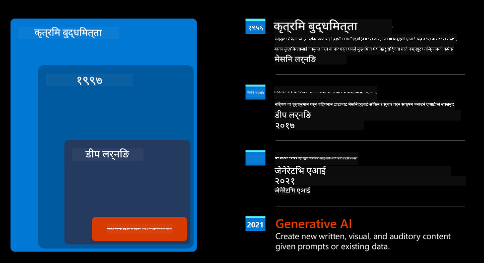
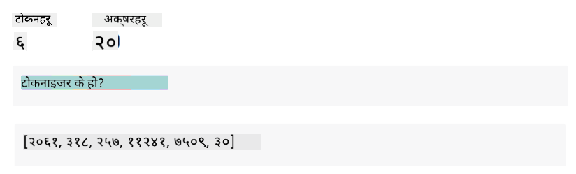

<!--
CO_OP_TRANSLATOR_METADATA:
{
  "original_hash": "bfb7901bdbece1ba3e9f35c400ca33e8",
  "translation_date": "2025-10-17T13:54:53+00:00",
  "source_file": "01-introduction-to-genai/README.md",
  "language_code": "ne"
}
-->
# जेनेरेटिभ एआई र ठूला भाषा मोडेलहरूको परिचय

_(यो पाठको भिडियो हेर्न माथिको तस्बिरमा क्लिक गर्नुहोस्)_

जेनेरेटिभ एआई भनेको पाठ, तस्बिर र अन्य प्रकारका सामग्रीहरू सिर्जना गर्न सक्षम कृत्रिम बुद्धिमत्ता हो। यसलाई अद्भुत प्रविधि बनाउने कुरा यो हो कि यसले एआईलाई सबैका लागि उपलब्ध गराउँछ। तपाईंले केवल प्राकृतिक भाषामा लेखिएको एउटा वाक्य, एउटा पाठ संकेत प्रयोग गरेर यसलाई चलाउन सक्नुहुन्छ। तपाईंले जाभा वा SQL जस्ता भाषा सिक्न आवश्यक छैन; तपाईंले आफ्नो भाषा प्रयोग गरेर चाहेको कुरा भन्नुहोस्, र एआई मोडेलबाट सुझाव प्राप्त गर्नुहोस्। यसको अनुप्रयोग र प्रभाव विशाल छ - रिपोर्ट लेख्न वा बुझ्न, आवेदन तयार गर्न र धेरै कामहरू केही सेकेन्डमै गर्न सकिन्छ।

यस पाठ्यक्रममा, हामीले हाम्रो स्टार्टअपले शिक्षा क्षेत्रमा नयाँ सम्भावनाहरू अनलक गर्न जेनेरेटिभ एआईलाई कसरी प्रयोग गरेको छ भन्ने कुरा अन्वेषण गर्नेछौं। साथै, यसको प्रयोगसँग सम्बन्धित सामाजिक प्रभाव र प्रविधि सीमाहरूको चुनौतीहरूलाई कसरी सम्बोधन गर्ने भन्ने कुरा पनि बुझ्नेछौं।

## परिचय

यस पाठले समेट्नेछ:

- व्यापार परिदृश्यको परिचय: हाम्रो स्टार्टअपको विचार र उद्देश्य।
- जेनेरेटिभ एआई र वर्तमान प्रविधि परिदृश्यमा कसरी आइपुगियो।
- ठूला भाषा मोडेलको आन्तरिक कार्यप्रणाली।
- ठूला भाषा मोडेलहरूको मुख्य क्षमता र व्यावहारिक प्रयोगका केसहरू।

## सिक्ने लक्ष्यहरू

यस पाठ पूरा गरेपछि, तपाईं बुझ्नुहुनेछ:

- जेनेरेटिभ एआई के हो र ठूला भाषा मोडेलहरू कसरी काम गर्छन्।
- ठूला भाषा मोडेलहरूलाई विभिन्न प्रयोगका लागि कसरी उपयोग गर्न सकिन्छ, विशेष गरी शिक्षा परिदृश्यमा।

## परिदृश्य: हाम्रो शैक्षिक स्टार्टअप

जेनेरेटिभ कृत्रिम बुद्धिमत्ता (एआई) भनेको एआई प्रविधिको शिखर हो, जसले असम्भव ठानिएको कुराको सीमा धकेल्दैछ। जेनेरेटिभ एआई मोडेलहरूमा धेरै क्षमता र अनुप्रयोगहरू छन्, तर यस पाठ्यक्रमका लागि हामीले यसले शिक्षा क्षेत्रमा कसरी क्रान्ति ल्याइरहेको छ भन्ने कुरा काल्पनिक स्टार्टअपको माध्यमबाट अन्वेषण गर्नेछौं। हामी यस स्टार्टअपलाई _हाम्रो स्टार्टअप_ भनेर उल्लेख गर्नेछौं। हाम्रो स्टार्टअप शिक्षा क्षेत्रमा काम गर्छ र यसको महत्वाकांक्षी उद्देश्य छ:

> _विश्वव्यापी स्तरमा सिकाइमा पहुँच सुधार गर्दै, शिक्षा पहुँचलाई समान बनाउँदै, र प्रत्येक सिक्ने व्यक्तिको आवश्यकताअनुसार व्यक्तिगत सिकाइ अनुभव प्रदान गर्दै।_

हाम्रो स्टार्टअप टोलीलाई थाहा छ कि हामीले यो लक्ष्य प्राप्त गर्न आधुनिक समयको सबैभन्दा शक्तिशाली उपकरणहरू मध्ये एक - ठूला भाषा मोडेलहरू (LLMs) - बिना सम्भव छैन।

जेनेरेटिभ एआईले आजको सिकाइ र शिक्षणको तरिकालाई क्रान्तिकारी बनाउने अपेक्षा गरिएको छ। विद्यार्थीहरूले २४ घण्टा उपलब्ध भर्चुअल शिक्षकहरू पाउनेछन्, जसले ठूलो मात्रामा जानकारी र उदाहरणहरू प्रदान गर्नेछन्। शिक्षकहरूले आफ्ना विद्यार्थीहरूको मूल्याङ्कन गर्न र प्रतिक्रिया दिन नवीन उपकरणहरू प्रयोग गर्न सक्नेछन्।

सुरु गर्न, हामीले यस पाठ्यक्रममा प्रयोग गरिने केही आधारभूत अवधारणाहरू र शब्दावली परिभाषित गरौं।

## जेनेरेटिभ एआई कसरी आयो?

जेनेरेटिभ एआई मोडेलहरूको घोषणा पछि हालै सिर्जना गरिएको असाधारण _हाइप_ को बाबजुद, यो प्रविधि दशकौंको प्रयासको परिणाम हो। पहिलो अनुसन्धान प्रयासहरू ६० को दशकमा सुरु भएका थिए। हामी अहिले एआईसँग मानव संज्ञानात्मक क्षमता भएको बिन्दुमा छौं, जस्तै संवाद, उदाहरणका लागि [OpenAI ChatGPT](https://openai.com/chatgpt) वा [Bing Chat](https://www.microsoft.com/edge/features/bing-chat?WT.mc_id=academic-105485-koreyst) द्वारा देखाइएको, जसले वेब खोज Bing संवादहरूको लागि GPT मोडेल प्रयोग गर्दछ।

थोरै पछाडि फर्केर हेर्दा, एआईको पहिलो प्रोटोटाइपहरू टाइप गरिएका च्याटबटहरू थिए, जसले विशेषज्ञहरूको समूहबाट निकालिएको ज्ञान आधारमा निर्भर गर्थे। कम्प्युटरमा प्रतिनिधित्व गरिएको ज्ञान आधारमा रहेका उत्तरहरू इनपुट पाठमा देखा पर्ने कुञ्जी शब्दहरूद्वारा ट्रिगर गरिन्थ्यो। 

तर, चाँडै नै यस्तो दृष्टिकोण, टाइप गरिएका च्याटबटहरू प्रयोग गरेर, राम्रोसँग स्केल नहुने स्पष्ट भयो।

### एआईको सांख्यिकीय दृष्टिकोण: मेशिन लर्निङ

९० को दशकमा पाठ विश्लेषणमा सांख्यिकीय दृष्टिकोणको प्रयोगले एउटा मोड ल्यायो। यसले नयाँ एल्गोरिदमहरूको विकास गर्‍यो - जसलाई मेशिन लर्निङ भनिन्छ - जसले डेटा बाट ढाँचाहरू सिक्न सक्षम बनायो बिना स्पष्ट रूपमा प्रोग्राम गरिएको। यस दृष्टिकोणले मेसिनलाई मानव भाषा बुझाइको नक्कल गर्न अनुमति दियो: पाठ-लेबल जोडीहरूमा प्रशिक्षित गरिएको सांख्यिकीय मोडेलले अज्ञात इनपुट पाठलाई पूर्व-परिभाषित लेबलसँग वर्गीकृत गर्न सक्षम बनायो।

### न्युरल नेटवर्कहरू र आधुनिक भर्चुअल सहायकहरू

हालका वर्षहरूमा, हार्डवेयरको प्रविधिगत विकास, जसले ठूलो मात्रामा डेटा र जटिल गणनाहरू ह्यान्डल गर्न सक्षम बनायो, एआईमा अनुसन्धानलाई प्रोत्साहित गर्‍यो। यसले न्युरल नेटवर्कहरू वा गहिरो सिकाइ एल्गोरिदम भनिने उन्नत मेशिन लर्निङ एल्गोरिदमहरूको विकासलाई जन्म दियो।

न्युरल नेटवर्कहरू (विशेष गरी पुनरावर्ती न्युरल नेटवर्कहरू - RNNs) ले प्राकृतिक भाषा प्रशोधनलाई महत्त्वपूर्ण रूपमा सुधार गर्‍यो। यसले पाठको अर्थलाई अधिक अर्थपूर्ण तरिकामा प्रतिनिधित्व गर्न सक्षम बनायो, वाक्यमा शब्दको सन्दर्भलाई महत्त्व दिँदै।

यो प्रविधि पहिलो दशकमा जन्मिएका भर्चुअल सहायकहरूलाई शक्ति प्रदान गर्ने प्रविधि हो। यी सहायकहरू मानव भाषा व्याख्या गर्न, आवश्यकतालाई पहिचान गर्न, र त्यसलाई पूरा गर्न कार्य गर्न सक्षम थिए - जस्तै पूर्व-परिभाषित स्क्रिप्टको साथ उत्तर दिन वा तेस्रो पक्षको सेवा उपभोग गर्न।

### वर्तमान समय, जेनेरेटिभ एआई

यसरी हामी आजको जेनेरेटिभ एआईमा आइपुग्यौं, जसलाई गहिरो सिकाइको उपसमूहको रूपमा हेर्न सकिन्छ।

एआई क्षेत्रमा दशकौंको अनुसन्धान पछि, नयाँ मोडेल आर्किटेक्चर - _ट्रान्सफर्मर_ - ले RNNs को सीमाहरू पार गर्‍यो। यसले इनपुटको रूपमा पाठको धेरै लामो अनुक्रमहरू प्राप्त गर्न सक्षम बनायो। ट्रान्सफर्मरहरू ध्यान मेकानिजममा आधारित छन्, जसले मोडेललाई प्राप्त इनपुटहरूलाई विभिन्न तौल दिन सक्षम बनाउँछ। यसले पाठ अनुक्रममा क्रमको परवाह नगरी सबैभन्दा सान्दर्भिक जानकारी केन्द्रित स्थानमा 'ध्यान दिन' सक्षम बनाउँछ।

हालका जेनेरेटिभ एआई मोडेलहरू - जसलाई ठूला भाषा मोडेलहरू (LLMs) पनि भनिन्छ, किनभने तिनीहरू पाठ इनपुट र आउटपुटसँग काम गर्छन् - वास्तवमा यस आर्किटेक्चरमा आधारित छन्। यी मोडेलहरू - किताबहरू, लेखहरू र वेबसाइटहरू जस्ता विविध स्रोतहरूबाट ठूलो मात्रामा लेबल नगरिएको डेटा मा प्रशिक्षित - विभिन्न कार्यहरूमा अनुकूलित गर्न सकिन्छ। तिनीहरूले व्याकरणात्मक रूपमा सही पाठ सिर्जना गर्न र सिर्जनात्मकताको झल्को दिन सक्षम छन्। यसले मेसिनलाई इनपुट पाठ 'बुझ्न' को क्षमता मात्र सुधार गरेको छैन, तर मानव भाषामा मौलिक प्रतिक्रिया सिर्जना गर्ने क्षमता पनि सक्षम बनाएको छ।

## ठूला भाषा मोडेलहरू कसरी काम गर्छन्?

अर्को अध्यायमा हामी विभिन्न प्रकारका जेनेरेटिभ एआई मोडेलहरूको अन्वेषण गर्नेछौं। तर अहिलेका लागि, हामी ठूला भाषा मोडेलहरू कसरी काम गर्छन् भन्ने कुरा हेर्नेछौं, विशेष गरी OpenAI GPT (Generative Pre-trained Transformer) मोडेलहरूमा केन्द्रित।

- **टोकनाइजर, पाठलाई संख्यामा रूपान्तरण**: ठूला भाषा मोडेलहरूले इनपुटको रूपमा पाठ प्राप्त गर्छन् र आउटपुटको रूपमा पाठ सिर्जना गर्छन्। तर, सांख्यिकीय मोडेलहरू भएकोले, तिनीहरू पाठ अनुक्रमहरू भन्दा संख्याहरूमा राम्रोसँग काम गर्छन्। त्यसैले मोडेलको मुख्य भागले प्रयोग गर्नु अघि प्रत्येक इनपुटलाई टोकनाइजरद्वारा प्रशोधन गरिन्छ। टोकन भनेको पाठको टुक्रा हो - चरित्रहरूको चर संख्याबाट बनेको। टोकनाइजरको मुख्य कार्य इनपुटलाई टोकनहरूको एरेमा विभाजन गर्नु हो। त्यसपछि, प्रत्येक टोकनलाई टोकन सूचकांकसँग मिलाइन्छ, जुन मूल पाठ टुक्राको पूर्णांक कोडिङ हो।

- **आउटपुट टोकनहरूको भविष्यवाणी**: n टोकनहरू इनपुटको रूपमा दिइएपछि (अधिकतम n मोडेलबाट मोडेलमा फरक हुन्छ), मोडेलले आउटपुटको रूपमा एउटा टोकन भविष्यवाणी गर्न सक्षम हुन्छ। यो टोकन अर्को पुनरावृत्तिको इनपुटमा समावेश गरिन्छ, विस्तार हुने विन्डो ढाँचामा। यसले एक वा धेरै वाक्य उत्तरको रूपमा प्राप्त गर्ने राम्रो प्रयोगकर्ता अनुभव सक्षम बनाउँछ। यसले व्याख्या गर्छ कि यदि तपाईंले कहिल्यै ChatGPT सँग खेलेको हुनुहुन्छ भने, कहिलेकाहीँ यो वाक्यको बीचमा रोकिएको जस्तो देखिन्छ।

- **चयन प्रक्रिया, सम्भाव्यता वितरण**: आउटपुट टोकन मोडेलद्वारा वर्तमान पाठ अनुक्रम पछि हुने सम्भावनाको आधारमा चयन गरिन्छ। यो मोडेलले सबै सम्भावित 'अर्को टोकनहरू' मा सम्भाव्यता वितरणको भविष्यवाणी गर्छ। यो वितरण यसको प्रशिक्षणको आधारमा गणना गरिएको छ। तर, सधैं उच्चतम सम्भावनाको टोकन वितरणबाट चयन गरिँदैन। यस चयनमा केही हदसम्म अनियमितता थपिन्छ। यसले मोडेललाई गैर-निर्धारणात्मक तरिकामा कार्य गर्न सक्षम बनाउँछ - हामीले एउटै इनपुटको लागि ठ्याक्कै एउटै आउटपुट प्राप्त गर्दैनौं। यो अनियमितताको डिग्री सिर्जनात्मक सोचको प्रक्रिया अनुकरण गर्न थपिएको हो। यसलाई तापक्रम नामक मोडेल प्यारामिटर प्रयोग गरेर ट्युन गर्न सकिन्छ।

## हाम्रो स्टार्टअपले ठूला भाषा मोडेलहरू कसरी उपयोग गर्न सक्छ?

अब हामीले ठूला भाषा मोडेलको आन्तरिक कार्यप्रणालीको राम्रो समझ पाएका छौं। अब हामीले तिनीहरूले राम्रोसँग प्रदर्शन गर्न सक्ने सबैभन्दा सामान्य कार्यहरूको व्यावहारिक उदाहरणहरू हेर्नेछौं। हाम्रो व्यापार परिदृश्यलाई ध्यानमा राख्दै।

हामीले भनेका थियौं कि ठूला भाषा मोडेलको मुख्य क्षमता _प्राकृतिक भाषामा लेखिएको पाठ इनपुटबाट सुरु गर्दै, नयाँ पाठ सिर्जना गर्नु_ हो।

तर कस्तो प्रकारको पाठ इनपुट र आउटपुट?
ठूला भाषा मोडेलको इनपुटलाई संकेत (prompt) भनिन्छ, जबकि आउटपुटलाई पूर्णता (completion) भनिन्छ। यो मोडेलले वर्तमान इनपुटलाई पूरा गर्न अर्को टोकन सिर्जना गर्ने मेकानिज्मलाई जनाउँछ। हामी संकेत के हो र मोडेलबाट अधिकतम लाभ प्राप्त गर्न यसलाई कसरी डिजाइन गर्ने भन्ने कुरा गहिरो रूपमा अन्वेषण गर्नेछौं। तर अहिलेका लागि, संकेतमा समावेश हुन सक्छ:

- **निर्देशन**: मोडेलबाट अपेक्षित आउटपुटको प्रकार निर्दिष्ट गर्ने निर्देशन। यो निर्देशन कहिलेकाहीँ केही उदाहरणहरू वा केही अतिरिक्त डेटा समावेश गर्न सक्छ।

  1. लेख, पुस्तक, उत्पादन समीक्षा आदिको संक्षेपण, साथै असंरचित डेटा बाट अन्तर्दृष्टि निकाल्ने।
    
    
  
  2. लेख, निबन्ध, असाइनमेन्ट वा अन्यको सिर्जनात्मक विचार र डिजाइन।
      
     

- **प्रश्न**: एजेन्टसँगको संवादको रूपमा सोधिएको प्रश्न।
  
  

- **पाठको टुक्रा पूरा गर्न**: जसले अप्रत्यक्ष रूपमा लेखन सहयोगको लागि अनुरोध गर्दछ।
  
  

- **कोडको टुक्रा**: व्याख्या र दस्तावेजीकरणको लागि सोधिएको, वा विशिष्ट कार्य प्रदर्शन गर्ने कोडको टुक्रा सिर्जना गर्न सोधिएको टिप्पणी।
  
  

माथिका उदाहरणहरू धेरै सरल छन् र ठूला भाषा मोडेलहरूको क्षमताको व्यापक प्रदर्शनको रूपमा अभिप्रेत छैनन्। तिनीहरू जेनेरेटिभ एआईको प्रयोगको सम्भावना देखाउनका लागि अभिप्रेत छन्, विशेष गरी तर शैक्षिक सन्दर्भमा मात्र सीमित छैन।

साथै, जेनेरेटिभ एआई मोडेलको आउटपुट पूर्ण छैन। कहिलेकाहीँ मोडेलको सिर्जनात्मकता यसको विरुद्ध काम गर्न सक्छ। यसले शब्दहरूको संयोजनको रूपमा परिणाम दिन सक्छ, जसलाई मानव प्रयोगकर्ताले वास्तविकताको विकृति वा अपमानजनक रूपमा व्याख्या गर्न सक्छ। जेनेरेटिभ एआई बुद्धिमान छैन - कम से कम व्यापक बुद्धिमत्ताको परिभाषामा, जसमा आलोचनात्मक र सिर्जनात्मक तर्क वा भावनात्मक बुद्धिमत्ता समावेश छ। यो निर्धारणात्मक छैन, र यो विश्वासयोग्य छैन। गलत सन्दर्भहरू, सामग्री, र कथनहरू सही जानकारीसँग मिलेर प्रस्तुत गर्न सकिन्छ। यसले विश्वसनीय र आत्मविश्वासपूर्ण तरिकामा प्रस्तुत गर्न सक्छ। आगामी पाठहरूमा, हामी यी सीमाहरूको सामना गर्नेछौं र तिनीहरूलाई कम गर्न के गर्न सकिन्छ भन्ने कुरा हेर्नेछौं।

## असाइनमेन्ट

तपाईंको असाइनमेन्ट भनेको [जेनेरेटिभ एआई](https://en.wikipedia.org/wiki/Generative_artificial_intelligence?WT.mc_id=academic-105485-koreyst) बारे थप पढ्नुहोस् र आज जेनेरेटिभ एआई नभएको क्षेत्रमा यसलाई थप्ने क्षेत्र पहिचान गर्नुहोस्। पुरानो तरिकाले गर्ने कामको तुलनामा प्रभाव कस्तो फरक हुनेछ? के तपाईंले पहिले गर्न नसक्ने काम गर्न सक्नुहुन्छ, वा तपाईं छिटो हुनुहुन्छ? तपाईंको सपना एआई स्टार्टअप कस्तो देखिन्छ भन्ने बारेमा ३०० शब्दको सारांश लेख्नुहोस्। यसमा "समस्या", "म एआई कसरी प्रयोग गर्नेछु", "प्रभाव" र वैकल्पिक रूपमा व्यापार योजना जस्ता शीर्षकहरू समावेश गर्नुहोस्।

यदि तपाईंले यो कार्य गर्नुभयो भने, तपाईं Microsoft को इनक्युबेटरमा आवेदन दिन तयार हुन सक्नुहुन्छ। [Microsoft for Startups Founders Hub](https://www.microsoft.com/startups?WT.mc_id=academic-105485-koreyst) हामी Azure, OpenAI, परामर्श र धेरै कुराहरूको लागि क्रेडिटहरू प्रदान गर्छौं। हेर्नुहोस्!

## ज्ञान जाँच

ठूला भाषा मोडेलहरूको बारेमा के सत्य हो?

1. तपाईंले प्रत्येक पटक ठ्याक्कै एउटै प्रतिक्रिया प्राप्त गर्नुहुन्छ।
1. यसले सबै कुरा पूर्ण रूपमा गर्छ, संख्याहरू थप्न, काम गर्ने कोड उत्पादन गर्न आदि।
1. प्रतिक्रिया फरक हुन सक्छ, एउटै संकेत प्रयोग गर्दा पनि। यो पाठ वा कोडको पहिलो ड्राफ्ट दिन उत्कृष्ट छ। तर तपाईंले परिणाम सुधार गर्न आवश्यक छ।

A: 3, LLM गैर-निर्धारणात्मक छ। प्रतिक्रिया फरक हुन्छ। तापक्रम सेटिङ प्रयोग गरेर यसको भिन्नता नियन्त्रण गर्न सकिन्छ। तपाईंले यसलाई पूर्ण रूपमा काम गर्ने अपेक्षा गर्नु हुँदैन। यो तपाईंको लागि भारी काम गर्न यहाँ छ, जसले प्रायः तपाईंलाई केही सुधार गर्नुपर्ने राम्रो पहिलो प्रयास दिन्छ।

## उत्कृष्ट काम! यात्रा जारी राख्नुहोस्

यो पाठ पूरा गरेपछि, हाम्रो [जेनेरेटिभ एआई सिकाइ संग्रह](https://aka.ms/genai-collection?WT.mc_id=academic-105485-koreyst) हेर्नुहोस्। जेनेरेटिभ एआईको ज्ञान स्तरवृद्ध
Lesson 2 मा जानुहोस् जहाँ हामी [विभिन्न LLM प्रकारहरू अन्वेषण र तुलना गर्ने](../02-exploring-and-comparing-different-llms/README.md?WT.mc_id=academic-105485-koreyst) तरिका हेर्नेछौं!

---

**अस्वीकरण**:  
यो दस्तावेज AI अनुवाद सेवा [Co-op Translator](https://github.com/Azure/co-op-translator) प्रयोग गरेर अनुवाद गरिएको छ। हामी शुद्धताको लागि प्रयास गर्छौं, तर कृपया ध्यान दिनुहोस् कि स्वचालित अनुवादमा त्रुटिहरू वा अशुद्धताहरू हुन सक्छ। यसको मूल भाषा मा रहेको दस्तावेजलाई आधिकारिक स्रोत मानिनुपर्छ। महत्वपूर्ण जानकारीको लागि, व्यावसायिक मानव अनुवाद सिफारिस गरिन्छ। यस अनुवादको प्रयोगबाट उत्पन्न हुने कुनै पनि गलतफहमी वा गलत व्याख्याको लागि हामी जिम्मेवार हुने छैनौं।