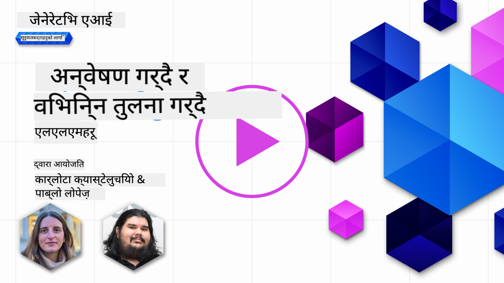
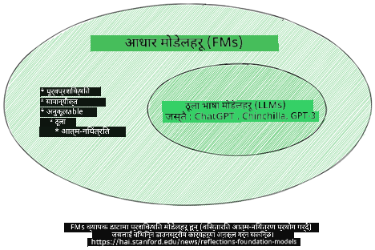
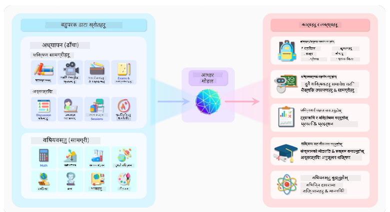
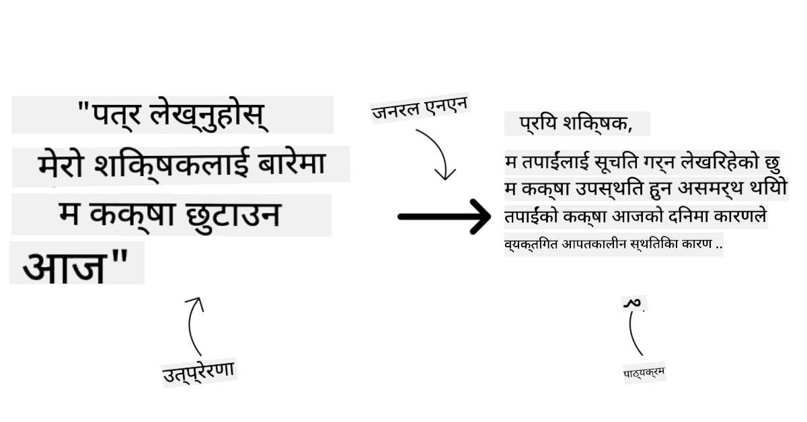

<!--
CO_OP_TRANSLATOR_METADATA:
{
  "original_hash": "e2f686f2eb794941761252ac5e8e090b",
  "translation_date": "2025-05-19T13:52:56+00:00",
  "source_file": "02-exploring-and-comparing-different-llms/README.md",
  "language_code": "ne"
}
-->
# विभिन्न LLMs को अन्वेषण र तुलना गर्दै

> _यो पाठको भिडियो हेर्न माथिको चित्रमा क्लिक गर्नुहोस्_

पछिल्लो पाठमा, हामीले देख्यौं कि कसरी Generative AI ले प्रविधि क्षेत्रमा परिवर्तन ल्याउँदैछ, कसरी ठूला भाषा मोडेलहरू (LLMs) काम गर्छन् र कसरी एक व्यवसाय - हाम्रो स्टार्टअप जस्तै - तिनीहरूलाई आफ्नो प्रयोग केसहरूमा लागू गर्न र वृद्धि गर्न सक्छन्! यस अध्यायमा, हामी विभिन्न प्रकारका ठूला भाषा मोडेलहरू (LLMs) लाई तुलना गर्न र तिनीहरूको फाइदा र बेफाइदाहरू बुझ्न खोज्दैछौं।

हाम्रो स्टार्टअपको यात्रामा अर्को कदम भनेको वर्तमान LLMs को परिदृश्यको अन्वेषण गर्नु र हाम्रो प्रयोग केसको लागि उपयुक्त कुन हो भन्ने बुझ्नु हो।

## परिचय

यस पाठमा समावेश हुनेछ:

- वर्तमान परिदृश्यमा विभिन्न प्रकारका LLMs।
- Azure मा आफ्नो प्रयोग केसको लागि विभिन्न मोडेलहरू परीक्षण, पुनरावृत्ति, र तुलना गर्ने।
- LLM कसरी तैनात गर्ने।

## सिकाइ लक्ष्यहरू

यो पाठ पूरा गरेपछि, तपाईं सक्षम हुनुहुनेछ:

- आफ्नो प्रयोग केसको लागि सही मोडेल चयन गर्नुहोस्।
- कसरी आफ्नो मोडेलको प्रदर्शन परीक्षण, पुनरावृत्ति, र सुधार गर्ने भनेर बुझ्नुहोस्।
- व्यवसायहरूले मोडेलहरू कसरी तैनात गर्छन् भनेर जान्नुहोस्।

## विभिन्न प्रकारका LLMs बुझ्नुहोस्

LLMs लाई तिनीहरूको वास्तुकला, प्रशिक्षण डेटा, र प्रयोग केसको आधारमा धेरै वर्गीकरणहरू हुन सक्छ। यी भिन्नताहरू बुझ्नाले हाम्रो स्टार्टअपलाई सही मोडेल चयन गर्न मद्दत गर्नेछ, र कसरी परीक्षण गर्ने, पुनरावृत्ति गर्ने, र प्रदर्शन सुधार गर्ने बुझ्न मद्दत गर्नेछ।

धेरै प्रकारका LLM मोडेलहरू छन्, तपाईंको मोडेलको छनोट तपाईंले के उद्देश्यले प्रयोग गर्न चाहनुहुन्छ, तपाईंको डेटा, तपाईं कति तिर्न तयार हुनुहुन्छ र थप कुरामा निर्भर गर्दछ।

तपाईंले मोडेलहरूलाई पाठ, अडियो, भिडियो, छवि उत्पादन आदिको लागि प्रयोग गर्न चाहनुहुन्छ भने, तपाईंले फरक प्रकारको मोडेल छनोट गर्न सक्नुहुन्छ।

- **अडियो र भाषण पहिचान**। यस उद्देश्यका लागि, व्हिस्पर-प्रकारका मोडेलहरू एक उत्कृष्ट विकल्प हुन् किनभने तिनीहरू सामान्य-उद्देश्यका हुन् र भाषण पहिचानमा लक्षित छन्। यो विविध अडियोमा प्रशिक्षित छ र बहुभाषी भाषण पहिचान गर्न सक्छ। [Whisper प्रकारका मोडेलहरूको बारेमा यहाँ थप जान्नुहोस्](https://platform.openai.com/docs/models/whisper?WT.mc_id=academic-105485-koreyst)।

- **छवि उत्पादन**। छवि उत्पादनको लागि, DALL-E र Midjourney दुई धेरै परिचित विकल्पहरू हुन्। DALL-E Azure OpenAI द्वारा प्रस्ताव गरिएको छ। [DALL-E को बारेमा यहाँ थप पढ्नुहोस्](https://platform.openai.com/docs/models/dall-e?WT.mc_id=academic-105485-koreyst) र यस पाठ्यक्रमको अध्याय 9 मा पनि।

- **पाठ उत्पादन**। अधिकांश मोडेलहरू पाठ उत्पादनमा प्रशिक्षित छन् र तपाईंसँग GPT-3.5 देखि GPT-4 सम्मका धेरै विकल्पहरू छन्। तिनीहरू विभिन्न लागतमा आउँछन् GPT-4 सबैभन्दा महँगो छ। यो मूल्य र क्षमताको सन्दर्भमा कुन मोडेलहरू तपाईंको आवश्यकताहरूको लागि उत्तम फिट हुन्छ भनेर मूल्याङ्कन गर्न [Azure OpenAI playground](https://oai.azure.com/portal/playground?WT.mc_id=academic-105485-koreyst) मा हेर्न लायक छ।

- **बहु-मोडालिटी**। यदि तपाईं इनपुट र आउटपुटमा धेरै प्रकारका डेटा ह्यान्डल गर्न खोज्दै हुनुहुन्छ भने, तपाईंले [gpt-4 टर्बो विद भिजन वा gpt-4o](https://learn.microsoft.com/azure/ai-services/openai/concepts/models#gpt-4-and-gpt-4-turbo-models?WT.mc_id=academic-105485-koreyst) जस्ता मोडेलहरूमा हेर्न चाहनुहुन्छ - OpenAI मोडेलहरूको नवीनतम संस्करणहरू - जसले प्राकृतिक भाषा प्रशोधनलाई दृश्य बुझाइसँग संयोजन गर्न सक्षम छन्, बहु-मोडल इन्टरफेसहरू मार्फत अन्तरक्रियाहरू सक्षम गर्दै।

मोडेल चयन गर्दा तपाईंलाई केहि आधारभूत क्षमताहरू प्राप्त हुन्छन्, जुन पर्याप्त नहुन सक्छ। अक्सर तपाईंको कम्पनीसँग विशेष डेटा हुन्छ जुन तपाईंले LLM लाई कुनै न कुनै रूपमा भन्नु आवश्यक हुन्छ। त्यो कसरी दृष्टिकोण गर्ने भन्नेमा केही फरक विकल्पहरू छन्, आगामी खण्डहरूमा थप जानकारी।

### फाउन्डेशन मोडेलहरू बनाम LLMs

फाउन्डेशन मोडेल शब्द [स्ट्यानफोर्डका अनुसन्धानकर्ताहरूद्वारा बनाइएको](https://arxiv.org/abs/2108.07258?WT.mc_id=academic-105485-koreyst) हो र AI मोडेलको रूपमा परिभाषित गरिएको छ जुन केही मापदण्डहरू पालना गर्दछ, जस्तै:

- **तिनीहरू असुपरभाइज्ड लर्निङ वा सेल्फ-सुपरभाइज्ड लर्निङ प्रयोग गरेर प्रशिक्षित गरिएका छन्**, जसको अर्थ तिनीहरू लेबल नभएको बहु-मोडल डेटा मा प्रशिक्षित गरिन्छ, र तिनीहरूको प्रशिक्षण प्रक्रियाको लागि डेटा को मानव एनोटेशन वा लेबलिङ को आवश्यकता पर्दैन।
- **तिनीहरू धेरै ठूला मोडेलहरू हुन्**, धेरै गहिरो न्यूरल नेटवर्कमा आधारित छन् जुन अर्बौं प्यारामिटरहरूमा प्रशिक्षित गरिएका छन्।
- **तिनीहरू सामान्यतया अन्य मोडेलहरूको लागि 'फाउन्डेशन' को रूपमा सेवा गर्नको लागि अभिप्रेरित छन्**, जसको अर्थ अन्य मोडेलहरू निर्माण गर्नको लागि सुरुवात बिन्दुको रूपमा प्रयोग गर्न सकिन्छ, जुन फाइन-ट्यूनिङ गरेर गर्न सकिन्छ।

छवि स्रोत: [फाउन्डेशन मोडेलहरू र ठूला भाषा मोडेलहरूको आवश्यक मार्गदर्शक | बाबर एम भट्टी | मीडियम
](https://thebabar.medium.com/essential-guide-to-foundation-models-and-large-language-models-27dab58f7404)

यो भिन्नता थप स्पष्ट गर्नको लागि, हामी ChatGPT लाई उदाहरणको रूपमा लिऔं। ChatGPT को पहिलो संस्करण निर्माण गर्न, GPT-3.5 नामक मोडेल फाउन्डेशन मोडेलको रूपमा सेवा गर्यो। यसको अर्थ OpenAI ले GPT-3.5 को एक ट्यून गरिएको संस्करण सिर्जना गर्न केही च्याट-विशिष्ट डेटा प्रयोग गर्यो जुन च्याटबोटहरू जस्ता वार्तालाप परिदृश्यहरूमा राम्रो प्रदर्शन गर्न विशेष गरिएको थियो।

छवि स्रोत: [2108.07258.pdf (arxiv.org)](https://arxiv.org/pdf/2108.07258.pdf?WT.mc_id=academic-105485-koreyst)

### खुला स्रोत बनाम मालिकाना मोडेलहरू

LLMs लाई वर्गीकरण गर्ने अर्को तरिका भनेको तिनीहरू खुला स्रोत वा मालिकाना हुन् कि होइनन्।

खुला-स्रोत मोडेलहरू सार्वजनिक रूपमा उपलब्ध गराइएका मोडेलहरू हुन् र जो कोहीले प्रयोग गर्न सक्छन्। यी प्रायः तिनीहरूलाई सिर्जना गर्ने कम्पनी वा अनुसन्धान समुदायले उपलब्ध गराउँछ। यी मोडेलहरूलाई निरीक्षण, परिमार्जन, र LLMs मा विभिन्न प्रयोग केसहरूको लागि अनुकूलित गर्न अनुमति दिइन्छ। यद्यपि, तिनीहरू सधैं उत्पादन प्रयोगको लागि अनुकूलित छैनन्, र सम्भवतः मालिकाना मोडेलहरूको रूपमा प्रदर्शनकारी छैनन्। साथै, खुला-स्रोत मोडेलहरूको लागि कोष सीमित हुन सक्छ, र तिनीहरू लामो समयसम्म मर्मत हुन सक्दैन वा तिनीहरूलाई पछिल्लो अनुसन्धानसँग अद्यावधिक गर्न सक्दैन। लोकप्रिय खुला स्रोत मोडेलहरूको उदाहरणहरूमा [Alpaca](https://crfm.stanford.edu/2023/03/13/alpaca.html?WT.mc_id=academic-105485-koreyst), [Bloom](https://huggingface.co/bigscience/bloom) र [LLaMA](https://llama.meta.com) समावेश छन्।

मालिकाना मोडेलहरू कम्पनीको स्वामित्वमा रहेका मोडेलहरू हुन् र सार्वजनिक रूपमा उपलब्ध छैनन्। यी मोडेलहरू प्रायः उत्पादन प्रयोगको लागि अनुकूलित गरिएका छन्। यद्यपि, तिनीहरूलाई निरीक्षण, परिमार्जन, वा विभिन्न प्रयोग केसहरूको लागि अनुकूलित गर्न अनुमति दिइएको छैन। साथै, तिनीहरू सधैं निःशुल्क उपलब्ध हुँदैनन्, र प्रयोग गर्नको लागि सदस्यता वा भुक्तानी आवश्यक पर्न सक्छ। साथै, प्रयोगकर्ताहरूले मोडेललाई प्रशिक्षण दिन प्रयोग गरिएको डेटा नियन्त्रण गर्दैनन्, जसको अर्थ उनीहरूले डेटा गोपनीयता र AI को जिम्मेवार प्रयोगको लागि प्रतिबद्धता सुनिश्चित गर्न मोडेल मालिकलाई विश्वास गर्नुपर्छ। लोकप्रिय मालिकाना मोडेलहरूको उदाहरणहरूमा [OpenAI मोडेलहरू](https://platform.openai.com/docs/models/overview?WT.mc_id=academic-105485-koreyst), [Google Bard](https://sapling.ai/llm/bard?WT.mc_id=academic-105485-koreyst) वा [Claude 2](https://www.anthropic.com/index/claude-2?WT.mc_id=academic-105485-koreyst) समावेश छन्।

### एम्बेडिङ बनाम छवि उत्पादन बनाम पाठ र कोड उत्पादन

LLMs लाई तिनीहरूले उत्पादन गर्ने आउटपुटद्वारा पनि वर्गीकृत गर्न सकिन्छ।

एम्बेडिङहरू एक सेटको मोडेलहरू हुन् जसले पाठलाई संख्यात्मक रूपान्तरणमा रूपान्तरण गर्न सक्छ, जसलाई एम्बेडिङ भनिन्छ, जुन इनपुट पाठको संख्यात्मक प्रतिनिधित्व हो। एम्बेडिङहरूले मेसिनहरूलाई शब्दहरू वा वाक्यहरू बीचको सम्बन्ध बुझ्न सजिलो बनाउँछ र अन्य मोडेलहरूद्वारा इनपुटको रूपमा उपभोग गर्न सकिन्छ, जस्तै वर्गीकरण मोडेलहरू, वा संख्यात्मक डेटा मा राम्रो प्रदर्शन गर्ने क्लस्टरिङ मोडेलहरू। एम्बेडिङ मोडेलहरू प्रायः ट्रान्सफर लर्निङको लागि प्रयोग गरिन्छ, जहाँ एक मोडेल एक प्रतिस्थापन कार्यको लागि निर्माण गरिन्छ जसको लागि प्रशस्त डेटा उपलब्ध छ, र त्यसपछि मोडेल वजनहरू (एम्बेडिङहरू) अन्य डाउनस्ट्रीम कार्यहरूको लागि पुन: प्रयोग गरिन्छ। यस कोटीको एक उदाहरण हो [OpenAI एम्बेडिङहरू](https://platform.openai.com/docs/models/embeddings?WT.mc_id=academic-105485-koreyst)।

छवि उत्पादन मोडेलहरू मोडेलहरू हुन् जसले छविहरू उत्पन्न गर्छन्। यी मोडेलहरू प्रायः छवि सम्पादन, छवि संश्लेषण, र छवि अनुवादको लागि प्रयोग गरिन्छ। छवि उत्पादन मोडेलहरू प्रायः छविहरूको ठूला डेटासेटहरूमा प्रशिक्षित हुन्छन्, जस्तै [LAION-5B](https://laion.ai/blog/laion-5b/?WT.mc_id=academic-105485-koreyst), र नयाँ छविहरू उत्पन्न गर्न वा चित्रण, सुपर-रेजोल्युसन, र रंगीनकरण प्रविधिहरूको साथ विद्यमान छविहरू सम्पादन गर्न प्रयोग गर्न सकिन्छ। उदाहरणहरूमा [DALL-E-3](https://openai.com/dall-e-3?WT.mc_id=academic-105485-koreyst) र [Stable Diffusion मोडेलहरू](https://github.com/Stability-AI/StableDiffusion?WT.mc_id=academic-105485-koreyst) समावेश छन्।

पाठ र कोड उत्पादन मोडेलहरू मोडेलहरू हुन् जसले पाठ वा कोड उत्पन्न गर्छन्। यी मोडेलहरू प्रायः पाठ संक्षेपण, अनुवाद, र प्रश्न उत्तरको लागि प्रयोग गरिन्छ। पाठ उत्पादन मोडेलहरू प्रायः पाठको ठूला डेटासेटहरूमा प्रशिक्षित हुन्छन्, जस्तै [BookCorpus](https://www.cv-foundation.org/openaccess/content_iccv_2015/html/Zhu_Aligning_Books_and_ICCV_2015_paper.html?WT.mc_id=academic-105485-koreyst), र नयाँ पाठ उत्पन्न गर्न, वा प्रश्नहरूको उत्तर दिन प्रयोग गर्न सकिन्छ। कोड उत्पादन मोडेलहरू, जस्तै [CodeParrot](https://huggingface.co/codeparrot?WT.mc_id=academic-105485-koreyst), प्रायः कोडको ठूला डेटासेटहरूमा प्रशिक्षित हुन्छन्, जस्तै GitHub, र नयाँ कोड उत्पन्न गर्न, वा विद्यमान कोडमा बगहरू ठीक गर्न प्रयोग गर्न सकिन्छ।

### एन्कोडर-डिकोडर बनाम केवल डिकोडर

LLMs का विभिन्न प्रकारका आर्किटेक्चरहरूको बारेमा कुरा गर्न, हामी एक उपमा प्रयोग गरौं।

कल्पना गर्नुहोस् कि तपाईंको प्रबन्धकले तपाईंलाई विद्यार्थीहरूको लागि एक प्रश्नावली लेख्ने कार्य दिनुभयो। तपाईंका दुई सहकर्मीहरू छन्; एक सामग्री सिर्जना गर्न र अर्को समीक्षा गर्न जिम्मेवार छ।

सामग्री सिर्जनाकर्ता केवल डिकोडर मोडेल जस्तै हो, उनीहरूले विषयलाई हेर्न सक्छन् र तपाईंले पहिले नै के लेख्नुभएको छ र त्यसपछि उनी त्यसको आधारमा पाठ्यक्रम लेख्न सक्छन्। उनीहरू आकर्षक र जानकारीमूलक सामग्री लेख्नमा धेरै राम्रो छन्, तर उनीहरू विषय र सिकाइ उद्देश्यहरू बुझ्नमा त्यति राम्रो छैनन्। डिकोडर मोडेलहरूको केही उदाहरणहरू GPT परिवारका मोडेलहरू हुन्, जस्तै GPT-3।

समीक्षक एक एन्कोडर मात्र मोडेल जस्तै हो, उनीहरूले लेखिएको पाठ्यक्रम र उत्तरहरू हेर्छन्, तिनीहरू बीचको सम्बन्ध नोटिस गर्छन् र सन्दर्भ बुझ्छन्, तर सामग्री उत्पन्न गर्न राम्रो छैनन्। एन्कोडर मात्र मोडेलको एक उदाहरण BERT हुनेछ।

कल्पना गर्नुहोस् कि हामीसँग कोही पनि हुन सक्छ जसले प्रश्नावली सिर्जना र समीक्षा गर्न सक्छ, यो एक एन्कोडर-डिकोडर मोडेल हो। केही उदाहरणहरू BART र T5 हुनेछ।

### सेवा बनाम मोडेल

अब, सेवा र मोडेल बीचको भिन्नताको बारेमा कुरा गरौं। सेवा एक उत्पाद हो जुन क्लाउड सेवा प्रदायक द्वारा प्रस्तावित गरिन्छ, र प्रायः मोडेलहरू, डेटा, र अन्य घटकहरूको संयोजन हो। मोडेल सेवाको मुख्य घटक हो, र प्रायः फाउन्डेशन मोडेल हो, जस्तै LLM।

सेवाहरू प्रायः उत्पादन प्रयोगको लागि अनुकूलित हुन्छन् र प्रायः मोडेलहरू भन्दा प्रयोग गर्न सजिलो हुन्छन्, ग्राफिकल प्रयोगकर्ता इन्टरफेस मार्फत। यद्यपि, सेवाहरू सधैं निःशुल्क उपलब्ध हुँदैनन्, र प्रयोग गर्नको लागि सदस्यता वा भुक्तानी आवश्यक पर्न सक्छ, सेवा मालिकको उपकरण र स्रोतहरू प्रयोग गर्ने, खर्चहरू अनुकूलित गर्ने र सजिलै स्केल गर्नेको सट्टामा। सेवाको एक उदाहरण [Azure OpenAI सेवा](https://learn.microsoft.com/azure/ai-services/openai/overview?WT.mc_id=academic-105485-koreyst) हो, जसले पे-एज-यू-गो दर योजना प्रस्ताव गर्दछ, जसको अर्थ प्रयोगकर्ताहरूलाई सेवा प्रयोग गरेको अनुपातमा शुल्क लगाइन्छ। साथै, Azure OpenAI सेवा उद्यम-स्तरीय सुरक्षा र मोडेलहरूको क्षमताहरूको शीर्षमा जिम्मेवार AI फ्रेमवर्क प्रस्ताव गर्दछ।

मोडेलहरू केवल न्यूरल नेटवर्क हुन्, प्यारामिटरहरू, वजनहरू, र अन्यहरूसँग। कम्पनीहरूलाई स्थानीय रूपमा चलाउन अनुमति दिँदै, तर उपकरणहरू किन्नु पर्नेछ, स्केल गर्न संरचना निर्माण गर्नु पर्नेछ र लाइसेन्स किन्नु पर्नेछ वा खुला-स्रोत मोडेल प्रयोग गर्नु पर्नेछ। LLaMA जस्तै मोडेल प्रयोगको लागि उपलब्ध छ, मोडेल चलाउन कम्प्युटेशनल शक्ति आवश्यक पर्दछ।

## Azure मा प्रदर्शन बुझ्न विभिन्न मोडेलहरूसँग परीक्षण र पुनरावृत्ति कसरी गर्ने

एक पटक हाम्रो टोलीले वर्तमान LLMs परिदृश्यको अन्वेषण गरिसकेपछि र आफ्नो परिदृश्यहरूको लागि केही राम्रा उम्मेदवारहरू पहिचान गरेपछि, अर्को चरण तिनीहरूलाई आफ्नो डेटा र आफ्नो कार्यभारमा परीक्षण गर्ने हो। यो एक पुनरावृत्त प्रक्रिया हो, प्रयोग र उपायहरू द्वारा गरिन्छ। हामीले अघिल्ला अनुच्छेदहरूमा उल्लेख गरेका अधिकांश मोडेलहरू (OpenAI मोडेलहरू, Llama2 जस्ता खुला स्रोत मोडेलहरू, र Hugging Face ट्रान्सफर्मरहरू) [Azure AI स्टुडियो](https://ai.azure.com/?WT.mc_id=academic-105485-koreyst) मा [मोडेल क्याटलग](https://learn.microsoft.com/azure/ai-studio/how-to/model-catalog-overview?WT.mc_id=academic-105485-koreyst) मा उपलब्ध छन्।

[Azure AI स्टुडियो](https://learn.microsoft.com
- उद्योगमा उपलब्ध मोडेल र डाटासेटहरूमा आधारित तुलना गर्न [Model Benchmarks](https://learn.microsoft.com/azure/ai-studio/how-to/model-benchmarks?WT.mc_id=academic-105485-koreyst) प्यानल प्रयोग गरेर कुन मोडेल व्यवसायिक परिदृश्यमा मेल खान्छ भनेर मूल्याङ्कन गर्नुहोस्।

- विशेष कार्यभारमा मोडेलको प्रदर्शन सुधार गर्न अनुकूलन प्रशिक्षण डाटामा मोडेललाई फाइन-ट्यून गर्नुहोस्, Azure AI Studio को परीक्षण र ट्र्याकिङ क्षमताहरूको उपयोग गर्दै।

- अनुप्रयोगहरूलाई उपभोग गर्न सक्षम बनाउन मूल पूर्व-प्रशिक्षित मोडेल वा फाइन-ट्यून गरिएको संस्करणलाई रिमोट वास्तविक समय अनुमान - व्यवस्थापित कम्प्युट - वा सर्भरलेस एपीआई अन्त बिन्दुमा - [pay-as-you-go](https://learn.microsoft.com/azure/ai-studio/how-to/model-catalog-overview#model-deployment-managed-compute-and-serverless-api-pay-as-you-go?WT.mc_id=academic-105485-koreyst) - मा तैनात गर्नुहोस्।

> [!NOTE]
> क्याटलगमा रहेका सबै मोडेलहरू हाल फाइन-ट्यूनिङ र/वा pay-as-you-go तैनातीको लागि उपलब्ध छैनन्। मोडेलको क्षमताहरू र सीमाहरूको विवरणको लागि मोडेल कार्ड जाँच गर्नुहोस्।

## LLM परिणामहरू सुधार गर्दै

हामीले हाम्रो स्टार्टअप टोलीसँग विभिन्न प्रकारका LLM र क्लाउड प्लेटफर्म (Azure Machine Learning) को अन्वेषण गरेका छौं जसले हामीलाई विभिन्न मोडेलहरूको तुलना गर्न, तिनीहरूलाई परीक्षण डाटामा मूल्याङ्कन गर्न, प्रदर्शन सुधार गर्न र तिनीहरूलाई अनुमान अन्त बिन्दुहरूमा तैनात गर्न सक्षम बनाउँछ।

तर कहिले उनीहरूले पूर्व-प्रशिक्षित मोडेल प्रयोग गर्नुको सट्टा मोडेललाई फाइन-ट्यून गर्न विचार गर्नुपर्छ? के विशिष्ट कार्यभारमा मोडेलको प्रदर्शन सुधार गर्न अन्य दृष्टिकोणहरू छन्?

व्यवसायले LLM बाट आवश्यक परिणामहरू प्राप्त गर्नका लागि धेरै दृष्टिकोणहरू प्रयोग गर्न सक्छ। तपाईंले उत्पादनमा LLM तैनात गर्दा विभिन्न प्रकारका मोडेलहरू छनोट गर्न सक्नुहुन्छ, जसमा प्रशिक्षणको विभिन्न स्तरहरू, जटिलता, लागत, र गुणस्तर हुन्छन्। यहाँ केहि फरक दृष्टिकोणहरू छन्:

- **सन्दर्भसँग प्रम्प्ट इन्जिनियरिङ**। विचार भनेको तपाईंले चाहेको प्रतिक्रिया प्राप्त गर्न प्रम्प्ट गर्दा पर्याप्त सन्दर्भ प्रदान गर्नु हो।

- **Retrieval Augmented Generation, RAG**। तपाईंको डाटा उदाहरणको लागि डेटाबेस वा वेब अन्त बिन्दुमा हुन सक्छ, यो सुनिश्चित गर्न यो डाटा वा यसको उपसमुच्चय प्रम्प्ट गर्दा समावेश गरिएको छ, तपाईंले सम्बन्धित डाटा फेच गर्न सक्नुहुन्छ र त्यसलाई प्रयोगकर्ताको प्रम्प्टको भाग बनाउन सक्नुहुन्छ।

- **फाइन-ट्यून गरिएको मोडेल**। यहाँ, तपाईंले आफ्नो डाटामा मोडेललाई थप प्रशिक्षण दिनुभयो जसले मोडेललाई तपाईंको आवश्यकताहरूमा बढी सटीक र उत्तरदायी बनायो तर यसले महँगो हुन सक्छ।

### सन्दर्भसँग प्रम्प्ट इन्जिनियरिङ

पूर्व-प्रशिक्षित LLM हरू सामान्यकृत प्राकृतिक भाषा कार्यहरूमा धेरै राम्रोसँग काम गर्छन्, यहाँसम्म कि तिनीहरूलाई छोटो प्रम्प्ट, जस्तै पूरा गर्न वाक्य वा प्रश्नको साथ बोलाउँदा - तथाकथित "शून्य-शट" सिकाइ।

यद्यपि, प्रयोगकर्ताले आफ्नो सोधाईलाई जति धेरै फ्रेम गर्न सक्छन्, विस्तृत अनुरोध र उदाहरणहरू - सन्दर्भ - उत्तर त्यति नै सटीक र प्रयोगकर्ताको अपेक्षाहरू नजिक हुनेछ। यस अवस्थामा, हामी "एक-शट" सिकाइको बारेमा कुरा गर्छौं यदि प्रम्प्टमा केवल एक उदाहरण समावेश छ भने र "केही शट सिकाइ" यदि यसमा धेरै उदाहरणहरू समावेश छन्।
सन्दर्भसँग प्रम्प्ट इन्जिनियरिङ सुरु गर्नको लागि सबैभन्दा लागत-प्रभावी दृष्टिकोण हो।

### Retrieval Augmented Generation (RAG)

LLM हरूसँग यो सीमितता छ कि तिनीहरूले उत्तर उत्पन्न गर्नको लागि आफ्नो प्रशिक्षणको समयमा प्रयोग गरिएको डाटा मात्र प्रयोग गर्न सक्छन्। यसको अर्थ तिनीहरूले आफ्नो प्रशिक्षण प्रक्रिया पछि भएका घटनाहरूको बारेमा केही पनि जान्दैनन्, र तिनीहरूले गैर-सार्वजनिक जानकारी (जस्तै कम्पनी डाटा) पहुँच गर्न सक्दैनन्।
यो RAG मार्फत पार गर्न सकिन्छ, जुन प्रविधि हो जसले प्रम्प्टलाई बाह्य डाटाको रूपमा कागजातहरूको टुक्राहरूको रूपमा थप्छ, प्रम्प्टको लम्बाइ सीमाहरू विचार गर्दै। यो भेक्टर डाटाबेस उपकरणहरू (जस्तै [Azure Vector Search](https://learn.microsoft.com/azure/search/vector-search-overview?WT.mc_id=academic-105485-koreyst)) द्वारा समर्थित छ जसले विभिन्न पूर्व-परिभाषित डाटा स्रोतहरूबाट उपयोगी टुक्राहरू पुनः प्राप्त गर्दछ र तिनीहरूलाई प्रम्प्ट सन्दर्भमा थप्छ।

यो प्रविधि धेरै उपयोगी छ जब कुनै व्यवसायसँग पर्याप्त डाटा छैन, पर्याप्त समय छैन, वा LLM लाई फाइन-ट्यून गर्न स्रोतहरू छैनन्, तर अझै पनि विशिष्ट कार्यभारमा प्रदर्शन सुधार गर्न र गलतफहमीको जोखिमहरू कम गर्न चाहन्छ, अर्थात् वास्तविकताको मिथ्याकरण वा हानिकारक सामग्री।

### फाइन-ट्यून गरिएको मोडेल

फाइन-ट्यूनिङ एक प्रक्रिया हो जसले मोडेललाई डाउनस्ट्रीम कार्य वा विशिष्ट समस्या समाधान गर्न 'अनुकूल' गर्न ट्रान्सफर लर्निङको उपयोग गर्दछ। केही शट सिकाइ र RAG भन्दा फरक, यसले नयाँ मोडेल उत्पन्न गर्दछ, अद्यावधिक गरिएको वजन र पूर्वाग्रहहरू सहित। यसलाई प्रशिक्षण उदाहरणहरूको सेट आवश्यक हुन्छ जसमा एकल इनपुट (प्रम्प्ट) र यसको सम्बन्धित आउटपुट (सम्पूर्णता) हुन्छ।
यो प्राथमिकता दिने दृष्टिकोण हुनेछ यदि:

- **फाइन-ट्यून गरिएको मोडेलहरू प्रयोग गर्दै**। कुनै व्यवसायले उच्च प्रदर्शन मोडेलहरू भन्दा फाइन-ट्यून गरिएको कम सक्षम मोडेलहरू (जस्तै एम्बेडिङ मोडेलहरू) प्रयोग गर्न चाहन्छ, जसको परिणामस्वरूप बढी लागत प्रभावी र छिटो समाधान हुन्छ।

- **विलम्ब विचार गर्दै**। विलम्ब विशेष प्रयोग-केसको लागि महत्त्वपूर्ण छ, त्यसैले धेरै लामो प्रम्प्टहरू प्रयोग गर्न सम्भव छैन वा उदाहरणहरूको संख्या जसलाई मोडेलबाट सिक्नुपर्छ प्रम्प्टको लम्बाइ सीमासँग मेल खाँदैन।

- **अप-टु-डेट रहँदै**। कुनै व्यवसायसँग धेरै उच्च-गुणस्तरको डाटा र ग्राउन्ड ट्रुथ लेबलहरू छन् र समयसँगै यो डाटा अप-टु-डेट राख्न आवश्यक स्रोतहरू छन्।

### प्रशिक्षित मोडेल

प्रारम्भदेखि नै LLM प्रशिक्षण गर्नु सबैभन्दा कठिन र अपनाउन सबैभन्दा जटिल दृष्टिकोण हो, जसमा ठूलो मात्रामा डाटा, कुशल स्रोतहरू, र उपयुक्त कम्प्युटेशनल शक्ति आवश्यक हुन्छ। यो विकल्पलाई मात्र विचार गर्नुपर्छ जहाँ कुनै व्यवसायसँग डोमेन-विशिष्ट प्रयोग केस र डोमेन-केंद्रित डाटाको ठूलो मात्रा हुन्छ।

## ज्ञान जाँच

LLM सम्पूर्णता परिणामहरू सुधार गर्नको लागि के राम्रो दृष्टिकोण हुन सक्छ?

1. सन्दर्भसँग प्रम्प्ट इन्जिनियरिङ
1. RAG
1. फाइन-ट्यून गरिएको मोडेल

A:3, यदि तपाईंसँग समय र स्रोतहरू छन् र उच्च गुणस्तरको डाटा छ भने, अप-टु-डेट रहनको लागि फाइन-ट्यूनिङ राम्रो विकल्प हो। यद्यपि, यदि तपाईं सुधार गर्न खोज्दै हुनुहुन्छ र तपाईंले समयको कमी महसुस गर्नुहुन्छ भने RAG लाई पहिले विचार गर्नु लायक छ।

## 🚀 चुनौती

तपाईंको व्यवसायको लागि [RAG प्रयोग गर्नुहोस्](https://learn.microsoft.com/azure/search/retrieval-augmented-generation-overview?WT.mc_id=academic-105485-koreyst) कसरी गर्न सकिन्छ भनेर थप पढ्नुहोस्।

## राम्रो काम, तपाईंको सिकाइ जारी राख्नुहोस्

यो पाठ पूरा गरेपछि, हाम्रो [Generative AI Learning collection](https://aka.ms/genai-collection?WT.mc_id=academic-105485-koreyst) हेर्नुहोस् ताकि तपाईंको Generative AI ज्ञान स्तरवृद्धि गर्न जारी राख्न सक्नुहोस्!

पाठ 3 मा जानुहोस् जहाँ हामीले [उत्तरदायी रूपमा Generative AI निर्माण गर्ने](../03-using-generative-ai-responsibly/README.md?WT.mc_id=academic-105485-koreyst) कसरी गर्ने हेर्नेछौं!

**अस्वीकरण**:  
यो दस्तावेज AI अनुवाद सेवा [Co-op Translator](https://github.com/Azure/co-op-translator) प्रयोग गरेर अनुवाद गरिएको छ। हामी शुद्धताका लागि प्रयास गर्छौं, तर कृपया सचेत रहनुहोस् कि स्वचालित अनुवादहरूमा त्रुटिहरू वा अशुद्धताहरू हुन सक्छ। यसको मूल भाषा मा रहेको दस्तावेजलाई आधिकारिक स्रोत मानिनु पर्छ। महत्वपूर्ण जानकारीको लागि, व्यावसायिक मानव अनुवाद सिफारिस गरिन्छ। यस अनुवादको प्रयोगबाट उत्पन्न हुने कुनै पनि गलतफहमी वा गलत व्याख्याको लागि हामी जिम्मेवार हुनेछैनौं।