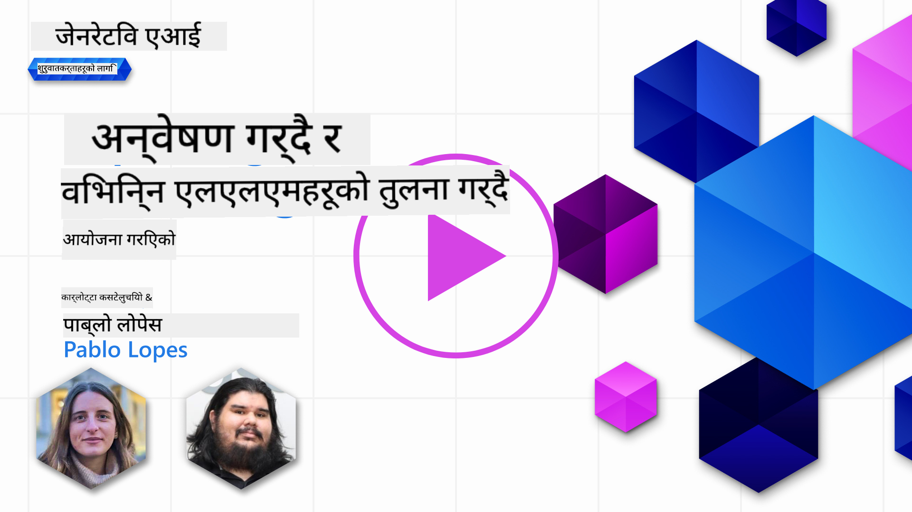
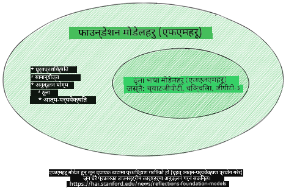
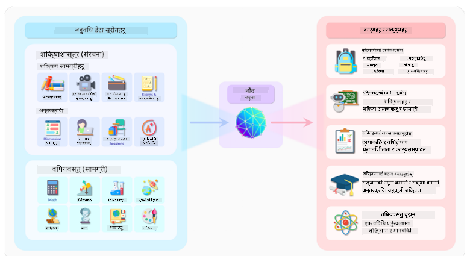
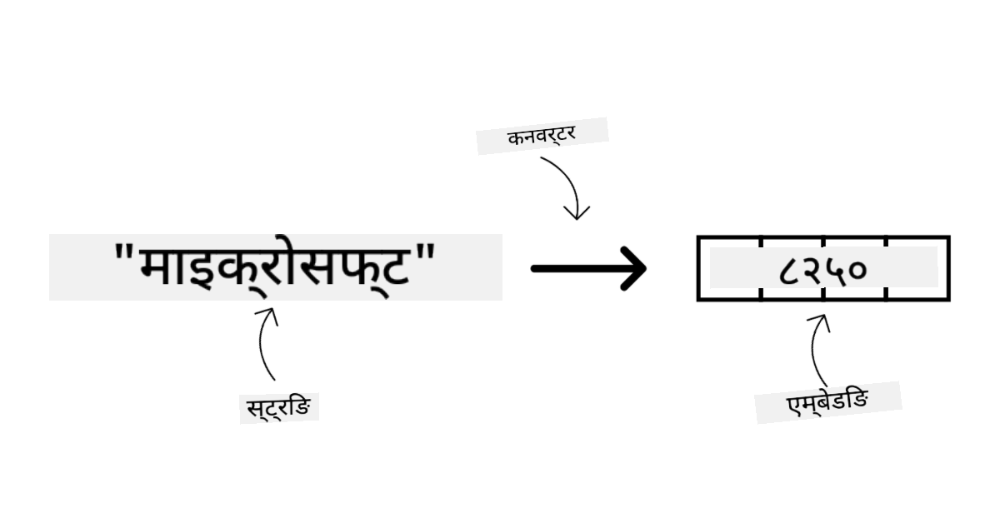
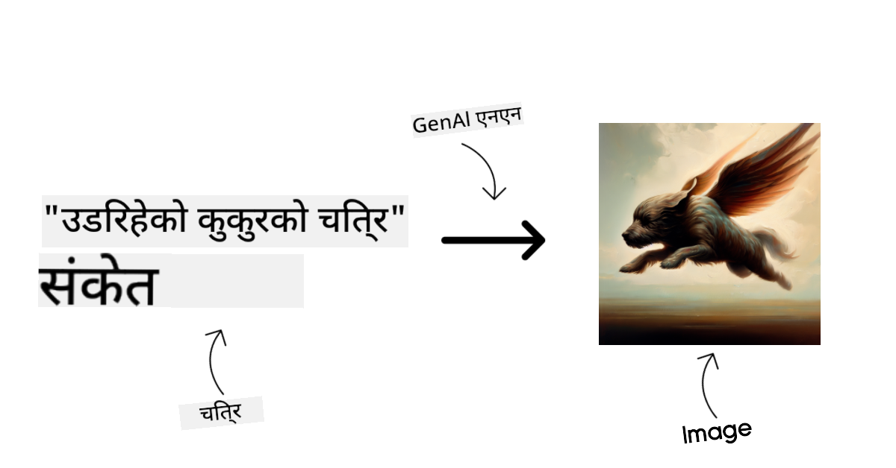
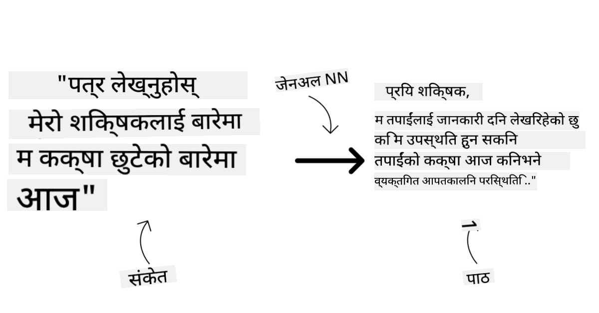
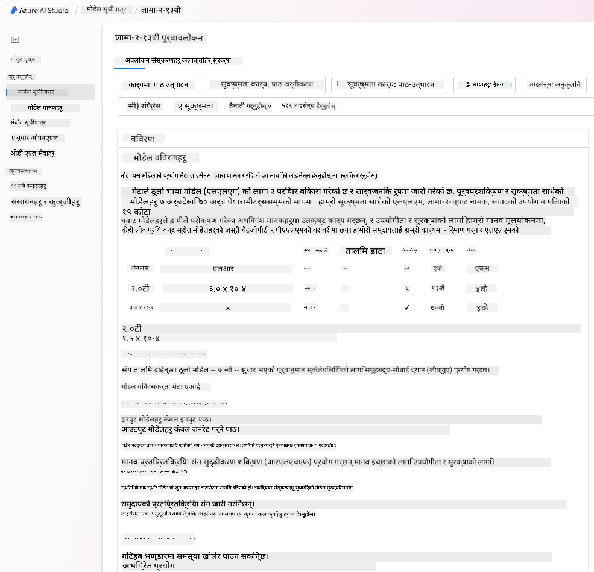
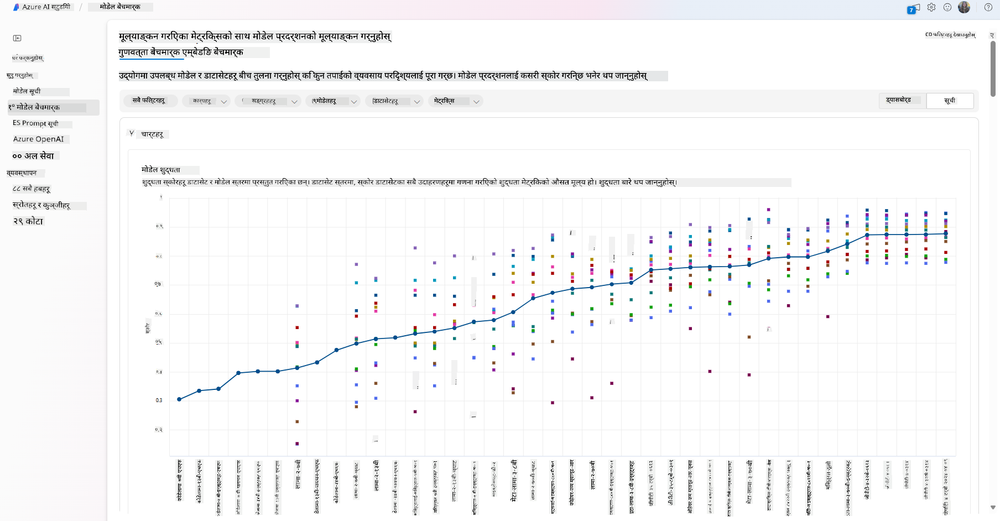
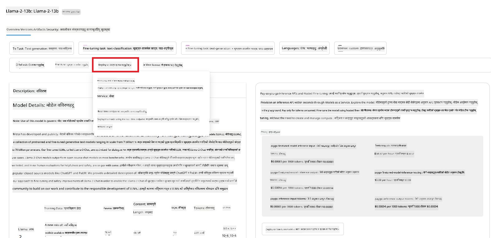
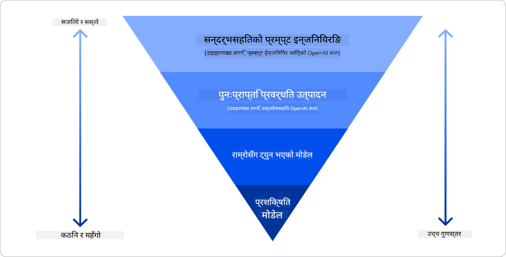

<!--
CO_OP_TRANSLATOR_METADATA:
{
  "original_hash": "6b7629b8ee4d7d874a27213e903d86a7",
  "translation_date": "2025-10-17T14:05:03+00:00",
  "source_file": "02-exploring-and-comparing-different-llms/README.md",
  "language_code": "ne"
}
-->
# विभिन्न LLMहरूको अन्वेषण र तुलना

> _माथिको तस्बिरमा क्लिक गरेर यस पाठको भिडियो हेर्नुहोस्_

अघिल्लो पाठमा, हामीले देख्यौं कि कसरी जेनेरेटिभ एआईले प्रविधि क्षेत्रलाई परिवर्तन गरिरहेको छ, कसरी ठूला भाषा मोडेलहरू (LLMs) काम गर्छन् र कसरी हाम्रो स्टार्टअपजस्तो व्यवसायले तिनीहरूलाई आफ्ना प्रयोगका केसहरूमा लागू गर्न सक्छ र वृद्धि गर्न सक्छ! यस अध्यायमा, हामी विभिन्न प्रकारका ठूला भाषा मोडेलहरू (LLMs) तुलना गर्न र तिनीहरूको फाइदा र बेफाइदा बुझ्न खोज्दैछौं।

हाम्रो स्टार्टअपको यात्रा को अर्को चरण भनेको हालको LLMs परिदृश्यको अन्वेषण गर्नु र हाम्रो प्रयोगका लागि उपयुक्त मोडेलहरू बुझ्नु हो।

## परिचय

यस पाठले समेट्नेछ:

- हालको परिदृश्यमा विभिन्न प्रकारका LLMs।
- Azure मा आफ्नो प्रयोगका लागि विभिन्न मोडेलहरू परीक्षण, पुनरावृत्ति, र तुलना गर्ने तरिका।
- कसरी LLM तैनात गर्ने।

## सिक्ने लक्ष्यहरू

यस पाठ पूरा गरेपछि, तपाईं सक्षम हुनुहुनेछ:

- आफ्नो प्रयोगका लागि सही मोडेल चयन गर्न।
- कसरी परीक्षण गर्ने, पुनरावृत्ति गर्ने, र आफ्नो मोडेलको प्रदर्शन सुधार गर्ने बुझ्न।
- व्यवसायहरूले मोडेलहरू कसरी तैनात गर्छन् भन्ने जान्न।

## विभिन्न प्रकारका LLMs बुझ्नुहोस्

LLMs लाई तिनीहरूको आर्किटेक्चर, प्रशिक्षण डेटा, र प्रयोगका आधारमा विभिन्न प्रकारमा वर्गीकृत गर्न सकिन्छ। यी भिन्नताहरू बुझ्दा हाम्रो स्टार्टअपले सही मोडेल चयन गर्न र कसरी परीक्षण गर्ने, पुनरावृत्ति गर्ने, र प्रदर्शन सुधार गर्ने बुझ्न मद्दत गर्नेछ।

LLM मोडेलहरू धेरै प्रकारका हुन्छन्, तपाईंको मोडेल चयन तपाईंले तिनीहरूलाई केका लागि प्रयोग गर्न चाहनुहुन्छ, तपाईंको डेटा, तपाईं कति खर्च गर्न तयार हुनुहुन्छ, र अन्य कुराहरूमा निर्भर गर्दछ।

यदि तपाईं मोडेलहरूलाई पाठ, अडियो, भिडियो, तस्बिर उत्पादन आदिका लागि प्रयोग गर्न चाहनुहुन्छ भने, तपाईंले फरक प्रकारको मोडेल चयन गर्न सक्नुहुन्छ।

- **अडियो र भाषण पहिचान**। यस उद्देश्यका लागि, Whisper प्रकारका मोडेलहरू उत्कृष्ट छनोट हुन् किनभने तिनीहरू सामान्य उद्देश्यका हुन् र भाषण पहिचानमा लक्षित छन्। यो विविध अडियोमा प्रशिक्षित छ र बहुभाषी भाषण पहिचान गर्न सक्छ। [Whisper प्रकारका मोडेलहरूबारे यहाँ थप जान्नुहोस्](https://platform.openai.com/docs/models/whisper?WT.mc_id=academic-105485-koreyst)।

- **तस्बिर उत्पादन**। तस्बिर उत्पादनका लागि, DALL-E र Midjourney दुई धेरै प्रख्यात विकल्पहरू हुन्। DALL-E Azure OpenAI द्वारा प्रस्ताव गरिएको छ। [DALL-E बारे यहाँ थप पढ्नुहोस्](https://platform.openai.com/docs/models/dall-e?WT.mc_id=academic-105485-koreyst) र यस पाठ्यक्रमको अध्याय ९ मा पनि।

- **पाठ उत्पादन**। अधिकांश मोडेलहरू पाठ उत्पादनमा प्रशिक्षित छन् र तपाईंले GPT-3.5 देखि GPT-4 सम्मका धेरै विकल्पहरू पाउन सक्नुहुन्छ। तिनीहरू विभिन्न लागतमा आउँछन् जहाँ GPT-4 सबैभन्दा महँगो छ। [Azure OpenAI playground](https://oai.azure.com/portal/playground?WT.mc_id=academic-105485-koreyst) मा हेर्नुहोस् कि क्षमता र लागतको हिसाबले कुन मोडेल तपाईंको आवश्यकताहरूमा सबैभन्दा राम्रो फिट हुन्छ।

- **मल्टी-मोडालिटी**। यदि तपाईं इनपुट र आउटपुटमा विभिन्न प्रकारका डेटा ह्यान्डल गर्न खोज्दै हुनुहुन्छ भने, तपाईं [gpt-4 turbo with vision or gpt-4o](https://learn.microsoft.com/azure/ai-services/openai/concepts/models#gpt-4-and-gpt-4-turbo-models?WT.mc_id=academic-105485-koreyst) जस्ता मोडेलहरूमा हेर्न चाहनुहुन्छ - OpenAI मोडेलहरूको पछिल्लो संस्करणहरू - जसले प्राकृतिक भाषा प्रशोधनलाई दृश्य बुझाइसँग संयोजन गर्न सक्षम छन्, मल्टी-मोडल इन्टरफेसहरू मार्फत अन्तरक्रिया सक्षम गर्दै।

मोडेल चयन गर्दा तपाईंले केही आधारभूत क्षमता प्राप्त गर्नुहुन्छ, तर त्यो पर्याप्त नहुन सक्छ। प्रायः तपाईंसँग कम्पनी विशिष्ट डेटा हुन्छ जुन तपाईंले कुनै प्रकारले LLMलाई बताउन आवश्यक हुन्छ। यसलाई कसरी नजिकबाट हेर्ने भन्ने केही विकल्पहरू छन्, आगामी खण्डहरूमा थप जानकारी।

### फाउन्डेशन मोडेलहरू बनाम LLMs

फाउन्डेशन मोडेलको शब्दावली [स्ट्यानफोर्डका अनुसन्धानकर्ताहरूले](https://arxiv.org/abs/2108.07258?WT.mc_id=academic-105485-koreyst) सिर्जना गरेका थिए र केही मापदण्डहरू पालना गर्ने एआई मोडेलको रूपमा परिभाषित गरिएको थियो, जस्तै:

- **तिनीहरू अनसुपरभाइज्ड लर्निङ वा सेल्फ-सुपरभाइज्ड लर्निङ प्रयोग गरेर प्रशिक्षित गरिन्छन्**, जसको अर्थ तिनीहरू लेबल नगरिएको मल्टी-मोडल डाटामा प्रशिक्षित छन्, र तिनीहरूको प्रशिक्षण प्रक्रियाको लागि मानव एनोटेशन वा डेटा लेबलिङ आवश्यक पर्दैन।
- **तिनीहरू धेरै ठूला मोडेलहरू हुन्**, धेरै गहिरो न्युरल नेटवर्कहरूमा आधारित छन् जुन अर्बौं प्यारामिटरहरूमा प्रशिक्षित छन्।
- **तिनीहरू सामान्यतया अन्य मोडेलहरूको लागि 'फाउन्डेशन' को रूपमा सेवा गर्नको लागि अभिप्रेरित छन्**, जसको अर्थ तिनीहरू अन्य मोडेलहरू निर्माण गर्नको लागि सुरुवात बिन्दुको रूपमा प्रयोग गर्न सकिन्छ, जुन फाइन-ट्युनिङ गरेर गर्न सकिन्छ।

तस्बिर स्रोत: [फाउन्डेशन मोडेलहरू र ठूला भाषा मोडेलहरूको आवश्यक मार्गदर्शक | Babar M Bhatti द्वारा | Medium](https://thebabar.medium.com/essential-guide-to-foundation-models-and-large-language-models-27dab58f7404)

यस भिन्नतालाई अझ स्पष्ट गर्न, हामी ChatGPT लाई उदाहरणको रूपमा लिन्छौं। ChatGPT को पहिलो संस्करण निर्माण गर्न, GPT-3.5 नामक मोडेलले फाउन्डेशन मोडेलको रूपमा सेवा गर्‍यो। यसको मतलब OpenAI ले GPT-3.5 मा केही च्याट-विशिष्ट डेटा प्रयोग गर्‍यो जसले च्याटबोट जस्ता संवादात्मक परिदृश्यहरूमा राम्रो प्रदर्शन गर्न विशेषज्ञ बनाएको GPT-3.5 को ट्युन गरिएको संस्करण सिर्जना गर्‍यो।

तस्बिर स्रोत: [2108.07258.pdf (arxiv.org)](https://arxiv.org/pdf/2108.07258.pdf?WT.mc_id=academic-105485-koreyst)

### ओपन सोर्स बनाम मालिकाना मोडेलहरू

LLMs लाई वर्गीकृत गर्ने अर्को तरिका भनेको तिनीहरू ओपन सोर्स हुन् वा मालिकाना।

ओपन-सोर्स मोडेलहरू सार्वजनिक रूपमा उपलब्ध गराइएका मोडेलहरू हुन् जसलाई जो कोहीले प्रयोग गर्न सक्छ। तिनीहरू प्रायः तिनीहरूलाई सिर्जना गर्ने कम्पनी वा अनुसन्धान समुदायद्वारा उपलब्ध गराइन्छ। यी मोडेलहरूलाई निरीक्षण गर्न, परिमार्जन गर्न, र LLMs मा विभिन्न प्रयोगका लागि अनुकूलन गर्न अनुमति दिइन्छ। तर, तिनीहरू सधैं उत्पादन प्रयोगका लागि अनुकूलित हुँदैनन्, र मालिकाना मोडेलहरू जत्तिकै प्रदर्शनकारी नहुन सक्छ। साथै, ओपन-सोर्स मोडेलहरूको लागि वित्तीय सहयोग सीमित हुन सक्छ, र तिनीहरू लामो समयसम्म कायम नरहन सक्छन् वा नवीनतम अनुसन्धानको साथ अपडेट नगरिन सक्छन्। लोकप्रिय ओपन-सोर्स मोडेलहरूको उदाहरणमा [Alpaca](https://crfm.stanford.edu/2023/03/13/alpaca.html?WT.mc_id=academic-105485-koreyst), [Bloom](https://huggingface.co/bigscience/bloom) र [LLaMA](https://llama.meta.com) समावेश छन्।

मालिकाना मोडेलहरू कम्पनीद्वारा स्वामित्वमा रहेका मोडेलहरू हुन् र सार्वजनिक रूपमा उपलब्ध गराइएका छैनन्। यी मोडेलहरू प्रायः उत्पादन प्रयोगका लागि अनुकूलित गरिएका हुन्छन्। तर, तिनीहरूलाई निरीक्षण गर्न, परिमार्जन गर्न, वा विभिन्न प्रयोगका लागि अनुकूलन गर्न अनुमति दिइएको छैन। साथै, तिनीहरू सधैं निःशुल्क उपलब्ध हुँदैनन्, र प्रयोग गर्न सदस्यता वा भुक्तानी आवश्यक हुन सक्छ। प्रयोगकर्ताहरूले मोडेललाई प्रशिक्षण गर्न प्रयोग गरिएको डेटा माथि नियन्त्रण गर्दैनन्, जसको मतलब तिनीहरूले डेटा गोपनीयता र एआईको जिम्मेवार प्रयोग सुनिश्चित गर्न मोडेल मालिकलाई विश्वास गर्नुपर्छ। लोकप्रिय मालिकाना मोडेलहरूको उदाहरणमा [OpenAI models](https://platform.openai.com/docs/models/overview?WT.mc_id=academic-105485-koreyst), [Google Bard](https://sapling.ai/llm/bard?WT.mc_id=academic-105485-koreyst) वा [Claude 2](https://www.anthropic.com/index/claude-2?WT.mc_id=academic-105485-koreyst) समावेश छन्।

### एम्बेडिङ बनाम तस्बिर उत्पादन बनाम पाठ र कोड उत्पादन

LLMs लाई तिनीहरूले उत्पादन गर्ने आउटपुटद्वारा पनि वर्गीकृत गर्न सकिन्छ।

एम्बेडिङहरू मोडेलहरूको सेट हुन् जसले पाठलाई संख्यात्मक रूपमा रूपान्तरण गर्न सक्छ, जसलाई एम्बेडिङ भनिन्छ, जुन इनपुट पाठको संख्यात्मक प्रतिनिधित्व हो। एम्बेडिङहरूले मेसिनलाई शब्दहरू वा वाक्यहरू बीचको सम्बन्ध बुझ्न सजिलो बनाउँछ र अन्य मोडेलहरूद्वारा इनपुटको रूपमा उपभोग गर्न सकिन्छ, जस्तै वर्गीकरण मोडेलहरू, वा क्लस्टरिङ मोडेलहरू जसको संख्यात्मक डेटामा राम्रो प्रदर्शन हुन्छ। एम्बेडिङ मोडेलहरू प्रायः ट्रान्सफर लर्निङका लागि प्रयोग गरिन्छ, जहाँ एक मोडेललाई एक सर्भोगेट कार्यका लागि निर्माण गरिन्छ जसका लागि प्रशस्त डेटा उपलब्ध छ, र त्यसपछि मोडेल वजनहरू (एम्बेडिङहरू) अन्य डाउनस्ट्रीम कार्यहरूको लागि पुन: प्रयोग गरिन्छ। यस श्रेणीको उदाहरण [OpenAI embeddings](https://platform.openai.com/docs/models/embeddings?WT.mc_id=academic-105485-koreyst) हो।

तस्बिर उत्पादन मोडेलहरू तस्बिरहरू उत्पादन गर्ने मोडेलहरू हुन्। यी मोडेलहरू प्रायः तस्बिर सम्पादन, तस्बिर संश्लेषण, र तस्बिर अनुवादका लागि प्रयोग गरिन्छ। तस्बिर उत्पादन मोडेलहरू प्रायः तस्बिरहरूको ठूलो डेटासेटमा प्रशिक्षित गरिन्छ, जस्तै [LAION-5B](https://laion.ai/blog/laion-5b/?WT.mc_id=academic-105485-koreyst), र नयाँ तस्बिरहरू उत्पादन गर्न वा इनपेन्टिङ, सुपर-रेजोल्युसन, र कलराइजेसन प्रविधिहरूको साथ विद्यमान तस्बिरहरू सम्पादन गर्न प्रयोग गर्न सकिन्छ। उदाहरणहरूमा [DALL-E-3](https://openai.com/dall-e-3?WT.mc_id=academic-105485-koreyst) र [Stable Diffusion models](https://github.com/Stability-AI/StableDiffusion?WT.mc_id=academic-105485-koreyst) समावेश छन्।

पाठ र कोड उत्पादन मोडेलहरू पाठ वा कोड उत्पादन गर्ने मोडेलहरू हुन्। यी मोडेलहरू प्रायः पाठ संक्षेपण, अनुवाद, र प्रश्न उत्तरका लागि प्रयोग गरिन्छ। पाठ उत्पादन मोडेलहरू प्रायः पाठको ठूलो डेटासेटमा प्रशिक्षित गरिन्छ, जस्तै [BookCorpus](https://www.cv-foundation.org/openaccess/content_iccv_2015/html/Zhu_Aligning_Books_and_ICCV_2015_paper.html?WT.mc_id=academic-105485-koreyst), र नयाँ पाठ उत्पादन गर्न वा प्रश्नहरूको उत्तर दिन प्रयोग गर्न सकिन्छ। कोड उत्पादन मोडेलहरू, जस्तै [CodeParrot](https://huggingface.co/codeparrot?WT.mc_id=academic-105485-koreyst), प्रायः कोडको ठूलो डेटासेटमा प्रशिक्षित गरिन्छ, जस्तै GitHub, र नयाँ कोड उत्पादन गर्न वा विद्यमान कोडमा बगहरू सुधार गर्न प्रयोग गर्न सकिन्छ।

### एन्कोडर-डिकोडर बनाम डिकोडर मात्र

LLMs को विभिन्न प्रकारका आर्किटेक्चरहरूको बारेमा कुरा गर्न, हामी एउटा उपमा प्रयोग गरौं।

कल्पना गर्नुहोस् कि तपाईंको प्रबन्धकले तपाईंलाई विद्यार्थीहरूको लागि क्विज लेख्ने कार्य दिए। तपाईंका दुई सहकर्मी छन्; एक सामग्री सिर्जना गर्ने जिम्मामा छन् र अर्को समीक्षा गर्ने जिम्मामा।

सामग्री सिर्जनाकर्ता डिकोडर मात्र मोडेल जस्तै हो, उनी विषयलाई हेर्न सक्छन् र तपाईंले पहिले नै लेखेको कुरा हेर्न सक्छन् र त्यसको आधारमा पाठ्यक्रम लेख्न सक्छन्। उनीहरू आकर्षक र जानकारीमूलक सामग्री लेख्न धेरै राम्रो छन्, तर विषय र सिकाइ उद्देश्यहरू बुझ्न धेरै राम्रो छैनन्। डिकोडर मोडेलहरूको केही उदाहरण GPT परिवार मोडेलहरू हुन्, जस्तै GPT-3।

समीक्षक एन्कोडर मात्र मोडेल जस्तै हो, उनी लेखिएको पाठ्यक्रम र उत्तरहरू हेर्छन्, तिनीहरू बीचको सम्बन्ध नोटिस गर्छन् र सन्दर्भ बुझ्छन्, तर सामग्री सिर्जना गर्न राम्रो छैनन्। एन्कोडर मात्र मोडेलको उदाहरण BERT हुनेछ।

कल्पना गर्नुहोस् कि हामीसँग कोही पनि हुन सक्छ जसले क्विज सिर्जना र समीक्षा गर्न सक्छ, यो एन्कोडर-डिकोडर मोडेल हो। केही उदाहरणहरू BART र T5 हुनेछ।

### सेवा बनाम मोडेल

अब, सेवा र मोडेलको बीचको भिन्नता बारे कुरा गरौं। सेवा भनेको क्लाउड सेवा प्रदायकद्वारा प्रस्ताव गरिएको उत्पादन हो, र प्रायः मोडेलहरू, डेटा, र अन्य घटकहरूको संयोजन हो। मोडेल भनेको सेवाको मुख्य घटक हो, र प्रायः फाउन्डेशन मोडेल हो, जस्तै LLM।

सेवाहरू प्रायः उत्पादन प्रयोगका लागि अनुकूलित गरिएका हुन्छन् र प्रायः ग्राफिकल प्रयोगकर्ता इन्टरफेस मार्फत मोडेलहरू भन्दा प्रयोग गर्न सजिलो हुन्छन्। तर, सेवाहरू सधैं निःशुल्क उपलब्ध हुँदैनन्, र प्रयोग गर्न सदस्यता वा भुक्तानी आवश्यक हुन सक्छ, सेवा मालिकको उपकरण र स्रोतहरू प्रयोग गर्ने, खर्चहरू अनुकूलित गर्ने र सजिलै स्केल गर्ने। सेवाको उदाहरण [Azure OpenAI Service](https://learn.microsoft.com/azure/ai-services/openai/overview?WT.mc_id=academic-105485-koreyst) हो, जसले पे-एज-यू-गो दर योजना प्रस्ताव गर्दछ, जसको अर्थ प्रयोगकर्ताहरूलाई उनीहरूले सेवा कति प्रयोग गर्छन् त्यसको अनुपातमा शुल्क लगाइन्छ। साथै, Azure OpenAI Service ले मोडेलहरूको क्षमताहरूको शीर्षमा उद्यम-ग्रेड सुरक्षा र जिम्मेवार एआई फ्रेमवर्क प्रदान गर्दछ।

मोडेलहरू केवल न्युरल नेटवर्क हुन्, प्यारामिटरहरू, वजनहरू, र अन्य सहित। कम्पनीहरूले स्थानीय रूपमा चलाउन अनुमति दिन्छ, तर उपकरण किन्नु पर्नेछ, स्केल गर्न संरचना निर्माण गर्नु पर्नेछ र लाइसेन्स किन्नु पर्नेछ वा ओपन-सोर्स मोडेल प्रयोग गर्नु पर्नेछ। LLaMA जस्तो मोडेल प्रयोग गर्न उपलब्ध छ, मोडेल चलाउन कम्प्युटेशनल शक्ति आवश्यक पर्दछ।

## Azure मा प्रदर्शन बुझ्न विभिन्न मोडेलहरू परीक्षण र पुनरावृत्ति गर्ने तरिका

एकपटक हाम्रो टोलीले हालको LLMs परिदृश्य अन्वेषण गरिसकेपछि र उनीहरूको परिदृश्यका लागि केही राम्रो उम्मेदवारहरू पहिचान गरेपछि, अर्को चरण भनेको तिनीहरूलाई आफ्नो डेटा र काममा परीक्षण गर्नु हो। यो एक पुनरावृत्ति प्रक्रिया हो, प्रयोग र मापनद्वारा गरिन्छ।
हामीले अघिल्लो अनुच्छेदहरूमा उल्लेख गरेका धेरैजसो मोडेलहरू (जस्तै OpenAI मोडेलहरू, Llama2 जस्ता ओपन सोर्स मोडेलहरू, र Hugging Face ट्रान्सफर्मरहरू) [Model Catalog](https://learn.microsoft.com/azure/ai-studio/how-to/model-catalog-overview?WT.mc_id=academic-105485-koreyst) मा [Azure AI Studio](https://ai.azure.com/?WT.mc_id=academic-105485-koreyst) मा उपलब्ध छन्।

[Azure AI Studio](https://learn.microsoft.com/azure/ai-studio/what-is-ai-studio?WT.mc_id=academic-105485-koreyst) एक क्लाउड प्लेटफर्म हो जसले डेभलपरहरूलाई जेनेरेटिभ AI एप्लिकेसनहरू निर्माण गर्न र सम्पूर्ण विकास चक्र - प्रयोगदेखि मूल्याङ्कनसम्म - व्यवस्थापन गर्न डिजाइन गरिएको छ। यसले सबै Azure AI सेवाहरूलाई एकल हबमा संयोजन गरेर प्रयोग गर्न सजिलो GUI प्रदान गर्दछ। Azure AI Studio को Model Catalog ले प्रयोगकर्तालाई निम्न कार्यहरू गर्न सक्षम बनाउँछ:

- क्याटलगमा इच्छित Foundation Model खोज्नुहोस् - चाहे यो स्वामित्व होस् वा ओपन सोर्स, कार्य, लाइसेन्स, वा नामद्वारा फिल्टर गर्दै। खोजलाई सुधार गर्न, मोडेलहरू संग्रहहरूमा व्यवस्थित गरिएको छ, जस्तै Azure OpenAI संग्रह, Hugging Face संग्रह, र अन्य।

- मोडेल कार्ड समीक्षा गर्नुहोस्, जसमा प्रयोगको उद्देश्य र प्रशिक्षण डाटाको विस्तृत विवरण, कोड नमूनाहरू, र आन्तरिक मूल्याङ्कन पुस्तकालयमा मूल्याङ्कन परिणामहरू समावेश छन्।

- उद्योगमा उपलब्ध मोडेलहरू र डाटासेटहरूमा बेंचमार्क तुलना गर्नुहोस् ताकि कुन मोडेल व्यापार परिदृश्यमा उपयुक्त छ भनेर मूल्याङ्कन गर्न सकियोस्। यो [Model Benchmarks](https://learn.microsoft.com/azure/ai-studio/how-to/model-benchmarks?WT.mc_id=academic-105485-koreyst) प्यान मार्फत सम्भव छ।

- मोडेललाई विशेष कार्यभारमा प्रदर्शन सुधार गर्न कस्टम प्रशिक्षण डाटामा फाइन-ट्यून गर्नुहोस्, Azure AI Studio को प्रयोग र ट्र्याकिङ क्षमताहरू प्रयोग गर्दै।

- मूल प्रि-ट्रेन गरिएको मोडेल वा फाइन-ट्यून गरिएको संस्करणलाई रिमोट रियल टाइम इन्फरेन्स - व्यवस्थापित कम्प्युट - वा सर्वरलेस API अन्त बिन्दुमा - [pay-as-you-go](https://learn.microsoft.com/azure/ai-studio/how-to/model-catalog-overview#model-deployment-managed-compute-and-serverless-api-pay-as-you-go?WT.mc_id=academic-105485-koreyst) - तैनात गर्नुहोस् ताकि एप्लिकेसनहरूले यसलाई उपभोग गर्न सकियोस्।

> [!NOTE]
> क्याटलगमा रहेका सबै मोडेलहरू हाल फाइन-ट्यूनिङ र/वा pay-as-you-go तैनातीको लागि उपलब्ध छैनन्। मोडेलको क्षमताहरू र सीमाहरूको विवरणको लागि मोडेल कार्ड जाँच गर्नुहोस्।

## LLM परिणाम सुधार गर्दै

हामीले हाम्रो स्टार्टअप टिमसँग विभिन्न प्रकारका LLMs र क्लाउड प्लेटफर्म (Azure Machine Learning) अन्वेषण गरेका छौं जसले हामीलाई विभिन्न मोडेलहरू तुलना गर्न, परीक्षण डाटामा मूल्याङ्कन गर्न, प्रदर्शन सुधार गर्न र इन्फरेन्स अन्त बिन्दुहरूमा तैनात गर्न सक्षम बनायो।

तर कहिले फाइन-ट्यून गरिएको मोडेल प्रयोग गर्ने विचार गर्नुपर्छ र कहिले प्रि-ट्रेन गरिएको मोडेल प्रयोग गर्ने? के विशिष्ट कार्यभारमा मोडेल प्रदर्शन सुधार गर्न अन्य दृष्टिकोणहरू छन्?

व्यवसायले LLM बाट आवश्यक परिणाम प्राप्त गर्न विभिन्न दृष्टिकोणहरू प्रयोग गर्न सक्छ। उत्पादनमा LLM तैनात गर्दा विभिन्न स्तरको प्रशिक्षण भएका मोडेलहरू चयन गर्न सकिन्छ, जसले जटिलता, लागत, र गुणस्तरमा फरक पार्छ। यहाँ केही दृष्टिकोणहरू छन्:

- **प्रम्प्ट इन्जिनियरिङ्ग विद् कन्टेक्स्ट**। विचार यो हो कि तपाईंले आवश्यक प्रतिक्रियाहरू प्राप्त गर्न पर्याप्त सन्दर्भ प्रदान गर्नुहोस्।

- **Retrieval Augmented Generation, RAG**। तपाईंको डाटा डेटाबेस वा वेब अन्त बिन्दुमा हुन सक्छ, उदाहरणका लागि, यो सुनिश्चित गर्न कि यो डाटा वा यसको उपसमूह प्रम्प्टको समयमा समावेश गरिएको छ, तपाईंले सम्बन्धित डाटा फेच गर्न सक्नुहुन्छ र यसलाई प्रयोगकर्ताको प्रम्प्टको भाग बनाउन सक्नुहुन्छ।

- **फाइन-ट्यून गरिएको मोडेल**। यहाँ, तपाईंले मोडेललाई थप प्रशिक्षण दिनुहुन्छ जसले मोडेललाई तपाईंको आवश्यकताहरूमा अधिक सटीक र उत्तरदायी बनाउँछ तर यो महँगो हुन सक्छ।

Img source: [Four Ways that Enterprises Deploy LLMs | Fiddler AI Blog](https://www.fiddler.ai/blog/four-ways-that-enterprises-deploy-llms?WT.mc_id=academic-105485-koreyst)

### प्रम्प्ट इन्जिनियरिङ्ग विद् कन्टेक्स्ट

प्रि-ट्रेन गरिएको LLMs सामान्य प्राकृतिक भाषा कार्यहरूमा धेरै राम्रोसँग काम गर्छन्, यहाँसम्म कि तिनीहरूलाई छोटो प्रम्प्टसँग बोलाएर, जस्तै पूरा गर्न वाक्य वा प्रश्न - जसलाई "zero-shot" सिकाइ भनिन्छ।

तर, प्रयोगकर्ताले आफ्नो सोधपुछलाई जति धेरै फ्रेम गर्न सक्छ, विस्तृत अनुरोध र उदाहरणहरू सहित - कन्टेक्स्ट - उत्तर त्यति नै सटीक र प्रयोगकर्ताको अपेक्षासँग नजिक हुनेछ। यस अवस्थामा, यदि प्रम्प्टमा केवल एक उदाहरण समावेश छ भने हामी "one-shot" सिकाइको कुरा गर्छौं र यदि यसमा धेरै उदाहरणहरू समावेश छन् भने "few-shot learning" को कुरा गर्छौं। प्रम्प्ट इन्जिनियरिङ्ग विद् कन्टेक्स्ट सुरु गर्नको लागि सबैभन्दा लागत-प्रभावकारी दृष्टिकोण हो।

### Retrieval Augmented Generation (RAG)

LLMs को सीमितता यो हो कि तिनीहरूले केवल आफ्नो प्रशिक्षणको समयमा प्रयोग गरिएको डाटालाई उत्तर उत्पन्न गर्न प्रयोग गर्न सक्छन्। यसको मतलब तिनीहरूले आफ्नो प्रशिक्षण प्रक्रिया पछि भएका तथ्यहरूबारे केही पनि जान्दैनन्, र तिनीहरूले गैर-सार्वजनिक जानकारी (जस्तै कम्पनी डाटा) पहुँच गर्न सक्दैनन्।
यसलाई RAG मार्फत पार गर्न सकिन्छ, एक प्रविधि जसले प्रम्प्टलाई बाह्य डाटाको टुक्राहरूको रूपमा बढाउँछ, प्रम्प्टको लम्बाइ सीमाहरूलाई विचार गर्दै। यो Vector डेटाबेस उपकरणहरू (जस्तै [Azure Vector Search](https://learn.microsoft.com/azure/search/vector-search-overview?WT.mc_id=academic-105485-koreyst)) द्वारा समर्थित छ जसले पूर्व-परिभाषित डाटा स्रोतहरूबाट उपयोगी टुक्राहरू पुनःप्राप्त गर्दछ र तिनीहरूलाई प्रम्प्ट कन्टेक्स्टमा थप्छ।

यो प्रविधि तब धेरै उपयोगी हुन्छ जब व्यवसायसँग पर्याप्त डाटा, पर्याप्त समय, वा LLM फाइन-ट्यून गर्न स्रोतहरू छैनन्, तर विशिष्ट कार्यभारमा प्रदर्शन सुधार गर्न र गलत तथ्यहरूको जोखिम कम गर्न चाहन्छ।

### फाइन-ट्यून गरिएको मोडेल

फाइन-ट्यूनिङ एक प्रक्रिया हो जसले ट्रान्सफर लर्निङलाई प्रयोग गरेर मोडेललाई डाउनस्ट्रीम कार्यमा 'अनुकूलन' गर्न वा विशिष्ट समस्या समाधान गर्न प्रयोग गर्दछ। few-shot learning र RAG बाट फरक, यसले नयाँ मोडेल उत्पन्न गर्दछ, अद्यावधिक गरिएको वजन र पूर्वाग्रहहरूसँग। यसमा एकल इनपुट (प्रम्प्ट) र यसको सम्बन्धित आउटपुट (completion) समावेश गर्ने प्रशिक्षण उदाहरणहरूको सेट आवश्यक छ।
यो प्राथमिकता दिने दृष्टिकोण हुनेछ यदि:

- **फाइन-ट्यून गरिएको मोडेलहरू प्रयोग गर्दै**। व्यवसायले उच्च प्रदर्शन मोडेलहरूको सट्टा कम सक्षम मोडेलहरू (जस्तै embedding models) प्रयोग गर्न चाहन्छ, जसले लागत प्रभावकारी र छिटो समाधान प्रदान गर्दछ।

- **लेटेन्सी विचार गर्दै**। कुनै विशिष्ट प्रयोगको लागि लेटेन्सी महत्त्वपूर्ण छ, त्यसैले धेरै लामो प्रम्प्ट प्रयोग गर्न सम्भव छैन वा मोडेलले सिक्नुपर्ने उदाहरणहरूको संख्या प्रम्प्ट लम्बाइ सीमासँग मेल खाँदैन।

- **अप-टु-डेट रहनुहोस्**। व्यवसायसँग धेरै उच्च-गुणस्तरको डाटा र ग्राउन्ड ट्रुथ लेबलहरू छन् र समयसँगै यो डाटा अद्यावधिक गर्न आवश्यक स्रोतहरू छन्।

### प्रशिक्षित मोडेल

LLMलाई सुरुबाट प्रशिक्षण गर्नु निस्सन्देह सबैभन्दा कठिन र जटिल दृष्टिकोण हो, जसमा ठूलो मात्रामा डाटा, कुशल स्रोतहरू, र उपयुक्त कम्प्युटेशनल शक्ति आवश्यक पर्दछ। यो विकल्प केवल त्यस्तो परिदृश्यमा विचार गर्नुपर्छ जहाँ व्यवसायसँग डोमेन-विशिष्ट प्रयोगको मामला र डोमेन-केंद्रित डाटाको ठूलो मात्रा छ।

## ज्ञान जाँच

LLM को कम्प्लिशन परिणाम सुधार गर्न के राम्रो दृष्टिकोण हुन सक्छ?

1. प्रम्प्ट इन्जिनियरिङ्ग विद् कन्टेक्स्ट
1. RAG
1. फाइन-ट्यून गरिएको मोडेल

A:3, यदि तपाईंसँग समय र स्रोतहरू छन् र उच्च गुणस्तरको डाटा छ भने, फाइन-ट्यूनिङ अप-टु-डेट रहनको लागि राम्रो विकल्प हो। तर, यदि तपाईं सुधार गर्न चाहनुहुन्छ र समयको कमी छ भने, RAG पहिले विचार गर्न लायक छ।

## 🚀 चुनौती

RAG लाई तपाईंको व्यवसायको लागि कसरी प्रयोग गर्न सकिन्छ भन्ने बारेमा थप पढ्नुहोस् [यहाँ](https://learn.microsoft.com/azure/search/retrieval-augmented-generation-overview?WT.mc_id=academic-105485-koreyst)।

## उत्कृष्ट काम, तपाईंको सिकाइ जारी राख्नुहोस्

यो पाठ पूरा गरेपछि, हाम्रो [Generative AI Learning collection](https://aka.ms/genai-collection?WT.mc_id=academic-105485-koreyst) हेर्नुहोस् ताकि तपाईंको जेनेरेटिभ AI ज्ञानलाई अझ स्तरवृद्धि गर्न सकियोस्!

Lesson 3 मा जानुहोस् जहाँ हामी [Generative AI जिम्मेवारीपूर्वक निर्माण गर्ने](../03-using-generative-ai-responsibly/README.md?WT.mc_id=academic-105485-koreyst) बारे हेर्नेछौं!

---

**अस्वीकरण**:  
यो दस्तावेज़ AI अनुवाद सेवा [Co-op Translator](https://github.com/Azure/co-op-translator) प्रयोग गरेर अनुवाद गरिएको छ। हामी शुद्धताको लागि प्रयास गर्छौं, तर कृपया ध्यान दिनुहोस् कि स्वचालित अनुवादहरूमा त्रुटिहरू वा अशुद्धताहरू हुन सक्छ। यसको मूल भाषा मा रहेको मूल दस्तावेज़लाई आधिकारिक स्रोत मानिनुपर्छ। महत्वपूर्ण जानकारीको लागि, व्यावसायिक मानव अनुवाद सिफारिस गरिन्छ। यस अनुवादको प्रयोगबाट उत्पन्न हुने कुनै पनि गलतफहमी वा गलत व्याख्याको लागि हामी जिम्मेवार हुने छैनौं।