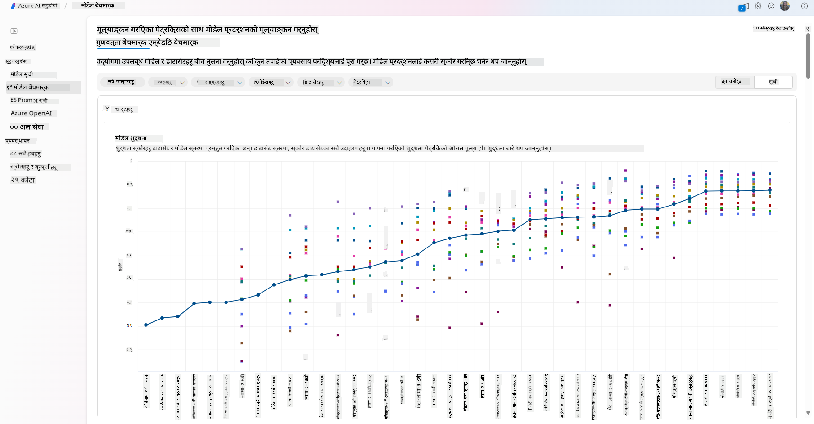
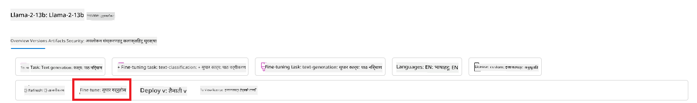
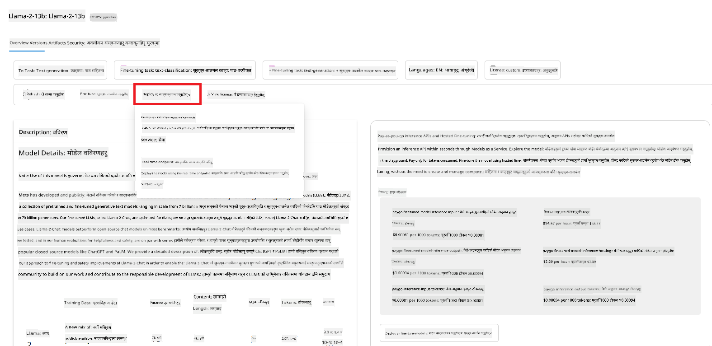
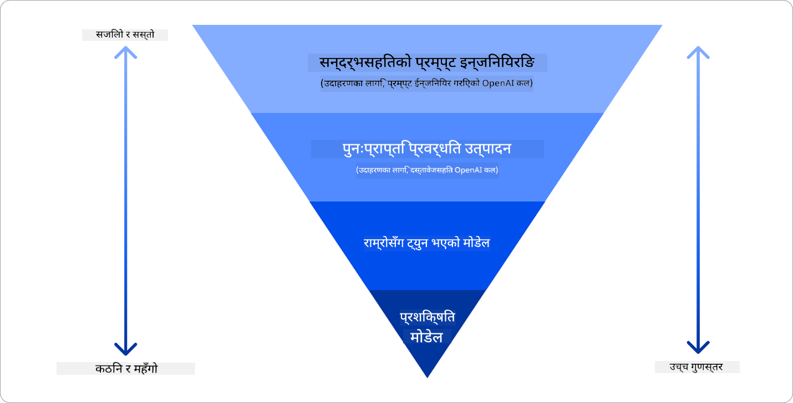

<!--
CO_OP_TRANSLATOR_METADATA:
{
  "original_hash": "e2f686f2eb794941761252ac5e8e090b",
  "translation_date": "2025-06-25T10:31:26+00:00",
  "source_file": "02-exploring-and-comparing-different-llms/README.md",
  "language_code": "ne"
}
-->
# विभिन्न LLMहरूको अन्वेषण र तुलना

> _यो पाठको भिडियो हेर्न माथिको चित्रमा क्लिक गर्नुहोस्_

अघिल्लो पाठमा, हामीले देख्यौं कि जनरेटिभ एआई कसरी प्रविधि परिदृश्यलाई परिवर्तन गर्दैछ, ठूला भाषा मोडेलहरू (LLMs) कसरी काम गर्छन् र कसरी हाम्रो स्टार्टअप जस्ता व्यवसायहरूले तिनीहरूलाई आफ्ना प्रयोगका केसहरूमा लागू गर्न सक्छन् र वृद्धि गर्न सक्छन्! यस अध्यायमा, हामी विभिन्न प्रकारका ठूला भाषा मोडेलहरू (LLMs) को तुलना गर्न र तिनीहरूको फाइदा र बेफाइदाहरू बुझ्न खोज्दैछौं।

हाम्रो स्टार्टअपको यात्राको अर्को चरण LLMहरूको वर्तमान परिदृश्यको अन्वेषण गर्नु र हाम्रो प्रयोगको लागि उपयुक्त कुन हो भनेर बुझ्नु हो।

## परिचय

यो पाठले समेट्नेछ:

- वर्तमान परिदृश्यमा विभिन्न प्रकारका LLMहरू।
- तपाईंको प्रयोगको लागि Azure मा विभिन्न मोडेलहरू परीक्षण, दोहोर्याउने, र तुलना गर्ने।
- LLM कसरी तैनात गर्ने।

## सिकाइका लक्ष्यहरू

यो पाठ पूरा गरेपछि, तपाईं सक्षम हुनुहुनेछ:

- तपाईंको प्रयोगको लागि सही मोडेल चयन गर्नुहोस्।
- तपाईंको मोडेलको प्रदर्शन कसरी परीक्षण गर्ने, दोहोर्याउने, र सुधार गर्ने भन्ने बुझ्नुहोस्।
- व्यवसायहरूले मोडेलहरू कसरी तैनात गर्छन् भनेर जान्नुहोस्।

## विभिन्न प्रकारका LLMहरू बुझ्नुहोस्

LLMहरू तिनीहरूको वास्तुकला, प्रशिक्षण डाटा, र प्रयोगको आधारमा बहु वर्गीकरणहरू हुन सक्छन्। यी भिन्नताहरू बुझ्नाले हाम्रो स्टार्टअपलाई परिदृश्यको लागि सही मोडेल चयन गर्न मद्दत गर्नेछ, र कसरी परीक्षण गर्ने, दोहोर्याउने, र प्रदर्शन सुधार गर्ने बुझ्न मद्दत गर्नेछ।

धेरै फरक प्रकारका LLM मोडेलहरू छन्, तपाईंको मोडेलको छनोट तपाईंले तिनीहरूलाई केको लागि प्रयोग गर्ने लक्ष्य राख्नुभएकोमा निर्भर गर्दछ, तपाईंको डाटा, तपाईं कति खर्च गर्न तयार हुनुहुन्छ र थपमा निर्भर गर्दछ।

यदि तपाईं मोडेलहरू पाठ, अडियो, भिडियो, छवि उत्पादन आदिको लागि प्रयोग गर्ने लक्ष्य राख्नुहुन्छ भने, तपाईंले फरक प्रकारको मोडेल छनोट गर्न सक्नुहुन्छ।

- **अडियो र भाषण पहिचान**। यस उद्देश्यको लागि, Whisper प्रकारका मोडेलहरू उत्कृष्ट छनोट हुन् किनभने तिनीहरू सामान्य-उद्देश्यका र भाषण पहिचानमा लक्षित छन्। यो विविध अडियोमा प्रशिक्षित छ र बहुभाषी भाषण पहिचान गर्न सक्छ। [Whisper प्रकारका मोडेलहरू बारेमा यहाँ थप जान्नुहोस्](https://platform.openai.com/docs/models/whisper?WT.mc_id=academic-105485-koreyst)।

- **छवि उत्पादन**। छवि उत्पादनको लागि, DALL-E र Midjourney दुई धेरै प्रख्यात छनोटहरू हुन्। DALL-E Azure OpenAI द्वारा प्रस्ताव गरिएको छ। [DALL-E बारेमा यहाँ थप पढ्नुहोस्](https://platform.openai.com/docs/models/dall-e?WT.mc_id=academic-105485-koreyst) र यस पाठ्यक्रमको अध्याय ९ मा पनि।

- **पाठ उत्पादन**। अधिकांश मोडेलहरू पाठ उत्पादनमा प्रशिक्षित छन् र तपाईंसँग GPT-3.5 देखि GPT-4 सम्मका धेरै विकल्पहरू छन्। तिनीहरू विभिन्न लागतमा आउँछन्, GPT-4 सबैभन्दा महँगो छ। [Azure OpenAI playground](https://oai.azure.com/portal/playground?WT.mc_id=academic-105485-koreyst) मा हेर्नु लायक छ कि कुन मोडेलहरू क्षमता र लागतको सन्दर्भमा तपाईंको आवश्यकताहरूमा सबैभन्दा राम्रो फिट हुन्छन्।

- **बहु-मोडालिटी**। यदि तपाईं इनपुट र आउटपुटमा विभिन्न प्रकारका डाटा ह्यान्डल गर्न खोज्दै हुनुहुन्छ भने, तपाईंले [gpt-4 turbo with vision or gpt-4o](https://learn.microsoft.com/azure/ai-services/openai/concepts/models#gpt-4-and-gpt-4-turbo-models?WT.mc_id=academic-105485-koreyst) जस्ता मोडेलहरूमा ध्यान दिन चाहनुहुन्छ - OpenAI मोडेलहरूको पछिल्लो संस्करण - जुन प्राकृतिक भाषा प्रशोधनलाई दृश्यात्मक बुझाइमा संयोजन गर्न सक्षम छन्, बहु-मोडल इन्टरफेसहरू मार्फत अन्तरक्रियाहरू सक्षम पार्दै।

मोडेल चयन गर्दा तपाईंले केही आधारभूत क्षमताहरू पाउनुहुन्छ, यद्यपि त्यो पर्याप्त नहुन सक्छ। प्रायः तपाईंसँग कम्पनी विशेष डाटा हुन्छ जुन तपाईंले कुनै तरिकाले LLM लाई भन्न आवश्यक छ। त्यो कसरी गर्ने भन्ने बारे केही फरक विकल्पहरू छन्, आगामी खण्डहरूमा थप।

### फाउन्डेसन मोडेलहरू बनाम LLMs

फाउन्डेसन मोडेलको शब्दावली [स्ट्यानफोर्डका अनुसन्धानकर्ताहरूले सिर्जना गरेका थिए](https://arxiv.org/abs/2108.07258?WT.mc_id=academic-105485-koreyst) र केही मापदण्डहरू पूरा गर्ने AI मोडेलको रूपमा परिभाषित गरिएको थियो, जस्तै:

- **उनीहरू असुपरभाइज्ड लर्निङ वा सेल्फ-सुपरभाइज्ड लर्निङ प्रयोग गरेर प्रशिक्षित हुन्छन्**, जसको अर्थ उनीहरू लेबल नगरिएको बहु-मोडल डाटामा प्रशिक्षित हुन्छन्, र उनीहरूको प्रशिक्षण प्रक्रियाको लागि डाटाको मानव एनोटेशन वा लेबलिंग आवश्यक पर्दैन।
- **उनीहरू धेरै ठूला मोडेलहरू हुन्**, धेरै गहिरा न्यूरल नेटवर्कहरूमा आधारित छन् जुन अरबौं प्यारामिटरहरूमा प्रशिक्षित छन्।
- **उनीहरू सामान्यतया अन्य मोडेलहरूको लागि ‘फाउन्डेसन’ को रूपमा सेवा गर्नको लागि अभिप्रेरित हुन्छन्**, जसको अर्थ तिनीहरू अन्य मोडेलहरू माथि निर्माण गर्नको लागि सुरुवात बिन्दुको रूपमा प्रयोग गर्न सकिन्छ, जुन फाइन-ट्युनिङ गरेर गर्न सकिन्छ।

यस भिन्नतालाई अझ स्पष्ट गर्न, हामी ChatGPT लाई उदाहरणको रूपमा लिऔं। ChatGPT को पहिलो संस्करण निर्माण गर्न, GPT-3.5 नामक मोडेलले फाउन्डेसन मोडेलको रूपमा सेवा गर्यो। यसको अर्थ OpenAI ले केही च्याट-विशिष्ट डाटा प्रयोग गरेर GPT-3.5 को एक ट्युन गरिएको संस्करण सिर्जना गर्यो जुन च्याटबोटहरू जस्ता संवादात्मक परिदृश्यहरूमा राम्रो प्रदर्शन गर्न विशेषीकृत थियो।

### खुला स्रोत बनाम निजी मोडेलहरू

LLMहरूको वर्गीकरण गर्ने अर्को तरिका भनेको ती खुला स्रोत वा निजी हुन् भन्ने हो।

खुला-स्रोत मोडेलहरू मोडेलहरू हुन् जुन जनतालाई उपलब्ध गराइएका छन् र जसलाई जो कोहीले प्रयोग गर्न सक्छ। ती प्रायः तिनीहरूलाई सिर्जना गर्ने कम्पनी वा अनुसन्धान समुदायद्वारा उपलब्ध गराइएका हुन्छन्। यी मोडेलहरूलाई निरीक्षण गर्न, परिमार्जन गर्न, र LLMहरूमा विभिन्न प्रयोगका केसहरूको लागि अनुकूलन गर्न अनुमति दिइन्छ। यद्यपि, ती सधैं उत्पादन प्रयोगको लागि अनुकूलित गरिएका हुँदैनन्, र निजी मोडेलहरू जत्तिकै प्रदर्शनकारी नहुन सक्छन्। साथै, खुला-स्रोत मोडेलहरूको लागि कोष सीमित हुन सक्छ, र तिनीहरू लामो समयसम्म कायम नरहन सक्छन् वा नवीनतम अनुसन्धानको साथ अपडेट नगरिन सक्छन्। लोकप्रिय खुला स्रोत मोडेलहरूको उदाहरणहरूमा [Alpaca](https://crfm.stanford.edu/2023/03/13/alpaca.html?WT.mc_id=academic-105485-koreyst), [Bloom](https://huggingface.co/bigscience/bloom) र [LLaMA](https://llama.meta.com) समावेश छन्।

निजी मोडेलहरू मोडेलहरू हुन् जुन कम्पनीको स्वामित्वमा हुन्छन् र जनतालाई उपलब्ध गराइँदैन। यी मोडेलहरू प्रायः उत्पादन प्रयोगको लागि अनुकूलित गरिएका हुन्छन्। यद्यपि, तिनीहरूलाई निरीक्षण, परिमार्जन, वा विभिन्न प्रयोगका केसहरूको लागि अनुकूलन गर्न अनुमति दिइँदैन। साथै, तिनीहरू सधैं निःशुल्क उपलब्ध हुँदैनन्, र प्रयोग गर्नको लागि सदस्यता वा भुक्तानी आवश्यक हुन सक्छ। साथै, प्रयोगकर्ताहरूले मोडेललाई प्रशिक्षण गर्न प्रयोग गरिएको डाटामा नियन्त्रण गर्दैनन्, जसको अर्थ उनीहरूले डाटा गोपनीयता र AI को जिम्मेवार प्रयोग सुनिश्चित गर्न मोडेल मालिकलाई भरोसा गर्नुपर्छ। लोकप्रिय निजी मोडेलहरूको उदाहरणहरूमा [OpenAI models](https://platform.openai.com/docs/models/overview?WT.mc_id=academic-105485-koreyst), [Google Bard](https://sapling.ai/llm/bard?WT.mc_id=academic-105485-koreyst) वा [Claude 2](https://www.anthropic.com/index/claude-2?WT.mc_id=academic-105485-koreyst) समावेश छन्।

### इम्बेडिङ बनाम छवि उत्पादन बनाम पाठ र कोड उत्पादन

LLMहरू तिनीहरूले उत्पादन गर्ने आउटपुटद्वारा पनि वर्गीकृत गर्न सकिन्छ।

इम्बेडिङहरू मोडेलहरूको सेट हुन् जसले पाठलाई संख्यात्मक रूपान्तरण गर्न सक्छ, जसलाई इम्बेडिङ भनिन्छ, जुन इनपुट पाठको संख्यात्मक प्रतिनिधित्व हो। इम्बेडिङहरूले मेसिनहरूलाई शब्दहरू वा वाक्यहरू बीचको सम्बन्ध बुझ्न सजिलो बनाउँछ र अन्य मोडेलहरू, जस्तै वर्गीकरण मोडेलहरू, वा संख्यात्मक डाटामा राम्रो प्रदर्शन गर्ने क्लस्टरिङ मोडेलहरू द्वारा इनपुटको रूपमा उपभोग गर्न सकिन्छ। इम्बेडिङ मोडेलहरू प्रायः ट्रान्सफर लर्निङको लागि प्रयोग गरिन्छ, जहाँ एउटा मोडेलको लागि प्रचुर मात्रामा डाटा रहेको सरेगेट कार्यको लागि मोडेल निर्माण गरिन्छ, र त्यसपछि मोडेलको तौल (इम्बेडिङहरू) अन्य डाउनस्ट्रीम कार्यहरूको लागि पुन: प्रयोग गरिन्छ। यस कोटीको एक उदाहरण [OpenAI embeddings](https://platform.openai.com/docs/models/embeddings?WT.mc_id=academic-105485-koreyst) हो।

छवि उत्पादन मोडेलहरू छवि उत्पादन गर्ने मोडेलहरू हुन्। यी मोडेलहरू प्रायः छवि सम्पादन, छवि संश्लेषण, र छवि अनुवादको लागि प्रयोग गरिन्छ। छवि उत्पादन मोडेलहरू प्रायः [LAION-5B](https://laion.ai/blog/laion-5b/?WT.mc_id=academic-105485-koreyst) जस्ता छविहरूको ठूला डेटासेटमा प्रशिक्षित हुन्छन्, र नयाँ छविहरू उत्पादन गर्न वा इन्पेन्टिङ, सुपर-रिजोल्युसन, र रंगीकरण प्रविधिहरूको साथ विद्यमान छविहरू सम्पादन गर्न प्रयोग गर्न सकिन्छ। उदाहरणहरूमा [DALL-E-3](https://openai.com/dall-e-3?WT.mc_id=academic-105485-koreyst) र [Stable Diffusion models](https://github.com/Stability-AI/StableDiffusion?WT.mc_id=academic-105485-koreyst) समावेश छन्।

पाठ र कोड उत्पादन मोडेलहरू पाठ वा कोड उत्पादन गर्ने मोडेलहरू हुन्। यी मोडेलहरू प्रायः पाठ संक्षेपण, अनुवाद, र प्रश्न उत्तरको लागि प्रयोग गरिन्छ। पाठ उत्पादन मोडेलहरू प्रायः [BookCorpus](https://www.cv-foundation.org/openaccess/content_iccv_2015/html/Zhu_Aligning_Books_and_ICCV_2015_paper.html?WT.mc_id=academic-105485-koreyst) जस्ता पाठको ठूला डेटासेटमा प्रशिक्षित हुन्छन्, र नयाँ पाठ उत्पादन गर्न वा प्रश्नहरूको उत्तर दिन प्रयोग गर्न सकिन्छ। कोड उत्पादन मोडेलहरू, जस्तै [CodeParrot](https://huggingface.co/codeparrot?WT.mc_id=academic-105485-koreyst), प्रायः GitHub जस्ता कोडको ठूला डेटासेटमा प्रशिक्षित हुन्छन्, र नयाँ कोड उत्पादन गर्न वा विद्यमान कोडमा बगहरू समाधान गर्न प्रयोग गर्न सकिन्छ।

### इन्कोडर-डिकोडर बनाम डिकोडर-मात्र

LLMहरूको विभिन्न प्रकारका आर्किटेक्चरहरूको बारेमा कुरा गर्न, हामी एउटा उपमा प्रयोग गरौं।

कल्पना गर्नुहोस् कि तपाईंको प्रबन्धकले तपाईंलाई विद्यार्थीहरूको लागि क्विज लेख्नको लागि एउटा कार्य दिएका छन्। तपाईंको दुई जना सहकर्मीहरू छन्; एउटा सामग्री सिर्जना गर्ने जिम्मामा छ र अर्को समीक्षा गर्ने जिम्मामा छ।

सामग्री सिर्जनाकर्ता डिकोडर मात्र मोडेल जस्तै हो, उनीहरूले विषय हेर्न सक्छन् र तपाईंले पहिले नै लेख्नुभएको कुरा देख्न सक्छन् र त्यस आधारमा पाठ्यक्रम लेख्न सक्छन्। उनीहरू आकर्षक र जानकारीमूलक सामग्री लेख्नमा धेरै राम्रो छन्, तर उनीहरू विषय र सिकाइ उद्देश्यहरू बुझ्नमा धेरै राम्रो छैनन्। डिकोडर मोडेलहरूको केही उदाहरणहरू GPT परिवारका मोडेलहरू, जस्तै GPT-3 हुन्।

समीक्षक इन्कोडर मात्र मोडेल जस्तै हो, उनीहरूले लेखिएको पाठ्यक्रम र उत्तरहरू हेर्छन्, तिनीहरू बीचको सम्बन्धलाई नोटिस गर्छन् र सन्दर्भ बुझ्छन्, तर उनीहरू सामग्री उत्पादन गर्नमा राम्रो छैनन्। इन्कोडर मात्र मोडेलको एउटा उदाहरण BERT हुनेछ।

कल्पना गर्नुहोस् कि हामीसँग पनि कोही हुन सक्छ जसले क्विज सिर्जना र समीक्षा गर्न सक्छ, यो एक इन्कोडर-डिकोडर मोडेल हो। केही उदाहरणहरू BART र T5 हुनेछ।

### सेवा बनाम मोडेल

अब, सेवा र मोडेल बीचको भिन्नताको बारेमा कुरा गरौं। सेवा भनेको क्लाउड सेवा प्रदायकद्वारा प्रस्ताव गरिएको उत्पादन हो, र यो प्रायः मोडेलहरू, डाटा, र अन्य कम्पोनेन्टहरूको संयोजन हो। मोडेल सेवा कोर कम्पोनेन्ट हो, र यो प्रायः फाउन्डेसन मोडेल, जस्तै LLM हो।

सेवाहरू प्रायः उत्पादन प्रयोगको लागि अनुकूलित गरिएका हुन्छन् र प्रायः ग्राफिकल प्रयोगकर्ता इन्टरफेस मार्फत मोडेलहरू भन्दा प्रयोग गर्न सजिलो हुन्छन्। यद्यपि, सेवाहरू सधैं निःशुल्क उपलब्ध हुँदैनन्, र प्रयोग गर्नको लागि सदस्यता वा भुक्तानी आवश्यक हुन सक्छ, सेवा मालिकको उपकरण र स्रोतहरू प्रयोग गर्ने, खर्चहरू अनुकूलित गर्ने र सजिलै स्केल गर्ने सट्टामा। सेवाको एउटा उदाहरण [Azure OpenAI Service](https://learn.microsoft.com/azure/ai-services/openai/overview?WT.mc_id=academic-105485-koreyst) हो, जसले पे-एज-यू-गो दर योजना प्रस्ताव गर्दछ, जसको अर्थ प्रयोगकर्ताहरूले सेवा कति प्रयोग गर्छन् भन्ने आधारमा अनुपातमा शुल्क लिन्छन्। साथै, Azure OpenAI सेवा उद्यम-ग्रेड सुरक्षा र मोडेलहरूको क्षमताहरूको शीर्षमा जिम्मेवार AI फ्रेमवर्क प्रदान गर्दछ।

मोडेलहरू केवल न्यूरल नेटवर्क हुन्, प्यारामिटरहरू, तौलहरू, र अन्य सहित। कम्पनीहरूलाई स्थानीय रूपमा चलाउन अनुमति दिन्छ, यद्यपि, उपकरण खरिद गर्न, स्केलको लागि संरचना निर्माण गर्न र लाइसेन्स खरिद गर्न वा खुला-स्रोत मोडेल प्रयोग गर्न आवश्यक हुनेछ। LLaMA जस्तो मोडेल प्रयोग गर्न उपलब्ध छ, मोडेल चलाउन कम्प्युटेशनल पावर आवश्यक पर्दछ।

## Azure मा प्रदर्शन बुझ्न विभिन्न मोडेलहरूसँग परीक्षण र दोहोर्याउने कसरी गर्ने

हाम्रो टोलीले वर्तमान LLM परिदृश्यको अन्वेषण गरिसकेपछि र उनीहरूको परिदृश्यहरूको लागि केही राम्रा उम्मेदवारहरू पहिचान गरेपछि, अर्को चरणमा तिनीहरूलाई उनीहरूको डाटा र उनीहरूको कार्यभारमा परीक्षण गर्नु हो। यो एक पुनरावृत्त प्रक्रिया हो, प्रयोगहरू र मापनहरू द्वारा गरिन्छ। हामीले अघिल्लो अनुच्छेदहरूमा उल्लेख गरेका अधिकांश मोडेलहरू (OpenAI मोडेलहरू, Llama2 जस्ता खुला स्रोत मोडेलहरू, र Hugging Face ट्रान्सफर्मरहरू) [Azure AI Studio](https://ai.azure.com/?WT.mc_id=academic-105485-koreyst) मा [Model Catalog](https://learn.microsoft.com/azure/ai-studio/how-to/model-catalog-overview?WT.mc_id=academic-105485-koreyst) मा उपलब्ध छन्।

[Azure AI Studio](https://learn.microsoft.com/azure/ai-studio/what-is-ai-studio?WT.mc_id=academic-105485-koreyst) डेभलपर्सका लागि जनरेटिभ AI अनुप्रयोगहरू निर्माण गर्न र सम्पूर्ण विकास जीवनचक्र व्यवस्थापन गर्न डिजाइन गरिएको क्लाउड प्लेटफर्म हो - प्रयोगबाट मूल्याङ्कनसम्म - एकल हबमा सबै Azure AI सेवाहरूलाई संयोजन गरेर। Azure AI Studio मा मोडेल क्याटलगले प्रयोगकर्तालाई सक्षम बनाउँछ:

- क्याटलगमा चासोको फाउन्डेसन मोडेल फेला पार्नुहोस् - कार्य, लाइसेन्स, वा नाम द्वारा फिल्टर गरेर, निजी वा खुला स्रोत। खोजयोग्यता सुधार गर्न, मोडेलहरू संग्रहहरूमा व्यवस्थित छन्, जस्तै Azure OpenAI संग्रह, Hugging Face संग्रह, र थप।

- मोडेल कार्ड समीक्षा गर्नुहोस्, जसमा अभिप्रेरित प्रयोग र प्रशिक्षण डाटाको विस्तृत विवरण, कोड नमूनाहरू र आन्तरिक मूल्याङ्कन पुस्तकालयमा मूल्याङ्कन परिणामहरू समावेश छन्।
- उद्योगमा उपलब्ध मोडेल र डेटासेटहरूमा आधारित बेन्चमार्कहरू तुलना गरी कुन मोडेल व्यवसायिक परिदृश्यलाई पूरा गर्छ भनेर मूल्याङ्कन गर्न [Model Benchmarks](https://learn.microsoft.com/azure/ai-studio/how-to/model-benchmarks?WT.mc_id=academic-105485-koreyst) प्यानल प्रयोग गर्नुहोस्।

- मोडेलको कार्यसम्पादन सुधार गर्न विशेष कार्यभारमा Azure AI Studio को प्रयोग र ट्र्याकिङ क्षमताहरूको फाइदा उठाउँदै कस्टम प्रशिक्षण डाटामा मोडेललाई राम्रोसँग ट्युन गर्नुहोस्।

- मूल प्रि-ट्रेन गरिएको मोडेल वा राम्रोसँग ट्युन गरिएको संस्करणलाई रिमोट वास्तविक समय इन्फरेन्स - व्यवस्थापन गरिएको कम्प्युट - वा सर्भरलेस एपीआई अन्त बिन्दुमा - [pay-as-you-go](https://learn.microsoft.com/azure/ai-studio/how-to/model-catalog-overview#model-deployment-managed-compute-and-serverless-api-pay-as-you-go?WT.mc_id=academic-105485-koreyst) - अनुप्रयोगहरूलाई उपभोग गर्न सक्षम बनाउने।

> [!NOTE]
> क्याटलगमा रहेका सबै मोडेलहरू हाललाई राम्रोसँग ट्युन गर्न र/वा पे-एज-यू-गो परिनियोजनका लागि उपलब्ध छैनन्। मोडेलको क्षमताहरू र सीमाहरूको विवरणका लागि मोडेल कार्ड जाँच गर्नुहोस्।

## LLM नतिजाहरू सुधार गर्दै

हामीले हाम्रो स्टार्टअप टोलीसँग विभिन्न प्रकारका LLMs र क्लाउड प्लेटफर्म (Azure Machine Learning) अन्वेषण गरेका छौं जसले हामीलाई विभिन्न मोडेलहरू तुलना गर्न, तिनीहरूलाई परीक्षण डाटामा मूल्याङ्कन गर्न, कार्यसम्पादन सुधार गर्न र तिनीहरूलाई इन्फरेन्स अन्त बिन्दुहरूमा परिनियोजन गर्न सक्षम बनाउँछ।

तर तिनीहरूले प्रि-ट्रेन गरिएको मोडेल प्रयोग गर्नुको सट्टा कहिले राम्रोसँग ट्युन गर्ने मोडेललाई विचार गर्नु पर्छ? के विशेष कार्यभारमा मोडेलको कार्यसम्पादन सुधार गर्न अन्य दृष्टिकोणहरू छन्?

व्यवसायले LLM बाट आवश्यक नतिजा प्राप्त गर्न विभिन्न दृष्टिकोणहरू प्रयोग गर्न सक्छ। तपाईं उत्पादनमा LLM परिनियोजन गर्दा विभिन्न स्तरको जटिलता, लागत, र गुणस्तरको साथ विभिन्न प्रकारका मोडेलहरू चयन गर्न सक्नुहुन्छ। यहाँ केही विभिन्न दृष्टिकोणहरू छन्:

- **सन्दर्भसहितको प्रम्प्ट इन्जिनियरिङ**। विचार भनेको तपाईंले आवश्यक प्रतिक्रियाहरू सुनिश्चित गर्न पर्याप्त सन्दर्भ प्रदान गर्नु हो।

- **रिट्रिभल अग्मेन्टेड जेनेरेसन, RAG**। तपाईंको डाटा उदाहरणका लागि डेटाबेस वा वेब अन्त बिन्दुमा अवस्थित हुन सक्छ, यस डाटा, वा यसको उपसमूहलाई प्रम्प्ट गर्दा समावेश गर्न, तपाईं सम्बन्धित डाटा प्राप्त गर्न सक्नुहुन्छ र त्यसलाई प्रयोगकर्ताको प्रम्प्टको भाग बनाउन सक्नुहुन्छ।

- **राम्रोसँग ट्युन गरिएको मोडेल**। यहाँ, तपाईंले आफ्नो आफ्नै डाटामा मोडेललाई थप प्रशिक्षण दिनुभयो जसले मोडेललाई तपाईंको आवश्यकताहरूमा बढी सटीक र उत्तरदायी बनायो तर यो महँगो हुन सक्छ।

छवि स्रोत: [Four Ways that Enterprises Deploy LLMs | Fiddler AI Blog](https://www.fiddler.ai/blog/four-ways-that-enterprises-deploy-llms?WT.mc_id=academic-105485-koreyst)

### सन्दर्भसहितको प्रम्प्ट इन्जिनियरिङ

प्रि-ट्रेन गरिएका LLMs सामान्यीकृत प्राकृतिक भाषा कार्यहरूमा धेरै राम्रोसँग काम गर्छन्, यहाँसम्म कि तिनीहरूलाई छोटो प्रम्प्टसँग बोलाएर, जस्तै पूरा गर्नको लागि वाक्य वा प्रश्न - तथाकथित "शून्य-शट" शिक्षण।

तर, प्रयोगकर्ताले आफ्नो प्रश्नलाई जति बढी विस्तृत अनुरोध र उदाहरणहरूसँग - सन्दर्भ - फ्रेम गर्न सक्छन्, उत्तर त्यति नै सटीक र प्रयोगकर्ताको अपेक्षासँग नजिक हुनेछ। यस अवस्थामा, यदि प्रम्प्टले केवल एक उदाहरण समावेश गर्दछ भने हामी "एक-शट" शिक्षणको बारेमा कुरा गर्छौं र यदि यसले धेरै उदाहरणहरू समावेश गर्दछ भने "थोरै शट शिक्षण"। सन्दर्भसहितको प्रम्प्ट इन्जिनियरिङ सुरु गर्न सबैभन्दा लागत प्रभावी दृष्टिकोण हो।

### रिट्रिभल अग्मेन्टेड जेनेरेसन (RAG)

LLMs सँग सीमितता छ कि तिनीहरूले उत्तर उत्पन्न गर्न आफ्नो प्रशिक्षणको समयमा प्रयोग भएको डाटा मात्र प्रयोग गर्न सक्छन्। यसको अर्थ तिनीहरू आफ्नो प्रशिक्षण प्रक्रियापछि भएका तथ्यहरूको बारेमा केही पनि जान्दैनन्, र तिनीहरू गैर-सार्वजनिक जानकारी (जस्तै कम्पनी डाटा) पहुँच गर्न सक्दैनन्।
यो RAG मार्फत पार गर्न सकिन्छ, एक प्रविधि जसले कागजातको टुक्राहरूको रूपमा बाह्य डाटासँग प्रम्प्टलाई अग्मेन्ट गर्दछ, प्रम्प्ट लम्बाइ सीमाहरूलाई विचार गर्दै। यसलाई भेक्टर डाटाबेस उपकरणहरूले समर्थन गर्दछ (जस्तै [Azure Vector Search](https://learn.microsoft.com/azure/search/vector-search-overview?WT.mc_id=academic-105485-koreyst)) जसले पूर्व-परिभाषित डाटा स्रोतहरूबाट उपयोगी टुक्राहरू पुन: प्राप्त गर्दछ र तिनीहरूलाई प्रम्प्ट सन्दर्भमा थप्छ।

यो प्रविधि धेरै उपयोगी छ जब व्यवसायसँग पर्याप्त डाटा, पर्याप्त समय, वा LLM लाई राम्रोसँग ट्युन गर्नका लागि स्रोतहरू छैनन्, तर अझै पनि विशेष कार्यभारमा कार्यसम्पादन सुधार गर्न र फेब्रिकेशनको जोखिम कम गर्न चाहन्छ, अर्थात् वास्तविकताको मिथ्याकरण वा हानिकारक सामग्री।

### राम्रोसँग ट्युन गरिएको मोडेल

राम्रोसँग ट्युनिङ एक प्रक्रिया हो जसले मोडेललाई डाउनस्ट्रीम कार्यमा 'अनुकूलन' गर्न वा विशेष समस्या समाधान गर्न ट्रान्सफर लर्निङको लाभ उठाउँछ। थोरै-शट शिक्षण र RAG बाट फरक, यसले नयाँ मोडेल उत्पन्न गर्न परिणाम दिन्छ, अद्यावधिक गरिएको वजन र पूर्वाग्रहहरूसँग। यसलाई एकल इनपुट (प्रम्प्ट) र यसको सम्बन्धित आउटपुट (सम्पूर्णता) को एक सेट प्रशिक्षण उदाहरणहरू आवश्यक छ।
यो प्राथमिक दृष्टिकोण हुनेछ यदि:

- **राम्रोसँग ट्युन गरिएको मोडेलहरू प्रयोग गर्दै**। व्यवसायले उच्च कार्यसम्पादन मोडेलहरूको सट्टा राम्रोसँग ट्युन गरिएको कम क्षमतायुक्त मोडेलहरू (जस्तै एम्बेडिङ मोडेलहरू) प्रयोग गर्न चाहन्छ, जसले गर्दा लागत प्रभावी र छिटो समाधान प्रदान गर्दछ।

- **प्रतिक्रियाको समयलाई विचार गर्दै**। विशेष प्रयोगको लागि प्रतिक्रियाको समय महत्त्वपूर्ण छ, त्यसैले धेरै लामो प्रम्प्टहरू प्रयोग गर्न सकिँदैन वा मोडेलले सिक्नुपर्ने उदाहरणहरूको संख्या प्रम्प्ट लम्बाइ सीमासँग मेल खाँदैन।

- **अप टु डेट रहँदै**। व्यवसायसँग धेरै उच्च गुणस्तरको डाटा र ग्राउन्ड ट्रुथ लेबलहरू छन् र यो डाटालाई समय समयमा अद्यावधिक राख्न आवश्यक स्रोतहरू छन्।

### प्रशिक्षित मोडेल

LLM लाई सुरुबाटै प्रशिक्षण दिनु भनेको निस्सन्देह सबैभन्दा कठिन र सबैभन्दा जटिल दृष्टिकोण अपनाउनु हो, जसमा विशाल मात्रामा डाटा, कुशल स्रोतहरू, र उपयुक्त कम्प्युटेशनल शक्ति आवश्यक पर्दछ। यो विकल्पलाई मात्र विचार गर्नु पर्छ जब व्यवसायसँग डोमेन-विशिष्ट प्रयोग केस र डोमेन-केंद्रित डाटाको ठूलो मात्रा हुन्छ।

## ज्ञान जाँच

LLM सम्पूर्णता परिणामहरू सुधार गर्न के राम्रो दृष्टिकोण हुन सक्छ?

1. सन्दर्भसहितको प्रम्प्ट इन्जिनियरिङ
1. RAG
1. राम्रोसँग ट्युन गरिएको मोडेल

A:3, यदि तपाईंसँग समय र स्रोतहरू छन् र उच्च गुणस्तरको डाटा छ भने, राम्रोसँग ट्युनिङ अप टु डेट रहनको लागि राम्रो विकल्प हो। यद्यपि, यदि तपाईंसँग सुधार गर्न समयको कमी छ भने, RAG लाई पहिले विचार गर्नु उचित हुन्छ।

## 🚀 चुनौती

तपाईंको व्यवसायको लागि [RAG प्रयोग गर्ने](https://learn.microsoft.com/azure/search/retrieval-augmented-generation-overview?WT.mc_id=academic-105485-koreyst) बारेमा थप पढ्नुहोस्।

## उत्कृष्ट काम, तपाईंको सिकाइ जारी राख्नुहोस्

यस पाठ पूरा गरेपछि, हाम्रो [Generative AI Learning संग्रह](https://aka.ms/genai-collection?WT.mc_id=academic-105485-koreyst) हेर्नुहोस् र तपाईंको Generative AI ज्ञानलाई अझ माथि बढाउनुहोस्!

पाठ ३ तर्फ जानुहोस् जहाँ हामी [Generative AI जिम्मेवार रूपमा कसरी निर्माण गर्ने](../03-using-generative-ai-responsibly/README.md?WT.mc_id=academic-105485-koreyst) हेर्नेछौं!

**अस्वीकरण**:  
यो दस्तावेज AI अनुवाद सेवा [Co-op Translator](https://github.com/Azure/co-op-translator) प्रयोग गरेर अनुवाद गरिएको हो। हामी शुद्धताका लागि प्रयासरत भए तापनि, कृपया सचेत रहनुहोस् कि स्वचालित अनुवादमा त्रुटिहरू वा अशुद्धताहरू हुन सक्छन्। यसको मूल भाषामा रहेको मूल दस्तावेजलाई प्राधिकृत स्रोतको रूपमा मान्नुपर्छ। महत्वपूर्ण जानकारीका लागि, व्यावसायिक मानव अनुवादको सिफारिस गरिन्छ। यस अनुवादको प्रयोगबाट उत्पन्न हुने कुनै पनि गलतफहमी वा गलत व्याख्याका लागि हामी जिम्मेवार हुनेछैनौं।