# विभिन्न LLMs अन्वेषण र तुलना गर्दै

[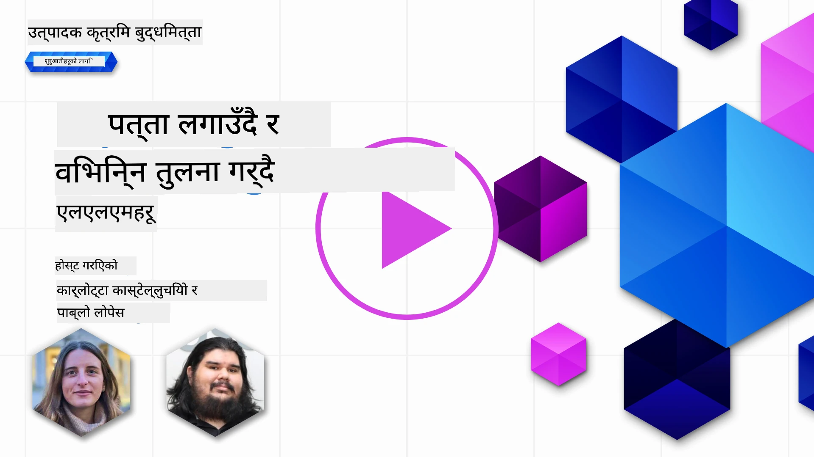](https://youtu.be/KIRUeDKscfI?si=8BHX1zvwzQBn-PlK)

> _यस पाठको भिडियो हेर्न माथि रहेको छवि क्लिक गर्नुहोस्_

अघिल्लो पाठसँगै, हामीले देख्यौं कि कसरी जनरेटिभ AI प्रविधि परिवेशलाई परिवर्तन गर्दैछ, कसरी ठूला भाषा मोडेलहरू (LLMs) काम गर्छन् र कसरी एउटा व्यवसाय - जस्तै हाम्रो स्टार्टअप - तिनीहरूलाई आफ्ना प्रयोग मामिलाहरूमा लागू गर्न र विकास गर्न सक्छ! यस अध्यायमा, हामी विभिन्न प्रकारका ठूला भाषा मोडेलहरू (LLMs) तुलना र भिन्नताहरू हेर्नेछौं ताकि तिनीहरूको फाइदा र बेफाइदाहरू बुझ्न सकियोस्।

हाम्रो स्टार्टअपको यात्राको अर्को कदम भनेको LLMs को वर्तमान परिवेश अन्वेषण गर्नु र हाम्रो प्रयोग मामिलाका लागि कुन उपयुक्त छ भनी बुझ्नु हो।

## परिचय

यो पाठले समेट्नेछ:

- वर्तमान परिवेशमा विभिन्न प्रकारका LLMs।
- Azure मा तपाईंको प्रयोग मामिलाको लागि विभिन्न मोडेलहरूको परीक्षण, पुनरावृत्ति, र तुलना।
- कसरी LLM तैनाथ गर्ने।

## सिकाइका लक्ष्यहरू

यो पाठ पूरा गरेपछि, तपाईं सक्षम हुनुहुनेछ:

- तपाईंको प्रयोग मामिलाको लागि उपयुक्त मोडेल चयन गर्नु।
- कसरी परीक्षण गर्ने, पुनरावृत्ति गर्ने, र मोडेलको प्रदर्शन सुधार गर्ने बुझ्नु।
- व्यवसायहरूले कसरी मोडेलहरू तैनाथ गर्छन् थाहा पाउनु।

## विभिन्न प्रकारका LLMs बुझ्नुहोस्

LLMs लाई तिनीहरूको वास्तुकला, प्रशिक्षण डेटा, र प्रयोग मामिलाको आधारमा धेरै किसिमले वर्गीकरण गर्न सकिन्छ। यी भिन्नताहरू बुझ्नुले हाम्रो स्टार्टअपलाई परिस्थितिको लागि उपयुक्त मोडेल चयन गर्न मद्दत गर्नेछ, र कसरी परीक्षण, पुनरावृत्ति, र प्रदर्शन सुधार गर्ने बुझ्न सहयोग गर्नेछ।

विभिन्न प्रकारका LLM मोडेलहरू धेरै छन्, तपाईँको मोडेल छनोट तपाईँ केका लागि प्रयोग गर्ने हो, तपाईंको डेटा, कति खर्च गर्न तयार हुनुहुन्छ, र अन्य कुरामा निर्भर गर्दछ।

तपाईं मोडेलहरूलाई पाठ, अडियो, भिडियो, चित्र निर्माण आदि का लागि प्रयोग गर्ने लक्ष्य राख्नु हुन्छ भने, तपाईं फरक किसिमको मोडेल रोज्न सक्नुहुन्छ।

- **अडियो र भाषण पहिचान।** व्हिस्पर-शैलीका मोडेलहरू अझै पनि उपयोगी सामान्य उद्देश्यको भाषण पहिचान मोडेलहरू हुन्, तर उत्पादन छनोटहरूमा अहिले नयाँ भाषण-देखि-पाठ मोडेलहरू पनि छन् जस्तै `gpt-4o-transcribe`, `gpt-4o-mini-transcribe`, र डायराइजेशन भेरियन्टहरू। तपाईंको परिस्थिति अनुसार भाषा कवरेज, डायराइजेशन, वास्तविक-समय समर्थन, विलम्बता, र लागत मूल्याङ्कन गर्नुहोस्। [OpenAI speech-to-text डकुमेन्टेशन](https://platform.openai.com/docs/guides/speech-to-text?WT.mc_id=academic-105485-koreyst) थाहा पाउनुहोस्।

- **चित्र निर्माण।** DALL-E र Midjourney प्रख्यात चित्र निर्माण विकल्प हुन्, तर वर्तमान OpenAI चित्र API हरू GPT Image मोडेलहरू जस्तै `gpt-image-2` मा केन्द्रित छन्, जबकि Stable Diffusion, Imagen, Flux, र अन्य मोडेल परिवारहरू पनि सामान्य छनोट हुन्। प्रम्प्ट अनुसरण, सम्पादन समर्थन, शैली नियन्त्रण, सुरक्षा आवश्यकताहरू, र लाइसेन्सिङ तुलना गर्नुहोस्। [OpenAI तस्वीर निर्माण मार्गदर्शन](https://platform.openai.com/docs/guides/images?WT.mc_id=academic-105485-koreyst) र यस पाठ्यक्रमको अध्याय ९ मा थप जान्नुहोस्।

- **पाठ निर्माण।** पाठ मोडेलहरूले अहिले फ्रन्टियर मोडेलहरू, तर्क मोडेलहरू, साना कम विलम्बता मोडेलहरू, र खुला-तौल मोडेलहरू समेट्छ। वर्तमान उदाहरणहरूमा OpenAI GPT-5.x मोडेलहरू, Anthropic Claude 4.x मोडेलहरू, Google Gemini 3.x मोडेलहरू, Meta Llama 4 मोडेलहरू, र Mistral मोडेलहरू छन्। केवल रिलिज मिति वा मूल्यले निर्णय नदिनुहोस्; कार्य गुणस्तर, विलम्बता, सन्दर्भ विन्डो, उपकरण प्रयोग, सुरक्षा व्यवहार, क्षेत्रीय उपलब्धता, र कुल लागत तुलना गर्नुहोस्। [Microsoft Foundry मोडेल क्याटलग](https://ai.azure.com/catalog?WT.mc_id=academic-105485-koreyst) Azure मा उपलब्ध मोडेलहरू तुलना गर्ने राम्रो ठाउँ हो।

- **बहु-मोडालिटी।** धेरै वर्तमान मोडेलहरू केवल पाठ मात्र होइन अन्य सामग्री पनि प्रक्रिया गर्न सक्छन्। केहीले चित्र, अडियो, वा भिडियो इनपुट स्वीकार्छन्; केही उपकरणहरूलाई कल गर्न सक्छन्; र विशेष मोडेलहरूले चित्र, अडियो, वा भिडियो उत्पन्न गर्न सक्छन्। उदाहरणका लागि, वर्तमान OpenAI मोडेलहरूले पाठ र चित्र इनपुट समर्थन गर्छन्, Gemini मोडेलहरूले भेरियन्ट अनुसार पाठ, कोड, चित्र, अडियो, र भिडियो इनपुटहरू समर्थन गर्न सक्छन्, र Llama 4 Scout र Maverick खुला-तौल स्वदेशी बहुमोडाल मोडेलहरू हुन्। कुनै पनि मोडेल प्रयोग गर्नुअघि त्यसको समर्थन इनपुट र आउटपुट मोडालिटीहरू प्रत्येक मोडेल कार्डमा जाँच गर्नुहोस्।

मोडेल चयन गर्दा तपाईं केही आधारभूत क्षमताहरू पाउनुहुन्छ, जुन कहिलेकाहीं पर्याप्त नहुन सक्छ। प्रायः तपाईंंसँग कम्पनी विशिष्ट डेटा हुन्छ जसलाई तपाईंले कसरी LLM लाई बताउने भन्ने केही विकल्पहरू छन्। त्यो विषयमा आगामी भागहरूमा बढी चर्चा हुनेछ।

### फाउन्डेसन मोडेलहरू र LLMs बीचको भिन्नता

फाउन्डेसन मोडेल शब्द [स्टानफोर्ड अनुसन्धानकर्ताहरूले सुजाव दिएका](https://arxiv.org/abs/2108.07258?WT.mc_id=academic-105485-koreyst) हुन् र यसलाई यसरी परिभाषित गरिएको छ:

- **यी अनसुपरभाइज्ड वा सेल्फ-सुपरभाइज्ड शिक्षाद्वारा प्रशिक्षित हुन्छन्**, जसको अर्थ यी बिना लेबल गरिएको बहु-मोडल डेटा मा प्रशिक्षण गरिन्छ, र तिनीहरूलाई मानव एनोटेसन वा लेबलिङ आवश्यकता पर्दैन।
- **यी धेरै ठूला मोडेलहरू हुन्छन्**, जसले अरबौं प्यारामिटरहरूमाथि गहिरा न्यूरल नेटवर्कहरूमा आधारित हुन्छन्।
- **यी सामान्यतया 'फाउन्डेसन' को रूपमा सेवा दिने उद्देश्यका लागि हुन्छन्**, जसको अर्थ अरु मोडेलहरूका लागि थालनीको रूपमा प्रयोग गर्न सकिन्छ, जुन फाइन-ट्यूनिङ द्वारा गरिन्छ।

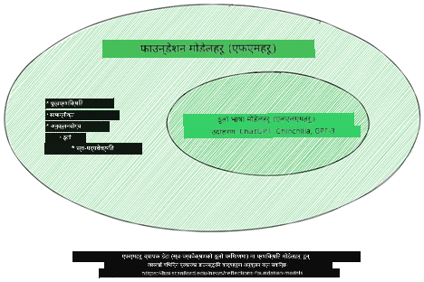

चित्र स्रोत: [फाउन्डेसन मोडेलहरू र ठूला भाषा मोडेलहरूको आवश्यक मार्गदर्शन | बाबर एम भट्टी | मिडियम
](https://thebabar.medium.com/essential-guide-to-foundation-models-and-large-language-models-27dab58f7404)

यो भिन्नता थप स्पष्ट बनाउन, हामीले ChatGPT लाई ऐतिहासिक उदाहरणको रूपमा लिन सक्छौं। प्रारम्भिक संस्करणहरू ChatGPT ले GPT-3.5 लाई फाउन्डेसन मोडेलको रूपमा प्रयोग गरेको थियो। OpenAI ले त्यसपछि च्याट-विशिष्ट डेटा र एलाइनमेन्ट प्रविधिहरू प्रयोग गरेर ट्यून गरिएको संस्करण बनायो जसले च्याटबोट जस्ता संवादात्मक परिस्थितिहरूमा अझ राम्रो प्रदर्शन गर्यो। आधुनिक AI सेवा अक्सर विभिन्न मोडेल भेरियन्टहरूबीच मार्गनिर्देशन गर्छन्, त्यसैले सेवा नाम र आधारभूत मोडेल नाम सधैं उस्तै हुँदैनन्।

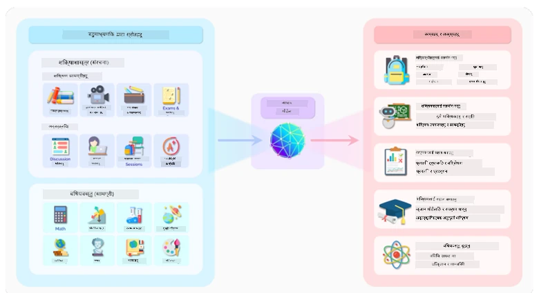

चित्र स्रोत: [2108.07258.pdf (arxiv.org)](https://arxiv.org/pdf/2108.07258.pdf?WT.mc_id=academic-105485-koreyst)

### खुला-तौल/खुला-स्रोत र मालिकाना मोडेलहरू

LLMs अर्को तरिकाले वर्गीकरण नगर्दा खुला-तौल, खुला-स्रोत, वा मालिकाना छन् भन्ने आधारमा भिन्न हुन्छन्।

खुला-स्रोत र खुला-तौल मोडेलहरू मोडेल वस्तुहरू निरीक्षण, डाउनलोड, वा अनुकूलनका लागि उपलब्ध गराउँछन्, तर तिनीहरूको लाइसेन्स फरक हुन्छ। केही पूर्ण रूपमा खुला स्रोत हुन्छन्, जबकि अन्य खुला-तौल मोडेलहरू प्रयोग प्रतिबन्धहरूसँग आउँछन्। जब व्यवसायलाई तैनाथीकरण, डेटा स्थानियता, लागत, वा अनुकूलनमा बढी नियन्त्रण चाहिन्छ, तिनीहरू उपयोगी हुन सक्छन्। यद्यपि, टोलीहरूले प्रयोग अघि लाइसेन्स सर्तहरू, सेवा लागत, मर्मतसम्भार, सुरक्षा अपडेटहरू, र मूल्याङ्कन गुणस्तर जाँच गर्न आवश्यक छ। उदाहरणमा [Meta Llama 4](https://ai.meta.com/blog/llama-4-multimodal-intelligence/?WT.mc_id=academic-105485-koreyst), केहि [Mistral मोडेलहरू](https://docs.mistral.ai/models/overview?WT.mc_id=academic-105485-koreyst), र धेरै मोडेलहरू [Hugging Face](https://huggingface.co/models?WT.mc_id=academic-105485-koreyst) मा होस्ट गरिएका छन्।

मालिकाना मोडेलहरू प्रदायकको स्वामित्वमा र होस्ट गरिन्छ। यी मोडेलहरू प्रायः प्रबंधित उत्पादन प्रयोगका लागि अनुकूलित हुन्छन् र बलियो समर्थन, सुरक्षा प्रणालीहरू, उपकरण एकीकरण, र मापन प्रस्ताव गर्न सक्छन्। तर ग्राहकहरूले प्रायः मोडेल तौलहरू निरीक्षण वा संशोधन गर्न सक्दैनन्, र तिनीहरूले गोपनीयता, भण्डारण, अनुपालन, र स्वीकार्य प्रयोगका लागि प्रदायकका सर्तहरू समीक्षा गर्नुपर्छ। उदाहरणहरूमा [OpenAI मोडेलहरू](https://platform.openai.com/docs/models?WT.mc_id=academic-105485-koreyst), [Google Gemini](https://deepmind.google/models/gemini/pro/?WT.mc_id=academic-105485-koreyst), र [Anthropic Claude](https://platform.claude.com/docs/en/about-claude/models/overview?WT.mc_id=academic-105485-koreyst) छन्।

### एम्बेडिङ र चित्र निर्माण र पाठ तथा कोड निर्माण

LLMs लाई तिनीहरूले उत्पन्न गर्ने आउटपुट अनुसार पनि वर्गीकरण गर्न सकिन्छ।

एम्बेडिङहरू ती मोडेलहरूको समूह हुन् जसले पाठलाई संख्यात्मक स्वरूपमा रूपान्तरण गर्न सक्छन्, जसलाई एम्बेडिङ भनिन्छ, जुन इनपुट पाठको संख्यात्मक प्रतिनिधित्व हो। एम्बेडिङले मेसिनहरूलाई शब्द वा वाक्यहरूको सम्बन्ध बुझ्न सजिलो बनाउँछ र तिनीहरूलाई अन्य मोडेलहरूले, जस्तै वर्गीकरण मोडेलहरू वा क्लस्टरिंग मोडेलहरूको रूपमा इनपुटको रूपमा प्रयोग गर्न सकिन्छ जसले संख्यात्मक डेटामा राम्रो प्रदर्शन गर्छन्। एम्बेडिङ मोडेलहरू प्रायः ट्रान्सफर लर्निङका लागि प्रयोग हुन्छन्, जहाँ मोडेललाई प्रतिनियुक्ति कार्यको लागि बनाइन्छ जुन पर्याप्त डेटा हुन्छ, र त्यसपछि मोडेल तौलहरू (एम्बेडिङहरू) अन्य डाउनस्ट्रीम कार्यहरूमा पुनः प्रयोग गरिन्छ। यस वर्गको उदाहरण हो [OpenAI embeddings](https://platform.openai.com/docs/models/embeddings?WT.mc_id=academic-105485-koreyst)।

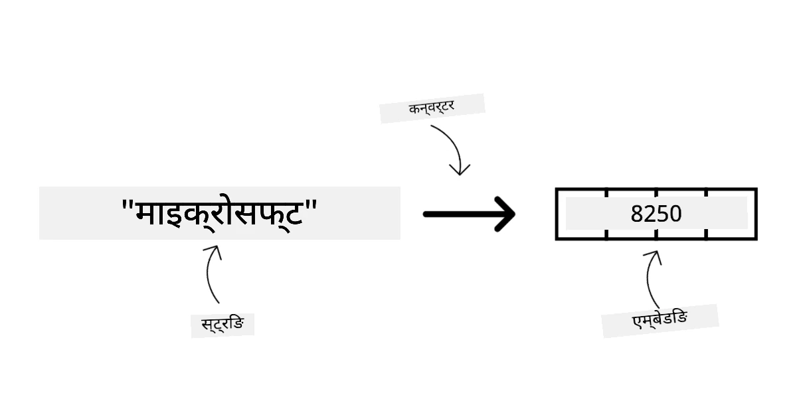

चित्र निर्माण मोडेलहरू ती मोडेलहरू हुन् जसले चित्रहरू उत्पादन गर्छन्। यी मोडेलहरू प्रायः चित्र सम्पादन, चित्र संश्लेषण, र चित्र अनुवादका लागि प्रयोग गरिन्छ। चित्र निर्माण मोडेलहरू प्रायः चित्रहरूको ठूलो डेटासेटमा प्रशिक्षण गरिन्छ, जस्तै [LAION-5B](https://laion.ai/blog/laion-5b/?WT.mc_id=academic-105485-koreyst), र नयाँ चित्रहरू उत्पादन गर्न वा पहिल्यैका चित्रहरूलाई इनपेन्टिंग, सुपर-रिजोलुशन, र रंग सेटिङ प्रविधिहरूले सम्पादन गर्न प्रयोग गरिन्छ। उदाहरणहरूमा [GPT Image मोडेलहरू](https://platform.openai.com/docs/guides/images?WT.mc_id=academic-105485-koreyst), [Stable Diffusion मोडेलहरू](https://github.com/Stability-AI/StableDiffusion?WT.mc_id=academic-105485-koreyst), र Imagen मोडेलहरू छन्।

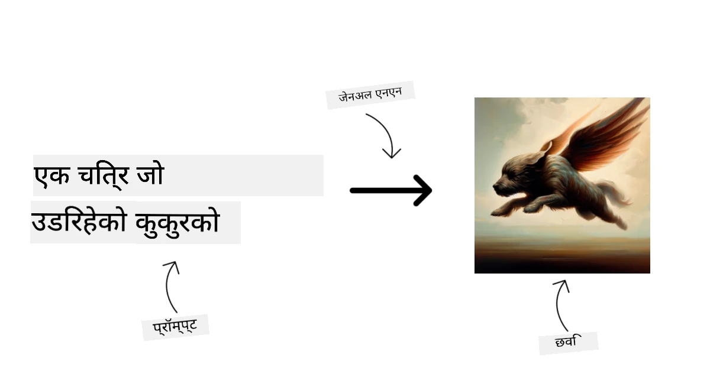

पाठ र कोड निर्माण मोडेलहरू ती मोडेलहरू हुन् जसले पाठ वा कोड उत्पादन गर्छन्। यी मोडेलहरू प्रायः पाठ सारांशकरण, अनुवाद, र प्रश्नोत्तरका लागि प्रयोग हुन्छन्। पाठ निर्माण मोडेलहरू प्रायः पाठको ठूलो डेटासेटमा प्रशिक्षण गरिन्छ, जस्तै [BookCorpus](https://www.cv-foundation.org/openaccess/content_iccv_2015/html/Zhu_Aligning_Books_and_ICCV_2015_paper.html?WT.mc_id=academic-105485-koreyst), र नयाँ पाठ उत्पादन गर्न वा प्रश्नहरूको उत्तर दिन प्रयोग हुन्छ। कोड निर्माण मोडेलहरू, जस्तै [CodeParrot](https://huggingface.co/codeparrot?WT.mc_id=academic-105485-koreyst), प्रायः कोडको ठूलो डेटासेटमा प्रशिक्षण गरिन्छ, जस्तै GitHub, र नयाँ कोड उत्पादन गर्न वा पहिलेका कोडमा बगहरू सुधार गर्न प्रयोग गरिन्छ।

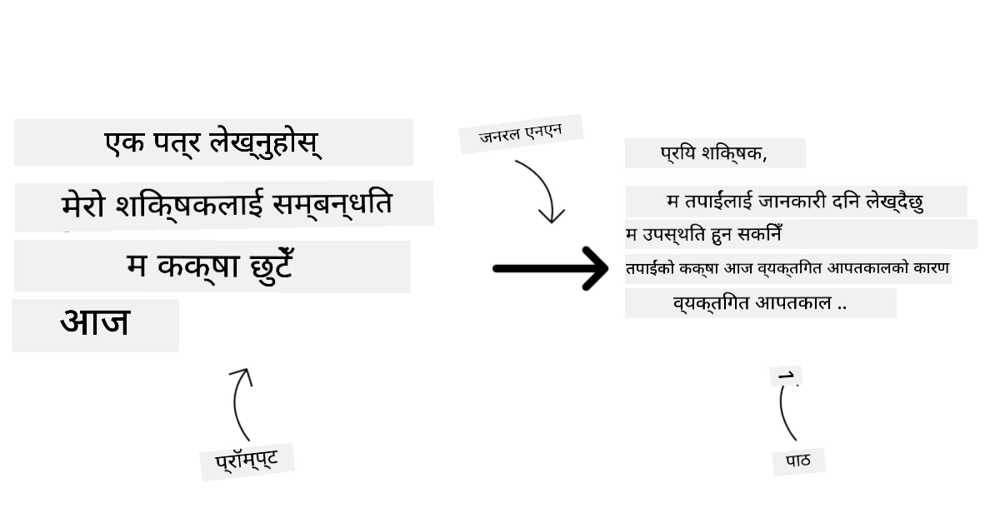

### एन्कोडर-डिकोडर र केवल डिकोडर

LLMका विभिन्न वास्तुकला प्रकारहरूबारे कुरा गर्नका लागि, एउटा उपमा प्रयोग गरौं।

कल्पना गर्नुहोस् तपाईँको म्यानेजरले विद्यार्थीहरूको लागि क्विज लेख्ने काम दिनुभयो। तपाईंसँग दुई सहकर्मीहरू छन्; एकले सामग्री सिर्जना गर्ने काम हेर्छ र अर्कोले समिक्षा गर्छ।

सामग्री सिर्जनाकर्ता एउटा केवल-डिकोडर मोडेल जस्तो हो: उनी विषयलाई हेर्छन्, तपाईँले के लेख्नुभयो त्यो देख्छन्, र त्यस सन्दर्भमा आधारित भएर सामग्री उत्पन्न गर्न जारी राख्छन्। उनीहरू रोचक र जानकारीमूलक सामग्री लेख्न निकै राम्रो हुन्छन्, तर तिनीहरू सधैं वर्गीकरण, पुनःप्राप्ति, वा जानकारी एन्कोड गर्ने काममा सबैभन्दा राम्रो विकल्प नहुन सक्छन्। केवल-डिकोडर मोडेल परिवारका उदाहरणहरू GPT र Llama मोडेलहरू हुन्।

समिक्षक भनेको केवल एन्कोडर मोडेल जस्तै हो, जो पाठ्यक्रम लेखिएको र उत्तरहरूलाई हेर्छन्, तिनीहरू बीचको सम्बन्ध र सन्दर्भ बुझ्छन्, तर सामग्री उत्पादनमा दक्ष छैनन्। एन्कोडर-केवल मोडेलको उदाहरण BERT हो।

कल्पना गर्नुहोस् जसले क्विज सिर्जना र समिक्षा दुबै गर्न सक्छ, त्यो एन्कोडर-डिकोडर मोडेल हो। केहि उदाहरणहरू BART र T5 हुन्।

### सेवा र मोडेल बीचको भिन्नता

अब, सेवा र मोडेल बीचको फरक कुरा गरौं। सेवा भनेको क्लाउड सेवा प्रदायकले प्रस्ताव गर्ने उत्पादन हो, जुन प्रायः मोडेलहरू, डेटा, र अन्य कम्पोनेन्टहरूको संयोजन हुन्छ। मोडेल सेवा को मुख्य कम्पोनेन्ट हो, र प्रायः फाउन्डेसन मोडेल वा LLM हुन्छ।

सेवाहरू उत्पादन प्रयोगका लागि धेरै अनुकूलित हुन्छन् र ग्राफिकल युजर इन्टरफेसमार्फत मोडेलहरू भन्दा सजिलो प्रयोगयोग्य हुन्छन्। यद्यपि, सेवाहरू सधैं निःशुल्क उपलब्ध हुँदैन, र तिनीहरू प्रयोग गर्न सदस्यता वा भुक्तानी आवश्यक हुन सक्छ, सेवाको मालिकको उपकरण र स्रोतहरू लगानी गरेर, खर्चहरू अनुकूलन गर्दै र सजिलै स्केल गर्दै। सेवाको उदाहरण [Azure OpenAI Service](https://learn.microsoft.com/azure/ai-services/openai/overview?WT.mc_id=academic-105485-koreyst) हो, जसले Pay-as-you-go शुल्क योजना प्रस्ताव गर्छ, जसको अर्थ प्रयोगकर्ताहरूसँग सेवा प्रयोग अनुसार शुल्क लिन्छ। Azure OpenAI सेवा मोडेलहरूको क्षमतामा थप रूपमा उपक्रम-स्तरीय सुरक्षा र जिम्मेवार AI ढाँचा प्रदान गर्दछ।

मोडेलहरू न्यूरल नेटवर्कका वस्तुहरू हुन्: प्यारामिटर, तौल, वास्तुकला, टोकनाइजर, र समर्थन कन्फिगरेसन। मोडेल स्थानिय रूपमा वा निजी वातावरणमा चलाउन उपयुक्त हार्डवेयर, सेवा पूर्वाधार, अनुगमन, र खुला-स्रोत/खुला-तौल लाइसेन्स वा व्यावसायिक लाइसेन्स आवश्यक पर्दछ। खुला-तौल मोडेलहरू, जस्तै Llama 4 वा Mistral मोडेलहरू, आफैं होस्ट गर्न सकिन्छ, तर तिनीहरूलाई कम्प्युटेशनल शक्ति र सञ्चालन कौशल चाहिन्छ।

## Azure मा फरक मोडेलहरूसँग कसरी परीक्षण र पुनरावृत्ति गरी प्रदर्शन बुझ्ने

एक पटक हाम्रो टोलीले वर्तमान LLMs को परिदृश्य अन्वेषण गरेपछि र तिनीहरूको परिदृश्यहरूको लागि केहि राम्रो उम्मेदवारहरू पहिचान गरेपछि, अर्को चरण तिनीहरूलाई तिनीहरूको डाटा र तिनीहरूको कार्यभारमा परीक्षण गर्ने हो। यो पुनरावृत्त प्रक्रिया हो, जुन प्रयोगहरू र मापनहरूद्वारा गरिन्छ।
पहिलेका अनुच्छेदहरूमा हामीले उल्लेख गरेका धेरै मोडेल (OpenAI मोडेलहरू, Llama 4 र Mistral जस्ता खुला-तौल मोडेलहरू, र Hugging Face मोडेलहरू) [Microsoft Foundry Models](https://learn.microsoft.com/azure/foundry/concepts/foundry-models-overview?WT.mc_id=academic-105485-koreyst) मा उपलब्ध छन्।

[Microsoft Foundry](https://learn.microsoft.com/azure/foundry/what-is-foundry?WT.mc_id=academic-105485-koreyst), जुन पहिले Azure AI Studio/Azure AI Foundry को नामले चिनिन्थ्यो, AI अनुप्रयोग र एजेन्टहरू निर्माण गर्नको लागि एक एकीकृत Azure प्लेटफर्म हो। यसले विकासकर्ताहरूलाई परीक्षण र मूल्याङ्कनदेखि वितरण, अनुगमन, र प्रशासनसम्मको जीवनचक्र व्यवस्थापन गर्न मद्दत गर्छ। Microsoft Foundry मा मोडेल सूचीले प्रयोगकर्तालाई सक्षम बनाउँछ:

- सूचीमा रुचाइएको आधारभूत मोडेल फेला पार्न, जसमा Azure द्वारा बेचिएका मोडेलहरू र साझेदार र समुदाय प्रदायकहरूका मोडेलहरू समावेश छन्। प्रयोगकर्ताहरू कार्य, प्रदायक, अनुमति, वितरण विकल्प, वा नाम अनुसार फिल्टर गर्न सक्दछन्।

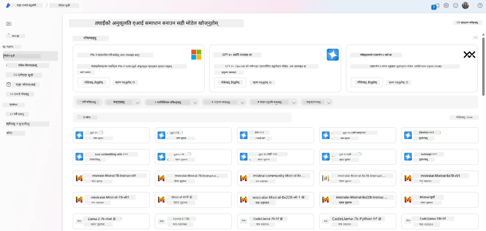

- मोडेल कार्ड समीक्षा गर्न, जसमा आशय गरिएको प्रयोग र तालिम डाटाको विस्तृत वर्णन, कोड नमूनाहरू र आन्तरिक मूल्याङ्कन पुस्तकालयमा मूल्याङ्कन परिणामहरू समावेश छन्।

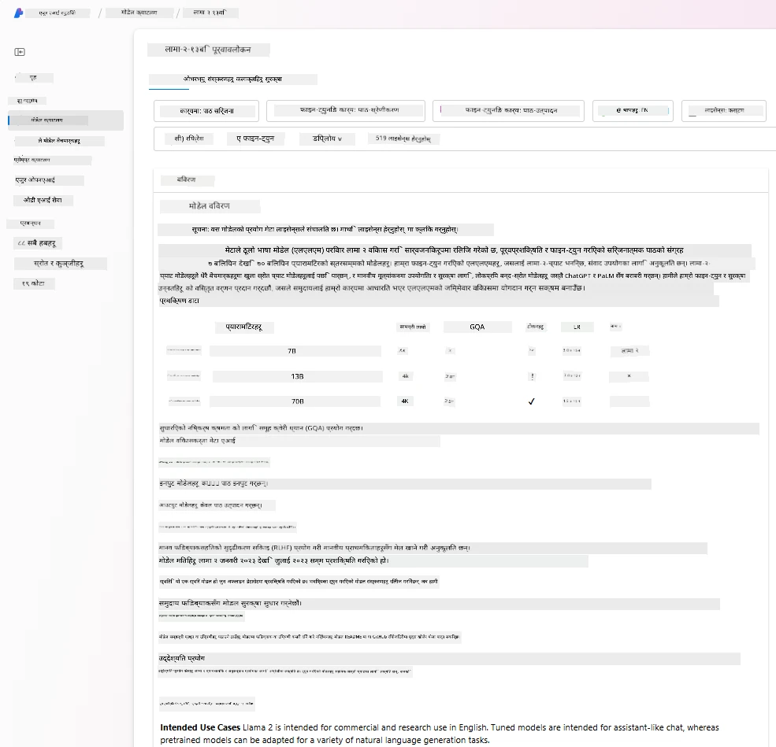

- उद्योगमा उपलब्ध मोडेल र डेटासेटहरूमा आधारित बेन्चमार्कहरू तुलना गर्न, कुन मोडेल व्यापार परिदृश्यसँग मेल खान्छ भनेर मूल्याङ्कन गर्न, [Model Benchmarks](https://learn.microsoft.com/azure/ai-studio/how-to/model-benchmarks?WT.mc_id=academic-105485-koreyst) प्यानमार्फत।

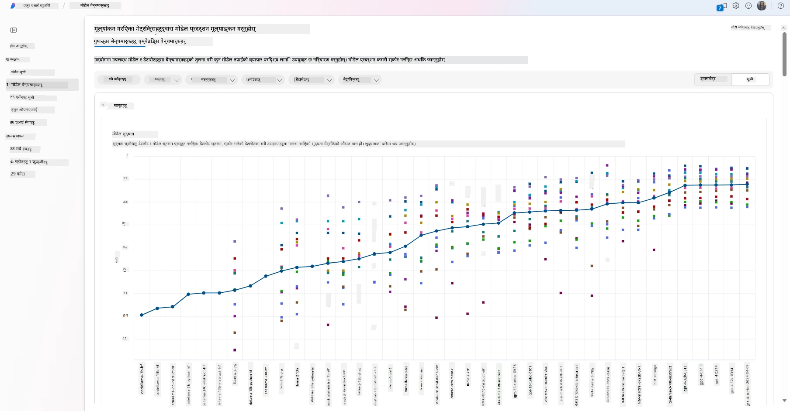

- अनुकूलन योग्य मोडेलहरूलाई विशेष कार्यभारमा सुधार गर्न कस्टम तालिम डाटामा फाइन-ट्यून गर्न, Microsoft Foundry को प्रयोग र ट्र्याकिङ क्षमताहरूको लाभ उठाउँदै।

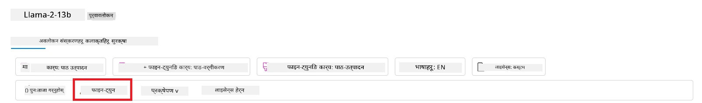

- मूल पूर्व-प्रशिक्षित मोडेल वा फाइन-ट्यून गरिएको संस्करणलाई रिमोट रियल-टाइम इनफेरेंस अन्त बिन्दुमा तैनाथ गर्न, प्रबन्धित कम्प्युट वा सर्वरलेस वितरण विकल्पहरू प्रयोग गरी, ताकि अनुप्रयोगहरूले यसलाई उपभोग गर्न सकून्।

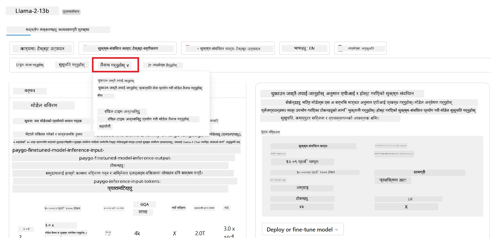

> [!NOTE]
> सूचीमा सबै मोडेलहरू हाल फाइन-ट्यूनिङ र/वा पे-एज-यू-गो वितरणका लागि उपलब्ध नहुन सक्छन्। मोडेल कार्डमा मोडेलको क्षमता र सीमाहरूका विवरणहरू जाँच गर्नुहोस्।

## LLM परिणाम सुधार

हामीले हाम्रो स्टार्टअप टोलीसँग विभिन्न प्रकारका LLMs र एउटा क्लाउड प्लेटफर्म (Microsoft Foundry) अन्वेषण गरेका छौं जसले विभिन्न मोडेलहरू तुलना गर्न, तिनीहरूलाई परीक्षण डाटामा मूल्याङ्कन गर्न, प्रदर्शन सुधार गर्न, र इनफेरेंस अन्त बिन्दुहरूमा तैनाथ गर्न सक्षम बनाउँछ।

तर कहिले उनीहरूले पूर्व-प्रशिक्षित मोडेल प्रयोग गर्ने सट्टा फाइन-ट्यूनिङ गर्ने विचार गर्नुपर्छ? के विशिष्ट कार्यभारहरूमा मोडेल प्रदर्शन सुधार गर्न अन्य विधिहरू छन्?

व्यवसायहरूले LLM बाट आवश्यक परिणाम प्राप्त गर्न प्रयोग गर्न सक्ने विभिन्न दृष्टिकोणहरू छन्। तपाईं उत्पादनमा LLM तैनाथ गर्दा प्रशिक्षणका विभिन्न स्तरका विभिन्न प्रकारका मोडेलहरू चयन गर्न सक्नुहुन्छ, जसमध्ये जटिलता, लागत, र गुणस्तर फरक हुन्छ। यहाँ केहि फरक दृष्टिकोणहरू छन्:

- **सन्दर्भसहित प्रॉम्प्ट इन्जीनियरिङ**। विचार यस्तो हो कि तपाईंले आवश्यक प्रतिक्रिया पाउन प्रॉम्प्ट गर्दा पर्याप्त सन्दर्भ उपलब्ध गराउनु।

- **Retrieval Augmented Generation, RAG**। तपाईंको डाटा डेटाबेस वा वेब अन्त बिन्दुमा अवस्थित हुन सक्छ, जस्तै, प्रॉम्प्ट गर्दा यो डाटा वा यसको उपसमूह समावेश गर्नका लागि, तपाईं सम्बन्धित डाटा प्राप्त गरेर यसलाई प्रयोगकर्ताको प्रॉम्प्टको हिस्सा बनाउन सक्नुहुन्छ।

- **फाइन-ट्यून गरिएको मोडेल**। यहाँ, तपाईंले मोडेललाई आफ्नो डाटामा थप तालिम दिनुभयो जसले मोडेललाई तपाईंको आवश्यकतामा अझ सटीक र प्रतिक्रियाशील बनायो तर यो महँगो हुन सक्छ।

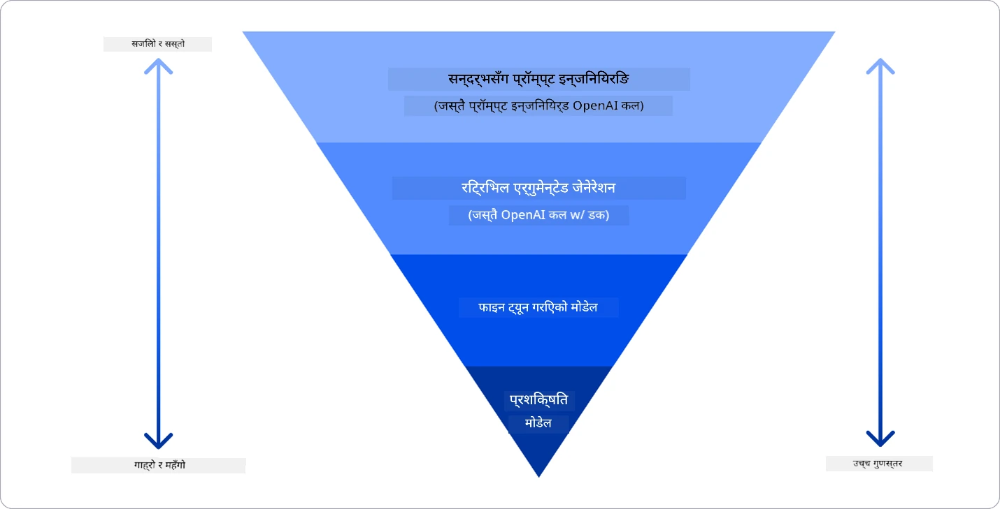

छवि स्रोत: [Four Ways that Enterprises Deploy LLMs | Fiddler AI Blog](https://www.fiddler.ai/blog/four-ways-that-enterprises-deploy-llms?WT.mc_id=academic-105485-koreyst)

### सन्दर्भसहित प्रॉम्प्ट इन्जीनियरिङ

पूर्व-प्रशिक्षित LLMs सामान्य प्राकृतिक भाषा कार्यहरूमा राम्रो काम गर्छन्, यहाँसम्म कि छोटो प्रॉम्प्ट प्रयोग गर्दा पनि, जस्तै पूर्ण गर्न एउटा वाक्य वा प्रश्न – जसलाई “शून्य-शट” सिकाइ भनिन्छ।

तर, प्रयोगकर्ताले आफ्नो क्वेरी अधिक विस्तृत अनुरोध र उदाहरणहरू (सन्दर्भ) सहित निर्माण गर्दा – जवाफ अधिक सटीक र प्रयोगकर्ताको अपेक्षासँग नजिक हुने छ। यस अवस्थामा, यदि प्रॉम्प्टमा एउटा मात्र उदाहरण छ भने “एक-शट” सिकाइ भनिन्छ र धेरै उदाहरणहरू हुँदा “थोरै-शट” सिकाइ भनिन्छ।
सन्दर्भसहित प्रॉम्प्ट इन्जीनियरिङ सुरु गर्न सबैभन्दा लागत-कुशल दृष्टिकोण हो।

### Retrieval Augmented Generation (RAG)

LLMs एउटा सीमितता छ कि तिनीहरूले मात्र तालिम प्राप्त गरिएको डाटामात्र प्रयोग गरेर जवाफ उत्पादन गर्न सक्छन्। यसको मतलब उनीहरूले आफ्नो तालिम प्रक्रियापछि भएका तथ्यहरूबारे केही थाहा हुँदैन, र गैर-सार्वजनिक जानकारी (जस्तै कम्पनी डेटा) पहुँच गर्न सक्दैनन्।
यो RAG मार्फत पार गर्न सकिन्छ, एउटा प्रविधि जसले प्रॉम्प्टलाई बाह्य डाटाले पूरक बनाउँछ, दस्तावेजका टुक्राहरूको रूपमा, प्रॉम्प्ट लम्बाइ सीमाहरूलाई ध्यानमा राख्दै। यो समर्थन Vector डेटाबेस उपकरणहरू (जस्तै [Azure Vector Search](https://learn.microsoft.com/azure/search/vector-search-overview?WT.mc_id=academic-105485-koreyst)) द्वारा गरिन्छ जसले विभिन्न पूर्व-निर्धारित डाटा स्रोतहरूबाट उपयोगी टुक्राहरू निकाल्छ र तिनीहरूलाई प्रॉम्प्ट सन्दर्भमा थप्छ।

यो प्रविधि जब कुनै व्यवसायसँग पर्याप्त डाटा, समय वा संसाधनहरू हुँदैनन् फाइन-ट्यून गर्नुका लागि तर निश्चित कार्यभारमा प्रदर्शन सुधार गर्न र कल्पना गरिएको, पुरानो वा असमर्थित जवाफहरूको जोखिम कटौती गर्न चाहन्छ, तब धेरै उपयोगी हुन्छ।

### फाइन-ट्यून गरिएको मोडेल

फाइन-ट्यूनिङ एउटा प्रक्रिया हो जसले हस्तान्तरण सिकाइको फाइदा उठाएर मोडेललाई तलको कार्यमा वा विशिष्ट समस्याको समाधान गर्न ‘अनुकूलित’ गर्छ। थोरै-शट सिकाइ र RAG भन्दा फरक, यसले नयाँ मोडेल सिर्जना गर्छ जसका तौल र पूर्वाग्रहहरू अद्यावधिक हुन्छन्। यसका लागि त्यस्ता तालिम उदाहरणहरूको आवश्यक छ जसमा एकल इनपुट (प्रॉम्प्ट) र त्यससँग सम्बन्धित आउटपुट (पूरा गरे अनुसार) हुन्छ।
यदि:

- **सानो कार्य-विशिष्ट मोडेलहरू प्रयोग गर्दै**। व्यवसायले सानो मोडेललाई संकीर्ण कार्यका लागि फाइन-ट्यून गर्न चाहन्छ, ठूलो मोडेललाई बारम्बार प्रॉम्प्ट गर्ने सट्टा, जसले लागत-कुशल र छिटो समाधान प्रदान गर्दछ।

- **लेटेन्सी विचार गर्दै**। लेटेन्सी कुनै प्रयोगको लागि महत्त्वपूर्ण छ, त्यसैले धेरै लामो प्रॉम्प्टहरू प्रयोग गर्न सकिँदैन वा प्रॉम्प्ट लम्बाइ सीमाभित्र मोडेलले सिक्नुपर्ने उदाहरणहरूको संख्या मिल्दैन।

- **स्थिर व्यवहार अनुकूलन गर्दै**। व्यवसायसँग धेरै गुणस्तरीय उदाहरणहरू छन् र मोडेललाई कार्य ढाँचा, आउटपुट ढाँचा, शैली वा डोमेन-विशिष्ट शैलीमा निरन्तरता दिन चाहन्छ। यदि मुख्य समस्या ताजा तथ्यहरू वा निजी ज्ञान हो जुन प्रायः बदलिन्छ भने, फाइन-ट्यूनिङमा मात्र निर्भर नगरी RAG प्रयोग गर्नुहोस्।

### तालिम दिइएको मोडेल

सुरूवातबाट LLM तालिम दिनु निस्सन्देह सबैभन्दा कठिन र सबैभन्दा जटिल दृष्टिकोण हो, जसका लागि विशाल मात्रामा डाटा, दक्ष स्रोतहरू, र उपयुक्त कम्प्युटेशनल शक्ति चाहिन्छ। यो विकल्प केवल तब विचार गर्नुपर्छ जब व्यवसायसँग डोमेन-विशिष्ट प्रयोग र ठूलो मात्रामा डोमेन-केंद्रित डाटा हुन्छ।

## ज्ञान परीक्षण

LLM पूरा गर्ने परिणामहरू सुधार गर्न के राम्रो दृष्टिकोण हुन सक्छ?

1. सन्दर्भसहित प्रॉम्प्ट इन्जीनियरिङ
1. RAG
1. फाइन-ट्यून गरिएको मोडेल

उत्तर: सबै तीनले मद्दत गर्न सक्छन्। छिटो सुधारका लागि सन्दर्भसहित प्रॉम्प्ट इन्जीनियरिङबाट सुरु गर्नुहोस्, र जब मोडेललाई वर्तमान तथ्य वा निजी व्यापार डाटा आवश्यक हुन्छ RAG प्रयोग गर्नुहोस्। पर्याप्त गुणस्तरीय उदाहरणहरू हुँदा र मोडेललाई कार्य, ढाँचा, शैली वा डोमेन ढाँचामा निरन्तरता दिन आवश्यक पर्दा फाइन-ट्यूनिङ छान्नुहोस्।

## 🚀 चुनौती

तपाईंको व्यवसायका लागि [RAG कसरी प्रयोग गर्ने](https://learn.microsoft.com/azure/search/retrieval-augmented-generation-overview?WT.mc_id=academic-105485-koreyst) बारे थप पढ्नुहोस्।

## राम्रो काम, तपाईंको सिकाइ जारी राख्नुहोस्

यस पाठ पूरा गरेपछि, हाम्रो [Generative AI Learning collection](https://aka.ms/genai-collection?WT.mc_id=academic-105485-koreyst) मा गएर आफ्नो जनरेटिभ AI ज्ञान बढाउनुहोस्!

पाठ ३ मा जानुहोस् जहाँ हामी हेर्नेछौं कि [उत्तरदायी रूपमा जनरेटिभ AI कसरी बनाउने](../03-using-generative-ai-responsibly/README.md?WT.mc_id=academic-105485-koreyst)।

---

<!-- CO-OP TRANSLATOR DISCLAIMER START -->
**अस्वीकरण**:
यो दस्तावेज़ AI अनुवाद सेवा [Co-op Translator](https://github.com/Azure/co-op-translator) प्रयोग गरेर अनुवाद गरिएको हो। हामी सही हुन प्रयास गर्छौं, तर कृपया जानकार हुनुस् कि स्वचालित अनुवादमा त्रुटिहरू वा अशुद्धताहरू हुन सक्छन्। मूल दस्तावेज़ यसको मूल भाषामा आधिकारिक स्रोत मानिनुपर्छ। महत्वपूर्ण जानकारीका लागि व्यावसायिक मानव अनुवाद सिफारिस गरिन्छ। यस अनुवादको प्रयोगबाट उत्पन्न कुनै पनि गलत बुझाइ वा त्रुटिको लागि हामी जिम्मेवार छैनौं।
<!-- CO-OP TRANSLATOR DISCLAIMER END -->