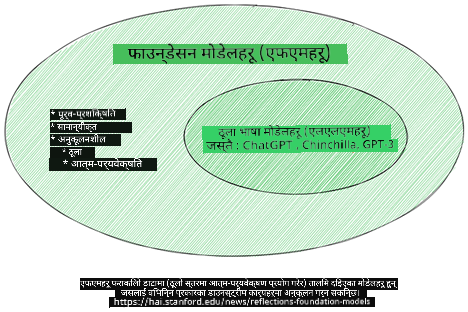
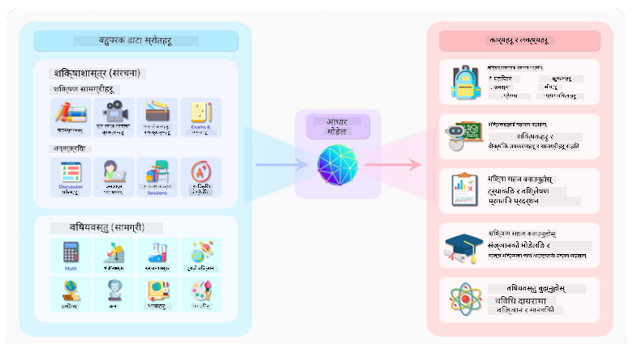
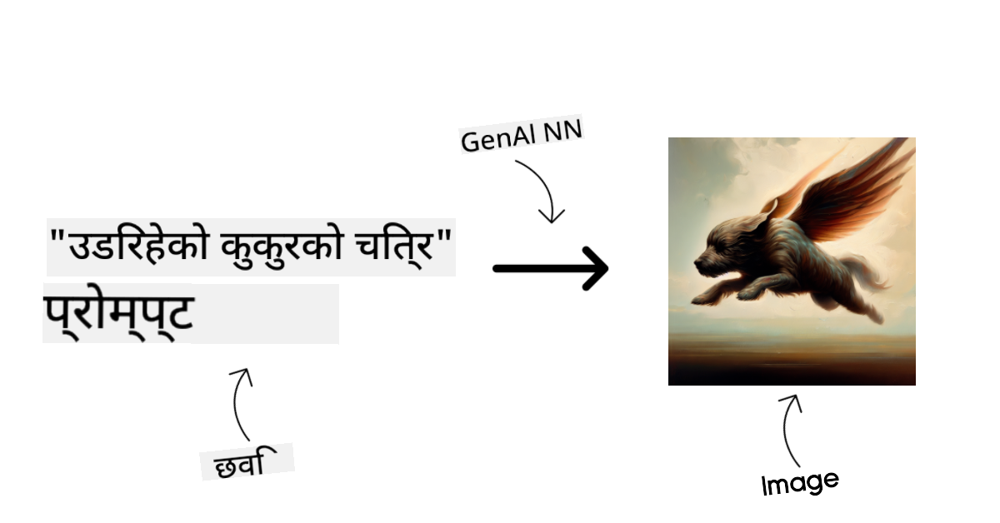
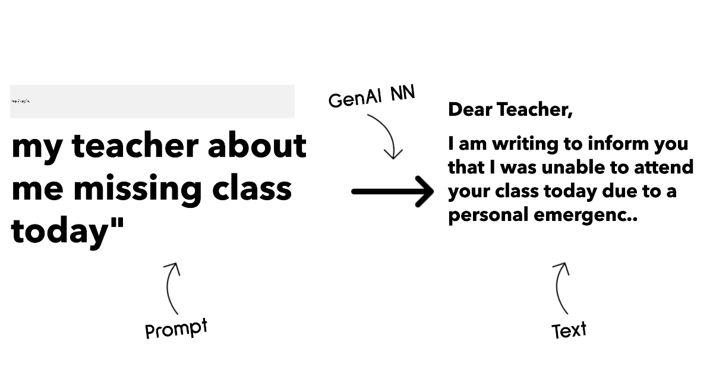
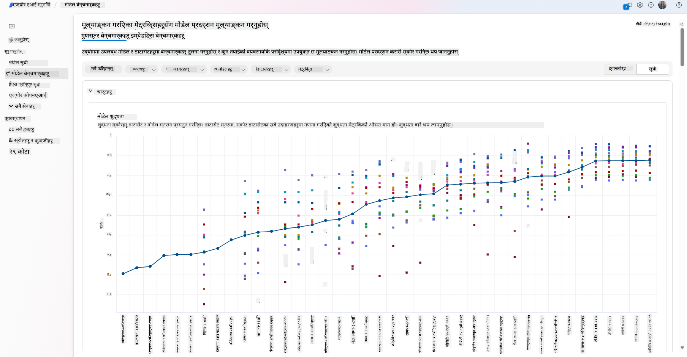
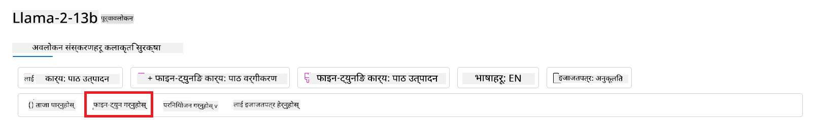

<!--
CO_OP_TRANSLATOR_METADATA:
{
  "original_hash": "e2f686f2eb794941761252ac5e8e090b",
  "translation_date": "2025-07-09T08:20:38+00:00",
  "source_file": "02-exploring-and-comparing-different-llms/README.md",
  "language_code": "ne"
}
-->
# विभिन्न LLM हरूको अन्वेषण र तुलना

> _यो पाठको भिडियो हेर्न माथिको तस्बिरमा क्लिक गर्नुहोस्_

अघिल्लो पाठमा, हामीले देख्यौं कि कसरी Generative AI प्रविधि क्षेत्रमा परिवर्तन ल्याइरहेको छ, Large Language Models (LLMs) कसरी काम गर्छन् र कसरी एउटा व्यवसाय - हाम्रो स्टार्टअप जस्तै - तिनीहरूलाई आफ्ना प्रयोग केसहरूमा लागू गरेर विकास गर्न सक्छ! यस अध्यायमा, हामी विभिन्न प्रकारका ठूलो भाषा मोडेलहरू (LLMs) लाई तुलना र भिन्नता गरेर तिनीहरूको फाइदा र बेफाइदाहरू बुझ्ने प्रयास गर्दैछौं।

हाम्रो स्टार्टअपको यात्राको अर्को चरण भनेको हालको LLMs को परिदृश्य अन्वेषण गर्नु र कुन मोडेल हाम्रो प्रयोग केसका लागि उपयुक्त छ भनेर बुझ्नु हो।

## परिचय

यस पाठले समेट्ने विषयहरू:

- हालको परिदृश्यमा विभिन्न प्रकारका LLM हरू।
- Azure मा तपाईँको प्रयोग केसका लागि विभिन्न मोडेलहरू परीक्षण, पुनरावृत्ति र तुलना गर्ने तरिका।
- LLM कसरी डिप्लोय गर्ने।

## सिकाइका लक्ष्यहरू

यस पाठ पूरा गरेपछि, तपाईँ सक्षम हुनुहुनेछ:

- तपाईँको प्रयोग केसका लागि उपयुक्त मोडेल चयन गर्न।
- मोडेलको प्रदर्शन कसरी परीक्षण, पुनरावृत्ति र सुधार गर्ने बुझ्न।
- व्यवसायहरूले मोडेलहरू कसरी डिप्लोय गर्छन् थाहा पाउन।

## विभिन्न प्रकारका LLM हरू बुझ्नुहोस्

LLM हरूलाई तिनीहरूको आर्किटेक्चर, प्रशिक्षण डेटा, र प्रयोग केसका आधारमा विभिन्न तरिकाले वर्गीकरण गर्न सकिन्छ। यी भिन्नताहरू बुझ्नाले हाम्रो स्टार्टअपलाई उपयुक्त मोडेल छनोट गर्न र कसरी परीक्षण, पुनरावृत्ति र प्रदर्शन सुधार गर्ने थाहा पाउन मद्दत गर्नेछ।

धेरै प्रकारका LLM मोडेलहरू छन्, तपाईँको मोडेल छनोट तपाईँ केका लागि प्रयोग गर्न चाहनुहुन्छ, तपाईँको डेटा, कति खर्च गर्न तयार हुनुहुन्छ र अन्य कुरामा निर्भर गर्दछ।

तपाईँ मोडेलहरूलाई पाठ, अडियो, भिडियो, छवि सिर्जना आदि का लागि प्रयोग गर्ने लक्ष्यमा आधारित भएर फरक प्रकारको मोडेल रोज्न सक्नुहुन्छ।

- **अडियो र भाषण पहिचान**। यसका लागि Whisper-प्रकारका मोडेलहरू उत्कृष्ट छनौट हुन् किनभने तिनीहरू सामान्य उद्देश्यका र भाषण पहिचानमा लक्षित छन्। यी विविध अडियोमा प्रशिक्षित छन् र बहुभाषिक भाषण पहिचान गर्न सक्षम छन्। [Whisper प्रकारका मोडेलहरूबारे यहाँ थप जान्नुहोस्](https://platform.openai.com/docs/models/whisper?WT.mc_id=academic-105485-koreyst)।

- **छवि सिर्जना**। छवि सिर्जनाका लागि DALL-E र Midjourney दुई प्रसिद्ध विकल्पहरू हुन्। DALL-E Azure OpenAI द्वारा प्रदान गरिन्छ। [DALL-E बारे यहाँ थप पढ्नुहोस्](https://platform.openai.com/docs/models/dall-e?WT.mc_id=academic-105485-koreyst) र यस पाठ्यक्रमको अध्याय ९ मा पनि।

- **पाठ सिर्जना**। अधिकांश मोडेलहरू पाठ सिर्जनामा प्रशिक्षित छन् र तपाईँसँग GPT-3.5 देखि GPT-4 सम्म धेरै विकल्पहरू छन्। यी विभिन्न मूल्यमा उपलब्ध छन्, GPT-4 सबैभन्दा महँगो हो। तपाईँको आवश्यकताअनुसार क्षमता र लागतको हिसाबले कुन मोडेल उपयुक्त छ भनेर मूल्यांकन गर्न [Azure OpenAI playground](https://oai.azure.com/portal/playground?WT.mc_id=academic-105485-koreyst) हेर्नु उपयोगी हुन्छ।

- **बहु-मोडालिटी**। यदि तपाईँ इनपुट र आउटपुटमा विभिन्न प्रकारका डेटा सम्हाल्न चाहनुहुन्छ भने, [gpt-4 turbo with vision वा gpt-4o](https://learn.microsoft.com/azure/ai-services/openai/concepts/models#gpt-4-and-gpt-4-turbo-models?WT.mc_id=academic-105485-koreyst) जस्ता मोडेलहरू हेर्न सक्नुहुन्छ - यी OpenAI का नयाँ मोडेलहरू हुन् जसले प्राकृतिक भाषा प्रशोधनलाई दृश्य बुझाइसँग जोड्न सक्षम छन्, जसले बहु-मोडल इन्टरफेसमार्फत अन्तरक्रिया सम्भव बनाउँछ।

मोडेल चयन गर्दा तपाईँलाई केही आधारभूत क्षमता प्राप्त हुन्छ, जुन कहिलेकाहीं पर्याप्त नहुन सक्छ। प्रायः तपाईँसँग कम्पनी विशेष डेटा हुन्छ जुन LLM लाई कसरी जानकारी गराउने भन्ने कुरा महत्त्वपूर्ण हुन्छ। यसका लागि विभिन्न विकल्पहरू छन्, जुन आगामी भागहरूमा छलफल गरिनेछ।

### Foundation Models र LLMs बीचको भिन्नता

Foundation Model शब्द [Stanford का अनुसन्धानकर्ताहरूले](https://arxiv.org/abs/2108.07258?WT.mc_id=academic-105485-koreyst) सिर्जना गरेका हुन् र यसलाई यस्तो AI मोडेलको रूपमा परिभाषित गरिएको छ जुन केही मापदण्डहरू पूरा गर्छ, जस्तै:

- **यी अनसुपरभाइज्ड वा सेल्फ-सुपरभाइज्ड लर्निङ प्रयोग गरेर प्रशिक्षित हुन्छन्**, जसको अर्थ हो कि यी लेबल नगरिएका बहु-मोडल डेटा मा प्रशिक्षित हुन्छन् र तिनीहरूको प्रशिक्षण प्रक्रियाका लागि मानव एनोटेशन वा लेबलिङ आवश्यक पर्दैन।
- **यी धेरै ठूलो मोडेलहरू हुन्छन्**, गहिरो न्यूरल नेटवर्कहरूमा आधारित र अर्बौं प्यारामिटरहरूमा प्रशिक्षित।
- **यी सामान्यतया अन्य मोडेलहरूको ‘आधार’ को रूपमा सेवा दिन बनाइएका हुन्छन्**, जसको अर्थ तिनीहरूलाई अन्य मोडेलहरू निर्माण गर्न सुरुवातको बिन्दुको रूपमा प्रयोग गर्न सकिन्छ, जुन फाइन-ट्युनिङ गरेर गर्न सकिन्छ।

तस्बिर स्रोत: [Essential Guide to Foundation Models and Large Language Models | by Babar M Bhatti | Medium](https://thebabar.medium.com/essential-guide-to-foundation-models-and-large-language-models-27dab58f7404)

यस भिन्नतालाई अझ स्पष्ट पार्न, ChatGPT लाई उदाहरणको रूपमा लिऔं। ChatGPT को पहिलो संस्करण बनाउन GPT-3.5 नामक मोडेललाई Foundation Model को रूपमा प्रयोग गरिएको थियो। यसको अर्थ OpenAI ले केही च्याट-विशेष डेटा प्रयोग गरेर GPT-3.5 को एक ट्युन गरिएको संस्करण बनायो जुन संवादात्मक परिदृश्यहरूमा राम्रो प्रदर्शन गर्न सक्षम थियो, जस्तै च्याटबोटहरूमा।

तस्बिर स्रोत: [2108.07258.pdf (arxiv.org)](https://arxiv.org/pdf/2108.07258.pdf?WT.mc_id=academic-105485-koreyst)

### Open Source र Proprietary मोडेलहरू

LLM हरूलाई अर्को तरिकाले वर्गीकरण गर्दा तिनीहरू खुला स्रोत (open source) वा स्वामित्वाधीन (proprietary) हुन् कि होइन भन्ने आधारमा पनि गर्न सकिन्छ।

खुला स्रोत मोडेलहरू त्यस्ता मोडेलहरू हुन् जुन सार्वजनिक रूपमा उपलब्ध हुन्छन् र जसलाई कुनै पनि व्यक्ति प्रयोग गर्न सक्छ। यी प्रायः तिनीहरूलाई बनाउने कम्पनी वा अनुसन्धान समुदायले उपलब्ध गराउँछन्। यी मोडेलहरू निरीक्षण, संशोधन र विभिन्न प्रयोग केसहरूका लागि अनुकूलन गर्न सकिन्छ। तर, यी सधैं उत्पादनमा प्रयोगका लागि अनुकूलित नहुन सक्छन् र स्वामित्वाधीन मोडेलहरू जत्तिकै प्रदर्शनकारी नहुन सक्छन्। साथै, खुला स्रोत मोडेलहरूको लागि वित्त पोषण सीमित हुन सक्छ, र तिनीहरू दीर्घकालीन रूपमा मर्मतसम्भार नहुन सक्छन् वा नयाँ अनुसन्धानसँग अपडेट नहुन सक्छन्। लोकप्रिय खुला स्रोत मोडेलहरूको उदाहरणहरूमा [Alpaca](https://crfm.stanford.edu/2023/03/13/alpaca.html?WT.mc_id=academic-105485-koreyst), [Bloom](https://huggingface.co/bigscience/bloom) र [LLaMA](https://llama.meta.com) छन्।

स्वामित्वाधीन मोडेलहरू कम्पनीको स्वामित्वमा हुने र सार्वजनिक रूपमा उपलब्ध नहुने मोडेलहरू हुन्। यी प्रायः उत्पादन प्रयोगका लागि अनुकूलित हुन्छन्। तर, यी निरीक्षण, संशोधन वा विभिन्न प्रयोग केसहरूका लागि अनुकूलन गर्न अनुमति दिइँदैन। यी सधैं निःशुल्क उपलब्ध नहुन सक्छन् र प्रयोग गर्न सदस्यता वा भुक्तानी आवश्यक पर्न सक्छ। साथै, प्रयोगकर्ताहरूले मोडेल प्रशिक्षणका लागि प्रयोग गरिएको डेटामा नियन्त्रण राख्दैनन्, जसको अर्थ मोडेल मालिकलाई डेटा गोपनीयता र जिम्मेवार AI प्रयोग सुनिश्चित गर्न विश्वास गर्नुपर्छ। लोकप्रिय स्वामित्वाधीन मोडेलहरूको उदाहरणमा [OpenAI मोडेलहरू](https://platform.openai.com/docs/models/overview?WT.mc_id=academic-105485-koreyst), [Google Bard](https://sapling.ai/llm/bard?WT.mc_id=academic-105485-koreyst) वा [Claude 2](https://www.anthropic.com/index/claude-2?WT.mc_id=academic-105485-koreyst) छन्।

### Embedding, Image Generation, Text र Code Generation

LLM हरूलाई तिनीहरूले उत्पादन गर्ने आउटपुटका आधारमा पनि वर्गीकरण गर्न सकिन्छ।

Embedding मोडेलहरू पाठलाई संख्यात्मक रूपान्तरण (embedding) मा परिणत गर्ने मोडेलहरू हुन्, जुन इनपुट पाठको संख्यात्मक प्रतिनिधित्व हो। Embedding ले मेसिनहरूलाई शब्द वा वाक्यहरू बीचको सम्बन्ध बुझ्न सजिलो बनाउँछ र अन्य मोडेलहरू, जस्तै वर्गीकरण मोडेल वा क्लस्टरिङ मोडेलहरूमा इनपुटको रूपमा प्रयोग गर्न सकिन्छ। Embedding मोडेलहरू प्रायः ट्रान्सफर लर्निङका लागि प्रयोग गरिन्छ, जहाँ एउटा मोडेललाई प्रशस्त डेटा भएको सट्टा कार्यका लागि बनाइन्छ र त्यसपछि मोडेलका तौलहरू (embeddings) अन्य कार्यहरूमा पुन: प्रयोग गरिन्छ। यस वर्गको उदाहरण हो [OpenAI embeddings](https://platform.openai.com/docs/models/embeddings?WT.mc_id=academic-105485-koreyst)।

छवि सिर्जना मोडेलहरू तस्बिरहरू सिर्जना गर्ने मोडेलहरू हुन्। यी मोडेलहरू प्रायः तस्बिर सम्पादन, तस्बिर संश्लेषण, र तस्बिर अनुवादका लागि प्रयोग गरिन्छ। छवि सिर्जना मोडेलहरू प्रायः ठूलो तस्बिर डेटासेटहरूमा प्रशिक्षित हुन्छन्, जस्तै [LAION-5B](https://laion.ai/blog/laion-5b/?WT.mc_id=academic-105485-koreyst), र नयाँ तस्बिरहरू सिर्जना गर्न वा विद्यमान तस्बिरहरूलाई इनपेन्टिङ, सुपर-रिजोल्युसन, र रंगीनकरण प्रविधिहरू प्रयोग गरेर सम्पादन गर्न सकिन्छ। उदाहरणहरूमा [DALL-E-3](https://openai.com/dall-e-3?WT.mc_id=academic-105485-koreyst) र [Stable Diffusion मोडेलहरू](https://github.com/Stability-AI/StableDiffusion?WT.mc_id=academic-105485-koreyst) छन्।

पाठ र कोड सिर्जना मोडेलहरू पाठ वा कोड सिर्जना गर्ने मोडेलहरू हुन्। यी मोडेलहरू प्रायः पाठ सारांश, अनुवाद, र प्रश्नोत्तरका लागि प्रयोग गरिन्छ। पाठ सिर्जना मोडेलहरू प्रायः ठूलो पाठ डेटासेटहरूमा प्रशिक्षित हुन्छन्, जस्तै [BookCorpus](https://www.cv-foundation.org/openaccess/content_iccv_2015/html/Zhu_Aligning_Books_and_ICCV_2015_paper.html?WT.mc_id=academic-105485-koreyst), र नयाँ पाठ सिर्जना गर्न वा प्रश्नहरूको उत्तर दिन प्रयोग गर्न सकिन्छ। कोड सिर्जना मोडेलहरू, जस्तै [CodeParrot](https://huggingface.co/codeparrot?WT.mc_id=academic-105485-koreyst), प्रायः ठूलो कोड डेटासेटहरूमा प्रशिक्षित हुन्छन्, जस्तै GitHub, र नयाँ कोड सिर्जना गर्न वा विद्यमान कोडमा बगहरू सुधार गर्न प्रयोग गरिन्छ।

### Encoder-Decoder र Decoder-only

LLM हरूका विभिन्न आर्किटेक्चरहरूबारे कुरा गर्दा, एउटा उपमा प्रयोग गरौं।

कल्पना गर्नुहोस् तपाईँको प्रबन्धकले तपाईँलाई विद्यार्थीहरूका लागि क्विज लेख्न कार्य दिनुभयो। तपाईँसँग दुई सहकर्मीहरू छन्; एकले सामग्री सिर्जना गर्छ र अर्कोले समीक्षा गर्छ।

सामग्री सिर्जनाकर्ता Decoder-only मोडेल जस्तै हो, जसले विषय हेरेर पहिले लेखिएको कुरालाई हेर्छ र त्यस आधारमा कोर्स लेख्छ। उनीहरू आकर्षक र जानकारीमूलक सामग्री लेख्न धेरै राम्रो हुन्छन्, तर विषय र सिकाइ उद्देश्य बुझ्न त्यति राम्रो हुँदैनन्। Decoder मोडेलहरूको उदाहरण GPT परिवारका मोडेलहरू, जस्तै GPT-3 हुन्।

समीक्षक Encoder-only मोडेल जस्तै हो, जसले लेखिएको कोर्स र उत्तरहरू हेरेर तिनीहरूबीचको सम्बन्ध र सन्दर्भ बुझ्छ, तर सामग्री सिर्जना गर्न सक्दैन। Encoder-only मोडेलको उदाहरण BERT हो।

कल्पना गर्नुहोस् हामीसँग त्यस्तो व्यक्ति पनि छ जसले क्विज सिर्जना र समीक्षा दुवै गर्न सक्छ, यो Encoder-Decoder मोडेल हो। उदाहरणहरूमा BART र T5 छन्।

### सेवा र मोडेल

अब, सेवा र मोडेल बीचको भिन्नता बारे कुरा गरौं। सेवा भनेको क्लाउड सेवा प्रदायकले प्रदान गर्ने उत्पादन हो, जुन प्रायः मोडेलहरू, डेटा, र अन्य कम्पोनेन्टहरूको संयोजन हुन्छ। मोडेल भनेको सेवाको मुख्य कम्पोनेन्ट हो, र प्रायः Foundation Model, जस्तै LLM हुन्छ।

सेवाहरू प्रायः उत्पादन प्रयोगका लागि अनुकूलित हुन्छन् र मोडेलहरू भन्दा प्रयोग गर्न सजिलो हुन्छन्, प्रायः ग्राफिकल यूजर इन्टरफेसमार्फत। तर, सेवाहरू सधैं निःशुल्क उपलब्ध नहुन सक्छन् र प्रयोग गर्न सदस्यता वा भुक्तानी आवश्यक पर्न सक्छ, जसले सेवा मालिकको उपकरण र स्रोतहरू प्रयोग गर्ने, खर्च अनुकूलन गर्ने र सजिलै स्केल गर्ने सुविधा दिन्छ। सेवाको उदाहरण हो [Azure OpenAI Service](https://learn.microsoft.com/azure/ai-services/openai/overview?WT.mc_id=academic-105485-koreyst), जसले pay-as-you-go दर योजना प्रदान गर्छ, जसको अर्थ प्रयोगकर्ताहरूले सेवा कति प्रयोग गर्छन् त्यसको अनुपातमा शुल्क तिर्छन्। साथै, Azure OpenAI Service ले मोडेलहरूको क्षमतामा आधारित उद्यम-स्तरको सुरक्षा र जिम्मेवार AI फ्रेमवर्क पनि प्रदान गर्छ।

मोडेलहरू केवल न्यूरल नेटवर्क हुन्, जसमा प्यारामिटरहरू, तौलहरू आदि हुन्छन्। कम्पनीहरूले स्थानीय रूपमा चलाउन सक्छन्, तर त्यसका लागि उपकरण किन्ने, संरचना बनाउने र लाइसेन्स किन्ने वा खुला स्रोत मोडेल प्रयोग गर्ने आवश्यक पर्छ। LLaMA जस्तो मोडेल प्रयोग गर्न उपलब्ध छ, जसलाई चलाउन कम्प्युटेशनल शक्ति चाहिन्छ।

## Azure मा विभिन्न मोडेलहरूसँग कसरी परीक्षण र पुनरावृत्ति गर्ने र प्रदर्शन बुझ्ने

हाम्रो टोलीले हालको LLMs परिदृश्य अन्वेषण गरी आफ्ना परिदृश्यहरूका लागि केही उपयुक्त उम्मेदवारहरू पहिचान गरेपछि, अर्को चरण भनेको तिनीहरूलाई आफ्ना डेटा र कार्यभारमा परीक्षण गर्नु हो। यो एक पुनरावृत्तिमूलक प्रक्रिया हो, जुन प्रयोगहरू र मापनहरू मार्फत गरिन्छ।
हामीले अघिल्ला अनुच्छेदहरूमा उल्लेख गरेका धेरै मोडेलहरू (OpenAI मोडेलहरू, Llama2 जस्ता खुला स्रोत मोडेलहरू, र Hugging Face ट्रान्सफर्मरहरू) [Azure AI Studio](https://ai.azure.com/?WT.mc_id=academic-105485-koreyst) मा रहेको [Model Catalog](https://learn.microsoft.com/azure/ai-studio/how-to/model-catalog-overview?WT.mc_id=academic-105485-koreyst) मा उपलब्ध छन्।

[Azure AI Studio](https://learn.microsoft.com/azure/ai-studio/what-is-ai-studio?WT.mc_id=academic-105485-koreyst) एक क्लाउड प्लेटफर्म हो जुन विकासकर्ताहरूलाई जेनेरेटिभ AI अनुप्रयोगहरू निर्माण गर्न र सम्पूर्ण विकास जीवनचक्र - परीक्षणदेखि मूल्यांकनसम्म - व्यवस्थापन गर्न डिजाइन गरिएको हो, जसले सबै Azure AI सेवाहरूलाई एकै ठाउँमा सजिलो GUI सहित संयोजन गर्छ। Azure AI Studio मा रहेको Model Catalog ले प्रयोगकर्तालाई निम्न कार्यहरू गर्न सक्षम बनाउँछ:

- क्याटलगमा रुचि भएको Foundation Model खोज्नुहोस् - चाहे त्यो स्वामित्वमा होस् वा खुला स्रोत, कार्य, लाइसेन्स, वा नाम अनुसार फिल्टर गरेर। खोजलाई सजिलो बनाउन मोडेलहरू संग्रहहरूमा वर्गीकृत गरिएका छन्, जस्तै Azure OpenAI संग्रह, Hugging Face संग्रह, र अन्य।

- मोडेल कार्ड समीक्षा गर्नुहोस्, जसमा प्रयोगको उद्देश्य र प्रशिक्षण डाटाको विस्तृत विवरण, कोड नमूनाहरू र आन्तरिक मूल्यांकन पुस्तकालयमा गरिएको मूल्यांकन परिणामहरू समावेश छन्।

- उद्योगमा उपलब्ध मोडेल र डेटासेटहरूमा आधारित बेंचमार्कहरू तुलना गर्नुहोस् र कुन मोडेलले व्यापारिक परिदृश्य पूरा गर्छ भनी मूल्यांकन गर्नुहोस्, [Model Benchmarks](https://learn.microsoft.com/azure/ai-studio/how-to/model-benchmarks?WT.mc_id=academic-105485-koreyst) प्यान मार्फत।

- Azure AI Studio को प्रयोग गरेर अन्वेषण र ट्र्याकिङ क्षमताहरूको फाइदा उठाउँदै, विशेष कार्यभारमा मोडेल प्रदर्शन सुधार गर्न कस्टम प्रशिक्षण डाटामा मोडेललाई फाइन-ट्यून गर्नुहोस्।

- मूल पूर्व-प्रशिक्षित मोडेल वा फाइन-ट्यून गरिएको संस्करणलाई रिमोट रियल टाइम इन्फरेन्स - व्यवस्थापन गरिएको कम्प्युट - वा सर्भरलेस API अन्तबिन्दुमा - [pay-as-you-go](https://learn.microsoft.com/azure/ai-studio/how-to/model-catalog-overview#model-deployment-managed-compute-and-serverless-api-pay-as-you-go?WT.mc_id=academic-105485-koreyst) - तैनाथ गर्नुहोस् ताकि अनुप्रयोगहरूले यसलाई प्रयोग गर्न सकून्।

> [!NOTE]
> क्याटलगमा भएका सबै मोडेलहरू हाल फाइन-ट्यूनिङ र/वा pay-as-you-go तैनाथीकरणका लागि उपलब्ध छैनन्। मोडेलको क्षमता र सीमाहरूको विवरणका लागि मोडेल कार्ड जाँच गर्नुहोस्।

## LLM परिणाम सुधार

हामीले हाम्रो स्टार्टअप टोलीसँग विभिन्न प्रकारका LLM हरू र एक क्लाउड प्लेटफर्म (Azure Machine Learning) को अन्वेषण गरेका छौं जसले हामीलाई विभिन्न मोडेलहरू तुलना गर्न, परीक्षण डाटामा मूल्यांकन गर्न, प्रदर्शन सुधार गर्न र इन्फरेन्स अन्तबिन्दुहरूमा तैनाथ गर्न सक्षम बनाउँछ।

तर कहिले उनीहरूले पूर्व-प्रशिक्षित मोडेलको सट्टा मोडेललाई फाइन-ट्यून गर्ने विचार गर्नुपर्छ? के मोडेल प्रदर्शन सुधार गर्न अन्य तरिकाहरू छन्?

व्यवसायले LLM बाट आवश्यक परिणाम प्राप्त गर्न विभिन्न तरिकाहरू अपनाउन सक्छ। उत्पादनमा LLM तैनाथ गर्दा विभिन्न स्तरका प्रशिक्षण भएका मोडेलहरू छनोट गर्न सकिन्छ, जसमा जटिलता, लागत, र गुणस्तर फरक हुन्छ। यहाँ केही फरक तरिकाहरू छन्:

- **सन्दर्भसहितको प्रॉम्प्ट इन्जिनियरिङ**। प्रॉम्प्ट गर्दा पर्याप्त सन्दर्भ प्रदान गर्ने विचार हो ताकि आवश्यक जवाफहरू प्राप्त गर्न सकियोस्।

- **Retrieval Augmented Generation, RAG**। तपाईंको डाटा डेटाबेस वा वेब अन्तबिन्दुमा हुन सक्छ, र प्रॉम्प्ट गर्दा त्यो डाटा वा त्यसको उपसमूह समावेश गर्न, सम्बन्धित डाटा ल्याएर प्रयोगकर्ताको प्रॉम्प्टको भाग बनाउन सकिन्छ।

- **फाइन-ट्यून गरिएको मोडेल**। यहाँ, तपाईंले आफ्नो डाटामा मोडेललाई थप प्रशिक्षण दिनुभयो जसले मोडेललाई तपाईंको आवश्यकतामा अझ सटीक र प्रतिक्रियाशील बनाउँछ, तर यो महँगो हुन सक्छ।

छवि स्रोत: [Four Ways that Enterprises Deploy LLMs | Fiddler AI Blog](https://www.fiddler.ai/blog/four-ways-that-enterprises-deploy-llms?WT.mc_id=academic-105485-koreyst)

### सन्दर्भसहितको प्रॉम्प्ट इन्जिनियरिङ

पूर्व-प्रशिक्षित LLM हरू सामान्य प्राकृतिक भाषा कार्यहरूमा धेरै राम्रो काम गर्छन्, छोटो प्रॉम्प्ट जस्तै पूरा गर्नुपर्ने वाक्य वा प्रश्न मार्फत पनि – जसलाई “शून्य-शट” सिकाइ भनिन्छ।

तर, प्रयोगकर्ताले आफ्नो सोधलाई विस्तृत अनुरोध र उदाहरणहरू सहित - सन्दर्भ - फ्रेम गर्न सकेमा, जवाफ अझ सटीक र प्रयोगकर्ताको अपेक्षासँग नजिक हुन्छ। यस अवस्थामा, यदि प्रॉम्प्टमा केवल एक उदाहरण छ भने यसलाई “वन-शट” सिकाइ भनिन्छ र धेरै उदाहरणहरू भए “फ्यु-शट” सिकाइ भनिन्छ।
सन्दर्भसहितको प्रॉम्प्ट इन्जिनियरिङ सुरु गर्न सबैभन्दा लागत-प्रभावकारी तरिका हो।

### Retrieval Augmented Generation (RAG)

LLM हरूको सीमितता के हो भने तिनीहरूले केवल आफ्नो प्रशिक्षणमा प्रयोग गरिएको डाटामात्र प्रयोग गरेर जवाफ दिन सक्छन्। यसको अर्थ, तिनीहरूले प्रशिक्षण पछि भएका तथ्यहरूबारे केही थाहा हुँदैन र गैर-सार्वजनिक जानकारी (जस्तै कम्पनी डाटा) पहुँच गर्न सक्दैनन्।
यसलाई RAG मार्फत समाधान गर्न सकिन्छ, जसले प्रॉम्प्टलाई बाह्य डाटाका टुक्राहरू (डोकुमेन्टका अंशहरू) सहित बढाउँछ, प्रॉम्प्ट लम्बाइ सीमाहरूलाई ध्यानमा राख्दै। यो Vector डेटाबेस उपकरणहरू (जस्तै [Azure Vector Search](https://learn.microsoft.com/azure/search/vector-search-overview?WT.mc_id=academic-105485-koreyst)) द्वारा समर्थित छ, जसले विभिन्न पूर्व-परिभाषित डाटा स्रोतहरूबाट उपयोगी टुक्राहरू ल्याएर प्रॉम्प्ट सन्दर्भमा थप्छ।

यो तरिका त्यतिबेला धेरै उपयोगी हुन्छ जब व्यवसायसँग पर्याप्त डाटा, समय, वा स्रोतहरू नभए पनि विशिष्ट कार्यभारमा प्रदर्शन सुधार गर्न र गलत जानकारी वा हानिकारक सामग्रीको जोखिम कम गर्न चाहन्छ।

### फाइन-ट्यून गरिएको मोडेल

फाइन-ट्यूनिङ एक प्रक्रिया हो जसले ट्रान्सफर लर्निङको प्रयोग गरेर मोडेललाई कुनै विशेष कार्य वा समस्या समाधानका लागि ‘अनुकूल’ बनाउँछ। फ्यु-शट सिकाइ र RAG भन्दा फरक, यसले नयाँ मोडेल उत्पादन गर्छ जसका तौल र बायसहरू अपडेट हुन्छन्। यसका लागि एउटा प्रशिक्षण उदाहरण सेट चाहिन्छ जसमा एकल इनपुट (प्रॉम्प्ट) र त्यसको सम्बन्धित आउटपुट (पूरा गरिएको जवाफ) हुन्छ।
यो तरिका निम्न अवस्थामा प्राथमिक हुन्छ:

- **फाइन-ट्यून गरिएको मोडेलहरू प्रयोग गर्दा**। व्यवसायले उच्च प्रदर्शन मोडेलको सट्टा कम क्षमताका फाइन-ट्यून गरिएको मोडेलहरू (जस्तै embedding मोडेलहरू) प्रयोग गर्न चाहन्छ, जसले लागत र गति दुवैमा फाइदा दिन्छ।

- **लेटेन्सी विचार गर्दा**। कुनै विशेष प्रयोग केसमा लेटेन्सी महत्त्वपूर्ण छ, त्यसैले धेरै लामो प्रॉम्प्ट वा धेरै उदाहरणहरू प्रयोग गर्न सकिँदैन।

- **अप-टु-डेट रहन**। व्यवसायसँग उच्च गुणस्तरको डाटा र ग्राउन्ड ट्रुथ लेबलहरू छन् र समयसँगै डाटा अपडेट राख्न स्रोतहरू उपलब्ध छन्।

### प्रशिक्षित मोडेल

शून्यबाट LLM प्रशिक्षण गर्नु सबैभन्दा कठिन र जटिल तरिका हो, जसका लागि ठूलो मात्रामा डाटा, दक्ष स्रोतहरू, र उपयुक्त कम्प्युटेशनल शक्ति आवश्यक पर्छ। यो विकल्प केवल त्यस्तो अवस्थामा विचार गर्नुपर्छ जहाँ व्यवसायसँग डोमेन-विशेष प्रयोग केस र ठूलो मात्रामा डोमेन-केंद्रित डाटा हुन्छ।

## ज्ञान जाँच

LLM पूरा गर्ने परिणाम सुधार गर्न कुन तरिका राम्रो हुन सक्छ?

1. सन्दर्भसहितको प्रॉम्प्ट इन्जिनियरिङ  
1. RAG  
1. फाइन-ट्यून गरिएको मोडेल  

उत्तर: ३, यदि तपाईं सँग समय, स्रोत र उच्च गुणस्तरको डाटा छ भने, फाइन-ट्यूनिङ अपडेट रहनको लागि राम्रो विकल्प हो। तर यदि तपाईं सुधार गर्न चाहनुहुन्छ र समय कम छ भने पहिले RAG विचार गर्नु उपयुक्त हुन्छ।

## 🚀 चुनौती

तपाईंको व्यवसायका लागि [RAG कसरी प्रयोग गर्ने](https://learn.microsoft.com/azure/search/retrieval-augmented-generation-overview?WT.mc_id=academic-105485-koreyst) बारे थप पढ्नुहोस्।

## राम्रो काम, आफ्नो सिकाइ जारी राख्नुहोस्

यो पाठ पूरा गरेपछि, हाम्रो [Generative AI Learning collection](https://aka.ms/genai-collection?WT.mc_id=academic-105485-koreyst) मा जानुहोस् र आफ्नो जेनेरेटिभ AI ज्ञानलाई अझ उचाइमा पुर्‍याउनुहोस्!

पाठ ३ मा जानुहोस् जहाँ हामी [जेनेरेटिभ AI जिम्मेवार तरिकाले कसरी बनाउने](../03-using-generative-ai-responsibly/README.md?WT.mc_id=academic-105485-koreyst) बारे हेर्नेछौं!

**अस्वीकरण**:  
यो दस्तावेज AI अनुवाद सेवा [Co-op Translator](https://github.com/Azure/co-op-translator) प्रयोग गरी अनुवाद गरिएको हो। हामी शुद्धताका लागि प्रयासरत छौं भने पनि, कृपया ध्यान दिनुहोस् कि स्वचालित अनुवादमा त्रुटि वा अशुद्धता हुन सक्छ। मूल दस्तावेज यसको मूल भाषामा नै अधिकारिक स्रोत मानिनुपर्छ। महत्वपूर्ण जानकारीका लागि व्यावसायिक मानव अनुवाद सिफारिस गरिन्छ। यस अनुवादको प्रयोगबाट उत्पन्न कुनै पनि गलतफहमी वा गलत व्याख्याका लागि हामी जिम्मेवार छैनौं।