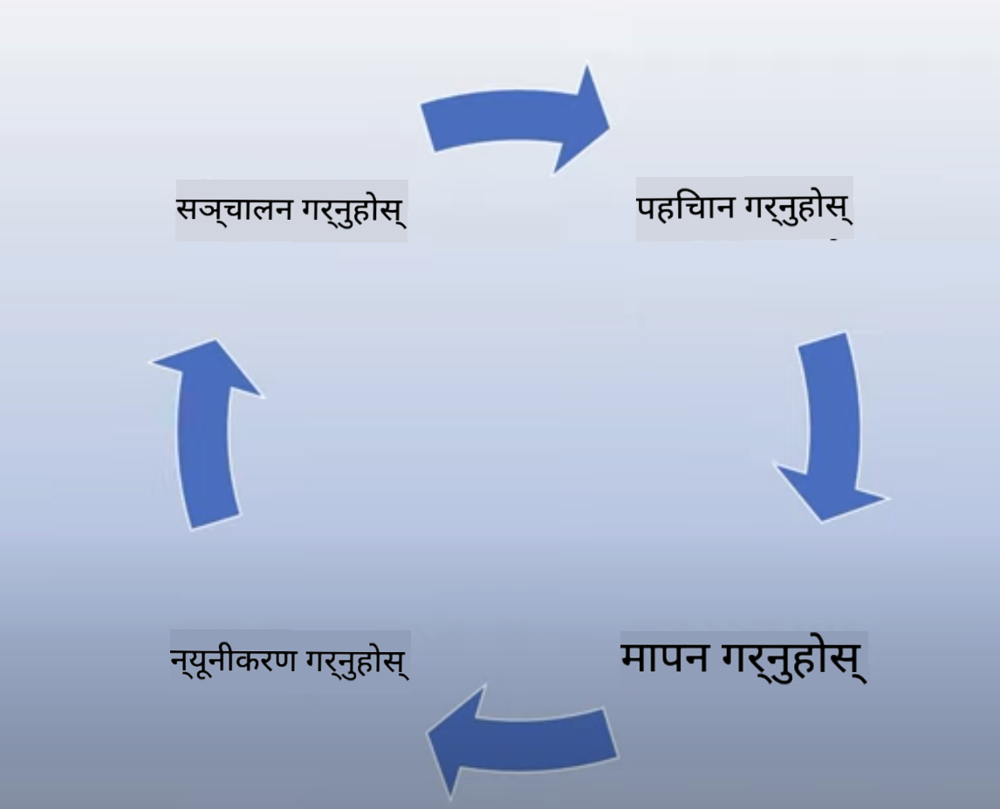
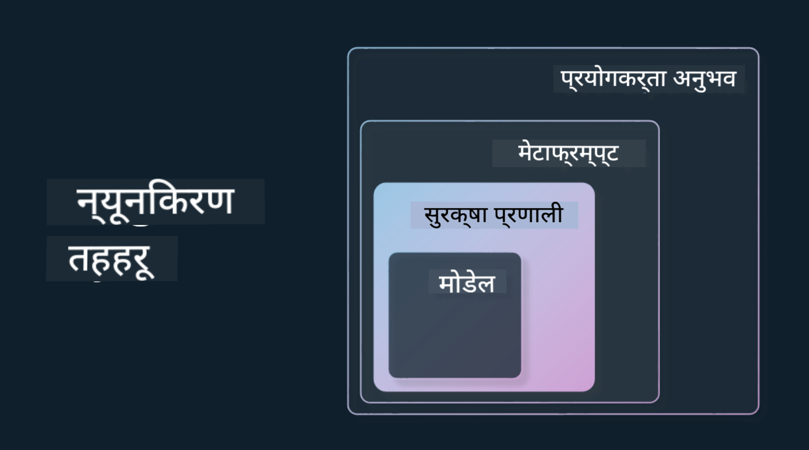

<!--
CO_OP_TRANSLATOR_METADATA:
{
  "original_hash": "4d57fad773cbeb69c5dd62e65c34200d",
  "translation_date": "2025-10-17T13:58:19+00:00",
  "source_file": "03-using-generative-ai-responsibly/README.md",
  "language_code": "ne"
}
-->
# जिम्मेवार ढंगले जेनेरेटिभ एआई प्रयोग गर्ने

> _माथिको तस्बिरमा क्लिक गरेर यस पाठको भिडियो हेर्नुहोस्_

एआई, विशेष गरी जेनेरेटिभ एआई, प्रति आकर्षित हुनु सजिलो छ, तर तपाईंले यसलाई जिम्मेवार ढंगले कसरी प्रयोग गर्ने भन्ने कुरा विचार गर्न आवश्यक छ। तपाईंले उत्पादनलाई निष्पक्ष, हानिकारक नभएको र अन्य कुराहरू सुनिश्चित गर्न विचार गर्नुपर्छ। यो अध्यायले तपाईंलाई उल्लेखित सन्दर्भ, विचार गर्नुपर्ने कुराहरू, र तपाईंको एआई प्रयोग सुधार गर्न सक्रिय कदम कसरी चाल्न सकिन्छ भन्ने जानकारी प्रदान गर्ने उद्देश्य राख्छ।

## परिचय

यो पाठले निम्न विषयहरू समेट्छ:

- जेनेरेटिभ एआई एप्लिकेसनहरू निर्माण गर्दा किन जिम्मेवार एआईलाई प्राथमिकता दिनुपर्छ।
- जिम्मेवार एआईका मुख्य सिद्धान्तहरू र तिनीहरू जेनेरेटिभ एआईसँग कसरी सम्बन्धित छन्।
- रणनीति र उपकरणहरूको माध्यमबाट जिम्मेवार एआई सिद्धान्तहरू व्यवहारमा कसरी लागू गर्ने।

## सिकाइका लक्ष्यहरू

यो पाठ पूरा गरेपछि तपाईंलाई थाहा हुनेछ:

- जेनेरेटिभ एआई एप्लिकेसनहरू निर्माण गर्दा जिम्मेवार एआईको महत्त्व।
- जेनेरेटिभ एआई एप्लिकेसनहरू निर्माण गर्दा जिम्मेवार एआईका मुख्य सिद्धान्तहरू कहिले सोच्ने र लागू गर्ने।
- जिम्मेवार एआईको अवधारणालाई व्यवहारमा लागू गर्न उपलब्ध उपकरणहरू र रणनीतिहरू।

## जिम्मेवार एआईका सिद्धान्तहरू

जेनेरेटिभ एआईको उत्साह कहिल्यै यति उच्च भएको थिएन। यस उत्साहले यस क्षेत्रमा धेरै नयाँ विकासकर्ता, ध्यान, र लगानी ल्याएको छ। यो जेनेरेटिभ एआई प्रयोग गरेर उत्पादनहरू र कम्पनीहरू निर्माण गर्न चाहने जो कोहीका लागि धेरै सकारात्मक छ, तर हामीले जिम्मेवार ढंगले अगाडि बढ्न पनि महत्त्वपूर्ण छ।

यस पाठक्रमभरि, हामी हाम्रो स्टार्टअप र हाम्रो एआई शिक्षा उत्पादन निर्माणमा केन्द्रित छौं। हामी जिम्मेवार एआईका सिद्धान्तहरू प्रयोग गर्नेछौं: निष्पक्षता, समावेशिता, विश्वसनीयता/सुरक्षा, सुरक्षा र गोपनीयता, पारदर्शिता, र उत्तरदायित्व। यी सिद्धान्तहरूको साथ, हामी हाम्रो उत्पादनहरूमा जेनेरेटिभ एआईको प्रयोगसँग तिनीहरूको सम्बन्ध अन्वेषण गर्नेछौं।

## किन जिम्मेवार एआईलाई प्राथमिकता दिनुपर्छ

उत्पादन निर्माण गर्दा, मानव-केंद्रित दृष्टिकोण अपनाएर तपाईंको प्रयोगकर्ताको सर्वोत्तम चासो ध्यानमा राख्दा उत्कृष्ट परिणामहरू प्राप्त हुन्छ।

जेनेरेटिभ एआईको विशेषता भनेको यसको प्रयोगकर्ताहरूका लागि उपयोगी उत्तरहरू, जानकारी, मार्गदर्शन, र सामग्री सिर्जना गर्ने शक्ति हो। यो धेरै म्यानुअल चरणहरू बिना गर्न सकिन्छ जसले धेरै प्रभावशाली परिणामहरू निम्त्याउन सक्छ। उचित योजना र रणनीतिहरू बिना, यसले दुर्भाग्यवश तपाईंको प्रयोगकर्ताहरू, तपाईंको उत्पादन, र समाजलाई समग्र रूपमा केही हानिकारक परिणामहरू निम्त्याउन सक्छ।

हामी यी सम्भावित हानिकारक परिणामहरू मध्ये केही (तर सबै होइन) हेर्नेछौं:

### भ्रम

भ्रम भनेको जब LLM ले सामग्री उत्पादन गर्दछ जुन पूर्ण रूपमा अर्थहीन छ वा अन्य स्रोतहरूको जानकारीको आधारमा तथ्यात्मक रूपमा गलत छ।

उदाहरणका लागि, हामी हाम्रो स्टार्टअपको लागि एउटा सुविधा निर्माण गर्छौं जसले विद्यार्थीहरूलाई मोडेललाई ऐतिहासिक प्रश्नहरू सोध्न अनुमति दिन्छ। एक विद्यार्थीले प्रश्न सोध्छ `टाइटानिकको एकमात्र जीवित व्यक्ति को थियो?`

मोडेलले तलको जस्तो उत्तर उत्पादन गर्दछ:

> _(स्रोत: [Flying bisons](https://flyingbisons.com?WT.mc_id=academic-105485-koreyst))_

यो धेरै आत्मविश्वासपूर्ण र विस्तृत उत्तर हो। दुर्भाग्यवश, यो गलत छ। थोरै मात्र अनुसन्धानले पनि देखाउँछ कि टाइटानिक दुर्घटनाबाट एकभन्दा बढी व्यक्ति जीवित थिए। यस विषयमा अनुसन्धान गर्न सुरु गरिरहेको विद्यार्थीका लागि, यो उत्तर यति विश्वासयोग्य हुन सक्छ कि प्रश्न नगरिकन तथ्यको रूपमा व्यवहार गरिन्छ। यसको परिणामले एआई प्रणालीलाई अविश्वसनीय बनाउनेछ र हाम्रो स्टार्टअपको प्रतिष्ठामा नकारात्मक प्रभाव पार्न सक्छ।

कुनै पनि दिइएको LLM को प्रत्येक पुनरावृत्तिसँग, हामीले भ्रमलाई न्यूनतम बनाउने वरिपरि प्रदर्शन सुधार देखेका छौं। यस सुधारको साथ पनि, हामी एप्लिकेसन निर्माणकर्ता र प्रयोगकर्ताहरूको रूपमा यी सीमितताहरूको बारेमा सचेत रहन आवश्यक छ।

### हानिकारक सामग्री

हामीले पहिलेको खण्डमा कभर गर्यौं जब LLM ले गलत वा अर्थहीन उत्तरहरू उत्पादन गर्दछ। अर्को जोखिम भनेको मोडेलले हानिकारक सामग्रीको साथ प्रतिक्रिया दिने हो।

हानिकारक सामग्रीलाई निम्न रूपमा परिभाषित गर्न सकिन्छ:

- आत्महत्या वा निश्चित समूहहरूलाई हानि पुर्‍याउने निर्देशन दिनु वा प्रोत्साहन गर्नु।
- घृणित वा अपमानजनक सामग्री।
- कुनै प्रकारको आक्रमण वा हिंसात्मक कार्यको योजना बनाउने मार्गदर्शन।
- अवैध सामग्री फेला पार्ने वा अवैध कार्यहरू गर्ने निर्देशन दिनु।
- यौन रूपमा स्पष्ट सामग्री देखाउनु।

हाम्रो स्टार्टअपका लागि, हामीले विद्यार्थीहरूले यस्तो सामग्री नदेखून् भनेर सही उपकरण र रणनीतिहरू राख्न सुनिश्चित गर्न चाहन्छौं।

### निष्पक्षताको अभाव

निष्पक्षता भनेको "एआई प्रणाली पूर्वाग्रह र भेदभावबाट मुक्त छ र तिनीहरूले सबैलाई निष्पक्ष र समान व्यवहार गर्छन् भन्ने सुनिश्चित गर्नु हो।" जेनेरेटिभ एआईको संसारमा, हामीले सुनिश्चित गर्न चाहन्छौं कि मोडेलको उत्पादनले हाशिएमा परेका समूहहरूको बहिष्करणकारी विश्वदृष्टिलाई बल नपरोस्।

यस प्रकारका उत्पादनहरू हाम्रो प्रयोगकर्ताहरूका लागि सकारात्मक उत्पादन अनुभवहरू निर्माण गर्न मात्र विनाशकारी छैनन्, तर तिनीहरूले थप सामाजिक हानि पनि निम्त्याउँछन्। एप्लिकेसन निर्माणकर्ताहरूको रूपमा, हामीले जेनेरेटिभ एआईसँग समाधानहरू निर्माण गर्दा सधैं व्यापक र विविध प्रयोगकर्ता आधारलाई ध्यानमा राख्नुपर्छ।

## जिम्मेवार ढंगले जेनेरेटिभ एआई कसरी प्रयोग गर्ने

अब हामीले जिम्मेवार जेनेरेटिभ एआईको महत्त्व पहिचान गर्यौं, हामीले हाम्रो एआई समाधानहरू जिम्मेवार ढंगले निर्माण गर्न सक्ने ४ चरणहरू हेर्नेछौं:

### सम्भावित हानिहरू मापन गर्नुहोस्

सफ्टवेयर परीक्षणमा, हामी एप्लिकेसनमा प्रयोगकर्ताको अपेक्षित कार्यहरू परीक्षण गर्छौं। त्यस्तै, प्रयोगकर्ताहरूले सम्भवतः प्रयोग गर्ने विविध सेटका प्रम्टहरू परीक्षण गर्नु राम्रो तरिका हो सम्भावित हानिलाई मापन गर्न।

हाम्रो स्टार्टअपले शिक्षा उत्पादन निर्माण गरिरहेको हुँदा, शिक्षा-सँग सम्बन्धित प्रम्टहरूको सूची तयार गर्नु राम्रो हुनेछ। यसले निश्चित विषयवस्तु, ऐतिहासिक तथ्यहरू, र विद्यार्थी जीवनका बारेमा प्रम्टहरू समेट्न सक्छ।

### सम्भावित हानिहरू कम गर्नुहोस्

अब मोडेल र यसको प्रतिक्रियाले निम्त्याउन सक्ने सम्भावित हानिलाई रोक्न वा सीमित गर्ने तरिकाहरू खोज्ने समय हो। हामी यसलाई ४ विभिन्न तहहरूमा हेर्न सक्छौं:

- **मोडेल**। सही प्रयोगको लागि सही मोडेल चयन गर्नु। GPT-4 जस्ता ठूला र जटिल मोडेलहरूले साना र विशिष्ट प्रयोगका लागि लागू गर्दा हानिकारक सामग्रीको जोखिम बढाउन सक्छ। तपाईंको प्रशिक्षण डाटालाई प्रयोग गरेर फाइन-ट्युनिङले पनि हानिकारक सामग्रीको जोखिम कम गर्दछ।

- **सुरक्षा प्रणाली**। सुरक्षा प्रणाली भनेको प्लेटफर्ममा मोडेल सेवा गर्ने उपकरण र कन्फिगरेसनहरूको सेट हो जसले हानिलाई कम गर्न मद्दत गर्दछ। यसको उदाहरण भनेको Azure OpenAI सेवामा सामग्री फिल्टरिङ प्रणाली हो। प्रणालीहरूले जेलब्रेक आक्रमण र बोटहरूबाट अनुरोध जस्ता अवाञ्छित गतिविधि पत्ता लगाउन पनि सक्षम हुनुपर्छ।

- **मेटाप्रम्ट**। मेटाप्रम्ट र ग्राउन्डिङ भनेका मोडेललाई निश्चित व्यवहार र जानकारीको आधारमा निर्देशित वा सीमित गर्ने तरिकाहरू हुन्। यो प्रणाली इनपुटहरू प्रयोग गरेर मोडेलको निश्चित सीमा परिभाषित गर्न प्रयोग गर्न सकिन्छ। साथै, प्रणालीको स्कोप वा डोमेनसँग बढी सान्दर्भिक आउटपुटहरू प्रदान गर्न सकिन्छ।

यो विश्वसनीय स्रोतहरूको चयनबाट मात्र जानकारी तान्न मोडेललाई राख्न Retrieval Augmented Generation (RAG) जस्ता प्रविधिहरू प्रयोग गर्न सकिन्छ। यस पाठक्रमको अर्को पाठमा [खोज एप्लिकेसनहरू निर्माण गर्ने](../08-building-search-applications/README.md?WT.mc_id=academic-105485-koreyst) विषयमा पाठ छ।

- **प्रयोगकर्ता अनुभव**। अन्तिम तह भनेको प्रयोगकर्ताले हाम्रो एप्लिकेसनको इन्टरफेसमार्फत मोडेलसँग प्रत्यक्ष अन्तरक्रिया गर्ने ठाउँ हो। यस तरिकाले हामी UI/UX डिजाइन गर्न सक्छौं जसले प्रयोगकर्तालाई मोडेलमा पठाउन सक्ने इनपुटहरूको प्रकार सीमित गर्दछ साथै प्रयोगकर्तालाई देखाइने पाठ वा तस्बिरहरू। एआई एप्लिकेसन तैनाथ गर्दा, हामीले हाम्रो जेनेरेटिभ एआई एप्लिकेसनले के गर्न सक्छ र के गर्न सक्दैन भन्ने बारे पारदर्शी हुनुपर्छ।

हामीसँग [एआई एप्लिकेसनहरूको लागि UX डिजाइन गर्ने](../12-designing-ux-for-ai-applications/README.md?WT.mc_id=academic-105485-koreyst) विषयमा समर्पित पाठ छ।

- **मोडेल मूल्याङ्कन गर्नुहोस्**। LLM सँग काम गर्दा चुनौतीपूर्ण हुन सक्छ किनकि हामीसँग मोडेललाई प्रशिक्षण दिइएको डाटामा सधैं नियन्त्रण हुँदैन। त्यसको बाबजुद पनि, हामीले सधैं मोडेलको प्रदर्शन र आउटपुट मूल्याङ्कन गर्नुपर्छ। मोडेलको सटीकता, समानता, ग्राउन्डेडनेस, र आउटपुटको सान्दर्भिकता मापन गर्नु अझै महत्त्वपूर्ण छ। यसले सरोकारवालाहरू र प्रयोगकर्ताहरूलाई पारदर्शिता र विश्वास प्रदान गर्न मद्दत गर्दछ।

### जिम्मेवार जेनेरेटिभ एआई समाधान सञ्चालन गर्नुहोस्

तपाईंको एआई एप्लिकेसनहरू वरिपरि सञ्चालन अभ्यास निर्माण गर्नु अन्तिम चरण हो। यसमा कानुनी र सुरक्षा जस्ता हाम्रो स्टार्टअपका अन्य भागहरूसँग साझेदारी गरेर सबै नियामक नीतिहरूको पालना सुनिश्चित गर्नु समावेश छ। प्रक्षेपण अघि, हामीले डेलिभरी, घटनाहरूको व्यवस्थापन, र रोलब्याकको योजना निर्माण गर्न चाहन्छौं ताकि हाम्रो प्रयोगकर्ताहरूलाई कुनै हानि बढ्नबाट रोक्न सकियोस्।

## उपकरणहरू

जिम्मेवार एआई समाधानहरू विकास गर्ने काम धेरै जस्तो देखिन सक्छ, तर यो प्रयासको लागि राम्रो काम हो। जेनेरेटिभ एआईको क्षेत्र बढ्दै जाँदा, जिम्मेवारीलाई कुशलतापूर्वक कार्यप्रवाहमा समाहित गर्न मद्दत गर्ने उपकरणहरू परिपक्व हुनेछन्। उदाहरणका लागि, [Azure AI Content Safety](https://learn.microsoft.com/azure/ai-services/content-safety/overview?WT.mc_id=academic-105485-koreyst) ले API अनुरोधमार्फत हानिकारक सामग्री र तस्बिरहरू पत्ता लगाउन मद्दत गर्न सक्छ।

## ज्ञान जाँच

जिम्मेवार एआई प्रयोग सुनिश्चित गर्न तपाईंले ध्यान दिनुपर्ने केही कुराहरू के हुन्?

1. उत्तर सही छ कि छैन।
1. हानिकारक प्रयोग, एआईलाई आपराधिक उद्देश्यका लागि प्रयोग नगरियोस्।
1. एआई पूर्वाग्रह र भेदभावबाट मुक्त छ भन्ने सुनिश्चित गर्नु।

A: २ र ३ सही छन्। जिम्मेवार एआईले तपाईंलाई हानिकारक प्रभाव र पूर्वाग्रहलाई कम गर्ने र अन्य कुराहरू विचार गर्न मद्दत गर्दछ।

## 🚀 चुनौती

[Azure AI Content Safety](https://learn.microsoft.com/azure/ai-services/content-safety/overview?WT.mc_id=academic-105485-koreyst) को बारेमा पढ्नुहोस् र तपाईंको प्रयोगका लागि के अपनाउन सकिन्छ हेर्नुहोस्।

## उत्कृष्ट काम, तपाईंको सिकाइ जारी राख्नुहोस्

यो पाठ पूरा गरेपछि, हाम्रो [जेनेरेटिभ एआई सिकाइ संग्रह](https://aka.ms/genai-collection?WT.mc_id=academic-105485-koreyst) हेर्नुहोस् ताकि तपाईंको जेनेरेटिभ एआई ज्ञानलाई अझ स्तरवृद्धि गर्न सकियोस्!

पाठ ४ मा जानुहोस् जहाँ हामी [प्रम्ट इन्जिनियरिङका आधारभूत कुराहरू](../04-prompt-engineering-fundamentals/README.md?WT.mc_id=academic-105485-koreyst) हेर्नेछौं!

---

**अस्वीकरण**:  
यो दस्तावेज़ AI अनुवाद सेवा [Co-op Translator](https://github.com/Azure/co-op-translator) प्रयोग गरेर अनुवाद गरिएको छ। हामी शुद्धताको लागि प्रयास गर्छौं, तर कृपया ध्यान दिनुहोस् कि स्वचालित अनुवादमा त्रुटिहरू वा अशुद्धताहरू हुन सक्छ। यसको मूल भाषा मा रहेको दस्तावेज़लाई आधिकारिक स्रोत मानिनुपर्छ। महत्वपूर्ण जानकारीको लागि, व्यावसायिक मानव अनुवाद सिफारिस गरिन्छ। यस अनुवादको प्रयोगबाट उत्पन्न हुने कुनै पनि गलतफहमी वा गलत व्याख्याको लागि हामी जिम्मेवार हुने छैनौं।