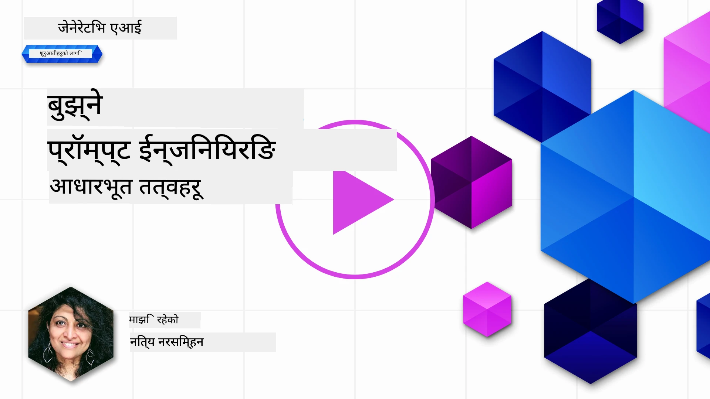
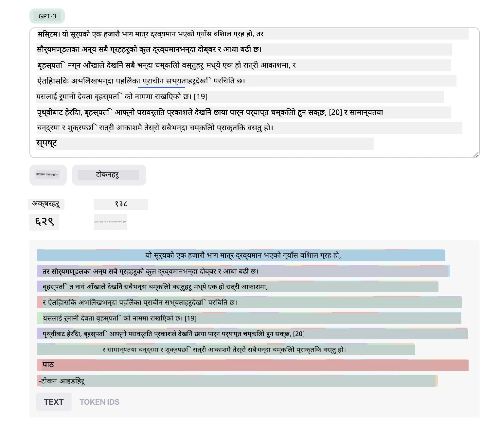
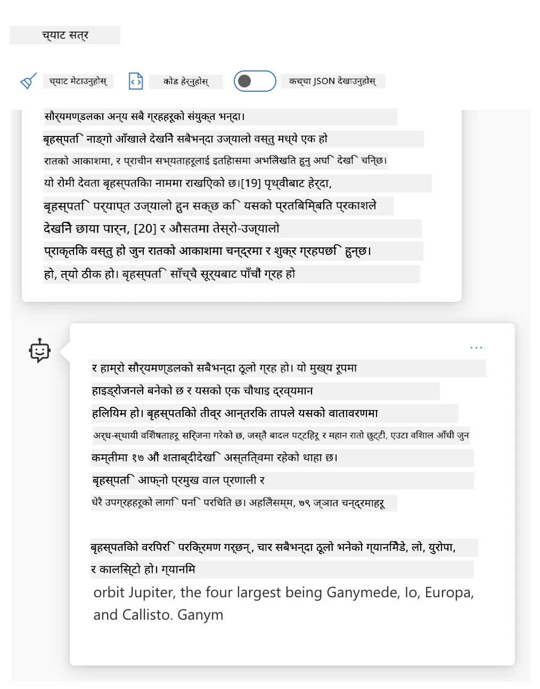
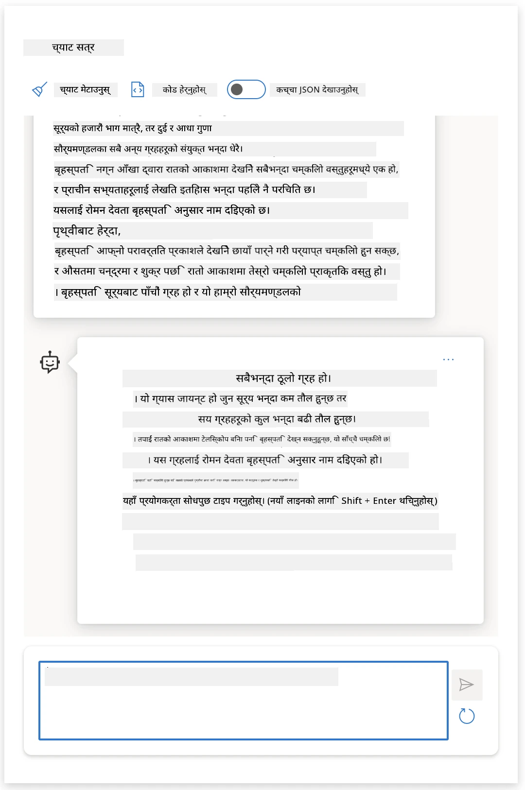
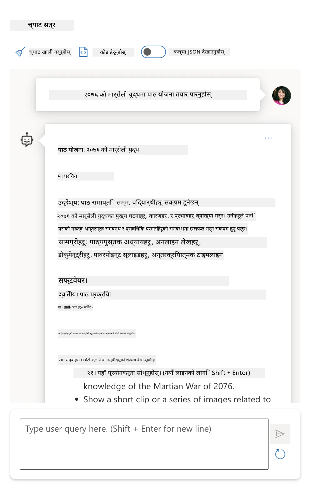

# प्रॉम्प्ट इन्जिनियरिङ्गका आधारहरू

[](https://youtu.be/GElCu2kUlRs?si=qrXsBvXnCW12epb8)

## परिचय
यस मोड्युलले जेनेरेटिभ AI मोडेलहरूमा प्रभावकारी प्रॉम्प्टहरू सिर्जना गर्ने आवश्यक अवधारणाहरू र प्रविधिहरू समेट्छ। LLM मा प्रॉम्प्ट लेख्ने तरिकाले पनि महत्त्व राख्छ। सावधानीपूर्वक तयार गरिएको प्रॉम्प्टले राम्रो गुणस्तरको जवाफ प्राप्त गर्न सक्छ। तर _प्रॉम्प्ट_ र _प्रॉम्प्ट इन्जिनियरिङ्ग_ जस्ता शब्दहरूको अर्थ के हो? र म LLM लाई पठाउने प्रॉम्प्ट _इनपुट_ कसरी सुधार गर्ने? यी प्रश्नहरू हामी यो अध्याय र अर्कोमा उत्तर दिने प्रयास गर्नेछौं।

_जेनेरेटिभ AI_ प्रयोगकर्ता अनुरोधहरूमा नयाँ सामग्री (जस्तै, पाठ, चित्र, अडियो, कोड आदि) सिर्जना गर्न सक्षम छ। यसले OpenAI को GPT ("जेनेरेटिभ प्रि-ट्रेन ट्रान्सफर्मर") सिरिज जस्ता _ठूला भाषा मोडेलहरू_ प्रयोग गरेर प्राकृतिक भाषा र कोडमा तालिम प्राप्त गर्दछ।

प्रयोगकर्ताहरू अब यी मोडेलहरूसँग परिचित परिपाठहरू (जस्तै च्याट) प्रयोग गरी कुराकानी गर्न सक्छन्, कुनै प्राविधिक विशेषज्ञता वा तालिम आवश्यक नपरी। मोडेलहरू _प्रॉम्प्ट-आधारित_ छन् - प्रयोगकर्ताहरूले पाठ इनपुट (प्रॉम्प्ट) पठाउँछन् र AI को प्रतिक्रिया (पूर्णता) प्राप्त गर्दछन्। त्यसपछि तिनीहरूले धेरै-पटक संवादमा पटक-पटक "AI सँग कुराकानी" गरी आफ्नो प्रॉम्प्ट सुधार गर्न सक्छन् जबसम्म प्रतिक्रिया उनीहरूको अपेक्षासँग मेल खाँदैन।

"प्रॉम्प्टहरू" अहिले जेनेरेटिभ AI एपहरूका लागि प्रमुख _प्रोग्रामिङ्ग इन्टरफेस_ बन्छन्, मोडेलहरूलाई के गर्ने भनेर निर्देशन दिन्छ र फर्किने प्रतिक्रियाको गुणस्तरमा प्रभाव पार्छ। "प्रॉम्प्ट इन्जिनियरिङ्ग" चाँडै बढ्दो अध्ययन क्षेत्र हो जसले प्रॉम्प्टहरूको _डिजाइन र अनुकूलन_ मा केन्द्रित छ ताकि स्केलमा निरन्तर र गुणस्तरीय प्रतिक्रिया दिन सकियोस्।

## सिकाइका लक्ष्यहरू

यस पाठमा, हामी प्रॉम्प्ट इन्जिनियरिङ्ग के हो, किन महत्त्व छ, र कसरी दिइएको मोडेल र अनुप्रयोग उद्देश्यका लागि प्रभावकारी प्रॉम्प्टहरू तयार गर्ने भन्ने सिक्नेछौं। हामी प्रॉम्प्ट इन्जिनियरिङ्गका मुख्य अवधारणाहरू र उत्तम अभ्यासहरू बुझ्नेछौं - र अन्तरक्रियात्मक जुपिटर नोटबुक "स्यान्डबक्स" वातावरणमा यी अवधारणाहरूलाई वास्तविक उदाहरणहरूमा कसरी लागू गरिन्छ हेर्नेछौं।

यस पाठको अन्त्यसम्म हामी सक्षम हुनेछौं:

1. प्रॉम्प्ट इन्जिनियरिङ्ग के हो र किन महत्त्वपूर्ण छ व्याख्या गर्न।
2. प्रॉम्प्टका अवयवहरू के हुन् र कसरी प्रयोग गरिन्छ वर्णन गर्न।
3. प्रॉम्प्ट इन्जिनियरिङ्गका उत्तम अभ्यासहरू र प्रविधिहरू सिक्न।
4. सिकेका प्रविधिहरूलाई वास्तविक उदाहरणहरूमा, OpenAI अन्तबिन्दु प्रयोग गरी लागू गर्न।

## प्रमुख शब्दहरू

प्रॉम्प्ट इन्जिनियरिङ्ग: AI मोडेलहरूलाई आवश्यक आउटपुट उत्पादन गर्न निर्देशन दिनको लागि इनपुटहरू डिजाइन र सुधार गर्ने अभ्यास।
टोकनाइजेसन: पाठलाई साना एकाइहरू (टोकनहरू) मा परिणत गर्ने प्रक्रिया जुन मोडेलले बुझ्न र प्रशोधन गर्न सक्छ।
निर्देशन-ट्यून गरिएको LLMs: ठूला भाषा मोडेलहरू (LLMs) जसलाई प्रतिक्रियाको सटीकता र सान्दर्भिकता सुधार गर्न विशेष निर्देशनहरूसँग ट्यून गरिएको छ।

## सिकाइ स्यान्डबक्स

प्रॉम्प्ट इन्जिनियरिङ्ग हाल कला बढी हो विज्ञान भन्दा। यसमा हाम्रो सहज ज्ञान सुधार्नुको सर्वोत्तम तरिका भनेको _अधिक अभ्यास_ गर्नु र एक परीक्षण-र-त्रुटि दृष्टिकोण अपनाउनु हो जसले अनुप्रयोग क्षेत्र विशेषज्ञता सँग सिफारिश गरिएका प्रविधिहरू र मोडेल-विशिष्ट अनुकूलनहरूलाई जोड्दछ।

यस पाठसँगै प्रदान गरिएको जुपिटर नोटबुकले एक _स्यान्डबक्स_ वातावरण प्रदान गर्दछ जहाँ तपाईं सिकाइका समय वा अन्तिम कोड चुनौतीको भागको रूपमा अभ्यास गर्न सक्नुहुन्छ। अभ्यासहरू कार्यान्वयन गर्न तपाईंलाई आवश्यक पर्नेछ:

1. **एउटा Azure OpenAI API कुञ्जी** - तैनाथ गरिएको LLM का लागि सेवा अन्तबिन्दु।
2. **पाइथन रनटाइम** - जसमा नोटबुक चलाउन सकिन्छ।
3. **स्थानीय वातावरण चरहरू** - _तयारी गर्न [सेटअप](./../00-course-setup/02-setup-local.md?WT.mc_id=academic-105485-koreyst) कदमहरू अहिले पुरा गर्नुहोस्_।

यो नोटबुकमा _स्टार्टर्स्_ अभ्यासहरू छन् - तर तपाईं आफैँले थप _मार्कडाउन_ (विवरण) र _कोड_ (प्रॉम्प्ट अनुरोध) खण्डहरू थप्न प्रोत्साहित हुनुहुन्छ - नयाँ उदाहरणहरू वा विचारहरू प्रयास गर्न र प्रॉम्प्ट डिजाइनका लागि सहज ज्ञान निर्माण गर्न।

## चित्रित मार्गदर्शक

यस पाठले के समेट्छ भन्ने ठूलो तस्वीर पहिला देख्न चाहनुहुन्छ? यो चित्रित मार्गदर्शक जाँच्नुहोस्, जसले तपाईंलाई मुख्य विषयहरू र प्रत्येकको लागि सोच्नुपर्ने प्रमुख कुरा देखाउँछ। पाठको रोडम्यापले तपाईंलाई मुख्य अवधारणाहरू र चुनौतीहरू बुझ्नदेखि तिनीहरूलाई सम्बन्धित प्रॉम्प्ट इन्जिनियरिङ्ग प्रविधिहरू र उत्तम अभ्यासहरूसँग सम्बोधनसम्म पुर्‍याउँछ। ध्यान दिनुहोस्, यस मार्गदर्शकमा "उन्नत प्रविधिहरू" खण्ड यो पाठ्यक्रमको _अर्को_ अध्यायमा समेटिएको छ।


## हाम्रो स्टार्टअप

अब, हामी _यो विषय_ हाम्रो स्टार्टअप मिशनसँग कसरी सम्बन्धित छ हेर्नेछौं, जसले [शिक्षामा AI नवप्रवर्तन ल्याउन](https://educationblog.microsoft.com/2023/06/collaborating-to-bring-ai-innovation-to-education?WT.mc_id=academic-105485-koreyst) काम गरिरहेको छ। हामी AI-संचालित _व्यक्तिगत सिकाइ_ अनुप्रयोगहरू निर्माण गर्न चाहन्छौं - त्यसैले हाम्रो अनुप्रयोगका विभिन्न प्रयोगकर्ताहरूले कसरी "प्रॉम्प्ट" डिजाइन गर्न सक्छन् भनी सोचौं:

- **प्रशासकहरू** AI लाई _पाठ्यक्रम डेटा विश्लेषण गरेर समावेशीता रिक्तता पहिचान गर्न_ अनुरोध गर्न सक्छन्। AI परिणामहरू सारांश गर्न सक्छ वा कोडसहित तिनीहरूलाई भिजुअलाइज गर्न सक्छ।
- **शिक्षकहरू** AI लाई _लक्षित समूह र विषयको लागि पाठ योजना बनाउन_ भन्न सक्छन्। AI निर्दिष्ट ढाँचामा व्यक्तिगत योजना तयार गर्न सक्छ।
- **विद्यार्थीहरू** AI लाई _गाह्रो विषयमा शिक्षकको रूपमा_ प्रयोग गर्न सक्छन्। AI अब स्तरअनुसार सिकाइ, संकेत र उदाहरणहरूसहित मार्गदर्शन गर्न सक्छ।

यो केवल सर्फिङ मात्र होइन। [शिक्षाका लागि प्रॉम्प्टहरू](https://github.com/microsoft/prompts-for-edu/tree/main?WT.mc_id=academic-105485-koreyst) हेर्नुहोस् - शिक्षा विशेषज्ञहरूले आयोजना गरेको खुला स्रोत प्रॉम्प्ट पुस्तकालय - सम्भावनाहरूको व्यापक बुझाइका लागि! _ती प्रॉम्प्टहरू स्यान्डबक्समा वा OpenAI प्लेग्राउन्डमा चलाएर के हुन्छ हेर्नुहोस्!_

<!--
पाठ ढाँचा:
यो ईकाईले मुख्य अवधारणा #1 समेट्नुपर्छ।
अवधारणा उदाहरण र सन्दर्भहरूसँग बलियो बनाउनुहोस्।

अवधारणा #1:
प्रॉम्प्ट इन्जिनियरिङ्ग।
यसलाई परिभाषित गर्नुहोस् र किन आवश्यक छ भनेर व्याख्या गर्नुहोस्।
-->

## प्रॉम्प्ट इन्जिनियरिङ्ग के हो?

हामीले यो पाठ प्रॉम्प्ट इन्जिनियरिङ्गलाई एक प्रक्रिया भनेर परिभाषित गरेर सुरु गर्या छौं जसले _डिजाइन र अनुकूलन_ गरी पाठ इनपुटहरू (प्रॉम्प्टहरू) लाई एक निर्दिष्ट अनुप्रयोग उद्देश्य र मोडेलका लागि निरन्तर र गुणस्तरीय प्रतिक्रियाहरू (पूर्णताहरू) प्रदान गर्दछ। यसलाई दुई चरणको प्रक्रियाको रूपमा विचार गर्न सकिन्छ:

- दिइएको मोडेल र उद्देश्यका लागि प्रारम्भिक प्रॉम्प्ट _डिजाइन_ गर्ने
- प्रतिक्रिया गुणस्तर सुधार गर्न प्रॉम्प्ट पुनःपुनः _सुधार_ गर्ने

यो अनिवार्य रूपमा परीक्षण-र-त्रुटि प्रक्रिया हो जसले प्रयोगकर्ताको सहज ज्ञान र परिश्रम आवश्यक पर्छ उत्तम परिणाम प्राप्त गर्न। त्यसैले यसले किन महत्त्व राख्छ? त्यस प्रश्नको उत्तरका लागि हामीले पहिले तीन अवधारणाहरू बुझ्न आवश्यक छ:

- _टोकनाइजेसन_ = मोडेलले कसरी प्रॉम्प्ट "हेर्छ"
- _आधारभूत LLMs_ = कसरी फाउन्डेसन मोडेलले प्रॉम्प्ट "प्रक्रिया" गर्छ
- _निर्देशन-ट्यून गरिएको LLMs_ = कसरी मोडेलले अब "कार्यहरू" देख्न सक्छ

### टोकनाइजेसन

LLM हरू प्रॉम्प्टहरूलाई _टोकनहरूको अनुक्रम_ को रूपमा हेर्छ जहाँ फरक मोडेलहरूले (वा मोडेल संस्करणले) एउटै प्रॉम्प्टलाई फरक तरिकाले टोकनमा परिणत गर्न सक्छ। किनकि LLM हरू टोकनहरूमा तालिम पाएका हुन्छन् (कच्चा पाठमा होइन), प्रॉम्प्टहरू कसरी टोकनाइज हुन्छन् त्यो जनरेट गरिएको प्रतिक्रियाको गुणस्तरमा प्रत्यक्ष प्रभाव पार्छ।

टोकनाइजेसन कसरी काम गर्छ भन्ने बुझ्नका लागि [OpenAI टोकनाइजर](https://platform.openai.com/tokenizer?WT.mc_id=academic-105485-koreyst) जस्ता उपकरणहरू प्रयास गर्नुहोस्। आफ्नो प्रॉम्प्ट कपी गर्नुस् - र त्यो कसरी टोकनहरूमा परिणत हुन्छ हेर्नुहोस्, खाली ठाउँका क्यारेक्टरहरू र विराम चिह्न कसरी सम्हालिएको छ ध्यान दिनुहोस्। यो उदाहरणले पुरानो LLM (GPT-3) देखाउँछ - त्यसैले नयाँ मोडेलसँग परीक्षण गर्दा फरक परिणाम आउन सक्छ।



### अवधारणा: आधार मोडेलहरू

प्रॉम्प्ट टोकनमा परिणत भएपछि, ["आधार LLM"](https://blog.gopenai.com/an-introduction-to-base-and-instruction-tuned-large-language-models-8de102c785a6?WT.mc_id=academic-105485-koreyst) (वा फाउन्डेसन मोडेल) को प्रमुख कार्य त्यो अनुक्रममा अर्को टोकन अनुमान गर्नु हो। LLM हरू विशाल पाठ डेटासेटमा तालिम पाएका हुन्, त्यसैले उनीहरूलाई टोकनहरू बीचको सांख्यिक सम्बन्धहरू राम्रोसँग थाहा हुन्छ र उनीहरूले त्यो अनुमान केही विश्वस्तता साथ गर्न सक्छन्। ध्यान दिनुहोस्, तिनीहरूले प्रॉम्प्ट वा टोकनका शब्दहरूको _अर्थ_ बुझ्दैनन्; उनीहरूले मात्र एउटा नमुना देख्दछन् जुन उनीहरूले अर्को अनुमानसहित "पूरा" गर्न सक्छन्। प्रयोगकर्ताको हस्तक्षेप वा कुनै पूर्वनिर्धारित शर्तले अन्त्य नगरेसम्म अनुक्रमको अनुमान जारी रहन्छ।

प्रॉम्प्ट-आधारित पूर्णता कसरी काम गर्दछ हेर्न चाहनुहुन्छ? माथिको प्रॉम्प्ट Azure OpenAI Studio [_Chat Playground_](https://oai.azure.com/playground?WT.mc_id=academic-105485-koreyst) मा पूर्वनिर्धारित सेटिङहरूसँग हाल्नुहोस्। प्रणालीले प्रॉम्प्टहरूलाई सूचना अनुरोधको रूपमा व्यवहार गर्ने गरी सेट गरिएको छ - त्यसैले तपाईंले यो सन्दर्भलाई पूरा गर्ने पूर्णता देख्नु पर्नेछ।

तर यदि प्रयोगकर्ताले कुनै विशेष सर्तहरू वा काम उद्देश्य पूरा गर्ने कुरा हेर्न चाहन्थ्यो भने? त्यतिबेला _निर्देशन-ट्यून गरिएको_ LLMs महत्व राख्छन्।



### अवधारणा: निर्देशन-ट्यून गरिएको LLMs

[निर्देशन-ट्यून गरिएको LLM](https://blog.gopenai.com/an-introduction-to-base-and-instruction-tuned-large-language-models-8de102c785a6?WT.mc_id=academic-105485-koreyst) फाउन्डेसन मोडेलबाट सुरु हुन्छ र स्पष्ट निर्देशनहरू रहेका उदाहरणहरू वा इनपुट/आउटपुट जोडीहरू (जस्तै, बहु-पालो "सन्देशहरू") द्वारा ट्यून गरिन्छ - र AI को प्रतिक्रिया उक्त निर्देशन पछ्याउने प्रयास गर्दछ।

यसले मानवीय प्रतिक्रियासँग सुदृढीकरण सिकाइ (RLHF) जस्ता प्रविधिहरू प्रयोग गर्दछ जसले मोडेललाई _निर्देशनहरू पछ्याउन_ र _प्रतिक्रियाबाट सिक्न_ प्रशिक्षित गर्न सक्छ ताकि प्रतिक्रिया व्यावहारिक अनुप्रयोगहरूका लागि उपयुक्त र प्रयोगकर्ता उद्देश्यहरूसँग बढी सान्दर्भिक बनोस्।

यसलाई प्रयास गरौं - माथिको प्रॉम्प्ट पुनः प्रयोग गर्नुहोस्, तर अब _सिस्टम सन्देश_ मा निम्न निर्देशन सन्दर्भको रूपमा दिनुस्:

> _दोस्रो कक्षा विद्यार्थीको लागि तपाईंलाई दिइएको सामग्री सारांश गर्नुहोस्। परिणामलाई ३-५ बुलेट पोइन्टहरू सहित एक अनुच्छेदमा राख्नुहोस्।_

हेर्नुहोस्, परिणाम अब इच्छित उद्देश्य र ढाँचासँग मेल खानको लागि ट्यून गरिएको छ? शिक्षकले यो प्रतिक्रिया सिधै आफ्नो कक्षा स्लाइडमा प्रयोग गर्न सक्छन्।



## हामीलाई प्रॉम्प्ट इन्जिनियरिङ्ग किन चाहिन्छ?

अब हामी जान्दैछौं कि LLM हरूले प्रॉम्प्टहरू कसरी प्रशोधन गर्छन्, आउनुहोस् किन प्रॉम्प्ट इन्जिनियरिङ्ग आवश्यक छ भन्ने विषयमा कुरा गरौं। यसको उत्तर यति हो कि वर्तमान LLM हरूले यस्ता चुनौतीहरू प्रस्तुत गर्छन् जसले _विश्वसनीय र निरन्तर पूर्णताहरू_ प्राप्त गर्न प्रॉम्प्ट निर्माण र अनुकूलनमा प्रयास नगरी सम्भावना कम गर्छ। उदाहरणका लागि:

1. **मोडेल प्रतिक्रियाहरू सान्त्विक छन्।** _उही प्रॉम्प्ट_ फरक मोडेलहरू वा मोडेल संस्करणहरूसँग फरक प्रतिक्रिया दिन सक्छ। र _उही मोडेल_ पनि फरक समयमा फरक परिणाम दिन सक्छ। _प्रॉम्प्ट इन्जिनियरिङ्ग प्रविधिहरूले यी भिन्नताहरूलाई न्यून गर्न मद्दत गर्दछ, राम्रो गार्डरेलहरू प्रदान गरेर_।

1. **मोडेलहरूले प्रतिक्रिया जालसाजी गर्न सक्छन्।** मोडेलहरू ठूला तर सीमित डेटासेटहरूमा पूर्व-प्रशिक्षित हुन्छन्, जसको अर्थ उनीहरूले त्यो तालिम क्षेत्रबाहिरका अवधारणाहरूको ज्ञान राख्दैनन्। नतिजाको रूपमा, वे गलत, काल्पनिक, वा ज्ञात तथ्यहरूसँग सोझै विरोधाभासी प्रतिक्रियाहरू उत्पन्न गर्न सक्छन्। _प्रॉम्प्ट इन्जिनियरिङ्ग प्रविधिहरूले प्रयोगकर्ताहरूलाई यस्तो जालसाजी पहिचान र कम गर्न मद्दत गर्छन्, जस्तै AI लाई उद्धरण वा तर्कका लागि सोधेर_।

1. **मोडेल क्षमताहरू भिन्न हुन्छन्।** नयाँ मोडेलहरू वा मोडेल पुस्ताहरूले धनी क्षमताहरू ल्याउँछन् तर_cost_ र जटिलतामा अनौठा बाध्यता र सन्तुलन पनि ल्याउँछन्। _प्रॉम्प्ट इन्जिनियरिङ्गले हामीलाई उत्तम अभ्यासहरू र कार्यप्रवाहहरू विकास गर्न मद्दत गर्दछ जसले फरकपनहरूलाई सारांशित गर्छ र मोडेल-विशिष्ट आवश्यकताहरूलाई स्केलेबल, सहज तरिकाले अनुकूल बनाउँछ_।

यो OpenAI वा Azure OpenAI प्लेग्राउन्डमा देखेर प्रयास गर्नुहोस्:

- फरक LLM परिनियोजनहरूसँग एउटै प्रॉम्प्ट प्रयोग गर्नुहोस् (जस्तै, OpenAI, Azure OpenAI, Hugging Face) - के तपाईंले भिन्नता देख्नुभयो?
- एउटै LLM परिनियोजनमा बारम्बार एउटै प्रॉम्प्ट प्रयोग गर्नुहोस् (जस्तै, Azure OpenAI प्लेग्राउन्ड) - यी भिन्नताहरू कत्तिको फरक थिए?

### जालसाजीको उदाहरण

यस कोर्समा, हामी **"जालसाजी"** शब्द प्रयोग गर्छौं जसले LLM हरू कहिलेकाहीं प्रशिक्षण गर्ने सीमितताहरू वा अन्य प्रतिबन्धका कारण तथ्यात्मक रूपमा गलत जानकारी उत्पादन गर्ने घटनालाई जनाउँछ। तपाईंले यो अवस्थालाई लोकप्रिय लेखहरू वा अनुसन्धान पत्रहरूमा _"हलुसीनेसन"_ को रूपमा पनि सुन्नुभएको हुन सक्छ। तथापि, हामी कडाइका साथ _"जालसाजी"_ शब्द प्रयोग गर्न सल्लाह दिन्छौं ताकि हामी अनायासै मानवीय गुणलाई मेसिन-चालित नतिजासँग नजोडौं। यसले [जिम्मेवार AI निर्देशनहरू](https://www.microsoft.com/ai/responsible-ai?WT.mc_id=academic-105485-koreyst) लाई पनि सुदृढ बनाउँछ, जसले केही सन्दर्भहरूमा आपत्तिजनक वा गैर-समावेशी मानिने शब्दहरू हटाउँछ।

जालसाजी कसरि काम गर्छ बुझ्न चाहनुहुन्छ? एस्तो प्रॉम्प्ट सोच्नुहोस् जसले AI लाई अवस्थित नभएको विषयमा सामग्री उत्पन्न गर्न निर्देशन दिन्छ (ताकि यो प्रशिक्षण डेटासेटमा नपरोस)। उदाहरणका लागि - मैले यो प्रॉम्प्ट प्रयास गरें:

> **प्रॉम्प्ट:** 2076 को मार्सी युद्धको पाठ योजना तयार पार्नुहोस्।
वेब खोजले मलाई देखायो कि मार्टियन युद्धहरूमा काल्पनिक कथा (जस्तै, टेलिभिजन सिरिजहरू वा पुस्तकहरू) थिए - तर २०७६ मा होइन। सामान्य ज्ञानले पनि हामीलाई बताउँछ कि २०७६ _भविष्यमा_ छ र त्यसैले, यसलाई कुनै वास्तविक घटनासँग जोड्न सकिंदैन।

त्यसैले जब हामीले यो प्रम्प्ट विभिन्न LLM प्रदायकहरूसँग चलायौं के हुन्छ?

> **उत्तर १**: OpenAI Playground (GPT-35)


> **उत्तर २**: Azure OpenAI Playground (GPT-35)



> **उत्तर ३**: : Hugging Face Chat Playground (LLama-2)


अपेक्षित अनुसार, प्रत्येक मोडेल (वा मोडेल संस्करण) ले तल-माथि फरक प्रतिक्रियाहरू उत्पादन गर्छन्, जसले स्टोकेस्टिक व्यवहार र मोडेल क्षमता भिन्नतालाई जनाउँछ। उदाहरणका लागि, एउटा मोडेलले ८औं कक्षा स्तरको श्रोतामा लक्षित गर्नेछ भने अर्कोले उच्च-विद्यालयका विद्यार्थीलाई लक्षित गर्नेछ। तर यी तीनै मोडेलहरुले त्यस्तो जवाफ दिएका छन् जसले एउटा अनजान प्रयोगकर्तालाई त्यो घटना वास्तविक हो भनेर विश्वस्त बनाउँथ्यो।

_मेटाप्रम्प्टिङ_ र _तापमान कन्फिगर गर्नेजस्ता प्रम्प्ट इन्जिनियरिङ प्रविधिहरूले मोडेल फेब्रिकेशनलाई केही हदसम्म घटाउन सक्छन्। नयाँ प्रम्प्ट इन्जिनियरिङ _आर्किटेक्चर_ हरूले उपकरणहरू र प्रविधिहरूलाई सहज रूपमा प्रम्प्ट फ्लोमा एकीकृत गरेर यी प्रभावहरूलाई कम गर्न सहयोग गर्छन्।

## केस स्टडी: GitHub Copilot

यो खण्डलाई हामी एउटा केस स्टडी हेरि समेटौँ: [GitHub Copilot](https://github.com/features/copilot?WT.mc_id=academic-105485-koreyst) मा प्रम्प्ट इन्जिनियरिङ कसरी वास्तविक दुनियाँका समाधानमा प्रयोग हुन्छ भन्ने बुझ्न।

GitHub Copilot तपाईंको "AI जोडी प्रोग्रामर" हो - यो पाठ प्रम्प्टलाई कोड पूरा गर्ने सुझावहरूमा रुपान्तरण गर्छ र तपाईंको विकास वातावरण (जस्तै, Visual Studio Code) मा एकीकृत गरिएको छ ताकि सहज प्रयोगकर्ता अनुभव पाइयोस्। तल उल्लेखित ब्लग सिरीजहरूमा दस्तावेज गरिएको छ कि प्रारम्भिक संस्करण OpenAI Codex मोडेलमा आधारित थियो - जहाँ इन्जिनियरहरूले छिट्टै मोडेललाई फाइन-ट्युन गर्ने र राम्रो प्रम्प्ट इन्जिनियरिङ प्रविधिहरू विकास गर्नुपर्ने आवश्यकता महसुस गरे, ताकि कोड गुणस्तर सुधार होस्। जुलाईमा, तिनीहरूले [Codex भन्दा अघि बढेको सुधारिएको AI मोडेलको उद्घाटन गरे](https://github.blog/2023-07-28-smarter-more-efficient-coding-github-copilot-goes-beyond-codex-with-improved-ai-model/?WT.mc_id=academic-105485-koreyst) जुन अझ छिटो सुझावहरू दिन्छ।

तिनीहरूको सिकाइ यात्रा अनुसरण गर्न तलका पोस्टहरूलाई क्रमबद्ध रूपमा पढ्नुहोस्।

- **मे २०२३** | [GitHub Copilot तपाईंको कोड बुझ्न अझ राम्रो हुँदैछ](https://github.blog/2023-05-17-how-github-copilot-is-getting-better-at-understanding-your-code/?WT.mc_id=academic-105485-koreyst)
- **मे २०२३** | [GitHub भित्र: GitHub Copilot पछाडि रहेका LLMs सँगको काम गर्ने तरिका](https://github.blog/2023-05-17-inside-github-working-with-the-llms-behind-github-copilot/?WT.mc_id=academic-105485-koreyst)
- **जुन २०२३** | [GitHub Copilot का लागि राम्रो प्रम्प्ट कसरी लेख्ने](https://github.blog/2023-06-20-how-to-write-better-prompts-for-github-copilot/?WT.mc_id=academic-105485-koreyst)
- **जुलाई २०२३** | [GitHub Copilot Codex भन्दा अघि बढेको सुधारिएको AI मोडेलसहित](https://github.blog/2023-07-28-smarter-more-efficient-coding-github-copilot-goes-beyond-codex-with-improved-ai-model/?WT.mc_id=academic-105485-koreyst)
- **जुलाई २०२३** | [प्रम्प्ट इन्जिनियरिङ र LLMs को लागि विकासकर्ताको मार्गदर्शिका](https://github.blog/2023-07-17-prompt-engineering-guide-generative-ai-llms/?WT.mc_id=academic-105485-koreyst)
- **सेप्टेम्बर २०२३** | [एन्त्रप्राइज LLM अनुप्रयोग कसरी बनाउने: GitHub Copilot बाट पाठहरू](https://github.blog/2023-09-06-how-to-build-an-enterprise-llm-application-lessons-from-github-copilot/?WT.mc_id=academic-105485-koreyst)

तपाईंले उनीहरूको [इन्जिनियरिङ ब्लग](https://github.blog/category/engineering/?WT.mc_id=academic-105485-koreyst) पनि ब्राउज गर्न सक्नुहुन्छ जस्तै [यसमा](https://github.blog/2023-09-27-how-i-used-github-copilot-chat-to-build-a-reactjs-gallery-prototype/?WT.mc_id=academic-105485-koreyst) देखाइएको छ कि कसरी यी मोडेल र प्रविधिहरूलाई वास्तविक संसारका अनुप्रयोगहरू चलाउन _लागू_ गरिन्छ।

---

## प्रम्प्ट निर्माण

हामीले देख्यौं कि किन प्रम्प्ट इन्जिनियरिङ महत्त्वपूर्ण छ - अब हामी बुझौं प्रम्प्टहरू कसरी _निर्मित_ गरिन्छन् ताकि हामी फरक प्रविधिहरूको मूल्याङ्कन गरी अझ प्रभावकारी प्रम्प्ट डिजाइन गर्न सक्छौं।

### आधारभूत प्रम्प्ट

सुरु गरौं आधारभूत प्रम्प्टबाट: मोडेललाई कुनै थप सन्दर्भ नराखी पठाइएको एउटा पाठ इनपुट। उदाहरणका लागि, जब हामीले OpenAI [Completion API](https://platform.openai.com/docs/api-reference/completions?WT.mc_id=academic-105485-koreyst) मा अमेरिकी राष्ट्रिय गानका पहिलो केही शब्दहरू पठायौं, यो तुरुन्तै अर्को पंक्तिहरूले _पूरा_ जवाफ दिन्छ, जसले आधारभूत भविष्यवाणी व्यवहार देखाउँछ।

| प्रम्प्ट (इनपुट)    | पूरा जवाफ (आउटपुट)                                                                                                                                                |
| :----------------- | :---------------------------------------------------------------------------------------------------------------------------------------------------------------- |
| Oh say can you see | यस्तो लाग्छ तपाईं "The Star-Spangled Banner," अमेरिकी राष्ट्रिय गानका गीतका शब्द सुरु गर्दै हुनुहुन्छ। पूर्ण गीत यस्ता छन् ... |

### जटिल प्रम्प्ट

अब त्यो आधारभूत प्रम्प्टमा सन्दर्भ र निर्देशन थपौं। [Chat Completion API](https://learn.microsoft.com/azure/ai-services/openai/how-to/chatgpt?WT.mc_id=academic-105485-koreyst) ले हामीलाई धेरै सन्देशहरूको सङ्ग्रहको रूपमा जटिल प्रम्प्ट निर्माण गर्न अनुमति दिन्छ:

- इनपुट/आउटपुट जोडीहरू जसले _प्रयोगकर्ता_ इनपुट र _सहायक_ प्रतिक्रिया जनाउँछन्।
- प्रणाली सन्देश जसले सहायकको व्यवहार वा व्यक्तित्वको सन्दर्भ सेट गर्दछ।

अब अनुरोध तलको रूपमा हुन्छ, जसमा _टोकनाइजेशन_ ले सन्दर्भ र कुराकानीबाट सम्बन्धित जानकारी समावेश गर्छ। अब प्रणाली सन्दर्भ परिवर्तन गर्नुले परिणामको गुणस्तरमा त्यति नै प्रभाव गर्छ, जति प्रयोगकर्ताको इनपुटहरूले।

```python
response = openai.chat.completions.create(
    model="gpt-3.5-turbo",
    messages=[
        {"role": "system", "content": "You are a helpful assistant."},
        {"role": "user", "content": "Who won the world series in 2020?"},
        {"role": "assistant", "content": "The Los Angeles Dodgers won the World Series in 2020."},
        {"role": "user", "content": "Where was it played?"}
    ]
)
```

### निर्देशनात्मक प्रम्प्ट

माथिका उदाहरणहरूमा, प्रयोगकर्ता प्रम्प्ट एउटा साधारण पाठ सोधपुछ थियो जुन सूचना माग गर्ने अनुरोधको रूपमा व्याख्या गर्न सकिन्छ। _निर्देशनात्मक_ प्रम्प्टहरूमा, हामी त्यस पाठलाई कार्यलाई बढी विवरणमा निर्दिष्ट गर्न प्रयोग गर्छौं, AI लाई राम्रो मार्गदर्शन दिन। उदाहरण:

| प्रम्प्ट (इनपुट)                                                                                                                                                                                                                          | पूरा जवाफ (आउटपुट)                                                                                                        | निर्देशन प्रकार      |
| :------------------------------------------------------------------------------------------------------------------------------------------------------------------------------------------------------------------------------------- | :------------------------------------------------------------------------------------------------------------------------- | :-------------------- |
| Write a description of the Civil War                                                                                                                                                                                                   | _साधारण अनुच्छेद फर्कायो_                                                                                                  | साधारण               |
| Write a description of the Civil War. Provide key dates and events and describe their significance                                                                                                                                     | _अनुच्छेद पछि प्रमुख घटनाका मितिहरूको सूची सहित विवरण फर्कायो_                                                              | जटिल                 |
| Write a description of the Civil War in 1 paragraph. Provide 3 bullet points with key dates and their significance. Provide 3 more bullet points with key historical figures and their contributions. Return the output as a JSON file | _अझ विस्तृत विवरणहरू JSON स्वरूपमा फर्काउँछ जुन तपाईं कपी-पेस्ट गरेर फाइलमा राख्न र आवश्यक भए मान्य गर्न सक्नुहुन्छ_              | जटिल, ढाँचाबद्ध       |

## मुख्य सामग्री

माथिका उदाहरणहरूमा, प्रम्प्ट अझै पनि खुला थियो, जसले LLM लाई यसको पूर्व-प्रशिक्षित डाटासेटको कुन भाग सान्दर्भिक छ निर्णय गर्न दियो। _मुख्य सामग्री_ डिजाइन ढाँचामा, इनपुट पाठ दुई भागमा विभाजन हुन्छ:

- निर्देशन (कार्य)
- सम्बन्धित सामग्री (जो कार्यलाई प्रभाब पार्छ)

यहाँ एउटा उदाहरण जहाँ निर्देशन छ "यसलाई २ वाक्यमा सारांश गर्नुहोस्"।

| प्रम्प्ट (इनपुट)                                                                                                                                                                                                                                                                                                                                                                                                                                                                                                                                                                                                                                                                                  | पूरा जवाफ (आउटपुट)                                                                                                                                                                                                                                                                            |
| :---------------------------------------------------------------------------------------------------------------------------------------------------------------------------------------------------------------------------------------------------------------------------------------------------------------------------------------------------------------------------------------------------------------------------------------------------------------------------------------------------------------------------------------------------------------------------------------------------------------------------------------------------------------------------------------------------- | :-------------------------------------------------------------------------------------------------------------------------------------------------------------------------------------------------------------------------------------------------------------------------------------------- |
| Jupiter is the fifth planet from the Sun and the largest in the Solar System. It is a gas giant with a mass one-thousandth that of the Sun, but two-and-a-half times that of all the other planets in the Solar System combined. Jupiter is one of the brightest objects visible to the naked eye in the night sky, and has been known to ancient civilizations since before recorded history. It is named after the Roman god Jupiter.[19] When viewed from Earth, Jupiter can be bright enough for its reflected light to cast visible shadows,[20] and is on average the third-brightest natural object in the night sky after the Moon and Venus. <br/> **Summarize this in 2 short sentences** | Jupiter, सूर्यबाट पाँचौं ग्रह, सौर्यमण्डलमा सबैभन्दा ठूलो हो र रातको आकाशमा सबैभन्दा उज्यालो वस्तुहरू मध्ये एक हो। यो रोमन देवता Jupiter को नाममा छ, एउटा ग्यास जायन्ट हो जसको द्रव्यमान सौर्यमण्डलका अन्य सबै ग्रहहरू भन्दा दुई पटक भन्दा बढी छ। |

मुख्य सामग्री भागलाई विभिन्न तरिकामा प्रयोग गरेर प्रभावकारी निर्देशन दिन सकिन्छ:

- **उदाहरणहरू** - मोडेललाई के गर्न निर्देशन दिनुको सट्टा, केहि उदाहरणहरू देखाएर नमुना बुझ्न दिनुहोस्।
- **संकेतहरू** - निर्देशनपछि यस्तो “संकेत” दिनुहोस् जसले जवाफलाई सही र प्रासंगिक दिशामा लैजान्छ।
- **ढाँचा (टेम्प्लेट्स)** - यस्ता दोहोरिने 'रेकिपी' हरू जसमा ठाउँ राखिएको हुन्छ (चरहरू) जसलाई विशेष डेटा प्रयोग गरेर अनुकूलन गर्न सकिन्छ।

अब यीलाई व्यवहारमा हेर्न जाउँ।

### उदाहरणहरूको प्रयोग

यो तरिका मुख्य सामग्री प्रयोग गरेर निर्देशित कार्यका लागि के चाहिन्छ भन्ने उदाहरणहरू मोडेललाई “खुवाउने” हो र यसले नमुना बुझ्नेछ। उपलब्ध उदाहरणको संख्याका आधारमा, जिरो-शट, एउटै-शट, थोरै-शट प्रम्प्टिङ हुन्छ।

अब प्रम्प्टमा तीन भाग हुन्छन्:

- कार्य वर्णन
- केहि उदाहरणहरू जसले चाहेको आउटपुट देखाउँछन्
- नयाँ उदाहरण सुरु जुन अप्रत्यक्ष कार्य वर्णन हुन्छ

| सिकाइ प्रकार   | प्रम्प्ट (इनपुट)                                                                                                                        | पूरा जवाफ (आउटपुट)       |
| :-------------- | :------------------------------------------------------------------------------------------------------------------------------------- | :------------------------- |
| जिरो-शट        | "The Sun is Shining". स्पेनिशमा अनुवाद गर्नुहोस्                                                                                         | "El Sol está brillando".   |
| एउटै-शट        | "The Sun is Shining" => ""El Sol está brillando". <br> "It's a Cold and Windy Day" =>                                                  | "Es un día frío y ventoso".|
| थोरै-शट        | The player ran the bases => Baseball <br/> The player hit an ace => Tennis <br/> The player hit a six => Cricket <br/> The player made a slam-dunk => | Basketball                 |
|                 |                                                                                                                                         |                            |

ध्यान दिनुहोस् कि जिरो-शटमा हामीले स्पष्ट निर्देशन ("स्पेनिशमा अनुवाद गर्नुहोस्") दिनुपर्छ, तर एउटै-शटमा त्यो अप्रत्यक्ष रूपमा बुझिन्छ। थोरै-शट उदाहरणले देखाउँछ कि बढी उदाहरण थप्दा बिना थप निर्देशन मोडेलले अझ ठीक पूर्वानुमान गर्छ।

### प्रम्प्ट संकेतहरू

मुख्य सामग्री प्रयोग गर्ने अर्को तरिका _संकेतहरू_ हो। यसमा हामी मोडेललाई "सही दिशामा" थोरै संकेत दिन्छौं, जस्तै जवाफको ढाँचाको सानो अंश प्रदान गरेर। मोडेल त्यसपछि उक्त संकेतलाई लिएर जवाफ जारी राख्छ।

| संकेतहरूको संख्या | प्रम्प्ट (इनपुट)                                                                                                                                                                                                                                                                                                                                                                                                                                                | पूरा जवाफ (आउटपुट)                                                                                                                                                                                                                                                                       |
| :---------------- | :--------------------------------------------------------------------------------------------------------------------------------------------------------------------------------------------------------------------------------------------------------------------------------------------------------------------------------------------------------------------------------------------------------------------------------------------------------------- | :---------------------------------------------------------------------------------------------------------------------------------------------------------------------------------------------------------------------------------------------------------------------------------------- |
| ०                 | Jupiter सूर्यबाट पाँचौं ग्रह हो र सौर्यमण्डलमा सबैभन्दा ठूलो हो। यो ग्यास जायन्ट हो जसको द्रव्यमान सूर्यको एक हजारौं भाग हो, तर सौर्यमण्डलका अन्य सबै ग्रहहरूको कुल भन्दा दुई र आधा गुणा बढी छ। Jupiter प्राचीन सभ्यताहरूले इतिहासअघि देखि थाहा पाएका उज्यालो वस्तुहरू मध्ये एक हो। <br/>**यसलाई सारांशित गर्नुहोस्**                                                                       | Jupiter हाम्रो सौर्यमण्डलको सबैभन्दा ठूलो ग्रह हो र सूर्यबाट पाँचौं स्थानमा छ। यो ग्यास जायन्ट हो जसको द्रव्यमान सूर्यको एक हजारौं भाग भए पनि अन्य सबै ग्रहको जम्मा द्रव्यमान भन्दा भारी छ। प्राचीन सभ्यताहरूलाई यो लामो समयदेखि थाहा छ र यो रातिको आकाशमा सजिलै देखिन्छ। |
| 1              | जुपिटर सूर्यबाट पाँचौं ग्रह हो र सौर्यमण्डलमा सबैभन्दा ठूलो हो। यो एक ग्यास जाइंट हो जसको द्रव्यमान सूर्यको एक-हजारौं भाग छ, तर सौर्यमण्डलका अन्य सबै ग्रहहरूको तुलना गर्दा दुई-र-आधा गुणा बढी छ। जुपिटर रातको आकाशमा नाङ्गो आँखाले देख्न सक्ने सबैभन्दा उज्याला वस्तुहरू मध्ये एक हो र यसको परिचय प्राचीन सभ्यताहरूलाई लेखिएको इतिहास भन्दा पहिले देखि नै छ। <br/>**यसलाई सारांश गर्नुहोस्** <br/> हामीले सिकेका कुरा भनेको जुपिटर | सूर्यबाट पाँचौं ग्रह हो र सौर्यमण्डलमा सबैभन्दा ठूलो हो। यो एक ग्यास जाइंट हो जसको द्रव्यमान सूर्यको एक-हजारौं भाग छ, तर सबै अन्य ग्रहहरूको तुलना गर्दा दुई-र-आधा गुणा बढी छ। यो सजिलै नाङ्गो आँखाले देख्न सकिन्छ र प्राचीन कालदेखि नै परिचित छ।                        |
| 2              | जुपिटर सूर्यबाट पाँचौं ग्रह हो र सौर्यमण्डलमा सबैभन्दा ठूलो हो। यो एक ग्यास जाइंट हो जसको द्रव्यमान सूर्यको एक-हजारौं भाग छ, तर सौर्यमण्डलका अन्य सबै ग्रहहरूको तुलना गर्दा दुई-र-आधा गुणा बढी छ। जुपिटर रातको आकाशमा नाङ्गो आँखाले देख्न सकिने सबैभन्दा उज्याला वस्तुहरू मध्ये एक हो र यसको परिचय प्राचीन सभ्यताहरूलाई लेखिएको इतिहास भन्दा पहिले देखि नै छ। <br/>**यसलाई सारांश गर्नुहोस्** <br/> हामीले सिकेका शीर्ष ३ तथ्यहरू:         | १. जुपिटर सूर्यबाट पाँचौं ग्रह हो र सौर्यमण्डलमा सबैभन्दा ठूलो हो। <br/> २. यो एक ग्यास जाइंट हो जसको द्रव्यमान सूर्यको एक-हजारौं भाग छ...<br/> ३. जुपिटर प्राचीन कालदेखि नै नाङ्गो आँखाले देखिने गरेको छ...                                                                       |
|                |                                                                                                                                                                                                                                                                                                                                                                                                                                                              |                                                                                                                                                                                                                                                                                                           |

### प्रॉम्प्ट टेम्प्लेटहरू

प्रॉम्प्ट टेम्प्लेट भनेको _पहिले देखि परिभाषित गरिएको प्रॉम्प्टको नुस्खा_ हो जुन आवश्यक परेमा भण्डारण गरी पुन: प्रयोग गर्न सकिन्छ, जसले ठूलो मात्रामा प्रयोगकर्ता अनुभवहरूलाई थप सुसंगत बनाउन मद्दत गर्छ। यसको साधारणतम रूपमा, यो प्रॉम्प्ट उदाहरणहरूको संग्रह हो जस्तै [OpenAI बाट यो](https://platform.openai.com/examples?WT.mc_id=academic-105485-koreyst) जुन अन्तरक्रियात्मक प्रॉम्प्ट कम्पोनेंटहरू (प्रयोगकर्ता र प्रणाली सन्देशहरू) र API-चालित अनुरोध ढाँचालाई समर्थन गर्दछ।

यसलाई जटिल रूपमा लिनुपर्दा, जस्तै [LangChain बाट यो उदाहरण](https://python.langchain.com/docs/concepts/prompt_templates/?WT.mc_id=academic-105485-koreyst) जसमा _प्लेसहोल्डरहरू_ हुन्छन् जसलाई विभिन्न स्रोतहरूबाट डेटा (प्रयोगकर्ता इनपुट, प्रणाली सन्दर्भ, बाह्य डेटा स्रोतहरू आदि) ले प्रतिस्थापित गरी गतिशील रूपमा प्रॉम्प्ट उत्पादन गर्न सकिन्छ। यसले हामीलाई स्तरमा प्रोग्रामिंगको माध्यमबाट सुसंगत प्रयोगकर्ता अनुभवहरू प्रदान गर्न सक्ने पुन: प्रयोगयोग्य प्रॉम्प्टहरूको पुस्तकालय सिर्जना गर्न अनुमति दिन्छ।

अन्ततः, टेम्प्लेटहरूको वास्तविक मूल्य भर्टिकल अनुप्रयोग डोमेनका लागि _प्रॉम्प्ट पुस्तकालयहरू_ सिर्जना र प्रकाशन गर्न सक्ने क्षमतामा छ - जहाँ प्रॉम्प्ट टेम्प्लेटलाई अब _अनुप्रयोग-विशिष्ट सन्दर्भ वा उदाहरणहरू_ का लागि अनुकूलित गरिएको छ जसले लक्षित प्रयोगकर्ता समूहका लागि प्रतिक्रियाहरूलाई अधिक उपयुक्त र सहि बनाउँछ। [Prompts For Edu](https://github.com/microsoft/prompts-for-edu?WT.mc_id=academic-105485-koreyst) रिपोजिटोरी यस विधिको उत्कृष्ट उदाहरण हो, जहाँ शिक्षा डोमेनका लागि पाठ योजना, पाठ्यक्रम डिजाइन, विद्यार्थी ट्यूटोरियल जस्ता मुख्य उद्देश्यहरूमा जोड दिँदै प्रॉम्प्टहरूको पुस्तकालय तयार पारिएको छ।

## समर्थन सामग्री

यदि हामी प्रॉम्प्ट निर्माणलाई एउटा निर्देशन (कार्य) र लक्ष्य (प्राथमिक सामग्री) को रूपमा सोच्यौं भने, _द्वितीयक सामग्री_ भनेको हामीले प्रदान गर्ने अतिरिक्त सन्दर्भ जस्तो हो जसले **कसरी प्रतिक्रिया दिने** मा प्रभाव पार्छ। यसले ट्युनिङ प्यारामिटरहरू, ढाँचा निर्देशनहरू, विषय वर्गीकरणहरू आदि हुन सक्छन् जसले मोडेललाई आवश्यक प्रयोगकर्ता उद्देश्य वा अपेक्षाहरू अनुसार आफ्नो जवाफलाई _अनुकूलन_ गर्न मद्दत गर्छ।

उदाहरणका लागि: पाठ्यक्रम सूचीमा उपलब्ध पाठ्यक्रमहरूका सम्बन्धमा व्यापक मेटाडेटा (नाम, विवरण, स्तर, मेटाडेटा ट्यागहरू, प्रशिक्षक आदि) भएको अवस्थामा:

- हामीले "शरद २०२३ को पाठ्यक्रम सूचीको सारांश प्रस्तुत गर्नुहोस्" भन्ने निर्देशन परिभाषित गर्न सक्छौं
- हामी प्राथमिक सामग्री मार्फत चाहिएको आउटपुटका केही उदाहरणहरू दिन सक्छौं
- हामी द्वितीयक सामग्री प्रयोग गरी शीर्ष ५ “ट्याग” हरू पहिचान गर्न सक्छौं।

अब, मोडेलले केही उदाहरणहरूद्वारा देखाइएको ढाँचामा सारांश प्रदान गर्न सक्छ - तर यदि परिणाममा धेरै ट्यागहरू छन् भने यसले द्वितीयक सामग्रीमा पहिचान गरिएका ५ ट्यागहरूलाई प्राथमिकता दिन सक्छ।

---

<!--
पाठ योजना ढाँचा:
यस इकाईले मूल अवधारणा #१ लाई समेट्नुपर्छ।
अवधारणालाई उदाहरणहरू र सन्दर्भहरूद्वारा मजबूत गर्नुहोस्।

अवधारणा #३:
प्रॉम्प्ट इन्जिनियरिङ प्रविधिहरू।
प्रॉम्प्ट इन्जिनियरिङका केहि आधारभूत प्रविधिहरू के छन्?
केही अभ्यासहरूसँग यसलाई चित्रण गर्नुहोस्।
-->

## प्रॉम्प्टिङ उत्तम अभ्यासहरू

अब हामीले जानिसकेकाले कसरी प्रॉम्प्टहरू _निर्माण_ गर्न सकिन्छ, अब हामी सोच्न सक्छौं कसरी तिनीहरूलाई _डिजाइन_ गरिने, जसले उत्तम अभ्यासहरूको पालना गर्छ। यो हामीले दुई भागमा सोच्न सकिन्छ - सही _मानसिकता_ राख्नु र सही _प्रविधिहरू_ प्रयोग गर्नु।

### प्रॉम्प्ट इन्जिनियरिङ मानसिकता

प्रॉम्प्ट इन्जिनियरिङ भनेको त्रुटि-संज्ञानात्मक प्रक्रिया हो, त्यसैले तीन व्यापक मार्गनिर्देशक कुराहरू मनमा राख्नुहोस्:

१. **डोमेन बुझाइ महत्त्वपूर्ण छ।** जवाफको शुद्धता र सान्दर्भिकता त्यो _डोमेन_ को कार्यक्षेत्रमा निर्भर गर्छ जहाँ उक्त अनुप्रयोग वा प्रयोगकर्ता कार्यरत हुन्छ। आफ्नो पूर्वानुभूति र डोमेन विशेषज्ञता प्रयोग गरी **प्रविधिहरूलाई अनुकूलन** गर्नुहोस्। जस्तै, प्रणाली प्रॉम्प्टहरूमा _डोमेन-विशिष्ट व्यक्तित्व_ परिभाषित गर्नुहोस्, वा प्रयोगकर्ता प्रॉम्प्टहरूमा _डोमेन-विशिष्ट टेम्प्लेटहरू_ प्रयोग गर्नुहोस्। डोमेन-विशिष्ट सन्दर्भ दर्शाउने द्वितीयक सामग्री प्रदान गर्नुहोस्, वा _डोमेन-विशिष्ट संकेत र उदाहरणहरू_ प्रयोग गरी मोडेललाई परिचित प्रयोग ढाँचाहरू तर्फ मार्गदर्शन गर्नुहोस्।

२. **मोडेल बुझाइ महत्त्वपूर्ण छ।** हामीलाई थाहा छ मोडेलहरू स्वाभाविक रूपमा अनिश्चित हुन्छन्। तर मोडेल कार्यान्वयनहरू प्रशिक्षण डेटासेट (प्री-ट्रेन ज्ञान), उपलब्ध क्षमताहरू (जस्तै API वा SDK मार्फत), र कुन प्रकारका सामग्रीका लागि अनुकूलित छन् (जस्तै कोड, छवि वा पाठ) मा फरक हुन सक्छन्। जुन मोडेल प्रयोग गर्दै हुनुहुन्छ त्यसका बलियो पक्ष र सीमाहरूलाई बुझ्नुहोस्, र त्यो ज्ञान प्रयोग गर्दै कार्यहरू प्राथमिकता दिनुहोस् वा मोडेलका क्षमताहरूलाई अनुकूलित _विशेष टेम्प्लेटहरू_ बनाउनुहोस्।

३. **पुनरावृत्ति र प्रमाणिकरण महत्त्वपूर्ण छ।** मोडेलहरू छिटो विकास हुँदैछन्, र प्रॉम्प्ट इन्जिनियरिङ प्रविधिहरू पनि। डोमेन विशेषज्ञका रूपमा तपाईंको आफ्नै सन्दर्भ वा मापदण्ड हुन सक्छन् जुन व्यापक समुदायमा लागू नहोस्। प्रॉम्प्ट इन्जिनियरिङ उपकरणहरू र प्रविधिहरू प्रयोग गरी प्रॉम्प्ट निर्माणमा "छिटो शुरुवात" गर्नुहोस्, त्यसपछि आफ्नो पूर्वानुभूति र डोमेन विशेषज्ञता प्रयोग गरी परिणाम पुनरावृत्ति र प्रमाणित गर्नुहोस्। आफ्ना अन्तर्दृष्टिहरू रेकर्ड गरी **ज्ञान आधार** (जस्तै प्रॉम्प्ट पुस्तकालयहरू) निर्माण गर्नुहोस्, जुन अरूले नयाँ आधार बनाएर छिटो पुनरावृत्तिका लागि प्रयोग गर्न सकून्।

## उत्तम अभ्यासहरू

अब हेरौं सामान्य उत्तम अभ्यासहरू जुन [OpenAI](https://help.openai.com/en/articles/6654000-best-practices-for-prompt-engineering-with-openai-api?WT.mc_id=academic-105485-koreyst) र [Azure OpenAI](https://learn.microsoft.com/azure/ai-services/openai/concepts/prompt-engineering#best-practices?WT.mc_id=academic-105485-koreyst) व्यावसायिकहरूले सिफारिस गरेका छन्।

| के हो                              | किन                                                                                                                                                                                                                                               |
| :-------------------------------- | :------------------------------------------------------------------------------------------------------------------------------------------------------------------------------------------------------------------------------------------------ |
| सबैभन्दा नयाँ मोडेलहरूको मूल्यांकन गर्नुहोस्। | नयाँ मोडेल पुस्ताहरू सम्भवत: सुधारिएको सुविधा र गुणस्तर ल्याउनेछन् - तर यसको साथै अधिक लागत पनि लाग्न सक्छ। प्रभावको मूल्यांकन गरी त्यसपछि माइग्रेशन निर्णय लिनुहोस्।                                                                             |
| निर्देशन र सन्दर्भ अलग राख्नुहोस्  | हेर्नुहोस् तपाईंको मोडेल/प्रदाता कायमै _डिलिमिटरहरू_ प्रयोग गर्छ कि होइन जसले निर्देशन, प्राथमिक र द्वितीयक सामग्रीलाई स्पष्ट रूपमा फरक पार्दछ। यसले मोडेललाई टोकनहरूलाई बढी सटीकतापूर्वक तौल दिन मद्दत गर्छ।                                           |
| स्पष्ट र विशिष्ट हुनुहोस्          | इच्छित सन्दर्भ, नतिजा, लम्बाइ, ढाँचा, शैली आदिबारे थप विवरण दिनुहोस्। यसले दुवै जवाफहरूको गुणस्तर र सुसंगतता सुधार्छ। नुस्खाहरूलाई पुन: प्रयोगयोग्य टेम्प्लेटहरूमा समेट्नुहोस्।                                                              |
| उदाहरणहरू सहित वर्णन गर्नुहोस्    | मोडेलहरूले "देखाउनु र बताउनु" पद्धतिलाई राम्रो जवाफ दिन सक्छन्। सुरुमा `शून्य-शट` पद्धति अपनाउनुहोस् जहाँ निर्देशन मात्र दिनुहोस् (तर उदाहरणहरू नदिई), त्यसपछि `केही-शट` पद्धति मार्फत सुधार गर्दै इच्छित आउटपुटका केही उदाहरणहरू दिनुहोस्। उपमाहरू प्रयोग गर्नुहोस्। |
| पूरा गर्न संकेतहरू प्रयोग गर्नुहोस् | जवाफ सुरु गर्न सक्ने केही प्रारम्भिक शब्द वा वाक्यांशहरू दिएर इच्छित नतिजातर्फ तर्फ मोडेललाई उदीयमान गर्नुहोस्।                                                                                                                               |
| पुनः प्रयास गर्नुहोस्              | कहिलेकाहीं मोडेललाई आफूलाई दोहोर्याउन आवश्यक पर्न सक्छ। प्रमुख सामग्री अघि र पछि निर्देशन दिनुहोस्, निर्देशन र संकेत दुवै प्रयोग गर्नुहोस्, आदि। पुनरावृत्ति गरेर के काम गर्छ जाँच्नुहोस्।                                                         |
| क्रम महत्त्वपूर्ण छ                | मोडेललाई जानकारी उपलब्ध गराउने क्रममा प्रस्तुतिको क्रमले पनि आउटपुटमा प्रभाव पार्न सक्छ, विशेष गरी सिकाइ उदाहरणहरूमा, हुनसक्छ हालसालै पनि प्रभावकारी हुन्छ। विभिन्न विकल्पहरू प्रयास गरेर के काम गर्छ हेर्नुहोस्।                                      |
| मोडेललाई “बाहिर निस्कने” बाटो दिनुहोस् | मोडेललाई एउटा _fallback_ completion प्रतिक्रिया दिनुहोस् जसलाई प्रयोग गरेर यदि कुनै कारणले कार्य सम्पन्न गर्न नसकेको खण्डमा उपयोग गर्न सक्छ। यसले झूठो वा बनावटी जवाफहरू आउनको सम्भावना कम गर्छ।                                                     |
|                                   |                                                                                                                                                                                                                                                   |

कुनै पनि उत्तम अभ्यास जस्तै, याद राख्नुहोस् कि _तपाईंको अनुभव फरक पर्न सक्छ_ मोडेल, कार्य र डोमेन अनुसार। यीलाई सुरुवात बिन्दुको रूपमा प्रयोग गर्नुहोस् र पुनरावृत्ति गर्दै आफ्नो लागि के उत्कृष्ट छ पत्ता लगाउनुहोस्। नयाँ मोडेल र उपकरणहरू उपलब्ध भएसँगै प्रॉम्प्ट इन्जिनियरिङ प्रक्रिया सधैं पुनः मूल्यांकन गर्नुहोस्, प्रक्रियाको विस्तार र जवाफको गुणस्तरमा केन्द्रित भएर।

<!--
पाठ योजना ढाँचा:
यदि लागू भएमा यस इकाईले कोड चुनौती प्रदान गर्नुपर्छ

चुनौती:
सूचनाहरूमा मात्र कोड टिप्पणीहरू भएको Jupyter Notebook को लिंक (कोड भाग खाली छन्)।

समाधान:
त्यो नोटबुकको एउटा प्रतिलिपि जसमा प्रॉम्प्टहरू भरेर चलाइएको छ, एउटा उदाहरण आउटपुट देखाउँदै।
-->

## कार्य

बधाई छ! तपाईं पाठको अन्त्यमा पुग्नुभएको छ! अब ती केही अवधारणाहरू र प्रविधिहरूलाई वास्तविक उदाहरणहरूसँग परीक्षण गर्ने समय हो!

हामी हाम्रो कार्यका लागि Jupyter Notebook प्रयोग गर्नेछौं जहाँ तपाईं अभ्यासहरू अन्तरक्रियात्मक रूपमा पूरा गर्न सक्नुहुन्छ। तपाइँले पनि आफ्नो Markdown र Code सेलहरू थपेर आफ्नै विचारहरू र प्रविधिहरू अन्वेषण गर्न सक्नुहुन्छ।

### सुरु गर्नको लागि, रिपो फोर्क गर्नुहोस्, त्यसपछि

- (सिफारिस गरिएको) GitHub Codespaces सुरू गर्नुहोस्
- (वैकल्पिक) रिपो आफ्नो स्थानीय उपकरणमा क्लोन गरी Docker Desktop सँग प्रयोग गर्नुहोस्
- (वैकल्पिक) आफ्नो रोजाइको नोटबुक रनटाइम वातावरणमा नोटबुक खोल्नुहोस्।

### त्यसपछि, आफ्नो वातावरण चरहरू सेटअप गर्नुहोस्

- रिपो रुटमा `.env.copy` फाइललाई `.env` मा प्रतिलिपि गर्नुहोस् र `AZURE_OPENAI_API_KEY`, `AZURE_OPENAI_ENDPOINT` र `AZURE_OPENAI_DEPLOYMENT` मानहरू भर्नुहोस्। कसरी गर्ने जान्न [Learning Sandbox खण्ड](../../../04-prompt-engineering-fundamentals) मा फर्कनुहोस्।

### त्यसपछि, Jupyter Notebook खोल्नुहोस्

- रनटाइम कर्नेल चयन गर्नुहोस्। विकल्प १ वा २ प्रयोग गर्दा, dev container बाट प्रदान गरिएको डिफल्ट Python 3.10.x कर्नेल चुन गर्नुहोस्।

तपाईं अभ्यास चलाउन तयार हुनुहुन्छ। यहाँ कुनै _सही वा गलत_ जवाफहरू छैनन् - केवल विकल्पहरू अन्वेषण गर्दै र मोडेल तथा अनुप्रयोग डोमेनका लागि कस्तो काम गर्छ भनी अनुभव बनाउन।

_यस कारणले यो पाठमा कुनै कोड समाधान खण्डहरू छैनन्। यसका सट्टा, नोटबुकमा Markdown सेलहरूमा "मेरो समाधान:" शीर्षक हुनेछ, जसले एउटा उदाहरण आउटपुटको सन्दर्भ देखाउनेछ।_

 <!--
पाठ योजना ढाँचा:
यस खण्डलाई सारांश र स्वशिक्षण स्रोतहरुका साथ बन्द गर्नुहोस्।
-->

## ज्ञान जाँच

तलबाट कुन उपयुक्त प्रॉम्प्ट हो जुन केही उचित उत्तम अभ्यासहरू पालन गर्दछ?

१. रातो गाडीको तस्बिर देखाइदिनुहोस्  
२. रातो रंगको Volvo ब्रान्ड र XC90 मोडेलको गाडीको तस्बिर देखाइदिनुहोस् जुन एक क्लिफको छेउमा सूर्यास्तको समयमा पार्क गरिएको छ  
३. रातो रंगको Volvo ब्रान्ड र XC90 मोडेलको गाडीको तस्बिर देखाइदिनुहोस्  

उत्तर: २, यो उत्तम प्रॉम्प्ट हो किनभने यसले "के" हो भन्ने स्पष्ट जानकारी दिन्छ र विशेषता दिन्छ (कुनै पनि गाडी होइन, एक विशिष्ट ब्रान्ड र मोडेल) र यसले समग्र सेटिंग पनि वर्णन गर्छ। ३ दोस्रो राम्रो छ किनभने यसमा पनि धेरै व्याख्या हुन्छ।

## 🚀 चुनौती

"संकेत" प्रविधिको प्रयोग गरेर यो प्रॉम्प्ट प्रयोग गरेर हेर्नुहोस्: वाक्य पुरा गर्नुहोस् "रातो रंगको Volvo ब्रान्ड र "। के जवाफ दिन्छ र तपाईंले यो कसरी सुधार्नुहुन्छ?

## राम्रो काम! आफ्नो अध्ययन जारी राख्नुहोस्

विभिन्न प्रॉम्प्ट इन्जिनियरिङ अवधारणाहरूको बारेमा थप जान्न चाहनुहुन्छ? [अगाडि बढ्ने पेज](https://aka.ms/genai-collection?WT.mc_id=academic-105485-koreyst) मा जानुहोस् जहाँ यस विषयमा अन्य उत्कृष्ट स्रोतहरू भेट्नुहुनेछ।

पाठ ५ तर्फ जानुहोस् जहाँ हामी [उन्नत प्रॉम्प्टिङ प्रविधिहरू](../05-advanced-prompts/README.md?WT.mc_id=academic-105485-koreyst) का बारेमा हेर्नेछौं!

---

<!-- CO-OP TRANSLATOR DISCLAIMER START -->
**बहिष्कार**:
यो दस्तावेज एआई अनुवाद सेवा [Co-op Translator](https://github.com/Azure/co-op-translator) प्रयोग गरेर अनूदित गरिएको हो। हामी शुद्धताको प्रयास गर्दा पनि, कृपया जानकार हुनुहोस् कि स्वचालित अनुवादमा त्रुटिहरू वा गलतफहमी हुन सक्नेछ। मूल दस्तावेज यसको मूल भाषामा अधिकारिक स्रोत मानिनु पर्नेछ। महत्वपूर्ण जानकारीको लागि व्यावसायिक मानव अनुवाद सिफारिस गरिन्छ। यस अनुवादको प्रयोगबाट उत्पन्न हुने कुनै पनि गलतफहमी वा दुर्बोधताका लागि हामी उत्तरदायी छैनौं।
<!-- CO-OP TRANSLATOR DISCLAIMER END -->