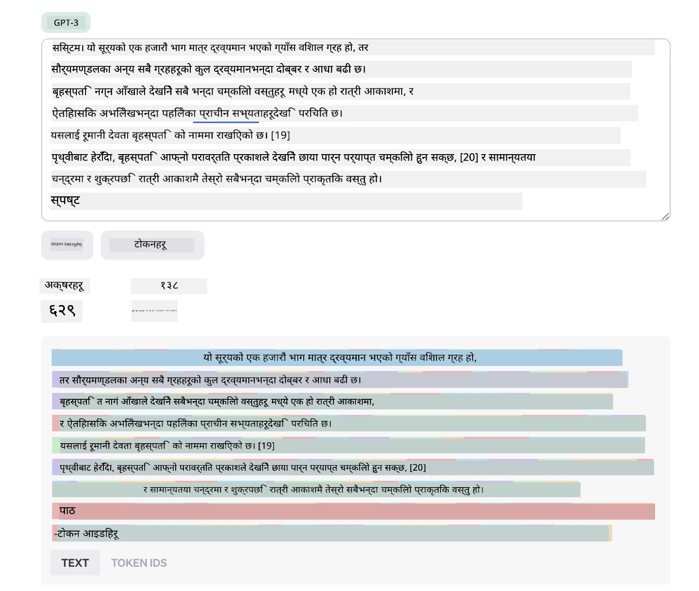
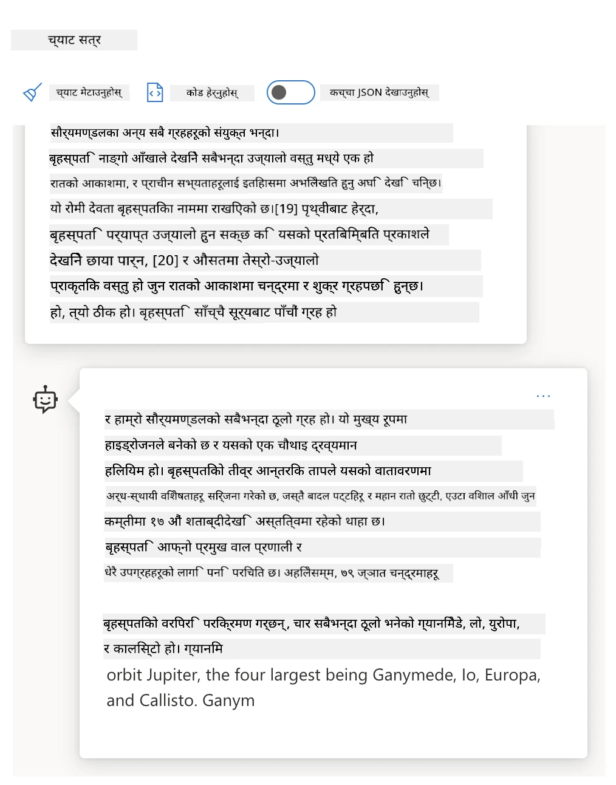
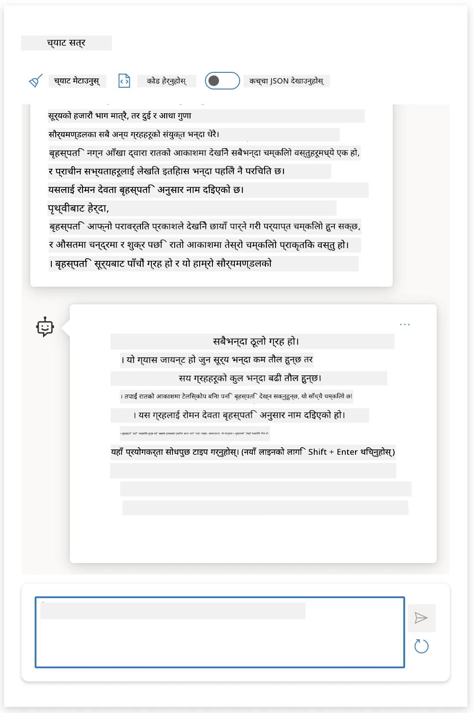
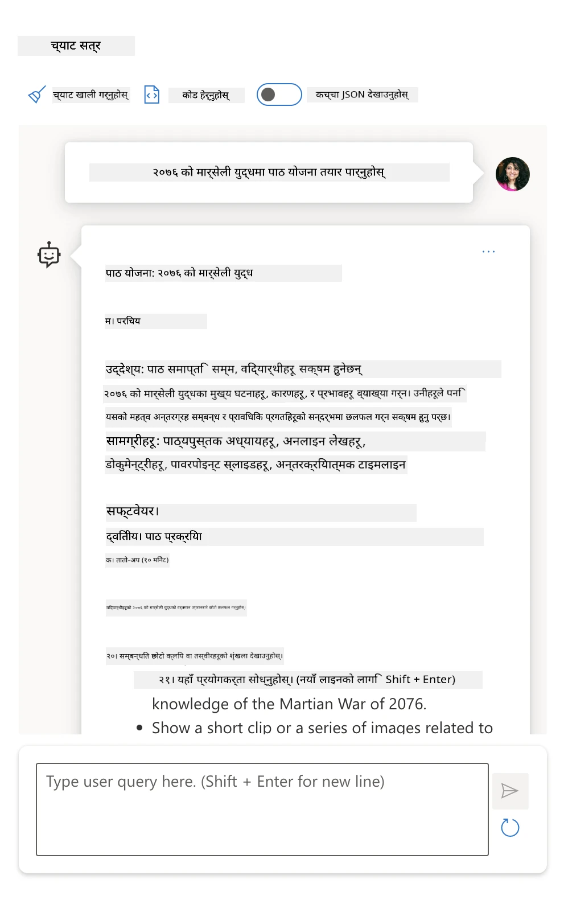

# प्रॉम्प्ट इञ्जिनियरिङ्गका आधारभूत तत्वहरू

[](https://youtu.be/GElCu2kUlRs?si=qrXsBvXnCW12epb8)

## परिचय
यो मोड्युलले जेनेरेटीभ AI मोडेलहरूमा प्रभावकारी प्रॉम्प्टहरू सिर्जना गर्नका लागि आवश्यक अवधारणाहरू र प्रविधिहरूको समावेश गर्दछ। तपाईंको प्रॉम्प्ट LLM लाई कसरी लेखिन्छ भन्ने कुरा पनि महत्त्वपूर्ण हुन्छ। सावधानीपूर्वक तयार गरिएको प्रॉम्प्टले उत्तरको गुणस्तरमा सुधार ल्याउन सक्छ। तर प्रॉम्प्ट र प्रॉम्प्ट इञ्जिनियरिङ्ग जस्ता शब्दहरूले के अर्थ पुर्याउँछन्? र म LLM लाई पठाउने प्रॉम्प्ट इनपुटलाई कसरी सुधार गर्न सक्छु? यी प्रश्नहरूको उत्तर हामी यस अध्याय र अर्को अध्यायमा खोज्नेछौं।

_जेनेरेटीभ AI_ प्रयोगकर्ताका अनुरोधहरूको जवाफमा नयाँ सामग्री (जस्तै, टेक्स्ट, छवि, अडियो, कोड आदि) सिर्जना गर्न सक्षम छ। यसले OpenAI को GPT ("Generative Pre-trained Transformer") शृंखलाजस्ता _बृहत् भाषा मोडेलहरू_ को प्रयोग गरेर प्राकृतिक भाषा र कोडमा तालिम प्राप्त गर्दछ।

प्रयोगकर्ताहरू अब यी मोडेलहरूसँग च्याट जस्ता परिचित तरिकाले अन्तरक्रिया गर्न सक्छन्, बिना कुनै प्राविधिक ज्ञान वा तालिमको आवश्यक पर्दा। यी मोडेलहरू _प्रॉम्प्ट आधारित_ हुन्छन् - प्रयोगकर्ताहरूले टेक्स्ट इनपुट (प्रॉम्प्ट) पठाउँछन् र AI जन्य उत्तर (समापन) पाउँछन्। त्यसपछि उनीहरूले "AI सँग बहु-पटक संवाद" गर्दै प्रॉम्प्टलाई सुधार गर्दै उत्तरलाई आफूसँग मेल खाने सम्म पुनःप्रयोग गर्न सक्छन्।

"प्रॉम्प्टहरू" अब जेनेरेटीभ AI एपहरूको प्रमुख _प्रोग्रामिङ्ग अन्तरफलक_ बन्न गएका छन्, जसले मोडेलहरूलाई के गर्नुपर्ने बताउँछन् र फर्काउने उत्तरको गुणस्तरमा प्रभाव पार्छन्। "प्रॉम्प्ट इञ्जिनियरिङ्ग" ती प्रॉम्प्टहरूको _डिजाइन र अनुकूलन_ मा केन्द्रित शीघ्र बृद्धि हुँदै गरेको अध्ययन क्षेत्र हो जसले भरोसायोग्य र गुणस्तरीय उत्तरहरू सुनिश्चित गर्छ।

## सिकाइका लक्ष्यहरू

यस पाठमा हामी के हो प्रॉम्प्ट इञ्जिनियरिङ्ग, किन आवश्यक छ, र कसरी हामी दिएको मोडेल र अनुप्रयोग उद्देश्यको लागि प्रभावकारी प्रॉम्प्टहरू तयार गर्न सक्छौं भनेर सिक्नेछौं। हामी प्रॉम्प्ट इञ्जिनियरिङ्गका मुख्य अवधारणाहरू र राम्रो अभ्यासहरू बुझ्नेछौं - र अन्तरक्रियात्मक जुपिटर नोटबुक "स्यान्डबक्स" वातावरणबारे जान्नेछौं जहाँ यि अवधारणाहरूलाई वास्तविक उदाहरणहरूमा लागू गरिएको देख्न सकिन्छ।

यस पाठको अन्त्यसम्म हामी सक्षम हुनेछौं:

1. प्रॉम्प्ट इञ्जिनियरिङ्ग के हो र किन यसले महत्व राख्छ व्याख्या गर्न।
2. प्रॉम्प्टका घटकहरू वर्णन गर्न र तिनीहरूको प्रयोग कसरी हुन्छ जान्न।
3. प्रॉम्प्ट इञ्जिनियरिङ्गका लागि उत्तम अभ्यासहरू र प्रविधिहरू सिक्न।
4. सिकेका प्रविधिहरूलाई वास्तविक उदाहरणहरूमा, OpenAI इन्डपोइन्ट प्रयोग गरी लागू गर्न।

## मुख्य शब्दहरू

प्रॉम्प्ट इञ्जिनियरिङ्ग: AI मोडेलहरूलाई इच्छित आउटपुट उत्पादन गर्न मार्गदर्शन गर्न इनपुटहरू डिजाइन र परिमार्जन गर्ने अभ्यास।
टोकनाइजेशन: पाठलाई साना एकाइहरू (टोकनहरू) मा रूपान्तरण गर्ने प्रक्रिया, जुन मोडेलले बुझ्न र प्रक्रिया गर्न सक्छ।
निर्देशन-ट्यून गरिएको LLMs: ठूलो भाषा मोडेलहरू (LLMs) जुन विशिष्ट निर्देशनहरूका साथ सूक्ष्म तालिम प्राप्त गरेर उत्तरको शुद्धता र सान्दर्भिकता सुधारिएको हुन्छ।

## सिकाइ स्यान्डबक्स

प्रॉम्प्ट इञ्जिनियरिङ्ग अहिले कला भन्दा विज्ञान हो। यसको लागि हाम्रो अन्तर्वेसन सुधार गर्ने उत्तम तरिका _अझ बढी अभ्यास_ हो र आवेदन क्षेत्रको विशेषज्ञता र सिफारिस गरिएका प्रविधिहरू तथा मोडेल-विशिष्ट अनुकूलनहरूको संयोजन अनुसार परीक्षण र सुधार गर्ने तरिका अपनाउनु हो।

यस पाठसँगै आएको जुपिटर नोटबुकले एउटा _स्यान्डबक्स_ वातावरण प्रदान गर्छ जहाँ तपाईंले गएर सिकेका कुरा प्रयास गर्न सक्नुहुन्छ – वा अन्त्यमा रहेको कोड चुनौतीको हिस्सा बनाउन सक्नुहुन्छ। अभ्यासहरू सञ्चालन गर्नको लागि तपाईंले आवश्यक पर्नेछ:

1. **एजुर ओपनएआई API कुञ्जी** - तैनाथ गरिएको LLM को सेवा इन्डपोइन्ट।
2. **पाइथन रनटाइम** - जसमा नोटबुक सञ्चालन गर्न सकिन्छ।
3. **स्थानीय वातावरण चरहरू** - _अहिले [सेटअप](./../00-course-setup/02-setup-local.md?WT.mc_id=academic-105485-koreyst) चरणहरू पूरा गरेर तयार हुनुहोस्_।

नोटबुकसँग केही _शुरुआती_ अभ्यासहरू हुन्छन् - तर तपाईंलाई आफ्नो _मार्कडाउन_ (विवरण) र _कोड_ (प्रॉम्प्ट अनुरोधहरू) खण्डहरू थपेर अझ बढी उदाहरणहरू वा विचारहरू प्रयास गर्न प्रोत्साहन गरिएको छ - र प्रॉम्प्ट डिजाइनको लागि अन्तर्वेसन विकास गर्न।

## चित्रित मार्गदर्शक

यस पाठले के समेटेको छ भनि ठूलो तस्वीर थाहा पाउन चाहनुहुन्छ? यो चित्रित मार्गदर्शक हेर्नुहोस् जसले तपाईंलाई मुख्य विषयहरू र हरेकमा विचार गर्नुपर्ने मुख्य सिकाइहरू बताउँछ। पाठको रोडम्यापले तपाईंलाई आधारभूत अवधारणा र चुनौतीहरू बुझ्नदेखि तिनीहरूलाई प्रासंगिक प्रॉम्प्ट इञ्जिनियरिङ्ग प्रविधिहरू र उत्तम अभ्यासहरूसँग सम्बोधन गर्न लैजान्छ। ध्यान दिनुहोस् कि यस मार्गदर्शकको "उन्नत प्रविधिहरू" खण्डले यस पाठ्यक्रमको _अर्को_ अध्यायमा समेटिएका विषयहरूलाई जनाउँछ।


## हाम्रो स्टार्टअप

अब, कुरा गरौं कसरी _यो विषय_ हाम्रो स्टार्टअप मिशनसँग सम्बन्धित छ जसले [शिक्षामा AI नवप्रवर्तन ल्याउने](https://educationblog.microsoft.com/2023/06/collaborating-to-bring-ai-innovation-to-education?WT.mc_id=academic-105485-koreyst) उद्देश्य राख्छ। हामी _व्यक्तिगत सिकाइ_ का AI-शक्तिशाली अनुप्रयोगहरू बनाउने लक्ष्यमा छौं - त्यसैले हाम्रो अनुप्रयोगका फरक प्रयोगकर्ताहरूले कसरी "प्रॉम्प्ट" डिजाइन गर्न सक्छन् भनेर सोचौं:

- **प्रशासकहरू** लाई AI लाई _पाठ्यक्रम डेटामा रिक्त स्थान पत्ता लगाउन विश्लेषण गर्न_ भन्न सकिन्छ। AI ले परिणाम संक्षेप गर्न वा कोडसहित दृश्यात्मक बनाउन सक्छ।
- **शिक्षकहरू** लाई AI लाई _लक्षित दर्शक र विषयका लागि पाठ योजना बनाउन_ भन्न सक्छन्। AI ले निर्दिष्ट स्वरूपमा व्यक्तिगत योजना तयार गर्न सक्छ।
- **विद्यार्थीहरू** लाई AI लाई _गाह्रो विषयमा ट्युटरिङ्ग गर्न_ भन्न सक्छन्। AI अब उनीहरूलाई स्तरअनुसार पाठ, सङ्केत र उदाहरणहरूसहित मार्गदर्शन गर्न सक्छ।

त्यो मात्र सानो भाग हो। [Prompts For Education](https://github.com/microsoft/prompts-for-edu/tree/main?WT.mc_id=academic-105485-koreyst) - शैक्षिक विशेषज्ञहरूले व्यवस्थापन गरेको खुल्ला स्रोत प्रॉम्प्ट पुस्तकालय हेर्नुहोस् - सम्भावनाहरूको व्यापक बुझाइका लागि! _स्यान्डबक्समा त्यो केही प्रॉम्प्ट चलाएर वा OpenAI प्लेग्राउन्ड प्रयोग गरेर के हुन्छ हेर्नुहोस्!_

<!--
LESSON TEMPLATE:
This unit should cover core concept #1.
Reinforce the concept with examples and references.

CONCEPT #1:
Prompt Engineering.
Define it and explain why it is needed.
-->

## प्रॉम्प्ट इञ्जिनियरिङ्ग के हो?

हामीले यस पाठलाई प्रॉम्प्ट इञ्जिनियरिङ्गलाई परिभाषित गरी सुरु गर्यौं जुन एउटा प्रक्रिया हो जुनमा टेक्स्ट इनपुट (प्रॉम्प्ट) को _डिजाइन र अनुकूलन_ गरेर दिइएको आवेदन उद्देश्य र मोडेलको लागि नियमित र गुणस्तरीय प्रतिक्रियाहरू (समापनहरू) प्रदान गर्न सकिन्छ। यसलाई २-चरणीय प्रक्रिया भनेर सोच्न सकिन्छ:

- निर्दिष्ट मोडेल र उद्देश्यका लागि प्रारम्भिक प्रॉम्प्ट _डिजाइन_ गर्ने
- प्रतिक्रियाको गुणस्तर सुधार गर्न प्रॉम्प्टलाई निरन्तर _परिमार्जन_ गर्ने

यो अनिवार्य रूपमा परीक्षण-र-त्रुटिको प्रक्रिया हो जसले प्रयोगकर्ताको बोध र प्रयास आवश्यक पार्छ राम्रो नतीजा पाउन। त्यसोभए किन यो आवश्यक छ? त्यस प्रश्नको उत्तर जान्न हामी पहिलो तीन विषयहरू बुझ्नुपर्छ:

- _टोकनाइजेशन_ = मोडेलले प्रॉम्प्टलाई कसरी "हेर्छ"
- _बेस LLMहरू_ = आधार मोडेलले कसरी प्रॉम्प्टलाई "प्रक्रिया गर्छ"
- _निर्देशन-ट्यून गरिएको LLMहरू_ = मोडेलले अहिले कसरी "कार्यहरू" देख्न सक्छ

### टोकनाइजेशन

एउटा LLM प्रॉम्प्टहरूलाई _टोकनहरूको अनुक्रम_ को रूपमा हेर्छ जहाँ विभिन्न मोडेलहरू (वा एउटै मोडेलका संस्करणहरू) एउटै प्रॉम्प्टलाई फरक-फरक तरिकाले टोकनाइज गर्न सक्छन्। किन भने LLMहरू टोकनहरूमा तालिम प्राप्त छन् (कच्चा पाठमा होइन), त्यसैले प्रॉम्प्टहरूको टोकनाइजेशनले सृजित जवाफको गुणस्तरमा प्रत्यक्ष प्रभाव पार्छ।

टोकनाइजेशन कसरी काम गर्छ भन्ने बुझ्नका लागि तल देखाइएको [OpenAI Tokenizer](https://platform.openai.com/tokenizer?WT.mc_id=academic-105485-koreyst) जस्ता उपकरण प्रयोग गरी हेर्नुहोस्। आफ्नो प्रॉम्प्ट टाइप गर्नुहोस् - र कसरी यसले टोकनहरूमा परिणत हुन्छ हेर्नुहोस्, विशेष गरी सेतो ठाउँ र विराम चिह्न कसरी ह्यान्डल हुन्छन् भन्ने कुरामा ध्यान दिनुहोस्। ध्यान दिनुहोस् कि यस उदाहरणमा पुरानो LLM (GPT-3) देखाइएको छ - यसैले नयाँ मोडेलसँग प्रयास गर्दा फरक परिणाम आउन सक्छ।



### अवधारणा: फाउन्डेसन मोडेलहरू

एक पटक प्रॉम्प्टलाई टोकनाइज गरियोपछि, ["बेस LLM"](https://blog.gopenai.com/an-introduction-to-base-and-instruction-tuned-large-language-models-8de102c785a6?WT.mc_id=academic-105485-koreyst) (वा फाउन्डेसन मोडेल) को मुख्य कार्य भनेको त्यस अनुक्रममा अर्को टोकनको भविष्यवाणी गर्नु हो। LLMहरू विशाल पाठ डाटासेटमा तालिम प्राप्त भएकाले, तिनीहरूलाई टोकनबीचको सांख्यिक सम्बन्ध राम्रोसँग थाहा हुन्छ र निश्चिततासहित भविष्यवाणी गर्न सक्छन्। ध्यान दिनुहोस्, तिनीहरूले प्रॉम्प्ट वा टोकनमा शब्दहरूको _अर्थ_ बुझ्दैनन्; उनीहरूले केवल एउटा ढाँचा देख्छन् जसलाई उनीहरूले अर्को भविष्यवाणीमा "पूरा" गर्न सक्छन्। प्रयोगकर्ताले मध्‍यस्तता नगरे सम्म वा पूर्वनिर्धारित सर्त पूरा नभएसम्म तिनीहरूले अनुक्रमको भविष्यवाणी जारी राख्न सक्छन्।

प्रॉम्प्ट आधारित समापन कसरी काम गर्छ हेर्न चाहनुहुन्छ? माथिको प्रॉम्प्टलाई [Microsoft Foundry playground](https://ai.azure.com?WT.mc_id=academic-105485-koreyst) मा डिफल्ट सेटिङहरू सहित प्रविष्ट गर्नुहोस्। सिस्टमले प्रॉम्प्टलाई सूचना अनुरोधको रूपमा व्याख्या गर्छ - त्यसैले तपाईंले यस्तो सन्दर्भलाई सन्तुष्ट पार्ने उत्तर देख्नुहुनेछ।

तर यदि प्रयोगकर्ताले केही विशेष हेर्न चाह्यो जुन केही मापदण्ड वा कार्य उद्देश्य पूरा गर्दछ भने? यो ठाउँमा _निर्देशन-ट्यून गरिएको_ LLMहरू आउँछन्।



### अवधारणा: निर्देशन-ट्यून गरिएको LLMs

एक [निर्देशन-ट्यून गरिएको LLM](https://blog.gopenai.com/an-introduction-to-base-and-instruction-tuned-large-language-models-8de102c785a6?WT.mc_id=academic-105485-koreyst) फाउन्डेसन मोडेलबाट सुरु हुन्छ र उदाहरण वा इनपुट/आउटपुट जोडीहरू (जस्तै, बहु-पटक "सन्देशहरू") को साथ सूक्ष्म तालिम दिइन्छ जुन स्पष्ट निर्देशनहरू समावेश गर्न सक्छन् - र AIको प्रतिक्रिया त्यो निर्देशन पालना गर्न प्रयास गर्छ।

यसले Reinforcement Learning with Human Feedback (RLHF) जस्ता प्रविधिहरू प्रयोग गर्दछ जसले मोडेललाई _निर्देशनहरू पालना_ गर्न र _प्रतिक्रियाबाट सिक्न_ तालिम दिन सक्छ ताकि प्रतिक्रियाहरू व्यावहारिक अनुप्रयोगहरूमा उपयुक्त र प्रयोगकर्ताका उद्देश्यहरूमा सान्दर्भिक हुन।

यसलाई प्रयास गरौं - माथिको प्रॉम्प्ट पुनःजानुहोस्, तर अब _सिस्टम सन्देश_ लाई निम्न निर्देशन सन्दर्भका रूपमा परिवर्तन गर्नुहोस्:

> _तपाईंलाई दिइएको सामग्रीलाई दोस्रो कक्षा विद्यार्थीका लागि संक्षेप गर्नुहोस्। नतिजालाई १ अनुच्छेद र ३-५ बुलेट पोइन्टमा सीमित राख्नुहोस्।_

कस्तो भयो? नतिजा अब चाहिएको लक्ष्य र स्वरूपलाई प्रतिबिम्बित गर्न ट्यून गरिएको छ? एक शिक्षकले यो प्रतिक्रिया आफ्नो कक्षाको स्लाइडहरूमा सिधै प्रयोग गर्न सक्छन्।



## किन हामीलाई प्रॉम्प्ट इञ्जिनियरिङ्ग चाहिन्छ?

अब हामी जान्यौं कि LLMहरूले प्रॉम्प्टलाई कसरी प्रक्रिया गर्छन्, अब कुरा गरौं किन हामीलाई प्रॉम्प्ट इञ्जिनियरिङ्ग आवश्यक छ। उत्तर छ कि हालका LLMहरूले धेरै चुनौतीहरू प्रस्तुत गर्छन् जुन बिना प्रयास वा अनुकूलनले _निरन्तर र भरोसायोग्य समापन_ उपलब्ध गराउन कठिन बनाउँछन्। उदाहरणका लागि:

1. **मोडेल प्रतिक्रियाहरू स्टोकास्टिक छन्।** _उही प्रॉम्प्ट_ विभिन्न मोडेल वा मोडेल संस्करणहरूसँग फरक प्रतिक्रिया उत्पादन गर्न सक्छ। र यो उही मोडेलसँग पनि फरक पटक फरक परिणाम दिन सक्छ। _प्रॉम्प्ट इञ्जिनियरिङ्ग प्रविधिहरूले यी भिन्नतालाई कम गर्न र बेहतर गार्डरेलकाम गर्छ।_

1. **मोडेलले प्रतिक्रिया बनाइदिन्छ।** मोडेलहरू _ठूलो तर सिमित_ तालिम डाटासेटमा प्रशिक्षण भएका छन्, जसको अर्थ छ कि तिनीहरूसँग तालिम दायरा बाहिरका अवधारणाहरूको जानकारी छैन। नतिजामा, तिनीहरू साँचो नभएका, कल्पनिक वा प्रत्यक्ष रूपमा ज्ञात तथ्यहरूसँग विपरित प्रतिक्रिया दिन सक्छन्। _प्रॉम्प्ट इञ्जिनियरिङ्गले प्रयोगकर्ताहरूलाई यस्ता बनावटहरू पहिचान गर्न र कम गर्न मद्दत गर्दछ - उदाहरणको लागि AI बाट सन्दर्भ वा तर्क मागेर।_

1. **मोडेल क्षमताहरू भिन्न हुनेछन्।** नयाँ मोडेल वा मोडेल पुस्ताहरूमा धनी क्षमताहरू हुनेछन् तर लागत र जटिलतामा फरकपन र अनौंठोपन ल्याउनेछन्। _प्रॉम्प्ट इञ्जिनियरिङ्गले हामीलाई उत्तम अभ्यास र कार्यप्रवाहहरू विकास गर्न मद्दत गर्छ जसले भिन्नतालाई लुकाएर मोडेल-विशिष्ट आवश्यकताहरूसँग अनुकूलित हुन्छ।_

यसलाई OpenAI वा Azure OpenAI प्लेग्राउन्डमा देखौं:

- उही प्रॉम्प्टलाई विभिन्न LLM डिप्लोयमेन्ट्स (जस्तै, OpenAI, Azure OpenAI, Hugging Face) सँग प्रयोग गर्नुहोस् - के तपाईंले भिन्नता देख्नुभयो?
- उही प्रॉम्प्टलाई बारम्बार _उही_ LLM डिप्लोयमेन्ट (जस्तै, Azure OpenAI प्लेग्राउन्ड) मा चलाउनुहोस् - ती भिन्नताहरू कसरी फरक छन्?

### बनावटहरूको उदाहरण

यस कोर्समा, हामी **"बनावट"** शब्द प्रयोग गर्छौं जसले त्यस्तो अवस्था जनाउँछ जहाँ LLMहरूले कहिलेकाहीं तालिम वा अन्य सीमाहरूको कारणले तथ्यगत रूपमा गलत जानकारी उत्पादन गर्छन्। तपाईंले यसलाई लोकप्रिय लेख वा अनुसन्धान कागजातहरूमा _"हल्युसिनेशन"_ भनेर पनि सुन्नुभएको हुनसक्छ। तर हामी दृढताका साथ _"बनावट"_ शब्द प्रयोग गर्न सिफारिस गर्छौं ताकि हामीले अनायासै मानवीय गुण लिएर मेसिन-सञ्चालित परिणामलाई मानवजस्तो व्यवहार नदिनेछौं। यो [उत्तरदायी AI मार्गनिर्देशन](https://www.microsoft.com/ai/responsible-ai?WT.mc_id=academic-105485-koreyst) बाट पनि सुसंगत छ, जुन केही सन्दर्भहरूमा आपत्तिजनक वा गैर-समावेशी सम्झन सकिने शब्दहरू हटाउँछ।

बनावटहरू कसरी काम गर्छन् बुझ्न चाहनुहुन्छ? एउटा प्रॉम्प्ट सोच्नुहोस् जुन AI लाई अवस्थित नभएको विषयका लागि सामग्री सिर्जना गर्न निर्देशन दिन्छ (जसको तालिम डाटासेटमा नहुन सुनिश्चित गर्न)। उदाहरणको लागि - मैले यो प्रॉम्प्ट प्रयास गरें:

> **प्रॉम्प्ट:** २०७६ को मार्टियन युद्धमा पाठ योजना बनाउनुहोस्।

वेब खोजले देखायो कि मार्टियन युद्धहरूमा काल्पनिक कथाहरू (जस्तै, टेलिभिजन श्रृंखला वा पुस्तकहरू) छन् - तर २०७६ मा होइन। सामान्य ज्ञानले पनि भन्छ कि २०७६ _भविष्यमा_ छ, त्यसैले त्यो कुनै वास्तविक घटनाको साथ जोड्न सकिँदैन।


त तिमी विभिन्न LLM प्रदायकहरूसँग यो प्रॉम्प्ट चलाउँदा के हुन्छ?

> **प्रतिक्रिया 1**: OpenAI Playground (GPT-35)


> **प्रतिक्रिया 2**: Azure OpenAI Playground (GPT-35)



> **प्रतिक्रिया 3**: : Hugging Face Chat Playground (LLama-2)


आशा गरेअनुसार, प्रत्येक मोडल (वा मोडल संस्करण) ले थोरै फरक प्रतिक्रिया उत्पादन गर्छ किनभने यादृच्छिक व्यवहार र मोडल क्षमताको भिन्नता हुन्छ। उदाहरणका लागि, एक मोडल आठौं कक्षाको दर्शक लक्षित गर्छ भने अर्को高中 विद्यार्थी भन्ने मानिन्छ। तर ती तीनै मोडलहरूले अनजान प्रयोगकर्तालाई घटना वास्तविक भएको विश्वास दिलाउन सक्छन् भन्ने प्रतिक्रिया उत्पादन गरे।

प्रॉम्प्ट इन्जिनियरिङ प्रविधिहरू जस्तै _metaprompting_ र _temperature configuration_ ले केही हदसम्म मोडलको बनावटहरू कम गर्न सक्छ। नयाँ प्रॉम्प्ट इन्जिनियरिङ _आर्किटेक्चर_हरूले पनि नयाँ उपकरण र प्रविधिहरूलाई सहज तरिकाले प्रॉम्प्ट प्रवाहमा समावेश गर्छन्, यी प्रभाव कम गर्न वा निवारण गर्न।

## केस अध्ययन: GitHub Copilot

यो खंडलाई समाप्त गर्न आउँदा, हामी वास्तविक-जगत समाधानमा प्रॉम्प्ट इन्जिनियरिङ कसरि प्रयोग हुन्छ भनेर एक केस अध्ययन: [GitHub Copilot](https://github.com/features/copilot?WT.mc_id=academic-105485-koreyst) हेर्नेछौं।

GitHub Copilot तपाईको "AI जोडी प्रोग्रामर" हो - यसले टेक्स्ट प्रॉम्प्टहरूलाई कोड पूरकहरूमा रूपान्तरण गर्छ र तपाईको विकास वातावरण (जस्तै, Visual Studio Code) मा अन्तर्संलग्न गरिएको छ ताकि प्रयोगकर्तालाई सहज अनुभव दिन सकोस्। तलका ब्लगहरूमा व्याख्या गरिए अनुसार, सबैभन्दा पुरानो संस्करण OpenAI Codex मोडलमा आधारित थियो - जसमा इन्जिनियरहरूले छिट्टै मोडललाई राम्रो बनाउन र राम्रो प्रॉम्प्ट इन्जिनियरिङ प्रविधिहरू विकास गर्नुपर्छ भन्ने महसुस गरे। जुलाईमा, तिनीहरूले [Codex भन्दा माथि एक सुधारिएको AI मोडल सार्वजनिक गरे](https://github.blog/2023-07-28-smarter-more-efficient-coding-github-copilot-goes-beyond-codex-with-improved-ai-model/?WT.mc_id=academic-105485-koreyst) जसले द्रुत सुझावहरू दिन्छ।

तिनीहरूको सिकाइ यात्रा अनुसरण गर्न तलका पोष्टहरूलाई अनुक्रममा पढ्नुहोस्।

- **मे 2023** | [GitHub Copilot तपाईंको कोड बुझ्न अझ राम्रो हुँदैछ](https://github.blog/2023-05-17-how-github-copilot-is-getting-better-at-understanding-your-code/?WT.mc_id=academic-105485-koreyst)
- **मे 2023** | [GitHub भित्र: GitHub Copilot पछाडि LLMs सँग काम गर्दै](https://github.blog/2023-05-17-inside-github-working-with-the-llms-behind-github-copilot/?WT.mc_id=academic-105485-koreyst)
- **जुन 2023** | [GitHub Copilot का लागि राम्रो प्रॉम्प्ट कसरी लेख्ने](https://github.blog/2023-06-20-how-to-write-better-prompts-for-github-copilot/?WT.mc_id=academic-105485-koreyst)
- **जुलाई 2023** | [GitHub Copilot Codex भन्दा माथि सुधारिएको AI मोडलसहित](https://github.blog/2023-07-28-smarter-more-efficient-coding-github-copilot-goes-beyond-codex-with-improved-ai-model/?WT.mc_id=academic-105485-koreyst)
- **जुलाई 2023** | [प्रॉम्प्ट इन्जिनियरिङ र LLMs को लागि विकासकर्ताको मार्गदर्शक](https://github.blog/2023-07-17-prompt-engineering-guide-generative-ai-llms/?WT.mc_id=academic-105485-koreyst)
- **सेप्टेम्बर 2023** | [व्यवसायिक LLM एप कसरी बनाउने: GitHub Copilot बाट पाठहरू](https://github.blog/2023-09-06-how-to-build-an-enterprise-llm-application-lessons-from-github-copilot/?WT.mc_id=academic-105485-koreyst)

तपाईले तिनीहरूको [इन्जिनियरिङ ब्लग](https://github.blog/category/engineering/?WT.mc_id=academic-105485-koreyst) पनि हेर्न सक्नुहुन्छ जस्तै [यो एउटा](https://github.blog/2023-09-27-how-i-used-github-copilot-chat-to-build-a-reactjs-gallery-prototype/?WT.mc_id=academic-105485-koreyst) जसले देखाउँछ यी मोडलहरू र प्रविधिहरू वास्तविक-विश्व अनुप्रयोग कसरी _आवेदन_ गरिन्छ।

---

<!--
LESSON TEMPLATE:
यस इकाईले मूल अवधारणा #2 समेट्नु पर्छ।
अवधारणा उदाहरण र सन्दर्भहरूबाट बलियो बनाउनुहोस्।

अवधारणा #2:
प्रॉम्प्ट डिजाइन।
उदाहरणहरूसँग चित्रित गरिएको।
-->

## प्रॉम्प्ट निर्माण

हामीले देखिसक्यौं किन प्रॉम्प्ट इन्जिनियरिङ महत्वपूर्ण छ - अब प्रॉम्प्टहरू कसरी _निर्माण_ हुन्छन् बुझौँ ताकि हामी विभिन्न प्रविधिहरूलाई प्रभावकारी प्रॉम्प्ट डिजाइनको लागि मूल्याङ्कन गर्न सकूँ।

### आधारभूत प्रॉम्प्ट

अब आधारभूत प्रॉम्प्टबाट सुरु गरौं: एक पाठ इनपुट मोडलमा पठाइन्छ जसमा अरू कुनै सन्दर्भ हुँदैन। यहाँ एउटा उदाहरण छ - जब हामी अमेरिकी राष्ट्रिय गानका केही पहिलो शब्दहरू OpenAI [Completion API](https://platform.openai.com/docs/api-reference/completions?WT.mc_id=academic-105485-koreyst) मा पठाउँछौं यो तुरुन्तै अर्को केही लाइनहरू _पूरा_ गर्छ, जसले आधारभूत भविष्यवाणी व्यवहार देखाउँछ।

| प्रॉम्प्ट (इनपुट) | पूर्णता (आउटपुट)                                                                                                                             |
| :----------------- | :----------------------------------------------------------------------------------------------------------------------------------------- |
| ओ से तपाईं देख्न सक्छौं | यस्तो सुनिन्छ तपाईं "The Star-Spangled Banner," संयुक्त राज्यको राष्ट्रिय गानका शब्दहरू सुरु गर्दै हुनुहुन्छ। पूर्ण गीत... |

### जटिल प्रॉम्प्ट

अब त्यो आधारभूत प्रॉम्प्टमा सन्दर्भ र निर्देशनहरू थपौं। [Chat Completion API](https://learn.microsoft.com/azure/ai-services/openai/how-to/chatgpt?WT.mc_id=academic-105485-koreyst)ले हामीलाई जटिल प्रॉम्प्टहरू _सन्देश_ को संग्रहको रूपमा निर्माण गर्न दिन्छ:

- इनपुट/आउटपुट जोडीहरू जसले _प्रयोगकर्ता_ इनपुट र _सहायक_ प्रतिक्रियालाई प्रतिनिधित्व गर्छन्।
- प्रणाली सन्देश जसले सहायकको व्यवहार वा व्यक्तित्वको सन्दर्भ सेट गर्छ।

अनुरोध अब तलको स्वरूपमा छ, जहाँ _टोकनाइजेसन_ले प्रभावकारी रूपमा सन्दर्भ र कुराकानीबाट सम्बन्धित जानकारी समात्छ। अब, प्रणाली सन्दर्भ परिवर्तन गर्नु प्रयोगकर्ता इनपुटहरू दिएजस्तो प्रभावकारी हुन्छ।

```python
response = client.responses.create(
    model="gpt-4o-mini",
    input=[
        {"role": "system", "content": "You are a helpful assistant."},
        {"role": "user", "content": "Who won the world series in 2020?"},
        {"role": "assistant", "content": "The Los Angeles Dodgers won the World Series in 2020."},
        {"role": "user", "content": "Where was it played?"}
    ]
)
```

### निर्देशन प्रॉम्प्ट

माथिका उदाहरणहरूमा, प्रयोगकर्ता प्रॉम्प्ट एक सरल पाठ प्रश्न थियो जुन जानकारीको अनुरोध रूपमा व्याख्या गर्न सकिन्छ। _निर्देशन_ प्रॉम्प्टहरूमा, हामी त्यो पाठलाई कार्यलाई थप विस्तृत रूपमा निर्दिष्ट गर्न प्रयोग गर्न सक्छौं, जसले AI लाई राम्रो मार्गदर्शन दिन्छ। यहाँ एउटा उदाहरण छ:

| प्रॉम्प्ट (इनपुट)                                                                                                                                                                                                                | पूर्णता (आउटपुट)                                                                                                         | निर्देशन प्रकार   |
| :-------------------------------------------------------------------------------------------------------------------------------------------------------------------------------------------------------------------------------- | :------------------------------------------------------------------------------------------------------------------------- | :---------------- |
| गृहयुद्धको वर्णन लेख्नुहोस्                                                                                                                                                                                                        | _सरल अनुच्छेद फर्काइयो_                                                                                                  | सरल              |
| गृहयुद्धको वर्णन लेख्नुहोस्। मुख्य मिति र घटनाहरू प्रदान गर्नुहोस् र तिनीहरूको महत्त्व वर्णन गर्नुहोस्                                                                                                                               | _अनुच्छेद र त्यसपछिका मुख्य घटनाका मिति र वर्णन सहितको सूची फर्काइयो_                                                   | जटिल             |
| गृहयुद्धको वर्णन १ अनुच्छेदमा लेख्नुहोस्। ३ वटा मुख्य मिति र तिनीहरूको महत्त्वका साथ ३ बुलेट पोइन्टहरू प्रदान गर्नुहोस्। थप ३ बुलेट पोइन्टहरू मुख्य ऐतिहासिक व्यक्तिहरू र तिनीहरूको योगदान सहित प्रदान गर्नुहोस्। आउटपुटलाई JSON फाइलको रूपमा फर्काउनुहोस् | _थप विस्तृत विवरणहरू टेक्स्ट बक्समा फर्किन्छ, JSON ढाँचामा जसलाई फाइलमा कपी-पेस्ट र प्रमाणित गर्न सकिन्छ_                     | जटिल। ढाँचागत।  |

## प्राथमिक सामग्री

माथिका उदाहरणहरूमा, प्रॉम्प्ट अझै केही खुला थियो, जसले LLM लाई आफ्नो पूर्व-प्रशिक्षित डेटासेटको कुन भाग सम्बन्धित हो निर्णय गर्न दिन्थ्यो। _प्राथमिक सामग्री_ डिजाइन नमूनाले इनपुट टेक्स्टलाई दुई भागमा विभाजन गर्छ:

- एक निर्देशन (कार्य)
- सम्बन्धित सामग्री (जसले कार्यलाई प्रभाव पार्छ)

यहाँ एउटा उदाहरण छ जहाँ निर्देशन छ "यसलाई २ वाक्यमा सारांश गर्नुस्"।

| प्रॉम्प्ट (इनपुट)                                                                                                                                                                                                                                                                                                                                                                                                                                                                                                                                                                                                                                                                               | पूर्णता (आउटपुट)                                                                                                                                                                                                                                                                         |
| :------------------------------------------------------------------------------------------------------------------------------------------------------------------------------------------------------------------------------------------------------------------------------------------------------------------------------------------------------------------------------------------------------------------------------------------------------------------------------------------------------------------------------------------------------------------------------------------------------------------------------------------------------------------------------------------------- | :-------------------------------------------------------------------------------------------------------------------------------------------------------------------------------------------------------------------------------------------------------------------------------------------- |
| बृहस्पति सूर्यबाट पाँचौं ग्रह हो र सौर्यमण्डलको सबैभन्दा ठूलो ग्रह हो। यो ग्यास जाइअन्ट हो जसको द्रव्यमान सूर्यको एक हजारौंमा एक छ, तर सौर्यमण्डलका सबै अन्य ग्रहहरूको दुई र आधा गुणा छ। बृहस्पति रातको आकाशमा नाङ्गो आँखा द्वारा देखिने सबैभन्दा उज्यालो वस्तुहरू मध्ये एक हो र प्राचीन सभ्यताहरुले इतिहास भन्दा पहिलेबाट थाहा पाएका छन्। यसको नाम रोमन देवता बृहस्पति भन्दा लिइएको छ।[19] पृथ्वीबाट हेर्दा, बृहस्पति आफ्नो प्रतिबिम्बित प्रकाशले देखिने छायाहरू उत्पादन गर्न पर्याप्त उज्यालो हुन सक्छ,[20] र औसतमा चन्द्रमा र शुक्रपछि रातको आकाशमा तेस्रो सबैभन्दा उज्यालो प्राकृतिक वस्तु हो। <br/> **यसलाई २ छोटा वाक्यमा सारांश गर्नुहोस्** | बृहस्पति, सूर्यबाट पाँचौं ग्रह, सौर्यमण्डलको सबैभन्दा ठूलो ग्रह हो र रातको आकाशमा सबैभन्दा उज्यालो वस्तु मध्ये एक हो। रोमन देवता बृहस्पतिका नाममा रहेको यो ग्यास जाइअन्ट हो जसको द्रव्यमान सौर्यमण्डलका अन्य सबै ग्रहहरूको दुई र आधा गुणा छ।                                 |

प्राथमिक सामग्री खण्ड विभिन्न तरिकाहरूसँग प्रयोग गर्न सकिन्छ ताकि बढी प्रभावकारी निर्देशनहरू ड्राइभ गर्न:

- **उदाहरणहरू** - मोडललाई स्पष्ट निर्देशन दिने सट्टा, के गर्ने भनेर उदाहरणहरू दिनुहोस् र यसले ढाँचा अँगाल्नेछ।
- **सूचकहरू** - निर्देशन पछी एक "सूचक" दिनुहोस् जसले पूर्णतालाई प्रोत्साहित गर्छ, मोडललाई बढी सम्बन्धित प्रतिक्रियामा मार्गनिर्देशन गर्छ।
- **टेम्प्लेटहरू** - यी आवर्ती 'रेसिपी'हरू हुन् प्रॉम्प्टहरूको जहाँ प्लेसहोल्डरहरू (परिवर्तनीयहरू) हुन्छन् जसलाई विशेष प्रयोगका लागि डाटाका साथ अनुकूलित गर्न सकिन्छ।

अब तीलाई प्रयोगमा अन्वेषण गरौं।

### उदाहरणहरूको प्रयोग

यो एउटा प्रविधि हो जहाँ तपाई प्राथमिक सामग्री प्रयोग गरेर मोडललाई के चाहिन्छ भनेर केही उदाहरणहरू "खुवाउनुहुन्छ", र यसले चाहिएको ढाँचाको लागि ढाँचा अङ्गाल्छ। उपलब्ध गराइएका उदाहरणहरूको संख्याको आधारमा हामी शून्य-शट, एक-शट, थोरै-शट प्रॉम्प्टिङ गर्न सक्छौं।

प्रॉम्प्ट अहिले तीन कम्पोनेन्टहरूबाट बनेको छ:

- कार्य विवरण
- चाहिएको परिणामका केही उदाहरणहरू
- नयाँ उदाहरणको सुरुवात (जो अप्रत्यक्ष कार्य विवरण हुन्छ)

| सिकाइ प्रकार | प्रॉम्प्ट (इनपुट)                                                                                                                                        | पूर्णता (आउटपुट)         |
| :------------ | :---------------------------------------------------------------------------------------------------------------------------------------------------- | :-------------------------- |
| शून्य-शट    | "सूर्य चम्किरहेको छ"। स्पेनिसमा अनुवाद गर्नुहोस्                                                                                                    | "El Sol está brillando".    |
| एक-शट         | "सूर्य चम्किरहेको छ" => ""El Sol está brillando". <br> "यो एक चिसो र हावाहुरी दिन हो" =>                                                                 | "Es un día frío y ventoso". |
| थोरै-शट       | खेलाडीले बेसहरू दौड्यो => बेसबल <br/> खेलाडीले एस हिट मार्यो => टेनिस <br/> खेलाडीले छ हिट गर्यो => क्रिकेट <br/> खेलाडीले स्लाम डंक गर्यो =>            | बास्केटबल                  |
|               |                                                                                                                                                       |                             |

नोट गर्नुहोस् हामीले शून्य-शट प्रॉम्प्टिङमा स्पष्ट निर्देशन ("स्पेनिशमा अनुवाद गर्नुहोस्") दिनु पर्‍यो, तर एक-शट उदाहरणमा यो अनुमान लगाइन्छ। थोरै-शट उदाहरणले देखाउँछ कसरी थप उदाहरणहरूले मोडलहरूलाई थप सही अनुमान गर्न अनुमति दिन्छ बिना कुनै थप निर्देशन।

### प्रॉम्प्ट सूचकहरू

प्राथमिक सामग्री प्रयोग गर्ने अर्को तरिका हो _सूचक_ प्रदान गर्नु। यस अवस्थामा, हामी मोडललाई ठीक दिशामा एउटा संकेत दिनेछौं जुन चाहिएको प्रतिक्रिया ढाँचालाई प्रतिबिम्बित गर्ने टुक्राले सुरु हुन्छ। त्यसपछि मोडलले त्यो "सूचक लिन्छ" र त्यस्तै शैलीमा जारी राख्छ।

| सूचकहरूको संख्या | प्रॉम्प्ट (इनपुट)                                                                                                                                                                                                                                                                                                                                                                                                                                               | पूर्णता (आउटपुट)                                                                                                                                                                                                                                                                                       |
| :------------- | :----------------------------------------------------------------------------------------------------------------------------------------------------------------------------------------------------------------------------------------------------------------------------------------------------------------------------------------------------------------------------------------------------------------------------------------------------------- | :-------------------------------------------------------------------------------------------------------------------------------------------------------------------------------------------------------------------------------------------------------------------------------------------------------- |
| 0              | बृहस्पति सूर्यबाट पाँचौं ग्रह हो र सौर्यमण्डलको सबैभन्दा ठूलो ग्रह हो। यो ग्यास जाइअन्ट हो जसको द्रव्यमान सूर्यको एक हजारौंमा एक छ, तर सौर्यमण्डलका सबै अन्य ग्रहहरूको दुई र आधा गुणा छ। बृहस्पति रातको आकाशमा नाङ्गो आँखा द्वारा देखिने सबैभन्दा उज्यालो वस्तुहरू मध्ये एक हो र प्राचीन सभ्यताहरुले इतिहास भन्दा पहिलेबाट थाहा पाएका छन्। <br/>**यसलाई सारांश गर्नुस्**                                       | बृहस्पति हाम्रो सौर्यमण्डलको सबैभन्दा ठूलो ग्रह हो र सूर्यबाट पाँचौं ग्रह हो। यो ग्यास जाइअन्ट हो जसको द्रव्यमान सूर्यको 1/1000 छ, तर यो सबै अन्य ग्रहहरूको संयुक्त भन्दा भारी छ। प्राचीन सभ्यताले लामो समयदेखि बृहस्पतिको बारेमा जान्दछन्, र यो रातको आकाशमा सजिलै देखिन्छ।           |
| 1              | बृहस्पति सूर्यबाट पाँचौं ग्रह हो र सौर्यमण्डलको सबैभन्दा ठूलो ग्रह हो। यो ग्यास जाइअन्ट हो जसको द्रव्यमान सूर्यको एक हजारौंमा एक छ, तर सौर्यमण्डलका सबै अन्य ग्रहहरूको दुई र आधा गुणा छ। बृहस्पति रातको आकाशमा नाङ्गो आँखा द्वारा देखिने सबैभन्दा उज्यालो वस्तुहरू मध्ये एक हो र प्राचीन सभ्यताहरुले इतिहास भन्दा पहिलेबाट थाहा पाएका छन्। <br/>**यसलाई सारांश गर्नुस्** <br/> हामीले सिक्यौं कि बृहस्पति | सूर्यबाट पाँचौं ग्रह हो र सौर्यमण्डलको सबैभन्दा ठूलो ग्रह हो। यो ग्यास जाइअन्ट हो जसको द्रव्यमान सूर्यको एक हजारौंमा एक छ, तर सौर्यमण्डलका सबै अन्य ग्रहहरूको दुई र आधा गुणा छ। यो सजिलै देखिने हुन्छ र प्राचीन समयदेखि थाहा छ।                      |

| 2              | बृहस्पति सूर्यबाट पाँचौं ग्रह हो र सौर्यमण्डलको सबैभन्दा ठूलो ग्रह हो। यो ग्यास विशाल ग्रह हो जुन सूर्यको द्रव्यमानको एक हजारौं भाग छ, तर सौर्यमण्डलका सबै अन्य ग्रहहरूको संयुक्त भन्दा दुई र आधा गुणा बढी छ। बृहस्पति राति खुला आँखाले देखिने सबैभन्दा चम्किलो वस्तुहरू मध्ये एक हो, र प्राचीन सभ्यताहरूलाई लिखित इतिहास अघि देखि नै थाहा थियो। <br/>**यसलाई सारांश गर्नुहोस्** <br/> हामीले सिकेका शीर्ष ३ तथ्यहरू:         | १. बृहस्पति सूर्यबाट पाँचौं ग्रह हो र सौर्यमण्डलको सबैभन्दा ठूलो ग्रह हो। <br/> २. यो ग्यास विशाल ग्रह हो जसको द्रव्यमान सूर्यको एक हजारौं भाग छ...<br/> ३. बृहस्पति प्राचीन समयदेखि खुला आँखाले देख्न सकिने छ ...                                                                       |
|                |                                                                                                                                                                                                                                                                                                                                                                                                                                                              |                                                                                                                                                                                                                                                                                                           |

### प्रॉम्प्ट टेम्प्लेटहरू

प्रॉम्प्ट टेम्प्लेट भनेको _पहिले नै परिभाषित गरिएको प्रॉम्प्टको नुस्खा_ हो जुन आवश्यक पर्दा भण्डारण गरेर पुनः प्रयोग गर्न सकिन्छ, जसले ठूलो परिमाणमा प्रयोगकर्ताहरूलाई बढी सुसंगत अनुभव प्रदान गर्न मद्दत गर्दछ। यसको सरलतम रुपमा, यो केवल प्रॉम्प्ट उदाहरणहरूको संग्रह हो जस्तै [OpenAI बाट यो एउटा](https://cookbook.openai.com/examples/gpt4-1_prompting_guide?WT.mc_id=academic-105485-koreyst) जसले अन्तरक्रियात्मक प्रॉम्प्ट कम्पोनेन्टहरू (प्रयोगकर्ता र प्रणाली सन्देशहरू) र API-चालित अनुरोध ढाँचाहरू दुवै प्रदान गर्दछ - पुनः प्रयोगको लागि समर्थन गर्न।

यसको जटिल रूप जस्तै [LangChain बाट यो उदाहरण](https://python.langchain.com/docs/concepts/prompt_templates/?WT.mc_id=academic-105485-koreyst) मा, यसमा _प्लेसहोल्डरहरू_ रहेको हुन्छ जुन विभिन्न स्रोतहरूबाट डेटा (प्रयोगकर्ता इनपुट, प्रणाली सन्दर्भ, बाह्य डाटा स्रोतहरू आदि) ले प्रतिस्थापन गर्न सकिन्छ र गतिशील रूपमा प्रॉम्प्ट उत्पन्न गर्न सकिन्छ। यसले हामीलाई पुनः प्रयोग गर्न मिल्ने प्रॉम्प्टहरूको पुस्तकालय बनाउन अनुमति दिन्छ जुन स्केलमा **प्रोग्रामिङ्गली** एकरूप प्रयोगकर्ता अनुभवहरू उत्प्रेरित गर्न सकिन्छ।

अन्तमा, टेम्प्लेटहरूको वास्तविक मूल्य भनेको तिनीहरूलाई उपयुक्त क्षेत्रमा आधारित _प्रॉम्प्ट पुस्तकालयहरू_ सिर्जना र प्रकाशन गर्ने क्षमतामा हुन्छ - जहाँ प्रॉम्प्ट टेम्प्लेट अब _अभियोग-विशेष सन्दर्भ वा उदाहरणहरू अनुकूलित गरिन्छ_ जसले लक्षित प्रयोगकर्ता दर्शकका लागि प्रतिक्रियाहरूलाई बढी सान्दर्भिक र सही बनाउँछ। [Prompts For Edu](https://github.com/microsoft/prompts-for-edu?WT.mc_id=academic-105485-koreyst) रिपोजिटरी यस दृष्टिकोणको एक राम्रो उदाहरण हो, जसले शिक्षाको क्षेत्रका लागि प्रॉम्प्टहरूको पुस्तकालय सँगाल्छ जसमा पाठ योजना, पाठ्यक्रम डिजाइन, विद्यार्थी शिक्षादान जस्ता महत्वपूर्ण उद्देश्यहरूमा जोड दिइन्छ।

## समर्थन सामग्री

यदि हामी प्रॉम्प्ट निर्माणलाई निर्देश (कार्य) र लक्ष्य (प्राथमिक सामग्री) भएको रूपमा सोच्छौं भने, _द्वितीयक सामग्री_ भनेको थप सन्दर्भ जस्तो हुन्छ जुन हामीले प्रतिक्रिया **केही तरिकाले प्रभाव पार्न** प्रदान गर्छौं। यो ट्यूनिङ्ग प्यारामिटरहरू, स्वरूप निर्देशनहरू, विषय ट्याक्सोनोमी आदि हुन सक्छ जसले मोडेललाई आवश्यक प्रयोगकर्ता उद्देश्य वा अपेक्षाहरू अनुसार प्रतिक्रिया _अनुकूल गर्न_ मद्दत गर्दछ।

उदाहरणका लागि: यदि हामीसँग पाठ्यक्रम सूचीमा सबै उपलब्ध पाठ्यक्रमहरूको नाम, विवरण, स्तर, मेटाडाटा ट्यागहरू, प्रशिक्षक आदि सहित व्यापक मेटाडाटा छ भने:

- हामी निर्देशन परिभाषित गर्न सक्छौं "फाल २०२३ को लागि पाठ्यक्रम सूची सारांश गर्नुहोस्"
- हामी प्राथमिक सामग्रीमा चाहिएको आउटपुटका केही उदाहरणहरू प्रदान गर्न सक्छौं
- हामी द्वितीयक सामग्रीमा चासो भएका शीर्ष ५ "ट्याग" पहिचान गर्न सक्छौं।

अब, मोडेलले केही उदाहरणहरूले देखाइएको ढाँचामा सारांश प्रदान गर्न सक्छ - तर यदि नतिजामा धेरै ट्यागहरू छन् भने, यो द्वितीयक सामग्रीमा पहिचान गरिएका ५ ट्यागलाई प्राथमिकता दिन सक्छ।

---

<!--
पाठ योजना टेम्प्लेट:
यो इकाईले मुख्य अवधारणा #१ समेट्नु पर्छ।
उदाहरणहरू र सन्दर्भहरूसँग अवधारणालाई पुष्टि गर्नुहोस्।

अवधारणा #३:
प्रॉम्प्ट इन्जिनियरिङ्ग प्रविधिहरू।
प्रॉम्प्ट इन्जिनियरिङ्गका केही आधारभूत प्रविधिहरू के हुन्?
यसलाई केही अभ्यासहरूसँग स्पष्ट गर्नुहोस्।
-->

## प्रॉम्प्टिङ्गका उत्कृष्ट अभ्यासहरू

अब जब हामीलाई थाहा छ प्रॉम्प्टहरू कसरी _निर्मित_ गर्न सकिन्छ, हामी तिनीहरूलाई उत्कृष्ट अभ्यासहरू प्रतिबिम्बित गर्ने गरी _डिजाइन_ गर्ने बारे सोच्न थाल्न सक्छौं। हामी यो दुई भागमा सोच्न सक्छौं - सही _मानसिकता_ हुनु र सही _प्रविधिहरू_ लागू गर्नु।

### प्रॉम्प्ट इन्जिनियरिङ्ग मानसिकता

प्रॉम्प्ट इन्जिनियरिङ्ग प्रयास-र-त्रुटि प्रक्रिया हो तसर्थ तीन व्यापक मार्गदर्शक कारकहरू मनमा राख्नुहोस्:

१. **डोमेन बुझाइ महत्त्वपूर्ण छ।** प्रतिक्रिया को सत्यता र सान्दर्भिकता त्यो _डोमेन_ को कार्यमा निर्भर गर्दछ जहाँ त्यो अनुप्रयोग वा प्रयोगकर्ता कार्यरत हुन्छ। आफ्नो अन्तर्ज्ञान र डोमेन विशेषज्ञताको उपयोग गरेर प्रविधिहरूलाई **आफ्नै हिसाबले अनुकूलित** गर्नुहोस्। उदाहरणका लागि, प्रणाली प्रॉम्प्टहरूमा _डोमेन-विशेष व्यक्तित्वहरू_ परिभाषित गर्नुहोस्, वा प्रयोगकर्ता प्रॉम्प्टहरूमा _डोमेन-विशेष टेम्प्लेटहरू_ प्रयोग गर्नुहोस्। द्वितीयक सामग्रीमा डोमेन-विशेष सन्दर्भहरू प्रदान गर्नुहोस्, वा मोडेललाई परिचित प्रयोगका ढाँचाहरू तर्फ निर्देश गर्न _डोमेन-विशेष संकेत र उदाहरणहरू_ प्रयोग गर्नुहोस्।

२. **मोडेल बुझाइ महत्त्वपूर्ण छ।** हामीलाई थाहा छ मोडेलहरू स्वाभाविक रूपमा स्टोकेष्टिक हुन्छन्। तर मोडेल कार्यान्वयनहरूले प्रशिक्षण डेटासेट (अग्र प्रशिक्षण ज्ञान), तिनीहरूले प्रदान गर्ने क्षमताहरू (जस्तै API वा SDK मार्फत) र तिनीहरूको अनुकूलित सामग्री प्रकार (जस्तै, कोड बनाम छवि बनाम पाठ) को आधारमा फरक हुन सक्छ। तपाईंले प्रयोग गरिरहनु भएको मोडेलका शक्तिहरू र सीमाहरू बुझ्नुहोस्, र त्यो ज्ञानको उपयोग गरेर _कार्यहरू प्राथमिकता दिनुहोस्_ वा मोडेलका क्षमताहरूको लागि अनुकूलित _अनुकूल टेम्प्लेटहरू_ निर्माण गर्नुहोस्।

३. **इटरेशन र मान्यकरण महत्त्वपूर्ण छ।** मोडेलहरू तीव्र रूपमा विकास भइरहेका छन्, र प्रॉम्प्ट इन्जिनियरिङ्गका प्रविधिहरू पनि। डोमेन विशेषज्ञको रूपमा, तपाईंको आफ्नै अनुप्रयोगसँग सम्बन्धित सन्दर्भ वा मापदण्ड हुन सक्छ जुन व्यापक समुदायमा लागू नहुन सक्छ। प्रॉम्प्ट इन्जिनियरिङ्ग उपकरण र प्रविधिहरू प्रयोग गरेर प्रॉम्प्ट निर्माणलाई "छिटो सुरुवात" गर्नुहोस्, त्यसपछि तपाईंको आफ्नै अन्तर्ज्ञान र डोमेन विशेषज्ञता प्रयोग गरेर नतिजाहरू पुनः परीक्षण र मान्यकरण गर्नुहोस्। तपाईंका अन्तर्दृष्टिहरूलाई अभिलेख राख्नुहोस् र एउटा **ज्ञान आधार** (जस्तै, प्रॉम्प्ट पुस्तकालयहरू) सिर्जना गर्नुहोस् जुन अरूले छिटो पुनरावृति गर्न प्रयोग गर्न सक्नेछन्।

## उत्कृष्ट अभ्यासहरू

अब हामी केही सामान्य उत्कृष्ट अभ्यासहरू हेर्न जाउँ जुन [OpenAI](https://help.openai.com/en/articles/6654000-best-practices-for-prompt-engineering-with-openai-api?WT.mc_id=academic-105485-koreyst) र [Azure OpenAI](https://learn.microsoft.com/azure/ai-services/openai/concepts/prompt-engineering#best-practices?WT.mc_id=academic-105485-koreyst) व्यावसायिकहरूले सिफारिस गरेका छन्।

| के गर्ने                              | किन                                                                                                                                                                                                                                                    |
| :-------------------------------- | :------------------------------------------------------------------------------------------------------------------------------------------------------------------------------------------------------------------------------------------------- |
| नयाँ मोडेललाई मूल्याङ्कन गर्नुहोस्।       | नयाँ मोडेल पुस्ताहरूले सम्भावित रूपमा सुधारिएका सुविधाहरू र गुणस्तर हुन्छन् - तर यसले बढी लागत पनि ल्याउन सक्छ। प्रभावको मूल्याङ्कन गर्नुहोस् र त्यसपछि माइग्रेशन निर्णय गर्नुहोस्।                                                                       |
| निर्देशन र सन्दर्भ पृथक गर्नुहोस्।   | हेर्नुहोस् कि तपाईंको मोडेल/प्रदायकले निर्देशन, प्राथमिक र द्वितीयक सामग्रीहरूलाई स्पष्ट रूपमा छुट्याउन _विभाजक_ परिभाषित गरेका छन् कि छैनन्। यसले मोडेलहरूलाई टोकनहरूलाई बढी सही तौल दिन मद्दत गर्दछ।                                                        |
| विशिष्ट र स्पष्ट हुनुहोस्।             | चाहिएको सन्दर्भ, नतिजा, लम्बाइ, ढाँचा, शैली आदिबाराका बारेमा बढी विवरण दिनुहोस्। यसले प्रतिक्रियाको गुणस्तर र सुसंगतता सुधार गर्नेछ। नुस्खाहरूलाई पुनः प्रयोगयोग्य टेम्प्लेटहरूमा राख्नुहोस्।                                                                  |
| वर्णनात्मक हुनुहोस्, उदाहरणहरू प्रयोग गर्नुहोस्।      | मोडेलहरू "दिखाउनुहोस् र बताउनुहोस्" तरिकामा राम्रो प्रतिक्रिया दिन सक्छन्। सुरुवातमा `शून्य-शट` तरिका प्रयोग गर्नुहोस् जहाँ तपाईं निर्देशन दिनुहुन्छ (तर कुनै उदाहरण छैन) त्यसपछि सुधारको लागि `केही-शट` प्रयास गर्नुहोस्, चाहिएको आउटपुटका केही उदाहरणहरू प्रदान गर्दै। रूपकहरू प्रयोग गर्नुहोस्। |
| प्रतिक्रिया शुरु गर्न संकेतहरू प्रयोग गर्नुहोस्। | प्रतिक्रिया सुरूवात गर्न यो कुनै शब्द वा वाक्यांशहरू दिनुहोस् जुन मोडेलले जवाफको प्रारम्भमा प्रयोग गर्न सक्छ।                                                                                                                  |
| दोहोरो प्रयास गर्नुहोस्।                       | कहिलेकाँही मोडेललाई पुनः तपाईँले भन्नु आवश्यक पर्न सक्छ। प्राथमिक सामग्री अघि र पछि निर्देशन दिनुहोस्, निर्देशन र संकेत दुबै प्रयोग गर्नुहोस्, आदिका साथ प्रयास र मान्यकरण गर्नुहोस् कि के काम गर्छ।                                                                          |
| क्रम महत्त्वपूर्ण छ।                       | तपाईं जुन क्रममा मोडेललाई सूचना दिनुहुन्छ, त्यसले आउटपुटमा प्रभाव पार्न सक्छ, सिकाइ उदाहरणहरूमा पनि, नवीनता पूर्वाग्रहको कारणले। के काम गर्छ भनी हेर्न भिन्न विकल्पहरू प्रयास गर्नुहोस्।                                                                       |
| मोडेललाई "विकल्प" दिने।           | मोडेललाई एउटा _फ्याल्ब्याक_ पूर्णतासँग जवाफको विकल्प दिनुहोस् यदि कुनै कारणले कार्य पूरा गर्न सक्दैन भने। यसले गलत वा बना-वना जवाफ उत्पादन हुन सक्ने सम्भावनालाई कम गर्छ।                                                                         |
|                                   |                                                                                                                                                                                                                                                    |

कुनै पनि उत्कृष्ट अभ्यासजस्तै, सम्झनुहोस् कि _तपाईंको अनुभव फरक पर्न सक्छ_ मोडेल, कार्य र डोमेन अनुसार। यीलाई आरम्भिक बिन्दुको रूपमा प्रयोग गर्नुहोस् र तपाईंका लागि के काम गर्छ भनी पुनः प्रयास गर्नुहोस्। नयाँ मोडेलहरू र उपकरणहरू उपलब्ध हुने जाँदा आफ्नो प्रॉम्प्ट इन्जिनियरिङ्ग प्रक्रिया निरन्तर पुनः मूल्याङ्कन गर्दै जानुहोस्, प्रक्रिया स्केलेबलिटी र प्रतिक्रिया गुणस्तरमा केन्द्रित भएर।

<!--
पाठ योजना टेम्प्लेट:
यदि लागू भएमा यस इकाईले एउटा कोड चुनौती प्रदान गर्नुपर्छ

चुनौती:
निर्देशनहरूमा केवल कोड टिप्पणीहरू भएको Jupyter नोटबुकलाई लिंक गर्नुहोस् (कोड खण्डहरु खाली हुन्छन्)।

समाधान:
त्यस नोटबुकको कपी जुन प्रॉम्प्टहरू भरिएका र चलाइएका छन्, केहि उदाहरण देखाउँदै लिंक गर्नुहोस्।
-->

## कार्य

बधाई छ! तपाईं पाठको अन्त्यसम्म आइपुगेको छ! अब ती अवधारणा र प्रविधिहरूलाई वास्तविक उदाहरणहरूसँग परिक्षण गर्ने समय हो!

हाम्रो कार्यका लागि, हामी अन्तरक्रियात्मक रूपमा पूरा गर्न सकिने अभ्यासहरू भएको Jupyter नोटबुक प्रयोग गर्नेछौं। तपाईं आफ्नै Markdown र कोड सेलोंसँग नोटबुक विस्तार गरी आफ्नै विचार र प्रविधिहरू अन्वेषण गर्न पनि सक्नुहुन्छ।

### सुरु गर्नको लागि, रिपो फोर्क गर्नुहोस्, त्यसपछि

- (सिफारिस गरिएको) GitHub Codespaces सुरु गर्नुहोस्
- (वैकल्पिक) रिपोलाई आफ्नो स्थानीय उपकरणमा क्लोन गरी Docker Desktop सँग प्रयोग गर्नुहोस्
- (वैकल्पिक) मनपरेको नोटबुक रनटाइम वातावरणसँग नोटबुक खोल्नुहोस्।

### त्यसपछि, आफ्नो वातावरण चरहरू कन्फिगर गर्नुहोस्

- रिपो मूलमा रहेको `.env.copy` फाइललाई `.env` मा कपी गरी `AZURE_OPENAI_API_KEY`, `AZURE_OPENAI_ENDPOINT` र `AZURE_OPENAI_DEPLOYMENT` मानहरू भर्नुहोस्। कसरी गर्ने भनेर जान [Learning Sandbox अनुभाग](#सिकाइ-स्यान्डबक्स) मा फर्कनुहोस्।

### त्यसपछि, Jupyter नोटबुक खोल्नुहोस्

- रनटाइम कर्नेल चयन गर्नुहोस्। विकल्प १ वा २ प्रयोग गर्दै हुनुहुन्छ भने, dev container द्वारा प्रदान गरिएको पूर्वनिर्धारित Python 3.10.x कर्नेल छान्नुहोस्।

तपाईं अभ्यासहरू चलाउन तयार हुनुहुन्छ। यहाँ कुनै पनि _सही वा गलत_ उत्तरहरू हुँदैनन् - केवल प्रयास-त्रुटिसँग विकल्पहरू अन्वेषण गर्दै वा अन्तर्ज्ञान निर्माण गर्दै के मोडेल र आवेदन डोमेनका लागि उपयुक्त छ भनी हेर्ने कुरा हो।

_यस कारणले यस पाठमा कोड समाधान खण्डहरू छैनन्। यसको सट्टा, नोटबुकमा "मेरो समाधान:" शीर्षक भएका Markdown सेहरू हुनेछन् जुन सन्दर्भका लागि एउटा उदाहरण आउटपुट देखाउनेछ।_

 <!--
पाठ योजना टेम्प्लेट:
भागलाई सारांश र आत्मअध्ययन स्रोतहरूसँग आवृत गर्नुहोस्।
-->

## ज्ञान परीक्षण

निम्नमध्ये कुन राम्रो प्रॉम्प्ट हो जुन केही तर्कसंगत उत्कृष्ट अभ्यासहरू पछ्याउँछ?

१. मलाई रातो कारको तस्वीर देखाऊ
२. मलाई रातो कारको तस्वीर देखाऊ जुन Volvo ब्रान्ड र XC90 मोडेल हो जुन खाडलको छेउमा पार्क गरिएको छ र सूर्य अस्त हुँदैछ
३. मलाई रातो कारको तस्वीर देखाऊ जुन Volvo ब्रान्ड र XC90 मोडेल हो

जवाफ: २, यो सबैभन्दा राम्रो प्रॉम्प्ट हो किनभने यसले "के" हो भनेर विस्तृत र विशिष्ट विवरण दिन्छ (सिर्फ कुनै कार होइन, विशेष ब्रान्ड र मोडेल हो) र कुल अवस्थामा विवरण दिन्छ। ३ दोस्रो राम्रो हो किनकि यसमा पनि धेरै विवरण छ।

## 🚀 चुनौती

"cue" प्रविधि प्रयोग गरेर प्रयास गर्नुहोस् प्रॉम्प्टसहित: वाक्य पूरा गर्नुहोस् "मलाई Volvo ब्रान्ड र वन " को रातो कारको तस्वीर देखाऊ। यसले के जवाफ दिन्छ, र तपाईं यसलाई कसरी सुधार गर्नुहुन्छ?

## उत्कृष्ट काम! तपाईंको अध्ययन जारी राख्नुहोस्

प्रॉम्प्ट इन्जिनियरिङ्गका विभिन्न अवधारणाहरू बारे थप जान्न चाहनुहुन्छ? यस विषयमा अन्य उत्कृष्ट स्रोतहरू पाउनको लागि [अगाडि अध्ययन पृष्ठ](https://aka.ms/genai-collection?WT.mc_id=academic-105485-koreyst) मा जानुहोस्।

पाठ ५ तर्फ जानुहोस् जहाँ हामी [उन्नत प्रॉम्प्टिङ्ग प्रविधिहरू](../05-advanced-prompts/README.md?WT.mc_id=academic-105485-koreyst) हेरिरहेका छौं!

---

<!-- CO-OP TRANSLATOR DISCLAIMER START -->
**अस्वीकरण**:
यो दस्तावेज़ AI अनुवाद सेवा [Co-op Translator](https://github.com/Azure/co-op-translator) प्रयोग गरेर अनुवाद गरिएको हो। हामी सही हुन प्रयास गर्छौं, तर कृपया जानकार हुनुस् कि स्वचालित अनुवादमा त्रुटिहरू वा अशुद्धताहरू हुन सक्छन्। मूल दस्तावेज़ यसको मूल भाषामा आधिकारिक स्रोत मानिनुपर्छ। महत्वपूर्ण जानकारीका लागि व्यावसायिक मानव अनुवाद सिफारिस गरिन्छ। यस अनुवादको प्रयोगबाट उत्पन्न कुनै पनि गलत बुझाइ वा त्रुटिको लागि हामी जिम्मेवार छैनौं।
<!-- CO-OP TRANSLATOR DISCLAIMER END -->