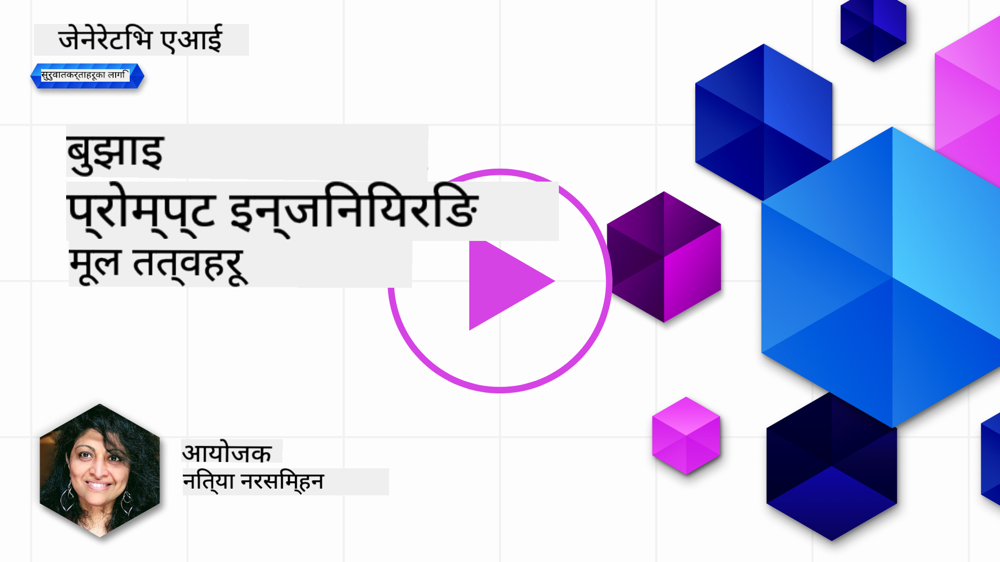
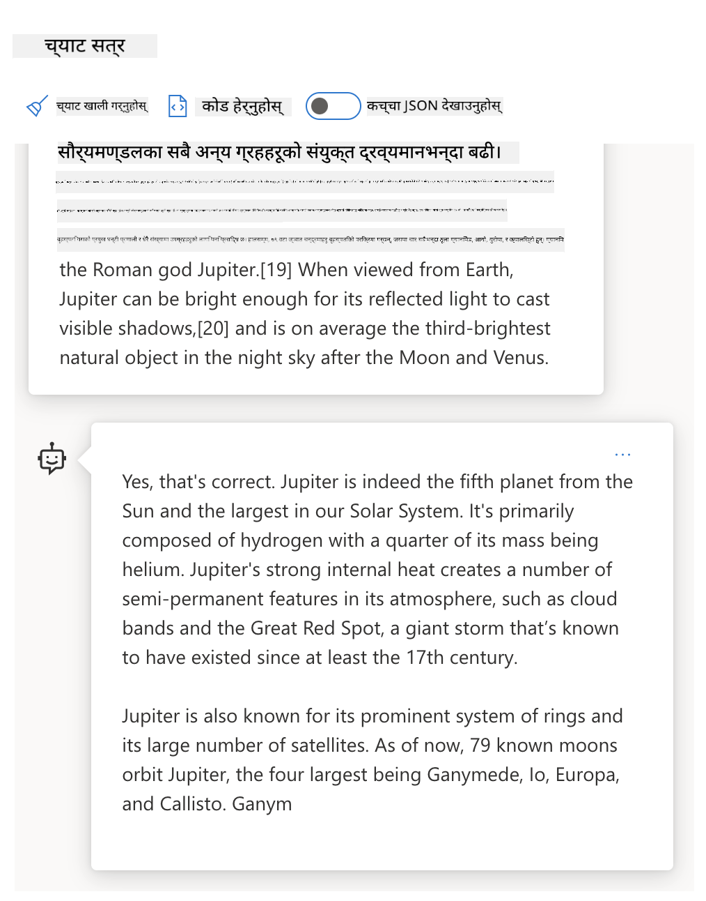
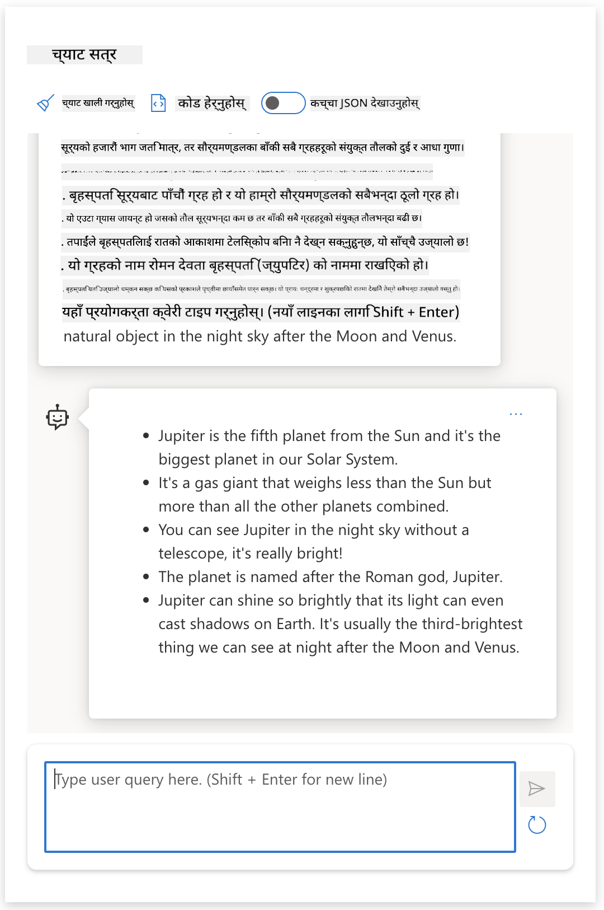
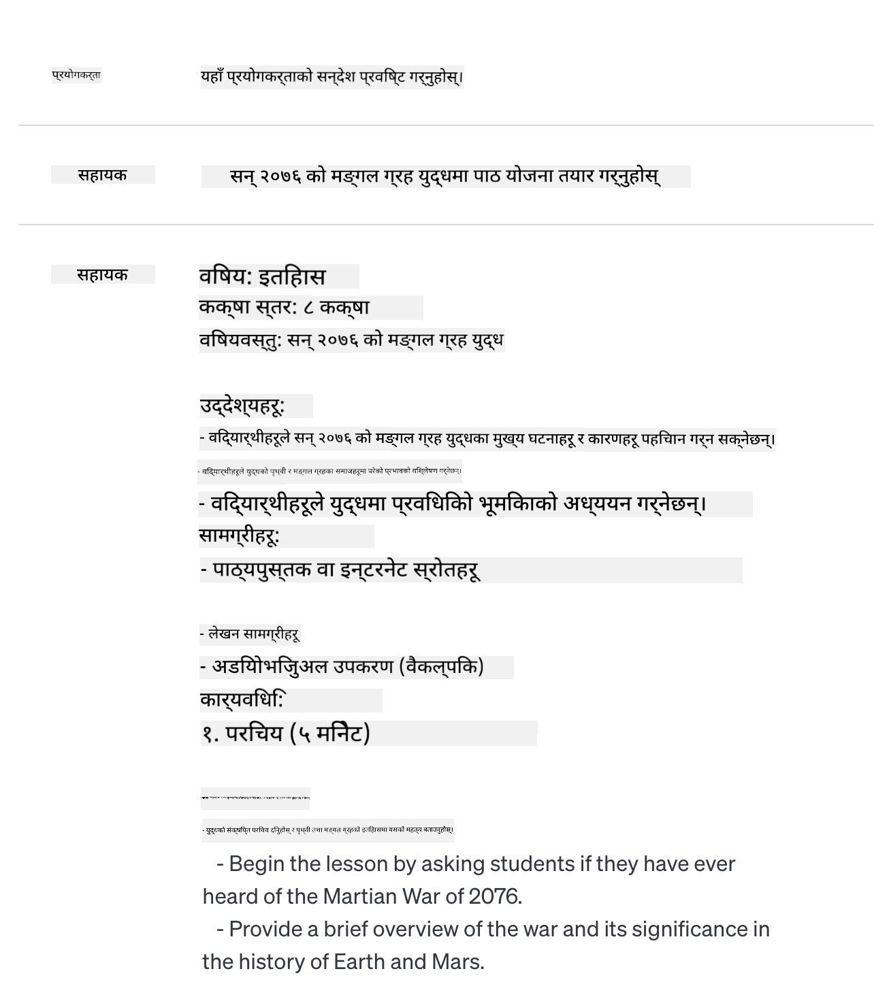

<!--
CO_OP_TRANSLATOR_METADATA:
{
  "original_hash": "dcbaaae026cb50fee071e690685b5843",
  "translation_date": "2025-08-26T15:57:00+00:00",
  "source_file": "04-prompt-engineering-fundamentals/README.md",
  "language_code": "ne"
}
-->
# प्रम्प्ट इन्जिनियरिङका आधारभूत कुरा

[](https://aka.ms/gen-ai-lesson4-gh?WT.mc_id=academic-105485-koreyst)

## परिचय
यो मोड्युलले जेनेरेटिभ एआई मोडेलहरूमा प्रभावकारी प्रम्प्टहरू बनाउने आवश्यक अवधारणा र प्रविधिहरू समेट्छ। तपाईंले LLM लाई लेख्ने प्रम्प्टको तरिका पनि महत्त्वपूर्ण हुन्छ। ध्यानपूर्वक तयार गरिएको प्रम्प्टले अझ राम्रो गुणस्तरको प्रतिक्रिया ल्याउन सक्छ। तर _प्रम्प्ट_ र _प्रम्प्ट इन्जिनियरिङ_ जस्ता शब्दहरूको अर्थ के हो त? अनि मैले LLM लाई पठाउने प्रम्प्ट _इनपुट_ कसरी सुधार्न सक्छु? यी प्रश्नहरूको उत्तर यस अध्याय र अर्कोमा खोज्नेछौं।

_जेनेरेटिभ एआई_ ले प्रयोगकर्ताको अनुरोधमा नयाँ सामग्री (जस्तै, पाठ, चित्र, अडियो, कोड आदि) सिर्जना गर्न सक्छ। यसले OpenAI को GPT ("Generative Pre-trained Transformer") जस्ता _ठूला भाषा मोडेल_ प्रयोग गर्छ, जुन प्राकृतिक भाषा र कोडमा तालिम दिइएको हुन्छ।

अब प्रयोगकर्ताहरूले कुनै प्राविधिक ज्ञान वा तालिम बिना नै च्याट जस्ता परिचित तरिकाबाट यी मोडेलहरूसँग अन्तरक्रिया गर्न सक्छन्। मोडेलहरू _प्रम्प्ट-आधारित_ छन् - प्रयोगकर्ताले पाठ इनपुट (प्रम्प्ट) पठाउँछन् र एआईको प्रतिक्रिया (completion) प्राप्त गर्छन्। त्यसपछि उनीहरूले "एआईसँग कुरा" गर्दै, बहुपल्ट संवादमा प्रम्प्टलाई परिमार्जन गर्न सक्छन्, जबसम्म प्रतिक्रिया चाहिएको जस्तो आउँदैन।

"प्रम्प्ट" अब जेनेरेटिभ एआई एप्सका मुख्य _प्रोग्रामिङ इन्टरफेस_ बनेका छन्, जसले मोडेललाई के गर्न भन्ने बताउँछन् र फर्किएको प्रतिक्रियाको गुणस्तरमा प्रभाव पार्छन्। "प्रम्प्ट इन्जिनियरिङ" तीव्र गतिमा बढिरहेको अध्ययन क्षेत्र हो, जसले _प्रम्प्टको डिजाइन र अनुकूलन_ मा ध्यान दिन्छ, ताकि ठूलो मात्रामा स्थिर र गुणस्तरीय प्रतिक्रिया प्राप्त गर्न सकियोस्।

## सिकाइका उद्देश्यहरू

यस पाठमा, हामी प्रम्प्ट इन्जिनियरिङ के हो, किन महत्त्वपूर्ण छ, र कसरी कुनै मोडेल वा एप्लिकेसन उद्देश्यका लागि अझ प्रभावकारी प्रम्प्टहरू तयार गर्न सकिन्छ भन्ने कुरा सिक्नेछौं। हामी प्रम्प्ट इन्जिनियरिङका मुख्य अवधारणा र उत्तम अभ्यासहरू बुझ्नेछौं - अनि यी अवधारणाहरूलाई वास्तविक उदाहरणमा कसरी प्रयोग गर्न सकिन्छ भन्ने देखाउने अन्तरक्रियात्मक Jupyter Notebook "sandbox" वातावरणबारे पनि जान्नेछौं।

यो पाठको अन्त्यमा हामीले:

1. प्रम्प्ट इन्जिनियरिङ के हो र किन महत्त्वपूर्ण छ भन्ने व्याख्या गर्न सक्नेछौं।
2. प्रम्प्टका घटकहरू के हुन् र तिनीहरू कसरी प्रयोग गरिन्छन् भन्ने वर्णन गर्न सक्नेछौं।
3. प्रम्प्ट इन्जिनियरिङका उत्तम अभ्यास र प्रविधिहरू सिक्नेछौं।
4. सिकिएका प्रविधिहरूलाई वास्तविक उदाहरणमा प्रयोग गर्न सक्नेछौं, OpenAI endpoint प्रयोग गरेर।

## मुख्य शब्दहरू

Prompt Engineering: एआई मोडेललाई चाहिएको नतिजातर्फ निर्देशित गर्न इनपुट डिजाइन र परिमार्जन गर्ने अभ्यास।
Tokenization: पाठलाई साना इकाइहरूमा, जसलाई टोकन भनिन्छ, रूपान्तरण गर्ने प्रक्रिया, जुन मोडेलले बुझ्न र प्रक्रिया गर्न सक्छ।
Instruction-Tuned LLMs: ठूला भाषा मोडेलहरू (LLMs) जसलाई विशेष निर्देशनसहित परिमार्जन गरिएको छ, ताकि तिनीहरूको प्रतिक्रिया अझ सटीक र सान्दर्भिक होस्।

## सिकाइ Sandbox

प्रम्प्ट इन्जिनियरिङ अहिले विज्ञानभन्दा बढी कला हो। यसमा हाम्रो बुझाइ सुधार्ने सबैभन्दा राम्रो तरिका _अधिक अभ्यास_ गर्नु र परीक्षण-त्रुटि विधि अपनाउनु हो, जसमा एप्लिकेसन डोमेनको विशेषज्ञता, सिफारिस गरिएका प्रविधिहरू, र मोडेल-विशिष्ट अनुकूलनहरू मिसिन्छन्।

यस पाठसँगै आएको Jupyter Notebook ले _sandbox_ वातावरण दिन्छ, जहाँ तपाईंले सिकेका कुरा अभ्यास गर्न सक्नुहुन्छ - सिक्दै जाँदा वा अन्त्यमा दिइएको कोड चुनौतीको रूपमा। अभ्यास गर्न तपाईंलाई चाहिन्छ:

1. **Azure OpenAI API key** - तैनाथ गरिएको LLM को सेवा endpoint।
2. **Python Runtime** - जसमा Notebook चलाउन सकिन्छ।
3. **Local Env Variables** - _[SETUP](./../00-course-setup/02-setup-local.md?WT.mc_id=academic-105485-koreyst) का चरणहरू पूरा गर्नुहोस्, तयारीका लागि_।

Notebook मा _starter_ अभ्यासहरू छन् - तर तपाईंलाई आफ्नै _Markdown_ (वर्णन) र _Code_ (प्रम्प्ट अनुरोध) खण्डहरू थप्न प्रोत्साहित गरिन्छ, ताकि थप उदाहरण वा विचारहरू प्रयास गर्न सकियोस् - अनि प्रम्प्ट डिजाइनको बुझाइ बनाइयोस्।

## चित्रमा आधारित गाइड

पाठ सुरु गर्नु अघि यसले के समेट्छ भन्ने ठूलो चित्र हेर्न चाहनुहुन्छ? यो चित्रमा आधारित गाइड हेर्नुहोस्, जसले मुख्य विषयवस्तु र प्रत्येकमा सोच्नुपर्ने मुख्य कुरा देखाउँछ। पाठको रोडम्यापले तपाईंलाई मुख्य अवधारणा र चुनौतीहरू बुझ्नदेखि तिनीहरूलाई प्रासंगिक प्रम्प्ट इन्जिनियरिङ प्रविधि र उत्तम अभ्यासले समाधान गर्नसम्म लैजान्छ। ध्यान दिनुहोस्, यस गाइडको "Advanced Techniques" खण्डमा उल्लेख गरिएका सामग्रीहरू _अर्को_ अध्यायमा समेटिएका छन्।


## हाम्रो स्टार्टअप

अब, _यो विषय_ हाम्रो स्टार्टअपको [शिक्षामा एआई नवप्रवर्तन ल्याउने](https://educationblog.microsoft.com/2023/06/collaborating-to-bring-ai-innovation-to-education?WT.mc_id=academic-105485-koreyst) लक्ष्यसँग कसरी सम्बन्धित छ भन्ने कुरा गरौं। हामी _व्यक्तिगत सिकाइ_ मा आधारित एआई एप्लिकेसन बनाउने चाहन्छौं - त्यसैले सोचौं, हाम्रो एप्लिकेसनका फरक प्रयोगकर्ताहरूले कसरी "प्रम्प्ट डिजाइन" गर्न सक्छन्:

- **प्रशासकहरू** ले एआईलाई _पाठ्यक्रम डाटाको विश्लेषण गरेर कभरेजमा भएका कमी पत्ता लगाउन_ भन्न सक्छन्। एआईले नतिजा संक्षेपमा दिन सक्छ वा कोडमार्फत दृश्यमा देखाउन सक्छ।
- **शिक्षकहरू** ले एआईलाई _लक्षित समूह र विषयका लागि पाठ योजना बनाउन_ भन्न सक्छन्। एआईले तोकिएको ढाँचामा व्यक्तिगत योजना तयार गर्न सक्छ।
- **विद्यार्थीहरू** ले एआईलाई _गाह्रो विषयमा ट्युटर गर्न_ भन्न सक्छन्। एआईले अब विद्यार्थीको स्तरअनुसार पाठ, संकेत, उदाहरणहरू दिन सक्छ।

यो त सतहको कुरा मात्र हो। [Prompts For Education](https://github.com/microsoft/prompts-for-edu/tree/main?WT.mc_id=academic-105485-koreyst) हेर्नुहोस् - शिक्षा विशेषज्ञहरूले तयार गरेको खुला स्रोत प्रम्प्ट लाइब्रेरी - ताकि सम्भावनाहरूको फराकिलो चित्र पाइयोस्! _sandbox वा OpenAI Playground मा ती प्रम्प्टहरू चलाएर के हुन्छ हेर्नुहोस्!_

<!--
LESSON TEMPLATE:
This unit should cover core concept #1.
Reinforce the concept with examples and references.

CONCEPT #1:
Prompt Engineering.
Define it and explain why it is needed.
-->

## प्रम्प्ट इन्जिनियरिङ के हो?

हामीले यो पाठ सुरु गर्दा **Prompt Engineering** लाई _प्रम्प्ट (पाठ इनपुट) डिजाइन र अनुकूलन_ गर्ने प्रक्रिया भनेर परिभाषित गरेका थियौं, ताकि कुनै एप्लिकेसन उद्देश्य र मोडेलका लागि स्थिर र गुणस्तरीय प्रतिक्रिया (completion) प्राप्त गर्न सकियोस्। यसलाई दुई चरणको प्रक्रिया मान्न सकिन्छ:

- दिइएको मोडेल र उद्देश्यका लागि प्रारम्भिक प्रम्प्ट _डिजाइन_ गर्ने
- प्रतिक्रिया सुधार गर्न प्रम्प्टलाई _पुनः परिमार्जन_ गर्दै जाने

यो अनिवार्य रूपमा परीक्षण-त्रुटि प्रक्रिया हो, जसमा प्रयोगकर्ताको बुझाइ र प्रयास चाहिन्छ, ताकि उत्तम नतिजा प्राप्त गर्न सकियोस्। तर किन यो महत्त्वपूर्ण छ? यसको उत्तर दिन, हामीले तीन अवधारणा बुझ्न आवश्यक छ:

- _Tokenization_ = मोडेलले प्रम्प्टलाई कसरी "हेर्छ"
- _Base LLMs_ = आधार मोडेलले प्रम्प्टलाई कसरी "प्रक्रिया" गर्छ
- _Instruction-Tuned LLMs_ = मोडेलले "कार्य" कसरी देख्न सक्छ

### Tokenization

LLM ले प्रम्प्टलाई _टोकनहरूको अनुक्रम_ को रूपमा हेर्छ, जहाँ फरक मोडेल (वा मोडेलका संस्करण) ले एउटै प्रम्प्टलाई फरक तरिकाले टोकनाइज गर्न सक्छ। LLM हरू टोकनमा तालिम दिइएका हुन्छन् (कच्चा पाठमा होइन), त्यसैले प्रम्प्ट कसरी टोकनाइज हुन्छ भन्ने कुरा उत्पन्न हुने प्रतिक्रियाको गुणस्तरमा प्रत्यक्ष असर गर्छ।

Tokenization कसरी काम गर्छ भन्ने बुझ्नका लागि [OpenAI Tokenizer](https://platform.openai.com/tokenizer?WT.mc_id=academic-105485-koreyst) जस्ता उपकरण प्रयास गर्नुहोस्। आफ्नो प्रम्प्ट टाँस्नुहोस् - अनि त्यो कसरी टोकनमा रूपान्तरण हुन्छ हेर्नुहोस्, खाली स्थान र विराम चिन्हहरू कसरी ह्यान्डल गरिन्छ ध्यान दिनुहोस्। यो उदाहरणमा पुरानो LLM (GPT-3) देखाइएको छ - नयाँ मोडेलमा फरक नतिजा आउन सक्छ।


### अवधारणा: Foundation Models

एक पटक प्रम्प्ट टोकनाइज भएपछि, ["Base LLM"](https://blog.gopenai.com/an-introduction-to-base-and-instruction-tuned-large-language-models-8de102c785a6?WT.mc_id=academic-105485-koreyst) (वा Foundation model) को मुख्य काम त्यो अनुक्रममा टोकनको भविष्यवाणी गर्नु हो। LLM हरू विशाल पाठ डेटासेटमा तालिम दिइएका हुन्छन्, त्यसैले टोकनहरूबीचको सांख्यिक सम्बन्ध राम्रोसँग बुझ्छन् र केही आत्मविश्वासका साथ भविष्यवाणी गर्न सक्छन्। ध्यान दिनुहोस्, तिनीहरूले प्रम्प्ट वा टोकनको _अर्थ_ बुझ्दैनन्; तिनीहरूले केवल एउटा ढाँचा देख्छन्, जसलाई "पूरा" गर्न अर्को भविष्यवाणी गर्छन्। प्रयोगकर्ताले रोक्ने वा कुनै पूर्वनिर्धारित सर्त पूरा नभएसम्म तिनीहरूले अनुक्रम भविष्यवाणी गर्न सक्छन्।

प्रम्प्ट-आधारित completion कसरी काम गर्छ हेर्न चाहनुहुन्छ? माथिको प्रम्प्ट Azure OpenAI Studio [_Chat Playground_](https://oai.azure.com/playground?WT.mc_id=academic-105485-koreyst) मा डिफल्ट सेटिङमा राख्नुहोस्। सिस्टमले प्रम्प्टलाई जानकारीको अनुरोधको रूपमा लिन्छ - त्यसैले तपाईंले सन्दर्भअनुसारको completion देख्नुहुनेछ।

तर प्रयोगकर्ताले कुनै विशेष मापदण्ड वा कार्य उद्देश्य पूरा भएको कुरा देख्न चाह्यो भने के हुन्छ? यही ठाउँमा _instruction-tuned_ LLM हरूको भूमिका आउँछ।



### अवधारणा: Instruction Tuned LLMs

[Instruction Tuned LLM](https://blog.gopenai.com/an-introduction-to-base-and-instruction-tuned-large-language-models-8de102c785a6?WT.mc_id=academic-105485-koreyst) ले foundation model बाट सुरु गर्छ र उदाहरण वा input/output जोडी (जस्तै, बहुपल्ट "messages") द्वारा परिमार्जन गरिन्छ, जसमा स्पष्ट निर्देशनहरू हुन्छन् - अनि एआईको प्रतिक्रिया ती निर्देशन पालना गर्न खोज्छ।

यसमा Reinforcement Learning with Human Feedback (RLHF) जस्ता प्रविधि प्रयोग गरिन्छ, जसले मोडेललाई _निर्देशन पालना_ गर्न र _प्रतिक्रिया बाट सिक्न_ तालिम दिन्छ, ताकि प्रतिक्रिया व्यवहारिक एप्लिकेसनका लागि उपयुक्त र प्रयोगकर्ताको उद्देश्यसँग सान्दर्भिक होस्।

अब प्रयास गरौं - माथिको प्रम्प्ट पुनः प्रयोग गर्नुहोस्, तर _system message_ मा तलको निर्देशन सन्दर्भका रूपमा राख्नुहोस्:

> _दिएको सामग्रीलाई दोस्रो कक्षाका विद्यार्थीका लागि संक्षेपमा लेख। नतिजा एक अनुच्छेदमा राख, ३-५ बुलेट पोइन्टसहित।_

अब नतिजा चाहिएको लक्ष्य र ढाँचामा मिलाइएको छ? शिक्षकले यो प्रतिक्रिया सिधै आफ्नो कक्षाका स्लाइडमा प्रयोग गर्न सक्छन्।



## किन प्रम्प्ट इन्जिनियरिङ आवश्यक छ?

अब हामीले प्रम्प्टहरू LLM ले कसरी प्रक्रिया गर्छ भन्ने बुझ्यौं, अब _किन_ प्रम्प्ट इन्जिनियरिङ आवश्यक छ भन्ने कुरा गरौं। यसको उत्तर यो हो कि अहिलेका LLM हरूमा केही चुनौतीहरू छन्, जसले _विश्वसनीय र स्थिर completion_ प्राप्त गर्न कठिन बनाउँछ, यदि प्रम्प्ट निर्माण र अनुकूलनमा ध्यान नदिइयो भने। उदाहरणका लागि:

1. **मोडेलको प्रतिक्रिया अनिश्चित हुन्छ।** _एउटै प्रम्प्ट_ ले फरक मोडेल वा मोडेल संस्करणमा फरक प्रतिक्रिया दिन सक्छ। अनि _एउटै मोडेल_ मा पनि फरक समयमा फरक नतिजा आउन सक्छ। _प्रम्प्ट इन्जिनियरिङ प्रविधिले यी भिन्नता कम गर्न मद्दत गर्छ, राम्रो गार्डरेल प्रदान गरेर_।

1. **मोडेलले गलत प्रतिक्रिया दिन सक्छ।** मोडेलहरू _ठूला तर सीमित_ डेटासेटमा तालिम दिइएका हुन्छन्, त्यसैले तालिम बाहिरका विषयमा ज्ञान हुँदैन। त्यसैले तिनीहरूले गलत, काल्पनिक, वा ज्ञात तथ्यसँग प्रत्यक्ष विरोधी completion दिन सक्छन्। _प्रम्प्ट इन्जिनियरिङ प्रविधिले प्रयोगकर्तालाई यस्ता गलत प्रतिक्रिया पत्ता लगाउन र न्यूनीकरण गर्न मद्दत गर्छ, जस्तै एआईलाई स्रोत वा तर्क माग्ने_।

1. **मोडेलको क्षमता फरक हुन्छ।** नयाँ मोडेल वा पुस्तामा थप क्षमता आउँछ, तर लागत र जटिलतामा अनौठा पक्ष र सन्तुलन पनि आउँछ। _प्रम्प्ट इन्जिनियरिङले उत्तम अभ्यास र कार्यप्रवाह विकास गर्न मद्दत गर्छ, जसले फरक मोडेलका आवश्यकतालाई सहज र स्केलेबल तरिकामा समेट्न सक्छ_।

OpenAI वा Azure OpenAI Playground मा यो व्यवहार हेर्नुहोस्:

- एउटै प्रम्प्ट फरक LLM तैनातीमा प्रयोग गर्नुहोस् (जस्तै, OpenAI, Azure OpenAI, Hugging Face) - के तपाईंले भिन्नता देख्नुभयो?
- एउटै प्रम्प्ट बारम्बार _एउटै_ LLM तैनातीमा प्रयोग गर्नुहोस् (जस्तै, Azure OpenAI playground) - यी भिन्नता कसरी फरक थिए?

### Fabrications Example

यस पाठमा, हामी **"fabrication"** शब्द प्रयोग गर्छौं, जब LLM हरूले कहिलेकाहीं तालिमको सीमितता वा अन्य कारणले तथ्यगत रूपमा गलत जानकारी उत्पन्न गर्छन्। तपाईंले यसलाई _"hallucinations"_ भनेर पनि सुन्नुभएको हुन सक्छ। तर, हामी _"fabrication"_ शब्द प्रयोग गर्न सिफारिस गर्छौं, ताकि मानवजस्तो व्यवहारलाई मेसिनको नतिजामा नजोडियोस्। यसले [Responsible AI guidelines](https://www.microsoft.com/ai/responsible-ai?WT.mc_id=academic-105485-koreyst) लाई पनि समर्थन गर्छ, किनभने केही सन्दर्भमा अन्य शब्द अपमानजनक वा समावेशी नहुन सक्छन्।

Fabrication कसरी काम गर्छ हेर्न चाहनुहुन्छ? एआईलाई तालिम डेटासेटमा नभएको विषयमा सामग्री बनाउन निर्देशन दिने प्रम्प्ट सोच्नुहोस्। उदाहरणका लागि - मैले यस्तो प्रम्प्ट प्रयास गरे:
# २०७६ को मङ्गल ग्रह युद्धबारे पाठ योजना

## उद्देश्यहरू
- विद्यार्थीहरूले २०७६ मा भएको मङ्गल ग्रह युद्धको मुख्य कारणहरू बुझ्न सकून्।
- युद्धका प्रमुख घटनाहरू र तिनको पृथ्वी तथा मङ्गल ग्रहमा परेको प्रभावको विश्लेषण गर्न सकून्।
- युद्धपछिको राजनीतिक, सामाजिक, र वैज्ञानिक परिवर्तनहरूबारे छलफल गर्न सकून्।

## परिचय
२०७६ मा मङ्गल ग्रहमा भएको युद्धले मानव सभ्यताको इतिहासमा ठूलो परिवर्तन ल्यायो। यस पाठमा हामी युद्धको पृष्ठभूमि, मुख्य पक्षहरू, घटनाक्रम, र दीर्घकालीन प्रभावहरूबारे अध्ययन गर्नेछौं।

## गतिविधिहरू

### १. पृष्ठभूमि अध्ययन
- विद्यार्थीहरूलाई मङ्गल ग्रहमा मानव बस्ती स्थापना र त्यसपछि बढेको तनावबारे जानकारी दिनुहोस्।
- मुख्य कारणहरू: स्रोतको अभाव, राजनीतिक असमझदारी, र प्रविधिको दुरुपयोग।

### २. घटनाक्रमको समयरेखा
- युद्ध सुरु हुने प्रमुख घटनाहरूको सूची बनाउने।
- विद्यार्थीहरूलाई समयरेखा बनाउन लगाउने, जसमार्फत उनीहरूले युद्धका मुख्य मोडहरू बुझ्न सकून्।

### ३. पक्षहरूको भूमिका
- पृथ्वीका सरकारहरू, मङ्गलका उपनिवेशवादी, र तेस्रो पक्ष (जस्तै, स्वतन्त्र वैज्ञानिक समूह) को भूमिका छलफल गर्नुहोस्।
- विद्यार्थीहरूलाई समूहमा विभाजन गरी प्रत्येक पक्षको दृष्टिकोण प्रस्तुत गर्न लगाउनुहोस्।

### ४. युद्धको प्रभाव
- युद्धपछिको सामाजिक, आर्थिक, र वैज्ञानिक परिवर्तनहरूबारे चर्चा गर्नुहोस्।
- विद्यार्थीहरूलाई युद्धले मानव अधिकार, प्रविधि, र अन्तरग्रह सम्बन्धमा ल्याएको परिवर्तनबारे लेख्न लगाउनुहोस्।

### ५. समापन र समीक्षा
- मुख्य सिकाइ बुँदाहरू दोहोर्याउनुहोस्।
- विद्यार्थीहरूलाई युद्धबाट के सिक्न सकिन्छ भन्नेबारे विचार गर्न प्रेरित गर्नुहोस्।

## गृहकार्य
- "२०७६ को मङ्गल ग्रह युद्धले भविष्यको अन्तरिक्ष अन्वेषणमा कस्तो प्रभाव पार्‍यो?" भन्ने शीर्षकमा निबन्ध लेख्नुहोस्।

## मूल्याङ्कन
- समयरेखा, समूह प्रस्तुति, र गृहकार्य निबन्धको आधारमा विद्यार्थीहरूको मूल्याङ्कन गर्नुहोस्।

## स्रोतहरू
- युद्धसम्बन्धी ऐतिहासिक दस्तावेजहरू
- अन्तरिक्ष अन्वेषणसम्बन्धी वैज्ञानिक लेखहरू
- युद्धपछिका सामाजिक परिवर्तनबारे अध्ययन सामग्री

## टिप्पणीहरू
- यो पाठ योजना काल्पनिक घटनामा आधारित छ। विद्यार्थीहरूलाई कल्पनाशील सोच र विश्लेषणात्मक क्षमता विकास गर्न प्रेरित गर्नुहोस्।
वेब खोज गर्दा मैले देखेँ कि मंगल ग्रहका युद्धहरूमा आधारित काल्पनिक कथाहरू (जस्तै, टेलिभिजन सिरिज वा पुस्तकहरू) त छन् - तर २०७६ मा कुनै छैनन्। सामान्य ज्ञानले पनि भन्छ कि २०७६ _भविष्य_ मा पर्छ, त्यसैले यो कुनै वास्तविक घटनासँग जोड्न सकिँदैन।

अब, जब हामी यो प्रॉम्प्ट विभिन्न LLM प्रदायकहरूसँग चलाउँछौं भने के हुन्छ?

> **Response 1**: OpenAI Playground (GPT-35)



> **Response 2**: Azure OpenAI Playground (GPT-35)


> **Response 3**: : Hugging Face Chat Playground (LLama-2)


अपेक्षा गरेजस्तै, प्रत्येक मोडेल (वा मोडेल संस्करण) ले थोरै फरक प्रतिक्रिया दिन्छ, जुन stochastic व्यवहार र मोडेल क्षमताका भिन्नताका कारण हो। उदाहरणका लागि, एउटा मोडेलले आठौं कक्षाका विद्यार्थीलाई लक्षित गर्छ भने अर्कोले उच्च विद्यालयका विद्यार्थीलाई लक्षित गर्छ। तर सबै तीनवटै मोडेलले यस्तो प्रतिक्रिया उत्पन्न गरे जसले अनविज्ञ प्रयोगकर्तालाई त्यो घटना साँच्चिकै भएको हो भन्ने विश्वास दिलाउन सक्छ।

_मेटाप्रॉम्प्टिङ_ र _टेम्परेचर कन्फिगरेसन_ जस्ता प्रॉम्प्ट इन्जिनियरिङ प्रविधिहरूले मोडेलका कपोकल्पित जवाफहरू केही हदसम्म घटाउन सक्छन्। नयाँ प्रॉम्प्ट इन्जिनियरिङ _आर्किटेक्चर_ हरूले पनि नयाँ उपकरण र प्रविधिहरूलाई प्रॉम्प्ट फ्लोमा सहजै समावेश गर्छन्, जसले यस्ता प्रभावहरू कम गर्न सहयोग गर्छ।

## केस स्टडी: GitHub Copilot

यस खण्डलाई समेट्नका लागि, प्रॉम्प्ट इन्जिनियरिङ कसरी वास्तविक समाधानहरूमा प्रयोग हुन्छ भन्ने बुझ्न एक केस स्टडी हेरौं: [GitHub Copilot](https://github.com/features/copilot?WT.mc_id=academic-105485-koreyst)।

GitHub Copilot तपाईंको "AI जोडी प्रोग्रामर" हो - यसले पाठ प्रॉम्प्टलाई कोड कम्प्लिसनमा रूपान्तरण गर्छ र तपाईंको विकास वातावरण (जस्तै, Visual Studio Code) मा एकीकृत हुन्छ, जसले प्रयोगकर्तालाई सहज अनुभव दिन्छ। तलका ब्लगहरूमा उल्लेख भएअनुसार, यसको प्रारम्भिक संस्करण OpenAI Codex मोडेलमा आधारित थियो - इन्जिनियरहरूले छिट्टै मोडेललाई फाइन-ट्युन गर्न र अझ राम्रो प्रॉम्प्ट इन्जिनियरिङ प्रविधिहरू विकास गर्न आवश्यक देखे, जसले कोडको गुणस्तर सुधार गर्न सहयोग गर्‍यो। जुलाईमा, उनीहरूले [Codex भन्दा अगाडि बढेको सुधारिएको AI मोडेल सार्वजनिक गरे](https://github.blog/2023-07-28-smarter-more-efficient-coding-github-copilot-goes-beyond-codex-with-improved-ai-model/?WT.mc_id=academic-105485-koreyst), जसले अझ छिटो सुझाव दिन्छ।

तिनीहरूको सिकाइ यात्रा पछ्याउन, यी पोस्टहरू क्रमशः पढ्नुहोस्।

- **मे २०२३** | [GitHub Copilot तपाईंको कोड बुझ्नमा अझ राम्रो हुँदैछ](https://github.blog/2023-05-17-how-github-copilot-is-getting-better-at-understanding-your-code/?WT.mc_id=academic-105485-koreyst)
- **मे २०२३** | [GitHub भित्र: GitHub Copilot पछाडिका LLM हरूसँग काम गर्दै](https://github.blog/2023-05-17-inside-github-working-with-the-llms-behind-github-copilot/?WT.mc_id=academic-105485-koreyst)
- **जुन २०२३** | [GitHub Copilot का लागि अझ राम्रो प्रॉम्प्ट कसरी लेख्ने](https://github.blog/2023-06-20-how-to-write-better-prompts-for-github-copilot/?WT.mc_id=academic-105485-koreyst)
- **जुलाई २०२३** | [.. GitHub Copilot सुधारिएको AI मोडेलसहित Codex भन्दा अगाडि बढ्यो](https://github.blog/2023-07-28-smarter-more-efficient-coding-github-copilot-goes-beyond-codex-with-improved-ai-model/?WT.mc_id=academic-105485-koreyst)
- **जुलाई २०२३** | [डेभलपरका लागि प्रॉम्प्ट इन्जिनियरिङ र LLMs को गाइड](https://github.blog/2023-07-17-prompt-engineering-guide-generative-ai-llms/?WT.mc_id=academic-105485-koreyst)
- **सेप्टेम्बर २०२३** | [एउटा इन्टरप्राइज LLM एप बनाउने तरिका: GitHub Copilot बाट सिकाइ](https://github.blog/2023-09-06-how-to-build-an-enterprise-llm-application-lessons-from-github-copilot/?WT.mc_id=academic-105485-koreyst)

तपाईंले उनीहरूको [इन्जिनियरिङ ब्लग](https://github.blog/category/engineering/?WT.mc_id=academic-105485-koreyst) पनि हेर्न सक्नुहुन्छ, जहाँ [यो पोस्ट](https://github.blog/2023-09-27-how-i-used-github-copilot-chat-to-build-a-reactjs-gallery-prototype/?WT.mc_id=academic-105485-koreyst) जस्ता थप उदाहरणहरू छन्, जसले देखाउँछ कि यी मोडेल र प्रविधिहरू कसरी _वास्तविक_ अनुप्रयोगहरूमा प्रयोग गरिन्छन्।

---

## प्रॉम्प्ट निर्माण

हामीले किन प्रॉम्प्ट इन्जिनियरिङ महत्त्वपूर्ण छ भन्ने देख्यौं - अब हेरौं, प्रॉम्प्टहरू कसरी _निर्माण_ गरिन्छन् ताकि हामी अझ प्रभावकारी प्रॉम्प्ट डिजाइनका लागि विभिन्न प्रविधिहरूको मूल्याङ्कन गर्न सकौं।

### आधारभूत प्रॉम्प्ट

सुरु गरौं आधारभूत प्रॉम्प्टबाट: मोडेललाई कुनै अन्य सन्दर्भ बिना पठाइएको पाठ इनपुट। यहाँ एउटा उदाहरण छ - जब हामी अमेरिकी राष्ट्रिय गानका पहिलो केही शब्दहरू OpenAI [Completion API](https://platform.openai.com/docs/api-reference/completions?WT.mc_id=academic-105485-koreyst) मा पठाउँछौं, यसले तुरुन्तै _पूरा_ जवाफ दिन्छ, जसले आधारभूत भविष्यवाणी व्यवहार देखाउँछ।

| प्रॉम्प्ट (इनपुट)     | कम्प्लिसन (आउटपुट)                                                                                                                        |
| :----------------- | :----------------------------------------------------------------------------------------------------------------------------------------- |
| Oh say can you see | तपाईंले "The Star-Spangled Banner," संयुक्त राज्य अमेरिकाको राष्ट्रिय गानका गीतहरू सुरु गर्नुभएको जस्तो लाग्छ। पूरा गीतहरू यसप्रकार छन् ... |

### जटिल प्रॉम्प्ट

अब त्यो आधारभूत प्रॉम्प्टमा सन्दर्भ र निर्देशन थपौं। [Chat Completion API](https://learn.microsoft.com/azure/ai-services/openai/how-to/chatgpt?WT.mc_id=academic-105485-koreyst) ले हामीलाई _सन्देश_ हरूको संग्रहको रूपमा जटिल प्रॉम्प्ट बनाउन दिन्छ:

- इनपुट/आउटपुट जोडीहरू, जसले _प्रयोगकर्ता_ इनपुट र _सहायक_ प्रतिक्रिया देखाउँछ।
- सिस्टम सन्देश, जसले सहायकको व्यवहार वा व्यक्तित्वको सन्दर्भ सेट गर्छ।

अब अनुरोध तलको जस्तो हुन्छ, जहाँ _tokenization_ ले सन्दर्भ र संवादबाट सान्दर्भिक जानकारी समेट्छ। अब, सिस्टम सन्दर्भ परिवर्तन गर्दा कम्प्लिसनको गुणस्तरमा प्रयोगकर्ता इनपुट जत्तिकै प्रभाव पर्न सक्छ।

```python
response = openai.chat.completions.create(
    model="gpt-3.5-turbo",
    messages=[
        {"role": "system", "content": "You are a helpful assistant."},
        {"role": "user", "content": "Who won the world series in 2020?"},
        {"role": "assistant", "content": "The Los Angeles Dodgers won the World Series in 2020."},
        {"role": "user", "content": "Where was it played?"}
    ]
)
```

### निर्देशन प्रॉम्प्ट

माथिका उदाहरणहरूमा, प्रयोगकर्ता प्रॉम्प्ट साधारण पाठ प्रश्न थियो, जसलाई जानकारीको अनुरोधको रूपमा बुझ्न सकिन्थ्यो। _निर्देशन_ प्रॉम्प्टहरूसँग, हामी त्यो पाठ प्रयोग गरेर कार्यलाई अझ विस्तारमा निर्दिष्ट गर्न सक्छौं, जसले AI लाई अझ राम्रो मार्गदर्शन दिन्छ। यहाँ एउटा उदाहरण छ:

| प्रॉम्प्ट (इनपुट)                                                                                                                                                                                                                         | कम्प्लिसन (आउटपुट)                                                                                                        | निर्देशन प्रकार    |
| :------------------------------------------------------------------------------------------------------------------------------------------------------------------------------------------------------------------------------------- | :------------------------------------------------------------------------------------------------------------------------- | :------------------ |
| Write a description of the Civil War                                                                                                                                                                                                   | _साधारण अनुच्छेद फर्काइयो_                                                                                              | साधारण              |
| Write a description of the Civil War. Provide key dates and events and describe their significance                                                                                                                                     | _अनुच्छेदपछि मुख्य घटनाका मिति र विवरणको सूची फर्काइयो_                                             | जटिल             |
| Write a description of the Civil War in 1 paragraph. Provide 3 bullet points with key dates and their significance. Provide 3 more bullet points with key historical figures and their contributions. Return the output as a JSON file | _थप विस्तृत विवरणहरू JSON स्वरूपमा फर्काइयो, जसलाई तपाईं फाइलमा कपी-पेस्ट गर्न सक्नुहुन्छ र आवश्यक परे जाँच गर्न सक्नुहुन्छ_ | जटिल। स्वरूपित। |

## मुख्य सामग्री

माथिका उदाहरणहरूमा, प्रॉम्प्ट अझै खुल्ला थियो, जसले LLM लाई यसको प्रि-ट्रेन गरिएको डेटासेटको कुन भाग सान्दर्भिक छ भन्ने निर्णय गर्न दिन्थ्यो। _मुख्य सामग्री_ डिजाइन ढाँचासँग, इनपुट पाठ दुई भागमा विभाजन गरिन्छ:

- निर्देशन (कार्य)
- सान्दर्भिक सामग्री (जसले कार्यलाई प्रभाव पार्छ)

यहाँ एउटा उदाहरण छ, जहाँ निर्देशन छ "यसलाई २ वाक्यमा संक्षेप गर्नुहोस्"।

| प्रॉम्प्ट (इनपुट)                                                                                                                                                                                                                                                                                                                                                                                                                                                                                                                                                                                                                                                                                      | कम्प्लिसन (आउटपुट)                                                                                                                                                                                                                                                                             |
| :-------------------------------------------------------------------------------------------------------------------------------------------------------------------------------------------------------------------------------------------------------------------------------------------------------------------------------------------------------------------------------------------------------------------------------------------------------------------------------------------------------------------------------------------------------------------------------------------------------------------------------------------------------------------------------------------------- | :---------------------------------------------------------------------------------------------------------------------------------------------------------------------------------------------------------------------------------------------------------------------------------------------- |
| Jupiter is the fifth planet from the Sun and the largest in the Solar System. It is a gas giant with a mass one-thousandth that of the Sun, but two-and-a-half times that of all the other planets in the Solar System combined. Jupiter is one of the brightest objects visible to the naked eye in the night sky, and has been known to ancient civilizations since before recorded history. It is named after the Roman god Jupiter.[19] When viewed from Earth, Jupiter can be bright enough for its reflected light to cast visible shadows,[20] and is on average the third-brightest natural object in the night sky after the Moon and Venus. <br/> **Summarize this in 2 short sentences** | Jupiter, सूर्यबाट पाँचौं ग्रह, सौर्यमण्डलको सबैभन्दा ठूलो ग्रह हो र रातको आकाशमा देखिने सबैभन्दा चम्किला वस्तुहरूमध्ये एक हो। रोमन देवता Jupiter को नाममा राखिएको यो ग्यास जायन्टको द्रव्यमान सौर्यमण्डलका अन्य सबै ग्रहहरूको जम्मा द्रव्यमानको दुई र आधा गुणा छ। |

मुख्य सामग्री खण्डलाई अझ प्रभावकारी निर्देशनका लागि विभिन्न तरिकामा प्रयोग गर्न सकिन्छ:

- **उदाहरणहरू** - मोडेललाई के गर्न निर्देशन दिने सट्टा, के गर्नुपर्नेका केही उदाहरणहरू दिनुहोस् र उसलाई ढाँचा आफैं बुझ्न दिनुहोस्।
- **संकेतहरू (Cues)** - निर्देशनपछि "संकेत" राख्नुहोस्, जसले कम्प्लिसनलाई प्रारम्भिक दिशा दिन्छ र मोडेललाई अझ सान्दर्भिक जवाफतर्फ डोर्याउँछ।
- **टेम्प्लेटहरू** - यी दोहोर्याउन मिल्ने 'रेसिपी' हरू हुन्, जसमा प्लेसहोल्डर (भेरिएबल) हुन्छन्, जसलाई विशेष प्रयोजनका लागि डेटा राखेर अनुकूलन गर्न सकिन्छ।

अब यी प्रविधिहरू व्यवहारमा हेरौं।

### उदाहरणहरू प्रयोग गर्दै

यो प्रविधिमा तपाईं मुख्य सामग्री प्रयोग गरेर मोडेललाई चाहिएको आउटपुटका केही उदाहरणहरू "खुवाउनुहुन्छ", र उसलाई चाहिएको ढाँचा आफैं बुझ्न दिनुहुन्छ। दिइएका उदाहरणहरूको संख्याका आधारमा, हामीसँग zero-shot prompting, one-shot prompting, few-shot prompting आदि हुन सक्छ।

अब प्रॉम्प्टमा तीनवटा भाग हुन्छन्:

- कार्यको वर्णन
- चाहिएको आउटपुटका केही उदाहरणहरू
- नयाँ उदाहरणको सुरुवात (जसले अप्रत्यक्ष रूपमा कार्यको वर्णन गर्छ)

| सिकाइ प्रकार | प्रॉम्प्ट (इनपुट)                                                                                                                                        | कम्प्लिसन (आउटपुट)         |
| :------------ | :---------------------------------------------------------------------------------------------------------------------------------------------------- | :-------------------------- |
| Zero-shot     | "The Sun is Shining". Translate to Spanish                                                                                                            | "El Sol está brillando".    |
| One-shot      | "The Sun is Shining" => ""El Sol está brillando". <br> "It's a Cold and Windy Day" =>                                                                 | "Es un día frío y ventoso". |
| Few-shot      | The player ran the bases => Baseball <br/> The player hit an ace => Tennis <br/> The player hit a six => Cricket <br/> The player made a slam-dunk => | Basketball                  |
|               |                                                                                                                                                       |                             |

Zero-shot prompting मा हामीले स्पष्ट निर्देशन ("Translate to Spanish") दिनुपर्‍यो, तर one-shot prompting मा त्यो निर्देशन आफैं बुझिन्छ। Few-shot उदाहरणमा, थप उदाहरणहरू दिँदा मोडेलले कुनै थप निर्देशन बिना नै अझ सही अनुमान गर्न सक्छ।

### प्रॉम्प्ट संकेतहरू (Cues)

मुख्य सामग्री प्रयोग गर्ने अर्को प्रविधि _संकेत_ दिनु हो। यस अवस्थामा, हामी मोडेललाई चाहिएको जवाफको ढाँचामा _सुरु_ गरेर सानो संकेत दिन्छौं। त्यसपछि मोडेलले त्यो संकेत समातेर त्यसै ढाँचामा जवाफ दिन्छ।

| संकेतको संख्या | प्रॉम्प्ट (इनपुट)                                                                                                                                                                                                                                                                                                                                                                                                                                               | कम्प्लिसन (आउटपुट)                                                                                                                                                                                                                                                                                       |
| :------------- | :----------------------------------------------------------------------------------------------------------------------------------------------------------------------------------------------------------------------------------------------------------------------------------------------------------------------------------------------------------------------------------------------------------------------------------------------------------- | :-------------------------------------------------------------------------------------------------------------------------------------------------------------------------------------------------------------------------------------------------------------------------------------------------------- |
| 0              | Jupiter is the fifth planet from the Sun and the largest in the Solar System. It is a gas giant with a mass one-thousandth that of the Sun, but two-and-a-half times that of all the other planets in the Solar System combined. Jupiter is one of the brightest objects visible to the naked eye in the night sky, and has been known to ancient civilizations since before recorded history.

**यसलाई संक्षेपमा भन्नुहोस्**                                       | बृहस्पति हाम्रो सौर्यमण्डलको सबैभन्दा ठूलो ग्रह हो र सूर्यबाट पाँचौं स्थानमा छ। यो ग्यास दानव हो जसको द्रव्यमान सूर्यको १/१००० भाग छ, तर सबै अन्य ग्रहहरूको संयुक्त द्रव्यमानभन्दा भारी छ। प्राचीन सभ्यताहरूले बृहस्पतिलाई धेरै पहिले देखेका थिए, र यो रातको आकाशमा सजिलै देख्न सकिन्छ। |
| १              | बृहस्पति सूर्यबाट पाँचौं ग्रह हो र सौर्यमण्डलको सबैभन्दा ठूलो ग्रह हो। यो ग्यास दानव हो जसको द्रव्यमान सूर्यको एक हजारौं भाग छ, तर सौर्यमण्डलका अन्य सबै ग्रहहरूको संयुक्त द्रव्यमानभन्दा दुई र आधा गुणा बढी छ। बृहस्पति रातको आकाशमा नाङ्गो आँखाले देख्न सकिने सबैभन्दा चम्किलो वस्तुहरूमध्ये एक हो, र प्राचीन सभ्यताहरूले यसलाई इतिहास लेखिनु अघि नै चिनेका थिए। <br/>**यसलाई संक्षेपमा भन्नुहोस्** <br/> हामीले के सिक्यौं भने बृहस्पति | सूर्यबाट पाँचौं ग्रह हो र सौर्यमण्डलको सबैभन्दा ठूलो ग्रह हो। यो ग्यास दानव हो जसको द्रव्यमान सूर्यको एक हजारौं भाग छ, तर अन्य सबै ग्रहहरूको संयुक्त द्रव्यमानभन्दा दुई र आधा गुणा बढी छ। यो नाङ्गो आँखाले सजिलै देख्न सकिन्छ र प्राचीन समयदेखि नै चिनिएको छ।                        |
| २              | बृहस्पति सूर्यबाट पाँचौं ग्रह हो र सौर्यमण्डलको सबैभन्दा ठूलो ग्रह हो। यो ग्यास दानव हो जसको द्रव्यमान सूर्यको एक हजारौं भाग छ, तर सौर्यमण्डलका अन्य सबै ग्रहहरूको संयुक्त द्रव्यमानभन्दा दुई र आधा गुणा बढी छ। बृहस्पति रातको आकाशमा नाङ्गो आँखाले देख्न सकिने सबैभन्दा चम्किलो वस्तुहरूमध्ये एक हो, र प्राचीन सभ्यताहरूले यसलाई इतिहास लेखिनु अघि नै चिनेका थिए। <br/>**यसलाई संक्षेपमा भन्नुहोस्** <br/> हामीले सिकेका शीर्ष ३ तथ्यहरू:         | १. बृहस्पति सूर्यबाट पाँचौं ग्रह हो र सौर्यमण्डलको सबैभन्दा ठूलो ग्रह हो। <br/> २. यो ग्यास दानव हो जसको द्रव्यमान सूर्यको एक हजारौं भाग छ...<br/> ३. बृहस्पति प्राचीन समयदेखि नै नाङ्गो आँखाले देख्न सकिन्छ ...                                                                       |
|                |                                                                                                                                                                                                                                                                                                                                                                                                                                                              |                                                                                                                                                                                                                                                                                                           |

### प्रॉम्प्ट टेम्प्लेटहरू

प्रॉम्प्ट टेम्प्लेट भनेको _प्रि-डिफाइन गरिएको प्रॉम्प्टको विधि_ हो जुन आवश्यक पर्दा स्टोर र पुन: प्रयोग गर्न सकिन्छ, ताकि ठूलो स्तरमा प्रयोगकर्ताको अनुभवलाई अझ सुसंगत बनाउन सकियोस्। यसको सबैभन्दा साधारण रूपमा, यो [OpenAI को यो उदाहरण](https://platform.openai.com/examples?WT.mc_id=academic-105485-koreyst) जस्तै प्रॉम्प्ट उदाहरणहरूको संग्रह हो जसले अन्तरक्रियात्मक प्रॉम्प्ट कम्पोनेन्टहरू (user र system सन्देशहरू) र API-आधारित अनुरोध ढाँचा दुवै प्रदान गर्छ - पुन: प्रयोगको लागि।

यसको अझ जटिल रूपमा, [LangChain को यो उदाहरण](https://python.langchain.com/docs/concepts/prompt_templates/?WT.mc_id=academic-105485-koreyst) जस्तै, यसमा _placeholder_ हरू हुन्छन् जसलाई विभिन्न स्रोतहरू (प्रयोगकर्ता इनपुट, सिस्टम सन्दर्भ, बाह्य डेटा स्रोत आदि) बाट डेटा राखेर प्रॉम्प्टलाई गतिशील रूपमा तयार गर्न सकिन्छ। यसले हामीलाई पुन: प्रयोग गर्न मिल्ने प्रॉम्प्टहरूको लाइब्रेरी बनाउन मद्दत गर्छ, जसले ठूलो स्तरमा प्रयोगकर्ताको अनुभवलाई **प्रोग्रामेटिक रूपमा** चलाउन सकिन्छ।

अन्ततः, टेम्प्लेटहरूको वास्तविक मूल्य भनेको _प्रॉम्प्ट लाइब्रेरी_ बनाउने क्षमतामा छ - जहाँ प्रॉम्प्ट टेम्प्लेट अब _अनुप्रयोग-विशिष्ट सन्दर्भ_ वा उदाहरणहरूमा अनुकूलित हुन्छ, जसले लक्षित प्रयोगकर्ता समूहका लागि उत्तरहरू अझ सान्दर्भिक र ठ्याक्कै बनाउँछ। [Prompts For Edu](https://github.com/microsoft/prompts-for-edu?WT.mc_id=academic-105485-koreyst) रेपो यसको राम्रो उदाहरण हो, जसले शिक्षा क्षेत्रका लागि पाठ योजना, पाठ्यक्रम डिजाइन, विद्यार्थी ट्युटरिङ आदि जस्ता मुख्य उद्देश्यहरूमा जोड दिएर प्रॉम्प्टहरूको लाइब्रेरी तयार गरेको छ।

## सहायक सामग्री

यदि हामी प्रॉम्प्ट निर्माणलाई निर्देशन (कार्य) र लक्ष्य (मुख्य सामग्री) भएको रूपमा सोचौं भने, _द्वितीयक सामग्री_ भनेको हामीले **आउटपुटमा कुनै असर पार्न** थप सन्दर्भ दिनु हो। यो ट्युनिङ प्यारामिटर, ढाँचा निर्देशन, विषय वर्गीकरण आदि हुन सक्छ जसले मोडेललाई _उत्तरलाई_ प्रयोगकर्ताको उद्देश्य वा अपेक्षाअनुसार _अनुकूल_ बनाउन मद्दत गर्छ।

उदाहरणका लागि: यदि पाठ्यक्रम सूचीमा सबै उपलब्ध पाठ्यक्रमहरूको विस्तृत मेटाडाटा (नाम, विवरण, स्तर, मेटाडाटा ट्याग, प्रशिक्षक आदि) छ भने:

- हामी "Fall 2023 का लागि पाठ्यक्रम सूची संक्षेपमा देऊ" भन्ने निर्देशन दिन सक्छौं
- मुख्य सामग्रीमा चाहिएको आउटपुटका केही उदाहरणहरू दिन सक्छौं
- द्वितीयक सामग्रीमा चासोका शीर्ष ५ "ट्याग" पहिचान गर्न सक्छौं

अब, मोडेलले केही उदाहरणमा देखिएको ढाँचामा संक्षेप दिन सक्छ - तर यदि कुनै नतिजामा धेरै ट्याग छन् भने, द्वितीयक सामग्रीमा पहिचान गरिएका ५ ट्यागलाई प्राथमिकता दिन सक्छ।

---

<!--
पाठ टेम्प्लेट:
यो इकाइले मुख्य अवधारणा #१ समेट्नुपर्छ।
उदाहरण र सन्दर्भहरूद्वारा अवधारणालाई बलियो बनाउनुहोस्।

अवधारणा #३:
प्रॉम्प्ट इन्जिनियरिङ प्रविधिहरू।
प्रॉम्प्ट इन्जिनियरिङका के आधारभूत प्रविधिहरू छन्?
केही अभ्यासहरूद्वारा देखाउनुहोस्।
-->

## प्रॉम्प्टिङका उत्कृष्ट अभ्यासहरू

अब हामीलाई थाहा भयो कि प्रॉम्प्टहरू कसरी _निर्माण_ गर्न सकिन्छ, अब हामी कसरी _डिजाइन_ गर्ने भन्ने सोच्न सक्छौं ताकि उत्कृष्ट अभ्यासहरू समेट्न सकियोस्। हामी यसलाई दुई भागमा सोच्न सक्छौं - सही _माइन्डसेट_ राख्नु र सही _प्रविधिहरू_ लागू गर्नु।

### प्रॉम्प्ट इन्जिनियरिङ माइन्डसेट

प्रॉम्प्ट इन्जिनियरिङ परीक्षण र त्रुटिको प्रक्रिया हो, त्यसैले तीन मुख्य मार्गदर्शक कुराहरू ध्यानमा राख्नुहोस्:

१. **क्षेत्रको बुझाइ महत्त्वपूर्ण छ।** उत्तरको शुद्धता र सान्दर्भिकता त्यो _क्षेत्र_ मा निर्भर गर्छ जहाँ अनुप्रयोग वा प्रयोगकर्ता काम गर्छ। आफ्नो अनुभव र क्षेत्रगत ज्ञान प्रयोग गरेर **प्रविधिहरूलाई अनुकूलित** गर्नुहोस्। उदाहरणका लागि, आफ्नो सिस्टम प्रॉम्प्टमा _क्षेत्र-विशिष्ट व्यक्तित्व_ परिभाषित गर्नुहोस्, वा प्रयोगकर्ता प्रॉम्प्टमा _क्षेत्र-विशिष्ट टेम्प्लेट_ प्रयोग गर्नुहोस्। द्वितीयक सामग्रीमा क्षेत्र-विशिष्ट सन्दर्भ समावेश गर्नुहोस्, वा _क्षेत्र-विशिष्ट संकेत र उदाहरण_ प्रयोग गरेर मोडेललाई परिचित प्रयोग ढाँचातर्फ डोर्याउनुहोस्।

२. **मोडेलको बुझाइ महत्त्वपूर्ण छ।** हामीलाई थाहा छ मोडेलहरू स्वभावतः अनिश्चित हुन्छन्। तर मोडेलको कार्यान्वयनमा तिनीहरूले प्रयोग गर्ने प्रशिक्षण डेटा (पूर्व-प्रशिक्षित ज्ञान), तिनीहरूले दिने क्षमता (जस्तै API वा SDK मार्फत) र तिनीहरू कुन प्रकारको सामग्रीका लागि अनुकूलित छन् (जस्तै, कोड, चित्र, वा पाठ) फरक हुन सक्छ। तपाईंले प्रयोग गरिरहनु भएको मोडेलको बलियो पक्ष र सीमाहरू बुझ्नुहोस्, र त्यो ज्ञान प्रयोग गरेर _कार्यहरूलाई प्राथमिकता_ दिनुहोस् वा _अनुकूलित टेम्प्लेट_ बनाउनुहोस् जुन मोडेलको क्षमताका लागि उपयुक्त छन्।

३. **पुनरावृत्ति र प्रमाणीकरण महत्त्वपूर्ण छ।** मोडेलहरू छिटो परिवर्तन भइरहेका छन्, र प्रॉम्प्ट इन्जिनियरिङका प्रविधिहरू पनि। क्षेत्रगत विशेषज्ञको रूपमा, तपाईंको अनुप्रयोगका लागि अन्य सन्दर्भ वा मापदण्ड हुन सक्छन्, जुन सबैका लागि लागू नहुन सक्छ। प्रॉम्प्ट इन्जिनियरिङका उपकरण र प्रविधिहरू प्रयोग गरेर प्रॉम्प्ट निर्माण "सुरु" गर्नुहोस्, त्यसपछि आफ्नै अनुभव र क्षेत्रगत ज्ञान प्रयोग गरेर नतिजा पुनरावृत्ति र प्रमाणीकरण गर्नुहोस्। आफ्नो अनुभव र ज्ञान अभिलेख राख्नुहोस् र **ज्ञानको आधार** (जस्तै, प्रॉम्प्ट लाइब्रेरीहरू) बनाउनुहोस्, जसले अरूलाई छिटो पुनरावृत्तिका लागि नयाँ आधार दिन सक्छ।

## उत्कृष्ट अभ्यासहरू

अब [OpenAI](https://help.openai.com/en/articles/6654000-best-practices-for-prompt-engineering-with-openai-api?WT.mc_id=academic-105485-koreyst) र [Azure OpenAI](https://learn.microsoft.com/azure/ai-services/openai/concepts/prompt-engineering#best-practices?WT.mc_id=academic-105485-koreyst) का विशेषज्ञहरूले सिफारिस गरेका सामान्य उत्कृष्ट अभ्यासहरू हेरौं।

| के                                | किन                                                                                                                                                                                                                                               |
| :-------------------------------- | :------------------------------------------------------------------------------------------------------------------------------------------------------------------------------------------------------------------------------------------------ |
| नयाँ मोडेलहरू मूल्याङ्कन गर्नुहोस्।       | नयाँ मोडेल पुस्ताहरूमा सम्भवतः सुधारिएको सुविधा र गुणस्तर हुन्छ - तर लागत पनि बढी हुन सक्छ। प्रभाव मूल्याङ्कन गर्नुहोस्, त्यसपछि माइग्रेशनको निर्णय गर्नुहोस्।                                                                                |
| निर्देशन र सन्दर्भ छुट्याउनुहोस्   | तपाईंको मोडेल/प्रदाता _delimiters_ प्रयोग गर्छ कि जाँच गर्नुहोस्, जसले निर्देशन, मुख्य र द्वितीयक सामग्रीलाई स्पष्ट छुट्याउन मद्दत गर्छ। यसले मोडेललाई टोकनहरूलाई सही तौल दिन मद्दत गर्छ।                                                         |
| स्पष्ट र विशेष हुनुहोस्             | चाहिएको सन्दर्भ, नतिजा, लम्बाइ, ढाँचा, शैली आदि बारेमा बढी विवरण दिनुहोस्। यसले उत्तरको गुणस्तर र स्थिरता दुवै सुधार गर्छ। विधिहरू पुन: प्रयोग गर्न मिल्ने टेम्प्लेटमा समेट्नुहोस्।                                                          |
| वर्णनात्मक हुनुहोस्, उदाहरण प्रयोग गर्नुहोस्      | मोडेलहरू "देखाउनुहोस् र भन्नुहोस्" शैलीमा राम्रो प्रतिक्रिया दिन सक्छन्। सुरुमा `zero-shot` विधि प्रयोग गर्नुहोस् जहाँ निर्देशन मात्र दिनुहुन्छ (तर उदाहरण छैन), त्यसपछि `few-shot` विधि प्रयोग गरेर चाहिएको आउटपुटका केही उदाहरणहरू दिनुहोस्। उपमा प्रयोग गर्नुहोस्। |
| संकेत प्रयोग गरेर उत्तर सुरु गराउनुहोस् | चाहिएको नतिजातर्फ डोर्याउन केही सुरुवाती शब्द वा वाक्यांश दिनुहोस्, जसलाई मोडेलले उत्तरको सुरुवातको रूपमा प्रयोग गर्न सक्छ।                                                                                                               |
| दोहोर्याउनुहोस्                       | कहिलेकाहीँ मोडेललाई निर्देशन दोहोर्याउनु आवश्यक हुन सक्छ। मुख्य सामग्री अघि र पछि निर्देशन दिनुहोस्, निर्देशन र संकेत दुवै प्रयोग गर्नुहोस् आदि। पुनरावृत्ति र प्रमाणीकरण गरेर के काम गर्छ हेर्नुहोस्।                                                         |
| क्रम महत्त्वपूर्ण छ                     | मोडेललाई जानकारी प्रस्तुत गर्ने क्रमले उत्तरमा असर पार्न सक्छ, उदाहरणमा पनि, किनभने हालसालको जानकारीलाई प्राथमिकता दिन सक्छ। विभिन्न विकल्प प्रयास गरेर के काम गर्छ हेर्नुहोस्।                                                               |
| मोडेललाई "बाहिर निस्कने बाटो" दिनुहोस्           | यदि कुनै कारणले कार्य पूरा गर्न सक्दैन भने मोडेललाई _fallback_ उत्तर दिन सक्ने विकल्प दिनुहोस्। यसले मोडेलले गलत वा बनावटी उत्तर दिने सम्भावना घटाउँछ।                                                         |
|                                   |                                                                                                                                                                                                                                                   |

जुनसुकै उत्कृष्ट अभ्यासमा, _तपाईंको अनुभव फरक हुन सक्छ_ मोडेल, कार्य र क्षेत्र अनुसार। यीलाई सुरुवातको बिन्दुका रूपमा प्रयोग गर्नुहोस्, र आफूलाई उपयुक्त के काम गर्छ पत्ता लगाउन पुनरावृत्ति गर्नुहोस्। नयाँ मोडेल र उपकरण उपलब्ध हुँदै जाँदा आफ्नो प्रॉम्प्ट इन्जिनियरिङ प्रक्रिया निरन्तर पुनरावलोकन गर्नुहोस्, प्रक्रिया विस्तार र उत्तरको गुणस्तरमा ध्यान दिनुहोस्।

<!--
पाठ टेम्प्लेट:
यदि लागू हुन्छ भने, यो इकाइले कोड चुनौती समेट्नुपर्छ

चुनौती:
Jupyter Notebook मा कोड टिप्पणी मात्र निर्देशनमा राखिएको छ (कोड खण्डहरू खाली छन्)।

समाधान:
त्यो Notebook को प्रतिलिपिमा प्रॉम्प्टहरू भरेर चलाइएको उदाहरण देखाउने लिंक।

-->

## असाइनमेन्ट

बधाई छ! तपाईं पाठको अन्त्यमा पुग्नुभयो! अब ती अवधारणा र प्रविधिहरूलाई वास्तविक उदाहरणमा प्रयोग गरेर परीक्षण गर्ने समय आएको छ!

हाम्रो असाइनमेन्टका लागि, तपाईंले Jupyter Notebook प्रयोग गर्नुहुनेछ, जहाँ अभ्यासहरू अन्तरक्रियात्मक रूपमा गर्न सक्नुहुन्छ। तपाईंले आफ्नै Markdown र Code सेल थपेर आफ्नै विचार र प्रविधिहरू पनि अन्वेषण गर्न सक्नुहुन्छ।

### सुरु गर्न, रेपो fork गर्नुहोस्, त्यसपछि

- (सिफारिस गरिएको) GitHub Codespaces सुरु गर्नुहोस्
- (वैकल्पिक) रेपो आफ्नो स्थानीय उपकरणमा clone गरेर Docker Desktop मा प्रयोग गर्नुहोस्
- (वैकल्पिक) आफूलाई मनपर्ने Notebook रनटाइममा Notebook खोल्नुहोस्।

### त्यसपछि, आफ्नो environment variables सेट गर्नुहोस्

- रेपोको root मा रहेको `.env.copy` फाइललाई `.env` मा copy गर्नुहोस् र `AZURE_OPENAI_API_KEY`, `AZURE_OPENAI_ENDPOINT` र `AZURE_OPENAI_DEPLOYMENT` को मानहरू भर्नुहोस्। [Learning Sandbox section](../../../04-prompt-engineering-fundamentals/04-prompt-engineering-fundamentals) मा फर्केर सिक्न सक्नुहुन्छ।

### त्यसपछि, Jupyter Notebook खोल्नुहोस्

- रनटाइम kernel चयन गर्नुहोस्। विकल्प १ वा २ प्रयोग गर्दा, dev container ले दिएको default Python 3.10.x kernel चयन गर्नुहोस्।

अब तपाईं अभ्यासहरू चलाउन तयार हुनुहुन्छ। यहाँ _सही वा गलत_ उत्तर छैनन् - केवल विकल्पहरू परीक्षण गरेर कुन मोडेल र अनुप्रयोग क्षेत्रमा के काम गर्छ भन्ने बुझाइ बनाउने हो।

_यस कारणले यो पाठमा Code Solution खण्डहरू छैनन्। यसको सट्टा, Notebook मा "My Solution:" शीर्षक भएका Markdown सेलहरू हुनेछन्, जसले सन्दर्भका लागि एउटा उदाहरण उत्तर देखाउँछन्।_

 <!--
पाठ टेम्प्लेट:
सेक्शनलाई संक्षेप र आत्म-शिक्षाका स्रोतहरूसँग समेट्नुहोस्।
-->

## ज्ञान जाँच

तलका कुन प्रॉम्प्टहरू केही उचित उत्कृष्ट अभ्यासहरू पालना गर्छन्?

१. Show me an image of red car
२. Show me an image of red car of make Volvo and model XC90 parked by a cliff with the sun setting
३. Show me an image of red car of make Volvo and model XC90

A: २, यो सबैभन्दा राम्रो प्रॉम्प्ट हो किनभने यसले "के" भन्नेमा विवरण दिन्छ र विशेषता (सिर्फ कुनै कार होइन, विशेष make र model) मा जान्छ, साथै समग्र परिवेश पनि वर्णन गर्छ। ३ दोस्रो राम्रो हो किनभने यसमा पनि धेरै विवरण छ।

## 🚀 चुनौती

"cue" प्रविधि प्रयोग गरेर यो प्रॉम्प्टमा प्रयोग गर्न सक्नुहुन्छ कि: Complete the sentence "Show me an image of red car of make Volvo and "। यसले के उत्तर दिन्छ, र तपाईंले यसलाई कसरी सुधार गर्नुहुन्छ?

## राम्रो काम! आफ्नो सिकाइ जारी राख्नुहोस्

Prompt Engineering का विभिन्न अवधारणाहरू थप जान्न चाहनुहुन्छ? [continued learning page](https://aka.ms/genai-collection?WT.mc_id=academic-105485-koreyst) मा जानुहोस्, जहाँ यस विषयमा अन्य उत्कृष्ट स्रोतहरू भेट्टाउन सक्नुहुन्छ।

पाठ ५ मा जानुहोस् जहाँ हामी [उन्नत प्रॉम्प्टिङ प्रविधिहरू](../05-advanced-prompts/README.md?WT.mc_id=academic-105485-koreyst) हेर्नेछौं!

---

**अस्वीकरण**:  
यो दस्तावेज़ AI अनुवाद सेवा [Co-op Translator](https://github.com/Azure/co-op-translator) प्रयोग गरी अनुवाद गरिएको हो। हामी शुद्धताको लागि प्रयास गर्छौं, तर कृपया ध्यान दिनुहोस् कि स्वचालित अनुवादमा त्रुटि वा अशुद्धता हुन सक्छ। मूल भाषामा रहेको दस्तावेज़लाई नै आधिकारिक स्रोत मान्नुपर्छ। महत्वपूर्ण जानकारीका लागि, व्यावसायिक मानव अनुवाद सिफारिस गरिन्छ। यस अनुवादको प्रयोगबाट उत्पन्न हुने कुनै पनि गलत बुझाइ वा व्याख्याका लागि हामी जिम्मेवार हुने छैनौं।