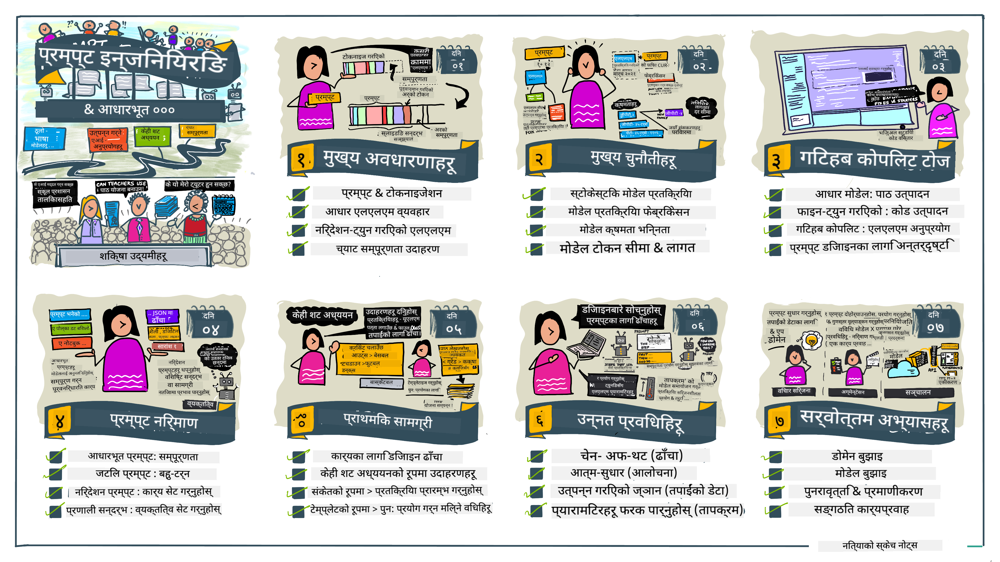

<!--
CO_OP_TRANSLATOR_METADATA:
{
  "original_hash": "8b3cb38518cf4fe7714d2f5e74dfa3eb",
  "translation_date": "2025-10-03T09:00:55+00:00",
  "source_file": "04-prompt-engineering-fundamentals/README.md",
  "language_code": "ne"
}
-->
# प्रम्प्ट इन्जिनियरिङको आधारभूत कुरा

[](https://aka.ms/gen-ai-lesson4-gh?WT.mc_id=academic-105485-koreyst)

## परिचय
यस मोड्युलले जेनेरेटिभ एआई मोडेलहरूमा प्रभावकारी प्रम्प्टहरू सिर्जना गर्न आवश्यक अवधारणाहरू र प्रविधिहरू समेट्छ। तपाईंले LLM लाई लेख्ने तरिका पनि महत्त्वपूर्ण हुन्छ। ध्यानपूर्वक तयार गरिएको प्रम्प्टले राम्रो गुणस्तरको प्रतिक्रिया प्राप्त गर्न सक्छ। तर _प्रम्प्ट_ र _प्रम्प्ट इन्जिनियरिङ_ जस्ता शब्दहरूको अर्थ के हो? र मैले LLM लाई पठाउने प्रम्प्ट _इनपुट_ कसरी सुधार गर्ने? यी प्रश्नहरूको उत्तर हामी यस अध्याय र अर्कोमा खोज्नेछौं।

_जेनेरेटिभ एआई_ नयाँ सामग्री (जस्तै, पाठ, छविहरू, अडियो, कोड आदि) सिर्जना गर्न सक्षम छ, प्रयोगकर्ताको अनुरोधको जवाफमा। यसले _लार्ज ल्याङ्ग्वेज मोडेलहरू_ जस्तै OpenAI को GPT ("Generative Pre-trained Transformer") श्रृंखला प्रयोग गरेर हासिल गर्दछ, जुन प्राकृतिक भाषा र कोड प्रयोग गर्न प्रशिक्षित गरिएको छ।

अब प्रयोगकर्ताहरूले कुनै पनि प्राविधिक विशेषज्ञता वा तालिम बिना परिचित संवाद शैलीहरू प्रयोग गरेर यी मोडेलहरूसँग अन्तरक्रिया गर्न सक्छन्। मोडेलहरू _प्रम्प्ट-आधारित_ छन् - प्रयोगकर्ताहरूले पाठ इनपुट (प्रम्प्ट) पठाउँछन् र एआई प्रतिक्रिया (completion) प्राप्त गर्छन्। त्यसपछि उनीहरूले "एआईसँग संवाद" पुनरावृत्त रूपमा गर्न सक्छन्, बहु-टर्न कुराकानीमा, प्रतिक्रिया अपेक्षासँग मेल खानेसम्म आफ्नो प्रम्प्ट परिमार्जन गर्दै।

"प्रम्प्टहरू" अब जेनेरेटिभ एआई एप्सको प्राथमिक _प्रोग्रामिङ इन्टरफेस_ बन्न पुगेका छन्, मोडेलहरूलाई के गर्नुपर्ने बताउँदै र फर्काइएको प्रतिक्रियाको गुणस्तरलाई प्रभाव पार्दै। "प्रम्प्ट इन्जिनियरिङ" एक छिटो बढ्दो अध्ययन क्षेत्र हो जसले _डिजाइन र अनुकूलन_ मा ध्यान केन्द्रित गर्दछ ताकि ठूलो मात्रामा स्थिर र गुणस्तरीय प्रतिक्रियाहरू प्रदान गर्न सकियोस्।

## सिकाइका लक्ष्यहरू

यस पाठमा, हामी प्रम्प्ट इन्जिनियरिङ के हो, किन यो महत्त्वपूर्ण छ, र कसरी हामी कुनै मोडेल र एप्लिकेसन उद्देश्यका लागि प्रभावकारी प्रम्प्टहरू तयार गर्न सक्छौं भन्ने कुरा सिक्नेछौं। हामी प्रम्प्ट इन्जिनियरिङका मुख्य अवधारणाहरू र उत्तम अभ्यासहरू बुझ्नेछौं - र वास्तविक उदाहरणहरूमा यी अवधारणाहरू लागू गरिएको देख्न सकिने एक अन्तरक्रियात्मक Jupyter Notebooks "sandbox" वातावरणको बारेमा सिक्नेछौं।

यस पाठको अन्त्यसम्ममा हामी सक्षम हुनेछौं:

1. प्रम्प्ट इन्जिनियरिङ के हो र किन यो महत्त्वपूर्ण छ भन्ने व्याख्या गर्न।
2. प्रम्प्टका घटकहरू वर्णन गर्न र तिनीहरू कसरी प्रयोग गरिन्छ भन्ने बुझ्न।
3. प्रम्प्ट इन्जिनियरिङका उत्तम अभ्यासहरू र प्रविधिहरू सिक्न।
4. सिकिएका प्रविधिहरूलाई वास्तविक उदाहरणहरूमा लागू गर्न, OpenAI endpoint प्रयोग गरेर।

## मुख्य शब्दावली

प्रम्प्ट इन्जिनियरिङ: एआई मोडेलहरूलाई इच्छित आउटपुट उत्पादन गर्न मार्गदर्शन गर्न इनपुटहरू डिजाइन र परिमार्जन गर्ने अभ्यास।
टोकनाइजेसन: पाठलाई साना इकाइहरूमा रूपान्तरण गर्ने प्रक्रिया, जसलाई टोकन भनिन्छ, जुन मोडेलले बुझ्न र प्रक्रिया गर्न सक्छ।
इन्स्ट्रक्सन-ट्युन गरिएको LLMs: ठूला भाषा मोडेलहरू (LLMs) जसलाई प्रतिक्रिया सटीकता र सान्दर्भिकता सुधार गर्न विशिष्ट निर्देशनहरूसँग परिमार्जन गरिएको छ।

## सिकाइको स्यान्डबक्स

प्रम्प्ट इन्जिनियरिङ हाल विज्ञानभन्दा बढी कला हो। यसमा हाम्रो अन्तर्ज्ञान सुधार गर्ने उत्तम तरिका भनेको _अधिक अभ्यास गर्नु_ र सिफारिस गरिएका प्रविधिहरू र मोडेल-विशिष्ट अनुकूलनहरूलाई एप्लिकेसन डोमेन विशेषज्ञता संग संयोजन गर्दै परीक्षण-त्रुटि दृष्टिकोण अपनाउनु हो।

यस पाठसँगको Jupyter Notebook ले _sandbox_ वातावरण प्रदान गर्दछ जहाँ तपाईंले सिकेको कुरा प्रयास गर्न सक्नुहुन्छ - तपाईंको सिकाइको क्रममा वा अन्त्यमा कोड चुनौतीको रूपमा। अभ्यासहरू कार्यान्वयन गर्नका लागि, तपाईंलाई आवश्यक हुनेछ:

1. **Azure OpenAI API key** - परिनियोजित LLM को सेवा endpoint।
2. **Python Runtime** - जसमा Notebook कार्यान्वयन गर्न सकिन्छ।
3. **स्थानीय वातावरण चरहरू** - _[SETUP](./../00-course-setup/02-setup-local.md?WT.mc_id=academic-105485-koreyst) चरणहरू पूरा गर्नुहोस्_।

Notebook मा _starter_ अभ्यासहरू छन् - तर तपाईंलाई आफ्नै _Markdown_ (वर्णन) र _Code_ (प्रम्प्ट अनुरोधहरू) खण्डहरू थप्न प्रोत्साहित गरिन्छ ताकि थप उदाहरणहरू वा विचारहरू प्रयास गर्न सकियोस् - र प्रम्प्ट डिजाइनको लागि आफ्नो अन्तर्ज्ञान निर्माण गर्न सकियोस्।

## चित्रात्मक मार्गदर्शन

यस पाठले समेट्ने मुख्य विषयवस्तुहरूमा डुब्नु अघि ठूलो चित्र प्राप्त गर्न चाहनुहुन्छ? यो चित्रात्मक मार्गदर्शन हेर्नुहोस्, जसले मुख्य विषयवस्तुहरू र प्रत्येकमा सोच्नुपर्ने मुख्य निष्कर्षहरूको बारेमा तपाईंलाई जानकारी दिन्छ। पाठको रोडम्यापले मुख्य अवधारणाहरू र चुनौतीहरू बुझ्नदेखि सम्बन्धित प्रम्प्ट इन्जिनियरिङ प्रविधिहरू र उत्तम अभ्यासहरूसँग तिनीहरूलाई सम्बोधन गर्नसम्मको यात्रा लिन्छ। ध्यान दिनुहोस् कि यस मार्गदर्शनको "Advanced Techniques" खण्डले यस पाठ्यक्रमको _अर्को_ अध्यायमा समेटिएको सामग्रीलाई सन्दर्भित गर्दछ।



## हाम्रो स्टार्टअप

अब, _यो विषय_ हाम्रो स्टार्टअपको मिशनसँग कसरी सम्बन्धित छ भन्ने कुरा गरौं [शिक्षामा एआई नवाचार ल्याउने](https://educationblog.microsoft.com/2023/06/collaborating-to-bring-ai-innovation-to-education?WT.mc_id=academic-105485-koreyst)। हामी _व्यक्तिगत शिक्षण_ को एआई-संचालित एप्लिकेसनहरू निर्माण गर्न चाहन्छौं - त्यसैले सोचौं कि हाम्रो एप्लिकेसनका विभिन्न प्रयोगकर्ताहरूले कसरी "प्रम्प्टहरू" डिजाइन गर्न सक्छन्:

- **प्रशासकहरू** एआईलाई _पाठ्यक्रम डाटालाई विश्लेषण गर्न र कवरेजमा भएका कमीहरू पहिचान गर्न_ सोध्न सक्छन्। एआईले नतिजाहरू संक्षेपमा प्रस्तुत गर्न वा कोडको साथमा तिनीहरूलाई दृश्यात्मक बनाउन सक्छ।
- **शिक्षकहरू** एआईलाई _लक्षित दर्शक र विषयको लागि पाठ योजना सिर्जना गर्न_ सोध्न सक्छन्। एआईले निर्दिष्ट ढाँचामा व्यक्तिगत योजना निर्माण गर्न सक्छ।
- **विद्यार्थीहरू** एआईलाई _कठिन विषयमा ट्युटर गर्न_ सोध्न सक्छन्। एआईले अब विद्यार्थीहरूलाई उनीहरूको स्तरमा अनुकूलित पाठ, संकेतहरू र उदाहरणहरू प्रदान गरेर मार्गदर्शन गर्न सक्छ।

यो त केवल सुरुवात हो। [शिक्षाका लागि प्रम्प्टहरू](https://github.com/microsoft/prompts-for-edu/tree/main?WT.mc_id=academic-105485-koreyst) हेर्नुहोस् - शिक्षाका विशेषज्ञहरूले क्युरेट गरेको एक ओपन-सोर्स प्रम्प्ट पुस्तकालय - सम्भावनाहरूको व्यापक अर्थ प्राप्त गर्न! _स्यान्डबक्समा वा OpenAI Playground प्रयोग गरेर ती प्रम्प्टहरू चलाएर के हुन्छ हेर्न प्रयास गर्नुहोस्!_

## प्रम्प्ट इन्जिनियरिङ के हो?

हामीले यो पाठ **प्रम्प्ट इन्जिनियरिङ** लाई _डिजाइन र अनुकूलन_ प्रक्रिया भनेर परिभाषित गर्दै सुरु गरेका थियौं, जसले कुनै एप्लिकेसन उद्देश्य र मोडेलका लागि स्थिर र गुणस्तरीय प्रतिक्रियाहरू (completions) प्रदान गर्दछ। हामी यसलाई दुई चरणको प्रक्रियाको रूपमा सोच्न सक्छौं:

- _डिजाइन_ गर्ने प्रारम्भिक प्रम्प्ट कुनै मोडेल र उद्देश्यका लागि
- _परिमार्जन_ गर्ने प्रम्प्ट पुनरावृत्त रूपमा प्रतिक्रिया गुणस्तर सुधार गर्न

यो अनिवार्य रूपमा परीक्षण-त्रुटि प्रक्रिया हो जसले प्रयोगकर्ताको अन्तर्ज्ञान र प्रयासलाई आवश्यक बनाउँछ ताकि उत्तम नतिजा प्राप्त गर्न सकियोस्। त्यसो भए यो किन महत्त्वपूर्ण छ? यस प्रश्नको उत्तर दिन, हामीले तीन अवधारणाहरू बुझ्न आवश्यक छ:

- _टोकनाइजेसन_ = मोडेलले प्रम्प्टलाई कसरी "हेर्छ"
- _बेस LLMs_ = आधार मोडेलले प्रम्प्टलाई कसरी "प्रक्रिया" गर्छ
- _इन्स्ट्रक्सन-ट्युन गरिएको LLMs_ = मोडेलले अब "कार्यहरू" कसरी देख्न सक्छ

### टोकनाइजेसन

एक LLM ले प्रम्प्टलाई _टोकनहरूको क्रम_ को रूपमा हेर्छ जहाँ विभिन्न मोडेलहरू (वा मोडेलको संस्करणहरू) एउटै प्रम्प्टलाई विभिन्न तरिकामा टोकनाइज गर्न सक्छन्। किनकि LLMs टोकनहरूमा प्रशिक्षित हुन्छन् (र कच्चा पाठमा होइन), प्रम्प्टहरू टोकनाइज हुने तरिकाले उत्पन्न प्रतिक्रियाको गुणस्तरमा प्रत्यक्ष प्रभाव पार्छ।

टोकनाइजेसन कसरी काम गर्छ भन्ने अन्तर्ज्ञान प्राप्त गर्न, [OpenAI Tokenizer](https://platform.openai.com/tokenizer?WT.mc_id=academic-105485-koreyst) जस्ता उपकरणहरू प्रयास गर्नुहोस्। आफ्नो प्रम्प्ट प्रतिलिपि गर्नुहोस् - र त्यो टोकनहरूमा कसरी रूपान्तरण हुन्छ हेर्नुहोस्, ह्वाइटस्पेस क्यारेक्टरहरू र विराम चिह्नहरू कसरी ह्यान्डल गरिन्छ भन्ने कुरामा ध्यान दिनुहोस्। ध्यान दिनुहोस् कि यो उदाहरणले पुरानो LLM (GPT-3) देखाउँछ - त्यसैले यो नयाँ मोडेलसँग प्रयास गर्दा फरक नतिजा उत्पादन हुन सक्छ।


### अवधारणा: फाउन्डेशन मोडेलहरू

एक पटक प्रम्प्ट टोकनाइज भएपछि, ["बेस LLM"](https://blog.gopenai.com/an-introduction-to-base-and-instruction-tuned-large-language-models-8de102c785a6?WT.mc_id=academic-105485-koreyst) (वा फाउन्डेशन मोडेल) को प्राथमिक कार्य भनेको उक्त क्रममा टोकनको भविष्यवाणी गर्नु हो। किनकि LLMs विशाल पाठ डेटासेटहरूमा प्रशिक्षित हुन्छन्, तिनीहरूलाई टोकनहरू बीचको सांख्यिकीय सम्बन्धको राम्रो ज्ञान हुन्छ र तिनीहरूले केही आत्मविश्वासका साथ उक्त भविष्यवाणी गर्न सक्छन्। ध्यान दिनुहोस् कि तिनीहरूले प्रम्प्ट वा टोकनमा शब्दहरूको _अर्थ_ बुझ्दैनन्; तिनीहरूले केवल एउटा ढाँचा देख्छन् जसलाई तिनीहरूले आफ्नो अर्को भविष्यवाणीसँग "पूरा" गर्न सक्छन्। तिनीहरूले प्रयोगकर्ताको हस्तक्षेप वा केही पूर्व-स्थापित सर्तद्वारा समाप्त नभएसम्म क्रमको भविष्यवाणी जारी राख्न सक्छन्।

प्रम्प्ट-आधारित completion कसरी काम गर्छ हेर्न चाहनुहुन्छ? माथिको प्रम्प्टलाई Azure OpenAI Studio [_Chat Playground_](https://oai.azure.com/playground?WT.mc_id=academic-105485-koreyst) मा डिफल्ट सेटिङ्सका साथ प्रविष्ट गर्नुहोस्। प्रणालीले प्रम्प्टलाई जानकारीको अनुरोधको रूपमा व्यवहार गर्न कन्फिगर गरिएको छ - त्यसैले तपाईंले यस सन्दर्भलाई सन्तुष्ट पार्ने completion देख्नुपर्छ।

तर यदि प्रयोगकर्ताले कुनै विशिष्ट कुरा देख्न चाहन्थे जसले केही मापदण्ड वा कार्य उद्देश्य पूरा गर्‍यो भने के हुन्छ? यहीँ _इन्स्ट्रक्सन-ट्युन गरिएको_ LLMs को चित्र आउँछ।


### अवधारणा: इन्स्ट्रक्सन ट्युन गरिएको LLMs

एक [इन्स्ट्रक्सन ट्युन गरिएको LLM](https://blog.gopenai.com/an-introduction-to-base-and-instruction-tuned-large-language-models-8de102c785a6?WT.mc_id=academic-105485-koreyst) फाउन्डेशन मोडेलबाट सुरु हुन्छ र यसलाई उदाहरणहरू वा इनपुट/आउटपुट जोडीहरू (जस्तै, बहु-टर्न "सन्देशहरू") संग परिमार्जन गर्दछ जसले स्पष्ट निर्देशनहरू समावेश गर्न सक्छ - र एआईको प्रतिक्रिया उक्त निर्देशनलाई पालना गर्न प्रयास गर्दछ।

यसले Reinforcement Learning with Human Feedback (RLHF) जस्ता प्रविधिहरू प्रयोग गर्दछ जसले मोडेललाई _निर्देशनहरू पालना गर्न_ र _प्रतिक्रिया बाट सिक्न_ प्रशिक्षित गर्न सक्छ ताकि यसले व्यावहारिक एप्लिकेसनहरूका लागि उपयुक्त र प्रयोगकर्ताको उद्देश्यसँग बढी सान्दर्भिक प्रतिक्रियाहरू उत्पादन गर्न सकियोस्।

यसलाई प्रयास गरौं - माथिको प्रम्प्टलाई पुनः हेर्नुहोस्, तर अब _सिस्टम सन्देश_ लाई निम्न निर्देशनको रूपमा सन्दर्भ प्रदान गर्न परिवर्तन गर्नुहोस्:

> _तपाईंलाई प्रदान गरिएको सामग्रीलाई दोस्रो कक्षाका विद्यार्थीका लागि संक्षेपमा प्रस्तुत गर्नुहोस्। नतिजालाई एक अनुच्छेदमा ३-५ बुलेट पोइन्टहरूमा राख्नुहोस्।_

हेर्नुहोस् कि नतिजा अब इच्छित लक्ष्य र ढाँचालाई प्रतिबिम्बित गर्न ट्युन गरिएको छ? एक शिक्षकले अब यो प्रतिक्रियालाई आफ्नो कक्षाको स्लाइडमा सिधै प्रयोग गर्न सक्छ।


## किन प्रम्प्ट इन्जिनियरिङ आवश्यक छ?

अब हामीले प्रम्प्टहरू LLMs द्वारा कसरी प्रक्रिया गरिन्छ भन्ने कुरा थाहा पायौं, अब _किन_ प्रम्प्ट इन्जिनियरिङ आवश्यक छ भन्ने कुरा गरौं। उत्तर यो तथ्यमा छ कि वर्तमान LLMs ले _विश्वसनीय र स्थिर completions_ प्राप्त गर्न चुनौतीपूर्ण बनाउने धेरै चुनौतीहरू प्रस्तुत गर्छन्। उदाहरणका लागि:

1. **मोडेल प्रतिक्रियाहरू स्टोकास्टिक छन्।** एउटै प्रम्प्टले सम्भवतः विभिन्न मोडेलहरू वा मोडेल संस्करणहरूसँग विभिन्न प्रतिक्रियाहरू उत्पादन गर्नेछ। र यसले _उही मोडेल_ सँग विभिन्न समयमा पनि विभिन्न नतिजा उत्पादन गर्न सक्छ। _प्रम्प्ट इन्जिनियरिङ प्रविधिहरूले यी भिन्नताहरूलाई न्यूनतम बनाउन मद्दत गर्न सक्छन्।_

1. **मोडेलहरूले प्रतिक्रियाहरू निर्माण गर्न सक्छन्।** मोडेलहरू _ठूलो तर सीमित_ डेटासेटहरूसँग पूर्व-प्रशिक्षित हुन्छन्, जसको अर्थ तिनीहरूलाई उक्त प्रशिक्षण दायराबाहिरका अवधारणाहरूको ज्ञानको अभाव हुन्छ। परिणामस्वरूप, तिनीहरूले प्रतिक्रियाहरू उत्पादन गर्न सक्छन् जो गलत, काल्पनिक, वा ज्ञात तथ्यहरूको प्रत्यक्ष विरोधाभासी हुन्छन्। _प्रम्प्ट इन्जिनियरिङ प्रविधिहरूले प्रयोगकर्ताहरूलाई यस्ता निर्माणहरू पहिचान गर्न र न्यूनीकरण गर्न मद्दत गर्छ।_

1. **मोडेलहरूको क्षमता फरक हुनेछ।** नयाँ मोडेलहरू वा मोडेल पुस्ताहरूले धनी क्षमताहरू ल्याउनेछन् तर लागत र जटिलतामा अद्वितीय विचित्रता र व्यापार-अफहरू पनि ल्याउनेछन्। _प्रम्प्ट इन्जिनियरिङले हामीलाई उत्तम अभ्यासहरू र वर्कफ्लोहरू विकास गर्न मद्दत गर्न सक्छ।_

यसलाई OpenAI वा Azure OpenAI Playground मा कार्यमा हेर्नुहोस्:

- एउटै प्रम्प्टलाई विभिन्न LLM परिनियोजनहरूसँग प्रयोग गर्नुहोस् (जस्तै, OpenAI, Azure OpenAI, Hugging Face) - के तपाईंले भिन्नताहरू देख्नुभयो?
- एउटै प्रम्प्टलाई _उही_ LLM परिनियोजनसँग बारम्बार प्रयोग गर्नुहोस् (जस्तै, Azure OpenAI Playground) - यी भिन्नताहरू कसरी फरक थिए?

### निर्माणको उदाहरण

यस पाठ्यक्रममा, हामीले **"निर्माण"** शब्दलाई LLMs ले कहिलेकाहीं तथ्यात्मक रूपमा गलत जानकारी उत्पन्न गर्ने घटना सन्दर्भ गर्न प्रयोग गरेका छौं। तपाईंले यसलाई _"hallucinations"_ भनेर सुन्नुभएको हुन सक्छ। तर, हामी _"निर्माण"_ शब्द प्रयोग गर्न सिफारिस गर्छौं ताकि हामीले मानव-जस्तो विशेषता मेसिन-चालित परिणामलाई दिन नपरोस्। 

निर्माणहरू कसरी काम गर्छन् भन्ने बुझ्न चाहनुहुन्छ? एआईलाई प्रशिक्षण डेटासेटमा नभएको विषयको सामग्री सिर्जना गर्न निर्देशन दिने प्रम्प्ट सोच्नुहोस्। उदाहरणका लागि - मैले यो प्रम्प्ट प्रयास गरेँ:

> **प्रम्प्ट:** सन् २०७६ को मंगल ग्रहको युद्धको पाठ योजना तयार गर्नुहोस्।
वेब खोजले मलाई देखायो कि मंगल ग्रहका युद्धहरूबारे काल्पनिक कथाहरू (जस्तै, टेलिभिजन श्रृंखला वा पुस्तकहरू) छन् - तर २०७६ मा कुनै पनि छैन। सामान्य ज्ञानले पनि भन्छ कि २०७६ _भविष्य_ मा छ, त्यसैले यो कुनै वास्तविक घटनासँग सम्बन्धित हुन सक्दैन।

त्यसोभए, जब हामी यो प्रम्प्ट विभिन्न LLM प्रदायकहरूसँग चलाउँछौं, के हुन्छ?

> **प्रतिक्रिया १**: OpenAI Playground (GPT-35)


> **प्रतिक्रिया २**: Azure OpenAI Playground (GPT-35)


> **प्रतिक्रिया ३**: Hugging Face Chat Playground (LLama-2)


जसरी अपेक्षा गरिएको थियो, प्रत्येक मोडेल (वा मोडेल संस्करण) ले थोरै फरक प्रतिक्रियाहरू उत्पादन गर्छ, जसको कारण स्टोकेस्टिक व्यवहार र मोडेल क्षमतामा भिन्नता हो। उदाहरणका लागि, एउटा मोडेलले ८ कक्षाको विद्यार्थीलाई लक्षित गर्छ भने अर्कोले उच्च विद्यालयको विद्यार्थीलाई। तर सबै तीन मोडेलहरूले यस्तो प्रतिक्रिया उत्पन्न गरे जसले अनजान प्रयोगकर्तालाई यो घटना वास्तविक हो भनेर विश्वास गराउन सक्छ।

प्रम्प्ट इन्जिनियरिङ प्रविधिहरू जस्तै _मेटाप्रम्प्टिङ_ र _तापक्रम कन्फिगरेसन_ ले मोडेलको गलत जानकारीलाई केही हदसम्म कम गर्न सक्छ। नयाँ प्रम्प्ट इन्जिनियरिङ _आर्किटेक्चर_ ले पनि नयाँ उपकरण र प्रविधिहरूलाई सहज रूपमा प्रम्प्ट फ्लोमा समावेश गर्छ, जसले यी प्रभावहरूलाई कम गर्न सहयोग पुर्‍याउँछ।

## केस स्टडी: GitHub Copilot

यस खण्डलाई समाप्त गर्न, वास्तविक संसारका समाधानहरूमा प्रम्प्ट इन्जिनियरिङ कसरी प्रयोग गरिन्छ भन्ने बुझ्नको लागि एउटा केस स्टडी हेरौं: [GitHub Copilot](https://github.com/features/copilot?WT.mc_id=academic-105485-koreyst)।

GitHub Copilot तपाईंको "AI जोडी प्रोग्रामर" हो - यो पाठ प्रम्प्टलाई कोड कम्प्लिसनमा रूपान्तरण गर्छ र तपाईंको विकास वातावरण (जस्तै, Visual Studio Code) मा एकीकृत हुन्छ, जसले प्रयोगकर्तालाई सहज अनुभव प्रदान गर्छ। तलका ब्लगहरूको श्रृंखलामा वर्णन गरिएअनुसार, यसको प्रारम्भिक संस्करण OpenAI Codex मोडेलमा आधारित थियो - जसमा इन्जिनियरहरूले चाँडै मोडेललाई परिमार्जन गर्न र कोड गुणस्तर सुधार गर्न राम्रो प्रम्प्ट इन्जिनियरिङ प्रविधिहरू विकास गर्न आवश्यक महसुस गरे। जुलाईमा, उनीहरूले [Codex भन्दा परको सुधारिएको AI मोडेल प्रस्तुत गरे](https://github.blog/2023-07-28-smarter-more-efficient-coding-github-copilot-goes-beyond-codex-with-improved-ai-model/?WT.mc_id=academic-105485-koreyst) जसले अझ छिटो सुझावहरू प्रदान गर्छ।

तिनीहरूको सिकाइ यात्रा पछ्याउन, ब्लगहरूलाई क्रम अनुसार पढ्नुहोस्।

- **मे २०२३** | [GitHub Copilot तपाईंको कोड बुझ्न अझ राम्रो हुँदैछ](https://github.blog/2023-05-17-how-github-copilot-is-getting-better-at-understanding-your-code/?WT.mc_id=academic-105485-koreyst)
- **मे २०२३** | [GitHub भित्र: GitHub Copilot पछाडिका LLMs सँग काम गर्दै](https://github.blog/2023-05-17-inside-github-working-with-the-llms-behind-github-copilot/?WT.mc_id=academic-105485-koreyst)।
- **जुन २०२३** | [GitHub Copilot का लागि राम्रो प्रम्प्टहरू कसरी लेख्ने](https://github.blog/2023-06-20-how-to-write-better-prompts-for-github-copilot/?WT.mc_id=academic-105485-koreyst)।
- **जुलाई २०२३** | [.. GitHub Copilot सुधारिएको AI मोडेलसँग Codex भन्दा पर जान्छ](https://github.blog/2023-07-28-smarter-more-efficient-coding-github-copilot-goes-beyond-codex-with-improved-ai-model/?WT.mc_id=academic-105485-koreyst)
- **जुलाई २०२३** | [डेभलपरहरूको लागि प्रम्प्ट इन्जिनियरिङ र LLMs को मार्गदर्शन](https://github.blog/2023-07-17-prompt-engineering-guide-generative-ai-llms/?WT.mc_id=academic-105485-koreyst)
- **सेप्टेम्बर २०२३** | [एउटा उद्यम LLM एप कसरी निर्माण गर्ने: GitHub Copilot बाट सिकाइ](https://github.blog/2023-09-06-how-to-build-an-enterprise-llm-application-lessons-from-github-copilot/?WT.mc_id=academic-105485-koreyst)

तपाईं उनीहरूको [इन्जिनियरिङ ब्लग](https://github.blog/category/engineering/?WT.mc_id=academic-105485-koreyst) पनि ब्राउज गर्न सक्नुहुन्छ, थप पोस्टहरू जस्तै [यो](https://github.blog/2023-09-27-how-i-used-github-copilot-chat-to-build-a-reactjs-gallery-prototype/?WT.mc_id=academic-105485-koreyst) हेर्न, जसले यी मोडेलहरू र प्रविधिहरू वास्तविक संसारका अनुप्रयोगहरू चलाउन कसरी प्रयोग गरिन्छ भनेर देखाउँछ।

---

## प्रम्प्ट निर्माण

हामीले किन प्रम्प्ट इन्जिनियरिङ महत्त्वपूर्ण छ भनेर देख्यौं - अब हामी बुझौं कि प्रम्प्टहरू कसरी _निर्माण_ गरिन्छन् ताकि हामी प्रभावकारी प्रम्प्ट डिजाइनका लागि विभिन्न प्रविधिहरूको मूल्याङ्कन गर्न सकौं।

### आधारभूत प्रम्प्ट

आउनुहोस् आधारभूत प्रम्प्टबाट सुरु गरौं: मोडेललाई कुनै अन्य सन्दर्भ बिना पठाइएको पाठ इनपुट। यहाँ एउटा उदाहरण छ - जब हामी अमेरिकी राष्ट्रिय गानका पहिलो केही शब्दहरू OpenAI [Completion API](https://platform.openai.com/docs/api-reference/completions?WT.mc_id=academic-105485-koreyst) मा पठाउँछौं, यसले तुरुन्तै प्रतिक्रिया _पूरा_ गर्छ, जसले आधारभूत भविष्यवाणी व्यवहारलाई चित्रण गर्छ।

| प्रम्प्ट (इनपुट)     | कम्प्लिसन (आउटपुट)                                                                                                                        |
| :----------------- | :----------------------------------------------------------------------------------------------------------------------------------------- |
| Oh say can you see | यस्तो लाग्छ तपाईं "द स्टार-स्प्याङ्गल्ड ब्यानर" का गीतहरू सुरु गर्दै हुनुहुन्छ, जुन संयुक्त राज्य अमेरिकाको राष्ट्रिय गान हो। पूरा गीतहरू ... |

### जटिल प्रम्प्ट

अब हामी आधारभूत प्रम्प्टमा सन्दर्भ र निर्देशनहरू थपौं। [Chat Completion API](https://learn.microsoft.com/azure/ai-services/openai/how-to/chatgpt?WT.mc_id=academic-105485-koreyst) ले हामीलाई _सन्देशहरूको_ संग्रहको रूपमा जटिल प्रम्प्ट निर्माण गर्न अनुमति दिन्छ:

- इनपुट/आउटपुट जोडीहरू जसले _प्रयोगकर्ता_ इनपुट र _सहायक_ प्रतिक्रियालाई प्रतिबिम्बित गर्छ।
- सहायक व्यवहार वा व्यक्तित्वको सन्दर्भ सेट गर्ने प्रणाली सन्देश।

अनुरोध अब तलको रूपमा हुन्छ, जहाँ _टोकनाइजेसन_ ले सन्दर्भ र संवादबाट प्रासंगिक जानकारी प्रभावकारी रूपमा समेट्छ। अब, प्रणाली सन्दर्भ परिवर्तन गर्नु प्रयोगकर्ताको इनपुट प्रदान गरेजत्तिकै कम्प्लिसनको गुणस्तरमा प्रभावकारी हुन सक्छ।

```python
response = openai.chat.completions.create(
    model="gpt-3.5-turbo",
    messages=[
        {"role": "system", "content": "You are a helpful assistant."},
        {"role": "user", "content": "Who won the world series in 2020?"},
        {"role": "assistant", "content": "The Los Angeles Dodgers won the World Series in 2020."},
        {"role": "user", "content": "Where was it played?"}
    ]
)
```

### निर्देशन प्रम्प्ट

माथिका उदाहरणहरूमा, प्रयोगकर्ता प्रम्प्ट एउटा साधारण पाठ क्वेरी थियो जसलाई जानकारीको अनुरोधको रूपमा व्याख्या गर्न सकिन्छ। _निर्देशन_ प्रम्प्टहरूसँग, हामी त्यो पाठलाई कार्यलाई थप विवरणमा निर्दिष्ट गर्न प्रयोग गर्न सक्छौं, AI लाई राम्रो मार्गदर्शन प्रदान गर्दै। यहाँ एउटा उदाहरण छ:

| प्रम्प्ट (इनपुट)                                                                                                                                                                                                                         | कम्प्लिसन (आउटपुट)                                                                                                        | निर्देशन प्रकार    |
| :------------------------------------------------------------------------------------------------------------------------------------------------------------------------------------------------------------------------------------- | :------------------------------------------------------------------------------------------------------------------------- | :------------------ |
| Write a description of the Civil War                                                                                                                                                                                                   | _साधारण अनुच्छेद फर्काइयो_                                                                                              | साधारण              |
| Write a description of the Civil War. Provide key dates and events and describe their significance                                                                                                                                     | _अनुच्छेद फर्काइयो र त्यसपछि प्रमुख घटनाहरूको मिति र विवरणहरूको सूची_                                             | जटिल             |
| Write a description of the Civil War in 1 paragraph. Provide 3 bullet points with key dates and their significance. Provide 3 more bullet points with key historical figures and their contributions. Return the output as a JSON file | _अझ विस्तृत विवरणहरू फर्काइयो, JSON रूपमा ढाँचा गरिएको जसलाई तपाईं फाइलमा प्रतिलिपि-पेस्ट गर्न र आवश्यक भएमा प्रमाणित गर्न सक्नुहुन्छ_ | जटिल। ढाँचा गरिएको। |

## प्राथमिक सामग्री

माथिका उदाहरणहरूमा, प्रम्प्ट अझै पनि धेरै खुला थियो, जसले LLM लाई यसको पूर्व-प्रशिक्षित डेटासेटको कुन भाग प्रासंगिक छ भनेर निर्णय गर्न अनुमति दियो। _प्राथमिक सामग्री_ डिजाइन ढाँचासँग, इनपुट पाठ दुई भागमा विभाजित हुन्छ:

- निर्देशन (कार्य)
- प्रासंगिक सामग्री (जसले कार्यलाई प्रभाव पार्छ)

यहाँ एउटा उदाहरण छ जहाँ निर्देशन "यसलाई २ वाक्यमा संक्षेप गर्नुहोस्" हो।

| प्रम्प्ट (इनपुट)                                                                                                                                                                                                                                                                                                                                                                                                                                                                                                                                                                                                                                                                                      | कम्प्लिसन (आउटपुट)                                                                                                                                                                                                                                                                             |
| :-------------------------------------------------------------------------------------------------------------------------------------------------------------------------------------------------------------------------------------------------------------------------------------------------------------------------------------------------------------------------------------------------------------------------------------------------------------------------------------------------------------------------------------------------------------------------------------------------------------------------------------------------------------------------------------------------- | :---------------------------------------------------------------------------------------------------------------------------------------------------------------------------------------------------------------------------------------------------------------------------------------------- |
| Jupiter is the fifth planet from the Sun and the largest in the Solar System. It is a gas giant with a mass one-thousandth that of the Sun, but two-and-a-half times that of all the other planets in the Solar System combined. Jupiter is one of the brightest objects visible to the naked eye in the night sky, and has been known to ancient civilizations since before recorded history. It is named after the Roman god Jupiter.[19] When viewed from Earth, Jupiter can be bright enough for its reflected light to cast visible shadows,[20] and is on average the third-brightest natural object in the night sky after the Moon and Venus. <br/> **Summarize this in 2 short sentences** | Jupiter, the fifth planet from the Sun, is the largest in the Solar System and is known for being one of the brightest objects in the night sky. Named after the Roman god Jupiter, it's a gas giant whose mass is two-and-a-half times that of all other planets in the Solar System combined. |

प्राथमिक सामग्री खण्डलाई विभिन्न तरिकामा प्रयोग गर्न सकिन्छ, जसले निर्देशनलाई अझ प्रभावकारी बनाउँछ:

- **उदाहरणहरू** - मोडेललाई के गर्नुपर्ने भनेर स्पष्ट निर्देशन दिनुको सट्टा, के गर्नुपर्ने उदाहरणहरू दिनुहोस् र यसले ढाँचा अनुमान गर्न दिनुहोस्।
- **संकेतहरू** - निर्देशनलाई "संकेत" सँग पछ्याउनुहोस् जसले कम्प्लिसनलाई प्रेरित गर्छ, मोडेललाई अझ प्रासंगिक प्रतिक्रियाहरू तर्फ मार्गदर्शन गर्छ।
- **टेम्प्लेटहरू** - यी पुन: प्रयोग गर्न मिल्ने 'रेसिपी' हुन् जसमा प्लेसहोल्डर (चरहरू) हुन्छन्, जसलाई विशिष्ट प्रयोग केसहरूको लागि डेटा प्रयोग गरेर अनुकूलित गर्न सकिन्छ।

आउनुहोस्, यीलाई कार्यमा हेर्नुहोस्।

### उदाहरणहरूको प्रयोग

यो एउटा दृष्टिकोण हो जहाँ तपाईं प्राथमिक सामग्रीलाई "मोडेललाई खुवाउन" प्रयोग गर्नुहुन्छ, इच्छित आउटपुटका केही उदाहरणहरू दिनुहोस्, र यसलाई इच्छित आउटपुटको ढाँचा अनुमान गर्न दिनुहोस्। प्रदान गरिएका उदाहरणहरूको संख्याको आधारमा, हामीसँग शून्य-शट प्रम्प्टिङ, एक-शट प्रम्प्टिङ, केही-शट प्रम्प्टिङ आदि हुन सक्छ।

प्रम्प्ट अब तीन घटकहरूमा मिलेर बनेको छ:

- कार्यको विवरण
- इच्छित आउटपुटका केही उदाहरणहरू
- नयाँ उदाहरणको सुरुवात (जसले निहित कार्य विवरण बन्छ)

| सिकाइ प्रकार | प्रम्प्ट (इनपुट)                                                                                                                                        | कम्प्लिसन (आउटपुट)         |
| :------------ | :---------------------------------------------------------------------------------------------------------------------------------------------------- | :-------------------------- |
| शून्य-शट     | "The Sun is Shining". Translate to Spanish                                                                                                            | "El Sol está brillando".    |
| एक-शट      | "The Sun is Shining" => ""El Sol está brillando". <br> "It's a Cold and Windy Day" =>                                                                 | "Es un día frío y ventoso". |
| केही-शट      | The player ran the bases => Baseball <br/> The player hit an ace => Tennis <br/> The player hit a six => Cricket <br/> The player made a slam-dunk => | Basketball                  |
|               |                                                                                                                                                       |                             |

ध्यान दिनुहोस् कि हामीले शून्य-शट प्रम्प्टिङमा स्पष्ट निर्देशन ("Translate to Spanish") प्रदान गर्नुपर्‍यो, तर यो एक-शट प्रम्प्टिङ उदाहरणमा अनुमान गरिन्छ। केही-शट उदाहरणले देखाउँछ कि थप उदाहरणहरू थप्दा, कुनै थप निर्देशन बिना मोडेलहरूले अझ सटीक अनुमान गर्न सक्छन्।

### प्रम्प्ट संकेतहरू

प्राथमिक सामग्री प्रयोग गर्ने अर्को प्रविधि भनेको _संकेतहरू_ प्रदान गर्नु हो। यस अवस्थामा, हामी मोडेललाई _सुरु गरेर_ इच्छित प्रतिक्रिया ढाँचाको झल्को दिनेछौं। मोडेलले त्यसपछि "संकेत लिन्छ" र त्यसै ढाँचामा जारी राख्छ।

| संकेतहरूको संख्या | प्रम्प्ट (इनपुट)                                                                                                                                                                                                                                                                                                                                                                                                                                               | कम्प्लिसन (आउटपुट)                                                                                                                                                                                                                                                                                       |
| :------------- | :----------------------------------------------------------------------------------------------------------------------------------------------------------------------------------------------------------------------------------------------------------------------------------------------------------------------------------------------------------------------------------------------------------------------------------------------------------- | :-------------------------------------------------------------------------------------------------------------------------------------------------------------------------------------------------------------------------------------------------------------------------------------------------------- |
| 0              | Jupiter is the fifth planet from the Sun and the largest in the Solar System. It is a gas giant with a mass one-thousandth that of the Sun, but two-and-a-half times that of all the other planets in the Solar System combined. Jupiter is one of the brightest objects visible to the naked eye in the night sky, and has been known to ancient civilizations since before recorded history. <br/>**Summarize This**                                       | Jupiter is the largest planet in our Solar System and the fifth one from the Sun. It is a gas giant with a mass 1/1000th of the Sun's, but it is heavier than all the other planets combined. Ancient civilizations have known about Jupiter for a long time, and it is easily visible in the night sky.. |
| 1              | बृहस्पति सूर्यबाट पाँचौं ग्रह हो र सौर्यमण्डलमा सबैभन्दा ठूलो ग्रह हो। यो एक ग्यास जायन्ट हो जसको द्रव्यमान सूर्यको एक हजारौं भाग हो, तर सौर्यमण्डलका अन्य सबै ग्रहहरूको द्रव्यमानको दुई-गुणा भन्दा बढी छ। बृहस्पति रातको आकाशमा नाङ्गो आँखाले देख्न सकिने सबैभन्दा चम्किलो वस्तुहरू मध्ये एक हो, र प्राचीन सभ्यताहरूले यसलाई इतिहास लेख्नुअघि नै चिनेका थिए। <br/>**यसलाई संक्षेपमा प्रस्तुत गर्नुहोस्** <br/> हामीले सिकेको कुरा यो हो कि बृहस्पति | सूर्यबाट पाँचौं ग्रह हो र सौर्यमण्डलमा सबैभन्दा ठूलो ग्रह हो। यो एक ग्यास जायन्ट हो जसको द्रव्यमान सूर्यको एक हजारौं भाग हो, तर अन्य सबै ग्रहहरूको द्रव्यमानको दुई-गुणा भन्दा बढी छ। यो नाङ्गो आँखाले सजिलै देख्न सकिन्छ र प्राचीन समयदेखि नै चिनिएको छ।                        |
| 2              | बृहस्पति सूर्यबाट पाँचौं ग्रह हो र सौर्यमण्डलमा सबैभन्दा ठूलो ग्रह हो। यो एक ग्यास जायन्ट हो जसको द्रव्यमान सूर्यको एक हजारौं भाग हो, तर सौर्यमण्डलका अन्य सबै ग्रहहरूको द्रव्यमानको दुई-गुणा भन्दा बढी छ। बृहस्पति रातको आकाशमा नाङ्गो आँखाले देख्न सकिने सबैभन्दा चम्किलो वस्तुहरू मध्ये एक हो, र प्राचीन सभ्यताहरूले यसलाई इतिहास लेख्नुअघि नै चिनेका थिए। <br/>**यसलाई संक्षेपमा प्रस्तुत गर्नुहोस्** <br/> हामीले सिकेका शीर्ष ३ तथ्यहरू:         | 1. बृहस्पति सूर्यबाट पाँचौं ग्रह हो र सौर्यमण्डलमा सबैभन्दा ठूलो ग्रह हो। <br/> 2. यो एक ग्यास जायन्ट हो जसको द्रव्यमान सूर्यको एक हजारौं भाग हो...<br/> 3. बृहस्पति प्राचीन समयदेखि नै नाङ्गो आँखाले देख्न सकिने ग्रह हो ...                                                                       |
|                |                                                                                                                                                                                                                                                                                                                                                                                                                                                              |                                                                                                                                                                                                                                                                                                           |

### प्रम्प्ट टेम्प्लेटहरू

प्रम्प्ट टेम्प्लेट भनेको _प्रम्प्टको पूर्व-निर्धारित विधि_ हो जसलाई आवश्यक परेमा भण्डारण र पुन: प्रयोग गर्न सकिन्छ, ताकि ठूलो स्तरमा प्रयोगकर्ताको अनुभवलाई थप सुसंगत बनाउन सकियोस्। यसको सरल रूपमा, यो [OpenAI को यो उदाहरण](https://platform.openai.com/examples?WT.mc_id=academic-105485-koreyst) जस्तै प्रम्प्ट उदाहरणहरूको संग्रह हो जसले अन्तरक्रियात्मक प्रम्प्ट घटकहरू (प्रयोगकर्ता र प्रणाली सन्देशहरू) र API-चालित अनुरोध ढाँचा प्रदान गर्दछ - पुन: प्रयोगलाई समर्थन गर्न।

यसको जटिल रूपमा, जस्तै [LangChain को यो उदाहरण](https://python.langchain.com/docs/concepts/prompt_templates/?WT.mc_id=academic-105485-koreyst), यसमा _प्लेसहोल्डरहरू_ हुन्छन् जसलाई विभिन्न स्रोतहरू (प्रयोगकर्ता इनपुट, प्रणाली सन्दर्भ, बाह्य डेटा स्रोतहरू आदि) बाट डेटा प्रयोग गरेर गतिशील रूपमा प्रम्प्ट सिर्जना गर्न प्रतिस्थापन गर्न सकिन्छ। यसले हामीलाई पुन: प्रयोग गर्न मिल्ने प्रम्प्टहरूको पुस्तकालय सिर्जना गर्न अनुमति दिन्छ जसले **कार्यक्रमात्मक रूपमा** ठूलो स्तरमा सुसंगत प्रयोगकर्ता अनुभवलाई चलाउन सकिन्छ।

अन्ततः, टेम्प्लेटहरूको वास्तविक मूल्य _प्रम्प्ट पुस्तकालयहरू_ सिर्जना र प्रकाशन गर्ने क्षमतामा निहित छ, जहाँ प्रम्प्ट टेम्प्लेट अब _अनुप्रयोग-विशिष्ट सन्दर्भ_ वा उदाहरणहरूलाई प्रतिबिम्बित गर्न _अनुकूलित_ गरिएको छ जसले प्रतिक्रियाहरूलाई लक्षित प्रयोगकर्ता दर्शकहरूको लागि थप सान्दर्भिक र सटीक बनाउँछ। [Prompts For Edu](https://github.com/microsoft/prompts-for-edu?WT.mc_id=academic-105485-koreyst) रिपोजिटरी यसको उत्कृष्ट उदाहरण हो, जसले शिक्षा क्षेत्रको लागि प्रम्प्टहरूको पुस्तकालयलाई पाठ योजना, पाठ्यक्रम डिजाइन, विद्यार्थी ट्युटरिङ आदि जस्ता प्रमुख उद्देश्यहरूमा जोड दिँदै क्युरेट गर्दछ।

## सहायक सामग्री

यदि हामी प्रम्प्ट निर्माणलाई निर्देशन (कार्य) र लक्ष्य (प्राथमिक सामग्री) भएको रूपमा सोच्छौं भने, _दोस्रो सामग्री_ भनेको हामीले **आउटपुटलाई कुनै न कुनै तरिकाले प्रभाव पार्न** प्रदान गर्ने अतिरिक्त सन्दर्भ हो। यो ट्युनिङ प्यारामिटरहरू, ढाँचा निर्देशनहरू, विषय वर्गीकरणहरू आदि हुन सक्छ जसले मोडेललाई _प्रयोगकर्ताको उद्देश्य वा अपेक्षाहरू_ अनुरूप प्रतिक्रिया _अनुकूलन_ गर्न मद्दत गर्न सक्छ।

उदाहरणका लागि: यदि पाठ्यक्रम क्याटलगमा पाठ्यक्रमको नाम, विवरण, स्तर, मेटाडेटा ट्यागहरू, प्रशिक्षक आदि जस्ता विस्तृत मेटाडेटा छ:

- हामी "Fall 2023 को पाठ्यक्रम क्याटलगलाई संक्षेपमा प्रस्तुत गर्नुहोस्" भन्ने निर्देशन परिभाषित गर्न सक्छौं।
- हामीले प्राथमिक सामग्रीलाई केही उदाहरणहरू प्रदान गर्न प्रयोग गर्न सक्छौं।
- हामीले दोस्रो सामग्रीलाई चासोका शीर्ष ५ "ट्यागहरू" पहिचान गर्न प्रयोग गर्न सक्छौं।

अब, मोडेलले केही उदाहरणहरूले देखाएको ढाँचामा संक्षेप प्रदान गर्न सक्छ - तर यदि कुनै परिणाममा धेरै ट्यागहरू छन् भने, यसले दोस्रो सामग्रीमा पहिचान गरिएका ५ ट्यागहरूलाई प्राथमिकता दिन सक्छ।

---

<!--
पाठ टेम्प्लेट:
यस इकाईले मुख्य अवधारणा #1 कभर गर्नुपर्छ।
उदाहरण र सन्दर्भहरू प्रयोग गरेर अवधारणालाई बलियो बनाउनुहोस्।

अवधारणा #3:
प्रम्प्ट इन्जिनियरिङ प्रविधिहरू।
प्रम्प्ट इन्जिनियरिङका केही आधारभूत प्रविधिहरू के हुन्?
यसलाई अभ्यासहरूद्वारा चित्रण गर्नुहोस्।
-->

## प्रम्प्टिङका उत्कृष्ट अभ्यासहरू

अब हामीलाई थाहा छ कि प्रम्प्टहरू कसरी _निर्माण_ गर्न सकिन्छ, हामी कसरी _डिजाइन_ गर्न सकिन्छ भन्ने सोच्न सुरु गर्न सक्छौं ताकि उत्कृष्ट अभ्यासहरू प्रतिबिम्बित गर्न सकियोस्। हामी यसलाई दुई भागमा सोच्न सक्छौं - सही _सोच_ राख्नु र सही _प्रविधिहरू_ लागू गर्नु।

### प्रम्प्ट इन्जिनियरिङ सोच

प्रम्प्ट इन्जिनियरिङ एक परीक्षण-र-त्रुटि प्रक्रिया हो, त्यसैले तीन व्यापक मार्गदर्शन कारकहरूलाई ध्यानमा राख्नुहोस्:

1. **क्षेत्रको समझ महत्त्वपूर्ण छ।** प्रतिक्रिया सटीकता र सान्दर्भिकता _क्षेत्र_ को कार्य हो जसमा अनुप्रयोग वा प्रयोगकर्ता सञ्चालन गर्दछ। आफ्नो अन्तर्ज्ञान र क्षेत्र विशेषज्ञतालाई थप अनुकूलन गर्न **प्रविधिहरू अनुकूलित गर्नुहोस्।** उदाहरणका लागि, आफ्नो प्रणाली प्रम्प्टहरूमा _क्षेत्र-विशिष्ट व्यक्तित्वहरू_ परिभाषित गर्नुहोस्, वा आफ्नो प्रयोगकर्ता प्रम्प्टहरूमा _क्षेत्र-विशिष्ट टेम्प्लेटहरू_ प्रयोग गर्नुहोस्। क्षेत्र-विशिष्ट सन्दर्भहरू प्रतिबिम्बित गर्ने दोस्रो सामग्री प्रदान गर्नुहोस्, वा मोडेललाई परिचित प्रयोग ढाँचाहरू तर्फ मार्गदर्शन गर्न _क्षेत्र-विशिष्ट संकेतहरू र उदाहरणहरू_ प्रयोग गर्नुहोस्।

2. **मोडेलको समझ महत्त्वपूर्ण छ।** हामीलाई थाहा छ कि मोडेलहरू स्वाभाविक रूपमा स्टोकास्टिक छन्। तर मोडेल कार्यान्वयनहरू उनीहरूले प्रयोग गर्ने प्रशिक्षण डेटासेट (पूर्व-प्रशिक्षित ज्ञान), उनीहरूले प्रदान गर्ने क्षमताहरू (जस्तै, API वा SDK मार्फत) र उनीहरू अनुकूलित गरिएको सामग्रीको प्रकार (जस्तै, कोड बनाम छविहरू बनाम पाठ) को सन्दर्भमा पनि फरक हुन सक्छ। तपाईंले प्रयोग गरिरहनुभएको मोडेलको बल र सीमाहरू बुझ्नुहोस्, र _कार्यहरू प्राथमिकता दिन_ वा मोडेलको क्षमताहरूमा अनुकूलित _अनुकूलित टेम्प्लेटहरू_ निर्माण गर्न त्यो ज्ञान प्रयोग गर्नुहोस्।

3. **पुनरावृत्ति र मान्यता महत्त्वपूर्ण छ।** मोडेलहरू तीव्र रूपमा विकसित हुँदैछन्, र प्रम्प्ट इन्जिनियरिङका प्रविधिहरू पनि। क्षेत्र विशेषज्ञको रूपमा, तपाईंको विशिष्ट अनुप्रयोगको लागि अन्य सन्दर्भ वा मापदण्डहरू हुन सक्छन्, जुन व्यापक समुदायमा लागू नहुन सक्छ। प्रम्प्ट निर्माणलाई "जम्प स्टार्ट" गर्न प्रम्प्ट इन्जिनियरिङ उपकरणहरू र प्रविधिहरू प्रयोग गर्नुहोस्, त्यसपछि आफ्नो अन्तर्ज्ञान र क्षेत्र विशेषज्ञता प्रयोग गरेर परिणामहरू पुनरावृत्ति र मान्यता गर्नुहोस्। आफ्नो अन्तर्दृष्टि र ज्ञानको आधार सिर्जना गर्नुहोस् (जस्तै, प्रम्प्ट पुस्तकालयहरू) जसलाई भविष्यमा छिटो पुनरावृत्तिका लागि नयाँ आधार रेखाको रूपमा प्रयोग गर्न सकिन्छ।

## उत्कृष्ट अभ्यासहरू

अब [OpenAI](https://help.openai.com/en/articles/6654000-best-practices-for-prompt-engineering-with-openai-api?WT.mc_id=academic-105485-koreyst) र [Azure OpenAI](https://learn.microsoft.com/azure/ai-services/openai/concepts/prompt-engineering#best-practices?WT.mc_id=academic-105485-koreyst) का अभ्यासकर्ताहरूले सिफारिस गरेका सामान्य उत्कृष्ट अभ्यासहरू हेरौं।

| के                              | किन                                                                                                                                                                                                                                               |
| :-------------------------------- | :------------------------------------------------------------------------------------------------------------------------------------------------------------------------------------------------------------------------------------------------ |
| पछिल्लो मोडेलहरू मूल्याङ्कन गर्नुहोस्।       | नयाँ मोडेल पुस्ताहरूले सुधारिएको सुविधाहरू र गुणस्तर ल्याउने सम्भावना छ - तर उच्च लागत पनि लाग्न सक्छ। प्रभावको मूल्याङ्कन गर्नुहोस्, त्यसपछि माइग्रेशन निर्णयहरू गर्नुहोस्।                                                                                |
| निर्देशनहरू र सन्दर्भ अलग गर्नुहोस्   | जाँच गर्नुहोस् कि तपाईंको मोडेल/प्रदायकले _डेलिमिटरहरू_ परिभाषित गर्दछ कि निर्देशनहरू, प्राथमिक र दोस्रो सामग्रीलाई स्पष्ट रूपमा छुट्याउन। यसले मोडेललाई टोकनहरूलाई थप सटीक रूपमा तौल दिन मद्दत गर्न सक्छ।                                                         |
| विशिष्ट र स्पष्ट हुनुहोस्             | इच्छित सन्दर्भ, परिणाम, लम्बाइ, ढाँचा, शैली आदि बारेमा थप विवरण दिनुहोस्। यसले प्रतिक्रियाहरूको गुणस्तर र सुसंगतता सुधार गर्नेछ। पुन: प्रयोग गर्न मिल्ने टेम्प्लेटहरूमा विधिहरू समात्नुहोस्।                                                          |
| वर्णनात्मक हुनुहोस्, उदाहरणहरू प्रयोग गर्नुहोस्      | मोडेलहरूले "देखाउनुहोस् र भन्नुहोस्" दृष्टिकोणलाई राम्रो प्रतिक्रिया दिन सक्छ। `शून्य-शट` दृष्टिकोणबाट सुरु गर्नुहोस् जहाँ तपाईंले यसलाई निर्देशन दिनुहुन्छ (तर कुनै उदाहरण छैन) त्यसपछि `थोरै-शट` सुधारको रूपमा प्रयास गर्नुहोस्, इच्छित आउटपुटका केही उदाहरणहरू प्रदान गर्दै। उपमाहरू प्रयोग गर्नुहोस्। |
| पूर्णता सुरु गर्न संकेतहरू प्रयोग गर्नुहोस् | यसलाई केही अग्रणी शब्दहरू वा वाक्यांशहरू दिएर इच्छित परिणामतर्फ धकेल्नुहोस् जसलाई यसले प्रतिक्रियाको सुरुवातको रूपमा प्रयोग गर्न सक्छ।                                                                                                               |
| दोहोरो प्रयास गर्नुहोस्                       | कहिलेकाहीं तपाईंले मोडेललाई दोहोर्याएर भन्नु पर्ने हुन सक्छ। प्राथमिक सामग्री अघि र पछि निर्देशनहरू दिनुहोस्, निर्देशन र संकेत प्रयोग गर्नुहोस्, आदि। पुनरावृत्ति गर्नुहोस् र के काम गर्छ हेर्न मान्यता गर्नुहोस्।                                                         |
| क्रम महत्त्वपूर्ण छ                     | मोडेललाई जानकारी प्रस्तुत गर्ने क्रमले आउटपुटलाई प्रभाव पार्न सक्छ, सिक्ने उदाहरणहरूमा पनि, हालैको पूर्वाग्रहको कारण। कुन विकल्पले राम्रो काम गर्छ हेर्न प्रयास गर्नुहोस्।                                                               |
| मोडेललाई "बाहिर" दिनुहोस्           | मोडेललाई _फलब्याक_ पूर्णता प्रतिक्रिया दिनुहोस् यदि यो कुनै कारणले कार्य पूरा गर्न सक्दैन। यसले मोडेलहरूले गलत वा बनावटी प्रतिक्रियाहरू उत्पन्न गर्ने सम्भावनालाई कम गर्न सक्छ।                                                         |
|                                   |                                                                                                                                                                                                                                                   |

कुनै पनि उत्कृष्ट अभ्यासको रूपमा, याद गर्नुहोस् कि _तपाईंको अनुभव फरक हुन सक्छ_ मोडेल, कार्य र क्षेत्रको आधारमा। यसलाई सुरुवातको रूपमा प्रयोग गर्नुहोस्, र तपाईंको लागि के काम गर्छ पत्ता लगाउन पुनरावृत्ति गर्नुहोस्। नयाँ मोडेलहरू र उपकरणहरू उपलब्ध हुँदा आफ्नो प्रम्प्ट इन्जिनियरिङ प्रक्रियालाई निरन्तर पुन: मूल्याङ्कन गर्नुहोस्, प्रक्रिया स्केलेबिलिटी र प्रतिक्रिया गुणस्तरमा ध्यान केन्द्रित गर्दै।

<!--
पाठ टेम्प्लेट:
यदि लागू भएमा यो इकाईले कोड चुनौती प्रदान गर्नुपर्छ।

चुनौती:
निर्देशनहरूमा केवल कोड टिप्पणीहरू भएको जुपिटर नोटबुकमा लिंक गर्नुहोस् (कोड खण्डहरू खाली छन्)।

समाधान:
प्रम्प्टहरू भरेर र चलाएर नोटबुकको प्रतिलिपिमा लिंक गर्नुहोस्, एक उदाहरण के हुन सक्छ देखाउँदै।
-->

## असाइनमेन्ट

बधाई छ! तपाईं पाठको अन्त्यमा पुग्नुभयो! अब ती अवधारणाहरू र प्रविधिहरूलाई वास्तविक उदाहरणहरूसँग परीक्षणमा राख्ने समय हो!

हाम्रो असाइनमेन्टको लागि, हामीले जुपिटर नोटबुक प्रयोग गर्नेछौं जसमा तपाईंले अन्तरक्रियात्मक रूपमा अभ्यासहरू पूरा गर्न सक्नुहुन्छ। तपाईं आफ्नो विचार र प्रविधिहरू अन्वेषण गर्न आफ्नै मार्कडाउन र कोड सेलहरू थपेर नोटबुक विस्तार गर्न सक्नुहुन्छ।

### सुरु गर्न, रिपो फोर्क गर्नुहोस्, त्यसपछि

- (सिफारिस गरिएको) GitHub Codespaces सुरु गर्नुहोस्
- (वैकल्पिक) रिपो आफ्नो स्थानीय उपकरणमा क्लोन गर्नुहोस् र Docker Desktop सँग प्रयोग गर्नुहोस्
- (वैकल्पिक) नोटबुकलाई आफ्नो मनपर्ने नोटबुक रनटाइम वातावरणसँग खोल्नुहोस्।

### त्यसपछि, आफ्नो वातावरण चरहरू कन्फिगर गर्नुहोस्

- रिपो रुटमा `.env.copy` फाइललाई `.env` मा प्रतिलिपि गर्नुहोस् र `AZURE_OPENAI_API_KEY`, `AZURE_OPENAI_ENDPOINT` र `AZURE_OPENAI_DEPLOYMENT` मानहरू भर्नुहोस्। [Learning Sandbox section](../../../04-prompt-engineering-fundamentals/04-prompt-engineering-fundamentals) मा फर्केर सिक्नुहोस्।

### त्यसपछि, जुपिटर नोटबुक खोल्नुहोस्

- रनटाइम कर्नेल चयन गर्नुहोस्। यदि विकल्प १ वा २ प्रयोग गर्दै हुनुहुन्छ भने, केवल डिफल्ट Python 3.10.x कर्नेल चयन गर्नुहोस् जुन विकास कन्टेनरले प्रदान गरेको छ।

तपाईं अभ्यासहरू चलाउन तयार हुनुहुन्छ। यहाँ कुनै _सही र गलत_ उत्तरहरू छैनन् - केवल परीक्षण-र-त्रुटि द्वारा विकल्पहरू अन्वेषण गर्दै र दिइएको मोडेल र अनुप्रयोग क्षेत्रको लागि के काम गर्छ भन्ने अन्तर्ज्ञान निर्माण गर्दै।

_यस कारणले गर्दा यस पाठमा कुनै कोड समाधान खण्डहरू छैनन्। यसको सट्टा, नोटबुकमा "मेरो समाधान:" शीर्षक भएका मार्कडाउन सेलहरू हुनेछन् जसले सन्दर्भका लागि एक उदाहरण आउटपुट देखाउँछ।_

 <!--
पाठ टेम्प्लेट:
सारांश र आत्म-निर्देशित शिक्षाको लागि स्रोतहरूसँग खण्डलाई समेट्नुहोस्।
-->

## ज्ञान जाँच

निम्नमध्ये कुन प्रम्प्टले केही उचित उत्कृष्ट अभ्यासहरू पालना गर्दै राम्रो प्रम्प्ट हो?

1. मलाई रातो कारको तस्बिर देखाउनुहोस्
2. मलाई रातो कारको तस्बिर देखाउनुहोस् जसको ब्रान्ड Volvo हो र मोडेल XC90 हो, चट्टानको छेउमा पार्क गरिएको छ जहाँ सूर्य अस्ताउँदैछ
3. मलाई रातो कारको तस्बिर देखाउनुहोस् जसको ब्रान्ड Volvo हो र मोडेल XC90 हो

A: 2, यो सबैभन्दा राम्रो प्रम्प्ट हो किनभने यसले "के" को बारेमा विवरण प्रदान गर्दछ र विशिष्टतामा जान्छ (केवल कुनै पनि कार होइन तर एक विशिष्ट ब्रान्ड र मोडेल) र यसले समग्र सेटिङलाई पनि वर्णन गर्दछ। 3 अर्को राम्रो हो किनभने यसमा पनि धेरै विवरणहरू छन्।

## 🚀 चुनौती

"मलाई रातो कारको तस्बिर देखाउनुहोस् जसको ब्रान्ड Volvo हो र " वाक्य पूरा गर्ने प्रम्प्टको साथ "संकेत" प्रविधि प्रयोग गर्न सक्नुहुन्छ कि भनेर हेर्नुहोस्। यसले के प्रतिक्रिया दिन्छ, र तपाईंले यसलाई कसरी सुधार गर्नुहुन्छ?

## उत्कृष्ट काम! आफ्नो सिकाइ जारी राख्नुहोस्

विभिन्न प्रम्प्ट इन्जिनियरिङ अवधारणाहरूको बारेमा थप जान्न चाहनुहुन्छ? [सिकाइ जारी राख्ने पृष्ठ](https://aka.ms/genai-collection?WT.mc_id=academic-105485-koreyst) मा जानुहोस् र यस विषयमा अन्य उत्कृष्ट स्रोतहरू पत्ता लगाउनुहोस्।

पाठ ५ मा जानुहोस् जहाँ हामी [उन्नत प्रम्प्टिङ प्रविधिहरू](../05-advanced-prompts/README.md?WT.mc_id=academic-105485-koreyst) हेर्नेछौं!

---

**अस्वीकरण**:  
यो दस्तावेज़ AI अनुवाद सेवा [Co-op Translator](https://github.com/Azure/co-op-translator) प्रयोग गरेर अनुवाद गरिएको हो। हामी यथासम्भव शुद्धता सुनिश्चित गर्न प्रयास गर्छौं, तर कृपया ध्यान दिनुहोस् कि स्वचालित अनुवादमा त्रुटिहरू वा अशुद्धताहरू हुन सक्छ। मूल दस्तावेज़ यसको मातृभाषामा आधिकारिक स्रोत मानिनुपर्छ। महत्वपूर्ण जानकारीको लागि, व्यावसायिक मानव अनुवाद सिफारिस गरिन्छ। यस अनुवादको प्रयोगबाट उत्पन्न हुने कुनै पनि गलतफहमी वा गलत व्याख्याको लागि हामी जिम्मेवार हुनेछैनौं।