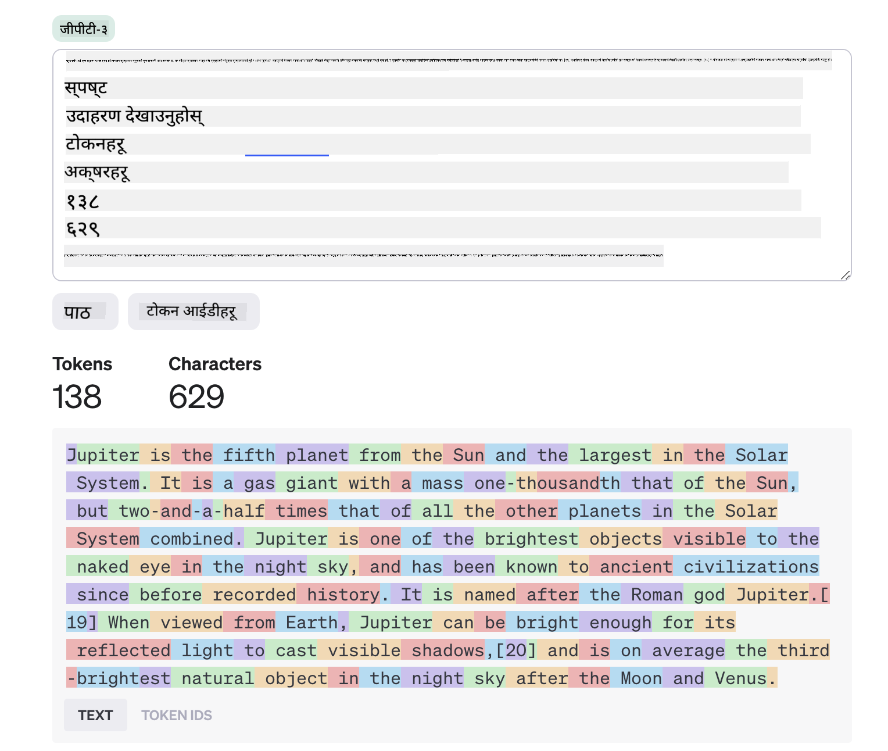
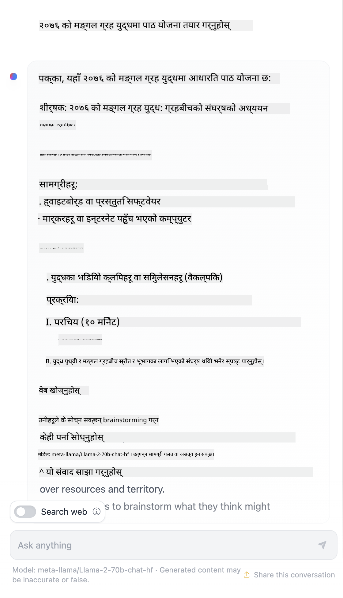

<!--
CO_OP_TRANSLATOR_METADATA:
{
  "original_hash": "a45c318dc6ebc2604f35b8b829f93af2",
  "translation_date": "2025-07-09T09:56:25+00:00",
  "source_file": "04-prompt-engineering-fundamentals/README.md",
  "language_code": "ne"
}
-->
# Prompt Engineering Fundamentals

[](https://aka.ms/gen-ai-lesson4-gh?WT.mc_id=academic-105485-koreyst)

## परिचय  
यो मोड्युलले जेनेरेटिभ AI मोडेलहरूमा प्रभावकारी प्रॉम्प्टहरू सिर्जना गर्न आवश्यक आधारभूत अवधारणाहरू र प्रविधिहरू समेट्छ। तपाईंले LLM लाई प्रॉम्प्ट लेख्ने तरिका पनि महत्त्वपूर्ण हुन्छ। सावधानीपूर्वक तयार गरिएको प्रॉम्प्टले राम्रो गुणस्तरको प्रतिक्रिया प्राप्त गर्न सक्छ। तर _प्रॉम्प्ट_ र _प्रॉम्प्ट इन्जिनियरिङ_ जस्ता शब्दहरूले के अर्थ राख्छन्? र म LLM लाई पठाउने प्रॉम्प्ट _इनपुट_ कसरी सुधार्न सक्छु? यी प्रश्नहरूको जवाफ हामी यस अध्याय र अर्कोमा खोज्नेछौं।

_जेनेरेटिभ AI_ प्रयोगकर्ताका अनुरोधहरूमा नयाँ सामग्री (जस्तै, पाठ, छवि, अडियो, कोड आदि) सिर्जना गर्न सक्षम छ। यसले OpenAI को GPT ("Generative Pre-trained Transformer") श्रृंखलाजस्ता _Large Language Models_ प्रयोग गरेर प्राकृतिक भाषा र कोडमा तालिम प्राप्त गरेर यो हासिल गर्छ।

प्रयोगकर्ताहरू अब यी मोडेलहरूसँग परिचित तरिकाले जस्तै च्याटमार्फत अन्तरक्रिया गर्न सक्छन्, जसका लागि कुनै प्राविधिक ज्ञान वा तालिम आवश्यक पर्दैन। यी मोडेलहरू _प्रॉम्प्ट-आधारित_ हुन्छन् - प्रयोगकर्ताले टेक्स्ट इनपुट (प्रॉम्प्ट) पठाउँछन् र AI प्रतिक्रिया (completion) प्राप्त गर्छन्। त्यसपछि उनीहरूले "AI सँग च्याट" गर्दै बहु-चरण संवादमा आफ्नो प्रॉम्प्ट सुधार्दै जान सक्छन् जबसम्म प्रतिक्रिया उनीहरूको अपेक्षासँग मेल खान्छ।

"प्रॉम्प्टहरू" अब जेनेरेटिभ AI एपहरूका लागि मुख्य _प्रोग्रामिङ इन्टरफेस_ बन्न पुगेका छन्, जसले मोडेलहरूलाई के गर्नुपर्छ भनी बताउँछन् र फर्काइने प्रतिक्रियाको गुणस्तरमा प्रभाव पार्छन्। "प्रॉम्प्ट इन्जिनियरिङ" एक तीव्र रूपमा बढ्दो अध्ययन क्षेत्र हो जसले प्रॉम्प्टहरूको _डिजाइन र अनुकूलन_ मा केन्द्रित छ ताकि ठूलो मात्रामा निरन्तर र गुणस्तरीय प्रतिक्रिया प्रदान गर्न सकियोस्।

## सिकाइका लक्ष्यहरू

यस पाठमा, हामी प्रॉम्प्ट इन्जिनियरिङ के हो, किन महत्त्वपूर्ण छ, र कसरी हामी कुनै मोडेल र अनुप्रयोग उद्देश्यका लागि प्रभावकारी प्रॉम्प्टहरू तयार पार्न सक्छौं भन्ने सिक्नेछौं। हामी प्रॉम्प्ट इन्जिनियरिङका मुख्य अवधारणाहरू र उत्तम अभ्यासहरू बुझ्नेछौं - र एउटा अन्तरक्रियात्मक Jupyter Notebook "sandbox" वातावरणको बारेमा जान्नेछौं जहाँ यी अवधारणाहरूलाई वास्तविक उदाहरणहरूमा लागू गरिएको देख्न सकिन्छ।

यस पाठको अन्त्यसम्म हामी सक्षम हुनेछौं:

1. प्रॉम्प्ट इन्जिनियरिङ के हो र किन महत्त्वपूर्ण छ व्याख्या गर्न।
2. प्रॉम्प्टका घटकहरू के-के हुन् र तिनीहरू कसरी प्रयोग गरिन्छ वर्णन गर्न।
3. प्रॉम्प्ट इन्जिनियरिङका उत्तम अभ्यास र प्रविधिहरू सिक्न।
4. सिकेका प्रविधिहरूलाई वास्तविक उदाहरणहरूमा OpenAI endpoint प्रयोग गरी लागू गर्न।

## मुख्य शब्दहरू

प्रॉम्प्ट इन्जिनियरिङ: AI मोडेलहरूलाई इच्छित आउटपुट उत्पादन गर्न मार्गदर्शन गर्न इनपुटहरू डिजाइन र परिमार्जन गर्ने अभ्यास।  
टोकनाइजेशन: टेक्स्टलाई साना इकाइहरूमा (टोकनहरू) रूपान्तरण गर्ने प्रक्रिया, जसलाई मोडेलले बुझ्न र प्रक्रिया गर्न सक्छ।  
इन्स्ट्रक्सन-ट्यून गरिएको LLMs: ती Large Language Models (LLMs) जसलाई विशेष निर्देशनहरूसँग परिमार्जन गरिएको हुन्छ जसले तिनीहरूको प्रतिक्रिया शुद्धता र सान्दर्भिकता सुधार गर्छ।

## सिकाइ Sandbox

प्रॉम्प्ट इन्जिनियरिङ हाल कला भन्दा विज्ञान जस्तो छ। यसमा हाम्रो सहज ज्ञान सुधार गर्ने सबैभन्दा राम्रो तरिका भनेको _अधिक अभ्यास_ गर्नु र त्रुटि-र-प्रयास विधि अपनाउनु हो जसले अनुप्रयोग क्षेत्रको विशेषज्ञता र सिफारिस गरिएका प्रविधिहरू तथा मोडेल-विशिष्ट अनुकूलनहरूलाई संयोजन गर्छ।

यस पाठसँगै आएको Jupyter Notebook ले एउटा _sandbox_ वातावरण प्रदान गर्छ जहाँ तपाईंले सिकेका कुरा अभ्यास गर्न सक्नुहुन्छ - जति बेला चाहनुहुन्छ वा अन्त्यमा कोड चुनौतीको रूपमा। अभ्यासहरू सञ्चालन गर्न तपाईंलाई चाहिन्छ:

1. **Azure OpenAI API कुञ्जी** - तैनाथ गरिएको LLM को सेवा अन्त बिन्दु।  
2. **Python Runtime** - जसमा Notebook चलाउन सकिन्छ।  
3. **स्थानीय वातावरण चरहरू** - _[SETUP](./../00-course-setup/SETUP.md?WT.mc_id=academic-105485-koreyst) चरणहरू पूरा गरेर तयार हुनुहोस्_।

Notebook सँग _शुरुवाती_ अभ्यासहरू आउँछन् - तर तपाईंलाई आफ्नै _Markdown_ (वर्णन) र _Code_ (प्रॉम्प्ट अनुरोधहरू) खण्डहरू थप्न प्रोत्साहित गरिन्छ ताकि थप उदाहरणहरू वा विचारहरू प्रयास गर्न सकियोस् र प्रॉम्प्ट डिजाइनमा सहजता बढोस्।

## चित्रित मार्गदर्शक

यस पाठले के समेट्छ भन्ने ठूलो तस्वीर पाउन चाहनुहुन्छ? यो चित्रित मार्गदर्शक हेर्नुहोस्, जसले मुख्य विषयहरू र प्रत्येकमा सोच्नुपर्ने मुख्य बुँदाहरूको अनुभूति दिन्छ। पाठको रोडम्यापले तपाईंलाई आधारभूत अवधारणाहरू र चुनौतीहरू बुझ्नबाट सुरु गरी तिनीहरूलाई सम्बोधन गर्न प्रासंगिक प्रॉम्प्ट इन्जिनियरिङ प्रविधिहरू र उत्तम अभ्यासहरूसम्म लैजान्छ। ध्यान दिनुहोस् कि यस मार्गदर्शकको "उन्नत प्रविधिहरू" खण्डले यस पाठ्यक्रमको _अर्को_ अध्यायमा समेटिएको सामग्रीलाई जनाउँछ।


## हाम्रो स्टार्टअप

अब, _यो विषय_ हाम्रो स्टार्टअप मिशनसँग कसरी सम्बन्धित छ भन्ने कुरा गरौं जुन [शिक्षामा AI नवप्रवर्तन ल्याउने](https://educationblog.microsoft.com/2023/06/collaborating-to-bring-ai-innovation-to-education?WT.mc_id=academic-105485-koreyst) हो। हामी _व्यक्तिगत सिकाइ_ को AI-संचालित अनुप्रयोगहरू विकास गर्न चाहन्छौं - त्यसैले हाम्रो अनुप्रयोगका विभिन्न प्रयोगकर्ताहरूले कसरी प्रॉम्प्ट "डिजाइन" गर्न सक्छन् भनेर सोचौं:

- **प्रशासकहरू** AI लाई _पाठ्यक्रम डाटामा विश्लेषण गरी कभर नगरेका भागहरू पहिचान गर्न_ भन्न सक्छन्। AI ले परिणामहरू सारांश गर्न वा कोडको माध्यमबाट दृश्यात्मक बनाउन सक्छ।  
- **शिक्षकहरू** AI लाई _लक्षित दर्शक र विषयका लागि पाठ योजना तयार गर्न_ भन्न सक्छन्। AI ले निर्दिष्ट ढाँचामा व्यक्तिगत योजना तयार गर्न सक्छ।  
- **विद्यार्थीहरू** AI लाई _कठिन विषयमा ट्युटर गर्न_ भन्न सक्छन्। AI ले विद्यार्थीहरूलाई उनीहरूको स्तरअनुसार पाठ, संकेत र उदाहरणहरू प्रदान गरेर मार्गदर्शन गर्न सक्छ।

यो त केवल सुरुवात हो। [Prompts For Education](https://github.com/microsoft/prompts-for-edu/tree/main?WT.mc_id=academic-105485-koreyst) हेर्नुहोस् - शिक्षा विशेषज्ञहरूले तयार पारेको खुला स्रोत प्रॉम्प्ट पुस्तकालय - जसले सम्भावनाहरूको व्यापक अनुभूति दिन्छ! _यी प्रॉम्प्टहरूलाई sandbox मा वा OpenAI Playground मा चलाएर के हुन्छ हेर्नुहोस्!_

<!--  
LESSON TEMPLATE:  
This unit should cover core concept #1.  
Reinforce the concept with examples and references.

CONCEPT #1:  
Prompt Engineering.  
Define it and explain why it is needed.  
-->

## प्रॉम्प्ट इन्जिनियरिङ के हो?

हामीले यस पाठको सुरुवातमा **प्रॉम्प्ट इन्जिनियरिङ** लाई कुनै मोडेल र उद्देश्यका लागि निरन्तर र गुणस्तरीय प्रतिक्रिया (completion) दिन टेक्स्ट इनपुट (प्रॉम्प्ट) डिजाइन र अनुकूलन गर्ने प्रक्रिया भनेर परिभाषित गर्यौं। यसलाई दुई चरणको प्रक्रिया भनेर सोच्न सकिन्छ:

- कुनै मोडेल र उद्देश्यका लागि प्रारम्भिक प्रॉम्प्ट _डिजाइन_ गर्नु  
- प्रतिक्रियाको गुणस्तर सुधार गर्न प्रॉम्प्टलाई पुनःपुनः _परिमार्जन_ गर्नु  

यो अनिवार्य रूपमा त्रुटि-र-प्रयास प्रक्रिया हो जसमा प्रयोगकर्ताको सहज ज्ञान र प्रयास आवश्यक पर्छ। त्यसैले यो किन महत्त्वपूर्ण छ? त्यस प्रश्नको उत्तर दिन हामीले तीन अवधारणाहरू बुझ्नुपर्छ:

- _टोकनाइजेशन_ = मोडेलले प्रॉम्प्टलाई कसरी "हेर्छ"  
- _बेस LLMs_ = आधारभूत मोडेलले प्रॉम्प्टलाई कसरी "प्रक्रिया" गर्छ  
- _इन्स्ट्रक्सन-ट्यून गरिएको LLMs_ = मोडेलले अब कसरी "कार्यहरू" देख्न सक्छ  

### टोकनाइजेशन

LLM ले प्रॉम्प्टहरूलाई _टोकनहरूको अनुक्रम_ को रूपमा हेर्छ जहाँ फरक मोडेलहरू (वा मोडेलका भिन्न संस्करणहरू) एउटै प्रॉम्प्टलाई फरक तरिकाले टोकनाइज गर्न सक्छन्। किनभने LLM हरू टोकनहरूमा तालिम पाएका हुन्छन् (कच्चा टेक्स्टमा होइन), प्रॉम्प्टहरू कसरी टोकनाइज हुन्छन् भन्ने कुरा उत्पन्न प्रतिक्रियाको गुणस्तरमा प्रत्यक्ष प्रभाव पार्छ।

टोकनाइजेशन कसरी काम गर्छ भन्ने सहज ज्ञान पाउन, तल देखाइएको [OpenAI Tokenizer](https://platform.openai.com/tokenizer?WT.mc_id=academic-105485-koreyst) जस्ता उपकरणहरू प्रयोग गरेर हेर्नुहोस्। आफ्नो प्रॉम्प्ट कपी गर्नुहोस् - र कसरी टोकनहरूमा रूपान्तरण हुन्छ हेर्नुहोस्, विशेष गरी खाली ठाउँ र विराम चिह्नहरू कसरी ह्यान्डल हुन्छन् ध्यान दिनुहोस्। यो उदाहरण पुरानो LLM (GPT-3) देखाउँछ - नयाँ मोडेलमा प्रयास गर्दा फरक परिणाम आउन सक्छ।



### अवधारणा: आधारभूत मोडेलहरू

प्रॉम्प्ट टोकनाइज भएपछि, ["Base LLM"](https://blog.gopenai.com/an-introduction-to-base-and-instruction-tuned-large-language-models-8de102c785a6?WT.mc_id=academic-105485-koreyst) (वा Foundation मोडेल) को मुख्य कार्य त्यो अनुक्रममा अर्को टोकनको भविष्यवाणी गर्नु हो। LLM हरू विशाल पाठ डेटासेटमा तालिम पाएका हुनाले टोकनहरू बीचको सांख्यिक सम्बन्ध राम्रोसँग बुझ्छन् र विश्वासका साथ भविष्यवाणी गर्न सक्छन्। उनीहरूले प्रॉम्प्ट वा टोकनका _अर्थ_ बुझ्दैनन्; केवल एउटा ढाँचा देख्छन् जसलाई उनीहरूले आफ्नो अर्को भविष्यवाणीले "पूरा" गर्न सक्छन्। प्रयोगकर्ताको हस्तक्षेप वा पूर्वनिर्धारित सर्तले रोक्दासम्म उनीहरूले अनुक्रमको भविष्यवाणी जारी राख्न सक्छन्।

प्रॉम्प्ट-आधारित completion कसरी काम गर्छ हेर्न चाहनुहुन्छ? माथिको प्रॉम्प्ट Azure OpenAI Studio को [_Chat Playground_](https://oai.azure.com/playground?WT.mc_id=academic-105485-koreyst) मा डिफल्ट सेटिङ्ससहित प्रविष्ट गर्नुहोस्। प्रणालीले प्रॉम्प्टलाई सूचना अनुरोधको रूपमा व्यवहार गर्ने गरी कन्फिगर गरिएको छ - त्यसैले तपाईंले सान्दर्भिक प्रतिक्रिया देख्नुहुनेछ।

तर यदि प्रयोगकर्ताले कुनै विशेष मापदण्ड वा कार्य उद्देश्य पूरा गर्ने कुरा हेर्न चाहन्थ्यो भने? त्यहीँ _इन्स्ट्रक्सन-ट्यून गरिएको_ LLM हरूको भूमिका आउँछ।


### अवधारणा: इन्स्ट्रक्सन-ट्यून गरिएको LLMs

[Instruction Tuned LLM](https://blog.gopenai.com/an-introduction-to-base-and-instruction-tuned-large-language-models-8de102c785a6?WT.mc_id=academic-105485-koreyst) ले आधारभूत मोडेलबाट सुरु गरी उदाहरणहरू वा इनपुट/आउटपुट जोडीहरू (जस्तै, बहु-चरण "सन्देशहरू") सँग परिमार्जन गर्छ जसमा स्पष्ट निर्देशनहरू हुन सक्छन् - र AI को प्रतिक्रिया त्यो निर्देशन पालना गर्ने प्रयास गर्छ।

यसले Reinforcement Learning with Human Feedback (RLHF) जस्ता प्रविधिहरू प्रयोग गर्छ जसले मोडेललाई _निर्देशनहरू पालना गर्न_ र _प्रतिक्रियाबाट सिक्न_ तालिम दिन्छ ताकि व्यावहारिक अनुप्रयोगहरूका लागि उपयुक्त र प्रयोगकर्ताका उद्देश्यहरूसँग बढी सान्दर्भिक प्रतिक्रिया उत्पादन गर्न सकोस्।

अब प्रयास गरौं - माथिको प्रॉम्प्टमा फर्केर _system message_ लाई तलको निर्देशन सन्दर्भको रूपमा परिवर्तन गर्नुहोस्:

> _तपाईंलाई दिइएको सामग्रीलाई दोस्रो कक्षाको विद्यार्थीका लागि सारांश गर्नुहोस्। परिणामलाई ३-५ बुलेट पोइन्टहरू सहित एक अनुच्छेदमा राख्नुहोस्।_

हेर्नुहोस्, परिणाम अब चाहिएको लक्ष्य र ढाँचामा अनुकूलित छ। शिक्षकले यो प्रतिक्रिया आफ्नो कक्षाको स्लाइडमा सिधै प्रयोग गर्न सक्छन्।


## हामीलाई किन प्रॉम्प्ट इन्जिनियरिङ चाहिन्छ?

अब हामीले प्रॉम्प्टहरू LLM हरूले कसरी प्रक्रिया गर्छन् थाहा पाएपछि, प्रॉम्प्ट इन्जिनियरिङ किन आवश्यक छ भन्ने कुरा गरौं। यसको जवाफ वर्तमान LLM हरूले केही चुनौतीहरू प्रस्तुत गर्ने तथ्यमा छ जसले _विश्वसनीय र निरन्तर completion_ प्राप्त गर्न प्रॉम्प्ट निर्माण र अनुकूलनमा प्रयास नगरे सजिलो हुँदैन। उदाहरणका लागि:

1. **मोडेल प्रतिक्रियाहरू स्टोकास्टिक हुन्छन्।** _उही प्रॉम्प्ट_ फरक मोडेल वा मोडेल संस्करणहरूसँग फरक प्रतिक्रिया दिन सक्छ। र उही मोडेलसँग पनि फरक समयमा फरक परिणाम दिन सक्छ। _प्रॉम्प्ट इन्जिनियरिङ प्रविधिहरूले यी भिन्नताहरूलाई कम गर्न मद्दत गर्छन्_।

2. **मोडेलहरूले प्रतिक्रिया बनाउँछन्।** मोडेलहरू _ठूलो तर सीमित_ डेटासेटमा तालिम पाएका हुन्छन्, जसको अर्थ तिनीहरूलाई तालिम दायराभन्दा बाहिरका अवधारणाहरूको ज्ञान हुँदैन। त्यसैले तिनीहरूले गलत, काल्पनिक वा ज्ञात तथ्यहरूसँग प्रत्यक्ष विरोधाभासी प्रतिक्रिया उत्पादन गर्न सक्छन्। _प्रॉम्प्ट इन्जिनियरिङले प्रयोगकर्ताहरूलाई यस्तो बनावटहरू पहिचान गर्न र कम गर्न मद्दत गर्छ, जस्तै AI लाई उद्धरण वा तर्क मागेर_।

3. **मोडेल क्षमताहरू फरक हुन्छन्।** नयाँ मोडेल वा मोडेल पुस्ताहरूमा बढी क्षमताहरू हुन्छन् तर तिनीहरूले लागत र जटिलतामा अनौठा विशेषताहरू र सन्तुलन ल्याउँछन्। _प्रॉम्प्ट इन्जिनियरिङले हामीलाई उत्तम अभ्यास र कार्यप्रवाह विकास गर्न मद्दत गर्छ जसले फरकतालाई लुकाएर मोडेल-विशिष्ट आवश्यकताहरूलाई स्केलेबल र सहज तरिकाले अनुकूलन गर्न सकोस्_।

यसलाई OpenAI वा Azure OpenAI Playground मा व्यवहारमा हेर्नुहोस्:

- फरक LLM तैनाथीकरणहरूसँग उही प्रॉम्प्ट प्रयोग गर्नुहोस् (जस्तै, OpenAI, Azure OpenAI, Hugging Face) - के तपाईंले भिन्नता देख्नुभयो?  
- उही LLM तैनाथीकरणसँग उही प्रॉम्प्ट बारम्बार प्रयोग गर्नुहोस् (जस्तै, Azure OpenAI playground) - यी भिन्नताहरू कसरी फरक थिए?

### बनावटहरूको उदाहरण

यस कोर्समा, हामीले **"fabrication"** शब्द प्रयोग गर्छौं जसले त्यो घटना जनाउँछ जहाँ LLM हरू कहिलेकाहीं आफ्नो तालिम वा अन्य सीमाहरूका कारण तथ्यगत रूपमा गलत जानकारी उत्पादन गर्छन्। तपाईंले यसलाई लोकप्रिय लेखहरू वा अनुसन्धान कागजातहरूमा _"hallucinations"_ भनेर पनि सुन्नुभएको हुन सक्छ। तर हामी दृढतापूर्वक _"fabrication"_ शब्द प्रयोग गर्न सिफारिस गर्छौं ताकि हामीले अनायासै यो व्यवहारलाई मानवजस्तो गुण दिनबाट बच्न सकौं। यसले [Responsible AI guidelines](https://www.microsoft.com/ai/responsible-ai?WT.mc_id=academic-105485-koreyst) लाई पनि समर्थन गर्छ, जसले केही सन्दर्भहरूमा अपमानजनक वा गैर-समावेशी मानिने शब्दहरू हटाउँछ।

बनावटहरू कसरी काम गर्छन् भन्ने बुझ्न चाहनुहुन्छ? एउटा प्रॉम्प्ट सोच्नुहोस् जसले AI लाई अवस्थित नभएको विषयको सामग्री सिर्जना गर्न निर्देशन दिन्छ (ताकि त्यो तालिम डेटासेटमा नपाइयोस्)। उदाहरणका लागि - मैले यो प्रॉम्प्ट प्रयास गरें:
# 2076 को मार्टियन युद्धमा पाठ योजना

## पाठको उद्देश्य
विद्यार्थीहरूले 2076 को मार्टियन युद्धको कारण, घटनाक्रम, र परिणामहरू बुझ्नेछन्। यसले उनीहरूलाई भविष्यको अन्तरिक्ष युद्ध र मानवता र अन्तरिक्षको सम्बन्धमा सोच्न प्रेरित गर्नेछ।

## पाठको अवधी
४५ मिनेट

## आवश्यक सामग्री
- 2076 को मार्टियन युद्ध सम्बन्धी चित्रहरू र नक्सा
- भिडियो क्लिपहरू (यदि उपलब्ध छ भने)
- नोटबुक र लेखन सामग्री

## पाठ योजना

### परिचय (१० मिनेट)
- मार्टियन युद्ध के हो? संक्षिप्त परिचय दिनुहोस्।
- विद्यार्थीहरूलाई सोध्नुहोस्: "तपाईंलाई किन लाग्छ कि मानिसहरूले मंगल ग्रहमा युद्ध गर्न सक्छन्?"
- युद्धको पृष्ठभूमि र कारणहरू संक्षेपमा व्याख्या गर्नुहोस्।

### मुख्य भाग (२५ मिनेट)
- युद्धका प्रमुख घटनाहरू क्रमबद्ध रूपमा प्रस्तुत गर्नुहोस्।
- युद्धमा प्रयोग भएका प्रविधिहरू र रणनीतिहरूको चर्चा गर्नुहोस्।
- युद्धले मानवता र मंगल ग्रहमा के प्रभाव पारेको छ भन्ने विषयमा छलफल गर्नुहोस्।
- विद्यार्थीहरूलाई समूहमा विभाजन गरी युद्धका विभिन्न पक्षहरूमा अनुसन्धान गर्न लगाउनुहोस्।

### निष्कर्ष (१० मिनेट)
- समूहहरूले आफ्नो अनुसन्धान प्रस्तुत गर्ने मौका पाउनुहोस्।
- युद्धबाट सिक्न सकिने पाठहरू र भविष्यका सम्भावित अन्तरिक्ष संघर्षहरूबारे छलफल गर्नुहोस्।
- विद्यार्थीहरूलाई प्रश्न सोध्न र आफ्नो विचार व्यक्त गर्न प्रोत्साहित गर्नुहोस्।

## गृहकार्य
- विद्यार्थीहरूले 2076 को मार्टियन युद्धमा आधारित एउटा छोटो निबन्ध लेख्नेछन् जसमा उनीहरूले युद्धका कारण र परिणामहरू समेट्नेछन्।

## अतिरिक्त स्रोतहरू
- मार्टियन युद्ध सम्बन्धी पुस्तकहरू र लेखहरू
- अन्तरिक्ष युद्धको इतिहासमा आधारित डकुमेन्ट्रीहरू

---

**[!IMPORTANT]** यो पाठ योजना विद्यार्थीहरूको रुचि र स्तर अनुसार अनुकूलन गर्न सकिन्छ।
वेब खोजले मलाई देखायो कि मार्टियन युद्धहरूमा काल्पनिक कथाहरू (जस्तै, टेलिभिजन सिरिज वा पुस्तकहरू) थिए – तर २०७६ मा कुनै थिएनन्। सामान्य ज्ञानले पनि भन्छ कि २०७६ _भविष्यमा_ छ र त्यसैले, यसलाई कुनै वास्तविक घटनासँग जोड्न सकिँदैन।

त्यसैले, जब हामी यो प्रॉम्प्ट विभिन्न LLM प्रदायकहरूसँग चलाउँछौं के हुन्छ?

> **प्रतिक्रिया १**: OpenAI Playground (GPT-35)


> **प्रतिक्रिया २**: Azure OpenAI Playground (GPT-35)


> **प्रतिक्रिया ३**: : Hugging Face Chat Playground (LLama-2)



अपेक्षित रूपमा, प्रत्येक मोडेल (वा मोडेल संस्करण) ले थोरै फरक प्रतिक्रिया दिन्छ किनभने यसको स्टोकास्टिक व्यवहार र मोडेल क्षमतामा भिन्नता हुन्छ। उदाहरणका लागि, एउटा मोडेलले ८ कक्षाको दर्शकलाई लक्षित गर्छ भने अर्कोले उच्च विद्यालयको विद्यार्थीलाई मान्छ। तर ती सबै तीन मोडेलहरूले यस्तो प्रतिक्रिया दिएका छन् जसले अनजान प्रयोगकर्तालाई त्यो घटना वास्तविक भएको विश्वास दिलाउन सक्छ।

प्रॉम्प्ट इन्जिनियरिङ प्रविधिहरू जस्तै _मेटाप्रॉम्प्टिङ_ र _टेम्परेचर कन्फिगरेसन_ ले मोडेलका बनावटहरू केही हदसम्म कम गर्न सक्छन्। नयाँ प्रॉम्प्ट इन्जिनियरिङ _आर्किटेक्चर_ हरूले पनि नयाँ उपकरण र प्रविधिहरूलाई सहज रूपमा प्रॉम्प्ट प्रवाहमा समावेश गर्छन्, जसले यी प्रभावहरूलाई कम गर्न मद्दत गर्छ।

## केस स्टडी: GitHub Copilot

यो खण्डलाई समेट्दै हामी वास्तविक संसारका समाधानहरूमा प्रॉम्प्ट इन्जिनियरिङ कसरी प्रयोग हुन्छ भनेर बुझ्न एक केस स्टडी हेरौं: [GitHub Copilot](https://github.com/features/copilot?WT.mc_id=academic-105485-koreyst)।

GitHub Copilot तपाईंको "AI जोडी प्रोग्रामर" हो – यो टेक्स्ट प्रॉम्प्टहरूलाई कोड पूरकमा रूपान्तरण गर्छ र तपाईंको विकास वातावरण (जस्तै, Visual Studio Code) मा एकीकृत हुन्छ जसले प्रयोगकर्तालाई सहज अनुभव दिन्छ। तलका ब्लग श्रृंखलामा दस्तावेजित अनुसार, सबैभन्दा प्रारम्भिक संस्करण OpenAI Codex मोडेलमा आधारित थियो – जहाँ इन्जिनियरहरूले छिटो मोडेललाई फाइन-ट्यून गर्न र राम्रो प्रॉम्प्ट इन्जिनियरिङ प्रविधिहरू विकास गर्न आवश्यकतालाई महसुस गरे, जसले कोड गुणस्तर सुधार्न मद्दत गर्यो। जुलाईमा, उनीहरूले [Codex भन्दा अगाडि जाने सुधारिएको AI मोडेल सार्वजनिक गरे](https://github.blog/2023-07-28-smarter-more-efficient-coding-github-copilot-goes-beyond-codex-with-improved-ai-model/?WT.mc_id=academic-105485-koreyst) जसले अझ छिटो सुझावहरू दिन्छ।

तिनीहरूको सिकाइ यात्रालाई पछ्याउन तलका पोस्टहरूलाई क्रमबद्ध रूपमा पढ्नुहोस्।

- **मे २०२३** | [GitHub Copilot तपाईंको कोड बुझ्न अझ राम्रो हुँदैछ](https://github.blog/2023-05-17-how-github-copilot-is-getting-better-at-understanding-your-code/?WT.mc_id=academic-105485-koreyst)
- **मे २०२३** | [GitHub भित्र: GitHub Copilot पछाडि रहेका LLM हरूसँग काम गर्दै](https://github.blog/2023-05-17-inside-github-working-with-the-llms-behind-github-copilot/?WT.mc_id=academic-105485-koreyst)
- **जुन २०२३** | [GitHub Copilot का लागि राम्रो प्रॉम्प्टहरू कसरी लेख्ने](https://github.blog/2023-06-20-how-to-write-better-prompts-for-github-copilot/?WT.mc_id=academic-105485-koreyst)
- **जुलाई २०२३** | [GitHub Copilot Codex भन्दा अगाडि जान्छ सुधारिएको AI मोडेलसँग](https://github.blog/2023-07-28-smarter-more-efficient-coding-github-copilot-goes-beyond-codex-with-improved-ai-model/?WT.mc_id=academic-105485-koreyst)
- **जुलाई २०२३** | [प्रोग्रामरहरूको लागि प्रॉम्प्ट इन्जिनियरिङ र LLMs को मार्गदर्शिका](https://github.blog/2023-07-17-prompt-engineering-guide-generative-ai-llms/?WT.mc_id=academic-105485-koreyst)
- **सेप्टेम्बर २०२३** | [एउटा उद्यम LLM एप कसरी बनाउने: GitHub Copilot बाट सिकाइहरू](https://github.blog/2023-09-06-how-to-build-an-enterprise-llm-application-lessons-from-github-copilot/?WT.mc_id=academic-105485-koreyst)

तपाईं तिनीहरूको [इन्जिनियरिङ ब्लग](https://github.blog/category/engineering/?WT.mc_id=academic-105485-koreyst) पनि हेर्न सक्नुहुन्छ जहाँ यस्ता थप पोस्टहरू छन्, जस्तै [यो](https://github.blog/2023-09-27-how-i-used-github-copilot-chat-to-build-a-reactjs-gallery-prototype/?WT.mc_id=academic-105485-koreyst) जसले देखाउँछ यी मोडेल र प्रविधिहरू कसरी वास्तविक संसारका अनुप्रयोगहरू चलाउन _लागु_ गरिन्छन्।

---

<!--
LESSON TEMPLATE:
This unit should cover core concept #2.
Reinforce the concept with examples and references.

CONCEPT #2:
Prompt Design.
Illustrated with examples.
-->

## प्रॉम्प्ट निर्माण

हामीले देख्यौं कि प्रॉम्प्ट इन्जिनियरिङ किन महत्वपूर्ण छ – अब प्रॉम्प्टहरू कसरी _निर्माण_ गरिन्छन् बुझौं ताकि हामी विभिन्न प्रविधिहरूको मूल्याङ्कन गरेर अझ प्रभावकारी प्रॉम्प्ट डिजाइन गर्न सकौं।

### आधारभूत प्रॉम्प्ट

आधारभूत प्रॉम्प्टबाट सुरु गरौं: मोडेललाई कुनै अन्य सन्दर्भ बिना पठाइएको टेक्स्ट इनपुट। यहाँ एउटा उदाहरण छ – जब हामी अमेरिकी राष्ट्रिय गानका पहिलो केही शब्दहरू OpenAI [Completion API](https://platform.openai.com/docs/api-reference/completions?WT.mc_id=academic-105485-koreyst) मा पठाउँछौं, यो तुरुन्तै अर्को केही पंक्तिहरूले प्रतिक्रिया _पूरा_ गर्छ, जसले आधारभूत भविष्यवाणी व्यवहार देखाउँछ।

| प्रॉम्प्ट (इनपुट)     | प्रतिक्रिया (आउटपुट)                                                                                                                        |
| :----------------- | :----------------------------------------------------------------------------------------------------------------------------------------- |
| Oh say can you see | तपाईंले "The Star-Spangled Banner," संयुक्त राज्य अमेरिकाको राष्ट्रिय गानको गीत सुरु गर्दै हुनुहुन्छ जस्तो लाग्छ। पूर्ण गीत यस प्रकार छ ... |

### जटिल प्रॉम्प्ट

अब त्यो आधारभूत प्रॉम्प्टमा सन्दर्भ र निर्देशन थपौं। [Chat Completion API](https://learn.microsoft.com/azure/ai-services/openai/how-to/chatgpt?WT.mc_id=academic-105485-koreyst) ले हामीलाई _सन्देशहरू_ को संग्रहको रूपमा जटिल प्रॉम्प्ट निर्माण गर्न दिन्छ:

- इनपुट/आउटपुट जोडीहरू जसले _प्रयोगकर्ता_ को इनपुट र _सहायक_ को प्रतिक्रिया देखाउँछन्।
- प्रणाली सन्देश जसले सहायकको व्यवहार वा व्यक्तित्वको सन्दर्भ सेट गर्छ।

अब अनुरोध तलको रूपमा हुन्छ, जहाँ _टोकनाइजेशन_ ले सन्दर्भ र संवादबाट सम्बन्धित जानकारी प्रभावकारी रूपमा समेट्छ। प्रणाली सन्दर्भ परिवर्तन गर्दा प्रतिक्रिया गुणस्तरमा प्रयोगकर्ताको इनपुट जत्तिकै प्रभाव पार्न सक्छ।

```python
response = openai.chat.completions.create(
    model="gpt-3.5-turbo",
    messages=[
        {"role": "system", "content": "You are a helpful assistant."},
        {"role": "user", "content": "Who won the world series in 2020?"},
        {"role": "assistant", "content": "The Los Angeles Dodgers won the World Series in 2020."},
        {"role": "user", "content": "Where was it played?"}
    ]
)
```

### निर्देशन प्रॉम्प्ट

माथिका उदाहरणहरूमा, प्रयोगकर्ताको प्रॉम्प्ट साधारण टेक्स्ट प्रश्न थियो जुन जानकारीको अनुरोधको रूपमा व्याख्या गर्न सकिन्छ। _निर्देशन_ प्रॉम्प्टहरूसँग, हामी त्यो टेक्स्टलाई कार्यलाई थप विस्तारमा निर्दिष्ट गर्न प्रयोग गर्न सक्छौं, जसले AI लाई राम्रो मार्गदर्शन दिन्छ। यहाँ एउटा उदाहरण छ:

| प्रॉम्प्ट (इनपुट)                                                                                                                                                                                                                         | प्रतिक्रिया (आउटपुट)                                                                                                        | निर्देशन प्रकार    |
| :------------------------------------------------------------------------------------------------------------------------------------------------------------------------------------------------------------------------------------- | :------------------------------------------------------------------------------------------------------------------------- | :------------------ |
| Write a description of the Civil War                                                                                                                                                                                                   | _साधारण अनुच्छेद फर्कायो_                                                                                              | सरल              |
| Write a description of the Civil War. Provide key dates and events and describe their significance                                                                                                                                     | _अनुच्छेद पछि मुख्य घटनाका मितिहरू र विवरणहरूको सूची फर्कायो_                                             | जटिल             |
| Write a description of the Civil War in 1 paragraph. Provide 3 bullet points with key dates and their significance. Provide 3 more bullet points with key historical figures and their contributions. Return the output as a JSON file | _अझ विस्तृत विवरणहरू JSON ढाँचामा फर्काउँछ जुन तपाईं फाइलमा कपी-पेस्ट गरेर आवश्यक अनुसार मान्य गर्न सक्नुहुन्छ_ | जटिल। ढाँचाबद्ध। |

## प्राथमिक सामग्री

माथिका उदाहरणहरूमा, प्रॉम्प्ट अझै खुला थियो, जसले LLM लाई आफ्नो पूर्व-प्रशिक्षित डेटासेटको कुन भाग सान्दर्भिक छ निर्णय गर्न अनुमति दियो। _प्राथमिक सामग्री_ डिजाइन ढाँचामा, इनपुट टेक्स्ट दुई भागमा विभाजित हुन्छ:

- निर्देशन (कार्य)
- सान्दर्भिक सामग्री (जसले कार्यलाई प्रभाव पार्छ)

यहाँ एउटा उदाहरण छ जहाँ निर्देशन हो "यसलाई २ वाक्यमा सारांश गर्नुहोस्"।

| प्रॉम्प्ट (इनपुट)                                                                                                                                                                                                                                                                                                                                                                                                                                                                                                                                                                                                                                                                                      | प्रतिक्रिया (आउटपुट)                                                                                                                                                                                                                                                                             |
| :-------------------------------------------------------------------------------------------------------------------------------------------------------------------------------------------------------------------------------------------------------------------------------------------------------------------------------------------------------------------------------------------------------------------------------------------------------------------------------------------------------------------------------------------------------------------------------------------------------------------------------------------------------------------------------------------------- | :---------------------------------------------------------------------------------------------------------------------------------------------------------------------------------------------------------------------------------------------------------------------------------------------- |
| Jupiter is the fifth planet from the Sun and the largest in the Solar System. It is a gas giant with a mass one-thousandth that of the Sun, but two-and-a-half times that of all the other planets in the Solar System combined. Jupiter is one of the brightest objects visible to the naked eye in the night sky, and has been known to ancient civilizations since before recorded history. It is named after the Roman god Jupiter.[19] When viewed from Earth, Jupiter can be bright enough for its reflected light to cast visible shadows,[20] and is on average the third-brightest natural object in the night sky after the Moon and Venus. <br/> **Summarize this in 2 short sentences** | Jupiter, सूर्यबाट पाँचौं ग्रह, सौर्यमण्डलको सबैभन्दा ठूलो ग्रह हो र रातको आकाशमा सबैभन्दा चम्किला वस्तुहरू मध्ये एक हो। यो रोमन देवता Jupiter को नाममा राखिएको हो र यसको द्रव्यमान सौर्यमण्डलका अन्य सबै ग्रहहरूको दुई र आधा गुणा छ। |

प्राथमिक सामग्री खण्डलाई विभिन्न तरिकाले प्रयोग गर्न सकिन्छ प्रभावकारी निर्देशन दिन:

- **उदाहरणहरू** – मोडेललाई स्पष्ट निर्देशन दिनुको सट्टा, के गर्नुपर्ने उदाहरणहरू दिनुहोस् र मोडेलले ढाँचा अनुमान लगाओस्।
- **संकेतहरू** – निर्देशनपछि एउटा "संकेत" दिनुहोस् जसले प्रतिक्रिया प्रारम्भ गर्छ र मोडेललाई सान्दर्भिक उत्तरतर्फ मार्गदर्शन गर्छ।
- **ढाँचा** – यी दोहोर्याउन मिल्ने 'रेसिपी' हुन् जसमा प्लेसहोल्डरहरू (चरहरू) हुन्छन् जुन विशिष्ट प्रयोगका लागि डाटासँग अनुकूलन गर्न सकिन्छ।

अब यीलाई व्यवहारमा हेरौं।

### उदाहरणहरूको प्रयोग

यो एउटा तरिका हो जहाँ तपाईं प्राथमिक सामग्री प्रयोग गरेर मोडेललाई चाहिएको आउटपुटका केही उदाहरणहरू "खुवाउनुहुन्छ" र मोडेलले चाहिएको ढाँचा अनुमान लगाउँछ। दिइएका उदाहरणहरूको संख्यामा आधारित, हामीसँग शून्य-शट, एक-शट, थोरै-शट प्रॉम्प्टिङ हुन सक्छ।

प्रॉम्प्ट अब तीन भागहरूमा हुन्छ:

- कार्यको वर्णन
- चाहिएको आउटपुटका केही उदाहरणहरू
- नयाँ उदाहरणको सुरुवात (जो अप्रत्यक्ष कार्य वर्णन हुन्छ)

| सिकाइ प्रकार | प्रॉम्प्ट (इनपुट)                                                                                                                                        | प्रतिक्रिया (आउटपुट)         |
| :------------ | :---------------------------------------------------------------------------------------------------------------------------------------------------- | :-------------------------- |
| शून्य-शट     | "The Sun is Shining". Translate to Spanish                                                                                                            | "El Sol está brillando".    |
| एक-शट      | "The Sun is Shining" => ""El Sol está brillando". <br> "It's a Cold and Windy Day" =>                                                                 | "Es un día frío y ventoso". |
| थोरै-शट      | The player ran the bases => Baseball <br/> The player hit an ace => Tennis <br/> The player hit a six => Cricket <br/> The player made a slam-dunk => | Basketball                  |
|               |                                                                                                                                                       |                             |

यहाँ ध्यान दिनुहोस् कि शून्य-शट प्रॉम्प्टिङमा हामीले स्पष्ट निर्देशन ("Translate to Spanish") दिनुपर्छ, तर एक-शट प्रॉम्प्टिङमा यो अनुमान लगाइन्छ। थोरै-शट उदाहरणले देखाउँछ कि थप उदाहरणहरू थप्दा मोडेलहरूले थप सही अनुमान लगाउन सक्छन् बिना थप निर्देशन।

### प्रॉम्प्ट संकेतहरू

प्राथमिक सामग्री प्रयोग गर्ने अर्को तरिका हो _संकेतहरू_ दिनु। यस अवस्थामा, हामी मोडेललाई चाहिएको प्रतिक्रिया ढाँचामा प्रारम्भिक अंश दिँदै सही दिशामा धकेल्छौं। मोडेलले त्यसपछि "संकेत लिन्छ" र त्यसै शैलीमा जारी राख्छ।

| संकेतहरूको संख्या | प्रॉम्प्ट (इनपुट)                                                                                                                                                                                                                                                                                                                                                                                                                                               | प्रतिक्रिया (आउटपुट)                                                                                                                                                                                                                                                                                       |
| :------------- | :----------------------------------------------------------------------------------------------------------------------------------------------------------------------------------------------------------------------------------------------------------------------------------------------------------------------------------------------------------------------------------------------------------------------------------------------------------- | :-------------------------------------------------------------------------------------------------------------------------------------------------------------------------------------------------------------------------------------------------------------------------------------------------------- |
| 0              | Jupiter is the fifth planet from the Sun and the largest in the Solar System. It is a gas giant with a mass one-thousandth that of the Sun, but two-and-a-half times that of all the other planets in the Solar System combined. Jupiter is one of the brightest objects visible to the naked eye in the night sky, and has been known to ancient civilizations since before recorded history.

**Summarize This**                                       | ज्युपिटर हाम्रो सौर्यमण्डलको सबैभन्दा ठूलो ग्रह हो र सूर्यबाट पाँचौं ग्रह हो। यो ग्यास जायन्ट हो जसको द्रव्यमान सूर्यको १/१००० भाग छ, तर यो सबै अन्य ग्रहहरूको कुल द्रव्यमानभन्दा भारी छ। प्राचीन सभ्यताहरूले ज्युपिटरलाई लामो समयदेखि चिनेका छन्, र यो सजिलै रातको आकाशमा देखिन्छ। |
| 1              | ज्युपिटर सूर्यबाट पाँचौं ग्रह हो र सौर्यमण्डलको सबैभन्दा ठूलो ग्रह हो। यो ग्यास जायन्ट हो जसको द्रव्यमान सूर्यको एक हजारौं भाग हो, तर सौर्यमण्डलका सबै अन्य ग्रहहरूको कुल द्रव्यमानको दुई र आधा गुणा छ। ज्युपिटर रातको आकाशमा नाङ्गो आँखाले देखिने सबैभन्दा चम्किला वस्तुहरू मध्ये एक हो, र यो प्राचीन सभ्यताहरूले इतिहास लेखिनु अघि देखि नै चिनेका छन्। <br/>**Summarize This** <br/> हामीले सिकेको कुरा हो कि ज्युपिटर | सूर्यबाट पाँचौं ग्रह हो र सौर्यमण्डलको सबैभन्दा ठूलो ग्रह हो। यो ग्यास जायन्ट हो जसको द्रव्यमान सूर्यको एक हजारौं भाग हो, तर सबै अन्य ग्रहहरूको कुल द्रव्यमानको दुई र आधा गुणा छ। यो सजिलै नाङ्गो आँखाले देख्न सकिन्छ र प्राचीन कालदेखि परिचित छ।                        |
| 2              | ज्युपिटर सूर्यबाट पाँचौं ग्रह हो र सौर्यमण्डलको सबैभन्दा ठूलो ग्रह हो। यो ग्यास जायन्ट हो जसको द्रव्यमान सूर्यको एक हजारौं भाग हो, तर सौर्यमण्डलका सबै अन्य ग्रहहरूको कुल द्रव्यमानको दुई र आधा गुणा छ। ज्युपिटर रातको आकाशमा नाङ्गो आँखाले देखिने सबैभन्दा चम्किला वस्तुहरू मध्ये एक हो, र यो प्राचीन सभ्यताहरूले इतिहास लेखिनु अघि देखि नै चिनेका छन्। <br/>**Summarize This** <br/> हामीले सिकेका शीर्ष ३ तथ्यहरू:         | १. ज्युपिटर सूर्यबाट पाँचौं ग्रह हो र सौर्यमण्डलको सबैभन्दा ठूलो ग्रह हो। <br/> २. यो ग्यास जायन्ट हो जसको द्रव्यमान सूर्यको एक हजारौं भाग हो...<br/> ३. ज्युपिटर प्राचीन कालदेखि नै नाङ्गो आँखाले देखिने गरी परिचित छ ...                                                                       |
|                |                                                                                                                                                                                                                                                                                                                                                                                                                                                              |                                                                                                                                                                                                                                                                                                           |

### Prompt Templates

प्रम्प्ट टेम्प्लेट भनेको _पहिले नै परिभाषित गरिएको प्रम्प्टको नुस्खा_ हो जुन आवश्यक अनुसार भण्डारण गरी पुन: प्रयोग गर्न सकिन्छ, जसले ठूलो मात्रामा प्रयोगकर्ताको अनुभवलाई निरन्तरता दिन मद्दत गर्छ। यसको सबैभन्दा सरल रूपमा, यो प्रम्प्टका उदाहरणहरूको संग्रह हो जस्तै [OpenAI बाट यो उदाहरण](https://platform.openai.com/examples?WT.mc_id=academic-105485-koreyst) जसले अन्तरक्रियात्मक प्रम्प्ट कम्पोनेन्टहरू (प्रयोगकर्ता र प्रणाली सन्देशहरू) र API-चालित अनुरोध ढाँचा दुवै प्रदान गर्छ - पुन: प्रयोगलाई समर्थन गर्न।

थोरै जटिल रूपले, जस्तै [LangChain बाट यो उदाहरण](https://python.langchain.com/docs/concepts/prompt_templates/?WT.mc_id=academic-105485-koreyst) मा, यसमा _प्लेसहोल्डरहरू_ हुन्छन् जुन विभिन्न स्रोतहरू (प्रयोगकर्ता इनपुट, प्रणाली सन्दर्भ, बाह्य डाटा स्रोतहरू आदि) बाट डाटा राखेर गतिशील रूपमा प्रम्प्ट सिर्जना गर्न सकिन्छ। यसले हामीलाई पुन: प्रयोग गर्न मिल्ने प्रम्प्टहरूको पुस्तकालय बनाउन अनुमति दिन्छ जुन **कार्यक्रमगत रूपमा** ठूलो मात्रामा निरन्तर प्रयोगकर्ता अनुभवहरू प्रदान गर्न सकिन्छ।

अन्ततः, टेम्प्लेटहरूको वास्तविक मूल्य भनेको _प्रम्प्ट पुस्तकालयहरू_ सिर्जना र प्रकाशन गर्ने क्षमता हो जुन विशेष अनुप्रयोग क्षेत्रहरूका लागि अनुकूलित हुन्छन् - जहाँ प्रम्प्ट टेम्प्लेट अब _अनुप्रयोग-विशिष्ट सन्दर्भ वा उदाहरणहरू_ समावेश गरेर लक्षित प्रयोगकर्ता समूहका लागि जवाफहरू अझ सान्दर्भिक र सही बनाउँछ। [Prompts For Edu](https://github.com/microsoft/prompts-for-edu?WT.mc_id=academic-105485-koreyst) रिपोजिटरी यस दृष्टिकोणको उत्कृष्ट उदाहरण हो, जसले शिक्षा क्षेत्रका लागि प्रम्प्टहरूको पुस्तकालय तयार पारेको छ, जसमा पाठ योजना, पाठ्यक्रम डिजाइन, विद्यार्थी ट्युटोरिङ जस्ता मुख्य उद्देश्यहरूमा जोड दिइएको छ।

## Supporting Content

यदि हामी प्रम्प्ट निर्माणलाई एउटा निर्देशन (कार्य) र एउटा लक्ष्य (प्राथमिक सामग्री) भएको रूपमा सोच्यौं भने, _माध्यमिक सामग्री_ भनेको थप सन्दर्भ हो जुन हामीले आउटपुटलाई कुनै न कुनै तरिकाले प्रभाव पार्नका लागि प्रदान गर्छौं। यसमा ट्युनिङ प्यारामिटरहरू, ढाँचा निर्देशनहरू, विषय वर्गीकरण आदि हुन सक्छन् जसले मोडेललाई प्रतिक्रिया प्रयोगकर्ताका उद्देश्य वा अपेक्षाहरू अनुरूप _अनुकूलन_ गर्न मद्दत गर्छ।

उदाहरणका लागि: पाठ्यक्रम सूचीमा व्यापक मेटाडाटा (नाम, विवरण, स्तर, मेटाडाटा ट्यागहरू, प्रशिक्षक आदि) भएको अवस्थामा:

- हामीले "Fall 2023 को पाठ्यक्रम सूची संक्षेप गर्नुहोस्" भन्ने निर्देशन दिन सक्छौं
- हामीले प्राथमिक सामग्रीमा इच्छित आउटपुटका केही उदाहरणहरू दिन सक्छौं
- हामीले माध्यमिक सामग्रीमा शीर्ष ५ "ट्यागहरू" पहिचान गर्न सक्छौं।

अब, मोडेलले केही उदाहरणहरूले देखाएको ढाँचामा संक्षेप प्रदान गर्न सक्छ - तर यदि परिणाममा धेरै ट्यागहरू छन् भने, यसले माध्यमिक सामग्रीमा पहिचान गरिएका ५ ट्यागहरूलाई प्राथमिकता दिन सक्छ।

---

<!--
LESSON TEMPLATE:
यस इकाईले मुख्य अवधारणा #1 समेट्नुपर्छ।
अवधारणा उदाहरण र सन्दर्भहरूसँग बलियो बनाउनुहोस्।

CONCEPT #3:
प्रम्प्ट इन्जिनियरिङ प्रविधिहरू।
प्रम्प्ट इन्जिनियरिङका केहि आधारभूत प्रविधिहरू के हुन्?
केही अभ्यासहरूसँग यसलाई देखाउनुहोस्।
-->

## Prompting Best Practices

अब जब हामीले थाहा पायौं कि प्रम्प्टहरू कसरी _निर्माण_ गर्न सकिन्छ, हामीले तिनीहरूलाई कसरी _डिजाइन_ गर्ने भनेर सोच्न सक्छौं ताकि उत्तम अभ्यासहरू प्रतिबिम्बित होस्। हामी यसलाई दुई भागमा सोच्न सक्छौं - सही _मानसिकता_ राख्ने र सही _प्रविधिहरू_ लागू गर्ने।

### Prompt Engineering Mindset

प्रम्प्ट इन्जिनियरिङ एउटा प्रयास-त्रुटि प्रक्रिया हो त्यसैले तीन मुख्य मार्गदर्शक तत्वहरू मनमा राख्नुहोस्:

1. **डोमेन बुझाइ महत्त्वपूर्ण छ।** प्रतिक्रिया शुद्धता र सान्दर्भिकता त्यो _डोमेन_ मा निर्भर गर्छ जहाँ अनुप्रयोग वा प्रयोगकर्ता काम गर्छ। आफ्नो सहज ज्ञान र डोमेन विशेषज्ञता प्रयोग गरेर **प्रविधिहरूलाई अनुकूलित** गर्नुहोस्। उदाहरणका लागि, प्रणाली प्रम्प्टहरूमा _डोमेन-विशिष्ट व्यक्तित्वहरू_ परिभाषित गर्नुहोस्, वा प्रयोगकर्ता प्रम्प्टहरूमा _डोमेन-विशिष्ट टेम्प्लेटहरू_ प्रयोग गर्नुहोस्। माध्यमिक सामग्रीमा डोमेन-विशिष्ट सन्दर्भहरू प्रदान गर्नुहोस्, वा मोडेललाई परिचित प्रयोग ढाँचातर्फ मार्गदर्शन गर्न _डोमेन-विशिष्ट संकेत र उदाहरणहरू_ प्रयोग गर्नुहोस्।

2. **मोडेल बुझाइ महत्त्वपूर्ण छ।** हामीलाई थाहा छ मोडेलहरू स्वाभाविक रूपमा स्टोकास्टिक हुन्छन्। तर मोडेल कार्यान्वयनहरू प्रशिक्षण डाटासेट (पूर्व-प्रशिक्षित ज्ञान), प्रदान गर्ने क्षमता (जस्तै API वा SDK मार्फत) र अनुकूलित सामग्री प्रकार (जस्तै कोड, छवि, वा पाठ) अनुसार फरक हुन सक्छन्। तपाईंले प्रयोग गरिरहेको मोडेलका बल र सीमाहरू बुझ्नुहोस्, र त्यो ज्ञान प्रयोग गरेर _कार्यहरू प्राथमिकता_ दिनुहोस् वा मोडेलको क्षमताहरूका लागि _अनुकूलित टेम्प्लेटहरू_ बनाउनुहोस्।

3. **पुनरावृत्ति र प्रमाणीकरण महत्त्वपूर्ण छ।** मोडेलहरू छिटो विकास भइरहेका छन्, र प्रम्प्ट इन्जिनियरिङका प्रविधिहरू पनि। डोमेन विशेषज्ञको रूपमा, तपाईंको विशिष्ट अनुप्रयोगका लागि अन्य सन्दर्भ वा मापदण्डहरू हुन सक्छन् जुन व्यापक समुदायमा लागू नहुन सक्छ। प्रम्प्ट इन्जिनियरिङ उपकरण र प्रविधिहरू प्रयोग गरेर प्रम्प्ट निर्माणलाई "छिटो सुरु" गर्नुहोस्, त्यसपछि आफ्नो सहज ज्ञान र डोमेन विशेषज्ञता प्रयोग गरी पुनरावृत्ति र प्रमाणीकरण गर्नुहोस्। आफ्नो अनुभवहरू रेकर्ड गरी **ज्ञान आधार** (जस्तै प्रम्प्ट पुस्तकालयहरू) सिर्जना गर्नुहोस् जुन अरूले पनि नयाँ आधारको रूपमा प्रयोग गर्न सकून्, भविष्यमा छिटो पुनरावृत्तिका लागि।

## Best Practices

अब हामी [OpenAI](https://help.openai.com/en/articles/6654000-best-practices-for-prompt-engineering-with-openai-api?WT.mc_id=academic-105485-koreyst) र [Azure OpenAI](https://learn.microsoft.com/azure/ai-services/openai/concepts/prompt-engineering#best-practices?WT.mc_id=academic-105485-koreyst) अभ्यासकर्ताहरूले सिफारिस गरेका सामान्य उत्तम अभ्यासहरू हेरौं।

| के हो                              | किन                                                                                                                                                                                                                                               |
| :-------------------------------- | :------------------------------------------------------------------------------------------------------------------------------------------------------------------------------------------------------------------------------------------------ |
| नयाँ मोडेलहरू मूल्याङ्कन गर्नुहोस्।       | नयाँ मोडेल पुस्ताहरूले सुधारिएका सुविधाहरू र गुणस्तर ल्याउन सक्छन् - तर लागत पनि बढ्न सक्छ। प्रभाव मूल्याङ्कन गरी त्यसपछि माइग्रेशन निर्णय गर्नुहोस्।                                                                                |
| निर्देशन र सन्दर्भ अलग राख्नुहोस्।   | जाँच गर्नुहोस् कि तपाईंको मोडेल/प्रदायकले निर्देशन, प्राथमिक र माध्यमिक सामग्रीलाई स्पष्ट रूपमा छुट्याउन _डेलिमिटरहरू_ परिभाषित गरेको छ कि छैन। यसले मोडेललाई टोकनहरूलाई बढी सही तौल दिन मद्दत गर्छ।                                                         |
| स्पष्ट र विशिष्ट हुनुहोस्।             | इच्छित सन्दर्भ, परिणाम, लम्बाइ, ढाँचा, शैली आदि बारे थप विवरण दिनुहोस्। यसले प्रतिक्रिया गुणस्तर र निरन्तरता दुवै सुधार्छ। नुस्खाहरूलाई पुन: प्रयोग गर्न मिल्ने टेम्प्लेटहरूमा समेट्नुहोस्।                                                          |
| वर्णनात्मक हुनुहोस्, उदाहरणहरू प्रयोग गर्नुहोस्।      | मोडेलहरूलाई "देखाउनु र भन्नु" शैलीले राम्रो प्रतिक्रिया दिन सक्छ। सुरुमा `zero-shot` विधि प्रयोग गर्नुहोस् जहाँ निर्देशन मात्र दिनुहुन्छ (तर उदाहरण छैन), त्यसपछि `few-shot` विधि प्रयोग गरी इच्छित आउटपुटका केही उदाहरणहरू दिनुहोस्। उपमा प्रयोग गर्नुहोस्। |
| प्रतिक्रिया सुरु गर्न संकेतहरू प्रयोग गर्नुहोस्। | इच्छित परिणामतर्फ मोडेललाई धकेल्न केही प्रारम्भिक शब्द वा वाक्यांशहरू दिनुहोस् जसलाई यो प्रतिक्रिया सुरु गर्न प्रयोग गर्न सक्छ।                                                                                                               |
| दोहोर्याउनुहोस्                       | कहिलेकाहीं मोडेललाई दोहोर्याएर निर्देशन दिन आवश्यक पर्न सक्छ। प्राथमिक सामग्री अघि र पछि निर्देशन दिनुहोस्, निर्देशन र संकेत दुवै प्रयोग गर्नुहोस्, आदि। पुनरावृत्ति र प्रमाणीकरण गरेर के काम गर्छ हेर्नुहोस्।                                                         |
| क्रम महत्त्वपूर्ण छ                     | तपाईंले मोडेललाई जानकारी प्रस्तुत गर्ने क्रमले आउटपुटमा प्रभाव पार्न सक्छ, उदाहरणहरूमा पनि, हालसालैको प्रभावका कारण। विभिन्न विकल्पहरू प्रयास गरेर के राम्रो हुन्छ पत्ता लगाउनुहोस्।                                                               |
| मोडेललाई “बाहिर निस्कने” बाटो दिनुहोस्           | मोडेललाई एउटा _फलब्याक_ प्रतिक्रिया दिनुहोस् जुन यसले कुनै कारणले कार्य पूरा गर्न नसकेमा दिन सक्छ। यसले गलत वा बनावट प्रतिक्रिया उत्पन्न हुने सम्भावना कम गर्छ।                                                         |
|                                   |                                                                                                                                                                                                                                                   |

कुनै पनि उत्तम अभ्यास जस्तै, याद राख्नुहोस् कि _तपाईंको अनुभव फरक पर्न सक्छ_ मोडेल, कार्य र डोमेन अनुसार। यीलाई सुरुवातको रूपमा प्रयोग गर्नुहोस्, र तपाईंका लागि के काम गर्छ पुनरावृत्ति गर्दै पत्ता लगाउनुहोस्। नयाँ मोडेल र उपकरणहरू उपलब्ध हुँदै जाँदा आफ्नो प्रम्प्ट इन्जिनियरिङ प्रक्रिया निरन्तर पुनर्मूल्यांकन गर्नुहोस्, प्रक्रिया विस्तारयोग्यता र प्रतिक्रिया गुणस्तरमा ध्यान दिँदै।

<!--
LESSON TEMPLATE:
यस इकाईले कोड चुनौती प्रदान गर्नुपर्छ यदि लागू हुन्छ भने

CHALLENGE:
जसमा निर्देशनहरूमा मात्र कोड टिप्पणीहरू छन् (कोड भागहरू खाली) भएको Jupyter Notebook को लिंक।

SOLUTION:
त्यो Notebook को एउटा प्रतिलिपि जसमा प्रम्प्टहरू भरेर चलाइएको छ, एउटा उदाहरण देखाउँदै।
-->

## Assignment

बधाई छ! तपाईं पाठको अन्त्यसम्म आइपुग्नुभयो! अब ती अवधारणा र प्रविधिहरूलाई वास्तविक उदाहरणहरूसँग परीक्षण गर्ने समय हो!

हाम्रो असाइनमेन्टका लागि, हामीले Jupyter Notebook प्रयोग गर्नेछौं जसमा तपाईं अन्तरक्रियात्मक रूपमा अभ्यासहरू पूरा गर्न सक्नुहुन्छ। तपाईंले आफ्नो Markdown र Code सेलहरू थपेर आफ्नै विचार र प्रविधिहरू अन्वेषण गर्न पनि सक्नुहुन्छ।

### सुरु गर्नका लागि, रिपो फोर्क गर्नुहोस्, त्यसपछि

- (सिफारिस गरिएको) GitHub Codespaces सुरु गर्नुहोस्
- (वैकल्पिक) रिपो आफ्नो स्थानीय उपकरणमा क्लोन गरी Docker Desktop सँग प्रयोग गर्नुहोस्
- (वैकल्पिक) आफ्नो मनपर्ने Notebook रनटाइम वातावरणमा Notebook खोल्नुहोस्।

### त्यसपछि, आफ्नो वातावरण चरहरू कन्फिगर गर्नुहोस्

- रिपोको मूलमा रहेको `.env.copy` फाइललाई `.env` मा कपी गरी `AZURE_OPENAI_API_KEY`, `AZURE_OPENAI_ENDPOINT` र `AZURE_OPENAI_DEPLOYMENT` मानहरू भर्नुहोस्। कसरी गर्ने जान्न [Learning Sandbox खण्ड](../../../04-prompt-engineering-fundamentals/04-prompt-engineering-fundamentals) मा फर्कनुहोस्।

### त्यसपछि, Jupyter Notebook खोल्नुहोस्

- रनटाइम कर्नेल चयन गर्नुहोस्। विकल्प १ वा २ प्रयोग गर्दा, विकास कन्टेनरले प्रदान गरेको डिफल्ट Python 3.10.x कर्नेल चयन गर्नुहोस्।

अब तपाईं अभ्यासहरू चलाउन तयार हुनुहुन्छ। यहाँ कुनै _सही वा गलत_ उत्तरहरू छैनन् - केवल प्रयास-त्रुटि गरेर विकल्पहरू अन्वेषण गर्ने र मोडेल र अनुप्रयोग डोमेनका लागि के काम गर्छ बुझ्ने प्रक्रिया हो।

_यस कारणले गर्दा यस पाठमा कुनै कोड समाधान खण्डहरू छैनन्। यसको सट्टा, Notebook मा "My Solution:" शीर्षक भएका Markdown सेलहरू हुनेछन् जसले सन्दर्भका लागि एउटा उदाहरण आउटपुट देखाउँछन्।_

 <!--
LESSON TEMPLATE:
यस खण्डलाई सारांश र आत्म-निर्देशित सिकाइका स्रोतहरूसँग बन्द गर्नुहोस्।
-->

## Knowledge check

तलका मध्ये कुन प्रम्प्ट केही उचित उत्तम अभ्यासहरू पालना गरेको राम्रो प्रम्प्ट हो?

1. रातो कारको तस्बिर देखाउनुहोस्
2. रातो कारको तस्बिर देखाउनुहोस् जुन Volvo ब्रान्डको XC90 मोडेल हो र सूर्य अस्ताउँदै गरेको ठाउँमा चट्टानको छेउमा पार्क गरिएको छ
3. रातो कारको तस्बिर देखाउनुहोस् जुन Volvo ब्रान्डको XC90 मोडेल हो

उत्तर: २, यो सबैभन्दा राम्रो प्रम्प्ट हो किनभने यसले "के" हो भनेर विवरण दिन्छ र विशेषता दिन्छ (साधारण कार होइन, विशेष ब्रान्ड र मोडेल) र समग्र सेटिङ पनि वर्णन गर्छ। ३ दोस्रो राम्रो हो किनभने यसमा पनि धेरै विवरण छ।

## 🚀 Challenge

"cue" प्रविधि प्रयोग गरेर प्रम्प्ट पूरा गर्नुहोस्: वाक्य पूरा गर्नुहोस् "Show me an image of red car of make Volvo and "। यसले के जवाफ दिन्छ, र तपाईं यसलाई कसरी सुधार गर्नुहुन्छ?

## Great Work! Continue Your Learning

विभिन्न प्रम्प्ट इन्जिनियरिङ अवधारणाहरू बारे थप जान्न चाहनुहुन्छ? [सिकाइ जारी राख्ने पृष्ठ](https://aka.ms/genai-collection?WT.mc_id=academic-105485-koreyst) मा जानुहोस् जहाँ यस विषयमा अन्य उत्कृष्ट स्रोतहरू छन्।

पाठ ५ मा जानुहोस् जहाँ हामी [उन्नत प्रम्प्टिङ प्रविधिहरू](../05-advanced-prompts/README.md?WT.mc_id=academic-105485-koreyst) हेरौं!

**अस्वीकरण**:  
यो दस्तावेज AI अनुवाद सेवा [Co-op Translator](https://github.com/Azure/co-op-translator) प्रयोग गरी अनुवाद गरिएको हो। हामी शुद्धताका लागि प्रयासरत छौं, तर कृपया ध्यान दिनुहोस् कि स्वचालित अनुवादमा त्रुटि वा अशुद्धता हुनसक्छ। मूल दस्तावेज यसको मूल भाषामा नै अधिकारिक स्रोत मानिनुपर्छ। महत्वपूर्ण जानकारीका लागि व्यावसायिक मानव अनुवाद सिफारिस गरिन्छ। यस अनुवादको प्रयोगबाट उत्पन्न कुनै पनि गलतफहमी वा गलत व्याख्याका लागि हामी जिम्मेवार छैनौं।