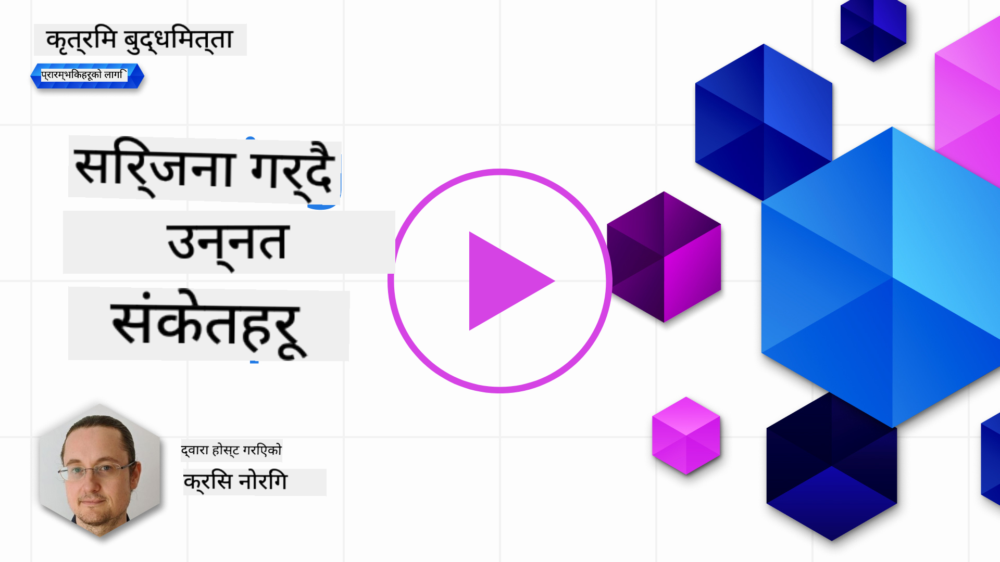

<!--
CO_OP_TRANSLATOR_METADATA:
{
  "original_hash": "ffb706de93ef518f31e0a675c66dfce1",
  "translation_date": "2025-10-17T14:02:15+00:00",
  "source_file": "05-advanced-prompts/README.md",
  "language_code": "ne"
}
-->
# उन्नत प्रम्प्टहरू बनाउने

[](https://youtu.be/BAjzkaCdRok?si=NmUIyRf7-cDgbjtt)

पछिल्लो अध्यायबाट सिकाइहरूलाई पुनः सम्झौं:

> प्रम्प्ट _इन्जिनियरिङ_ भनेको मोडेललाई **अधिक सान्दर्भिक उत्तरहरूतर्फ मार्गदर्शन गर्ने प्रक्रिया** हो, जसले उपयोगी निर्देशन वा सन्दर्भ प्रदान गर्दछ।

प्रम्प्ट लेख्न दुई चरणहरू छन्: प्रम्प्ट निर्माण गर्नु, सान्दर्भिक सन्दर्भ प्रदान गरेर, र दोस्रो भाग _अप्टिमाइजेसन_, जसले प्रम्प्टलाई क्रमिक रूपमा सुधार गर्ने हो।

यस बिन्दुमा, हामीसँग प्रम्प्ट लेख्ने आधारभूत समझ छ, तर हामी अझ गहिरो जान आवश्यक छ। यस अध्यायमा, तपाईं विभिन्न प्रम्प्टहरू प्रयास गर्नेबाट किन एउटा प्रम्प्ट अर्को भन्दा राम्रो छ भन्ने बुझ्न जानुहुनेछ। तपाईं कुनै पनि LLM मा लागू गर्न सकिने केही आधारभूत प्रविधिहरू अनुसरण गर्दै प्रम्प्टहरू निर्माण गर्न सिक्नुहुनेछ।

## परिचय

यस अध्यायमा, हामी निम्न विषयहरू समेट्नेछौं:

- विभिन्न प्रविधिहरूलाई तपाईंको प्रम्प्टहरूमा लागू गरेर प्रम्प्ट इन्जिनियरिङको ज्ञान विस्तार गर्नुहोस्।
- तपाईंको प्रम्प्टहरूलाई आउटपुट फरक पार्न कन्फिगर गर्नुहोस्।

## सिकाइका लक्ष्यहरू

यो पाठ पूरा गरेपछि, तपाईं सक्षम हुनुहुनेछ:

- प्रम्प्ट इन्जिनियरिङ प्रविधिहरू लागू गर्नुहोस् जसले तपाईंको प्रम्प्टहरूको नतिजा सुधार गर्दछ।
- प्रम्प्टिङ गर्नुहोस् जुन फरक वा निर्धारणात्मक हो।

## प्रम्प्ट इन्जिनियरिङ

प्रम्प्ट इन्जिनियरिङ भनेको प्रम्प्टहरू सिर्जना गर्ने प्रक्रिया हो जसले चाहिएको नतिजा उत्पादन गर्दछ। प्रम्प्ट इन्जिनियरिङ भनेको केवल पाठ प्रम्प्ट लेख्ने कुरा मात्र होइन। प्रम्प्ट इन्जिनियरिङ भनेको इन्जिनियरिङ अनुशासन होइन, यो चाहिएको नतिजा प्राप्त गर्न सकिने प्रविधिहरूको सेट हो।

### प्रम्प्टको उदाहरण

आउनुहोस्, यस्तो आधारभूत प्रम्प्टलाई हेरौं:

> भूगोलमा आधारित १० प्रश्नहरू सिर्जना गर्नुहोस्।

यस प्रम्प्टमा, तपाईं वास्तवमा विभिन्न प्रम्प्ट प्रविधिहरूको सेट लागू गर्दै हुनुहुन्छ।

यसलाई टुक्रा-टुक्रामा विभाजन गरौं।

- **सन्दर्भ**, तपाईंले निर्दिष्ट गर्नुभएको छ कि यो "भूगोल" को बारेमा हुनुपर्छ।
- **आउटपुट सीमित गर्नु**, तपाईंले १० भन्दा बढी प्रश्नहरू चाहनुहुन्न।

### साधारण प्रम्प्टिङको सीमाहरू

तपाईंले चाहेको नतिजा प्राप्त गर्न सक्नुहुन्छ वा सक्नुहुन्न। तपाईंले प्रश्नहरू उत्पन्न गर्नुहुनेछ, तर भूगोल ठूलो विषय हो र तपाईंले चाहेको कुरा प्राप्त गर्न सक्नुहुन्न निम्न कारणहरूका कारण:

- **ठूलो विषय**, तपाईंलाई थाहा छैन कि यो देशहरू, राजधानीहरू, नदीहरू आदि को बारेमा हुनेछ।
- **ढाँचा**, यदि तपाईंले प्रश्नहरूलाई निश्चित तरिकामा ढाँचा दिन चाहनुभएको भए के हुन्छ?

जस्तो देखिन्छ, प्रम्प्टहरू सिर्जना गर्दा विचार गर्न धेरै कुरा छन्।

अहिलेसम्म, हामीले साधारण प्रम्प्टको उदाहरण देखेका छौं, तर जेनेरेटिभ AI विभिन्न भूमिकाहरू र उद्योगहरूमा मानिसहरूलाई मद्दत गर्न धेरै सक्षम छ। आउनुहोस् केही आधारभूत प्रविधिहरू अन्वेषण गरौं।

### प्रम्प्टिङका प्रविधिहरू

पहिले, हामीले बुझ्न आवश्यक छ कि प्रम्प्टिङ LLM को _उत्पन्न_ गुण हो, जसको अर्थ यो मोडेलमा निर्मित सुविधा होइन तर मोडेल प्रयोग गर्दा हामीले पत्ता लगाउने कुरा हो।

हामीले LLM लाई प्रम्प्ट गर्न प्रयोग गर्न सकिने केही आधारभूत प्रविधिहरू छन्। आउनुहोस् तिनीहरूलाई अन्वेषण गरौं।

- **जिरो-शट प्रम्प्टिङ**, यो प्रम्प्टिङको सबैभन्दा आधारभूत रूप हो। यो एकल प्रम्प्ट हो जसले LLM लाई केवल यसको प्रशिक्षण डाटामा आधारित प्रतिक्रिया अनुरोध गर्दछ।
- **फ्यु-शट प्रम्प्टिङ**, यो प्रकारको प्रम्प्टिङले LLM लाई १ वा बढी उदाहरणहरू प्रदान गरेर मार्गदर्शन गर्दछ जसमा यसले आफ्नो प्रतिक्रिया उत्पन्न गर्न भर पर्न सक्छ।
- **चेन-अफ-थट**, यो प्रकारको प्रम्प्टिङले LLM लाई समस्या चरणहरूमा विभाजन गर्न सिकाउँछ।
- **उत्पन्न ज्ञान**, प्रम्प्टको प्रतिक्रिया सुधार गर्न, तपाईंले आफ्नो प्रम्प्टमा अतिरिक्त रूपमा उत्पन्न तथ्यहरू वा ज्ञान प्रदान गर्न सक्नुहुन्छ।
- **लिस्ट टु मोस्ट**, चेन-अफ-थट जस्तै, यो प्रविधि समस्या समाधानलाई चरणहरूको श्रृंखलामा विभाजन गर्ने बारे हो र त्यसपछि यी चरणहरूलाई क्रममा प्रदर्शन गर्न सोध्ने।
- **सेल्फ-रिफाइन**, यो प्रविधि LLM को आउटपुटको आलोचना गर्ने र त्यसपछि यसलाई सुधार गर्न सोध्ने बारे हो।
- **मायुटिक प्रम्प्टिङ**, यहाँ तपाईंले LLM को उत्तर सही छ भनेर सुनिश्चित गर्न चाहनुहुन्छ र उत्तरका विभिन्न भागहरू व्याख्या गर्न सोध्नुहुन्छ। यो सेल्फ-रिफाइनको एक रूप हो।

### जिरो-शट प्रम्प्टिङ

यो प्रम्प्टिङ शैली धेरै सरल छ, यसमा एकल प्रम्प्ट समावेश छ। यो प्रविधि सम्भवतः तपाईंले LLM को बारेमा सिक्न सुरु गर्दा प्रयोग गरिरहनुभएको छ। यहाँ एक उदाहरण छ:

- प्रम्प्ट: "अल्जेब्रा के हो?"
- उत्तर: "अल्जेब्रा गणितको एउटा शाखा हो जसले गणितीय प्रतीकहरू र ती प्रतीकहरूलाई हेरफेर गर्ने नियमहरूको अध्ययन गर्दछ।"

### फ्यु-शट प्रम्प्टिङ

यो प्रम्प्टिङ शैलीले अनुरोधसँगै केही उदाहरणहरू प्रदान गरेर मोडेललाई मद्दत गर्दछ। यसमा एकल प्रम्प्ट र थप कार्य-विशिष्ट डाटा समावेश हुन्छ। यहाँ एक उदाहरण छ:

- प्रम्प्ट: "शेक्सपियरको शैलीमा कविता लेख्नुहोस्। यहाँ शेक्सपियरियन सोननेट्सका केही उदाहरणहरू छन्:
  सोननेट १८: 'तिमीलाई गर्मीको दिनसँग तुलना गरौं? तिमी अधिक सुन्दर र अधिक मधुर छौ...'
  सोननेट ११६: 'साँचो मनहरूको विवाहमा बाधा स्वीकार गरौं। प्रेम प्रेम होइन जुन परिवर्तन हुँदा परिवर्तन हुन्छ...'
  सोननेट १३२: 'तिम्रा आँखाहरू म प्रेम गर्छु, र तिनीहरूले मलाई दया गर्दै, तिम्रो हृदयले मलाई तिरस्कारले पीडा दिन्छ,...'
  अब, चन्द्रमाको सुन्दरताको बारेमा एक सोननेट लेख्नुहोस्।"
- उत्तर: "आकाशमा, चन्द्रमा नरम चम्किन्छ, चाँदीको प्रकाशमा यसको कोमल अनुग्रह फैलिन्छ,..."

उदाहरणहरूले LLM लाई चाहिएको आउटपुटको सन्दर्भ, ढाँचा वा शैली प्रदान गर्दछ। तिनीहरूले मोडेललाई विशिष्ट कार्य बुझ्न र अधिक सटीक र सान्दर्भिक प्रतिक्रियाहरू उत्पन्न गर्न मद्दत गर्छन्।

### चेन-अफ-थट

चेन-अफ-थट एक धेरै रोचक प्रविधि हो किनभने यो LLM लाई चरणहरूको श्रृंखलामा लैजाने बारे हो। विचार भनेको LLM लाई के गर्ने भनेर बुझ्न यस्तो तरिकामा निर्देशन दिनु हो। निम्न उदाहरणलाई विचार गर्नुहोस्, चेन-अफ-थटको साथ र बिना:

    - प्रम्प्ट: "एलिससँग ५ स्याउ छन्, ३ स्याउ फाल्छिन्, २ स्याउ बबलाई दिन्छिन् र बबले एउटा फिर्ता दिन्छ, एलिससँग कति स्याउ छन्?"
    - उत्तर: ५

LLM ले ५ उत्तर दिन्छ, जुन गलत छ। सही उत्तर १ स्याउ हो, गणना अनुसार (५ -३ -२ + १ = १)।

त्यसैले हामीले LLM लाई यो सही गर्न कसरी सिकाउन सक्छौं?

आउनुहोस् चेन-अफ-थट प्रयास गरौं। चेन-अफ-थट लागू गर्ने भनेको:

1. LLM लाई समान उदाहरण दिनुहोस्।
1. गणना देखाउनुहोस्, र यसलाई सही रूपमा गणना गर्ने तरिका देखाउनुहोस्।
1. मूल प्रम्प्ट प्रदान गर्नुहोस्।

यसरी:

- प्रम्प्ट: "लिसासँग ७ स्याउ छन्, १ स्याउ फाल्छिन्, ४ स्याउ बार्टलाई दिन्छिन् र बार्टले एउटा फिर्ता दिन्छ:
  ७ -१ = ६
  ६ -४ = २
  २ +१ = ३  
  एलिससँग ५ स्याउ छन्, ३ स्याउ फाल्छिन्, २ स्याउ बबलाई दिन्छिन् र बबले एउटा फिर्ता दिन्छ, एलिससँग कति स्याउ छन्?"
  उत्तर: १

ध्यान दिनुहोस् कि हामीले अर्को उदाहरण, एक गणना र त्यसपछि मूल प्रम्प्टको साथमा उल्लेखनीय रूपमा लामो प्रम्प्ट लेख्छौं र हामी सही उत्तर १ मा पुग्छौं।

जस्तो देखिन्छ, चेन-अफ-थट एक धेरै शक्तिशाली प्रविधि हो।

### उत्पन्न ज्ञान

धेरै पटक जब तपाईं प्रम्प्ट निर्माण गर्न चाहनुहुन्छ, तपाईंले आफ्नो कम्पनीको डाटा प्रयोग गरेर यो गर्न चाहनुहुन्छ। तपाईंको प्रम्प्टको भाग कम्पनीबाट हुनुपर्छ र अर्को भाग तपाईंलाई चासो लागेको वास्तविक प्रम्प्ट हुनुपर्छ।

उदाहरणको रूपमा, यदि तपाईं बीमा व्यवसायमा हुनुहुन्छ भने तपाईंको प्रम्प्ट यसरी देखिन सक्छ:

```text
{{company}}: {{company_name}}
{{products}}:
{{products_list}}
Please suggest an insurance given the following budget and requirements:
Budget: {{budget}}
Requirements: {{requirements}}
```

माथि, तपाईंले देख्न सक्नुहुन्छ कि प्रम्प्ट टेम्प्लेट प्रयोग गरेर निर्माण गरिएको छ। टेम्प्लेटमा `{{variable}}` द्वारा निर्दिष्ट गरिएको धेरै भेरिएबलहरू छन्, जुन कम्पनी API बाट वास्तविक मानहरूद्वारा प्रतिस्थापित गरिनेछ।

यहाँ उदाहरण छ कि भेरिएबलहरू सामग्रीले प्रतिस्थापित भएपछि प्रम्प्ट कस्तो देखिन्छ:

```text
Insurance company: ACME Insurance
Insurance products (cost per month):
- Car, cheap, 500 USD
- Car, expensive, 1100 USD
- Home, cheap, 600 USD
- Home, expensive, 1200 USD
- Life, cheap, 100 USD

Please suggest an insurance given the following budget and requirements:
Budget: $1000
Requirements: Car, Home, and Life insurance
```

यो प्रम्प्टलाई LLM मार्फत चलाउँदा यस्तो प्रतिक्रिया उत्पन्न हुनेछ:

```output
Given the budget and requirements, we suggest the following insurance package from ACME Insurance:
- Car, cheap, 500 USD
- Home, cheap, 600 USD
- Life, cheap, 100 USD
Total cost: $1,200 USD
```

जस्तो देखिन्छ, यसले लाइफ इन्सुरेन्स पनि सुझाव दिन्छ, जुन यसले गर्नु हुँदैन। यो नतिजा संकेत हो कि हामीले प्रम्प्टलाई स्पष्ट बनाउन परिवर्तन गरेर प्रम्प्टलाई अनुकूलित गर्न आवश्यक छ। केही _परीक्षण र त्रुटि_ पछि, हामी निम्न प्रम्प्टमा पुग्छौं:

```text
Insurance company: ACME Insurance
Insurance products (cost per month):
- type: Car, cheap, cost: 500 USD
- type: Car, expensive, cost: 1100 USD
- type: Home, cheap, cost: 600 USD
- type: Home, expensive, cost: 1200 USD
- type: Life, cheap, cost: 100 USD

Please suggest an insurance given the following budget and requirements:
Budget: $1000 restrict choice to types: Car, Home
```

ध्यान दिनुहोस् कि _प्रकार_ र _लागत_ थप्नु र _प्रतिबन्ध_ शब्द प्रयोग गर्नुले LLM लाई हामी के चाहन्छौं भनेर बुझ्न मद्दत गर्दछ।

अब हामी निम्न प्रतिक्रिया प्राप्त गर्छौं:

```output
Given the budget and requirements, we suggest the Car, Cheap insurance product which costs 500 USD per month.
```

यस उदाहरणको उद्देश्य भनेको देखाउनु थियो कि हामी _उत्पन्न ज्ञान_ जस्तो आधारभूत प्रविधि प्रयोग गरिरहेका भए पनि, हामीले चाहिएको नतिजा प्राप्त गर्न अधिकांश अवस्थामा प्रम्प्टलाई अनुकूलित गर्न आवश्यक छ।

### लिस्ट टु मोस्ट

लिस्ट टु मोस्ट प्रम्प्टिङको विचार भनेको ठूलो समस्यालाई उपसमस्याहरूमा विभाजन गर्नु हो। यसरी, तपाईंले LLM लाई ठूलो समस्या "जित्ने" तरिका मार्गदर्शन गर्न मद्दत गर्नुहुन्छ। राम्रो उदाहरण डाटा साइन्सको लागि हुन सक्छ जहाँ तपाईं LLM लाई यसरी समस्या विभाजन गर्न सोध्न सक्नुहुन्छ:

> प्रम्प्ट: डाटा साइन्स ५ चरणमा कसरी प्रदर्शन गर्ने?

तपाईंको AI सहायकले यसरी उत्तर दिनेछ:

1. डाटा सङ्कलन गर्नुहोस्
1. डाटा सफा गर्नुहोस्
1. डाटा विश्लेषण गर्नुहोस्
1. डाटा प्लट गर्नुहोस्
1. डाटा प्रस्तुत गर्नुहोस्

### सेल्फ-रिफाइन, नतिजाको आलोचना गर्नुहोस्

जेनेरेटिभ AI र LLM हरूसँग, तपाईं आउटपुटमा विश्वास गर्न सक्नुहुन्न। तपाईंले यसलाई प्रमाणित गर्न आवश्यक छ। आखिर, LLM केवल तपाईंलाई के भन्नु उचित छ भनेर प्रस्तुत गर्दैछ, सही के हो भनेर होइन। त्यसैले, LLM लाई आफैंको आलोचना गर्न सोध्नु राम्रो विचार हो, जसले हामीलाई सेल्फ-रिफाइन प्रविधिमा पुर्‍याउँछ।

यसले काम गर्ने तरिका भनेको तपाईंले निम्न चरणहरू अनुसरण गर्नु हो:

1. LLM लाई समस्या समाधान गर्न सोध्ने प्रारम्भिक प्रम्प्ट
1. LLM उत्तर दिन्छ
1. तपाईं उत्तरको आलोचना गर्नुहुन्छ र AI लाई सुधार गर्न सोध्नुहुन्छ
1. LLM फेरि उत्तर दिन्छ, यस पटक आलोचनालाई विचार गर्दै र यसले पाएको समाधानहरू सुझाव दिन्छ

तपाईंले यो प्रक्रिया जति चाहनुहुन्छ त्यति पटक दोहोर्याउन सक्नुहुन्छ।

यहाँ यो प्रविधि प्रयोग गरेर एक उदाहरण छ:

> प्रम्प्ट: "प्रडक्ट्स र कस्टमर्स रुट्स भएको एक Python Web API सिर्जना गर्नुहोस्"

AI उत्तर:

```python
import flask
app = Flask(__name__)

@app.route('/products')
def products():
    return 'Products'

@app.route('/customers')
def customers():
    return 'Customers'
```

> प्रम्प्ट: माथिको कोडको ३ सुधार सुझाव दिनुहोस्

AI उत्तर:

```text
Sure, here are three suggestions to improve the code:

Import the correct module: The first line should import Flask instead of flask. The correct import statement should be from flask import Flask.

Add a main function: Add a if __name__ == '__main__': block to the end of the file to run the application when the file is executed.

Use f-strings: Use f-strings to format the return statements in the route functions. For example, return 'Products' can be changed to return f'This is the {request.path} page'.
```

```python
from flask import Flask, request

app = Flask(__name__)

@app.route('/products')
def products():
    return f'This is the {request.path} page'

@app.route('/customers')
def customers():
    return f'This is the {request.path} page'

if __name__ == '__main__':
    app.run()
```

जस्तो देखिन्छ, माथिको AI प्रतिक्रिया पहिलो सुझाइएको कोडलाई सुधार गर्दैछ पहिलो उत्तरको आलोचना गर्ने धन्यवाद।

### मायुटिक प्रम्प्टिङ

मायुटिक प्रम्प्टिङ एक प्रविधि हो जुन सेल्फ-रिफाइनसँग मिल्दोजुल्दो छ तर यो LLM लाई आफैंलाई व्याख्या गर्न सोध्ने बारे हो। लक्ष्य भनेको LLM को आउटपुटमा असंगतता कम गर्नु हो ताकि यो सही उत्तरमा पुग्न सुनिश्चित गर्न सकियोस्। अनुसरण गर्नुपर्ने कार्यप्रवाह हो:

1. LLM लाई प्रश्नको उत्तर दिन सोध्नुहोस्
1. उत्तरको प्रत्येक भागको लागि, LLM लाई यसलाई थप गहिराइमा व्याख्या गर्न सोध्नुहोस्।
1. यदि असंगतता छन् भने, असंगत भागहरूलाई अस्वीकार गर्नुहोस्।

२ र ३ लाई दोहोर्याउनुहोस् जबसम्म तपाईंले सबै भागहरू पार गर्नुभएको छैन र उत्तरमा सन्तुष्ट हुनुहुन्छ।

यहाँ एक उदाहरण प्रम्प्ट छ:

> प्रम्प्ट: महामारीलाई कम गर्न संकट योजना कसरी बनाउने ५ चरणहरूमा?
> LLM उत्तर:

```text
1. Identify the risks
1. Identify the stakeholders
1. Identify the resources
1. Identify the actions
1. Identify the communication channels
```

यसले ५ चरणहरू पहिचान गरेको छ, तर के हामी यो सही हो भनेर निर्धारण गर्न सक्छौं? आउनुहोस् LLM लाई प्रत्येक चरण व्याख्या गर्न सोधौं:

> प्रम्प्ट: पहिलो चरणलाई थप विवरणमा व्याख्या गर्नुहोस्, महामारीसँग सम्बन्धित जोखिमहरू के हुन्?

```text
The risks are the following:

- Loss of life
- Loss of business
- Loss of reputation
- Loss of customers
- Loss of employees
```

यस बिन्दुमा, हामी चाहन्छौं कि LLM सही हो भनेर सुनिश्चित गर्न त्यसलाई पहिलो जोखिमलाई थप विवरणमा व्याख्या गर्न सोधौं र आशा गरौं कि यो माथिको उत्तरसँग सुसंगत छ:

> प्रम्प्ट: महामारीमा, सबैभन्दा ठूलो जोखिम के हो र किन?

```text
The biggest risk is loss of life because it's the most important thing to protect.
```

> महामारीमा दुई सबैभन्दा ठूलो जोखिमहरू के हुन्?

```text
The two biggest risks are loss of life and loss of business.
```

यस बिन्दुमा, LLM सुसंगत छ र "जीवन" र "व्यवसाय" लाई शीर्ष दुई जोखिमहरूका रूपमा उल्लेख गर्दछ। अब हामी अर्को चरणमा अगाडि बढ्न सक्छौं र उचित रूपमा विश्वस्त महसुस गर्न सक्छौं। यद्यपि, हामीले LLM लाई अन्धाधुन्ध विश्वास गर्नु हुँदैन, हामीले सधैं आउटपुटलाई प्रमाणित गर्नुपर्छ।

## तपाईंको आउटपुट फरक पार्नुहोस्

LLM हरू स्वाभाविक रूपमा गैर-निर्धारणात्मक हुन्छन्, जसको अर्थ तपाईंले एउटै प्रम्प्ट चलाउँदा प्रत्येक पटक फरक नतिजा प्राप्त गर्नुहुनेछ। निम्न प्रम्प्ट प्रयास गर्नुहोस्:

> "Python Web API को लागि कोड सिर्जना गर्नुहोस्"

```python
# Import necessary modules
import flask
from flask import request, jsonify

# Create a Flask app
app = flask.Flask(__name__)

# Create a route for the API
@app.route('/api', methods=['GET'])
def api():
    # Get the data from the request
    data = request.args

    # Process the data
    result = process_data(data)

    # Return the result as JSON
    return jsonify(result)

# Function to process the data
def process_data(data):
    # Do something with the data
    result = data + 1

    # Return the result
    return result

# Run the app
if __name__ == '__main__':
    app.run()

```

उही प्रम्प्ट फेरि चलाउँदा अलि फरक प्रतिक्रिया उत्पन्न हुन्छ:

```python
#import necessary packages
import flask
from flask import request, jsonify

#create the Flask application
app = flask.Flask(__name__)
app.config["DEBUG"] = True

#create a list of books
books = [
    {'id': 0,
     'title': 'A Fire Upon the Deep',
     'author': 'Vernor Vinge',
     'first_sentence': 'The coldsleep itself was dreamless.',
     'year_published': '1992'},
    {'id': 1,
     'title': 'The Ones Who Walk Away From Omelas',
     'author': 'Ursula K. Le Guin',
     'first_sentence': 'With a clamor of bells that set the swallows soaring, the Festival of Summer came to the city Omelas, bright-towered by the sea.',
     'published': '1973'},
    {'id': 2,
     'title': 'Dhalgren',
     'author': 'Samuel R. Delany',
     'first_sentence': 'to wound the autumnal city.',
     'published': '1975'}
]

#create an endpoint for the API
@app.route('/', methods=['GET'])
def home():
    return '''<h1>Books API</h1>
<p>A prototype API for retrieving books.</p>'''

#create an endpoint to return all books
@app.route('/api/v1/resources/books/all', methods=['GET'])
def api_all():
    return jsonify(books)

#create an endpoint to return a single book
@app.route('/api/v1/resources/books', methods=['GET'])
def api_id():
    #check if an ID was provided as part of the URL
    #if ID is provided, assign it to a variable
    #if no ID is provided, display an error
    if 'id' in request.args:
        id = int(request.args['id'])
    else:
        return "Error: No id field provided. Please specify an id."

    #create an empty list for our results
    results = []

    #loop through the data and match results that fit the requested ID
    #IDs are unique, but other fields might return many results
    for book in books:
        if book['id'] == id:
            results.append(book)

    #use the jsonify function from Flask to convert our list of
    #Python dictionaries to the JSON format
    return jsonify(results)

app.run()
```

> त त्यसो भए फरक आउटपुट समस्या हो?

तपाईं के गर्न खोज्दै हुनुहुन्छ भन्ने कुरामा निर्भर गर्दछ। यदि तपाईंलाई विशिष्ट प्रतिक्रिया चाहिन्छ भने यो समस्या हो। यदि तपाईं "भूगोलमा आधारित कुनै पनि ३ प्रश्नहरू सिर्जना गर्नुहोस्" जस्तो फरक आउटपुट ठीक छ भने, यो समस्या होइन।

### तापक्रम प्रयोग गरेर तपाईंको आउटपुट फरक पार्नुहोस्

ठिक छ, त्यसो भए हामीले आउटपुटलाई अधिक अनुमानयोग्य बनाउन सीमित गर्न चाह्यौं, अर्थात् अधिक निर्धारणात्मक। हामीले यो कसरी गर्ने?

तापक्रम ० देखि १ सम्मको मान हो, जहाँ ० सबैभन्दा निर्धारणात्मक हो र १ सबैभन्दा फरक। डिफल्ट मान ०.७ हो। आउनुहोस् तापक्रमलाई ०.१ मा सेट गरेर उही प्रम्प्टको दुई रनमा के हुन्छ हेर्नुहोस्:

> "Python Web API को लागि कोड सिर्जना गर्नुहोस्"

```python
#import necessary libraries
import flask
from flask import request, jsonify

#create an instance of the Flask class
app = flask.Flask(__name__)

#create an endpoint for the API
@app.route('/api/v1/endpoint', methods=['GET'])
def api_endpoint():
    #get the request data
    data = request.get_json()

    #process the data
    result = process_data(data)

    #return the result
    return jsonify(result)

#function to process the data
def process_data(data):
    #process the data
    result = {'result': 'success'}

    #return the result
    return result

#run the Flask app
if __name__ == '__main__':
    app.run()

```

प्रम्प्ट फेरि चलाउँदा हामीलाई यस्तो नतिजा प्राप्त हुन्छ:

```python
#import necessary libraries
import flask
from flask import request, jsonify

#create a Flask app
app = flask.Flask(__name__)

#create a route for the API
@app.route('/api', methods=['GET'])
def api_call():
    #get the data from the request
    data = request.get_json()

    #process the data
    result = process_data(data)

    #return the result
    return jsonify(result)

#define the process_data function
def process_data(data):
    #do something with the data
    result = data + 1

    #return the result
    return result

#run the app
if __name__ == '__main__':
    app.run()

```

यी दुई आउटपुटहरू बीचमा केवल सानो फरक छ। यस पटक विपरीत गरौं, तापक्रम मानलाई ०.९ मा सेट गरौं:

```python
# Import necessary libraries
import flask
from flask import request, jsonify

# Create a Flask app
app = flask.Flask(__name__)

# Create a route for the API
@app.route('/api', methods=['GET'])
def api_call():
    # Get the data from the request
    data = request.args

    # Process the data
    result = process_data(data)

    # Return the result
    return jsonify(result)

# Function to process the data
def process_data(data):
    # Do something with the data
    result = data + 1

    # Return the result
    return result

# Run the app
if __name__ == '__main__':
    app.run()

```

र दोस्रो प्रयासमा तापक्रम मान ०.९ मा:

```python
import flask
from flask import request, jsonify

# create the Flask app
app = flask.Flask(__name__)
app.config['DEBUG'] = True

# create some test data
books = [
    {'id': 0, 'title': 'A Fire Upon The Deep', 'author': 'Vernor Vinge', 'first_sentence': 'The coldsleep itself was dreamless.', 'year_published': '1992'},
    {'id': 1, 'title': 'The Ones Who Walk Away From Omelas', 'author': 'Ursula K. Le Guin', 'first_sentence': 'With a clamor of bells that set the swallows soaring, the Festival of Summer came to the city Omelas, bright-towered by the sea.', 'published': '1973'},
    {'id': 2, 'title': 'Dhalgren', 'author': 'Samuel R. Delany', 'first_sentence': 'to wound the autumnal city.', 'published': '1975'}
]

# create an endpoint
@app.route('/', methods=['GET'])
def home():
    return '''<h1>Welcome to our book API!</h1>'''

@app.route('/api/v1/resources/books

```

जस्तो तपाईंले देख्न सक्नुहुन्छ, नतिजाहरू धेरै फरक छन्।

> ध्यान दिनुहोस्, तपाईंले आउटपुट फरक पार्न सक्ने थप प्यारामिटरहरू छन्, जस्तै top-k, top-p, repetition penalty, length penalty र diversity penalty तर यी पाठ्यक्रमको दायराभन्दा बाहिर छन्।

## राम्रो अभ्यासहरू

तपाईंले चाहेको नतिजा प्राप्त गर्न धेरै अभ्यासहरू लागू गर्न सक्नुहुन्छ। तपाईंले प्रम्प्टिङ धेरै प्रयोग गर्दै जाँदा आफ्नो शैली पत्ता लगाउनुहुनेछ।

हामीले समेटेका प्रविधिहरूको अतिरिक्त, LLM लाई प्रम्प्ट गर्दा विचार गर्नुपर्ने केही राम्रो अभ्यासहरू छन्।

यहाँ विचार गर्नुपर्ने केही राम्रो अभ्यासहरू छन्:

- **सन्दर्भ निर्दिष्ट गर्नुहोस्**। सन्दर्भ महत्त्वपूर्ण छ, जति तपाईं डोमेन, विषय आदि जस्ता विवरण दिन सक्नुहुन्छ, त्यति राम्रो।
- आउटपुट सीमित गर्नुहोस्। यदि तपाईंलाई निश्चित संख्या वा निश्चित लम्बाइ चाहिन्छ भने, यसलाई निर्दिष्ट गर्नुहोस्।
- **के र कसरी दुवै निर्दिष्ट गर्नुहोस्**। तपाईंले के चाहनुहुन्छ र कसरी चाहनुहुन्छ भन्ने कुरा उल्लेख गर्न नबिर्सनुहोस्, उदाहरणका लागि "Python Web API बनाउनुहोस् जसमा routes products र customers छन्, यसलाई ३ फाइलमा विभाजन गर्नुहोस्"।
- **टेम्प्लेटहरू प्रयोग गर्नुहोस्**। प्रायः, तपाईं आफ्नो कम्पनीको डेटा प्रयोग गरेर प्रम्प्टलाई समृद्ध बनाउन चाहनुहुन्छ। यसका लागि टेम्प्लेटहरू प्रयोग गर्नुहोस्। टेम्प्लेटहरूमा भेरिएबलहरू हुन सक्छन् जसलाई तपाईं वास्तविक डेटा संग प्रतिस्थापन गर्नुहुन्छ।
- **शुद्ध लेख्नुहोस्**। LLM ले तपाईंलाई सही उत्तर दिन सक्छ, तर यदि तपाईं शुद्ध लेख्नुहुन्छ भने, तपाईंले अझ राम्रो उत्तर प्राप्त गर्नुहुनेछ।

## असाइनमेन्ट

Flask प्रयोग गरेर साधारण API निर्माण गर्ने Python को कोड यहाँ छ:

```python
from flask import Flask, request

app = Flask(__name__)

@app.route('/')
def hello():
    name = request.args.get('name', 'World')
    return f'Hello, {name}!'

if __name__ == '__main__':
    app.run()
```

GitHub Copilot वा ChatGPT जस्ता AI सहायक प्रयोग गर्नुहोस् र "self-refine" प्रविधि लागू गरेर कोड सुधार गर्नुहोस्।

## समाधान

कृपया कोडमा उपयुक्त प्रम्प्टहरू थपेर असाइनमेन्ट समाधान गर्ने प्रयास गर्नुहोस्।

> [!TIP]
> सुधारको लागि प्रम्प्टलाई वाक्यांशमा राख्नुहोस्, सुधारको संख्या सीमित गर्नु राम्रो विचार हो। तपाईंले सुधारलाई विशेष तरिकामा सोध्न पनि सक्नुहुन्छ, जस्तै आर्किटेक्चर, प्रदर्शन, सुरक्षा आदि।

[Solution](../../../05-advanced-prompts/python/aoai-solution.py)

## ज्ञान जाँच

किन म chain-of-thought प्रम्प्टिङ प्रयोग गर्ने? मलाई १ सही उत्तर र २ गलत उत्तर देखाउनुहोस्।

1. LLM लाई समस्या समाधान गर्न सिकाउन।
1. B, LLM लाई कोडमा त्रुटि पत्ता लगाउन सिकाउन।
1. C, LLM लाई विभिन्न समाधानहरू निकाल्न निर्देशन दिन।

A: 1, किनभने chain-of-thought भनेको LLM लाई समस्या समाधान गर्न सिकाउने हो जसमा चरणहरूको श्रृंखला प्रदान गरिन्छ, र समान समस्याहरू र तिनीहरू कसरी समाधान गरिएका थिए।

## 🚀 चुनौती

तपाईंले असाइनमेन्टमा self-refine प्रविधि प्रयोग गर्नुभयो। तपाईंले निर्माण गरेको कुनै पनि प्रोग्राम लिनुहोस् र यसमा लागू गर्न चाहनुभएको सुधारहरू विचार गर्नुहोस्। अब प्रस्तावित परिवर्तनहरू लागू गर्न self-refine प्रविधि प्रयोग गर्नुहोस्। तपाईंले नतिजा कस्तो लाग्यो, राम्रो वा खराब?

## उत्कृष्ट काम! आफ्नो सिकाइ जारी राख्नुहोस्

यो पाठ पूरा गरेपछि, हाम्रो [Generative AI Learning collection](https://aka.ms/genai-collection?WT.mc_id=academic-105485-koreyst) हेर्नुहोस् र आफ्नो Generative AI ज्ञानलाई अझ स्तरवृद्धि गर्नुहोस्!

Lesson 6 मा जानुहोस् जहाँ हामी Prompt Engineering को ज्ञान प्रयोग गरेर [text generation apps निर्माण गर्नेछौं](../06-text-generation-apps/README.md?WT.mc_id=academic-105485-koreyst)

---

**अस्वीकरण**:  
यो दस्तावेज AI अनुवाद सेवा [Co-op Translator](https://github.com/Azure/co-op-translator) प्रयोग गरेर अनुवाद गरिएको छ। हामी शुद्धताको लागि प्रयास गर्छौं, तर कृपया ध्यान दिनुहोस् कि स्वचालित अनुवादमा त्रुटिहरू वा अशुद्धताहरू हुन सक्छ। यसको मूल भाषा मा रहेको दस्तावेजलाई आधिकारिक स्रोत मानिनुपर्छ। महत्वपूर्ण जानकारीको लागि, व्यावसायिक मानव अनुवाद सिफारिस गरिन्छ। यस अनुवादको प्रयोगबाट उत्पन्न हुने कुनै पनि गलतफहमी वा गलत व्याख्याको लागि हामी जिम्मेवार हुने छैनौं।