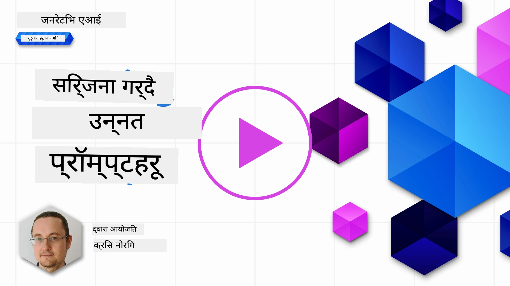

# उन्नत प्रॉम्प्टहरू सिर्जना गर्दै

[](https://youtu.be/BAjzkaCdRok?si=NmUIyRf7-cDgbjtt)

अघिल्लो अध्यायबाट केही सिकाइहरूलाई पुनरावलोकन गरौं:

> प्रॉम्प्ट _इन्जिनियरिङ_ भनेको प्रक्रिया हो जसले हामीलाई **मोडेललाई थप सान्दर्भिक जवाफहरू तर्फ मार्गदर्शन गर्न** उपयोगी निर्देशन वा सन्दर्भ प्रदान गरेर मद्दत गर्ने गर्छ।

प्रॉम्प्ट लेख्न दुई चरणहरू हुन्छन्: सान्दर्भ प्रदान गरेर प्रॉम्प्ट तयार पार्नु, र _अप्टिमाइजेसन_, जसले प्रॉम्प्टलाई क्रमशः सुधार गर्ने प्रक्रिया हो।

यस बखत, हामीसँग प्रॉम्प्ट कसरी लेख्ने भन्ने बारे केही आधारभूत बुझाइ छ, तर हामी अझ गहिराइमा जानु पर्छ। यस अध्यायमा, तपाईं विभिन्न प्रॉम्प्टहरू प्रयास गर्ने क्रममा एउटा प्रॉम्प्ट अर्को भन्दा किन राम्रो हुन्छ बुझ्न सिक्नेछौं। तपाईं कुनै पनि LLM मा लागू गर्न सकिने केहि आधारभूत प्रविधिहरूको पालना गरेर प्रॉम्प्ट तयार पार्ने तरिका सिक्नेछौं।

## परिचय

यस अध्यायमा, हामी तलका विषयहरू समेट्नेछौं:

- विभिन्न प्रविधिहरू तपाईंका प्रॉम्प्टहरूमा लागू गरेर प्रॉम्प्ट इन्जिनियरिङमा तपाईंको ज्ञान विस्तार गर्ने।
- तपाईंका प्रॉम्प्टहरूको आउटपुट परिवर्तन गर्न कन्फिगर गर्ने।

## सिकाइ लक्ष्यहरू

यस पाठ पूरा गरेपछि, तपाईंले गर्न सक्नुहुनेछ:

- तपाईंका प्रॉम्प्टका परिणाम सुधार गर्ने प्रॉम्प्ट इन्जिनियरिङ प्रविधिहरू लागू गर्ने।
- फरक-फरक वा निश्चित नतिजा दिने प्रॉम्प्टिङ प्रदर्शन गर्ने।

## प्रॉम्प्ट इन्जिनियरिङ

प्रॉम्प्ट इन्जिनियरिङ भनेको त्यस्तो प्रॉम्प्टहरू बनाउने प्रक्रिया हो जसले चाहिएको परिणाम उत्पादन गर्नेछन्। प्रॉम्प्ट इन्जिनियरिङ केवल एउटा पाठ प्रॉम्प्ट लेख्नु मात्र होइन। यो कुनै इन्जिनियरिङ् अनुशासन होइन, यो परिणाम प्राप्त गर्न तपाईंले लागू गर्न सक्ने केहि प्रविधिहरूको संग्रह हो।

### प्रॉम्प्टको एउटा उदाहरण

आउनुहोस् एउटा आधारभूत प्रॉम्प्ट लिऔं:

> भूगोल सम्बन्धि १० प्रश्नहरू तयार पार्नुहोस्।

यस प्रॉम्प्टमा, तपाईं वास्तवमा विभिन्न प्रॉम्प्ट प्रविधिहरू प्रयोग गर्दै हुनुहुन्छ।

यसलाई टुक्र्याएर हेरौं।

- **सन्दर्भ**, तपाईंले "भूगोल" मा सन्दर्भ दिनुभएको छ।
- **आउटपुट सीमित पार्नु**, तपाईंले १० भन्दा बढी प्रश्न नचाहनु भएको छ।

### सरल प्रॉम्प्टिङका सिमाहरू

तपाईंलाई चाहिएको परिणाम नआउन सक्छ। तपाईंले प्रश्नहरू पाउनुहुनेछ, तर भूगोल ठूलो विषय हो र निम्न कारणहरूका कारण तपाईंले चाहेको प्राप्त नहुन सक्छ:

- **ठूलो विषय**, तपाईंलाई थाहा छैन यो देशहरू, राजधानीहरू, नदीहरू आदि बारे हुनेछ या होइन।
- **ढाँचा**, तपाईंलाई प्रश्नहरू कुनै निश्चित ढाँचामा चाहिएको भए भने के गर्ने?

जस्तो देखिन्छ, प्रॉम्प्ट बनाउँदा धेरै कुरा विचार गर्नुपर्छ।

अहिलेसम्म, हामीले एउटा सरल प्रॉम्प्ट उदाहरण मात्र देख्यौं, तर जेनेरेटिभ AI विभिन्न भूमिका र उद्योगहरूमा मानिसहरूलाई सहायता गर्न धेरै बढी सक्षम छ। अब केही आधारभूत प्रविधिहरू अन्वेषण गरौं।

### प्रॉम्प्टिङको प्रविधिहरू

पहिले बुझ्नुपर्छ कि प्रॉम्प्टिङ एउटा _उद्भवशील_ गुण हो LLM को, जसको अर्थ यो मोडेलमा निर्मित विशेषता होइन तर प्रयोग गर्दा हामीले पत्ता लगाउने कुरा हो।

LLM मा प्रॉम्प्ट गर्न प्रयोग गर्न सकिने केहि आधारभूत प्रविधिहरू छन्। तिनीहरू अन्वेषण गरौँ।

- **शून्य-शट प्रॉम्प्टिङ**, यो सबैभन्दा आधारभूत रूप हो। यो एकल प्रॉम्प्ट हो जुन LLM को प्रशिक्षण डेटामा आधारित मात्र Jawaf माग्दछ।
- **केही-शट प्रॉम्प्टिङ**, यसले LLM लाई १ वा बढी उदाहरणहरू प्रदान गरेर जवाफ दिन मद्दत गर्छ।
- **चेन-ऑफ-थट**, यसले LLM लाई समस्यालाई चरणहरूमा विभाजन कसरी गर्ने भनेर बताउँछ।
- **सिर्जित ज्ञान**, प्रॉम्प्ट जवाफ सुधार गर्न, तपाईं थप तथ्य वा ज्ञान पनि प्रदान गर्न सक्नुहुन्छ।
- **कम्तिमा देखि बढी (Least to most)**, चेन-ऑफ-थट जस्तै यो प्रविधि समस्यालाई चरणहरूको श्रृंखलामा विभाजन गरेर ती चरणहरूलाई क्रमबद्ध गरि समाधान गर्न भन्न हो।
- **आत्म-सुधार**, यो प्रविधि LLM को आउटपुटको आलोचना गरेर सुधार्न लगाउने हो।
- **मैयेटिक प्रॉम्प्टिङ**। यसले LLM को जवाफ ठिक छ कि छैन सुनिश्चित गर्न र जवाफका विभिन्न भागहरू व्याख्या गर्न भन्ने हो। यो आत्म-सुधारको एक रूप हो।

### शून्य-शट प्रॉम्प्टिङ

यस शैलीको प्रॉम्प्टिङ धेरै सरल हुन्छ, एकल प्रॉम्प्ट हुन्छ। सम्भवतः तपाईंले LLM सिक्दै गर्दा यसलाई प्रयोग गर्दै हुनुहुन्छ। एउटा उदाहरण:

- प्रॉम्प्ट: "एजलब्रा के हो?"
- उत्तर: "एजलब्रा गणितको एक शाखा हो जसले गणितीय चिह्नहरू र ती चिह्नहरुलाई सञ्चालन गर्ने नियमहरूको अध्ययन गर्छ।"

### केही-शट प्रॉम्प्टिङ

यस शैलीमा, मोडेललाई केही उदाहरणहरू सहित अनुरोध दिइन्छ। यसले एकल प्रॉम्प्टसँग थप कार्य-विशिष्ट डाटा पनि समावेश गर्दछ। उदाहरण:

- प्रॉम्प्ट: "शेक्सपियर शैलीमा कविता लेख्नुहोस्। यहाँ शेक्सपियरियन सोननेटका केही उदाहरण छन्:
  सोननेट १८: 'मैले तिमीलाई गर्मीको दिनसँग तुलना गरूँ? तिमी अझ रमणीय र संयमी छौ...'
  सोननेट ११६: 'साँचो मनका बन्धनहरूमा बाधा नपरोस्। माया त्यस्तो होइन जुन परिवर्तन हुँदा बदलिन्छ...'
  सोननेट १३२: 'म तिम्रा आँखा प्रेम गर्छु, र तिनीहरूले, मलाई दया गर्दै, तिम्रो मनले मलाई पीडा दिने...'
  अब, चन्द्रमाको सौन्दर्यमा एउटा सोननेट लेख।"
- उत्तर: "आकाशमा, चन्द्रमा शान्तिलाई प्रकाश पार्दैछ, चाँदीझैँ प्रकाश जसले कोमल अनुग्रह पार्छ,..."

उदाहरणहरूले LLM लाई सन्दर्भ, ढाँचा वा शैली प्रदान गर्छन्, जसले मोडेललाई विशिष्ट कार्य बुझ्न र सहि जवाफ उत्पन्न गर्न सहयोग गर्छ।

### चेन-ऑफ-थट

चेन-ऑफ-थट एक रोचक प्रविधि हो जसमा LLM लाई समस्यालाई क्रमशः चरणहरूमा विभाजन गर्न बताइन्छ। यसले LLM लाई केहि गर्ने तरिका सिकाउन निर्देशन दिन्छ। तलको उदाहरणमा, चेन-ऑफ-थट नभएको र भएको अवस्थामा:

    - प्रॉम्प्ट: "एलिससँग ५ स्याउ छन्, ऊ ३ स्याउ फाल्छ, २ बोबलाई दिन्छ र बोब एक फिर्ता दिन्छ, एलिससँग कति स्याउ बच्छन्?"
    - उत्तर: ५

LLM ले ५ जवाफ दिइरहेको छ जुन गलत हो। सही उत्तर १ स्याउ हो, गणना अनुसार (५ -३ -२ + १ = १)।

अब कसरी LLM लाई यो ठीकसँग गर्न सिकाउने?

चेन-ऑफ-थट प्रयोग गर्ने हो भने:

1. LLM लाई एउटै जस्तो उदाहरण दिइन्छ।
2. गणनालाई देखाइन्छ र सही तरिकाले कसरी गर्ने देखाइन्छ।
3. मूल प्रॉम्प्ट दिइन्छ।

यसरी:

- प्रॉम्प्ट: "लिसासँग ७ स्याउ छन्, ऊ १ स्याउ फाल्छ, ४ स्याउ बार्टलाई दिन्छ र बार्ट एक फिर्ता दिन्छ:
  ७ - १ = ६
  ६ - ४ = २
  २ + १ = ३  
  एलिससँग ५ स्याउ छन्, ऊ ३ स्याउ फाल्छ, २ बोबलाई दिन्छ र बोब एक फिर्ता दिन्छ, एलिससँग कति स्याउ छन्?"
  उत्तर: १

ध्यान दिनुहोस् हामीले अर्को उदाहरण, गणना र मूल प्रॉम्प्ट सहित धेरै लामो प्रॉम्प्ट लेख्यौं र १ सही उत्तरमा पुग्यौं।

जस्तो देखिन्छ चेन-ऑफ-थट धेरै शक्तिशाली प्रविधि हो।

### सिर्जित ज्ञान

धेरैपटक तपाईं आफ्नो कम्पनीको डाटा प्रयोग गरेर प्रॉम्प्ट बनाउन चाहनुहुन्छ। प्रॉम्प्टको भाग कम्पनी बाट र बाँकी तपाईंको इच्छाएको प्रॉम्प्टबाट आउनुपर्छ।

उदाहरणका लागि, तपाईं बीमा व्यवसायमा हुनुहुन्छ भने तपाईंको प्रॉम्प्ट यस्तो देखिन सक्छ:

```text
{{company}}: {{company_name}}
{{products}}:
{{products_list}}
Please suggest an insurance given the following budget and requirements:
Budget: {{budget}}
Requirements: {{requirements}}
```

माथि, तपाईंले एउटा टेम्प्लेट प्रयोग गरेर प्रॉम्प्ट तयार पारिएको देख्नुहुन्छ। टेम्प्लेटमा `{{variable}}` द्वारा चिन्हित विभिन्न चरहरू हुन्छन्, जुन कम्पनी API बाट वास्तविक मानहरूबाट प्रतिस्थापन गरिन्छ।

यहाँ तपाईंका कम्पनीको सामग्रीबाट चरहरू प्रतिस्थापन पछि प्रॉम्प्ट कस्तो देखिन सक्छ:

```text
Insurance company: ACME Insurance
Insurance products (cost per month):
- Car, cheap, 500 USD
- Car, expensive, 1100 USD
- Home, cheap, 600 USD
- Home, expensive, 1200 USD
- Life, cheap, 100 USD

Please suggest an insurance given the following budget and requirements:
Budget: $1000
Requirements: Car, Home, and Life insurance
```

यो प्रॉम्प्ट LLMमा चलाउँदा यस्तो जवाफ आउँछ:

```output
Given the budget and requirements, we suggest the following insurance package from ACME Insurance:
- Car, cheap, 500 USD
- Home, cheap, 600 USD
- Life, cheap, 100 USD
Total cost: $1,200 USD
```

जस्तो देख्नुभयो, यसले लाइफ इन्स्योरेन्स सिफारिस गर्छ, जुन गर्नु हुँदैन। योले संकेत गर्छ कि हामीले प्रॉम्प्टलाई स्पष्ट बनाउन आवश्यक छ कि के के अनुमति छ। केही _अनुशन्धान र त्रुटि_ पछि हामी निम्न प्रॉम्प्टमा पुग्छौं:

```text
Insurance company: ACME Insurance
Insurance products (cost per month):
- type: Car, cheap, cost: 500 USD
- type: Car, expensive, cost: 1100 USD
- type: Home, cheap, cost: 600 USD
- type: Home, expensive, cost: 1200 USD
- type: Life, cheap, cost: 100 USD

Please suggest an insurance given the following budget and requirements:
Budget: $1000 restrict choice to types: Car, Home
```

ध्यान दिनुहोस् कसरी _प्रकार_ र _लागत_ थप्नु र _प्रतिबन्ध_ शब्द प्रयोग गर्नुले LLM लाई के चाहिन्छ बुझ्नमा मदद गर्छ।

अब हामीलाई यस्तो जवाफ आउँछ:

```output
Given the budget and requirements, we suggest the Car, Cheap insurance product which costs 500 USD per month.
```

यस उदाहरणको उद्देश्य देखाउनु थियो कि यद्यपि हामी आधारभूत प्रविधि जस्तै _सिर्जित ज्ञान_ प्रयोग गर्दैछौं, अधिकांश अवस्थामा चाहिएको नतिजा पाउन प्रॉम्प्टलाई सुधार गर्नु आवश्यक छ।

### कम्तिमा देखि बढी

कम्तिमा देखि बढी प्रॉम्प्टिङको विचार ठूलो समस्यालाई साना साना उपसमस्याहरूमा विभाजन गर्नु हो। यसरी तपाईं LLM लाई ठूलो समस्या कसरी ‘राज गर्दै’ अगाडी बढ्ने हो भनेर मार्गदर्शन गर्नुहुन्छ। डेटा विज्ञानको लागि यो एउटा राम्रो उदाहरण हुन सक्छ जहाँ तपाईं LLM लाई यस्तो प्रश्न सोध्न सक्नुहुन्छ:

> प्रॉम्प्ट: डेटा विज्ञान ५ चरणमा कसरी गर्ने?

तपाईंको AI सहायक जवाफ दिनेछ:

1. डाटा सङ्कलन
1. डाटा सफाइ
1. डाटा विश्लेषण
1. डाटा प्लट
1. डाटा प्रस्तुत

### आत्म-सुधार, नतिजाको आलोचना

जेनेरेटिभ AI र LLM सँग, तपाईं आउटपुटमा पूर्ण भरोसा गर्न सक्नुहुन्न। तपाईंले यसलाई प्रमाणीकरण गर्नुपर्छ। LLM ले मात्र अर्को सबैभन्दा सम्भावित कुरा भन्छ, सही कुरा होइन। त्यसैले राम्रो हुन्छ LLM लाई आफैं आलोचना गर्न लगाउने, जुन आत्म-सुधार प्रविधि हो।

यो यसरी काम गर्छ:

1. सुरुवाती प्रॉम्प्टले समस्या समाधान गर्न LLM लाई सोध्छ
2. LLM जवाफ दिन्छ
3. तपाईं जवाफको आलोचना गर्नुहुन्छ र AI लाई सुधार गर्न भन्नुहुन्छ
4. LLM फेरि जवाफ दिन्छ, आलोचना विचार गरेर समाधान सुझाव दिन्छ

यो प्रक्रिया तपाईं जतिसुकै पटक दोहोर्याउन सक्नुहुन्छ।

यो प्रविधि प्रयोग गरेर एउटा उदाहरण:

> प्रॉम्प्ट: "पाइथन वेब API सिर्जना गर्नुहोस् जसमा routes उत्पादनहरू र ग्राहकहरू छन्"

AI उत्तर:

```python
import flask
app = Flask(__name__)

@app.route('/products')
def products():
    return 'Products'

@app.route('/customers')
def customers():
    return 'Customers'
```

> प्रॉम्प्ट: माथिको कोडका ३ सुधारहरू सुझाव गर्नुहोस्

AI उत्तर:

```text
Sure, here are three suggestions to improve the code:

Import the correct module: The first line should import Flask instead of flask. The correct import statement should be from flask import Flask.

Add a main function: Add a if __name__ == '__main__': block to the end of the file to run the application when the file is executed.

Use f-strings: Use f-strings to format the return statements in the route functions. For example, return 'Products' can be changed to return f'This is the {request.path} page'.
```

```python
from flask import Flask, request

app = Flask(__name__)

@app.route('/products')
def products():
    return f'This is the {request.path} page'

@app.route('/customers')
def customers():
    return f'This is the {request.path} page'

if __name__ == '__main__':
    app.run()
```

जस्तै देखिन्छ, माथिको AI जवाफले पहिलो सुझाव अनुसारको कोडलाई सुधार गर्दैछ।

### मैयेटिक प्रॉम्प्टिङ

मैयेटिक प्रॉम्प्टिङ आत्म-सुधारसँग समान छ, तर यो LLM लाई आफैं व्याख्या गर्न लगाउने प्रविधि हो। उद्देश्य LLM को आउटपुटमा असंगतता घटाउनु हो यसले ठिक जवाफ पक्का गर्न मद्दत गर्छ। कार्यप्रवाह:

1. LLM लाई प्रश्न सोध्नुहोस्
2. उत्तरका हरेक भागलाई बढी गहिराइमा व्याख्या गर्न लगाउनुहोस्।
3. यदि असंगतता छ भने, त्यो भागहरू हटाउनुहोस्।

२ र ३ दोहोर्याउनुहोस् जबसम्म सबै भाग पुरा विश्लेषण गर्नुहुन्छ र उत्तरमा सन्तुष्टि हुन्छ।

उदाहरण प्रॉम्प्ट:

> प्रॉम्प्ट: महामारीको जोखिम न्यूनीकरण गर्न संकट योजना ५ चरणमा कसरी बनाउन सकिन्छ?
> LLM उत्तर:

```text
1. Identify the risks
1. Identify the stakeholders
1. Identify the resources
1. Identify the actions
1. Identify the communication channels
```

५ चरण पहिचान गरियो, तर के यो सही छ? अब हरेक चरण व्याख्या गर्न LLM लाई सोधौं:

> प्रॉम्प्ट: पहिलो चरण बढी विस्तारमा व्याख्या गर्नुहोस्, महामारीमा जोखिमहरू के के छन्?

```text
The risks are the following:

- Loss of life
- Loss of business
- Loss of reputation
- Loss of customers
- Loss of employees
```

अहिले LLM सही छ कि छैन जाँच्न, पहिलो जोखिम थप विस्तारले व्याख्या गर्न लगाऔं:

> प्रॉम्प्ट: महामारीमा सबैभन्दा ठूलो जोखिम के हो र किन?

```text
The biggest risk is loss of life because it's the most important thing to protect.
```

> महामारीमा दुई सबैभन्दा ठूला जोखिम के के हुन्?

```text
The two biggest risks are loss of life and loss of business.
```

यस बखत, LLM सुसंगत छ र “जीवन” र “व्यापार” शीर्ष दुई जोखिमहरू बताएको छ। अब हामी अर्को चरणमा अगाडि बढ्न सक्छौं र विश्वास गर्न सक्छौं। तर पूर्ण भरोसा गर्नु हुँदैन, सँधै नतिजा प्रमाणित गर्नुपर्छ।

## आउटपुट फरक पार्नुहोस्

LLM हरू स्वभावतः अ-निश्चित हुन्छन्, यसको अर्थ एउटै प्रॉम्प्ट बारम्बार चलाउँदा फरक नतिजा आउँछन्। तलको प्रॉम्प्ट प्रयास गर्नुहोस्:

> "पाइथन वेब API को लागि कोड तयार पार्नुहोस्"

```python
# आवश्यक मोड्युलहरू आयात गर्नुहोस्
import flask
from flask import request, jsonify

# Flask एप बनाउनुस्
app = flask.Flask(__name__)

# API का लागि रुट सिर्जना गर्नुहोस्
@app.route('/api', methods=['GET'])
def api():
    # अनुरोधबाट डेटा प्राप्त गर्नुहोस्
    data = request.args

    # डेटालाई प्रक्रिया गर्नुहोस्
    result = process_data(data)

    # परिणामलाई JSON रूपमा फर्काउनुहोस्
    return jsonify(result)

# डेटा प्रक्रिया गर्नको लागि फङ्शन
def process_data(data):
    # डेटासँग केही गर्नुहोस्
    result = data + 1

    # परिणाम फर्काउनुहोस्
    return result

# एप चलाउनुहोस्
if __name__ == '__main__':
    app.run()

```

एउटै प्रॉम्प्ट फेरि चलाउँदा अलि फरक जवाफ आउँछ:

```python
#आवश्यक प्याकेजहरू आयात गर्नुहोस्
import flask
from flask import request, jsonify

#फ्लास्क अनुप्रयोग सिर्जना गर्नुहोस्
app = flask.Flask(__name__)
app.config["DEBUG"] = True

#पुस्तकहरूको सूची सिर्जना गर्नुहोस्
books = [
    {'id': 0,
     'title': 'A Fire Upon the Deep',
     'author': 'Vernor Vinge',
     'first_sentence': 'The coldsleep itself was dreamless.',
     'year_published': '1992'},
    {'id': 1,
     'title': 'The Ones Who Walk Away From Omelas',
     'author': 'Ursula K. Le Guin',
     'first_sentence': 'With a clamor of bells that set the swallows soaring, the Festival of Summer came to the city Omelas, bright-towered by the sea.',
     'published': '1973'},
    {'id': 2,
     'title': 'Dhalgren',
     'author': 'Samuel R. Delany',
     'first_sentence': 'to wound the autumnal city.',
     'published': '1975'}
]

#API को लागि एउटा अन्तबिन्दु सिर्जना गर्नुहोस्
@app.route('/', methods=['GET'])
def home():
    return '''<h1>Books API</h1>
<p>A prototype API for retrieving books.</p>'''

#सबै पुस्तकहरू फिर्ता गर्नको लागि एउटा अन्तबिन्दु सिर्जना गर्नुहोस्
@app.route('/api/v1/resources/books/all', methods=['GET'])
def api_all():
    return jsonify(books)

#एकल पुस्तक फिर्ता गर्नको लागि एउटा अन्तबिन्दु सिर्जना गर्नुहोस्
@app.route('/api/v1/resources/books', methods=['GET'])
def api_id():
    #URL को भागका रूपमा ID प्रदान गरिएको छ कि छैन जाँच गर्नुहोस्
    #यदि ID प्रदान गरिएको छ भने, त्यसलाई एउटा भेरिएबलमा असाइन गर्नुहोस्
    #यदि ID प्रदान गरिएको छैन भने, त्रुटि देखाउनुहोस्
    if 'id' in request.args:
        id = int(request.args['id'])
    else:
        return "Error: No id field provided. Please specify an id."

    #हाम्रा परिणामहरूका लागि एउटा खाली सूची सिर्जना गर्नुहोस्
    results = []

    #डाटामा लूप गर्नुहोस् र अनुरोध गरिएको ID सँग मेल खाने परिणामहरू खोज्नुहोस्
    #ID हरू अद्वितीय हुन्छन्, तर अन्य क्षेत्रहरूले धेरै परिणामहरू फिर्ता गर्न सक्छन्
    for book in books:
        if book['id'] == id:
            results.append(book)

    #हाम्रो सूचीलाई JSON ढाँचामा रूपान्तरण गर्न फ्लास्कको jsonify फंक्शन प्रयोग गर्नुहोस्
    #पाइथन डिक्सनरीहरूलाई JSON ढाँचामा रूपान्तरण गर्नुहोस्
    return jsonify(results)

app.run()
```

> के फरक फरक आउटपुट समस्या हो?

तपाईं के गर्दै हुनुहुन्छ भन्ने कुरामा निर्भर गर्दछ। यदि तपाईं निश्चित जवाफ चाहनुहुन्छ भने समस्या हो। यदि तपाईं फरक फरक जवाफ स्वीकार गर्नुहुन्छ जस्तै "भूगोलमा कुनै ३ प्रश्न तयार पार्नुहोस्", तब समस्या छैन।

### तापक्रम प्रयोग गरेर आउटपुट फरक पार्नुहोस्

हामीले तय ग¥यौं कि आउटपुटलाई बढी निर्धारणयोग्य बनाउन चाहन्छौं। त्यसो भए कसरी गर्ने?

तापक्रम ० देखि १ बीच मान हो, जहाँ ० सबैभन्दा निश्चित र १ सबैभन्दा फरक-फरक हुन्छ। पूर्वनिर्धारित मान ०.७ हो। अब त्यही प्रॉम्प्ट तापक्रम ०.१ राखेर दुई पटक चलाउँदा के हुन्छ हेर्नुहोस्:

> "पाइथन वेब API को लागि कोड तयार पार्नुहोस्"

```python
#आवश्यक लाइब्रेरीहरू आयात गर्नुहोस्
import flask
from flask import request, jsonify

#Flask क्लासको एउटा उदाहरण बनाउनुहोस्
app = flask.Flask(__name__)

#API को लागि एउटा एन्डपोइन्ट बनाउनुहोस्
@app.route('/api/v1/endpoint', methods=['GET'])
def api_endpoint():
    #अनुरोध डेटा प्राप्त गर्नुहोस्
    data = request.get_json()

    #डाटालाई प्रशोधन गर्नुहोस्
    result = process_data(data)

    #परिणाम फर्काउनुहोस्
    return jsonify(result)

#डाटालाई प्रशोधन गर्ने कार्यक्षमता
def process_data(data):
    #डाटालाई प्रशोधन गर्नुहोस्
    result = {'result': 'success'}

    #परिणाम फर्काउनुहोस्
    return result

#Flask एप्लिकेशन चलाउनुहोस्
if __name__ == '__main__':
    app.run()

```

फेरि चलाउँदा यस्तो आउँछ:

```python
#आवश्यक लाइब्रेरीहरू आयात गर्नुहोस्
import flask
from flask import request, jsonify

#एउटा Flask एप बनाउनुहोस्
app = flask.Flask(__name__)

#API को लागि एउटा मार्ग बनाउनुहोस्
@app.route('/api', methods=['GET'])
def api_call():
    #अनुरोधबाट डाटा प्राप्त गर्नुहोस्
    data = request.get_json()

    #डाटालाई प्रक्रिया गर्नुहोस्
    result = process_data(data)

    #परिणाम फर्काउनुहोस्
    return jsonify(result)

#process_data फन्क्सन परिभाषित गर्नुहोस्
def process_data(data):
    #डाटासँग केही गर्नुहोस्
    result = data + 1

    #परिणाम फर्काउनुहोस्
    return result

#एप चलाउनुहोस्
if __name__ == '__main__':
    app.run()

```

यी दुई आउटपुटबीच सानो मात्र फरक छ। अब विपरीत गर्नुहोस्, तापक्रम ०.९ राखौं:

```python
# आवश्यक लाइब्रेरीहरू आयात गर्नुहोस्
import flask
from flask import request, jsonify

# फ्लास्क एप सिर्जना गर्नुहोस्
app = flask.Flask(__name__)

# API को लागि मार्ग सिर्जना गर्नुहोस्
@app.route('/api', methods=['GET'])
def api_call():
    # अनुरोधबाट डाटा प्राप्त गर्नुहोस्
    data = request.args

    # डाटाको प्रशोधन गर्नुहोस्
    result = process_data(data)

    # परिणाम फिर्ता गर्नुहोस्
    return jsonify(result)

# डाटा प्रशोधन गर्ने कार्य
def process_data(data):
    # डाटासँग केहि गर्नुहोस्
    result = data + 1

    # परिणाम फिर्ता गर्नुहोस्
    return result

# एप चलाउनुहोस्
if __name__ == '__main__':
    app.run()

```

र दोस्रो प्रयास तापक्रम ०.९ मा:

```python
import flask
from flask import request, jsonify

# फ्लास्क एप्लिकेसन तयार पार्नुहोस्
app = flask.Flask(__name__)
app.config['DEBUG'] = True

# केही परीक्षण डेटा तयार गर्नुहोस्
books = [
    {'id': 0, 'title': 'A Fire Upon The Deep', 'author': 'Vernor Vinge', 'first_sentence': 'The coldsleep itself was dreamless.', 'year_published': '1992'},
    {'id': 1, 'title': 'The Ones Who Walk Away From Omelas', 'author': 'Ursula K. Le Guin', 'first_sentence': 'With a clamor of bells that set the swallows soaring, the Festival of Summer came to the city Omelas, bright-towered by the sea.', 'published': '1973'},
    {'id': 2, 'title': 'Dhalgren', 'author': 'Samuel R. Delany', 'first_sentence': 'to wound the autumnal city.', 'published': '1975'}
]

# एउटा अन्त बिन्दु तयार गर्नुहोस्
@app.route('/', methods=['GET'])
def home():
    return '''<h1>Welcome to our book API!</h1>'''

@app.route('/api/v1/resources/books

```

जस्तो देखिन्छ, परिणामहरू अत्यन्त फरक छन्।
> नोट गर्नुहोस्, थप प्यारामिटरहरू छन् जसलाई तपाईं आउटपुटलाई भिन्न बनाउन परिवर्तन गर्न सक्नुहुन्छ, जस्तै top-k, top-p, पुनरावृत्ति दण्ड, लम्बाइ दण्ड र विविधता दण्ड तर यी यस पाठ्यक्रमको दायरामा पर्दैनन्।

## राम्रा अभ्यासहरू

तपाईंले पाउन चाहानुभएको कुरालाई प्राप्त गर्न प्रयास गर्न धेरै अभ्यासहरू लागू गर्न सक्नुहुन्छ। तपाईंले जति बढी प्राँपोइन्टिङ प्रयोग गर्नुहुन्छ, तपाईं आफ्नो आफ्नै शैली पत्ता लगाउनुहुनेछ।

हामीले समेटेका प्रविधिहरूमा थप, LLM लाई प्राँपोइन्ट गर्दा विचार गर्नु पर्ने केही राम्रा अभ्यासहरू छन्।

यहाँ विचार गर्न योग्य केहि राम्रा अभ्यासहरू छन्:

- **सन्दर्भ निर्दिष्ट गर्नुहोस्**। सन्दर्भ महत्त्वपूर्ण हुन्छ, तपाईं जति बढी निर्दिष्ट गर्न सक्नुहुन्छ जस्तै डोमेन, विषय आदि त्यति राम्रो हुन्छ।
- आउटपुट सीमित गर्नुहोस्। यदि तपाईंलाई निश्चित संख्या वा निश्चित लम्बाइ चाहिन्छ भने, त्यसलाई निर्दिष्ट गर्नुहोस्।
- **के र कसरी दुबै निर्दिष्ट गर्नुहोस्**। के चाहिन्छ र कसरी चाहिन्छ भनेर दुवै उल्लेख गर्न याद गर्नुहोस्, उदाहरणका लागि “Python Web API बनाउनुहोस् जसमा routes products र customers छन्, यसलाई 3 फाइलहरूमा विभाजन गर्नुहोस्”।
- **टेम्प्लेटहरू प्रयोग गर्नुहोस्**। प्रायः, तपाईंले आफ्नो कम्पनीको डाटा प्रयोग गरेर तपाईंको प्राँपोइन्टहरूलाई समृद्ध बनाउन चाहनुहुनेछ। टेम्प्लेटहरू प्रयोग गर्नुहोस्। टेम्प्लेटहरूमा त्यस्ता भेरिएबलहरू हुन सक्छन् जुन तपाईं वास्तविक डाटासँग प्रतिस्थापन गर्नुहुन्छ।
- **सही वर्तनी प्रयोग गर्नुहोस्**। LLMहरूले तपाईंलाई सहि जवाफ दिन सक्छन्, तर यदि तपाईंले सहि वर्तनी गर्नुहुन्छ भने, तपाईं राम्रो जवाफ पाउनुहुनेछ।

## टास्क

यहाँ Python मा Flask प्रयोग गरेर सरल API कसरी बनाउन सकिन्छ भन्ने कोड छ:

```python
from flask import Flask, request

app = Flask(__name__)

@app.route('/')
def hello():
    name = request.args.get('name', 'World')
    return f'Hello, {name}!'

if __name__ == '__main__':
    app.run()
```

GitHub Copilot वा ChatGPT जस्ता AI सहायकको प्रयोग गर्नुहोस् र "आफ्नो-आफै-सुधार" प्रविधि लागू गरेर कोड सुधार गर्नुहोस्।

## समाधान

कृपया कोडमा उपयुक्त प्राँपोइन्टहरू थपेर यो टास्क समाधान गर्न प्रयास गर्नुहोस्।

> [!TIP]
> सुधारका लागि सोध्ने प्राँपोइन्ट तयार गर्नुहोस्, सुधारको संख्या सीमित गर्नु राम्रो हुन्छ। तपाईं यसलाई एउटा विशिष्ट तरिकाले सुधार गर्न पनि अनुरोध गर्न सक्नुहुन्छ, जस्तै वास्तुकला, प्रदर्शन, सुरक्षा आदि।

[समाधान](../../../05-advanced-prompts/python/aoai-solution.py)

## ज्ञान जाँच

किन म chain-of-thought prompting प्रयोग गर्ने? मलाई १ सहि उत्तर र २ गलत उत्तरहरू देखाइदिनुहोस्।

1. समस्याको समाधान कसरी गर्ने भनेर LLM लाई सिकाउन।
1. B, LLM लाई कोडमा त्रुटिहरू पत्ता लगाउन सिकाउन।
1. C, LLM लाई विभिन्न समाधानहरू सोच्न निर्देशन दिन।

उत्तर: 1, किनभने chain-of-thought LLM लाई समस्याको समाधान कसरी गर्ने भनेर एउटा कदम-दर-कदम शृंखलाद्वारा देखाउने बारे हो, र समान समस्याहरू र तिनीहरू कसरी समाधान भएका थिए।

## 🚀 चुनौती

तपाईंले टास्कमा आफ्नो-आफ्नै-सुधार प्रविधि प्रयोग गर्नुभयो। तपाईंले बनाएको कुनै पनि प्रोग्राम लिएर सोच्नुहोस् कि के सुधारहरू लागू गर्न चाहानुहुन्छ। अब प्रस्तावित परिवर्तनहरू लागू गर्न आफ्नो-आफ्नै-सुधार प्रविधि प्रयोग गर्नुहोस्। तपाईंलाई परिणाम कस्तो लाग्यो, राम्रो वा नराम्रो?

## शानदार काम! आफ्नो सिकाइ जारी राख्नुहोस्

यस पाठ पूरा गरेपछि, हाम्रो [Generative AI Learning collection](https://aka.ms/genai-collection?WT.mc_id=academic-105485-koreyst) अवलोकन गर्नुहोस् र आफ्नो Generative AI ज्ञानलाई अझ उचाइमा पुर्‍याउन जारी राख्नुहोस्!

अब हामी पाठ ६ मा जाँदैछौं जहाँ हामी हाम्रो Prompt Engineering ज्ञान लागू गर्दै [टेक्स्ट जेनेरेशन एप्स निर्माण गर्नेछौं](../06-text-generation-apps/README.md?WT.mc_id=academic-105485-koreyst)

---

<!-- CO-OP TRANSLATOR DISCLAIMER START -->
**अस्वीकरण**:
यो दस्तावेज़ AI अनुवाद सेवा [Co-op Translator](https://github.com/Azure/co-op-translator) प्रयोग गरेर अनुवाद गरिएको हो। हामी सही हुन प्रयास गर्छौं, तर कृपया जानकार हुनुस् कि स्वचालित अनुवादमा त्रुटिहरू वा अशुद्धताहरू हुन सक्छन्। मूल दस्तावेज़ यसको मूल भाषामा आधिकारिक स्रोत मानिनुपर्छ। महत्वपूर्ण जानकारीका लागि व्यावसायिक मानव अनुवाद सिफारिस गरिन्छ। यस अनुवादको प्रयोगबाट उत्पन्न कुनै पनि गलत बुझाइ वा त्रुटिको लागि हामी जिम्मेवार छैनौं।
<!-- CO-OP TRANSLATOR DISCLAIMER END -->