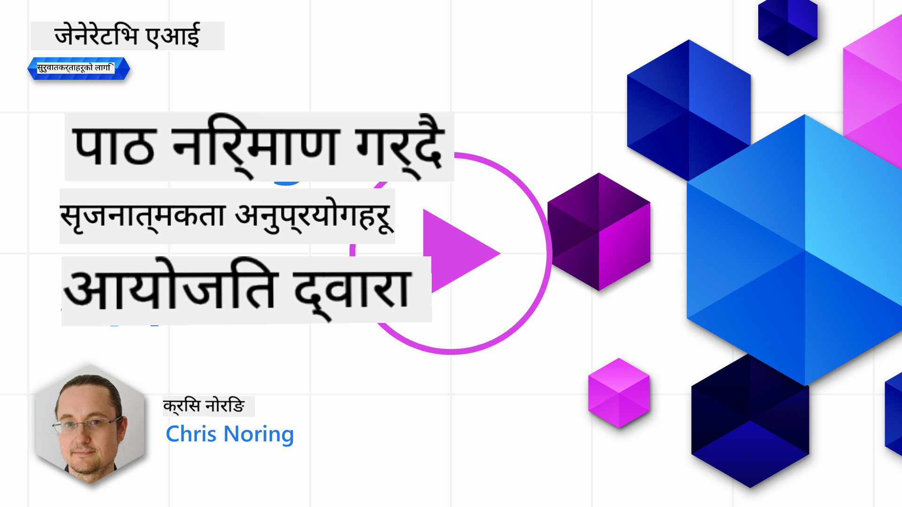

<!--
CO_OP_TRANSLATOR_METADATA:
{
  "original_hash": "df027997f1448323d6159b78a1b669bf",
  "translation_date": "2025-10-18T00:29:41+00:00",
  "source_file": "06-text-generation-apps/README.md",
  "language_code": "ne"
}
-->
# टेक्स्ट जेनेरेशन एप्लिकेसन निर्माण

[](https://youtu.be/0Y5Luf5sRQA?si=t_xVg0clnAI4oUFZ)

> _(माथिको तस्बिरमा क्लिक गरेर यो पाठको भिडियो हेर्नुहोस्)_

यस पाठ्यक्रममा अहिलेसम्म तपाईंले प्रॉम्प्ट जस्ता मुख्य अवधारणाहरू र "प्रॉम्प्ट इन्जिनियरिङ" नामक सम्पूर्ण विषयवस्तु देख्नुभएको छ। धेरै उपकरणहरू जस्तै ChatGPT, Office 365, Microsoft Power Platform र अन्य, तपाईंलाई प्रॉम्प्ट प्रयोग गरेर केही हासिल गर्न सहयोग पुर्‍याउँछन्।

यदि तपाईंले आफ्नो एपमा यस्ता अनुभव थप्न चाहनुहुन्छ भने, तपाईंले प्रॉम्प्ट, कम्प्लिशन जस्ता अवधारणाहरू बुझ्नुपर्छ र काम गर्नको लागि उपयुक्त लाइब्रेरी चयन गर्नुपर्छ। यही कुरा तपाईंले यस अध्यायमा सिक्नुहुनेछ।

## परिचय

यस अध्यायमा, तपाईं:

- openai लाइब्रेरी र यसको मुख्य अवधारणाहरूको बारेमा सिक्नुहुनेछ।
- openai प्रयोग गरेर टेक्स्ट जेनेरेशन एप निर्माण गर्नुहुनेछ।
- प्रॉम्प्ट, टेम्परेचर, र टोकन्स जस्ता अवधारणाहरू प्रयोग गरेर टेक्स्ट जेनेरेशन एप निर्माण गर्न सिक्नुहुनेछ।

## सिक्ने लक्ष्यहरू

यस पाठको अन्त्यमा, तपाईं सक्षम हुनुहुनेछ:

- टेक्स्ट जेनेरेशन एप के हो भनेर व्याख्या गर्न।
- openai प्रयोग गरेर टेक्स्ट जेनेरेशन एप निर्माण गर्न।
- आफ्नो एपलाई टोकन्सको प्रयोग कम वा बढी गर्न र टेम्परेचर परिवर्तन गर्न कन्फिगर गर्न।

## टेक्स्ट जेनेरेशन एप के हो?

सामान्यतया जब तपाईं एप निर्माण गर्नुहुन्छ, यसमा निम्न जस्ता केही प्रकारका इन्टरफेसहरू हुन्छन्:

- कमाण्ड-आधारित। कन्सोल एपहरू सामान्य एपहरू हुन् जहाँ तपाईं कमाण्ड टाइप गर्नुहुन्छ र यसले कार्य सम्पन्न गर्छ। उदाहरणका लागि, `git` एक कमाण्ड-आधारित एप हो।
- युजर इन्टरफेस (UI)। केही एपहरूमा ग्राफिकल युजर इन्टरफेस (GUIs) हुन्छ जहाँ तपाईं बटन क्लिक गर्नुहुन्छ, टेक्स्ट इनपुट गर्नुहुन्छ, विकल्पहरू चयन गर्नुहुन्छ र अन्य।

### कन्सोल र UI एपहरू सीमित छन्

कमाण्ड-आधारित एपसँग तुलना गर्दा जहाँ तपाईं कमाण्ड टाइप गर्नुहुन्छ:

- **यो सीमित छ**। तपाईं कुनै पनि कमाण्ड टाइप गर्न सक्नुहुन्न, केवल ती कमाण्डहरू जुन एपले समर्थन गर्दछ।
- **भाषा विशेष**। केही एपहरूले धेरै भाषाहरू समर्थन गर्छन्, तर डिफल्ट रूपमा एप एक विशिष्ट भाषाको लागि बनाइएको हुन्छ, यद्यपि तपाईं थप भाषा समर्थन थप्न सक्नुहुन्छ।

### टेक्स्ट जेनेरेशन एपहरूको फाइदा

त्यसो भए टेक्स्ट जेनेरेशन एप कसरी फरक छ?

टेक्स्ट जेनेरेशन एपमा तपाईंलाई बढी लचिलोपन हुन्छ, तपाईं निश्चित कमाण्डहरूको सेट वा विशिष्ट इनपुट भाषामा सीमित हुनुहुन्न। यसको सट्टा, तपाईं प्राकृतिक भाषाको प्रयोग गरेर एपसँग अन्तरक्रिया गर्न सक्नुहुन्छ। अर्को फाइदा भनेको तपाईं पहिले नै जानकारीको विशाल संग्रहमा प्रशिक्षित डाटा स्रोतसँग अन्तरक्रिया गर्दै हुनुहुन्छ, जबकि परम्परागत एप डेटाबेसमा सीमित हुन सक्छ।

### टेक्स्ट जेनेरेशन एपबाट के निर्माण गर्न सकिन्छ?

धेरै कुराहरू निर्माण गर्न सकिन्छ। उदाहरणका लागि:

- **च्याटबट**। च्याटबटले तपाईंको कम्पनी र यसको उत्पादनहरूको बारेमा प्रश्नहरूको उत्तर दिन सक्छ।
- **सहायक**। LLMs टेक्स्टलाई संक्षेपमा प्रस्तुत गर्न, टेक्स्टबाट जानकारी प्राप्त गर्न, रिजुमे जस्ता टेक्स्ट उत्पादन गर्न र अन्य कुराहरूमा उत्कृष्ट छन्।
- **कोड सहायक**। तपाईंले प्रयोग गर्ने भाषा मोडेलमा निर्भर गर्दै, तपाईं कोड लेख्न सहयोग गर्ने कोड सहायक निर्माण गर्न सक्नुहुन्छ। उदाहरणका लागि, तपाईं GitHub Copilot जस्तै उत्पादनहरू वा ChatGPT प्रयोग गरेर कोड लेख्न सहयोग गर्न सक्नुहुन्छ।

## कसरी सुरु गर्ने?

खैर, तपाईंले LLM सँग एकीकृत हुने तरिका पत्ता लगाउन आवश्यक छ, जसले सामान्यतया निम्न दुई दृष्टिकोणहरू समावेश गर्दछ:

- API प्रयोग गर्नुहोस्। यहाँ तपाईं आफ्नो प्रॉम्प्टको साथ वेब अनुरोधहरू निर्माण गर्दै हुनुहुन्छ र उत्पन्न टेक्स्ट फिर्ता प्राप्त गर्नुहुन्छ।
- लाइब्रेरी प्रयोग गर्नुहोस्। लाइब्रेरीहरूले API कलहरू समेट्न मद्दत गर्छन् र तिनीहरूलाई प्रयोग गर्न सजिलो बनाउँछन्।

## लाइब्रेरीहरू/SDKs

LLMs सँग काम गर्नका लागि केही प्रख्यात लाइब्रेरीहरू छन् जस्तै:

- **openai**, यो लाइब्रेरीले तपाईंको मोडेलसँग जडान गर्न र प्रॉम्प्ट पठाउन सजिलो बनाउँछ।

त्यसपछि त्यस्ता लाइब्रेरीहरू छन् जसले उच्च स्तरमा काम गर्छन् जस्तै:

- **Langchain**। Langchain प्रख्यात छ र Pythonलाई समर्थन गर्दछ।
- **Semantic Kernel**। Semantic Kernel Microsoft द्वारा बनाइएको लाइब्रेरी हो जसले C#, Python, र Java भाषाहरूलाई समर्थन गर्दछ।

## पहिलो एप openai प्रयोग गरेर

आउनुहोस्, हामी कसरी हाम्रो पहिलो एप निर्माण गर्न सक्छौं, कुन लाइब्रेरीहरू आवश्यक छन्, कति आवश्यक छ आदि हेर्छौं।

### openai स्थापना गर्नुहोस्

OpenAI वा Azure OpenAI सँग अन्तरक्रिया गर्नका लागि त्यहाँ धेरै लाइब्रेरीहरू उपलब्ध छन्। C#, Python, JavaScript, Java र अन्य जस्ता धेरै प्रोग्रामिङ भाषाहरू प्रयोग गर्न सम्भव छ। हामीले `openai` Python लाइब्रेरी प्रयोग गर्न चयन गरेका छौं, त्यसैले हामी यसलाई स्थापना गर्न `pip` प्रयोग गर्नेछौं।

```bash
pip install openai
```

### स्रोत सिर्जना गर्नुहोस्

तपाईंले निम्न चरणहरू पूरा गर्न आवश्यक छ:

- Azure मा खाता सिर्जना गर्नुहोस् [https://azure.microsoft.com/free/](https://azure.microsoft.com/free/?WT.mc_id=academic-105485-koreyst)।
- Azure OpenAI पहुँच प्राप्त गर्नुहोस्। [https://learn.microsoft.com/azure/ai-services/openai/overview#how-do-i-get-access-to-azure-openai](https://learn.microsoft.com/azure/ai-services/openai/overview#how-do-i-get-access-to-azure-openai?WT.mc_id=academic-105485-koreyst) मा जानुहोस् र पहुँचको लागि अनुरोध गर्नुहोस्।

  > [!NOTE]
  > लेख्ने समयमा, तपाईंले Azure OpenAI पहुँचको लागि आवेदन दिन आवश्यक छ।

- Python स्थापना गर्नुहोस् <https://www.python.org/>
- Azure OpenAI सेवा स्रोत सिर्जना गर्नुहोस्। [स्रोत सिर्जना गर्ने](https://learn.microsoft.com/azure/ai-services/openai/how-to/create-resource?pivots=web-portal?WT.mc_id=academic-105485-koreyst) यो मार्गदर्शक हेर्नुहोस्।

### API कुञ्जी र अन्त बिन्दु पत्ता लगाउनुहोस्

यस बिन्दुमा, तपाईंले आफ्नो `openai` लाइब्रेरीलाई कुन API कुञ्जी प्रयोग गर्ने भनेर बताउन आवश्यक छ। आफ्नो API कुञ्जी पत्ता लगाउन, Azure OpenAI स्रोतको "Keys and Endpoint" सेक्सनमा जानुहोस् र "Key 1" मान प्रतिलिपि गर्नुहोस्।


अब तपाईंले यो जानकारी प्रतिलिपि गर्नुभएको छ, लाइब्रेरीहरूलाई यसलाई प्रयोग गर्न निर्देशन दिनुहोस्।

> [!NOTE]
> तपाईंको API कुञ्जीलाई तपाईंको कोडबाट अलग राख्नु महत्त्वपूर्ण छ। तपाईंले वातावरण चरहरू प्रयोग गरेर यो गर्न सक्नुहुन्छ।
>
> - वातावरण चर `OPENAI_API_KEY` लाई आफ्नो API कुञ्जीमा सेट गर्नुहोस्।
>   `export OPENAI_API_KEY='sk-...'`

### Azure कन्फिगरेसन सेटअप गर्नुहोस्

यदि तपाईं Azure OpenAI प्रयोग गर्दै हुनुहुन्छ भने, यहाँ कन्फिगरेसन सेटअप गर्ने तरिका छ:

```python
openai.api_type = 'azure'
openai.api_key = os.environ["OPENAI_API_KEY"]
openai.api_version = '2023-05-15'
openai.api_base = os.getenv("API_BASE")
```

माथि हामीले निम्न सेट गरिरहेका छौं:

- `api_type` लाई `azure` मा सेट गर्दैछौं। यसले लाइब्रेरीलाई Azure OpenAI प्रयोग गर्न र OpenAI प्रयोग नगर्न बताउँछ।
- `api_key`, यो Azure पोर्टलमा फेला पर्ने तपाईंको API कुञ्जी हो।
- `api_version`, यो तपाईं प्रयोग गर्न चाहनुभएको API को संस्करण हो। लेख्ने समयमा, पछिल्लो संस्करण `2023-05-15` हो।
- `api_base`, यो API को अन्त बिन्दु हो। तपाईं यसलाई Azure पोर्टलमा आफ्नो API कुञ्जीको छेउमा फेला पार्न सक्नुहुन्छ।

> [!NOTE] > `os.getenv` एक फङ्सन हो जसले वातावरण चरहरू पढ्छ। तपाईं यसलाई `OPENAI_API_KEY` र `API_BASE` जस्ता वातावरण चरहरू पढ्न प्रयोग गर्न सक्नुहुन्छ। यी वातावरण चरहरू आफ्नो टर्मिनलमा सेट गर्नुहोस् वा `dotenv` जस्तो लाइब्रेरी प्रयोग गरेर।

## टेक्स्ट उत्पन्न गर्नुहोस्

टेक्स्ट उत्पन्न गर्ने तरिका भनेको `Completion` क्लास प्रयोग गर्नु हो। यहाँ एक उदाहरण छ:

```python
prompt = "Complete the following: Once upon a time there was a"

completion = openai.Completion.create(model="davinci-002", prompt=prompt)
print(completion.choices[0].text)
```

माथिको कोडमा, हामीले एक कम्प्लिशन वस्तु सिर्जना गरेका छौं र हामीले प्रयोग गर्न चाहेको मोडेल र प्रॉम्प्ट पास गरेका छौं। त्यसपछि हामीले उत्पन्न टेक्स्ट प्रिन्ट गरेका छौं।

### च्याट कम्प्लिशनहरू

अहिलेसम्म, तपाईंले देख्नुभएको छ कि हामीले टेक्स्ट उत्पन्न गर्न `Completion` प्रयोग गरेका छौं। तर त्यहाँ अर्को क्लास छ जसलाई `ChatCompletion` भनिन्छ जुन च्याटबटहरूको लागि बढी उपयुक्त छ। यहाँ यसलाई प्रयोग गर्ने एक उदाहरण छ:

```python
import openai

openai.api_key = "sk-..."

completion = openai.ChatCompletion.create(model="gpt-3.5-turbo", messages=[{"role": "user", "content": "Hello world"}])
print(completion.choices[0].message.content)
```

यस कार्यक्षमता बारे थप जानकारी अर्को अध्यायमा।

## अभ्यास - तपाईंको पहिलो टेक्स्ट जेनेरेशन एप

अब हामीले openai सेटअप र कन्फिगर गर्न सिक्यौं, अब तपाईंको पहिलो टेक्स्ट जेनेरेशन एप निर्माण गर्ने समय हो। एप निर्माण गर्न, निम्न चरणहरू पालना गर्नुहोस्:

1. भर्चुअल वातावरण सिर्जना गर्नुहोस् र openai स्थापना गर्नुहोस्:

   ```bash
   python -m venv venv
   source venv/bin/activate
   pip install openai
   ```

   > [!NOTE]
   > यदि तपाईं Windows प्रयोग गर्दै हुनुहुन्छ भने `venv\Scripts\activate` टाइप गर्नुहोस् `source venv/bin/activate` को सट्टा।

   > [!NOTE]
   > आफ्नो Azure OpenAI कुञ्जी पत्ता लगाउन [https://portal.azure.com/](https://portal.azure.com/?WT.mc_id=academic-105485-koreyst) मा जानुहोस् र `Open AI` खोज्नुहोस् र `Open AI resource` चयन गर्नुहोस् अनि `Keys and Endpoint` चयन गरेर `Key 1` मान प्रतिलिपि गर्नुहोस्।

1. _app.py_ फाइल सिर्जना गर्नुहोस् र यसमा निम्न कोड राख्नुहोस्:

   ```python
   import openai

   openai.api_key = "<replace this value with your open ai key or Azure OpenAI key>"

   openai.api_type = 'azure'
   openai.api_version = '2023-05-15'
   openai.api_base = "<endpoint found in Azure Portal where your API key is>"
   deployment_name = "<deployment name>"

   # add your completion code
   prompt = "Complete the following: Once upon a time there was a"
   messages = [{"role": "user", "content": prompt}]

   # make completion
   completion = openai.chat.completions.create(model=deployment_name, messages=messages)

   # print response
   print(completion.choices[0].message.content)
   ```

   > [!NOTE]
   > यदि तपाईं Azure OpenAI प्रयोग गर्दै हुनुहुन्छ भने, तपाईंले `api_type` लाई `azure` मा सेट गर्न आवश्यक छ र `api_key` लाई आफ्नो Azure OpenAI कुञ्जीमा सेट गर्न आवश्यक छ।

   तपाईंले निम्न जस्तै आउटपुट देख्नुहुनेछ:

   ```output
    very unhappy _____.

   Once upon a time there was a very unhappy mermaid.
   ```

## विभिन्न प्रकारका प्रॉम्प्टहरू, विभिन्न कार्यहरूको लागि

अब तपाईंले प्रॉम्प्ट प्रयोग गरेर टेक्स्ट कसरी उत्पन्न गर्ने देख्नुभएको छ। तपाईंले एक कार्यक्रम पनि चलाउन सक्नुहुन्छ जसलाई तपाईंले परिवर्तन गर्न र विभिन्न प्रकारका टेक्स्ट उत्पन्न गर्न सक्नुहुन्छ।

प्रॉम्प्टहरू विभिन्न प्रकारका कार्यहरूको लागि प्रयोग गर्न सकिन्छ। उदाहरणका लागि:

- **टेक्स्ट उत्पन्न गर्नुहोस्**। उदाहरणका लागि, तपाईं कविता, क्विजका लागि प्रश्नहरू आदि उत्पन्न गर्न सक्नुहुन्छ।
- **जानकारी खोज्नुहोस्**। तपाईं प्रॉम्प्टहरू प्रयोग गरेर जानकारी खोज्न सक्नुहुन्छ जस्तै 'वेब विकासमा CORS को अर्थ के हो?'।
- **कोड उत्पन्न गर्नुहोस्**। तपाईं प्रॉम्प्टहरू प्रयोग गरेर कोड उत्पन्न गर्न सक्नुहुन्छ, उदाहरणका लागि इमेलहरू मान्य गर्न प्रयोग गरिने नियमित अभिव्यक्ति विकास गर्न वा किन सम्पूर्ण कार्यक्रम, जस्तै वेब एप निर्माण नगर्ने?

## थप व्यावहारिक प्रयोग केस: रेसिपी जेनेरेटर

कल्पना गर्नुहोस् कि तपाईंको घरमा सामग्रीहरू छन् र तपाईंले केही पकाउन चाहनुहुन्छ। त्यसका लागि, तपाईंलाई रेसिपी चाहिन्छ। रेसिपीहरू पत्ता लगाउने एउटा तरिका भनेको सर्च इन्जिन प्रयोग गर्नु हो वा तपाईंले LLM प्रयोग गर्न सक्नुहुन्छ।

तपाईंले यस्तो प्रॉम्प्ट लेख्न सक्नुहुन्छ:

> "मलाई निम्न सामग्रीहरू: कुखुरा, आलु, र गाजरको साथको डिशको लागि ५ वटा रेसिपी देखाउनुहोस्। प्रत्येक रेसिपीमा प्रयोग गरिएका सबै सामग्रीहरूको सूची दिनुहोस्।"

माथिको प्रॉम्प्ट दिँदा, तपाईंले निम्न जस्तै प्रतिक्रिया प्राप्त गर्न सक्नुहुन्छ:

```output
1. Roasted Chicken and Vegetables:
Ingredients:
- 4 chicken thighs
- 2 potatoes, cut into cubes
- 2 carrots, cut into cubes
- 2 tablespoons olive oil
- 2 cloves garlic, minced
- 1 teaspoon dried thyme
- 1 teaspoon dried oregano
- Salt and pepper, to taste

2. Chicken and Potato Stew:
Ingredients:
- 2 tablespoons olive oil
- 1 onion, diced
- 2 cloves garlic, minced
- 2 chicken breasts, cut into cubes
- 2 potatoes, cut into cubes
- 2 carrots, cut into cubes
- 1 teaspoon dried oregano
- 1 teaspoon dried thyme
- 1 cup chicken broth
- Salt and pepper, to taste

3. Chicken and Potato Bake:
Ingredients:
- 2 tablespoons olive oil
- 2 chicken breasts, cut into cubes
- 2 potatoes, cut into cubes
- 2 carrots, cut into cubes
- 1 onion, diced
- 2 cloves garlic, minced
- 1 teaspoon dried oregano
- 1 teaspoon dried thyme
- 1 cup chicken broth
- Salt and pepper, to taste

4. Chicken and Potato Soup:
Ingredients:
- 2 tablespoons olive oil
- 1 onion, diced
- 2 cloves garlic, minced
- 2 chicken breasts, cut into cubes
- 2 potatoes, cut into cubes
- 2 carrots, cut into cubes
- 1 teaspoon dried oregano
- 1 teaspoon dried thyme
- 4 cups chicken broth
- Salt and pepper, to taste

5. Chicken and Potato Hash:
Ingredients:
- 2 tablespoons olive oil
- 2 chicken breasts, cut into cubes
- 2 potatoes, cut into cubes
- 2 carrots, cut into cubes
- 1 onion, diced
- 2 cloves garlic, minced
- 1 teaspoon dried oregano
```

यो नतिजा उत्कृष्ट छ, मलाई के पकाउने थाहा छ। यस बिन्दुमा, उपयोगी सुधारहरू निम्न हुन सक्छन्:

- मलाई मन नपर्ने वा एलर्जी हुने सामग्रीहरू हटाउनुहोस्।
- यदि मेरो घरमा सबै सामग्रीहरू छैनन् भने किनमेल सूची उत्पादन गर्नुहोस्।

माथिका केसहरूको लागि, हामी अर्को प्रॉम्प्ट थप्न सक्छौं:

> "कृपया लसुन भएको रेसिपीहरू हटाउनुहोस् किनभने म एलर्जी छु र यसलाई अरू केहीले बदल्नुहोस्। साथै, कृपया रेसिपीहरूको लागि किनमेल सूची उत्पादन गर्नुहोस्, विचार गर्दै कि मेरो घरमा पहिले नै कुखुरा, आलु र गाजर छन्।"

अब तपाईंले नयाँ नतिजा प्राप्त गर्नुहुनेछ, अर्थात्:

```output
1. Roasted Chicken and Vegetables:
Ingredients:
- 4 chicken thighs
- 2 potatoes, cut into cubes
- 2 carrots, cut into cubes
- 2 tablespoons olive oil
- 1 teaspoon dried thyme
- 1 teaspoon dried oregano
- Salt and pepper, to taste

2. Chicken and Potato Stew:
Ingredients:
- 2 tablespoons olive oil
- 1 onion, diced
- 2 chicken breasts, cut into cubes
- 2 potatoes, cut into cubes
- 2 carrots, cut into cubes
- 1 teaspoon dried oregano
- 1 teaspoon dried thyme
- 1 cup chicken broth
- Salt and pepper, to taste

3. Chicken and Potato Bake:
Ingredients:
- 2 tablespoons olive oil
- 2 chicken breasts, cut into cubes
- 2 potatoes, cut into cubes
- 2 carrots, cut into cubes
- 1 onion, diced
- 1 teaspoon dried oregano
- 1 teaspoon dried thyme
- 1 cup chicken broth
- Salt and pepper, to taste

4. Chicken and Potato Soup:
Ingredients:
- 2 tablespoons olive oil
- 1 onion, diced
- 2 chicken breasts, cut into cubes
- 2 potatoes, cut into cubes
- 2 carrots, cut into cubes
- 1 teaspoon dried oregano
- 1 teaspoon dried thyme
- 4 cups chicken broth
- Salt and pepper, to taste

5. Chicken and Potato Hash:
Ingredients:
- 2 tablespoons olive oil
- 2 chicken breasts, cut into cubes
- 2 potatoes, cut into cubes
- 2 carrots, cut into cubes
- 1 onion, diced
- 1 teaspoon dried oregano

Shopping List:
- Olive oil
- Onion
- Thyme
- Oregano
- Salt
- Pepper
```

त्यो तपाईंको पाँच रेसिपीहरू हो, जहाँ लसुन उल्लेख गरिएको छैन र तपाईंले घरमा पहिले नै भएका सामग्रीहरू विचार गर्दै किनमेल सूची पनि पाउनुभएको छ।

## अभ्यास - रेसिपी जेनेरेटर निर्माण गर्नुहोस्

अब हामीले एउटा परिदृश्य खेल्यौं, आउनुहोस् देखाइएको परिदृश्यसँग मेल खाने कोड लेखौं। यसलाई गर्नका लागि, निम्न चरणहरू पालना गर्नुहोस्:

1. _app.py_ फाइललाई सुरुवात बिन्दुको रूपमा प्रयोग गर्नुहोस्।
1. `prompt` भेरिएबल पत्ता लगाउनुहोस् र यसको कोडलाई निम्नमा परिवर्तन गर्नुहोस्:

   ```python
   prompt = "Show me 5 recipes for a dish with the following ingredients: chicken, potatoes, and carrots. Per recipe, list all the ingredients used"
   ```

   यदि तपाईंले अब कोड चलाउनुभयो भने, तपाईंले निम्न जस्तै आउटपुट देख्नुहुनेछ:

   ```output
   -Chicken Stew with Potatoes and Carrots: 3 tablespoons oil, 1 onion, chopped, 2 cloves garlic, minced, 1 carrot, peeled and chopped, 1 potato, peeled and chopped, 1 bay leaf, 1 thyme sprig, 1/2 teaspoon salt, 1/4 teaspoon black pepper, 1 1/2 cups chicken broth, 1/2 cup dry white wine, 2 tablespoons chopped fresh parsley, 2 tablespoons unsalted butter, 1 1/2 pounds boneless, skinless chicken thighs, cut into 1-inch pieces
   -Oven-Roasted Chicken with Potatoes and Carrots: 3 tablespoons extra-virgin olive oil, 1 tablespoon Dijon mustard, 1 tablespoon chopped fresh rosemary, 1 tablespoon chopped fresh thyme, 4 cloves garlic, minced, 1 1/2 pounds small red potatoes, quartered, 1 1/2 pounds carrots, quartered lengthwise, 1/2 teaspoon salt, 1/4 teaspoon black pepper, 1 (4-pound) whole chicken
   -Chicken, Potato, and Carrot Casserole: cooking spray, 1 large onion, chopped, 2 cloves garlic, minced, 1 carrot, peeled and shredded, 1 potato, peeled and shredded, 1/2 teaspoon dried thyme leaves, 1/4 teaspoon salt, 1/4 teaspoon black pepper, 2 cups fat-free, low-sodium chicken broth, 1 cup frozen peas, 1/4 cup all-purpose flour, 1 cup 2% reduced-fat milk, 1/4 cup grated Parmesan cheese

   -One Pot Chicken and Potato Dinner: 2 tablespoons olive oil, 1 pound boneless, skinless chicken thighs, cut into 1-inch pieces, 1 large onion, chopped, 3 cloves garlic, minced, 1 carrot, peeled and chopped, 1 potato, peeled and chopped, 1 bay leaf, 1 thyme sprig, 1/2 teaspoon salt, 1/4 teaspoon black pepper, 2 cups chicken broth, 1/2 cup dry white wine

   -Chicken, Potato, and Carrot Curry: 1 tablespoon vegetable oil, 1 large onion, chopped, 2 cloves garlic, minced, 1 carrot, peeled and chopped, 1 potato, peeled and chopped, 1 teaspoon ground coriander, 1 teaspoon ground cumin, 1/2 teaspoon ground turmeric, 1/2 teaspoon ground ginger, 1/4 teaspoon cayenne pepper, 2 cups chicken broth, 1/2 cup dry white wine, 1 (15-ounce) can chickpeas, drained and rinsed, 1/2 cup raisins, 1/2 cup chopped fresh cilantro
   ```

   > NOTE, तपाईंको LLM गैर-निर्धारणात्मक छ, त्यसैले तपाईंले कार्यक्रम चलाउँदा हरेक पटक फरक नतिजा प्राप्त गर्न सक्नुहुन्छ।

   राम्रो, अब हामी कसरी चीजहरू सुधार गर्न सक्छौं हेर्नुहोस्। चीजहरू सुधार गर्न, हामी चाहन्छौं कि कोड लचिलो होस्, ताकि सामग्रीहरू र रेसिपीहरूको संख्या सुधार गर्न र परिवर्तन गर्न सकियोस्।

1. कोडलाई निम्न तरिकामा परिवर्तन गरौं:

   ```python
   no_recipes = input("No of recipes (for example, 5): ")

   ingredients = input("List of ingredients (for example, chicken, potatoes, and carrots): ")

   # interpolate the number of recipes into the prompt an ingredients
   prompt = f"Show me {no_recipes} recipes for a dish with the following ingredients: {ingredients}. Per recipe, list all the ingredients used"
   ```

   कोडको परीक्षण चलाउँदा, यसले यस्तो देखिन सक्छ:

   ```output
   No of recipes (for example, 5): 3
   List of ingredients (for example, chicken, potatoes, and carrots): milk,strawberries

   -Strawberry milk shake: milk, strawberries, sugar, vanilla extract, ice cubes
   -Strawberry shortcake: milk, flour, baking powder, sugar, salt, unsalted butter, strawberries, whipped cream
   -Strawberry milk: milk, strawberries, sugar, vanilla extract
   ```

### फिल्टर र किनमेल सूची थपेर सुधार गर्नुहोस्

हामीसँग अब रेसिपी उत्पादन गर्न सक्षम एप छ र यो लचिलो छ किनभने यो प्रयोगकर्ताबाट इनपुटमा निर्भर गर्दछ, रेसिपीहरूको संख्या र प्रयोग गरिएका सामग्रीहरू दुवैमा।

यसलाई अझ सुधार गर्न, हामी निम्न थप्न चाहन्छौं:

- **सामग्रीहरू फिल्टर गर्नुहोस्**। हामीलाई मन नपर्ने वा एलर्जी हुने सामग्रीहरू फिल्टर गर्न सक्षम हुन चाहन्छौं। यो परिवर्तन हासिल गर्न, हामीले हाम्रो प्रॉम्प्टलाई सम्पादन गर्न सक्दछौं र यसको अन्त्यमा फिल्टर सर्त थप्न सक्दछौं:

  ```python
  filter = input("Filter (for example, vegetarian, vegan, or gluten-free): ")

  prompt = f"Show me {no_recipes} recipes for a dish with the following ingredients: {ingredients}. Per recipe, list all the ingredients used, no {filter}"
  ```

  माथि, हामीले प्रॉम्प्टको अन्त्यमा `{filter}` थपेका छौं र हामीले प्रयोगकर्ताबाट फिल्टर मान पनि समातिरहेका छौं।

  कार्यक्रम चलाउँदा उदाहरण इनपुट अब यस्तो देखिन सक्छ:

  ```output
  No of recipes (for example, 5): 3
  List of ingredients (for example, chicken, potatoes, and carrots): onion,milk
  Filter (for example, vegetarian, vegan, or gluten-free): no milk

  1. French Onion Soup

  Ingredients:

  -1 large onion, sliced
  -3 cups beef broth
  -1 cup milk
  -6 slices french bread
  -1/4 cup shredded Parmesan cheese
  -1 tablespoon butter
  -1 teaspoon dried thyme
  -1/4 teaspoon salt
  -1/4 teaspoon black pepper

  Instructions:

  1. In a large pot, sauté onions in butter until golden brown.
  2. Add beef broth, milk, thyme, salt, and pepper. Bring to a boil.
  3. Reduce heat and simmer for 10 minutes.
  4. Place french bread slices on soup bowls.
  5. Ladle soup over bread.
  6. Sprinkle with Parmesan cheese.

  2. Onion and Potato Soup

  Ingredients:

  -1 large onion, chopped
  -2 cups potatoes, diced
  -3 cups vegetable broth
  -1 cup milk
  -1/4 teaspoon black pepper

  Instructions:

  1. In a large pot, sauté onions in butter until golden brown.
  2. Add potatoes, vegetable broth, milk, and pepper. Bring to a boil.
  3. Reduce heat and simmer for 10 minutes.
  4. Serve hot.

  3. Creamy Onion Soup

  Ingredients:

  -1 large onion, chopped
  -3 cups vegetable broth
  -1 cup milk
  -1/4 teaspoon black pepper
  -1/4 cup all-purpose flour
  -1/2 cup shredded Parmesan cheese

  Instructions:

  1. In a large pot, sauté onions in butter until golden brown.
  2. Add vegetable broth, milk, and pepper. Bring to a boil.
  3. Reduce heat and simmer for 10 minutes.
  4. In a small bowl, whisk together flour and Parmesan cheese until smooth.
  5. Add to soup and simmer for an additional 5 minutes, or until soup has thickened.
  ```

  तपाईंले देख्न सक्नुहुन्छ, दूध भएको कुनै पनि रेसिपीहरू फिल्टर गरिएको छ। तर, यदि तपाईं लैक्टोज असहिष्णु हुनुहुन्छ भने, तपाईंले चिज भएको रेसिपीहरू पनि फिल्टर गर्न चाहनुहुन्छ, त्यसैले स्पष्ट हुनु आवश्यक छ।

- **किनमेल सूची उत्पादन गर्नुहोस्**। हामीले घरमा पहिले नै भएका सामग्रीहरू विचार गर्दै किनमेल सूची उत्पादन गर्न चाहन्छौं।

  यस कार्यक्षमताको लागि, हामीले सबै कुरा एक प्रॉम्प्टमा समाधान गर्ने प्रयास गर्न सक्थ्यौं वा हामीले यसलाई दुई प्रॉम्प्टमा विभाजन गर्न सक्थ्यौं। आउनुहोस् दोस्रो दृष्टिकोण प्रयास गरौं। यहाँ हामीले अर्को प्रॉम्प्ट थप्ने सुझाव दिएका छौं, तर त्यसका लागि, हामीले पहिलो प्रॉम्प्टको नतिजालाई दोस्रो प्रॉम्प्टको सन्दर्भको रूपमा थप्न आवश्यक छ।

  कोडको भागमा पहिलो प्रॉम्प्टको नतिजा प्रिन्ट गर्ने भाग पत्ता लगाउनुहोस् र तल निम्न कोड थप्नुहोस्:
  ```python
  old_prompt_result = completion.choices[0].message.content
  prompt = "Produce a shopping list for the generated recipes and please don't include ingredients that I already have."

  new_prompt = f"{old_prompt_result} {prompt}"
  messages = [{"role": "user", "content": new_prompt}]
  completion = openai.Completion.create(engine=deployment_name, messages=messages, max_tokens=1200)

  # print response
  print("Shopping list:")
  print(completion.choices[0].message.content)
  ```

  निम्न कुराहरूमा ध्यान दिनुहोस्:

  1. हामी नयाँ प्रम्प्ट निर्माण गर्दैछौं जसमा पहिलो प्रम्प्टको नतिजालाई नयाँ प्रम्प्टमा थप्दैछौं:

     ```python
     new_prompt = f"{old_prompt_result} {prompt}"
     ```

  1. हामी नयाँ अनुरोध गर्छौं, तर पहिलो प्रम्प्टमा सोधिएको टोकनहरूको संख्या पनि विचार गर्दैछौं, त्यसैले यस पटक हामी `max_tokens` लाई 1200 भन्छौं।

     ```python
     completion = openai.Completion.create(engine=deployment_name, prompt=new_prompt, max_tokens=1200)
     ```

     यो कोडलाई चलाएर हेर्दा, हामी निम्न नतिजामा पुग्छौं:

     ```output
     No of recipes (for example, 5): 2
     List of ingredients (for example, chicken, potatoes, and carrots): apple,flour
     Filter (for example, vegetarian, vegan, or gluten-free): sugar


     -Apple and flour pancakes: 1 cup flour, 1/2 tsp baking powder, 1/2 tsp baking soda, 1/4 tsp salt, 1 tbsp sugar, 1 egg, 1 cup buttermilk or sour milk, 1/4 cup melted butter, 1 Granny Smith apple, peeled and grated
     -Apple fritters: 1-1/2 cups flour, 1 tsp baking powder, 1/4 tsp salt, 1/4 tsp baking soda, 1/4 tsp nutmeg, 1/4 tsp cinnamon, 1/4 tsp allspice, 1/4 cup sugar, 1/4 cup vegetable shortening, 1/4 cup milk, 1 egg, 2 cups shredded, peeled apples
     Shopping list:
     -Flour, baking powder, baking soda, salt, sugar, egg, buttermilk, butter, apple, nutmeg, cinnamon, allspice
     ```

## आफ्नो सेटअप सुधार गर्नुहोस्

हामीसँग हालसम्म काम गर्ने कोड छ, तर केही सुधार गर्न सकिने कुराहरू छन्। हामीले गर्नुपर्ने केही सुधारहरू:

- **कोडबाट गोप्य कुराहरू अलग गर्नुहोस्**, जस्तै API कुञ्जी। गोप्य कुराहरू कोडमा राख्नु हुँदैन र सुरक्षित स्थानमा राखिनुपर्छ। गोप्य कुराहरू कोडबाट अलग गर्न, हामी वातावरण चरहरू र `python-dotenv` जस्ता लाइब्रेरीहरू प्रयोग गर्न सक्छौं जसले फाइलबाट तिनीहरूलाई लोड गर्छ। यसलाई कोडमा यसरी देख्न सकिन्छ:

  1. `.env` फाइल बनाउनुहोस् निम्न सामग्रीसहित:

     ```bash
     OPENAI_API_KEY=sk-...
     ```

     > नोट, Azure को लागि, तपाईंले निम्न वातावरण चरहरू सेट गर्न आवश्यक छ:

     ```bash
     OPENAI_API_TYPE=azure
     OPENAI_API_VERSION=2023-05-15
     OPENAI_API_BASE=<replace>
     ```

     कोडमा, तपाईं वातावरण चरहरू यसरी लोड गर्नुहुन्छ:

     ```python
     from dotenv import load_dotenv

     load_dotenv()

     openai.api_key = os.environ["OPENAI_API_KEY"]
     ```

- **टोकन लम्बाइको बारेमा एक शब्द**। हामीले कति टोकनहरू चाहिन्छ भनेर विचार गर्नुपर्छ ताकि हामीले चाहेको पाठ उत्पन्न गर्न सकौं। टोकनहरूले पैसा खर्च गर्छन्, त्यसैले जहाँ सम्भव छ, हामीले प्रयोग गरिने टोकनहरूको संख्या आर्थिक रूपमा प्रयोग गर्न प्रयास गर्नुपर्छ। उदाहरणका लागि, के हामी प्रम्प्टलाई यसरी शब्द गर्न सक्छौं कि कम टोकन प्रयोग गर्न सकियोस्?

  प्रयोग गरिने टोकनहरू परिवर्तन गर्न, तपाईं `max_tokens` प्यारामिटर प्रयोग गर्न सक्नुहुन्छ। उदाहरणका लागि, यदि तपाईं 100 टोकन प्रयोग गर्न चाहनुहुन्छ भने, तपाईं यसरी गर्नुहुन्छ:

  ```python
  completion = client.chat.completions.create(model=deployment, messages=messages, max_tokens=100)
  ```

- **तापक्रमसँग प्रयोग गर्नुहोस्**। तापक्रम यस्तो कुरा हो जुन हामीले अहिलेसम्म उल्लेख गरेका छैनौं तर हाम्रो प्रोग्रामले कसरी प्रदर्शन गर्छ भन्ने सन्दर्भमा महत्त्वपूर्ण छ। तापक्रमको मान उच्च भएमा नतिजा बढी अनियमित हुनेछ। यसको विपरीत, तापक्रमको मान कम भएमा नतिजा बढी अनुमानयोग्य हुनेछ। तपाईंको नतिजामा विविधता चाहिन्छ कि चाहिन्न भनेर विचार गर्नुहोस्।

  तापक्रम परिवर्तन गर्न, तपाईं `temperature` प्यारामिटर प्रयोग गर्न सक्नुहुन्छ। उदाहरणका लागि, यदि तपाईं 0.5 तापक्रम प्रयोग गर्न चाहनुहुन्छ भने, तपाईं यसरी गर्नुहुन्छ:

  ```python
  completion = client.chat.completions.create(model=deployment, messages=messages, temperature=0.5)
  ```

  > नोट, 1.0 नजिक जति, नतिजा त्यति नै विविध हुनेछ।

## असाइनमेन्ट

यस असाइनमेन्टको लागि, तपाईंले के निर्माण गर्ने छनोट गर्न सक्नुहुन्छ।

यहाँ केही सुझावहरू छन्:

- रेसिपी जेनेरेटर एपलाई अझ सुधार गर्नुहोस्। तापक्रम मानहरू र प्रम्प्टहरूसँग खेल्नुहोस् र तपाईं के निकाल्न सक्नुहुन्छ हेर्नुहोस्।
- "स्टडी बडी" बनाउनुहोस्। यो एपले कुनै विषयको बारेमा प्रश्नहरूको उत्तर दिन सक्षम हुनुपर्छ। उदाहरणका लागि, Python को बारेमा, तपाईंले "Python मा कुनै निश्चित विषय के हो?" जस्ता प्रम्प्टहरू राख्न सक्नुहुन्छ, वा तपाईंले "मलाई कुनै निश्चित विषयको लागि कोड देखाउनुहोस्" भन्ने प्रम्प्ट राख्न सक्नुहुन्छ।
- इतिहास बोट, इतिहासलाई जीवित बनाउनुहोस्, बोटलाई कुनै ऐतिहासिक पात्रको भूमिका खेल्न निर्देशन दिनुहोस् र उसको जीवन र समयको बारेमा प्रश्न सोध्नुहोस्।

## समाधान

### स्टडी बडी

तल एउटा प्रारम्भिक प्रम्प्ट छ, हेर्नुहोस् तपाईं यसलाई कसरी प्रयोग गर्न सक्नुहुन्छ र आफ्नो इच्छाअनुसार परिमार्जन गर्न सक्नुहुन्छ।

```text
- "You're an expert on the Python language

    Suggest a beginner lesson for Python in the following format:

    Format:
    - concepts:
    - brief explanation of the lesson:
    - exercise in code with solutions"
```

### इतिहास बोट

यहाँ केही प्रम्प्टहरू छन् जुन तपाईं प्रयोग गर्न सक्नुहुन्छ:

```text
- "You are Abe Lincoln, tell me about yourself in 3 sentences, and respond using grammar and words like Abe would have used"
- "You are Abe Lincoln, respond using grammar and words like Abe would have used:

   Tell me about your greatest accomplishments, in 300 words"
```

## ज्ञान जाँच

तापक्रमको अवधारणाले के गर्छ?

1. यसले नतिजा कति अनियमित छ भन्ने नियन्त्रण गर्छ।
1. यसले प्रतिक्रिया कति ठूलो छ भन्ने नियन्त्रण गर्छ।
1. यसले प्रयोग गरिएका टोकनहरूको संख्या नियन्त्रण गर्छ।

## 🚀 चुनौती

असाइनमेन्टमा काम गर्दा, तापक्रम फरक पार्न प्रयास गर्नुहोस्, यसलाई 0, 0.5, र 1 मा सेट गर्न प्रयास गर्नुहोस्। याद गर्नुहोस् कि 0 सबैभन्दा कम विविध छ र 1 सबैभन्दा विविध छ। कुन मान तपाईंको एपका लागि सबैभन्दा राम्रो काम गर्छ?

## उत्कृष्ट काम! आफ्नो सिकाइ जारी राख्नुहोस्

यो पाठ पूरा गरेपछि, हाम्रो [Generative AI Learning collection](https://aka.ms/genai-collection?WT.mc_id=academic-105485-koreyst) हेर्नुहोस् र आफ्नो Generative AI ज्ञानलाई अझ स्तरवृद्धि गर्नुहोस्!

पाठ 7 मा जानुहोस् जहाँ हामी [च्याट एप्लिकेसनहरू निर्माण गर्ने](../07-building-chat-applications/README.md?WT.mc_id=academic-105485-koreyst) बारे हेर्नेछौं!

---

**अस्वीकरण**:  
यो दस्तावेज़ AI अनुवाद सेवा [Co-op Translator](https://github.com/Azure/co-op-translator) प्रयोग गरेर अनुवाद गरिएको छ। हामी शुद्धताको लागि प्रयास गर्छौं, तर कृपया ध्यान दिनुहोस् कि स्वचालित अनुवादमा त्रुटिहरू वा अशुद्धताहरू हुन सक्छ। यसको मूल भाषा मा रहेको दस्तावेज़लाई आधिकारिक स्रोत मानिनुपर्छ। महत्वपूर्ण जानकारीको लागि, व्यावसायिक मानव अनुवाद सिफारिस गरिन्छ। यस अनुवादको प्रयोगबाट उत्पन्न हुने कुनै पनि गलतफहमी वा गलत व्याख्याको लागि हामी जिम्मेवार हुने छैनौं।