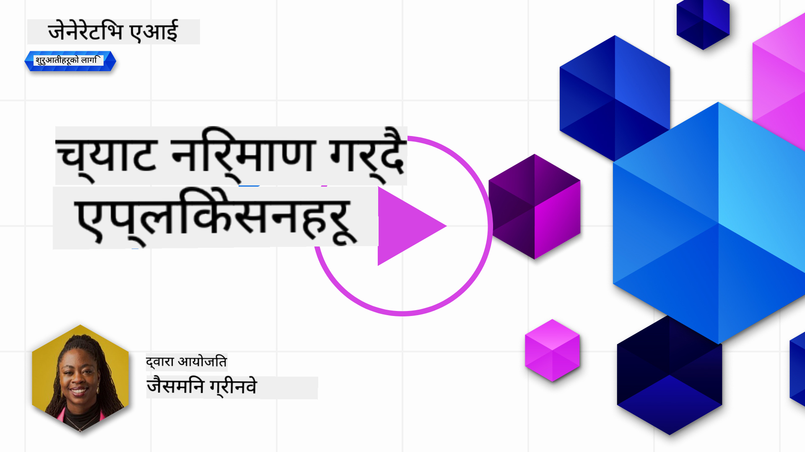
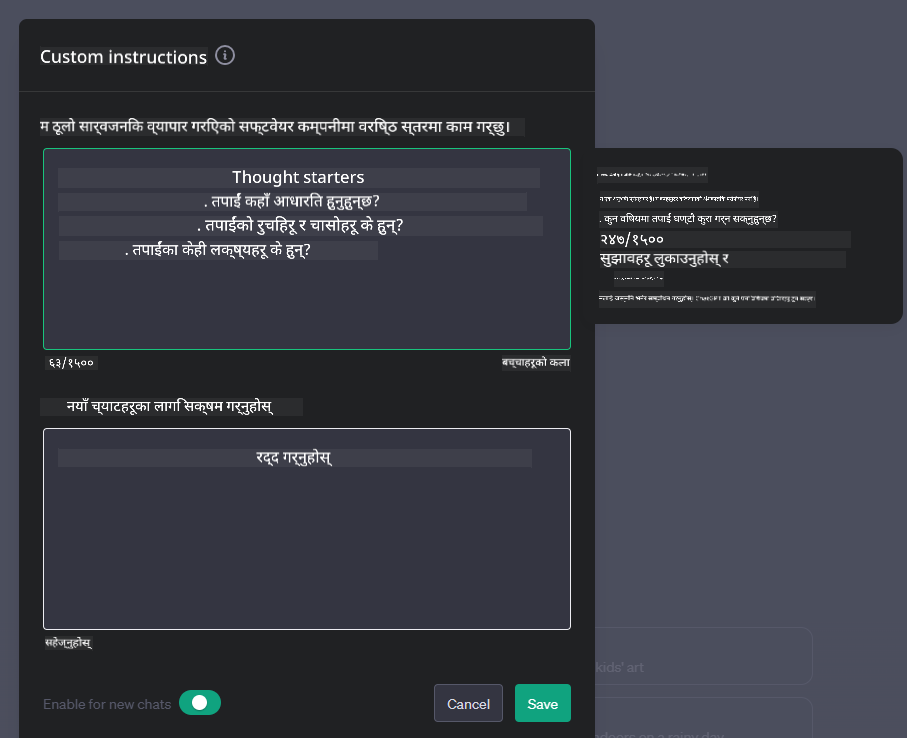
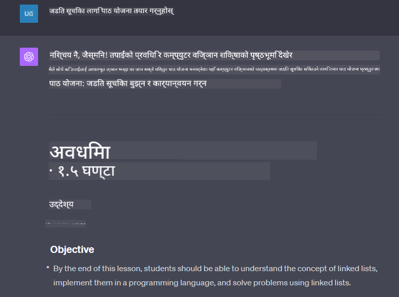

<!--
CO_OP_TRANSLATOR_METADATA:
{
  "original_hash": "ea4bbe640847aafbbba14dae4625e9af",
  "translation_date": "2025-05-19T17:43:58+00:00",
  "source_file": "07-building-chat-applications/README.md",
  "language_code": "ne"
}
-->
# जेनेरेटिभ एआई-शक्ति भएको च्याट अनुप्रयोगहरू निर्माण गर्दै

[](https://aka.ms/gen-ai-lessons7-gh?WT.mc_id=academic-105485-koreyst)

> _(यो पाठको भिडियो हेर्न माथिको चित्रमा क्लिक गर्नुहोस्)_

अब हामीले पाठ-उत्पादन अनुप्रयोगहरू कसरी निर्माण गर्ने देख्यौं, अब च्याट अनुप्रयोगहरूमा हेरौं।

च्याट अनुप्रयोगहरू हाम्रो दैनिक जीवनमा एकीकृत भएका छन्, केवल सामान्य कुराकानीको साधन भन्दा धेरै बढी प्रस्ताव गर्दै। तिनीहरू ग्राहक सेवा, प्राविधिक समर्थन, र यहाँसम्म कि परिष्कृत सल्लाह प्रणालीहरूको अभिन्न हिस्सा हुन्। सम्भवतः तपाईंले धेरै दिनअघि च्याट अनुप्रयोगबाट केही मद्दत प्राप्त गर्नुभएको छ। जब हामी यी प्लेटफर्महरूमा जेनेरेटिभ एआई जस्ता उन्नत प्रविधिहरू एकीकृत गर्छौं, जटिलता बढ्छ र चुनौतीहरू पनि बढ्छन्।

हामीले जवाफ दिनुपर्ने केही प्रश्नहरू छन्:

- **अनुप्रयोग निर्माण**। कसरी हामी यी एआई-शक्ति भएका अनुप्रयोगहरूलाई विशेष प्रयोग केसहरूको लागि कुशलतापूर्वक निर्माण र निर्बाध रूपमा एकीकृत गर्न सक्छौं?
- **अनुगमन**। एकपटक तैनात भएपछि, हामी कसरी अनुप्रयोगहरूको कार्यक्षमता र [जिम्मेवार एआईको छ वटा सिद्धान्तहरू](https://www.microsoft.com/ai/responsible-ai?WT.mc_id=academic-105485-koreyst)को पालनामा उच्च गुणस्तरमा सञ्चालन भइरहेको सुनिश्चित गर्न सक्छौं?

जब हामी स्वचालन र निर्बाध मानव-मेसिन अन्तर्क्रियाले परिभाषित युगतिर अगाडि बढ्छौं, जेनेरेटिभ एआईले च्याट अनुप्रयोगहरूको दायरा, गहिराई, र अनुकूलनशीलतालाई कसरी रूपान्तरण गर्दछ भन्ने कुरा बुझ्न आवश्यक हुन्छ। यो पाठले यी जटिल प्रणालीहरूलाई समर्थन गर्ने वास्तुकलाका पक्षहरू अनुसन्धान गर्नेछ, डोमेन-विशिष्ट कार्यहरूको लागि तिनीहरूलाई परिष्कृत गर्नका लागि पद्धतिहरूमा प्रवेश गर्नेछ, र जिम्मेवार एआई तैनाती सुनिश्चित गर्न सम्बन्धित मेट्रिक्स र विचारहरूको मूल्याङ्कन गर्नेछ।

## परिचय

यो पाठमा समावेश छ:

- च्याट अनुप्रयोगहरूलाई कुशलतापूर्वक निर्माण र एकीकृत गर्ने प्रविधिहरू।
- अनुप्रयोगहरूमा अनुकूलन र परिष्कृत कसरी लागू गर्ने।
- च्याट अनुप्रयोगहरूलाई प्रभावकारी रूपमा अनुगमन गर्ने रणनीतिहरू र विचारहरू।

## सिकाइ लक्ष्यहरू

यो पाठको अन्त्यमा, तपाईं सक्षम हुनुहुनेछ:

- विद्यमान प्रणालीहरूमा च्याट अनुप्रयोगहरू निर्माण र एकीकृत गर्दा विचार गर्नुपर्ने कुराहरू वर्णन गर्नुहोस्।
- विशेष प्रयोग-केसहरूको लागि च्याट अनुप्रयोगहरू अनुकूलन गर्नुहोस्।
- एआई-शक्ति भएका च्याट अनुप्रयोगहरूको गुणस्तरलाई प्रभावकारी रूपमा अनुगमन र कायम राख्न प्रमुख मेट्रिक्स र विचारहरू पहिचान गर्नुहोस्।
- च्याट अनुप्रयोगहरूले जिम्मेवार रूपमा एआईको लाभ उठाउने सुनिश्चित गर्नुहोस्।

## च्याट अनुप्रयोगहरूमा जेनेरेटिभ एआईको एकीकरण

जेनेरेटिभ एआई मार्फत च्याट अनुप्रयोगहरूलाई उचाइमा पुर्याउनु केवल तिनीहरूलाई चतुर बनाउनु मात्र होइन; यो तिनीहरूको वास्तुकला, प्रदर्शन, र प्रयोगकर्ता इन्टरफेसलाई अनुकूलन गरेर गुणस्तरीय प्रयोगकर्ता अनुभव प्रदान गर्नु हो। यसमा वास्तुकलाका आधारहरू, एपीआई एकीकरणहरू, र प्रयोगकर्ता इन्टरफेस विचारहरू अनुसन्धान गर्नु समावेश छ। यो खण्डले यी जटिल परिदृश्यहरूमा नेभिगेट गर्नका लागि तपाईंलाई एक व्यापक रोडम्याप प्रस्ताव गर्ने उद्देश्य राखेको छ, चाहे तपाईं तिनीहरूलाई विद्यमान प्रणालीहरूमा प्लग गर्दै हुनुहुन्छ वा तिनीहरूलाई स्वतन्त्र प्लेटफर्मको रूपमा निर्माण गर्दै हुनुहुन्छ।

यो खण्डको अन्त्यमा, तपाईंलाई च्याट अनुप्रयोगहरूलाई कुशलतापूर्वक निर्माण र समावेश गर्न आवश्यक विशेषज्ञता हुनेछ।

### च्याटबोट वा च्याट अनुप्रयोग?

च्याट अनुप्रयोगहरू निर्माण गर्न अघि, 'च्याटबोट' र 'एआई-शक्ति भएका च्याट अनुप्रयोगहरू' लाई तुलना गरौं, जसले फरक भूमिकाहरू र कार्यक्षमताहरू सेवा गर्छ। च्याटबोटको मुख्य उद्देश्य विशेष संवादात्मक कार्यहरू स्वचालित गर्नु हो, जस्तै बारम्बार सोधिने प्रश्नहरूको उत्तर दिनु वा प्याकेज ट्र्याक गर्नु। यो सामान्यतया नियम-आधारित तर्क वा जटिल एआई एल्गोरिदम द्वारा शासित हुन्छ। यसको विपरीत, एआई-शक्ति भएको च्याट अनुप्रयोग एक धेरै व्यापक वातावरण हो जसले मानव प्रयोगकर्ताहरू बीच पाठ, आवाज, र भिडियो च्याट जस्ता विभिन्न प्रकारका डिजिटल सञ्चारलाई सुविधाजनक बनाउँछ। यसको परिभाषित विशेषता एक जेनेरेटिभ एआई मोडेलको एकीकरण हो जसले सूक्ष्म, मानव-जस्तो कुराकानीलाई अनुकरण गर्दछ, इनपुट र सन्दर्भ संकेतहरूको विस्तृत विविधतामा आधारित प्रतिक्रियाहरू उत्पन्न गर्दछ। एक जेनेरेटिभ एआई शक्ति भएको च्याट अनुप्रयोगले खुला-डोमेन छलफलहरूमा संलग्न हुन सक्छ, विकसित हुँदै गएको संवादात्मक सन्दर्भहरूमा अनुकूलन गर्न सक्छ, र यहाँसम्म कि सिर्जनात्मक वा जटिल संवाद पनि उत्पादन गर्न सक्छ।

तलको तालिकाले डिजिटल सञ्चारमा उनीहरूको अनूठा भूमिकाहरू बुझ्न मद्दत गर्नका लागि प्रमुख भिन्नताहरू र समानताहरूको रूपरेखा प्रस्तुत गर्दछ।

| च्याटबोट                                | जेनेरेटिभ एआई-शक्ति भएको च्याट अनुप्रयोग |
| --------------------------------------- | --------------------------------------- |
| कार्य-केंद्रित र नियम-आधारित            | सन्दर्भ-सचेत                             |
| प्रायः ठूला प्रणालीहरूमा समावेश गरिन्छ | एक वा धेरै च्याटबोटहरू समावेश गर्न सक्छ |
| प्रोग्राम गरिएको कार्यहरूमा सीमित        | जेनेरेटिभ एआई मोडेलहरू समावेश गर्दछ     |
| विशेष र संरचित अन्तर्क्रियाहरू            | खुला-डोमेन छलफलहरू गर्न सक्षम            |

### एसडीकेहरू र एपीआईहरूसँग पूर्व-निर्मित कार्यक्षमताहरूको लाभ उठाउँदै

च्याट अनुप्रयोग निर्माण गर्दा, पहिले नै के छ भनेर मूल्याङ्कन गर्नु राम्रो पहिलो कदम हो। च्याट अनुप्रयोगहरू निर्माण गर्न एसडीकेहरू र एपीआईहरू प्रयोग गर्नुका लागि विभिन्न कारणहरूले फाइदाजनक रणनीति हो। राम्रोसँग प्रलेखित एसडीकेहरू र एपीआईहरू एकीकृत गरेर, तपाईं आफ्नो अनुप्रयोगलाई दीर्घकालीन सफलताको लागि रणनीतिक रूपमा स्थानमा राख्दै हुनुहुन्छ, स्केलेबिलिटी र मर्मतसम्भार सम्बन्धी चिन्ताहरू सम्बोधन गर्दै।

- **विकास प्रक्रियालाई तीव्र बनाउँछ र ओभरहेड घटाउँछ**: आफूले निर्माण गर्ने महँगो प्रक्रियाको सट्टा पूर्व-निर्मित कार्यक्षमताहरूमा निर्भर हुँदा तपाईंलाई आफ्नो अनुप्रयोगका अन्य पक्षहरूमा ध्यान केन्द्रित गर्न अनुमति दिन्छ, जस्तै व्यापारिक तर्क।
- **राम्रो प्रदर्शन**: जब सुरुबाट कार्यक्षमता निर्माण गर्दै, तपाईं अन्ततः आफैंलाई सोध्नुहुनेछ "यो कसरी स्केल हुन्छ? के यो अनुप्रयोग अचानक प्रयोगकर्ताहरूको बाढीलाई सम्हाल्न सक्षम छ?" राम्रोसँग मर्मत गरिएका एसडीके र एपीआईहरू प्रायः यी चिन्ताहरूको लागि निर्मित समाधानहरू छन्।
- **सजिलो मर्मतसम्भार**: अपडेटहरू र सुधारहरू व्यवस्थापन गर्न सजिलो हुन्छ किनभने अधिकांश एपीआईहरू र एसडीकेहरूलाई नयाँ संस्करण जारी हुँदा पुस्तकालयलाई अपडेट गर्न आवश्यक पर्दछ।
- **अत्याधुनिक प्रविधिको पहुँच**: विस्तृत डेटासेटमा प्रशिक्षण र परिष्कृत गरिएको मोडेलहरूको लाभ उठाउँदा तपाईंको अनुप्रयोगलाई प्राकृतिक भाषा क्षमताहरू प्रदान गर्दछ।

एसडीके वा एपीआईको कार्यक्षमतामा पहुँच गर्नु प्रायः प्रदान गरिएका सेवाहरूको प्रयोगको लागि अनुमति प्राप्त गर्ने प्रक्रियामा समावेश हुन्छ, जुन प्रायः अद्वितीय कुञ्जी वा प्रमाणीकरण टोकनको प्रयोगद्वारा हुन्छ। हामीले यसलाई कसरी देखिन्छ भनेर अन्वेषण गर्न ओपनएआई पाइथन लाइब्रेरी प्रयोग गर्नेछौं। तपाईं पनि यसलाई आफ्नो लागि प्रयास गर्न सक्नुहुन्छ निम्न [ओपनएआईका लागि नोटबुक](../../../07-building-chat-applications/python/oai-assignment.ipynb) वा [एज्योर ओपनएआई सेवाहरूका लागि नोटबुक](../../../07-building-chat-applications/python/aoai-assignment.ipynb)मा यो पाठका लागि।

```python
import os
from openai import OpenAI

API_KEY = os.getenv("OPENAI_API_KEY","")

client = OpenAI(
    api_key=API_KEY
    )

chat_completion = client.chat.completions.create(model="gpt-3.5-turbo", messages=[{"role": "user", "content": "Suggest two titles for an instructional lesson on chat applications for generative AI."}])
```

माथिको उदाहरणले जीपीटी-३.५ टर्बो मोडेललाई प्रम्प्ट पूरा गर्न प्रयोग गर्दछ, तर ध्यान दिनुहोस् कि एपीआई कुञ्जी प्रम्प्ट पूरा गर्नु अघि सेट गरिएको छ। यदि तपाईंले कुञ्जी सेट गर्नुभएन भने तपाईंलाई त्रुटि प्राप्त हुनेछ।

## प्रयोगकर्ता अनुभव (यूएक्स)

सामान्य यूएक्स सिद्धान्तहरू च्याट अनुप्रयोगहरूमा लागू हुन्छन्, तर यहाँ केही थप विचारहरू छन् जुन मेसिन लर्निङ कम्पोनेन्टहरू समावेश भएकाले विशेष गरी महत्त्वपूर्ण हुन्छन्।

- **द्विविधाको समाधान गर्ने संयन्त्र**: जेनेरेटिभ एआई मोडेलहरूले कहिलेकाहीं अस्पष्ट उत्तरहरू उत्पन्न गर्छन्। प्रयोगकर्ताहरूले स्पष्टिकरणको लागि सोध्न सक्ने सुविधा यो समस्यामा आइपुग्दा उपयोगी हुन सक्छ।
- **सन्दर्भ प्रतिधारण**: उन्नत जेनेरेटिभ एआई मोडेलहरूसँग संवादको भित्र सन्दर्भ सम्झने क्षमता हुन्छ, जुन प्रयोगकर्ता अनुभवको लागि आवश्यक सम्पत्ति हुन सक्छ। प्रयोगकर्ताहरूलाई सन्दर्भ नियन्त्रण र व्यवस्थापन गर्ने क्षमता दिनले प्रयोगकर्ता अनुभवलाई सुधार गर्छ, तर संवेदनशील प्रयोगकर्ता जानकारी राख्ने जोखिमलाई परिचय दिन्छ। यो जानकारी कति समयसम्म भण्डारण गरिन्छ भन्ने विचारहरू, जस्तै प्रतिधारण नीति परिचय गराउने, गोपनीयताविरुद्ध सन्दर्भको आवश्यकता सन्तुलित गर्न सक्छ।
- **व्यक्तिगतकरण**: सिक्न र अनुकूलन गर्न सक्ने क्षमताका साथ, एआई मोडेलहरूले प्रयोगकर्ताका लागि व्यक्तिगत अनुभव प्रदान गर्दछ। प्रयोगकर्ता प्रोफाइलहरू जस्ता सुविधाहरू मार्फत प्रयोगकर्ता अनुभवलाई अनुकूलन गर्दा प्रयोगकर्तालाई बुझिएको महसुस गराउँछ, तर यसले तिनीहरूको विशिष्ट उत्तरहरू पत्ता लगाउने खोजलाई पनि मद्दत गर्छ, अधिक कुशल र सन्तोषजनक अन्तर्क्रिया सिर्जना गर्दछ।

व्यक्तिगतकरणको एक यस्तो उदाहरण ओपनएआईको च्याटजीपीटीमा "कस्टम निर्देशनहरू" सेटिङ हो। यसले तपाईंलाई तपाईंको प्रम्प्टहरूको लागि महत्त्वपूर्ण सन्दर्भ हुन सक्ने आफैंबारे जानकारी प्रदान गर्न अनुमति दिन्छ। यहाँ कस्टम निर्देशनको एक उदाहरण छ।



यो "प्रोफाइल" ले च्याटजीपीटीलाई लिंक गरिएको सूचीहरूको पाठ योजना बनाउन प्रेरित गर्दछ। ध्यान दिनुहोस् कि च्याटजीपीटीले प्रयोगकर्ताले आफ्नो अनुभवको आधारमा थप गहिरो पाठ योजना चाहन्छ भन्ने कुरा ध्यानमा राख्छ।



### माइक्रोसफ्टको ठूलो भाषा मोडेलहरूको लागि प्रणाली सन्देश फ्रेमवर्क

[माइक्रोसफ्टले मार्गदर्शन प्रदान गरेको छ](https://learn.microsoft.com/azure/ai-services/openai/concepts/system-message#define-the-models-output-format?WT.mc_id=academic-105485-koreyst) जब LLMs बाट प्रतिक्रियाहरू उत्पन्न गर्दा प्रभावकारी प्रणाली सन्देशहरू लेख्न ४ क्षेत्रमा विभाजन गरिएको छ:

1. मोडेल को लागी हो, साथै यसको क्षमताहरू र सीमाहरू परिभाषित गर्दै।
2. मोडेलको आउटपुट ढाँचालाई परिभाषित गर्दै।
3. मोडेलको इच्छित व्यवहार प्रदर्शन गर्ने विशिष्ट उदाहरणहरू प्रदान गर्दै।
4. अतिरिक्त व्यवहारिक गार्डरेलहरू प्रदान गर्दै।

### पहुँचयोग्यता

प्रयोगकर्तासँग दृश्य, श्रवण, मोटर, वा संज्ञानात्मक अशक्तता भए पनि, राम्रोसँग डिजाइन गरिएको च्याट अनुप्रयोग सबैले प्रयोग गर्न योग्य हुनुपर्छ। निम्न सूचीले विभिन्न प्रयोगकर्ता अशक्तताका लागि पहुँचयोग्यतालाई बढाउने उद्देश्यका विशेष सुविधाहरूको रूपमा तोड्छ।

- **दृश्य अशक्तताको लागि सुविधाहरू**: उच्च विपरीत विषयवस्तुहरू र पुनःआकारयोग्य पाठ, स्क्रिन रिडर अनुकूलता।
- **श्रवण अशक्तताको लागि सुविधाहरू**: पाठ-देखि-भाषण र भाषण-देखि-पाठ कार्यहरू, अडियो सूचनाहरूको लागि दृश्य संकेतहरू।
- **मोटर अशक्तताको लागि सुविधाहरू**: किबोर्ड नेभिगेसन समर्थन, आवाज आदेशहरू।
- **संज्ञानात्मक अशक्तताको लागि सुविधाहरू**: सरलीकृत भाषा विकल्पहरू।

## डोमेन-विशिष्ट भाषा मोडेलहरूको लागि अनुकूलन र परिष्कृत

एक च्याट अनुप्रयोगको कल्पना गर्नुहोस् जसले तपाईंको कम्पनीको जार्गन बुझ्छ र यसको प्रयोगकर्ता आधारसँग सामान्यतया हुने विशिष्ट प्रश्नहरूको पूर्वानुमान लगाउँछ। उल्लेख गर्न लायक केही दृष्टिकोणहरू छन्:

- **डीएसएल मोडेलहरूको लाभ उठाउँदै**। डीएसएलले डोमेन विशिष्ट भाषा जनाउँछ। तपाईंले डोमेनका अवधारणाहरू र परिदृश्यहरू बुझ्नको लागि विशेष डोमेनमा प्रशिक्षित तथाकथित डीएसएल मोडेलको लाभ उठाउन सक्नुहुन्छ।
- **परिष्कृत लागू गर्नुहोस्**। परिष्कृत गर्नु भनेको विशेष डेटा सहित तपाईंको मोडेललाई थप प्रशिक्षण दिने प्रक्रिया हो।

## अनुकूलन: डीएसएल प्रयोग गर्दै

डोमेन-विशिष्ट भाषा मोडेलहरू (डीएसएल मोडेलहरू) को लाभ उठाउँदा प्रयोगकर्ता संलग्नता बढाउन सक्छ र विशेष, सन्दर्भमा सान्दर्भिक अन्तर्क्रियाहरू प्रदान गर्दै। यो एक मोडेल हो जुन विशेष क्षेत्र, उद्योग, वा विषयसँग सम्बन्धित पाठलाई बुझ्न र उत्पन्न गर्न प्रशिक्षित वा परिष्कृत गरिएको हो। डीएसएल मोडेल प्रयोग गर्ने विकल्पहरूमा स्क्र्याचबाट प्रशिक्षण गर्ने, एसडीकेहरू र एपीआईहरूको माध्यमबाट पूर्व-विद्यमानहरू प्रयोग गर्ने सम्म फरक हुन सक्छ। अर्को विकल्प भनेको परिष्कृत गर्नु हो, जसमा पूर्व-प्रशिक्षित मोडेललाई विशेष डोमेनका लागि अनुकूल बनाउने समावेश छ।

## अनुकूलन: परिष्कृत लागू गर्नुहोस्

जब पूर्व-प्रशिक्षित मोडेल विशेष डोमेन वा विशेष कार्यमा असफल हुन्छ, तब परिष्कृत प्रायः विचार गरिन्छ।

उदाहरणका लागि, चिकित्सा प्रश्नहरू जटिल हुन्छन् र धेरै सन्दर्भ आवश्यक पर्दछ। जब चिकित्सा पेशेवरले बिरामीलाई निदान गर्छन् यो जीवनशैली वा पूर्व-विद्यमान अवस्थाहरू जस्ता विभिन्न कारकहरूमा आधारित हुन्छ, र उनीहरूको निदानलाई मान्य गर्न हालैका चिकित्सा जर्नलहरूमा निर्भर पनि हुन सक्छ। यस्ता सूक्ष्म परिदृश्यहरूमा, सामान्य-उद्देश्य एआई च्याट अनुप्रयोग विश्वसनीय स्रोत हुन सक्दैन।

### परिदृश्य: चिकित्सा अनुप्रयोग

चिकित्सा चिकित्सकहरूलाई उपचार दिशानिर्देशहरू, औषधि अन्तर्क्रियाहरू, वा हालैका अनुसन्धान फेला पार्नको लागि चाँडो सन्दर्भहरू प्रदान गरेर मद्दत गर्न डिजाइन गरिएको च्याट अनुप्रयोगलाई विचार गर्नुहोस्।

सामान्य-उद्देश्य मोडेलले आधारभूत चिकित्सा प्रश्नहरूको उत्तर दिन वा सामान्य सल्लाह प्रदान गर्नको लागि पर्याप्त हुन सक्छ, तर यसले निम्न कुराहरूमा संघर्ष गर्न सक्छ:

- **अत्यधिक विशिष्ट वा जटिल केसहरू**। उदाहरणका लागि, न्यूरोलजिस्टले अनुप्रयोगलाई सोध्न सक्छ, "बालरोग बिरामीहरूमा औषधि प्रतिरोधी मिर्गीको व्यवस्थापनका लागि वर्तमान उत्कृष्ट अभ्यासहरू के हुन्?"
- **हालका प्रगतिहरूको अभाव**। सामान्य-उद्देश्य मोडेलले न्यूरोलजी र फार्माकोलोजीमा सबैभन्दा हालका प्रगतिहरूलाई समावेश गर्ने वर्तमान उत्तर प्रदान गर्न संघर्ष गर्न सक्छ।

यस्ता उदाहरणहरूमा, विशेषज्ञ चिकित्सा डेटासेटको साथ मोडेललाई परिष्कृत गर्दा यी जटिल चिकित्सा प्रश्नहरूको अधिक सटीक र विश्वसनीय रूपमा सामना गर्ने यसको क्षमता महत्त्वपूर्ण रूपमा सुधार गर्न सक्छ। यसका लागि ठुलो र सान्दर्भिक डेटासेटको पहुँच आवश्यक पर्दछ जसले सम्बोधन गर्न आवश्यक डोमेन-विशिष्ट चुनौतीहरू र प्रश्नहरूको प्रतिनिधित्व गर्दछ।

## उच्च गुणस्तरीय एआई-चालित च्याट अनुभवको लागि विचारहरू

यो खण्डले "उच्च गुणस्तरीय" च्याट अनुप्रयोगहरूको लागि मापदण्डहरूको रूपरेखा प्रस्तुत गर्दछ, जसमा कार्यात्मक मेट्रिक्सको कब्जा र एआई प्रविधिको जिम्मेवार रूपमा लाभ उठाउने फ्रेमवर्कको

**अस्वीकरण**:  
यो दस्तावेज AI अनुवाद सेवा [Co-op Translator](https://github.com/Azure/co-op-translator) प्रयोग गरेर अनुवाद गरिएको हो। हामी शुद्धताको लागि प्रयासरत भए पनि, कृपया सचेत रहनुहोस् कि स्वचालित अनुवादहरूमा त्रुटिहरू वा अशुद्धताहरू हुन सक्छन्। यसको मौलिक भाषामा रहेको मूल दस्तावेजलाई प्राधिकृत स्रोतको रूपमा मान्नुपर्छ। महत्वपूर्ण जानकारीको लागि, व्यावसायिक मानव अनुवाद सिफारिस गरिन्छ। यस अनुवादको प्रयोगबाट उत्पन्न कुनै पनि गलतफहमी वा गलत व्याख्याको लागि हामी उत्तरदायी हुने छैनौं।