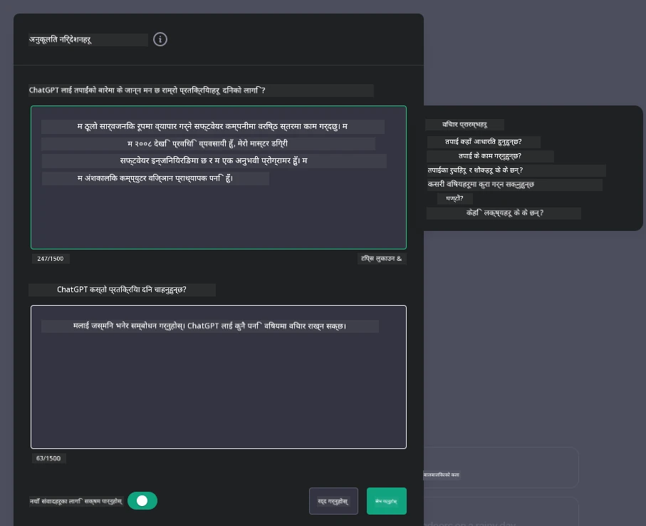

# जेनेरेटिभ एआई-शक्ति भएको च्याट एप्लिकेशनहरू निर्माण गर्दै

[](https://youtu.be/R9V0ZY1BEQo?si=IHuU-fS9YWT8s4sA)

> _(यस पाठको भिडियो हेर्न माथि देखिएको चित्रमा क्लिक गर्नुहोस्)_

अब जब हामीले देखिसक्यौं कि कसरी टेक्स्ट-जेनेरेशन एपहरू बनाउन सकिन्छ, आउनुहोस् च्याट एप्लिकेशनहरूमा हेरौं।

च्याट एप्लिकेशनहरू हाम्रो दैनिक जीवनमा समाहित भइसकेका छन्, र केवल आकस्मिक संवादको माध्यम मात्र होइनन्। तिनीहरूले ग्राहक सेवा, प्राविधिक समर्थन र यहाँसम्म कि जटिल सल्लाह दिने प्रणालीहरूमा महत्त्वपूर्ण भूमिका खेल्छन्। सम्भवतः तपाईंले केही समय पहिले एउटा च्याट एप्लिकेशनबाट मद्दत पाउनुभएको होला। हामीले यी प्लेटफर्महरूमा जेनेरेटिभ एआई जस्ता उन्नत प्रविधिहरू समावेश गर्दा, जटिलता बढ्छ र चुनौतीहरू पनि बढ्छन्।

केही प्रश्नहरू जसको जवाफ हामीलाई जान्न आवश्यक छ:

- **एप्लिकेशन निर्माण**। हामी कसरी यी एआई-सञ्चालित एप्लिकेशनहरूलाई विशिष्ट उपयोग केसहरूका लागि कुशलतापूर्वक निर्माण र सहज रूपमा एकीकृत गर्न सक्छौं?
- **मोनिटरिङ**। तैनाथ गरेपछि, कसरी हामी एप्लिकेशनहरूले सबैभन्दा उच्च स्तरको गुणस्तरमा काम गरिरहेका छन् भनी सुनिश्चित र अनुगमन गर्न सक्छौं, कार्यक्षमता र [जिम्मेवार एआईका छ सिद्धान्तहरू](https://www.microsoft.com/ai/responsible-ai?WT.mc_id=academic-105485-koreyst) पालना गर्ने सन्दर्भमा?

हामी जब स्वचालन र सहज मानव-मेसिन अन्तरक्रियाहरू द्वारा परिभाषित युगमा अझ अघि बढ्छौं, जनरेटिभ एआईले कसरी च्याट एप्लिकेशनहरूको दायरा, गहिराई, र अनुकूलन क्षमता परिवर्तन गर्छ भन्ने बुझ्न अत्यावश्यक हुन्छ। यो पाठले ती जटिल प्रणालीहरूलाई समर्थन गर्ने वास्तुकला पक्षहरू अनुसन्धान गर्नेछ, डोमेन-विशिष्ट कार्यहरूको लागि तिनीहरूलाई फाइन-ट्यून गर्ने विधिहरूमा डुब्नेछ, र जिम्मेवार एआई तैनाथी सुनिश्चित गर्नका लागि मेट्रिक्स र विचारहरू मूल्याङ्कन गर्नेछ।

## परिचय

यो पाठले समेट्छ:

- च्याट एप्लिकेशनहरू कुशलतापूर्वक बनाउने र एकीकृत गर्ने प्रविधिहरू।
- एप्लिकेशनहरूमा अनुकूलन र फाइन-ट्यूनिङ कसरी लागू गर्ने।
- च्याट एप्लिकेशनहरूको प्रभावकारी मोनिटरिङका रणनीतिहरू र विचारहरू।

## सिकाइका लक्ष्यहरू

यस पाठको अन्तसम्म, तपाईं सक्षम हुनुहुनेछ:

- वर्तमान प्रणालीहरूमा च्याट एप्लिकेशनहरू निर्माण र एकीकृत गर्दा विचार गर्नुपर्ने पक्षहरू वर्णन गर्ने।
- विशिष्ट उपयोग केसहरूका लागि च्याट एप्लिकेशनहरू अनुकूलित गर्ने।
- प्रभावकारी मोनिटरिङ र गुणस्तर मर्मतका लागि मुख्य मेट्रिक्स र विचारहरू पहिचान गर्ने।
- च्याट एप्लिकेशनहरूले एआई जिम्मेवार तरिकाले उपयोग गर्दछन् भनी सुनिश्चित गर्ने।

## जेनेरेटिभ एआईलाई च्याट एप्लिकेशनहरूमा एकीकृत गर्दै

जेनेरेटिभ एआई मार्फत च्याट एप्लिकेशनहरू उन्नत पार्नु केवल तिनीहरूलाई स्मार्ट बनाउन मात्र होइन, तिनीहरूको वास्तुकला, प्रदर्शन, र प्रयोगकर्ता अन्तरफलकलाई अनुकूलित गरेर गुणस्तरीय प्रयोगकर्ता अनुभव प्रदान गर्नु हो। यसमा वास्तुकला आधारहरू, API एकीकरणहरू, र प्रयोगकर्ता अन्तरफलकका विचारहरू समावेश छन्। यो खण्डले तपाईंलाई यी जटिल विषयहरूमा रूपरेखा प्रदान गर्नेछ, चाहे तपाईं यसलाई वर्तमान प्रणालीहरूमा हाल्दै हुनुहुन्छ वा स्वायत्त प्लेटफर्मका रूपमा निर्माण गर्दै हुनुहुन्छ।

यस खण्डको अन्त्यमा, तपाईं च्याट एप्लिकेशनहरूलाई कुशलतापूर्वक निर्माण र समावेश गर्न आवश्यक विशेषज्ञता द्वारा सुसज्जित हुनुहुनेछ।

### च्याटबोट वा च्याट एप्लिकेशन?

च्याट एप्लिकेशनहरू निर्माणमा झण्डै लाग्नु अघि, 'च्याटबोट' र 'एआई-सञ्चालित च्याट एप्लिकेशनहरू' बीचको तुलना गरौं, जसले फरक भुमिका र कार्यक्षमताहरू सम्हाल्छन्। च्याटबोटको मुख्य उद्देश्य विशिष्ट संवादात्मक कार्यहरू स्वचालित गर्नु हो, जस्तै बारम्बार सोधिने प्रश्नहरूको उत्तर दिन वा प्याकेज ट्र्याकिङ गर्नु। यो प्रायः नियम-आधारित तर्क वा जटिल एआई एल्गोरिदमद्वारा सञ्चालित हुन्छ। यसको विपरीत, एआई-संचालित च्याट एप्लिकेशन धेरै फराकिलो वातावरण हो जुन मानव प्रयोगकर्ताबीच टेक्स्ट, आवाज, र भिडियो च्याट जस्ता विभिन्न डिजिटल संचार रूपहरू सहजीकरण गर्न डिजाइन गरिएको हो। यसको विशेषता जेनेरेटिभ एआई मोडलको समावेश हो जुन मानवीय जस्तै संवेदनशील संवादहरू नक्कल गर्दछ, विभिन्न इनपुट र सन्दर्भ संकेतहरूमा आधारित प्रतिक्रियाहरू उत्पन्न गर्दछ। एउटा जेनेरेटिभ एआई संचालित च्याट एप्लिकेशन खुला-डोमेन छलफलमा संलग्न हुन सक्छ, विकसित हुँदै गरेको संवाद सन्दर्भहरूमा अनुकूल हुन सक्छ, र रचनात्मक वा जटिल संवाद पनि उत्पादन गर्न सक्छ।

तलको तालिकाले उनीहरूको अनौठो भूमिकाहरू बुझ्न आवश्यक मुख्य फरक र समानताहरूलाई चित्रित गर्दछ।

| च्याटबोट                               | जेनेरेटिभ एआई-सञ्चालित च्याट एप्लिकेशन |
| ------------------------------------- | -------------------------------------- |
| कार्य-केंद्रित र नियम आधारित         | सन्दर्भ-चेत                 |
| प्रायः ठूला प्रणालीहरूमा समावेश हुन्छ  | एक वा धेरै च्याटबोटहरू होस्ट गर्न सक्ने |
| प्रोग्राम गरिएका कार्यहरूमा सीमित      | जेनेरेटिभ एआई मोडलहरू समावेश गर्ने      |
| विशेषज्ञ र संरचित अन्तरक्रियाहरू        | खुल्ला-डोमेन छलफल सक्षम गर्ने           |

### SDK र API हरूसँग पूर्व-निर्मित कार्यक्षमताहरूको उपयोग

च्याट एप्लिकेशन बनाउँदा, सुरूमा उपलब्ध के छ मूल्यांकन गर्नु राम्रो हुन्छ। SDK र API हरूको प्रयोग गरेर च्याट एप्लिकेशनहरू निर्माण गर्नु विभिन्न कारणले फाइदाजनक रणनीति हो। राम्रोसँग दस्तावेजीकृत SDK र API हरू समावेश गरेर, तपाईंले आफ्नो एप्लिकेशनलाई दीर्घकालीन सफलताको लागि रणनीतिक रूपमा तैयार पार्दै हुनुहुन्छ, स्केलेबिलिटी र मर्मत समस्याहरूलाई सम्बोधन गर्दै।

- **विकास प्रक्रियालाई तिब्र पार्छ र ओभरहेड घटाउँछ**: आफ्नैटै महँगो प्रक्रियामा भन्दा पूर्व-निर्मित कार्यक्षमतामा निर्भर गर्दा तपाईंले आफ्नो एप्लिकेशनका अन्य महत्वपूर्ण पक्षहरूमा ध्यान केन्द्रित गर्न सक्नुहुन्छ, जस्तै व्यवसायिक तर्क।
- **राम्रो प्रदर्शन**: कार्यक्षमता शून्यदेखि बनाउँदा तपाईंले अन्त्यमा सोध्नुहुन्छ "यसले कति स्केल गर्छ? के यो एप्लिकेशन अचानक प्रयोगकर्ताहरूको भारी बृद्धि सम्हाल्न सक्षम छ?" राम्रो रूपमा मेन्टेन गरिएका SDK र API हरूमा यी समस्याहरूको समाधानहरू प्रायः समावेश हुन्छन्।
- **मर्मत सजिलो**: नयाँ संस्करण रिलीज हुँदा प्रायः केवल पुस्तकालय अपडेट गर्नु पर्याप्त हुन्छ, जसले अपडेट र सुधार व्यवस्थापन सजिलो बनाउँछ।
- **अत्याधुनिक प्रविधिमा पहुँच**: विस्तृत डेटासेटहरूमा प्रशिक्षण र फाइन-ट्यूनिङ गरिएका मोडेलहरूको उपयोग गरेर आफ्नो एप्लिकेशनलाई प्राकृतिक भाषा क्षमताहरू प्रदान गर्न सकिन्छ।

SDK वा API को कार्यक्षमता पहुँच गर्न अनुमति आवश्यक हुन्छ, जुन प्रायः एक विशेष कुञ्जी वा प्रमाणीकरण टोकन मार्फत प्राप्त गरिन्छ। हामी OpenAI Python पुस्तकालय प्रयोग गरी यसको प्रक्रिया कसरी देखिन्छ पत्ता लगाउनेछौं। तपाईंले यसलाई आफ्नो रूपमा पनि प्रयास गर्न सक्नुहुन्छ निम्न [OpenAI को नोटबुक](./python/oai-assignment.ipynb?WT.mc_id=academic-105485-koreyst) वा [Azure OpenAI सेवाका लागि नोटबुक](./python/aoai-assignment.ipynb?WT.mc_id=academic-105485-koreys) मा।

```python
import os
from openai import OpenAI

API_KEY = os.getenv("OPENAI_API_KEY","")

client = OpenAI(
    api_key=API_KEY
    )

response = client.responses.create(model="gpt-4o-mini", input="Suggest two titles for an instructional lesson on chat applications for generative AI.", store=False)
print(response.output_text)
```

माथिको उदाहरणमा, GPT-4o मिनी मोडल र Responses API को प्रयोग गरी प्रॉम्प्ट पूर्ति गरिएको छ, तर त्यो गर्ने अघिल्लो API कुञ्जी सेट गरिएको छ। यदि तपाईंले कुञ्जी सेट गर्नुभएन भने तपाईंलाई त्रुटि आउनेछ।

## प्रयोगकर्ता अनुभव (UX)

सामान्य UX सिद्धान्तहरू च्याट एप्लिकेशनहरूमा लागू हुन्छन्, तर यहाँ केही थप विचारहरू छन् जुन मेसिन लर्निङ कम्पोनेन्टहरूसँग सम्बन्धित विशेष रूपमा महत्वपूर्ण हुन्छन्।

- **अस्पष्टताको समाधान गर्ने यन्त्र**: जेनेरेटिभ एआई मोडलहरूले कहिलेकाहीँ अस्पष्ट उत्तरहरू उत्पन्न गर्न सक्छन्। प्रयोगकर्ताहरूलाई स्पष्टिकरण माग्न अनुमति दिने सुविधा यस किसिमको समस्यामा सहयोगी हुन सक्छ।
- **सन्दर्भ राख्ने क्षमता**: उन्नत जेनेरेटिभ एआई मोडलहरूले संवादभित्र सन्दर्भ सम्झन सक्छ, जसले प्रयोगकर्ता अनुभवमा महत्त्वपूर्ण योगदान दिन सक्छ। प्रयोगकर्ताहरूलाई सन्दर्भ नियन्त्रण र व्यवस्थापन गर्ने विकल्प दिनु राम्रो छ, तर यसले संवेदनशील प्रयोगकर्ता जानकारी राख्ने जोखिम ल्याउँछ। यस सन्दर्भलाई स्टोर गर्ने अवधिको लागि नीतिहरू (जस्तै अवधारण निति) लागू गरेर गोपनीयता र सन्दर्भ आवश्यकताबीच सन्तुलन कायम गर्न सकिन्छ।
- **व्यक्तिगतकरण**: सिक्ने र अनुकूलन गर्ने क्षमता भएका एआई मोडलहरूले प्रयोगकर्ताका लागि व्यक्तिगत अनुभव प्रदान गर्छन्। उपयोगकर्ता प्रोफाइल जस्ता सुविधाहरू मार्फत अनुभवलाई समायोजन गर्नुले प्रयोगकर्तालाई बुझिएको महसुस गराउँछ, साथै विशिष्ट उत्तर खोज्ने प्रक्रियालाई सहज र सन्तोषजनक बनाउँछ।

OpenAI को ChatGPT मा "Custom instructions" सेटिङ्स यस प्रकारको व्यक्तिगतकरणको उदाहरण हो। यसले तपाईंलाई आफ्ना महत्त्वपूर्ण सन्दर्भ सम्बन्धी जानकारी प्रदान गर्न अनुमति दिन्छ। यहाँ एउटा कस्टम इन्स्ट्रक्शनको उदाहरण छ।



यस "प्रोफाइल" ले ChatGPT लाई लिंक्ड लिस्ट सम्बन्धी पाठ्यक्रम योजना बनाउन प्रोत्साहित गर्छ। नोट गर्नुहोस् कि ChatGPT ले प्रयोगकर्ताको अनुभवको आधारमा अझ व्यापक पाठ्यक्रम योजना चाहन सक्ने कुरालाई सम्बोधन गरेको छ।


### माइक्रोसफ्टको ठूलो भाषा मोडलहरूको लागि सिस्टम मेसेज फ्रेमवर्क

[माइक्रोसफ्टले प्रदान गरेको निर्देशन](https://learn.microsoft.com/azure/ai-services/openai/concepts/system-message#define-the-models-output-format?WT.mc_id=academic-105485-koreyst) मा LLMs बाट प्रतिक्रियाहरू उत्पन्न गर्दा प्रभावकारी सिस्टम मेसेज लेख्ने चार क्षेत्रहरूमा तोडिएको छ:

1. मोडल कस्को लागि हो भन्ने र यसको क्षमता तथा सीमाहरू निर्धारण गर्ने।
2. मोडलको आउटपुट फारम्याट निर्धारण गर्ने।
3. मोडलको अपेक्षित व्यवहार देखाउने विशिष्ट उदाहरणहरू प्रदान गर्ने।
4. अतिरिक्त व्यवहारिक गार्डरेलहरू प्रदान गर्ने।

### पहुँचयोग्यता

प्रयोगकर्ताको दृष्टि, श्रवण, मोटर, वा संज्ञानात्मक क्षमतामा कुनै समस्या भए पनि, राम्रो डिजाइन गरिएको च्याट एप्लिकेशन सबैले प्रयोग गर्न सक्ने हुनु पर्छ। तलको सूची विभिन्न प्रयोगकर्ता विकृतिहरूलाई लक्षित गरी पहुँचयोग्यता सुधार गर्ने विशेषताहरू प्रस्तुत गर्दछ।

- **दृष्टि अक्षमताका लागि विशेषताहरू**: उच्च विपर्यास विषयवस्तु र आकार परिवर्तनयोग्य पाठ, स्क्रिन रिडर अनुरूपता।
- **श्रवण अक्षमताका लागि विशेषताहरू**: पाठ-देखि-भाषण र भाषण-देखि-पाठ कार्यहरू, ध्वनि सूचनाका लागि दृश्य संकेतहरू।
- **मोटर अक्षमताका लागि विशेषताहरू**: किबोर्ड नेभिगेशन समर्थन, आवाज आदेशहरू।
- **संज्ञानात्मक अक्षमताका लागि विशेषताहरू**: सरल बनाइएको भाषा विकल्पहरू।

## डोमेन-विशिष्ट भाषा मोडलहरूको लागि अनुकूलन र फाइन-ट्यूनिङ

कल्पना गर्नुहोस् एउटा च्याट एप्लिकेशन जुन तपाईंको कम्पनीको जार्गन बुझ्छ र यसको प्रयोगकर्ता आधारले प्रायः सोध्ने विशिष्ट प्रश्नहरू अनुमान गर्न सक्छ। उल्लेख गर्नु पर्ने केही दृष्टिकोणहरू छन्:

- **DSL मोडलहरूको उपयोग**। DSL भनेको डोमेन विशिष्ट भाषा हो। तपाईंले एउटा DSL मोडल उपयोग गर्न सक्नुहुन्छ जुन एउटा विशिष्ट डोमेनमा प्रशिक्षण प्राप्त गरेको छ त्यसका अवधारणा र परिदृश्यहरू बुझ्न।
- **फाइन-ट्यूनिङ लागू गर्ने**। फाइन-ट्यूनिङ भनेको तपाईंको मोडेललाई विशेष डेटासँग अझ बढी प्रशिक्षण दिने प्रक्रिया हो।

## अनुकूलन: DSL को प्रयोग

डोमेन-विशिष्ट भाषा मोडलहरूको उपयोगले प्रयोगकर्ता सहभागिता बढाउन सक्छ र विशेष, सन्दर्भसँग सम्बन्धित अन्तरक्रियाहरू प्रदान गर्न सक्छ। यो मोडल हो जुन एउटा विशेष फिल्ड, उद्योग, वा विषयसँग सम्बन्धित टेक्स्ट बुझ्न र उत्पन्न गर्न प्रशिक्षित वा फाइन-ट्यून गरिएको हुन्छ। DSL मोडल प्रयोग गर्ने विकल्पहरूमा नयाँ मोडल ट्रेन्ड गर्नु वा SDK र API मार्फत पूर्व-मौजुद मोडलहरूको उपयोग गर्नु समावेश छ। अर्को विकल्प भनेको फाइन-ट्यूनिङ हो, जसले एउटा पूर्व-प्रशिक्षित मोडललाई लिएर विशेष डोमेनमा अनुकूल बनाउँछ।

## अनुकूलन: फाइन-ट्यूनिङ लागू गर्ने

फाइन-ट्यूनिङ प्रायः तब विचार गरिन्छ जब कुनै पूर्व-प्रशिक्षित मोडलले विशेष डोमेन वा विशिष्ट कार्यमा राम्रो परिणाम दिन सक्दैन।

उदाहरणका लागि, चिकित्सकीय प्रश्नहरू जटिल हुन्छन् र धेरै सन्दर्भ आवश्यक पर्छ। जब कुनै चिकित्सक बिरामीलाई निदान गर्छ, त्यो जीवनशैली वा पूर्व-स्थित अवस्थाहरू जस्ता विभिन्न कारकहरूमा आधारित हुन्छ, र कहिलेकाहीँ हालैका चिकित्सकीय पत्रिका पनि आफ्नो निदानको प्रमाणिकरणका लागि हेर्छ। यस्तो सूक्ष्म अवस्थामा, एउटा सामान्य उद्देश्यका एआई च्याट एप्लिकेशन भरपर्दो स्रोत हुन सक्दैन।

### परिदृश्य: मेडिकल एप्लिकेशन

एउटा च्याट एप्लिकेशन जुन चिकित्सकहरूलाई उपचार निर्देशनहरू, औषधि अन्तरक्रियाहरू, वा हालैका अनुसन्धान निष्कर्षहरूको शीघ्र सन्दर्भमा सहयोग पुर्‍याउन डिजाइन गरिएको छ विचार गर्नुहोस्।

एउटा सामान्य उद्देश्य मोडलले आधारभूत चिकित्सकीय प्रश्नहरू वा सामान्य सल्लाह दिन सक्छ, तर यसले तलका कुरामा संघर्ष गर्न सक्छ:

- **एकदमै विशेष वा जटिल केसहरू**। जस्तै, एउटा न्यूरोलोजिस्टले एप्लिकेशनलाई सोध्न सक्छ, "बाल रोगीहरूमा औषधि-प्रतिरोधी मिर्गी व्यवस्थापनका लागि हालका उत्कृष्ट अभ्यासहरू के-के छन्?"
- **हालका प्रगति अभाव**। सामान्य उद्देश्य मोडलले न्यूरोलोजी र फार्माकोलोजीमा हालैका प्रगतिहरू समावेश गर्दै वर्तमान जवाफ दिन संघर्ष गर्न सक्छ।

यस्ता अवस्थामा, मोडललाई विशेष चिकित्सकीय डेटासेटसँग फाइन-ट्यून गर्नु यसलाई यी जटिल चिकित्सकीय प्रश्नहरू अझै बढी शुद्ध र भरपर्दो तरिकाले सम्हाल्न महत्वपूर्ण सुधार ल्याउन सक्छ। यसका लागि ठूलो र सान्दर्भिक डेटासेटलाई पहुँच गर्न आवश्यक हुन्छ जसले डोमेन-विशिष्ट चुनौतीहरू र प्रश्नहरू समेट्छ।

## उच्च गुणस्तरीय एआई-चालित च्याट अनुभवका लागि विचारणीय पक्षहरू

यस खण्डले "उच्च गुणस्तर" च्याट एप्लिकेशनहरूको मापदण्डहरूलाई वर्णन गर्दछ, जसमा क्रियाशील मेट्रिक्स क्याप्चर गर्ने र जिम्मेवार एआई प्रविधि प्रयोग गर्ने फ्रेमवर्कको पालना सामेल छ।

### मुख्य मेट्रिक्सहरू

एप्लिकेशनको उच्च गुणस्तर प्रदर्शन कायम राख्न, महत्वपूर्ण मेट्रिक्स र विचारहरूबारे ट्रयाक राख्नु आवश्यक हुन्छ। यी मापनहरूले मात्र एप्लिकेशनको कार्यक्षमता सुनिश्चित गर्दैनन्, तर एआई मोडेल र प्रयोगकर्ता अनुभवको गुणस्तर पनि मूल्याङ्कन गर्दछन्। तल आधारभूत, एआई, र प्रयोगकर्ता अनुभव मेट्रिक्सहरूको सूची छ जुन ध्यान दिनु पर्ने हुन्छ।

| मेट्रिक                        | परिभाषा                                                                                                             | च्याट विकासकर्ताका लागि विचारणीय पक्षहरू                           |
| ----------------------------- | ---------------------------------------------------------------------------------------------------------------------- | ------------------------------------------------------------------- |
| **अपटाइम**                    | एप्लिकेशन कार्यरत र प्रयोगकर्ताले पहुँच गर्न सक्ने समय नाप्ने।                                                  | तपाईं कसरी डाउनटाइमलाई न्यून गर्ने योजना बनाउनुहुन्छ?               |
| **प्रतिक्रिया समय**             | प्रयोगकर्ताको प्रश्नमा एप्लिकेशन प्रतिक्रिया दिन लिने समय।                                                      | प्रतिक्रिया समय सुधार गर्न तपाईं प्रश्न प्रशोधन कसरी अनुकूलन गर्नुहुन्छ?|
| **प्रिसिजन**                 | सही सकारात्मक पूर्वानुमानहरूको अनुपात कुल सकारात्मक पूर्वानुमानहरूमा।                                        | तपाईं आफ्नो मोडेलको प्रिसिजन कसरी पुष्टि गर्नुहुन्छ?                |
| **रिकल (संवेदनशीलता)**      | सही सकारात्मक पूर्वानुमानहरूको अनुपात वास्तविक सकारात्मकहरूको संख्यामा।                                      | तपाईं रिकल कसरी मापन र सुधार गर्नुहुन्छ?                            |
| **F1 स्कोर**                  | प्रिसिजन र रिकलको हार्मोनिक मीन, जुन दुवैको सन्तुलन गर्छ।                                                     | तपाईंको लक्ष्य F1 स्कोर के हो? प्रिसिजन र रिकललाई कसरी सन्तुलित गर्नुहुन्छ?|
| **परप्लेक्सिटी**                | मोडेलले पूर्वानुमान गरेको सम्भाव्यता वितरण वास्तविक डाटाको वितरणसँग कति मेल खान्छ भन्ने मापन।               | तपाईं परप्लेक्सिटी कसरि कम गर्नुहुन्छ?                              |
| **प्रयोगकर्ता सन्तुष्टि मेट्रिक्स** | एप्लिकेशनप्रति प्रयोगकर्ताको धारणा मापन। प्रायः सर्वेक्षणमार्फत सङ्कलन गरिन्छ।                            | तपाईं कति पटक प्रयोगकर्ता प्रतिक्रिया सङ्कलन गर्नुहुन्छ? त्यस आधारमा कसरी अनुकूलन गर्नुहुन्छ? |
| **त्रुटि दर**                | मोडेलले बुझ्न वा आउटपुटमा गर्ने गल्तिहरूको दर।                                                              | त्रुटि दर कम गर्न तपाईंका रणनीतिहरू के छन्?                          |
| **पुनः प्रशिक्षण चक्रहरू**         | मोडेललाई नयाँ डाटा र जानकारी समावेश गर्न कति पटक अपडेट गरिन्छ।                                               | तपाईं मोडेललाई कति पटक पुनः प्रशिक्षण गर्नुहुन्छ? कसले पुनः प्रशिक्षण ट्रिगर गर्छ?    |

| **असामान्य पत्ता लगाउने**         | आशा गरिएका व्यवहारसँग मेल न खाने असामान्य ढाँचाहरू पहिचान गर्ने उपकरण र प्रविधिहरू।                        | तपाईं असामान्य घटनाहरूमा कसरी प्रतिक्रिया जनाउनुहुन्छ?                                        |

### च्याट अनुप्रयोगहरूमा जिम्मेवार AI अभ्यासहरू कार्यान्वयन गर्दै

माइक्रोसफ्टको जिम्मेवार AI दृष्टिकोणले छ वटा सिद्धान्तहरू पहिचान गरेको छ जसले AI विकास र प्रयोगलाई मार्गदर्शन गर्नुपर्छ। तल सिद्धान्तहरू, तिनीहरूको परिभाषा, र च्याट विकासकर्ताले के विचार गर्नुपर्छ र किन गम्भीर रूपमा लिनुपर्दछ भन्ने कुरा दिइएको छ।

| सिद्धान्तहरू             | माइक्रोसफ्टको परिभाषा                                | च्याट विकासकर्ताका लागि विचारहरू                                      | किन यो महत्वपूर्ण छ                                                                     |
| ---------------------- | ----------------------------------------------------- | ---------------------------------------------------------------------- | -------------------------------------------------------------------------------------- |
| निष्पक्षता               | AI प्रणालीहरूले सबै मानिसलाई निष्पक्ष व्यवहार गर्नुपर्छ।            | सुनिश्चित गर्नुहोस् कि च्याट अनुप्रयोगले प्रयोगकर्ता डेटा आधारमा भेदभाव गर्दैन।  | प्रयोगकर्ताबीच विश्वास र समावेशिता निर्माण गर्न; कानुनी परिणामहरूबाट बच्न।                |
| भरपर्दो र सुरक्षा | AI प्रणालीहरूले भरपर्दो र सुरक्षित रूपमा काम गर्नुपर्छ।        | त्रुटि र जोखिमहरू न्यून गर्न परीक्षण र असफल-सुरक्षा उपायहरू लागू गर्नुहोस्।         | प्रयोगकर्ता सन्तुष्टि सुनिश्चित गर्छ र सम्भावित हानि रोक्छ।                                 |
| गोपनीयता र सुरक्षा   | AI प्रणालीहरूले सुरक्षित र गोपनीयताको सम्मान गर्नुपर्छ।      | बलियो इन्क्रिप्शन र डेटा संरक्षण उपायहरू लागू गर्नुहोस्।              | संवेदनशील प्रयोगकर्ता डेटा सुरक्षित गर्न र गोपनीयता कानूनहरू पालना गर्न।                         |
| समावेशिता          | AI प्रणालीहरूले सबैलाई सशक्त बनाउन र मानिसहरूलाई संलग्न गर्नुपर्छ। | बिभिन्न दर्शकहरूको लागि पहुँचयोग्य र प्रयोग गर्न सजिलो UI/UX डिजाइन गर्नुहोस्। | सुनिश्चित गर्दछ कि व्यापक दायराका मानिसहरूले अनुप्रयोग प्रभावकारी रूपमा प्रयोग गर्न सक्छन्।                   |
| पारदर्शिता           | AI प्रणालीहरू बुझ्न योग्य हुनुपर्छ।                  | AI प्रतिक्रियाहरूको लागि स्पष्ट दस्तावेजीकरण र तर्क प्रदान गर्नुहोस्।            | यदि प्रयोगकर्ताले निर्णयहरू कसरी गरिन्छ बुझ्न सकेमा प्रणालीमा अधिक भरोसा गर्नेछन्। |
| जवाफदेहीपन         | मानिसहरूले AI प्रणालीहरूको लागि जवाफदेही हुनुपर्छ।          | AI निर्णयहरूको अडिटिङ र सुधारको लागि स्पष्ट प्रक्रियाको स्थापना गर्नुहोस्।     | त्रुटिहरूको अवस्थामा निरन्तर सुधार र सुधारात्मक कदमहरू सक्षम गर्दछ।               |

## कार्य

[assignment](../../../07-building-chat-applications/python) हेर्नुहोस्। यसले तपाईंलाई तपाईंको पहिलो च्याट प्रम्प्टहरू चलाउने देखि लिएर पाठ वर्गीकरण र संक्षेप गर्ने लगायतका अभ्यासहरूको श्रृंखला मार्फत लैजानेछ। ध्यान दिनुहोस् कि कार्यहरू विभिन्न प्रोग्रामिङ भाषाहरूमा उपलब्ध छन्!

## उत्कृष्ट काम! यात्रा जारी राख्नुहोस्

यो पाठ्यक्रम पूरा गरेपछि, हाम्रो [Generative AI Learning collection](https://aka.ms/genai-collection?WT.mc_id=academic-105485-koreyst) हेर्नुहोस् र तपाईंको Generative AI ज्ञानलाई स्तरोन्नति गर्दै जानुहोस्!

लगत्तै पाठ ८ मा जानुहोस् र हेर्नुहोस् तपाईं कसरी [खोज अनुप्रयोगहरू निर्माण गर्न](../08-building-search-applications/README.md?WT.mc_id=academic-105485-koreyst) सुरु गर्न सक्नुहुन्छ!

---

<!-- CO-OP TRANSLATOR DISCLAIMER START -->
**अस्वीकरण**:
यो दस्तावेज़ AI अनुवाद सेवा [Co-op Translator](https://github.com/Azure/co-op-translator) प्रयोग गरेर अनुवाद गरिएको हो। हामी सही हुन प्रयास गर्छौं, तर कृपया जानकार हुनुस् कि स्वचालित अनुवादमा त्रुटिहरू वा अशुद्धताहरू हुन सक्छन्। मूल दस्तावेज़ यसको मूल भाषामा आधिकारिक स्रोत मानिनुपर्छ। महत्वपूर्ण जानकारीका लागि व्यावसायिक मानव अनुवाद सिफारिस गरिन्छ। यस अनुवादको प्रयोगबाट उत्पन्न कुनै पनि गलत बुझाइ वा त्रुटिको लागि हामी जिम्मेवार छैनौं।
<!-- CO-OP TRANSLATOR DISCLAIMER END -->