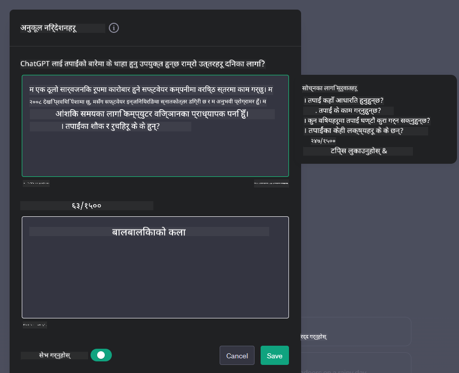

<!--
CO_OP_TRANSLATOR_METADATA:
{
  "original_hash": "ea4bbe640847aafbbba14dae4625e9af",
  "translation_date": "2025-07-09T12:23:25+00:00",
  "source_file": "07-building-chat-applications/README.md",
  "language_code": "ne"
}
-->
# जेनेरेटिभ AI-संचालित च्याट अनुप्रयोगहरू निर्माण गर्दै

[](https://aka.ms/gen-ai-lessons7-gh?WT.mc_id=academic-105485-koreyst)

> _(यो पाठको भिडियो हेर्न माथिको तस्बिरमा क्लिक गर्नुहोस्)_

अब हामीले कसरी टेक्स्ट-जेनेरेशन एपहरू बनाउन सकिन्छ भनेर हेरेपछि, च्याट अनुप्रयोगहरूमा ध्यान दिऔं।

च्याट अनुप्रयोगहरू हाम्रो दैनिक जीवनमा एकीकृत भइसकेका छन्, जसले केवल सामान्य कुराकानीको माध्यम मात्र होइन, ग्राहक सेवा, प्राविधिक समर्थन, र जटिल सल्लाह प्रणालीहरूमा पनि महत्त्वपूर्ण भूमिका खेल्छन्। सम्भवतः तपाईंले केही समयअघि कुनै च्याट अनुप्रयोगबाट सहयोग पाउनुभएको छ। जब हामी यी प्लेटफर्महरूमा जेनेरेटिभ AI जस्ता उन्नत प्रविधिहरू समावेश गर्छौं, तब जटिलता र चुनौतीहरू पनि बढ्छन्।

हामीले जवाफ खोज्नुपर्ने केही प्रश्नहरू छन्:

- **एप निर्माण**। हामी कसरी यी AI-संचालित अनुप्रयोगहरूलाई विशेष प्रयोग केसहरूका लागि प्रभावकारी रूपमा निर्माण र सहज रूपमा एकीकृत गर्न सक्छौं?
- **अनुगमन**। एक पटक तैनाथ भएपछि, हामी कसरी अनुप्रयोगहरूलाई कार्यक्षमता र [जिम्मेवार AI का छ सिद्धान्तहरू](https://www.microsoft.com/ai/responsible-ai?WT.mc_id=academic-105485-koreyst) दुवैमा उच्चतम गुणस्तरमा सञ्चालन भइरहेको सुनिश्चित गर्न सक्छौं?

जब हामी स्वचालन र सहज मानव-मेशिन अन्तरक्रियाले परिभाषित युगमा प्रवेश गर्दैछौं, जेनेरेटिभ AI ले च्याट अनुप्रयोगहरूको दायरा, गहिराइ, र अनुकूलन क्षमतामा कसरी रूपान्तरण ल्याउँछ भन्ने बुझ्न आवश्यक हुन्छ। यो पाठले यी जटिल प्रणालीहरूलाई समर्थन गर्ने वास्तुकला पक्षहरू, डोमेन-विशेष कार्यहरूको लागि तिनीहरूलाई कसरी फाइन-ट्यून गर्ने विधिहरू, र जिम्मेवार AI तैनाथी सुनिश्चित गर्न आवश्यक मेट्रिक्स र विचारहरूलाई अन्वेषण गर्नेछ।

## परिचय

यस पाठले समेट्छ:

- च्याट अनुप्रयोगहरूलाई प्रभावकारी रूपमा निर्माण र एकीकृत गर्ने प्रविधिहरू।
- अनुप्रयोगहरूमा अनुकूलन र फाइन-ट्यूनिङ कसरी लागू गर्ने।
- च्याट अनुप्रयोगहरूको प्रभावकारी अनुगमनका लागि रणनीतिहरू र विचारहरू।

## सिकाइ लक्ष्यहरू

यस पाठको अन्त्यसम्म, तपाईं सक्षम हुनुहुनेछ:

- च्याट अनुप्रयोगहरूलाई विद्यमान प्रणालीहरूमा निर्माण र एकीकृत गर्दा ध्यान दिनुपर्ने कुराहरू वर्णन गर्न।
- विशेष प्रयोग केसहरूका लागि च्याट अनुप्रयोगहरू अनुकूलन गर्न।
- AI-संचालित च्याट अनुप्रयोगहरूको गुणस्तर कायम राख्न र प्रभावकारी रूपमा अनुगमन गर्न मुख्य मेट्रिक्स र विचारहरू पहिचान गर्न।
- च्याट अनुप्रयोगहरूले AI लाई जिम्मेवार तरिकाले प्रयोग गरिरहेको सुनिश्चित गर्न।

## जेनेरेटिभ AI लाई च्याट अनुप्रयोगहरूमा एकीकृत गर्दै

जेनेरेटिभ AI मार्फत च्याट अनुप्रयोगहरूलाई उन्नत बनाउनु केवल तिनीहरूलाई स्मार्ट बनाउने कुरा मात्र होइन; यो तिनीहरूको वास्तुकला, प्रदर्शन, र प्रयोगकर्ता अन्तरफलकलाई अनुकूलित गरेर गुणस्तरीय प्रयोगकर्ता अनुभव प्रदान गर्ने विषय हो। यसले वास्तुकला आधारहरू, API एकीकरणहरू, र प्रयोगकर्ता अन्तरफलकका विचारहरू अन्वेषण गर्न समावेश गर्दछ। यो खण्डले तपाईंलाई यी जटिल क्षेत्रहरूमा मार्गदर्शन गर्ने व्यापक रोडम्याप प्रदान गर्ने लक्ष्य राख्दछ, चाहे तपाईं तिनीहरूलाई विद्यमान प्रणालीहरूमा जोड्दै हुनुहुन्छ वा स्वतन्त्र प्लेटफर्मको रूपमा निर्माण गर्दै हुनुहुन्छ।

यस खण्डको अन्त्यसम्म, तपाईं च्याट अनुप्रयोगहरूलाई प्रभावकारी रूपमा निर्माण र समावेश गर्न आवश्यक विशेषज्ञता प्राप्त गर्नुहुनेछ।

### च्याटबोट वा च्याट अनुप्रयोग?

च्याट अनुप्रयोगहरू निर्माण गर्न अघि, 'च्याटबोट' र 'AI-संचालित च्याट अनुप्रयोग' बीचको भिन्नता बुझौं, जसले फरक भूमिका र कार्यक्षमताहरू प्रदान गर्छन्। च्याटबोटको मुख्य उद्देश्य विशिष्ट कुराकानी कार्यहरू स्वचालित गर्नु हो, जस्तै बारम्बार सोधिने प्रश्नहरूको उत्तर दिनु वा प्याकेज ट्र्याक गर्नु। यो प्रायः नियम-आधारित तर्क वा जटिल AI एल्गोरिदमद्वारा सञ्चालित हुन्छ। यसको विपरीत, AI-संचालित च्याट अनुप्रयोग एक धेरै व्यापक वातावरण हो जसले मानव प्रयोगकर्ताबीच टेक्स्ट, आवाज, र भिडियो च्याट जस्ता विभिन्न डिजिटल सञ्चारका माध्यमहरूलाई सहज बनाउँछ। यसको मुख्य विशेषता जेनेरेटिभ AI मोडेलको समावेश हो जसले सूक्ष्म, मानव-जस्तो कुराकानीको अनुकरण गर्छ, विभिन्न इनपुट र सन्दर्भ संकेतहरूका आधारमा प्रतिक्रिया उत्पन्न गर्छ। जेनेरेटिभ AI-संचालित च्याट अनुप्रयोग खुला-डोमेन छलफलमा संलग्न हुन सक्छ, विकासशील कुराकानी सन्दर्भहरूमा अनुकूल हुन सक्छ, र सिर्जनात्मक वा जटिल संवाद पनि उत्पादन गर्न सक्छ।

तलको तालिकाले तिनीहरूको अनौठो भूमिकाहरू बुझ्न मुख्य भिन्नता र समानताहरू देखाउँछ।

| च्याटबोट                              | जेनेरेटिभ AI-संचालित च्याट अनुप्रयोग               |
| ------------------------------------- | -------------------------------------- |
| कार्य-केंद्रित र नियम आधारित          | सन्दर्भ-चेतन                              |
| प्रायः ठूला प्रणालीहरूमा एकीकृत       | एक वा धेरै च्याटबोटहरू होस्ट गर्न सक्छ          |
| प्रोग्राम गरिएको कार्यहरूमा सीमित      | जेनेरेटिभ AI मोडेलहरू समावेश गर्दछ               |
| विशेष र संरचित अन्तरक्रियाहरू          | खुला-डोमेन छलफल गर्न सक्षम                      |

### SDK र API हरूको साथ पूर्वनिर्मित कार्यक्षमताहरूको उपयोग

च्याट अनुप्रयोग निर्माण गर्दा, पहिले उपलब्ध स्रोतहरू मूल्यांकन गर्नु राम्रो हुन्छ। SDK र API हरू प्रयोग गरेर च्याट अनुप्रयोगहरू निर्माण गर्नु विभिन्न कारणहरूले फाइदाजनक रणनीति हो। राम्रोसँग दस्तावेजीकृत SDK र API हरू समावेश गरेर, तपाईं आफ्नो अनुप्रयोगलाई दीर्घकालीन सफलताको लागि रणनीतिक रूपमा तयार पार्दै हुनुहुन्छ, जसले स्केलेबिलिटी र मर्मतसम्भारका चुनौतीहरूलाई सम्बोधन गर्छ।

- **विकास प्रक्रिया छिटो बनाउँछ र ओभरहेड घटाउँछ**: आफैंले महँगो प्रक्रियामा कार्यक्षमता निर्माण गर्ने सट्टा पूर्वनिर्मित कार्यक्षमतामा निर्भर हुँदा तपाईं आफ्नो अनुप्रयोगका अन्य महत्त्वपूर्ण पक्षहरूमा ध्यान केन्द्रित गर्न सक्नुहुन्छ, जस्तै व्यापार तर्क।
- **राम्रो प्रदर्शन**: कार्यक्षमता शून्यबाट निर्माण गर्दा, तपाईंले अन्ततः सोध्नुहुनेछ "यो कसरी स्केल हुन्छ? के यो अनुप्रयोग अचानक प्रयोगकर्ताको बढ्दो संख्यालाई सम्हाल्न सक्षम छ?" राम्रोसँग मर्मत गरिएको SDK र API हरूमा प्रायः यी समस्याहरूका लागि समाधानहरू समावेश हुन्छन्।
- **सरल मर्मतसम्भार**: अपडेट र सुधारहरू सजिलै व्यवस्थापन गर्न सकिन्छ किनभने धेरै API र SDK हरूमा नयाँ संस्करण रिलिज हुँदा केवल लाइब्रेरी अपडेट गर्नुपर्ने हुन्छ।
- **अत्याधुनिक प्रविधिमा पहुँच**: व्यापक डेटासेटहरूमा प्रशिक्षित र फाइन-ट्यून गरिएको मोडेलहरू प्रयोग गर्दा तपाईंको अनुप्रयोगलाई प्राकृतिक भाषा क्षमताहरू प्राप्त हुन्छन्।

SDK वा API को कार्यक्षमता पहुँच गर्न प्रायः सेवा प्रयोग गर्न अनुमति प्राप्त गर्नुपर्छ, जुन प्रायः अनन्य कुञ्जी वा प्रमाणीकरण टोकन मार्फत हुन्छ। हामी OpenAI Python Library प्रयोग गरेर यसलाई अन्वेषण गर्नेछौं। तपाईं यसलाई यस पाठको लागि तलका [OpenAI नोटबुक](../../../07-building-chat-applications/python/oai-assignment.ipynb) वा [Azure OpenAI Services नोटबुक](../../../07-building-chat-applications/python/aoai-assignment.ipynb) मा पनि प्रयास गर्न सक्नुहुन्छ।

```python
import os
from openai import OpenAI

API_KEY = os.getenv("OPENAI_API_KEY","")

client = OpenAI(
    api_key=API_KEY
    )

chat_completion = client.chat.completions.create(model="gpt-3.5-turbo", messages=[{"role": "user", "content": "Suggest two titles for an instructional lesson on chat applications for generative AI."}])
```

माथिको उदाहरणले GPT-3.5 Turbo मोडेल प्रयोग गरेर प्रॉम्प्ट पूरा गर्छ, तर ध्यान दिनुहोस् कि API कुञ्जी पहिले सेट गरिएको छ। यदि तपाईंले कुञ्जी सेट गर्नुभएन भने त्रुटि प्राप्त गर्नुहुनेछ।

## प्रयोगकर्ता अनुभव (UX)

सामान्य UX सिद्धान्तहरू च्याट अनुप्रयोगहरूमा लागू हुन्छन्, तर यहाँ केही थप विचारहरू छन् जुन मेशिन लर्निङ कम्पोनेन्टहरूका कारण विशेष रूपमा महत्त्वपूर्ण हुन्छन्।

- **अस्पष्टताको समाधान गर्ने संयन्त्र**: जेनेरेटिभ AI मोडेलहरूले कहिलेकाहीं अस्पष्ट उत्तरहरू दिन सक्छन्। प्रयोगकर्ताहरूलाई स्पष्टीकरण माग्न सक्ने सुविधा उपयोगी हुन सक्छ यदि उनीहरूले यस्तो समस्या भोगे।
- **सन्दर्भ संरक्षण**: उन्नत जेनेरेटिभ AI मोडेलहरूले कुराकानी भित्र सन्दर्भ सम्झन सक्छन्, जुन प्रयोगकर्ता अनुभवका लागि आवश्यक हुन सक्छ। प्रयोगकर्ताहरूलाई सन्दर्भ नियन्त्रण र व्यवस्थापन गर्ने क्षमता दिनु प्रयोगकर्ता अनुभव सुधार्छ, तर यसले संवेदनशील प्रयोगकर्ता जानकारी संरक्षणको जोखिम पनि ल्याउँछ। यो जानकारी कति समयसम्म राख्ने भन्ने जस्ता विचारहरू, जस्तै संरक्षण नीति लागू गर्नु, सन्दर्भ आवश्यकतालाई गोपनीयतासँग सन्तुलन गर्न मद्दत गर्छ।
- **व्यक्तिगतकरण**: सिक्ने र अनुकूलन गर्ने क्षमता भएका AI मोडेलहरूले प्रयोगकर्ताका लागि व्यक्तिगत अनुभव प्रदान गर्छन्। प्रयोगकर्ता प्रोफाइल जस्ता सुविधाहरू मार्फत प्रयोगकर्ता अनुभवलाई अनुकूलित गर्दा प्रयोगकर्तालाई बुझिएको महसुस हुन्छ र उनीहरूको विशिष्ट उत्तर खोज्ने प्रयासलाई सहज र सन्तोषजनक बनाउँछ।

व्यक्तिगतकरणको एउटा उदाहरण OpenAI को ChatGPT मा "Custom instructions" सेटिङ हो। यसले तपाईंलाई आफ्नो बारेमा जानकारी दिन अनुमति दिन्छ जुन तपाईंका प्रॉम्प्टहरूको लागि महत्त्वपूर्ण सन्दर्भ हुन सक्छ। यहाँ एउटा कस्टम निर्देशनको उदाहरण छ।



यो "प्रोफाइल" ले ChatGPT लाई लिंक्ड लिस्टहरूमा आधारित पाठ योजना बनाउन उत्प्रेरित गर्छ। ध्यान दिनुहोस् कि ChatGPT ले प्रयोगकर्ताको अनुभवलाई ध्यानमा राखेर गहिरो पाठ योजना चाहन सक्ने कुरा विचार गर्छ।


### Microsoft को System Message Framework ठूलो भाषा मोडेलहरूका लागि

[Microsoft ले LLM बाट प्रतिक्रिया उत्पन्न गर्दा प्रभावकारी सिस्टम सन्देश लेख्नका लागि मार्गदर्शन प्रदान गरेको छ](https://learn.microsoft.com/azure/ai-services/openai/concepts/system-message#define-the-models-output-format?WT.mc_id=academic-105485-koreyst), जुन ४ क्षेत्रहरूमा विभाजित छ:

1. मोडेलको लक्षित प्रयोगकर्ता, क्षमताहरू र सीमाहरू परिभाषित गर्ने।
2. मोडेलको आउटपुट ढाँचा परिभाषित गर्ने।
3. मोडेलको अपेक्षित व्यवहार देखाउने विशिष्ट उदाहरणहरू प्रदान गर्ने।
4. अतिरिक्त व्यवहारिक सुरक्षा उपायहरू प्रदान गर्ने।

### पहुँचयोग्यता

प्रयोगकर्ताले दृष्टि, श्रवण, मोटर, वा संज्ञानात्मक अपाङ्गता भए पनि, राम्रो डिजाइन गरिएको च्याट अनुप्रयोग सबैका लागि प्रयोगयोग्य हुनुपर्छ। तलको सूचीले विभिन्न प्रयोगकर्ता अपाङ्गताहरूका लागि पहुँचयोग्यता सुधार गर्ने विशेषताहरू तोक्छ।

- **दृष्टि अपाङ्गताका लागि सुविधाहरू**: उच्च कन्ट्रास्ट थिमहरू र आकार परिवर्तन गर्न मिल्ने पाठ, स्क्रिन रिडर अनुकूलता।
- **श्रवण अपाङ्गताका लागि सुविधाहरू**: टेक्स्ट-टु-स्पीच र स्पीच-टु-टेक्स्ट कार्यहरू, अडियो सूचनाका लागि दृश्य संकेतहरू।
- **मोटर अपाङ्गताका लागि सुविधाहरू**: किबोर्ड नेभिगेसन समर्थन, भ्वाइस कमाण्डहरू।
- **संज्ञानात्मक अपाङ्गताका लागि सुविधाहरू**: सरल भाषा विकल्पहरू।

## डोमेन-विशेष भाषा मोडेलहरूको लागि अनुकूलन र फाइन-ट्यूनिङ

कल्पना गर्नुहोस् एउटा च्याट अनुप्रयोग जसले तपाईंको कम्पनीको विशेष शब्दावली बुझ्छ र यसको प्रयोगकर्ता आधारले सामान्यतया गर्ने विशिष्ट प्रश्नहरू अनुमान लगाउँछ। उल्लेख गर्न लायक केही दृष्टिकोणहरू छन्:

- **DSL मोडेलहरूको उपयोग**। DSL भनेको डोमेन-विशेष भाषा हो। तपाईं DSL मोडेल प्रयोग गर्न सक्नुहुन्छ जुन विशेष डोमेनमा प्रशिक्षित छ र त्यसका अवधारणाहरू र परिदृश्यहरू बुझ्छ।
- **फाइन-ट्यूनिङ लागू गर्नुहोस्**। फाइन-ट्यूनिङ भनेको तपाईंको मोडेललाई विशेष डेटा प्रयोग गरेर थप प्रशिक्षण दिने प्रक्रिया हो।

## अनुकूलन: DSL को प्रयोग

डोमेन-विशेष भाषा मोडेलहरू (DSL मोडेलहरू) प्रयोग गर्दा प्रयोगकर्ता संलग्नता बढ्छ र विशेष, सन्दर्भसँग मेल खाने अन्तरक्रियाहरू प्रदान गर्न सकिन्छ। यो मोडेल हो जुन विशेष क्षेत्र, उद्योग, वा विषयसँग सम्बन्धित पाठ बुझ्न र उत्पन्न गर्न प्रशिक्षित वा फाइन-ट्यून गरिएको हुन्छ। DSL मोडेल प्रयोग गर्ने विकल्पहरूमा शून्यबाट प्रशिक्षण गर्ने, SDK र API मार्फत पूर्वनिर्मित मोडेलहरू प्रयोग गर्ने, वा फाइन-ट्यूनिङ गर्ने समावेश हुन्छ। फाइन-ट्यूनिङ भनेको पूर्व-प्रशिक्षित मोडेललाई लिएर त्यसलाई विशेष डोमेनका लागि अनुकूल बनाउने प्रक्रिया हो।

## अनुकूलन: फाइन-ट्यूनिङ लागू गर्नुहोस्

जब पूर्व-प्रशिक्षित मोडेल विशेष डोमेन वा विशिष्ट कार्यमा पर्याप्त नहुने अवस्था आउँछ, तब फाइन-ट्यूनिङ विचार गरिन्छ।

उदाहरणका लागि, चिकित्सा प्रश्नहरू जटिल हुन्छन् र धेरै सन्दर्भ आवश्यक पर्छ। जब चिकित्सकले बिरामीको निदान गर्छ, त्यो जीवनशैली, पूर्वस्थितिहरू, र हालैका चिकित्सा जर्नलहरूमा आधारित हुन्छ। यस्ता सूक्ष्म अवस्थामा, सामान्य उद्देश्यको AI च्याट अनुप्रयोग भरपर्दो स्रोत हुन सक्दैन।

### परिदृश्य: चिकित्सा अनुप्रयोग

चिकित्सा पेशेवरहरूलाई उपचार दिशानिर्देश, औषधि अन्तरक्रिया, वा हालैका अनुसन्धान निष्कर्षहरू छिटो सन्दर्भ दिन डिजाइन गरिएको च्याट अनुप्रयोगलाई विचार गर्नुहोस्।

सामान्य उद्देश्यको मोडेलले आधारभूत चिकित्सा प्रश्नहरूको उत्तर दिन वा सामान्य सल्लाह दिन पर्याप्त हुन सक्छ, तर निम्न कुराहरूमा संघर्ष गर्न सक्छ:

- **अत्यन्त विशिष्ट वा जटिल केसहरू**। उदाहरणका लागि, न्यूरोलोजिस्टले सोध्न सक्छ, "बालबालिकामा औषधि-प्रतिरोधी मिर्गी व्यवस्थापनका लागि हालका उत्तम अभ्यासहरू के हुन्?"
- **हालैका प्रगतिहरूको अभाव**। सामान्य उद्देश्यको मोडेलले न्यूरोलोजी र फार्माकोलोजीमा सबैभन्दा नयाँ प्रगतिहरू समावेश गरेर वर्तमान उत्तर दिन सक्दैन।

यस्ता अवस्थामा, विशेष चिकित्सा डेटासेटसँग मोडेललाई फाइन-ट्यून गर्दा यी जटिल चिकित्सा प्रश्नहरूलाई बढी सही र भरपर्दो रूपमा सम्बोधन गर्न सकिन्छ। यसका लागि ठूलो र सान्दर्भिक डेटासेट आवश्यक हुन्छ जुन डोमेन-विशेष चुनौतीहरू र प्रश्नहरू प्रतिनिधित्व गर्छ।

## उच्च गुणस्तरको AI-चालित च्याट अनुभवका लागि विचारहरू

यस खण्डले "उच्च गुणस्तर" च्याट अनुप्रयोगहरूको मापदण्डहरू वर्णन गर्दछ, जसमा कार्यान्वयन योग्य मेट्रिक्सको सङ्कलन र AI प्रविधिको जिम्मेवार प्रयोग सुनिश्चित गर्ने फ्रेमवर्क समावेश छ।

### मुख्य मेट्रिक्स

एउटा अनुप्रयोगको उच्च गुणस्तर प्रदर्शन कायम राख्न, मुख्य मेट्रिक्स र विचारहरू ट्र्याक गर्नु आवश्यक छ। यी मापनहरूले अनुप्रयोगको कार्यक्षमता मात्र होइन, AI मोडेल र प्रयोगकर्ता अनुभवको गुणस्तर पनि मूल्याङ्कन गर्छन्। तल आधारभूत, AI, र प्रयोगकर्ता अनुभव मेट्रिक्सहरूको सूची छ जुन विचार गर्नुपर्छ।

| मेट्रिक                        | परिभाषा                                                                                                             | च्याट विकासकर्ताका लागि विचारहरू                                         |
| ----------------------------- | ---------------------------------------------------------------------------------------------------------------------- | ------------------------------------------------------------------------- |
| **अपटाइम**                    | अनुप्रयोग सञ्चालनमा र प्रयोगकर्ताले पहुँच गर्न सक्ने समय मापन गर्छ।                                              | तपाईंले डाउनटाइम कसरी कम गर्नुहुनेछ?                                           |
| **प्रतिक्रिया समय**             | प्रयोगकर्ताको प्रश्नको जवाफ दिन अनुप्रयोगले लिने समय।                                                          | प्रतिक्रिया समय सुधार्न प्रश्न प्रशोधन कसरी अनुकूल बनाउने?           |
| **प्रिसिजन**                 | सही सकारात्मक भविष्यवाणीहरूको अनुपात कुल सकारात्मक भविष्यवाणीहरूसँग।                                     | तपाईंले आफ्नो मोडेलको प्रिसिजन कसरी प्रमाणित गर्नुहुनेछ?                        |
| **रिकल (संवेदनशीलता)**      | सही सकारात्मक भविष्यवाणीहरूको अनुपात वास्तविक सकारात्मकहरूको संख्यामा।                                               | तपाईंले रिकॉल कसरी मापन र सुधार गर्नुहुनेछ?                                  |
| **F1 स्कोर**                  | प्र
| **असामान्य पहिचान**         | अपेक्षित व्यवहारसँग मेल नखाने अनौठा ढाँचाहरू पत्ता लगाउनका लागि उपकरण र प्रविधिहरू।                        | असामान्यताहरूलाई तपाईं कसरी प्रतिक्रिया दिनुहुनेछ?                                        |

### च्याट अनुप्रयोगहरूमा जिम्मेवार AI अभ्यासहरू कार्यान्वयन गर्दै

Microsoft को जिम्मेवार AI दृष्टिकोणले छ सिद्धान्तहरू पहिचान गरेको छ जसले AI विकास र प्रयोगलाई मार्गदर्शन गर्नुपर्छ। तल ती सिद्धान्तहरू, तिनीहरूको परिभाषा, र च्याट विकासकर्ताले के विचार गर्नुपर्छ र किन तिनीहरूलाई गम्भीरतापूर्वक लिनुपर्छ भन्ने कुरा दिइएको छ।

| सिद्धान्तहरू             | Microsoft को परिभाषा                                | च्याट विकासकर्ताका लागि विचारहरू                                      | किन यो महत्त्वपूर्ण छ                                                                     |
| ---------------------- | ----------------------------------------------------- | ---------------------------------------------------------------------- | -------------------------------------------------------------------------------------- |
| निष्पक्षता               | AI प्रणालीहरूले सबै मानिसहरूप्रति निष्पक्ष व्यवहार गर्नुपर्छ।            | च्याट अनुप्रयोगले प्रयोगकर्ता डाटामा आधारित भेदभाव नगर्ने सुनिश्चित गर्नुहोस्।  | प्रयोगकर्ताबीच विश्वास र समावेशिता निर्माण गर्न; कानुनी समस्याबाट बच्न।                |
| विश्वसनीयता र सुरक्षा | AI प्रणालीहरूले विश्वसनीय र सुरक्षित रूपमा काम गर्नुपर्छ।        | त्रुटि र जोखिम कम गर्न परीक्षण र फेल-सेफहरू लागू गर्नुहोस्।         | प्रयोगकर्ताको सन्तुष्टि सुनिश्चित गर्न र सम्भावित हानि रोक्न।                                 |
| गोपनीयता र सुरक्षा   | AI प्रणालीहरूले सुरक्षित र गोपनीयताको सम्मान गर्नुपर्छ।      | बलियो इन्क्रिप्सन र डाटा संरक्षण उपायहरू लागू गर्नुहोस्।              | संवेदनशील प्रयोगकर्ता डाटा सुरक्षित गर्न र गोपनीयता कानुनहरू पालना गर्न।                         |
| समावेशिता          | AI प्रणालीहरूले सबैलाई सशक्त बनाउनु र मानिसहरूलाई संलग्न गराउनु पर्छ। | विविध दर्शकका लागि पहुँचयोग्य र प्रयोग गर्न सजिलो UI/UX डिजाइन गर्नुहोस्। | अनुप्रयोगलाई फराकिलो समूहले प्रभावकारी रूपमा प्रयोग गर्न सकून्।                   |
| पारदर्शिता           | AI प्रणालीहरू बुझ्न सकिने हुनुपर्छ।                  | AI प्रतिक्रियाहरूको स्पष्ट कागजात र तर्क प्रदान गर्नुहोस्।            | प्रयोगकर्ताहरूले निर्णय कसरी गरिन्छ बुझ्न सकेमा प्रणालीमा बढी विश्वास गर्छन्। |
| जवाफदेहिता         | मानिसहरूले AI प्रणालीहरूको जवाफदेही हुनुपर्छ।          | AI निर्णयहरूको अडिट र सुधारका लागि स्पष्ट प्रक्रिया स्थापना गर्नुहोस्।     | गल्ती भएमा निरन्तर सुधार र सुधारात्मक कदम चाल्न सक्षम बनाउँछ।               |

## असाइनमेन्ट

[assignment](../../../07-building-chat-applications/python) हेर्नुहोस्, यसले तपाईंलाई पहिलो च्याट प्रॉम्प्टहरू चलाउनदेखि लिएर पाठ वर्गीकरण र सारांश बनाउने लगायतका अभ्यासहरूको श्रृंखलामा लैजान्छ। ध्यान दिनुहोस् कि असाइनमेन्टहरू विभिन्न प्रोग्रामिङ भाषाहरूमा उपलब्ध छन्!

## उत्कृष्ट काम! यात्रा जारी राख्नुहोस्

यो पाठ पूरा गरेपछि, हाम्रो [Generative AI Learning collection](https://aka.ms/genai-collection?WT.mc_id=academic-105485-koreyst) हेर्नुहोस् र आफ्नो Generative AI ज्ञानलाई अझ उचाइमा पुर्‍याउनुहोस्!

पाठ ८ मा जानुहोस् र हेर्नुहोस् कसरी तपाईं [खोज अनुप्रयोगहरू निर्माण गर्न](../08-building-search-applications/README.md?WT.mc_id=academic-105485-koreyst) सुरु गर्न सक्नुहुन्छ!

**अस्वीकरण**:  
यो दस्तावेज AI अनुवाद सेवा [Co-op Translator](https://github.com/Azure/co-op-translator) प्रयोग गरी अनुवाद गरिएको हो। हामी शुद्धताका लागि प्रयासरत छौं, तर कृपया ध्यान दिनुहोस् कि स्वचालित अनुवादमा त्रुटि वा अशुद्धता हुन सक्छ। मूल दस्तावेज यसको मूल भाषामा नै अधिकारिक स्रोत मानिनुपर्छ। महत्वपूर्ण जानकारीका लागि व्यावसायिक मानव अनुवाद सिफारिस गरिन्छ। यस अनुवादको प्रयोगबाट उत्पन्न कुनै पनि गलतफहमी वा गलत व्याख्याका लागि हामी जिम्मेवार छैनौं।