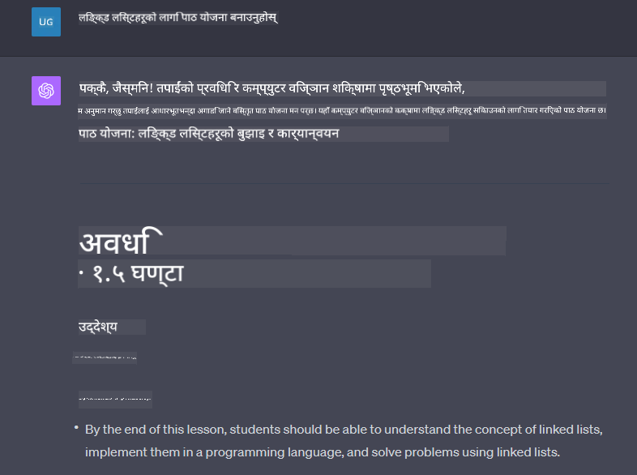

<!--
CO_OP_TRANSLATOR_METADATA:
{
  "original_hash": "a5308963a56cfbad2d73b0fa99fe84b3",
  "translation_date": "2025-10-18T00:30:48+00:00",
  "source_file": "07-building-chat-applications/README.md",
  "language_code": "ne"
}
-->
# जेनेरेटिभ एआई-संचालित च्याट एप्लिकेसन निर्माण

[](https://youtu.be/R9V0ZY1BEQo?si=IHuU-fS9YWT8s4sA)

> _(माथिको तस्बिरमा क्लिक गरेर यस पाठको भिडियो हेर्नुहोस्)_

अब हामीले टेक्स्ट-जेनेरेशन एप्स कसरी निर्माण गर्न सकिन्छ भन्ने देखिसकेपछि, च्याट एप्लिकेसनहरूमा ध्यान केन्द्रित गरौं।

च्याट एप्लिकेसनहरू हाम्रो दैनिक जीवनमा समाहित भइसकेका छन्, जसले केवल सामान्य कुराकानीको माध्यम मात्र प्रदान गर्दैनन्। तिनीहरू ग्राहक सेवा, प्राविधिक सहयोग, र परिष्कृत सल्लाह प्रणालीहरूको अभिन्न भाग बनेका छन्। सम्भवतः तपाईंले केही समयअघि च्याट एप्लिकेसनबाट सहयोग प्राप्त गर्नुभएको छ। जब हामी यी प्लेटफर्महरूमा जेनेरेटिभ एआई जस्ता उन्नत प्रविधिहरू समाहित गर्छौं, जटिलता बढ्छ र चुनौतीहरू पनि बढ्छन्।

हामीले उत्तर दिनुपर्ने केही प्रश्नहरू:

- **एप्लिकेसन निर्माण**। हामी कसरी यी एआई-संचालित एप्लिकेसनहरूलाई विशेष प्रयोगका लागि प्रभावकारी रूपमा निर्माण र सहज रूपमा समाहित गर्न सक्छौं?
- **मोनिटरिङ**। एकपटक तैनात भएपछि, हामी कसरी सुनिश्चित गर्न सक्छौं कि एप्लिकेसनहरू कार्यक्षमता र [जिम्मेवार एआईका छ सिद्धान्तहरू](https://www.microsoft.com/ai/responsible-ai?WT.mc_id=academic-105485-koreyst) पालना गर्ने हिसाबले उच्च स्तरको गुणस्तरमा सञ्चालन भइरहेका छन्?

स्वचालन र मानव-मेसिन अन्तरक्रियाको सहज युगमा अगाडि बढ्दै गर्दा, जेनेरेटिभ एआईले च्याट एप्लिकेसनहरूको दायरा, गहिराई, र अनुकूलनशीलतालाई कसरी रूपान्तरण गर्छ भन्ने बुझ्न आवश्यक छ। यो पाठले यी जटिल प्रणालीहरूलाई समर्थन गर्ने वास्तुकलाका पक्षहरूलाई अनुसन्धान गर्नेछ, डोमेन-विशिष्ट कार्यहरूको लागि तिनीहरूलाई परिष्कृत गर्ने पद्धतिहरूमा गहिरो अध्ययन गर्नेछ, र जिम्मेवार एआई तैनाती सुनिश्चित गर्न सान्दर्भिक मेट्रिक्स र विचारहरू मूल्याङ्कन गर्नेछ।

## परिचय

यो पाठले समेट्छ:

- च्याट एप्लिकेसनहरूलाई प्रभावकारी रूपमा निर्माण र समाहित गर्ने प्रविधिहरू।
- एप्लिकेसनहरूमा अनुकूलन र परिष्कृत गर्ने तरिकाहरू।
- च्याट एप्लिकेसनहरूलाई प्रभावकारी रूपमा अनुगमन गर्ने रणनीतिहरू र विचारहरू।

## सिकाइका लक्ष्यहरू

यो पाठको अन्त्यसम्म, तपाईं सक्षम हुनुहुनेछ:

- च्याट एप्लिकेसनहरूलाई विद्यमान प्रणालीहरूमा निर्माण र समाहित गर्ने विचारहरू वर्णन गर्न।
- विशिष्ट प्रयोगका लागि च्याट एप्लिकेसनहरू अनुकूलन गर्न।
- एआई-संचालित च्याट एप्लिकेसनहरूको गुणस्तरलाई प्रभावकारी रूपमा अनुगमन र कायम राख्न प्रमुख मेट्रिक्स र विचारहरू पहिचान गर्न।
- सुनिश्चित गर्न कि च्याट एप्लिकेसनहरूले एआईलाई जिम्मेवार रूपमा उपयोग गर्छन्।

## च्याट एप्लिकेसनहरूमा जेनेरेटिभ एआई समाहित गर्ने

जेनेरेटिभ एआई मार्फत च्याट एप्लिकेसनहरूलाई उन्नत बनाउनु केवल तिनीहरूलाई स्मार्ट बनाउने कुरामा केन्द्रित छैन; यो तिनीहरूको वास्तुकला, प्रदर्शन, र प्रयोगकर्ता इन्टरफेसलाई अनुकूलित गरेर गुणस्तरीय प्रयोगकर्ता अनुभव प्रदान गर्ने बारे हो। यसमा वास्तुकलाका आधारहरू, एपीआई एकीकरणहरू, र प्रयोगकर्ता इन्टरफेस विचारहरू अनुसन्धान गर्ने समावेश छ। यो खण्डले तपाईंलाई यी जटिल परिदृश्यहरूमा नेभिगेट गर्न व्यापक रोडम्याप प्रदान गर्ने उद्देश्य राख्छ, चाहे तपाईं तिनीहरूलाई विद्यमान प्रणालीहरूमा प्लग गर्दै हुनुहुन्छ वा तिनीहरूलाई स्वतन्त्र प्लेटफर्मको रूपमा निर्माण गर्दै हुनुहुन्छ।

यो खण्डको अन्त्यसम्म, तपाईं च्याट एप्लिकेसनहरूलाई प्रभावकारी रूपमा निर्माण र समाहित गर्न आवश्यक विशेषज्ञता प्राप्त गर्न सक्नुहुन्छ।

### च्याटबोट वा च्याट एप्लिकेसन?

च्याट एप्लिकेसनहरू निर्माण गर्न अघि, 'च्याटबोट' र 'एआई-संचालित च्याट एप्लिकेसन' बीच तुलना गरौं, जसले फरक भूमिका र कार्यक्षमताहरू प्रदान गर्छ। च्याटबोटको मुख्य उद्देश्य विशिष्ट कुराकानी कार्यहरू स्वचालित गर्नु हो, जस्तै बारम्बार सोधिने प्रश्नहरूको उत्तर दिनु वा प्याकेज ट्र्याक गर्नु। यो सामान्यतया नियम-आधारित तर्क वा जटिल एआई एल्गोरिदमद्वारा संचालित हुन्छ। यसको विपरीत, एआई-संचालित च्याट एप्लिकेसन मानव प्रयोगकर्ताहरू बीच पाठ, आवाज, र भिडियो च्याट जस्ता विभिन्न प्रकारका डिजिटल सञ्चारलाई सहज बनाउने उद्देश्यले डिजाइन गरिएको धेरै व्यापक वातावरण हो। यसको परिभाषित विशेषता भनेको जेनेरेटिभ एआई मोडेलको एकीकरण हो जसले सूक्ष्म, मानव-जस्तो कुराकानीलाई अनुकरण गर्छ, इनपुट र सन्दर्भ संकेतहरूको विस्तृत विविधताको आधारमा प्रतिक्रियाहरू उत्पन्न गर्छ। जेनेरेटिभ एआई-संचालित च्याट एप्लिकेसनले खुला-डोमेन छलफलमा संलग्न हुन सक्छ, विकसित हुँदै गरेको कुराकानी सन्दर्भहरूमा अनुकूलन गर्न सक्छ, र रचनात्मक वा जटिल संवाद पनि उत्पादन गर्न सक्छ।

तलको तालिकाले डिजिटल सञ्चारमा तिनीहरूको अद्वितीय भूमिकालाई बुझ्न मद्दत गर्न मुख्य भिन्नता र समानताहरूलाई रेखांकित गर्दछ।

| च्याटबोट                              | जेनेरेटिभ एआई-संचालित च्याट एप्लिकेसन |
| ------------------------------------- | -------------------------------------- |
| कार्य-केंद्रित र नियम-आधारित         | सन्दर्भ-सचेत                           |
| प्रायः ठूला प्रणालीहरूमा समाहित      | एक वा धेरै च्याटबोटहरू समावेश गर्न सक्छ |
| प्रोग्राम गरिएको कार्यहरूमा सीमित     | जेनेरेटिभ एआई मोडेलहरू समाहित गर्छ    |
| विशेषीकृत र संरचित अन्तरक्रिया        | खुला-डोमेन छलफल गर्न सक्षम            |

### एसडीके र एपीआईहरूसँग पूर्व-निर्मित कार्यक्षमताहरूको उपयोग

च्याट एप्लिकेसन निर्माण गर्दा, पहिलो चरण भनेको के पहिले नै उपलब्ध छ भनेर मूल्याङ्कन गर्नु हो। च्याट एप्लिकेसनहरू निर्माण गर्न एसडीके र एपीआईहरूको उपयोग गर्नु विभिन्न कारणहरूको लागि लाभदायक रणनीति हो। राम्रोसँग डकुमेन्ट गरिएको एसडीके र एपीआईहरू समाहित गरेर, तपाईं आफ्नो एप्लिकेसनलाई दीर्घकालीन सफलताको लागि रणनीतिक रूपमा स्थान दिनुहुन्छ, स्केलेबिलिटी र मर्मतसम्भारको चिन्ताहरूलाई सम्बोधन गर्दै।

- **विकास प्रक्रिया छिटो बनाउँछ र ओभरहेड घटाउँछ**: आफैं निर्माण गर्ने महँगो प्रक्रियाको सट्टा पूर्व-निर्मित कार्यक्षमताहरूमा निर्भर रहनु तपाईंलाई आफ्नो एप्लिकेसनको अन्य पक्षहरूमा ध्यान केन्द्रित गर्न अनुमति दिन्छ, जस्तै व्यापारिक तर्क।
- **उत्तम प्रदर्शन**: जब स्क्र्याचबाट कार्यक्षमता निर्माण गरिन्छ, तपाईं अन्ततः आफैंलाई सोध्नुहुन्छ "यो कसरी स्केल हुन्छ? के यो एप्लिकेसन अचानक प्रयोगकर्ताहरूको बाढीलाई सम्हाल्न सक्षम छ?" राम्रोसँग मर्मत गरिएको एसडीके र एपीआईहरूले प्रायः यी चिन्ताहरूको लागि निर्मित समाधानहरू प्रदान गर्छन्।
- **मर्मतसम्भार सजिलो बनाउँछ**: अपडेटहरू र सुधारहरू व्यवस्थापन गर्न सजिलो हुन्छ किनभने अधिकांश एपीआई र एसडीकेहरूले नयाँ संस्करण जारी हुँदा पुस्तकालयलाई अपडेट गर्न मात्र आवश्यक हुन्छ।
- **अत्याधुनिक प्रविधिको पहुँच**: व्यापक डेटासेटहरूमा परिष्कृत र प्रशिक्षित मोडेलहरूको उपयोगले तपाईंको एप्लिकेसनलाई प्राकृतिक भाषा क्षमताहरू प्रदान गर्छ।

एसडीके वा एपीआईको कार्यक्षमता पहुँच गर्नु सामान्यतया प्रदान गरिएको सेवाहरू प्रयोग गर्न अनुमति प्राप्त गर्न समावेश गर्दछ, जुन प्रायः अद्वितीय कुञ्जी वा प्रमाणीकरण टोकनको प्रयोग मार्फत हुन्छ। हामीले यो कस्तो देखिन्छ भनेर अन्वेषण गर्न OpenAI Python Library प्रयोग गर्नेछौं। तपाईं यस पाठको लागि [OpenAI को नोटबुक](./python/oai-assignment.ipynb?WT.mc_id=academic-105485-koreyst) वा [Azure OpenAI Services को नोटबुक](./python/aoai-assignment.ipynb?WT.mc_id=academic-105485-koreys) मा पनि प्रयास गर्न सक्नुहुन्छ।

```python
import os
from openai import OpenAI

API_KEY = os.getenv("OPENAI_API_KEY","")

client = OpenAI(
    api_key=API_KEY
    )

chat_completion = client.chat.completions.create(model="gpt-3.5-turbo", messages=[{"role": "user", "content": "Suggest two titles for an instructional lesson on chat applications for generative AI."}])
```

माथिको उदाहरणले GPT-3.5 Turbo मोडेललाई प्रम्प्ट पूरा गर्न प्रयोग गरेको छ, तर ध्यान दिनुहोस् कि एपीआई कुञ्जी सेट गरिएको छ। यदि तपाईंले कुञ्जी सेट गर्नुभएको छैन भने तपाईंले त्रुटि प्राप्त गर्नुहुनेछ।

## प्रयोगकर्ता अनुभव (UX)

सामान्य UX सिद्धान्तहरू च्याट एप्लिकेसनहरूमा लागू हुन्छन्, तर यहाँ केही थप विचारहरू छन् जुन मेसिन लर्निङ कम्पोनेन्टहरू समावेश भएका कारण विशेष रूपमा महत्त्वपूर्ण हुन्छन्।

- **अस्पष्टता समाधान गर्ने संयन्त्र**: जेनेरेटिभ एआई मोडेलहरूले कहिलेकाहीं अस्पष्ट उत्तरहरू उत्पन्न गर्छन्। प्रयोगकर्ताहरूले स्पष्टता माग्न सक्ने सुविधा उपयोगी हुन सक्छ यदि उनीहरूले यो समस्या सामना गर्छन् भने।
- **सन्दर्भको संरक्षण**: उन्नत जेनेरेटिभ एआई मोडेलहरूले कुराकानीको सन्दर्भ सम्झन सक्ने क्षमता राख्छन्, जुन प्रयोगकर्ता अनुभवको लागि आवश्यक सम्पत्ति हुन सक्छ। प्रयोगकर्ताहरूलाई सन्दर्भ नियन्त्रण र व्यवस्थापन गर्ने क्षमता दिनुले प्रयोगकर्ता अनुभव सुधार गर्छ, तर संवेदनशील प्रयोगकर्ता जानकारी राख्ने जोखिम प्रस्तुत गर्छ। यो जानकारी कति समयसम्म भण्डारण गरिन्छ भन्ने विचारहरू, जस्तै रिटेन्सन नीति प्रस्तुत गरेर, गोपनीयता विरुद्ध सन्दर्भको आवश्यकता सन्तुलन गर्न सक्छ।
- **व्यक्तिगतकरण**: सिक्न र अनुकूलन गर्न सक्ने क्षमता भएकोले, एआई मोडेलहरूले प्रयोगकर्ताको लागि व्यक्तिगत अनुभव प्रदान गर्छन्। प्रयोगकर्ता प्रोफाइलहरू जस्ता सुविधाहरू मार्फत प्रयोगकर्ता अनुभवलाई अनुकूलित गर्नुले प्रयोगकर्तालाई बुझिएको महसुस गराउँछ, तर यसले विशिष्ट उत्तरहरू खोज्ने क्रममा उनीहरूको प्रयासलाई सहयोग पुर्‍याउँछ, अधिक प्रभावकारी र सन्तोषजनक अन्तरक्रिया सिर्जना गर्दै।

व्यक्तिगतकरणको एउटा उदाहरण OpenAI को ChatGPT मा "कस्टम निर्देशनहरू" सेटिङ हो। यसले तपाईंलाई आफ्नो प्रम्प्टहरूको लागि महत्त्वपूर्ण सन्दर्भ हुन सक्ने आफ्नो बारेमा जानकारी प्रदान गर्न अनुमति दिन्छ। यहाँ कस्टम निर्देशनको एउटा उदाहरण छ।


यो "प्रोफाइल" ले ChatGPT लाई लिंक्ड लिस्टहरूमा पाठ योजना सिर्जना गर्न संकेत गर्दछ। ध्यान दिनुहोस् कि ChatGPT ले प्रयोगकर्ताले आफ्नो अनुभवको आधारमा थप गहिरो पाठ योजना चाहन सक्छ भन्ने कुरा ध्यानमा राख्छ।



### माइक्रोसफ्टको ठूलो भाषा मोडेलहरूको लागि प्रणाली सन्देश फ्रेमवर्क

[माइक्रोसफ्टले मार्गदर्शन प्रदान गरेको छ](https://learn.microsoft.com/azure/ai-services/openai/concepts/system-message#define-the-models-output-format?WT.mc_id=academic-105485-koreyst) LLM बाट प्रतिक्रियाहरू उत्पन्न गर्दा प्रभावकारी प्रणाली सन्देशहरू लेख्नका लागि चार क्षेत्रहरूमा विभाजित:

1. मोडेलको लागि को हो, साथै यसको क्षमता र सीमाहरू परिभाषित गर्नु।
2. मोडेलको आउटपुट ढाँचा परिभाषित गर्नु।
3. मोडेलको इच्छित व्यवहार प्रदर्शन गर्ने विशिष्ट उदाहरणहरू प्रदान गर्नु।
4. अतिरिक्त व्यवहारिक सुरक्षा उपायहरू प्रदान गर्नु।

### पहुँचयोग्यता

चाहे प्रयोगकर्तासँग दृष्टि, श्रवण, मोटर, वा संज्ञानात्मक अशक्तता होस्, राम्रोसँग डिजाइन गरिएको च्याट एप्लिकेसन सबैले प्रयोग गर्न सक्ने हुनुपर्छ। तलको सूचीले विभिन्न प्रयोगकर्ता अशक्तताहरूको लागि पहुँचयोग्यता सुधार गर्ने उद्देश्यले विशिष्ट सुविधाहरूलाई तोड्छ।

- **दृष्टि अशक्तताका लागि सुविधाहरू**: उच्च कन्ट्रास्ट थिमहरू र पुनःआकारयोग्य पाठ, स्क्रिन रिडर अनुकूलता।
- **श्रवण अशक्तताका लागि सुविधाहरू**: टेक्स्ट-टु-स्पीच र स्पीच-टु-टेक्स्ट कार्यहरू, अडियो सूचनाहरूको लागि दृश्य संकेतहरू।
- **मोटर अशक्तताका लागि सुविधाहरू**: किबोर्ड नेभिगेसन समर्थन, आवाज आदेशहरू।
- **संज्ञानात्मक अशक्तताका लागि सुविधाहरू**: सरल भाषा विकल्पहरू।

## डोमेन-विशिष्ट भाषा मोडेलहरूको लागि अनुकूलन र परिष्कृत

कल्पना गर्नुहोस् कि च्याट एप्लिकेसनले तपाईंको कम्पनीको जर्गन बुझ्छ र यसको प्रयोगकर्ता आधारले सामान्यतया राख्ने विशिष्ट प्रश्नहरूको पूर्वानुमान गर्छ। यहाँ उल्लेख गर्न लायक दुईवटा दृष्टिकोणहरू छन्:

- **DSL मोडेलहरूको उपयोग**। DSL भनेको डोमेन-विशिष्ट भाषा हो। तपाईंले तथाकथित DSL मोडेललाई प्रशिक्षण गरेर वा परिष्कृत गरेर यसको अवधारणाहरू र परिदृश्यहरू बुझ्न सक्नुहुन्छ।
- **परिष्कृत लागू गर्नुहोस्**। परिष्कृत भनेको तपाईंको मोडेललाई विशिष्ट डाटाको साथ थप प्रशिक्षण दिने प्रक्रिया हो।

## अनुकूलन: DSL को उपयोग

डोमेन-विशिष्ट भाषा मोडेलहरू (DSL मोडेलहरू) प्रयोग गरेर विशेष, सन्दर्भगत रूपमा सान्दर्भिक अन्तरक्रियाहरू प्रदान गरेर प्रयोगकर्ता संलग्नता सुधार गर्न सकिन्छ। यो एक मोडेल हो जुन विशिष्ट क्षेत्र, उद्योग, वा विषयसँग सम्बन्धित पाठ बुझ्न र उत्पन्न गर्न प्रशिक्षित वा परिष्कृत गरिएको छ। DSL मोडेल प्रयोग गर्ने विकल्पहरू स्क्र्याचबाट प्रशिक्षण गर्ने, एसडीके र एपीआईहरू मार्फत पहिले नै विद्यमान मोडेलहरू प्रयोग गर्ने सम्म फरक हुन सक्छ। अर्को विकल्प भनेको परिष्कृत हो, जसले विद्यमान पूर्व-प्रशिक्षित मोडेललाई विशिष्ट डोमेनको लागि अनुकूलन गर्न समावेश गर्दछ।

## अनुकूलन: परिष्कृत लागू गर्नुहोस्

जब पूर्व-प्रशिक्षित मोडेलले विशेष डोमेन वा विशिष्ट कार्यमा कमी देखाउँछ, परिष्कृतलाई विचार गरिन्छ।

उदाहरणका लागि, चिकित्सा प्रश्नहरू जटिल हुन्छन् र धेरै सन्दर्भ आवश्यक हुन्छ। जब चिकित्सा पेशेवरले बिरामीलाई निदान गर्छ, यो जीवनशैली वा पूर्व-अवस्थित अवस्थाहरू जस्ता विभिन्न कारकहरूमा आधारित हुन्छ, र उनीहरूको निदानलाई मान्य गर्न हालका चिकित्सा पत्रिकाहरूमा पनि निर्भर हुन सक्छ। यस्ता सूक्ष्म परिदृश्यहरूमा, सामान्य-उद्देश्य एआई च्याट एप्लिकेसन विश्वसनीय स्रोत हुन सक्दैन।

### परिदृश्य: चिकित्सा एप्लिकेसन

चिकित्सा व्यवसायीहरूलाई उपचार दिशानिर्देशहरू, औषधि अन्तरक्रिया, वा हालका अनुसन्धान खोजहरूमा छिटो सन्दर्भ प्रदान गरेर सहयोग गर्ने उद्देश्यले डिजाइन गरिएको च्याट एप्लिकेसनलाई विचार गर्नुहोस्।

सामान्य-उद्देश्य मोडेल सामान्य चिकित्सा प्रश्नहरूको उत्तर दिन वा सामान्य सल्लाह प्रदान गर्न पर्याप्त हुन सक्छ, तर यसले निम्न कुराहरूमा संघर्ष गर्न सक्छ:

- **अत्यधिक विशिष्ट वा जटिल केसहरू**। उदाहरणका लागि, न्यूरोलोजिस्टले एप्लिकेसनलाई सोध्न सक्छ, "बालबालिकामा औषधि-प्रतिरोधी एपिलेप्सी व्यवस्थापन गर्ने हालका उत्तम अभ्यासहरू के हुन्?"
- **हालका प्रगतिहरूको अभाव**। सामान्य-उद्देश्य मोडेलले न्यूरोलोजी र फार्माकोलोजीमा हालका प्रगतिहरू समावेश गर्ने वर्तमान उत्तर प्रदान गर्न संघर्ष गर्न सक्छ।

यस्ता अवस्थामा, विशेष चिकित्सा डेटासेटको साथ मोडेललाई परिष्कृत गर्दा यी जटिल चिकित्सा प्रश्नहरूलाई अधिक सटीक र विश्वसनीय रूपमा सम्बोधन गर्ने क्षमता उल्लेखनीय रूपमा सुधार गर्न सक्छ। यसले सम्बोधन गर्न आवश्यक डोमेन-विशिष्ट चुनौतीहरू र प्रश्नहरूको प्रतिनिधित्व गर्ने ठूलो र सान्दर्भिक डेटासेटको पहुँच आवश्यक छ।

## उच्च गुणस्तरीय एआई-संचालित च्याट अनुभवको लागि विचारहरू

यो खण्डले "उच्च-गुणस्तरीय" च्याट एप्लिकेसनहरूको मापदण्डलाई रेखांकित गर्दछ, जसमा कार्यात्मक मेट्रिक्सको कब्जा र एआई प्रविधिको जिम्मेवार उपयोग गर्ने फ्रेमवर्कको पालना समावेश छ।

### प्रमुख मेट्रिक्स

एप्लिकेसनको उच्च-गुणस्तरीय प्रदर्शन कायम राख्न, प्रमुख मेट्रिक्स र विचारहरू ट्र्याक गर्नु आवश्यक छ। यी मापनहरूले एप्लिकेसनको कार्यक्षमता सुनिश्चित मात्र गर्दैन, तर एआई मोडेल र
| **अनौठो व्यवहार पत्ता लगाउने** | असामान्य ढाँचाहरू पहिचान गर्न उपकरण र प्रविधिहरू जुन अपेक्षित व्यवहारसँग मेल खाँदैनन्। | अनौठो व्यवहारको सामना कसरी गर्नुहुन्छ? |

### च्याट एप्लिकेसनहरूमा जिम्मेवार एआई अभ्यास लागू गर्दै

माइक्रोसफ्टको जिम्मेवार एआईको दृष्टिकोणले एआई विकास र प्रयोगलाई मार्गदर्शन गर्नुपर्ने छवटा सिद्धान्तहरू पहिचान गरेको छ। तल ती सिद्धान्तहरू, तिनीहरूको परिभाषा, च्याट विकासकर्ताले विचार गर्नुपर्ने कुराहरू र किन तिनीहरूलाई गम्भीरतापूर्वक लिनुपर्छ भन्ने कुरा दिइएको छ।

| सिद्धान्तहरू              | माइक्रोसफ्टको परिभाषा                                | च्याट विकासकर्ताका लागि विचारहरू                                      | किन यो महत्त्वपूर्ण छ                                                                     |
| ------------------------- | ----------------------------------------------------- | ---------------------------------------------------------------------- | ---------------------------------------------------------------------------------------- |
| निष्पक्षता               | एआई प्रणालीले सबै व्यक्तिलाई निष्पक्ष व्यवहार गर्नुपर्छ। | सुनिश्चित गर्नुहोस् कि च्याट एप्लिकेसनले प्रयोगकर्ताको डाटाको आधारमा भेदभाव गर्दैन। | प्रयोगकर्ताहरू बीच विश्वास र समावेशिता निर्माण गर्न; कानुनी समस्याहरूबाट बच्न।         |
| विश्वसनीयता र सुरक्षा     | एआई प्रणालीले विश्वसनीय र सुरक्षित रूपमा काम गर्नुपर्छ। | त्रुटि र जोखिमलाई न्यूनतम गर्न परीक्षण र सुरक्षा उपायहरू लागू गर्नुहोस्। | प्रयोगकर्ताको सन्तुष्टि सुनिश्चित गर्न र सम्भावित हानि रोक्न।                          |
| गोपनीयता र सुरक्षा        | एआई प्रणाली सुरक्षित हुनुपर्छ र गोपनीयताको सम्मान गर्नुपर्छ। | बलियो एन्क्रिप्शन र डाटा सुरक्षा उपायहरू लागू गर्नुहोस्।              | संवेदनशील प्रयोगकर्ता डाटा सुरक्षित गर्न र गोपनीयता कानुनहरूको पालना गर्न।                |
| समावेशिता                | एआई प्रणालीले सबैलाई सशक्त बनाउनु पर्छ र मानिसहरूलाई संलग्न गराउनु पर्छ। | विविध दर्शकहरूको लागि पहुँचयोग्य र प्रयोग गर्न सजिलो UI/UX डिजाइन गर्नुहोस्। | सुनिश्चित गर्नुहोस् कि धेरै प्रकारका व्यक्तिहरूले एप्लिकेसन प्रभावकारी रूपमा प्रयोग गर्न सकून्। |
| पारदर्शिता               | एआई प्रणाली बुझ्न सकिने हुनुपर्छ।                     | एआई प्रतिक्रियाको लागि स्पष्ट दस्तावेजीकरण र तर्क प्रदान गर्नुहोस्।    | प्रयोगकर्ताहरूले निर्णयहरू कसरी गरिन्छ भन्ने कुरा बुझ्न सकेमा प्रणालीमा विश्वास गर्ने सम्भावना बढी हुन्छ। |
| उत्तरदायित्व              | एआई प्रणालीको लागि मानिसहरू उत्तरदायी हुनुपर्छ।        | एआई निर्णयहरूको अडिट र सुधारको लागि स्पष्ट प्रक्रिया स्थापना गर्नुहोस्। | गल्तीको अवस्थामा निरन्तर सुधार र सुधारात्मक उपायहरू सक्षम बनाउँछ।                     |

## असाइनमेन्ट

[असाइनमेन्ट](../../../07-building-chat-applications/python) हेर्नुहोस्। यसले तपाईंलाई पहिलो च्याट प्रम्प्ट चलाउनेदेखि लिएर पाठ वर्गीकरण र संक्षेपणसम्मका विभिन्न अभ्यासहरूमा लैजानेछ। ध्यान दिनुहोस् कि असाइनमेन्टहरू विभिन्न प्रोग्रामिङ भाषाहरूमा उपलब्ध छन्!

## राम्रो काम! यात्रा जारी राख्नुहोस्

यो पाठ पूरा गरेपछि, हाम्रो [Generative AI Learning collection](https://aka.ms/genai-collection?WT.mc_id=academic-105485-koreyst) हेर्नुहोस् र आफ्नो Generative AI ज्ञानलाई अझ उचाइमा पुर्‍याउनुहोस्!

पाठ ८ मा जानुहोस् र [खोज एप्लिकेसनहरू निर्माण गर्ने](../08-building-search-applications/README.md?WT.mc_id=academic-105485-koreyst) तरिका हेर्नुहोस्!

---

**अस्वीकरण**:  
यो दस्तावेज AI अनुवाद सेवा [Co-op Translator](https://github.com/Azure/co-op-translator) प्रयोग गरेर अनुवाद गरिएको छ। हामी शुद्धताको लागि प्रयास गर्छौं, तर कृपया ध्यान दिनुहोस् कि स्वचालित अनुवादमा त्रुटिहरू वा अशुद्धताहरू हुन सक्छ। यसको मूल भाषा मा रहेको मूल दस्तावेजलाई आधिकारिक स्रोत मानिनुपर्छ। महत्वपूर्ण जानकारीको लागि, व्यावसायिक मानव अनुवाद सिफारिस गरिन्छ। यस अनुवादको प्रयोगबाट उत्पन्न हुने कुनै पनि गलतफहमी वा गलत व्याख्याको लागि हामी जिम्मेवार हुने छैनौं।