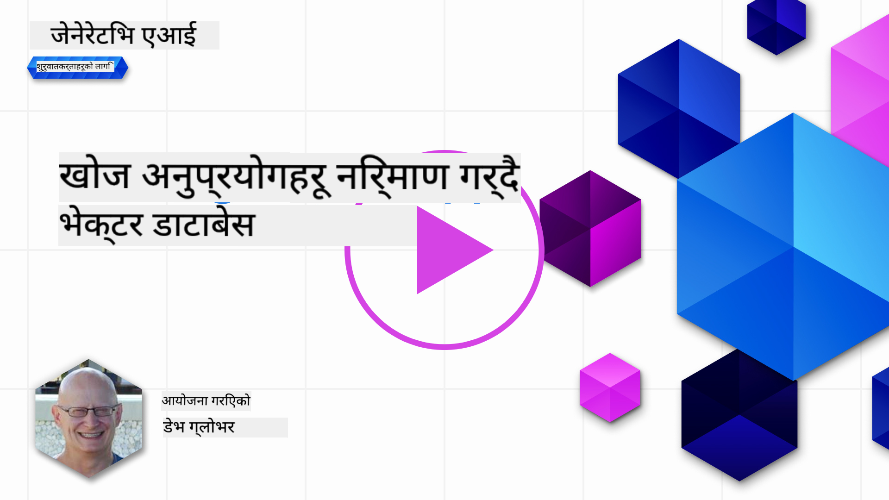
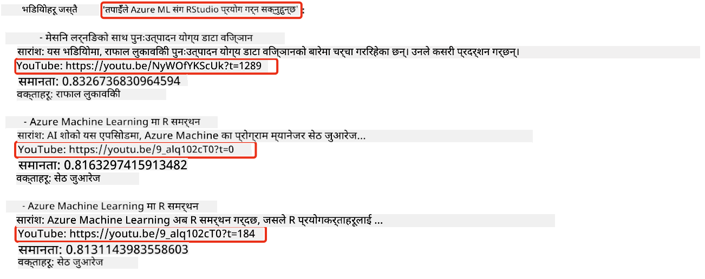
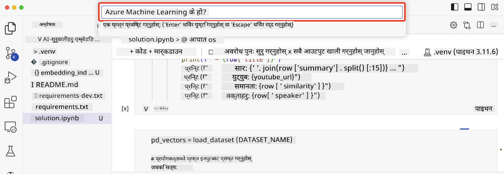

<!--
CO_OP_TRANSLATOR_METADATA:
{
  "original_hash": "d46aad0917a1a342d613e2c13d457da5",
  "translation_date": "2025-06-25T16:22:59+00:00",
  "source_file": "08-building-search-applications/README.md",
  "language_code": "ne"
}
-->
# खोज अनुप्रयोग निर्माण

[](https://aka.ms/gen-ai-lesson8-gh?WT.mc_id=academic-105485-koreyst)

> > _यस पाठको भिडियो हेर्न माथिको चित्रमा क्लिक गर्नुहोस्_

एलएलएमहरूमा च्याटबोटहरू र पाठ उत्पादन भन्दा धेरै कुरा छन्। एम्बेडिङहरू प्रयोग गरेर खोज अनुप्रयोगहरू निर्माण गर्न पनि सम्भव छ। एम्बेडिङहरू डाटाका सङ्ख्यात्मक प्रतिनिधित्वहरू हुन् जसलाई भेक्टरहरू पनि भनिन्छ, र डाटाको लागि अर्थपूर्ण खोज गर्न प्रयोग गर्न सकिन्छ।

यस पाठमा, तपाईं हाम्रो शिक्षा स्टार्टअपको लागि खोज अनुप्रयोग निर्माण गर्दै हुनुहुन्छ। हाम्रो स्टार्टअप एक गैर-नाफामूलक संस्था हो जसले विकासशील देशका विद्यार्थीहरूलाई निःशुल्क शिक्षा प्रदान गर्दछ। हाम्रो स्टार्टअपसँग ठूलो संख्यामा युट्युब भिडियोहरू छन् जसको प्रयोग गरेर विद्यार्थीहरूले एआईको बारेमा सिक्न सक्छन्। हाम्रो स्टार्टअपले यस्तो खोज अनुप्रयोग निर्माण गर्न चाहन्छ जसले विद्यार्थीहरूलाई प्रश्न टाइप गरेर युट्युब भिडियो खोज्न अनुमति दिन्छ।

उदाहरणका लागि, कुनै विद्यार्थीले 'जुपिटर नोटबुक के हो?' वा 'एजुर एमएल के हो?' टाइप गर्न सक्छ र खोज अनुप्रयोगले प्रश्नसँग सम्बन्धित युट्युब भिडियोहरूको सूची फिर्ता गर्नेछ, र अझ राम्रो कुरा, खोज अनुप्रयोगले प्रश्नको उत्तर भएको स्थानको लिङ्क पनि फिर्ता गर्नेछ।

## परिचय

यस पाठमा हामीले समेट्नेछौं:

- अर्थपूर्ण बनाम कुञ्जीशब्द खोज।
- पाठ एम्बेडिङ के हुन्।
- पाठ एम्बेडिङ सूचकांक सिर्जना गर्दै।
- पाठ एम्बेडिङ सूचकांक खोज्दै।

## सिकाइ लक्ष्यहरू

यस पाठ पूरा गरेपछि, तपाईं सक्षम हुनुहुनेछ:

- अर्थपूर्ण र कुञ्जीशब्द खोज बीचको भिन्नता बताउनुहोस्।
- पाठ एम्बेडिङ के हुन् भनेर व्याख्या गर्नुहोस्।
- एम्बेडिङ प्रयोग गरेर डाटा खोज्नको लागि अनुप्रयोग सिर्जना गर्नुहोस्।

## किन खोज अनुप्रयोग निर्माण गर्ने?

खोज अनुप्रयोग निर्माण गर्दा तपाईंलाई डाटा खोज्न एम्बेडिङहरू कसरी प्रयोग गर्ने भन्ने बुझ्न मद्दत गर्नेछ। तपाईंले विद्यार्थीहरूले छिटो जानकारी फेला पार्न प्रयोग गर्न सक्ने खोज अनुप्रयोग कसरी निर्माण गर्ने भनेर पनि सिक्नुहुनेछ।

यस पाठमा माइक्रोसफ्ट [एआई शो](https://www.youtube.com/playlist?list=PLlrxD0HtieHi0mwteKBOfEeOYf0LJU4O1) युट्युब च्यानलका युट्युब प्रतिलिपिहरूको एम्बेडिङ सूचकांक समावेश छ। एआई शो एक युट्युब च्यानल हो जसले तपाईंलाई एआई र मेसिन लर्निङको बारेमा सिकाउँछ। एम्बेडिङ सूचकांकमा अक्टोबर २०२३ सम्मका प्रत्येक युट्युब प्रतिलिपिहरूको लागि एम्बेडिङहरू समावेश छन्। तपाईंले हाम्रो स्टार्टअपको लागि खोज अनुप्रयोग निर्माण गर्न एम्बेडिङ सूचकांक प्रयोग गर्नुहुनेछ। खोज अनुप्रयोगले प्रश्नको उत्तर भएको स्थानको लिङ्क फिर्ता गर्नेछ। यो विद्यार्थीहरूले आवश्यक जानकारी छिटो फेला पार्नको लागि उत्कृष्ट तरिका हो।

'तपाईंले आरस्टुडियोलाई एजुर एमएलसँग प्रयोग गर्न सक्नुहुन्छ?' प्रश्नको लागि अर्थपूर्ण सोधपुछको उदाहरण तल दिइएको छ। युट्युब यूआरएल जाँच गर्नुहोस्, तपाईंले देख्नुहुनेछ कि यूआरएलमा एक टाइमस्ट्याम्प छ जसले तपाईंलाई प्रश्नको उत्तर भएको स्थानमा लैजान्छ।



## अर्थपूर्ण खोज के हो?

अब तपाईं सोच्दै हुनुहुन्छ होला, अर्थपूर्ण खोज के हो? अर्थपूर्ण खोज एक खोज प्रविधि हो जसले प्रश्नको शब्दहरूको अर्थ प्रयोग गरेर सम्बन्धित परिणामहरू फिर्ता गर्छ।

यहाँ अर्थपूर्ण खोजको उदाहरण छ। मानौं तपाईं कार किन्न खोज्दै हुनुहुन्थ्यो, तपाईंले 'मेरो सपना कार' खोज्न सक्नुहुन्छ, अर्थपूर्ण खोजले बुझ्छ कि तपाईं कारको बारेमा`dreaming` हुनुहुन्न, बरु तपाईं आफ्नो `ideal` कार किन्न खोज्दै हुनुहुन्छ। अर्थपूर्ण खोजले तपाईंको उद्देश्य बुझ्छ र सम्बन्धित परिणामहरू फिर्ता गर्छ। विकल्प भनेको`keyword search` हो जसले अक्सर कारहरूको सपनाहरूको खोजी गर्छ र प्रायः अप्रासंगिक परिणामहरू फिर्ता गर्छ।

## पाठ एम्बेडिङ के हुन्?

[पाठ एम्बेडिङहरू](https://en.wikipedia.org/wiki/Word_embedding?WT.mc_id=academic-105485-koreyst) एक पाठ प्रतिनिधित्व प्रविधि हो जुन [प्राकृतिक भाषा प्रशोधन](https://en.wikipedia.org/wiki/Natural_language_processing?WT.mc_id=academic-105485-koreyst) मा प्रयोग गरिन्छ। पाठ एम्बेडिङहरू पाठको अर्थपूर्ण सङ्ख्यात्मक प्रतिनिधित्वहरू हुन्। एम्बेडिङहरूलाई मेशिनले सजिलै बुझ्न सक्ने तरिकामा डाटालाई प्रतिनिधित्व गर्न प्रयोग गरिन्छ। पाठ एम्बेडिङ निर्माण गर्न धेरै मोडेलहरू छन्, यस पाठमा, हामी OpenAI एम्बेडिङ मोडेल प्रयोग गरेर एम्बेडिङहरू उत्पन्न गर्न ध्यान केन्द्रित गर्नेछौं।

यहाँ एक उदाहरण छ, कल्पना गर्नुहोस् कि निम्न पाठ AI शो युट्युब च्यानलको एक एपिसोडको प्रतिलिपिमा छ:

```text
Today we are going to learn about Azure Machine Learning.
```

हामीले पाठलाई OpenAI एम्बेडिङ API मा पास गर्नेछौं र यसले 1536 सङ्ख्याहरू अर्थात् एक भेक्टर समावेश गर्ने एम्बेडिङ फिर्ता गर्नेछ। भेक्टरको प्रत्येक सङ्ख्याले पाठको फरक पक्षलाई प्रतिनिधित्व गर्छ। संक्षेपमा, यहाँ भेक्टरका पहिलो 10 सङ्ख्याहरू छन्।

```python
[-0.006655829958617687, 0.0026128944009542465, 0.008792596869170666, -0.02446001023054123, -0.008540431968867779, 0.022071078419685364, -0.010703742504119873, 0.003311325330287218, -0.011632772162556648, -0.02187200076878071, ...]
```

## एम्बेडिङ सूचकांक कसरी सिर्जना गरिन्छ?

यस पाठको लागि एम्बेडिङ सूचकांक पायथन स्क्रिप्टहरूको श्रृङ्खलाबाट सिर्जना गरिएको थियो। तपाईंले स्क्रिप्टहरू र निर्देशनहरू [README](./scripts/README.md?WT.mc_id=academic-105485-koreyst) मा यस पाठको 'स्क्रिप्टहरू' फोल्डरमा फेला पार्नुहुनेछ। यी स्क्रिप्टहरू चलाउनु आवश्यक छैन किनकि तपाईंको लागि एम्बेडिङ सूचकांक प्रदान गरिएको छ।

स्क्रिप्टहरूले निम्न कार्यहरू गर्छन्:

1. [AI शो](https://www.youtube.com/playlist?list=PLlrxD0HtieHi0mwteKBOfEeOYf0LJU4O1) प्लेलिस्टको प्रत्येक युट्युब भिडियोको प्रतिलिपि डाउनलोड गरिन्छ।
2. [OpenAI Functions](https://learn.microsoft.com/azure/ai-services/openai/how-to/function-calling?WT.mc_id=academic-105485-koreyst) प्रयोग गरेर, युट्युब प्रतिलिपिको पहिलो 3 मिनेटबाट वक्ताको नाम निकाल्ने प्रयास गरिन्छ। प्रत्येक भिडियोको लागि वक्ताको नाम एम्बेडिङ सूचकांकमा `embedding_index_3m.json` नामकमा सङ्ग्रहित गरिन्छ।
3. त्यसपछि प्रतिलिपि पाठलाई **3 मिनेटको पाठ खण्डहरूमा** विभाजित गरिन्छ। खण्डमा लगभग 20 शब्दहरू अर्को खण्डबाट ओभरलयपिङ गरिन्छ ताकि खण्डको एम्बेडिङ काटिएको छैन र राम्रो खोज सन्दर्भ प्रदान गर्न।
4. प्रत्येक पाठ खण्डलाई OpenAI च्याट API मा पास गरेर पाठलाई 60 शब्दमा सङ्क्षेप गर्न प्रयोग गरिन्छ। सङ्क्षेप पनि एम्बेडिङ सूचकांकमा `embedding_index_3m.json` नामकमा सङ्ग्रहित गरिन्छ।
5. अन्तमा, खण्ड पाठलाई OpenAI एम्बेडिङ API मा पास गरिन्छ। एम्बेडिङ API ले खण्डको अर्थपूर्ण अर्थलाई प्रतिनिधित्व गर्ने 1536 सङ्ख्याहरूको भेक्टर फिर्ता गर्छ। खण्ड र OpenAI एम्बेडिङ भेक्टरलाई एम्बेडिङ सूचकांकमा `embedding_index_3m.json` नामकमा सङ्ग्रहित गरिन्छ।

### भेक्टर डाटाबेसहरू

पाठको सरलताका लागि, एम्बेडिङ सूचकांकलाई `embedding_index_3m.json` नामक JSON फाइलमा सङ्ग्रहित गरिन्छ र पाण्डास डाटा फ्रेममा लोड गरिन्छ। यद्यपि उत्पादनमा, एम्बेडिङ सूचकांकलाई [Azure Cognitive Search](https://learn.microsoft.com/training/modules/improve-search-results-vector-search?WT.mc_id=academic-105485-koreyst), [Redis](https://cookbook.openai.com/examples/vector_databases/redis/readme?WT.mc_id=academic-105485-koreyst), [Pinecone](https://cookbook.openai.com/examples/vector_databases/pinecone/readme?WT.mc_id=academic-105485-koreyst), [Weaviate](https://cookbook.openai.com/examples/vector_databases/weaviate/readme?WT.mc_id=academic-105485-koreyst) जस्ता भेक्टर डाटाबेसहरूमा सङ्ग्रहित गरिनेछ।

## कोसाइन समानता बुझ्दै

हामीले पाठ एम्बेडिङहरूको बारेमा सिक्यौं, अबको कदम भनेको पाठ एम्बेडिङहरू प्रयोग गरेर डाटा खोज्न र विशेष गरी कोसाइन समानता प्रयोग गरेर दिइएको सोधपुछको लागि सबैभन्दा समान एम्बेडिङहरू कसरी फेला पार्ने भन्ने कुरा सिक्नु हो।

### कोसाइन समानता के हो?

कोसाइन समानता दुई भेक्टरहरू बीचको समानताको मापन हो, यसलाई तपाईंले`nearest neighbor search` भनेर पनि सुन्नुहुनेछ। कोसाइन समानता खोज गर्न तपाईंले OpenAI एम्बेडिङ API प्रयोग गरेर _सोधपुछ_ पाठको लागि _भेक्टराइज_ गर्न आवश्यक छ। त्यसपछि सोधपुछ भेक्टर र एम्बेडिङ सूचकांकमा प्रत्येक भेक्टर बीचको _कोसाइन समानता_ गणना गर्नुहोस्। याद गर्नुहोस्, एम्बेडिङ सूचकांकमा प्रत्येक युट्युब प्रतिलिपि पाठ खण्डको लागि एक भेक्टर छ। अन्तमा, कोसाइन समानता द्वारा परिणामहरू क्रमबद्ध गर्नुहोस् र उच्चतम कोसाइन समानता भएका पाठ खण्डहरू सोधपुछसँग सबैभन्दा समान छन्।

गणितीय दृष्टिकोणबाट, कोसाइन समानता बहुआयामिक स्थानमा प्रक्षिप्त दुई भेक्टरहरूको बीचको कोणको कोसाइन मापन गर्दछ। यो मापन लाभदायक छ, किनकि यदि दुई कागजातहरू आकारको कारण युक्लिडियन दूरीले टाढा छन् भने, तिनीहरू बीचको कोण सानो हुन सक्छ र त्यसैले उच्च कोसाइन समानता हुन सक्छ। कोसाइन समानता समीकरणहरूको बारेमा थप जानकारीको लागि, [कोसाइन समानता](https://en.wikipedia.org/wiki/Cosine_similarity?WT.mc_id=academic-105485-koreyst) हेर्नुहोस्।

## आफ्नो पहिलो खोज अनुप्रयोग निर्माण गर्दै

अर्को, हामी एम्बेडिङहरू प्रयोग गरेर खोज अनुप्रयोग कसरी निर्माण गर्ने भनेर सिक्दैछौं। खोज अनुप्रयोगले विद्यार्थीहरूलाई प्रश्न टाइप गरेर भिडियो खोज्न अनुमति दिनेछ। खोज अनुप्रयोगले प्रश्नसँग सम्बन्धित भिडियोहरूको सूची फिर्ता गर्नेछ। खोज अनुप्रयोगले प्रश्नको उत्तर भएको स्थानको लिङ्क पनि फिर्ता गर्नेछ।

यो समाधान विन्डोज 11, म्याकओएस, र उबुन्टु 22.04 मा पायथन 3.10 वा पछि प्रयोग गरेर निर्माण र परीक्षण गरिएको थियो। तपाईं पायथनलाई [python.org](https://www.python.org/downloads/?WT.mc_id=academic-105485-koreyst) बाट डाउनलोड गर्न सक्नुहुन्छ।

## असाइनमेन्ट - खोज अनुप्रयोग निर्माण गर्दै, विद्यार्थीहरूलाई सक्षम बनाउन

हामीले यस पाठको सुरुवातमा हाम्रो स्टार्टअपलाई परिचय गरायौं। अब यो विद्यार्थीहरूलाई उनीहरूको मूल्याङ्कनहरूको लागि खोज अनुप्रयोग निर्माण गर्न सक्षम बनाउने समय हो।

यस असाइनमेन्टमा, तपाईंले खोज अनुप्रयोग निर्माण गर्न प्रयोग गरिने Azure OpenAI सेवाहरू सिर्जना गर्नुहुनेछ। तपाईंले निम्न Azure OpenAI सेवाहरू सिर्जना गर्नुहुनेछ। यो असाइनमेन्ट पूरा गर्न तपाईंलाई Azure सदस्यता आवश्यक हुनेछ।

### Azure Cloud Shell सुरु गर्नुहोस्

1. [Azure पोर्टल](https://portal.azure.com/?WT.mc_id=academic-105485-koreyst) मा साइन इन गर्नुहोस्।
2. Azure पोर्टलको माथिल्लो-दायाँ कुनामा रहेको क्लाउड शेल आइकन चयन गर्नुहोस्।
3. वातावरण प्रकारको लागि **Bash** चयन गर्नुहोस्।

#### संसाधन समूह सिर्जना गर्नुहोस्

> यी निर्देशनहरूको लागि, हामी पूर्वी US मा "semantic-video-search" नामक संसाधन समूह प्रयोग गर्दैछौं।
> तपाईंले संसाधन समूहको नाम परिवर्तन गर्न सक्नुहुन्छ, तर स्थान परिवर्तन गर्दा,
> [मोडेल उपलब्धता तालिका](https://aka.ms/oai/models?WT.mc_id=academic-105485-koreyst) जाँच गर्नुहोस्।

```shell
az group create --name semantic-video-search --location eastus
```

#### Azure OpenAI सेवा संसाधन सिर्जना गर्नुहोस्

Azure Cloud Shell बाट, Azure OpenAI सेवा संसाधन सिर्जना गर्न निम्न आदेश चलाउनुहोस्।

```shell
az cognitiveservices account create --name semantic-video-openai --resource-group semantic-video-search \
    --location eastus --kind OpenAI --sku s0
```

#### यस अनुप्रयोगमा प्रयोगको लागि अन्तबिन्दु र कुञ्जीहरू प्राप्त गर्नुहोस्

Azure Cloud Shell बाट, Azure OpenAI सेवा संसाधनको लागि अन्तबिन्दु र कुञ्जीहरू प्राप्त गर्न निम्न आदेशहरू चलाउनुहोस्।

```shell
az cognitiveservices account show --name semantic-video-openai \
   --resource-group  semantic-video-search | jq -r .properties.endpoint
az cognitiveservices account keys list --name semantic-video-openai \
   --resource-group semantic-video-search | jq -r .key1
```

#### OpenAI एम्बेडिङ मोडेल तैनात गर्नुहोस्

Azure Cloud Shell बाट, OpenAI एम्बेडिङ मोडेल तैनात गर्न निम्न आदेश चलाउनुहोस्।

```shell
az cognitiveservices account deployment create \
    --name semantic-video-openai \
    --resource-group  semantic-video-search \
    --deployment-name text-embedding-ada-002 \
    --model-name text-embedding-ada-002 \
    --model-version "2"  \
    --model-format OpenAI \
    --sku-capacity 100 --sku-name "Standard"
```

## समाधान

GitHub Codespaces मा [solution notebook](../../../08-building-search-applications/python/aoai-solution.ipynb) खोल्नुहोस् र Jupyter Notebook मा निर्देशनहरू पालना गर्नुहोस्।

जब तपाईंले नोटबुक चलाउनुहुन्छ, तपाईंलाई सोधपुछ प्रविष्ट गर्न संकेत गरिनेछ। इनपुट बक्स यसरी देखिनेछ:



## राम्रो काम! आफ्नो सिकाइ जारी राख्नुहोस्

यो पाठ पूरा गरेपछि, हाम्रो [जनरेटिभ एआई सिकाइ संग्रह](https://aka.ms/genai-collection?WT.mc_id=academic-105485-koreyst) हेर्नुहोस् र आफ्नो जनरेटिभ एआई ज्ञान स्तरवृद्धि गर्नुहोस्!

पाठ 9 मा जानुहोस् जहाँ हामी [छवि उत्पादन अनुप्रयोगहरू निर्माण गर्ने](../09-building-image-applications/README.md?WT.mc_id=academic-105485-koreyst) बारेमा हेर्नेछौं!

**अस्वीकरण**:  
यो दस्तावेज AI अनुवाद सेवा [Co-op Translator](https://github.com/Azure/co-op-translator) प्रयोग गरेर अनुवाद गरिएको छ। हामी शुद्धताका लागि प्रयास गर्छौं, तर कृपया ध्यान दिनुहोस् कि स्वचालित अनुवादमा त्रुटिहरू वा अशुद्धताहरू हुन सक्छन्। यसको मातृभाषामा रहेको मूल दस्तावेजलाई प्राधिकृत स्रोत मानिनुपर्छ। महत्वपूर्ण जानकारीको लागि, व्यावसायिक मानव अनुवाद सिफारिस गरिन्छ। यस अनुवादको प्रयोगबाट उत्पन्न कुनै पनि गलतफहमी वा गलत व्याख्याका लागि हामी जिम्मेवार हुनेछैनौं।