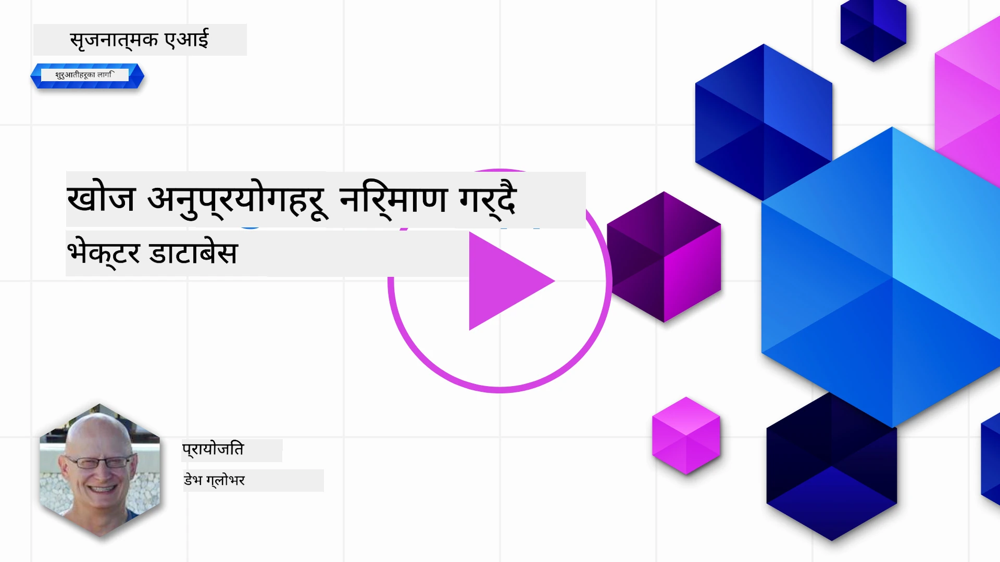
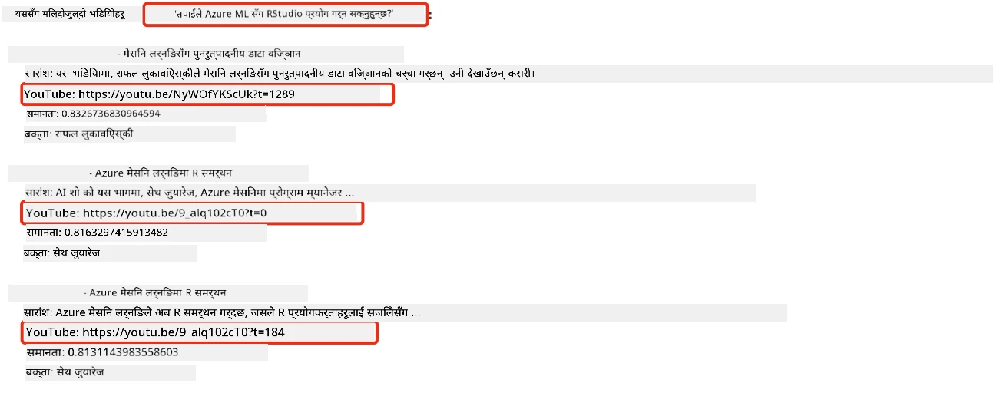
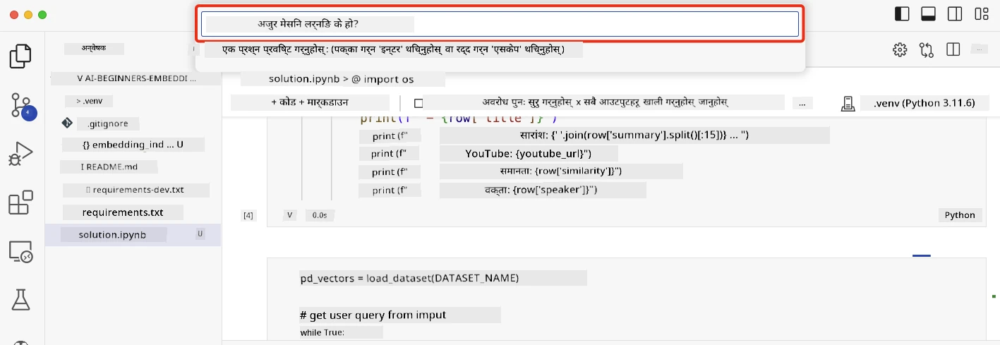

# खोज अनुप्रयोगहरू बनाउँदै

[](https://youtu.be/W0-nzXjOjr0?si=GcsqiTTvd7RKbo7V)

> > _यस पाठको भिडियो हेर्न माथिको छवि क्लिक गर्नुहोस्_

LLM प्रत्येक कुरालाई मात्र च्याटबोर्ट र पाठ सृजनामा सिमित छैन। Embeddings प्रयोग गरेर खोज अनुप्रयोगहरू पनि निर्माण गर्न सकिन्छ। Embeddings यस्तो सङ्ख्यात्मक प्रतिनिधित्व हुन् जुन डाटा भेक्टरका रूपमा चिनिन्छ, र डाटाको सेमान्टिक खोजमा प्रयोग गर्न सकिन्छ।

यस पाठमा, हामी हाम्रो शिक्षासम्बन्धी स्टार्टअपका लागि खोज अनुप्रयोग बनाउन लागिरहेका छौं। हाम्रो स्टार्टअप एक गैर नाफामुलक संस्था हो जसले विकासशील देशका विद्यार्थीहरूलाई निःशुल्क शिक्षा प्रदान गर्दछ। हाम्रो स्टार्टअपसँग धेरै यूट्यूब भिडियोहरू छन् जुन विद्यार्थीहरू AI सिक्न प्रयोग गर्न सक्छन्। हाम्रो स्टार्टअप यस्तो खोज अनुप्रयोग बनाउने चाहन्छ जसले विद्यार्थीहरूलाई प्रश्न टाइप गरेर यूट्यूब भिडियो खोज्न अनुमति दिनेछ।

उदाहरणका लागि, विद्यार्थीले 'जुपिटर नोटबुक भनेको के हो?' वा 'एजुअर ML के हो?' भनेर टाइप गर्न सक्छन् र खोज अनुप्रयोगले प्रश्नसँग सम्बन्धित यूट्यूब भिडियाहरूको सूची फर्काउनेछ, र अझ राम्रो कुरा, खोज अनुप्रयोगले प्रश्नको उत्तर रहेको भिडियोको ठेगाना लिंक पनि फर्काउनेछ।

## परिचय

यस पाठमा हामी:

- सेमान्टिक र कीवर्ड खोज फरक के हो।
- पाठ Embeddings के हुन्।
- पाठ Embeddings अनुक्रमणिका कसरी बनाउने।
- पाठ Embeddings अनुक्रमणिका कसरी खोज्ने।

## सिकाइका लक्ष्यहरू

यस पाठ पूरा गरेपछि तपाईं सक्षम हुनुहुनेछ:

- सेमान्टिक र कीवर्ड खोजबीचको फरक बताउन।
- पाठ Embeddings के हुन् स्पष्ट गर्न।
- Embeddings प्रयोग गरेर डाटा खोज्न अनुप्रयोग बनाउन।

## किन खोज अनुप्रयोग बनाउने?

खोज अनुप्रयोग बनाउँदा तपाईंलाई Embeddings प्रयोग गरेर डाटा खोज्ने बुझेको हुनेछ। साथै, विद्यार्थीहरूलाई छिटो जानकारी फेला पार्न प्रयोग गर्न मिल्ने खोज अनुप्रयोग बनाउन सिक्नुहुनेछ।

यस पाठमा Microsoft [AI Show](https://www.youtube.com/playlist?list=PLlrxD0HtieHi0mwteKBOfEeOYf0LJU4O1) यूट्यूब च्यानलका ट्रान्सक्रिप्टहरूको Embedding अनुक्रमणिका समावेश गरिएको छ। AI Show यूट्यूब च्यानल AI र मेशिन लर्निंग सिकाउँछ। Embedding अनुक्रमणिका प्रत्येक यूट्यूब ट्रान्सक्रिप्टका Embeddings समावेश गर्दछ - अक्टोबर 2023 सम्म। तपाईं Embedding अनुक्रमणिका प्रयोग गरेर हाम्रो स्टार्टअपका लागि खोज अनुप्रयोग बनाउनेछ। खोज अनुप्रयोगले प्रश्नको उत्तर रहेको भिडियोको ठेगाना लिंक फर्काउँछ। यो विधि विद्यार्थीहरूले चाँडै आवश्यक जानकारी पत्ता लगाउन उत्तम तरिका हो।

तल 'तपाईं RStudio Azure ML सँग प्रयोग गर्न सक्नुहुन्छ?' प्रश्नको सेमान्टिक सोधाइको उदाहरण छ। यूट्यूब URL मा टाइमस्ट्याम्प भेटिन्छ जसले प्रश्नको उत्तर भएको भिडियोको स्थानमा लिन्छ।



## सेमान्टिक खोज के हो?

अहिले तपाईं सोचिरहनुभएको होला, सेमान्टिक खोज के हो? सेमान्टिक खोज सोधको शब्दहरूको अर्थ वा सेमेन्टिक्स प्रयोग गरी सान्दर्भिक नतिजा फर्काउने खोज प्रविधि हो।

यहाँ सेमान्टिक खोजको उदाहरण छ। मानौँ तपाईं कार किन्ने प्रयास गर्दै हुनुहुन्छ, तपाईं 'मेरो सपनाको कार' खोज्न सक्नुहुन्छ। सेमान्टिक खोज बुझ्छ तपाईं सपनामा कार हेर्दै हुनुहुन्न, तपाईं आफ्नो 'आदर्श' कार खोज्दै हुनुहुन्छ। सेमान्टिक खोज तपाईंको उदेश्य बुझ्छ र सान्दर्भिक नतिजा दिन्छ। विकल्प हो 'कीवर्ड खोज' जुन शब्दशः सपनाको कार खोज्ने र प्रायः अप्रासङ्गिक नतिजा ल्याउने हुन्छ।

## पाठ Embeddings के हुन्?

[पाठ embeddings](https://en.wikipedia.org/wiki/Word_embedding?WT.mc_id=academic-105485-koreyst) [प्राकृतिक भाषा प्रशोधन](https://en.wikipedia.org/wiki/Natural_language_processing?WT.mc_id=academic-105485-koreyst) मा प्रयोग हुने पाठ प्रतिनिधित्व प्रविधि हुन्। पाठ embeddings पाठका सेमान्टिक सङ्ख्यात्मक प्रतिनिधित्व हुन्। Embeddings डाटा प्रस्तुत गर्न यसरी प्रयोग गरिन्छ कि मेसिनले सजिलै बुझ्न सकोस्। पाठ embeddings बनाउन धेरै मोडलहरू छन्, यस पाठमा हामी OpenAI Embedding Model प्रयोग गरेर embeddings बनाउनेमा केन्द्रित हुनेछौं।

यहाँ एउटा उदाहरण छ, तलको पाठ AI Show यूट्यूब च्यानलको एउटा एपिसोडको ट्रान्सक्रिप्टमा छ जस्तो सोच्नुहोस्:

```text
Today we are going to learn about Azure Machine Learning.
```

हामी यो पाठ OpenAI Embedding API मा पठाउनेछौं र यसले 1536 सङ्ख्याहरू अर्थात् भेक्टर कुनिक रुपमा निम्न embedding फर्काउनेछ। भेक्टरमा प्रत्येक सङ्ख्या पाठका फरक पक्षलाई प्रतिनिधित्व गर्छ। छोटकरीमा, यहाँ पहिलो १० सङ्ख्या छन्।

```python
[-0.006655829958617687, 0.0026128944009542465, 0.008792596869170666, -0.02446001023054123, -0.008540431968867779, 0.022071078419685364, -0.010703742504119873, 0.003311325330287218, -0.011632772162556648, -0.02187200076878071, ...]
```

## Embedding अनुक्रमणिका कसरी बनाइन्छ?

यस पाठको Embedding अनुक्रमणिका पाइथन स्क्रिप्टहरूको शृङ्खलाले बनाइएको छ। तपाईं ती स्क्रिप्टहरू र निर्देशनहरू [README](./scripts/README.md?WT.mc_id=academic-105485-koreyst) फोल्डरमा पाउनुहुनेछ। तपाईंलाई यी स्क्रिप्टहरू चलाउन आवश्यक छैन किनकि Embedding अनुक्रमणिका तयार दिइएको छ।

स्क्रिप्टहरूले निम्न कामहरू गर्दछन्:

१. [AI Show](https://www.youtube.com/playlist?list=PLlrxD0HtieHi0mwteKBOfEeOYf0LJU4O1) प्लेलिस्टका प्रत्येक यूट्यूब भिडियोको ट्रान्सक्रिप्ट डाउनलोड गरिन्छ।
२. [OpenAI Functions](https://learn.microsoft.com/azure/ai-foundry/openai/how-to/function-calling?WT.mc_id=academic-105485-koreyst) प्रयोग गरी ट्रान्सक्रिप्टका पहिलो ३ मिनेटबाट वक्ताको नाम निकाल्न प्रयास गरिन्छ। प्रत्येक भिडियोको वक्ता नाम Embedding अनुक्रमणिका `embedding_index_3m.json` मा राखिन्छ।
३. ट्रान्सक्रिप्टलाई **३ मिनेट पाठ सेग्मेन्ट** मा विभाजन गरिन्छ। प्रत्येक सेग्मेन्टमा लगभग २० शब्द अर्को सेग्मेन्टसँग ओभरल्याप गरिन्छ ताकि Embedding कट नहोस् र खोज सन्दर्भ राम्रो होस्।
४. हरेक पाठ सेग्मेन्टलाई OpenAI Chat API मार्फत ६० शब्द संक्षेपमा परिणत गरिन्छ। संक्षेप पनि Embedding अनुक्रमणिका `embedding_index_3m.json` मा राखिन्छ।
५. अन्त्यमा, सेग्मेन्ट पाठ OpenAI Embedding API मा पठाइन्छ। Embedding API ले 1536 सङ्ख्यात्मक भेक्टर फर्काउँछ जुन सेग्मेन्टको सेमान्टिक अर्थ प्रतिनिधित्व गर्छ। सेग्मेन्ट र OpenAI Embedding भेक्टर Embedding अनुक्रमणिका `embedding_index_3m.json` मा राखिन्छ।

### भेक्टर डाटाबेसहरू

पाठ सरल बनाउन Embedding अनुक्रमणिका JSON फाइल `embedding_index_3m.json` मा राखिएको छ र Pandas DataFrame मा लोड गरिएको छ। यद्यपि उत्पादनमा Embedding अनुक्रमणिका [Azure Cognitive Search](https://learn.microsoft.com/training/modules/improve-search-results-vector-search?WT.mc_id=academic-105485-koreyst), [Redis](https://cookbook.openai.com/examples/vector_databases/redis/readme?WT.mc_id=academic-105485-koreyst), [Pinecone](https://cookbook.openai.com/examples/vector_databases/pinecone/readme?WT.mc_id=academic-105485-koreyst), [Weaviate](https://cookbook.openai.com/examples/vector_databases/weaviate/readme?WT.mc_id=academic-105485-koreyst) जस्ता भेक्टर डेटाबेसहरूमा राखिन्छ।

## कोसाइन समानता बुझ्ने

हामीले पाठ embeddings सिक्यौं, अब हामीले सोधिएको पाठसँग सबैभन्दा मिल्ने embeddings फेला पार्न कोसाइन समानता प्रयोग गर्ने सिक्ने छौं।

### कोसाइन समानता के हो?

कोसाइन समानता दुई भेक्टरबीचको समानताको मापन हो, यसलाई `नजिकको छिमेकी खोज` पनि भनिन्छ। कोसाइन समानता खोज गर्न तपाईंले OpenAI Embedding API प्रयोग गरी सोध (query) पाठलाई भेक्टरमा परिणत गर्नुपर्छ। त्यसपछि सोध भेक्टर र Embedding अनुक्रमणिकाका प्रत्येक भेक्टरबीच कोसाइन समानता गणना गर्नुहोस्। Embedding अनुक्रमणिका प्रत्येक यूट्यूब ट्रान्सक्रिप्ट पाठ सेग्मेन्टको लागि भेक्टर समेट्छ। अन्तिममा, नतिजाहरूलाई कोसाइन समानता अनुसार क्रमबद्ध गर्नुहोस् र सबैभन्दा उच्च कोसाइन समानता भएका पाठ खण्डहरू सोधसँग सबैभन्दा मिल्दोजुल्दो हुन्छन्।

गणितीय दृष्टिले, कोसाइन समानता दुई भेक्टरबीचको कोणको कोसाइन मापन हो जुन बहुआयामी ठाउँमा प्रक्षेपित छ। यो मापन उपयोगी छ किनभने दुई कागजातहरू Euclidean दूरीले टाढा भए पनि आकारका कारण, तिनीहरू बीच सानो कोण हुन सक्छ र त्यसैले उच्च कोसाइन समानता हुन सक्छ। थप जानकारीको लागि [Cosine similarity](https://en.wikipedia.org/wiki/Cosine_similarity?WT.mc_id=academic-105485-koreyst) हेर्नुहोस्।

## पहिलो खोज अनुप्रयोग बनाउँदै

अब हामी तपाईलाई Embeddings प्रयोग गरेर खोज अनुप्रयोग बनाउन सिकाउने छौं। यस अनुप्रयोगले विद्यार्थीहरूलाई प्रश्न टाइप गरेर भिडियो खोज्न दिनेछ। अनुप्रयोगले प्रश्नसँग सान्दर्भिक भिडियोहरूको सूची र सवालको उत्तर भएको भिडियो स्थानको लिंक दिनेछ।

यो समाधान Windows 11, macOS, र Ubuntu 22.04 मा Python 3.10 वा पछिको संस्करण प्रयोग गरेर निर्माण र परीक्षण गरिएको हो। तपाईं [python.org](https://www.python.org/downloads/?WT.mc_id=academic-105485-koreyst) बाट Python डाउनलोड गर्न सक्नुहुन्छ।

## असाइनमेन्ट - विद्यार्थीहरूलाई सक्षम पार्न खोज अनुप्रयोग बनाउने

हामीले यस पाठको सुरुमा हाम्रो स्टार्टअप परिचय गर्यौं। अब समय आएको छ विद्यार्थीहरूलाई आफ्ना मूल्याङ्कनका लागि खोज अनुप्रयोग बनाउन सक्षम बनाउने।

यस असाइनमेन्टमा तपाईं Azure OpenAI सेवाहरू सिर्जना गर्नु हुनेछ जुन खोज अनुप्रयोग बनाउन प्रयोग हुनेछन्। यी Azure OpenAI सेवाहरू सिर्जना गर्नुहोस्। यस असाइनमेन्ट पूरा गर्न Azure सदस्यता आवश्यक हुनेछ।

### Azure क्लाउड शेल सुरु गर्नुहोस्

१. [Azure पोर्टल](https://portal.azure.com/?WT.mc_id=academic-105485-koreyst) मा साइन इन गर्नुहोस्।
२. Azure पोर्टलको माथि-दाँया भागमा रहेको क्लाउड शेल आइकन चयन गर्नुहोस्।
३. वातावरण प्रकारको लागि **Bash** छान्नुहोस्।

#### स्रोत समूह सिर्जना गर्नुहोस्

> यी निर्देशनहरूमा, हामी "semantic-video-search" नामको स्रोत समूह East US मा प्रयोग गर्दैछौं।
> तपाईं स्रोत समूहको नाम परिवर्तन गर्न सक्नुहुन्छ, तर स्रोतहरूका स्थान परिवर्तन गर्दा,
> [मोडेल उपलब्धता तालिका](https://aka.ms/oai/models?WT.mc_id=academic-105485-koreyst) हेर्नुहोस्।

```shell
az group create --name semantic-video-search --location eastus
```

#### Azure OpenAI सेवा स्रोत सिर्जना गर्नुहोस्

Azure क्लाउड शेलबाट निम्न कमाण्ड चलाएर Azure OpenAI सेवा स्रोत सिर्जना गर्नुहोस्।

```shell
az cognitiveservices account create --name semantic-video-openai --resource-group semantic-video-search \
    --location eastus --kind OpenAI --sku s0
```

#### यस अनुप्रयोगमा प्रयोग गर्न Endpoint र key प्राप्त गर्नुहोस्

Azure क्लाउड शेलबाट निम्न कमाण्डहरू चलाएर Azure OpenAI सेवा स्रोतको endpoint र key प्राप्त गर्नुहोस्।

```shell
az cognitiveservices account show --name semantic-video-openai \
   --resource-group  semantic-video-search | jq -r .properties.endpoint
az cognitiveservices account keys list --name semantic-video-openai \
   --resource-group semantic-video-search | jq -r .key1
```

#### OpenAI Embedding मोडल परिनियोजन गर्नुहोस्

Azure क्लाउड शेलबाट निम्न कमाण्ड चलाएर OpenAI Embedding मोडल परिनियोजन गर्नुहोस्।

```shell
az cognitiveservices account deployment create \
    --name semantic-video-openai \
    --resource-group  semantic-video-search \
    --deployment-name text-embedding-ada-002 \
    --model-name text-embedding-ada-002 \
    --model-version "2"  \
    --model-format OpenAI \
    --sku-capacity 100 --sku-name "Standard"
```

## समाधान

GitHub Codespaces मा [समाधान नोटबुक](./python/aoai-solution.ipynb?WT.mc_id=academic-105485-koreyst) खोल्नुहोस् र Jupyter Notebook का निर्देशनहरू पालना गर्नुहोस्।

नोटबुक चलाउँदा तपाईलाई सोध सोध्न अनुरोध गरिनेछ। इनपुट बाकस यसरी देखिनेछ:



## महान काम! आफ्नो सिकाइ जारी राख्नुहोस्

यस पाठ पूरा गरेपछि, हाम्रो [जेनेरेटिभ AI सिकाइ संग्रह](https://aka.ms/genai-collection?WT.mc_id=academic-105485-koreyst) जाँच गर्नुहोस् र आफ्नो जेनेरेटिभ AI ज्ञान बढाउँदै जानुहोस्!

अब पाठ ९ मा जानुहोस् जहाँ हामी कसरी [छवि सृजन अनुप्रयोगहरू बनाउने](../09-building-image-applications/README.md?WT.mc_id=academic-105485-koreyst) भन्ने हेरिनेछ!

---

<!-- CO-OP TRANSLATOR DISCLAIMER START -->
**अस्वीकरण**:
यो दस्तावेज़ AI अनुवाद सेवा [Co-op Translator](https://github.com/Azure/co-op-translator) प्रयोग गरेर अनुवाद गरिएको हो। हामी सही हुन प्रयास गर्छौं, तर कृपया जानकार हुनुस् कि स्वचालित अनुवादमा त्रुटिहरू वा अशुद्धताहरू हुन सक्छन्। मूल दस्तावेज़ यसको मूल भाषामा आधिकारिक स्रोत मानिनुपर्छ। महत्वपूर्ण जानकारीका लागि व्यावसायिक मानव अनुवाद सिफारिस गरिन्छ। यस अनुवादको प्रयोगबाट उत्पन्न कुनै पनि गलत बुझाइ वा त्रुटिको लागि हामी जिम्मेवार छैनौं।
<!-- CO-OP TRANSLATOR DISCLAIMER END -->