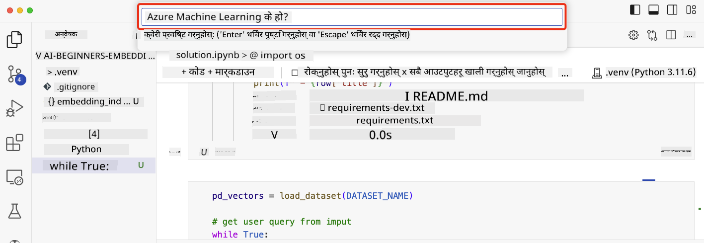

<!--
CO_OP_TRANSLATOR_METADATA:
{
  "original_hash": "58953c08b8ba7073b836d4270ea0fe86",
  "translation_date": "2025-10-17T13:57:51+00:00",
  "source_file": "08-building-search-applications/README.md",
  "language_code": "ne"
}
-->
# खोज अनुप्रयोग निर्माण

[](https://youtu.be/W0-nzXjOjr0?si=GcsqiTTvd7RKbo7V)

> > _माथिको चित्रमा क्लिक गरेर यस पाठको भिडियो हेर्नुहोस्_

LLMs केवल च्याटबोट र पाठ उत्पादनको लागि मात्र होइन। इम्बेडिङ्स प्रयोग गरेर खोज अनुप्रयोग निर्माण गर्न पनि सम्भव छ। इम्बेडिङ्स डाटाको संख्यात्मक प्रतिनिधित्व हो जसलाई भेक्टर पनि भनिन्छ, र डाटाको लागि सेम्यान्टिक खोज गर्न प्रयोग गर्न सकिन्छ।

यस पाठमा, तपाईं हाम्रो शिक्षा स्टार्टअपको लागि खोज अनुप्रयोग निर्माण गर्न जाँदै हुनुहुन्छ। हाम्रो स्टार्टअप एक गैर-नाफामूलक संस्था हो जसले विकासशील देशका विद्यार्थीहरूलाई निःशुल्क शिक्षा प्रदान गर्दछ। हाम्रो स्टार्टअपसँग धेरै YouTube भिडियोहरू छन् जसलाई विद्यार्थीहरूले AI सिक्न प्रयोग गर्न सक्छन्। हाम्रो स्टार्टअपले खोज अनुप्रयोग निर्माण गर्न चाहन्छ जसले विद्यार्थीहरूलाई प्रश्न टाइप गरेर YouTube भिडियो खोज्न अनुमति दिन्छ।

उदाहरणका लागि, विद्यार्थीले 'जुपिटर नोटबुक्स के हुन्?' वा 'Azure ML के हो?' टाइप गर्न सक्छन् र खोज अनुप्रयोगले प्रश्नसँग सम्बन्धित YouTube भिडियोहरूको सूची फिर्ता गर्नेछ। अझ राम्रो कुरा, खोज अनुप्रयोगले भिडियोको उत्तर रहेको स्थानको लिंक फिर्ता गर्नेछ।

## परिचय

यस पाठमा हामी निम्न विषयहरू समेट्नेछौं:

- सेम्यान्टिक बनाम कीवर्ड खोज।
- टेक्स्ट इम्बेडिङ्स के हुन्।
- टेक्स्ट इम्बेडिङ्स इन्डेक्स सिर्जना।
- टेक्स्ट इम्बेडिङ्स इन्डेक्स खोज।

## सिक्ने लक्ष्यहरू

यस पाठ पूरा गरेपछि, तपाईं सक्षम हुनुहुनेछ:

- सेम्यान्टिक र कीवर्ड खोजको बीचको भिन्नता बताउन।
- टेक्स्ट इम्बेडिङ्स के हुन् भनेर व्याख्या गर्न।
- डाटा खोज गर्न इम्बेडिङ्स प्रयोग गरेर अनुप्रयोग निर्माण गर्न।

## किन खोज अनुप्रयोग निर्माण गर्ने?

खोज अनुप्रयोग निर्माण गर्दा तपाईंलाई इम्बेडिङ्स प्रयोग गरेर डाटा खोज्न सिक्न मद्दत गर्नेछ। तपाईंले विद्यार्थीहरूले छिटो जानकारी पाउन प्रयोग गर्न सक्ने खोज अनुप्रयोग निर्माण गर्न पनि सिक्नुहुनेछ।

पाठमा Microsoft [AI Show](https://www.youtube.com/playlist?list=PLlrxD0HtieHi0mwteKBOfEeOYf0LJU4O1) YouTube च्यानलका ट्रान्सक्रिप्टहरूको इम्बेडिङ इन्डेक्स समावेश छ। AI Show एक YouTube च्यानल हो जसले तपाईंलाई AI र मेसिन लर्निङको बारेमा सिकाउँछ। इम्बेडिङ इन्डेक्समा अक्टोबर २०२३ सम्मका प्रत्येक YouTube ट्रान्सक्रिप्टहरूको इम्बेडिङ्स समावेश छ। तपाईं हाम्रो स्टार्टअपको लागि खोज अनुप्रयोग निर्माण गर्न इम्बेडिङ इन्डेक्स प्रयोग गर्नुहुनेछ। खोज अनुप्रयोगले भिडियोको उत्तर रहेको स्थानको लिंक फिर्ता गर्नेछ। यो विद्यार्थीहरूले छिटो आवश्यक जानकारी पाउनको लागि उत्कृष्ट तरिका हो।

निम्न 'can you use rstudio with azure ml?' प्रश्नको लागि सेम्यान्टिक क्वेरीको उदाहरण हो। YouTube URL हेर्नुहोस्, तपाईंले देख्नुहुनेछ कि URL मा टाइमस्ट्याम्प समावेश छ जसले तपाईंलाई भिडियोको उत्तर रहेको स्थानमा लैजान्छ।


## सेम्यान्टिक खोज के हो?

अब तपाईं सोच्दै हुनुहुन्छ होला, सेम्यान्टिक खोज के हो? सेम्यान्टिक खोज एक खोज प्रविधि हो जसले क्वेरीमा शब्दहरूको अर्थ प्रयोग गरेर सम्बन्धित परिणामहरू फिर्ता गर्छ।

यहाँ सेम्यान्टिक खोजको उदाहरण छ। मानौं तपाईं कार किन्न खोज्दै हुनुहुन्छ, तपाईंले 'मेरो सपना कार' खोज्न सक्नुहुन्छ। सेम्यान्टिक खोजले बुझ्छ कि तपाईं कारको बारेमा 'सपना देख्दै' हुनुहुन्न, बरु तपाईं आफ्नो 'आदर्श' कार किन्न खोज्दै हुनुहुन्छ। सेम्यान्टिक खोजले तपाईंको उद्देश्य बुझ्छ र सम्बन्धित परिणामहरू फिर्ता गर्छ। वैकल्पिक रूपमा 'कीवर्ड खोज'ले कारको सपना खोज्नेछ र प्रायः अप्रासंगिक परिणामहरू फिर्ता गर्नेछ।

## टेक्स्ट इम्बेडिङ्स के हुन्?

[टेक्स्ट इम्बेडिङ्स](https://en.wikipedia.org/wiki/Word_embedding?WT.mc_id=academic-105485-koreyst) प्राकृतिक भाषा प्रशोधनमा प्रयोग हुने टेक्स्ट प्रतिनिधित्व प्रविधि हो। टेक्स्ट इम्बेडिङ्स टेक्स्टको सेम्यान्टिक संख्यात्मक प्रतिनिधित्व हो। इम्बेडिङ्स डाटालाई मेसिनले सजिलै बुझ्न सक्ने तरिकामा प्रतिनिधित्व गर्न प्रयोग गरिन्छ। टेक्स्ट इम्बेडिङ्स निर्माण गर्न धेरै मोडेलहरू छन्, यस पाठमा हामी OpenAI इम्बेडिङ मोडेल प्रयोग गरेर इम्बेडिङ्स उत्पन्न गर्न केन्द्रित हुनेछौं।

यहाँ एक उदाहरण छ, कल्पना गर्नुहोस् कि निम्न टेक्स्ट AI Show YouTube च्यानलका एपिसोडहरूको ट्रान्सक्रिप्टमा छ:

```text
Today we are going to learn about Azure Machine Learning.
```

हामीले टेक्स्टलाई OpenAI इम्बेडिङ API मा पास गर्नेछौं र यसले १५३६ संख्याहरूको इम्बेडिङ फिर्ता गर्नेछ जसलाई भेक्टर भनिन्छ। भेक्टरमा प्रत्येक संख्या टेक्स्टको फरक पक्षलाई प्रतिनिधित्व गर्छ। संक्षेपमा, यहाँ भेक्टरका पहिलो १० संख्याहरू छन्।

```python
[-0.006655829958617687, 0.0026128944009542465, 0.008792596869170666, -0.02446001023054123, -0.008540431968867779, 0.022071078419685364, -0.010703742504119873, 0.003311325330287218, -0.011632772162556648, -0.02187200076878071, ...]
```

## इम्बेडिङ इन्डेक्स कसरी सिर्जना गरिन्छ?

यस पाठको लागि इम्बेडिङ इन्डेक्स Python स्क्रिप्टहरूको श्रृंखलाबाट सिर्जना गरिएको थियो। तपाईंले स्क्रिप्टहरू र निर्देशनहरू [README](./scripts/README.md?WT.mc_id=academic-105485-koreyst) मा 'scripts' फोल्डरमा फेला पार्न सक्नुहुन्छ। तपाईंलाई यी स्क्रिप्टहरू चलाउन आवश्यक छैन किनभने इम्बेडिङ इन्डेक्स तपाईंलाई प्रदान गरिएको छ।

स्क्रिप्टहरूले निम्न कार्यहरू गर्छन्:

1. [AI Show](https://www.youtube.com/playlist?list=PLlrxD0HtieHi0mwteKBOfEeOYf0LJU4O1) प्लेलिस्टका प्रत्येक YouTube भिडियोको ट्रान्सक्रिप्ट डाउनलोड गरिन्छ।
2. [OpenAI Functions](https://learn.microsoft.com/azure/ai-services/openai/how-to/function-calling?WT.mc_id=academic-105485-koreyst) प्रयोग गरेर YouTube ट्रान्सक्रिप्टको पहिलो ३ मिनेटबाट स्पिकरको नाम निकाल्ने प्रयास गरिन्छ। प्रत्येक भिडियोको स्पिकर नाम `embedding_index_3m.json` नामक इम्बेडिङ इन्डेक्समा भण्डारण गरिन्छ।
3. ट्रान्सक्रिप्ट टेक्स्टलाई **३ मिनेट टेक्स्ट खण्डहरू**मा विभाजित गरिन्छ। खण्डमा अर्को खण्डबाट करिब २० शब्द ओभरल्याप समावेश गरिन्छ ताकि खण्डको इम्बेडिङ काटिएको नहोस् र राम्रो खोज सन्दर्भ प्रदान गर्न सकियोस्।
4. प्रत्येक टेक्स्ट खण्डलाई OpenAI Chat API मा पास गरिन्छ ताकि टेक्स्टलाई ६० शब्दमा संक्षेप गर्न सकियोस्। संक्षेप पनि `embedding_index_3m.json` मा भण्डारण गरिन्छ।
5. अन्ततः, खण्ड टेक्स्टलाई OpenAI इम्बेडिङ API मा पास गरिन्छ। इम्बेडिङ API ले खण्डको सेम्यान्टिक अर्थलाई प्रतिनिधित्व गर्ने १५३६ संख्याहरूको भेक्टर फिर्ता गर्छ। खण्ड र OpenAI इम्बेडिङ भेक्टर `embedding_index_3m.json` मा भण्डारण गरिन्छ।

### भेक्टर डाटाबेसहरू

पाठको सरलताका लागि, इम्बेडिङ इन्डेक्स `embedding_index_3m.json` नामक JSON फाइलमा भण्डारण गरिएको छ र Pandas DataFrame मा लोड गरिएको छ। तर उत्पादनमा, इम्बेडिङ इन्डेक्सलाई [Azure Cognitive Search](https://learn.microsoft.com/training/modules/improve-search-results-vector-search?WT.mc_id=academic-105485-koreyst), [Redis](https://cookbook.openai.com/examples/vector_databases/redis/readme?WT.mc_id=academic-105485-koreyst), [Pinecone](https://cookbook.openai.com/examples/vector_databases/pinecone/readme?WT.mc_id=academic-105485-koreyst), [Weaviate](https://cookbook.openai.com/examples/vector_databases/weaviate/readme?WT.mc_id=academic-105485-koreyst) जस्ता भेक्टर डाटाबेसमा भण्डारण गरिन्छ।

## कोसाइन समानता बुझ्दै

हामीले टेक्स्ट इम्बेडिङ्सको बारेमा सिक्यौं, अब टेक्स्ट इम्बेडिङ्स प्रयोग गरेर डाटा खोज्न र विशेष गरी कोसाइन समानता प्रयोग गरेर दिइएको क्वेरीसँग सबैभन्दा समान इम्बेडिङ्स फेला पार्न सिक्नेछौं।

### कोसाइन समानता के हो?

कोसाइन समानता दुई भेक्टरहरू बीचको समानताको मापन हो, यसलाई `नजिकको छिमेकी खोज` पनि भनिन्छ। कोसाइन समानता खोज गर्न तपाईंले OpenAI इम्बेडिङ API प्रयोग गरेर _क्वेरी_ टेक्स्टलाई _भेक्टराइज_ गर्न आवश्यक छ। त्यसपछि क्वेरी भेक्टर र इम्बेडिङ इन्डेक्समा प्रत्येक भेक्टर बीचको _कोसाइन समानता_ गणना गर्नुहोस्। सम्झनुहोस्, इम्बेडिङ इन्डेक्समा प्रत्येक YouTube ट्रान्सक्रिप्ट टेक्स्ट खण्डको लागि भेक्टर छ। अन्ततः, कोसाइन समानताका आधारमा परिणामहरू क्रमबद्ध गर्नुहोस् र उच्चतम कोसाइन समानता भएका टेक्स्ट खण्डहरू क्वेरीसँग सबैभन्दा समान हुन्छन्।

गणितीय दृष्टिकोणबाट, कोसाइन समानता बहुआयामिक स्थानमा प्रक्षेपित दुई भेक्टरहरू बीचको कोणको कोसाइन मापन गर्दछ। यो मापन लाभदायक छ, किनभने यदि दुई कागजातहरू आकारका कारण युक्लिडियन दूरीले टाढा छन् भने, तिनीहरू बीचको कोण सानो हुन सक्छ र त्यसैले उच्च कोसाइन समानता। कोसाइन समानता समीकरणहरूको बारेमा थप जानकारीको लागि, [Cosine similarity](https://en.wikipedia.org/wiki/Cosine_similarity?WT.mc_id=academic-105485-koreyst) हेर्नुहोस्।

## आफ्नो पहिलो खोज अनुप्रयोग निर्माण गर्दै

अब, हामी इम्बेडिङ्स प्रयोग गरेर खोज अनुप्रयोग निर्माण गर्न सिक्नेछौं। खोज अनुप्रयोगले विद्यार्थीहरूलाई प्रश्न टाइप गरेर भिडियो खोज्न अनुमति दिनेछ। खोज अनुप्रयोगले प्रश्नसँग सम्बन्धित भिडियोहरूको सूची फिर्ता गर्नेछ। खोज अनुप्रयोगले भिडियोको उत्तर रहेको स्थानको लिंक पनि फिर्ता गर्नेछ।

यो समाधान Windows 11, macOS, र Ubuntu 22.04 मा Python 3.10 वा पछिल्लो संस्करण प्रयोग गरेर निर्माण र परीक्षण गरिएको थियो। तपाईं Python [python.org](https://www.python.org/downloads/?WT.mc_id=academic-105485-koreyst) बाट डाउनलोड गर्न सक्नुहुन्छ।

## असाइनमेन्ट - विद्यार्थीहरूलाई सक्षम बनाउन खोज अनुप्रयोग निर्माण गर्दै

हामीले पाठको सुरुवातमा हाम्रो स्टार्टअपको परिचय गरायौं। अब विद्यार्थीहरूलाई उनीहरूको मूल्याङ्कनको लागि खोज अनुप्रयोग निर्माण गर्न सक्षम बनाउने समय हो।

यस असाइनमेन्टमा, तपाईंले खोज अनुप्रयोग निर्माण गर्न प्रयोग गरिने Azure OpenAI सेवाहरू सिर्जना गर्नुहुनेछ। तपाईंले निम्न Azure OpenAI सेवाहरू सिर्जना गर्नुहुनेछ। यो असाइनमेन्ट पूरा गर्न तपाईंलाई Azure सदस्यता आवश्यक हुनेछ।

### Azure Cloud Shell सुरु गर्नुहोस्

1. [Azure पोर्टल](https://portal.azure.com/?WT.mc_id=academic-105485-koreyst) मा साइन इन गर्नुहोस्।
2. Azure पोर्टलको माथिल्लो-दायाँ कुनामा रहेको Cloud Shell आइकन चयन गर्नुहोस्।
3. वातावरण प्रकारको लागि **Bash** चयन गर्नुहोस्।

#### स्रोत समूह सिर्जना गर्नुहोस्

> यी निर्देशनहरूको लागि, हामी East US मा "semantic-video-search" नामक स्रोत समूह प्रयोग गर्दैछौं।
> तपाईं स्रोत समूहको नाम परिवर्तन गर्न सक्नुहुन्छ, तर स्रोतहरूको स्थान परिवर्तन गर्दा,
> [मोडेल उपलब्धता तालिका](https://aka.ms/oai/models?WT.mc_id=academic-105485-koreyst) जाँच गर्नुहोस्।

```shell
az group create --name semantic-video-search --location eastus
```

#### Azure OpenAI सेवा स्रोत सिर्जना गर्नुहोस्

Azure Cloud Shell बाट, निम्न आदेश चलाएर Azure OpenAI सेवा स्रोत सिर्जना गर्नुहोस्।

```shell
az cognitiveservices account create --name semantic-video-openai --resource-group semantic-video-search \
    --location eastus --kind OpenAI --sku s0
```

#### यस अनुप्रयोगमा प्रयोगको लागि अन्त बिन्दु र कुञ्जीहरू प्राप्त गर्नुहोस्

Azure Cloud Shell बाट, निम्न आदेशहरू चलाएर Azure OpenAI सेवा स्रोतको अन्त बिन्दु र कुञ्जीहरू प्राप्त गर्नुहोस्।

```shell
az cognitiveservices account show --name semantic-video-openai \
   --resource-group  semantic-video-search | jq -r .properties.endpoint
az cognitiveservices account keys list --name semantic-video-openai \
   --resource-group semantic-video-search | jq -r .key1
```

#### OpenAI इम्बेडिङ मोडेल तैनाथ गर्नुहोस्

Azure Cloud Shell बाट, निम्न आदेश चलाएर OpenAI इम्बेडिङ मोडेल तैनाथ गर्नुहोस्।

```shell
az cognitiveservices account deployment create \
    --name semantic-video-openai \
    --resource-group  semantic-video-search \
    --deployment-name text-embedding-ada-002 \
    --model-name text-embedding-ada-002 \
    --model-version "2"  \
    --model-format OpenAI \
    --sku-capacity 100 --sku-name "Standard"
```

## समाधान

GitHub Codespaces मा [solution notebook](./python/aoai-solution.ipynb?WT.mc_id=academic-105485-koreyst) खोल्नुहोस् र Jupyter Notebook मा निर्देशनहरू पालना गर्नुहोस्।

जब तपाईं नोटबुक चलाउनुहुन्छ, तपाईंलाई क्वेरी प्रविष्ट गर्न संकेत गरिनेछ। इनपुट बक्स यस प्रकार देखिनेछ:



## उत्कृष्ट काम! आफ्नो सिकाइ जारी राख्नुहोस्

यस पाठ पूरा गरेपछि, हाम्रो [Generative AI Learning collection](https://aka.ms/genai-collection?WT.mc_id=academic-105485-koreyst) हेर्नुहोस् र आफ्नो जनरेटिभ AI ज्ञानलाई स्तरवृद्धि गर्न जारी राख्नुहोस्!

पाठ ९ मा जानुहोस् जहाँ हामी [छवि उत्पादन अनुप्रयोगहरू निर्माण गर्ने](../09-building-image-applications/README.md?WT.mc_id=academic-105485-koreyst) बारे हेर्नेछौं!

---

**अस्वीकरण**:  
यो दस्तावेज़ AI अनुवाद सेवा [Co-op Translator](https://github.com/Azure/co-op-translator) प्रयोग गरेर अनुवाद गरिएको छ। हामी शुद्धताको लागि प्रयास गर्छौं, तर कृपया ध्यान दिनुहोस् कि स्वचालित अनुवादहरूमा त्रुटिहरू वा अशुद्धताहरू हुन सक्छ। यसको मूल भाषा मा रहेको मूल दस्तावेज़लाई आधिकारिक स्रोत मानिनुपर्छ। महत्वपूर्ण जानकारीको लागि, व्यावसायिक मानव अनुवाद सिफारिस गरिन्छ। यस अनुवादको प्रयोगबाट उत्पन्न हुने कुनै पनि गलतफहमी वा गलत व्याख्याको लागि हामी जिम्मेवार हुने छैनौं।