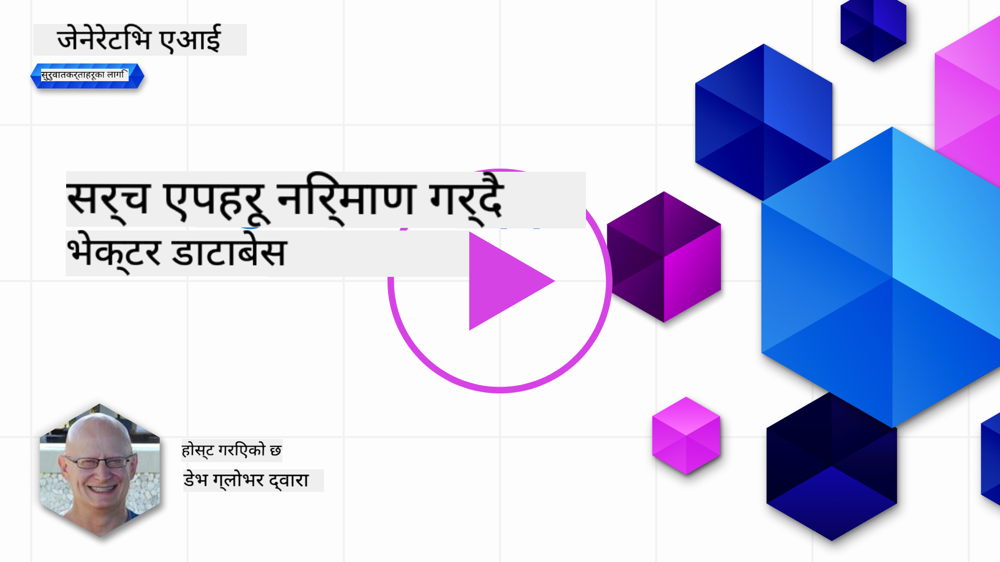

<!--
CO_OP_TRANSLATOR_METADATA:
{
  "original_hash": "d46aad0917a1a342d613e2c13d457da5",
  "translation_date": "2025-07-09T12:52:16+00:00",
  "source_file": "08-building-search-applications/README.md",
  "language_code": "ne"
}
-->
# खोज अनुप्रयोगहरू निर्माण गर्दै

[](https://aka.ms/gen-ai-lesson8-gh?WT.mc_id=academic-105485-koreyst)

> > _यो पाठको भिडियो हेर्न माथिको तस्बिरमा क्लिक गर्नुहोस्_

LLM हरू केवल च्याटबोट र पाठ सिर्जनामा सीमित छैनन्। Embeddings प्रयोग गरेर खोज अनुप्रयोगहरू पनि बनाउन सकिन्छ। Embeddings भनेको डाटाको सङ्ख्यात्मक प्रतिनिधित्व हो जसलाई भेक्टर पनि भनिन्छ, र यसलाई डाटाको अर्थपूर्ण खोजका लागि प्रयोग गर्न सकिन्छ।

यस पाठमा, हामी हाम्रो शिक्षा स्टार्टअपका लागि खोज अनुप्रयोग बनाउनेछौं। हाम्रो स्टार्टअप एक गैर-नाफामूलक संस्था हो जसले विकासशील देशका विद्यार्थीहरूलाई निःशुल्क शिक्षा प्रदान गर्छ। हाम्रो स्टार्टअपसँग धेरै युट्युब भिडियोहरू छन् जसबाट विद्यार्थीहरूले AI सम्बन्धी कुरा सिक्न सक्छन्। हाम्रो स्टार्टअपले यस्तो खोज अनुप्रयोग बनाउन चाहन्छ जसले विद्यार्थीहरूलाई प्रश्न टाइप गरेर युट्युब भिडियो खोज्न अनुमति दिन्छ।

उदाहरणका लागि, विद्यार्थीले 'What are Jupyter Notebooks?' वा 'What is Azure ML' टाइप गर्न सक्छ र खोज अनुप्रयोगले सोधिएको प्रश्नसँग सम्बन्धित युट्युब भिडियोहरूको सूची फर्काउनेछ, र अझ राम्रो कुरा, खोज अनुप्रयोगले सोधिएको प्रश्नको उत्तर भिडियोको कुन भागमा छ भन्ने लिंक पनि दिनेछ।

## परिचय

यस पाठमा हामीले समेट्ने विषयहरू:

- Semantic र Keyword खोजबीचको भिन्नता।
- Text Embeddings के हुन्।
- Text Embeddings Index कसरी बनाउने।
- Text Embeddings Index मा कसरी खोज गर्ने।

## सिकाइका लक्ष्यहरू

यस पाठ पूरा गरेपछि, तपाईं सक्षम हुनुहुनेछ:

- Semantic र keyword खोजबीचको फरक बताउन।
- Text Embeddings के हुन् व्याख्या गर्न।
- Embeddings प्रयोग गरेर डाटा खोज्न अनुप्रयोग बनाउन।

## किन खोज अनुप्रयोग बनाउने?

खोज अनुप्रयोग बनाउँदा तपाईंलाई Embeddings प्रयोग गरेर डाटा कसरी खोज्ने बुझ्न मद्दत मिल्छ। साथै, विद्यार्थीहरूले छिटो जानकारी खोज्न सक्ने खोज अनुप्रयोग कसरी बनाउने भन्ने सिक्नुहुनेछ।

यस पाठमा Microsoft को [AI Show](https://www.youtube.com/playlist?list=PLlrxD0HtieHi0mwteKBOfEeOYf0LJU4O1) युट्युब च्यानलका ट्रान्सक्रिप्टहरूको Embedding Index समावेश गरिएको छ। AI Show एउटा युट्युब च्यानल हो जसले तपाईंलाई AI र मेशिन लर्निङका बारेमा सिकाउँछ। Embedding Index मा अक्टोबर २०२३ सम्मका सबै युट्युब ट्रान्सक्रिप्टका Embeddings छन्। तपाईंले यो Embedding Index प्रयोग गरेर हाम्रो स्टार्टअपका लागि खोज अनुप्रयोग बनाउनु हुनेछ। खोज अनुप्रयोगले सोधिएको प्रश्नको उत्तर भिडियोको कुन भागमा छ भन्ने लिंक पनि फर्काउँछ। यो विद्यार्थीहरूलाई आवश्यक जानकारी छिटो फेला पार्न उत्कृष्ट तरिका हो।

तलको उदाहरणमा 'can you use rstudio with azure ml?' भन्ने प्रश्नको लागि semantic query देखाइएको छ। युट्युब URL मा टाइमस्ट्याम्प हुन्छ जसले तपाईंलाई सोधिएको प्रश्नको उत्तर भिडियोको कुन भागमा छ त्यहाँ लैजान्छ।


## Semantic खोज भनेको के हो?

अब तपाईंलाई लाग्न सक्छ, semantic खोज के हो? Semantic खोज भनेको खोज प्रविधि हो जसले सोधिएको प्रश्नका शब्दहरूको अर्थ वा सन्दर्भलाई बुझेर सम्बन्धित नतिजा फर्काउँछ।

यहाँ semantic खोजको उदाहरण छ। मानौं तपाईं कार किन्ने सोचमा हुनुहुन्छ, तपाईं 'my dream car' खोज्नुहुन्छ। semantic खोजले बुझ्छ कि तपाईं कारको सपना देख्दै हुनुहुन्न, बरु तपाईं आफ्नो 'आदर्श' कार किन्ने खोजीमा हुनुहुन्छ। semantic खोजले तपाईंको आशय बुझेर सम्बन्धित नतिजा दिन्छ। यसको विपरित, keyword खोजले शब्दशः 'dream' र 'car' खोज्ने भएकाले प्रायः अप्रासंगिक नतिजा दिन सक्छ।

## Text Embeddings के हुन्?

[Text embeddings](https://en.wikipedia.org/wiki/Word_embedding?WT.mc_id=academic-105485-koreyst) भनेको [natural language processing](https://en.wikipedia.org/wiki/Natural_language_processing?WT.mc_id=academic-105485-koreyst) मा प्रयोग हुने पाठ प्रतिनिधित्व प्रविधि हो। Text embeddings भनेको पाठको अर्थपूर्ण सङ्ख्यात्मक प्रतिनिधित्व हो। Embeddings ले डाटालाई मेसिनले सजिलै बुझ्ने तरिकाले प्रतिनिधित्व गर्छ। Text embeddings बनाउन धेरै मोडेलहरू छन्, यस पाठमा हामी OpenAI Embedding Model प्रयोग गरेर embeddings कसरी बनाउने भन्नेमा केन्द्रित हुनेछौं।

यहाँ एउटा उदाहरण छ, कल्पना गर्नुहोस् तलको पाठ AI Show युट्युब च्यानलको एउटा एपिसोडको ट्रान्सक्रिप्टबाट हो:

```text
Today we are going to learn about Azure Machine Learning.
```

हामीले यो पाठ OpenAI Embedding API मा पठाउँछौं र यसले १५३६ सङ्ख्याहरूको भेक्टर (vector) फर्काउँछ। भेक्टरका प्रत्येक सङ्ख्या पाठका फरक पक्षलाई प्रतिनिधित्व गर्छ। छोटकरीमा, यहाँ भेक्टरका पहिलो १० सङ्ख्या छन्।

```python
[-0.006655829958617687, 0.0026128944009542465, 0.008792596869170666, -0.02446001023054123, -0.008540431968867779, 0.022071078419685364, -0.010703742504119873, 0.003311325330287218, -0.011632772162556648, -0.02187200076878071, ...]
```

## Embedding index कसरी बनाइन्छ?

यस पाठको Embedding index Python स्क्रिप्टहरूको श्रृंखलाबाट बनाइएको हो। तपाईंले यी स्क्रिप्टहरू र निर्देशनहरू [README](./scripts/README.md?WT.mc_id=academic-105485-koreyst) फोल्डरमा पाउनुहुनेछ। यी स्क्रिप्टहरू चलाउन आवश्यक छैन किनकि Embedding Index तपाईंलाई प्रदान गरिएको छ।

स्क्रिप्टहरूले निम्न कार्यहरू गर्छन्:

1. [AI Show](https://www.youtube.com/playlist?list=PLlrxD0HtieHi0mwteKBOfEeOYf0LJU4O1) प्लेलिस्टका प्रत्येक युट्युब भिडियोको ट्रान्सक्रिप्ट डाउनलोड गर्छ।
2. [OpenAI Functions](https://learn.microsoft.com/azure/ai-services/openai/how-to/function-calling?WT.mc_id=academic-105485-koreyst) प्रयोग गरेर, युट्युब ट्रान्सक्रिप्टको पहिलो ३ मिनेटबाट वक्ताको नाम निकाल्ने प्रयास गर्छ। प्रत्येक भिडियोको वक्ता नाम Embedding Index `embedding_index_3m.json` मा भण्डारण हुन्छ।
3. ट्रान्सक्रिप्टलाई **३ मिनेटका पाठ खण्डहरू** मा विभाजन गर्छ। प्रत्येक खण्डमा अर्को खण्डबाट करिब २० शब्द ओभरल्याप हुन्छ ताकि Embedding कट नहोस् र खोज सन्दर्भ राम्रो होस्।
4. प्रत्येक पाठ खण्डलाई OpenAI Chat API मा पठाएर ६० शब्दमा सारांश बनाइन्छ। सारांश पनि Embedding Index `embedding_index_3m.json` मा राखिन्छ।
5. अन्तमा, खण्डको पाठ OpenAI Embedding API मा पठाइन्छ। Embedding API ले १५३६ सङ्ख्याको भेक्टर फर्काउँछ जुन खण्डको अर्थपूर्ण प्रतिनिधित्व हो। खण्ड र भेक्टर Embedding Index `embedding_index_3m.json` मा भण्डारण हुन्छ।

### भेक्टर डाटाबेसहरू

सजिलोको लागि, Embedding Index JSON फाइल `embedding_index_3m.json` मा भण्डारण गरिएको छ र Pandas DataFrame मा लोड गरिएको छ। तर उत्पादनमा, Embedding Index भेक्टर डाटाबेसहरूमा जस्तै [Azure Cognitive Search](https://learn.microsoft.com/training/modules/improve-search-results-vector-search?WT.mc_id=academic-105485-koreyst), [Redis](https://cookbook.openai.com/examples/vector_databases/redis/readme?WT.mc_id=academic-105485-koreyst), [Pinecone](https://cookbook.openai.com/examples/vector_databases/pinecone/readme?WT.mc_id=academic-105485-koreyst), [Weaviate](https://cookbook.openai.com/examples/vector_databases/weaviate/readme?WT.mc_id=academic-105485-koreyst) मा राखिन्छ।

## cosine similarity बुझ्न

हामीले text embeddings सिक्यौं, अब text embeddings प्रयोग गरेर डाटा कसरी खोज्ने र विशेष गरी cosine similarity प्रयोग गरेर सोधिएको प्रश्नसँग सबैभन्दा मिल्दोजुल्दो embeddings कसरी फेला पार्ने सिक्नेछौं।

### cosine similarity के हो?

Cosine similarity दुई भेक्टरबीचको समानताको मापन हो, जसलाई `nearest neighbor search` पनि भनिन्छ। cosine similarity खोज गर्न, तपाईंले OpenAI Embedding API प्रयोग गरेर सोधिएको प्रश्नको पाठलाई भेक्टरमा रूपान्तरण गर्नुपर्छ। त्यसपछि सोधिएको प्रश्नको भेक्टर र Embedding Index का प्रत्येक भेक्टरबीच cosine similarity गणना गर्नुपर्छ। Embedding Index मा प्रत्येक युट्युब ट्रान्सक्रिप्टको पाठ खण्डको लागि भेक्टर हुन्छ। अन्तमा, नतिजाहरूलाई cosine similarity अनुसार क्रमबद्ध गर्दा सबैभन्दा मिल्दोजुल्दो पाठ खण्डहरू माथि आउँछन्।

गणितीय दृष्टिले, cosine similarity दुई भेक्टरबीचको कोणको cosine मापन हो जुन बहुआयामिक स्थानमा प्रक्षेपित हुन्छ। यो मापन उपयोगी छ किनभने दुई कागजात Euclidean दूरीले टाढा भए पनि सानो कोण हुन सक्छ र त्यसैले उच्च cosine similarity हुन सक्छ। थप जानकारीका लागि [Cosine similarity](https://en.wikipedia.org/wiki/Cosine_similarity?WT.mc_id=academic-105485-koreyst) हेर्नुहोस्।

## तपाईंको पहिलो खोज अनुप्रयोग बनाउँदै

अब हामी Embeddings प्रयोग गरेर खोज अनुप्रयोग कसरी बनाउने सिक्नेछौं। यो अनुप्रयोगले विद्यार्थीहरूलाई प्रश्न टाइप गरेर भिडियो खोज्न अनुमति दिनेछ। अनुप्रयोगले सोधिएको प्रश्नसँग सम्बन्धित भिडियोहरूको सूची फर्काउनेछ। साथै, भिडियोमा प्रश्नको उत्तर रहेको स्थानको लिंक पनि दिनेछ।

यो समाधान Windows 11, macOS, र Ubuntu 22.04 मा Python 3.10 वा पछि संस्करण प्रयोग गरेर बनाइएको र परीक्षण गरिएको हो। तपाईं Python [python.org](https://www.python.org/downloads/?WT.mc_id=academic-105485-koreyst) बाट डाउनलोड गर्न सक्नुहुन्छ।

## असाइनमेन्ट - विद्यार्थीहरूलाई सक्षम पार्न खोज अनुप्रयोग बनाउने

यस पाठको सुरुमै हामीले हाम्रो स्टार्टअप परिचय गरायौं। अब विद्यार्थीहरूलाई आफ्नो मूल्याङ्कनका लागि खोज अनुप्रयोग बनाउन सक्षम पार्ने समय आएको छ।

यस असाइनमेन्टमा, तपाईं Azure OpenAI Services सिर्जना गर्नुहुनेछ जुन खोज अनुप्रयोग बनाउन प्रयोग हुनेछ। तपाईंले तलका Azure OpenAI Services सिर्जना गर्नु पर्नेछ। यस असाइनमेन्ट पूरा गर्न Azure सदस्यता आवश्यक छ।

### Azure Cloud Shell सुरु गर्नुहोस्

1. [Azure portal](https://portal.azure.com/?WT.mc_id=academic-105485-koreyst) मा साइन इन गर्नुहोस्।
2. Azure पोर्टलको माथि-दायाँ कुनामा रहेको Cloud Shell आइकन चयन गर्नुहोस्।
3. वातावरण प्रकारको लागि **Bash** चयन गर्नुहोस्।

#### रिसोर्स समूह सिर्जना गर्नुहोस्

> यी निर्देशनहरूमा, हामी "semantic-video-search" नामको रिसोर्स समूह East US मा प्रयोग गर्दैछौं।
> तपाईं रिसोर्स समूहको नाम परिवर्तन गर्न सक्नुहुन्छ, तर स्रोतहरूको स्थान परिवर्तन गर्दा,
> [model availability table](https://aka.ms/oai/models?WT.mc_id=academic-105485-koreyst) जाँच गर्नुहोस्।

```shell
az group create --name semantic-video-search --location eastus
```

#### Azure OpenAI Service रिसोर्स सिर्जना गर्नुहोस्

Azure Cloud Shell बाट तलको कमाण्ड चलाएर Azure OpenAI Service रिसोर्स सिर्जना गर्नुहोस्।

```shell
az cognitiveservices account create --name semantic-video-openai --resource-group semantic-video-search \
    --location eastus --kind OpenAI --sku s0
```

#### यस अनुप्रयोगमा प्रयोगका लागि endpoint र keys प्राप्त गर्नुहोस्

Azure Cloud Shell बाट तलका कमाण्डहरू चलाएर Azure OpenAI Service रिसोर्सको endpoint र keys प्राप्त गर्नुहोस्।

```shell
az cognitiveservices account show --name semantic-video-openai \
   --resource-group  semantic-video-search | jq -r .properties.endpoint
az cognitiveservices account keys list --name semantic-video-openai \
   --resource-group semantic-video-search | jq -r .key1
```

#### OpenAI Embedding मोडेल डिप्लोय गर्नुहोस्

Azure Cloud Shell बाट तलको कमाण्ड चलाएर OpenAI Embedding मोडेल डिप्लोय गर्नुहोस्।

```shell
az cognitiveservices account deployment create \
    --name semantic-video-openai \
    --resource-group  semantic-video-search \
    --deployment-name text-embedding-ada-002 \
    --model-name text-embedding-ada-002 \
    --model-version "2"  \
    --model-format OpenAI \
    --sku-capacity 100 --sku-name "Standard"
```

## समाधान

GitHub Codespaces मा रहेको [solution notebook](../../../08-building-search-applications/python/aoai-solution.ipynb) खोल्नुहोस् र Jupyter Notebook मा निर्देशनहरू पालना गर्नुहोस्।

जब तपाईं नोटबुक चलाउनुहुन्छ, तपाईंलाई प्रश्न प्रविष्ट गर्न अनुरोध गरिनेछ। इनपुट बक्स यसरी देखिनेछ:


## राम्रो काम! आफ्नो सिकाइ जारी राख्नुहोस्

यस पाठ पूरा गरेपछि, हाम्रो [Generative AI Learning collection](https://aka.ms/genai-collection?WT.mc_id=academic-105485-koreyst) हेर्नुहोस् र Generative AI को ज्ञान अझ बढाउनुहोस्!

पाठ ९ मा जानुहोस् जहाँ हामी [छवि सिर्जना अनुप्रयोगहरू कसरी बनाउने](../09-building-image-applications/README.md?WT.mc_id=academic-105485-koreyst) हेर्नेछौं!

**अस्वीकरण**:  
यो दस्तावेज AI अनुवाद सेवा [Co-op Translator](https://github.com/Azure/co-op-translator) प्रयोग गरी अनुवाद गरिएको हो। हामी शुद्धताका लागि प्रयासरत छौं, तर कृपया ध्यान दिनुहोस् कि स्वचालित अनुवादमा त्रुटि वा अशुद्धता हुन सक्छ। मूल दस्तावेज यसको मूल भाषामा नै अधिकारिक स्रोत मानिनुपर्छ। महत्वपूर्ण जानकारीका लागि व्यावसायिक मानव अनुवाद सिफारिस गरिन्छ। यस अनुवादको प्रयोगबाट उत्पन्न कुनै पनि गलतफहमी वा गलत व्याख्याका लागि हामी जिम्मेवार छैनौं।