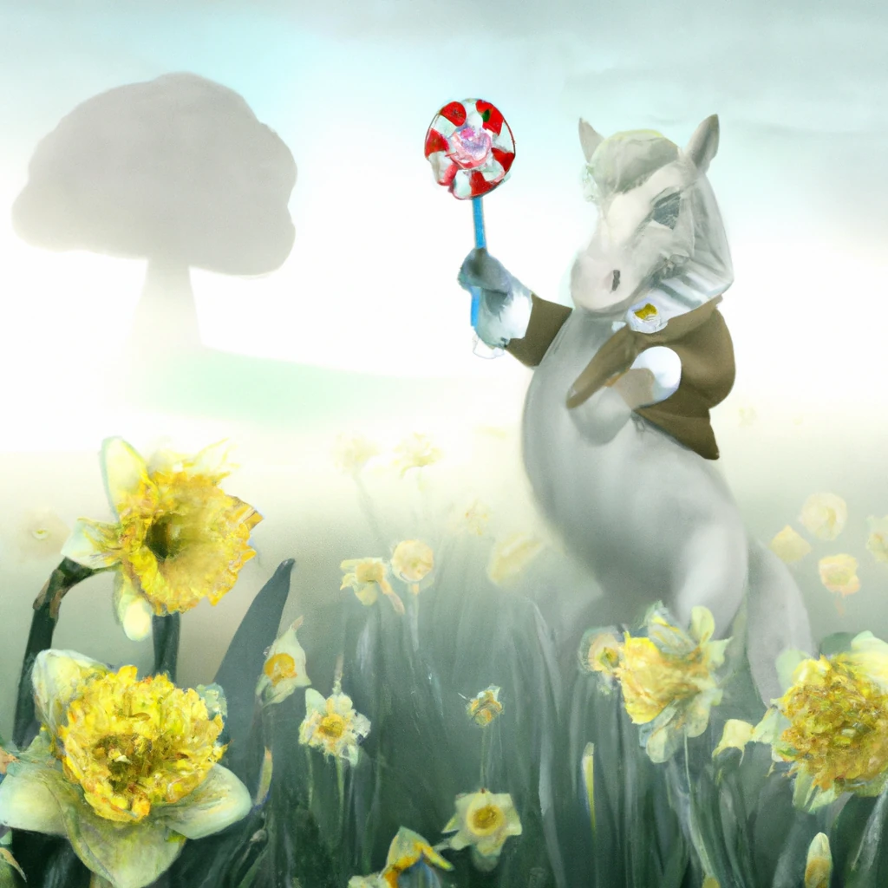

# छवि निर्माण अनुप्रयोगहरू बनाउनुहोस्

[](https://youtu.be/B5VP0_J7cs8?si=5P3L5o7F_uS_QcG9)

LLMs मा केवल पाठ सिर्जना मात्र होइन। पाठ विवरणहरूबाट छविहरू पनि सिर्जना गर्न सकिन्छ। छविहरूको रूपमा एक माध्यम हुनु धेरै क्षेत्रहरूमा उपयोगी हुन सक्छ जस्तै MedTech, वास्तुकला, पर्यटन, खेल विकास र थप। यस अध्यायमा, हामी दुई सबैभन्दा लोकप्रिय छवि निर्माण मोडेलहरू, DALL-E र Midjourney बारे जान्नेछौं।

## परिचय

यस पाठमा, हामी छलफल गर्नेछौं:

- छवि निर्माण र यसको उपयोगिता।
- DALL-E र Midjourney के हुन् र तिनीहरू कसरी काम गर्छन्।
- कसरी तपाईंले छवि निर्माण अनुप्रयोग बनाउन सक्नुहुन्छ।

## सिकाइको उद्देश्यहरू

यस पाठ पूरा गरेपछी, तपाईं सक्षम हुनुहुनेछ:

- छवि निर्माण अनुप्रयोग बनाउने।
- आफ्नो अनुप्रयोगका लागि मेटा प्रॉम्प्टहरूसँग सीमा निर्धारण गर्ने।
- DALL-E र Midjourney सँग काम गर्ने।

## किन छवि निर्माण अनुप्रयोग बनाउने?

छवि निर्माण अनुप्रयोगहरू जनरेटिभ AI को क्षमताहरू अन्वेषण गर्ने उत्कृष्ट माध्यम हुन्। तिनीहरू यस प्रकारका प्रयोगहरूका लागि उपयोगी हुन सक्छन्:

- **छवि सम्पादन र संश्लेषण**। तपाईं विभिन्न प्रयोगहरूका लागि छविहरू निर्माण गर्न सक्नुहुन्छ, जस्तै छवि सम्पादन र संश्लेषण।

- **विभिन्न उद्योगहरूमा लागू**। यी छविहरू MedTech, पर्यटन, खेल विकास जस्ता विभिन्न उद्योगहरूका लागि पनि निर्माण गर्न सकिन्छ।

## परिदृश्य: Edu4All

यस पाठको भागको रूपमा, हामी हाम्रो स्टार्टअप Edu4All सँग काम जारी राख्नेछौं। विद्यार्थीहरूले आफ्नो मूल्याङ्कनका लागि छविहरू सिर्जना गर्नेछन्, के छवि बनाउने भन्ने निर्णय विद्यार्थीको हातमा हुन्छ, तिनीहरूले आफ्नो आफ्नै परी कथाका लागि चित्र बनाउन सक्छन् वा आफ्नो कथाको लागि नयाँ पात्र सिर्जना गर्न सक्छन् वा आफ्ना विचार र अवधारणाहरू दृश्यमान बनाउन सक्छन्।

यहाँ Edu4All का विद्यार्थीहरूले कक्षामा स्मारकहरूमा काम गर्दा के के उत्पादन गर्न सक्छन् भन्ने उदाहरण छ:


यस्ता प्रॉम्प्ट प्रयोग गरेर

> "प्रारम्भिक बिहानको घाममा एफिल टावरको छेउमा कुकुर"

## DALL-E र Midjourney के हुन्?

[DALL-E](https://openai.com/dall-e-2?WT.mc_id=academic-105485-koreyst) र [Midjourney](https://www.midjourney.com/?WT.mc_id=academic-105485-koreyst) दुई सबैभन्दा लोकप्रिय छवि निर्माण मोडेलहरू हुन्, जसले तपाईंलाई प्रॉम्प्टबाट छविहरू निर्माण गर्न अनुमति दिन्छ।

### DALL-E

DALL-E बाट शुरू गरौं, जुन एक जनरेटिभ AI मोडेल हो जुन पाठ विवरणहरूबाट छविहरू सिर्जना गर्छ।

> [DALL-E दुई मोडेलहरूको संयोजन हो, CLIP र Diffused Attention](https://towardsdatascience.com/openais-dall-e-and-clip-101-a-brief-introduction-3a4367280d4e?WT.mc_id=academic-105485-koreyst)।

- **CLIP**, एक मोडेल हो जसले छवि र पाठबाट संख्यात्मक प्रतिनिधित्वहरू (embeddings) उत्पन्न गर्छ।

- **Diffused Attention**, एक मोडेल हो जसले embeddings बाट छविहरू निर्माण गर्छ। DALL-E लाई छवि र पाठको डेटासेटमा प्रशिक्षित गरिएको छ र यसले पाठ विवरणबाट छवि बनाउन सक्छ। उदाहरणका लागि, DALL-E ले टोपी लगाएको बिरालो वा मोहक कुकुरको छविहरू बनाउन सक्छ।

### Midjourney

Midjourney ले DALL-E जस्तै काम गर्छ, पाठ प्रॉम्प्टबाट छविहरू सिर्जना गर्छ। Midjourney प्रयोग गरेर पनि "टोपी लगाएको बिरालो" वा "मोहक कुकुर" जस्ता प्रॉम्प्टहरूबाट छविहरू बनाउन सकिन्छ।


_छवि श्रेय विकिपीडिया, Midjourney द्वारा निर्मित छवि_

## DALL-E र Midjourney कसरी काम गर्छन्

पहिले, [DALL-E](https://arxiv.org/pdf/2102.12092.pdf?WT.mc_id=academic-105485-koreyst)। DALL-E एक जनरेटिभ AI मोडेल हो जुन ट्रान्सफार्मर आर्किटेक्चरमा आधारित छ र यसको _autoregressive transformer_ छ।

एउटा _autoregressive transformer_ मोडेलले कसरी पाठ विवरणबाट छवि सिर्जना गर्छ भन्ने परिभाषा गर्छ, यसले एक पटकमा एउटा पिक्सेल सिर्जना गर्छ, र त्यसपछि सिर्जित पिक्सेलहरूलाई प्रयोग गरेर अर्को पिक्सेल सिर्जना गर्छ। न्यूरल नेटवर्कका धेरै तहहरू पार गरी छवि पूरा हुन्छ।

यस प्रक्रियाले DALL-E लाई छविमा वस्तुहरू, गुणहरू, विशेषताहरू र अन्य कुराहरू नियन्त्रण गर्न अनुमति दिन्छ। यद्यपि, DALL-E 2 र 3 मा निर्मित छविमा अझ राम्रो नियन्त्रण हुन्छ।

## तपाईंको पहिलो छवि निर्माण अनुप्रयोग बनाउँदै

त्यसैले छवि निर्माण अनुप्रयोग बनाउन के के चाहिन्छ? तपाईंलाई यी पुस्तकालयहरू चाहिन्छ:

- **python-dotenv**, तपाईंलाई यो पुस्तकालय उपयोग गर्न अत्यधिक सिफारिस गरिन्छ ताकि तपाईंका गोप्य जानकारीहरू _.env_ फाइलमा राख्न सक्नुहोस् जुन कोडबाट अलग हुन्छ।
- **openai**, यो पुस्तकालय OpenAI API सँग अन्तरक्रिया गर्न प्रयोग हुनेछ।
- **pillow**, Python मा छविहरूको लागि काम गर्न।
- **requests**, HTTP अनुरोधहरू बनाउन मद्दत गर्ने।

## Azure OpenAI मोडेल सिर्जना र तैनाथ गर्नुहोस्

यदि अझै नगरेको हो भने, [Microsoft Learn](https://learn.microsoft.com/azure/ai-foundry/openai/how-to/create-resource?pivots=web-portal&WT.mc_id=academic-105485-koreyst) पृष्ठमा दिइएका निर्देशनहरू पालना गर्नुहोस्
Azure OpenAI स्रोत र मोडेल सिर्जना गर्न। मोडेल रूपमा **gpt-image-1** छान्नुहोस् (हालको पुस्तिका Azure OpenAI छवि मोडेल; DALL-E 3 पुरानो हो र नयाँ वितरणका लागि उपलब्ध छैन)।

## अनुप्रयोग बनाउनुहोस्

1. _.env_ नामको फाइल निम्न सामग्रीसहित तयार गर्नुहोस्:

   ```text
   AZURE_OPENAI_ENDPOINT=<your endpoint>
   AZURE_OPENAI_API_KEY=<your key>
   AZURE_OPENAI_DEPLOYMENT="gpt-image-1"
   ```

   Azure OpenAI Foundry पोर्टलमा तपाईँको स्रोतको "Deployments" भागमा यस जानकारी पत्ता लगाउनुहोस्।

1. माथि उल्लेखित पुस्तकालयहरूलाई _requirements.txt_ फाइलमा संकलन गर्नुहोस् यो प्रकार:

   ```text
   python-dotenv
   openai
   pillow
   requests
   ```

1. त्यसपछी, भर्चुअल वातावरण बनाएर पुस्तकालयहरू स्थापना गर्नुहोस्:

   ```bash
   python3 -m venv venv
   source venv/bin/activate
   pip install -r requirements.txt
   ```

   Windows को लागि, भर्चुअल वातावरण सिर्जना र सक्रिय गर्न यी आदेशहरू प्रयोग गर्नुहोस्:

   ```bash
   python3 -m venv venv
   venv\Scripts\activate.bat
   ```

1. _app.py_ नामको फाइलमा निम्न कोड थप्नुहोस्:

    ```python
    import openai
    import os
    import requests
    from PIL import Image
    import dotenv
    from openai import OpenAI, AzureOpenAI
    
    # dotenv आयात गर्नुहोस्
    dotenv.load_dotenv()
    
    # Azure OpenAI सेवा क्लाइन्ट सेटअप गर्नुहोस्
    client = AzureOpenAI(
      azure_endpoint = os.environ["AZURE_OPENAI_ENDPOINT"],
      api_key=os.environ['AZURE_OPENAI_API_KEY'],
      api_version = "2024-10-21"
      )
    try:
        # छवि निर्माण API प्रयोग गरेर छवि सिर्जना गर्नुहोस्
        generation_response = client.images.generate(
                                prompt='Bunny on horse, holding a lollipop, on a foggy meadow where it grows daffodils',
                                size='1024x1024', n=1,
                                model=os.environ['AZURE_OPENAI_DEPLOYMENT']
                              )

        # भण्डारण गरिएको छविको लागि निर्देशिका सेट गर्नुहोस्
        image_dir = os.path.join(os.curdir, 'images')

        # यदि निर्देशिका अवस्थित छैन भने, यसलाई सिर्जना गर्नुहोस्
        if not os.path.isdir(image_dir):
            os.mkdir(image_dir)

        # छवि मार्ग आरम्भ गर्नुहोस् (फाइल प्रकार png हुनुपर्छ)
        image_path = os.path.join(image_dir, 'generated-image.png')

        # सिर्जित छवि प्राप्त गर्नुहोस्
        image_url = generation_response.data[0].url  # प्रतिक्रिया बाट छवि URL निकाल्नुहोस्
        generated_image = requests.get(image_url).content  # छवि डाउनलोड गर्नुहोस्
        with open(image_path, "wb") as image_file:
            image_file.write(generated_image)

        # डिफल्ट छवि दर्शकमा छवि देखाउनुहोस्
        image = Image.open(image_path)
        image.show()

    # अपवादहरू समात्नुहोस्
    except openai.BadRequestError as err:
        print(err)
   ```

यस कोड व्याख्या गरौं:

- पहिले, हामीलाई आवश्यक पुस्तकालयहरू आयात गर्छौं, जसमा OpenAI, dotenv, requests र Pillow पुस्तकालयहरू समावेश छन्।

  ```python
  import openai
  import os
  import requests
  from PIL import Image
  import dotenv
  ```

- त्यसपछि, हामी _.env_ फाइलबाट वातावरण भेरिएबलहरू लोड गर्छौं।

  ```python
  # dotenv आयात गर्नुहोस्
  dotenv.load_dotenv()
  ```

- त्यसपछि, हामी Azure OpenAI सेवा ग्राहक सेटअप गर्दछौं

  ```python
  # वातावरण चरहरूबाट अन्त बिन्दु र कुञ्जी प्राप्त गर्नुहोस्
  client = AzureOpenAI(
      azure_endpoint = os.environ["AZURE_OPENAI_ENDPOINT"],
      api_key=os.environ['AZURE_OPENAI_API_KEY'],
      api_version = "2024-10-21"
      )
  ```

- त्यसपछि, हामी छवि निर्माण गर्छौं:

  ```python
  # छवि उत्पादन API प्रयोग गरेर छवि बनाउनुहोस्
  generation_response = client.images.generate(
                        prompt='Bunny on horse, holding a lollipop, on a foggy meadow where it grows daffodils',
                        size='1024x1024', n=1,
                        model=os.environ['AZURE_OPENAI_DEPLOYMENT']
                      )
  ```

  माथिको कोडले JSON वस्तुमा प्रतिक्रिया दिन्छ जसमा सिर्जित छविको URL हुन्छ। हामी यो URL प्रयोग गरेर छवि डाउनलोड गरी फाइलमा सुरक्षित गर्न सकिन्छ।

- अन्तमा, हामी छवि खोल्छौं र सामान्य छवि दर्सक प्रयोग गरेर प्रदर्शन गर्छौं:

  ```python
  image = Image.open(image_path)
  image.show()
  ```

### छवि निर्माणको थप विवरण

छवि निर्माण गर्ने कोडलाई बढी विवरणमा हेरौं:

   ```python
     generation_response = client.images.generate(
                               prompt='Bunny on horse, holding a lollipop, on a foggy meadow where it grows daffodils',
                               size='1024x1024', n=1,
                               model=os.environ['AZURE_OPENAI_DEPLOYMENT']
                           )
   ```

- **prompt**, छवि निर्माण गर्न प्रयोग भएको पाठ प्रॉम्प्ट हो। यस उदाहारणमा, हामी "घोडामा बन्नी, ललिपप समातेको, एक कुहिरोले ढाकिएको घाँसे मैदान जहाँ डाफोडिल्स उब्जन्छन्" भनी प्रॉम्प्ट प्रयोग गर्दैछौं।
- **size**, निर्माण गरिने छविको आकार हो। यहाँ 1024x1024 पिक्सेल छवि निर्माण गरिन्छ।
- **n**, निर्माण गरिने छविहरूको संख्या हो। यहाँ दुई छविहरू बनाइन्छ।
- **temperature**, जनरेटिभ AI मोडेलको आउटपुटको अनियमितता नियन्त्रण गर्ने प्यारामिटर हो। तापक्रम 0 र 1 बीचको मान हो जहाँ 0 अर्थ deterministic आउटपुट र 1 अर्थ random आउटपुट। पूर्वनिर्धारित मान 0.7 हो।

छविहरूका लागि अझ धेरै कुरा पनि गर्न सकिन्छ जुन अर्को भागमा छलफल गरिनेछ।

## छवि निर्माणका अतिरिक्त क्षमता

अहिलेसम्म तपाईंले देख्नुभयो कि कसरी हामी कम Python कोडले छवि बनाउन सके। तर छविहरूले गर्न सक्ने धेरै कुराहरू छन्।

तपाईं यी पनि गर्न सक्नुहुन्छ:

- **सम्पादनहरू प्रदर्शन गर्नुहोस्**। कुनै रहेका छविलाई मास्क र प्रॉम्प्ट दिई परिवर्तन गर्न सकिन्छ। उदाहरणका लागि, बन्नी छवि परिवर्तन गर्न टोपि थप्न सकिन्छ। कसरी? छवि, मास्क (परिवर्तन गर्नुपर्ने क्षेत्रको भाग पहिचान गर्ने) र के गर्नुपर्छ भनेर बताउने पाठ प्रॉम्प्ट प्रदान गरेर।
> नोट: DALL-E 3 मा यो समर्थित छैन।
 
यहाँ GPT Image प्रयोग गरी उदाहरण छ:

   ```python
   response = client.images.edit(
       model="gpt-image-1",
       image=open("sunlit_lounge.png", "rb"),
       mask=open("mask.png", "rb"),
       prompt="A sunlit indoor lounge area with a pool containing a flamingo"
   )
   image_url = response.data[0].url
   ```

  मूल छविमा केवल पूलसहितको लाउन्ज हुनेछ तर अन्तिम छविमा फ्लेमिंगो पनि समावेश हुनेछ:

<div style="display: flex; justify-content: space-between; align-items: center; margin: 20px 0;">
  
  
  
</div>


- **भिन्नता सिर्जना गर्नुहोस्**। तपाईं मौजुदा छविलाई लिएर भिन्न भिन्न भिन्नता बनाउन माग गर्न सक्नुहुन्छ। भिन्नता सिर्जना गर्न, छवि र पाठ प्रॉम्प्ट दिनुहोस् र यस प्रकारको कोड लेख्नुहोस्:

  ```python
  response = client.images.create_variation(
    image=open("bunny-lollipop.png", "rb"),
    n=1,
    size="1024x1024"
  )
  image_url = response.data[0].url
  ```

  > नोट, यो केवल OpenAI को DALL-E 2 मोडेलमा समर्थित छ, gpt-image-1 मा होइन

## तापक्रम

तापक्रम एउटा प्यारामिटर हो जसले जनरेटिभ AI मोडेलको आउटपुटको अनियमितता नियन्त्रण गर्छ। तापक्रम 0 र 1 बीचको मान हो जहाँ 0 अर्थ deterministic आउटपुट र 1 अर्थ random आउटपुट। पूर्वनिर्धारित मान 0.7 हो।

इस प्रॉम्प्टलाई दुई पटक चलाएर तापक्रम कसरी काम गर्छ हेर्नुहोस्:

> प्रॉम्प्ट : "घोडामा बन्नी, ललिपप समातेको, एक कुहिरोले ढाकिएको घाँसे मैदान जहाँ डाफोडिल्स उब्जन्छन्"


अब त्यो समान प्रॉम्प्ट फेरि चलाइयो, जसले हामीलाई त्यो समान छवि दोहोर्याउन नसक्ने देखाउँछ:



जस्तै देखिन्छ, छविहरू समान भएपनि उस्तै छैनन्। अब तापक्रम मान 0.1 मा परिवर्तन गरी हेर्नुहोस् के हुन्छ:

```python
 generation_response = client.images.generate(
        prompt='Bunny on horse, holding a lollipop, on a foggy meadow where it grows daffodils',    # यहाँ आफ्नो प्रॉम्प्ट पाठ प्रवेश गर्नुहोस्
        size='1024x1024',
        n=2
    )
```

### तापक्रम परिवर्तन गर्दै

त्यसैले हामी प्रतिक्रिया बढी deterministic बनाउन प्रयास गर्नेछौं। दुई छविहरूमा, पहिलोमा बन्नी छ, दोस्रोमा घोडा छ, त्यसैले छविहरू धेरै फरक छन्।

अब हामी हाम्रो कोड परिवर्तन गरी तापक्रम 0 मा सेट गर्नेछौं, यसरी:

```python
generation_response = client.images.generate(
        prompt='Bunny on horse, holding a lollipop, on a foggy meadow where it grows daffodils',    # तपाईंको प्रॉम्प्ट पाठ यहाँ प्रविष्ट गर्नुहोस्
        size='1024x1024',
        n=2,
        temperature=0
    )
```

यो कोड चलाउँदा तपाईलाई यी दुई छविहरू प्राप्त हुन्छन्:

- 
- 

यहाँ तपाईंले स्पष्ट रूपमा देख्न सक्नुहुन्छ छविहरू एक अर्कामा धेरै समान छन्।

## कसरी आफ्नो अनुप्रयोगको लागि सीमाहरू मेटाप्रॉम्प्टहरू प्रयोग गरेर परिभाषित गर्ने

हाम्रो डेमोबाट, हामीले पहिले नै ग्राहकहरूका लागि छविहरू निर्माण गर्न सक्छौं। तर हामीलाई अनुप्रयोगका लागि केही सीमाहरू लागू गर्न आवश्यक छ।

उदाहरणका लागि, हामी अश्लील वा बच्चाहरूका लागि अनुपयुक्त छविहरू निर्माण गर्न चाहँदैनौं।

हामी यो _मेटाप्रॉम्प्ट_ प्रयोग गरेर गर्न सक्छौं। मेटाप्रॉम्प्टहरू जनरेटिभ AI मोडेलको आउटपुट नियन्त्रण गर्न प्रयोग हुने पाठ प्रॉम्प्टहरू हुन्। उदाहरणका लागि, हामी आउटपुट नियन्त्रण गर्न र निर्मित छविहरू सुरक्षित र उपयुक्त राख्न मेटाप्रॉम्प्ट प्रयोग गर्न सक्छौं।

### यो कसरी काम गर्छ?

अब, मेटाप्रॉम्प्टहरू कसरी काम गर्छन्?

मेटाप्रॉम्प्टहरू जनरेटिभ AI मोडेलको आउटपुट नियन्त्रण गर्न प्रयोग हुने पाठ प्रॉम्प्टहरू हुन्, ती पाठ प्रॉम्प्टको अगाडि राखिन्छन् र आउटपुट नियन्त्रण गर्नका लागि प्रयोग गरिन्छ, र अनुप्रयोगहरूमा समाहित गरिन्छ। एकल पाठ प्रॉम्प्टमा प्रॉम्प्ट इनपुट र मेटाप्रॉम्प्ट इनपुट समाहित हुन्छ।

मेटाप्रॉम्प्टको एउटा उदाहरण यस प्रकार हुन सक्छ:

```text
You are an assistant designer that creates images for children.

The image needs to be safe for work and appropriate for children.

The image needs to be in color.

The image needs to be in landscape orientation.

The image needs to be in a 16:9 aspect ratio.

Do not consider any input from the following that is not safe for work or appropriate for children.

(Input)

```

अब, हेरौं कसरी हामी हाम्रो डेमोमा मेटाप्रॉम्प्टहरू प्रयोग गर्न सक्छौं।

```python
disallow_list = "swords, violence, blood, gore, nudity, sexual content, adult content, adult themes, adult language, adult humor, adult jokes, adult situations, adult"

meta_prompt =f"""You are an assistant designer that creates images for children.

The image needs to be safe for work and appropriate for children.

The image needs to be in color.

The image needs to be in landscape orientation.

The image needs to be in a 16:9 aspect ratio.

Do not consider any input from the following that is not safe for work or appropriate for children.
{disallow_list}
"""

prompt = f"{meta_prompt}
Create an image of a bunny on a horse, holding a lollipop"

# TODO छवि सिर्जना गर्न अनुरोध थप्नुहोस्
```

माथिको प्रॉम्प्टबाट तपाईं देख्न सक्नुहुन्छ कि सबै सिर्जना भएका छविहरू मेटाप्रॉम्प्टलाई ध्यानमा राखेर बनाइएका छन्।

## कार्य - विद्यार्थीहरूलाई सक्षम बनाऔं

हामी यस पाठको सुरुमा Edu4All परिचय गराएका थियौं। अब विद्यार्थीहरूलाई आफ्नो मूल्याङ्कनका लागि छवि निर्माण गर्न सक्षम बनाउने समय हो।


विद्यार्थीहरूले आफ्नो मूल्याङ्कनको लागि स्मारकहरू समावेश गरेर छविहरू सिर्जना गर्नेछन्, कुन स्मारकहरू हुनु पर्ने हो भन्ने निर्णय विद्यार्थीहरूमा निर्भर छ। यस कार्यमा विद्यार्थीहरूलाई आफ्नै सिर्जनात्मकता प्रयोग गरी यी स्मारकहरूलाई विभिन्न प्रसङ्गहरूमा राख्न भनिएको छ।

## समाधान

यहाँ एउटा सम्भावित समाधान छ:

```python
import openai
import os
import requests
from PIL import Image
import dotenv
from openai import AzureOpenAI
# dotenv आयात गर्नुहोस्
dotenv.load_dotenv()

# वातावरण भेरिएबलहरूबाट endpoint र key प्राप्त गर्नुहोस्
client = AzureOpenAI(
  azure_endpoint = os.environ["AZURE_OPENAI_ENDPOINT"],
  api_key=os.environ['AZURE_OPENAI_API_KEY'],
  api_version = "2024-10-21"
  )


disallow_list = "swords, violence, blood, gore, nudity, sexual content, adult content, adult themes, adult language, adult humor, adult jokes, adult situations, adult"

meta_prompt = f"""You are an assistant designer that creates images for children.

The image needs to be safe for work and appropriate for children.

The image needs to be in color.

The image needs to be in landscape orientation.

The image needs to be in a 16:9 aspect ratio.

Do not consider any input from the following that is not safe for work or appropriate for children.
{disallow_list}
"""

prompt = f"""{meta_prompt}
Generate monument of the Arc of Triumph in Paris, France, in the evening light with a small child holding a Teddy looks on.
"""

try:
    # छवि उत्पादन API प्रयोग गरेर छवि सिर्जना गर्नुहोस्
    generation_response = client.images.generate(
        prompt=prompt,    # यहाँ आफ्नो prompt पाठ प्रविष्ट गर्नुहोस्
        size='1024x1024',
        n=1,
    )
    # भण्डारण गरिएको छवि को लागि निर्देशिका सेट गर्नुहोस्
    image_dir = os.path.join(os.curdir, 'images')

    # यदि निर्देशिका अवस्थित छैन भने, यसलाई सिर्जना गर्नुहोस्
    if not os.path.isdir(image_dir):
        os.mkdir(image_dir)

    # छवि पथ प्रारम्भ गर्नुहोस् (ध्यान दिनुहोस् फाइल प्रकार png हुनुपर्छ)
    image_path = os.path.join(image_dir, 'generated-image.png')

    # उत्पन्न छवि प्राप्त गर्नुहोस्
    image_url = generation_response.data[0].url  # प्रतिक्रिया बाट छवि URL निकाल्नुहोस्
    generated_image = requests.get(image_url).content  # छवि डाउनलोड गर्नुहोस्
    with open(image_path, "wb") as image_file:
        image_file.write(generated_image)

    # पूर्वनिर्धारित छवि हेर्ने उपकरणमा छवि प्रदर्शन गर्नुहोस्
    image = Image.open(image_path)
    image.show()

# अपवादहरू समात्नुहोस्
except openai.BadRequestError as err:
    print(err)
```

## उत्कृष्ट काम! आफ्नो सिकाइ जारी राख्नुहोस्

यस पाठलाई पूरा गरेपछि, हाम्रो [Generative AI Learning collection](https://aka.ms/genai-collection?WT.mc_id=academic-105485-koreyst) मा गएर आफ्नो Generative AI ज्ञानलाई अझ वृद्धि गर्नुहोस्!

पाठ १० मा जानुहोस् जहाँ हामी [कम-कोड प्रयोग गरी AI एप्लिकेशन कसरी बनाउने](../10-building-low-code-ai-applications/README.md?WT.mc_id=academic-105485-koreyst) भन्ने हेर्नेछौं।

---

<!-- CO-OP TRANSLATOR DISCLAIMER START -->
**अस्वीकरण**:
यो दस्तावेज़ AI अनुवाद सेवा [Co-op Translator](https://github.com/Azure/co-op-translator) प्रयोग गरेर अनुवाद गरिएको हो। हामी सही हुन प्रयास गर्छौं, तर कृपया जानकार हुनुस् कि स्वचालित अनुवादमा त्रुटिहरू वा अशुद्धताहरू हुन सक्छन्। मूल दस्तावेज़ यसको मूल भाषामा आधिकारिक स्रोत मानिनुपर्छ। महत्वपूर्ण जानकारीका लागि व्यावसायिक मानव अनुवाद सिफारिस गरिन्छ। यस अनुवादको प्रयोगबाट उत्पन्न कुनै पनि गलत बुझाइ वा त्रुटिको लागि हामी जिम्मेवार छैनौं।
<!-- CO-OP TRANSLATOR DISCLAIMER END -->