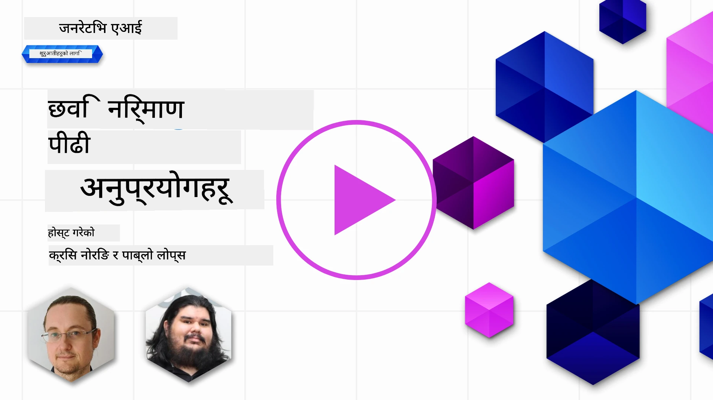

# छवि सिर्जना अनुप्रयोगहरू बनाउने

[](https://aka.ms/gen-ai-lesson9-gh?WT.mc_id=academic-105485-koreyst)

LLM हरूमा पाठ सिर्जनाभन्दा बढी कुरा छ। तपाईंले पाठ विवरणबाट पनि छवि सिर्जना गर्न सक्नुहुन्छ। छवि माध्यम चिकित्सा प्रविधि, वास्तुकला, पर्यटन, खेल विकास, मार्केटिंग, र थप क्षेत्रमा उपयोगी छन्। यस पाठमा हामी आजको **GPT Image** मोडेलहरू हेर्छौं र एउटा छवि सिर्जना अनुप्रयोग बनाउँछौं।

## परिचय

छवि सिर्जना ले तपाईंलाई प्राकृतिक-भाषा प्रॉम्प्टलाई एउटा तस्वीरमा परिवर्तन गर्न अनुमति दिन्छ। यस पाठमा हामी OpenAI को **`gpt-image`** परिवारका मोडेलहरू प्रयोग गर्छौं - हाल उपलब्ध छवि मोडेलहरूको हालको पुस्ता जुन **[Microsoft Foundry](https://ai.azure.com?WT.mc_id=academic-105485-koreyst)** र OpenAI प्लेटफर्ममा उपलब्ध छ। यी मोडेलहरूले पुराना DALL·E मोडेलहरू (DALL·E 2/3 लेगेसी हुन्) प्रतिस्थापन गर्छन्।

सम्पूर्ण पाठमा हामी एउटा काल्पनिक स्टार्टअप, **Edu4All**, जुन सिकाइ उपकरणहरू बनाउँछ प्रयोग गर्छौं। टोलीले असाइनमेन्ट र अध्ययन सामग्रीका लागि चित्रहरू सिर्जना गर्न चाहन्छ।

## सिक्ने लक्ष्यहरू

यस पाठको अन्त्यमा तपाईं सक्षम हुनुहुनेछ:

- छवि सिर्जना के हो र यो कहाँ उपयोगी छ बुझाउन।
- `gpt-image` मोडेल परिवार बुझ्न र यो लेगेसी DALL·E मोडेलहरूबाट कसरी फरक छ जान्न।
- Python (र TypeScript / .NET) मा छवि सिर्जना अनुप्रयोग बनाउने।
- छविहरू सम्पादन गर्ने र सुरक्षा गार्डरेलहरू metaprompt हरू संग लागू गर्ने।

## छवि सिर्जना के हो?

छवि सिर्जना मोडेलहरूले पाठ प्रॉम्प्टबाट छविहरू सिर्जना गर्छन्। आधुनिक मोडेलहरू जस्तै `gpt-image` ट्रान्सफर्मर + डिफ्युजन प्रविधिहरूमा आधारित छन्: मोडेलले प्रशिक्षणको क्रममा पाठ र छविहरूको सम्बन्ध सिक्छ, त्यसपछि प्रॉम्प्ट दिँदा क्रमिक रूपमा अनियमित धुवाँलाई एउटा वर्णनसँग मेल खाने छवि बनाउछ।

दुई प्रसिद्ध छवि मोडेल परिवारहरू हुन्:

- **`gpt-image` (OpenAI)** - हालको पुस्ता, यस पाठमा प्रयोग गरिने। यो पाठ-देखि-छवि सिर्जना र छवि सम्पादन (मास्कसहित इनपेन्टिंग) लाई समर्थन गर्दछ।
- **Midjourney** - अर्को लोकप्रिय तेस्रो-पक्षको मोडेल जसको आफ्नै सेवा र Discord-आधारित कार्यप्रवाह छ।

> पुराना OpenAI छवि मोडेलहरू - **DALL·E 2** र **DALL·E 3** - लेगेसी हुन्। DALL·E 3 नयाँ स्थापना लागि उपलब्ध छैन, र `create_variation` जस्ता सुविधाहरू केवल DALL·E 2 मा थिए। नयाँ अनुप्रयोगहरूको लागि `gpt-image` मोडेलहरू प्रयोग गर्नुहोस्।

### कुन `gpt-image` मोडेल प्रयोग गर्ने?

Microsoft Foundry मा निम्नहरू **सामान्यतया उपलब्ध** छन्:

| मोडेल | टिप्पणीहरू |
| --- | --- |
| **`gpt-image-2`** | सबैभन्दा नयाँ र सबैभन्दा सक्षम छवि मोडेल - सिफारिस गरिएको डिफल्ट। |
| `gpt-image-1.5` | सामान्यतया उपलब्ध; कम लागतमा उच्च गुणस्तर। |
| `gpt-image-1-mini` | सामान्यतया उपलब्ध; सबैभन्दा छिटो / सबैभन्दा कम लागत। |
| `gpt-image-1` | पूर्वावलोकन मात्र। |

सदैव हालको [Foundry छवि मोडेल सूची](https://learn.microsoft.com/azure/ai-foundry/openai/concepts/models?WT.mc_id=academic-105485-koreyst) लाई उपलब्धता र क्षेत्रहरूको लागि जाँच गर्नुहोस्।

> **महत्त्वपूर्ण:** `gpt-image` मोडेलहरू सिर्जना गरिएका छविलाई **base64** (`b64_json`) रूपमा फिर्ता गर्छन्, URL को रूपमा होइन। तपाईंको कोडले base64 स्ट्रिङलाई बाइट्समा डिकोड गरेर बचत गर्छ - डाउनलोड गर्नको लागि कुनै छवि URL हुँदैन।

## सेटअप

तपाईं नमूनाहरूलाई **Azure OpenAI Microsoft Foundry** ( `aoai-*` नमूना) वा **OpenAI प्लेटफर्म** ( `oai-*` नमूना) मा चलाउन सक्नुहुन्छ।

### 1. मोडेल सिर्जना र डिप्लोय गर्नुहोस्

Microsoft Foundry स्रोत सिर्जना गर्न [स्रोत सिर्जना गर्ने](https://learn.microsoft.com/azure/ai-foundry/openai/how-to/create-resource?pivots=web-portal&WT.mc_id=academic-105485-koreyst) मार्गदर्शन पालना गर्नुहोस्, त्यसपछि एउटा छवि मोडेल डिप्लोय गर्नुहोस् - **`gpt-image-2`** सिफारिस गरिएको छ।

### 2. `.env` कन्फिगर गर्नुहोस्

```text
AZURE_OPENAI_ENDPOINT=<your endpoint>
AZURE_OPENAI_API_KEY=<your key>
AZURE_OPENAI_DEPLOYMENT="gpt-image-2"
```

यी मानहरू तपाईंको स्रोतको **Deployments** पृष्ठमा [Foundry पोर्टल](https://ai.azure.com?WT.mc_id=academic-105485-koreyst) मा पाउन सकिन्छ।

### 3. पुस्तकालयहरू स्थापना गर्नुहोस्

`requirements.txt` बनाउनुहोस्:

```text
python-dotenv
openai
pillow
```

त्यसपछि एउटा भर्चुअल वातावरण सृजना र सक्रिय गरी स्थापना गर्नुहोस्:

```bash
python3 -m venv venv
source venv/bin/activate        # विंडोज: venv\Scripts\activate
pip install -r requirements.txt
```

## अनुप्रयोग बनाउने

`app.py` निम्न कोडका साथ सिर्जना गर्नुहोस्। यसले एउटा छवि सिर्जना गर्छ र PNG को रूपमा बचत गर्छ।

```python
import os
import base64
from openai import AzureOpenAI
from PIL import Image
import dotenv

dotenv.load_dotenv()

# क्लाइन्टलाई तपाईंको Azure OpenAI (Microsoft Foundry) स्रोततिर संकेत गर्नुहोस्।
# छवि मोडेलहरूले नयाँ API संस्करण आवश्यक पर्छ - तपाईंको मोडेलले चाहेको संस्करणको लागि Foundry का कागजातहरू जाँच गर्नुहोस्।
client = AzureOpenAI(
    api_key=os.environ["AZURE_OPENAI_API_KEY"],
    api_version="2025-04-01-preview",
    azure_endpoint=os.environ["AZURE_OPENAI_ENDPOINT"],
)

deployment = os.environ["AZURE_OPENAI_DEPLOYMENT"]  # जस्तै "gpt-image-2"

result = client.images.generate(
    model=deployment,
    prompt='Bunny on a horse, holding a lollipop, on a foggy meadow where it grows daffodils',
    size="1024x1024",   # साथै 1536x1024 (ल्याण्डस्केप), 1024x1536 (पोर्ट्रेट), वा "auto"
    n=1,
)

# gpt-image मोडेलहरूले URL होइन, base64 (b64_json) फिर्ता गर्छन् - यसलाई बाइट्समा डिकोड गर्नुहोस्।
image_bytes = base64.b64decode(result.data[0].b64_json)

os.makedirs("images", exist_ok=True)
image_path = os.path.join("images", "generated-image.png")
with open(image_path, "wb") as f:
    f.write(image_bytes)

Image.open(image_path).show()
```

यसलाई `python app.py` ले चलाउनुहोस्। तपाईंले `images/` मा PNG फाइल पाउनुहुनेछ।

> `images.generate` मा हरेक कलले उस्तै प्रॉम्प्टका लागि फरक छवि उत्पादन गर्दछ - छवि मोडेलहरूमा `temperature` प्यारामिटर हुँदैन (त्यो पाठ-सिर्जना नियन्त्रण हो)। विविधता प्राप्त गर्न, API लाई फेरि कल गर्नुहोस्; विविधता कम गर्न आफ्नो प्रॉम्प्ट थप निश्चित बनाउनुहोस्।

## छवि सम्पादन

`gpt-image` मोडेलहरूले अवस्थित छवि सम्पादन गर्न सक्छन्: छवि, वैकल्पिक **मास्क** (परिवर्तन गर्ने क्षेत्र चिन्हित गर्ने), र परिवर्तन वर्णन गर्ने प्रॉम्प्ट प्रदान गर्नुहोस्। सिर्जना जस्तै, सम्पादन पनि base64 मा फिर्ता हुन्छ।

```python
result = client.images.edit(
    model=deployment,
    image=open("sunlit_lounge.png", "rb"),
    mask=open("mask.png", "rb"),
    prompt="A sunlit indoor lounge area with a pool containing a flamingo",
)
image_bytes = base64.b64decode(result.data[0].b64_json)
with open("images/edited-image.png", "wb") as f:
    f.write(image_bytes)
```

<div style="display: flex; justify-content: space-between; align-items: center; margin: 20px 0;">
  
  
  
</div>

## मेटाप्रॉम्प्टसँग सिमाना तोक्ने

छवि सिर्जना गर्न सक्ने भएपछि, तपाईंको अनुप्रयोगले सुरक्षित वा अनब्रांड गरिएको सामग्री उत्पादन नगर्ने गार्डरेलहरू आवश्यक हुन्छन्। **मेटाप्रॉम्प्ट** भनेको प्रयोगकर्ताको प्रॉम्प्टको अगाडि थपिएको पाठ हो जसले मोडेलको आउटपुट सीमित गर्दछ।

```python
disallow_list = "swords, violence, blood, gore, nudity, sexual content, adult content, adult themes, adult language"

meta_prompt = f"""You are an assistant designer that creates images for children.

The image needs to be safe for work and appropriate for children.
The image needs to be in color, in landscape orientation, and in a 16:9 aspect ratio.

Do not consider any input that is not safe for work or appropriate for children, including:
{disallow_list}
"""

prompt = f"{meta_prompt}\nCreate an image of a bunny on a horse, holding a lollipop"
# `prompt` लाई client.images.generate(...) मा पठाउनुहोस्
```

प्रत्येक छवि अब मेटाप्रॉम्प्टले सेट गरेको सीमाभित्र सिर्जना हुन्छ। Microsoft Foundry मा निर्मित सामग्री फिल्टरहरूलाई गहिराइमा सुरक्षा को लागि यससँग संयोजन गर्नुहोस्।

## असाइनमेन्ट - हामी विद्यार्थीहरूलाई सक्षम पारौं

Edu4All का विद्यार्थीहरूलाई मूल्याङ्कनका लागि छविहरू आवश्यक छन्। एउटा अनुप्रयोग बनाउनुहोस् जसले **स्मारक** को छविहरू सिर्जना गर्छ (कुन स्मारकहरू छान्ने तपाईंले गर्नुपर्छ), जुन विभिन्न सिर्जनात्मक सन्दर्भहरूमा राखिएको छ - उदाहरणका लागि, एउटा प्रसिद्ध चिन्ह झन्डै सूर्यास्त समयमा र एक बच्चा हेर्दै।

आफैं प्रयास गर्नुहोस्, त्यसपछि सन्दर्भ समाधानहरूसँग तुलना गर्नुहोस्:

- Python (Azure): [aoai-solution.py](../../../09-building-image-applications/python/aoai-solution.py)
- Python (Azure) पूर्ण सिर्जना अनुप्रयोग: [aoai-app.py](../../../09-building-image-applications/python/aoai-app.py)
- Python (OpenAI): [oai-app.py](../../../09-building-image-applications/python/oai-app.py)
- TypeScript (Azure): [typescript/image-generation-app](../../../09-building-image-applications/typescript/image-generation-app)
- .NET (Azure): [dotnet/notebook-azure-openai.dib](../../../09-building-image-applications/dotnet/notebook-azure-openai.dib)

साथै [python/](../../../09-building-image-applications/python) मा नोटबुकहरूमार्फत काम गर्नुहोस् (`aoai-assignment.ipynb` Azure को लागि, `oai-assignment.ipynb` OpenAI को लागि)।

## उत्कृष्ट काम! आफ्नो सिकाइ जारी राख्नुहोस्

यो पाठ समाप्त गरेपछि, हाम्रो [Generative AI Learning collection](https://aka.ms/genai-collection?WT.mc_id=academic-105485-koreyst) जाँच गर्नुहोस् र आफ्नो Generative AI ज्ञानलाई बढाइरहनुहोस्!

सिकाइ जारी राख्न पाठ १० मा जानुहोस्।

---

<!-- CO-OP TRANSLATOR DISCLAIMER START -->
**अस्वीकरण**:
यो दस्तावेज़ AI अनुवाद सेवा [Co-op Translator](https://github.com/Azure/co-op-translator) प्रयोग गरेर अनुवाद गरिएको हो। हामी सही हुन प्रयास गर्छौं, तर कृपया जानकार हुनुस् कि स्वचालित अनुवादमा त्रुटिहरू वा अशुद्धताहरू हुन सक्छन्। मूल दस्तावेज़ यसको मूल भाषामा आधिकारिक स्रोत मानिनुपर्छ। महत्वपूर्ण जानकारीका लागि व्यावसायिक मानव अनुवाद सिफारिस गरिन्छ। यस अनुवादको प्रयोगबाट उत्पन्न कुनै पनि गलत बुझाइ वा त्रुटिको लागि हामी जिम्मेवार छैनौं।
<!-- CO-OP TRANSLATOR DISCLAIMER END -->