# कम कोड AI अनुप्रयोगहरू निर्माण गर्नुहोस्

[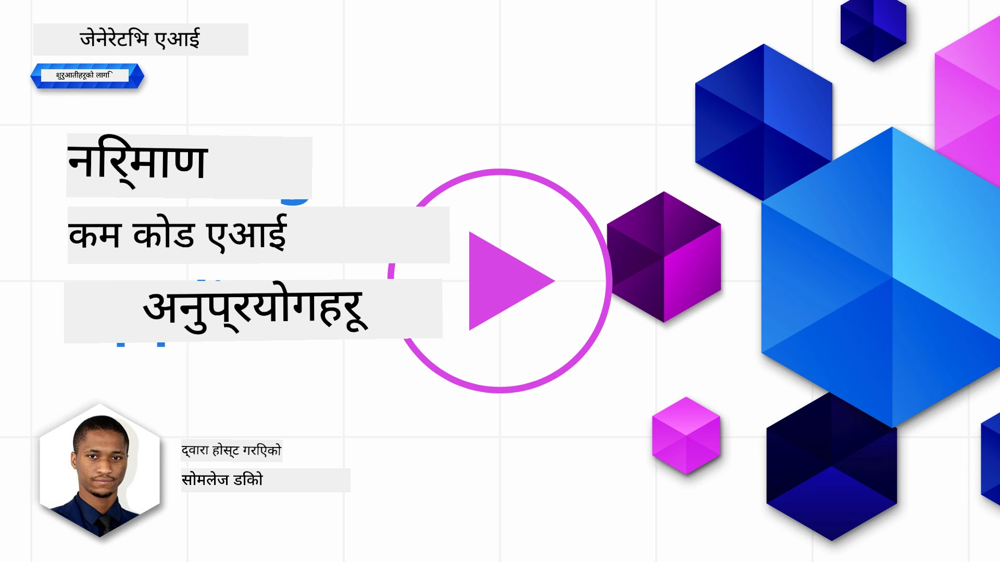](https://youtu.be/1vzq3Nd8GBA?si=h6LHWJXdmqf6mhDg)

> _(यो पाठको भिडियो हेर्न माथिको छवि क्लिक गर्नुहोस्)_

## परिचय

अहिले जब हामीले छवि निर्माण गर्ने अनुप्रयोगहरू कसरी बनाउने भनेर सिकिसकेका छौं, अब कम कोडबारे कुरा गरौं। जनरेटिभ AI विभिन्न क्षेत्रहरूमा प्रयोग गर्न सकिन्छ जसमा कम कोड पनि पर्दछ, तर कम कोड भनेको के हो र हामी यसमा कसरी AI थप्न सक्छौं?

परम्परागत विकासकर्ताहरू र गैर-विकासकर्ताहरूका लागि कम कोड विकास प्लेटफर्महरूको प्रयोगले अनुप्रयोग र समाधानहरू निर्माण गर्न सजिलो बनाएको छ। कम कोड विकास प्लेटफर्महरूले तपाईलाई थोरै वा कुनै पनि कोड बिना अनुप्रयोग र समाधानहरू निर्माण गर्न सक्षम पार्छन्। यो दृश्य विकास वातावरण मार्फत प्राप्त हुन्छ जसले कम्पोनेन्टहरू ड्र्याग र ड्रप गर्न सक्षम बनाउँछ। यसले अनुप्रयोग र समाधानहरू छिटो र कम स्रोतसाधनको साथ निर्माण गर्न सक्षम बनाउँछ। यस पाठमा, हामी कसरी कम कोड प्रयोग गर्ने र Power Platform प्रयोग गरेर AI सँग कम कोड विकास कसरी उन्नत गर्ने भनेर गहिराइमा जान्छौं।

Power Platform संस्थाहरूलाई उनीहरूको टोलीहरूलाई सहज कम-कोड वा नो-कोड वातावरण मार्फत आफ्नै समाधानहरू निर्माण गर्ने अवसर प्रदान गर्दछ। यो वातावरण समाधानहरू निर्माण गर्ने प्रक्रियालाई सरल बनाउँछ। Power Platform सँग समाधानहरू महिना वा वर्षहरूको सट्टा दिन वा हप्ता भित्र निर्माण गर्न सकिन्छ। Power Platform मा पाँच मुख्य उत्पादनहरू छन्: Power Apps, Power Automate, Power BI, Power Pages र Copilot Studio।

यस पाठमा समावेश छ:

- Power Platform मा जनरेटिभ AI को परिचय
- Copilot परिचय र यसलाई कसरी प्रयोग गर्ने
- Power Platform मा जनरेटिभ AI प्रयोग गरेर अनुप्रयोग र फ्लोहरू बनाउने
- AI Builder सँग Power Platform मा AI मोडेलहरू बुझ्ने
- Microsoft Copilot Studio सँग बौद्धिक एजेन्टहरू बनाउने

## सिकाइ लक्ष्यहरू

यस पाठको अन्त्यमा, तपाईं सक्षम हुनुहुनेछ:

- Power Platform मा Copilot कसरी काम गर्छ बुझ्नुहोस्।

- हाम्रो शिक्षा स्टार्टअपको लागि विद्यार्थी असाइनमेन्ट ट्र्याकर एप तयार पार्नुहोस्।

- भुक्तानी विवरण निकाल्न AI प्रयोग गर्ने इनभ्वाइस प्रोसेसिंग फ्लो बनाउनुहोस्।

- Create Text with GPT AI मोडेल प्रयोग गर्दा उत्तम अभ्यासहरू लागू गर्नुहोस्।

- Microsoft Copilot Studio के हो र यससँग कसरी बौद्धिक एजेन्टहरू बनाउने बुझ्नुहोस्।

यस पाठमा प्रयोग गरिने उपकरणहरू र प्रविधिहरू:

- **Power Apps**, विद्यार्थी असाइनमेन्ट ट्र्याक गर्न र डेटा व्यवस्थापन गर्न कम-कोड विकास वातावरण प्रदान गर्छ।

- **Dataverse**, विद्यार्थी असाइनमेन्ट ट्र्याकर एपको डेटा भण्डारणको लागि, जहाँ Dataverse कम-कोड डेटाप्लेटफर्मको रूपमा काम गर्छ।

- **Power Automate**, इनभ्वाइस प्रोसेसिंग फ्लोको लागि, जहाँ तपाईं कम-कोड विकास वातावरणमा कार्यप्रवाहहरू बनाउनुहुन्छ।

- **AI Builder**, इनभ्वाइस प्रोसेसिंग AI मोडेलको लागि, जहाँ तपाईं पूर्वनिर्मित AI मोडेलहरू प्रयोग गरेर इनभ्वाइसहरू प्रोसेस गर्नुहुन्छ।

## Power Platform मा जनरेटिभ AI

जनरेटिभ AI संग कम-कोड विकास र अनुप्रयोग उन्नत बनाउनु Power Platform को मुख्य केन्द्रविन्दु हो। उद्देश्य हो कि सबैलाई AI-संचालित अनुप्रयोगहरू, साइटहरू, ड्यासबोर्डहरू, र प्रक्रियाहरूलाई AI प्रयोग गरेर स्वचालित गर्न सक्षम बनाउनु _कुनै पनि डेटा विज्ञान विशेषज्ञता बिना।_ यो उद्देश्य Power Platform मा Copilot र AI Builder को रूपमा जनरेटिभ AI एकीकृत गरेर प्राप्त गरिन्छ।

### यो कसरी काम गर्छ?

Copilot एक AI सहायक हो जसले प्राकृतिक भाषामा संवादात्मक चरणहरू मार्फत तपाईंको आवश्यकताहरू वर्णन गरेर Power Platform समाधानहरू निर्माण गर्न सक्षम बनाउँछ। तपाईं आफ्नो AI सहायकलाई भने सक्नुहुन्छ कि एपले कुन फाँटका प्रयोग गर्ने र यसले एप र आधारभूत डेटा मोडेल दुबै बनाउँछ वा Power Automate मा फ्लो कसरी सेटअप गर्ने भनेर निर्दिष्ट गर्न सक्नुहुन्छ।

तपाईं आफ्नो एप स्क्रीनहरूमा Copilot सञ्चालित कार्यक्षमताहरू प्रयोग गर्न सक्नुहुन्छ जसले संवादात्मक अन्तरक्रियाहरू मार्फत प्रयोगकर्ताहरुलाई अन्तर्दृष्टि खोज्न सक्षम बनाउँछ।

AI Builder Power Platform मा उपलब्ध एक कम-कोड AI क्षमता हो जसले तपाईंलाई AI मोडेलहरू प्रयोग गरी प्रक्रियाहरू स्वचालित गर्न र परिणाम भविष्यवाणी गर्न मद्दत गर्दछ। AI Builder सँग तपाईं Dataverse वा क्लाउड डेटा स्रोतहरू जस्तै SharePoint, OneDrive वा Azure मा जडित तपाईंको डेटा भएका अनुप्रयोग र फ्लोहरूमा AI ल्याउन सक्नुहुन्छ।

Copilot सबै Power Platform उत्पादनहरूमा उपलब्ध छ: Power Apps, Power Automate, Power BI, Power Pages र Copilot Studio (पहिले Power Virtual Agents)। AI Builder Power Apps र Power Automate मा उपलब्ध छ। यस पाठमा हामी Copilot र AI Builder लाई Power Apps र Power Automate मा प्रयोग गरी हाम्रो शिक्षा स्टार्टअपको लागि समाधान कसरी बनाउनेमा केन्द्रित हुनेछौं।

### Power Apps मा Copilot

Power Platform को हिस्सा स्वरूप Power Apps ले डेटा ट्र्याक गर्न, व्यवस्थापन गर्न र अन्तरक्रिया गर्ने अनुप्रयोगहरू बनाउन कम-कोड विकास वातावरण प्रदान गर्दछ। यो एक एप विकास सेवाहरूको सेट हो जसमा मापनयोग्य डेटा प्लेटफर्म र क्लाउड सेवाहरू तथा ऑन-प्रिमाइसिस डेटा जडान गर्ने क्षमता हुन्छ। Power Apps ले तपाइँगो ब्राउजर, ट्याब्लेट, फोनमा चल्ने एपहरू बनाउन अनुमति दिन्छ, र सहकर्मीसँग साझा गर्न सकिन्छ। Power Apps प्रयोगमा सजिलो इन्टरफेसले प्रत्येक व्यवसाय प्रयोगकर्ता वा प्रो डेवलपरलाई अनुकूलित एपहरू बनाउन मद्दत गर्दछ। जनरेटिभ AI मार्फत Copilot ले एप विकास अनुभव थप प्रबृद्ध बनाउँछ।

Power Apps मा Copilot AI सहायक सुविधाले तपाईंलाई एपको प्रकार र तपाईंले ट्र्याक, सङ्कलन, वा देखाउन चाहनुभएको जानकारी वर्णन गर्न सक्षम पार्छ। Copilot तपाईंको वर्णन आधारमा प्रतिक्रिया दिने Canvas एप उत्पादन गर्छ। तपाईं त्यसपछि आफ्नो आवश्यकताअनुसार एप अनुकूलित गर्न सक्नुहुन्छ। AI Copilot ले डेटावर्स तालिका पनि निर्माण र सुझाव दिन्छ जसमा तपाईंले ट्र्याक गर्न चाहनुभएको डाटा भण्डारण गर्न आवश्यक फिल्डहरू र केही नमूना डेटा हुन्छ। हामी यस पाठमा पछि Dataverse के हो र Power Apps मा यसलाई कसरी प्रयोग गर्ने भनेर हेर्नेछौं। तपाईं एआई Copilot सहायक सुविधामार्फत संवादात्मक चरणहरू प्रयोग गरेर तालिकालाई अनुकूलित गर्न सक्नुहुन्छ। यो सुविधा Power Apps होम स्क्रिनमाथि सजिलै उपलब्ध छ।

### Power Automate मा Copilot

Power Platform को हिस्सा स्वरूप Power Automate प्रयोगकर्ताहरूलाई अनुप्रयोग र सेवाहरू बीच स्वचालित कार्यप्रवाहहरू बनाउन अनुमति दिन्छ। यसले संचार, डेटा सङ्कलन, र निर्णय अनुमोदनहरू जस्ता दोहोरिने व्यापार प्रक्रियाहरूलाई स्वचालित गर्न मद्दत गर्दछ। यसको सजिलो इन्टरफेसले प्राविधिक योग्यता जे भए पनि (शुरुवातकर्तादेखि अनुभवी विकासकर्तासम्म) कामका कार्यहरू स्वचालित गर्न सक्षम बनाउँछ। जनरेटिभ AI मार्फत Copilot सँग कार्यप्रवाह विकास अनुभव पनि प्रबृद्ध गरिएको छ।

Power Automate मा Copilot AI सहायक सुविधाले तपाईंलाई कुन प्रकारको फ्लो चाहिन्छ र तपाईंको फ्लोले के क्रियाहरू प्रदर्शन गर्ने भनेर वर्णन गर्न सक्षम बनाउँछ। Copilot तपाईंको वर्णन आधारमा फ्लो उत्पादन गर्छ। तपाईं यसको अनुकूलन गर्न सक्नुहुन्छ। AI Copilot ले आवश्यक क्रियाहरू पनि उत्पादन र सुझाव दिन्छ जुन तपाईंलाई कार्य स्वचालनमा मद्दत पुर्‍याउँछ। हामी यस पाठमा पछि फ्लोहरू के हुन् र Power Automate मा तिनीहरूलाई कसरी प्रयोग गर्ने भनेर हेर्नेछौं। तपाईं AI Copilot सहायक सुविधामार्फत संवादात्मक चरणहरू प्रयोग गरेर क्रियाहरूलाई अनुकूलित गर्न सक्नुहुन्छ। यो सुविधा Power Automate होम स्क्रिनबाट सजिलै उपलब्ध छ।

## Microsoft Copilot Studio सँग बौद्धिक एजेन्टहरू निर्माण

[Microsoft Copilot Studio](https://learn.microsoft.com/microsoft-copilot-studio/fundamentals-what-is-copilot-studio?WT.mc_id=academic-105485-koreyst) (पहिले Power Virtual Agents) Power Platform को कम-कोड सदस्य हो जसले **AI एजेन्टहरू** बनाउँछ — संवादात्मक सहायकहरू जसले प्रश्नहरूको जवाफ दिन, क्रियाहरू लिन, र तपाईंका प्रयोगकर्ताहरूको तर्फबाट कार्यहरू स्वचालित गर्न सक्छन्। Power Platform जस्तै, तपाईं यी एजेन्टहरू दृश्यात्मक, प्राकृतिक-भाषा-प्राथमिक अनुभवमा बनाउनुहुन्छ: तपाईं एजेन्टलाई के गर्न चाहनुहुन्छ वर्णन गर्नुहुन्छ, र Copilot Studio यसका निर्देशनहरू, ज्ञान, र क्रियाहरूको खाका मद्दत गर्दछ।

हाम्रो शिक्षा स्टार्टअपको लागि, तपाईं यस्तो एजेन्ट बनाउन सक्नुहुन्छ जसले विद्यार्थीका कोर्स सम्बन्धी प्रश्नहरूको जवाफ दिन्छ, असाइनमेन्ट म्यादहरू जाँच्छ, र प्रशिक्षकलाई इमेल पठाउँछ — सबै बिना कोड लेख्न।

यहाँ Copilot Studio लाई शक्तिशाली बनाउने केही नयाँ क्षमताहरू छन्:

- **तपाईंको ज्ञानबाट जनरेटिभ उत्तरहरू**। प्रत्येक संवाद हस्तलेखनको सट्टा, तपाईं **ज्ञान स्रोतहरू** जडान गर्न सक्नुहुन्छ — सार्वजनिक वेबसाइटहरू, SharePoint, OneDrive, Dataverse, अपलोड गरिएका फाइलहरू, वा एंटरप्राइज डेटा कननेक्टरहरूमार्फत — र एजेन्ट तिनीहरूबाट आधारभूत उत्तरहरू उत्पादन गर्छ।

- **जनरेटिभ समन्वय**। कडा ट्रिगर वाक्यांशमा निर्भर नहुनु, एजेन्टले अनुरोध बुझ्न AI प्रयोग गर्दछ र कुन ज्ञान, विषयवस्तुहरू, र क्रियाहरू संयोजन गर्ने निर्णय गर्छ, धेरै चरणहरू एकसाथ लिंक गर्नसक्छ।

- **क्रियाहरू र कननेक्टरहरू**। एजेन्टहरूले केवल कुराकानी मात्र होइन, *केही गर्न* सक्छन्। तपाईं एजेन्टलाई 1,500+ पूर्वनिर्मित Power Platform कननेक्टरहरू, Power Automate फ्लोहरू, कस्टम REST API, प्रॉम्प्टहरू, वा **Model Context Protocol (MCP)** सर्भरहरू द्वारा समर्थन प्राप्त क्रियाहरू प्रदान गर्न सक्नुहुन्छ।

- **स्वायत्त एजेन्टहरू**। एजेन्टहरू केवल च्याट विन्डोमा उत्तर दिन सीमित छैनन्। तपाईं **स्वायत्त एजेन्टहरू** बनाउन सक्नुहुन्छ जो घटनाहरूले ट्रिगर हुन्छन् — जस्तै नयाँ इमेल, Dataverse मा नयाँ रेकर्ड, वा कुनै फाइल अपलोड हुनु — र पृष्ठभूमिमा कार्य पूरा गर्न काम गर्छन्।

- **बहु-एजेन्ट समन्वय**। एजेन्टहरूले अन्य एजेन्टहरूलाई कल गर्न सक्छन्। Copilot Studio एजेन्ट अन्य एजेन्टहरूलाई हस्तान्तरण गर्न वा थप मार्फत विस्तार हुन सक्छ, जसमा Microsoft 365 Copilot मा प्रकाशित एजेन्टहरू र Microsoft Foundry मा बनाइएका एजेन्टहरू समावेश छन्।

- **मोडेल छनोट**। पूर्वनिर्मित मोडेलहरू बाहेक, तपाईं आफ्नो एजेन्टको तर्क र प्रतिक्रियाका लागि Microsoft Foundry मोडेल क्याटलगबाट मोडेलहरू ल्याउन सक्नुहुन्छ।

- **कुनै पनि ठाउँमा प्रकाशन**। निर्माणपछि, एजेन्ट विभिन्न च्यानलहरूमा प्रकाशित गर्न सकिन्छ — Microsoft Teams, Microsoft 365 Copilot, वेबसाइट वा कस्टम एप, र थप — सुरक्षा, प्रमाणीकरण, र विश्लेषण Power Platform प्रशासक अनुभव मार्फत व्यवस्थापन हुन्छ।

तपाईं [copilotstudio.microsoft.com](https://copilotstudio.microsoft.com?WT.mc_id=academic-105485-koreyst) मा पहिलो एजेन्ट निर्माण थालनी गर्न सक्नुहुन्छ र [Microsoft Copilot Studio कागजात](https://learn.microsoft.com/microsoft-copilot-studio/?WT.mc_id=academic-105485-koreyst) मा थप जान्न सक्नुहुन्छ।

## असाइनमेन्ट: स्टार्टअपको लागि विद्यार्थी असाइनमेन्ट र इनभ्वाइसहरू व्यवस्थापन गर्नुहोस्, Copilot प्रयोग गरी

हाम्रो स्टार्टअपले अनलाइन कोर्सहरू विद्यार्थीहरूलाई प्रदान गर्छ। स्टार्टअप छिटो बढिरहेको छ र अब कोर्सहरूको मागसँग प्रतिस्पर्धा गर्न संघर्ष गरिरहेको छ। स्टार्टअपले तपाईंलाई Power Platform विकासकर्ताको रूपमा भाडामा लिएको छ ताकि उनीहरूलाई कम कोड समाधान निर्माण गर्न मद्दत गरोस् जसले विद्यार्थी असाइनमेन्ट र इनभ्वाइसहरू व्यवस्थापन गर्न सकून्। उनीहरूको समाधानले एपमार्फत विद्यार्थी असाइनमेन्टलाई ट्र्याक र व्यवस्थापन गर्न र कार्यप्रवाहमार्फत इनभ्वाइस प्रोसेसिंग प्रक्रिया स्वचालित बनाउन सक्षम हुनु पर्छ। तपाईंलाई जनरेटिभ AI प्रयोग गरेर समाधान विकास गर्न भनिएको छ।

Copilot प्रयोग सुरु गर्दा, तपाईं [Power Platform Copilot Prompt Library](https://github.com/pnp/powerplatform-prompts?WT.mc_id=academic-109639-somelezediko) मा उपलब्ध प्रॉम्प्टहरूबाट सुरुवात गर्न सक्नुहुन्छ। यो पुस्तकालयमा Copilot सँग एप र फ्लो निर्माण गर्न सकिने प्रॉम्प्टहरूको सूची छ। तपाईं प्रॉम्प्टहरू प्रयोग गरी आफ्ना आवश्यकताहरू Copilot लाई कसरी वर्णन गर्ने बारे पनि जान्न सक्नुहुन्छ।

### हाम्रो स्टार्टअपको लागि विद्यार्थी असाइनमेन्ट ट्राकर एप निर्माण गर्नुहोस्

हाम्रो स्टार्टअपका शिक्षकहरू विद्यार्थी असाइनमेन्टहरू ट्र्याक गर्न संघर्ष गर्दैछन्। उनीहरूले स्प्रेडशीट प्रयोग गरिरहेका थिए तर विद्यार्थीहरूको संख्या बढेसँगै व्यवस्थित गर्न गाह्रो भएको छ। उनीहरूले तपाईंलाई यस्तो एप बनाउन भनेका छन् जसले विद्यार्थी असाइनमेन्टहरू ट्र्याक र व्यवस्थापन गर्न मद्दत गर्दछ। एपले नयाँ असाइनमेन्ट थप्ने, हेर्ने, अपडेट गर्ने र मेटाउने सुविधा दिनुपर्नेछ। शिक्षक र विद्यार्थीहरूलाई ग्रेड भएका र नगरेका असाइनमेन्टहरू हेर्न पनि सक्षम हुनुपर्छ।

तपाईं यो एप Power Apps मा Copilot प्रयोग गरी तलका चरणहरू पालना गरेर निर्माण गर्नुहुनेछ:

1. [Power Apps](https://make.powerapps.com?WT.mc_id=academic-105485-koreyst) होम स्क्रिनमा जानुहोस्।

1. होम स्क्रिनमा रहेको टेक्स्ट क्षेत्र प्रयोग गरेर तपाईं निर्माण गर्न चाहेको एप वर्णन गर्नुहोस्। उदाहरणको लागि, **_म विद्यार्थी असाइनमेन्ट ट्र्याक र व्यवस्थापन गर्ने एप बनाउन चाहन्छु_**। प्रॉम्प्ट AI Copilot लाई पठाउन **Send** बटन क्लिक गर्नुहोस्।

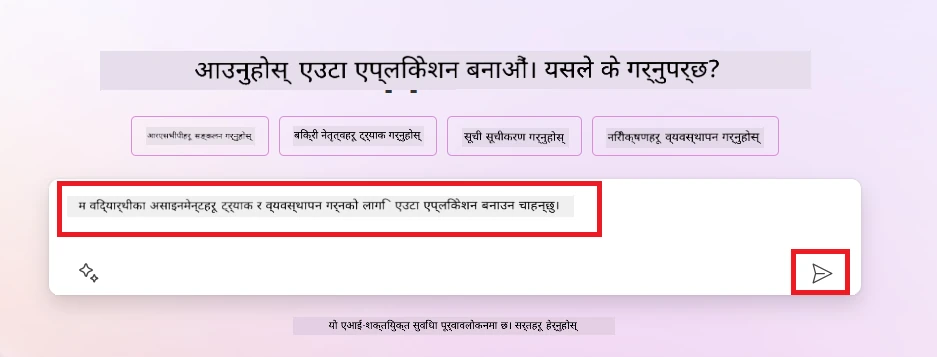

1. AI Copilotले डाटावर्स तालिका सुझाव दिनेछ जसमा तपाईलाई ट्र्याक गर्न चाहिएको डाटा भण्डारण गर्न आवश्यक फिल्डहरू र केही नमूना डाटा हुन्छ। तपाईं तब संवादात्मक चरणहरू मार्फत एआई Copilot सहायक सुविधाको प्रयोग गरेर तालिका अनुकूलित गर्न सक्नुहुन्छ।

   > **महत्त्वपूर्ण**: Dataverse Power Platform को आधारभूत डेटा प्लेटफर्म हो। यो एपको डेटा भण्डारण गर्नको लागि कम-कोड डेटा प्लेटफर्म हो। यो पूर्णरूपले व्यवस्थापित सेवा हो जुन माइक्रोसफ्ट क्लाउडमा सुरक्षित रूपमा डाटा भण्डारण गर्छ र Power Platform वातावरण भित्र प्रोभिजन गरिएको हुन्छ। यसमा डेटा वर्गीकरण, डेटा वंशावली, सूक्ष्म पहुँच नियन्त्रण लगायत निर्मित डेटा शासन क्षमताहरू छन्। Dataverse को बारेमा अधिक जान्न [यहाँ](https://learn.microsoft.com/power-apps/maker/data-platform/data-platform-intro?WT.mc_id=academic-109639-somelezediko) हेर्नुहोस्।

   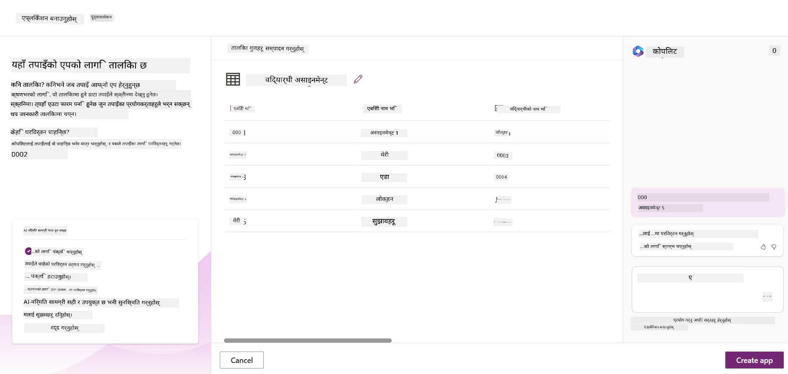

1. शिक्षकहरूले असाइनमेन्ट बुझाएका विद्यार्थीहरूलाई तिनीहरूको प्रगतिको बारेमा अपडेट राख्न इमेल पठाउन चाहन्छन्। तपाईं Copilot प्रयोग गरेर तालिकामा विद्यार्थी इमेल भण्डारण गर्न नयाँ फिल्ड थप्न सक्नुहुन्छ। उदाहरणका लागि, तपाईं यो प्रॉम्प्ट प्रयोग गर्न सक्नुहुन्छ: **_म विद्यार्थी इमेल भण्डारण गर्न कॉलम थप्न चाहन्छु_**। प्रॉम्प्ट AI Copilot लाई पठाउन **Send** बटन क्लिक गर्नुहोस्।

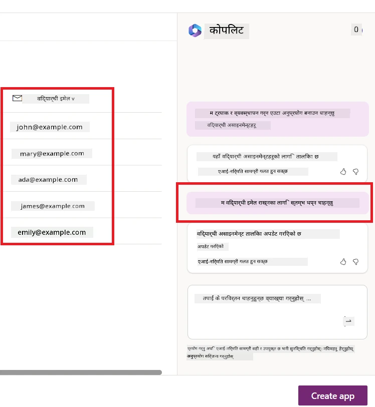

1. AI Copilot ले नयाँ फिल्ड सिर्जना गर्नेछ र तपाईं यसलाई आफ्नो आवश्यकताअनुसार अनुकूलित गर्न सक्नुहुन्छ।

1. तालिका तयार भएपछि, एप्लिकेशन बनाउनको लागि **Create app** बटनमा क्लिक गर्नुहोस्।

1. AI Copilot तपाईँको विवरण अनुसार उत्तरदायी क्यानभास एप्लिकेशन सिर्जना गर्नेछ। त्यसपछि तपाईँले आफ्नो आवश्यकताअनुसार एप्लिकेशनलाई अनुकूलन गर्न सक्नुहुन्छ।

1. शिक्षकहरूले विद्यार्थीहरुलाई इमेल पठाउनको लागि, तपाईँले एपमा नयाँ स्क्रिन थप्न Copilot प्रयोग गर्न सक्नुहुन्छ। उदाहरणका लागि, एपमा नयाँ स्क्रिन थप्न तपाईँ निम्न संकेत प्रयोग गर्न सक्नुहुन्छ: **_म विद्यार्थीहरुलाई इमेल पठाउन स्क्रिन थप्न चाहन्छु_**। AI Copilot लाई संकेत पठाउन **Send** बटनमा क्लिक गर्नुहोस्।

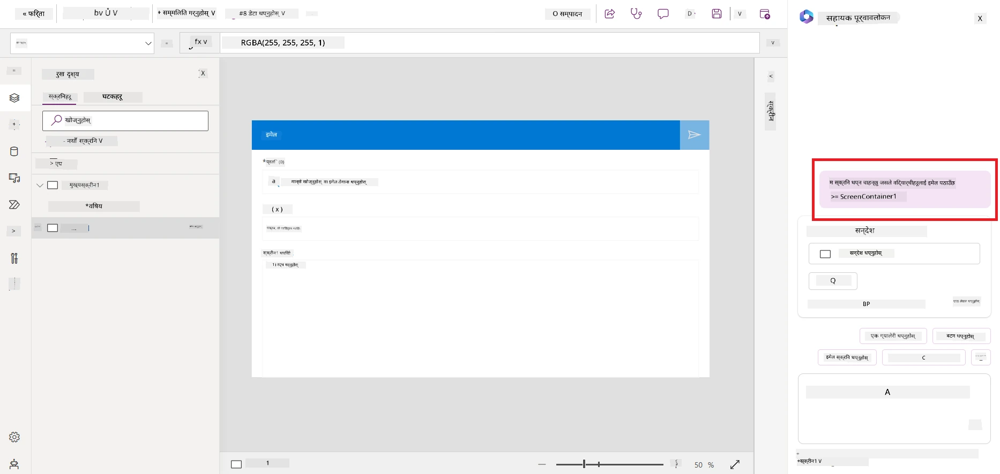

1. AI Copilot एउटा नयाँ स्क्रिन सिर्जना गर्नेछ र तपाईँले त्यसलाई आफ्नो आवश्यकताअनुसार अनुकूलन गर्न सक्नुहुन्छ।

1. एप सकिदा, एप सुरक्षित गर्न **Save** बटनमा क्लिक गर्नुहोस्।

1. शिक्षकहरूसँग एप साझा गर्न, **Share** बटनमा क्लिक गर्नुहोस् र फेरि **Share** मा क्लिक गर्नुहोस्। त्यसपछि शिक्षकहरूको इमेल ठेगाना राखेर एप साझा गर्न सक्नुहुन्छ।

> **तपाईँको गृहकार्य**: तपाईँले निर्माण गरेको एप राम्रो शुरुवात हो तर अझ सुधार गर्न सकिन्छ। इमेल फिचरले शिक्षकहरूलाई विद्यार्थीलाई इमेल म्यानुअली टाइप गरेर मात्र पठाउन दिन्छ। के तपाईँ Copilot प्रयोग गरेर यस्तो स्वतःकरण निर्माण गर्न सक्नुहुन्छ जसले शिक्षकहरूलाई विद्यार्थीहरूले आफ्नो असाइनमेन्ट बुझाएपछि स्वचालित रूपमा इमेल पठाउन सहयोग गर्नेछ? संकेत—सही संकेत प्रयोग गरेर तपाईँ Power Automate मा Copilot प्रयोग गर्न सक्नुहुन्छ।

### हाम्रो स्टार्टअपका लागि इनभ्वाइस जानकारी तालिका निर्माण गर्नुहोस्

हाम्रो स्टार्टअपको वित्त टोलीले इनभ्वाइसहरूको ट्र्याक राख्न संघर्ष गरिरहेको छ। उनीहरूले इनभ्वाइसहरू ट्र्याक गर्न स्प्रेडशीट प्रयोग गरिरहेका छन् तर इनभ्वाइसहरूको संख्या बढेसँगै यो सम्झना गाह्रो भएको छ। उनीहरूले तपाईँलाई एउटा तालिका निर्माण गर्न भनेका छन् जसले प्राप्त इनभ्वाइसहरूको जानकारी स्टोर, ट्र्याक र व्यवस्थापन गर्न मद्दत गर्नेछ। तालिका स्वचालित तरिकाले सबै इनभ्वाइस जानकारी निकाल्न र भण्डारण गर्न प्रयोग गर्नुपर्छ। यस तालिकाले वित्त टोलीलाई भुक्तान भएका र नभएका इनभ्वाइसहरू पनि हेर्न सक्षम बनाउनु पर्छ।

Power Platform मा Dataverse नामको एउटा डेटा प्लेटफर्म छ जसले तपाईँका एपहरू र समाधानहरूको लागि डेटा भण्डारण गर्दछ। Dataverse ले एपको डेटा भण्डारण गर्न एक कम-कोड डेटा प्लेटफर्म प्रदान गर्दछ। यो माइक्रोसफ्ट क्लाउडमा सुरक्षीत रूपमा डेटा भण्डारण गर्ने पूर्ण रूपमा व्यवस्थापित सेवा हो र तपाईँको Power Platform वातावरणमा सिर्जना गरिएको हुन्छ। यसले डेटा वर्गीकरण, डेटा लाइनिएज, सूक्ष्म पहुँच नियन्त्रणजस्ता डेटा शासन क्षमताहरू प्रदान गर्दछ। तपाईँले थप जान्न सक्नुहुन्छ [Dataverse सम्बन्धमा यहाँ](https://learn.microsoft.com/power-apps/maker/data-platform/data-platform-intro?WT.mc_id=academic-109639-somelezediko)।

हाम्रो स्टार्टअपका लागि Dataverse किन प्रयोग गर्ने? Dataverse भित्रका स्ट्यान्डर्ड र कस्टम तालिकाहरू तपाईँको डेटा सुरक्षित र क्लाउडमा भण्डारण गर्नका लागि सुविधा दिन्छन्। तालिकाहरूले तपाईँलाई विभिन्न प्रकारका डेटा भण्डारण गर्न अनुमति दिन्छ, जस्तै एकै Excel वर्कबुकमा धेरै worksheet हरू हुन्छन्। तपाईँ आफ्नै संगठन वा व्यावसायिक आवश्यकताअनुसार डेटा भण्डारण गर्न तालिकाहरू प्रयोग गर्न सक्नुहुन्छ। Dataverse प्रयोग गर्दा हाम्रो स्टार्टअपले पाउने केहि फाइदाहरू यस्तै छन्:

- **सजिलै व्यवस्थापन गर्न सकिने**: मेटाडेटा र डेटा दुवै क्लाउडमा भण्डारण हुन्छ, त्यसैले आफ्ना भण्डारण वा व्यवस्थापनका विवरणमा चिन्ता लिनु पर्दैन। तपाईँ आफ्नो एप र समाधानहरू निर्माणमा ध्यान दिन सक्नुहुन्छ।

- **सुरक्षित**: Dataverse ले तपाईँको डेटा सुरक्षित र क्लाउडमा भण्डारण गरिन्छ। तपाईँ तालिकाका डेटामा कसले र कसरी पहुँच पाउने भनेर भूमिका आधारित सुरक्षा प्रयोग गरेर नियन्त्रण गर्न सक्नुहुन्छ।

- **धनी मेटाडेटा**: डेटा प्रकारहरू र सम्बन्धहरू Power Apps भित्र सिधै प्रयोग गरिन्छन्।

- **तर्क र प्रमाणीकरण**: व्यावसायिक नियम, गणनात्मक क्षेत्रहरू र प्रमाणीकरण नियमहरू प्रयोग गरेर व्यापार तर्क लागू गर्न र डेटा शुद्धता कायम गर्न सकिन्छ।

अब तपाईँलाई Dataverse के हो र किन प्रयोग गर्ने थाहा भए पछि, हेर्नुहोस् कसरी Copilot प्रयोग गरेर हाम्रो वित्त टोलीको आवश्यकताहरू पूरा गर्न Dataverse मा तालिका सिर्जना गर्ने।

> **सूचना**: अर्को खण्डमा तपाईँले यो तालिका प्रयोग गरेर सबै इनभ्वाइस जानकारी निकाल्ने र तालिकामा भण्डारण गर्ने स्वचालित प्रक्रिया निर्माण गर्नु हुनेछ।

Copilot प्रयोग गरेर Dataverse मा तालिका सिर्जना गर्न, तलका चरणहरू पालना गर्नुहोस्:

1. [Power Apps](https://make.powerapps.com?WT.mc_id=academic-105485-koreyst) होम स्क्रिनमा जानुहोस्।

2. बाँया नेभिगेसन बारमा **Tables** छान्नुहोस् र त्यसपछि **Describe the new Table** मा क्लिक गर्नुहोस्।

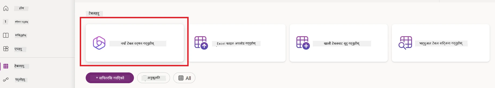

1. **Describe the new Table** स्क्रिनमा, तपाईँले सिर्जना गर्न चाहेको तालिकालाई वर्णन गर्न टेक्स्ट क्षेत्रमा लेख्नुहोस्। उदाहरणका लागि, **_म इनभ्वाइस जानकारी भण्डारण गर्न तालिका बनाउन चाहन्छु_**। AI Copilot लाई संकेत पठाउन **Send** बटनमा क्लिक गर्नुहोस्।

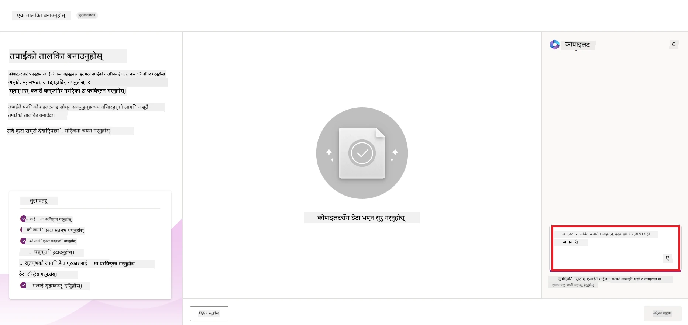

1. AI Copilot ले तपाईँले ट्र्याक गर्न चाहनुभएको डेटा भण्डारणका लागि आवश्यक क्षेत्रहरू सहित Dataverse तालिका सुझाव दिनेछ र केही नमुना डेटा देखाउनेछ। त्यसपछि तपाईँले AI Copilot सहायक सुविधाबाट संवादात्मक चरणहरूमा तालिका अनुकूलन गर्न सक्नुहुन्छ।

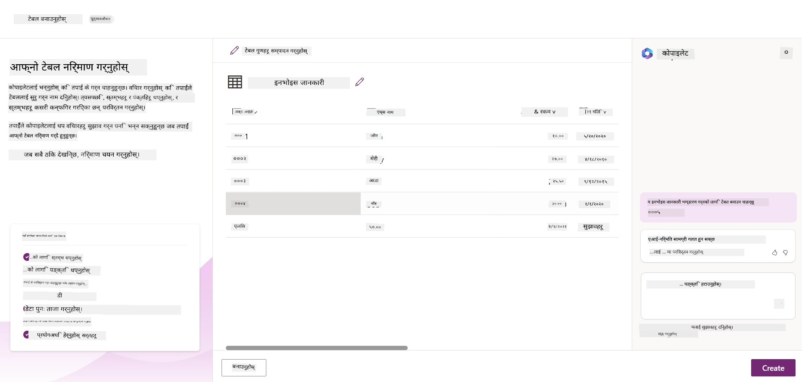

1. वित्त टोलीले आपूर्तिकर्तालाई इनभ्वाइसको वर्तमान स्थितिबारे अपडेट गर्न इमेल पठाउन चाहन्छ। Copilot प्रयोग गरेर तालिकामा नयाँ फील्ड (खण्ड) थप्न सकिन्छ जहाँ आपूर्तिकर्ताको इमेल राखिनेछ। उदाहरणका लागि, तपाईँ यस संकेत प्रयोग गर्न सक्नुहुन्छ: **_म आपूर्तिकर्ता इमेल भण्डारण गर्न स्तम्भ थप्न चाहन्छु_**। AI Copilot लाई संकेत पठाउन **Send** बटनमा क्लिक गर्नुहोस्।

1. AI Copilot ले नयाँ फील्ड सिर्जना गर्नेछ र तपाईँले यसलाई आवश्यकताअनुसार अनुकूलन गर्न सक्नुहुन्छ।

1. तालिका तयार भएपछि, तालिका सिर्जना गर्न **Create** बटनमा क्लिक गर्नुहोस्।

## Power Platform मा AI Models with AI Builder

AI Builder Power Platform मा उपलब्ध एक कम-कोड AI क्षमता हो जसले तपाईँलाई AI Models प्रयोग गरेर प्रक्रिया स्वचालित गर्न र परिणाम अनुमान गर्न मद्दत गर्दछ। AI Builder सँग तपाईँले Dataverse वा SharePoint, OneDrive, Azure जस्ता विभिन्न क्लाउड डेटा स्रोतहरूमा डेटा जडान गर्ने एप र फ्लोहरूमा AI ल्याउन सक्नुहुन्छ।

## पूर्वनिर्मित AI Models र कस्टम AI Models

AI Builder ले दुई प्रकारका AI Models प्रदान गर्दछ: पूर्वनिर्मित (Prebuilt) AI Models र कस्टम (Custom) AI Models। पूर्वनिर्मित AI Models माइक्रोसफ्ट द्वारा तयार पारिएका र Power Platform मा उपलब्ध छन्। यीले तपाईँलाई तपाईँका एप र फ्लोहरूमा बुद्धिमत्ता थप्न अनुमति दिन्छन् बिना डेटा संकलन, मोडेल तयार पार्ने, तालिम दिने, र प्रकाशन गर्ने झन्झटमा पर्ने। यी मोडेलहरूको प्रयोगले प्रक्रियाहरू स्वचालित गर्न र नतिजा अनुमान गर्न सकिन्छ।

Power Platform मा केही उपलब्ध पूर्वनिर्मित AI Models यसप्रकार छन्:

- **Key Phrase Extraction**: यस मोडेलले टेक्स्टबाट प्रमुख वाक्यांशहरू निकाल्छ।
- **Language Detection**: यसले टेक्स्टको भाषा पत्ता लगाउँछ।
- **Sentiment Analysis**: यसले टेक्स्टमा सकारात्मक, नकारात्मक, तटस्थ वा मिश्रित भावना पत्ता लगाउँछ।
- **Business Card Reader**: यसले व्यावसायिक कार्डबाट जानकारी निकाल्छ।
- **Text Recognition**: यसले तस्बिरबाट टेक्स्ट निकाल्छ।
- **Object Detection**: यसले तस्बिरबाट वस्तुहरू पत्ता लगाएर निकाल्छ।
- **Document processing**: यसले फारमहरूबाट जानकारी निकाल्छ।
- **Invoice Processing**: यसले इनभ्वाइसहरूबाट जानकारी निकाल्छ।

कस्टम AI Models सँग तपाईँ आफ्नो मोडेल AI Builder मा ल्याउन सक्नुहुन्छ जसले यो AI Builder कस्टम मोडेल जस्तै काम गर्छ, आफ्नो डेटा प्रयोग गरेर मोडेल तालिम दिन सकिन्छ। यी मोडेलहरू Power Apps र Power Automate दुवैमा प्रक्रियाहरू स्वचालित गर्न र नतिजा अनुमान गर्न प्रयोग हुन्छन्। आफ़्नो मोडेल प्रयोग गर्दा केही सीमितताहरू लागू हुन्छन्। यी [सीमितताहरू](https://learn.microsoft.com/ai-builder/byo-model#limitations?WT.mc_id=academic-105485-koreyst) बारे थप पढ्नुहोस्।

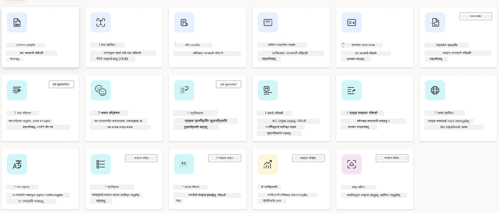

## असाइनमेन्ट #2 - हाम्रो स्टार्टअपका लागि इनभ्वाइस प्रक्रियाको फ्लो निर्माण गर्नुहोस्

वित्त टोलीले इनभ्वाइसहरू प्रक्रिया गर्न संघर्ष गरिरहेको छ। उनीहरूले इनभ्वाइसहरू ट्र्याक गर्न स्प्रेडशीट प्रयोग गरिरहेका छन् तर इनभ्वाइस संख्या बढेसँगै यो गाह्रो भएको छ। उनीहरूले तपाईँलाई AI प्रयोग गरेर इनभ्वाइसहरू प्रक्रिया गर्न कसरत गर्ने workflow निर्माण गर्न भनेका छन्। यस workflow ले इनभ्वाइसहरूबाट जानकारी निकाल्न र Dataverse तालिकामा भण्डारण गर्न सक्षम पार्नु पर्छ। साथै, वित्त टोलीलाई निकालिएको जानकारीसहित आपूर्तिकर्ता इमेल पठाउन पनि सक्षम बनाउनुपर्नेछ।

अब तपाईँलाई AI Builder के हो र किन प्रयोग गर्ने थाहा भयो, आउनुहोस् हेर्दै छौं कसरी Invoice Processing AI Model प्रयोग गरेर वित्त टोलीका लागि इनभ्वाइस प्रक्रिया गर्ने workflow बनाउन सकिन्छ।

Invoice Processing AI Model प्रयोग गरेर इनभ्वाइस प्रक्रिया गर्ने workflow बनाउन तलका चरणहरू पालना गर्नुहोस्:

1. [Power Automate](https://make.powerautomate.com?WT.mc_id=academic-105485-koreyst) होम स्क्रिनमा जानुहोस्।

2. होम स्क्रिनमा उपलब्ध टेक्स्ट क्षेत्रमा तपाईँ बनाउने workflow वर्णन गर्नुहोस्। उदाहरणका लागि, **_मेरो मेलबक्समा इनभ्वाइस आएपछि प्रक्रिया गर_**। AI Copilot लाई संकेत पठाउन **Send** बटनमा क्लिक गर्नुहोस्।

   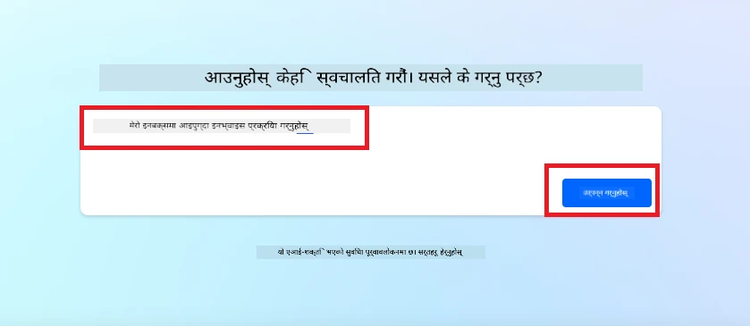

3. AI Copilot ले को लागि आवश्यक क्रियाहरू सुझाव दिनेछ। तपाईंले **Next** बटनमा क्लिक गरेर अघि बढ्न सक्नुहुन्छ।

4. अर्को चरणमा Power Automate ले फ्लोका लागि आवश्यक कनेक्शन सेटअप गर्न आग्रह गर्नेछ। सकिएपछि **Create flow** बटनमा क्लिक गरी फ्लो सिर्जना गर्नुहोस्।

5. AI Copilot ले फ्लो तयार गर्नेछ र तपाईँ आवश्यक अनुसार फ्लो अनुकूलन गर्न सक्नुहुन्छ।

6. फ्लोको ट्रिगर अपडेट गरी, इनभ्वाइसहरू राखिने फोल्डर **Folder** मा सेट गर्नुहोस्। उदाहरणका लागि, फोल्डर **Inbox** सेट गर्न सकिन्छ। **Show advanced options** मा क्लिक गरी **Only with Attachments** लाई **Yes** मा राख्नुहोस्। यसले केवल इमेलबाट संलग्नक (attachment) हुँदा फ्लो चल्ने सुनिश्चित गर्नेछ।

7. फ्लोबाट तलका क्रियाहरू हटाउनुहोस्: **HTML to text**, **Compose**, **Compose 2**, **Compose 3**, र **Compose 4** किनकि तपाईंले यिनीहरू प्रयोग गर्नु हुनेछैन।

8. फ्लोबाट **Condition** क्रिया हटाउनुहोस् किनकि तपाईंले यसलाई पनि प्रयोग गर्नु हुनेछैन। यो यस प्रकार देखिनुपर्छ:

   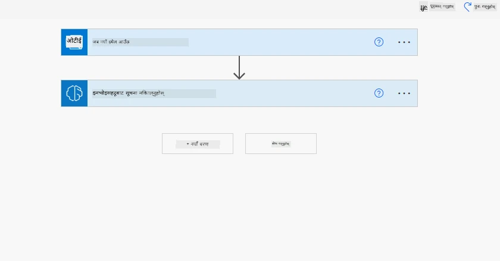

9. **Add an action** बटनमा क्लिक गरी **Dataverse** खोज्नुहोस्। **Add a new row** क्रिया छान्नुहोस्।

10. **Extract Information from invoices** क्रियामा **Invoice File** मा इमेलको **Attachment Content** उपयोग गरी इनभ्वाइसबाट जानकारी निकाल्न सेट गर्नुहोस्।

11. पहिल्यै बनाएको तालिका चयन गर्नुहोस्। उदाहरणका लागि, **Invoice Information** तालिका। अघिल्लो क्रियाबाट प्राप्त डायनमिक कन्टेन्टहरू निम्न क्षेत्रहरू भर्न प्रयोग गर्नुहोस्:

    - ID
    - Amount
    - Date
    - Name
    - Status - **Status** लाई **Pending** मा सेट गर्नुहोस्।
    - Supplier Email - **When a new email arrives** ट्रिगरको **From** डायनमिक कन्टेन्ट प्रयोग गर्नुहोस्।

    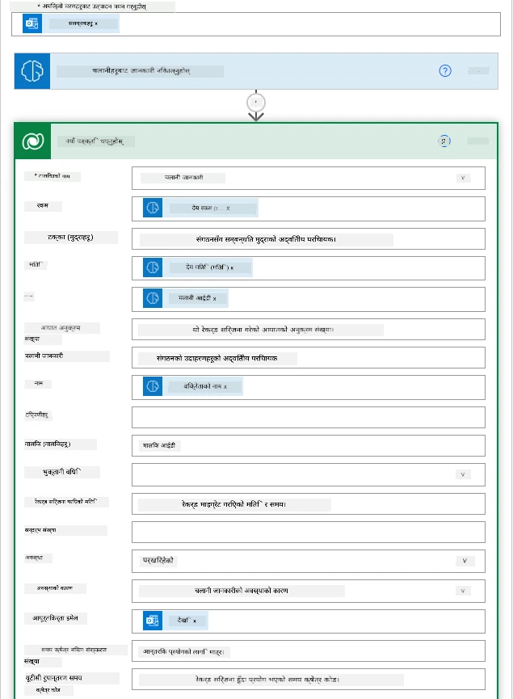

12. फ्लो पूरा भएपछि, फ्लो सुरक्षित गर्न **Save** बटनमा क्लिक गर्नुहोस्। तपाईँले फ्लो परीक्षण गर्न इनभ्वाइस सहित इमेल पठाएर परीक्षण गर्न सक्नुहुन्छ।

> **तपाईँको गृहकार्य**: तपाईँले अब निर्माण गरेको फ्लो राम्रो शुरुवात हो, अब सोचे सक्नुहुन्छ कसरी एउटा यस्तो स्वचालित प्रक्रिया निर्माण गर्ने जसले हाम्रो वित्त टोलीलाई आपूर्तिकर्तालाई इनभ्वाइसको वर्तमान स्थिति अपडेट गर्ने इमेल पठाउन सक्षम बनाओस्। संकेत: इनभ्वाइसको स्थिति परिवर्तन हुँदा फ्लो चल्नुपर्छ।

## Power Automate मा टेक्स्ट जेनेरेसन AI मोडेल प्रयोग गर्नुहोस्

AI Builder मा रहेको Create Text with GPT AI मोडेलले संकेतअनुसार टेक्स्ट उत्पादन गर्न सक्षम बनाउँछ र यो Microsoft Azure OpenAI Service द्वारा सञ्चालन हुन्छ। यस क्षमताले तपाईँको एप र फ्लोहरूमा GPT (Generative Pre-Trained Transformer) प्रविधि समावेश गर्न अनुमति दिन्छ जसले विभिन्न स्वचालित फ्लोहरू र सूचनात्मक एप्लिकेशनहरू निर्माण गर्न सहयोग पुर्याउँछ।

GPT मोडेलहरू विशाल तथ्यांकमा निकै तालिम पाउँछन् जसले मानिसकै भाषा जस्तो टेक्स्ट उत्पादन गर्न सक्छ जब संकेत दिइन्छ। वर्कफ्लो स्वचालनसँग एकीकृत हुँदा, GPT जस्ता AI मोडेलहरू लाई विभिन्न कार्यहरू सजिलो र स्वचालित बनाउन प्रयोग गर्न सकिन्छ।

उदाहरणका लागि, तपाईँ फ्लोहरू निर्माण गर्न सक्नुहुन्छ जसले ईमेल ड्राफ्टहरू, उत्पादन विवरणहरू साझा सहित विभिन्न प्रयोगहरूका लागि टेक्स्ट स्वचालित रूपमा उत्पन्न गर्छ। तपाईँले मोडेल प्रयोग गरेर ग्राहक सेवा एप वा च्याटबोटजस्ता धेरै एपहरूका लागि पनि टेक्स्ट उत्पन्न गर्न सक्नुहुन्छ जसले ग्राहक सेवा प्रतिनिधिहरूलाई प्रभावकारी र दक्षतापूर्वक जवाफ दिन सक्षम पार्दछ।

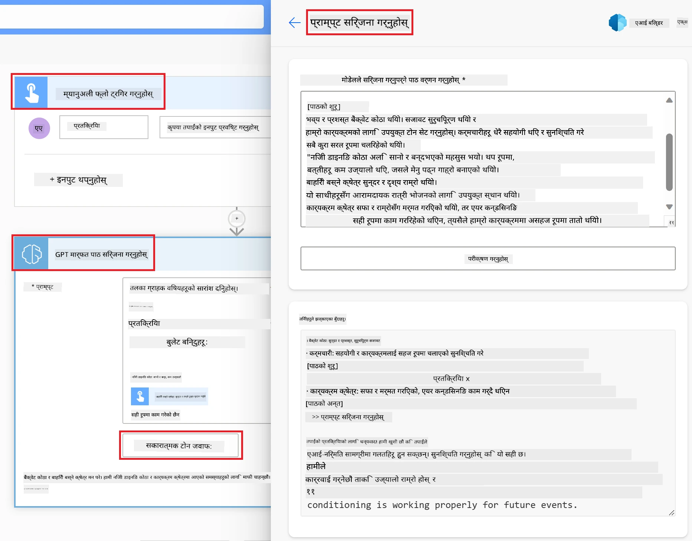

Power Automate मा यो AI मोडेल कसरी प्रयोग गर्ने सिक्नको लागि, [AI Builder र GPT सँग बुद्धिमत्ता थप्नुहोस्](https://learn.microsoft.com/training/modules/ai-builder-text-generation/?WT.mc_id=academic-109639-somelezediko) मोड्युल हेर्नुहोस्।

## महान काम! तपाईंको सिकाइ जारी राख्नुहोस्

यो पाठ पूरा गरेपछि, हाम्रो [Generative AI Learning संग्रह](https://aka.ms/genai-collection?WT.mc_id=academic-105485-koreyst) चेक गर्नुस् र तपाईंको Generative AI ज्ञानमा अझ उन्नति गर्ने अवसर पाउनुहोस्!

Copilot लाई कस्टमाइज गर्न र थप लाभ लिन चाहनुहुन्छ? [Awesome Copilot](https://github.com/github/awesome-copilot?WT.mc_id=academic-105485-koreyst) अन्वेषण गर्नुहोस् — GitHub Copilot को अधिकतम उपयोग गर्न सहयोग गर्ने निर्देशनहरू, एजेन्टहरू, कौशलहरू र कन्फिगरेसनहरूको समुदाय-योगदान गरिएको संग्रह।

पाठ 11 मा जानुहोस् जहाँ हामी [Function Calling सँग Generative AI कसरी एकीकृत गर्ने](../11-integrating-with-function-calling/README.md?WT.mc_id=academic-105485-koreyst) हेर्नेछौं!

---

<!-- CO-OP TRANSLATOR DISCLAIMER START -->
**अस्वीकरण**:
यो दस्तावेज़ AI अनुवाद सेवा [Co-op Translator](https://github.com/Azure/co-op-translator) प्रयोग गरेर अनुवाद गरिएको हो। हामी सही हुन प्रयास गर्छौं, तर कृपया जानकार हुनुस् कि स्वचालित अनुवादमा त्रुटिहरू वा अशुद्धताहरू हुन सक्छन्। मूल दस्तावेज़ यसको मूल भाषामा आधिकारिक स्रोत मानिनुपर्छ। महत्वपूर्ण जानकारीका लागि व्यावसायिक मानव अनुवाद सिफारिस गरिन्छ। यस अनुवादको प्रयोगबाट उत्पन्न कुनै पनि गलत बुझाइ वा त्रुटिको लागि हामी जिम्मेवार छैनौं।
<!-- CO-OP TRANSLATOR DISCLAIMER END -->